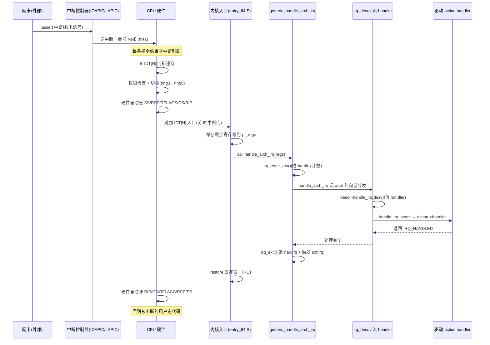
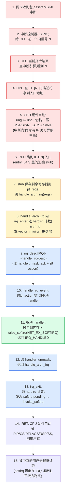

# 第二章 · 硬件中断与中断向量:CPU 怎么被拉进内核

> 篇:P1 中断与软中断
> 主线呼应:上一章我们立起"用户/内核边界是 OS 命脉 + 事件驱动 vs 轮询"的总纲,并落下二分法——**进内核 vs 内核主动**。这一章正式进入第 1 篇,正面钻"进内核"那一面的**第一道关口**:一个外部事件(网卡收到包、键盘敲了一下、PCIe 设备 assert 一根中断线),CPU 是怎么**被动**被拉进内核的?答案藏在一条硬件协议和一个软件函数指针里——每条指令执行完 CPU 都会查中断引脚,有信号就按向量号查 IDT(中断描述符表)、自动压关键寄存器、跳到内核入口;内核入口(`handle_arch_irq`)再交给通用 IRQ 框架分发到驱动 handler。读懂这一章,你就拿到了"CPU 被打断的那一瞬间到底发生了什么"的完整图景,也为下一章(IRQ domain 怎么把五花八门的硬件中断号映射成统一的 Linux IRQ 号)铺好地基。

## 核心问题

**CPU 在跑用户进程,网卡突然 assert 一根中断线——CPU 是怎么"知道"的?它怎么从跑用户代码无缝切到跑内核的中断处理函数?这个切的过程是硬件干的还是软件干的?为什么 CPU 要有一个 0-255 的"中断向量号",它和我们平时在 `/proc/interrupts` 里看到的 IRQ 号是同一个东西吗?**

读完本章你会明白:

1. **中断的电气本质**:CPU 每条指令结束都会查中断引脚,这一步是**硬件**自动做的,不是软件轮询。
2. **IDT(中断描述符表)**:每个向量号一项门描述符,CPU 用它拿到"中断处理函数入口地址 + 该用什么特权级",这是 CPU 切到内核的**唯一查表依据**。
3. **CPU 自动保存上下文**:跳进内核前 CPU 硬件自动压关键寄存器(SS/RSP/RFLAGS/CS/RIP),不用软件动手——这是中断快得起来的根基。
4. **向量号 vs IRQ 号**:CPU 看的 0-255 向量号(arch 级)和 Linux 抽象的 IRQ 号(软件级)**不是一回事**,后者是下一章 `irq_domain` 的事。
5. **`handle_arch_irq`**:arch 在启动时通过 `set_handle_irq` 注册一个全局函数指针,让"硬件中断入口"和"通用 IRQ 框架"解耦——这是 Linux 把五花八门的中断控制器(GIC/LAPIC/IOAPIC)统一进一套框架的关键钩子。

> **逃生阀**:如果你已经知道 IDT 是什么、CPU 怎么查 IDT 跳转,可以直接跳到 2.4 节(向量号 vs IRQ 号)和 2.5 节(`handle_arch_irq` 的注册与调用)——这两节是本章的命门,前面三节是硬件铺垫。

---

## 2.1 一句话点破

> **中断不是软件轮询,是 CPU 硬件自己"被打断":每条指令结束 CPU 都会查中断引脚,有信号就用向量号查 IDT、自动压寄存器、跳进内核预设的处理函数——整个过程是硬件做的,软件只是事先填好 IDT 表、写好处理函数。CPU 跳进内核后,arch 入口调一个全局函数指针 `handle_arch_irq`(由 `set_handle_irq` 注册),把控制权交给 Linux 的通用 IRQ 框架,后者按 IRQ 号找到 `irq_desc`、按"流 handler + action 链表"分发到驱动 handler。向量号是 CPU 的事,IRQ 号是 Linux 的事——别混了。**

这是结论,不是理由。本章倒过来拆:先看 CPU 怎么"被动"感知到中断(电气本质),再看 IDT 这张表凭什么能让 CPU 精准跳转、CPU 在跳之前硬件自动做了哪些事(自动保存上下文),然后厘清两套编号(向量号 vs IRQ 号),最后钻进 `handle_arch_irq` 这条 arch↔generic 的接缝。

---

## 2.2 中断的电气本质:CPU 每条指令后查引脚

第 1 章我们说"事件驱动 vs 轮询"时强调过:不能让 CPU 不停去问网卡"有包吗"。那 CPU 怎么**知道**网卡有事?答案是——**网卡主动发个电信号给 CPU,CPU 自己被这个信号打断**。

这是 CPU 设计层面就支持的。x86 CPU(以及其他主流架构)在硬件上做了两件事:

1. **CPU 有一组中断引脚**(或者等价的内部消息通道,现代 x86 上外部中断主要通过 LAPIC——Local APIC——接收)。外部设备(经中断控制器 IOAPIC/GIC 汇总后)把"有事件"的电信号送到这些引脚上。
2. **CPU 每执行完一条指令,都会检查一次"有没有中断在等"**。如果有,且中断没被屏蔽(CPU 有个 `RFLAGS` 寄存器,其中的 `IF`(Interrupt Flag)位控制是否响应可屏蔽外部中断),CPU 就**打断当前流程**,转入中断处理。

> **不这样会怎样**:如果 CPU 不在硬件层面支持"被打断",那就只能软件轮询——CPU 必须不停地问每个设备"你有事吗"。上一章算过这笔账:哪怕机器闲着等网卡包,CPU 也得跑满 100% 空转。**中断这个机制,本质上是把"事件检测"从软件层下沉到硬件层,让 CPU 在没事时可以真正执行 `hlt` 指令进入低功耗等待,事件来了由硬件把它叫醒**。idle 进程的 `cpu_idle_loop` 里最终就是 `hlt`(x86)/`wfi`(ARM),CPU 在这一刻真睡了,等到中断电信号到来才被唤醒。

这里有个关键的细节,直接决定后面所有中断机制的设计:**中断是异步的**。CPU 不知道中断什么时候来,来的时候它可能正在跑用户进程 A、可能正在内核里跑系统调用、可能在 idle、甚至正在处理另一个中断。所以 CPU 必须能在**任意一条指令边界**被打断——这也是为什么"每条指令结束都查中断引脚"这件事必须在硬件层面做,不能等"当前函数跑完"。**中断响应延迟的下限,就是一条指令的执行时间**。

> **钉死这件事**:中断的"被动感知"是 CPU 硬件做的,不是软件。CPU 每条指令后查引脚,有信号就转入中断处理——这让"事件驱动"成为可能(软件不必轮询)。这一步硬件做完之后,剩下的"找到正确的处理函数"才是软件(内核)的活,这就是下一节 IDT 要解决的问题。

---

## 2.3 IDT 与 CPU 自动保存上下文:CPU 跳进内核的查表协议

CPU 查到"有中断在等",问题来了:**它怎么知道这个中断该跳到哪个函数?**

### 2.3.1 中断向量号:CPU 看到的 0-255

每一个中断,都会带一个 8 位的编号,叫**中断向量号(vector)**,范围 0-255。这个编号是 CPU 用来查表的索引。x86 把这 256 个向量分成几类:

| 向量号区间 | 类别 | 谁产生 | 是否可屏蔽 | 例子 |
|-----------|------|--------|-----------|------|
| 0-31 | **异常/架构保留** | CPU 自己(同步) | 否 | #DE 除零(0)、#PF 缺页(14)、通用保护故障(13) |
| 32-255 | **外部中断(可屏蔽)** | 外部硬件(异步) | 是(IF 位) | 网卡、键盘、时钟、IPI |
| 2 | **NMI**(不可屏蔽中断) | 特殊硬件 | 否 | 看门狗、硬件故障告警 |

> **为什么 0-31 是异常**:这些向量号 CPU 架构**自己留着用**——CPU 在执行指令时遇到除零、缺页、非法指令这类**同步**错误,会**自己**产生一个对应向量号的中断(本质是"陷入"),跳到内核处理。所以 Linux 不能把这些向量号挪作他用。真正的外部硬件中断(网卡、键盘等)只能从向量号 32 开始分配。**NMI**(向量号 2)是特殊的"不可屏蔽中断",`IF` 位挡不住它,内核用它做看门狗和紧急告警。

### 2.3.2 IDT:每个向量一项门描述符

CPU 怎么"按向量号查到入口地址"?答案是**IDT(Interrupt Descriptor Table,中断描述符表)**——一张有 256 项的数组,每一项是一个**门描述符(gate descriptor)**,8 字节(64 位)或 16 字节。CPU 内部有一个寄存器 `IDTR` 指向这张表的基地址。

CPU 在中断到来时做这几件事(**纯硬件动作**,内核在启动时已经把 IDT 填好):

1. 从中断信号拿到向量号 N(外部中断由中断控制器送上来的;异常/NMI 是 CPU 自己产生的固定值)。
2. 用 N 当索引查 IDT,取出第 N 项门描述符。
3. 门描述符里有:**处理函数入口地址(段选择子 CS + 偏移 EIP/RIP)**、**类型(中断门 / 陷阱门 / 任务门)**、**DPL**(Descriptor Privilege Level,决定能不能用 `int` 指令主动触发,系统调用就靠这个)。
4. CPU 做权限检查(用户态被中断到内核态:CS 的 CPL 从 3 变 0,允许)。
5. **CPU 硬件自动压栈保存关键寄存器**,然后跳到描述符里的入口地址。

> **不这样会怎样**:如果 CPU 不做"按向量号查 IDT"这件事,那内核只能在内存里自己维护一张"向量号 → 处理函数"的表,然后 CPU 跳进**一个统一的入口**让内核软件去查表分发。这样会慢一拍(软件查表分发多一层函数调用),而且更重要的是——**CPU 切到内核态需要硬件级的特权级切换和栈切换**,这必须硬件来做(软件没法自己改 `CPL`),所以硬件在跳转的同时顺手查 IDT 是最自然的安排。**IDT 的本质是:CPU 把"按向量号分发"也下沉到硬件,让中断入口成为一条硬件协议,而非软件约定**。

门描述符里的**类型**字段也值得说一下:

- **中断门(interrupt gate)**:CPU 跳进去时**自动清 IF 位**(关可屏蔽中断),处理完 `IRET` 时再恢复。Linux 的硬件中断都用中断门——这样进入 hardirq 时可屏蔽中断自动被关,不用软件 `cli`。
- **陷阱门(trap gate)**:跳进去时**不清 IF**,中断仍然开着。系统调用(`int 0x80` 老路)和调试陷阱用陷阱门。
- **任务门(task gate)**:历史遗物,现在基本不用。

这个"中断门自动关 IF"的设计,是 Linux 后面"hardirq 里默认关中断、上半部不会被打断"的硬件基础——第 4 章(中断上下文)会回扣。

### 2.3.3 CPU 自动保存上下文:跳进内核前的硬件动作

这一步是最容易被忽略、却最关键的"为什么中断快"的根。**CPU 跳进内核处理函数之前,会自动在栈上压几个关键寄存器,软件一行代码都不用写**。

x86_64 上,从用户态(RPL=3)被中断进内核态,硬件自动压入:

```
 (用户栈切到内核栈后,CPU 自动按顺序压入)
 ┌─────────────────────┐
 │ SS                  │  ← 被中断处的用户栈段
 │ RSP                 │  ← 被中断处的用户栈指针
 │ RFLAGS              │  ← 标志寄存器(含 IF 位)
 │ CS                  │  ← 被中断处的代码段(含 CPL=3)
 │ RIP                 │  ← 被中断处的下一条指令地址
 │ ErrorCode(部分异常)│  ← 只有缺页等少数异常才有
 └─────────────────────┘
```

如果中断发生时 CPU 已经在内核态(RPL=0),那就**不切换栈、不压 SS/RSP/CS/RFLAGS/RIP 中的 SS/RSP**——只在内核栈上压必要的状态。这个"用户态↔内核态切换时硬件自动切栈、压寄存器"是 CPU 做的,内核只需事先把每个任务的内核栈准备好(`tss.sp0` 指向当前任务的内核栈顶)。

> **不这样会怎样**:如果 CPU 不自动压这些寄存器,软件就得在中断入口手写一段汇编,把所有 caller-saved 寄存器挨个压栈。这有两个问题:① **慢**——软件压寄存器是一条一条指令,每个中断都要执行几十条压栈指令;② **没法做"原子切换"**——软件压栈的过程中如果再来中断就乱了套。**CPU 硬件自动压栈是"一条指令的代价就完成上下文保存",这是中断延迟能压到纳秒级的根基**。所以 IDT 这套协议,本质上是 CPU 把"保存被打断现场 + 切到内核 + 跳到入口"这三件事打包成一条硬件协议——内核只需事先填好 IDT 和内核栈,剩下交给 CPU。

> **钉死这件事**:IDT 不是软件的查表分发机制,是 CPU 硬件的查表协议。CPU 在中断信号到来时**自动**查 IDT、自动做权限/栈切换、自动压 SS/RSP/RFLAGS/CS/RIP、自动跳到入口函数——这一切都是硬件在一条协议里做完。软件(内核)只负责两件事:启动时填好 IDT(`idt_setup`),在入口函数里继续保存剩余寄存器 + 真正处理中断。这就是"CPU 怎么被拉进内核"的硬件答案。

下面这张时序图把硬件 + 软件的全过程串起来(网卡中断为例):



---

## 2.4 向量号 vs IRQ 号:两套编号别混了

讲到这里,一个最容易把读者绊倒的概念问题必须挑明:**CPU 看到的"向量号(vector,0-255)"和你在 `/proc/interrupts` 里看到的"IRQ 号",不是一回事**。

### 2.4.1 向量号是 CPU/arch 的事

向量号(vector)是 **CPU 硬件层**的概念:

- 范围 0-255,由 CPU 架构决定(x86 就是 256 个)。
- 0-31 是 CPU 异常/保留,32-255 才能用作外部中断。
- CPU 用它查 IDT,这是**硬件查表协议**。
- 同一个向量号在不同 CPU 上可能指不同的设备(每核 LAPIC 都有自己的向量分配)。

### 2.4.2 IRQ 号是 Linux 软件抽象的事

IRQ 号(Interrupt ReQuest line number)是 **Linux 内核软件层**的抽象:

- 范围是 Linux 自己分配的整数(可能远超 256,MSI/MSI-X 设备一就能产生几百上千个)。
- 它是 `irq_desc` 数组/radix tree 的索引,指向一个"中断描述符",描述符里有这个中断的 chip、action 链表、流 handler。
- 它是**软件查表分发**用的,跨 CPU 全局唯一。
- `/proc/interrupts` 第一列就是它:` 0:  31 ... IO-APIC 2-edge  timer`、` 24: ... PCI-MSI ... eth0`。

### 2.4.3 两者的关系:由 `irq_domain` 把它们粘起来

那 vector 和 IRQ 号怎么对应?答案是——**不直接对应**。它们中间隔了一层**硬件中断号(hwirq)**和一张映射表(`irq_domain`)。完整的对应链是:

```
 (硬件侧)                                        (软件侧)
 设备 ──assert── 中断控制器 ──(vector 0-255)──► CPU 查 IDT
                                                   │
                                                   ▼
                                         内核入口拿到 vector
                                                   │
                                                   ▼
                          arch 把 vector 反查 LAPIC/IOAPIC,得到 hwirq
                                                   │
                                                   ▼
                  irq_domain: hwirq ──XORMAP──► Linux IRQ 号(irq)
                                                   │
                                                   ▼
                                       irq_desc[irq]:action 链表
                                                   │
                                                   ▼
                                       驱动 handler(网卡 e1000_intr)
```

向量号(vector)只活在"CPU ↔ 中断控制器"那一小段;hwirq 只活在"中断控制器 ↔ irq_domain"那一段;Linux IRQ 号才活在 IRQ 框架和驱动代码里。这三者通过 `irq_domain` 串起来,**下一章(P1-03)正面讲 `irq_domain` 怎么做这张映射**。

> **不这样会怎样**:为什么不让 vector 直接当 IRQ 号?① vector 范围只有 0-255,但一台机器可能有上千个 MSI-X 中断,装不下;② vector 是 per-CPU 的(LAPIC 的),不同 CPU 上同一个 vector 可能指不同设备,没法做全局一致的 IRQ 号;③ vector 和中断控制器的寄存器/线号耦合太死,软件层抽象出来一个 IRQ 号才能让驱动代码跨平台、跨中断控制器复用。**软件抽象出 IRQ 号,本质上是为了把"硬件怎么编号中断"和"软件怎么管理中断"解耦**——这正是操作系统做抽象的意义。

> **钉死这件事**:向量号是 CPU 硬件层的 0-255 编号(查 IDT 用),IRQ 号是 Linux 软件层的全局中断编号(查 `irq_desc` 用),它们通过 hwirq + `irq_domain` 间接对应。本章后面只关心"CPU 拿到 vector、跳进内核"这一段;vector → IRQ 号的映射留给下一章 P1-03。

---

## 2.5 `handle_arch_irq`:arch 与通用 IRQ 框架的接缝

讲完硬件侧(vector、IDT、CPU 自动压栈),我们钻软件侧。Linux 的 IRQ 子系统是分层的:底层是**与 arch、与中断控制器强相关**的入口(查 IDT、确认中断、拿到向量号/hwirq),上层是**通用的** IRQ 框架(`irq_desc`、流 handler、action 链表、softirq 接力)。这两层怎么接?

答案是一个**全局函数指针 `handle_arch_irq`**。arch 在启动时调用 `set_handle_irq` 把自己的中断入口函数注册进去;CPU 跳进 IDT 入口(entry_64.S 里的汇编 stub)后,最终会调到 `handle_arch_irq(regs)`,后者把控制权交给通用框架。

### 2.5.1 注册一个全局函数指针

[`handle_arch_irq` 这个函数指针定义在 `kernel/irq/handle.c`](../linux/kernel/irq/handle.c#L24):

```c
/* kernel/irq/handle.c,简化 */
#ifdef CONFIG_GENERIC_IRQ_MULTI_HANDLER
void (*handle_arch_irq)(struct pt_regs *) __ro_after_init;
#endif
```

`__ro_after_init` 这个修饰值得讲一下(它是个技巧):意思是"这个变量在内核启动后(`init` 阶段结束)被锁定为只读,之后谁也改不了"。为什么这么设计?

> **技巧点(为什么 sound)**:`handle_arch_irq` 是**全局唯一的** arch 中断入口,内核启动时由 arch 代码(`x86_init.irqs.intr_init` 调用链最终调 `set_handle_irq`)注册一次,之后运行期不能再改——否则中断到来时调到一个无效指针直接 panic。`__ro_after_init` 让这个内存在 `init` 完成后被**写保护**(标记为只读页),任何运行期写操作都会触发异常。这是一个**廉价的运行期不变量保护**:既不增加运行期开销(读就是普通内存读),又能在"有人写它"时立刻发现。这是内核里普遍使用的一个小技巧——凡是"启动期写一次、运行期只读"的全局数据,都加 `__ro_after_init`。

注册函数 [`set_handle_irq`](../linux/kernel/irq/handle.c#L218-L225) 也精巧:

```c
/* kernel/irq/handle.c */
int __init set_handle_irq(void (*handle_irq)(struct pt_regs *))
{
    if (handle_arch_irq)
        return -EBUSY;

    handle_arch_irq = handle_irq;
    return 0;
}
```

注意 `__init` 修饰:这个函数**只在内核启动阶段存在**,启动完成后它的代码段会被整体回收(`.init.text` 释放掉),释放的内存还给伙伴系统。这是内核节省内存的另一个常用技巧——`__init` 标记的函数和数据,运行一次后整个丢弃。

> **为什么 `set_handle_irq` 要检查 `handle_arch_irq` 是否已注册**:Linux 支持"多中断控制器层级"(比如 ARM 上 GIC 上面再挂一个子控制器),但**只能有一个根入口**——CPU 进内核后第一个被调的只能是它。所以注册函数检查"如果已经被注册过了,就拒绝(`-EBUSY`)"。这是内核"入口唯一性"的防御性编程——防止某个驱动误调注册函数把入口指针覆盖。

### 2.5.2 arch 中断入口怎么调它

`handle_arch_irq` 是函数指针,arch 代码不会直接知道它指向谁(可能 x86 上是 `sysvec_...`,ARM 上是 `gic_handle_irq`)——这正是函数指针解耦的妙处。看一下通用框架为"那些 arch 自己不做进/出记账"的场景提供的入口 [`generic_handle_arch_irq`](../linux/kernel/irq/handle.c#L232-L241):

```c
/* kernel/irq/handle.c,简化 */
asmlinkage void noinstr generic_handle_arch_irq(struct pt_regs *regs)
{
    struct pt_regs *old_regs;

    irq_enter();              /* 进入 hardirq 上下文(preempt_count += HARDIRQ_OFFSET) */
    old_regs = set_irq_regs(regs);   /* 把 regs 存到 per-CPU,供后面用 */
    handle_arch_irq(regs);    /* ★ 调用 arch 注册的根入口 ★ */
    set_irq_regs(old_regs);   /* 恢复 */
    irq_exit();               /* 退出 hardirq 上下文 + 触发 softirq */
}
```

这三个动作(`irq_enter` / `handle_arch_irq` / `irq_exit`)就是 Linux 处理任何一次中断的**外壳**:

- `irq_enter`(实现在 [`softirq.c`](../linux/kernel/softirq.c),其 RCU 版本 [`irq_enter_rcu`](../linux/kernel/softirq.c#L594-L603) 是真正干活的)把 `preempt_count` 加 `HARDIRQ_OFFSET`——告诉系统"我现在在 hardirq 上下文"。这一加,后面所有 `in_irq()`/`in_interrupt()` 都会返回真,睡眠类的 API 会被 `might_sleep()` 拦下来。
- `handle_arch_irq(regs)` 才是 arch 自己的活——x86 上是处理 LAPIC/IOAPIC、找到是哪个 hwirq、再转成 Linux IRQ 号、调对应 `irq_desc` 的流 handler。
- `irq_exit`([`__irq_exit_rcu`](../linux/kernel/softirq.c#L627-L640) 是干活的)把 `preempt_count` 减 `HARDIRQ_OFFSET`,然后在"已经不在任何中断上下文 + 有 softirq pending"时触发 softirq 接力——这就是第 6 章要详讲的"中断退出时 softirq 接力"。

> `noinstr` 这个前缀也是 6.x 引入的关键修饰:**no-instrumentation**,告诉编译器"这个函数及其调用链不要插任何追踪/插桩代码"(no KCSAN/lockdep/ftrace hook)。为什么?因为这是中断入口,任何插桩都可能引发递归或死锁(追踪代码本身可能又触发中断)。`noinstr` 是 6.x 让中断入口更 sound 的新防线——老内核这一层不防,跑某些调试配置会炸。第 4 章(中断上下文)会再回到这一点。

### 2.5.3 流 handler 和 action 链表:一个中断怎么分发到驱动

`handle_arch_irq(regs)` 进了 arch 的中断分发后,最终会调到一个 `irq_desc` 的 `handle_irq` 字段——这是个**流 handler(flow handler)**,负责处理"这种类型的中断该怎么应答硬件、什么时候调驱动 handler"。Linux 预置了几个通用流 handler(在 [`chip.c`](../linux/kernel/irq/chip.c)):

- `handle_level_irq`([chip.c:628](../linux/kernel/irq/chip.c#L628)):电平触发中断,进来先 mask+ack,处理完再 unmask。
- `handle_edge_irq`([chip.c:787](../linux/kernel/irq/chip.c#L787)):边沿触发中断,处理方式不同(边沿来了不能简单 mask,会丢)。
- `handle_fasteoi_irq`、`handle_simple_irq` 等。

这些流 handler 的共同点是:处理完硬件应答后,都会调 [`handle_irq_event`](../linux/kernel/irq/handle.c#L202-L215) 来真正跑驱动注册的 handler。`handle_irq_event` 拿到 `irq_desc`,把 `desc->action` 这条链表上每个 `irqaction` 的 `handler` 都跑一遍(共享 IRQ 的情况):

```c
/* kernel/irq/handle.c,简化 */
irqreturn_t handle_irq_event(struct irq_desc *desc)
{
    desc->istate &= ~IRQS_PENDING;
    irqd_set(&desc->irq_data, IRQD_IRQ_INPROGRESS);
    raw_spin_unlock(&desc->lock);      /* ★ 跑驱动 handler 时放锁 ★ */

    ret = handle_irq_event_percpu(desc);

    raw_spin_lock(&desc->lock);
    irqd_clear(&desc->irq_data, IRQD_IRQ_INPROGRESS);
    return ret;
}
```

真正遍历 action 链表的是 [`__handle_irq_event_percpu`](../linux/kernel/irq/handle.c#L139-L187):

```c
/* kernel/irq/handle.c,简化 */
irqreturn_t __handle_irq_event_percpu(struct irq_desc *desc)
{
    irqreturn_t retval = IRQ_NONE;
    unsigned int irq = desc->irq_data.irq;     /* ★ Linux IRQ 号 ★ */
    struct irqaction *action;

    for_each_action_of_desc(desc, action) {    /* 遍历 action 链表 */
        irqreturn_t res;

        res = action->handler(irq, action->dev_id);   /* ★ 调驱动 handler ★ */

        if (WARN_ONCE(!irqs_disabled(), ...))
            local_irq_disable();   /* handler 不该开中断,开了就关回去 */

        switch (res) {
        case IRQ_WAKE_THREAD:
            __irq_wake_thread(desc, action);   /* handler 想跑线程化部分 */
            break;
        default:
            break;
        }

        retval |= res;
    }

    return retval;
}
```

这里有几个非常 sound 的细节,每个都值得点:

1. **`action->handler(irq, action->dev_id)`**:驱动通过 `request_threaded_irq`([manage.c:2147](../linux/kernel/irq/manage.c#L2147))注册的就是这个 handler,签名固定 `irqreturn_t handler(int irq, void *dev_id)`。`dev_id` 是驱动自己给的"标识这个设备的 cookie"(共享 IRQ 时用,handler 根据 `dev_id` 判断"这次中断是不是我这个设备发的")。
2. **`WARN_ONCE(!irqs_disabled(), ...)`**:hardirq 进来时 IF 已被中断门硬件清掉(关可屏蔽中断),handler 跑完这里检查"中断仍然关着吗"——驱动 handler 不应该自己 `local_irq_enable()` 把中断打开,这是 hardirq 上下文的不变量。如果驱动犯了这个错,内核警告一次并自动把中断关回去。
3. **`IRQ_WAKE_THREAD`**:handler 返回这个值表示"快速部分干完了,重活儿我想放到内核线程里跑"(threaded IRQ,`request_threaded_irq` 的 `thread_fn`)。`__irq_wake_thread` 唤醒那个线程——这是第 5 章(上下半部)会详讲的"线程化中断"。
4. **`retval |= res`**:多个共享 handler 的返回值用位或合并,只要有一个 `IRQ_HANDLED` 就算这个中断被处理过了(否则 `note_interrupt` 会记一次"未处理中断",触发 spurious 检测)。

> **为什么不直接在流 handler 里遍历 action、要在 `handle_irq_event` 里单独一层**:关注点分离。流 handler(`handle_level_irq` 等)关心的是**硬件协议**(mask/ack/unmask、应答中断控制器);`handle_irq_event` 关心的是**软件协议**(遍历 action 链、跑 handler、线程化、记统计)。两个关注点分开,让"换触发类型(电平/边沿)"和"换分发策略(普通/线程化)"能独立演进。这是分层抽象的典范。

---

## 2.6 一个中断的完整旅程:把所有片段串起来

把 2.2-2.5 的片段串起来,一个外部中断从硬件触发到驱动 handler 返回的完整旅程是(以 x86 网卡 MSI-X 中断为例):



这张图里有几条主线再强调一次:

- **硬件段(红)**:网卡 → 中断控制器 → CPU 查引脚 → 查 IDT → 切栈压寄存器 → 跳入口。**全是 CPU 硬件做的,软件不参与**。这一段决定了中断响应延迟的下限。
- **arch 段(黄)**:stub 保存寄存器、调 `handle_arch_irq`、arch 分发(把 vector 反查回 hwirq/IRQ 号)。这一段把"硬件的 vector 世界"翻译成"软件的 IRQ 世界"。
- **generic 段(蓝)**:流 handler 应答硬件、`handle_irq_event` 遍历 action 链、`irq_exit` 退出 + 触发 softirq。这一段是 Linux 通用的,跨 arch 复用。
- **驱动段(绿)**:`action->handler`,拷包、置 softirq 位、返回。这是驱动开发者的代码。

第 6 章(softirq)和第 5 章(上下半部)会从第 13 步往后展开,讲 softirq 怎么接力、为什么 hardirq 只做最少的事。本章只关心第 1-12 步——**CPU 怎么被拉进内核**。

---

## 2.7 技巧精解:IDT 门描述符与 `handle_arch_irq` 函数指针

本章挑两个最硬核的技巧拆透:一个硬件、一个软件。它们共同回答了"CPU 凭什么能精准、快速、sound 地被拉进内核"。

### 技巧一:IDT 门描述符——CPU 把"按向量号分发 + 特权级切换 + 自动保存现场"打包成一条硬件协议

IDT 的精妙之处不在于"它是一张表"——表谁都会画。精妙在于:**门描述符这一项 8/16 字节里,同时编码了"跳哪去 + 该用什么特权级 + 是什么类型(中断门/陷阱门)+ 自动做什么(关 IF、切栈)"**,让 CPU 在一条硬件协议里完成"中断响应"的全部硬件动作。

朴素地设计,你可能会想:"CPU 跳进一个统一的入口函数,然后内核软件查 IDT 表分发"——但这样撞两堵墙:

- **特权级切换必须硬件做**:软件没法自己改 `CPL`(Current Privilege Level,ring 0/3),没法自己切栈(`RSP0`/`RSP3` 切换是 CPU 在硬件协议里做的)。如果 CPU 不在跳转的瞬间切好栈,软件进内核时还在用用户栈,任何一个内核栈溢出都会直接踩用户内存。
- **原子性**:中断响应的"保存现场 + 切栈 + 跳入口"必须是原子的(中间不能再被中断打断),软件一条条指令做根本做不到。

IDT 门描述符的设计把这些都打包进硬件协议:CPU 读到门描述符的瞬间,在**同一条硬件状态转换**里完成"权限检查 → 切栈 → 压寄存器 → 跳入口"。软件一行代码没写,就已经站在内核栈上、RIP 指向内核处理函数、IF 已关、所有用户态现场已压栈。

> **反面对比**:如果 CPU 不做这套硬件协议、只给一个统一的入口,那内核中断入口必须手写一段汇编:① 软件查表拿入口地址;② 自己切栈(但没法切——CPL 改不了);③ 手动压寄存器(几十条压栈指令);④ 跳到具体 handler。不仅慢一倍以上,而且"切栈 + 压寄存器"这段过程中再来一个中断就直接乱套(没法做嵌套)。**IDT 门描述符是把"中断响应"从软件问题下沉为硬件协议,这是 CPU 设计层面的工程美学**——它让中断延迟压到纳秒级,也让内核软件不必操心"切栈/压栈"这种高度微妙的事(交给 CPU 微码保证正确性)。

具体到 Linux 内核怎么填 IDT:arch/x86 代码(`arch/x86/kernel/idt.c`、`entry_64.S`)在启动早期调用 `idt_setup_...` 一族函数,用一堆宏(`INTG`/`SYSVEC`/...)**静态构造**这张表——把每个向量号 N 的门描述符填上"对应入口函数地址 + 类型 + DPL"。这张表在内核数据段里就一个数组,CPU 启动时用 `lidt` 指令把 `IDTR` 指向它。本书 `arch/x86` 未 sparse clone,这里只描述其作用(填表 + `lidt`),不标具体行号。

### 技巧二:`handle_arch_irq` 函数指针——用"一个全局指针"接住 arch↔generic 的接缝

第二个技巧是软件的。Linux 的 IRQ 子系统分两层:arch 层(查 IDT、应答中断控制器)和 generic 层(`irq_desc`、流 handler、action 链、softirq)。这两层怎么解耦?最朴素的做法是——**每个 arch 直接调 generic 框架的入口函数**,像硬编码一样。

但 Linux 没这么干,而是用**一个全局函数指针 `handle_arch_irq`**:

```c
/* kernel/irq/handle.c */
void (*handle_arch_irq)(struct pt_regs *) __ro_after_init;

int __init set_handle_irq(void (*handle_irq)(struct pt_regs *))
{
    if (handle_arch_irq)
        return -EBUSY;
    handle_arch_irq = handle_irq;
    return 0;
}
```

arch 启动时 `set_handle_irq(my_arch_entry)`,generic 框架只调 `handle_arch_irq(regs)`,不关心 arch 是谁。

这个设计妙在三点:

1. **依赖反转**:不是 generic 调 arch,而是 arch 主动把"自己"注册给 generic。generic 框架对 arch 一无所知,只通过这个指针调用——这是面向对象里的"依赖注入"在 C 内核里的朴素实现。新增一个 arch(比如某个新的 RISC-V 平台),只需调 `set_handle_irq`,generic 框架一行不用改。
2. **`__ro_after_init` 保证运行期不变量**:启动后 `handle_arch_irq` 被写保护,任何运行期改动立刻触发异常。这是廉价又强大的 sound 保证——中断是系统最热的路径之一,这个指针不能被任何运行期 bug 破坏。
3. **`-EBUSY` 保证唯一性**:根入口只能注册一次,防止误覆盖。

> **反面对比**:如果不用函数指针、而是 arch 直接调 generic(比如 generic 框架直接 `#include <asm/...>` 调某个具体的 arch 入口),那 generic 框架代码就会**被每个 arch 的细节污染**——每加一个 arch 就要 `#ifdef CONFIG_X86` / `#ifdef CONFIG_ARM64`,代码很快就乱成一团。函数指针 + 注册机制把依赖反过来,让 generic 框架保持纯净(完全 arch-agnostic),所有 arch 的差异收敛到"注册时传什么函数指针"这一点上。**这是 C 语言实现多态/解耦的经典套路,内核里到处都是**(`file_operations`、`net_proto_family`、`sched_class` 调度器类——上一本《调度器》讲过的多态)。

把这两个技巧合起来看:**硬件侧用 IDT 门描述符做"按向量号的硬件分发",软件侧用 `handle_arch_irq` 函数指针做"arch 到 generic 的解耦"**——硬件协议 + 软件抽象两层叠加,让"CPU 被拉进内核"这件事既快(硬件自动)、又灵活(软件解耦)、又 sound(`__ro_after_init` + 中断门关 IF + 多个不变量保护)。这是 Linux 中断子系统设计美学的起点,后面所有章节都建立在这个基础上。

---

## 章末小结

这一章我们正面拆了"CPU 怎么被硬件拉进内核"这件事。核心是两层:**硬件层**(中断引脚、向量号、IDT 门描述符、CPU 自动保存上下文)把"事件感知 + 切内核 + 保存现场"打包成一条硬件协议;**软件层**(`handle_arch_irq` 函数指针、通用 IRQ 框架、流 handler、action 链表)做 arch↔generic 的解耦和按 IRQ 号分发。落到二分法:**这一章服务"进内核"那一面**——事件把控制权从用户态拉进内核,具体是"中断/异常"这一类(异步外部事件 + CPU 同步异常)。

### 关键事实回顾

1. **中断电气本质**:CPU 每条指令结束查中断引脚,有信号就处理——硬件做的,不是软件轮询。
2. **向量号**:0-255,CPU 用它查 IDT;0-31 异常保留,32-255 外部中断,2 是 NMI。
3. **IDT 门描述符**:编码"入口地址 + 特权级 + 类型(中断门/陷阱门)",CPU 一条硬件协议完成权限检查、切栈、压 SS/RSP/RFLAGS/CS/RIP、跳入口。中断门自动清 IF 关可屏蔽中断。
4. **向量号 vs IRQ 号**:vector 是 CPU/arch 的事(0-255),IRQ 号是 Linux 软件抽象的事,中间通过 hwirq + `irq_domain` 对应——下一章详讲。
5. **`handle_arch_irq`**:[handle.c:24](../linux/kernel/irq/handle.c#L24) 的全局函数指针,arch 通过 [`set_handle_irq`](../linux/kernel/irq/handle.c#L218) 注册一次,`__ro_after_init` 锁定运行期只读。外壳 [`generic_handle_arch_irq`](../linux/kernel/irq/handle.c#L232) 用 `irq_enter` / `handle_arch_irq` / `irq_exit` 三步包住任何一次中断。
6. **流 handler + action 链表**:流 handler(`handle_level_irq`/`handle_edge_irq`,[chip.c](../linux/kernel/irq/chip.c))管硬件协议,`handle_irq_event`([handle.c:202](../linux/kernel/irq/handle.c#L202))遍历 `irq_desc->action` 链调驱动 handler([`__handle_irq_event_percpu`](../linux/kernel/irq/handle.c#L139))。

### 五个"为什么"清单

1. **为什么 CPU 每条指令后查中断引脚,而不是每隔 N 条指令查一次?** 中断响应延迟的下限就是"两次检查之间的指令数"。每条指令都查,延迟下限 = 一条指令;隔 N 条查,延迟下限 = N 条指令。对高响应需求(网卡怕丢包、时钟怕漂移),这个下限要尽量低。CPU 硬件做这件事的代价几乎为零(指令提交流水线里加一个检查),所以干脆每条都查。
2. **为什么 0-31 号向量被 CPU 异常占用?** CPU 遇到除零、缺页、非法指令这类**同步**错误,要"陷入"内核处理。CPU 用什么机制陷入?复用中断机制——自己产生一个固定向量号(除零=0、缺页=14)。所以这 32 个向量号 CPU 自己留着,操作系统不能挪用。
3. **为什么中断门要自动清 IF(关可屏蔽中断)?** 进 hardirq 时如果不关可屏蔽中断,驱动 handler 还没跑完同一个向量又来一次,CPU 会无限递归压栈直到栈溢出 panic。中断门硬件自动清 IF,保证 hardirq 不会被同一个向量自己打断。流 handler 在适当的时候(应答完硬件、能接受嵌套时)会软件再开。
4. **为什么向量号不能直接当 Linux IRQ 号?** vector 只有 0-256 个槽,装不下 MSI-X 上千个中断;vector 是 per-CPU 的,没法全局唯一;vector 和中断控制器细节耦合,不利于跨平台。软件抽象出 IRQ 号 + `irq_domain` 映射,把硬件编号和软件管理解耦。
5. **为什么 `handle_arch_irq` 是函数指针,不是 generic 直接调 arch?** 依赖反转:arch 主动注册给 generic,generic 对 arch 无知,新增 arch 不用改 generic 框架。`__ro_after_init` 把这个指针运行期写保护,`-EBUSY` 保证唯一注册。这是 C 内核里用函数指针实现多态/解耦的经典套路(`file_operations`、`sched_class` 同构)。

### 想继续深入往哪钻

- **源码**:
  - [`kernel/irq/handle.c`](../linux/kernel/irq/handle.c):本章最核心的一个文件。`handle_arch_irq` 定义(L24)、`set_handle_irq` 注册(L218)、`generic_handle_arch_irq` 外壳(L232)、`__handle_irq_event_percpu` action 链分发(L139)、`handle_irq_event`(L202)。
  - [`kernel/irq/chip.c`](../linux/kernel/irq/chip.c):通用流 handler 的家。`handle_level_irq`(L628)、`handle_edge_irq`(L787)、`handle_fasteoi_irq` 等。
  - [`kernel/softirq.c`](../linux/kernel/softirq.c):`irq_enter_rcu`(L594)、`__irq_exit_rcu`(L627)、`irq_exit`(L659)——这三者包住任何一次中断的进出,下一章 softirq 详讲。
  - [`include/linux/irqdesc.h`](../linux/include/linux/irqdesc.h):`struct irq_desc`(L55)的字段布局(`irq_data`、`handle_irq` 流 handler、`action` 链表)。[`include/linux/irq.h`](../linux/include/linux/irq.h):`struct irq_data`(L179)、`struct irq_chip`(L501)。[`include/linux/interrupt.h`](../linux/include/linux/interrupt.h):`struct irqaction`(L121)、`irq_handler_t`(L103)。
  - `arch/x86/`(未 sparse clone):`arch/x86/kernel/idt.c`(IDT 静态构造)、`arch/x86/entry/entry_64.S`(中断入口 stub)、`arch/x86/kernel/apic/`(LAPIC/IOAPIC 的 `handle_arch_irq` 实现)——本书只描述作用,不标行号。
- **观测**:
  - `/proc/interrupts`:每行一个 IRQ 号,看各 CPU 上的中断计数、chip、设备名。注意第一列是 **IRQ 号**,不是 vector。
  - `/proc/stat` 的 `intr` 行:全局中断计数。
  - `/sys/kernel/irq/<N>/`:每个 IRQ 的细节(chip、action、affinity)。
  - `perf stat -e irq:irq_handler_entry` / `perf stat -e irq:irq_handler_exit`:追踪每个 IRQ handler 进出,看延迟。
  - `ftrace` 的 `irq` 类事件、`function_graph` 追踪 `handle_irq_event`/`__handle_irq_event_percpu` 的调用链。
  - `bpftrace`:`tracepoint:irq:irq_handler_entry { @[args->irq] = count(); }` 统计各 IRQ 频率。
- **延伸**:
  - Intel SDM(Intel Software Developer's Manual)Volume 3,Chapter 6(Interrupt and Exception Handling):IDT、门描述符、CPU 自动压栈的硬件协议权威描述。
  - `Documentation/core-api/genericirq.rst`:Linux 通用 IRQ 框架的设计文档。
  - ARM GIC 规范:对照看 ARM 上 `handle_arch_irq` 指向 `gic_handle_irq`,体会 arch 解耦。

### 引出下一章

讲完"CPU 怎么被拉进内核"后,留下一个明确的悬念:**向量号(CPU 看的 0-255)和 IRQ 号(Linux 软件抽象的全局编号)不是一回事,它们中间隔着一层 hwirq 和 `irq_domain`**。下一章 P1-03,我们钻进 `irq_domain` 和 `irq_chip`——Linux 怎么把五花八门的中断控制器(GIC/LAPIC/IOAPIC/MSI-X)抽象成统一接口,怎么用层级 `irq_domain` 把硬件中断号 hwirq 翻译成软件 IRQ 号。这是支撑"进内核"这一面的地基,也是驱动开发者最常打交道的 IRQ 子系统入口。
