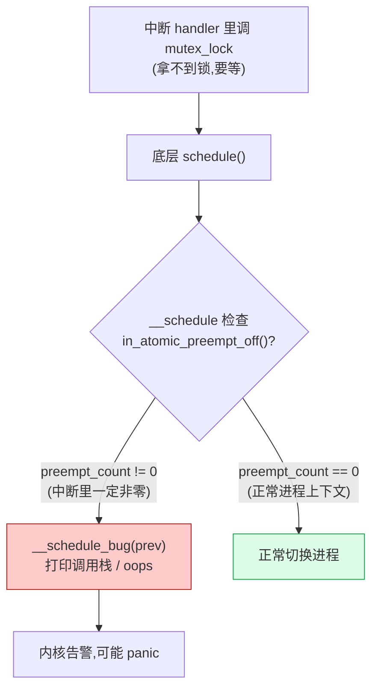

# 第四章 · 中断上下文:为什么不能睡眠

> 篇:P1 中断与软中断
> 主线呼应:上一章我们看清了内核怎么用 `irq_chip`/`irq_domain` 把五花八门的中断控制器抽象成统一的 IRQ 号、怎么把一个硬件中断信号交给对应的驱动 handler。但那个 handler 跑在一个**很特殊的上下文**里——它不是任何进程,它没有 `task_struct`,它不能 `sleep`,它不能拿 `mutex`,它甚至不能保证"不被另一个中断再打断"。这个上下文有个专门的名字:**中断上下文(interrupt context)**。这一章我们就回答一个被无数教科书一句话带过、却没人真讲透的问题:**中断上下文到底是什么?它为什么不能睡眠?** 这是后面三章(上半部/下半部、softirq、workqueue)为什么必须存在的根因——正是因为 hardirq 不能干重活,内核才不得不发明 softirq 和 workqueue 把工作延后出去。

## 核心问题

**中断处理函数跑在什么上下文里?它不是进程,那它是什么?`current` 这会儿指向谁?内核凭什么知道"我现在在中断里"——而且还能区分在 hardirq、softirq、还是 NMI 里?为什么在中断里 `sleep`、`mutex_lock`、甚至一个看似无害的 `kmalloc(GFP_KERNEL)` 都是灾难?**

读完本章你会明白:

1. **中断上下文不是进程上下文**:中断 handler 借用的是被中断进程的栈和寄存器,但它本身**不是一个可调度的 task**——`current` 指向被中断的那个进程,但中断"不属于"它。
2. **`preempt_count` 是内核的"上下文状态机"**:一个 32 位整数,用 4 段 bit 位同时表示 NMI/hardirq/softirq/抢占屏蔽四层嵌套计数,再加最高位的 `PREEMPT_NEED_RESCHED`。
3. **`in_irq()`/`in_softirq()`/`in_interrupt()`/`in_nmi()` 怎么读这一段 bit 位**,为什么 `in_serving_softirq()` 和 `in_softirq()` 不一样。
4. **为什么不能 sleep**:睡眠要"挂起当前 task、调度别人",但中断上下文没有可挂起的 task,调度器一旦发现你拿着非零 `preempt_count` 还想 `schedule`,会 `__schedule_bug` 报错。所有会睡眠的 API 开头都埋了 `might_sleep()` 在调试配置下做这件事的断言。

> **逃生阀**:如果你已经知道"`in_interrupt()` 非 0 就不能 sleep"这条结论,可以直接跳到 4.4 节(`preempt_count` 的 bit 位布局)和 4.6 节(技巧精解:`preempt_count` 嵌套计数)。但 4.2~4.3 把"中断上下文不是进程"和"为什么 sleep 必然出错"讲到根上,即使你懂术语也建议读,因为它是第 5~7 章整章下半部机制的支点。

---

## 4.1 一句话点破

> **中断上下文不是一个进程。它借的是被中断进程的内核栈和 `current` 指针,但它本身没有 `task_struct`、不可被调度、不可被挂起。内核用一个 32 位整数 `preempt_count` 的 4 段 bit 位,同时回答"我现在在 NMI 吗?在 hardirq 吗?在 softirq 吗?抢占关了几层?",并据此强制一条铁律:`in_interrupt()` 非 0 时绝不能 sleep——因为 sleep 要调度,而调度器无物可切。**

这是结论,不是理由。本章倒过来拆:先讲"中断上下文不是进程"意味着什么,再讲 sleep 为什么在中断里必然出错,然后讲内核怎么用一个整数 `preempt_count` 精确记账四种上下文的嵌套,最后讲这套记账怎么成为"为什么不能 sleep"的硬约束,为下一章上半部/下半部切分埋下根因。

---

## 4.2 中断上下文不是进程:它借了谁的壳

写用户态程序时,你脑子里有个默认的模型:"我写的每一行代码,都跑在某个进程里"。你 `fork` 出来的子进程、你 `pthread_create` 出来的线程,都有个 `task_struct`,都能被调度器排进运行队列、被切走、被换回来。

但中断 handler 不一样。设想网卡中断把 CPU 打断,CPU 自动保存现场、跳进内核的网卡驱动 handler。此刻:

- **栈是谁的?** handler 用的是**被中断进程的内核栈**。handler 压进去的局部变量、函数调用链,都堆在被中断那个进程的内核栈顶上。中断返回时栈被弹干净,被中断的进程继续跑,完全不知道"刚才有人借用过我的栈"。
- **`current` 指向谁?** 仍然指向**被中断的那个进程**。`current` 是个 per-CPU 的指针,它"是哪个进程"取决于 CPU 当前在用谁的内核栈——而中断借的就是被中断进程的栈,所以 `current` 不变。这意味着中断 handler 里读 `current->pid` 拿到的是被中断进程的 pid,**不是中断自己的 pid**——因为中断压根没有 pid。
- **能被调度吗?** **不能**。调度器的最小单位是 `task_struct`,它切走一个进程时,要保存这个进程的全部寄存器、把它从运行队列摘下、把它标记成"可运行"或"睡眠"。但中断 handler **不是任何 `task_struct`**——它没有自己的运行队列条目,调度器无从"切走它再换回来"。你若硬要调度,调度器切走的是被中断的那个进程,而中断 handler 的执行栈还压在那个进程的内核栈上,被中断进程一旦被换走,这块"借来的栈空间"就成了悬空状态——下一次这个进程被换回来时,栈早就乱套了。

> **不这样会怎样**:如果中断 handler 是一个独立的、可调度的 task(像 RTOS 里某些设计那样),那每次硬件中断都要创建/唤醒一个 task,中断延迟会从纳秒级暴涨到微秒级——网卡每秒几十万次中断,光 task 创建开销就够把 CPU 烧光。所以 Linux 选择"中断 handler 借用被中断进程的壳执行",换来的是**零开销进中断**——不需要创建 task、不需要动运行队列,CPU 自动压栈跳转就行。

但这个"借壳"有一个硬约束:**借来的壳不能被换走**。被中断的进程在中断期间处于"被借壳"状态,调度器绝不能在这时候切走它——否则中断 handler 就没了落脚之地。这就是后面所有约束的根。

> **钉死这件事**:中断上下文 = 借被中断进程的栈和 `current` 执行的代码,自己不是 task。它能跑,是因为被中断进程的栈此刻"挂"在 CPU 上、不会被调度走。一旦你想在中断里 sleep——要调度别人——你就破坏了"栈不能被换走"的前提,整个机制崩。所以中断里不能 sleep,不是谁的规定,是这套"借壳"设计的**必然推论**。

---

## 4.3 不能 sleep 的根:sleep 要调度,而调度器无物可切

"中断里不能 sleep"这句话人人都背过,但很少有人讲清楚它到底在哪一步炸。我们把它拆到调度器源码那一层。

一个会 sleep 的 API(`mutex_lock`、`wait_event`、`kmalloc(GFP_KERNEL)`),底层都要调 [`schedule()`](../linux/kernel/sched/core.c)。`schedule()` 做的事是:把当前进程(用 `prev` 指针表示)从 CPU 上换下来、挑下一个进程(`next`)换上来。它一进来就有一段严格的合法性检查:

```c
/* kernel/sched/core.c,简化自 __schedule */
if (unlikely(in_atomic_preempt_off())) {
    __schedule_bug(prev);
    preempt_count_set(PREEMPT_DISABLED);
}
```

> 见 [`core.c:5978-5981`](../linux/kernel/sched/core.c#L5978-L5981)。

`in_atomic_preempt_off()` 的定义是 `preempt_count() != PREEMPT_DISABLE_OFFSET`([preempt.h:192](../linux/include/linux/preempt.h#L192)),而 `in_atomic()` 更直接——`preempt_count() != 0`([preempt.h:186](../linux/include/linux/preempt.h#L186))。也就是说:**只要 `preempt_count` 不为零,调度器就认为你在原子上下文(不能被切走),你若敢调 `schedule()`,它会打 `__schedule_bug`**。

而中断上下文里 `preempt_count` 一定是非零的(下面 4.4 节会讲为什么),所以:



这就是"中断里 sleep 必然出错"的精确路径:不是 sleep 这个动作本身在中断里坏掉了,而是**调度器开头的原子上下文检查把"中断里调度"这件事识别成 bug**。这个检查是内核的一条**不变量**:中断上下文不是合法的调度点。

但这只是"内核怎么发现的"。真正的"为什么不能"在更深一层:**就算你绕过这个检查硬要调度,调度器切走的是被中断进程的 `task_struct`,但中断 handler 还压在那个进程的内核栈上**。被中断进程一旦被标记成"非运行",它的内核栈就成了"逻辑上不该再被 CPU 使用"的状态,而中断 handler 的执行却依赖这块栈——下一次这个进程被换回来时,栈帧早已被别的代码污染,程序计数器一返回就是垃圾地址。所以 sleep 在中断里不只是"违规",它是**逻辑上无解**的:调度器无物可切(中断自己不是 task),切了被中断进程又会破坏栈约束。

> **不这样会怎样**:如果调度器不检查 `in_atomic_preempt_off()`、信任任何上下文都能调度,那在中断里 sleep 会让被中断进程被切走、它的内核栈被中断 handler 占着、下一次切回来时栈已乱——内核会以一种**最隐蔽、最难复现**的方式崩溃(栈污染、返回地址错乱),而不是像现在这样在调试配置下立刻 `__schedule_bug` 把你揪出来。所以 `might_sleep()` 这套检查不是装饰——它是把一个"会随机崩"的逻辑错误变成"立刻可诊断"的工程保险。

那么"会睡眠的 API"在调试配置下是怎么主动自首的?它们开头都埋了一个 `might_sleep()`:

```c
/* include/linux/kernel.h,简化 */
# define might_sleep() \
    do { __might_sleep(__FILE__, __LINE__); might_resched(); } while (0)
```

> 见 [`kernel.h:105-106`](../linux/include/linux/kernel.h#L105-L106)。`__might_sleep` 实现在 [`core.c:10112`](../linux/kernel/sched/core.c#L10112)。

`mutex_lock`、`down`、`kmalloc(GFP_KERNEL)`、`schedule_timeout` 这些函数入口处都有 `might_sleep()`。它在 `CONFIG_DEBUG_ATOMIC_SLEEP` 打开时,会检查你是不是在原子上下文调它——是就打 `BUG: sleeping function called from invalid context` 把调用栈打出来。这样你写的驱动如果在中断里不小心调了 `mutex_lock`,不用等到死锁,内核一跑就告诉你"你在 hardirq context 里调了会睡眠的函数"。这是把"不能 sleep"这条约束从"埋在调度器深处的检查"提前到"每一次调用"的防御性设计。

> **钉死这件事**:不能 sleep 的精确含义 = 调度器在 `__schedule` 入口检查 `in_atomic()`,中断里 `preempt_count` 非零一定触发 `__schedule_bug`;更深的原因是中断 handler 借被中断进程的栈,调度器无物可切、切了会破坏栈。`might_sleep()` 把这个检查从调度器深处提到每一个会睡眠的 API 入口,在调试配置下让你第一时间发现。

---

## 4.4 `preempt_count`:内核的"上下文状态机"

上面两节反复出现一个词——`preempt_count`。它是内核回答"我现在在哪层上下文"的唯一依据,也是"能不能 sleep"判断的依据。这一节我们把它彻底拆开。

### 一个整数,四段 bit 位

`preempt_count` 是一个 32 位整数,存在每个**线程**的 `thread_info` 里(实际通过 `current_thread_info()->preempt_count` 或 per-CPU 的 `current` 指针读)。它不是个全局变量——**每个进程有自己的 `preempt_count`**。它的 32 个 bit 被切成 4 段计数 + 1 个标志位,布局如下(来自 [preempt.h:27-36](../linux/include/linux/preempt.h#L27-L36) 的注释和定义):

```
 preempt_count 的 bit 位布局(Linux 6.9,x86_64):

  31         23 22     20 19     16 15      8 7        0
 ┌────────────┬─────────┬─────────┬──────────┬──────────┐
 │ NEED_RESCHED│  NMI    │ HARDIRQ │ SOFTIRQ  │ PREEMPT  │
 │  (1 bit)    │ (4 bit) │ (4 bit) │ (8 bit)  │ (8 bit)  │
 │  0x80000000 │ 0x00f0..│ 0x000f..│ 0x0000ff..│0x000000ff│
 └────────────┴─────────┴─────────┴──────────┴──────────┘
      bit31       bit20-23   bit16-19   bit8-15    bit0-7

 进 NMI     : bit20-23 + 1   (NMI_OFFSET = 1 << 20)
 进 hardirq : bit16-19 + 1   (HARDIRQ_OFFSET = 1 << 16)
 进 softirq : bit8-15  + 1   (SOFTIRQ_OFFSET = 1 << 8)
 关抢占     : bit0-7   + 1   (PREEMPT_OFFSET = 1 << 0)
```

对应的宏定义([preempt.h:33-53](../linux/include/linux/preempt.h#L33-L53)):

```c
#define PREEMPT_BITS    8
#define SOFTIRQ_BITS    8
#define HARDIRQ_BITS    4
#define NMI_BITS        4

#define PREEMPT_SHIFT   0
#define SOFTIRQ_SHIFT   (PREEMPT_SHIFT + PREEMPT_BITS)   /* 8  */
#define HARDIRQ_SHIFT   (SOFTIRQ_SHIFT + SOFTIRQ_BITS)   /* 16 */
#define NMI_SHIFT       (HARDIRQ_SHIFT + HARDIRQ_BITS)   /* 20 */

#define PREEMPT_OFFSET  (1UL << PREEMPT_SHIFT)   /* 0x00000001 */
#define SOFTIRQ_OFFSET  (1UL << SOFTIRQ_SHIFT)   /* 0x00000100 */
#define HARDIRQ_OFFSET  (1UL << HARDIRQ_SHIFT)   /* 0x00010000 */
#define NMI_OFFSET      (1UL << NMI_SHIFT)       /* 0x01000000 */
```

这个 bit 位分配本身就有讲究:

- **抢占计数占 8 位**(bit 0-7,最多嵌套 255 层 `preempt_disable`)。`preempt_disable()`、自旋锁(`spin_lock` 在非 RT 内核里也关抢占)都会 `+1`,`spin_unlock`/`preempt_enable()` 会 `-1`。8 位足够任何合理的嵌套。
- **SOFTIRQ 也占 8 位**(bit 8-15)。注意:它**不只**记录"在跑 softirq",也记录"被 `local_bh_disable()` 关掉了下半部"(见 4.5 节的奇偶技巧)。
- **HARDIRQ 只占 4 位**(bit 16-19,最多 15 层)。注释([preempt.h:20-25](../linux/include/linux/preempt.h#L20-L25))解释了为什么只要 4 位:"所有中断 handler 都在关中断状态下运行,所以正常情况下**硬中断不会嵌套**——除了少数老古董驱动会在 handler 里 `local_irq_enable()`,那才会嵌套,所以给 4 位保险足够"。
- **NMI 也占 4 位**(bit 20-23,最多 15 层)。NMI(不可屏蔽中断)能打断 hardirq,所以它需要独立计数;`nmi_enter()` 的注释([hardirq.h:105](../linux/include/linux/hardirq.h#L105))直接写"nmi_enter() can nest up to 15 times; see NMI_BITS"。
- **最高位 bit 31 是 `PREEMPT_NEED_RESCHED`**,这不是计数,是个标志位——调度器想抢占这个进程时置上,由 `preempt_schedule` 在合适的点检查。它放在 `preempt_count` 里是为了让"读 preempt_count"这一条指令同时拿到计数和"要不要重排"两个信息。

### 读这个整数:`in_irq()`/`in_softirq()`/`in_interrupt()`/`in_nmi()`

有了 bit 布局,判断"我现在在哪层"就是一次读 + 一次掩码,代价是几条汇编。所有判断宏都在 [preempt.h:108-143](../linux/include/linux/preempt.h#L108-L143):

```c
#define nmi_count()     (preempt_count() & NMI_MASK)
#define hardirq_count() (preempt_count() & HARDIRQ_MASK)
#define softirq_count() (preempt_count() & SOFTIRQ_MASK)
#define irq_count()     (preempt_count() & (NMI_MASK | HARDIRQ_MASK | SOFTIRQ_MASK))

#define in_nmi()        (nmi_count())
#define in_hardirq()    (hardirq_count())
#define in_serving_softirq() (softirq_count() & SOFTIRQ_OFFSET)
#define in_task()       (!(preempt_count() & (NMI_MASK | HARDIRQ_MASK | SOFTIRQ_OFFSET)))

#define in_irq()        (hardirq_count())      /* 旧名,等价于 in_hardirq() */
#define in_softirq()    (softirq_count())      /* 在跑 softirq 或 BH 被关 */
#define in_interrupt()  (irq_count())          /* NMI | HARDIRQ | SOFTIRQ 任一非零 */
```

这组宏的命名很容易让人糊涂,值得专门理一下(后面第 6 章 softirq 还会再回到它):

| 宏 | 含义 | 何时为真 |
|---|---|---|
| `in_nmi()` | 在 NMI 上下文 | `nmi_enter()` 之后,`nmi_exit()` 之前 |
| `in_hardirq()` / `in_irq()` | 在硬中断上下文 | `__irq_enter_raw()` 之后,`__irq_exit_rcu()` 之前(注意 NMI 也会让 `in_hardirq()` 为真,见 4.6) |
| `in_softirq()` | 在 softirq 上下文**或** BH 被关 | `softirq_handle_begin()` 后、或 `local_bh_disable()` 后 |
| `in_serving_softirq()` | 真正在执行 softirq action | **只在** `handle_softirqs` 跑 softirq 期间 |
| `in_interrupt()` | 在 NMI/hardirq/softirq 任一里 | 上面三个的并集 |
| `in_task()` | 在进程上下文 | 不在 NMI/hardirq,也不在真正跑 softirq(`local_bh_disable()` 关掉的 still 算 in_task) |

最容易踩的坑:`in_softirq()` 和 `in_serving_softirq()` **不一样**。`local_bh_disable()`(把下半部关掉,临界区里不想被打断)会让 `in_softirq()` 为真,但**你并不在跑 softirq action**——这时候 `in_serving_softirq()` 是假的。所以判断"我是不是真的在 softirq handler 里"必须用 `in_serving_softirq()`,而判断"我是不是不能被 softirq 打断"用 `in_softirq()`。这套区分的依据是 SOFTIRQ 段的奇偶技巧,4.5 节专门讲。

`in_task()` 是上面这堆的反面:它为真,意味着此刻在进程上下文——可以 sleep、可以拿 mutex、可以做任何"正常进程"能做的事。中断 handler 一进,`in_task()` 立刻变假。

> **钉死这件事**:`preempt_count` 用 4 段 bit 位同时表示 NMI/hardirq/softirq/抢占屏蔽四层嵌套计数 + 最高位的 `PREEMPT_NEED_RESCHED`。所有"我在哪层上下文"的判断(`in_irq()`/`in_softirq()`/`in_interrupt()`/`in_nmi()`)都是一次读 + 一次位掩码,O(1) 且无需锁——因为这个整数存在每个线程自己的 `thread_info` 里,本核读自己的不会被别人改。

---

## 4.5 进出中断:谁在动 `preempt_count`

现在看中断进来和出去时,这套计数具体怎么变化。我们顺着源码走一遍。

### 进 hardirq:`__irq_enter_raw` 加 `HARDIRQ_OFFSET`

硬件中断的 CPU 侧入口(在 x86 上是 IDT 表项指向的汇编桩),最终会调 [`irq_enter_rcu`](../linux/kernel/softirq.c#L594)([softirq.c:594](../linux/kernel/softirq.c#L594)):

```c
void irq_enter_rcu(void)
{
    __irq_enter_raw();              /* 关键:加 HARDIRQ_OFFSET */
    if (tick_nohz_full_cpu(smp_processor_id()) ||
        (is_idle_task(current) && (irq_count() == HARDIRQ_OFFSET)))
        tick_irq_enter();
    account_hardirq_enter(current);
}
```

`__irq_enter_raw()` 是个宏([hardirq.h:46-50](../linux/include/linux/hardirq.h#L46-L50)):

```c
#define __irq_enter_raw()                           \
    do {                                            \
        preempt_count_add(HARDIRQ_OFFSET);          \
        lockdep_hardirq_enter();                    \
    } while (0)
```

`preempt_count_add(HARDIRQ_OFFSET)` 就是把 `preempt_count` 的 bit 16-19 段加 1。从这一刻起,`in_hardirq()` 为真、`in_task()` 为假、`in_interrupt()` 为真——本核已经进入硬中断上下文。中断 handler 全程在这个状态下跑。

### 出 hardirq:`__irq_exit_rcu` 减回去,顺带触发 softirq

handler 跑完,CPU 侧出口调 [`__irq_exit_rcu`](../linux/kernel/softirq.c#L627)([softirq.c:627-640](../linux/kernel/softirq.c#L627-L640)):

```c
static inline void __irq_exit_rcu(void)
{
#ifndef __ARCH_IRQ_EXIT_IRQS_DISABLED
    local_irq_disable();
#else
    lockdep_assert_irqs_disabled();
#endif
    account_hardirq_exit(current);
    preempt_count_sub(HARDIRQ_OFFSET);              /* 关键:减回 HARDIRQ_OFFSET */
    if (!in_interrupt() && local_softirq_pending())
        invoke_softirq();                           /* 此刻 in_task() 为真,适合跑 softirq */

    tick_irq_exit();
}
```

注意这三步的**顺序**很关键:

1. **先 `preempt_count_sub(HARDIRQ_OFFSET)`**——本核退出 hardirq 上下文。这一刻 `in_hardirq()` 变假,但如果之前 `local_bh_disable()` 关了 BH,`in_softirq()` 可能仍为真。
2. **再检查 `!in_interrupt()`**——意思是"现在不在任何中断上下文"。hardirq 已经退了,softirq/NMI 都没在,`in_task()` 为真,正是跑 softirq 的好时机。
3. **如果有 softirq pending(`local_softirq_pending()` 非 0),调 `invoke_softirq()`**——这里就把中断退出和下半部接起来了。

`invoke_softirq` 内部会进入 softirq 上下文(给 `preempt_count` 加 `SOFTIRQ_OFFSET`),跑 `handle_softirqs` 处理那些 pending 位,处理完再减回去——这是第 6 章的主线,这里先知道"中断退出是下半部被触发的点"就行。

> **为什么 `__irq_exit_rcu` 要在减完 `HARDIRQ_OFFSET` **之后**才检查 softirq pending?** 因为 softirq 应该在**进程上下文之外、但又不在 hardirq 里**的状态跑。如果还在 hardirq 上下文(`HARDIRQ_OFFSET` 没减)就跑 softirq,那就等于"中断 handler 里嵌套中断 handler",违反了上半部/下半部的切分初衷(下半部本就该延后到 hardirq 退出后)。所以必须先减 hardirq 计数,让 `in_hardirq()` 变假,这才能安全地进 softirq 上下文。这个顺序是设计的一部分,不是顺手写的。

### 进出 softirq:SOFTIRQ_OFFSET 的奇偶

softirq 上下文的进出,核心是 [`__local_bh_disable_ip`](../linux/kernel/softirq.c#L303) 和它的对偶 `__local_bh_enable`。它们用 `SOFTIRQ_OFFSET` 的**奇偶**来区分两种状态:

```
 SOFTIRQ 段(bit 8-15)的取值含义(来自 softirq.c:92-105 的注释):

 SOFTIRQ 段 == 0           → 不在 softirq,BH 开着
 SOFTIRQ 段 == SOFTIRQ_OFFSET (1 << 8)      → 正在执行 softirq(in_serving_softirq() 为真)
 SOFTIRQ 段 == 2*SOFTIRQ_OFFSET             → BH 被 local_bh_disable 关掉,但不在跑 softirq action
 SOFTIRQ 段 == 3*SOFTIRQ_OFFSET             → BH 关掉 + 正在执行 softirq(嵌套)
 ...以此类推,最低位(bit 8)是奇偶位:
   奇数 → 在跑 softirq
   偶数 → BH 关掉,不在跑 softirq
```

这套奇偶区分的妙处是:**一个 bit 段同时表达"在不在跑 softirq"和"BH 关没关"两件事**。`in_serving_softirq()` 检查最低位(`softirq_count() & SOFTIRQ_OFFSET`),`in_softirq()` 检查整个段非零。这就是为什么这两个宏不一样——它们回答的是不同的问题。

`softirq_handle_begin` 在 non-RT 上是空壳,真正干活的是 RT 路径里的 [`__local_bh_disable_ip(_RET_IP_, SOFTIRQ_OFFSET)`](../linux/kernel/softirq.c#L395);而 `handle_softirqs` 的主体 [`handle_softirqs@softirq.c:511`](../linux/kernel/softirq.c#L511) 通过 `softirq_handle_begin/end` 包住整个处理过程,确保处理期间 `in_serving_softirq()` 为真。

### 进出 NMI:一次加两个 offset

NMI(不可屏蔽中断,如硬件故障、watchdog、perf NMI)是最特殊的一类——它能打断 hardirq。进 NMI 用 [`nmi_enter`](../linux/include/linux/hardirq.h#L115) 宏,它内部 [`__nmi_enter`](../linux/include/linux/hardirq.h#L107) 做了一件容易被忽略的事:

```c
#define __nmi_enter()                                    \
    do {                                                 \
        lockdep_off();                                   \
        arch_nmi_enter();                                \
        BUG_ON(in_nmi() == NMI_MASK);                    \
        __preempt_count_add(NMI_OFFSET + HARDIRQ_OFFSET); \
    } while (0)
```

注意这一行 `__preempt_count_add(NMI_OFFSET + HARDIRQ_OFFSET)`——**进 NMI 一次加两个 offset**!为什么?因为 NMI 本质上也是一种中断,NMI handler 里同样要遵守"中断里不能 sleep"的约束,所以必须同时把 `in_hardirq()` 也置成真(虽然更准确说它是 `in_nmi()`)。这是 4.6 技巧精解里要展开的一个细节。

对应的 `__nmi_exit` 减回同样的 `NMI_OFFSET + HARDIRQ_OFFSET`,进出对称。NMI_BITS=4,最多嵌套 15 次(`BUG_ON(in_nmi() == NMI_MASK)` 在第 16 次进 NMI 时触发)。

> **钉死这件事**:进 hardirq 加 `HARDIRQ_OFFSET`、出 hardirq 减回去;进 softirq 加 `SOFTIRQ_OFFSET`(用奇偶区分"跑 softirq" vs "BH 关掉");进 NMI 一次加 `NMI_OFFSET + HARDIRQ_OFFSET`。每一层进出都对称加减,`preempt_count` 永远匹配——这就是这套嵌套计数的 sound 的根基。

---

## 4.6 技巧精解:`preempt_count` 嵌套计数

这一章最硬核的技巧,是把"我在哪层上下文 + 关了几层抢占 + 能不能被切走"这一大堆状态,**压进一个 32 位整数**。我们把这个设计拆透。

### 朴素的、糟糕的写法:几个布尔标志

如果你不熟悉内核的这套设计,第一反应可能是用几个布尔标志:

```c
/* 朴素的、糟糕的写法(示意,非源码) */
bool in_hardirq, in_softirq, in_nmi;
```

这种写法立刻撞上**嵌套**这堵墙。设想 NMI 打断 hardirq 打断 softirq 的场景:

1. softirq 在跑,你置 `in_softirq = true`。
2. hardirq 打断进来,你置 `in_hardirq = true`。
3. hardirq 还没跑完,NMI 又打断进来,你置 `in_nmi = true`。
4. NMI 跑完,你 `in_nmi = false`——OK。
5. hardirq 跑完,你 `in_hardirq = false`——OK。
6. 回到 softirq 继续跑,但这时 `in_softirq` 还是 true,好像也对?

看起来布尔标志能扛过这个简单例子。但加几个复杂度立刻翻车:

- **同一层嵌套怎么办?** 一个 hardirq handler 里某个老驱动 `local_irq_enable()` 了(注释 [preempt.h:20-25](../linux/include/linux/preempt.h#L20-L25) 提到这种"palaeontologic drivers"),然后另一个 hardirq 打断进来——`in_hardirq` 本来就是 true,新进来的中断把它再设成 true,等它退出时设成 false,**第一个 hardirq 还没跑完,`in_hardirq` 就被错误地清零了**。布尔标志没办法表达"进了两次,要等两次都退出才真正清零"。
- **怎么知道"在哪一层"?** softirq 在跑、hardirq 打断进来——你现在到底"在不在 hardirq 上下文"?布尔标志只能回答 yes/no,回答不了"我是从 softirq 进来的 hardirq 还是直接从进程上下文进来的 hardirq"。而内核很多地方需要这个区分(比如 `account_hardirq_enter` 的统计、lockdep 的依赖图)。

### 嵌套计数的妙处:每个 offset 是"自己的"

`preempt_count` 的设计是用**每层一个计数段**而不是布尔标志。每层进一次给自己段加 OFFSET、出一次减 OFFSET,进出严格对称:

```
 进程上下文              preempt_count = 0x00000000
   │
   ├─ 进 softirq(+SOFTIRQ_OFFSET)   preempt_count = 0x00000100
   │    │
   │    ├─ 进 hardirq(+HARDIRQ_OFFSET) preempt_count = 0x00010100
   │    │     │
   │    │     ├─ 进 NMI(+NMI_OFFSET+HARDIRQ_OFFSET)
   │    │     │                            preempt_count = 0x01020100
   │    │     │     in_nmi()=真 in_hardirq()=真 in_softirq()=真
   │    │     │     in_interrupt()=真 in_task()=假
   │    │     │
   │    │     └─ 出 NMI(-NMI_OFFSET-HARDIRQ_OFFSET)
   │    │                                preempt_count = 0x00010100
   │    │
   │    └─ 出 hardirq(-HARDIRQ_OFFSET) preempt_count = 0x00000100
   │
   └─ 出 softirq(-SOFTIRQ_OFFSET)      preempt_count = 0x00000000
```

每一层只动自己那段 bit,互不干扰。判断当前在哪层只要查对应段非零——`in_hardirq()` 看 bit 16-19、`in_nmi()` 看 bit 20-23。两层都非零时,宏的返回值都为真,你能同时知道"我在 hardirq 里,而且这层 hardirq 还被 NMI 嵌套着"。

这套设计的 sound 在三个点:

1. **进出对称,计数永远匹配**。每层 `add` 自己的 OFFSET、`sub` 自己的 OFFSET,只要 handler 不 leak(进来一次必出去一次),计数永远回到进来的值。`__irq_exit_rcu` 的 `preempt_count_sub(HARDIRQ_OFFSET)` 和 `__nmi_exit` 的 `__preempt_count_sub(NMI_OFFSET + HARDIRQ_OFFSET)` 都是严格对应的减法。
2. **判断 O(1)、零锁**。`in_interrupt()` 是读 `preempt_count`(一条 `READ_ONCE`)再做位掩码(几条汇编)。因为 `preempt_count` 存在每个线程自己的 `thread_info` 里、本核读自己的不会被别的核改,所以**不需要任何锁**。中断路径里频繁查 `in_interrupt()`/`in_task()` 没有任何缓存竞争开销。
3. **能区分层数,也能区分种类**。NMI 段有 4 位(最多 15 层嵌套),hardirq 段也有 4 位,softirq/抢占段各 8 位——既能记录同层嵌套,也能记录不同种类的上下文同时存在。一个整数同时是四个独立的计数器。

### 反面对比:如果只有布尔标志会怎样

回到布尔标志的写法,把上面三层嵌套(NMI 打断 hardirq 打断 softirq)再走一遍,你**至少**需要:

```c
/* 朴素的、糟糕的写法(示意,非源码) */
int hardirq_nest, softirq_nest, nmi_nest;   /* 每层都要单独的计数 */
bool in_hardirq, in_softirq, in_nmi;        /* 外加状态标志 */
```

每个计数要单独维护,判断"我现在在不在中断上下文"要 `if (hardirq_nest || softirq_nest || nmi_nest)`——三个变量三次读、三次比较。更要命的是,这三个变量在多核上如果放在共享内存里(早期 BSD 的某些实现就类似),每次进出中断都要抢锁改它们,**64 核机器上中断入口的锁竞争会变成瓶颈**。

Linux 的 `preempt_count` 把这一切压成一个 per-thread 的整数:一次读、一次掩码、零锁、零缓存竞争。这是"**用数据结构设计消灭问题**"的典范——和第 6 章 softirq 的 per-CPU pending 位图、第 14 章 hrtimer 的 per-CPU cpu_base 是同一种工程美学:**凡是高频读、本核独占的状态,首选 per-thread/per-CPU 的位压整数**。

### 一个容易被忽略的细节:NMI 为什么加 `HARDIRQ_OFFSET`

回头再看 [`__nmi_enter`](../linux/include/linux/hardirq.h#L107) 那行 `__preempt_count_add(NMI_OFFSET + HARDIRQ_OFFSET)`,你会问:为什么 NMI 不只加 `NMI_OFFSET`?

答案和 NMI 的本质有关。NMI handler 跑的时候,`in_nmi()` 为真,但内核里很多检查不是查 `in_nmi()` 而是查 `in_hardirq()`——比如 `WARN_ON_ONCE(in_hardirq())` 这种断言。NMI 本质上是中断的一种(它的 handler 和 hardirq handler 一样,不能 sleep、不能拿普通锁),所以**让 `in_hardirq()` 在 NMI 里也为真,能让所有针对 hardirq 的禁用规则自动适用于 NMI**。这就是为什么 NMI 进来要同时加 `HARDIRQ_OFFSET`:它"是"一种 hardirq,只是更狠(不可屏蔽)。

这也解释了为什么 `in_task()` 的定义是 `!(preempt_count() & (NMI_MASK | HARDIRQ_MASK | SOFTIRQ_OFFSET))`——它要排除 NMI、hardirq、真正在跑的 softirq 三种情况,任何一种在都不算进程上下文。NMI 进来让 `in_hardirq()` 为真,所以 `in_task()` 自动变假,NMI handler 也跟着受"不能 sleep"约束。

> **钉死这件事**:`preempt_count` 是个 32 位整数,被切成 PREEMPT/SOFTIRQ/HARDIRQ/NMI 四段计数 + `PREEMPT_NEED_RESCHED` 标志位。每层中断进出只动自己那段,严格对称加减,既能记嵌套又能分种类,判断 O(1)、零锁。NMI 进来同时加 `NMI_OFFSET + HARDIRQ_OFFSET`,让 NMI 自动继承 hardirq 的所有"不能 sleep/不能拿普通锁"约束。这是内核事件处理"账本工程"的核心——一个整数回答"我在哪、能不能 sleep、能不能被切走"。

---

## 4.7 中断里还受什么约束(为下一章埋伏笔)

不能 sleep 是最显眼的约束,但中断上下文还有几条同等重要的约束,它们合起来决定了**为什么中断里不能干重活**——这正是第 5 章(上半部/下半部)、第 6 章(softirq)、第 7 章(workqueue)为什么必须存在的根因。

- **不能持有任何会睡眠的锁**(`mutex`、`rwsem`、`rt_mutex`)。它们底层都要 `schedule`,和上面 sleep 同一个原因。中断里只能用自旋锁(`spinlock`),而且要 `spin_lock_irqsave` 防止自旋时被同一个中断再打断。
- **不能做任何可能阻塞的内存分配**(`kmalloc(GFP_KERNEL)` 会等待内存回收)。中断里只能用 `GFP_ATOMIC`——分配不到立刻失败,不等。
- **不能持锁太久**。中断 handler 持有的自旋锁会让其他核等,handler 跑得越久,别的核等得越久,实时性越差。
- **不能做大量计算或 IO**。中断 handler 跑的时候,本级中断通常被屏蔽(x86 上 `IRQF_NO_THREAD` 的中断进 hardirq 时 CPU 自动关本级中断),如果 handler 跑几毫秒,同级别的其他中断就得等几毫秒——网卡 RX 中断跑久了,网卡 ring buffer 溢出,丢包。

所有这些约束的共性是:**中断 handler 必须快收快放**。但现实中很多中断要做的事(把网卡包推给协议栈、把磁盘 IO 完成事件交给文件系统)都不是"快收快放"能搞定的。这就逼出了**上下半部切分**:

- **上半部(hardirq)**:在中断上下文里只做最紧急的事(从硬件把数据拷出来、置一个 softirq pending 位),立刻退出。
- **下半部(softirq / tasklet / workqueue)**:在 hardirq 退出后被触发,跑剩下的、可以慢一点的工作。softirq 仍在中断上下文(不能 sleep,但开中断、能被 hardirq 打断);workqueue 在进程上下文(可以 sleep,可以拿 mutex)。

这个切分的全部理由,就是这一章讲清的"中断上下文不能 sleep、不能持锁、不能久占"。下一章我们就把上半部/下半部切分正式立起来,然后第 6 章 softirq、第 7 章 workqueue 各自展开。

> **钉死这件事**:中断里除了不能 sleep,还不能拿会睡眠的锁、不能阻塞分配、不能久占 CPU——一句话,中断 handler 必须"快收快放"。这套约束逼出了上半部/下半部切分:hardirq 只做最紧急的、剩下的延后到 softirq/workqueue。第 5~7 章就讲这个延后机制。

---

## 章末小结

这一章是第 1 篇中断线的**支点**。我们没有讲任何一个中断 handler 的具体实现,但讲清了所有中断 handler 共同的"舞台规则"——它们跑在一个特殊的上下文里,这个上下文不是进程、不能 sleep、不能拿会睡眠的锁,内核用一个 32 位整数 `preempt_count` 精确记账它。

本章服务二分法的**支撑**这一面:它既不是"把控制权拉进内核"(那是 P1-02/03 讲的硬件中断入口和 IRQ 抽象),也不是"内核主动向外驱动/通知"(那是时钟和信号篇的事);它支撑的是这两面背后所有中断 handler 的**执行约束**——中断能干什么、不能干什么,全由 `preempt_count` 这套状态机决定。

### 五个"为什么"清单

1. **为什么说"中断上下文不是进程"?** 中断 handler 借的是被中断进程的内核栈和 `current` 指针执行,它本身没有 `task_struct`、不在任何运行队列里、不能被调度器作为独立单位切走。它"能跑"全靠被中断进程此刻"挂"在 CPU 上不被换走。

2. **`current` 在中断里指向谁?** 指向**被中断的那个进程**。`current->pid` 在中断 handler 里读出来的是被中断进程的 pid,不是中断的 pid——因为中断没有 pid。这是"借壳"的直接后果。

3. **`preempt_count` 为什么用 bit 段而不是几个布尔标志?** 布尔标志处理不了嵌套(hardirq 里又进 hardirq、NMI 打断 hardirq 打断 softirq),也区分不了"在哪一层"。bit 段计数每层独立加减、进出对称、判断 O(1) 且零锁(per-thread 整数本核读不被改)。

4. **为什么 NMI 进来要同时加 `NMI_OFFSET + HARDIRQ_OFFSET`?** NMI 是一种特殊的中断,它的 handler 同样不能 sleep、不能拿普通锁。让 `in_hardirq()` 在 NMI 里也为真,所有针对 hardirq 的禁用规则(各种 `WARN_ON(in_hardirq())`)自动适用于 NMI,不用单独为 NMI 写一遍。

5. **中断里 sleep 到底在哪一步炸?** sleep 的 API 开头有 `might_sleep()` 在调试配置下立刻报"sleeping function called from invalid context";就算绕过它,sleep 底层的 `schedule()` 一进 `__schedule` 就检查 `in_atomic_preempt_off()`,中断里 `preempt_count` 非零一定触发 `__schedule_bug`。更深的原因是中断 handler 借被中断进程的栈,调度器切走那个进程会破坏栈约束。

### 想继续深入往哪钻

- **源码**:重读 [`include/linux/preempt.h`](../linux/include/linux/preempt.h) 的 L20-L143(bit 位布局 + 所有 `in_*` 宏的定义);[`include/linux/hardirq.h`](../linux/include/linux/hardirq.h) 的 `__irq_enter_raw`/`__nmi_enter`/`nmi_enter`;[`kernel/softirq.c`](../linux/kernel/softirq.c) 的 `irq_enter_rcu`@L594、`__irq_exit_rcu`@L627、`handle_softirqs`@L511;[`kernel/sched/core.c`](../linux/kernel/sched/core.c) 的 `__schedule` 入口检查 L5978、`__might_sleep`@L10112、`__cant_sleep`@L10202。
- **观测**:`/proc/<pid>/status` 看不到 preempt_count(它是运行时状态),但你可以用 `ftrace` 的 `sched:sched_switch` 事件 + `WARN_ON(in_atomic())` 触发的栈回溯,定位"谁在原子上下文里被切走"。`CONFIG_DEBUG_ATOMIC_SLEEP` 编进内核,任何"在原子上下文 sleep"的代码立刻打栈。`lockdep`(`CONFIG_LOCKDEP`)会报告"在中断上下文里拿了会睡眠的锁"。
- **延伸**:`Documentation/locking/locktypes.rst`(讲 spinlock vs mutex 的上下文约束)、`Documentation/core-api/wrappers/` 的 `preempt.h` 文档、`Documentation/dev-tools/kcsan.rst`(并发检查);想看 RT 内核(`CONFIG_PREEMPT_RT`)怎么把"中断里不能 sleep"这条规则**软化**(RT 让大部分硬中断线程化,变成可调度的内核线程),读 `Documentation/locking/preempt-locking.rst`。

### 引出下一章

讲清了"中断上下文是什么、为什么不能 sleep、为什么必须快收快放",一个直接的矛盾就冒出来了:**很多中断要做的事(网卡收包、磁盘 IO 完成)恰恰需要做重活,但 hardirq 又不能做重活**。内核怎么解决?把工作切成两段——**上半部(hardirq)只做最紧急的拷数据 + 置位、下半部(softirq/tasklet/workqueue)在中断退出后接力干重活**。下一章我们就正式立起这套上下半部切分,讲清三种下半部(softirq/tasklet/workqueue)各自的取舍,并对照 Tokio 的 ` mio` + 异步 task——你会发现"事件处理分两层"是内核和用户态运行时共同的工程范式。
