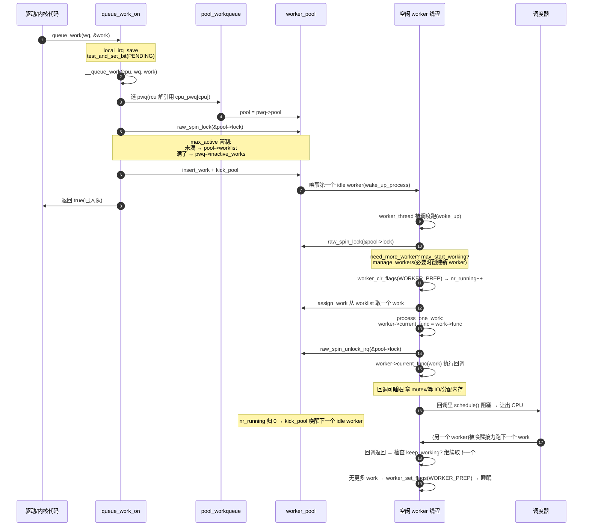

# 第七章 · workqueue:可睡眠的延迟工作

> 篇:P1 中断与软中断(下半部)
> 主线呼应:上一章讲完 softirq,你拿到了内核处理"延后工作"的快路径——per-CPU 位图、`handle_softirqs` 循环、`ksoftirqd` 兜底,全程在中断退出后的 softirq 上下文里跑,**不可睡眠**。但内核里有大量延后工作偏偏要睡眠:要把脏页刷回磁盘(等 IO)、要拿一把可能被别人占着的 `mutex`、要在可能触发内存回收的路径上分配内存。这些事放进 softirq 里会立刻死锁或 panic。workqueue 就是给这类"需要进程上下文、需要能睡眠"的延后工作准备的下半部:它把 work 挂到一个**由内核线程驱动**的工作队列上,执行体是货真价实的 task(有 `task_struct`、能 `schedule()`、能拿阻塞锁)。本章讲清 workqueue 的三件套(`work_struct`/`worker_pool`/worker 线程)、入队与执行的完整旅程,以及 Linux 为什么在 2010 年把老的 workqueue 推倒重写成 **CMWQ(Concurrency Managed Workqueue)**——按需唤醒 worker、并发度由调度器管制,既不线程爆炸、又能让阻塞 work 真正并发跑。读完本章,第 1 篇(中断)的所有下半部就齐了。

## 核心问题

**softirq/tasklet 不能睡眠,但很多延后工作必须调阻塞 API(磁盘 IO、`mutex`、可能回收内存的分配);内核怎么提供一个"有进程上下文、能睡眠、又能并发执行、还不会线程爆炸"的下半部?老 workqueue 为什么会被 CMWQ 取代?**

读完本章你会明白:

1. workqueue 的三件套:**`work_struct`(待办工作)+ `worker_pool`(worker 池)+ worker 内核线程**(有 `task_struct` 的执行体),以及入队 `queue_work` → 执行 `process_one_work` 的完整旅程。
2. 为什么 work 必须在**进程上下文**跑:worker 是真正的 task,能 `schedule()`、能拿 `mutex`、能被抢占——这是它能跑阻塞工作的根本。
3. **CMWQ 的并发管制**:用 `nr_running` 计数 + 调度器配合,worker 一阻塞就立刻唤醒下一个 worker 接力,既保证并发又不无限创建线程。
4. **老 workqueue 为什么被取代**:老 workqueue 每个 CPU 一个 worker 线程(早期)或每 workqueue 一个线程,阻塞就堵死、或线程爆炸;CMWQ 用共享 worker 池 + 按需创建解决。
5. workqueue 与 softirq 的分工:softirq 轻、per-CPU、不可睡眠(网络 RX、计时器回调);workqueue 重、可睡眠、能跑 IO/锁(脏页回写、驱动固件加载)。

> **逃生阀**:如果你只想知道"workqueue 怎么用",记住 `INIT_WORK(&work, fn)` + `queue_work(wq, &work)` 就够了,本章你主要看 7.2(旅程)和 7.4(技巧精解 CMWQ)。如果你想搞懂 CMWQ 凭什么"并发又不爆炸",7.3 和 7.4 是核心,值得精读。

---

## 7.1 一句话点破

> **workqueue 把"需要睡眠的延后工作"交给内核线程跑——worker 是真正的进程,有 `task_struct`、能 `schedule()`、能拿阻塞锁;CMWQ 用共享 worker 池 + `nr_running` 并发计数,让 worker 一阻塞就唤醒下一个接力,既不线程爆炸又能让阻塞 work 真正并发。**

这是结论,不是理由。本章倒过来拆:先看为什么 softirq 装不下"要睡眠的工作",再看 workqueue 的三件套和一次入队执行的旅程,然后钻 CMWQ 的并发管制怎么做到"sound",最后讲老 workqueue 为什么被它取代。

---

## 7.2 为什么需要 workqueue:softirq 装不下的"要睡眠的工作"

上一章的 softirq 是中断的"续集",在 `irq_exit` 后的 softirq 上下文里跑。softirq 上下文有一条**铁律**:**不能睡眠**。原因在 P1-04 讲过:softirq 上下文不是任何进程,`current` 是被中断的进程但不是 softirq 自己,没有独立的 `task_struct` 可挂起;一旦调 `schedule()`,调度器无处保存/恢复 softirq 的执行流,直接 BUG。所以 `mutex_lock`(拿不到就睡眠)、`wait_event`、`kmalloc(..., GFP_KERNEL)`(可能触发内存回收而睡眠)这些 API,**在 softirq 里全是禁区**。

但内核有大量延后工作偏偏需要这些:

| 典型场景 | 为什么需要睡眠 |
|---|---|
| 脏页回写(`bdi_writeback_workfn`) | 提交 IO 给磁盘、等磁盘完成,要走阻塞 IO 路径 |
| 驱动加载固件(`request_firmware_work`) | 读固件文件,文件系统/磁盘 IO 阻塞 |
| 拿 `mutex` 保护的数据结构 | 拿不到就排队等待,必然睡眠 |
| `flush_work` / 内存回收路径上的 work | 可能递归触发内存分配,要能回收 |
| 文件系统延时关闭(`delayed_fput`) | 等文件引用归零,走阻塞路径 |

> **不这样会怎样**:如果把脏页回写塞进 softirq,worker 回调里一调 `submit_bio` → 等 IO 完成 → 睡眠,内核立刻 BUG(softirq 里 `might_sleep()` 触发)。如果把"等锁"塞进 tasklet(softirq 的包装),同样翻车。所以**必须有一个"能睡眠的下半部"**——这就是 workqueue。

那直接在驱动里 `kthread_run` 起一个内核线程跑这些事行不行?行,但每个驱动各起线程会**线程爆炸**(64 核机器上几百个驱动,每个一个线程)、调度开销大、而且并发完全不可控。workqueue 的价值就是**把这些线程池化、共享、并发管制**——驱动只提交一个 `work_struct`,线程的创建/销毁/唤醒全由 workqueue 子系统统一管。

> **钉死这件事**:下半部分两档——**轻、不可睡眠**的用 softirq(tasklet 是它的包装,6.x 在废);**重、要睡眠**的用 workqueue。判断标准就一条:回调里会不会调阻塞 API。会,就用 workqueue。

---

## 7.3 workqueue 的三件套与一次 work 的旅程

workqueue 的核心数据结构是**三件套**:`work_struct`(待办工作)、`worker_pool`(worker 池)、worker(内核线程)。再加一个 `pool_workqueue`(pwq,把 workqueue 和 pool 接起来的中间层)。先看它们的布局:

```
 workqueue 的三件套(简化,见 workqueue.c / workqueue_types.h):

 ┌──────────────────────────────────────────────────────────────┐
 │ struct workqueue_struct  (system_wq / 自建 wq)                │
 │   flags: WQ_UNBOUND / WQ_HIGHPRI / WQ_MEM_RECLAIM / ...      │
 │   pwqs ──→ 每核 / 每 NUMA pod 一个 pool_workqueue            │
 └──────────────────────────────────────────────────────────────┘
                              │
                              ▼
 ┌──────────────────────────────────────────────────────────────┐
 │ struct pool_workqueue  (pwq:把 wq 接到 pool)                 │
 │   pool ───────────┐                                          │
 │   wq ──────────────┼─→ 回指 workqueue                         │
 │   nr_active        │   当前正在跑的 work 数(并发度上限管制) │
 │   inactive_works   │   超过 max_active 时挂起的 work 队列    │
 │   max_active       │   允许的并发 work 上限                  │
 └─────────────────────┼────────────────────────────────────────┘
                       ▼
 ┌──────────────────────────────────────────────────────────────┐
 │ struct worker_pool  (per-CPU,每核 2 个:normal + highpri)     │
 │   cpu / node / id                                             │
 │   lock                raw_spinlock(保护整个 pool)            │
 │   worklist            挂待执行 work 的链表(本 pool 共享)   │
 │   nr_running          正在 CPU 上跑(未阻塞)的 worker 计数  │ ← CMWQ 的命脉
 │   nr_workers / nr_idle  总 worker / 空闲 worker              │
 │   idle_list           空闲 worker 链表                        │
 │   busy_hash           正在执行 work 的 worker 哈希表         │
 │   workers ──→ 挂着的所有 worker                              │
 └──────────────────────────────────────────────────────────────┘
                       │ 管理、唤醒
                       ▼
 ┌──────────────────────────────────────────────────────────────┐
 │ struct worker  (内核线程 kworker/N/H,见 worker_thread)        │
 │   task ──→ task_struct(真正的进程!能 schedule、能拿锁)    │
 │   pool / current_work / current_func / current_pwq           │
 │   flags: WORKER_PREP / WORKER_IDLE / WORKER_CPU_INTENSIVE... │
 └──────────────────────────────────────────────────────────────┘

 待办工作本身:
 ┌──────────────────────────────────────────────────────────────┐
 │ struct work_struct  (workqueue_types.h#L16)                  │
 │   data   : PENDING 位 + pwq 指针 + color(打包进一个原子长) │
 │   entry  : 挂到 pool->worklist / pwq->inactive_works         │
 │   func   : work_func_t(回调函数 void func(struct work *))  │
 └──────────────────────────────────────────────────────────────┘
```

关键点:

- **每个 CPU 默认有 2 个 pool**:`NR_STD_WORKER_POOLS = 2`([workqueue.c#L105](../linux/kernel/workqueue.c#L105)),一个跑普通 work、一个跑高优先级 work(`WQ_HIGHPRI`,worker 线程 nice 值更低)。每个 pool 背后是**可变数量**的 worker 线程。
- **`work_struct` 是最小单位**,就三个字段(`data`/`entry`/`func`)。`data` 是个 `atomic_long_t`,把"PENDING 位、pwq 指针、flush color"打包进一个长整型([workqueue.h#L25-L70](../linux/include/linux/workqueue.h#L25-L70))。
- **worker 是真正的 task**,有 `task_struct`,这是它能睡眠、能拿阻塞锁的根本。

### 一次 work 的旅程:从 `queue_work` 到 `process_one_work`



这是 workqueue 的全貌。下面分两段讲清楚入队和执行。

---

## 7.4 入队:`queue_work` → `__queue_work` → 选 pool、挂链、唤醒

### 7.4.1 `queue_work` 宏展开:PENDING 位是"去重"的关键

用户侧最常用的是 `queue_work`([workqueue.h#L602-L606](../linux/include/linux/workqueue.h#L602-L606)):

```c
/* include/linux/workqueue.h,简化 */
static inline bool queue_work(struct workqueue_struct *wq,
                              struct work_struct *work)
{
    return queue_work_on(WORK_CPU_UNBOUND, wq, work);
}
```

`WORK_CPU_UNBOUND = NR_CPUS` 是个哨兵值,意思是"不指定 CPU,让 workqueue 自己选"。真正干活的 [`queue_work_on`](../linux/kernel/workqueue.c#L2439)([workqueue.c#L2439-L2454](../linux/kernel/workqueue.c#L2439-L2454)):

```c
/* kernel/workqueue.c,简化 */
bool queue_work_on(int cpu, struct workqueue_struct *wq,
                   struct work_struct *work)
{
    bool ret = false;
    unsigned long irq_flags;

    local_irq_save(irq_flags);

    if (!test_and_set_bit(WORK_STRUCT_PENDING_BIT, work_data_bits(work))) {
        __queue_work(cpu, wq, work);
        ret = true;
    }

    local_irq_restore(irq_flags);
    return ret;
}
```

这一段有两个设计点必须讲清:

**① `test_and_set_bit` 是原子的"PENDING 去重"。** `WORK_STRUCT_PENDING_BIT` 是 `work_struct->data` 的第 0 位([workqueue.h#L26](../linux/include/linux/workqueue.h#L26))。`test_and_set_bit` 是原子操作:原先是 0 就置 1 并返回 0(说明这个 work 此刻不在任何队列上,可以入队),原先是 1 就保持 1 并返回 1(说明已经在队列里,**重复入队直接忽略**)。所以 `queue_work` 同一个 work 连调 100 次,只会真正入队一次,返回值告诉你"这次入队了吗"。

> **钉死这件事**:`queue_work` 的去重语义("同一个 work 同时只挂一次")完全靠 `WORK_STRUCT_PENDING_BIT` 这一位的原子置位。`process_one_work` 执行 work 时会清掉这一位([process_one_work@3233](../linux/kernel/workqueue.c#L3233) `set_work_pool_and_clear_pending`),清掉之后才能再次入队。这是个无锁的"占用标志",和 softirq 的 pending 位图是同一类技巧(用一个原子位当状态机)。

**② 为什么必须 `local_irq_save`?** 因为 `test_and_set_bit` 和 `__queue_work` 之间如果有硬中断打进来,中断处理里又 `queue_work` 同一个 work,两个 CPU/上下文可能同时通过 PENDING 检查、然后都往 worklist 上挂——一个 work 被挂两次,链表损坏。关本地中断保证"PENDING 检查 + 入队"是一个临界区。`__queue_work` 开头的 `lockdep_assert_irqs_disabled()`([workqueue.c#L2327](../linux/kernel/workqueue.c#L2327))就是这条约束的声明。

### 7.4.2 `__queue_work`:选 pool、找 pwq、挂链、唤醒

[`__queue_work`](../linux/kernel/workqueue.c#L2313)([workqueue.c#L2313-L2423](../linux/kernel/workqueue.c#L2313-L2423))是 workqueue 入队的主体逻辑。挑核心几步:

```c
/* kernel/workqueue.c,简化自 __queue_work */
static void __queue_work(int cpu, struct workqueue_struct *wq,
                         struct work_struct *work)
{
    struct pool_workqueue *pwq;
    struct worker_pool *last_pool, *pool;

    lockdep_assert_irqs_disabled();          /* 关中断保证 */
    /* ...draining/destroying 检查... */
    rcu_read_lock();
retry:
    /* ① 选 CPU(若 UNBOUND 则 wq_select_unbound_cpu) */
    if (cpu == WORK_CPU_UNBOUND)
        cpu = wq->flags & WQ_UNBOUND
              ? wq_select_unbound_cpu(raw_smp_processor_id())
              : raw_smp_processor_id();

    /* ② 选 pwq(每核一个 pwq,RCU 解引用) */
    pwq = rcu_dereference(*per_cpu_ptr(wq->cpu_pwq, cpu));
    pool = pwq->pool;

    /* ③ 非重入:如果 work 上次在别的 pool 跑、可能还在跑,回那个 pool */
    last_pool = get_work_pool(work);
    if (last_pool && last_pool != pool) {
        /* ...找正在执行它的 worker,若有则回 last_pool,保证不重入... */
    }
    raw_spin_lock(&pool->lock);

    /* ④ 并发度上限管制:max_active */
    if (list_empty(&pwq->inactive_works) && pwq_tryinc_nr_active(pwq, false)) {
        insert_work(pwq, work, &pool->worklist, work_flags);   /* 进 worklist */
        kick_pool(pool);                                       /* 唤醒一个 idle worker */
    } else {
        work_flags |= WORK_STRUCT_INACTIVE;
        insert_work(pwq, work, &pwq->inactive_works, work_flags); /* 暂存,等空位 */
    }

    raw_spin_unlock(&pool->lock);
    rcu_read_unlock();
}
```

几个关键设计:

**① 选 CPU 的策略区分 per-CPU 与 UNBOUND。** 默认(per-CPU)work 跑在调用者所在的 CPU(`raw_smp_processor_id()`),好处是缓存命中;`WQ_UNBOUND` 的 work 则用 `wq_select_unbound_cpu` 在 NUMA pod 内挑一个,允许跨核迁移、给调度器更多自由度(对吞吐型工作更好)。

> **不这样会怎样**:如果所有 work 都绑死在调用者 CPU,一个驱动在中断里 `queue_work`,这个 work 就非得在这个 CPU 跑,可能造成某些 CPU 过载而其他核闲着。`WQ_UNBOUND` 给了 workqueue 把工作"摊开"到更多核的能力。

**② 非重入保证。** work 上次可能还在某个 pool 的 worker 上跑(`worker->current_work == work`),如果再入队到另一个 pool,两个 pool 的两个 worker 会**同时跑同一个回调**——大多数回调都不是为此设计的。所以 `__queue_work` 用 `get_work_pool(work)` 读出上次跑它的 pool,如果 work 还在那里执行,就回那个 pool 入队,由那个 pool 的串行性保证不重入。这是 workqueue 的**非重入语义**的核心。

**③ `max_active` 并发上限。** 每个 pwq 有个 `max_active`(per-CPU 默认 `WQ_MAX_ACTIVE = 512`,[workqueue.c 附近](../linux/include/linux/workqueue.h#L407))。一个 wq 在一个 pwq 上同时只允许这么多个 work 在跑;超了的 work 挂到 `pwq->inactive_works` 暂存,等有 work 跑完(`pwq_dec_nr_active`)再把它"激活"移到 `pool->worklist`。这防止一个疯狂提交 work 的 wq 把整个 pool 占满、饿死别的 wq。

**④ `kick_pool` 唤醒一个空闲 worker。** 这是 CMWQ "按需唤醒"的入口——有 work 入队了,就看看有没有空闲 worker,有就唤醒一个来跑。

---

## 7.5 worker 线程:`worker_thread` 主循环

真正执行 work 的是 worker 内核线程,主循环是 [`worker_thread`](../linux/kernel/workqueue.c#L3374)([workqueue.c#L3374-L3446](../linux/kernel/workqueue.c#L3374-L3446)):

```c
/* kernel/workqueue.c,简化自 worker_thread */
static int worker_thread(void *__worker)
{
    struct worker *worker = __worker;
    struct worker_pool *pool = worker->pool;

    set_pf_worker(true);               /* 告诉调度器"我是 workqueue worker" */
woke_up:
    raw_spin_lock_irq(&pool->lock);

    if (worker->flags & WORKER_DIE) { /* 销毁路径 */ ... return 0; }

    worker_leave_idle(worker);
recheck:
    if (!need_more_worker(pool))       /* worklist 空 或 已有 worker 在跑 → 不需要我 */
        goto sleep;

    if (!may_start_working(pool) && manage_workers(worker))  /* 没有空闲 worker? 管理(创建) */
        goto recheck;

    worker_clr_flags(worker, WORKER_PREP | WORKER_REBOUND);  /* 我开始干活,nr_running++ */

    do {
        struct work_struct *work =
            list_first_entry(&pool->worklist, struct work_struct, entry);
        if (assign_work(work, worker, NULL))
            process_scheduled_works(worker);              /* 真正执行 work */
    } while (keep_working(pool));                          /* 还有 work 且并发允许 → 继续 */

    worker_set_flags(worker, WORKER_PREP);                /* 干完了,nr_running-- */
sleep:
    worker_enter_idle(worker);
    __set_current_state(TASK_IDLE);                       /* 进空闲,sleep */
    raw_spin_unlock_irq(&pool->lock);
    schedule();
    goto woke_up;                                          /* 被唤醒再来一轮 */
}
```

三个判断函数是 CMWQ 的"并发管制阀门",定义在 [workqueue.c#L941-L956](../linux/kernel/workqueue.c#L941-L956):

```c
static bool need_more_worker(struct worker_pool *pool)
{
    return !list_empty(&pool->worklist) && !pool->nr_running;
}

/* Can I start working? Called from busy but !running workers. */
static bool may_start_working(struct worker_pool *pool)
{
    return pool->nr_idle;
}

/* Do I need to keep working? Called from currently running workers. */
static bool keep_working(struct worker_pool *pool)
{
    return !list_empty(&pool->worklist) && (pool->nr_running <= 1);
}
```

这三个函数全靠两个计数 `nr_running`(正在 CPU 上跑的 worker 数)和 `nr_idle`(空闲 worker 数),加上 `worklist` 是否空,就管住了整个 pool 的并发。下一节的技巧精解会专门拆 `nr_running` 怎么做到 sound。

### `process_one_work`:执行单个 work

worker 主循环里调 `process_scheduled_works`,最终对每个 work 调 [`process_one_work`](../linux/kernel/workqueue.c#L3166)([workqueue.c#L3166-L3233](../linux/kernel/workqueue.c#L3166-L3233) 是核心):

```c
/* kernel/workqueue.c,简化自 process_one_work */
static void process_one_work(struct worker *worker, struct work_struct *work)
{
    struct pool_workqueue *pwq = get_work_pwq(work);
    struct worker_pool *pool = worker->pool;

    /* 登记到 busy_hash,worker->current_work = work */
    hash_add(pool->busy_hash, &worker->hentry, (unsigned long)work);
    worker->current_work = work;
    worker->current_func = work->func;
    worker->current_pwq = pwq;
    list_del_init(&work->entry);                          /* 从 worklist 摘下 */

    if (pwq->wq->flags & WQ_CPU_INTENSIVE)
        worker_set_flags(worker, WORKER_CPU_INTENSIVE);   /* 退出并发管制 */

    kick_pool(pool);                                      /* 必要时唤醒接力 */

    set_work_pool_and_clear_pending(work, pool->id, 0);   /* 清 PENDING 位(关键!) */
    raw_spin_unlock_irq(&pool->lock);                     /* 放锁 */

    /* ★ 真正执行回调,在进程上下文,可睡眠 ★ */
    worker->current_func(work);

    raw_spin_lock_irq(&pool->lock);                       /* 回来重持锁 */
}
```

> **钉死这件事**:`process_one_work` 在调 `worker->current_func(work)` 之前**先放掉了 `pool->lock`**。这是 work 能睡眠的根本原因——worker 拿着自己的 `task_struct`,在没持任何 spinlock 的状态下执行回调,回调里调 `mutex_lock`/`submit_bio`/`schedule()` 都是合法的。这一点和 softirq(全程在软中断上下文、不能调度)是本质区别。回调返回后,worker 重新拿 `pool->lock`,检查 `keep_working` 决定要不要再跑一个 work。

注意 `set_work_pool_and_clear_pending` 在放锁**之前**清掉 PENDING 位([workqueue.c#L3233](../linux/kernel/workqueue.c#L3233))。注释里写明了原因:让 "PENDING clear" 和 "queued 状态变化"在持锁 + 关中断下原子发生,这样外部的 `queue_work` 在拿到锁后看到的 work 状态一致——要么还没开始跑(PENDING 还在,能再次入队由去重拦住),要么已经跑完(PENDING 清了,可以重新入队)。这是 workqueue 处理"执行 ↔ 重入队"竞态的关键时序约束。

---

## 7.6 技巧精解:CMWQ 的并发管制——`nr_running` 与 worker 池的动态平衡

这一节拆 workqueue 最硬核的技巧:**CMWQ 凭什么"既不线程爆炸、又能让阻塞 work 真正并发跑"**。这是 2010 年 Tejun Heo 重写 workqueue 的核心设计,也是 workqueue 区别于老实现的关键。

### 7.6.1 老 workqueue 的问题:阻塞就堵死 / 线程爆炸

老 workqueue(`create_workqueue` 时代)的设计很简单:**每个 workqueue 在每个 CPU 上一个 worker 线程**。这有两个致命问题:

- **一个 worker 阻塞,整个 workqueue 在这个 CPU 上的所有 work 全堵死。** 因为每核只有一条线程,线程一旦 `mutex_lock` 阻塞,后面排队的 work 只能等。最典型的受害者是系统默认的 `keventd`(`system_wq`,当时叫 events),一个 work 阻塞,整条流水线停。
- **想要并发就得多建 workqueue**,每个 wq 每核一个线程。系统里几十个 wq × 几十核 = 几百上千个 kworker 线程,调度器和内存开销巨大(线程爆炸)。

更早期(2.x 时代)甚至出现过"每提交一个 work 临时创建一个线程"的朴素想法,那更是直接爆炸。

> **不这样会怎样**:用老 workqueue,网络栈的 `flush_work`、文件系统的 `delayed_fput`、驱动的固件加载——只要有一个阻塞,后面全堵;想分开并发就要建一堆 wq,线程数失控。**这就是 CMWQ 要解决的根本矛盾:阻塞要求并发(阻塞一个、跑别的),但线程数必须可控。**

### 7.6.2 CMWQ 的解法:共享 pool + `nr_running` 管制

CMWQ 的核心思想两条:

**① pool 被多个 wq 共享,worker 数量动态伸缩。** 不是每个 wq 一条线程,而是**每个 CPU 两个 pool(normal + highpri)**,所有 per-CPU wq 的 work 都进同一个 pool 的 `worklist`。pool 里的 worker 数量由 `manage_workers` / `maybe_create_worker` **按需创建**(work 多了、worker 不够就 `create_worker` 起一条新线程;worker 空闲超过 `IDLE_WORKER_TIMEOUT = 300*HZ`(5 分钟)就回收,见 [workqueue.c#L105-L117](../linux/kernel/workqueue.c#L105-L117))。这样线程总数自动随负载伸缩,不会爆炸。

**② `nr_running` 计数 + 调度器配合,实现"阻塞即接力"。** 这是 CMWQ 最精妙的一笔。`pool->nr_running` 记录"此刻在 CPU 上跑(没阻塞)的 worker 数"。它的变化规则:

- worker 开始干活(`worker_clr_flags(WORKER_PREP)`,见 [worker_thread@L3421](../linux/kernel/workqueue.c#L3421)):`nr_running++`。
- worker 在回调里阻塞(`schedule()`,调度器走 `wq_worker_sleeping` 钩子):`nr_running--`(见 [workqueue.c#L1455-L1460](../linux/kernel/workqueue.c#L1455-L1460))。
- worker 被唤醒继续跑(`wq_worker_waking_up`):若它不是 `WORKER_NOT_RUNNING`,`nr_running++`([workqueue.c#L1408-L1409](../linux/kernel/workqueue.c#L1408-L1409))。

关键在 `need_more_worker`([workqueue.c#L941](../linux/kernel/workqueue.c#L941)):

```c
static bool need_more_worker(struct worker_pool *pool)
{
    return !list_empty(&pool->worklist) && !pool->nr_running;
}
```

含义:**只要 worklist 非空,且没有任何 worker 在跑(`nr_running == 0`),就需要再唤醒一个 worker**。`kick_pool` 据此决定要不要唤醒空闲 worker([workqueue.c#L1249](../linux/kernel/workqueue.c#L1249))。

于是发生这样的接力:

1. work A 入队,`kick_pool` 唤醒 worker1,worker1 `nr_running=1`,跑 work A。
2. work A 里调 `mutex_lock` 阻塞 → 调度器把 worker1 睡下,`nr_running=0`。
3. 此时 worklist 还有 work B,`need_more_worker` 返回 true(`!nr_running`),`kick_pool` 唤醒 worker2,worker2 `nr_running=1`,跑 work B。
4. work B 也阻塞 → 唤醒 worker3 跑 work C...
5. 直到 worklist 空或某个 worker 解除阻塞回来。

> **所以这样设计**:**worker 一阻塞就立刻有下一个 worker 接力**,阻塞的 work 不再卡住队列——这就是"并发跑阻塞工作"。同时,worker 总数由 `manage_workers` 控制(空闲太多就回收),不会无限增长——这就是"不爆炸"。两条加起来,就是 CMWQ 名字的来历:**Concurrency Managed**(并发由调度器管的 worker 池托管)。

### 7.6.3 为什么这套设计 sound:三个不变量

CMWQ 的正确性靠三个不变量支撑,每个都值得讲清"为什么不会出错":

**不变量一:`nr_running` 的增减和 worker 的睡眠/唤醒严格配对,不会漏算。**

`nr_running` 的修改分两条路径:worker 线程自己(持 `pool->lock`)改,和调度器回调(`wq_worker_sleeping`/`wq_worker_waking_up`,不持 `pool->lock`)改。怎么保证不丢?靠 `WORKER_NOT_RUNNING` 标志位掩码([workqueue.c#L96-L97](../linux/kernel/workqueue.c#L96-L97)):

```c
WORKER_NOT_RUNNING = WORKER_PREP | WORKER_CPU_INTENSIVE |
                     WORKER_UNBOUND | WORKER_REBOUND,
```

只有"正在参与并发管制"的 worker(没有任何 NOT_RUNNING 标志)才计入 `nr_running`。`worker_set_flags`/`worker_clr_flags`([workqueue.c#L981-L1020](../linux/kernel/workqueue.c#L981-L1020))在标志位跨越 NOT_RUNNING 边界时才增减计数:

```c
/* 简化自 worker_clr_flags */
if ((flags & WORKER_NOT_RUNNING) && (oflags & WORKER_NOT_RUNNING))
    if (!(worker->flags & WORKER_NOT_RUNNING))   /* 真的跨出 NOT_RUNNING */
        pool->nr_running++;
```

注意注释"nested NOT_RUNNING is not a noop":因为 NOT_RUNNING 是多个标志的掩码(同时置 PREP 和 CPU_INTENSIVE,清掉一个仍在 NOT_RUNNING),只有**最后一个** NOT_RUNNING 标志被清掉、worker 真正回到"running"集合,才 `nr_running++`。这套位掩码计数保证了不管标志怎么组合增减,`nr_running` 永远等于"此刻在跑的非 NOT_RUNNING worker 数"。

**不变量二:worker 阻塞时,接力唤醒不会重复、不会漏。**

`kick_pool`(`__queue_work` 末尾调)只在 `need_more_worker` 为真(worklist 非空且 `!nr_running`)时唤醒([workqueue.c#L1249](../linux/kernel/workqueue.c#L1249))。worker 阻塞时调度器调 `wq_worker_sleeping`,它也会在必要时唤醒下一个 worker 接力([workqueue.c#L1455-L1460](../linux/kernel/workqueue.c#L1455-L1460) 附近)。两条路径都拿"worklist 非空 + nr_running==0"作为唤醒条件,且唤醒前 `nr_running` 已被递增或即将递增,不会唤醒一窝 worker 抢同一个 work。

**不变量三:`max_active` + `inactive_works` 防止一个 wq 占满 pool。**

并发管制只管 pool 整体(`nr_running`),不管单个 wq。如果某个 wq 疯狂提交 work,可能把 pool 的所有 worker 都占去跑它的 work,饿死别的 wq。`pwq->max_active` 是每个 pwq 的"并发配额":一个 wq 在一个 pwq 上同时只允许 `max_active` 个 work 在 pool 的 worklist 上排队,超了的进 `pwq->inactive_works` 暂存(见 [workqueue.c#L2408-L2418](../linux/kernel/workqueue.c#L2408-L2418))。有 work 跑完才激活一个 inactive 的。这样每个 wq 的并发都有上限,pool 公平共享。

> **反面对比**:如果不用 CMWQ、回到老 workqueue,要么单线程阻塞就堵死(无并发),要么每 wq 一线程爆炸(线程失控)。CMWQ 用**共享 pool + nr_running + max_active**三层管制,把"并发"和"可控"同时拿下。这是内核工程里"用计数器 + 调度器钩子管并发"的典范,和 softirq 用 per-CPU 位图管 pending、调度器用 per-CPU `rq` 管 runqueue,是同一套"把并发问题分解到数据结构设计里"的思路。

### 7.6.4 补充:`WQ_CPU_INTENSIVE` 与 `WQ_MEM_RECLAIM` 的逃生阀

CMWQ 的并发管制默认假设"work 会短时间阻塞后回来"。两个例外场景需要额外机制:

- **`WQ_CPU_INTENSIVE`**:标记 wq 里的 work 是 CPU 密集型(可能长时间不阻塞、但占 CPU)。这类 work 一旦开始,`process_one_work` 立刻 `worker_set_flags(WORKER_CPU_INTENSIVE)`([workqueue.c#L3217](../linux/kernel/workqueue.c#L3217)),让它退出 `nr_running` 管制("我不挡别人"),交给调度器公平调度。不这样,一个 CPU 密集 work 会算进 `nr_running`,让 CMWQ 误以为"pool 在跑"而不唤醒接力。
- **`WQ_MEM_RECLAIM`**:标记 wq 可能在内存回收路径上用。这种 wq 自带一条 **rescuer 线程**([`rescuer_thread`@workqueue.c#L3469](../linux/kernel/workqueue.c#L3469)),万一普通 worker 创建失败(`create_worker` 要 `GFP_KERNEL` 分配,内存紧张时失败),pool 会发"mayday",rescuer 接管,保证内存回收路径上的 work 不死锁——这是个**前向保证**(forward progress guarantee)。

---

## 7.7 workqueue 与 softirq 的对照

workqueue 是第 1 篇下半部的另一半,和 softirq(P1-06)组成完整的"延后工作"图景。一张表说清分工:

| 维度 | softirq / tasklet | workqueue |
|------|------|------|
| 执行上下文 | softirq 上下文(中断退出后接力) | 进程上下文(worker 内核线程) |
| 能否睡眠 | **不能**(`might_sleep` BUG) | **能**(回调在 worker 线程里) |
| 并发性 | per-CPU,同一种 softirq 在一个核上串行 | pool 内 worker 并发跑(受 CMWQ 管制) |
| 延迟 | 低(中断退出立刻跑) | 略高(要等 worker 被调度) |
| 代价 | 轻(per-CPU 位图 + action 数组) | 重(内核线程 + pool 管理) |
| 典型用途 | 网络 RX/TX、RCU 回调、计时器 | 脏页回写、驱动固件、阻塞 IO、拿 mutex |
| 选择标准 | 回调短、不睡眠 | 回调要睡眠或重 |

> **钉死这件事**:softirq 是"快路径下半部",workqueue 是"慢路径下半部"。两者不是替代关系,是**分工**:网络包这种百万级/秒的事件,走 softirq 才跟得上;脏页回写这种可以等、且要拿锁的工作,走 workqueue 才不会 BUG。一个完整的中断处理,常常上半部 hardirq 收事件 → softirq 推协议栈 → workqueue 慢慢刷盘,三级接力。

---

## 章末小结

这一章我们讲完了内核下半部的另一半——workqueue。回扣全书的二分法,workqueue 属于**进内核这一面**:它是中断上半部接力下来的"延后工作执行机制",服务于"事件把控制权拉进内核后、内核如何把重活儿安全地做完"。它和 softirq 一起,构成了中断处理的下半部双子星。

我们拿到的东西:

1. **三件套**:`work_struct`(待办)+ `worker_pool`(worker 池)+ worker(内核线程,有 `task_struct` 能睡眠);中间层 `pool_workqueue` 把 wq 接到 pool。
2. **一次 work 的旅程**:`queue_work`(`test_and_set_bit` PENDING 去重,关中断保护)→ `__queue_work`(选 CPU/pwq,非重入,max_active 管制,`kick_pool` 唤醒)→ worker 醒来 `worker_thread` 主循环 → `process_one_work`(放锁执行回调,可睡眠)。
3. **CMWQ 的并发管制**:共享 pool + `nr_running` 计数 + `max_active` 配额,worker 一阻塞就接力唤醒,既并发又不爆炸;`WORKER_NOT_RUNNING` 位掩码保证 `nr_running` 精确;`WQ_MEM_RECLAIM` 的 rescuer 保证内存回收路径前向推进。
4. **与 softirq 分工**:softirq 轻、不可睡眠;workqueue 重、可睡眠。完整中断处理常常 hardirq → softirq → workqueue 三级接力。
5. **第 1 篇到此结束**:中断入口(P1-02)→ 中断控制器抽象(P1-03)→ 中断上下文(P1-04)→ 上下半部切分(P1-05)→ softirq(P1-06)→ workqueue(P1-07),从硬件中断把 CPU 拉进内核,到上下半部接力把事件处理完,这条旅程全打通。

### 五个"为什么"清单

1. **为什么 softirq 装不下脏页回写?** 脏页回写要走阻塞 IO 路径(等磁盘),而 softirq 上下文不能睡眠(没有 `task_struct` 可挂起)。必须有一个"有进程上下文"的下半部——workqueue。
2. **为什么 worker 能睡眠而 softirq 不能?** worker 是真正的内核线程,有 `task_struct`,调度器能挂起/恢复它;softirq 上下文不是任何进程,`schedule()` 无处保存现场。这是"有没有独立 task"的本质区别。
3. **`queue_work` 连调 100 次同一个 work 会怎样?** 只入队一次。`WORK_STRUCT_PENDING_BIT` 用 `test_and_set_bit` 原子置位做去重,已在队列里的 work 重复入队直接忽略,返回 false。执行时清掉 PENDING 位才能再入队。
4. **CMWQ 凭什么"并发又不爆炸"?** 共享 pool(per-CPU 2 个 pool,所有 wq 共用)让 worker 数随负载伸缩,不会每 wq 一条线程爆炸;`nr_running` 计数 + `need_more_worker`/`kick_pool` 让 worker 一阻塞就唤醒下一个接力跑 worklist,保证并发不堵死;`max_active` 限制单 wq 的并发配额,防饿死。
5. **为什么 `process_one_work` 执行回调前要先放掉 `pool->lock`?** 回调要能睡眠(拿 mutex、等 IO),而持 spinlock 睡眠会死锁/破坏抢占。放锁执行、回来重持,是 work 能在进程上下文跑阻塞工作的时序保证。

### 想继续深入往哪钻

- **源码**:本章核心 [`kernel/workqueue.c`](../linux/kernel/workqueue.c)——入队 [`__queue_work`@L2313](../linux/kernel/workqueue.c#L2313) / [`queue_work_on`@L2439](../linux/kernel/workqueue.c#L2439)、并发阀门 [`need_more_worker`@L941](../linux/kernel/workqueue.c#L941) / [`keep_working`@L953](../linux/kernel/workqueue.c#L953) / [`kick_pool`@L1242](../linux/kernel/workqueue.c#L1242)、`nr_running` 管理 [`worker_set_flags`@L981](../linux/kernel/workqueue.c#L981) / [`worker_clr_flags`@L1003](../linux/kernel/workqueue.c#L1003)、worker 主循环 [`worker_thread`@L3374](../linux/kernel/workqueue.c#L3374)、执行 [`process_one_work`@L3166](../linux/kernel/workqueue.c#L3166)、池管理 [`manage_workers`@L3134](../linux/kernel/workqueue.c#L3134) / [`maybe_create_worker`@L3081](../linux/kernel/workqueue.c#L3081)、内存回收救援 [`rescuer_thread`@L3469](../linux/kernel/workqueue.c#L3469);数据结构 [`struct worker_pool`@L182](../linux/kernel/workqueue.c#L182) / [`struct pool_workqueue`@L256](../linux/kernel/workqueue.c#L256)、worker 标志位 [`WORKER_NOT_RUNNING`@L96](../linux/kernel/workqueue.c#L96);[`struct work_struct`@workqueue_types.h#L16](../linux/include/linux/workqueue_types.h#L16)、wq 标志 [`WQ_UNBOUND`/`WQ_MEM_RECLAIM`/`WQ_HIGHPRI`/`WQ_CPU_INTENSIVE`@workqueue.h#L361](../linux/include/linux/workqueue.h#L361)。
- **观测**:`/sys/fs/cgroup/cpu.stat` 看不到,看 workqueue 要用 `/proc/<pid>/comm` 里的 `kworker/N/H`(N 是 CPU 号,H 是 highpri);`cat /sys/kernel/debug/workqueue/*`(每 pool 的 worker 数、正在跑的 work);用 `tools/workqueue/wq_monitor.py`(随内核源码发布,实时看各 wq 的 started/completed/CPU time/CM wakeup);`perf sched` 看 kworker 的调度延迟;`ftrace` 的 `workqueue:workqueue_queue_work`/`workqueue_execute_start`/`workqueue_execute_end` 事件追踪 work 入队和执行;`bpftrace` 用 `tracepoint:workqueue:*` 探针统计哪个 wq 最忙。
- **延伸**:读 `Documentation/core-api/workqueue.rst`(官方对 CMWQ 设计的完整说明);Tejun Heo 2010 年的 LWN 文章 "Kernel threads: workqueue and CMWQ";`delayed_work`(work + hrtimer 的组合,延迟到点再入队,把第 3 篇的 hrtimer 和本章接起来);6.x 新增的 `WQ_BH` 标志(在 softirq 上下文跑的 workqueue,是个有趣的反向设计)。
- **对照调度器**:CMWQ 的 worker 池管理(worker 数随负载伸缩、空闲回收)和上一本《调度器》的负载均衡思路相通——都是"按需扩缩并发实体"。

### 引出下一篇

至此第 1 篇(中断与软中断)全部讲完。你已经能讲清:硬件中断怎么把 CPU 拉进内核(P1-02)、内核怎么用 `irq_chip`/`irq_domain` 抽象五花八门的中断控制器(P1-03)、中断上下文为什么不能睡眠(P1-04)、为什么要切上下半部(P1-05)、softirq 怎么做轻量下半部(P1-06)、workqueue 怎么做可睡眠下半部(P1-07)。**事件把控制权拉进内核**这一面,旅程完整了。

下一章我们转到"用户态怎么合法进内核"——**系统调用**。一个用户进程执行 `SYSCALL` 指令,CPU 怎么不查 IDT、靠 MSR 直切到内核入口 `do_syscall_64`?`sys_call_table` 数组怎么用系统调用号索引到 `sys_read`/`sys_write`?为什么 `SYSCALL` 比 `int 0x80` 快一个数量级?第 2 篇,我们从 `SYSCALL` 指令的硬件快路径讲起。
