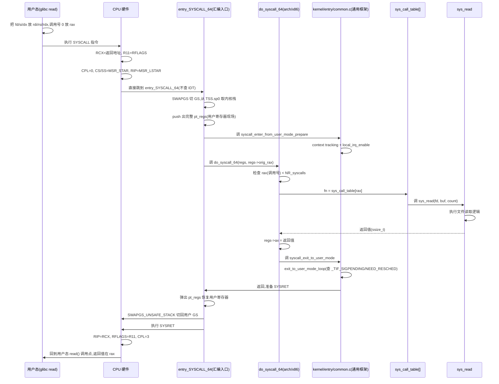

# 第八章 · 系统调用入口:SYSCALL 指令与 sys_call_table

> 篇:P2 系统调用
> 主线呼应:上一章我们讲完了第 1 篇——中断怎么"被动"把 CPU 拉进内核。这一章换个方向:**用户态怎么"主动、合法"地进内核**。你写一行 `read(fd, buf, 100)`,这一行到底怎么从用户态跑到内核的 `sys_read`?中间那条"边界跨越"的物理路径是什么?为什么现代 x86_64 用 `SYSCALL` 指令而不是老的 `int 0x80`?内核凭什么相信用户传进来的系统调用号不会越界?答案的核心是两条:**一条是 CPU 硬件给的快路径(`SYSCALL` 指令 + MSR 寄存器直跳内核入口),一条是内核软件给的函数指针数组(`sys_call_table[]` 用调用号索引)**。读完本章,你能讲清一次系统调用从用户态 `SYSCALL` 指令到 `sys_xxx` 函数的完整路径,以及为什么这条路比老 `int 0x80` 快一个数量级。

## 核心问题

**用户态怎么"合法"进内核?x86_64 的 `SYSCALL` 指令和老 `int 0x80`(软中断)在硬件层面差在哪?内核怎么用系统调用号把"用户要调哪个函数"路由到 `sys_call_table[]` 里对应的 `sys_xxx`?为什么六参传寄存器、返回值放 `rax`?**

读完本章你会明白:

1. **系统调用是用户态主动、合法进内核的唯一入口**——和中断的"被动"对应,这是二分法"进内核"那一面的另一极。
2. **`SYSCALL` vs `int 0x80` 的硬件级差异**:`SYSCALL` 用 CPU 的 MSR 寄存器(`MSR_LSTAR`)直接跳到内核入口、不查 IDT、不压完整 trap frame;`int 0x80` 走软中断那条慢路(查 IDT、压完整 trap frame、中断门开销)。差出一个数量级。
3. **`sys_call_table[]` 是函数指针数组**,用系统调用号当索引;`SYSCALL_DEFINE*` 宏把每个 `sys_xxx` 往这个表里注册(实际是三层别名 `sys_xxx` → `__se_sys_xxx` → `__do_sys_xxx`)。
4. **`kernel/entry/common.c` 的通用入口框架**(`syscall_enter_from_user_mode_prepare`/`exit_to_user_mode_loop`/`syscall_exit_to_user_mode`)怎么在"进内核"和"出内核"两个边界点统一做上下文记账(context tracking、IRQ 状态、信号/调度 pending 检查)。

> **逃生阀**:如果你只关心"`SYSCALL` 凭什么比 `int 0x80` 快",直接跳到 8.4 节(快路径拆解)和 8.6 节(技巧精解)。8.2 节的"为什么需要系统调用"如果你懂用户/内核边界,可以略读。但 8.5 节(`SYSCALL_DEFINE` 宏的三层别名)是大多数人没注意的工程细节,建议读。

---

## 8.1 一句话点破

> **系统调用入口是一条"用户主动发起、CPU 硬件直跳、内核软件分发"的受控通道:`SYSCALL` 指令让 CPU 用 MSR 寄存器绕过 IDT 查询和完整压栈,直接跳进内核预设的入口;内核再用用户传来的系统调用号,在 `sys_call_table[]` 这个函数指针数组里做一次下标取址,调到对应的 `sys_xxx`。硬件给的是"快进快出",软件给的是"按号分发",两层合起来就是一次系统调用。**

这是结论,不是理由。本章倒过来拆:先看为什么用户态必须有这么一条合法入口(为什么不能直接调内核函数),再看 `SYSCALL` 指令硬件层面到底做了什么(和老 `int 0x80` 的硬对比),然后看 `sys_call_table[]` 怎么按号分发,最后看 `SYSCALL_DEFINE*` 宏怎么把一个普通 C 函数变成表里的一项。

---

## 8.2 用户态凭什么不能直接调内核函数

先回到最根本的问题。第 1 章讲过,用户进程跑在 ring 3,内核跑在 ring 0。用户进程想 `read` 一个文件,内核里明明有个 `sys_read` 函数,用户进程为什么不能"直接调用"它?

因为**直接调用在硬件层面就不可能**。x86 CPU 的 `call` 指令跳转,受**特权级检查**约束:从 ring 3 用 `call` 跳到 ring 0 的代码段,CPU 直接抛"通用保护异常"(General Protection Fault,#GP)。你跳不进去——这不是内核"不让",是 CPU 硬件替内核把的门。用户进程看到的虚拟地址空间里,内核那段(高地址 half)虽然映射着,但页表项清了可执行/可访问位,即使你算出 `sys_read` 的地址强行跳,页保护也会把你挡住。

> **不这样会怎样**:如果没有硬件级的特权级隔离,用户进程能任意 `call` 内核函数,那"隔离"就形同虚设——一个恶意进程可以直接调内核里那些本来只该系统调用入口能触达的内部函数,跳过参数检查、跳过审计、跳过 seccomp 过滤,直接拿到内核权限。所以**特权级检查是内核安全的物理底线**,软件再怎么设计都救不回。

那用户进程必须进内核办事,怎么办?**得用一条 CPU 认可的、能安全从 ring 3 切到 ring 0 的指令**。历史上有两种:

- **软中断 `int 0x80`**:x86 老办法。`int N` 是"软中断指令",CPU 把它当一次中断处理——查 IDT(中断描述符表,见第 2 章)第 0x80 项,找到内核预设的系统调用入口,切到 ring 0、压完整 trap frame(所有通用寄存器)、跳进去。这是把"系统调用"伪装成"一次中断"。
- **专用指令 `SYSCALL`/`SYSRET`**:AMD 在 x86-64 引入,Intel 后来跟进。专门为"用户态合法进内核"设计的一条快路径,CPU 直接用 MSR 寄存器(`MSR_LSTAR`)里存的入口地址跳过去,**不查 IDT、不压完整 trap frame、不走中断门那套**。返回用对称的 `SYSRET`。

老资料常讲 `int 0x80`,但现代 x86_64 Linux(2.6 起)默认走 `SYSCALL`。32 位系统还在用 `int 0x80`(或 `sysenter`)。本章聚焦 64 位的 `SYSCALL`,并在 8.4 节做硬对比。

> **钉死这件事**:系统调用入口存在的根本理由,是**用户态合法地、受控地跨越特权级边界**。"合法"是 CPU 硬件认可的(`SYSCALL`/`int 0x80` 这种特权切换指令),"受控"是内核软件预设了唯一入口(用户不能指定跳到内核哪里,只能跳到内核指定的入口)。这是二分法"进内核"那一面里,和中断"被动进"对应的"主动合法进"。

---

## 8.3 SYSCALL 指令:CPU 用 MSR 直跳内核

`SYSCALL` 是一条单字节汇编指令(机器码 `0x0f 0x05`)。用户态一旦执行它,CPU 硬件立刻做下面这一连串事(全是硬件自动完成,不需要内核介入):

```
 用户态执行 SYSCALL 指令,CPU 硬件自动做的事(简化,arch/x86/entry/entry_64.S 描述):

  1. 保存返回地址:   RCX = 下一条指令的地址(用户态 RIP)
     保存当前 flags: R11 = RFLAGS
     (注意:SYSCALL 不压栈、不查 IDT,只用这两个寄存器暂存返回信息)
  2. 切特权级:       CPL = 0(ring 3 → ring 0)
  3. 设栈段:         SS = MSR_SYSCALL_MASK 设的内核栈段
  4. 设代码段 + 跳转: CS = MSR_STAR 高半部分设的内核代码段
                     RIP = MSR_LSTAR(Model Specific Register,内核入口地址,在 x86_64 就是 entry_SYSCALL_64)
  5. 屏蔽中断:       RFLAGS &= MSR_SYSCALL_MASK(按 mask 清掉 IF 等位)
  6. —— CPU 已经在 ring 0、跳到 entry_SYSCALL_64 执行 ——
```

这里的关键,是三个 **MSR(Model Specific Register)** 寄存器:

- **`MSR_LSTAR`(Long System Target Address Register)**:存系统调用入口地址。x86_64 Linux 启动时(`cpu_init`),内核把 `entry_SYSCALL_64` 这个汇编符号的地址写进 `MSR_LSTAR`。从此,CPU 一执行 `SYSCALL`,硬件直接拿 `MSR_LSTAR` 里的值填进 `RIP` 跳过去——**不查 IDT、不查任何表**,纯寄存器直跳。
- **`MSR_STAR`**:存内核/用户的 CS/SS 段选择子。`SYSCALL` 切 ring 0 时从这里拿内核代码段/栈段;对称的 `SYSRET` 返回时从这里拿用户段。
- **`MSR_SYSCALL_MASK`**:存一个 mask,`SYSCALL` 进入时用它清 `RFLAGS` 的若干位(主要是 `IF` 中断允许位——进入内核必须关中断)。

> **本地源码说明**:`arch/x86/entry/entry_64.S`(未 sparse clone,见本书源码策略)定义了 `entry_SYSCALL_64` 汇编入口,它负责切换到内核栈、保存用户态 `pt_regs`、最终调用通用框架 `do_syscall_64`(下面 8.5 节)。本章不贴 `entry_64.S` 的具体行号——它在 arch 目录、各内核版本改动频繁,描述作用 + 引通用框架 `kernel/entry/common.c` 更可靠。

注意 `SYSCALL` 设计的几个**精简到极致的取舍**:

- **不保存完整 trap frame**:中断/异常入口 CPU 会自动把 `SS/RSP/RFLAGS/CS/RIP/ErrCode` 一股脑压栈(形成 trap frame);但 `SYSCALL` 只把返回地址塞进 `RCX`、flags 塞进 `R11`,**剩下的寄存器保存工作留给内核软件**(汇编入口自己 `push`)。这省了硬件压栈的周期。
- **不切栈硬件**:中断/异常入口 CPU 会自动从 `TSS` 里取内核栈指针(`RSP0`)切过去;但 `SYSCALL` **硬件不切栈**,只切 `SS`/`CS` 段。内核栈的切换由 `entry_SYSCALL_64` 汇编里 `SWAPGS` + 读 `TSS.sp0` 自己做。
- **不查 IDT**:中断要走"向量号 → IDT 表 → 描述符 → 段选择子 + 偏移"一长串内存访问;`SYSCALL` 直接读 MSR 寄存器(寄存器访问,纳秒级),跳转地址已经在 `MSR_LSTAR` 里。

这就是为什么 `SYSCALL` 比 `int 0x80` 快——硬件省掉了 IDT 查询和完整压栈这两大开销。8.4 节做硬对比。

> **所以这样设计**:`SYSCALL` 的设计哲学是"系统调用是高频操作(一个进程每秒可能调几百到几千次),值得为它单独做一条 CPU 指令、用专用寄存器(MSR)换掉 IDT 查询和压栈"。这是**把高频路径的硬件开销压到最低**的工程取舍。

---

## 8.4 ★反面对比:SYSCALL vs int 0x80 的硬件级差异

把两条路径放在一起对比,`SYSCALL` 快在哪就一目了然。

```
 int 0x80(老软中断路径,简化):

  用户态执行 int 0x80
    │
    ▼ CPU 硬件自动做(中断处理那套):
  1. 查 IDT[0x80] 描述符            ← 内存访问(还要查段描述符权限)
  2. 切 ring 0,从 TSS 取内核栈指针 RSP0
  3. 压栈 trap frame:SS/RSP/RFLAGS/CS/RIP  ← 5 个内存写
  4. 清 IF(中断门自动关中断)
  5. CS:RIP = IDT 描述符里的内核入口
    │
    ▼ 跳到内核 system_call 入口

  SYSCALL(现代快路径,简化):

  用户态执行 SYSCALL
    │
    ▼ CPU 硬件自动做(精简):
  1. RCX = 用户 RIP,R11 = RFLAGS    ← 2 个寄存器写(不压栈)
  2. SS = MSR_STAR, CS = MSR_STAR   ← 寄存器读
  3. RIP = MSR_LSTAR                ← 寄存器读,直接跳(不查 IDT)
  4. RFLAGS &= MSR_SYSCALL_MASK     ← 关 IF
    │
    ▼ 跳到 entry_SYSCALL_64(汇编入口自己切栈、保存 pt_regs)
```

逐项对比:

| 开销项 | `int 0x80`(软中断) | `SYSCALL`(专用指令) |
|---|---|---|
| **入口地址来源** | 查 IDT 表(内存访问 + 权限检查) | 读 `MSR_LSTAR` 寄存器(寄存器访问) |
| **栈切换** | 硬件自动从 TSS 取 `RSP0` 切栈 | 硬件不切,汇编入口自己做 |
| **现场保存** | 硬件压 5 个字 trap frame(SS/RSP/RFLAGS/CS/RIP) | 硬件只存 `RCX`/`R11`,其余软件保存 |
| **中断门开销** | 走中断门,有完整的 trap 处理语义 | 无中断门,只是"受控跳转" |
| **返回** | `iret`(慢,要从栈弹出完整 frame) | `SYSRET`(对称快路径,`RIP=RCX`,`RFLAGS=R11`) |

`SYSCALL` 把"查 IDT"和"硬件压完整 frame"这两大开销全砍了——IDT 查询是一次内存访问 + 权限检查(几十周期),压 5 个字 trap frame 是 5 次内存写,在流水线里都是实打实的延迟。`SYSCALL` 用 MSR 寄存器读 + 寄存器暂存(`RCX`/`R11`)换掉了这些,实测单次系统调用入口开销 `SYSCALL` 比 `int 0x80` 快几十到上百周期(一个数量级)。

> **反面对比**:如果今天还用 `int 0x80`,一个每秒调一万次 `gettimeofday` 的程序(虽然 VDSO 会救,见第 10 章,但假设没 VDSO),光入口开销就比 `SYSCALL` 多花几十万周期/秒。在百万级 QPS 的服务里,系统调用入口开销直接成为热点。**`SYSCALL` 这条指令存在的意义,就是把"系统调用"这件高频事从"通用中断机制"里拎出来,给它一条专属的、寄存器直跳的快路径**。

这也是为什么 32 位 x86 后来也引入了 `sysenter`(Intel)/`sysexit`,思路和 `SYSCALL`/`SYSRET` 一样——都是"为系统调用单做一条快路径"。x86-64 统一用 AMD 设计的 `SYSCALL`/`SYSRET`。

> **钉死这件事**:`SYSCALL` 快的本质,是**把入口地址从"内存里的表(IDT)"换成"寄存器(MSR_LSTAR)",把现场保存从"硬件压栈"换成"软件按需保存"**。这是硬件为高频路径专门开的后门。但请注意:省下来的硬件压栈,内核软件还得自己补上——`entry_SYSCALL_64` 汇编会自己 `push` 出完整的 `pt_regs`(因为内核处理系统调用确实需要完整寄存器现场)。所以"省"省的是**硬件流水线里的访问延迟**,不是"省了保存工作"。

---

## 8.5 sys_call_table:用调用号索引的函数指针数组

CPU 跳到 `entry_SYSCALL_64` 之后,硬件部分就结束了,接下来是**内核软件的分发**。用户传进来的信息只有两个:

- **系统调用号**:`x86_64` 约定放在 `%rax`(用户态在执行 `SYSCALL` 前把号塞进 `%rax`)。比如 `read` 是 0,`write` 是 1,`open` 是 2,`getpid` 是 39(见 `include/uapi/asm-generic/unistd.h` 或 `arch/x86/entry/syscalls/syscall_64.tbl`)。
- **参数**:x86_64 ABI 约定六参走寄存器,依次 `%rdi`、`%rsi`、`%rdx`、`%r10`、`%r8`、`%r9`(注意第四个是 `%r10` 而不是普通函数调用 ABI 的 `%rcx`,因为 `SYSCALL` 硬件把 `RCX` 占用了存返回地址)。

内核怎么用系统调用号找到对应的 `sys_xxx`?答案是 **`sys_call_table[]`——一个函数指针数组**,系统调用号就是下标:

```c
/* arch/x86/entry/syscall_64.c(未 sparse clone,描述其结构) */
/* sys_call_table 是一个 sys_call_ptr_t 数组,每一项指向一个系统调用实现 */
#include <asm/syscalls.h>
asmlinkage const sys_call_ptr_t sys_call_table[] = {
    [0]  = sys_read,
    [1]  = sys_write,
    [2]  = sys_open,
    /* ... 数百项,按 syscall_64.tbl 顺序 ... */
    [39] = sys_getpid,
    /* ... */
};
```

分发逻辑(在 `entry_SYSCALL_64` 汇编 + `do_syscall_64` C 函数里,`do_syscall_64` 定义在 arch/x86,调用通用框架)极其简单——**一次数组下标取址,然后 `call`**:

```c
/* 简化示意,非源码原文(do_syscall_64 在 arch/x86/entry/,此处只表达分发逻辑) */
long do_syscall_64(struct pt_regs *regs, long syscall_nr)
{
    /* 1. 检查调用号不越界 */
    if (likely(syscall_nr < NR_syscalls)) {
        /* 2. 从表里取函数指针 */
        sys_call_ptr_t fn = sys_call_table[syscall_nr];
        /* 3. 从 pt_regs 取出六参(对应 rdi/rsi/rdx/r10/r8/r9) */
        /* 4. 调用,返回值放 rax */
        regs->ax = fn(regs->di, regs->si, regs->dx,
                      regs->r10, regs->r8, regs->r9);
    } else {
        regs->ax = -ENOSYS;  /* 调用号不存在 */
    }
    return regs->ax;
}
```

几个**设计上的妙处**:

1. **下标取址是 O(1)**:`sys_call_table[syscall_nr]` 就是一次内存读,比任何哈希表、链表查找都快。系统调用是高频操作,分发必须零开销。
2. **表是静态填好的**:这张表在编译期由 `syscall_64.tbl` + 宏生成,启动时不用动态注册(对比驱动中断 `request_irq` 是运行时注册)。表的每一项就是 `sys_read`/`sys_write`/... 这些函数的地址。
3. **越界检查是一道安全闸**:用户可以传任意 `%rax`,内核必须检查 `syscall_nr < NR_syscalls`,否则就是数组越界读——用户能读到内核内存里任意函数指针然后 `call` 过去,这是灾难性的安全漏洞。所以**这个边界检查是安全命脉,不可省**。
4. **未实现的号指向 `sys_ni_syscall`**:有些调用号在当前内核配置下没实现(比如某些被 `CONFIG_` 关掉的),表里那一项不是 `NULL`,而是指向 `sys_ni_syscall`(在 `kernel/sys_ni.c`,返回 `-ENOSYS`)。这样省了运行时的 `NULL` 检查——任何调用号都对应一个有效函数指针。

> **不这样会怎样**:如果 `sys_call_table` 不是编译期填好的数组,而是运行时一张哈希表(用调用号查函数),那每次系统调用都要做一次哈希查找 + 可能的链表比较——光分发就慢一个数量级。如果越界检查忘了(假设历史上有过这种 bug),用户传一个超大调用号能读到内核里任意函数指针 `call` 过去——这就是"任意内核函数执行",安全直接破。**这张表的设计是"用静态数组换 O(1) 分发 + 用越界检查守住安全"**。

> **本地源码说明**:`sys_call_table[]` 的定义在 `arch/x86/entry/syscall_64.c`(未 sparse clone),由 `arch/x86/entry/syscalls/syscall_64.tbl` 在编译期生成。本书不标 arch 具体行号(arch 改动频繁且未 sparse),描述其结构 + 分发逻辑。通用入口框架(`do_syscall_64` 调用的)在 `kernel/entry/common.c`,下面 8.7 节详讲。

---

## 8.6 SYSCALL_DEFINE 宏:怎么把一个 C 函数注册进表

那 `sys_read`/`sys_getpid` 这些函数本身是怎么定义的?为什么内核源码里到处是 `SYSCALL_DEFINE3(read, ...)` 这种宏,而不是直接 `long sys_read(int fd, ...)`?

答案是:**`SYSCALL_DEFINE*` 宏不只是定义函数,它还往系统调用表注册、加上 ftrace 元数据、做参数类型检查**。我们看真实宏定义([include/linux/syscalls.h:216-262](../linux/include/linux/syscalls.h#L216-L262)):

```c
/* include/linux/syscalls.h */
#define SYSCALL_DEFINE0(sname)                         \
    SYSCALL_METADATA(_##sname, 0);                     \
    asmlinkage long sys_##sname(void);                 \
    ALLOW_ERROR_INJECTION(sys_##sname, ERRNO);         \
    asmlinkage long sys_##sname(void)

#define SYSCALL_DEFINE1(name, ...) SYSCALL_DEFINEx(1, _##name, __VA_ARGS__)
#define SYSCALL_DEFINE2(name, ...) SYSCALL_DEFINEx(2, _##name, __VA_ARGS__)
/* ...3/4/5/6 同理 */

#define __SYSCALL_DEFINEx(x, name, ...)                          \
    __diag_push();                                               \
    __diag_ignore(GCC, 8, "-Wattribute-alias", ...);             \
    asmlinkage long sys##name(__MAP(x,__SC_DECL,__VA_ARGS__))    \
        __attribute__((alias(__stringify(__se_sys##name))));     \
    ALLOW_ERROR_INJECTION(sys##name, ERRNO);                     \
    static inline long __do_sys##name(__MAP(x,__SC_DECL,__VA_ARGS__)); \
    asmlinkage long __se_sys##name(__MAP(x,__SC_LONG,__VA_ARGS__)); \
    asmlinkage long __se_sys##name(__MAP(x,__SC_LONG,__VA_ARGS__)) \
    {                                                            \
        long ret = __do_sys##name(__MAP(x,__SC_CAST,__VA_ARGS__)); \
        __MAP(x,__SC_TEST,__VA_ARGS__);                          \
        __PROTECT(x, ret, __MAP(x,__SC_ARGS,__VA_ARGS__));       \
        return ret;                                              \
    }                                                            \
    __diag_pop();                                                \
    static inline long __do_sys##name(__MAP(x,__SC_DECL,__VA_ARGS__))
```

这个宏展开后,**一个系统调用定义会生成三层函数**(以 `SYSCALL_DEFINE3(setpriority, int, which, int, who, int, niceval)` 为例,见 [kernel/sys.c:218](../linux/kernel/sys.c#L218)):

```
 SYSCALL_DEFINE3(setpriority, int, which, int, who, int, niceval) 展开后:

  1. sys_setpriority(int which, int who, int niceval)
       —— alias 指向 __se_sys_setpriority(对外接口,sys_call_table[] 指向它)

  2. __se_sys_setpriority(long which, long who, long niceval)
       —— 接收"长整型"参数,做符号扩展(32 位 int 提升到 64 位 long),
          然后调用 __do_sys_setpriority

  3. __do_sys_setpriority(int which, int who, int niceval)
       —— 你实际写的函数体(就是你 SYSCALL_DEFINE3 后面那对花括号里的代码)
```

为什么要拆成三层?这是内核工程里一个相当精致的细节:

- **`sys_setpriority`(对外接口)**:`sys_call_table[]` 指向它。它的签名是"标准系统调用 ABI"——参数类型是用户传进来的 C 类型(`int`、`char __user *` 等)。它用 `__attribute__((alias))` 把自己别名到 `__se_sys_setpriority`,所以它本身没有函数体。
- **`__se_sys_setpriority`(符号扩展层)**:参数类型全换成 `long`(64 位)。为什么?因为系统调用参数从寄存器来,寄存器是 64 位的——一个 32 位 `int` 参数在寄存器里也是 64 位,但高 32 位可能是垃圾。这一层把 `long` 强制 cast 回正确的 C 类型(`int`/`short`/指针),保证用户传的 32 位值被正确符号扩展。`__SC_TEST` 宏还在这里做 `sizeof(type) > sizeof(long)` 的编译期检查——禁止定义参数比 `long` 大的系统调用(那寄存器传不下)。
- **`__do_sys_setpriority`(实际实现)**:这是你写的函数体。参数已经是正确的 C 类型,你正常写代码。

> **不这样会怎样**:如果直接写 `asmlinkage long sys_setpriority(int which, int who, int niceval)`、没有符号扩展层,那用户态传一个负数的 `niceval`(比如 `-20`),从寄存器进来时是 64 位 `0xFFFFFFFFFFFFFFEC` 或 `0x00000000FFFFFFEC`(取决于用户态怎么放),直接当 `int` 用可能高 32 位有垃圾导致值错误。**三层别名是为了"寄存器 64 位 → C 类型正确转换"这层语义安全**,是系统调用 ABI 正确性的工程保障。

除了三层别名,`SYSCALL_DEFINE*` 还做了两件事:

- **`SYSCALL_METADATA`**:在 `CONFIG_FTRACE_SYSCALLS` 开启时,生成一份元数据(系统调用名、参数个数、参数类型、参数名),供 ftrace/perf 追踪系统调用用(第 11 章详讲)。没有这个,你就没法用 `perf trace` 看到每个系统调用的参数。
- **`ALLOW_ERROR_INJECTION`**:注册这个系统调用可以注入错误(配合 BPF 做故障测试),这是测试基础设施。

> **钉死这件事**:`SYSCALL_DEFINE*` 宏不是一个简单的"语法糖",它把"一个普通 C 函数"包装成"一个完整的系统调用条目"——往 `sys_call_table` 注册、做参数符号扩展、加 ftrace 元数据、支持错误注入。下次你在源码里看到 `SYSCALL_DEFINE0(getpid)`(见 [kernel/sys.c:958](../linux/kernel/sys.c#L958))或 `SYSCALL_DEFINE3(setpriority, ...)`,你该知道它展开成一个三层别名的函数族,最终表里那一项是 `sys_setpriority` 这个 alias。

---

## 8.7 通用入口框架:kernel/entry/common.c

前面讲的都是 arch/x86 那一层(`entry_64.S` + `syscall_64.c` + `do_syscall_64`)。但 5.x 之后,Linux 把**系统调用入口的通用逻辑**抽到了 `kernel/entry/common.c`——arch 代码只负责"切栈、保存 pt_regs、分发调用号",剩下的"进内核前的准备、出内核前的清理"全在通用层。这是为了统一所有架构的行为(系统调用入口、中断入口、信号处理、调度 pending 检查,各架构不该各写一份)。

### 进内核那一刻:syscall_enter_from_user_mode_prepare

`do_syscall_64` 在调真正的 `sys_xxx` 之前,会先调通用层的入口准备([kernel/entry/common.c:74](../linux/kernel/entry/common.c#L74)):

```c
/* kernel/entry/common.c:74 */
noinstr void syscall_enter_from_user_mode_prepare(struct pt_regs *regs)
{
    enter_from_user_mode(regs);   /* context tracking:标记从用户态进入 */
    instrumentation_begin();
    local_irq_enable();           /* 系统调用入口开中断(SYSCALL 进来时关了) */
    instrumentation_end();
}
```

注意三个细节:

1. **`noinstr` 修饰**:意思是"不可插桩"——这个函数不准被 kprobes/ftrace 插桩。为什么?因为它在"刚进内核、上下文还没切稳定"的极早阶段,这时候插桩(可能跑一段内核回调)会破坏状态机。所以入口路径的关键函数都标 `noinstr`,`instrumentation_begin()`/`instrumentation_end()` 之间才允许插桩。
2. **`enter_from_user_mode`**:做 context tracking(标记"现在从用户态进入了内核态"),让 RCU/lockdep 这些子系统知道上下文变了。
3. **`local_irq_enable()`**:`SYSCALL` 指令进来时硬件按 `MSR_SYSCALL_MASK` 清了 `IF`(关中断),所以入口处中断是关的。系统调用实现里大部分需要开中断(不能让一次慢系统调用屏蔽所有中断太久),所以这里打开。这和中断入口(第 2 章)的"`irq_enter` 关、处理时按需开"是不同的策略——系统调用是用户主动发起、可预期长,所以早点开中断。

### 出内核那一刻:exit_to_user_mode_loop

系统调用执行完(`sys_xxx` 返回),`do_syscall_64` 把返回值塞进 `regs->ax`,然后走出口路径。出口比入口复杂得多——因为**"返回用户态前"是内核做大量延迟工作的唯一安全点**(第 18 章详讲信号、这里先看框架)。

出口的核心是 `exit_to_user_mode_loop`([kernel/entry/common.c:90](../linux/kernel/entry/common.c#L90)):

```c
/* kernel/entry/common.c:90(简化,保留核心逻辑) */
__always_inline unsigned long exit_to_user_mode_loop(struct pt_regs *regs,
                                                     unsigned long ti_work)
{
    while (ti_work & EXIT_TO_USER_MODE_WORK) {
        local_irq_enable_exit_to_user(ti_work);

        if (ti_work & _TIF_NEED_RESCHED)
            schedule();                          /* 该调度了,切进程 */

        if (ti_work & _TIF_UPROBE)
            uprobe_notify_resume(regs);

        if (ti_work & _TIF_PATCH_PENDING)
            klp_update_patch_state(current);     /* 内核热补丁 */

        if (ti_work & (_TIF_SIGPENDING | _TIF_NOTIFY_SIGNAL))
            arch_do_signal_or_restart(regs);     /* 有信号待处理,调 handler */

        if (ti_work & _TIF_NOTIFY_RESUME)
            resume_user_mode_work(regs);

        arch_exit_to_user_mode_work(regs, ti_work);

        local_irq_disable_exit_to_user();
        tick_nohz_user_enter_prepare();
        ti_work = read_thread_flags();           /* 重新读,可能上面又置了新位 */
    }
    return ti_work;
}
```

这段循环极其重要,它是**"返回用户态前把所有积压的活干完"的总开关**:

- **`_TIF_NEED_RESCHED`**:调度器在系统调用期间发现时间片到了,置这个位。出口循环看到就 `schedule()` 切到别的进程。
- **`_TIF_SIGPENDING`/`_TIF_NOTIFY_SIGNAL`**:别的进程 `kill` 你了,信号挂在 pending 队列上。出口循环看到就调 `arch_do_signal_or_restart`(弱定义,见 [common.c:83](../linux/kernel/entry/common.c#L83)),进入信号 handler 投递流程(第 18 章详讲)。
- **`while` 循环**:干完一项活可能又产生新活(比如处理一个信号 handler 时又来了信号),所以循环里 `ti_work = read_thread_flags()` 重新读,直到所有位都清才真正返回用户态。

> **不这样会怎样**:如果不在返回用户态前统一检查这些位,信号就会"丢"(投递方挂了 pending,但接收方从不查)、调度就会"拖"(时间片到了的进程继续跑、抢占失效)。`exit_to_user_mode_loop` 是**"延迟处理"模式的关键节点**——内核在系统调用执行期间记账(挂信号、置调度位),到出口前一次性结算。这和第 6 章 softirq 的"hardirq 里置位、`irq_exit` 里结算"是同构的工程思路。

实际 `syscall_exit_to_user_mode`([common.c:215](../linux/kernel/entry/common.c#L215))是这个循环的对外包装,先做"系统调用专属的出口准备"(seccomp/audit/ptrace 退出回调、rseq),再走通用的 `exit_to_user_mode_loop`:

```c
/* kernel/entry/common.c:215 */
__visible noinstr void syscall_exit_to_user_mode(struct pt_regs *regs)
{
    instrumentation_begin();
    __syscall_exit_to_user_mode_work(regs);   /* seccomp/audit/rseq 等 */
    instrumentation_end();
    exit_to_user_mode();                      /* 调用 exit_to_user_mode_loop */
}
```

> **钉死这件事**:`kernel/entry/common.c` 的通用入口框架把"进内核"(`syscall_enter_from_user_mode_prepare`)和"出内核"(`exit_to_user_mode_loop`/`syscall_exit_to_user_mode`)这两个边界点统一起来。**进内核**做最小准备(context tracking、开中断);**出内核**做全部延迟结算(信号、调度、热补丁、uprobe)。这种"进极简、出厚重"的不对称,是因为"进"时还不知道要干什么、先快速放进去,"出"时已经干完、是唯一的"安全结算点"。第 18 章会看到,信号处理完全依赖这个出口循环。

---

## 8.8 一次完整系统调用的时序

把前面几节拼起来,一次完整的 `read(fd, buf, 100)` 在 x86_64 上的旅程是这样的:



整条路径,硬件负责"跨特权级"(SYSCALL/SYSRET),汇编入口负责"切栈+保存现场",arch C 层负责"分发调用号",通用框架负责"进出的上下文记账",`sys_call_table` 负责路由,`sys_xxx` 是真正的实现。每一层职责清晰。

---

## 8.9 技巧精解

本章挑两个最硬核的技巧拆透:**`SYSCALL` 的 MSR 直跳**,和**`sys_call_table` 的越界检查 + 函数指针数组**。

### 技巧一:MSR 寄存器直跳 vs IDT 表查询

8.3 节已铺了 `SYSCALL` 的硬件行为,这里聚焦"为什么这套设计 sound"。

`SYSCALL` 的入口地址存在 `MSR_LSTAR` 这个**Model Specific Register** 里。MSR 是 x86 CPU 里一组特殊寄存器(编号访问,不是内存),它们的访问延迟远低于内存——`RDMSR`/`WRMSR` 指令是寄存器级操作。内核启动时把 `entry_SYSCALL_64` 地址写进去,从此每次 `SYSCALL` 都是"读 MSR + 跳",不碰内存。

对比中断的 IDT 查询:`int N` 要先访问 `IDT[N]`(内存里的描述符表)读出段选择子+偏移,再访问 GDT/LDT(又是内存)读段描述符做权限检查,最后才跳。这串内存访问在流水线里是实打实的延迟(每次几十周期)。

> **为什么 sound**:MSR 寄存器是 CPU 内部的存储,访问不经过缓存/内存层级,延迟稳定且低。把高频的"系统调用入口地址"放这里,避免每次都走内存,这是**用"寄存器存储"换"内存访问延迟"**的典型硬件-软件协同设计。代价是 MSR 数量有限(不能给每个系统调用一个 MSR,但系统调用入口只需要一个地址),正好适合"单一入口 + 软件按号分发"的模型。

反面对比(朴素设计):假设设计成"`SYSCALL` 指令带一个立即数作为入口索引,CPU 查一张 `syscall_table` 内存表"——那每次系统调用都至少一次内存访问,丢掉了 MSR 直跳的低延迟。AMD 当年的设计选择"单一入口 + MSR + 软件分发",把硬件开销压到极简,把分发的自由度留给软件(软件想加多少系统调用都行,不用动硬件),这是**硬件给最小机制、软件建最大策略**的思路——和中断的"IDT 硬件表 + 软件填充描述符"形成对照(IDT 是硬件规定结构、软件填内容;SYSCALL 是硬件只给一个跳板、软件自己建分发表)。

### 技巧二:sys_call_table 的越界检查是安全命脉

8.5 节提到 `do_syscall_64` 必须检查 `syscall_nr < NR_syscalls`。这个检查看似平凡,实则是系统调用入口的**安全命脉**。

`sys_call_table[]` 是一个定长数组(长度 `NR_syscalls`,约 300+ 项)。用户传进来的 `%rax` 是 64 位整数,**用户能传任意值**(包括负数、包括远大于 `NR_syscalls` 的值)。如果内核不检查直接 `sys_call_table[rax]`,那就是一次**数组越界读**——CPU 会读到 `sys_call_table` 数组之后的内核内存,把那段内存当函数指针 `call` 过去。

> **不这样会怎样**:1989 年早期 Unix 有过类似的漏洞(虚拟内存系统调用越界)。想象一下:攻击者算出"内核里某个 `commit_creds` 函数的地址相对 `sys_call_table` 的偏移",然后构造一个超大的 `%rax`,让 `sys_call_table[rax]` 正好读到 `commit_creds` 的地址——于是"系统调用"变成了"任意调用内核函数",攻击者一次系统调用就把自己的进程权限提升到 root(commit_creds 是提权函数)。**这就是为什么越界检查不可省**——它是把"用户能传任意值"这个不信任输入,挡在"内核内存任意读"之外的安全闸。

实际内核里的检查(简化):

```c
/* 简化示意,非源码原文(do_syscall_64 在 arch/x86/entry/) */
if (likely(syscall_nr < NR_syscalls)) {
    fn = sys_call_table[syscall_nr];
    /* ... */
} else {
    regs->ax = -ENOSYS;   /* 不存在的系统调用号 */
}
```

这和"用 `sys_ni_syscall` 占位"配合——表里每一项都有效(要么是实现,要么是 `sys_ni_syscall` 返回 `-ENOSYS`),所以**通过越界检查后,不需要再检查 `fn != NULL`**,减少一次分支。这是"用静态填充换运行时检查"的工程优化。

> **钉死这件事**:`sys_call_table` 的越界检查,是把"用户不可信的输入(任意调用号)"转成"可信的内核操作(合法数组访问)"的安全闸。系统调用入口是用户态进内核的唯一合法通道,这条通道的安全性决定了整个内核安全——所以这一行 `if (syscall_nr < NR_syscalls)` 是**整个系统调用机制的命门**。第 11 章讲 seccomp 时会看到,在调用号检查之后、真正调 `sys_xxx` 之前,还有一道 BPF 过滤,那是更细粒度的安全策略。

---

## 8.10 ★ 对照:SYSCALL 入口 ↔ Go runtime 的 systrap

系统调用入口这条"用户态合法、受控、硬件直跳进内核"的通道,在用户态运行时里也有同构的身影——**Go runtime 的 systrap**。

Go 的 GMP 调度器里,goroutine 要执行真正的系统调用(比如 `read`),runtime 会做一次"用户态代码 → runtime 内部"的跨越:goroutine 先被"挂起"(从 P 解绑 M),M 进系统调用,runtime 用 `runtime·asmSysDyn` 这类汇编 stub(systrap)进入 OS 内核。这个 stub 干的事,和 `entry_SYSCALL_64` 极像——切栈、保存 goroutine 现场、调 OS 的 `SYSCALL` 指令。区别是 Go 多了一层"runtime 内部的跨越":goroutine 不是直接发 `SYSCALL`,而是先经过 runtime 的 systrap 进 runtime 代码,runtime 再决定怎么发 OS 系统调用。

| 层 | 跨越 | 机制 |
|---|---|---|
| 用户进程 → 内核 | ring 3 → ring 0 | `SYSCALL` 指令(MSR 直跳) |
| goroutine → Go runtime → 内核 | goroutine → runtime → ring 0 | systrap(runtime 汇编)+ `SYSCALL` |

> **钉死这件事**:内核的 `SYSCALL` 是"用户态→内核"的受控通道,Go runtime 的 systrap 是"goroutine→runtime"的受控通道,两者都是"合法跨越隔离边界"的设计。差别在于:内核那条是 CPU 硬件强制的特权级隔离,Go 那条是 runtime 用软件模拟的"goroutine 隔离"。但**思路同构**——都给"跨越"留一条专用、快、可控的通道,而不是让用户代码任意跳。

---

## 章末小结

这一章讲的是二分法"进内核"那一面的另一极——**用户主动合法进内核**。第 1 篇讲的是"被动进"(中断/异常),本章讲的是"主动进"。两条路最终都让 CPU 进了内核,但入口机制截然不同:中断是事件硬拉(查 IDT、压 frame),系统调用是用户主动发(用 `SYSCALL` 直跳 MSR)。合起来,它们覆盖了"用户态→内核态"的全部边界跨越场景。

### 五个"为什么"清单

1. **为什么用户态不能直接 `call` 内核函数?** x86 CPU 的特权级检查:从 ring 3 `call` 到 ring 0 代码段直接抛 `#GP`。这是硬件替内核把的门,软件救不回。
2. **为什么 `SYSCALL` 比 `int 0x80` 快?** `SYSCALL` 用 MSR 寄存器(`MSR_LSTAR`)直接跳内核入口,不查 IDT、不压完整 trap frame;`int 0x80` 走软中断那套(查 IDT、压 5 个字 frame、中断门开销),差出一个数量级。
3. **`sys_call_table[]` 凭什么 O(1) 分发?** 它是一个函数指针数组,系统调用号当数组下标。下标取址是单次内存读,比哈希/链表快得多。代价是越界检查必须严格(否则用户传超大调用号能任意读内核内存)。
4. **`SYSCALL_DEFINE*` 宏为什么拆三层别名?** `sys_xxx`(对外 alias)→ `__se_sys_xxx`(参数符号扩展,寄存器 64 位 → C 类型)→ `__do_sys_xxx`(你写的实现)。这层转换保证寄存器传进来的参数被正确符号扩展,是系统调用 ABI 正确性的工程保障。
5. **`kernel/entry/common.c` 为什么"进极简、出厚重"?** 进内核时还不知道要干啥,先最小准备(context tracking、开中断)快速放进去;出内核时是唯一的"安全结算点",要一次性把信号 pending、调度 resched、热补丁等延迟工作全干完(while 循环重读 flags)。

### 想继续深入往哪钻

- **源码**:[`kernel/entry/common.c`](../linux/kernel/entry/common.c) 是通用入口框架,读 [`syscall_enter_from_user_mode_prepare`(L74)](../linux/kernel/entry/common.c#L74)、[`exit_to_user_mode_loop`(L90)](../linux/kernel/entry/common.c#L90)、[`syscall_exit_to_user_mode`(L215)](../linux/kernel/entry/common.c#L215)、[`irqentry_enter`(L236)](../linux/kernel/entry/common.c#L236)、[`irqentry_exit`(L328)](../linux/kernel/entry/common.c#L328)。arch 层(`entry_64.S`/`syscall_64.c`/`do_syscall_64`)本书未 sparse clone,可上 [elixir.bootlin.com/linux/v6.9/source/arch/x86/entry](https://elixir.bootlin.com/linux/v6.9/source/arch/x86/entry) 在线读,[`entry_64.S`](https://elixir.bootlin.com/linux/v6.9/source/arch/x86/entry/entry_64.S) 的 `entry_SYSCALL_64` 是入口,[`syscall_64.c`](https://elixir.bootlin.com/linux/v6.9/source/arch/x86/entry/syscall_64.c) 定义 `sys_call_table`,[`calls.c`](https://elixir.bootlin.com/linux/v6.9/source/arch/x86/entry/syscall_64.c) 由 [`syscall_64.tbl`](https://elixir.bootlin.com/linux/v6.9/source/arch/x86/entry/syscalls/syscall_64.tbl) 生成。
- **宏**:[`include/linux/syscalls.h`](../linux/include/linux/syscalls.h) 读 `SYSCALL_DEFINE0`(L216)、`SYSCALL_DEFINE1~6`(L223-228)、`__SYSCALL_DEFINEx`(L244)三层别名展开。
- **系统调用号**:`include/uapi/asm-generic/unistd.h` 或在线 `arch/x86/entry/syscalls/syscall_64.tbl`(`read` 是 0、`write` 是 1、`getpid` 是 39)。
- **观测**:`strace -e read ./prog` 看每个系统调用的参数和返回值;`cat /proc/<pid>/syscall` 看某进程当前在哪个系统调用;`perf trace` 用 ftrace 元数据(`SYSCALL_METADATA`)展示参数;`bpftrace -e 'tracepoint:syscalls:sys_enter_read { ... }'` 用 tracepoint 钩系统调用入口。
- **延伸**:第 9 章讲参数怎么从用户态指针安全拷进内核(`copy_from_user` 的 page fault fixup);第 10 章讲 VDSO 怎么让 `gettimeofday` 这种高频系统调用完全不进内核;第 11 章讲 seccomp 怎么在 `sys_xxx` 真正执行前用 BPF 过滤调用号。

### 引出下一章

我们讲完了"系统调用入口怎么进、怎么分发"。但入口只是把控制权交给了 `sys_xxx`,真正干活时还有一道关键问题:**用户态传进来的指针(`read` 的 `buf`、`setpriority` 的结构体指针)怎么安全地被内核访问**?用户指针可能是非法的(没映射、只读、内核地址),内核直接解引用会 page fault 甚至 panic。下一章讲 `copy_from_user`/`copy_to_user` 怎么用 fixup 表把"用户指针非法触发的 page fault"安全地变成 `-EFAULT` 返回——这是系统调用参数传递的正确性命脉。
