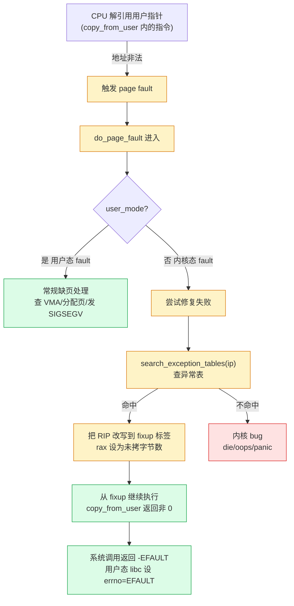
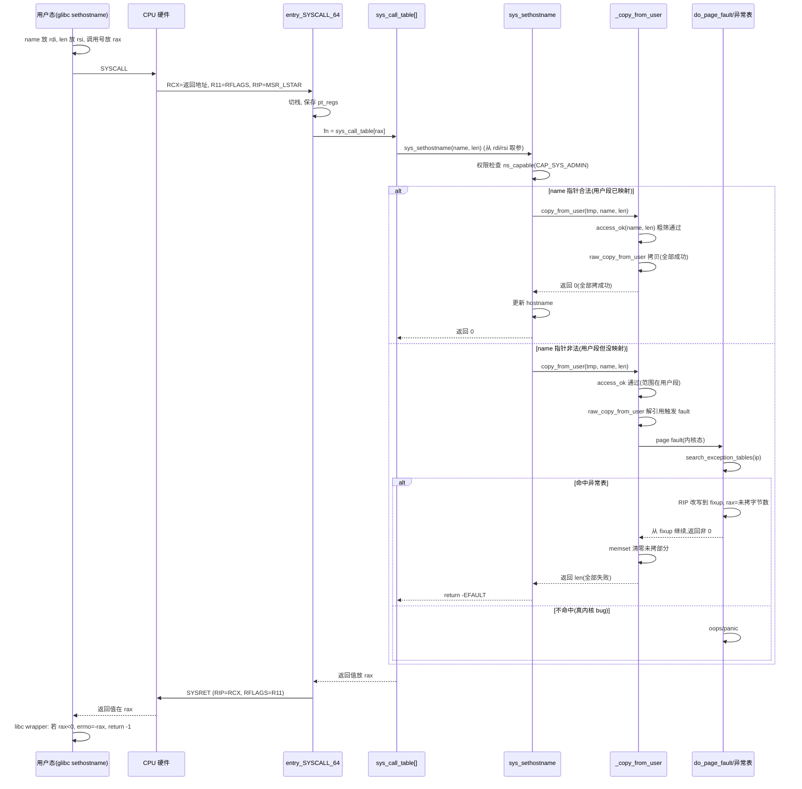

# 第九章 · 参数传递与系统调用返回

> 篇:P2 系统调用
> 主线呼应:上一章我们讲完了"用户态怎么合法进内核"——`SYSCALL` 指令 MSR 直跳、`sys_call_table[]` 用调用号分发、`SYSCALL_DEFINE*` 宏三层别名把 C 函数注册进表。但那只解决了"控制权怎么进来",没解决"**数据怎么进来**"。一个 `read(fd, buf, 100)`,`fd` 是个整数,好办,寄存器里就传完了;但 `buf` 是个用户态指针——内核要往这个指针写的 100 字节,得真的落到用户进程的地址空间里。问题是:**用户传进来的指针可能是非法的**(没映射、只读、甚至干脆是个内核地址),内核如果直接解引用,触发的是**内核态 page fault**,轻则 oops、重则 panic。所以内核必须有一套"安全地从用户态搬数据"的机制——`copy_from_user`/`copy_to_user`、`get_user`/`put_user`,以及它们底下那张救命的 `__ex_table`(异常表)。读完本章,你能讲清一次系统调用的参数怎么从用户态安全进内核、返回值怎么从内核出去、以及为什么内核访问非法用户指针**不会**把机器搞挂。

## 核心问题

**用户态传给内核的指针,内核凭什么能安全访问?六参寄存器约定(rdi/rsi/rdx/r10/r8/r9)和超过六参的栈传参是怎么回事?系统调用返回值为什么是"0 成功、负数 -errno",libc 又怎么把这个负数翻成用户看到的正 errno?最硬核的:`copy_from_user` 访问非法用户指针触发内核态 page fault 时,内核为什么不会 panic,而是优雅返回 `-EFAULT`?**

读完本章你会明白:

1. **x86_64 系统调用六参寄存器约定**:`rdi`/`rsi`/`rdx`/`r10`/`r8`/`r9`(注意第四个是 `r10` 不是 `rcx`,因为 `SYSCALL` 硬件占用了 `rcx`),超过六个参数走用户栈 + `copy_from_user`。
2. **`copy_from_user`/`copy_to_user` 的两层防线**:`access_ok` 做粗粒度范围检查(指针确实指向用户态、没跨界到内核地址),真正兜底的是 `__ex_table` 异常表——任意一条用户态访问指令都能挂"出错时跳哪"的 fixup 标签。
3. **`__ex_table` 异常表机制**:编译期把每条可能触发 fault 的"用户态访问指令地址 + 修复地址"填进表里,page fault 入口(do_page_fault 路径)用 `search_exception_tables(ip)` 查表,命中就把 RIP 改写到 fixup 标签、返回 `-EFAULT`,不命中才走"内核 bug"路径(oops/panic)。
4. **`-errno` 返回约定**:内核返回负数(如 `-EFAULT`=-14),libc 从 `rax` 取出后翻成正数写进 `errno`、并让系统调用 wrapper 返回 `-1`。这是用户态和内核态对"错误"的统一编码。
5. **`SYSCALL_DEFINE*` 宏不只是声明函数**:它还包了一层参数符号扩展(寄存器 64 位 → C 类型)、加了 ftrace 元数据——上一章讲过,本章从"参数怎么进来"角度再补一刀。

> **逃生阀**:如果你只关心"`copy_from_user` 凭什么不 panic",直接跳到 9.4 节(`access_ok` 粗筛)+ 9.6 节(技巧精解:`__ex_table` fixup)。9.2 节的寄存器约定如果你懂 ABI,可以略读。但 9.5 节的"`access_ok` 只是粗筛、真正兜底靠 fixup 表"是大多数人(包括很多老资料)讲错的点,务必读。

---

## 9.1 一句话点破

> **系统调用的参数传递,本质是"跨地址空间搬数据"——用户进程的虚拟地址和内核的虚拟地址不是同一套(内核在用户进程的高地址 half 有映射,但用户指针可能根本没映射、或只读、或越界指到内核段),所以内核不能直接解引用用户指针。x86_64 用六个寄存器把最常用的参数零开销传进来(快路径);参数里有指针的,内核用 `copy_from_user`/`copy_to_user` 这套"带容错"的拷贝函数访问它们——先 `access_ok` 粗筛指针确实落在用户段,再靠 `__ex_table` 异常表兜底:一旦拷贝途中某条指令触发 page fault,fault 处理路径查表找到这条指令挂的 fixup 标签、把执行流改写到那里,返回 `-EFAULT`。整个过程"用户传错指针"被降级成"一次正常错误返回",绝不会 panic。**

这是结论,不是理由。本章倒过来拆:先看六参寄存器约定(为什么是这六个、超过六个怎么办),再看"用户指针为什么不能直接解引用"(特权级 + 地址空间隔离的后果),然后看 `access_ok` 的粗筛边界,最后钻进 `__ex_table` 异常表这条真正的安全命脉,末尾讲 `-errno` 返回约定。

---

## 9.2 六个寄存器传参:r10 为什么顶替 rcx

上一章讲过,`SYSCALL` 指令硬件进内核时,把返回地址塞进 `rcx`、flags 塞进 `r11`——这两个寄存器被硬件征用了。这直接影响了系统调用的参数寄存器选择。

x86_64 的普通函数调用 ABI(System V AMD64)用六个寄存器传参,依次是 `rdi`/`rsi`/`rdx`/`rcx`/`r8`/`r9`。但系统调用 ABI 把**第四个参数从 `rcx` 换成了 `r10`**,顺序变成:

| 参数位置 | 系统调用 ABI 寄存器 | 普通函数 ABI 寄存器 | 说明 |
|---|---|---|---|
| 第 1 个 | `rdi` | `rdi` | 一致 |
| 第 2 个 | `rsi` | `rsi` | 一致 |
| 第 3 个 | `rdx` | `rdx` | 一致 |
| 第 4 个 | **`r10`** | `rcx` | **不同!`SYSCALL` 占了 `rcx`** |
| 第 5 个 | `r8` | `r8` | 一致 |
| 第 6 个 | `r9` | `r9` | 一致 |
| 返回值 | `rax` | `rax` | 一致 |

为什么第四个改用 `r10`?因为 `SYSCALL` 硬件把返回地址固定塞进 `rcx`——用户态执行 `SYSCALL` 那一刻,`rcx` 的内容就被覆盖了。如果系统调用参数也用 `rcx`,用户态在 `SYSCALL` 前往 `rcx` 放的参数会被硬件瞬间冲掉。x86_64 ABI 设计者选了 `r10` 接替:`r10` 在普通 ABI 里是调用者保存的临时寄存器(caller-saved),不在固定传参序列里,挪给它做系统调用第四参,代价最小。

> **不这样会怎样**:如果系统调用硬要按普通 ABI 用 `rcx` 传第四参,那 `SYSCALL` 进内核后,内核还得从"被硬件覆盖前的 `rcx`"里取参数——但这个旧值已经丢了(硬件没保存它)。要么用户态在 `SYSCALL` 前把 `rcx` 手动压栈、内核入口再弹出,徒增开销;要么 `SYSCALL` 硬件改设计同时保存 `rcx`,但那又走回 `int 0x80` 那套"硬件压栈"的老路,丢了快路径的意义。**改用 `r10` 是用"换一个寄存器"换"硬件零开销",这是 ABI 和指令设计协同的结果。**

glibc 的系统调用 wrapper(比如 `read` 的封装)知道自己得把第四参放进 `r10` 而不是 `rcx`,这是 ABI 约定,编译器不帮你做(因为 `read` 是 syscall wrapper,不是普通函数)。

那超过六个参数的系统调用怎么办?Linux 的设计选择是:**几乎不造超过六参的系统调用**。历史上极少数(比如老的 `mmap` 在某些架构要 6 个参数已经到上限、`clone` 在 x86_64 也正好 5 个)实在要传更多,就用一个**用户态结构体**包起来,内核用 `copy_from_user` 把整个结构体拷进来——这把"传参"问题转成了"搬数据"问题(下一节详讲)。

> **钉死这件事**:六参寄存器约定是系统调用 ABI 的基础,直接决定了"哪些系统能用寄存器零开销传、哪些得走结构体拷贝"。`r10` 顶替 `rcx` 这件事,是 `SYSCALL` 指令设计留下的烙印——硬件给了一条快路径,代价是抢走一个寄存器,ABI 只能配合。下次你 `strace` 看到一个系统调用的参数,知道它们就是从这六个寄存器里来的。

---

## 9.3 用户指针为什么不能直接解引用

参数从寄存器进来,如果参数是个**指针**(比如 `read(fd, buf, 100)` 的 `buf`、`sethostname(name, len)` 的 `name`),内核拿到的是用户进程虚拟地址空间里的一个地址。内核要访问这个地址,最朴素的写法是直接 `*buf`——但这在内核里**是错的**,而且错得非常危险。

原因有三层:

**第一层:地址空间隔离的硬件事实。** x86_64 的虚拟地址空间是 64 位(实际用 48 位 = 256 TB),分两半:低半(`0x0000_0000_0000_0000` ~ `0x0000_7fff_ffff_ffff`)是用户态,高半(`0xffff_8000_0000_0000` ~ `0xffff_ffff_ffff_ffff`)是内核态。每个进程有自己的页表,用户进程的页表只映射了低半用户段(加上高半里内核那段的共享映射,内核在所有进程地址空间里都映射着)。用户传进来的指针 `buf`,在用户进程的页表里**可能根本没有映射**(用户 malloc 了没填、或者已经 free 了、或者越界访问栈外的地址)。

**第二层:用户指针可能跨界到内核地址。** 一个恶意(或有 bug)的用户进程完全可以传一个 `buf = 0xffff_8000_0000_0000`(内核段地址)给 `read`,让内核把读到的数据写到内核内存里——如果内核直接 `*buf = data`,那就是**用户进程往内核内存写数据**,特权级隔离形同虚设。或者反过来,用户传一个内核地址给 `write` 的 `buf`,内核直接读 `*buf`,可能把内核里的敏感数据(密码、密钥)读出来返回给用户。

**第三层:用户指针可能只读。** 用户进程把一段只读 mmap 的内存(比如代码段)传给 `write`,内核直接往里写会触发写时复制 fault,但这个 fault 发生在**内核态**,处理逻辑和用户态 fault 完全不同。

> **不这样会怎样**:如果内核直接解引用用户指针 `*buf`,那 ① 用户传一个没映射的地址,内核态触发 page fault——这种 fault 如果内核没预期、没处理,会走"内核访问了不该访问的地址"路径,直接 oops(打栈、杀进程或 panic);② 用户传一个内核地址,内核直接信了,用户进程能任意读写内核内存,安全直接破。**这两种后果都不可接受**,所以内核绝不能直接解引用用户指针,必须走一套"我知道这里访问用户指针、出错了请别 panic"的专用路径。

这套专用路径,就是 `copy_from_user`/`copy_to_user` + 底下的 `__ex_table`。

---

## 9.4 access_ok:粗粒度的范围筛选

内核不直接解引用,第一步防线是 `access_ok`——它回答一个问题:**这个指针 + 长度,是不是确实落在用户态地址段?**

`access_ok(addr, size)` 在 x86_64 上的逻辑(简化,真身在 `arch/x86/include/asm/uaccess.h`,未 sparse clone)极其简单:检查 `addr + size` 不超过用户段上界(`TASK_SIZE`,即 `0x0000_7fff_ffff_ffff`)。也就是:

```c
/* 简化示意,非源码原文(arch/x86/include/asm/uaccess.h 未 sparse) */
static inline bool __access_ok(const void __user *addr, unsigned long size)
{
    if (IS_ENABLED(CONFIG_ALTERNATE_USER_ADDRESS_SPACE))
        return true;
    return (unsigned long)addr <= TASK_SIZE_MAX - size;
}
```

注意它**只检查范围**,不检查这段地址有没有真的映射、有没有权限。也就是说,`access_ok` 能挡住"用户传一个内核段地址"(因为内核段地址 > `TASK_SIZE`),但挡不住"用户传一个用户段的、没映射的地址"。

为什么 `access_ok` 不做得更细(比如真的去查页表有没有映射)?因为**那太贵了**。系统调用是高频操作,每次 `copy_from_user` 都去遍历页表(或抢 mmap 锁查 VMA),开销巨大。`access_ok` 只做最便宜的"范围筛",真正的"地址有没有映射"留给 CPU 硬件——如果地址真没映射,CPU 解引用时硬件自己触发 page fault,内核再用 `__ex_table` 把这个 fault 安全收编。

> **所以这样设计**:`access_ok` 是"便宜的粗筛",挡掉 99% 的恶意尝试(用户传内核地址);剩下 1%"用户段的非法地址"交给硬件 fault + `__ex_table` 兜底。这是**软件粗筛 + 硬件细筛**的分工——软件只做能做的(O(1) 比较),硬件擅长的事(地址翻译、权限检查)交给硬件,出错用异常表收编。这种分工把"安全检查的开销"从每次拷贝压到了几乎为零。

> **钉死这件事**:`access_ok` **不是**"保证这个地址可以访问",它只是"保证这个地址不是内核地址"。很多老资料/教程讲"`access_ok` 检查用户指针合法性",这是不准确的——它只查范围,不查映射。真正的"地址能不能访问"由 `__ex_table` 兜底(下一节)。理解这一点,才能理解为什么 `copy_from_user` 仍然可能在拷贝途中 fault。

---

## 9.5 copy_from_user:两层防线的合体

把 `access_ok` 和 `__ex_table` 拼起来,就是 `copy_from_user` 的完整逻辑。先看它在 [`include/linux/uaccess.h`](../linux/include/linux/uaccess.h#L143-L156) 里的真实定义(`INLINE_COPY_FROM_USER` 分支,等价于 `lib/usercopy.c` 里 x86 实际用的 extern 版本):

```c
/* include/linux/uaccess.h:143 */
static inline __must_check unsigned long
_copy_from_user(void *to, const void __user *from, unsigned long n)
{
    unsigned long res = n;
    might_fault();
    if (!should_fail_usercopy() && likely(access_ok(from, n))) {
        instrument_copy_from_user_before(to, from, n);
        res = raw_copy_from_user(to, from, n);
        instrument_copy_from_user_after(to, from, n, res);
    }
    if (unlikely(res))
        memset(to + (n - res), 0, res);    /* 失败的部分清零,防信息泄漏 */
    return res;     /* 返回"没拷成功的字节数",0 表示全部成功 */
}
```

逐行拆:

1. **`might_fault()`**:调试宏,`CONFIG_DEBUG_ATOMIC_SLEEP` 开时检查"这里能不能 fault"——如果你在原子上下文(持有自旋锁、中断里)调 `copy_from_user`,`might_fault` 会警告,因为 fault 会睡眠。
2. **`access_ok(from, n)`**:**第一道防线**。粗筛 `from` 是不是用户段地址。不通过,直接跳过拷贝,`res` 保持 `n`(全部失败)。
3. **`raw_copy_from_user(to, from, n)`**:**真正的拷贝**,arch 原语(x86 上是一段汇编 `rep movsb` 或 SIMD 拷贝,里面每条访问用户内存的指令都挂在 `__ex_table` 上)。这是**第二道防线**生效的地方——拷贝途中任意一条指令 fault,`__ex_table` 接管。
4. **`memset(to + (n - res), 0, res)`**:**失败的部分清零**。这是安全要求:如果 `copy_from_user` 只拷了一半就 fault,没拷到的部分(`res` 字节)必须清零,否则 `to` 里残留的内核旧数据会泄漏给后续逻辑(用户进程可能通过后续系统调用读到)。

注意**返回值约定**:`copy_from_user` 返回的是"**没拷成功的字节数**"(0 = 全部成功,n = 全部失败)。所以调用方写:

```c
if (copy_from_user(kernel_buf, user_ptr, len))
    return -EFAULT;     /* 有没拷到的字节,返回 -EFAULT */
```

`copy_to_user`([uaccess.h:163](../linux/include/linux/uaccess.h#L163-L176))是对称的——从内核拷到用户,返回没拷成功的字节数。它不需要清零(用户原本就有自己的数据)。

`get_user`/`put_user` 是 1/2/4/8 字节的轻量版本(读一个 int、写一个 long 这种),底层也是"挂在 `__ex_table` 上的单条指令"。看一个真实用法,`getresgid` 系统调用([kernel/sys.c:836](../linux/kernel/sys.c#L836-L857)):

```c
/* kernel/sys.c:836 */
SYSCALL_DEFINE3(getresgid, gid_t __user *, rgidp, gid_t __user *, egidp, gid_t __user *, sgidp)
{
    const struct cred *cred = current_cred();
    int retval;
    gid_t rgid, egid, sgid;

    rgid = from_kgid_munged(cred->user_ns, cred->gid);
    egid = from_kgid_munged(cred->user_ns, cred->egid);
    sgid = from_kgid_munged(cred->user_ns, cred->sgid);

    retval = put_user(rgid, rgidp);       /* 把 rgid 写到用户指针 rgidp */
    if (!retval) {
        retval = put_user(egid, egidp);
        if (!retval)
            retval = put_user(sgid, sgidp);
    }
    return retval;   /* put_user 失败返回 -EFAULT,成功返回 0 */
}
```

三个用户态指针 `rgidp`/`egidp`/`sgidp`,内核分别用 `put_user` 把 gid 写过去。任意一个 `put_user` 失败(用户传了非法指针),返回 `-EFAULT`,用户态 libc 拿到 `-EFAULT` 后设 `errno = EFAULT`。

再看一个 `copy_from_user` 的典型用法,`sethostname`([kernel/sys.c:1374](../linux/kernel/sys.c#L1374-L1399)):

```c
/* kernel/sys.c:1374(简化,保留核心) */
SYSCALL_DEFINE2(sethostname, char __user *, name, int, len)
{
    int errno;
    char tmp[__NEW_UTS_LEN];        /* 内核栈上的临时缓冲区 */

    if (!ns_capable(current->nsproxy->uts_ns->user_ns, CAP_SYS_ADMIN))
        return -EPERM;
    if (len < 0 || len > __NEW_UTS_LEN)
        return -EINVAL;
    errno = -EFAULT;
    if (!copy_from_user(tmp, name, len)) {     /* 从用户拷到内核栈 */
        /* ... 拷成功,用 tmp 更新 hostname ... */
        errno = 0;
    }
    return errno;
}
```

关键模式:**先把用户数据拷到内核栈上的临时缓冲 `tmp`,确认拷成功了再信任这份数据**。绝不能一边 `*name` 一边用——必须先"过一道边界"拷进来,之后只用内核这份拷贝。这是防 TOCTOU(time-of-check-to-time-of-use)的工程纪律:用户内存随时可能被另一个线程改,你检查完 `name` 的内容,下一秒用户线程就改了它;所以必须先拷成内核私有副本。

> **钉死这件事**:`copy_from_user`/`copy_to_user`/`get_user`/`put_user` 这套 API 把"跨地址空间搬数据"封装成了"带容错的拷贝"——`access_ok` 粗筛 + `__ex_table` 兜底 + 失败清零,三层合起来保证"用户传任何指针都不会让内核 panic,最坏返回 `-EFAULT`"。这套机制是系统调用参数传递的正确性命脉,下一节钻它最硬核的部分:`__ex_table` 怎么工作。

---

## 9.6 技巧精解:__ex_table 异常表——让内核态 page fault 安全降级

这是本章最硬核的技巧,也是 Linux uaccess 机制真正"sound"的根基。

### 问题:内核态 page fault 该怎么处理

CPU 解引用一个虚拟地址,如果这个地址在页表里没映射、或权限不对(读/写/执行位),CPU 触发 **page fault** 异常。fault 处理路径(`do_page_fault` → `handle_mm_fault`,在 x86 是 `arch/x86/mm/fault.c`,未 sparse clone;通用逻辑在 `mm/memory.c`)会做几件事:分配物理页(延迟分配)、处理写时复制、换入换出页、或者——**如果地址真非法、没法修复**,给当前进程发 `SIGSEGV`。

但这里有个关键分支:**fault 发生在用户态还是内核态?**

- **用户态 fault**(用户进程自己访问非法地址):正常流程,内核查 VMA、发现地址非法、给进程发 `SIGSEGV`——这就是用户程序"段错误"的来源。
- **内核态 fault**(内核代码访问非法地址):这里要细分。可能是 ① 内核有 bug(访问了野指针、空指针),这种要 oops/panic;也可能是 ② 内核在执行 `copy_from_user` 这种"已知可能 fault"的指令,fault 是预期的、用户传错指针导致的——这种**必须**安全降级成 `-EFAULT`,不能 oops。

内核怎么区分这两种情况?答案就是 **`__ex_table`(异常表)**。

### 异常表是什么:编译期给每条危险指令挂"出错时跳哪"

`__ex_table` 是一个**编译期生成的表**,每一项是一个 `struct exception_table_entry`(定义在 `asm/` 的 `uaccess.h`,通过 [`include/linux/extable.h`](../linux/include/linux/extable.h#L9) 前向声明):

```c
/* 简化,真身在 arch/x86/include/asm/uaccess.h(未 sparse) */
struct exception_table_entry {
    int insn;       /* 可能触发 fault 的指令地址(相对偏移) */
    int fixup;      /* fault 时跳转到的修复地址(相对偏移) */
};
```

每条**可能访问用户内存、可能 fault** 的指令(比如 `raw_copy_from_user` 里的每条 `mov`/`rep movsb`、`get_user` 里的 `mov`),编译器(实际是内核源码里手写的汇编 `.ex_table` 段)都在表里登记一项:**"如果这条指令地址 `insn` 触发了 page fault,别走默认的 oops 路径,把 RIP 改写到 `fixup` 这个标签继续执行"**。

汇编层面长这样(简化,arch/x86/lib/copy_user_*.S,未 sparse clone):

```asm
/* 简化示意,非源码原文(arch/x86/lib/copy_user_64.S) */
ENTRY(copy_from_user)
    mov %rdi, %rax          /* to */
    mov %rsi, %rdx          /* from */
    mov %rcx, %r8           /* n */
    /* ... 实际拷贝循环 ... */
.Lcopy_loop:
    movb (%rsi), %dl        /* 从用户地址 from 读 1 字节(这条可能 fault!) */
    movb %dl, (%rdi)        /* 写到内核地址 to */
    inc %rsi
    inc %rdi
    dec %r8
    jnz .Lcopy_loop
    xor %rax, %rax          /* 成功,返回 0 */
    ret
.Lcopy_fault:               /* fixup 标签:fault 时跳到这里 */
    mov %r8, %rax           /* 返回没拷完的字节数 */
    ret

    /* 把"指令地址 → fixup 地址"登记进 .ex_table 段 */
    .section __ex_table,"a"
    .balign 4
    .long .Lcopy_loop       /* insn:可能 fault 的指令地址 */
    .long .Lcopy_fault      /* fixup:fault 时跳这 */
    .previous
```

`.section __ex_table,"a"` 这段把"`.Lcopy_loop` 这条指令如果 fault,跳到 `.Lcopy_fault`"这条规则写进内核镜像的 `__ex_table` 段。链接时,所有 `.o` 文件的 `__ex_table` 段合并成一个全局数组,这就是内核的"异常表"。`copy_from_user`、`copy_to_user`、`get_user`、`put_user`、`__get_user`、`__put_user`——所有用户态访问原语,每条危险指令都这么登记。

### fault 处理路径:查表跳转

page fault 发生在内核态时,fault 处理路径(`do_page_fault` → ... → 找不到合法 VMA、判定无法修复)会做最后一次尝试:**查 `__ex_table` 看 fault 指令是不是登记过**。这个查找的入口是 [`search_exception_tables`](../linux/include/linux/extable.h#L21)(声明在 [extable.h:21](../linux/include/linux/extable.h#L21),实现在 `kernel/extable.c` 未 sparse、`lib/` 下),它用 fault 指令的地址(`ip`/`RIP`)在异常表里二分查找:

```c
/* 简化,非源码原文(kernel/extable.c 未 sparse) */
const struct exception_table_entry *
search_exception_tables(unsigned long add)
{
    /* 在内核主异常表里查 */
    e = search_extable(__start___ex_table,
                       __stop___ex_table - __start___ex_table,
                       add);
    if (e)
        return e;
    /* 再到各模块的异常表里查 */
    return search_module_extables(add);
}
```

**命中**:fault 指令登记过。fault 处理路径把 `pt_regs->ip` 改写成表里的 `fixup` 地址、`pt_regs->ax` 设成"没拷成功的字节数"(`copy_from_user` 的失败返回值)、返回。CPU 接着从 `fixup` 标签继续执行——也就是直接跳到 `copy_from_user` 的错误返回路径,把这个 fault 当成"一次正常的拷贝失败"。

**不命中**:fault 指令没登记。这才是真正的"内核 bug"——`do_page_fault` 走 `die()`/`do_sigbus` 路径,打 oops、可能 panic。

我们可以看到这套机制在 `mm/memory.c` 里留下的痕迹——`get_mmap_lock_carefully`([mm/memory.c:5631](../linux/mm/memory.c#L5631-L5640))在拿 mmap 锁前先查异常表:

```c
/* mm/memory.c:5631 */
static inline bool get_mmap_lock_carefully(struct mm_struct *mm, struct pt_regs *regs)
{
    if (likely(mmap_read_trylock(mm)))
        return true;

    if (regs && !user_mode(regs)) {                 /* fault 发生在内核态 */
        unsigned long ip = exception_ip(regs);
        if (!search_exception_tables(ip))           /* fault 指令没在异常表里 */
            return false;                           /* 不是 copy_from_user,拒绝死等 */
    }
    return !mmap_read_lock_killable(mm);            /* 在异常表里,允许小心地等锁 */
}
```

这段逻辑极其精妙:fault 发生在内核态时,如果 fault 指令登记在异常表里(说明这是 `copy_from_user` 这类"预期 fault"),就允许它等 mmap 锁(可能睡眠——`copy_from_user` 本来就可能因为换页而睡眠);如果没登记(说明是内核野指针),直接拒绝——避免一个内核 bug 把整个 fault 路径拖进死等。`search_exception_tables(ip)` 这一行,就是"区分预期 fault 和内核 bug"的命门。



### 反面对比:如果没有 __ex_table

> **不这样会怎样**:如果没有 `__ex_table` 这套机制,`copy_from_user` 就只能靠 `access_ok` 把关。但前面讲过,`access_ok` 只查范围、不查映射——用户传一个"用户段内但没映射"的地址(比如刚 `munmap` 掉的),`access_ok` 放行,`raw_copy_from_user` 解引用就触发内核态 page fault。这个 fault 没法修复(地址确实没映射),fault 处理路径找不到合法 VMA,**只能判定为"内核 bug"——打 oops、根据配置可能 panic**。

  也就是说,任何一个用户进程只要给系统调用传一个非法指针,就能让整个内核 oops——一次普通的 `read(fd, NULL, 100)` 就能把机器搞挂,这种脆弱性在多用户系统上根本不可接受。

  有了 `__ex_table`,`copy_from_user` 里的每条指令都登记了"出错跳哪",fault 处理路径查表命中后,把执行流改写到 fixup 标签,**用户传错指针被降级成一次正常的 `-EFAULT` 返回**。这正是"用户不可信输入"应该有的处理——不是内核崩,是告诉用户"你传错了"。

### 为什么这套设计 sound

`__ex_table` 这套机制的精妙在于它把"用户指针可能非法"这个**本质上不可预测**的情况(用户随时可能传任何指针),用**编译期静态登记 + 运行时查表**的方式,转成了"每条危险指令都有预案"的确定性系统。几个关键点:

1. **零运行时开销(快路径)**:正常拷贝成功时,`__ex_table` 完全不参与——表是编译期生成的静态数据,运行时不查、不影响拷贝速度。只有 fault 时才查一次二分。这是"为可能的错误准备路径,但不拖累正常路径"的典范。

2. **指令粒度精确**:每条可能 fault 的指令单独登记,fixup 地址也单独——`copy_from_user` 拷到一半 fault,fault 跳到 fixup 时,fixup 能根据当前已拷字节数(寄存器里的计数)算出"还剩多少没拷",返回准确的"未拷字节数"。

3. **自动覆盖所有用户态访问原语**:`copy_from_user`/`copy_to_user`/`get_user`/`put_user` 所有这些宏展开后,内部的汇编都自带 `.ex_table` 登记。内核开发者写驱动时调 `copy_from_user`,不需要手动处理 fault——fault 自动被 fixup 接管。这是**把"安全容错"做进基础设施**的工程美学。

4. **同时覆盖 BPF JIT 出来的代码**:JIT 编译的 BPF 程序也可能访问内核内存、可能 fault,所以内核也给 BPF 程序生成异常表(`search_bpf_extables`,见 [extable.h:37](../linux/include/linux/extable.h#L37))。同一套 fault-lookup 机制服务多个"可能 fault 的代码源"——内核原生代码、内核模块、BPF JIT。这是机制的**可扩展性**。

> **钉死这件事**:`__ex_table` 是 Linux uaccess 机制真正的安全命脉——它让"用户传非法指针"从"内核 oops 的灾难"降级成"一次 `-EFAULT` 的正常错误返回"。`access_ok` 只是粗筛,真正兜底的是异常表 + fault 路径的查表改写。下次你看到任何讲"`copy_from_user` 安全因为 `access_ok` 检查"的资料,你该在心里补一句:"`access_ok` 是粗筛,真正救命的叫 `__ex_table`。"

---

## 9.7 返回值约定:0 成功、负数 -errno

参数进来了、内核处理完了,接下来是**返回值**怎么从内核出去。Linux 系统调用的返回值约定是**整个 Unix 世界的基石**,但很多人没注意它的精妙。

约定:

- **成功**:返回值 ≥ 0(具体含义看系统调用,`read` 返回读到的字节数、`open` 返回 fd、`getpid` 返回 pid)。
- **失败**:返回值是一个**负数**,这个负数的绝对值就是 `errno` 常量。比如 `-EFAULT` = -14(`EFAULT` = 14)、`-EINVAL` = -22、`-EPERM` = -1。

内核侧,`sys_xxx` 函数直接 `return -EFAULT;`——`EFAULT` 是个正数常量(在 `include/uapi/asm-generic/errno-base.h`),前面加个负号就是负数。这个负数塞进 `rax`(上一章 `do_syscall_64` 里 `regs->ax = fn(...)`),`SYSRET` 把 `rax` 返回给用户态。

用户态 libc 的系统调用 wrapper(比如 glibc 的 `read` 封装)从 `rax` 拿到这个返回值,做一件极简单的事:

```c
/* 简化示意,非源码原文(描述 libc 行为) */
long result;
asm volatile("syscall" : "=a"(result) : "0"(SYS_read), ...);

if (result >= 0) {
    return result;          /* 成功,直接返回 */
} else {
    errno = -result;        /* 失败,把负数翻成正 errno */
    return -1;              /* 系统调用 wrapper 统一返回 -1 */
}
```

也就是说,**用户看到的接口是"成功返回值/失败返回 -1 + errno"**,而**内核看到的接口是"成功返回值/失败返回 -errno"**。中间这层"翻号"由 libc 完成。这个约定的好处是:**errno 不需要单独的寄存器传**——一个 `rax` 既表达了"成功还是失败"(看正负),又表达了"失败的具体原因"(负数的绝对值)。系统调用是最频繁的内核-用户边界跨越,每省一个寄存器、每省一次内存访问都是实打实的收益。

看真实代码,`sethostname`([kernel/sys.c:1390](../linux/kernel/sys.c#L1390-L1399))失败时:

```c
/* kernel/sys.c:1382-1399(简化) */
errno = -EFAULT;
if (!copy_from_user(tmp, name, len)) {
    /* ... 拷成功 ... */
    errno = 0;              /* 成功标记 */
}
return errno;               /* 失败返回 -EFAULT,成功返回 0 */
```

注意变量名 `errno`——这是**内核侧**的局部变量,和用户态 libc 的 `errno` 不是一回事(很多初学者会搞混)。内核函数返回 `-EFAULT` 这个负数,libc wrapper 拿到后翻成 `errno = EFAULT`(正 14)、向用户返回 `-1`。

一个特例:`getpid`([kernel/sys.c:958](../linux/kernel/sys.c#L958-L960))这种"不可能失败"的系统调用,直接 `return task_tgid_vnr(current);`——返回值是正的 pid,没有错误路径。但即使这种,内核 ABI 仍然规定"负数表示错误",所以 pid 永远是正的(不会和错误码冲突)。

> **反面对比**:如果内核-用户之间不约定"负数 = 错误",而是用一个单独的标志寄存器(比如 `CF` 标志位)表示"出错"+ 另一个寄存器存 errno,那 libc wrapper 就得读两个寄存器、做两次判断——多一次内存访问、多一次分支。Linux 的"负数 = -errno"约定,用一个 `rax` 同时表达"成功/失败"和"失败原因",是**最省的接口设计**。Windows 的某些 API 用 `GetLastError()` 这种全局变量,本质上也是为了避免占用返回值寄存器,但全局变量的开销(一次 TLS 访问)比"翻号"更高。Linux 的约定更精炼。

> **钉死这件事**:`-errno` 约定是系统调用 ABI 的一部分——内核返回负数、libc 翻成正 errno。这套约定是 Unix 几十年稳定下来的接口设计,几乎不可能再变。下次你看到内核代码里 `return -EINVAL;`,你该知道这个负数会一路走 `rax` → `SYSRET` → libc wrapper → `errno = EINVAL` → 用户程序看到 `-1`。

---

## 9.8 参数 + 返回的完整时序

把六参寄存器、`copy_from_user`、`__ex_table`、`-errno` 返回拼起来,一次带用户指针的系统调用(以 `sethostname(name, len)` 为例)完整时序:



正常路径(用户指针合法)和容错路径(用户指针非法)在 `__ex_table` 这里分叉——前者零开销,后者查一次表后优雅降级。无论哪条,用户态拿到的都是一个明确的返回值(0 或 -EFAULT),机器绝不会因为"用户传了一个错指针"而崩。

---

## 章末小结

这一章讲的是二分法"进内核"那一面的**数据流**——上一章讲了"控制权怎么进"(SYSCALL + sys_call_table),本章讲了"数据怎么进、结果怎么出"。合起来,"用户主动合法进内核"这条线的入口、参数、返回三个环节就完整了。

### 五个"为什么"清单

1. **为什么系统调用第四个参数用 `r10` 而不是 `rcx`?** `SYSCALL` 指令硬件把返回地址固定塞进 `rcx`,占用了它;ABI 只能把第四参挪到 `r10`(普通函数 ABI 里 `r10` 是 caller-saved 临时寄存器,挪用代价最小)。这是指令设计和 ABI 协同的结果。

2. **为什么内核不能直接解引用用户指针?** 三层原因:① 用户指针可能没映射(用户进程页表里没这段);② 用户可能传内核地址,直接信了就破坏特权级隔离;③ 用户指针可能只读,fault 发生在内核态处理路径不同。必须走 `copy_from_user` 这套"带容错"的拷贝。

3. **`access_ok` 真的能保证指针可访问吗?** 不能。它只查"指针在不在用户段地址范围",不查映射、不查权限。它是粗筛,挡掉"用户传内核地址"这种恶意尝试;真正兜底"地址有没有映射"的是 `__ex_table`——CPU 硬件 fault + 异常表查表改写。

4. **`__ex_table` 异常表凭什么让内核不 panic?** 编译期把每条可能 fault 的用户态访问指令登记进表(fault 指令地址 → fixup 地址);page fault 发生在内核态时,fault 路径用 `search_exception_tables(ip)` 二分查表,命中就把 RIP 改写到 fixup、返回 `-EFAULT`,不命中才走 oops。这让"用户传错指针"降级成"正常错误返回"。

5. **为什么系统调用返回值用"负数 = -errno"?** 一个 `rax` 同时表达"成功/失败"(看正负)和"失败原因"(绝对值是 errno),不需要单独的标志寄存器或全局变量。libc wrapper 从 `rax` 取值,负数翻成正 errno、向用户返回 `-1`。这是最省的内核-用户接口设计。

### 想继续深入往哪钻

- **源码**:
  - [`include/linux/uaccess.h`](../linux/include/linux/uaccess.h)——`_copy_from_user`(L143)、`_copy_to_user`(L163)、`copy_from_user`(L180)、`copy_to_user`(L188)、`__copy_from_user`(L93)、`unsafe_get_user`/`unsafe_put_user`(L423-L426)的真实宏/内联定义。
  - [`include/linux/extable.h`](../linux/include/linux/extable.h)——异常表对外接口:`search_exception_tables`(L29)、`search_extable`(L11)、`search_module_extables`(L30)、`search_bpf_extables`(L38)。
  - [`mm/memory.c`](../linux/mm/memory.c)——`get_mmap_lock_carefully`(L5631)展示了 fault 路径用 `search_exception_tables(ip)`(L5638)区分"预期 fault"和"内核 bug"。
  - [`mm/usercopy.c`](../linux/mm/usercopy.c)——HARDENED_USERCOPY 的 `__check_object_size`(L213),额外的安全检查(防"把内核栈/内核文本当用户缓冲")。
  - [`kernel/sys.c`](../linux/kernel/sys.c)——真实系统调用示例:`getresgid`(L836,`put_user` 三次)、`sethostname`(L1374,`copy_from_user`)、`getpid`(L958,纯返回值)。
  - **arch/x86 未 sparse(在线读)**:`arch/x86/include/asm/uaccess.h`(`access_ok`、`get_user`/`put_user` 宏、`__get_user`/`__put_user` 内联汇编 + `.ex_table` 段嵌入);`arch/x86/lib/copy_user_64.S`(用户态拷贝汇编,每条指令带 `.ex_table` 登记);`arch/x86/mm/fault.c`(`do_page_fault` 路径,查异常表决定 fixup 还是 oops)。可上 [elixir.bootlin.com/linux/v6.9/source/arch/x86](https://elixir.bootlin.com/linux/v6.9/source/arch/x86) 读。
- **观测**:
  - `strace -e sethostname ./prog`——看系统调用的参数(包括用户指针地址)和返回值(0 或 `-EFAULT`)。
  - `strace` 看到的是"系统调用成功/失败",如果用户指针非法,你会看到 `sethostname(...) = -1 EFAULT (Bad address)`——这就是 `__ex_table` 救了一命的结果(没这表,这里就是 kernel oops)。
  - `/proc/<pid>/syscall`——看某进程当前在哪个系统调用、参数寄存器值(`rdi`/`rsi`/`rdx`/`r10`/`r8`/`r9`)。
  - `bpftrace -e 'tracepoint:syscalls:sys_enter_copy_from_user { ... }'`——钩用户拷贝入口看每次 `copy_from_user` 的源/目的/长度。
  - 想看异常表:崩溃内核时 `dmesg` 里 oops 栈常带 `IP:` 和异常表查询痕迹;`/sys/kernel/debug/page_owner` 间接相关;`crash` 工具能 dump 内核异常表。
- **延伸**:本章讲的 `copy_from_user` 的 fixup 机制,本质上和信号延迟投递(第 18 章)、中断上下半部切分(第 5 章)是同一类工程思路——**"把不可预测的异常用预先登记的预案收编,正常路径零开销"**。第 10 章 VDSO 会讲一个反过来的优化:既然 `gettimeofday` 这种系统调用每次都要进内核开销巨大,内核干脆把时间写在共享页、用户态直接读,完全不进内核,自然也不需要 `copy_from_user`。

### 引出下一章

讲完"参数怎么进、返回怎么出",系统调用这条合法通道的**正确性**就齐了——用户指针不会让内核崩、返回值干净编码。但还有个**性能**问题没解决:`gettimeofday`/`clock_gettime` 这种读时间的系统调用,一个高频服务每秒可能调百万次,每次都 `SYSCALL` 进内核、`sys_call_table` 分发、返回,光入口开销就扛不住。下一章讲 VDSO(Virtual Dynamic Shared Object)——内核把时间数据写在共享页,用户态直接读,**完全不进内核**,把"读时间"从一次系统调用变成一次普通内存读。这是"避免进内核"的极致优化,和本章的"安全进内核"形成有意思的对照。
