# 第十二篇 · clocksource/clockevent:硬件时钟抽象

> 篇:P3 时钟与定时器·第 1 章(全篇首章)
> 主线呼应:前两篇我们走完了"事件把控制权**拉进内核**"的两条主线——中断(第 1 篇)和系统调用(第 2 篇)。从本章开始进入第 3 篇,视角反过来:这一篇讲的是**内核主动向外**的那一面——时钟。时钟硬件(每个 CPU 一颗本地定时器、外加一个全局时钟源)周期性地或按需给 CPU 发中断,内核借这颗"心跳"驱动三件事:调度的时间片(回扣第 11 本《调度器》P1-04 的 hrtick)、用户的 `sleep`/`setitimer` 定时器、墙上时间 `xtime` 的推进。但在讲这三件事之前,有一个绕不开的地基问题:**时钟硬件五花八门——x86 有 TSC/HPET/PIT/ACPI PM Timer,ARM 有 arch_timer,各种 SoC 还有自己的 MMIO 计数器——内核凭什么能用同一套代码对付它们?** 本章就是拆这个地基:Linux 用两套互补的抽象,`struct clocksource`(只读、单调、提供 `read()` 返回 cycle)和 `struct clock_event_device`(可编程、能设"下一个事件什么时候来")把所有时钟硬件统一掉。读完本章,你才能在下一章看懂 timekeeping 怎么把 cycle 换算成纳秒、在第 14 章看懂 hrtimer 怎么把"5ms 后叫醒我"翻译成"给 clock_event_device 编一个 5ms 的程序"。

## 核心问题

**时钟硬件千差万别——有的只会单调递增地数 cycle、有的能编程"到点发中断",有的是 64 位计数器有的是 32 位、有的在 CPU 深度睡眠(C 状态)里会停。内核怎么把这一坨硬件统一成"读出纳秒"和"到点叫我"两件事,还保证选中的时钟源真的稳定(TSC 偶尔会跑飞)?**

读完本章你会明白:

1. **两套抽象的分工**:`struct clocksource` 是**只读计数器**抽象,只回答"现在累计了多少 cycle";`struct clock_event_device` 是**可编程定时器**抽象,能回答"过 N 纳秒后给我发一个中断"。前者供 timekeeping 维护墙上时间,后者供 tick/hrtimer 触发到期。
2. **read() 抽象 + mult/shift 缩放数学**:时钟硬件给的是 cycle(比如 TSC 一个数代表 1/主频秒),内核用一个 `(cycle * mult) >> shift` 的纯整数算式把它换算成纳秒,不用浮点、不用除法——这背后的精度与溢出取舍是内核 C 的经典技巧。
3. **rating 评级 + 自动选最佳**:每个时钟源注册时带一个 rating(0~499),内核永远自动用 rating 最高的那个,TSC rating 400+,HPET 250 左右,所以你 `cat /sys/devices/system/clocksource/cp.../current_clocksource` 几乎总是看到 `tsc`。
4. **watchdog 互校与自动降级**:TSC 在某些场景(深度睡眠恢复、虚拟化迁移、CPU bug)会跑飞,内核用一个独立的 watchdog 时钟源(常是 HPET/jiffies)每 0.5 秒比对一次,TSC 一旦偏出阈值就被打 `CLOCK_SOURCE_UNSTABLE` 标记、rating 清零、自动切回 HPET——这是内核里少有的"硬件不可信时软件兜底"的范例。
5. **clock_event_device 的状态机与 set_next_event**:clock_event_device 有 `DETACHED/SHUTDOWN/PERIODIC/ONESHOT` 四态,高精度定时器模式必须用 ONESHOT,内核每到期一次就重新 `set_next_event` 编程下一个;这正是 hrtimer 高精度的物理基础。

> **逃生阀**:如果你已经知道 TSC 是什么、知道"墙上时间"和"定时器中断"是两件事,可以直接跳到 12.4(watchdog)和 12.6(技巧精解),那里是本章的硬核。但 12.2~12.3 的"为什么是两套抽象、为什么这么换算纳秒"是第 14 章 hrtimer 的前置,不建议跳。

---

## 12.1 一句话点破

> **时钟硬件本身干的只有两件事——要不就是"我自己一直在数 cycle,你来读",要不就是"你告诉我多久之后,我到点叫你"。Linux 把它们抽成两套结构,`struct clocksource` 抽前者(只读、单调、cycle 计数),`struct clock_event_device` 抽后者(可编程、发中断);然后用 rating 自动选最好的一个,再用一个 watchdog 时钟源盯着它——它一跑飞就自动降级。**

这是结论,不是理由。本章倒过来拆:先看为什么硬件不能直接暴露给驱动、必须抽象;再分别拆两套抽象各管什么;然后看 mult/shift 缩放数学凭什么精确又快;再看 watchdog 怎么自动检出 TSC 不稳定;最后落到 clock_event_device 的编程接口,引出第 14 章的 hrtimer。

---

## 12.2 为什么时钟硬件不能直接暴露

第 1 章我们立了二分法:中断/系统调用是"进内核",时钟/信号是"内核主动"。时钟属于"内核主动"那一面——它的硬件中断是内核**借来**驱动自己的心跳,不是为了响应外部设备。

但问题是:**CPU 旁边的时钟硬件,长得千奇百怪**。一台典型的 x86 服务器,同时在册的时钟硬件就有四五种:

| 硬件 | 提供者 | 特性 | 典型用途 |
|------|--------|------|----------|
| **TSC**(Time Stamp Counter) | CPU 内部,`rdtsc` 指令读 | 64 位计数器,每个时钟周期 +1,极快(几十周期可读),但历史上有不稳定问题 | 主力 clocksource |
| **HPET**(High Precision Event Timer) | 主板芯片组,MMIO 读 | 64 位计数器,~14MHz,稳定但慢(MMIO 访问几百~上千周期) | clocksource 备选 + broadcast |
| **PIT**(8253 Programmable Interval Timer) | 经典 ISA 设备 | 16 位计数器,~1.19MHz,老古董 | 仅启动早期 / 兜底 |
| **ACPI PM Timer** | ACPI 表声明,MMIO 读 | 24/32 位,~3.58MHz | 老平台备选 |
| **Local APIC Timer** | 每个 CPU 一颗 | 可编程定时中断,**C3 深睡会停**(`CLOCK_EVT_FEAT_C3STOP`) | 主力 clock_event_device |
| **ARM arch_timer** | ARM 架构通用定时器 | 既作 clocksource 又作 clock_event_device | ARM 平台主力 |

这些硬件不仅寄存器布局不同,有的甚至**语义**都不同:

- TSC 是**纯计数器**,只读,只告诉你"从某个起点到现在累计了多少 cycle"。它**不会主动通知你任何事**。
- Local APIC Timer 是**可编程定时器**,你往它的初始计数寄存器写一个值,它倒数到 0 就发一个中断。它**不告诉你"现在多少 cycle"**,只负责"到点叫你"。
- HPET 两边都能干(它有一个主计数器 + 若干个比较器/comparator,主计数器可当 clocksource,比较器可当 clock_event_device)。

> **不这样会怎样**:假设没有抽象,每个驱动自己直接读硬件——网卡驱动想知道"现在啥时候"得自己 `rdtsc` 再除以主频(可是主频是动态的、CPU 还可能变频);协议栈想设一个"50ms 后重传"的定时器得自己写 Local APIC Timer 寄存器(可是 APIC Timer 在 C3 会停、得有人接管广播);一台装了两颗不同 CPU 的机器上,两颗 CPU 的 TSC 可能不同步,谁来发现并修正?这些问题,**没有任何单个驱动能解决**——必须有一个全局框架,把所有时钟硬件收编,统一换算、统一调度、统一监督。

> **所以这样设计**:Linux 在 `kernel/time/clocksource.c` 和 `kernel/time/clockevents.c` 里立两套抽象。凡是"我是个计数器,你可以读我"的硬件,实现 `struct clocksource` 注册进来;凡是"我可以编程,到点给你发中断"的硬件,实现 `struct clock_event_device` 注册进来。timekeeping 子系统只认 `struct clocksource *`、tick/hrtimer 子系统只认 `struct clock_event_device *`,根本不在乎底下是 TSC 还是 arch_timer。

> **钉死这件事**:`clocksource` 和 `clock_event_device` 是两套独立抽象,不是同一套——它们各自有注册表、各自的 rating、各自的选优逻辑。一个物理硬件(比如 HPET)可以同时**既是 clocksource 又是 clock_event_device**(注册两次,挂到两张表),但抽象上是两个角色。这种"按角色而非按设备建模"的思路,和第 1 篇 IRQ 子系统的 `irq_chip`(操作接口)/`irq_domain`(号映射)切分是同一套工程哲学——**抽象要按"对方需要什么"切,不要按"硬件长什么样"切**。

---

## 12.3 clocksource:只读计数器抽象

先看"读出 cycle"这一套。`struct clocksource` 的核心就一个函数指针:

```c
/* include/linux/clocksource.h,简化自 struct clocksource */
struct clocksource {
    u64  (*read)(struct clocksource *cs);   /* 读出当前 cycle */
    u64  mask;                               /* 计数器位宽掩码,如 64 位 = U64_MAX */
    u32  mult;                               /* cycle→ns 的乘数 */
    u32  shift;                              /* 配合 mult 的位移 */
    u64  max_idle_ns;                        /* 最长可空闲多久不溢出 */
    u32  maxadj;                             /* mult 的最大允许调整量(~11%) */
    u32  uncertainty_margin;                 /* 读数不确定度,ns */
    const char *name;
    struct list_head list;                   /* 挂到全局 clocksource_list */
    int  rating;                             /* 评级,越大越优先 */
    unsigned long flags;                     /* CONTINUOUS/UNSTABLE/... */
    /* watchdog 相关字段:wd_list / cs_last / wd_last */
    /* suspend/resume/mark_unstable 等可选回调 */
};
```

> 见 [include/linux/clocksource.h:96-130](../linux/include/linux/clocksource.h#L96-L130)。

几个字段值得逐个讲:

### read 函数指针——把"读硬件"这个动作变成虚函数

`read` 是整个抽象的核心。TSC 的 read 是一句 `rdtsc` 汇编;HPET 的 read 是一次 MMIO load;ACPI PM Timer 的 read 也是一个 MMIO load;jiffies(终极兜底)的 read 就是读 `jiffies_64` 变量。内核不关心这些差异,只要 `read()` 返回一个 `u64 cycle` 就行。

timekeeping 子系统的读路径,核心就一行 `clock->read(clock)`:

```c
/* kernel/time/timekeeping.c:191(简化) */
static inline u64 tk_clock_read(const struct tk_read_base *tkr)
{
    struct clocksource *clock = READ_ONCE(tkr->clock);   /* 防 read 中途换源 */
    return clock->read(clock);
}
```

> 见 [timekeeping.c:191-196](../linux/kernel/time/timekeeping.c#L191-L196)。

注意这个 `READ_ONCE`——它不是花瓶。timekeeping 子系统会换 clocksource(后面讲 watchdog 降级),`tk_clock_read` 里如果先读 `tkr->clock`、再调 `clock->read`,两步之间若被 watchdog 线程把 `tkr->clock` 换成另一个源,就会用新源对象调旧源的 `read`(或反之),直接 panic。`READ_ONCE` 把"读指针"这一步变成不可分割的一次内存读,保证拿到的指针和调的 `read` 是同一个对象的。这是"读路径上也要防 TOCTOU"的典型例子,和第 8 本《内存分配器》里 per-CPU cache 读路径的 `READ_ONCE` 同出一辙。

### mask——处理"计数器会回绕"

TSC 是 64 位,基本不会回绕(几十亿年才回绕一次);但 ACPI PM Timer 只有 24/32 位,HPET 虽是 64 位但有些实现只用低 32 位。32 位计数器在 ~3.58MHz 下,不到 20 分钟就回绕一次。

内核处理回绕的方式非常简洁——`mask` 字段就是位宽掩码,算 delta 时直接做**掩码减法**:

```c
/* kernel/time/timekeeping_internal.h:30(无 CONFIG_CLOCKSOURCE_VALIDATE_LAST_CYCLE) */
static inline u64 clocksource_delta(u64 now, u64 last, u64 mask)
{
    return (now - last) & mask;
}
```

> 见 [timekeeping_internal.h:30-34](../linux/kernel/time/timekeeping_internal.h#L30-L34)。

这里的妙处是**用无符号整数溢出 + 位掩码天然处理回绕**:假设 32 位计数器,`last = 0xFFFFFFF0`,`now = 0x00000010`(已经回绕过),`now - last` 在 u64 算术里得到 `0x100000020`,`& 0xFFFFFFFF` 得 `0x20 = 32`,正好是两次读之间真正经过的 cycle 数。**不用 if 判断"有没有回绕",一条减法一条与运算搞定。** 这是无符号算术的妙用,和 Go runtime 里处理 sequence number 回绕是同一种思路。

### mult/shift——cycle 换算成纳秒的缩放数学

时钟硬件返回的是 cycle,但内核到处要用纳秒(`ktime_get()` 返回 ns、hrtimer 的 expires 也是 ns)。怎么把 cycle 换算成 ns?

朴素想法是 `ns = cycle / freq_GHz`(freq_GHz 是个浮点数,比如 3.5GHz 的 TSC 对应 3.5)。但内核**不能用浮点**——中断上下文和大多数内核路径都不允许用 FPU(用 FPU 要先保存用户态 FPU 状态,极其昂贵)。除法也不行:64 位除法在 32 位机器上是库函数调用,慢;即使是 64 位机,除法也比乘法慢一个数量级。

Linux 的解法是**缩放数学(scaled math)**:每个 clocksource 在注册时算好两个整数 `mult` 和 `shift`,换算用 `(cycle * mult) >> shift`,**全程整数运算、乘法 + 移位,没有除法**。

```c
/* include/linux/clocksource.h:204(内联函数) */
static inline s64 clocksource_cyc2ns(u64 cycles, u32 mult, u32 shift)
{
    return ((u64) cycles * mult) >> shift;
}
```

> 见 [clocksource.h:204-207](../linux/include/linux/clocksource.h#L204-L207)。

它的数学含义是:`mult / 2^shift ≈ ns_per_cycle`,即每个 cycle 对应多少纳秒。比如 TSC 在 2.5GHz,ns_per_cycle = 0.4,内核会选 shift=22, mult=1677721(≈ 0.4 × 2^22),于是 `cycle * 1677721 >> 22` ≈ `cycle * 0.4`。`shift` 选得大有好处(精度高,余数误差小),但也有代价:`mult * cycle` 不能溢出 u64,shift 越大、mult 越大,可表示的 cycle 范围越窄。

`clocks_calc_mult_shift()` 在注册时自动算出最优的 mult/shift 对——它要在"精度(选大 shift)"和"不溢出(限制最大表示秒数,默认封顶 600 秒)"之间折中:

> 见 [clocksource.c:46-75](../linux/kernel/time/clocksource.c#L46-L75),`clocks_calc_mult_shift` 的注释详细解释了这个折中,我们放在 12.6 技巧精解里拆。

### rating + flags——内核用谁?

每个 clocksource 注册时自带一个 `rating`(整数)。clocksource.h 的注释把 rating 分了档(1-99 不堪用、100-199 勉强、200-299 良好、300-399 优秀、400-499 完美):

> 见 [include/linux/clocksource.h:54-66](../linux/include/linux/clocksource.h#L54-L66)。

典型值:TSC 通常 400+(它是"完美"档),HPET 250,ACPI PM Timer 200,jiffies 只有 1(终极兜底,boot 早期还没 TSC 时用)。

注册流程的核心是把 clocksource 按 rating 降序插到全局 `clocksource_list`,然后调 `clocksource_select()` 选最优:

```c
/* kernel/time/clocksource.c:978(简化) */
static struct clocksource *clocksource_find_best(bool oneshot, bool skipcur)
{
    struct clocksource *cs;
    if (!finished_booting || list_empty(&clocksource_list))
        return NULL;
    /* 列表已按 rating 降序排好,第一个可用的就是最优 */
    list_for_each_entry(cs, &clocksource_list, list) {
        if (skipcur && cs == curr_clocksource)
            continue;
        if (oneshot && !(cs->flags & CLOCK_SOURCE_VALID_FOR_HRES))
            continue;
        return cs;   /* 拿到第一个满足条件的就返回 */
    }
    return NULL;
}
```

> 见 [clocksource.c:978-998](../linux/kernel/time/clocksource.c#L978-L998),注册时调 `clocksource_enqueue` 按 rating 降序插入([clocksource.c:1094-1106](../linux/kernel/time/clocksource.c#L1094-L1106));选优主入口 `clocksource_select` 在 [clocksource.c:1059-1062](../linux/kernel/time/clocksource.c#L1059-L1062)。

注意 `CLOCK_SOURCE_VALID_FOR_HRES` 这个 flag——只有**连续**(CONTINUOUS,即"任意时刻可读、不会突然跳变")且**经过 watchdog 验证可靠**的 clocksource,才有资格支撑高精度定时器(hrtimer)。如果系统选不出这样的源,hrtimer 就只能退化到低精度模式(基于 tick)。这个 flag 是 hrtimer 进入高精度模式的硬性前提,第 14 章会回扣。

```mermaid
flowchart LR
    REG["驱动调用<br/>clocksource_register_hz()"] --> CALC["clocks_calc_mult_shift<br/>算 mult/shift"]
    CALC --> ENQ["clocksource_enqueue<br/>按 rating 降序插入 list"]
    ENQ --> WDOG["clocksource_enqueue_watchdog<br/>挂到 watchdog 监视"]
    WDOG --> SEL["clocksource_select<br/>选 rating 最高且可用"]
    SEL --> NOTIFY["timekeeping_notify<br/>通知 timekeeping 切换新源"]
    NOTIFY --> TK["timekeeper 用新 cs<br/>更新 tk_read_base"]
    classDef base fill:#dcfce7,stroke:#16a34a
    class REG,CALC,ENQ,WDOG,SEL,NOTIFY,TK base
```



> **钉死这件事**:`struct clocksource` 的三件套——`read()` 抽象(把"读硬件"变成虚函数调用)、`mask` + 掩码减法(无分支处理回绕)、`mult/shift` 缩放数学(整数乘移代替除法)——是 timekeeping 子系统能"对硬件一无所知"地工作的根本。后面无论 watchdog 互校还是 hrtimer 编程,都建立在这套抽象上。

---

## 12.4 watchdog:TSC 跑飞了怎么办

clocksource 抽象的前提是"我读出来的 cycle 是可信的"。但**TSC 历史上就是不可信**。

TSC 的"不可信"有几种典型成因:

- **CPU 深度睡眠(C2/C3 状态)**:早期 CPU 进 C 状态时,会停掉 TSC 计数(现代 CPU 大多有 `constant_tsc` + `nonstop_tsc` 特征位修了这个,但老 CPU 没有)。
- **CPU 变频**:老 CPU 的 TSC 跟着核心频率变,频率一降 TSC 走得慢(现代 CPU 的 `invariant_tsc` 修了)。
- **虚拟化迁移**:虚拟机从一台物理机热迁移到另一台,两台机的 TSC 起点和频率不可能完全一致。
- **多核不同步**: numa 节点之间、特别是不同 CPU 厂商混插时,TSC 起点可能差几万个 cycle。
- **CPU bug**:某些 Intel/AMD 微码 bug 让 TSC 偶尔跳变。

如果内核盲目信 TSC,墙上时间会突然前跳、`sleep(10)` 真睡 20 秒、hrtimer 失准——业务直接炸。所以内核必须有办法**检出** TSC 不稳定,并**自动降级**到更慢但稳定的源(HPET)。这就是 clocksource watchdog 的工作。

### watchdog 的思路:用一个独立源盯另一个

Linux 的做法是:**另选一个 clocksource 当 watchdog(通常是 HPET),定期(每 0.5 秒)读它一次、再读被监视的源一次、过 0.5 秒再读一次,看两者走过的纳秒数是否一致**。如果被监视的源(比如 TSC)在这 0.5 秒里走的时间明显比 watchdog 多/少(超阈值),它就被判不稳定。

关键常量定义在 [clocksource.c:101-125](../linux/kernel/time/clocksource.c#L101-L125):

```c
#define WATCHDOG_INTERVAL     (HZ >> 1)              /* 0.5 秒 */
#define WATCHDOG_THRESHOLD    (NSEC_PER_SEC >> 5)    /* 31.25ms 偏差阈值 */
#define WATCHDOG_MAX_SKEW     (MAX_SKEW_USEC * NSEC_PER_USEC) /* 读取噪声上限 */
```

主循环 `clocksource_watchdog()` 每 0.5 秒被定时器触发一次,遍历所有"被监视"的 clocksource:

```c
/* kernel/time/clocksource.c:399(极简化) */
static void clocksource_watchdog(struct timer_list *unused)
{
    list_for_each_entry(cs, &watchdog_list, wd_list) {
        /* ... */
        read_ret = cs_watchdog_read(cs, &csnow, &wdnow);
        if (read_ret == WD_READ_UNSTABLE) {
            __clocksource_unstable(cs);    /* 判它不稳定 */
            continue;
        }
        /* 算被监视源和 watchdog 走过的 ns */
        delta = clocksource_delta(wdnow, cs->wd_last, watchdog->mask);
        wd_nsec = clocksource_cyc2ns(delta, watchdog->mult, watchdog->shift);
        delta = clocksource_delta(csnow, cs->cs_last, cs->mask);
        cs_nsec = clocksource_cyc2ns(delta, cs->mult, cs->shift);
        cs->cs_last = csnow;
        cs->wd_last = wdnow;

        /* 偏差检查 */
        md = cs->uncertainty_margin + watchdog->uncertainty_margin;
        if (abs(cs_nsec - wd_nsec) > md) {
            pr_warn("clocksource '%s' unstable ... skew too large\n", cs->name);
            __clocksource_unstable(cs);
        }
    }
    /* 重排定时器,下次还来 */
}
```

> 见 [clocksource.c:399-579](../linux/kernel/time/clocksource.c#L399-L579),偏差判定在 [clocksource.c:495-519](../linux/kernel/time/clocksource.c#L495-L519)。

### 判不稳定之后:rating 清零 + 重新选优

`__clocksource_unstable()` 做两件事:给源打 `CLOCK_SOURCE_UNSTABLE` flag,然后 `schedule_work` 唤醒一个内核线程,在那个线程里把这个源的 rating 改成 0、重新跑一次 `clocksource_select`:

```c
/* kernel/time/clocksource.c:171(简化) */
static void __clocksource_unstable(struct clocksource *cs)
{
    cs->flags &= ~(CLOCK_SOURCE_VALID_FOR_HRES | CLOCK_SOURCE_WATCHDOG);
    cs->flags |= CLOCK_SOURCE_UNSTABLE;
    if (list_empty(&cs->list)) {
        cs->rating = 0;
        return;
    }
    if (cs->mark_unstable)
        cs->mark_unstable(cs);
    if (finished_booting)
        schedule_work(&watchdog_work);
}
```

> 见 [clocksource.c:171-191](../linux/kernel/time/clocksource.c#L171-L191)。真正改 rating 在 `__clocksource_watchdog_kthread()` 里调 `__clocksource_change_rating(cs, 0)`([clocksource.c:684](../linux/kernel/time/clocksource.c#L684))。

watchdog 工作走 workqueue + kthread 是因为 `clocksource_select()` 调 `timekeeping_notify()`,后者用 `stop_machine()`(要在所有 CPU 上同步停一下才能安全切源),而 `stop_machine` 不能在定时器软中断上下文里调——必须挪到进程上下文。这是"中断上下文不能做重活"的又一例,回扣第 1 章 1.3 节和第 4 章中断上下文的约束。

> **反面对比**:如果不用 watchdog、直接信 TSC,虚拟化迁移后会出现"虚拟机的 `clock_gettime(MONOTONIC)` 倒着走"这种恐怖 bug——你已经 sleep 了 10 秒,醒来发现时间退回到 9 秒前,所有依赖单调时间的逻辑(锁超时、日志顺序、缓存 TTL)全乱套。watchdog 把"硬件不诚实"这件事变成了软件可恢复的故障,这正是抽象层比硬件直接暴露多出的关键价值。

---

## 12.5 clock_event_device:可编程定时器抽象

讲完"读 cycle"这一套,看另一套——"到点发中断"。

`struct clock_event_device` 的核心是**编程能力**:你告诉它"再过 N 纳秒给我发个中断",它到点就发。它的核心字段:

```c
/* include/linux/clockchips.h,简化自 struct clock_event_device */
struct clock_event_device {
    void (*event_handler)(struct clock_event_device *);  /* 框架塞进来的回调 */
    int  (*set_next_event)(unsigned long evt,
                           struct clock_event_device *); /* 编程:几个 tick 后中断 */
    int  (*set_next_ktime)(ktime_t expires,
                           struct clock_event_device *); /* 编程:绝对 ktime 后中断 */
    ktime_t next_event;
    u64  max_delta_ns;       /* 能编程的最大间隔 */
    u64  min_delta_ns;       /* 能编程的最小间隔 */
    u32  mult;               /* ns→tick 缩放乘数(注意:和 clocksource 反向) */
    u32  shift;
    enum clock_event_state state_use_accessors;
    unsigned int features;   /* PERIODIC / ONESHOT / C3STOP / ... */
    int  (*set_state_periodic)(struct clock_event_device *);
    int  (*set_state_oneshot)(struct clock_event_device *);
    int  (*set_state_shutdown)(struct clock_event_device *);
    /* ... */
};
```

> 见 [include/linux/clockchips.h:100-132](../linux/include/linux/clockchips.h#L100-L132)。

这里有几个**和 clocksource 不同的关键点**,讲清楚它们是理解 tick/hrtimer 的前提:

### state 状态机——PERIODIC vs ONESHOT

clock_event_device 是有状态的,状态在 `enum clock_event_state` 里:

> 见 [include/linux/clockchips.h:35-41](../linux/include/linux/clockchips.h#L35-L41)。

```
 enum clock_event_state(简化):

   ┌──────────┐   register    ┌──────────┐
   │ DETACHED │ ────────────► │ SHUTDOWN │  (初始:注册后默认 SHUTDOWN)
   └──────────┘               └────┬─────┘
                                   │ set_state_periodic / oneshot
                                   ▼
                    ┌──────────────────────────────┐
                    │  PERIODIC  或  ONESHOT       │
                    │ (周期模式)    (单次模式)       │
                    └──────────────────────────────┘
```

- **PERIODIC**:硬件自动周期发中断(比如设成每秒 1000 次),内核啥都不用管,每次中断来就调 `event_handler`。这是**老的低精度 tick 模式**(基于 `CONFIG_HZ`)。
- **ONESHOT**:每次编程只发一次中断。内核要在每次中断里**重新编程下一个**(算出"下一个最早到期的 hrtimer 还有多久",写进 `set_next_event`)。这是**高精度 hrtimer 模式**(NOHZ 也必须基于 ONESHOT)。

> **不这样会怎样**:如果 clock_event_device 只能 PERIODIC、不能 ONESHOT,内核就永远只能"每秒 1000 次固定中断",hrtimer 想做到 1ms + 50us 的精度根本实现不了——因为最近的中断只能在下一个 1ms 边界上。**ONESHOT 是 hrtimer 高精度的物理基础**(第 14 章详讲)。

### set_next_event——把纳秒翻译成硬件 tick

`set_next_event(unsigned long evt, dev)` 是核心编程接口:给它"多少个硬件 tick 之后发中断",它写到硬件寄存器。但上层(tick/hrtimer)手上的时间是纳秒,中间的换算由 `clockevents_program_event()` 完成:

```c
/* kernel/time/clockevents.c:303(简化) */
int clockevents_program_event(struct clock_event_device *dev,
                              ktime_t expires, bool force)
{
    unsigned long long clc;
    int64_t delta;
    int rc;

    dev->next_event = expires;
    if (clockevent_state_shutdown(dev))
        return 0;

    /* 直接 ktime 模式的硬件(如 ARM arch_timer 有 CLOCK_EVT_FEAT_KTIME) */
    if (dev->features & CLOCK_EVT_FEAT_KTIME)
        return dev->set_next_ktime(expires, dev);

    /* 一般模式:ns → tick */
    delta = ktime_to_ns(ktime_sub(expires, ktime_get()));
    if (delta <= 0)
        return force ? clockevents_program_min_delta(dev) : -ETIME;

    delta = min(delta, (int64_t) dev->max_delta_ns);   /* 夹到硬件可表达范围 */
    delta = max(delta, (int64_t) dev->min_delta_ns);
    clc = ((unsigned long long) delta * dev->mult) >> dev->shift;  /* ns→tick */
    rc = dev->set_next_event((unsigned long) clc, dev);
    return (rc && force) ? clockevents_program_min_delta(dev) : rc;
}
```

> 见 [clockevents.c:303-337](../linux/kernel/time/clockevents.c#L303-L337)。

注意两件事:

1. **mult/shift 方向反过来了**。clocksource 是 cycle→ns(乘 mult);clock_event_device 是 ns→cycle/tick(也是乘 mult,但 mult 的含义是 `tick_per_ns × 2^shift`)。两边独立算各自的 mult/shift,方向相反。
2. **`delta` 夹在 `[min_delta_ns, max_delta_ns]`**。硬件有最小可编程间隔(写得太小,中断在你写完寄存器之前就触发了,丢点);也有最大(写满了会溢出)。夹在范围内是必须的。
3. **`force` + `clockevents_program_min_delta`**:如果 expires 已经过去了(delta ≤ 0)或者 `set_next_event` 失败,且调用者要求 force(必须编一个),就退化到编一个最小间隔。这是兜底,避免"过去的事件"让 tick 永远停摆。

### C3STOP——深度睡眠会停的坑

`CLOCK_EVT_FEAT_C3STOP` 这个 flag 标记"这个 clock_event_device 在 CPU 进 C3 深度睡眠时会停"。Local APIC Timer 就有这个特性——CPU 进 C3 时为了省电,APIC 时钟也一起关。

> **不这样会怎样**:如果不管 C3STOP,一个跑着高精度 hrtimer 的 CPU 进 C3 睡 5 秒,它的 APIC Timer 也停了,设的 100ms 后到期的 hrtimer 永远不会被叫醒。系统看起来"挂了"。Linux 的解法是**broadcast 机制**:另选一个不会停的设备(常是 HPET)做 broadcast,它在每个 CPU 即将醒来时广播一个 IPI,把那些 APIC 停了的 CPU 提前叫醒。这个机制的源头就是这个 flag,我们这里点到,第 15 章 NOHZ idle 会回扣。

### event_handler 是谁塞进来的?

注意 `event_handler` 不是硬件驱动实现的——**是 clockevents 框架(tick 子系统)在选定这个设备时塞进来的**。tick 子系统会根据当前模式(周期/单次)给 `event_handler` 赋成 `tick_handle_periodic` 或 `hrtimer_interrupt`。所以同一个 Local APIC Timer,在低精度模式下中断来了调 `tick_handle_periodic`,切到高精度模式后中断来了调 `hrtimer_interrupt`——**硬件没变,只是框架换了个回调**。这就是 `event_handler` 设计成函数指针的妙处:把"硬件触发"和"事件怎么处理"完全解耦。

```mermaid
sequenceDiagram
    participant U as 用户态 sleep(10ms)
    participant HT as hrtimer(hrtimer.c)
    participant CE as clockevents.c
    participant DEV as clock_event_device<br/>(Local APIC Timer)
    participant IRQ as 中断(到点)
    U->>HT: hrtimer_start(10ms)
    HT->>CE: clockevents_program_event(dev, now+10ms)
    CE->>CE: delta=10ms;clc=delta*mult>>shift
    CE->>DEV: set_next_event(clc, dev)
    DEV-->>CE: 0 (编程成功)
    Note over DEV: 倒数 10ms...
    DEV->>IRQ: 中断触发
    IRQ->>DEV: 调 dev->event_handler(dev)
    DEV->>HT: 实际是 hrtimer_interrupt(dev)
    HT->>HT: 扫红黑树到期 timer,调回调
    HT->>HT: 重新编程下一个最早到期
```

> **钉死这件事**:`clock_event_device` 和 `clocksource` 是**对称但不重叠**的两套抽象。前者是"到点叫你"(可编程、有状态、会发中断),后者是"你来读我"(只读、无状态、不发中断)。tick/hrtimer 用前者、timekeeping 用后者。两者合作才构成完整的"时钟"——一个回答"现在几点",一个回答"多久之后叫我"。理解了这两套分工,下一章 timekeeping 怎么把 cycle 换算成 `xtime`、第 14 章 hrtimer 怎么把"5ms 后"翻译成"给 APIC Timer 编程",就有了物理基础。

---

## 12.6 技巧精解

本章挑两个最硬核的技巧单独拆透。

### 技巧一:mult/shift 缩放数学——用整数乘移代替浮点除法

#### 为什么需要

timekeeping 子系统每秒会读 clocksource 上百万次(`gettimeofday`/`clock_gettime`/`ktime_get` 都读),每次都要把 cycle 换算成 ns。换算的本质是 `ns = cycle * ns_per_cycle`,但 `ns_per_cycle` 是个非整数(TSC 的 0.4、ACPI PM 的 280 之类)。怎么在没有浮点、尽量不用除法的约束下,既快又准?

#### 内核怎么做

Linux 选了 `mult/shift` 对,让 `mult / 2^shift` 逼近 `ns_per_cycle`,换算变成:

```c
ns = (cycle * mult) >> shift;
```

只有一条 64×64→64 乘法 + 一条移位,没有任何除法、没有浮点。问题剩下:**怎么选 shift**?选大了 mult 也大,`cycle * mult` 容易溢出 64 位(能表示的总秒数变小);选小了精度差(余数被丢得厉害)。`clocks_calc_mult_shift()` 解这个最优化:

```c
/* kernel/time/clocksource.c:46(简化) */
void clocks_calc_mult_shift(u32 *mult, u32 *shift, u32 from, u32 to, u32 maxsec)
{
    u64 tmp;
    u32 sft, sftacc = 32;

    /* 第一步:算 shift 的上限 sftacc——保证 maxsec 秒内不溢出 */
    tmp = ((u64)maxsec * from) >> 32;
    while (tmp) {
        tmp >>= 1;
        sftacc--;
    }
    /* 第二步:在 sftacc 上限内,找最大的 sft 让 mult 不溢出 */
    for (sft = 32; sft > 0; sft--) {
        tmp = (u64) to << sft;
        tmp += from / 2;
        do_div(tmp, from);
        if ((tmp >> sftacc) == 0)
            break;
    }
    *mult = tmp;
    *shift = sft;
}
```

> 见 [clocksource.c:46-75](../linux/kernel/time/clocksource.c#L46-L75)。

思路:`from` 是源频率(cycle/秒),`to` 是目标频率(对 clocksource 是 `NSEC_PER_SEC = 10^9`)。它先从 `sft = 32` 开始往小试,对每个 sft 计算"理论 mult"`(to << sft) / from`,再看这个 mult 在 `maxsec` 秒(默认封顶 600 秒)的 cycle 范围内会不会溢出——不溢出就用这个 sft。最后得到的 mult/shift 对,既保证了精度(sft 尽量大),又保证了不溢出。

还有一个保护措施:`maxadj` 字段,等于 mult 的 11%([clocksource.c:910-919](../linux/kernel/time/clocksource.c#L910-L919))。这是给 NTP 调整频率用的——NTP 通过微调 mult 来微调时钟走速,但调幅不能超过 11%(NTP 协议规范要求),否则系统跑飞。

#### 反面对比

朴素写法 1:`ns = cycle * 1000000000ULL / freq`。问题:64 位除法在 32 位平台是 `__udivdi3` 库函数调用,几十上百周期;就算 64 位机,除法也比乘法慢一个数量级。在每秒百万次的读路径上,这个除法会让 `gettimeofday` 的开销翻倍。

朴素写法 2:用浮点 `ns = cycle * ns_per_cycle_f`。问题:内核态用 FPU 要先 `kernel_fpu_begin()`/`end()` 保存/恢复用户态 FPU 状态,每次几百周期,且**中断上下文根本不能用 FPU**(没有 current 进程的 FPU 状态可存)。等于直接禁用。

mult/shift 方案的代价:**精度受 shift 限制**(有舍入误差,通常在 ppm 级,NTP 能纠正),**表达范围受限于"mult × cycle 不溢出"**(但有 `max_idle_ns` 算好上限,只在范围内用)。两个代价都可控,换来读路径"乘 + 移位"两条指令——这是内核 C 工程"用算法换性能"的经典范例,和第 11 本《内存分配器》tcmalloc 的 size class 用移位代替除法、上一本《调度器》EEVDF 的 weight 查表是同一种思路。

### 技巧二:watchdog 的"三次 wd 读 + 噪声门限"

#### 为什么需要

watchdog 的核心难题:**怎么判断"两次读 clocksource 之间的差"是真不准,还是被 SMI/NMI/调度延迟等噪声干扰了**。如果判错,要么放过真不稳定的源(系统时间跑飞),要么误判稳定源不稳定(无故切到慢源,性能跌)。

#### 内核怎么做

`cs_watchdog_read()` 的读法不是"读 wd → 读 cs → 读 wd"两次,而是**共四次读**:读 wd、读 cs、读 wd、再读 wd(也就是三次 wd 读夹一次 cs 读):

```c
/* kernel/time/clocksource.c:222(简化) */
static enum wd_read_status cs_watchdog_read(struct clocksource *cs,
                                            u64 *csnow, u64 *wdnow)
{
    unsigned int nretries, max_retries;
    u64 wd_end, wd_end2, wd_delta;
    int64_t wd_delay, wd_seq_delay;

    max_retries = clocksource_get_max_watchdog_retry();  /* 随 CPU 数增长 */
    for (nretries = 0; nretries <= max_retries; nretries++) {
        local_irq_disable();
        *wdnow  = watchdog->read(watchdog);   /* 第 1 次 wd */
        *csnow  = cs->read(cs);               /* 读 cs */
        wd_end  = watchdog->read(watchdog);   /* 第 2 次 wd */
        wd_end2 = watchdog->read(watchdog);   /* 第 3 次 wd */
        local_irq_enable();

        /* 检查 1:第一次和第二次 wd 之间的差(包含读 cs 的耗时)*/
        wd_delta = clocksource_delta(wd_end, *wdnow, watchdog->mask);
        wd_delay = clocksource_cyc2ns(wd_delta, watchdog->mult, watchdog->shift);
        if (wd_delay <= WATCHDOG_MAX_SKEW)     /* 噪声小,采用 */
            return WD_READ_SUCCESS;

        /* 检查 2:第二次和第三次 wd 之间的差(纯两次 wd 读)*/
        wd_delta = clocksource_delta(wd_end2, wd_end, watchdog->mask);
        wd_seq_delay = clocksource_cyc2ns(wd_delta, watchdog->mult, watchdog->shift);
        if (wd_seq_delay > WATCHDOG_MAX_SKEW/2)
            goto skip_test;   /* wd 自己读自己的延迟都很大,说明系统太忙,跳过本次 */
    }
    return WD_READ_UNSTABLE;  /* 重试够了仍噪声大,判 cs 不稳定 */

skip_test:
    return WD_READ_SKIP;      /* 系统忙,本次跳过,不判 */
}
```

> 见 [clocksource.c:222-273](../linux/kernel/time/clocksource.c#L222-L273)。

四次读的妙处:**前两次 wd 之间夹着读 cs**,这段时间包含读 cs 的耗时,如果系统刚好被 SMI 打断,这段时间会很长;**后两次 wd 之间没有夹 cs 读**,理论上就是两次 MMIO 读的间隔,如果它都很长,说明系统当前真的太忙(SMI/NMI/VM 抢占),这次测量不可信,直接跳过(`WD_READ_SKIP`),给系统 5 分钟"喘口气"再测:

```c
if (read_ret == WD_READ_SKIP) {
    clocksource_reset_watchdog();
    extra_wait = HZ * 300;   /* 暂停 5 分钟 */
    break;
}
```

> 见 [clocksource.c:439-448](../linux/kernel/time/clocksource.c#L439-L448)。

加上**重试机制**(`max_retries` 随 CPU 数增长,[clocksource.h:294-305](../linux/include/linux/clocksource.h#L294-L305)),watchdog 区分了三种情况:

| 情况 | wd_delay(夹 cs) | wd_seq_delay(纯 wd) | 判定 |
|------|------------------|----------------------|------|
| 噪声小,cs 和 wd 都正常 | ≤ MAX_SKEW | — | WD_READ_SUCCESS |
| 系统很忙,wd 自己读自己都慢 | > MAX_SKEW | > MAX_SKEW/2 | WD_READ_SKIP(等 5 分钟) |
| cs 真的不稳定(读 wd 都正常,cs 走偏) | > MAX_SKEW | ≤ MAX_SKEW/2 | WD_READ_UNSTABLE |

第三种才是真正的不稳定——watchdog 自己读自己很快(说明没 SMI 干扰),但 cs 走的时间和 wd 对不上,这才是 cs 本身的问题。

#### 反面对比

朴素写法:只读两次 wd + 一次 cs,看差值超不超阈值。问题:**虚拟化或重负载下,SMI/NMI/VM 调度抢占会随机让某次测量拖长几十微秒,远超 WATCHDOG_MAX_SKEW**。这时朴素写法会把每个被监视的源都误判成不稳定,系统时钟在 TSC 和 HPET 之间反复横跳——性能暴跌,用户体验崩。三次 wd + 噪声门限 + SKIP 机制,把"环境噪声"和"硬件问题"区分开,只在能确认"不是环境问题"时才判不稳定。这是"信号 vs 噪声"分离的工程范例,和第 7 本《内存分配器》mimalloc 在 per-CPU 计数里用 `__rseq` 区分"真并发"和"被抢占"是同一种思路——**判定之前先排除环境干扰**。

---

## 章末小结

本章是第 3 篇(时钟)的地基。我们没讲 hrtimer、没讲 NOHZ,但把"时钟硬件怎么被抽象"这件事彻底拆清了,后面的章节全建立在它之上。

回到二分法:本章服务的是**支撑**那一面——它本身既不是"事件拉进内核"、也不是"内核主动驱动/通知",而是这两者都需要的基础设施。timekeeping 用 `clocksource` 维护墙上时间(支撑第 13 章)、tick/hrtimer 用 `clock_event_device` 触发中断(支撑第 14、15 章)、调度器的 hrtick 用 hrtimer(进而用 `clock_event_device`)实现 EEVDF 抢占(回扣第 11 本《调度器》P1-04)。**没有这两套抽象,后面所有时钟机制都成了空中楼阁**。

本章立起的五样东西:

1. **两套抽象分工**:`clocksource`(只读计数,cycle→ns)、`clock_event_device`(可编程定时器,ns→tick)。一个回答"现在几点",一个回答"多久之后叫我"。
2. **read() 抽象**:把"读硬件"变成函数指针调用,timekeeping 不再关心底下是 TSC 还是 arch_timer。
3. **mult/shift 缩放数学**:整数乘移代替除法,无浮点,精度与溢出的折中靠 `clocks_calc_mult_shift` 自动算。
4. **rating + 自动选优**:clocksource 按 rating 降序排,永远用最高的那个(典型: TSC)。
5. **watchdog 互校**:用独立源盯着主力源,偏差超阈值就打 UNSTABLE、rating 清零、自动降级——硬件不可信时软件兜底。

### 五个"为什么"清单

1. **为什么时钟硬件要分两套抽象(clocksource / clock_event_device),不合成一套?** 因为它们干的活根本不同——一个是"我来读它",一个是"它来叫我"。合成一套会让接口里既有"读"又有"编程",违反单一职责。物理硬件(如 HPET)可以同时实现两套、注册两次,但抽象上保持解耦。回扣第 1 篇 IRQ 的 `irq_chip`/`irq_domain` 切分,**按角色而非按设备建模**。
2. **为什么 clocksource 换算纳秒用 mult/shift,不用除法或浮点?** 内核路径(尤其中断上下文)不能用 FPU;64 位除法在 32 位平台是慢库函数,在 64 位机也比乘法慢一个数量级。mult/shift 把换算变成"乘 + 移位"两条指令,精度由 shift 控制,溢出由 maxsec/`max_cycles` 算好上限——典型的"用算法换性能"。
3. **为什么需要 watchdog?TSC 不可信吗?** TSC 在深度睡眠(C3)、变频、虚拟化迁移、多核不同步、CPU bug 等场景下会跑飞。如果盲信 TSC,`clock_gettime(MONOTONIC)` 可能倒着走、hrtimer 失准、锁超时乱套。watchdog 用独立源(常是 HPET)定期互校,自动检出并降级——这是抽象层比硬件直接暴露多出的关键价值。
4. **clock_event_device 的 ONESHOT 和 PERIODIC 有什么区别?为什么 hrtimer 要 ONESHOT?** PERIODIC 是硬件周期发中断、固定频率(老的低精度 tick);ONESHOT 是每次编一个、到期重编(高精度 hrtimer)。hrtimer 要做到纳秒级精度,必须能在任意时刻编程下一个到期点,只有 ONESHOT 模式能。`CLOCK_EVT_FEAT_ONESHOT` 是进入高精度模式的硬性前提。
5. **`CLOCK_EVT_FEAT_C3STOP` 是什么坑?** Local APIC Timer 在 CPU 进 C3 深睡时会停,设的定时器永远不会叫醒 CPU。内核用 broadcast 机制(HPET 当广播源)兜底,在 APIC 停了的时候由 broadcast 设备代为叫醒。第 15 章 NOHZ idle 会展开。

### 想继续深入往哪钻

- **源码**:本章关键文件 [`kernel/time/clocksource.c`](../linux/kernel/time/clocksource.c)(注册 + watchdog + 选优)、[`kernel/time/clockevents.c`](../linux/kernel/time/clockevents.c)(编程接口 + 状态机)、[`include/linux/clocksource.h`](../linux/include/linux/clocksource.h)(`struct clocksource`)、[`include/linux/clockchips.h`](../linux/include/linux/clockchips.h)(`struct clock_event_device`)。timekeeping 用 clocksource 的读路径在 [`kernel/time/timekeeping.c:191`](../linux/kernel/time/timekeeping.c#L191)(`tk_clock_read`)和 [`timekeeping_internal.h:30`](../linux/kernel/time/timekeeping_internal.h#L30)(`clocksource_delta`)。
- **观测**:
  - `cat /sys/devices/system/clocksource/clocksource0/current_clocksource` 看当前选中的 clocksource(几乎总是 `tsc`)。
  - `cat /sys/devices/system/clocksource/clocksource0/available_clocksource` 看所有在册的源。
  - `cat /sys/devices/system/clockevents/clockevents0/current_device` 看 CPU0 的 clock_event_device(常是 `lapic-deadline-timer` 或 `local-apic-timer`)。
  - `dmesg | grep -i clocksource` 看 boot 时的"Switched to clocksource tsc"、以及(若发生)"Marking clocksource 'tsc' as unstable"。
  - `cat /proc/timer_list` 看每个 CPU 的 clock_event_device、它的事件处理器、下一个到期时间——这是本章抽象"在跑"的直接证据。
- **强制实验**:往 `/sys/devices/system/clocksource/clocksource0/current_clocksource` 写 `hpet`,把主力源手动切到 HPET,`gettimeofday` 的延迟会肉眼可见地变慢(可用 `perf bench syscall timing`)。
- **延伸**:TSC 不稳定的真实案例搜内核邮件列表的 "tsc unstable" / "tsc marked unstable",虚拟化场景的 TSC 同步搜 KVM 的 `kvmclock` 和 `clocksource=kvm-clock`;ARM 的 `arch_timer` 在 `drivers/clocksource/arm_arch_timer.c`(本书 sparse 树未解压,需在线阅读)。

### 引出下一章

我们立起了"时钟硬件怎么抽象"的地基,但还没讲"读了 cycle 之后怎么维护墙上时间"。timekeeping 子系统拿到 clocksource 的 cycle 后,要把它换算成 `xtime`(墙上时间,CLOCK_REALTIME)、维护 monotonic 时间、还要应对 NTP 的频率微调——这套换算与维护比 clocksource 本身更复杂,要用到 seqlock 实现高并发无锁读、还要算 NTP 校正。下一章,我们看 timekeeping 怎么在 clocksource 之上,把"一个递增的 cycle 计数"变成用户态 `gettimeofday` 拿到的年月日时分秒。
