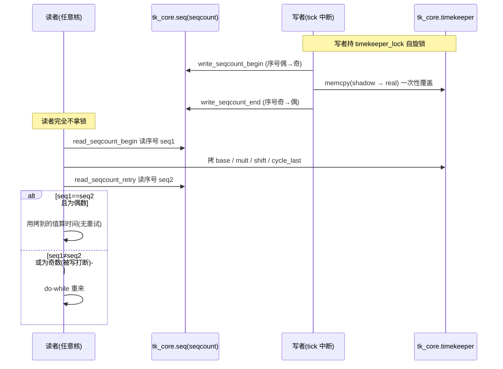
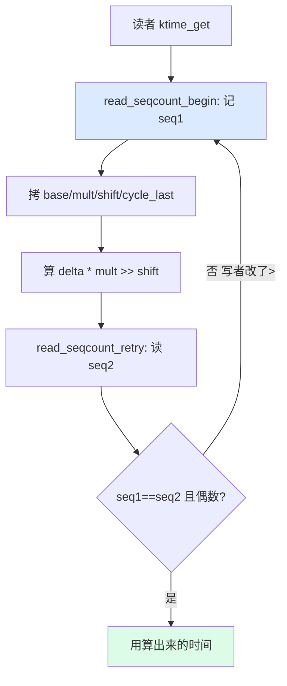

# 第十三章 · timekeeping:墙上时间怎么维护

> 篇:P3 时钟与定时器
> 主线呼应:上一章([P3-12](P3-12-clocksource-clockevent-硬件时钟抽象.md))我们立起了**时钟硬件抽象**——`clocksource` 给你一个单调递增的 `read(cycles)` 接口、`clock_event_device` 给你一个"到点发中断"的可编程闹钟。但那一章留下一个最关键的悬念:**硬件只给你一堆越来越大的 cycle 计数,它不告诉你现在几点几分、`gettimeofday` 该返回什么**。把"周期性读 cycle"累积成"墙上时间(REAL)/单调时间(MONOTONIC)/boot 时间",并且让 `ktime_get` 在多核上每秒被调千万次还不卡,正是本章 `timekeeping` 子系统要干的事。它是时钟篇的地基——hrtimer(P3-14)、tick/NOHZ(P3-15)、POSIX timer(P3-16)拿到的"现在几点",全是从这里读出来的。

## 核心问题

**`clocksource->read()` 只返回一个越来越大的 cycle 计数,内核怎么把它变成 `1970-01-01` 起算的墙上纳秒、保证单调、还能被 NTP 拉快/拉慢校正漂移?为什么 `ktime_get`/`gettimeofday` 这种被全系统每秒调千万次的极高频读路径,内核敢不拿任何全局锁,却又保证读到一致的时间?**

读完本章你会明白:

1. `struct timekeeper` 持有的三套时间(REAL/MONOTONIC/RAW)+ 一组 NTP 校正参数(`mult`/`shift`/`cycle_interval`/`ntp_error`),以及它们怎么从 cycle 累积出来。
2. `ktime_get`/`ktime_get_real_ts64`/`ktime_get_with_offset`/`ktime_get_raw` 这一族 API 共享同一个"`base + delta`"算式,差别只在读哪个 base、加哪个 offset。
3. **seqlock + 影子 timekeeper** 是这套读路径无锁的根:写墙上时间时序号变奇数、把 `shadow_timekeeper` memcpy 进真实 `tk_core.timekeeper`、序号变偶数;读者(任何核、任何上下文)只要序号读到偶数就用、奇数就重试。
4. NTP 校正(`adjtimex` 系统调用)不直接改时间,而是**微调 `mult`**——把每个 cycle 换算成多少纳秒的倍率拉快或拉慢一点点,让墙上时间慢慢对齐 UTC;且校正只让时间**向前**走,绝不让它倒退。
5. **mult/shift 定点运算**把"cycle → ns"的换算做成整数乘法 + 移位,完全不用浮点(内核态通常关 FPU),既快又精确。

> **逃生阀**:如果你已经知道 seqlock 是怎么回事,可直接跳到 13.3(累积主循环 `timekeeping_advance`)和 13.5(技巧精解)。但 13.1(`struct timekeeper` 的字段布局)和 13.4(NTP 校正只调 mult)是后面 P3-14 hrtimer、P2-10/P5-21 VDSO 回扣 seqlock 的基础,值得看一眼。

---

## 13.1 一句话点破

> **timekeeping 干的事就一句话:周期性地把 `clocksource` 读到的 cycle 增量,用 `mult`/`shift` 换算成纳秒,累加到墙上时间(`xtime_sec`)和单调时间(`tkr_mono.base`)上;写的时候拿 `timekeeper_lock` 自旋锁 + seqlock 奇偶序号,读者(任何核)不拿锁,只靠 seqlock 重试读到一致的快照。NTP 不改时间,改的是 mult——拉快或拉慢"每 cycle 值多少纳秒"这个倍率。**

这是结论,不是理由。本章倒过来拆:先看 `struct timekeeper` 长什么样、墙上/单调/boot 三套时间是怎么从 cycle 累出来的;再看读者侧 `ktime_get` 怎么无锁读;然后看写者侧 `timekeeping_advance` 怎么累积;最后看 NTP 怎么通过调 mult 校正漂移。

---

## 13.2 三套时间从一个 cycle 累积出来:`struct timekeeper`

`clocksource` 只会告诉你"从某个起点到现在过了多少 cycle",它是个**单调递增的计数器**——TSC 之类。但用户态要的从来不是 cycle,而是:

- **`CLOCK_REALTIME`(墙上时间 REAL)**:1970-01-01 起算的纳秒,`gettimeofday`/`clock_gettime(CLOCK_REALTIME)` 读的就是它,**可被 `settimeofday`/NTP 改写**。
- **`CLOCK_MONOTONIC`(单调时间)**:从系统启动起算,只增不减,**不受 `settimeofday` 影响**(所以测延迟、算超时用它)。
- **`CLOCK_MONOTONIC_RAW`(原始单调)**:完全不经 NTP 校正的"裸"单调时间,给需要看硬件原始节拍的场景。
- **`CLOCK_BOOTTIME`(boot 时间)**:单调时间 + 系统挂起到恢复期间的睡眠时长(测"开机以来真实流逝时间")。
- **`CLOCK_TAI`**:国际原子时,REALTIME + TAI 偏移(避免闰秒回退问题)。

这五套时间共用**同一个 cycle 源**(同一个 `clocksource->read()`),只是各自累加的"基准点"和"换算倍率"不同。内核用一个大结构体把它们全装在一起:

```
 struct timekeeper(简化,见 include/linux/timekeeper_internal.h#L92):

 ┌──────────────────────────────────────────────────────────────────┐
 │ tkr_mono: tk_read_base   ← 单调读基底(含 clock/cycle_last/mult/shift/base)│
 │ tkr_raw:  tk_read_base   ← 原始单调读基底(不经 NTP 校正的 mult)         │
 │                                                                  │
 │ xtime_sec: u64           ← 墙上时间的"秒"部分(REALTIME)              │
 │ ktime_sec: unsigned long ← 单调时间的"秒"部分                       │
 │ wall_to_monotonic: ts64  ← REAL → MONOTONIC 的偏移                 │
 │ offs_real / offs_boot / offs_tai: ktime_t  ← MONO→各时钟的偏移     │
 │ tai_offset: s32                                                 │
 │                                                                  │
 │ raw_sec: u64             ← MONOTONIC_RAW 的秒                    │
 │ monotonic_to_boot: ts64                                          │
 │                                                                  │
 │ —— 累积用内部字段 ——                                              │
 │ cycle_interval: u64      ← 一个 NTP 间隔 = 多少 cycle             │
 │ xtime_interval: u64      ← 一个 NTP 间隔累积的"移位后纳秒"         │
 │ xtime_remainder: s64     ← 上面除法余数                          │
 │ raw_interval: u64                                               │
 │ ntp_tick: u64            ← 当前 NTP tick 长度(缓存)              │
 │ ntp_error: s64           ← 累积时间和 NTP 标准的偏差             │
 │ ntp_error_shift: u32                                            │
 │ ntp_err_mult: u32        ← 校正方向(+1 拉慢/0 正常)              │
 └──────────────────────────────────────────────────────────────────┘
```

而 `tk_read_base`(读时间时的"基底"结构,见 [timekeeper_internal.h:34](../linux/include/linux/timekeeper_internal.h#L34))是这套设计的核心,它**专门设计成 56 字节,加上 seqcount 正好占一个 64 字节 cache line**(源码注释明说):

```c
/* include/linux/timekeeper_internal.h,简化 */
struct tk_read_base {
    struct clocksource *clock;   /* 当前用的 clocksource(TSC/HPET/...) */
    u64                 mask;    /* cycle 计数器的位掩码(求模用) */
    u64                 cycle_last; /* 上次累积时的 cycle 值 */
    u32                 mult;    /* cycle→ns 的乘数(NTP 可微调) */
    u32                 shift;   /* 乘完右移的位数(定点小数) */
    u64                 xtime_nsec; /* "秒以下"的纳秒(带 shift 精度) */
    ktime_t             base;    /* 单调时间的纳秒基底 */
    u64                 base_real; /* REALTIME 纳秒基底(NMI 快读用) */
};
```

> **不这样会怎样**:如果不把"读时间用的核心字段"单独抠出来塞进一个 cache line,读者每次 `ktime_get` 都要跨两条 cache line,多核上每秒千万次读会把 false-sharing 的开销放大成灾难。**把读路径热数据压进一条 cache line + 加一个 seqcount,正好 64 字节**——这是为极致读性能做的数据布局,和上一本《调度器》把 `struct rq` 的热字段排进 cache line 是同一套工程美学。

读时间,本质上就是一句算式:

```
 现在时间 = tkr_mono.base + (now_cycles - cycle_last) * mult >> shift
           └─基底纳秒─┘   └────── 自上次累积以来的 cycle 增量 ──────┘
```

- `base`:上次累积时记下来的单调纳秒(比如上次 tick 时是 1 700 000 000 000 ns)。
- `(now_cycles - cycle_last)`:从上次 tick 到现在,hardware 又跑了多少 cycle。
- `* mult >> shift`:把 cycle 增量换算成纳秒(定点乘除,下面 13.6 详讲)。

这五套时钟,差别只在:**用哪个 `tk_read_base`(mono 还是 raw)、加哪个 offset(offs_real/offs_boot/offs_tai)**。算式一模一样。这是为什么 `ktime_get_*` 一族函数代码长得几乎相同(下一节展开)。

> **钉死这件事**:`struct timekeeper` 把"周期性累积的 cycle 怎么变成多套墙上时间"这件事用一个结构体封装了。三套核心字段:① 读基底 `tk_read_base`(cycle/mult/shift/base);② 各时钟的秒数和偏移(`xtime_sec`/`raw_sec`/`offs_*`);③ NTP 校正参数(`mult`/`ntp_error`/`cycle_interval`)。读者只关心前两组(算时间),写者(tick 中断)负责更新它们。下面看读者怎么读。

---

## 13.3 读者侧:`ktime_get` 一族为什么可以不拿锁

用户态 `clock_gettime`、内核态调度器算时间片、网络栈算 RTO、日志打时间戳——内核每一秒都被 `ktime_get` 这类函数调**几千万次**。如果每次读时间都要抢一把全局自旋锁,64 核机器上锁竞争会直接吃掉一大块 CPU。timekeeping 的做法是:**读者完全不拿锁,靠 seqlock 重试**。

看 `ktime_get`(读 `CLOCK_MONOTONIC` 的最基础入口,[timekeeping.c:836](../linux/kernel/time/timekeeping.c#L836)):

```c
/* kernel/time/timekeeping.c,简化自 ktime_get */
ktime_t ktime_get(void)
{
    struct timekeeper *tk = &tk_core.timekeeper;
    unsigned int seq;
    ktime_t base;
    u64 nsecs;

    do {
        seq = read_seqcount_begin(&tk_core.seq);     /* ① 读序号(偶数=没人写) */
        base = tk->tkr_mono.base;                    /* ② 拷基底 */
        nsecs = timekeeping_get_ns(&tk->tkr_mono);   /* ③ 读 cycle + 算 delta */
    } while (read_seqcount_retry(&tk_core.seq, seq));/* ④ 序号变了?重试 */

    return ktime_add_ns(base, nsecs);
}
```

四步:**① 读序号 → ② ③ 拷核心字段 → ④ 再读序号**。如果中途有人写(序号从偶变奇再变偶,或一直奇数),`read_seqcount_retry` 返回真,`do-while` 把刚才拷的数据扔掉重来。**没人和你抢锁,你只是赌一把"我读的时候没人写";赌输了重读一遍**。

这套模式在 `ktime_get_real_ts64`([timekeeping.c:815](../linux/kernel/time/timekeeping.c#L815))、`ktime_get_with_offset`([timekeeping.c:879](../linux/kernel/time/timekeeping.c#L879))、`ktime_get_raw_ts64`([timekeeping.c:1518](../linux/kernel/time/timekeeping.c#L1518))、`ktime_get_coarse_*` 里一字不差地复用,只是拷的字段不同:

```c
/* ktime_get_with_offset(读 BOOT/REAL/TAI 这类带偏移的时钟) */
do {
    seq = read_seqcount_begin(&tk_core.seq);
    base = ktime_add(tk->tkr_mono.base, *offset);   /* mono + offs_xxx */
    nsecs = timekeeping_get_ns(&tk->tkr_mono);
} while (read_seqcount_retry(&tk_core.seq, seq));
```

读者侧的核心计算 `timekeeping_get_ns` → `timekeeping_delta_to_ns`([timekeeping.c:374](../linux/kernel/time/timekeeping.c#L374))就是上面那句算式:

```c
static inline u64 timekeeping_delta_to_ns(const struct tk_read_base *tkr, u64 delta)
{
    u64 nsec;
    nsec = delta * tkr->mult + tkr->xtime_nsec;   /* cycle * mult + 小数部分 */
    nsec >>= tkr->shift;                          /* 右移还原精度 */
    return nsec;
}
```

> **反面对比**:如果用一把全局自旋锁保护 `timekeeper`,每次 `ktime_get` 都要 `spin_lock`/`spin_unlock`,64 核上锁 cacheline 在核间乒乓传递,光这一项就能把 `gettimeofday` 这种"几乎不该有开销"的调用拖慢一两个数量级。**seqlock 让读路径退化成"几次普通内存读 + 一次比较"**,完全没有原子指令、没有 cache line 乒乓,这是 timekeeping 能扛住千万 QPS 的根。

但 seqlock 只在"写很少、读极多"的场景合算——timekeeping 正是:**写**只发生在每个 tick(默认每秒 100/250/1000 次)或 `settimeofday` 时,**读**每秒千万次。写读比 1:10000,seqlock 完美匹配。

> **钉死这件事**:timekeeping 的读路径是"seqlock 乐观读"的教科书例子——读者赌"读这一瞬间没人写",赌输了重试,不抢锁。**写少读多的全局数据,首选 seqcount,不是 rwlock**(rwlock 读者也要原子递减计数,多核上仍有 cacheline 乒乓)。这套设计后面会被 VDSO(P2-10)原样搬到用户态,让用户态读时间连系统调用都不用进——本章末尾和 P5-21 总表会回扣。

---

## 13.4 写者侧:`timekeeping_advance` 怎么累积 cycle

读者那么轻,是因为写者把脏活全扛了。写发生在**每个 tick**(`update_wall_time` 在 tick 中断里调,见 [timekeeping.c:2230](../linux/kernel/time/timekeeping.c#L2230)),它要做四件事:

1. 读当前 cycle,算出"距上次累积过了多少 cycle"(`offset`)。
2. 把 offset 切成一个个 `cycle_interval`(一个 NTP 间隔的 cycle 数),逐段累加到 `xtime_nsec`/`raw`/`ntp_error`。
3. 调 `timekeeping_adjust`,根据 NTP 偏差微调 `mult`。
4. **拿 `timekeeper_lock` 自旋锁 + `write_seqcount_begin/end`**,把算好的新值 memcpy 进真实的 `tk_core.timekeeper`。

核心函数 `timekeeping_advance`([timekeeping.c:2151](../linux/kernel/time/timekeeping.c#L2151))结构如下(简化展示,非源码原文):

```c
static bool timekeeping_advance(enum timekeeping_adv_mode mode)
{
    struct timekeeper *real_tk = &tk_core.timekeeper;
    struct timekeeper *tk = &shadow_timekeeper;     /* ★ 在影子上算,不碰真实 */
    u64 offset;
    unsigned long flags;

    raw_spin_lock_irqsave(&timekeeper_lock, flags); /* ① 拿写锁(写者互斥) */
    if (unlikely(timekeeping_suspended)) goto out;

    /* ② 读当前 cycle,算 offset(距上次累积的 cycle 增量) */
    offset = clocksource_delta(tk_clock_read(&tk->tkr_mono),
                               tk->tkr_mono.cycle_last, tk->tkr_mono.mask);
    if (offset < real_tk->cycle_interval && mode == TK_ADV_TICK)
        goto out;

    /* ③ 对数累积:把 offset 切成大块,logarithmic_accumulation 逐块累加 */
    shift = ilog2(offset) - ilog2(tk->cycle_interval);
    shift = max(0, shift);
    shift = min(shift, maxshift);   /* bound,防溢出 */
    while (offset >= tk->cycle_interval) {
        offset = logarithmic_accumulation(tk, offset, shift, &clock_set);
        if (offset < tk->cycle_interval << shift)
            shift--;
    }

    /* ④ NTP 微调 mult(见 13.5) */
    timekeeping_adjust(tk, offset);

    /* ⑤ 纳秒进位到秒 */
    clock_set |= accumulate_nsecs_to_secs(tk);

    /* ⑥ ★ 写者关键:seqlock 写临界区 */
    write_seqcount_begin(&tk_core.seq);              /* 序号变奇(正在写) */
    timekeeping_update(tk, clock_set);               /* 更新 VDSO/fast tk 等 */
    memcpy(real_tk, tk, sizeof(*tk));                /* 影子 → 真实,一气呵成 */
    /* The memcpy must come last. Do not put anything here! */
    write_seqcount_end(&tk_core.seq);                /* 序号变偶(写完) */
out:
    raw_spin_unlock_irqrestore(&timekeeper_lock, flags);
    return !!clock_set;
}
```

注意 ⑥ 这段——源码里那行注释 **"The memcpy must come last. Do not put anything here!"** 不是装饰,是死规矩:`write_seqcount_begin` 把序号从偶数变奇数后,任何读者(在别的核上)只要看到奇数就会重试;`memcpy` 把整块影子 timekeeper 一次性盖到真实 timekeeper 上,**这次 memcpy 必须是临界区里最后一件事**,紧接着 `write_seqcount_end` 把序号变回偶数。只要读者看到偶数,它读到的 `tk` 就一定是这次 memcpy 完成后的快照——要么是旧的、要么是新的,绝不会是改一半的。

`shadow_timekeeper`([timekeeping.c:57](../linux/kernel/time/timekeeping.c#L57))的妙处也在这里:**所有复杂的累积计算(NTP 校正、进位、对数累积)都在影子上做,算完一把 memcpy 盖过去**。这样临界区里只有"算好了盖过去"这一步,极大缩短了序号为奇(读者重试)的窗口。

> **不这样会怎样**:如果在真实 `tk_core.timekeeper` 上**原地修改**——改一字段、又改一字段——每个字段改完到下一个字段改之前,都可能被读者看见"半新半旧"的状态(比如新 `xtime_sec` 配旧 `cycle_last`),算出来的时间会错乱。**影子 + memcpy** 让"修改"在外人看来是一个原子动作。seqlock 保护的不是单字段,是"整个快照的一致性"。

**对数累积**(`logarithmic_accumulation`,[timekeeping.c:2113](../linux/kernel/time/timekeeping.c#L2113))也值得点一句:NOHZ idle 的 CPU 可能睡了几秒(几万个 tick 没累积),醒来后一次性补累积。如果一个个 tick 加,要循环几万次;对数累积用 `shift = ilog2(offset) - ilog2(cycle_interval)` 找到"一次能吃下多少个 tick",**一次 `xtime_interval << shift` 吃掉一整块**,把补累积从 O(n) 降到 O(log n)。这是 NOHZ(P3-15)能"睡很久又不慢"的前提之一。



> **钉死这件事**:写者侧的工程是"**影子计算 + 自旋锁互斥 + seqlock 一次性发布**"三件套——自旋锁保证多个写者不撞、影子让临界区只剩 memcpy、seqlock 让读者无锁重试。这是 timekeeping 写路径能又快又 sound 的根。下一节看 NTP 怎么在这一套里悄悄改时间。

---

## 13.5 NTP 校正:不直接改时间,而是微调 `mult`

到这里有一个反直觉的问题:NTP(Network Time Protocol,`adjtimex`/`ntpd`/`chronyd`)要把系统时间对齐 UTC。最直接的做法是 `settimeofday` 一步到位——但内核**不愿意**这么干,原因有二:

1. **时间倒退会搞坏所有依赖"时间只增不减"的程序**:锁超时、缓存 TTL、数据库事务序号、文件 mtime——一倒退全乱套。
2. **`CLOCK_MONOTONIC` 按定义就不能被改**,但 NTP 又得校正硬件漂移(TSC 跑快了/慢了)。

内核的解法极其巧妙:**不直接改时间,改的是 `mult`**——把"每个 cycle 值多少纳秒"这个倍率拉快或拉慢一点点,让墙上时间慢慢追上或等一下 UTC。`adjtimex` 系统调用走 `do_adjtimex`([timekeeping.c:2423](../linux/kernel/time/timekeeping.c#L2423)),它把用户给的 `freq`(频率偏移,ppm 级)灌进 NTP 状态机([ntp.c](../linux/kernel/time/ntp.c) 的 `time_freq`/`tick_length`),然后 timekeeping 在每次 tick 累积时根据 NTP 偏差微调 `mult`:

`timekeeping_adjust`([timekeeping.c:2003](../linux/kernel/time/timekeeping.c#L2003))干的事(简化):

```c
static void timekeeping_adjust(struct timekeeper *tk, s64 offset)
{
    u32 mult;

    /* 从 NTP 标准的 tick 长度反算 mult */
    if (likely(tk->ntp_tick == ntp_tick_length())) {
        mult = tk->tkr_mono.mult - tk->ntp_err_mult;   /* 多数 tick 走快路 */
    } else {
        tk->ntp_tick = ntp_tick_length();
        mult = div64_u64((tk->ntp_tick >> tk->ntp_error_shift)
                         - tk->xtime_remainder, tk->cycle_interval);
    }

    /* ntp_error > 0 表示时钟落后 NTP → mult+1 拉快一点 */
    tk->ntp_err_mult = tk->ntp_error > 0 ? 1 : 0;
    mult += tk->ntp_err_mult;

    timekeeping_apply_adjustment(tk, offset, mult - tk->tkr_mono.mult);

    /* 保护:mult 偏离原始值超过 11% 告警(防 NTP 失控) */
    if (unlikely(tk->tkr_mono.clock->maxadj &&
        (abs(tk->tkr_mono.mult - tk->tkr_mono.clock->mult)
            > tk->tkr_mono.clock->maxadj)))
        printk_once("Adjusting %s more than 11%% ...\n", ...);
    ...
}
```

读这段源码,能看清 NTP 校正的三层机制:

1. **`ntp_tick_length()`**([ntp.c:369](../linux/kernel/time/ntp.c#L369))返回 NTP 认定的"一个 tick 应该有多长"——这个值由 `time_freq`(NTP 算出来的频率校正)+ 标准秒长合成(见 `ntp_update_frequency` [ntp.c:259](../linux/kernel/time/ntp.c#L259),`second_length = 标称秒 + ntp_tick_adj + time_freq`)。
2. **timekeeping 反算 mult**:`mult = (ntp_tick - xtime_remainder) / cycle_interval`,让"一个 cycle 累积多少 ns"刚好匹配 NTP 期望的 tick 长度。`mult` 变大 = 同样 cycle 数算出更多 ns = 时间跑快;`mult` 变小 = 跑慢。
3. **`ntp_error` 闭环反馈**:累积时如果发现实际时间和 NTP 标准有偏差(`ntp_error`),下一次 tick 就在 mult 上 `+1` 或 `-1` 微调,慢慢把偏差吃掉。

> **不这样会怎样**:如果 NTP 直接 `settimeofday` 跳着改时间,① 时间会突然倒退(`CLOCK_REALTIME` 跳回几秒前),所有 `sleep`/超时/缓存逻辑瞬间错乱;② `CLOCK_MONOTONIC` 按定义不能跳,但 NTP 又得校正——矛盾。**微调 mult** 让时间**始终单调向前**,只是快慢有微小变化(每秒最多变 500 ppm,即万分之五),用户态完全感知不到跳变,但跑几分钟后会慢慢对齐 UTC。

NTP 校正还有一条**只向前**的硬约束:即使 NTP 算出来"墙上时间该往回拨"(比如硬件跑快了要扣回来),内核也**绝不让 `CLOCK_MONOTONIC` 倒退**,REALTIME 也只在 `settimeofday`/`ADJ_SETOFFSET` 这种显式调用时才允许跳(且很多路径会拒绝倒退)。`timekeeping_inject_offset`([timekeeping.c:1431](../linux/kernel/time/timekeeping.c#L1431))那一段就有一串检查,拒绝让单调时间回退的 offset。

> **钉死这件事**:NTP 校正 = **微调 mult** = 让墙上时间"快一点或慢一点地爬向 UTC",绝不跳变。这是为什么生产服务器跑 `chronyd` 时,你 `date` 看时间从来不会"跳",但它会悄悄对齐——mult 在背后微调,用户态只看到时间一直往前走。**改频率,不改读数**——这是 NTP 校正的精髓,也是 timekeeping 设计上对"时间只向前"这条不变量的死守。

---

## 13.6 技巧精解:mult/shift 定点运算 + seqlock 读写配合

这一章最硬的两个技巧,单独拆透。

### 技巧一:mult/shift 定点运算——为什么不用浮点

"cycle → 纳秒"的换算,数学上是:

```
 ns = cycles × (10^9 / clock_frequency)
```

`10^9 / clock_frequency` 是个**小数**(比如 TSC 频率 2.5 GHz,倍率 = 0.4)。内核态**通常关 FPU**(`CONFIG_MATH_EMULATION` 之外,x86_64 内核代码不允许用 xmm 寄存器,进内核要保存 FPU 状态),所以**不能用浮点**。朴素地用整数除法 `cycles * 10^9 / freq` 又太慢——`div` 是几十周期,而 `ktime_get` 每秒被调千万次。

内核的解法是**定点小数(fixed-point)**:把倍率放大成一个整数 `mult`,乘完之后右移 `shift` 位还原。这是 [clocksource.h:204](../linux/include/linux/clocksource.h#L204) 的 `clocksource_cyc2ns`:

```c
static inline s64 clocksource_cyc2ns(u64 cycles, u32 mult, u32 shift)
{
    return ((u64) cycles * mult) >> shift;
}
```

`mult` 和 `shift` 的关系是:`mult / 2^shift ≈ 10^9 / freq`。比如 TSC 频率 2.5 GHz:

- 取 `shift = 22`,`mult = round(0.4 × 2^22) = 1677722`。
- 那么 `cycles × 1677722 >> 22` 就是纳秒。
- 整个换算变成**一次 64 位乘法 + 一次移位**,几个时钟周期完成,无除法、无浮点。

timekeeping 里 `timekeeping_delta_to_ns`([timekeeping.c:374](../linux/kernel/time/timekeeping.c#L374))在此基础上多加了一个 `xtime_nsec` 项:

```c
nsec = delta * tkr->mult + tkr->xtime_nsec;   /* 累加 + 移位前小数部分 */
nsec >>= tkr->shift;
```

为什么多 `+ tkr->xtime_nsec`?因为 `xtime_nsec` 是"上次累积时秒以下的小数部分"(带 shift 精度)。读者每次读时间,要的是"基底 + 当前增量"——`xtime_nsec` 是基底的小数尾巴,`delta * mult` 是当前 cycle 增量,两者加完一起右移,精度无损。这个 `+` 是为什么 timekeeping 能做到纳秒级精度:**所有计算都在 shift 放大后的高精度整数域里做,最后一次右移还原**,小数位全程保留。

> **反面对比**:如果用浮点,① 内核态要先 `kernel_fpu_begin`/`end` 保存 xmm 寄存器(几百周期),`ktime_get` 直接慢百倍;② 浮点有精度漂移(IEEE 754 累积误差),长时间跑会偏。如果用整数除法,`div` 几十周期,千万 QPS 也扛不住。**mult/shift 定点**是"用移位代替除法、用整数放大代替浮点"的双重优化——它是 Linux 时钟子系统能做到纳秒精度 + 千万 QPS 的数学基础。这套定点技巧在 hrtimer(P3-14)的到期计算、调度器(第 11 本 P1-04)的 PELT 几何衰减里反复出现,内核 C 的招牌。

`mult` 还有个**安全约束**:它不能偏离 clocksource 注册时的原始 `mult` 超过 `maxadj`(一般 11%),这是 `timekeeping_adjust` 里那段 `printk_once` 告警的依据。NTP 失控时 mult 不会无限拉,保护时钟不跑飞。

### 技巧二:seqlock 读写配合——为什么读者可以不拿锁还不读到撕裂

seqlock(sequence lock)是 Linux 为"写少读多"的全局数据量身设计的。它由一个 `seqcount_t`(就是 `tk_core.seq`,见 [timekeeping.c:50](../linux/kernel/time/timekeeping.c#L50))组成,规则是:

- **写者**:进临界区前 `write_seqcount_begin` 把序号 `+1`(变奇数),出临界区 `write_seqcount_end` 再 `+1`(变偶数)。一次写让序号经历 `偶 → 奇 → 偶`。
- **读者**:① 读序号 `seq1`;② 拷数据;③ 再读序号 `seq2`;④ 如果 `seq1 != seq2` **或** `seq1` 是奇数,说明读的时候有人正在写(或者写了一半),扔掉重读。

关键点:**读者完全无锁、无原子操作**——就是几次普通内存读 + 一次比较。在多核上,这避免了 cacheline 乒乓(读者不污染序号所在的 cacheline,除非它要写)。



写者这边,timekeeping 还叠了**影子 timekeeper + memcpy**这层(见 13.4):所有复杂计算在 `shadow_timekeeper` 上做,临界区里只 memcpy 一行。这让序号为奇(读者重试)的窗口缩到最短——就是一次 `memcpy(real_tk, tk, sizeof(*tk))` 的时长,几百纳秒级。读者重试概率极低(实测 `ktime_get` 重试率基本为 0)。

timekeeping 还有一套**更极端的 NMI-safe 快读**:`tk_fast_mono`/`tk_fast_raw`([timekeeping.c:105](../linux/kernel/time/timekeeping.c#L105))用 **seqcount_latch**(锁存 seqcount) + `base[2]` 双缓冲,让 `ktime_get_mono_fast_ns` 这种**可能在 NMI 里调**(NMI 会打断写者自己)的读路径也能读到一致快照。它的诀窍是 `raw_write_seqcount_latch` 翻转读者用哪个 base,写者改 base[0] 时把读者赶到 base[1],改完再翻回来——NMI 命中写者改一半也无所谓,读者用的是另一份完整的 base。这是 seqcount_latch 模式(`Documentation/locking/seqlock.rst` 有专文),比普通 seqlock 更进一步。本书 P5-21 收束章会把"普通 seqlock(timekeeping 主读路径)+ latch seqlock(NMI 快读)+ VDSO 用户态 seqlock(P2-10)"三种 seqlock 变体拉成一张表。

> **为什么这套设计 sound**:① **写者互斥**靠 `timekeeper_lock` 自旋锁,多个写者(tick + `settimeofday` + `adjtimex`)不会撞;② **读写不互斥**靠 seqcount,读者要么读到旧快照、要么读到新快照,绝不会读到改一半(序号变了就重试);③ **NMI 安全**靠 latch seqcount 双缓冲,NMI 打断写者也能用另一份 base。三层叠加,timekeeping 在任何上下文(进程/中断/NMI)都能安全读时间。这是"为什么 sound"的完整答案。

> **钉死这件事**:`ktime_get` 这种每秒千万次的极高频读,内核敢不拿任何锁,根就是 seqlock + 影子 memcpy + latch 双缓冲这三层。它把"读路径零开销"和"写路径一致性"同时做到——这是 timekeeping 工程美学的核心,也是 P2-10 VDSO 把时间读到用户态、P5-21 总表收束 seqlock 主题的基础。读懂这套,你就懂了 Linux 时钟子系统为什么能在 64 核上扛千万 QPS 而不卡。

---

## 章末小结

这一章讲的是时钟篇的地基——**timekeeping 子系统怎么把 cycle 累积成墙上时间**。它服务二分法的**支撑**那一面:不直接"把控制权拉进内核"(那是中断/系统调用干的事),也不直接"内核主动通知进程"(那是信号干的事),而是给时钟篇其余章节(hrtimer/tick/NOHZ/POSIX timer)和系统调用(`gettimeofday`/`clock_gettime`)提供"**现在几点**"这个底层支撑。

回扣二分法:本章是**支撑**——它是时钟这一"内核主动驱动心跳"的底层账本,没有它,hrtimer 不知道什么时候到期、调度器算不出时间片、`gettimeofday` 返回不了值。本章立起的 seqlock 无锁读 + mult/shift 定点 + NTP 微调 mult 这三件套,贯穿后面整个时钟篇和 P2-10 VDSO。

### 五个"为什么"清单

1. **为什么 `clocksource` 给的 cycle 不能直接当时间用?** cycle 是裸计数器,没有"起点对齐 1970"、没有"换算到纳秒"、没有"硬件漂移校正"。timekeeping 用 `struct timekeeper` 把这三件事一次做完:cycle 累积到 `xtime_sec` 对齐 1970、`mult/shift` 换算到纳秒、NTP 微调 mult 校正漂移。
2. **为什么 `ktime_get` 每秒千万次调用却不卡?** 读者完全不拿锁,只靠 seqcount 重试;写者(每秒最多 HZ 次)拿自旋锁 + `write_seqcount_begin/end`,在影子上算完一把 memcpy 发布。读多写少 1:10000 的场景,seqlock 是完美匹配。
3. **为什么 NTP 校正不直接 `settimeofday` 跳时间?** 跳变会让时间倒退,破坏所有依赖"时间只增不减"的程序(锁超时、缓存 TTL、事务序号);`CLOCK_MONOTONIC` 又按定义不能改。**微调 mult** 让时间始终向前、只是快慢微变,慢慢对齐 UTC——改频率不改读数。
4. **为什么用 mult/shift 定点而不用浮点或整数除法?** 内核态通常关 FPU(保存 xmm 几百周期太贵),整数除法几十周期也慢。**mult/shift 把除法变成乘法 + 移位**,几个时钟周期完成,且整数域全程保留精度。Linux 时钟/调度/hrtimer 全靠这套定点技巧。
5. **为什么写者要在 `shadow_timekeeper` 上算,再 memcpy 进真实?** 在真实 timekeeper 上原地改字段,读者可能看见"半新半旧"的撕裂状态(新秒数配旧 cycle_last)。影子计算让"修改"对读者是一次原子的 memcpy,seqcount 一次性发布——这是写路径 sound 的根。

### 想继续深入往哪钻

- 本章点到的 `struct timekeeper`/`tk_read_base` 字段,详见 [`include/linux/timekeeper_internal.h`](../linux/include/linux/timekeeper_internal.h#L34)(注意源码注释里专门讲 cache line 布局和 NMI-safe 设计)。
- 读路径全部入口在 [`kernel/time/timekeeping.c`](../linux/kernel/time/timekeeping.c):`ktime_get`(L836)、`ktime_get_real_ts64`(L815)、`ktime_get_with_offset`(L879)、`ktime_get_raw_ts64`(L1518)、NMI 快读 `ktime_get_real_fast_ns`(L581)。
- 写路径核心 [`timekeeping_advance`](../linux/kernel/time/timekeeping.c#L2151)(含 `write_seqcount_begin`@L2205 / `memcpy`@L2217 / `write_seqcount_end`@L2219)、[`timekeeping_adjust`](../linux/kernel/time/timekeeping.c#L2003)(NTP 微调 mult)、[`logarithmic_accumulation`](../linux/kernel/time/timekeeping.c#L2113)(NOHZ 补累积)。
- NTP 校正状态机在 [`kernel/time/ntp.c`](../linux/kernel/time/ntp.c):`ntp_tick_length`(L369)、`ntp_update_frequency`(L259)、`second_overflow`(L400)。`adjtimex` 系统调用入口 `do_adjtimex` 在 [timekeeping.c:2423](../linux/kernel/time/timekeeping.c#L2423)。
- 想观测:`/proc/timer_list` 列出当前 clocksource 和 timekeeping 状态;`/sys/devices/system/clocksource/clocksource0/current_clocksource` 看用的是 TSC 还是 HPET;`adjtimex --print`(用户态工具)看 NTP 校正参数(`freq`/`status`/`tick`);`chronyc tracking` 看运行时漂移;`perf stat -e sched:sched_clock` 看 `ktime_get` 路径热度。
- 想做实验:`adjtimex --freq 100` 给系统加 100 ppm 频率偏移,过几分钟看 `date` 慢慢偏;`date -s` 跳时间,观察 `CLOCK_MONOTONIC` 不动、`CLOCK_REALTIME` 跳;写个死循环调 `clock_gettime(CLOCK_MONOTONIC)` 千万次,用 `perf` 看几乎全部命中 VDSO(根本不进内核,P2-10 详讲)。

### 引出下一章

timekeeping 把"现在几点"算清楚了,但时钟篇的另一半是"**到点叫我**"——`setitimer`、调度器 hrtick、网络栈重传定时器,这些都需要"在某纳秒之后触发一次中断"的能力。这就是 [P3-14 · hrtimer:高精度红黑树定时器](P3-14-hrtimer-高精度红黑树定时器.md):每个 CPU 一个 `hrtimer_cpu_base`,内含几棵按到期时间排序的红黑树(timerqueue),`hrtimer_start` 入队、`hrtimer_interrupt` 扫到期。它和本章的衔接点是——hrtimer 的到期判断、softexpires 区间,全靠 timekeeping 提供的 `ktime_get` 拿"现在时间"来比较。本章立的"读时间无锁 + 精确纳秒"是 hrtimer 能做高精度定时的基础;下一章立的"红黑树 + softexpires"则是时钟篇真正"内核主动驱动心跳"的重头戏(并 ★对照 Tokio 时间轮)。
