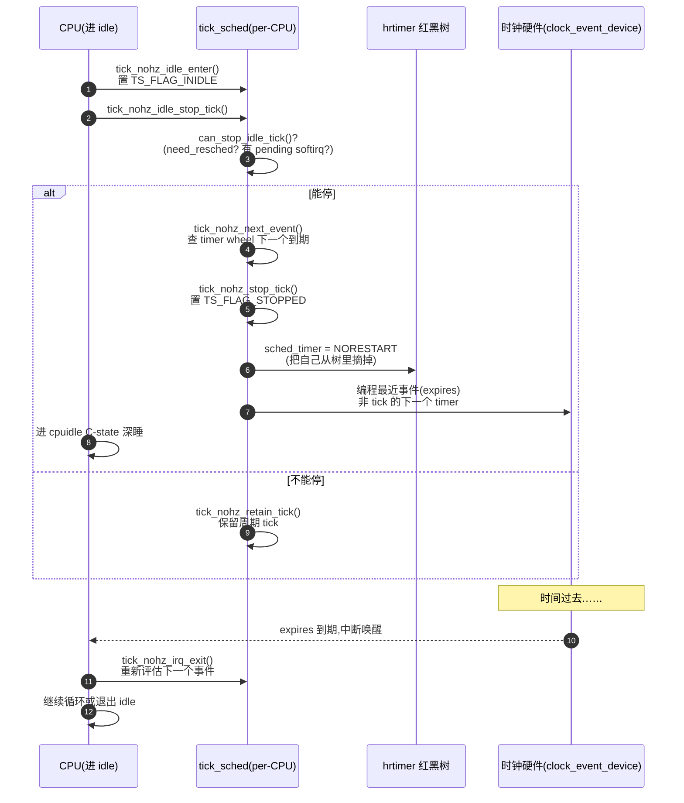

# 第十五章 · tick 与 NOHZ:动态时钟省电

> 篇:P3 时钟与定时器(内核主动驱动的心跳)
> 主线呼应:上一章讲完 hrtimer——每个 CPU 一棵红黑树,挑最早到期的 timer 执行。这套高精度机制一旦就位,一个自然的结论就浮现了:**周期 tick 本来就该被取消**。周期 tick 干的事(更新 jiffies、推动调度统计、刷 PELT、看 time slice)其实都能被一个"每次 forward `TICK_NSEC` 的 hrtimer"模拟;既然是 hrtimer,那 CPU 没事干的时候,完全可以把这个 tick hrtimer 停掉,改让最近的下一个事件(可能是另一个 hrtimer、可能是 timer wheel 里的 timer、也可能是 `KTIME_MAX` 表示"真没事")来唤醒 CPU。这就是 NOHZ(Tickless)做的事。读懂这一章,你就明白笔记本是怎么靠它多撑两小时电、虚拟机怎么靠它少被 tick 中断干扰、跑 CPU 密集任务的实时进程怎么靠它几乎不进 tick——以及为什么停了 tick 还能继续精确调度、继续正确计时、继续不丢事件。

## 核心问题

**周期 tick(`CONFIG_HZ` 决定,常见 100/250/1000,即每秒 100/250/1000 次硬中断)是用来推进统计与调度的,可 CPU 进了 idle 之后这每秒几百次 tick 全是空转——电被白白烧、深睡 C-state 进不去、虚拟化里还产生 vCPU 抖动。能不能让 idle 的 CPU 停掉 tick,真睡到下一个有用事件?进一步,一个 CPU 全程只跑一个 CPU 密集任务的实时场景,能不能连跑任务的时候都不进 tick?**

读完本章你会明白:

1. **周期 tick 不是硬件的硬性要求,而是一个 hrtimer 在 forward**:Linux 6.9 里所谓"周期 tick"其实是 `tick_setup_sched_timer` 给每个 CPU 注册的 `ts->sched_timer`(一个 hrtimer),回调 `tick_nohz_handler` 每次把自己 forward 一个 `TICK_NSEC` 再 `HRTIMER_RESTART`。这一点决定了 tick 可停——它本来就是个 hrtimer。
2. **NOHZ_IDLE(NO\_HZ\_IDLE)**:CPU 进 idle 时调 `tick_nohz_idle_stop_tick`,把 `ts->sched_timer` 设为 `HRTIMER_NORESTART`,改让最近的下一个事件(timer wheel 里最早到期的 timer、或别的 hrtimer)充当唤醒源,CPU 进入深睡;下一次被唤醒再 `tick_nohz_restart_sched_tick` 把丢失的 tick 补上。
3. **NOHZ_FULL(NO\_HZ\_FULL)**:更激进——一个 CPU 全程只跑一个 CPU 密集任务时,连"任务在跑"也尽量不停 tick;靠 `tick_dep_mask`(全局 / per-CPU / per-task / per-signal 四层依赖位)决定有没有人需要 tick,没人需要就停。给实时、虚拟化降噪。
4. **为什么停了 tick 不丢**:① 只有一个专职 `tick_do_timer_cpu` 负责更新全局 `jiffies`,其他 CPU 停 tick 不影响墙上时间;② 中断退出路径 `tick_nohz_irq_exit` 会重新评估"下一个事件还远不远",防止"中断里 enqueue 了一个 timer 却被忽略";③ 调度精确性由独立的 `hrtick` hrtimer 兜底(回扣调度器 P1-04),与周期 tick 解耦。
5. ★ 对照:内核 NOHZ idle 停 tick ↔ Tokio 进程空闲 `park` worker 线程——都是"没事干就别空转、把唤醒权交给下一个真事件"。

> **逃生阀**:如果你已经知道 `CONFIG_NO_HZ_IDLE` 和 `CONFIG_NO_HZ_FULL` 是两回事、知道 `tick_do_timer_cpu` 的存在,可以直接跳到 15.4(技巧精解:停 tick 不丢的三道保险)和 15.5(NOHZ_FULL 的四层依赖)。但 15.2~15.3 的"周期 tick 怎么被 hrtimer 模拟出来""停 tick 的决策时机"是理解后两节的基础。

---

## 15.1 一句话点破

> **周期 tick 在 6.9 里根本不是"硬件周期中断",而是一个 forward 自己的 hrtimer;既然是 hrtimer,CPU 没事干时就能让它 `HRTIMER_NORESTART`,把唤醒权交给最近的下一个真事件——这就是 NOHZ。停了 tick 不丢时间(有专职 CPU 守 jiffies)、不丢事件(中断退出会重新评估)、不丢调度精确性(有独立的 hrtick)。**

这是结论,不是理由。本章倒过来拆:先看周期 tick 凭什么是个 hrtimer,再看进 idle 时怎么决策停 tick、怎么选唤醒源,然后看 NOHZ_FULL 怎么把"停 tick"推到极致,最后看三道"不丢"的保险为什么 sound。

---

## 15.2 周期 tick:其实是个 forward 自己的 hrtimer

老资料(2.6 时代)讲 tick,讲的是"时钟硬件(`clock_event_device`)被设成 `PERIODIC` 模式,每 `1/HZ` 秒硬件自动发一次中断"。这个印象在 6.9 里已经**部分过时**:现代 x86(以及大多数架构)的时钟硬件都跑在 `ONESHOT`(单次)模式,周期 tick 是**用一个 hrtimer 模拟**出来的。

证据在 [`tick_setup_sched_timer`](../linux/kernel/time/tick-sched.c#L1584):

```c
/* kernel/time/tick-sched.c,简化自 tick_setup_sched_timer */
void tick_setup_sched_timer(bool hrtimer)
{
    struct tick_sched *ts = this_cpu_ptr(&tick_cpu_sched);

    /* 关键:给每个 CPU 注册一个 sched_timer(hrtimer) */
    hrtimer_init(&ts->sched_timer, CLOCK_MONOTONIC, HRTIMER_MODE_ABS_HARD);

    if (IS_ENABLED(CONFIG_HIGH_RES_TIMERS) && hrtimer) {
        tick_sched_flag_set(ts, TS_FLAG_HIGHRES);
        ts->sched_timer.function = tick_nohz_handler;   /* 回调 */
    }
    ...
    hrtimer_forward_now(&ts->sched_timer, TICK_NSEC);    /* forward 一个周期 */
    if (IS_ENABLED(CONFIG_HIGH_RES_TIMERS) && hrtimer)
        hrtimer_start_expires(&ts->sched_timer, HRTIMER_MODE_ABS_PINNED_HARD);
    ...
}
```

`TICK_NSEC` 就是 `1/HZ` 秒换算的纳秒数(`CONFIG_HZ=1000` 时是 1ms)。每个 CPU 一个 `struct tick_sched`(per-CPU 变量 `tick_cpu_sched`),里面装着一个 hrtimer `sched_timer`。这个 hrtimer 到期时回调 [`tick_nohz_handler`](../linux/kernel/time/tick-sched.c#L284):

```c
/* kernel/time/tick-sched.c,简化自 tick_nohz_handler */
static enum hrtimer_restart tick_nohz_handler(struct hrtimer *timer)
{
    struct tick_sched *ts = container_of(timer, struct tick_sched, sched_timer);
    ktime_t now = ktime_get();

    tick_sched_do_timer(ts, now);       /* 推进 jiffies、做 do_timer 职责 */
    tick_sched_handle(ts, regs);        /* update_process_times 推统计/调度 tick */

    /* 关键:tick 停了就不再 restart,否则 forward 一个周期再 restart */
    if (unlikely(tick_sched_flag_test(ts, TS_FLAG_STOPPED)))
        return HRTIMER_NORESTART;       /* ← 这就是 NOHZ 的总开关 */

    hrtimer_forward(timer, now, TICK_NSEC);
    return HRTIMER_RESTART;             /* 周期 tick = forward 自己 + RESTART */
}
```

看清这两段就明白了:**周期 tick 的本质,是这个 hrtimer 每次到期都 `hrtimer_forward(timer, now, TICK_NSEC)` 把自己往后推一个 tick、然后返回 `HRTIMER_RESTART` 让红黑树重新挂上**。`tick_sched_do_timer` 里干"全局职责"(更新 jiffies),`tick_sched_handle` 里干"per-CPU 职责"(`update_process_times` 推调度统计、刷 PELT、看时间片)。

> **不这样会怎样**:如果还是用硬件 `PERIODIC` 模式做 tick,那"停 tick"就只有"关掉时钟硬件"一条路,但关了硬件就没法在某个未来时刻把 CPU 唤醒(只能靠别的中断),无法实现"睡到下一个 timer 到期"的精确控制。**用 hrtimer 模拟 tick 后,停 tick 只要返回 `HRTIMER_NORESTART`——红黑树自然把这个 timer 摘掉,CPU 的下一个唤醒事件就由红黑树里别的 timer(或 `KTIME_MAX` 表示的"真没事")决定**。这是 NOHZ 能成立的前提。

### 周期 tick 干的两类活

为了讲清"停了 tick 会不会丢事",得先看 tick 每次干的两类活:

| 类别 | 函数 | 干什么 | 停了 tick 谁干 |
|------|------|--------|----------------|
| **全局职责** | [`tick_sched_do_timer`](../linux/kernel/time/tick-sched.c#L206) → `tick_do_update_jiffies64` | 更新全局 `jiffies`(墙上时间基) | **只有一个专职 CPU `tick_do_timer_cpu` 干**(其他 CPU 不用干) |
| **per-CPU 职责** | [`tick_sched_handle`](../linux/kernel/time/tick-sched.c#L253) → `update_process_times` | `scheduler_tick`(减时间片)、`run_local_timers`(查 timer wheel)、刷 PELT、RCU callback | **睡醒后 `tick_nohz_restart_sched_tick` 用 jiffies 差额补算** |

**关键洞察**:全局职责(`jiffies` 更新)对每个 CPU 是冗余的——64 核机器上每秒 HZ×64 次 `jiffies++` 是巨大浪费,而且 `jiffies` 是全局变量要锁。Linux 的解法:**整个系统只指定一个 CPU 当 `tick_do_timer_cpu`**,只有它每次 tick 调 `tick_do_update_jiffies64` 更新全局 jiffies,其他 CPU 的 tick 只干 per-CPU 的事。

看 [`tick_sched_do_timer`](../linux/kernel/time/tick-sched.c#L206) 的源码:

```c
/* kernel/time/tick-sched.c,简化自 tick_sched_do_timer */
static void tick_sched_do_timer(struct tick_sched *ts, ktime_t now)
{
    int tick_cpu, cpu = smp_processor_id();

    tick_cpu = READ_ONCE(tick_do_timer_cpu);
    ...
    /* 只有专职 CPU 才更新 jiffies */
    if (tick_cpu == cpu)
        tick_do_update_jiffies64(now);

    /* jiffies 长时间没更新(比如守夜 CPU 睡太死),强制补 */
    if (ts->last_tick_jiffies != jiffies) {
        ts->stalled_jiffies = 0;
        ts->last_tick_jiffies = READ_ONCE(jiffies);
    } else {
        if (++ts->stalled_jiffies == MAX_STALLED_JIFFIES) {   /* 5 tick */
            tick_do_update_jiffies64(now);
            ...
        }
    }
    ...
}
```

> **钉死这件事**:`tick_do_timer_cpu` 是 NOHZ 的第一根支柱。因为 jiffies 由一个 CPU 专职维护,**其余 CPU 即使把 tick 全停掉也不会让墙上时间停滞**——它们本来就不负责这个。这就是 NOHZ 能让 N-1 个 CPU 深睡、而墙上时间仍准确的原因。下面的 15.4 会回到这个点。

---

## 15.3 NOHZ_IDLE:进 idle 时停 tick

现在看 NOHZ 的主战场:CPU 进 idle。

idle 的主循环在 [`kernel/sched/idle.c`](../linux/kernel/sched/idle.c) 的 `do_idle`(每 CPU 的 idle 内核线程跑这个循环)。简化后的骨架:

```c
/* kernel/sched/idle.c,简化自 do_idle */
__current_set_polling();
tick_nohz_idle_enter();              /* 标记"我进 idle 了" */

while (!need_resched()) {
    local_irq_disable();
    ...
    cpuidle_idle_call();             /* 进 C-state 深睡 */
    ...
}

preempt_set_need_resched();
tick_nohz_idle_exit();               /* 出 idle */
```

`tick_nohz_idle_enter`([tick-sched.c:1250](../linux/kernel/time/tick-sched.c#L1250)) 干的事很轻:关中断、置 `TS_FLAG_INIDLE` 标志、记 `idle_entrytime`。真正"决定要不要停 tick"在 `cpuidle_idle_call` 里调 [`tick_nohz_idle_stop_tick`](../linux/kernel/time/tick-sched.c#L1204) 时。



### 停 tick 的三个前置判断

[`can_stop_idle_tick`](../linux/kernel/time/tick-sched.c#L1168) 决定"现在能不能停",它是 NOHZ 正确性的第一道闸门:

```c
/* kernel/time/tick-sched.c,简化自 can_stop_idle_tick */
static bool can_stop_idle_tick(int cpu, struct tick_sched *ts)
{
    WARN_ON_ONCE(cpu_is_offline(cpu));

    if (unlikely(!tick_sched_flag_test(ts, TS_FLAG_NOHZ)))
        return false;                  /* 这 CPU 没开 NOHZ */

    if (need_resched())
        return false;                  /* 已经要调度了,别停,马上要跑任务 */

    if (unlikely(report_idle_softirq()))
        return false;                  /* 有 softirq pending 待处理 */

    if (tick_nohz_full_enabled()) {
        int tick_cpu = READ_ONCE(tick_do_timer_cpu);
        if (tick_cpu == cpu)
            return false;              /* 我是守夜 CPU,不能停,要守 jiffies */
        ...
    }
    return true;
}
```

这三个判断每条都有理由:

- **`need_resched()` 为真就别停**:已经有任务在等 CPU 了,马上要调度出去,这时候停 tick 没意义,下一瞬就得重启。
- **`report_idle_softirq()` 为真就别停**:有 softirq(比如 `TIMER_SOFTIRQ`)待处理,意味着 timer wheel 里有到期 timer 要处理,这时候停 tick 会漏掉。`report_idle_softirq` 还会 `pr_warn("NOHZ tick-stop error: local softirq work is pending, handler #%02x!!!")` 在日志里报错——你如果见过这条 dmesg,就是这里来的。
- **NOHZ_FULL 模式下守夜 CPU 不能停**:这一条留到 15.5 讲。

### 选唤醒源:借最近的下一个 timer

判断"能停"之后,下一步是"停多久、谁来叫醒我"。 [`tick_nohz_next_event`](../linux/kernel/time/tick-sched.c#L893) 算下一个该唤醒的时刻:

```c
/* kernel/time/tick-sched.c,简化自 tick_nohz_next_event */
static ktime_t tick_nohz_next_event(struct tick_sched *ts, int cpu)
{
    u64 basemono, next_tick, delta, expires;
    unsigned long basejiff;
    ...

    /* 几种"必须保留 tick"的情况:RCU/架构/irq_work/timer softirq 需要 CPU */
    if (rcu_needs_cpu() || arch_needs_cpu() ||
        irq_work_needs_cpu() || local_timer_softirq_pending()) {
        next_tick = basemono + TICK_NSEC;          /* 只睡一个 tick */
    } else {
        /* 查 timer wheel 最早到期的 timer(低精度定时器) */
        next_tick = get_next_timer_interrupt(basejiff, basemono);
        ts->next_timer = next_tick;
    }
    ...
    delta = next_tick - basemono;
    if (delta <= (u64)TICK_NSEC) {
        /* 下一个 timer 在一个 tick 内就到期,别停了,停了马上又得起 */
        if (!tick_sched_flag_test(ts, TS_FLAG_STOPPED)) {
            ts->timer_expires = 0;
            goto out;
        }
    }
    ...
    ts->timer_expires = min_t(u64, expires, next_tick);
out:
    return ts->timer_expires;
}
```

`get_next_timer_interrupt` 是 timer wheel(低精度 `add_timer` 那套,不是 hrtimer)提供的接口,它返回 wheel 里最早到期的 timer 时刻。**这一步把"timer wheel 的下一个到期"和"要不要停 tick"缝合在了一起**:如果 timer wheel 里下一个 timer 远在 100ms 后,那 tick 就停 100ms,CPU 真睡 100ms,这 100ms 里 0 次空转 tick。

> **所以这样设计**:`tick_nohz_idle_stop_tick` 调 `tick_nohz_next_event` 拿到 `expires`,然后 [`tick_nohz_stop_tick`](../linux/kernel/time/tick-sched.c#L971) 把 `ts->sched_timer`(周期 tick 那个 hrtimer)取消掉(`TS_FLAG_STOPPED` 置位,handler 返回 `NORESTART`),改用 `expires` 编程时钟硬件:

```c
/* kernel/time/tick-sched.c,简化自 tick_nohz_stop_tick 末尾 */
if (!tick_sched_flag_test(ts, TS_FLAG_STOPPED)) {
    calc_load_nohz_start();
    quiet_vmstat();                            /* 别再为 vmstat 触发 tick */
    ts->last_tick = hrtimer_get_expires(&ts->sched_timer);
    tick_sched_flag_set(ts, TS_FLAG_STOPPED);  /* ← 这位一置,tick 真停了 */
    trace_tick_stop(1, TICK_DEP_MASK_NONE);
}
ts->next_tick = expires;

if (unlikely(expires == KTIME_MAX)) {
    tick_sched_timer_cancel(ts);               /* 真没事,彻底取消 */
    return;
}

if (tick_sched_flag_test(ts, TS_FLAG_HIGHRES)) {
    hrtimer_start(&ts->sched_timer, expires, HRTIMER_MODE_ABS_PINNED_HARD);
} else {
    hrtimer_set_expires(&ts->sched_timer, expires);
    tick_program_event(expires, 1);            /* 编程时钟硬件到 expires */
}
```

注意这里有个微妙点:`TS_FLAG_STOPPED` 置位后,`sched_timer` **不是被 `hrtimer_cancel` 物理摘掉**,而是被重新编程到 `expires`(不是原来的 tick 周期)。回调 `tick_nohz_handler` 进来时看到 `TS_FLAG_STOPPED` 就返回 `NORESTART`,这样这个 hrtimer 在 `expires` 到期时跑一次回调(干 per-CPU 职责)、然后就不再 forward、不再重启。换句话说,**`sched_timer` 这个 hrtimer 被"挪用"成了 idle 期间的单次唤醒源**——这就是本章标题里说的"借下一个 hrtimer"。等 CPU 醒来出 idle,`tick_nohz_restart_sched_tick` 会清掉 `TS_FLAG_STOPPED` 并把 `sched_timer` forward 回正常 tick 周期。

### 醒来出 idle:补算丢失的 tick

CPU 在 idle 里被唤醒(可能是 `expires` 到期、可能是别的中断如网卡),idle 循环要么继续 `while (!need_resched())`(没任务可跑,再睡),要么 `need_resched()` 变真退出循环。退出时调 [`tick_nohz_idle_exit`](../linux/kernel/time/tick-sched.c#L1461):

```c
/* kernel/time/tick-sched.c,简化自 tick_nohz_idle_exit */
void tick_nohz_idle_exit(void)
{
    struct tick_sched *ts = this_cpu_ptr(&tick_cpu_sched);
    ktime_t now;

    local_irq_disable();
    tick_sched_flag_clear(ts, TS_FLAG_INIDLE);
    ...
    if (tick_stopped)
        tick_nohz_idle_update_tick(ts, now);   /* 重启 tick 并补算 */
    ...
}
```

`tick_nohz_idle_update_tick` → `tick_nohz_restart_sched_tick`([tick-sched.c:1086](../linux/kernel/time/tick-sched.c#L1086)):

```c
/* kernel/time/tick-sched.c,简化自 tick_nohz_restart_sched_tick */
static void tick_nohz_restart_sched_tick(struct tick_sched *ts, ktime_t now)
{
    tick_do_update_jiffies64(now);   /* 先补 jiffies(虽然不是守夜 CPU,补一下也无妨) */
    timer_clear_idle();              /* 通知 timer subsystem 别再按 idle 算 */
    calc_load_nohz_stop();
    touch_softlockup_watchdog_sched();

    tick_sched_flag_clear(ts, TS_FLAG_STOPPED);   /* 解除停 tick 状态 */
    tick_nohz_restart(ts, now);       /* 把 sched_timer forward 回正常 tick 周期 */
}
```

`tick_nohz_account_idle_time`(跟着调用)负责"补算 idle 期间丢了多少 tick"——用 `jiffies - ts->idle_jiffies` 算出睡了几个 tick,`account_idle_ticks` 把这些 tick 全记到 idle 账上(就是 `/proc/stat` 的 `idle` 列、`/proc/<pid>/stat` 的时间统计)。

> **钉死这件事**:NOHZ_IDLE 的完整生命周期是:`idle_enter` 标记 → `idle_stop_tick` 决策停 tick、选唤醒源、置 `STOPPED` → CPU 深睡 `expires` 时刻 → 唤醒 → 若 `need_resched` 则 `idle_exit` → `restart_sched_tick` 补算 + 恢复周期 tick。整个过程中,周期 tick 这个 hrtimer **没有消失,只是被改了 expires 并返回 `NORESTART`**——所以"停 tick"是一个**状态(`TS_FLAG_STOPPED`)+ 编程(KTIME_MAX 或最近事件)**的组合,不是一个物理动作。

---

## 15.4 技巧精解:停 tick 不丢的三道保险

到这里你可能会冒出一个疑问:**CPU 真睡了,期间来了中断、enqueue 了新的 timer、甚至别的核给它发了 IPI——这些事件怎么不丢?** 这就是 NOHZ 设计上最 sound 的部分。我们拆三道保险。

### 保险一:全局 jiffies 由专职 CPU 守——其他 CPU 停 tick 不影响墙上时间

上面 15.2 已经讲了 `tick_do_timer_cpu`。现在补一个细节:这个专职 CPU 是**动态选定**的,会在 [`tick_sched_do_timer`](../linux/kernel/time/tick-sched.c#L206) 开头检查:

```c
tick_cpu = READ_ONCE(tick_do_timer_cpu);
if (IS_ENABLED(CONFIG_NO_HZ_COMMON) && unlikely(tick_cpu == TICK_DO_TIMER_NONE)) {
    WRITE_ONCE(tick_do_timer_cpu, cpu);    /* 没人守,我来 */
    tick_cpu = cpu;
}
```

如果一个守夜 CPU 长睡(包括掉电热插拔),`tick_do_timer_cpu` 会变成 `TICK_DO_TIMER_NONE`,下一个跑 tick 的 CPU 自动接管。所以**全局 jiffies 永远有人守,即使某个 CPU 睡死了**。

> **反面对比**:如果让每个 CPU 都更新 jiffies(像老内核早期那样),那么 ① `jiffies` 是全局变量,64 核每秒 HZ×64 次 `jiffies_lock` 抢锁,锁竞争吞掉性能;② 想停某个 CPU 的 tick 时,它本来在更新 jiffies,停了 jiffies 就停了——无法实现 NOHZ。**专职 CPU 这一个设计,同时解决了锁竞争和 NOHZ 可行性两个问题**。这是"用职责划分消灭问题"的典范。

### 保险二:中断退出路径 `tick_nohz_irq_exit` 重新评估——enqueue 新 timer 不丢

CPU 在 idle 里睡,中断是随时可以打断它的(网卡、IPI、`expires` 到期本身)。设想这个序列:

```
  CPU 进 idle,停 tick,计划睡 100ms(下一个 timer wheel timer 100ms 后到期)
    ↓ 睡到 30ms 时,网卡中断来了
  网卡 hardirq: 收了个包,协议栈里某处 add_timer(50ms 后到期)
    ↓ 中断要返回了
  ❓ 问题:CPU 此刻 need_resched 是假的(包没让它需要调度),它会不会直接回睡、睡满剩余 70ms,从而错过 50ms 后那个 timer?
```

答案是不会,因为中断退出路径会重新评估。看 [`tick_nohz_irq_exit`](../linux/kernel/time/tick-sched.c#L1287):

```c
/* kernel/time/tick-sched.c,简化自 tick_nohz_irq_exit */
void tick_nohz_irq_exit(void)
{
    struct tick_sched *ts = this_cpu_ptr(&tick_cpu_sched);

    if (tick_sched_flag_test(ts, TS_FLAG_INIDLE))
        tick_nohz_start_idle(ts);    /* 还在 idle,记一笔 idle 时间 */
    else
        tick_nohz_full_update_tick(ts);   /* NOHZ_FULL 路径 */
}
```

这里要回到 `do_idle` 主循环看清楚:`cpuidle_idle_call` 醒来后,idle 循环会回到 `while (!need_resched())` 顶部,重新走一遍 `local_irq_disable` → `cpuidle_idle_call` → `tick_nohz_idle_stop_tick`。**第二次 `idle_stop_tick` 会重新调 `tick_nohz_next_event`**,这一次 `get_next_timer_interrupt` 会看到那个 50ms 后到期的新 timer,把 `expires` 重编成"现在 +50ms"。CPU 重睡,这次只睡 50ms,准时醒来处理那个 timer。

这就是 [`kernel/sched/idle.c`](../linux/kernel/sched/idle.c) 的 `do_idle` 注释里那段长篇大论警告的"gap"问题——中断在 idle 循环里 enqueue 了 timer,但 `need_resched` 不会因此变真,**只有让 idle 循环每一轮都重新评估 `idle_stop_tick` 才能捕获新的最早到期时刻**。中断退出和 idle 循环的配合,就是这道保险。

> **为什么 sound**:中断退出路径是"事件进来的地方",在那里(以及 idle 循环每轮)重新评估下一个事件,保证任何"在睡的过程中新加入的 timer"都会被发现、重新计入 `expires`。**不会丢唤醒**。

### 保险三:调度精确性由独立的 `hrtick` hrtimer 兜底——停了 tick 抢占不失精

这是最容易被人忽略、却最关键的回扣点(回扣调度器第 11 本 P1-04)。读者会问:"周期 tick 不是干 `scheduler_tick` 推时间片、判断抢占吗?停了 tick,调度器怎么知道时间片到没到?"

答案:周期 tick 干的 `scheduler_tick` 是**粗粒度统计**用的(每秒 HZ 次 tick 里减时间片、刷 PELT),但 EEVDF 的**精确抢占点**根本不靠它——靠的是调度器自己注册的另一个独立 hrtimer `rq->hrtick_timer`。看 [`kernel/sched/core.c`](../linux/kernel/sched/core.c#L788):

```c
/* kernel/sched/core.c,简化自 hrtick 回调 */
static enum hrtimer_restart hrtick(struct hrtimer *timer)
{
    struct rq *rq = container_of(timer, struct rq, hrtick_timer);
    struct rq_flags rf;

    WARN_ON_ONCE(cpu_of(rq) != smp_processor_id());

    rq_lock(rq, &rf);
    update_rq_clock(rq);
    rq->curr->sched_class->task_tick(rq, rq->curr, 1);   /* 设 need_resched */
    rq_unlock(rq, &rf);

    return HRTIMER_NORESTART;
}
```

`hrtick_start`(fair.c:6630 `hrtick_start_fair`)在任务被选中运行时,给 `rq->hrtick_timer` 编程一个精确的"时间片用完时刻"(由 EEVDF 的 `sched_slice` 算出)。这个 hrtimer 是**独立于周期 tick 的另一个 hrtimer**,它在红黑树里和 `sched_timer` 平起平坐。

> **钉死这件事**:停 NOHZ 停的是 `ts->sched_timer`(周期 tick 那个 hrtimer),**停不了 `rq->hrtick_timer`**(调度精确抢占那个 hrtimer)。所以即使一个 CPU 跑在 NOHZ_FULL 下、周期 tick 全停了,只要 EEVDF 给当前任务编程了一个 3ms 后到期的 hrtick,3ms 后这个 hrtimer 照样到期、照样 `task_tick` 设 `need_resched`、照样精确抢占。**周期 tick 与调度精确性解耦**——这是 NOHZ 能放心停 tick 的根本底气。这就是为什么第 11 本《调度器》P1-04 讲 hrtick 时强调"它是 hrtimer 的薄包装":有了 hrtick,调度精确性不再依赖周期 tick,周期 tick 才能被停。

三道保险合起来——**jiffies 有专职 CPU 守、新 timer 有中断退出重评估、调度精确性有 hrtick 兜底**——NOHZ 才能做到"停了 tick 不丢时间、不丢事件、不丢调度精确性"。

---

## 15.5 NOHZ_FULL:连跑任务都不进 tick

NOHZ_IDLE 只让 **idle** 的 CPU 停 tick。但有一类场景比 idle 更苛刻:**一个 CPU 全程只跑一个 CPU 密集任务**(典型:DPDK 跑包处理、HFT 高频交易的单线程、虚拟机的 vCPU pin 住一个核)。这种 CPU 根本不进 idle,但每秒 HZ 次周期 tick 还是会打断它——对延迟敏感的实时任务,这每秒 100/250/1000 次打断全是噪声。

`CONFIG_NO_HZ_FULL` 就是为这种场景:**即使 CPU 在跑任务(不在 idle),也尽量停掉 tick**。

### 四层 tick 依赖 mask:有没有人需要 tick

NOHZ_FULL 不能无脑停 tick,因为有些子系统确实需要周期 tick(RCU 宽限期推进、POSIX CPU timer 检查、perf 频率采样、调度器负载统计)。Linux 的解法是**四层 `tick_dep_mask` 位图**,记录"谁需要 tick":

```
 四层 tick 依赖 mask(NOHZ_FULL 用):

 ┌─────────────────────────────────────────────────────────────┐
 │ 全局  tick_dep_mask       │ POSIX_TIMER?PERF?SCHED?RCU?... │
 │ per-CPU ts->tick_dep_mask │ 同上,但只针对本 CPU            │
 │ per-task current->tick_dep_mask │ 只针对当前任务            │
 │ per-signal current->signal->tick_dep_mask │ 针对整个进程组  │
 └─────────────────────────────────────────────────────────────┘
     每层都是 atomic_t,用 atomic_fetch_or 设位
     位定义(include/linux/tick.h:111):
       TICK_DEP_BIT_POSIX_TIMER  = 0   有人用 POSIX CPU timer
       TICK_DEP_BIT_PERF_EVENTS  = 1   perf 在做频率采样
       TICK_DEP_BIT_SCHED        = 2   调度器需要 tick(多任务)
       TICK_DEP_BIT_CLOCK_UNSTABLE = 3 时钟源不稳,要 watchdog
       TICK_DEP_BIT_RCU          = 4   RCU 需要 tick 推进宽限期
       TICK_DEP_BIT_RCU_EXP      = 5   RCU expedited 需要 tick
```

[`can_stop_full_tick`](../linux/kernel/time/tick-sched.c#L366) 检查这四层,任何一层有任何一位被置,**就不能停 tick**:

```c
/* kernel/time/tick-sched.c,简化自 can_stop_full_tick */
static bool can_stop_full_tick(int cpu, struct tick_sched *ts)
{
    lockdep_assert_irqs_disabled();

    if (unlikely(!cpu_online(cpu)))
        return false;

    if (check_tick_dependency(&tick_dep_mask))                  /* 全局 */
        return false;
    if (check_tick_dependency(&ts->tick_dep_mask))              /* per-CPU */
        return false;
    if (check_tick_dependency(&current->tick_dep_mask))         /* per-task */
        return false;
    if (check_tick_dependency(&current->signal->tick_dep_mask)) /* per-signal */
        return false;

    return true;
}
```

举个具体例子:你给 CPU 7 跑一个独占的 DPDK 线程(`isolcpus=7 nohz_full=7`),这个线程没用 POSIX CPU timer、没开 perf、是单任务(没别人抢 CPU 所以 `TICK_DEP_BIT_SCHED` 也不需要)、RCU 走的是 nocbs 不需要这个 CPU 的 tick——四层 mask 全 0,`can_stop_full_tick` 返回真,CPU 7 的周期 tick 就停了。每秒少了 1000 次中断,延迟抖动直接降到纳秒级。

### 设依赖的路径:谁来置位 `tick_dep_mask`

子系统发现自己需要 tick 时,调 `tick_nohz_dep_set` 系列 API 置位。看 [`tick_nohz_dep_set_cpu`](../linux/kernel/time/tick-sched.c#L507):

```c
/* kernel/time/tick-sched.c,简化自 tick_nohz_dep_set_cpu */
void tick_nohz_dep_set_cpu(int cpu, enum tick_dep_bits bit)
{
    int prev;
    struct tick_sched *ts = per_cpu_ptr(&tick_cpu_sched, cpu);

    prev = atomic_fetch_or(BIT(bit), &ts->tick_dep_mask);   /* 关键:fetch_or 自带内存序 */
    if (!prev) {                                            /* 之前全 0,现在第一次需要 tick */
        preempt_disable();
        if (cpu == smp_processor_id()) {
            tick_nohz_full_kick();        /* 本 CPU:排队 irq_work 本地自 kick */
        } else {
            if (!WARN_ON_ONCE(in_nmi()))
                tick_nohz_full_kick_cpu(cpu);   /* 远程 CPU:IPI 般的 irq_work */
        }
        preempt_enable();
    }
}
```

这里有个**跨核唤醒的精妙设计**:如果目标 CPU 此刻正停在 NOHZ_FULL 状态(没 tick),你给它置了依赖位,它得立刻知道——不然它会一直停着错过新需求。Linux 的做法是**用 `irq_work` 当"软 IPI"**:本 CPU 直接 `irq_work_queue`(本 CPU 的中断总会被某种方式触发),远程 CPU 用 `irq_work_queue_on` 给目标 CPU 发一个中断(`tick_nohz_full_kick_cpu` → [`tick-sched.c:414`](../linux/kernel/time/tick-sched.c#L414))。目标 CPU 一收到这个中断,中断退出走 [`tick_nohz_irq_exit`](../linux/kernel/time/tick-sched.c#L1287) → `tick_nohz_full_update_tick`,重新评估 → 发现 mask 非零 → 重启 tick。

[`tick_nohz_kick_task`](../linux/kernel/time/tick-sched.c#L422) 的注释专门讲了这个跨核内存序的 sound 性:

```
   activate_task()                      STORE p->tick_dep_mask
     STORE p->on_rq
   __schedule() (switch to task 'p')    smp_mb() (atomic_fetch_or())
     LOCK rq->lock                      LOAD p->on_rq
     smp_mb__after_spin_lock()
     tick_nohz_task_switch()
       LOAD p->tick_dep_mask
```

`atomic_fetch_or` 自带的 `smp_mb()` 全能障,和调度器的 `rq->lock`、`sched_task_on_rq` 配合,保证**"置依赖位"和"任务真的在 CPU 上跑"两件事不会错位**——不会出现"我已经 kick 了但任务还没真跑上去"或"任务跑上去了但我还没置位"这种丢 tick 的竞态。

> **反面对比**:如果用一个普通 `int` 加一把自旋锁来维护 `tick_dep_mask`,那么 ① 每次查依赖都要锁,高频路径(perf/sched 每次切换任务都查)锁竞争重;② 跨核置位 + kick 的内存序要手写 `smp_mb()` 配合锁,极易写错。**`atomic_fetch_or` 一个调用同时完成"原子置位 + 全能障 + 返回旧值判断要不要 kick"**,是 lockless 跨核通知的标准范式,和第 8 本《内存分配器》的 per-CPU cache 计数、上一本 mm 的 per-CPU pageset 是同一思路。

### NOHZ_IDLE vs NOHZ_FULL 一张表

| 维度 | NOHZ_IDLE(`CONFIG_NO_HZ_IDLE`) | NOHZ_FULL(`CONFIG_NO_HZ_FULL`) |
|------|--------------------------------|-------------------------------|
| **何时停 tick** | CPU 进 idle 时 | CPU 在跑任务时也尽量停(前提:四层 mask 全 0) |
| **典型场景** | 服务器、笔记本 idle 省电 | 实时、HFT、DPDK、vCPU pin,降噪/降延迟 |
| **依赖判断** | `can_stop_idle_tick`:`need_resched`、softirq、守夜身份 | `can_stop_full_tick`:四层 `tick_dep_mask` 全 0 |
| **唤醒源** | 最近的 timer wheel timer / hrtimer | 同上,且 `tick_nohz_full_kick_cpu` 可被远程 IPI kick |
| **守夜 CPU** | 可轮换,任一 CPU 接管 | **固定不轮换**(否则 timekeeping 会被 full 任务带飞) |
| **省电** | 主要目的 | 副产品,主要目的是降延迟 |
| **配置倾向** | 默认开(几乎都开) | 极少开,要 `nohz_full=` 内核参数 + `isolcpus` 配合 |

注意最后一行:守夜 CPU 在 NOHZ_FULL 下**不轮换**——见 [`can_stop_idle_tick`](../linux/kernel/time/tick-sched.c#L1168) 里那段 `if (tick_nohz_full_enabled()) { if (tick_cpu == cpu) return false; }`:守夜 CPU 即使进 idle 也不停 tick,因为一旦它停了、别的 full CPU 又都停了,整个系统的 jiffies 就没人守了。

---

## 15.6 ★ 对照:NOHZ idle ↔ Tokio park 线程

| 层 | 谁 | "没事干别空转"机制 |
|---|---|---|
| 内核 | **本书 NOHZ** | CPU 进 idle 停周期 tick(`sched_timer` 返回 `NORESTART`),改让最近的下一个 timer 唤醒 |
| 用户态运行时 | **Tokio**(`park`/`unpark`) | worker 线程取不到任务时 `park`(futex/syscall 睡眠),有新任务/新事件时 unpark 唤醒 |

两者思路完全同构——**都是"没事干就把唤醒权交给下一个真事件,而不是空转/轮询"**。差别在:

- 内核停的是**硬件时钟中断源**(hrtimer + clock_event_device),唤醒靠中断;Tokio park 停的是**用户态线程的 CPU 占用**(futex 系统调用),唤醒靠内核把 futex 唤醒。
- 内核的 NOHZ 还有"全局 jiffies 要有人守"这种多核协调问题(`tick_do_timer_cpu`);Tokio 是单进程内多 worker,park 的协调简单得多(共享调度队列)。
- NOHZ_FULL 把"停空转"推到极致——连跑任务都不空转;Tokio 没有这种需求(用户态运行时里"跑任务"就是跑业务逻辑,本来就不会被自己造的空轮询打断)。

记住一个对照锚点:**Tokio 的 `park` 就是 worker 级的 NOHZ idle——内核把"别空转"做到了 CPU 级,Tokio 把它做到了线程级**。两本合起来,你才看到"事件驱动运行时如何省 CPU"的完整图景:内核管 CPU 睡不睡,运行时管线程睡不睡。

---

## 15.7 观测与调参

讲完了原理,给你几把"上手验证"的工具:

- **`/proc/timer_list`**:看每个 CPU 的 `tick_device`、`Clock Event Device`、当前 `next_event`。NOHZ 起作用时,你会看到 idle CPU 的 `next_event` 远大于 `1/HZ` 秒(比如几十毫秒甚至秒级)。
- **`/proc/interrupts`** 的 `LOC`(local timer):每行是一个 CPU 的本地时钟中断计数。开 NOHZ idle 的机器,空闲 CPU 的 LOC 计数明显少于繁忙 CPU。
- **`/sys/devices/system/cpu/clockevents/power_loss_safe`、`/sys/devices/system/cpu/cpuN/nohz_full`**:看哪些 CPU 配置成了 full 模式。
- **`grep -i nohz /proc/sched_debug`、`perf stat -e irq:irq_handler_entry`**:看每秒中断数;开 NOHZ 前后对比中断频率,直观看到省了多少 tick。
- **内核启动参数**:`nohz_full=1-7 isolcpus=1-7 rcu_nocbs=1-7` 给 CPU 1-7 做 full + 隔离 + RCU 卸载;`nohz=off` 关掉所有 NOHZ(对比测试用)。
- **常见报错**:`NOHZ tick-stop error: local softirq work is pending, handler #%02x!!!`(见 [`report_idle_softirq`](../linux/kernel/time/tick-sched.c#L1139))——某次想停 tick 时发现还有 softirq 没处理,这次没停成(下一轮 idle 会重试)。

---

## 章末小结

这一章把"周期 tick 凭什么能停"讲透了。回扣全书的二分法:这一章属于**内核主动**这一面——时钟驱动是内核主动向外的机制,而 NOHZ 是这个机制的一个**自适应优化**(没事干就自我关闭,有事件就重启)。它依赖的地基是第 14 章 hrtimer(周期 tick 本身就是个 hrtimer)、第 12 章 clocksource/clockevent(硬件单次模式)、以及上一本《调度器》P1-04 的 hrtick(独立保证调度精确性)。

五个要点:

1. **周期 tick 是 forward 自己的 hrtimer**:`tick_setup_sched_timer` 注册 `ts->sched_timer`,回调 `tick_nohz_handler` 每次 `hrtimer_forward` + `HRTIMER_RESTART`。停 tick 只要 `NORESTART`。
2. **NOHZ_IDLE 进 idle 停 tick**:`tick_nohz_idle_stop_tick` → `tick_nohz_next_event` 选最近的 timer wheel timer 当唤醒源,`TS_FLAG_STOPPED` 置位,sched_timer 改编程到该 expires。
3. **三道不丢保险**:① `tick_do_timer_cpu` 专职守 jiffies;② `tick_nohz_irq_exit` + idle 循环每轮重评估,新 timer 不丢;③ 独立 `rq->hrtick_timer` 保调度精确性,与周期 tick 解耦。
4. **NOHZ_FULL 跑任务也停 tick**:四层 `tick_dep_mask`(全局/per-CPU/per-task/per-signal)全 0 才能停;远程需要 tick 时 `tick_nohz_full_kick_cpu` 用 irq_work 当软 IPI 跨核通知。
5. **★ 对照**:NOHZ idle ↔ Tokio park 线程,都是"没事干别空转、把唤醒权交给下一个真事件"。

### 五个"为什么"清单

1. **为什么周期 tick 在 6.9 里是个 hrtimer 而不是硬件周期中断?** 现代硬件走 ONESHOT 单次模式更省电、更精确;用一个 forward 自己的 hrtimer 模拟周期 tick,既兼容老接口(`CONFIG_HZ` 还在),又让"停 tick"成为可能(只要 `NORESTART`)。这是 NOHZ 能成立的前提。
2. **为什么停了 tick 不丢墙上时间?** 全局 jiffies 只由一个专职 `tick_do_timer_cpu` 维护,其他 CPU 本来就不更新 jiffies,停了它们不影响。守夜 CPU 长睡会被自动接管(`TICK_DO_TIMER_NONE` → 任一 CPU 接管)。
3. **为什么 idle 睡眠期间来了新 timer 不会丢?** 中断退出 `tick_nohz_irq_exit` + idle 循环每轮都重新调 `tick_nohz_next_event` 重算最早到期时刻,新 enqueue 的 timer 会被重新计入 expires。
4. **为什么停了 tick 调度还能精确抢占?** 调度精确性靠独立的 `rq->hrtick_timer`(hrtimer),EEVDF 在任务被选中时给它编程精确的 deadline,与周期 tick 无关。停 NOHZ 停的是 `sched_timer`,停不了 `hrtick_timer`。
5. **NOHZ_IDLE 和 NOHZ_FULL 什么区别,各自给谁用?** IDLE 给 idle 的 CPU 省电(几乎都开);FULL 给跑单一 CPU 密集任务的 CPU 降噪降延迟(实时/HFT/DPDK/虚拟化,要 `nohz_full=` 内核参数 + `isolcpus` 配合),靠四层 `tick_dep_mask` 判断有没有子系统需要 tick。

### 想继续深入往哪钻

- **源码**:[`kernel/time/tick-sched.c`](../linux/kernel/time/tick-sched.c) 是本章主干,关键函数 `tick_sched_do_timer`(L206)、`tick_nohz_handler`(L284)、`tick_nohz_next_event`(L893)、`tick_nohz_stop_tick`(L971)、`tick_nohz_restart_sched_tick`(L1086)、`can_stop_idle_tick`(L1168)、`tick_nohz_idle_stop_tick`(L1204)、`tick_nohz_idle_enter`(L1250)、`tick_nohz_irq_exit`(L1287)、`tick_nohz_idle_exit`(L1461)、`tick_setup_sched_timer`(L1584);NOHZ_FULL 的 `can_stop_full_tick`(L366)、`tick_nohz_dep_set_cpu`(L507);结构 [`tick-sched.h`](../linux/kernel/time/tick-sched.h) 的 `struct tick_sched`;idle 主循环 [`kernel/sched/idle.c`](../linux/kernel/sched/idle.c) 的 `do_idle`(L277 附近);hrtick 回扣 [`kernel/sched/core.c`](../linux/kernel/sched/core.c#L788)。
- **观测**:`/proc/timer_list`(看 next_event)、`/proc/interrupts` 的 LOC、`perf stat -e irq:irq_handler_entry`、`dmesg | grep "NOHZ tick-stop error"`、`/sys/devices/system/cpu/cpuN/nohz_full`、`/proc/sched_debug`。
- **延伸**:Documentation/timers/no_hz.rst(NOHZ 设计文档)、`NO_HZ_FULL` 的 RCU nocbs 配合、cpuidle governor 与 NOHZ 的配合(C-state 选择依赖 `tick_nohz_get_sleep_length`)、`CONFIG_HZ` 取值(250/300/1000)与 NOHZ 的关系。

### 引出下一章

我们讲完了 hrtimer(P3-14)和 tick/NOHZ(P3-15)这两块时钟子系统的核心机制。但用户态程序怎么用内核的定时器?你写的 `setitimer(ITIMER_REAL, ...)`、`timer_create(CLOCK_MONOTONIC, ...)`、`alarm(10)`——这些用户接口在内核里怎么映射成 hrtimer,到期后怎么投递 SIGALRM?这就是 POSIX timer/itimer 的事。下一章 P3-16,我们把用户态定时器 API 和本章的 hrtimer、第 4 篇的信号投递串起来,讲清"`setitimer` 的 10 秒"在内核里走过了什么。
