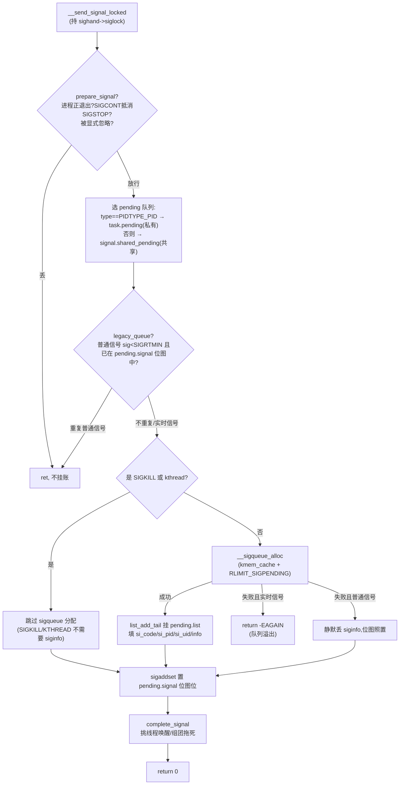
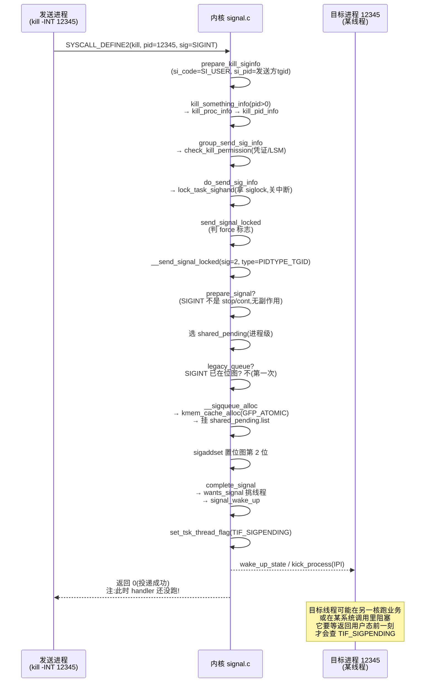

# 第十七签 · 信号投递:send_sig / complete_signal

> 篇:P4 信号——内核向进程的异步通知
> 主线呼应:第 3 篇讲完时钟——hrtimer 到期、POSIX timer 投 SIGALRM/SIGPROF——那个"投递"动作是怎么发生的?这是第 4 篇的开端。一个信号从发送方(另一进程 `kill`、内核 `force_sig`、定时器 `SIGALRM`、CPU 异常 `SIGSEGV`)出发,要穿过权限检查、忽略判断、信号合并、队列挂账、唤醒目标线程这么多关,才变成目标进程 `pending` 队列里的一项。这一章专门讲这段"投递"旅程:从 `kill` 系统调用进内核,到 `do_send_sig_info` → `__send_signal_locked` → `complete_signal` 把信号挂到目标、并唤醒一个合适的线程。**注意,挂上去不等于执行**——真正的 handler 要等到目标线程返回用户态前一刻才跑(下一章 P4-18)。本章只讲"挂号信怎么签收",不讲"挂号信怎么当面交付"。
> 二分法:这一章服务"**内核主动**"那面——信号是内核(或别的进程)主动发给目标进程的异步通知,投递是内核"向外"产生事件。

## 核心问题

**`kill`/`tgkill`/`raise`/`rt_sigqueueinfo` 这些入口,怎么把一个信号从发送方送到目标进程?信号进来之后,内核凭什么决定它该挂在进程级(线程组共享)的队列还是某个特定线程的队列?为什么普通信号(1-31)重复发只挂一次、实时信号(34-64)重复发却排队不丢?`complete_signal` 怎么在一个多线程进程里挑出"该唤醒哪一个线程"?这整段旅程和 Go channel 的"投递延迟到收方取"有什么同构?**

读完本章你会明白:

1. 信号投递的完整路径:`kill`(或 `tgkill`/`force_sig`/`rt_sigqueueinfo`)→ `group_send_sig_info`/`do_send_sig_info` → `send_signal_locked` → `__send_signal_locked` 挂队列 → `complete_signal` 唤醒线程。
2. **进程级信号 vs 线程级信号**:为什么 `kill` 投到线程组共享的 `shared_pending`、而 `tgkill`/`tkill` 投到某个 task 私有的 `pending`。
3. **信号合并与排队的两套规则**:普通信号靠位图(`sigset_t signal`)合并同编号、实时信号靠 `sigqueue` 链表排队不丢。
4. **`complete_signal` 如何挑线程**:从一个多线程进程里挑一个"想接、能接"的线程唤醒,以及致命信号如何把整个线程组一起拖下水。
5. ★ 对照:Linux 信号投递的"内核先记账、收方稍后取"和 Go channel 投递是同一思路。

> **逃生阀**:如果你已经会写 `sigaction`、知道 `kill -9` 能杀进程,可以直接跳到 17.3(普通信号合并 vs 实时信号排队)和 17.5(技巧精解:`legacy_queue` + `__sigqueue_alloc` 的两套规则)。但 17.2(数据结构嵌套)是后面所有信号章节的地基,即使你懂 API 也建议读。

---

## 17.1 一句话点破

> **信号投递的本质是"挂账"——发送方调系统调用进内核,内核把信号(可能带一份 `siginfo` 数据)挂到目标进程的 `pending` 队列、把 `_TIF_SIGPENDING` 标志位打上、唤醒一个合适的线程。至于真正的 handler 怎么跑,内核此刻完全不管——它要等到那个线程返回用户态前一刻才回头看 `_TIF_SIGPENDING`、再去取信号跑 handler。**

这是结论,不是理由。本章倒过来拆:先看信号的数据结构地基(`task_struct` → `sighand_struct` → `signal_struct` → `sigpending`),再拆投递路径上的四道关(权限 → 忽略 → 合并 → 排队),最后看 `complete_signal` 怎么挑线程、致命信号怎么组团拖死。

---

## 17.2 数据结构地基:信号挂在哪

在读投递路径之前,必须先把"信号挂在哪里"的数据结构看清楚。这块嵌套是后面 P4-18(返回用户态取信号)、P4-19(sigframe 栈切换)反复要回扣的地基,本节一次讲透。

### 四层嵌套:从 task_struct 到 sigpending

一个进程(线程组)里有多个线程(每个线程一个 `task_struct`),它们**共享**信号处理表(`sighand_struct`)和线程组级 pending 队列(`signal_struct`),但**各自有**一份线程私有 pending 队列(`task_struct.pending`)。这是为"进程级信号"和"线程级信号"两套投递语义服务的。

```
 线程组(进程)的多线程布局(简化):

   task_struct (线程 1, 主线程)          task_struct (线程 2)         task_struct (线程 3)
   ┌─────────────────────────┐          ┌─────────────────────┐      ┌─────────────────────┐
   │ ...                      │          │ ...                  │      │ ...                  │
   │ pending:  ←私有 pending  │          │ pending: ←私有       │      │ pending: ←私有       │
   │   list   (sigqueue链表)  │          │   (sigqueue链表)    │      │   (sigqueue链表)    │
   │   signal (sigset_t 位图) │          │   signal(sigset_t)  │      │   signal(sigset_t)  │
   │  ┌─ sighand ──────────┐ │          │  ┌─ sighand ──────┐ │      │  ┌─ sighand ──────┐ │
   │  │ (指针, 全组共享) ───────────────────→ 同一 sighand_struct (所有线程指向同一份)
   │  └────────────────────┘ │          │  └────────────────┘ │      │  └────────────────┘ │
   │  ┌─ signal ───────────┐ │          │  ┌─ signal ───────┐ │      │  ┌─ signal ───────┐ │
   │  │ (指针, 全组共享) ───────────────────→ 同一 signal_struct (所有线程指向同一份)
   │  └────────────────────┘ │          │  └────────────────┘ │      │  └────────────────┘ │
   └─────────────────────────┘          └─────────────────────┘      └─────────────────────┘
                                                      │
                                                      ▼
   sighand_struct (共享)                 signal_struct (共享)
   ┌──────────────────────────────┐      ┌──────────────────────────────────────┐
   │ siglock        ← 投递全程锁   │      │ curr_target   ← 当前挑线程的起点     │
   │ count          ← 引用计数     │      │ shared_pending: ← 进程级 pending     │
   │ action[_NSIG]  ← 每信号 sigaction│ │   list   (sigqueue 链表)             │
   │   action[0] = SIGINT 的处理   │      │   signal (sigset_t 位图)             │
   │   action[1] = SIGQUIT 的处理  │      │ group_exit_code / flags / ...        │
   │   ...                        │      │ real_timer (ITIMER_REAL, hrtimer)    │
   └──────────────────────────────┘      └──────────────────────────────────────┘

   每个 sigpending(私有 pending 或 shared_pending)内部:
   ┌──────────────────────────────────┐
   │ list:   sigqueue 链表头           │ ←─ 排队的实时信号、带 siginfo 的信号在这
   │ signal: sigset_t 位图(64 bit)    │ ←─ 位图,bit N=1 表示信号 N pending 中
   └──────────────────────────────────┘

   每个 sigqueue(链表节点):
   ┌──────────────────────────────────┐
   │ list:   链表节点                   │
   │ flags:  SIGQUEUE_PREALLOC 等      │
   │ info:   kernel_siginfo_t(谁发的,│
   │          为什么发,带什么数据)      │
   │ ucounts: RLIMIT_SIGPENDING 计数   │
   └──────────────────────────────────┘
```

这四层嵌套,定义在 [include/linux/sched/signal.h#L21-L26](../linux/include/linux/sched/signal.h#L21-L26) 的 `sighand_struct`、[L94-L107](../linux/include/linux/sched/signal.h#L94-L107) 的 `signal_struct`(其中 `shared_pending` 在 L107、`curr_target` 在 L104)、[include/linux/signal_types.h#L22-L35](../linux/include/linux/signal_types.h#L22-L35) 的 `sigqueue` 和 `sigpending`、[include/linux/sched.h#L1119](../linux/include/linux/sched.h#L1119) 的 `task_struct.pending`。

```c
/* include/linux/sched/signal.h,简化 */
struct sighand_struct {
    spinlock_t      siglock;              /* 投递全程要拿的锁 */
    refcount_t      count;
    wait_queue_head_t signalfd_wqh;
    struct k_sigaction  action[_NSIG];    /* _NSIG=64,每个信号一个 sigaction */
};

struct signal_struct {
    refcount_t      sigcnt;
    atomic_t        live;
    int             nr_threads;
    struct task_struct  *curr_target;     /* complete_signal 挑线程的起点 */
    struct sigpending   shared_pending;   /* 线程组共享 pending 队列 */
    /* ... group_exit_code / flags / real_timer / posix_timers ... */
};

/* include/linux/signal_types.h */
struct sigqueue {
    struct list_head list;
    int flags;
    kernel_siginfo_t  info;               /* 携带的"为什么发"数据 */
    struct ucounts    *ucounts;           /* RLIMIT_SIGPENDING 计数 */
};

struct sigpending {
    struct list_head list;                /* sigqueue 链表头 */
    sigset_t         signal;              /* 位图:哪些信号 pending 中 */
};
```

### 为什么这么嵌套

> **不这样会怎样**:如果 `sighand`/`signal` 不共享——每个线程一份自己的 `sigaction` 表——那 `sigaction(SIGINT, ...)` 注册的 handler 只对调用它的那个线程生效,父进程 `kill -INT` 一个进程的任何一个线程,handler 在哪个线程跑就成了抽奖;`signal()` 函数"装个 handler"的语义根本建不起来。所以**信号处理表必须线程组共享**(`sighand` 是全组一份)。

> **所以这样设计**:`sighand_struct`(怎么处理)和 `signal_struct`(线程组级状态,含进程级 pending 队列)是**线程组共享**的——一个进程装一个 handler、所有线程看到的是同一个;`task_struct.pending`(线程私有 pending)是**每个线程一份**——这给"发给特定线程的信号"(`tgkill`、异常触发的 `force_sig`)一个落脚处。两套 pending 队列(进程级 `shared_pending` + 线程级 `pending`)并存,是投递路径上区分"进程级 vs 线程级"信号的物理基础。

> **钉死这件事**:记住这两套 pending 的语义差——`shared_pending`(在 `signal_struct` 里,全组共享)放进程级信号(`kill`/进程组广播/定时器),任何一个线程都有资格去取;`pending`(在 `task_struct` 里,线程私有)放线程级信号(`tgkill`/`tkill`/CPU 异常 `force_sig`),只有这个线程自己能取。投递函数 `__send_signal_locked` 根据 `type` 参数(`PIDTYPE_PID` 还是 `PIDTYPE_TGID`)选挂哪个队列。

---

## 17.3 投递路径概览:四道关

现在看一个 `kill -INT 12345` 怎么一路走进内核、最终把 SIGINT 挂到进程 12345 的 `shared_pending` 上。整段投递路径有**四道关**:

1. **入口**:系统调用 `kill`/`tgkill`/`tkill`/`rt_sigqueueinfo`。
2. **权限**:`check_kill_permission`(你能发吗?)。
3. **忽略判断**:`prepare_signal` → `sig_ignored`(信号该不该丢?比如 SIGCHLD 被显式忽略、进程正在退出、SIGCONT 抵消挂起的 SIGSTOP)。
4. **合并/排队**:`legacy_queue`(普通信号是否已 pending)+ `__sigqueue_alloc`(分配 sigqueue 节点挂链表)+ `sigaddset`(置位图位)。
5. **唤醒**:`complete_signal`(挑一个线程唤醒,致命信号组团拖死)。

下面逐步拆。

### 入口:四种系统调用,两种 type

`kill(2)`/`tgkill(2)`/`tkill(2)`/`rt_sigqueueinfo(2)` 是用户态发信号的四个主要系统调用。它们语义不同,但最后都汇到 `do_send_sig_info` 这一个公共函数,差别在传给它的 `type` 参数:

| 系统调用 | 入口 | 投递目标 | type |
|---|---|---|---|
| `kill(pid, sig)` | [signal.c:3826](../linux/kernel/signal.c#L3826) `SYSCALL_DEFINE2(kill)` | 进程(线程组)或进程组(pid>0 进程、pid=0 同组、pid=-1 广播、pid<-1 指定组) | `PIDTYPE_TGID`(默认) |
| `tgkill(tgid, pid, sig)` | [signal.c:4028](../linux/kernel/signal.c#L4028) | 一个特定线程(同时校验它仍属于 tgid) | `PIDTYPE_PID` |
| `tkill(pid, sig)` | [signal.c:4044](../linux/kernel/signal.c#L4044) | 一个特定线程(不校验 tgid,老接口) | `PIDTYPE_PID` |
| `rt_sigqueueinfo(pid, sig, uinfo)` | [signal.c:4072](../linux/kernel/signal.c#L4072) | 进程,且允许带 `siginfo`(实时信号排队) | `PIDTYPE_TGID` |

注意 `kill` 还有一个微妙处:它根据 `pid` 的正负值决定投到进程、进程组还是广播。`kill_something_info`([signal.c:1606](../linux/kernel/signal.c#L1606))负责这个分支:pid>0 走 `kill_proc_info`(单个进程)、pid==0/-1 走进程组广播(`__kill_pgrp_info` 或 `for_each_process` 遍历)、pid<-1 投到指定进程组。

`prepare_kill_siginfo`([signal.c:3810](../linux/kernel/signal.c#L3810))填充 `kernel_siginfo`,这是信号的"履历"——谁发的(`si_pid`/`si_uid`)、为什么发(`si_code`,`SI_USER` 来自 kill、`SI_TKILL` 来自 tgkill):

```c
/* signal.c,简化 */
static void prepare_kill_siginfo(int sig, struct kernel_siginfo *info, enum pid_type type)
{
    clear_siginfo(info);
    info->si_signo = sig;
    info->si_errno = 0;
    info->si_code = (type == PIDTYPE_PID) ? SI_TKILL : SI_USER;
    info->si_pid  = task_tgid_vnr(current);   /* 发送方的线程组 id */
    info->si_uid  = from_kuid_munged(current_user_ns(), current_uid());
}
```

`si_code` 这个字段后面会被 `legacy_queue`、`__send_signal_locked` 反复看——它是"该不该排队、能不能合并"的关键判据之一。

`tgkill` 路径还要先 `find_task_by_vpid` 找到那个线程、确认它仍属于 `tgid`,然后调 `do_send_sig_info(sig, info, p, PIDTYPE_PID)`——注意 type 是 `PIDTYPE_PID`,这决定了下一步把信号挂到线程私有 `pending` 而不是 `shared_pending`。

### 第一关:权限检查

进 `do_send_sig_info`([signal.c:1294](../linux/kernel/signal.c#L1294))之前,`group_send_sig_info`([signal.c:1443](../linux/kernel/signal.c#L1443))已经先做了一道权限检查 `check_kill_permission`:

```c
/* signal.c,简化 */
int group_send_sig_info(int sig, struct kernel_siginfo *info,
                        struct task_struct *p, enum pid_type type)
{
    int ret;
    rcu_read_lock();
    ret = check_kill_permission(sig, info, p);   /* 权限检查 */
    rcu_read_unlock();
    if (!ret && sig)
        ret = do_send_sig_info(sig, info, p, type);
    return ret;
}
```

`check_kill_permission`([signal.c:831](../linux/kernel/signal.c#L831))对"来自用户态的信号"做两件事:① 凭证检查(`kill_ok_by_cred`,你的 euid/uid 是否能发给目标的 uid/suid)、② LSM 钩子(`security_task_kill`,SELinux/AppArmor 等策略)。内核自身产生的信号(异常、定时器,`si_code == SI_KERNEL`)不查权限直接放行——内核自己发信号没必要查自己。

> **不这样会怎样**:如果没有权限检查,任何普通用户都能 `kill -9` 杀 root 进程、跨容器杀进程,隔离形同虚设。凭证规则遵循 POSIX:你能发给目标当且仅当你的(实际或有效)uid 等于目标的(实际或保存的)uid,或者你有 `CAP_KILL`。

### 第二关:`do_send_sig_info` → `send_signal_locked`

权限过了,`do_send_sig_info`([signal.c:1294](../linux/kernel/signal.c#L1294))只做一件最关键的事——**拿到目标进程的 `sighand->siglock`**,然后调 `send_signal_locked`:

```c
/* signal.c */
int do_send_sig_info(int sig, struct kernel_siginfo *info,
                     struct task_struct *p, enum pid_type type)
{
    unsigned long flags;
    int ret = -ESRCH;                                  /* 找不到进程 */

    if (lock_task_sighand(p, &flags)) {                /* 拿 sighand->siglock,关中断 */
        ret = send_signal_locked(sig, info, p, type);  /* 在锁内投递 */
        unlock_task_sighand(p, &flags);                /* 释放 */
    }
    return ret;
}
```

`lock_task_sighand` 是个内联([signal.h:741](../linux/include/linux/sched/signal.h#L741)),本质是 `spin_lock_irqsave(&p->sighand->siglock)` + 防止 `sighand` 在你拿锁期间被释放(目标进程可能在 `exit` 里正在 `__cleanup_sighand`),所以它有个 RCU + 重试的小循环(实现在 [signal.c:1392](../linux/kernel/signal.c#L1392) 的 `__lock_task_sighand`)。

> **钉死这件事**:`sighand->siglock` 是整个信号子系统的大锁——投递(`__send_signal_locked`)、取信号(`get_signal`)、改 `sigaction`(`do_sigaction`)、改阻塞掩码(`sigprocmask`)全在它底下。它**同时关了本地 CPU 中断**(`_irqsave` 变体),因为 hardirq 里也能发信号(异常、定时器),拿这把锁不能死锁中断自己。投递路径上所有 pending 位图/链表的并发安全,都靠这一把锁。

### 第三关:`send_signal_locked` → `__send_signal_locked`

`send_signal_locked`([signal.c:1215](../linux/kernel/signal.c#L1215))做一道"force 标志"的判断(决定要不要绕过某些忽略规则——比如 init 进程、跨 pid namespace 的强制投递),然后调 `__send_signal_locked`——这是投递的核心,下一节单独拆。

---

## 17.4 核心投递:`__send_signal_locked` 的四步

`__send_signal_locked`([signal.c:1074](../linux/kernel/signal.c#L1074))是投递的核心。它做四步:① 选哪个 pending 队列;② 过 `prepare_signal` 看是否要丢;③ 过 `legacy_queue` 看普通信号是否重复;④ 分配 `sigqueue` 挂链表 + 置位图位;最后调 `complete_signal`。



我们逐步拆每一步。

### 步骤一:`prepare_signal` —— 全局副作用与忽略判断

```c
/* signal.c,简化 */
static int __send_signal_locked(int sig, struct kernel_siginfo *info,
                struct task_struct *t, enum pid_type type, bool force)
{
    struct sigpending *pending;
    struct sigqueue *q;
    ...
    if (!prepare_signal(sig, t, force))       /* ② 全局副作用 + 忽略 */
        goto ret;
    ...
}
```

`prepare_signal`([signal.c:903](../linux/kernel/signal.c#L903))返回 `false` 表示这个信号应该被丢掉(不挂账)。它判断三类情况:

1. **进程正在退出**(`SIGNAL_GROUP_EXIT`):除了 SIGKILL 在 coredump 期间,其他信号一律丢——进程都要死了,排队没意义。
2. **`sig_kernel_stop` 信号**(SIGSTOP/SIGTSTP/SIGTTIN/SIGTTOU):来一个 stop 信号,把所有挂起的 SIGCONT 从所有队列里冲掉(`flush_sigqueue_mask`)——因为 stop 和 continue 互斥,新 stop 抵消旧 continue。
3. **`SIGCONT`**:反过来,把所有挂起的 stop 信号冲掉,并唤醒所有 `TASK_STOPPED` 的线程——这就是为什么你 `kill -CONT` 一个被 `^Z` 暂停的进程它会立刻恢复,**不管 SIGCONT 是不是被 block 或 ignore**(注释明说:"This happens regardless of blocking, catching, or ignoring SIGCONT")。

最后,`prepare_signal` 调 `sig_ignored`([signal.c:104](../linux/kernel/signal.c#L104))判断"这个信号对这个进程来说是不是被显式忽略的":handler 是 `SIG_IGN`、或者默认动作就是忽略(`sig_kernel_ignore`,SIGCHLD/SIGCONT/SIGWINCH/SIGURG 的默认动作是忽略)。被忽略的信号直接丢,不挂账。

> **不这样会怎样**:如果 SIGCONT/SIGSTOP 不在投递时立即做"互斥冲刷",而是等取信号时再做——想象一下:你 `^Z` 暂停一个进程、然后立刻 `kill -CONT` 接着发了一个 SIGTSTP,如果都不冲刷,进程的 stop/continue 状态就会乱套(两个都挂着、谁先取谁说了算)。`prepare_signal` 在**生成时刻**就做互斥,保证"最后一个 stop/continue 说了算"。

> **钉死这件事**:`prepare_signal` 里有个重要细节——**被 block(屏蔽)的信号不算被 ignore**。`sig_ignored` 开头就写:`if (sigismember(&t->blocked, sig)) return false;`。因为信号可能被临时屏蔽(`sigprocmask`),之后解除屏蔽时 handler 可能已经改了,所以 block 不等于丢——block 的信号照样挂 pending,只是不投递给 handler,等解除屏蔽。

### 步骤二:选 pending 队列

```c
    pending = (type != PIDTYPE_PID) ? &t->signal->shared_pending : &t->pending;
```

一行决定信号挂哪([signal.c:1088](../linux/kernel/signal.c#L1088)):`type == PIDTYPE_PID`(来自 `tgkill`/`tkill`/异常)挂到**线程私有** `t->pending`;其他(`PIDTYPE_TGID`/`PIDTYPE_PGID`/`PIDTYPE_MAX`,来自 `kill`/进程组广播)挂到**线程组共享** `t->signal->shared_pending`。

这是进程级 vs 线程级信号的物理体现:发给进程的信号,任何一个线程都有资格取;发给特定线程的信号,只有它能取。

### 步骤三:`legacy_queue` —— 普通信号合并

这是本章最核心的技巧,在技巧精解里单独拆。这里先看它在 `__send_signal_locked` 里的位置:

```c
    /* signal.c */
    if (legacy_queue(pending, sig))      /* ③ 普通信号已 pending?直接不挂(合并) */
        goto ret;
```

`legacy_queue`([signal.c:1069](../linux/kernel/signal.c#L1069))的实现极简:

```c
static inline bool legacy_queue(struct sigpending *signals, int sig)
{
    return (sig < SIGRTMIN) && sigismember(&signals->signal, sig);
}
```

含义:如果这个信号是普通信号(`sig < SIGRTMIN`,即 1-31)且**已经在 pending 位图里**了,直接 `goto ret`——不分配 `sigqueue`、不再挂链表。这就是"普通信号同编号只挂一次、重复发不排队"。

### 步骤四:分配 sigqueue + 置位图 + 唤醒

普通信号没重复(或实时信号),进入分配:

```c
    /* signal.c,简化 */
    if ((sig == SIGKILL) || (t->flags & PF_KTHREAD))
        goto out_set;                          /* SIGKILL/kernel 线程不需要 siginfo */

    if (sig < SIGRTMIN)
        override_rlimit = (is_si_special(info) || info->si_code >= 0);
    else
        override_rlimit = 0;                    /* 实时信号严格受 RLIMIT_SIGPENDING 限制 */

    q = __sigqueue_alloc(sig, t, GFP_ATOMIC, override_rlimit, 0);

    if (q) {
        list_add_tail(&q->list, &pending->list);   /* 挂链表尾 */
        /* 根据 info 类型填 siginfo:SEND_SIG_NOINFO/SEND_SIG_PRIV/真实 siginfo */
        ...
    } else if (!is_si_special(info) &&
               sig >= SIGRTMIN && info->si_code != SI_USER) {
        return -EAGAIN;                            /* 实时信号队列满,失败返回 */
    } else {
        /* 普通信号分配失败:静默丢 siginfo,但位图照样置(信号还是投了) */
    }
out_set:
    signalfd_notify(t, sig);
    sigaddset(&pending->signal, sig);              /* ④ 置位图位 */
    ...
    complete_signal(sig, t, type);                 /* ⑤ 唤醒一个合适的线程 */
```

四个细节值得钉死:

1. **SIGKILL 和 kernel 线程跳过分配**——SIGKILL 不带可读 `siginfo`(它就是"死",没别的可说),kernel 线程也不需要 `siginfo`,所以这两类信号只置位图、不挂 `sigqueue`。
2. **`GFP_ATOMIC` 分配**——投递路径可能在 hardirq 里跑(CPU 异常 → `force_sig`,定时器中断 → `SIGALRM`),`GFP_ATOMIC` 不允许睡眠,所以 `__sigqueue_alloc` 用专门的 `sigqueue_cachep`([signal.c:66](../linux/kernel/signal.c#L66),在初始化时 `KMEM_CACHE(sigqueue, ...)` 建于 [signal.c:4858](../linux/kernel/signal.c#L4858))。
3. **`override_rlimit`**——普通信号如果来自内核(`is_si_special` 或 `si_code >= 0`)可以超 `RLIMIT_SIGPENDING` 配额(因为内核信号不应该因为用户配额而被静默丢);实时信号严格受配额限制,满了就 `-EAGAIN`。
4. **分配失败的两种处理**——实时信号分配失败返 `-EAGAIN`(让发送方知道,POSIX 实时信号语义要求排队不丢,排不下就报错);普通信号分配失败**静默丢 `siginfo` 但位图照置**(普通信号本来就可能合并、可丢 `siginfo`,只是 handler 拿到的 `siginfo` 字段会退化为 `SI_USER` 默认值)。

最后一步 `sigaddset(&pending->signal, sig)` 把位图对应位置 1——这一位是"有信号 N pending"的快速标记,后面 `legacy_queue`、`get_signal` 都靠它 O(1) 判断。

然后调 `complete_signal`,决定唤醒谁。

---

## 17.5 `complete_signal`:挑线程唤醒,致命信号组团拖死

`complete_signal`([signal.c:995](../linux/kernel/signal.c#L995))的逻辑分两段:**挑线程** + **致命信号组团处理**。

### 挑一个合适的线程

```c
/* signal.c,简化 */
static void complete_signal(int sig, struct task_struct *p, enum pid_type type)
{
    struct signal_struct *signal = p->signal;
    struct task_struct *t;

    if (wants_signal(sig, p))
        t = p;                                   /* 推荐线程就能接,选它 */
    else if ((type == PIDTYPE_PID) || thread_group_empty(p))
        return;                                  /* 单线程 / 线程级信号,不用唤醒,它自己会取 */
    else {
        t = signal->curr_target;                 /* 从上次挑的线程开始扫 */
        while (!wants_signal(sig, t)) {
            t = next_thread(t);
            if (t == signal->curr_target)
                return;                          /* 扫一圈没合适的,不唤醒 */
        }
        signal->curr_target = t;                 /* 记下,下次从这扫 */
    }
    ...
}
```

`wants_signal`([signal.c:978](../linux/kernel/signal.c#L978))判断"这个线程是否愿意/能接这个信号":

```c
static inline bool wants_signal(int sig, struct task_struct *p)
{
    if (sigismember(&p->blocked, sig))   return false;  /* 屏蔽了,不接 */
    if (p->flags & PF_EXITING)           return false;  /* 正退出,不接 */
    if (sig == SIGKILL)                  return true;   /* SIGKILL 一定要接 */
    if (task_is_stopped_or_traced(p))    return false;  /* 停止/被追踪,不接 */
    return task_curr(p) || !task_sigpending(p);          /* 在跑、或没活干 */
}
```

挑线程的策略([signal.c:1000-1029](../linux/kernel/signal.c#L1000-L1029)):

1. **先看推荐线程 `p`**(`do_send_sig_info` 传进来的那个 task,可能是 `kill` 找到的任意线程)——它要是 `wants_signal`,直接选它。
2. **如果 `type == PIDTYPE_PID`(线程级)或进程只有一个线程**——不用唤醒,挂上 pending 就行,这个线程返回用户态前会自己来取。
3. **否则从 `signal->curr_target` 开始扫线程链表**——`curr_target` 是"上次挑的线程",从这里扫起是个**轮询负载均衡**(避免每次都挑主线程、信号 handler 都堆在主线程上)。扫到第一个 `wants_signal` 的就停,记下作为新的 `curr_target`。

> **不这样会怎样**:如果每次都挑主线程——多线程进程的所有信号 handler 都在主线程跑,主线程成了瓶颈,其他线程闲着。`curr_target` 轮询让信号处理负载摊到各线程,这是多线程信号投递的负载均衡技巧。

挑到线程后,`complete_signal` 做致命判断。

### 致命信号:把整个线程组一起拖下水

```c
    /* signal.c,简化 */
    if (sig_fatal(p, sig) &&                         /* 默认动作是 terminate */
        (signal->core_state || !(signal->flags & SIGNAL_GROUP_EXIT)) &&
        !sigismember(&t->real_blocked, sig) &&
        (sig == SIGKILL || !p->ptrace)) {

        if (!sig_kernel_coredump(sig)) {             /* 非需要 coredump 的致命信号 */
            signal->flags = SIGNAL_GROUP_EXIT;       /* 标记整组退出的开始 */
            signal->group_exit_code = sig;
            signal->group_stop_count = 0;
            __for_each_thread(signal, t) {
                task_clear_jobctl_pending(t, JOBCTL_PENDING_MASK);
                sigaddset(&t->pending.signal, SIGKILL);  /* 给每个线程塞个 SIGKILL */
                signal_wake_up(t, 1);                    /* 全部唤醒 */
            }
            return;
        }
        /* 需要 coredump 的:不预先组团,等某个线程 dequeue 时再 do_group_exit */
    }

    signal_wake_up(t, sig == SIGKILL);               /* 普通情况:唤醒挑中的线程 */
}
```

这段很关键。如果一个进程的某个线程收到一个"默认动作是 terminate"的信号(`sig_fatal`,即不是 ignore/stop 类,见 [signal.h:451](../linux/include/linux/signal.h#L451))且不是被显式 catch 的,**整个线程组都要退出**——这就是"信号杀死进程"的真相:不是杀一个线程,是组团杀。

为什么要"组团杀"?想想**没有这段逻辑**会怎样:一个 8 线程进程收到 SIGTERM,只挂到 `shared_pending`,8 个线程里某一个返回用户态时取到、跑默认动作(terminate)退出自己——剩下 7 个线程还在跑,进程不退。这就违反了 POSIX"对进程的致命信号杀整个进程"的语义。所以内核在投递时刻就**主动**给每个线程都塞一个 SIGKILL、全部唤醒,确保它们一起死。

> **钉死这件事**:这里有个微妙的优化——`sig_kernel_coredump` 的致命信号(SIGQUIT/SIGILL/SIGTRAP/SIGABRT/SIGFPE/SIGSEGV/SIGBUS/SIGSYS/SIGXCPU/SIGXFSZ)需要生成 core dump,**不预先组团**,而是让某个线程在 `get_signal` 里取到时走 `do_group_exit` 路径(因为 coredump 要选一个线程做 dumper、其他冻结);非 coredump 的致命信号(SIGTERM/SIGHUP/SIGINT/... 实时信号等)立刻组团,标记 `SIGNAL_GROUP_EXIT`、所有线程塞 SIGKILL。这是"快死 vs 慢死(core dump)"的分流。

### `signal_wake_up`:置 `_TIF_SIGPENDING` + 唤醒

挑出线程(或所有线程)后,`complete_signal` 调 `signal_wake_up(t, sig == SIGKILL)`,它最终调到 `signal_wake_up_state`([signal.c:760](../linux/kernel/signal.c#L760)):

```c
void signal_wake_up_state(struct task_struct *t, unsigned int state)
{
    lockdep_assert_held(&t->sighand->siglock);
    set_tsk_thread_flag(t, TIF_SIGPENDING);           /* 关键:打 _TIF_SIGPENDING */
    if (!wake_up_state(t, state | TASK_INTERRUPTIBLE))
        kick_process(t);                               /* 在另一个 CPU 跑?发 IPI 踢一下 */
}
```

这是投递的收尾——把目标线程的 `thread_info->flags` 打上 `TIF_SIGPENDING`,然后(如果在睡眠)唤醒它、(如果在另一个 CPU 跑)发 IPI 把它踢出用户态。`TIF_SIGPENDING` 这一位是下一章 P4-18 的入口:`exit_to_user_mode_loop` 检查 `ti_work & _TIF_SIGPENDING` 非零就调 `arch_do_signal_or_restart` 进入信号处理。

> **钉死这件事**:`_TIF_SIGPENDING` 是投递与处理之间的**唯一耦合点**。投递方只做两件事:挂 pending、置 `TIF_SIGPENDING`。处理方(下一章)在返回用户态前查这一位、回头取 pending。投递方和处理方**完全异步、解耦**——发信号方调系统调用返回时,handler 大概率还没跑(目标线程可能还在另一核跑业务、可能阻塞在某个系统调用里)。这种"先挂账、稍后取"的模型,是信号延迟投递的本质,也是 Go channel 的同构(见 17.7 ★对照)。

`kick_process` 的"发 IPI 踢"是为了**抢占正在用户态跑的目标线程**——如果目标线程在另一个 CPU 上跑用户代码、没有进内核,它怎么会看到 `TIF_SIGPENDING`?内核发个 IPI 让它进内核(中断把它拉进内核),它在 `irqentry_exit_to_user_mode` 时检查 `TIF_SIGPENDING` 就看到了。这又回扣了第 1 篇"中断把控制权拉进内核"——信号的及时性最终靠的是中断(或者系统调用返回路径)给一个"看一眼 `_TIF` 标志"的机会。

---

## 17.6 投递完整旅程:一次 `kill -INT 12345`

把上面所有片段串起来,一个 SIGINT 的完整旅程:



注意最后一步——发送方拿到 `kill` 返回值 0 时,目标进程的 handler **还没跑**。信号只是挂上了 `shared_pending`,目标线程何时取、何时跑 handler,完全取决于它何时走到"返回用户态"那个检查点(下一章)。这就是"延迟投递"。

---

## 17.7 技巧精解:`legacy_queue` 的两套规则 + `__sigqueue_alloc` 的配额

### 技巧一:`legacy_queue` + 位图 —— 普通信号合并、实时信号排队

Linux 信号有两套语义:**普通信号**(编号 1-31,即传统 UNIX 信号)和**实时信号**(编号 34-64,即 POSIX.1b real-time signals,内核 `SIGRTMIN`=35 起到 `SIGRTMAX`=64)。这两套在投递上的核心差别是**重复发会不会排队**:

| 信号类别 | 编号 | 重复发同编号 | 是否携带 `siginfo` | 排队规则 |
|---|---|---|---|---|
| 普通信号 | 1-31 | **合并**(只挂一次) | 默认带最简 `siginfo`(可丢) | 位图 `pending->signal` 一位表示,链表可选挂一个 `sigqueue` |
| 实时信号 | 34-64(`SIGRTMIN`-`SIGRTMAX`) | **排队**(每个都挂,不丢) | 强制带完整 `siginfo` | 每个 `sigqueue` 节点必须挂链表 |

这个差别在 `legacy_queue`([signal.c:1069](../linux/kernel/signal.c#L1069))里就一行判断:

```c
static inline bool legacy_queue(struct sigpending *signals, int sig)
{
    return (sig < SIGRTMIN) && sigismember(&signals->signal, sig);
}
```

含义:① 信号是普通信号(`sig < SIGRTMIN`,普通信号编号小于实时信号最小值),② 且这个信号已经在 pending 位图里了——**返回 true,直接 `goto ret` 不挂新的**。结果:同一个普通信号在 pending 队列里最多一个实例,重复发的第 N 次(N>1)被静默合并掉。

实时信号(`sig >= SIGRTMIN`)永远返回 false——每次发都进分配 `sigqueue`、挂链表,排队不丢。

> **反面对比**:如果用一个朴素的全局 `sigqueue` 链表表示所有信号(不用位图 + 链表双轨制,普通信号也排队),两个问题:
>
> 1. **内存爆炸**:`kill -INT` 发十万次就挂十万个 `sigqueue` 节点,每个 ~64 字节,光一个进程的 pending 队列就几兆——但普通信号语义上"同编号只通知一次",排队是浪费。位图(8 字节的 `sigset_t` 一个)让 32 个普通信号共占 4 字节,O(1) 判断有没有。
> 2. **`siginfo` 丢失语义**:普通信号重复发时,后发的 `siginfo`(谁发的)该覆盖前面的吗?该丢弃吗?POSIX 把这定为"implementation-defined",Linux 选了"丢弃 + 合并"——普通信号合并、`siginfo` 不保证可靠(分配失败时静默丢 `siginfo`),只有实时信号保证排队不丢、`siginfo` 完整。**两套语义对应两套规则**,这就是 `legacy_queue` 的设计动机。

> **钉死这件事**:这两套语义的代价是**位图 + 链表双轨制**——`sigpending` 既有 `sigset_t signal`(位图,表示哪些信号 pending 中),又有 `struct list_head list`(链表,挂 `sigqueue` 节点带 `siginfo`)。`legacy_queue` 看位图快速合并普通信号;`__send_signal_locked` 看链表保存实时信号和带数据的普通信号。`get_signal`(下一章)取的时候,位图告诉"有没有"、链表告诉"具体哪个 `sigqueue` 节点(可拿 `siginfo`)"。双轨制是"快速合并"和"信息完整性"的折衷。

### 技巧二:`__sigqueue_alloc` —— 配额 + 专用 slab cache

`__sigqueue_alloc`([signal.c:405](../linux/kernel/signal.c#L405))是分配 `sigqueue` 节点的核心,它做两件值得讲的事:

```c
/* signal.c,简化 */
static struct sigqueue *
__sigqueue_alloc(int sig, struct task_struct *t, gfp_t gfp_flags,
                 int override_rlimit, const unsigned int sigqueue_flags)
{
    struct sigqueue *q = NULL;
    struct ucounts *ucounts;
    long sigpending;

    rcu_read_lock();
    ucounts = task_ucounts(t);
    sigpending = inc_rlimit_get_ucounts(ucounts, UCOUNT_RLIMIT_SIGPENDING);
    rcu_read_unlock();
    if (!sigpending)
        return NULL;

    if (override_rlimit || likely(sigpending <= task_rlimit(t, RLIMIT_SIGPENDING))) {
        q = kmem_cache_alloc(sigqueue_cachep, gfp_flags);    /* 从专用 slab 分配 */
    } else {
        print_dropped_signal(sig);                            /* 超配额,丢 */
    }
    ...
}
```

1. **RLIMIT_SIGPENDING 配额**:每个 user(实际是 user namespace 的 ucounts)有一个挂起信号配额上限,超过就不分配、调 `print_dropped_signal`(打日志告诉用户"你的进程在刷信号")。这防止恶意/有 bug 的进程把内存耗光——不限制的话,一个 `while(1) sigqueueinfo(SIGRTMIN+N, ...)` 就能让目标进程的 pending 队列吃掉所有内存。配额计数挂在 `ucounts` 上(每个 user namespace 一份),`__sigqueue_alloc` 增、`__sigqueue_free` 减。
2. **专用 slab cache `sigqueue_cachep`**:`sigqueue` 结构体是高频分配释放的(每个实时信号、每个带数据的普通信号都分配一个),用专用 slab cache(`KMEM_CACHE(sigqueue, SLAB_PANIC | SLAB_ACCOUNT)` 建于 [signal.c:4858](../linux/kernel/signal.c#L4858))让分配/释放走 slab 快路径、对象在 cache 里热。`GFP_ATOMIC` 保证在 hardirq(异常路径)也能无睡眠分配。

> **反面对比**:如果不限制配额——一个进程能往另一个进程的 pending 队列塞无限 `sigqueue`,被攻击方 OOM。这是典型的"用户资源配额"防线,和 fork 数量限制(`RLIMIT_NPROC`)、文件描述符限制(`RLIMIT_NOFILE`)是同一套思路。`ucounts` 把它做成了**per-user-namespace 层级计数**,容器场景下还能隔离配额。

> **钉死这件事**:`sigqueue` 的生命周期和配额计数绑定——`__sigqueue_alloc` 增计数、`__sigqueue_free` 减计数。一个 pending 的 `sigqueue` 持有这个 user 的引用计数,即使发送方进程退出了,只要信号还挂在目标 pending 上,这个计数就还在。这避免了"发送方退出导致配额泄漏"——配额跟着信号走,不跟着发送方走。

---

## 17.8 ★对照:Linux 信号投递 ↔ Go channel

| 机制 | Linux 信号 | Go channel |
|---|---|---|
| 投递 | `__send_signal_locked` 挂 pending 队列 | `ch <- v` 入 channel 缓冲区 |
| 接收 | 目标线程返回用户态前 `get_signal` 取 | 接收方 `<-ch` 取 |
| 异步性 | 投递与接收解耦,handler 延迟到返回用户态 | 投递与接收解耦,缓冲区满前不阻塞发送方 |
| 容量 | 受 `RLIMIT_SIGPENDING` 限制(实时信号) | channel 容量(cap)限制 |
| 满了的行为 | 实时信号返 `-EAGAIN`;普通信号静默合并 | 满了阻塞(无 default)或 select/default |
| 致命信号 | SIGKILL/默认 fatal → 组团杀进程 | panic → uncaught panic 杀 goroutine(同步) |

Linux 信号投递和 Go channel 的核心同构是:**发送方与接收方解耦,投递只是"记账",真正消费在接收方稍后主动取**。Go channel `ch <- v` 把值塞进缓冲区、唤醒等在 `ch` 上的接收方 goroutine(如果有的话),但如果接收方在跑别的逻辑、没在 `ch` 上等,这个值就静静躺在缓冲区,直到接收方调 `<-ch`。Linux 信号一模一样——`__send_signal_locked` 把信号挂 pending、置 `TIF_SIGPENDING`、唤醒目标;但如果目标没走到"返回用户态"那个检查点,handler 就一直不跑。

差别在**致命语义**:Linux 的 SIGKILL 是异步通知但同步致命(目标迟早会被组团杀),Go 的 panic 是同步把当前 goroutine 杀掉(并依次执行 defer)。Go 没有"信号"这种异步打断机制——一个 goroutine 不能"打断"另一个 goroutine,goroutine 间通信只能靠 channel 这种协作式同步。这是**抢占式内核(信号能跨边界打断用户进程)** vs **协作式运行时(goroutine 必须主动取)** 的根本差别。

> **钉死这件事**:对照让我们看清——Linux 信号是"内核代收、用户态稍后处理"的异步通知;Go channel 是"发送方入队、接收方主动取"的同步协作。两者都是"投递延迟到接收方",但 Linux 信号的"延迟"是强制的(目标没法拒收 SIGKILL),Go channel 的"延迟"是协作的(接收方可以永远不取)。

---

## 章末小结

这一章拆了信号投递的完整旅程——从 `kill`/`tgkill`/`rt_sigqueueinfo` 进内核,到 `__send_signal_locked` 把信号挂到目标 pending、`complete_signal` 挑线程唤醒。它服务全书二分法的"**内核主动**"那面——信号是内核(或别的进程)主动向外发给目标进程的异步通知,投递是内核"产生事件"的过程。

我们立起了五样东西:

1. **数据结构嵌套**:`task_struct`(私有 pending)→ `sighand_struct`(共享 sigaction 表)→ `signal_struct`(共享 `shared_pending`/`curr_target`)→ `sigpending`(位图 + 链表)→ `sigqueue`(链表节点带 `siginfo`)。两套 pending 队列支撑进程级 vs 线程级信号。
2. **投递四道关**:权限(`check_kill_permission`)→ 忽略/全局副作用(`prepare_signal`/`sig_ignored`)→ 普通信号合并(`legacy_queue`)→ 分配排队(`__sigqueue_alloc`)+ 置位图 + 唤醒(`complete_signal`)。
3. **两套排队规则**:普通信号(1-31)位图合并、同编号只挂一次;实时信号(34-64)`sigqueue` 链表排队、不丢、带完整 `siginfo`。
4. **`complete_signal` 挑线程 + 致命组团**:从 `curr_target` 轮询挑一个 `wants_signal` 的线程;致命信号(非 coredump)立刻标记 `SIGNAL_GROUP_EXIT`、给每个线程塞 SIGKILL 组团杀。
5. **`_TIF_SIGPENDING` 解耦点**:投递方只挂 pending + 置标志 + 唤醒,处理方(下一章)在返回用户态前查标志取信号。投递与处理完全异步。

### 五个"为什么"清单

1. **为什么普通信号合并、实时信号排队?** 普通信号是传统 UNIX 语义("通知一次就够"),合并省内存、位图 O(1) 判断;实时信号是 POSIX.1b 为"事件流"设计的(每次都重要、不能丢),必须排队。两套语义对应位图 + 链表双轨制,`legacy_queue` 是开关。
2. **为什么 `kill` 投到 `shared_pending`、`tgkill` 投到线程私有 `pending`?** `kill` 的语义是"发给进程"(线程组),任何一个线程都有资格取——挂共享队列让"最先返回用户态的线程"取走;`tgkill` 的语义是"发给特定线程",必须挂那个线程的私有队列,别的线程取不到。
3. **为什么 `sig_ignored` 里被 block 的信号不算被 ignore?** block 是临时的(`sigprocmask` 可改),之后解除屏蔽时 handler 可能已经变了,所以 block 的信号照样挂 pending 等着。ignore 是配置(`SIG_IGN`),永久丢。两者语义不同,`sig_ignored` 必须区分。
4. **为什么致命信号要"组团杀"而不只挂一个线程?** POSIX 语义要求"对进程的致命信号杀整个进程",只杀一个线程的话多线程进程剩下线程还在跑、进程不退。投递时刻立刻标记 `SIGNAL_GROUP_EXIT`、所有线程塞 SIGKILL,保证组团退出。
5. **为什么投递方只置 `_TIF_SIGPENDING`、不直接跑 handler?** Handler 是用户代码,必须访问用户栈/用户数据,只能在用户态跑;内核此刻可能在中断上下文(异常/定时器)或持 `siglock`,不能进用户态。所以"投递只挂账、处理等返回用户态"是唯一 sound 的设计——见下一章 P4-18。

### 想继续深入往哪钻

- **源码**:[`kernel/signal.c`](../linux/kernel/signal.c) 的 `__send_signal_locked`(L1074)、`complete_signal`(L995)、`prepare_signal`(L903)、`legacy_queue`(L1069)、`__sigqueue_alloc`(L405)、`signal_wake_up_state`(L760)、`do_send_sig_info`(L1294)、`kill`(L3826)/`tgkill`(L4028)/`rt_sigqueueinfo`(L4072);[`include/linux/sched/signal.h`](../linux/include/linux/sched/signal.h) 的 `sighand_struct`(L21)/`signal_struct`(L94);[`include/linux/signal_types.h`](../linux/include/linux/signal_types.h) 的 `sigqueue`(L22)/`sigpending`(L32);[`include/linux/signal.h`](../linux/include/linux/signal.h) 的 `sig_kernel_*` 宏(L419-L452)。
- **观测**:`/proc/<pid>/status` 的 `SigPnd`(线程私有 pending 位图)、`ShdPnd`(共享 pending 位图)、`SigBlk`(屏蔽掩码)、`SigIgn`(忽略)、`SigCgt`(捕获);`/proc/<pid>/stat` 第 7 字段是 pending 位图;`/proc/sys/kernel/rlimit` 看 `RLIMIT_SIGPENDING`;`strace -e signal kill ...` 看系统调用;`perf probe -a '__send_signal_locked'` 加 tracepoint;`bpftrace -e 'kprobe:complete_signal { ... }'` 看每次投递挑了哪个线程。
- **延伸**:POSIX.1b real-time signals(`sigqueue(3)`/`SA_SIGINFO`);`pidfd_send_signal`(新接口,避免 PID 复用竞态);`signalfd`(把信号转成 fd 可 epoll);`RT_SIGNAL` 与队列限制的关系;`tasklist_lock` 在进程组广播时的作用。

### 引出下一章

我们讲完了"投递"——信号挂到目标 pending、置 `_TIF_SIGPENDING`、唤醒线程。但 **handler 还没跑**。下一章 P4-18 进入第 4 篇的第二段旅程:**返回用户态前,内核怎么发现 `_TIF_SIGPENDING`、怎么从 pending 队列取信号、怎么决定跑哪个 handler**。我们会拆 `exit_to_user_mode_loop` 检查 `_TIF_SIGPENDING`、`get_signal` 取信号和决定默认动作、`handle_signal` 跳到用户态 handler。读完 P4-17 + P4-18,你才完整看到"一个 `kill` 怎么让目标进程跑起 handler"的端到端旅程。
