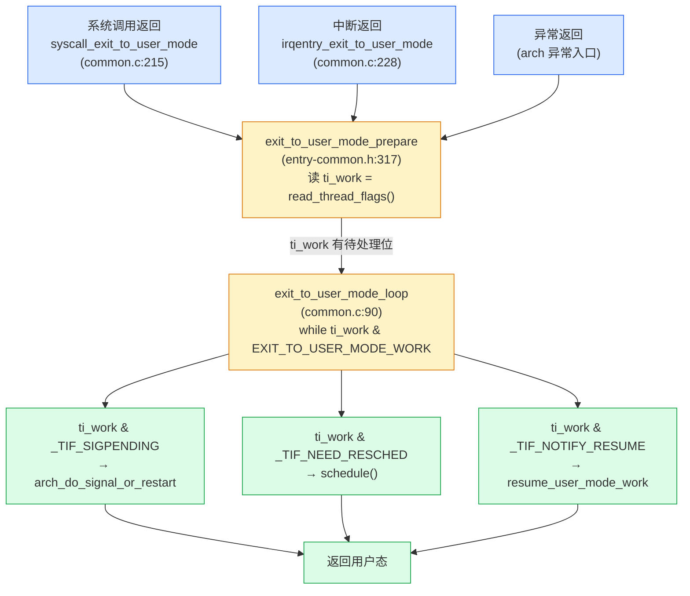

# 第十八首 · 处理入口:返回用户态检查 `_TIF_SIGPENDING`

> 篇:P4 信号
> 主线呼应:上一章(P4-17)我们讲完信号的**投递**——`do_send_sig_info` 把信号挂进目标进程的 `sigpending` 队列,`complete_signal` 选一个线程,通过 `signal_wake_up` 把它 `thread_info->flags` 里的 `_TIF_SIGPENDING` 位置上。那只是"挂账"。真正**跑 handler**(或者执行默认动作、忽略)在哪一步发生?答案是一个常被忽略、却决定了整个信号语义的瞬间——**进程返回用户态之前**。内核在每次从系统调用、中断、异常退回用户态的必经之路上,都架着一个 `exit_to_user_mode_loop` 主循环,它一次性检查 `_TIF_SIGPENDING`/`_TIF_NEED_RESCHED`/`_TIF_NOTIFY_RESUME` 等若干标志位,有信号就调 `arch_do_signal_or_restart` → `get_signal` 取一个信号出来、决定怎么处理。这一章就把这条"返回用户态的检查点"彻底拆开,看清内核为什么把信号处理**死死钉在用户态边界上**,以及那个主循环里每一行在防什么。

## 核心问题

**信号已经在上一章被挂上 `pending` 队列了,但内核为什么不当场跑 handler,非要等到进程返回用户态那一刻才跑?这个"检查点"具体在哪几行代码?同一个循环里同时检查的 `_TIF_NEED_RESCHED`(调度)、`_TIF_NOTIFY_RESUME`(task_work)、`_TIF_SIGPENDING`(信号)为什么必须**集中**在这一处而不是各干各的?**

读完本章你会明白:

1. **信号处理是延迟的**:内核投递信号只"挂账",真正跑 handler 必须等到进程返回用户态之前——因为 handler 是**用户代码**,它要访问用户栈、用户数据、用户寄存器,内核态根本没法直接执行它。
2. **检查点只有一处**:`exit_to_user_mode_loop`([common.c:90](../linux/kernel/entry/common.c#L90))是系统调用返回、中断返回、异常返回**三条路径的公共汇合点**,它用一个 `while (ti_work & EXIT_TO_USER_MODE_WORK)` 循环把信号、调度、task_work 全部在此刻一次性处理干净。
3. **`_TIF_SIGPENDING` 是"待取信号"的位**:`signal_wake_up` 在投递时置位([signal.c:764](../linux/kernel/signal.c#L764)),`get_signal`([signal.c:2675](../linux/kernel/signal.c#L2675))在循环里取一个信号出来、决定是跑 handler、执行默认动作还是忽略。
4. **回到二分法**:这一章服务的是**内核主动**那一面的"信号处理"环节——上一章是"内核主动挂账",本章是"内核主动在边界上交付"。两章合起来才构成完整的"信号杀死/打断进程"旅程。
5. ★ 对照:信号这种"内核记账、用户态跑 handler"的折中,正好处在 Go 的两种异常模型之间——`panic` 是同步进 runtime 当场杀掉 goroutine,channel 是收方稍后主动取;内核信号两者都不是,是"内核先签收、回你家门口再当面交给你"。

> **逃生阀**:如果你已经知道 `_TIF_*` 标志位的存在、知道 handler 在用户态跑,可以跳过 18.2 的"为什么不能在内核态跑 handler"推导,直接读 18.3 的主循环源码逐行拆解和 18.4 的技巧精解。但 18.1 的"为什么选这个检查点"是本章的核心,不建议跳。

---

## 18.1 一句话点破

> **信号 handler 不能在内核态跑——它是用户写的不可信代码,要访问用户栈和用户寄存器;内核绝不能去执行用户代码。所以内核只能"挂账"(pending 队列 + `_TIF_SIGPENDING` 位),等进程即将返回用户态、寄存器和栈都还属于它的那一刻,在边界上把 handler 的入口"塞"给它,让它回用户态自己跑。这个"塞"的动作,就发生在 `exit_to_user_mode_loop` 主循环里。**

这是结论,不是理由。本章倒过来拆:先看为什么内核态跑不了 handler(18.2),再看内核把检查点放在哪、为什么只放在这一处(18.3),最后看主循环每一步在防什么(18.4 技巧精解)。

---

## 18.2 为什么 handler 不能在内核态跑

上一章结尾,`complete_signal` 把信号挂进 `sigpending` 队列、`signal_wake_up` 置上 `_TIF_SIGPENDING`。一个很自然的想法是:**既然内核已经知道有信号了,为什么不直接在内核态把 handler 调一下?** 毕竟中断处理函数就是在内核态跑的,信号 handler 不也是个函数吗?

不行。原因是 handler 的**身份**和它**依赖的上下文**。

### handler 是用户代码,内核不该执行不可信代码

用户用 `sigaction(SIGINT, &sa, ...)` 注册的 `sa.sa_handler` 是一段**用户态地址的函数**——它是用户自己写的 C 代码编译出来的,跑在 ring 3。从内核安全模型的角度看,这段代码是**不可信的**:它可能有 bug、可能被恶意构造、可能尝试访问任意用户内存。内核态(ring 0)有权限访问一切硬件和所有进程的内存,如果在 ring 0 执行一段用户提供的代码,这段代码理论上能干任何事——直接绕过用户/内核边界(P0-01 立的那条命脉)。

> **不这样会怎样**:如果内核态直接调用 handler,等于"内核去执行用户提供的函数指针"。用户只要把 `sa_handler` 指向一段精心构造的汇编(比如 `mov %cr0, %rax`),就能在 ring 0 改写控制寄存器、关掉保护。整台机器立刻被攻陷。用户/内核特权边界形同虚设。

也许你会说:"内核可以在调用前检查 handler 地址、限制它能做什么"。但这等于在内核里实现一个用户态解释器/沙箱——复杂度爆炸,而且 handler 本来就该在用户态的环境里跑(它要调 `printf`、要访问全局变量、要操作用户态库的状态),内核模拟不出这个环境。

### handler 依赖用户态的栈和寄存器

handler 不只是一段代码,它还需要**运行环境**:

- **栈**:handler 里调的函数要压栈、局部变量要放栈上。用户态的栈在用户进程的 `mm` 里(用户虚拟地址),内核态用的是内核栈(per-task 的 `task_struct->stack`)。两者是完全不同的内存区域。
- **寄存器**:handler 读写的 `%rax`、`%rdi`、TLS 寄存器、FPU 状态,都是用户态的值。内核态运行时这些寄存器装的是内核自己的中间值。
- **数据**:handler 要访问的全局变量、堆上对象、`errno`、libc 的内部状态——全是用户地址空间里的东西。内核态的 `current->mm` 虽然指向同一个进程地址空间,但内核执行时并不"切换"到用户视角。

更微妙的:**handler 执行完要能返回到原来被打断的用户代码**。一个进程正在跑 `main` 里的某行,被信号打断去跑 handler,handler 跑完必须精确回到那行、所有寄存器一个不差——这要求内核在跑 handler 之前**完整保存**被打断的用户上下文(所有寄存器、信号掩码、FPU 状态),handler 返回后**完整恢复**。这个"保存→跑 handler→恢复"的机制,正是下一章(P4-19)要讲的 `sigframe` + `rt_sigreturn`。它只有在"切回用户态跑 handler"这个模型下才说得通。

> **所以这样设计**:handler 必须在用户态跑——它是用户代码、要用户栈、要用户寄存器、要能访问用户数据。内核能做的只有一件事:**在进程即将返回用户态那一刻,把 handler 的入口地址、参数、被打断的现场"组装"好,塞进 `pt_regs`,让进程一返回用户态就"自然地"跳进 handler**。对进程来说,handler 像是一次意外的函数调用;对内核来说,它只是改了返回用户态时的寄存器(`ip` 指向 handler、`sp` 指向新栈帧),其他什么都没干。

> **钉死这件事**:信号处理的本质是"**内核改返回现场,用户态自己跑 handler**"。内核从头到尾不执行一行 handler 代码。这就是为什么信号处理**必须延迟到返回用户态之前**——只有那个点是"寄存器和栈即将归还给用户"的瞬间,内核才有机会把 handler 入口"种"进去。

这就回答了本章核心问题的一半:为什么不能当场跑。另一半是:**为什么偏偏选"返回用户态之前"这个点,而不是别的点?** 下一节拆。

---

## 18.3 检查点只有一处:`exit_to_user_mode_loop`

既然 handler 必须在返回用户态前种好,那"检查有没有信号"这个动作具体在哪行代码?答案是 Linux 6.9 通用入口框架(`kernel/entry/`)里的一个核心函数。

### 三条返回路径,一个汇合点

一个进程从内核回到用户态,有三条主要路径:

1. **系统调用返回**:用户调 `read()` 进内核办完事,准备返回。
2. **中断返回**:用户态跑着被网卡中断/时钟中断打进内核,处理完准备回用户态。
3. **异常返回**:用户态触发缺页/除零,内核处理(或投信号)完准备回用户态。

这三条路径在内核里的入口函数各不相同(`syscall_exit_to_user_mode`、`irqentry_exit_to_user_mode`、异常入口),但它们**最后都会汇合**到一个公共函数:`exit_to_user_mode_prepare`([entry-common.h:317](../linux/include/linux/entry-common.h#L317)),它再调用 `exit_to_user_mode_loop`([common.c:90](../linux/kernel/entry/common.c#L90))。



> **不这样会怎样**:如果三条路径各自检查信号(系统调用返回查一次、中断返回查一次、异常返回查一次),代码会三份重复,而且每条路径都得自己操心"还要不要顺带调度一下""要不要跑 task_work"。容易漏、容易乱。Linux 的做法是把所有"返回用户态前的待办"**集中到一个循环**,三条路径都从这里走——单一职责、零遗漏。

### 主循环源码逐行拆

我们贴出 6.9 真实代码,逐段拆。这是本章最核心的一段。

```c
/* linux/kernel/entry/common.c,exit_to_user_mode_loop,简化注释 */
__always_inline unsigned long exit_to_user_mode_loop(struct pt_regs *regs,
                                                     unsigned long ti_work)
{
    /* 返回用户态前,把所有 pending 的活干完 */
    while (ti_work & EXIT_TO_USER_MODE_WORK) {

        local_irq_enable_exit_to_user(ti_work);              /* (1) */

        if (ti_work & _TIF_NEED_RESCHED)                     /* (2) */
            schedule();

        if (ti_work & _TIF_UPROBE)                           /* (3) */
            uprobe_notify_resume(regs);

        if (ti_work & _TIF_PATCH_PENDING)                    /* (4) */
            klp_update_patch_state(current);

        if (ti_work & (_TIF_SIGPENDING | _TIF_NOTIFY_SIGNAL)) /* (5) */
            arch_do_signal_or_restart(regs);

        if (ti_work & _TIF_NOTIFY_RESUME)                    /* (6) */
            resume_user_mode_work(regs);

        /* Architecture specific TIF work */
        arch_exit_to_user_mode_work(regs, ti_work);          /* (7) */

        local_irq_disable_exit_to_user();                    /* (8) */
        tick_nohz_user_enter_prepare();                      /* (9) */

        ti_work = read_thread_flags();                       /* (10) */
    }
    return ti_work;
}
```

> 见 [common.c:90-134](../linux/kernel/entry/common.c#L90-L134)。完整循环就这些,没有藏着别的逻辑。

逐条拆每行在干什么、在防什么:

- **(0) `while (ti_work & EXIT_TO_USER_MODE_WORK)`**:`EXIT_TO_USER_MODE_WORK` 是一组 `_TIF_*` 位的或([entry-common.h:65-68](../linux/include/linux/entry-common.h#L65-L68)),定义如下。只要 `thread_info->flags` 里这些位中有任何一个置着,就进循环。**这是"还有活没干完"的总开关**。
  ```c
  /* include/linux/entry-common.h,EXIT_TO_USER_MODE_WORK 是这些位的或 */
  #define EXIT_TO_USER_MODE_WORK                  \
      (_TIF_SIGPENDING | _TIF_NOTIFY_RESUME | _TIF_UPROBE |       \
       _TIF_NEED_RESCHED | _TIF_PATCH_PENDING | _TIF_NOTIFY_SIGNAL | \
       ARCH_EXIT_TO_USER_MODE_WORK)
  ```
- **(1) `local_irq_enable_exit_to_user(ti_work)`**:进循环第一件事是**开中断**。为什么?因为接下来要调的 `schedule()`、`arch_do_signal_or_restart()` 都可能耗时,关着中断会让其他中断饿死。注意入口处(`exit_to_user_mode_prepare`)是**关着中断**读 `ti_work` 的(避免读到一半被中断改了),进了循环、确认有活要干,才打开。
- **(2) `_TIF_NEED_RESCHED → schedule()`**:这是回扣第 11 本《调度器》的连接点。如果时间片用完(时钟 tick 置的位)或更高优先级进程可运行,这里**主动让出 CPU**。注意 `schedule()` 会切到别的进程,等再切回来时 `ti_work` 可能已经被改(新信号来了、又被标记需要调度),所以循环结尾要重读(见 (10))。
- **(3)(4)**:`_TIF_UPROBE`(用户态探针)、`_TIF_PATCH_PENDING`(内核热补丁 livepatch)是较新的待办,机制同构:在返回用户态这个安全点处理。
- **(5) `_TIF_SIGPENDING | _TIF_NOTIFY_SIGNAL → arch_do_signal_or_restart(regs)`**:**本章主角**。有信号待处理就调它。`_TIF_NOTIFY_SIGNAL` 是 IO_uring 时代新增的位(P4-17 提过),语义上"不是真信号但需要打断用户态让 task_work 跑",所以和 `_TIF_SIGPENDING` 合并处理。`arch_do_signal_or_restart` 是个[弱符号](../linux/kernel/entry/common.c#L82-L83)(架构可覆盖,x86 在 `arch/x86/kernel/signal.c` 实现)。
- **(6) `_TIF_NOTIFY_RESUME → resume_user_mode_work(regs)`**:task_work(延迟回调,如文件系统通知、io_uring 任务接力)的触发点。和信号的区别:信号有用户可见语义(handler/默认动作),task_work 纯粹是内核内部回调。详见 [resume_user_mode.h:41](../linux/include/linux/resume_user_mode.h#L41)。
- **(7) `arch_exit_to_user_mode_work`**:架构相关钩子(如 ARM 的某些 TLB 维护),多数架构空实现。
- **(8) `local_irq_disable_exit_to_user()`**:**关中断**。准备检查"还有没有活"——这个检查必须是原子的,不能读 `ti_work` 读到一半被中断置了新位又漏掉。所以关中断再读。
- **(9) `tick_nohz_user_enter_prepare()`**:NOHZ 相关(第 15 章),检查是否有延迟唤醒要刷出。
- **(10) `ti_work = read_thread_flags()`**:**重读标志位**。这是循环之所以是 `while` 而不是 `if` 的关键——刚才 `schedule()` 切出去又切回来、`arch_do_signal_or_restart` 处理信号时,都可能又来了新信号、又标记了需要调度。重读后回到 `while` 判断,若还有位就再转一圈。**直到所有位都清干净,才真正返回用户态**。

> **钉死这件事**:`exit_to_user_mode_loop` 是一个**自旋到干净**的循环——只要返回用户态的待办还有任何一项未处理,就继续转。它的设计哲学是"**返回用户态是个承诺,承诺之前必须把账结清**"。信号、调度、task_work,一个都不许带到用户态去(因为用户态一跑起来,这些待办就再没机会集中处理了)。

### 为什么不能在任意点处理信号

到这里你可能会问:既然 `_TIF_SIGPENDING` 是个标志位,内核**任意时刻**都能查到它,为什么非要等返回用户态?比如 `schedule()` 切换进程时顺便查一下、某个内核函数末尾查一下,不行吗?

不行,有两个根本原因:

**第一,任意点不具备"返回用户态的现场"。** 我们在 18.2 讲了,handler 要种进 `pt_regs` 才能让进程"自然跳进 handler"。而 `pt_regs`(保存被打断的用户态寄存器)只在**从用户态进内核的那一刻**被完整压进内核栈顶。系统调用入口压一份、中断/异常入口压一份。内核在内核态跑期间,`pt_regs` 静静躺在栈底,谁也不动它。只有在"返回用户态"这条路径上,内核才会把 `pt_regs` 弹出来恢复用户寄存器——**这是唯一能"改写即将恢复的用户寄存器"的合法时机**。你在内核任意点改 `pt_regs`?可以,但改完没意义,因为那一刻不返回用户态,handler 还是不会跑;等真返回时又可能被别的事覆盖。

**第二,任意点不是"安全的上下文切换点"。** 内核态运行时,进程可能正持有自旋锁、正处在 RCU 临界区、正做着半截内存分配。这时候突然去摆弄信号 handler 的栈帧、去 `schedule()` 切走,会破坏内核自己的一致性。Linux 长期坚持一条铁律:**`schedule()` 只在显式的抢占点调用**,不在持锁区、不在中断上下文调。信号处理(它内部可能 `schedule`、可能改进程状态如 SIGSTOP)同理,只能在**进程即将离开内核**那个干净点做——那时候锁都放完了、RCU 都退出了、`preempt_count` 归零了,是真正的安全点。

> **所以这样设计**:把信号检查钉死在"返回用户态前"这一个点,是因为这个点同时满足两个条件——① `pt_regs` 此刻正要被用来恢复用户态,改它有效;② 此刻进程已不持有任何内核资源,是干净的上下文切换点。两个条件任取其一都不够,必须同时满足。整个内核里,只有"返回用户态"这一条路径上的某些点同时满足。`exit_to_user_mode_loop` 就是这些点的公共汇合。

这一节回答了核心问题的另一半:**为什么选这个点**。下一节进技巧精解,看投递侧怎么置位、处理侧怎么取信号,以及这套"标志位通信"为什么 sound。

---

## 18.4 技巧精解:`_TIF_SIGPENDING` 这一位怎么把"投递"和"处理"解耦

这一节挑两个最硬核的技巧拆透:① `_TIF_SIGPENDING` 这一个标志位,怎么把"投递信号的内核线程"和"处理信号的目标线程"在无锁、跨核的情况下解耦;② `get_signal` 取信号时的"SIG_DFL/SIG_IGN/用户 handler"三路决策,以及 ERESTART 系列返回值怎么让被信号打断的系统调用"自动重跑"。

### 技巧一:一个 `_TIF_SIGPENDING` 位,撑起跨核"记账—交付"

回想一下整个流程的两个角色:

- **投递方**:可能是别的进程(`kill` 系统调用)、可能是内核自己(`force_sig` 投段错误信号)、可能是时钟中断里 hrtimer 回调投 SIGALRM。它运行在**任意 CPU、任意上下文**,要把信号送给目标进程 `t`。
- **处理方**:目标进程 `t` 自己,运行在它被调度到的那个 CPU 上,即将返回用户态。

这两边可能跑在不同核、完全异步。怎么让"投递方挂信号"和"处理方在返回用户态看到信号"不丢不漏?Linux 的答案极其朴素——**一个 `thread_info->flags` 里的位 `_TIF_SIGPENDING`**,加一套内存序约定。

投递侧(`signal_wake_up_state`,[signal.c:760](../linux/kernel/signal.c#L760-L775)):

```c
/* kernel/signal.c,简化 */
void signal_wake_up_state(struct task_struct *t, unsigned int state)
{
    lockdep_assert_held(&t->sighand->siglock);

    set_tsk_thread_flag(t, TIF_SIGPENDING);    /* (a) 置位 */

    if (!wake_up_state(t, state | TASK_INTERRUPTIBLE))  /* (b) 唤醒 */
        kick_process(t);                         /* (c) 踢一脚 IPI */
}
```

处理侧(`exit_to_user_mode_prepare` → `exit_to_user_mode_loop`,前文贴过):

```c
/* include/linux/entry-common.h,简化 */
static __always_inline void exit_to_user_mode_prepare(struct pt_regs *regs)
{
    unsigned long ti_work;

    lockdep_assert_irqs_disabled();              /* 关中断读,保证原子 */
    tick_nohz_user_enter_prepare();

    ti_work = read_thread_flags();               /* (d) 读位 */
    if (unlikely(ti_work & EXIT_TO_USER_MODE_WORK))
        ti_work = exit_to_user_mode_loop(regs, ti_work);
    ...
}
```

四个动作 (a)(b)(c)(d),两个问题:**会不会丢?** **会不会乱?**

**会不会丢**(投递方刚挂上、处理方正读完 `ti_work` 要返回用户态,这一刻交叉会丢吗)?关键在 `complete_signal` 调 `signal_wake_up` 时目标进程可能正在跑(`task_curr(t)` 真)。此时如果 `t` 恰好在 `exit_to_user_mode_loop` 末尾的 `local_irq_disable_exit_to_user()` 之后、`read_thread_flags()` 之前——等等,这两行之间是关中断的,投递方的 `set_tsk_thread_flag` 会被延迟到 `t` 重新开中断后才可见吗?不会丢。因为 `set_tsk_thread_flag` 是对 `thread_info->flags` 这个普通内存的原子 `set_bit`(不是中断屏蔽控制的本地变量),它**立刻生效**;而 `read_thread_flags` 读的是同一块内存。只要 set 在 read 之前完成(内存序保证),read 就能看到。投递方拿 `sighand->siglock`(自旋锁)期间,如果目标进程也在这把锁里(比如 `get_signal` 里 `spin_lock_irq(&sighand->siglock)`),那更是严格互斥。如果目标进程在锁外(在 `read_thread_flags` 那一行),内存序屏障(`set_bit`/`test_bit` 在 SMP 上自带 `smp_mb` 语义)保证可见性。

**会不会乱**(处理方看到 `_TIF_SIGPENDING` 置位,但实际 `pending` 队列里没信号,或者反之)?这是 `recalc_sigpending` 的职责。看 [signal.c:157](../linux/kernel/signal.c#L157-L173):

```c
/* kernel/signal.c,简化 */
static bool recalc_sigpending_tsk(struct task_struct *t)
{
    if ((t->jobctl & (JOBCTL_PENDING_MASK | JOBCTL_TRAP_FREEZE)) ||
        PENDING(&t->pending, &t->blocked) ||
        PENDING(&t->signal->shared_pending, &t->blocked) ||
        cgroup_task_frozen(t)) {
        set_tsk_thread_flag(t, TIF_SIGPENDING);   /* 有真信号,置位 */
        return true;
    }
    return false;   /* 无真信号,但本函数不清位(见注释) */
}
```

注意这段代码上面那行注释——"We must never clear the flag in another thread"。`_TIF_SIGPENDING` 一旦置上,**不会**被别的线程清掉(因为别的线程不知道当前线程是否正在返回用户态的路上、是否已经基于这个位做了决策)。只有当前线程自己,在确定要清的时机(如 `get_signal` 把队列掏空后发现没信号了),才调 `recalc_sigpending` 清掉([signal.c:175](../linux/kernel/signal.c#L175-L180))。这种"置位可跨线程、清位只本线程"的非对称,是为了避免 ABA 类问题。

> **反面对比**:朴素地写,会想用"投递方加锁改 pending 队列、处理方加锁读 pending 队列"——但"要不要进 `exit_to_user_mode_loop`"这个判断在返回用户态的**热路径**上(每次系统调用返回都走),每次都加锁查队列太贵。Linux 的做法是用一个**廉价的标志位**(读一次内存)做粗筛,只有位置上了才进循环、才去拿锁查队列。标志位是"可能有活"的提示,队列是"活的具体内容"——两层,粗筛+精查,经典分层。

> **为什么这套设计 sound**:`_TIF_SIGPENDING` 是个**保守过估**的位——它被置上不代表队列里此刻一定有可投递信号(可能被 `blocked` 屏蔽、可能刚被别的线程取走),但它**一旦有真信号就一定置上**。所以处理方看到它置上,进循环去查队列,查不到也没关系(白跑一趟,清位返回);但绝不能漏——只要漏一次,信号就永远不被处理(队列里有但标志位没置,处理方不进循环)。这套"宁可白跑、不可漏"的不对称,是延迟处理类机制(softirq pending 位、`need_resched`、信号 `_TIF_SIGPENDING`)的通用设计哲学。和 P1-06 softirq 的 per-CPU pending 位图是同一套思路——**用廉价的位标志做跨核通知,用队列存实际负载**。

### 技巧二:`get_signal` 的三路决策与 ERESTART 契约

处理方进循环、看到 `_TIF_SIGPENDING` 置位,调 `arch_do_signal_or_restart`(x86 实现在 [arch/x86/kernel/signal.c](https://github.com/torvalds/linux/blob/master/arch/x86/kernel/signal.c),arch 未 sparse clone,描述作用):

```c
/* arch/x86/kernel/signal.c,简化 */
void arch_do_signal_or_restart(struct pt_regs *regs)
{
    struct ksignal ksig;

    if (get_signal(&ksig)) {           /* 取信号并决策 */
        handle_signal(&ksig, regs);    /* 有 handler:种进 pt_regs */
        return;
    }

    /* 无信号可投递,处理系统调用重启 */
    if (syscall_get_nr(current, regs) != -1) {
        switch (syscall_get_error(current, regs)) {
        case -ERESTARTNOHAND:
        case -ERESTARTSYS:
        case -ERESTARTNOINTR:
            regs->ax = regs->orig_ax;  /* 恢复原系统调用号 */
            regs->ip -= 2;             /* 回退到 syscall 指令 */
            break;
        case -ERESTART_RESTARTBLOCK:
            regs->ax = get_nr_restart_syscall(regs);
            regs->ip -= 2;
            break;
        }
    }
    restore_saved_sigmask();
}
```

核心是 `get_signal`([signal.c:2675](../linux/kernel/signal.c#L2675-L2922))。它在一个 `for (;;)` 循环里不停从 `pending` 队列取信号,每个取出的信号做**三路决策**:

1. **`SIG_IGN`(忽略)**:用户 `sigaction` 时设的 `sa_handler == SIG_IGN`,或者内核默认就忽略的信号(如 SIGCHLD 默认忽略)。`continue` 取下一个([signal.c:2808](../linux/kernel/signal.c#L2808-L2809))。
2. **用户 handler(`sa_handler != SIG_DFL`)**:把 `k_sigaction` 拷进 `ksig->ka`、`break` 出循环,返回 true 让 `handle_signal` 把它种进 `pt_regs`([signal.c:2810-2818](../linux/kernel/signal.c#L2810-L2818))。
3. **默认动作(`SIG_DFL`)**:再细分——`sig_kernel_ignore` 继续 ignore;`sig_kernel_stop`(SIGSTOP/SIGTSTP)把整个线程组停下来;fatal(SIGKILL/SIGSEGV/...)走 `do_group_exit` 杀掉整个线程组([signal.c:2874-2912](../linux/kernel/signal.c#L2874-L2912))。注意 fatal 默认动作**不返回**——直接 `do_group_exit` 进程退出。

这里有个极精巧的细节——**ERESTART 系列返回值与信号处理的契约**。考虑场景:用户调 `read(fd, buf, 100)`,数据没来,进程阻塞睡眠(`TASK_INTERRUPTIBLE`)。这时来个 SIGINT。上一章讲的 `signal_wake_up` 会把它唤醒(`wake_up_state` 带 `TASK_INTERRUPTIBLE`),`read` 的内核实现看到被信号打断,返回 `-ERESTARTSYS`(或 `-ERESTARTNOINTR` 等)。这个返回值**不是给用户看的**(用户从没见过 `-ERESTARTSYS` 这个 errno),而是给 `arch_do_signal_or_restart` 看的契约:**"我这个系统调用没做完,请你要么重启它、要么返回 EINTR 给用户,取决于信号有没有 handler 以及 handler 是否设了 SA_RESTART"**。

看 `handle_signal` 里的处理([arch/x86/kernel/signal.c](https://github.com/torvalds/linux/blob/master/arch/x86/kernel/signal.c)):

```c
/* arch/x86/kernel/signal.c,handle_signal,简化 */
if (syscall_get_nr(current, regs) != -1) {
    switch (syscall_get_error(current, regs)) {
    case -ERESTART_RESTARTBLOCK:
    case -ERESTARTNOHAND:
        regs->ax = -EINTR;             /* 有 handler 且不自动重启:返回 EINTR */
        break;
    case -ERESTARTSYS:
        if (!(ksig->ka.sa.sa_flags & SA_RESTART)) {
            regs->ax = -EINTR;
            break;
        }
        fallthrough;                   /* SA_RESTART 设了: fallthrough 去重启 */
    case -ERESTARTNOINTR:
        regs->ax = regs->orig_ax;      /* 恢复原系统调用号到 %rax */
        regs->ip -= 2;                 /* %ip 回退 2 字节(SYSCALL 指令长度) */
        break;
    }
}
```

这一段在做一件不可思议的事:**它通过修改 `pt_regs` 的 `%ip`(指令指针)和 `%rax`(系统调用号),让进程返回用户态后"自动重跑一次那个系统调用"**。`%ip -= 2` 是把指令指针回退到 `SYSCALL` 指令那条(x86_64 的 `SYSCALL` 是 2 字节,`0F 05`),这样进程一返回用户态、CPU 取下一条指令时,会再次执行那条 `SYSCALL`,带着 `%rax` 里恢复的系统调用号——于是 `read` 被重新发起,这次它可能成功(数据来了)。

> **反面对比**:朴素地实现"信号打断系统调用后自动重启",会想在内核里直接循环重调 `sys_read`——但 `sys_read` 可能阻塞、可能长时间后才返回,内核嵌套重调会让栈深度失控、信号处理逻辑和系统调用逻辑纠缠。Linux 的做法是把"重启"这个语义**编码进一个返回值(`-ERESTART*`)、延迟到 `handle_signal` 时通过改 `pt_regs` 实现**——内核不重调,只是让用户态"再发一次系统调用"。这把"系统调用重启"和"信号 handler 执行"统一到了同一个"改 pt_regs"的框架里:无论是种 handler 还是重启 syscall,都是改 `pt_regs`、让用户态返回时按改后的现场走。极简、极统一。

> **钉死这件事**:这一节的两个技巧——**跨核位标志通信**(投递方置位、处理方查位、`sighand->siglock` + `set_bit` 内存序保证不丢不乱)和**ERESTART 返回值契约**(把"系统调用重启"编码进返回值、延迟到改 `pt_regs` 时实现)——共同的特点是**用廉价的数据(一个位、一个返回码)承载复杂的跨上下文协议**。这正是 Linux 内核机制的美学:复杂的行为不靠复杂的代码,靠精心设计的"小约定"。

---

## ★ 对照:信号延迟投递 ↔ Go panic / channel

| 模型 | 谁触发 | 处理时机 | 处理者 |
|------|------|------|------|
| **Linux 信号** | 内核或别的进程 | **延迟**到返回用户态 | 用户态 handler(用户代码) |
| **Go panic** | goroutine 自己(运行时检测到 nil map 写、越界等) | **同步**当场进 runtime | runtime,沿调用栈 defer/recover |
| **Go channel** | 发送方 goroutine | **延迟**到接收方主动取 | 接收方 goroutine 自己 |

内核信号处在一个独特的折中位置:

- 像 **panic**:都是"运行时检测到异常情况通知当前执行流"(信号也可能是异常来的,如 SIGSEGV,见 P4-20)。但 panic 是**同步**的——runtime 当场接管,沿 goroutine 栈展开跑 defer;信号是**异步**的——进程在跑任意代码时被通知,内核不接管、只挂号,等回用户态才让 handler 自己跑。
- 像 **channel**:都是"发送方先入账、接收方稍后取"。但 channel 的"取"是接收方**主动**调 `<-ch` 或 `select`;信号的"取"是内核**在边界上强制**注入,进程无法拒绝被 handler 打断(除非屏蔽该信号)。

> **钉死这件事**:三个模型对应三种"事件—处理"耦合度。panic 最紧(同步、runtime 接管、栈展开);channel 最松(完全异步、接收方主动);信号居中(**异步投递、但内核强制在边界注入 handler**)。这种"内核记账、用户态跑 handler"的折中,本质是用户/内核特权边界逼出来的——panic 在同一特权级内(runtime 和 goroutine 都在用户态),可以同步接管;信号要跨越特权级,内核不能执行用户代码,只能延迟到边界。下一章(P4-19)讲 `rt_sigreturn` 时你会看到,这种"边界注入"还配套了一套精巧的栈帧劫持机制,让 handler 跑完能自动回内核恢复现场——那是这套折中的另一半。

---

## 章末小结

这一章把信号处理的"入口"彻底拆完了。回到二分法:信号整体属于**内核主动**那一面——P4-17 是"内核主动挂账"(投递),本章是"内核主动在用户态边界交付"(处理)。两章合起来,构成"信号杀死/打断进程"的完整旅程。

### 这一章的五个要点

1. **handler 不能在内核态跑**:它是用户代码、要用户栈与用户寄存器、内核不能执行不可信代码——所以信号处理**必须延迟到返回用户态之前**。
2. **检查点只有一处**:`exit_to_user_mode_loop`([common.c:90](../linux/kernel/entry/common.c#L90))是系统调用返回、中断返回、异常返回三条路径的公共汇合点,用 `while (ti_work & EXIT_TO_USER_MODE_WORK)` 循环把信号、调度、task_work 全部在此刻处理干净。
3. **`_TIF_SIGPENDING` 这一位撑起跨核通信**:投递方 `signal_wake_up` 置位 + 唤醒([signal.c:764](../linux/kernel/signal.c#L764)),处理方 `read_thread_flags` 查位([entry-common.h:326](../linux/include/linux/entry-common.h#L326))——粗筛 + 精查的分层,带内存序保证不丢不乱。
4. **`get_signal` 三路决策**:SIG_IGN 忽略、用户 handler 种 pt_regs、SIG_DFL 默认动作(stop/fatal)。fatal 直接 `do_group_exit` 不返回。
5. **ERESTART 返回值契约**:被信号打断的系统调用通过 `-ERESTART*` 返回值 + `handle_signal` 改 `pt_regs`(`%ip -= 2`、`%rax = orig_ax`)实现"自动重启",把"系统调用重启"和"handler 注入"统一到同一个"改 pt_regs"框架。

### 五个"为什么"清单

1. **为什么信号处理要延迟到返回用户态才做,不能当场跑?** handler 是用户代码,要在用户栈、用户寄存器、用户数据环境下跑;内核态执行用户代码会破坏特权边界。只有返回用户态那一刻,`pt_regs` 正要被用来恢复用户现场,改它才有效,且此刻进程不持有内核资源,是干净的切换点。
2. **为什么 `exit_to_user_mode_loop` 是三条返回路径的公共汇合点?** 系统调用返回、中断返回、异常返回都要"把返回用户态前的待办一次性结清",逻辑相同,集中到一个循环避免三份重复代码、避免某条路径漏检查。
3. **为什么循环用 `while` 不用 `if`?** 处理信号/调度期间可能又来新信号、又标记需要调度(尤其 `schedule()` 切走再切回来),所以循环末尾 `ti_work = read_thread_flags()` 重读,直到所有位清干净才返回用户态。
4. **为什么 `_TIF_SIGPENDING` 置位可跨线程、清位只本线程?** 避免别的线程清位时,当前线程正基于这个位做返回用户态的决策(竞态)。`recalc_sigpending_tsk` 注释明说"never clear the flag in another thread"。这种不对称是延迟通知类机制的通用约定。
5. **为什么 `-ERESTARTSYS` 这种返回值用户从没见过?** 它是内核内部契约——系统调用实现告诉 `handle_signal`"我没做完,请你视情况重启或返 EINTR"。`handle_signal` 会把它翻译成用户可见的 `-EINTR` 或通过改 `pt_regs` 让用户态重发系统调用。用户永远只看到 EINTR 或系统调用成功,看不到 ERESTART。

### 想继续深入往哪钻

- **源码**:[`kernel/entry/common.c`](../linux/kernel/entry/common.c) 的 `exit_to_user_mode_loop`(L90)、`syscall_exit_to_user_mode`(L215)、`irqentry_exit_to_user_mode`(L228)、`irqentry_exit`(L328);[`include/linux/entry-common.h`](../linux/include/linux/entry-common.h) 的 `EXIT_TO_USER_MODE_WORK`(L65)、`exit_to_user_mode_prepare`(L317);[`kernel/signal.c`](../linux/kernel/signal.c) 的 `get_signal`(L2675)、`signal_wake_up_state`(L760)、`recalc_sigpending_tsk`(L157);[`include/linux/sched/signal.h`](../linux/include/linux/sched/signal.h) 的 `task_sigpending`(L379)、`signal_pending`(L384);[`include/linux/resume_user_mode.h`](../linux/include/linux/resume_user_mode.h) 的 `resume_user_mode_work`(L41);x86 的 `arch_do_signal_or_restart`/`handle_signal` 在 `arch/x86/kernel/signal.c`(未 sparse clone,见 [GitHub master](https://github.com/torvalds/linux/blob/master/arch/x86/kernel/signal.c))。
- **观测**:`/proc/<pid>/status` 的 `SigPnd`(本线程待处理)、`ShdPnd`(线程组共享待处理)、`SigBlk`(屏蔽)、`SigIgn`(忽略)、`SigCgt`(已注册 handler)字段,直接看到 `_TIF_SIGPENDING` 对应的位图;`/proc/<pid>/stack` 看进程是否卡在 `exit_to_user_mode_loop`;`strace -e signal` 看信号投递与 handler 进入;`perf probe -L arch_do_signal_or_restart` 给信号处理入口下探针;`bpftrace` 用 `tracepoint:signal:signal_deliver` 观测每个被交付的信号。
- **延伸**:读 [`Documentation/core-api/this_cpu_ops.rst`](https://docs.kernel.org/core-api/this_cpu_ops.html) 理解 per-thread flag 的原子操作;读 [Utah Mach 的异步通知](https://www.cs.utah.edu/flux/) 与 BSD `signal(3)` 对照不同 OS 的"异步通知进程"设计;读 POSIX.1-2017 `signal.h` 关于 Signal Concepts 章节,看 SA_RESTART 的语义如何映射到内核的 `-ERESTARTSYS`。

### 引出下一章

我们这一章讲完了"返回用户态检查 `_TIF_SIGPENDING` → `get_signal` 决定跑 handler → `handle_signal`"。但 `handle_signal` 怎么"把 handler 种进 pt_regs"?它做了什么——具体地说,内核怎么在**用户栈上**搭一个 sigframe(装被打断的寄存器、信号掩码、siginfo),怎么把返回地址改成 `rt_sigreturn` 系统调用入口,让 handler 跑完"返回"时自动回内核恢复原现场?handler 又怎么能用 `SA_ONSTACK` + `sigaltstack` 切到备用栈(主栈溢出时还能跑)?下一章 P4-19 拆 `sigaction` 注册、`__setup_rt_frame` 搭栈帧、`rt_sigreturn` 回跳这一整套"栈帧劫持"机制——它是本章"在边界注入 handler"的具体实现,也是信号子系统的工程美学高潮。
