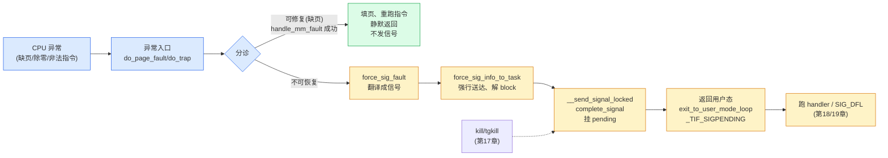

# 第二十章 · 信号与异常的关系

> 篇:P4 信号
> 主线呼应:前三章我们把信号这条线走完了——`complete_signal` 挂 pending、`exit_to_user_mode_loop` 检查 `_TIF_SIGPENDING`、`__setup_rt_frame` 在用户栈上构 sigframe。但你可能一直有个疑问:**那 `SIGSEGV`(段错误)、`SIGFPE`(除零)、`SIGILL`(非法指令)这些"硬件报的错",怎么也长得跟 `kill` 发来的信号一模一样?** 这一章就把这个问号拉直:**CPU 异常本质上是"内核向进程发的一条信号**"。一个进程解引用空指针、CPU 触发缺页、内核发现这一页真的不存在,内核并不另起一套"硬件错误"机制,而是走和 `kill -SEGV` **完全相同**的 `force_sig_fault` → `complete_signal` → 返回用户态跑 handler 的路径。这就是本篇四章真正想收束的那句话——**信号,是内核把"硬件同步异常"翻译给用户态的唯一通道**。但反过来,**缺页**这种"可修复"的异常,内核会悄悄按需调页把它消化掉,根本不投信号。读完这一章,你就拿到了从第 17 章 `do_send_sig_info` 一路到这里的完整闭环,也为下一章(P5-21 四个机制的哲学收束)铺好了最后一块砖。

## 核心问题

**CPU 异常(缺页、除零、非法指令、栈越界)和硬件中断、和 `kill` 发来的信号,到底什么关系?为什么内核不另起一套"硬件错误"机制,非要把异常塞进信号通道里?缺页这种异常为什么又常常"什么信号都不发"?**

读完本章你会明白:

1. **异常 vs 中断**:异常是**同步**于当前指令的(就是这条指令触发的,比如除零那一条 `div`),中断是**异步外部**事件(网卡来包,跟当前指令无关)。两者都"把控制权拉进内核",但性质完全不同。
2. **异常的分类**:可修复的(缺页按需调页)——内核悄悄处理、不投信号;不可修复的(段错误、除零、非法指令)——内核**无法恢复**,只能把这件事翻译成信号告诉用户态。
3. **异常→信号的统一**:不可恢复异常一律走 `force_sig_fault` / `force_sig_info` → `force_sig_info_to_task`,和 `kill` 发的信号汇入**同一条** `__send_signal_locked` → `complete_signal` → 返回用户态跑 handler 的路径。
4. **`force_sig` 的"force"是什么意思**:异常必须送达、不能被用户态 `SIG_IGN`/block 掉,所以内核在投递时**强行**把 handler 复位成 `SIG_DFL`、从 block 集合里摘掉,并打上 `SA_IMMUTABLE` 防止用户态再改它——否则一个程序"屏蔽了 SIGSEGV 然后继续跑"会撞出更深的故障。
5. **`force_sigsegv` 的防自激**:handler 自己又触发了段错误怎么办?内核用"如果本次投的就是 SIGSEGV,就降级成 `SIG_DFL` 直接杀"来切断无限递归。

> **逃生阀**:如果你已经清楚"异常 = 同步进内核、不可恢复则走 force_sig",可以直接跳到 20.4 节(异常与信号的统一路径)+ 20.5 节(技巧精解:`force_sig_info_to_task` 的"不可拒绝")。但 20.2 的"异常 vs 中断"、20.3 的"可修复缺页为何不投信号"是整章地基,建议不跳。

---

## 20.1 一句话点破

> **CPU 异常和 `kill` 发来的信号,在用户态看起来一模一样——都是一个 `signo`、一段 siginfo、一个(可能注册的)handler。这是因为内核故意把它们统一了:异常不可恢复时,内核调 `force_sig_fault` 投递信号,走的就是第 17 章那条 `complete_signal` → pending 队列的路径,只是来源标了 `SI_KERNEL`/`SEGV_MAPERR` 之类的码,告诉你"这信号不是别人发的,是你自己跑飞了"。但缺页这种可修复异常,内核会在**投信号之前**就把页调进来、让那条触发异常的指令重跑,用户态完全感知不到——信号只在内核**无能为力**时才登场。**

这是结论,不是理由。本章倒过来拆:先看异常和中断到底差在哪,再看缺页这种"可修复"异常内核怎么悄悄消化,然后看不可恢复异常如何统一走 `force_sig`,最后钻进 `force_sig_info_to_task` 看看"force"两个字到底 force 了什么。

---

## 20.2 异常 vs 中断:同样是"进内核",性质截然不同

第 1 章我们立全书二分法时,把"进内核"这一面分成了三类:**中断**(外部异步)、**异常/陷阱**(CPU 同步)、**系统调用**(用户主动)。从用户/内核边界的视角,它们都是"用户态正跑着,突然被拉进内核"。但从**触发源、同步性、可恢复性**看,异常和中断是截然不同的两种东西。

| 维度 | 中断(interrupt) | 异常(exception/trap) | 系统调用(syscall) |
|---|---|---|---|
| 触发源 | 外部硬件(网卡/键盘/时钟) | CPU 执行**当前这条**指令时自己产生 | 用户程序主动执行 `SYSCALL` |
| 同步性 | **异步**:和当前指令无关,任何时候都可能来 | **同步**:就是当前这条指令触发的(那条 `div`、那条 `mov` 解引用) | **同步**:用户主动发起 |
| "是谁干的" | 不是当前进程的"错",是外部事件 | **就是当前进程**这条指令干的 | 是当前进程**主动**要进内核 |
| 典型 x86 向量 | 32~255(可屏蔽中断 0x20+,加上 NMI/SMI) | 0~31(0 除零、6 非法指令、14 缺页...) | `SYSCALL` 指令(不走 IDT,走 MSR) |
| 返回到哪 | 被打断的那条指令**之后**(中断没失败,只是借 CPU) | 多数情况回到触发异常的**那条指令本身**(让它重跑) | `SYSCALL` 的下一条指令 |

这张表里最关键的两行是**同步性**和**返回到哪**。

- **中断是异步的**:你正在跑进程 A 的第 1000 条指令,网卡中断来了,CPU 跳进内核处理完,**回到第 1001 条指令**。中断不影响 A 的执行,它只是"借走了"一段 CPU 时间。
- **异常是同步的**:你跑进程 A 的第 1000 条指令(假设是一条 `mov` 解引用空指针),CPU 发现这条指令没法正常执行(那个地址没映射),触发缺页异常,CPU 跳进内核,**异常处理完通常回到第 1000 条指令本身**——让这条 `mov` 重新执行一次。因为异常是"这条指令执行不下去",处理完(比如把缺的页调进来)就得让这条指令重试,否则程序逻辑就错了。

> **不这样会怎样**:如果异常处理完回到"下一条指令"而不是重试当前指令,缺页处理就毫无意义——你辛辛苦苦把页调进来了,结果跳过了那条要访问这页的指令,程序逻辑全乱。所以 x86 CPU 的硬件约定就是:**异常返回到触发它的那条指令**,让内核有机会"修复现场后让它重跑"。这是异常与中断最根本的语义差别。

但还有一类异常**没法修复**——除零(`div` 除数是 0)、非法指令(`ud2` 之类)、段错误(解引用一个**永远不存在**的地址,比如 `*(int*)0`)。这些异常内核**没有"正确的修复方式"**:你除以零,内核没法替你"编一个商"出来;你执行非法指令,内核没法"猜一条合法指令"代替它;你访问地址 0,内核没法"给你映射零页"(Linux 默认不映射零页,这是为了帮程序员抓空指针 bug)。对这些**不可恢复**异常,内核唯一的出路就是:**告诉用户态"你跑飞了"**——而"告诉用户态一件异步发生的事",Linux 只有**一个**通用通道,就是**信号**。

> **钉死这件事**:异常和中断都是"把 CPU 拉进内核",但异常是**当前进程自己当前这条指令**触发的、是同步的;中断是外部异步的。异常又分两类:**可修复的**(缺页,内核悄悄修好、重跑指令、用户态无感)和**不可恢复的**(除零/非法指令/真段错误,内核无能为力,只能翻译成信号)。后一类异常,就是信号机制要服务的"第二来源"——第一来源是 `kill`/`tgkill` 这些用户主动发的,第二来源就是硬件异常。

---

## 20.3 可修复异常:缺页为什么常常"什么信号都不发"

我们先看一类特殊的异常——**缺页(page fault)**,它最能让读者看清"异常不一定等于信号"。

进程写一个变量,这个变量对应的虚拟地址在页表里**没有**映射(可能还没分配、可能被 swap 出去了、可能是 `malloc` 拿了地址还没真写触发 copy-on-write)。CPU 访问这个地址,MMU 查页表发现"无效",触发 **缺页异常**(x86 向量 14,`#PF`)。CPU 跳进内核的缺页处理入口(在 x86 上是 `arch/x86/mm/fault.c` 里的 `do_page_fault` → `do_user_addr_fault`,这部分代码 `arch/x86/` 未 sparse clone,我们只描述它的判断逻辑)。

`do_user_addr_fault`(用户态地址触发的缺页)拿到出错地址后,内核要做一个**分诊(triage)**:

```
 缺页异常的分诊(简化,基于 arch/x86/mm/fault.c 的 do_user_addr_fault 逻辑):

  触发缺页的用户地址 vaddr、错误码 error_code(读/写/缺页/保护)
      │
      ▼
  在 VMA(进程的虚拟内存区间)里找 vaddr 落在哪个 vma?
      │
      ├─ 没有对应 vma(访问了一个根本没 mmap 过的地址,如 0x0):
      │     └─ 不可恢复 → force_sig_fault(SIGSEGV, SEGV_MAPERR, vaddr)
      │
      ├─ 有 vma,但权限对不上(只读页你写了、不可执行页你执行了):
      │     └─ 不可恢复 → force_sig_fault(SIGSEGV, SEGV_ACCERR, vaddr)
      │
      └─ 有 vma、权限也对得上,只是物理页还没映射进来:
            │
            ├─ 匿名页第一次写(COW/首次分配):
            │     └─ handle_mm_fault → 分配物理页、建映射 → 可修复!
            │        返回,重跑那条指令,用户态完全无感,**不发信号**
            │
            └─ 页被 swap 到磁盘了:
                  └─ handle_mm_fault → 从磁盘读回、建映射 → 可修复!
                     返回,重跑那条指令,**不发信号**(只是延迟变大)
```

这就是为什么你 `malloc` 一大块内存、第一次写它,**不会触发 SIGSEGV**:缺页异常发生了,但内核在 `do_user_addr_fault` 里判它**可修复**,调 `handle_mm_fault`(回扣第 9 本《Linux 内存管理》的缺页路径)把物理页填进去,然后异常返回——CPU 重跑那条写入指令,这次成功了。整个过程中,**没有信号被投递**,进程甚至连"发生了缺页"都不知道(顶多感觉到一次延迟)。

> **不这样会怎样**:如果缺页这种可修复异常也"动不动就发信号",那每个 `malloc` 内存第一次写都会被 SIGSEGV 干扰、每个 swap-in 都得用户态处理一次信号——程序根本没法写。所以内核的判断很朴素:**能修就修,修完了当无事发生;修不了(SIGSEGV/SIGBUS),才把信号当作"投降通知"递给用户态。**

这条朴素原则的妙处在于:**缺页异常和段错误异常走的是同一个 CPU 异常入口、同一条 `do_page_fault` 路径**,区别只在 `do_user_addr_fault` 内部分诊后的**一个 if 判断**——`handle_mm_fault` 成功就"修好",走到 `force_sig_fault` 就"投降"。没有为"缺页"和"段错误"分别建两套机制。这是 Linux 工程美学的体现:**入口统一、分诊分流**。

但要注意——缺页处理发生在**中断上下文**(更准确地说是异常上下文,`preempt_count` 里 `HARDIRQ_OFFSET` 并不一定置位,但不能睡眠的前提成立),它走 `handle_mm_fault` 可能要分配内存、可能要从磁盘 swap-in,看起来"很重",但内核用的是专门的 GFP 途径、可重入的文件读取路径,保证在异常上下文里也能完成。这是"为什么 sound"的一个侧面,但更深的原因回扣第 4 章(P1-04):**缺页处理虽重,但内核保证不会无限睡眠、不会拿会死等的锁**,所以它能安全地在异常路径里跑。

> **钉死这件事**:缺页 = 异常,但缺页**大多数时候不发信号**。内核的分诊原则是:**可修复(`handle_mm_fault` 能填页)→ 修好、重跑指令、静默返回;不可恢复(地址没 mmap、权限错)→ `force_sig_fault(SIGSEGV, ...)`**。信号,是缺页路径上的"最后退路",不是默认动作。这条原则让我们看清:**异常和信号不是一一对应**,一个异常可能不产生信号(缺页修好了),也可能产生信号(段错误)。

---

## 20.4 不可恢复异常:统一走 force_sig,与 kill 信号汇合

现在我们看真正的重头戏:**不可恢复异常怎么投递信号**,以及为什么它和 `kill` 发来的信号**走的是同一条路**。

以除零为例。进程执行 `div` 指令除以 0,x86 CPU 触发 `#DE` 异常(向量 0),跳进内核的 `divide_error` 入口(`arch/x86/kernel/` 下,未 sparse clone)。这个入口最终调用内核的通用处理函数,它的工作极简:**判断是否来自用户态、来自用户态则 `force_sig_fault(SIGFPE, ...)`**。

```c
/* 不可恢复异常的"翻译成信号"(简化示意,描述 arch/x86 各 do_*_trap / math_error 的共同模式) */
void do_divide_error(struct pt_regs *regs, unsigned long error_code)
{
    if (user_mode(regs)) {
        /* 来自用户态:把异常翻译成 SIGFPE 投给当前进程 */
        force_sig_fault(SIGFPE, FPE_INTDIV, /* addr */ NULL);
        /* force_sig_fault 内部会调 force_sig_info_to_task(info, current, ...) */
    } else {
        /* 来自内核态:内核自己除零了,这是内核 bug,panic */
        die("divide error", regs, error_code);
    }
}
```

这段代码不是源码原文(arch/x86 未 sparse clone),但它**精确描述了**所有异常处理函数(`do_trap` / `do_error_trap` / `math_error` / `do_general_protection` / `do_alignment_check` 等)的共同模式:**`user_mode(regs)` 判断是不是来自用户态、是则 `force_sig_fault(sig, code, addr)`、否则 `die()`(内核 bug,panic)**。这"二选一"是异常处理的铁律:

- **来自用户态**:这是用户程序跑飞了,内核不该替它背锅,翻译成信号交回用户态。
- **来自内核态**:这是内核自己的 bug(内核不该除零、不该解引用非法指针),**没有用户态可通知**,直接 `die()` → `panic` 或 `oops`。

所以你常听说的"`Segmentation fault (core dumped)`",背后发生的就是:

```
 段错误的完整旅程(用户解引用非法指针):

  用户进程: mov eax, [0x0]   ← 解引用 0,这是个无效地址
      │
      ▼ (MMU 查页表发现 0x0 没映射,触发 #PF 缺页异常)
  CPU 跳进缺页入口 → do_page_fault → do_user_addr_fault
      │
      ▼ 分诊:在 VMA 里找 0x0,发现没有对应 vma
  判不可恢复 → force_sig_fault(SIGSEGV, SEGV_MAPERR, (void __user *)0x0)
      │
      ▼ (force_sig_fault → force_sig_fault_to_task → force_sig_info_to_task)
  强行复位 handler、解 block、打 SA_IMMUTABLE、挂到 current->pending
      │
      ▼ send_signal_locked → __send_signal_locked → complete_signal
      │
      ▼ 异常处理返回,走 irqentry_exit
      │
      ▼ user_mode(regs) == true → irqentry_exit_to_user_mode
      │
      ▼ exit_to_user_mode_prepare → exit_to_user_mode_loop
      │
      ▼ 检测到 _TIF_SIGPENDING → arch_do_signal_or_restart → get_signal
      │
      ▼ 用户没注册 SIGSEGV handler → 走 SIG_DFL → 杀进程 + core dump
      │
      ▼ "Segmentation fault (core dumped)"
```

注意这条旅程里,**`force_sig_fault` 之后的所有步骤,和第 17、18 章 `kill` 发来的信号走的是完全相同的代码**:

- `force_sig_info_to_task`([signal.c:1325](../linux/kernel/signal.c#L1325))→ `send_signal_locked`([signal.c:1215](../linux/kernel/signal.c#L1215))→ `__send_signal_locked`([signal.c:1074](../linux/kernel/signal.c#L1074))→ `complete_signal`([signal.c:995](../linux/kernel/signal.c#L995)):挂到 `current->pending`,这就是第 17 章那条投递链。
- 返回用户态前,`exit_to_user_mode_loop`([common.c:90](../linux/kernel/entry/common.c#L90))检测 `_TIF_SIGPENDING` → `arch_do_signal_or_restart`([common.c:83](../linux/kernel/entry/common.c#L83))→ `get_signal`([signal.c:2675](../linux/kernel/signal.c#L2675)):这就是第 18 章那条处理链。
- 如果用户注册了 handler,第 19 章的 `__setup_rt_frame` 在用户栈构 sigframe、`rt_sigreturn` 回跳。

**`kill -SEGV pid` 和"进程自己访问空指针"产生的 SIGSEGV,在 `__send_signal_locked` 之后是完全无法区分的**——它们都进同一个 pending 队列、跑同一个 handler、走同一个默认动作。唯一的差别在 `siginfo` 的 `si_code` 字段:`kill` 发的 `si_code == SI_USER`(告诉你"是某个 pid 的 kill 发的"),异常投的 `si_code == SEGV_MAPERR`/`FPE_INTDIV`/`ILL_ILLOPC` 之类(告诉你"是硬件异常、出错地址是 X")。这是**给用户态 handler 的额外诊断信息**,不影响投递机制本身。

> **不这样会怎样**:这是本章的核心反面对比。假设内核为"硬件异常"另起一套机制——比如系统调用 `catch_exception(type, handler)`,让用户态用一套专门的 API 注册"段错误 handler"、"除零 handler",和 `sigaction` 注册的"信号 handler"并行存在。后果是灾难性的:
>
> - 用户态要写**两套**异步处理代码,一套接信号、一套接异常,逻辑碎片化。
> - 信号机制已经解决的复杂问题(被 block 的信号延迟到 unblock 后处理、handler 期间自动屏蔽同号信号、`SA_RESTART` 自动重启被中断的系统调用、`SA_NODEFER` 不自动屏蔽、`SA_ONSTACK` 切信号栈),都得**为异常再实现一遍**。
> - 进程间通知(`kill`)、自己给自己发(`raise`)、硬件异常,这三件事的 handler 注册要分三个 API、三套数据结构。
>
> Linux 的选择是**把它们统一**:不管信号来自 `kill`、来自 `tgkill`、来自硬件异常、来自 seccomp 拒绝、来自 POSIX timer 到期,统统汇聚到 `__send_signal_locked` 挂 pending,用户态用**同一套** `sigaction` 注册 handler。**异常 = 信号的一个来源**,而不是独立机制。这是"事件跨越用户/内核边界"主线在本章的精确落点:**不可恢复异常,是"进内核"(异常这一面)和"内核主动通知"(信号这一面)的桥梁**——异常把控制权同步拉进内核,内核一旦判不可恢复,就改用"内核主动"那一面的信号通道往用户态递通知。

> **钉死这件事**:`kill` 信号和硬件异常信号**在 `__send_signal_locked` 之后无法区分**,这是 Linux 故意的统一设计。统一的代价是引入了"force"语义(异常不能被 `SIG_IGN`/block 拒绝,见下一节),收益是用户态只有一套信号接口。这就是为什么本书要单列一章讲"信号与异常的关系"——不是讲新机制,而是讲**已有机制(信号)如何被复用来承载另一类事件(异常)**。复用,是 Linux 内核反复出现的设计取向(下一章 P5-21 会总收)。

---

## 20.5 技巧精解:force_sig 的"不可拒绝"与防自激

这一节我们钻两个最硬核的细节:**`force_sig_info_to_task` 凭什么叫 "force"**、它 force 了什么、为什么必须 force;以及 **`force_sigsegv` 怎么防止 handler 自己又触发段错误造成的无限递归**。这两个细节决定了"异常走信号通道"这条路在工程上为什么 sound。

### 技巧一:force_sig_info_to_task —— 异常必须送达,不能被用户态"挡掉"

回顾第 17 章:`kill` 发的信号,用户态可以用 `sigprocmask` 屏蔽(block)、可以用 `sigaction(SIGSEGV, SIG_IGN)` 设成忽略。这套"用户态能拒绝"的语义对 `kill` 是合理的——你 `kill -USR1` 我,我可以选择"现在不处理"。但对**硬件异常**这套语义是灾难性的:你访问空指针,内核发 SIGSEGV,你却 block 了 SIGSEGV,然后呢?

- **block 之后**:信号挂 pending 不投递,但异常指令在用户态根本执行不下去,CPU 会**立刻再次触发**同一个缺页异常——你又回到了 `do_user_addr_fault`,又判不可恢复,又 `force_sig_fault`,又 block,又触发......**死循环**。
- **设成 SIG_IGN**:更糟,`__send_signal_locked` 看到 `SIG_IGN` 直接不挂 pending(`prepare_signal` 返回 false),CPU 重跑那条指令又触发异常,**陷入 busy-loop 烧 CPU**。

所以异常投的信号,**不能允许用户态拒绝**。这就是 `force_sig_info_to_task` 里 "force" 的含义。看 6.9 的真实源码:

```c
/* kernel/signal.c, force_sig_info_to_task @ L1325 (简化,保留关键逻辑) */
static int
force_sig_info_to_task(struct kernel_siginfo *info, struct task_struct *t,
                       enum sig_handler handler)
{
    unsigned long int flags;
    int ret, blocked, ignored;
    struct k_sigaction *action;
    int sig = info->si_signo;

    spin_lock_irqsave(&t->sighand->siglock, flags);
    action = &t->sighand->action[sig-1];
    ignored = action->sa.sa_handler == SIG_IGN;          /* 用户把它设成忽略? */
    blocked  = sigismember(&t->blocked, sig);            /* 用户把它 block 了? */
    if (blocked || ignored || (handler != HANDLER_CURRENT)) {
        action->sa.sa_handler = SIG_DFL;                 /* 强行复位成默认动作 */
        if (handler == HANDLER_EXIT)
            action->sa.sa_flags |= SA_IMMUTABLE;         /* 打"不可改"标记 */
        if (blocked)
            sigdelset(&t->blocked, sig);                 /* 从 block 集合里摘掉 */
    }
    if (action->sa.sa_handler == SIG_DFL &&
        (!t->ptrace || (handler == HANDLER_EXIT)))
        t->signal->flags &= ~SIGNAL_UNKILLABLE;          /* init 也保不住 */
    ret = send_signal_locked(sig, info, t, PIDTYPE_PID); /* 挂 pending */
    if (!task_sigpending(t))
        signal_wake_up(t, 0);                            /* 确保置 TIF_SIGPENDING、唤醒 */
    spin_unlock_irqrestore(&t->sighand->siglock, flags);
    return ret;
}
```

见 [signal.c:1325-1359](../linux/kernel/signal.c#L1325-L1359)。这段代码"force"了三件事:

1. **强行复位 handler**:`if (blocked || ignored)` 把 `SIG_IGN` 改回 `SIG_DFL`。即使你注册过自定义 handler,只要这次走的是 `HANDLER_SIG_DFL`/`HANDLER_EXIT` 路径(`force_fatal_sig`/`force_exit_sig` 会传这两个值,见 [signal.c:1683/1696](../linux/kernel/signal.c#L1683)),handler 也被强行复位成默认——通常意味着"直接杀进程"。
2. **强行解 block**:`sigdelset(&t->blocked, sig)`,把这个信号从 block 集合里摘掉,保证它**这次一定投得到**。
3. **`SA_IMMUTABLE` 标记**:对 `HANDLER_EXIT`(用于"必须杀"的场景,如 seccomp 违例、`force_exit_sig`),handler 上打 `SA_IMMUTABLE`,后续用户态即使调 `sigaction` 想改也改不动(见 [signal.c:4175](../linux/kernel/signal.c#L4175) `if (k->sa.sa_flags & SA_IMMUTABLE) return -EINVAL;`)。

这是为什么异常路径用 `force_sig_fault` 而不是 `kill_pid`:`force_sig_fault`([signal.c:1736](../linux/kernel/signal.c#L1736))→ `force_sig_fault_to_task`([signal.c:1723](../linux/kernel/signal.c#L1723))→ `force_sig_info_to_task(..., HANDLER_CURRENT)`,这一条链路保证了**即使用户 block/ignore 了 SIGSEGV,内核这次也能强行送达**。

> **反面对比**:如果异常投的信号和 `kill` 一样"用户态可以拒绝",那么一个"屏蔽了 SIGSEGV 的程序"在解引用空指针时会立刻陷入缺页异常死循环,把那个 CPU 烧满。`force_sig_info_to_task` 用"强行复位 + 解 block + 不可改"三件套,把"硬件异常必须送达"这个语义在数据结构里钉死。这是异常走信号通道必须付出的工程代价,也正是 "force" 的全部含义。
>
> **为什么 sound**:① **持 `sighand->siglock` 改 action/blocked**,和并发的 `sigaction`/`sigprocmask` 系统调用互斥,不会"我改到一半用户态又改回去";② **改完调 `signal_wake_up`** 保证 `_TIF_SIGPENDING` 一定被置上(否则返回用户态的 loop 不会检查到信号);③ **force 只对"本进程给自己投"的路径生效**(参数 `t` 在异常场景下就是 `current`),不会破坏 `kill` 给别的进程发信号时的"可拒绝"语义——别的进程给我的信号,我当然可以 block;**我自己硬件跑飞了**,内核强行救我。

### 技巧二:force_sigsegv —— 防止 handler 自己又段错误的无限递归

异常走信号通道还有一个看起来不起眼但极要命的坑:**handler 自己又触发了同一个异常怎么办?**

场景:用户给 SIGSEGV 注册了一个 handler,这个 handler 里又不小心解引用了空指针(写 handler 时常见的 bug)。这时:

```
 用户解引用 0 → SIGSEGV → 跑 handler → handler 里又解引用 0
                                            │
                                            ▼
                                     又触发 SIGSEGV → 又跑 handler → 又段错误 → ...
                                     (无限递归,最终栈溢出 / 内核栈用光 → panic)
```

内核用 `force_sigsegv`([signal.c:1715](../linux/kernel/signal.c#L1715))切断这个递归。看它**极简但精妙**的实现:

```c
/* kernel/signal.c, force_sigsegv @ L1715 */
void force_sigsegv(int sig)
{
    if (sig == SIGSEGV)
        force_fatal_sig(SIGSEGV);   /* 第二次段错误 → 强制 SIG_DFL 直接杀 */
    else
        force_sig(SIGSEGV);         /* 别的信号投递失败 → 投 SIGSEGV */
}
```

它就两行,但每一行都在防自激:

- `sig == SIGSEGV` 分支:如果"正在投的就是 SIGSEGV,handler 跑的时候又失败了",内核不再尝试跑 handler,**直接降级成 `SIG_DFL`(默认动作:杀进程 + core dump)**。`force_fatal_sig`([signal.c:1683](../linux/kernel/signal.c#L1683))走的是 `HANDLER_SIG_DFL` 路径,handler 被强行复位成 `SIG_DFL`,递归就此终止——因为 `SIG_DFL` 不再跑用户 handler,直接让进程死。
- `else` 分支:如果是别的信号(比如 SIGFPE)的 handler 跑失败了,内核把"投递失败"翻译成 SIGSEGV(更准确地反映"出问题了")。但注意这条不会无限递归——下一次如果再失败,就会走 `sig == SIGSEGV` 分支终止。

`force_sigsegv` 在哪里被调?最关键的一处在 `signal_setup_done`([signal.c:2954](../linux/kernel/signal.c#L2954))——**构建 sigframe 失败时**:

```c
/* kernel/signal.c, signal_setup_done @ L2954 (简化) */
void signal_setup_done(int failed, struct ksignal *ksig, int stepping)
{
    if (failed)
        force_sigsegv(ksig->sig);    /* 构 sigframe 失败 → 防自激投递 */
    else
        signal_delivered(ksig, stepping);
}
```

这是 `__setup_rt_frame`(回扣第 19 章)的**防御性收尾**:如果在用户栈上构建 sigframe 失败(比如栈已经溢出、没空间放 siginfo),说明 handler 没法跑了,内核立刻 `force_sigsegv` 降级处理。这是"防御性编程"的典范——在每一处可能让信号机制自激的地方,都埋一个"降级成 SIG_DFL"的退路。

> **反面对比**:如果没有 `force_sigsegv` 这道防线,一个有 bug 的 SIGSEGV handler 会让内核栈在递归中耗尽(每次进 handler 都压一个 sigframe + pt_regs,用户栈和内核栈都会爆),最后要么栈溢出要么 panic,整个系统可能被一个用户态程序的 bug 拖死。`force_sigsegv` 用"第二次就降级"这一句判断,把"用户 handler 的 bug"隔离成"只杀这一个进程",不会波及系统。这是"为什么 sound"的另一面:**信号机制必须假设用户 handler 可能再出错,并在每一处出错点都准备好退路**。

> **钉死这件事**:`force_sig_info_to_task`(异常必须送达、不可拒绝)+ `force_sigsegv`(handler 再失败就降级、防自激),是"异常走信号通道"这条路上两块关键的工程保险。它们让信号机制能安全地承载硬件异常这种"用户绝对不能拒绝、用户 handler 可能再出错"的事件,而不破坏 `kill` 信号的"可拒绝"语义——前者只对 `current`、只在 force 路径生效。这就是为什么"统一"不是偷懒,而是深思熟虑的工程取舍。

---

## 章末小结

这一章是第 4 篇(信号)的收束,也是全书二分法的一个**关键桥梁**。我们没有引入新机制,而是把一个容易被读者忽略的事实讲透:**CPU 异常和信号,本质上是同一件事的两个来源**。

回扣全书二分法:

- **异常属于"进内核"这一面**:它是 CPU 执行当前指令时同步产生的(缺页、除零、非法指令),把控制权拉进内核——和中断、系统调用同类,只是它是"同步、由当前指令触发、无法预防"。
- **但当异常不可恢复时,内核改走"内核主动通知"那一面**:用 `force_sig_fault` 把异常翻译成信号,经 `force_sig_info_to_task` → `__send_signal_locked` → `complete_signal` 投到 pending 队列,在返回用户态前 `_TIF_SIGPENDING` 触发 handler(或 SIG_DFL 杀进程)。这条**后半程**,和 `kill` 发来的信号**完全相同**。
- **可修复异常(缺页)不发信号**:内核在 `do_user_addr_fault` 里 `handle_mm_fault` 把页填上、重跑指令,静默返回。信号只是"内核无能为力时的投降通知"。

所以这一章精确落在二分法的**桥梁**位置:**异常这一面(进内核)在不可恢复时,改由信号那一面(内核主动通知)把消息递回用户态**。一个事件,横跨了二分法的两边——这正是为什么本书要把它单列一章,它是"事件跨越用户/内核边界"主线最浓缩的一次体现。



这张图把"信号与异常的关系"一锤定音:**`kill` 信号和硬件异常信号在 `__send_signal_locked` 之后无法区分**,这是 Linux 故意的统一。

### 五个"为什么"清单

1. **为什么异常和中断都"进内核",但本章把它们分开讲?** 异常是**同步**于当前指令的(就是这条 `div`/`mov` 触发的,返回时通常重跑这条指令),中断是**异步外部**事件(返回到下一条指令)。两者进入 CPU 异常/中断向量的机制相似(都查 IDT),但语义、可恢复性、与当前进程的关系完全不同。
2. **为什么缺页异常大多数时候不发信号?** 缺页常常**可修复**——`do_user_addr_fault` 调 `handle_mm_fault` 把物理页调进来,重跑那条指令就成功了。内核的分诊原则是"能修就修、修完当无事发生",信号只在"修不了"(地址没 mmap、权限错)时才作为"投降通知"投递。所以缺页 ≠ SIGSEGV,只有"不可恢复的缺页"才是 SIGSEGV。
3. **为什么硬件异常要走信号通道,而不是单独一套机制?** 统一让用户态只需要**一套** `sigaction` 接口,既能处理 `kill` 发来的信号,也能处理硬件异常。代价是引入 `force` 语义(异常不能被 block/ignore),收益是机制不碎片化、所有异步处理共用一套数据结构(pending 队列、handler 注册、sigframe)。
4. **`force_sig` 的 "force" 到底 force 了什么?** 强行把 handler 复位成 `SIG_DFL`、从 block 集合里摘掉、必要时打 `SA_IMMUTABLE` 防止用户态再改。这三件套保证异常投的信号"这次一定送达",避免用户 block 了 SIGSEGV 然后解引用空指针造成缺页异常死循环。
5. **handler 自己又段错误了怎么办?** `force_sigsegv` 切断递归:如果本次投的就是 SIGSEGV,降级成 `force_fatal_sig` 直接走 `SIG_DFL` 杀进程;构建 sigframe 失败(`signal_setup_done`)也会调它兜底。这让用户 handler 的 bug 只杀进程本身,不会拖死系统。

### 想继续深入往哪钻

- **源码阅读路线**:
  - 信号投递统一路径:[`kernel/signal.c`](../linux/kernel/signal.c) 的 `force_sig_info_to_task`(L1325)、`force_sig_info`(L1361)、`force_sig`(L1669)、`force_sig_fault`(L1736)、`force_sigsegv`(L1715)、`do_send_sig_info`(L1294)、`__send_signal_locked`(L1074)、`complete_signal`(L995)、`get_signal`(L2675)、`signal_setup_done`(L2954)。
  - 返回用户态检查:[`kernel/entry/common.c`](../linux/kernel/entry/common.c) 的 `exit_to_user_mode_loop`(L90)、`arch_do_signal_or_restart`(L83)、`irqentry_exit`(L328,注意 `user_mode(regs)` 判断 → `irqentry_exit_to_user_mode`)。
  - 缺页分诊:`arch/x86/mm/fault.c` 的 `do_user_addr_fault`(未 sparse clone,描述其分诊逻辑:VMA 查找 → `handle_mm_fault` vs `force_sig_fault`);配合第 9 本《Linux 内存管理》的 `handle_mm_fault` 路径。
  - 异常入口:`arch/x86/kernel/traps.c`(`do_trap`/`do_error_trap`/`math_error`/`do_general_protection`,未 sparse clone,描述其"user_mode? force_sig_fault : die"二选一模式)。
- **观测**:
  - `cat /proc/<pid>/status` 的 `SigPnd`/`ShdPnd`/`SigBlk`/`SigIgn`/`SigCgt`——看一个进程哪些信号 pending、block、ignore、捕获。
  - `strace -f -e signal ./your_program`——看进程实际收到的信号(包括 SIGSEGV/SIGFPE)和投递来源。
  - `perf probe -L force_sig_info_to_task` + `perf record`——在投递点上采点,统计哪些异常最频繁。
  - `bpftrace -e 'tracepoint:signal:signal_generate { @[sig_str(args->sig), comm] = count(); }'`——按信号类型和进程名聚合,区分"kill 发的"和"异常产生的"。
  - `ulimit -c unlimited` 后跑一个会段错误的程序,观察 core dump 里的 `si_code`(`SEGV_MAPERR` vs `SEGV_ACCERR`)——这就是异常分诊结果留给用户态的线索。
- **延伸**:对照 Windows 的 SEH(Structural Exception Handling)——Windows 给硬件异常单独一套 `__try/__except` 机制,和信号并行存在,正是本节"反面对比"里描述的"两套机制"的现实样本;Linux 的"统一成信号"是一种不同的取舍。读 `Documentation/admin-guide/sysrq.rst`(SysRq 触发的信号)、`man 7 signal` 的 `si_code` 一节(`SI_USER`/`SI_KERNEL`/`SEGV_*`/`FPE_*`/`ILL_*` 的语义)。

### 引出下一章

到这一章为止,全书的四个机制——中断(第 1 篇)、系统调用(第 2 篇)、时钟(第 3 篇)、信号(第 4 篇)——全部讲完了。我们看清了:中断/异常/系统调用是"把控制权拉进内核"的三种形态(异步外部、同步 CPU、主动合法),时钟和信号是"内核主动向外驱动/通知"的两种形态(驱动调度/timer、通知进程),而异常恰恰是**进内核(异常)和内核主动(信号)之间的桥梁**——同步拉进内核、不可恢复时改走信号通道递回用户态。

下一章(P5-21)是全书收束:我们把这条"事件跨越用户/内核边界"的主线拎出来,抽出四个机制共享的工程哲学——延迟处理(softirq/信号都延迟到安全点)、per-CPU 无锁化(softirq pending、hrtimer cpu_base)、上下半部切分(中断 hardirq/softirq、hrtimer 高/软精度模式)、seqlock 无锁读(timekeeper/VDSO),并给出一张 **Linux 内核机制 vs Tokio vs Go runtime vs io_uring** 的对照总表,把内核的事件驱动骨架和用户态运行时的事件模型拼成"完整全栈"。
