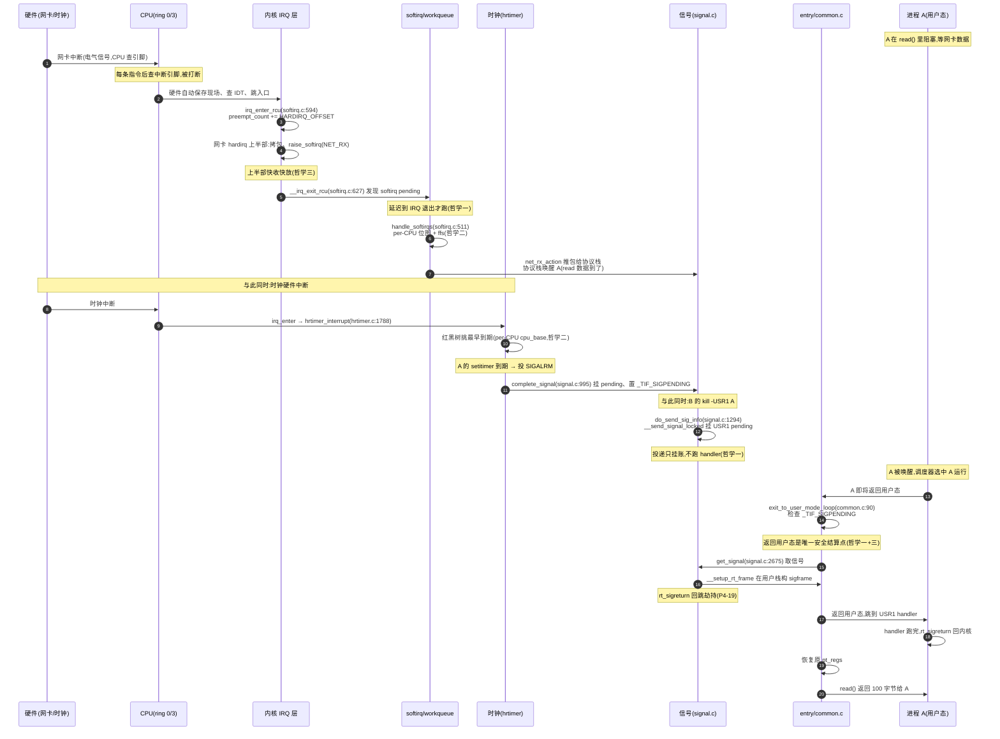

# 第二十一章 · 四个机制的哲学:对照 Tokio / Go runtime / io_uring 总表

> 篇:P5 收尾
> 主线呼应:这是全书的**收束章**。前 20 章我们一块块拆——中断怎么把 CPU 拉进内核(P1-02)、`irq_chip`/`irq_domain` 怎么把五花八门的硬件抽象成统一接口(P1-03)、为什么中断上下文不能睡眠(P1-04)、上下半部为什么要切两段(P1-05)、softirq 怎么用 per-CPU 位图接力(P1-06)、workqueue 怎么做到可睡眠又不爆炸(P1-07)、`SYSCALL` 指令凭什么比 `int 0x80` 快一个数量级(P2-08)、VDSO 怎么让读时间完全不进内核(P2-10)、hrtimer 怎么在红黑树上挑最早到期(P3-14)、NOHZ 怎么停了 tick 又不丢时间(P3-15)、信号为什么延迟到返回用户态才真正跑 handler(P4-18)、异常和信号为什么是同一套机制(P4-20)。这些机制表面上各管一摊,骨子里却共享同一套哲学。本章的任务是把这套哲学抽出来,钉成五条,再把它和用户态运行时(Tokio / Go runtime / io_uring)的事件模型拼成一张完整的"事件驱动全栈"图。读完,你该能在脑子里放映出从网卡电气信号到用户 handler 的全旅程,并看清内核和用户态运行时各自的取舍。

## 核心问题

**中断、系统调用、时钟、信号——这四个机制各自的源码长得天差地别(`kernel/irq/handle.c` 的 action 链、`kernel/entry/common.c` 的入口框架、`kernel/time/hrtimer.c` 的红黑树、`kernel/signal.c` 的 pending 队列),凭什么能合在一本书里?它们共享什么底层哲学?这套哲学和 Tokio / Go runtime / io_uring 的事件模型比,谁更强、谁在什么场景下被淘汰?一个事件从硬件电气信号到用户 handler,完整经过哪些层、用了哪些反复出现的同一套技巧?**

读完本章你会明白:

1. 四个机制共享**五条哲学**——延迟处理、per-CPU 无锁化、上半部/下半部切分、seqlock 无锁读、受控通道——它们在全书反复出现,是 Linux 内核事件驱动的"DNA"。
2. 这五条哲学不是凭空想出来的,每一条都是被某个具体的"不这样会怎样"逼出来的:延迟处理是为了"在能处理的上下文才处理",per-CPU 无锁化是为了"高频并发改的数据不抢锁",上半部/下半部切分是为了"对系统的打扰压到最小",seqlock 是为了"高频读、低频写且读者无锁",受控通道是为了"边界上的门,不是任意穿越"。
3. 一张 **Linux 内核机制 vs Tokio vs Go runtime vs io_uring 对照总表**,把本书和前面几本用户态运行时书钉成"事件驱动全栈",看清各自的取舍。
4. 一张 **"一次事件从硬件到用户 handler 的全旅程"** 总图,把中断→softirq→系统调用入口→时钟→信号串成一条链。

> **逃生阀**:如果你已经读完前 20 章,只想看"哲学五条 + 对照总表",可以直接跳到 21.3(五条哲学)和 21.4(对照总表)与 21.6(全旅程图)。21.2 的"一句话点破"也建议读,它是全书的总结金句。

---

## 21.1 全书的一次复盘:四个机制到底干了什么

在抽哲学之前,先做一次极简复盘——把四个机制各自的"一句话职责 + 关键源码点"摆出来,作为后面抽象的原材料。

| 机制 | 一句话职责 | 代表源码点 | 所在篇 |
|------|----------|----------|------|
| **中断** | 硬件异步事件把 CPU 拉进内核,上半部快收快放,softirq/workqueue 接力 | [`__handle_irq_event_percpu`](../linux/kernel/irq/handle.c#L139)(action 链)、[`handle_softirqs`](../linux/kernel/softirq.c#L511)(per-CPU 位图主循环)、[`__irq_exit_rcu`](../linux/kernel/softirq.c#L627)(上下半部接力点)、[`process_one_work`](../linux/kernel/workqueue.c#L3166)(可睡眠下半部) | 第 1 篇 |
| **系统调用** | 用户主动合法进内核的受控入口,`SYSCALL` 直切 + `sys_call_table` O(1) 分发,VDSO 让读时间避免进内核 | [`syscall_enter_from_user_mode_prepare`](../linux/kernel/entry/common.c#L74)、[`syscall_exit_to_user_mode`](../linux/kernel/entry/common.c#L215)、VDSO 共享页 + seqlock(P2-10) | 第 2 篇 |
| **时钟** | 内核主动驱动的心跳,hrtimer 红黑树挑最早到期,NOHZ 让 idle CPU 停 tick | [`__hrtimer_run_queues`](../linux/kernel/time/hrtimer.c#L1724)、[`hrtimer_interrupt`](../linux/kernel/time/hrtimer.c#L1788)、[`tick_nohz_idle_enter`](../linux/kernel/time/tick-sched.c#L1250) | 第 3 篇 |
| **信号** | 内核向进程的异步通知,投递只挂 pending,处理延迟到返回用户态 | [`complete_signal`](../linux/kernel/signal.c#L995)、[`__send_signal_locked`](../linux/kernel/signal.c#L1074)、[`exit_to_user_mode_loop`](../linux/kernel/entry/common.c#L90)、[`get_signal`](../linux/kernel/signal.c#L2675) | 第 4 篇 |

这四块代码风格迥异,但它们都在回答同一个问题:**"事件来了,内核怎么处理才既不出错又不被锁拖死?"** 答案就是下面要抽的五条哲学。

---

## 21.2 一句话点破

> **中断、系统调用、时钟、信号表面上是四个子系统,骨子里是同一套事件处理范式的四次复用:把控制权跨越用户/内核边界这件事,拆成"尽快接住(上半部)+ 延迟到安全点处理(下半部)+ 用 per-CPU 数据结构消灭锁竞争 + 用 seqlock 让读者无锁 + 在边界上只留受控的几道门"。这套范式和 Tokio / Go runtime / io_uring 在用户态的事件模型同构——区别只在内核要管硬件、要精确纳秒、要在中断上下文里跑代码,所以选了不同的数据结构和取舍。**

这是结论,不是理由。本章倒过来拆:先把五条哲学一条条拎出来,每条回扣具体章节、具体源码,看清它被什么"不这样会怎样"逼出来;然后用一张大表把这五条哲学和用户态运行时的事件模型对齐;最后画一张"一次事件从硬件到用户 handler"的全旅程图,把全书串成一条链。

---

## 21.3 五条哲学

### 哲学一:延迟处理——"不在能跑的上下文里跑,只在能跑的上下文里跑"

这是全书**最反复出现**的一条哲学。它的核心是:**很多事不能在事件发生的当场做,只能推迟到"能做的上下文"才做**。Linux 用了至少三种"延迟处理"的实例:

**实例 A:softirq 把中断的重活推迟到 IRQ 退出。** hardirq 上下文不能睡眠、屏蔽其他中断(P1-04),所以网卡驱动的上半部只做"拷包 + `raise_softirq(NET_RX_SOFTIRQ)`"两件最紧急的事,把"推包给协议栈"这件重活推迟到 IRQ 退出后由 [`handle_softirqs`](../linux/kernel/softirq.c#L511) 在 softirq 上下文接力(P1-06)。接力点就在 [`__irq_exit_rcu`](../linux/kernel/softirq.c#L627):

```c
/* kernel/softirq.c,简化示意,非源码原文 */
static inline void __irq_exit_rcu(void)
{
    /* ...preempt_count 的 hardirq 段减一... */
    if (!in_interrupt() && local_softirq_pending())
        invoke_softirq();    /* 就地跑 softirq,或唤醒 ksoftirqd */
    /* ... */
}
```

注意那个 `!in_interrupt()`——只有"已经不在任何中断嵌套里了"才跑 softirq。嵌套里不跑,是为了"延迟到一个干净的上下文"。

**实例 B:信号投递只挂 pending,处理推迟到返回用户态。** [`complete_signal`](../linux/kernel/signal.c#L995) 只把信号挂到目标进程的 `sigpending` 队列、置 `_TIF_SIGPENDING`(P4-17),**真正的 handler 推迟到** [`exit_to_user_mode_loop`](../linux/kernel/entry/common.c#L90) 检查到这个位、且即将切回用户态时才跑(P4-18)。

> **不这样会怎样**:信号的 handler 是用户代码,要访问用户栈、用户数据,只能在用户态跑;内核此刻可能在中断上下文(异常/定时器)或持 `siglock`,根本进不了用户态。如果当场硬跑 handler,会破坏特权边界、破坏内核持锁的不变量。所以"投递只挂账、处理等返回用户态"是唯一 sound 的设计。

**实例 C:hrtimer 的 softexpires 区间把"精确唤醒"延迟成"批量唤醒"。** hrtimer 给每个 timer 一个合法唤醒窗口(softexpires ~ hardexpires),让窗口重叠的 timer 被同一次硬件中断集体叫醒(P3-14)。这是把"每个 timer 各自精确唤醒"延迟合并成"一批 timer 一起唤醒",用一点点延迟精度换走"中断风暴"。

> **所以这样设计**:延迟处理的本质是**"在能跑的上下文才跑"**——softirq 要等 IRQ 退出、信号要等返回用户态、timer 唤醒要等窗口对齐。这不是偷懒,是**让每个动作都在它正确的上下文里执行**,避免在中断上下文里睡眠、避免在内核态跑用户代码、避免每次都打一个中断。

> **钉死这件事**:**延迟处理**贯穿全书——softirq(P1-06)、信号延迟投递(P4-18)、hrtimer softexpires(P3-14)、NOHZ 借下一个 hrtimer 唤醒(P3-15)、`exit_to_user_mode_loop` 把信号/调度/resched 全攒到返回用户态一次性结清(P4-18)。它是内核"不在错误的上下文里做错误的事"的总原则。

### 哲学二:per-CPU 无锁化——"高频并发改的数据,首选每核一份"

这是全书**最节省锁竞争**的一条哲学。它的核心是:**只要一个数据结构被高频并发改,就把它拆成每核一份,让每个 CPU 只动自己的那份,零锁竞争**。Linux 在四个子系统里都用了这套:

**实例 A:softirq 的 per-CPU pending 位图。** 每个 CPU 一个 `__softirq_pending` 32 位整数,`raise_softirq` 只置本 CPU 的位、`handle_softirqs` 只读本 CPU 的位(P1-06,[softirq.c:511](../linux/kernel/softirq.c#L511))。如果用全局链表,64 核机器上每次置 pending 都抢同一把自旋锁,softirq 的性能优势会被锁竞争直接吞掉。

**实例 B:hrtimer 的 per-CPU `hrtimer_cpu_base`。** 每个 CPU 一个 [`hrtimer_bases`](../linux/kernel/time/hrtimer.c#L69)(`DEFINE_PER_CPU(struct hrtimer_cpu_base, hrtimer_bases)`),内含 MONOTONIC/REAL/BOOT/TAI 四个 base 各一棵红黑树(P3-14)。timer 入队、挑最早到期,大多只动本 CPU 的 base,跨 CPU 迁移 timer 才走慢路径。

**实例 C:timekeeping 的 per-CPU `tkf`(fast timekeeper)。** [`timekeeping.c`](../linux/kernel/time/timekeeping.c#L449) 的 `raw_read_seqcount_latch(&tkf->seq)` 读的是本 CPU 的 fast timekeeper 缓存,让 `ktime_get` 这种每秒被调上百万次的接口不抢全局锁(P3-13)。

**实例 D:`preempt_count` 是 per-task(per-thread_info)的整数。** 进 hardirq `add(HARDIRQ_OFFSET)`、出 `sub`,本核本线程读自己,零锁(P1-04)。

```
 per-CPU 无锁化的通用套路(贯穿全书):

  传统(抢锁):                          per-CPU(无锁):
  ┌─────────────────┐                   CPU0           CPU1     ... CPU63
  │ 全局 softirq     │ ◄── 64 核都改    │ pending 位    │ pending 位  │ pending 位
  │ pending 位图     │     抢一把锁     └──────────────┘└──────────┘  └───────────┘
  │ + spinlock       │                   各改各的,零锁竞争
  └─────────────────┘
```

> **反面对比**:如果不用 per-CPU,64 核机器上 softirq pending 位图、hrtimer cpu_base、`preempt_count` 全部退化为"全局变量 + 自旋锁",中断每秒触发成千上万次,锁竞争会把 CPU 占满。这和上一本《调度器》的 per-CPU `rq`、第 8 本《内存分配器》的 per-cpu cache、上一本 mm 的 per-cpu pageset 是**同一套思路**——凡是高频并发改的计数,首选 per-CPU 无锁化。**这是 Linux 多核扩展性的命脉**。

> **钉死这件事**:**per-CPU 无锁化**是全书四个子系统共享的并发设计 DNA。softirq pending 位图(P1-06)、hrtimer cpu_base(P3-14)、timekeeping fast 缓存(P3-13)、preempt_count(P1-04),全是这套路。它让内核在几十上百核上依然能扛住高频事件。

### 哲学三:上半部/下半部切分——"对系统的打扰压到最小"

这条哲学和"延迟处理"是一家,但侧重不同:**延迟处理讲"什么时候做",上半部/下半部讲"做多少"**。核心是:**紧急的、轻量的、不能等的,放在被打断的当场做(上半部);不紧急的、重的、可以等的,推迟到下半部做**。

**实例 A:中断 hardirq / softirq / workqueue 三层。** hardirq 只做"拷包、应答硬件、raise softirq"(P1-05),softirq 做协议栈处理(P1-06),workqueue 做需要睡眠/调阻塞 API 的重活(P1-07)。三层约束递减:hardirq 不能睡眠且屏蔽中断、softirq 不能睡眠但开中断、workqueue 在进程上下文可睡眠。

**实例 B:hrtimer 的硬中断模式 vs 软中断模式。** hrtimer 默认在硬中断里跑回调(`HRTIMER_MODE_ABS`),但有些 timer(如调度器的 sched tick)用软中断模式,把回调推迟到 softirq(`HRTIMER_MODE_SOFT`,P3-14)。这是"上半部/下半部切分"在时钟子系统的复用。

**实例 C:`exit_to_user_mode_loop` 是"上半部/下半部"在返回用户态的镜像。** 进内核时极简(快速放进去,只做 context tracking、开中断),出内核时厚重(把信号 pending、调度 resched、热补丁、task_work 全攒到返回用户态一次性结清,P4-18)。这是"进内核是上半部(只接住),出内核是下半部(把待办做完)"。

```
 上半部/下半部切分的"约束递减"模型:

  hardirq (上半部)      : 不能 sleep、屏蔽其他中断、最快 → 只做最紧急的事
       │ raise_softirq / queue_work
       ▼
  softirq (下半部 1)    : 不能 sleep、开中断、较快    → 协议栈、timer
       │ (或) queue_work
       ▼
  workqueue (下半部 2)  : 进程上下文、可 sleep、可慢   → 调阻塞 API 的重活
```

> **不这样会怎样**:如果全部在 hardirq 里干——网卡收包、协议栈处理、磁盘写入——其他中断被屏蔽太久(可能丢中断)、hardirq 跑太久(其他进程饿死)、不可睡眠(调不了任何阻塞 API)。切两段(甚至三段)后,hardirq 极短、对系统的打扰压到最小,其他中断和进程都能及时响应。这是**性能与功能的切分**(性能:hardirq 快收快放;功能:softirq/workqueue 放开约束才能干重活)。

> **钉死这件事**:**上下半部切分**在全书反复出现——中断 hardirq/softirq/workqueue(P1-05/06/07)、hrtimer 硬/软中断模式(P3-14)、entry 的"进极简出厚重"(P4-18)。它的本质是"约束递减"——越靠后的上下文约束越松、能干的事越多,代价是越靠后越慢。

### 哲学四:seqlock 无锁读——"高频读、低频写且读者无锁"

这是全书**最反直觉**的一条哲学,也是内核最优雅的工程设计之一。核心是:**当一个数据"写的频率远低于读、读者要求一致但不要求最新、读的并发量巨大"时,用一个奇偶版本号让读者无锁重试,而不是抢读写锁**。

**实例 A:timekeeper 的 seqlock。** [`timekeeping.c`](../linux/kernel/time/timekeeping.c) 的 `tk_core.seq` 是个 seqcount,`ktime_get` 这种每秒百万次的读用 `read_seqcount_begin` 重试机制(P3-13):

```c
/* kernel/time/timekeeping.c,简化示意,非源码原文 */
do {
    seq = read_seqcount_begin(&tk_core.seq);   /* 读版本号(偶数=没人在写) */
    /* ...读 timekeeper 的 xtime/monotonic... */
} while (read_seqcount_retry(&tk_core.seq, seq)); /* 写完了?重读 */
```

写墙上时间时 `write_seqcount_begin`(版本号变奇数,读者会 retry),写完 `write_seqcount_end`(版本号变偶数)。读者**完全不抢锁**,只在读到一半被写打断时重试。

**实例 B:VDSO 把 seqlock 延伸到用户态。** VDSO 共享页里也存了一份 seqcount(P2-10),用户态 `gettimeofday` 读共享页的版本号——奇数说明内核正在写、重试,偶数才用。这是 seqlock 跨越用户/内核边界的妙用:**内核写、用户态读,无锁又一致**。

**实例 C:hrtimer 的 `base->running` + seqcount 屏障。** [`__run_hrtimer`](../linux/kernel/time/hrtimer.c)(P3-14)跑 timer 回调前释放 `cpu_base->lock`,用 `base->running` + seqcount 保证跨 CPU 的 cancel 不丢、不死锁——这本质也是一种"写者(跑回调)短暂放锁,读者(cancel)用版本号重试"的 seqlock 思路。

```
 seqlock 的奇偶版本号(读者无锁):

  版本号:    1   2   3   4   5   ...
             奇  偶  奇  偶  奇
             │   │   │   │   │
  写者:      └write─┘   └write─┘   (写时版本号奇,写完变偶)
  读者:        ┌read┐      ┌read┐
              (读到偶数=一致,读到奇数=被写打断,重读)
```

> **反面对比**:如果 `ktime_get` 用读写锁(rwlock),64 核同时读时间要抢同一把读锁(虽然读锁允许多读,但缓存行 bouncing 让性能急剧下降),写者还要等所有读者退出——`gettimeofday` 每秒百万次,直接拖垮 CPU。seqlock 让读者**完全不抢锁**,只在罕见情况(恰好读到一半写者开始写)重试,把读开销降到最低。

> **钉死这件事**:**seqlock 无锁读**是"高频读、低频写"场景的银弹。timekeeper(P3-13)、VDSO(P2-10)、hrtimer cancel 屏障(P3-14)都用了它。它和 per-CPU 无锁化是内核并发的两大支柱——per-CPU 解决"高频写",seqlock 解决"高频读",合起来覆盖了内核大部分并发热点。

### 哲学五:受控通道——"边界上的门,不是任意穿越"

最后一条哲学讲的是**用户/内核边界本身**。核心是:**用户态和内核态之间不能任意穿越,只能走内核预设的几道"门"——系统调用是用户进内核的门,信号是内核出内核通知用户的门,异常是 CPU 强制进内核的门,中断是硬件强制进内核的门**。

**实例 A:`SYSCALL` 指令是用户进内核的唯一合法门。** x86 CPU 的特权级检查让 ring 3 直接 `call` ring 0 代码段抛 `#GP`(P2-08)。`SYSCALL` 指令用 MSR 寄存器(`MSR_LSTAR`)直接跳到内核预设的入口(`do_syscall_64`),CPU 硬件替内核把门,用户态救不回。所有"进内核办事"必须走这道门,通过 `sys_call_table[]` 的函数指针数组 O(1) 分发(系统调用号当下标)。

**实例 B:信号是内核出内核通知用户的门。** 信号的 handler 必须在用户态跑(P4-18),内核"通知用户"只能把信号挂 pending、等进程返回用户态那一刻才把控制权交给 handler。这是"内核向外"的受控通道——不是内核直接调用户函数(那会破坏特权边界),而是"在边界上当面交付"。

**实例 C:异常是 CPU 强制进内核的门。** 缺页、除零、非法指令,CPU 自己产生一个向量号、走 IDT 进内核(P1-02)。这和"用户主动 `SYSCALL`"不同——异常是同步的、强制的,但走的"门"是同一套 IDT/入口机制。异常不可恢复时统一走 [`force_sig_info`](../linux/kernel/signal.c#L1361) 投递信号(P4-20),让用户态用同一套信号 handler 处理硬件错误——这是"进内核的门"和"出内核的门"在异常处的接合。

**实例 D:VDSO 是"在边界上开一扇窗,避免走门"。** 读时间这件事,如果每次都走 `SYSCALL` 这道门,开销巨大;VDSO 干脆在边界上开一扇"共享页"的窗,让用户态直接读内核维护的时间,完全不进内核(P2-10)。这是对"受控通道"哲学的**反向优化**——高频且只读的操作,不必走门,开窗共享更省。

> **不这样会怎样**:如果没有受控通道、用户能任意 `call` 内核函数,特权级隔离就成了空话——任意程序能直接调 `schedule()` 切走别的进程、直接读另一个进程的内存、直接改页表。多任务隔离无从谈起。所以**边界上的门必须是少而精、且 CPU 硬件替内核把守**——`SYSCALL` 是用户合法进的门、信号是内核合法出的门、异常/中断是 CPU/硬件强制的门。

> **钉死这件事**:**受控通道**是用户/内核边界的安全保证。系统调用(P2-08)是用户合法进的门、信号(P4-17/18)是内核合法出的门、异常(P4-20)是 CPU 强制进的门,VDSO(P2-10)是"开窗共享避免走门"的反向优化。四道门加一扇窗,定义了用户态和内核态之间所有合法的交互方式。

---

## 21.4 ★ 对照总表:Linux 内核机制 vs Tokio vs Go runtime vs io_uring

这五条哲学不是内核独有。用户态运行时(Tokio / Go runtime / io_uring)也在解决"事件怎么被处理",只不过它们建在内核之上、不直接管硬件,所以选了不同的数据结构和取舍。把本书的内核事件模型和前面几本用户态运行时的事件模型拼起来,就是一张完整的"事件驱动全栈"。

下面这张大表是全书的收束——把四个机制 × 四个用户态运行时,按"事件源 / 通知方式 / 延迟处理 / 无锁手段 / 下半部切分 / 定时器 / 空闲省电 / 取舍点"八个维度对齐:

| 维度 | Linux 内核机制(本书) | Tokio(《Tokio》书) | Go runtime(《Go runtime》书) | io_uring(《块设备 IO》书) |
|------|---------------------|-------------------|---------------------------|------------------------|
| **事件源** | 硬件中断(网卡/键盘/时钟)+ 异常 + 系统调用 | epoll 就绪事件(` mio`)+ 定时器 + 信号 | netpoller(epoll)+ channel + timer | 完成队列 CQE(内核写)+ SQE(用户写) |
| **通知方式** | 内核主动通知(中断抢占 CPU) | epoll_wait 主动取就绪 | netpoller 主动 poll + channel 阻塞唤醒 | 用户主动轮询 CQE(同步可批) |
| **延迟处理** | softirq 延迟到 IRQ 退出、信号延迟到返回用户态 | mio 只取事件,task 接力处理 | channel 入队、收方稍后取 | CQE 入队、用户稍后 reap |
| **无锁手段** | per-CPU 数据(softirq 位图/hrtimer cpu_base/preempt_count)+ seqlock | per-worker 本地队列 + work-stealing | per-P 本地 runq + 全局队列 + work-stealing | SPSC 环(单生产者单消费者)+ `smp_store_release`/`acquire` |
| **下半部切分** | hardirq(不能 sleep)→ softirq(不能 sleep 开中断)→ workqueue(可 sleep) | mio(只取事件)→ task(可 await) | netpoller(取就绪)→ goroutine(可阻塞) | 内核侧 submit→completion 分离 |
| **定时器** | hrtimer 红黑树(timerqueue,O(log n) 取最早)+ softexpires 区间 | 层级时间轮(批量、O(1) 摊销) | 四叉堆(per-P + 全局) | 借内核 hrtimer(无独立定时器) |
| **空闲省电** | NOHZ idle 停 tick,借下一个 hrtimer 唤醒 | 进程空闲 park worker 线程 | P 空闲时 sysmon 检查 / G 阻塞时 P 可被偷 | 无(用户态,不直接管 CPU 状态) |
| **用户进内核/runtime 的门** | `SYSCALL` 指令(MSR 直跳)+ `sys_call_table` O(1) 分发 | tokio 内部无"门",task 是协作式调度 | `runtime.systemstack_switch`/systrap 进 runtime | `io_uring_enter` 系统调用(批量提交) |
| **异步通知进程** | 信号(pending 队列 + 延迟到返回用户态) | 无直接对应(用 task + channel 模拟) | channel(异步延迟)+ panic(同步杀 goroutine) | 无(完成事件靠用户轮询,不是推送) |
| **核心取舍** | **精确**——纳秒级 hrtimer、不丢中断、不破坏特权边界,代价是上下文约束复杂(hardirq 不能 sleep) | **吞吐**——百万级 task、批量时间轮,代价是单 timer 精度差(毫秒级) | **简洁**——语言内置协程,goroutine 阻塞不阻塞线程,代价是 GC 暂停 | **批量**——少进内核、用轮询换批量,代价是编程模型新(需重新设计) |

### 这张表怎么看

读这张表有个窍门:**横着看一行,看一个维度四个实现怎么选;竖着看一列,看一个实现的整体取舍**。几个关键对照点:

- **通知方式的代际差**:传统中断是"内核主动通知用户"(异步抢占 CPU),io_uring 的 CQE 是"用户主动轮询完成队列"(同步可批)。这是事件模型的代际差——io_uring 的核心创新之一就是"少进内核、用轮询换批量",在高 IOPS 场景下省掉了海量中断。
- **定时器的精度 vs 批量**:内核 hrtimer 用红黑树求**精确**(纳秒级、单个 timer 一个中断,softexpires 区间批量合并),Tokio 时间轮求**批量**(层级桶,O(1) 摊销,精度毫秒级)。内核要管硬件(调度精确时间片、用户 `sleep` 精确唤醒),Tokio 只在用户态管 task(不需要纳秒精度,但要扛百万 timer)——**不同场景选不同数据结构**。
- **延迟处理的同构**:内核 softirq 延迟到 IRQ 退出、Tokio 的 mio 只取事件 task 接力、Go channel 入队收方稍后取、io_uring CQE 入队用户稍后 reap——**四种实现都是"先记账、稍后处理"**,因为"事件发生的当场"都不是"能完整处理的上下文"。
- **per-CPU 无锁化 vs per-worker/per-P 无锁化**:内核用 per-CPU(softirq 位图、hrtimer cpu_base)、Tokio 用 per-worker 本地队列、Go 用 per-P 本地 runq——**都是"把高频并发改的数据拆成每执行单元一份"**,只不过内核的执行单元是 CPU,运行时的执行单元是 worker 线程/P。
- **门 vs runtime 的进出门**:`SYSCALL` 是用户进内核的门,Go runtime 的 `runtime.systemstack_switch`/systrap 是 goroutine 进 runtime 的门——**都是"受控跨越"**,只不过内核的门由 CPU 硬件把守(特权级),runtime 的门由编译器/调度器把守(协作式)。

> **钉死这件事**:这张表是全书的**收束**。它告诉你:内核的事件模型(中断/时钟/信号)和用户态运行时的事件模型(Tokio/Go/io_uring)是**两层**——用户态运行时最终建立在内核之上(Tokio 的 mio 走 epoll、Go 的 netpoller 走 epoll、io_uring 是内核提供的新接口)。本书讲"内核怎么处理事件",前面几本讲"用户态怎么在内核之上再抽象事件处理"。**两层合起来,才是事件驱动全栈的完整图景**。

---

## 21.5 技巧精解:为什么内核选了"硬中断 + per-CPU + seqlock",而用户态运行时选了"轮询 + 时间轮 + task"

这一节是收束章的技巧精解,我们换一种讲法:**不是挑一两个源码技巧逐行拆,而是把全书五个最硬的技巧并列,问"内核和用户态运行时为什么选了不同的招"**。这是把哲学和技术细节焊在一起。

### 技巧一:为什么内核要"硬中断抢占 CPU",而 io_uring 选了"用户轮询 CQE"?

内核的中断模型:**硬件发信号 → CPU 立刻被打断 → 跳进内核 hardirq**(P1-02)。这个模型的前提是"事件稀疏、每个事件都要尽快响应"——网卡收到一个包,不能等 CPU 想起来去查,必须立刻打断它。所以 CPU 每条指令结束都查中断引脚,中断响应延迟下限 = 一条指令。

io_uring 的模型反过来了:**内核把完成事件写进 CQE 环,用户态主动轮询 reap**(上一本《块设备 IO》)。为什么?因为高 IOPS 场景(每秒几十万次 IO)下,每个 IO 都打一个中断,CPU 光处理中断就满了——这就是**中断风暴**。io_uring 用"用户批量轮询 + 内核批量写 CQE"换掉了"每个 IO 一个中断",用 SPSC 环(单生产者单消费者)+ `smp_store_release`/`acquire` 内存序保证无锁正确。

```c
/* io_uring 的 CQE 环(简化示意,非源码原文,见上一本《块设备 IO》) */
/* 内核侧(生产者):写完 CQE,smp_store_release 更新 tail */
/* 用户侧(消费者):读 tail(acquire),reap 到 head */
```

> **反面对比**:NVMe SSD 每秒能做几十万次 IO,如果每次都中断,CPU 全在处理中断上。io_uring 的 polled IO 模式(SQPOLL)干脆让一个内核线程专职轮询 SQE,连 `io_uring_enter` 系统调用都省了——**用 CPU 自旋换中断开销**。这是事件模型从"中断驱动"向"轮询驱动"的代际迁移,发生在硬件性能(尤其 NVMe)突破中断模型瓶颈之后。

内核仍保留中断模型,是因为大部分场景(键盘、网卡低速、时钟)事件稀疏,轮询反而浪费 CPU;io_uring 选轮询,是因为它服务的场景(I/O 密集)事件密集到中断撑不住。**同一个"事件怎么被处理"的问题,两个场景选了两套模型**。

### 技巧二:为什么内核 hrtimer 用红黑树,Tokio 用层级时间轮?

内核 hrtimer 用**红黑树**(实际是 timerqueue,基于红黑树,[`__hrtimer_next_event_base`](../linux/kernel/time/hrtimer.c#L505) 取最左节点,O(log n)),Tokio 用**层级时间轮**(`tokio::time::wheel`,按到期时间分桶,O(1) 摊销)。

为什么不同?**内核要精确,Tokio 要吞吐**:

- 内核 hrtimer 要驱动**调度器的精确时间片**(EEVDF 的 deadline,回扣调度器 P1-04 的 hrtick)、用户的**精确 `sleep`**(纳秒级),单个 timer 一个中断(softexpires 区间合并)——所以选红黑树求 O(log n) 精确取最早到期。
- Tokio 要扛**百万级 task 的定时器**(每个 task 可能挂一个 timeout),精度要求毫秒级就够——所以选层级时间轮求 O(1) 摊销批量,牺牲单 timer 精度换海量 timer 的吞吐。

```
 红黑树(hrtimer)vs 层级时间轮(Tokio):

  hrtimer 红黑树(精确):              Tokio 时间轮(批量):
  按绝对纳秒时间排序                   按到期时间分桶
       ○                              [0ms] [1ms] [2ms] ... [1000ms]
      / \                              │task5│task2│      │task1,3,7│
     ○   ○  ← 最左 = 最早到期          └──────┴─────┘      └─────────┘
    / \   \                            桶内链表,批量唤醒
   ○   ○   ○                          O(1) 摊销取下一个桶
   O(log n) 取最早                     精度 = 桶大小
```

> **反面对比**:如果 Tokio 用红黑树扛百万 timer,每次入队 O(log n)、挑最早 O(log n),百万级 timer 的开销巨大;如果内核 hrtimer 用时间轮,调度器精确时间片的 deadline 精度被桶大小钉死,EEVDF 的公平性保证会受影响。**不同负载特征选不同数据结构**——这是内核和用户态运行时在定时器上的核心取舍。

### 技巧三:为什么 seqlock 只在内核出现,用户态运行时不用它?

内核的 seqlock(timekeeper / VDSO / hrtimer cancel 屏障)是"高频读、低频写、读者无锁"的银弹(P3-13/P2-10/P3-14)。但 Tokio / Go runtime 基本不用 seqlock,它们用别的方式:

- Tokio 的共享数据多用 `RwLock`(异步读写锁)或 `Arc` + 无锁结构。
- Go 用 `sync.RWMutex` 或 channel(共享内存通信)。

为什么内核用 seqlock 而用户态不用?**因为 seqlock 的核心是"读者完全不抢锁,被写打断就重试",前提是"写极罕见"**。内核的 timekeeper 写频率是每 tick 一次(每秒 100~1000 次,相比 `ktime_get` 每秒百万次读,写确实罕见),所以 seqlock 适用。用户态运行时的共享数据(如配置、连接表)写频率往往不低、且读者不那么高频,seqlock 的收益不明显,反而 `RwLock`/channel 更易用。

> **钉死这件事**:seqlock 是**内核专属的高频读优化**——它依赖"写极罕见 + 读者海量"的不对称负载,这在内核(timekeeper 每秒百万次读 vs 每 tick 一次写)成立,在用户态运行时的大部分共享数据上不成立。这是内核和用户态运行时并发工具箱的差异。

---

## 21.6 ★ 全旅程图:一次事件从硬件到用户 handler

把五条哲学和对照总表焊起来,最后画一张图——**一次事件从硬件电气信号到用户 handler 的全旅程**。这张图把中断→softirq→系统调用入口→时钟→信号五个机制串成一条链,是全书的"全景脉络"缩影(全景脉络见附录 A)。

设想这样一个综合场景:**进程 A 正在用户态跑,它之前调了 `read(fd, buf, 100)` 阻塞等数据;此时网卡收到一个包(里面就是 A 等的数据);同时另一个进程 B `kill -USR1 A` 给 A 发了个信号;A 还设了一个 `setitimer` 定时器。这一瞬间,四类事件同时发生**。看内核怎么把它们全接住、串起来、最终让 A 的 `read` 返回、handler 跑、定时器到期:



这张图里,五条哲学全在用:

- **哲学一(延迟处理)**:网卡 hardirq 不推协议栈(raise softirq 延后)、信号不当场跑(挂 pending 等返回用户态)。
- **哲学二(per-CPU 无锁化)**:`handle_softirqs` 读本 CPU 位图、`hrtimer_interrupt` 操作本核 cpu_base。
- **哲学三(上下半部切分)**:网卡 hardirq(拷包)→ softirq(协议栈)→ 用户态 handler;时钟 hardirq(hrtimer 回调)→ 信号 pending → 用户态 handler。
- **哲学四(seqlock 无锁读)**:图里没直接画,但 A 调 `gettimeofday` 时会走 VDSO + seqlock(若 A 在中断前后读了时间)。
- **哲学五(受控通道)**:`read` 系统调用是 A 合法进的门、信号是内核合法出的门、中断是硬件强制的门。

这张图也是**全书"进内核 vs 内核主动"二分法的全景印证**:网卡中断、时钟中断是"事件把控制权拉进内核"(进内核这一面);信号投递、hrtimer 到期触发 SIGALRM 是"内核主动向外"(内核主动那一面);`exit_to_user_mode_loop` 是两者在"返回用户态"那一刻的汇合点。**整个事件处理骨架,就是这五条哲学在四个机制上的四次复用**。

---

## 章末小结

这一章是全书**收束**。我们没有引入任何新机制,而是把前 20 章的四个机制(中断/系统调用/时钟/信号)抽成五条哲学,再和用户态运行时(Tokio/Go/io_uring)拼成一张完整的"事件驱动全栈"图。

**本章服务的二分法那一面**:**收束**——既不是"进内核",也不是"内核主动",而是把这两面共享的哲学抽出来。五条哲学(延迟处理、per-CPU 无锁化、上下半部切分、seqlock 无锁读、受控通道)横跨"进内核"和"内核主动"两面,是它们共同的设计 DNA。

### 五条哲学一页纸

1. **延迟处理**(P1-06 softirq / P4-18 信号 / P3-14 hrtimer softexpires / P3-15 NOHZ):不在能跑的上下文里跑,只在能跑的上下文里跑。
2. **per-CPU 无锁化**(P1-06 softirq 位图 / P3-14 hrtimer cpu_base / P3-13 timekeeping fast 缓存 / P1-04 preempt_count):高频并发改的数据,首选每核一份。
3. **上半部/下半部切分**(P1-05/06/07 中断三层 / P3-14 hrtimer 硬软中断 / P4-18 entry 进极简出厚重):紧急的当场做,重的推迟到约束更松的上下文做。
4. **seqlock 无锁读**(P3-13 timekeeper / P2-10 VDSO / P3-14 hrtimer cancel 屏障):高频读、低频写且读者无锁,奇偶版本号重试。
5. **受控通道**(P2-08 SYSCALL / P4-17/18 信号 / P4-20 异常 / P2-10 VDSO 反向优化):边界上的门,少而精,CPU 硬件替内核把守。

### 五个"为什么"清单

1. **为什么四个机制能合成一本,而不是各写一本?** 它们共享五条哲学(延迟处理、per-CPU 无锁化、上下半部切分、seqlock、受控通道),都是"事件跨越用户/内核边界"的某个角色。合成本书既够厚成体系,又互为彼此的地基——中断驱动网络/块 IO,时钟驱动调度,系统调用是一切用户接口,信号是 IPC/异常通道。

2. **为什么内核选硬中断 + per-CPU + seqlock,而 io_uring 选轮询 + SPSC 环?** 内核的中断模型适合"事件稀疏、每个都要尽快响应"(键盘、低速网卡、时钟);io_uring 的轮询模型适合"事件密集到中断撑不住"(NVMe 高 IOPS)。同一个问题,不同负载特征选不同模型——这是事件模型从"中断驱动"向"轮询驱动"的代际迁移。

3. **为什么内核 hrtimer 用红黑树,Tokio 用层级时间轮?** 内核要纳秒级精确(驱动调度器 deadline、用户精确 sleep),选红黑树求 O(log n) 精确取最早;Tokio 要扛百万级 timer 的吞吐,选时间轮求 O(1) 摊销批量。精度 vs 批量的取舍,不同负载选不同数据结构。

4. **为什么 seqlock 只在内核出现,用户态运行时不用它?** seqlock 依赖"写极罕见 + 读者海量"的不对称负载(内核 timekeeper 每 tick 一次写 vs 每秒百万次读)。用户态运行时的共享数据写频率往往不低、读者不那么高频,seqlock 收益不明显,`RwLock`/channel 更易用。这是并发工具箱的差异。

5. **内核事件模型和 Tokio/Go/io_uring 是什么关系?** 两层——用户态运行时建立在内核之上(Tokio 的 mio 走 epoll、Go 的 netpoller 走 epoll、io_uring 是内核新接口)。本书讲"内核怎么处理事件",前面几本讲"用户态怎么在内核之上再抽象事件处理"。两层合起来才是完整的事件驱动全栈。

### 想继续深入往哪钻

- **五条哲学的源码锚点**(全书回顾,每个锚点都已在前 20 章 Grep/Read 核过):
  - 延迟处理:[`handle_softirqs`](../linux/kernel/softirq.c#L511)、[`__irq_exit_rcu`](../linux/kernel/softirq.c#L627)(softirq 接力点)、[`exit_to_user_mode_loop`](../linux/kernel/entry/common.c#L90)(信号结算点)、[`complete_signal`](../linux/kernel/signal.c#L995)(投递只挂账)。
  - per-CPU 无锁化:[`DEFINE_PER_CPU(struct hrtimer_cpu_base, hrtimer_bases)`](../linux/kernel/time/hrtimer.c#L69)、`__softirq_pending`(per-CPU 位图)、[`preempt_count`](../linux/include/linux/preempt.h) 的 bit 段布局。
  - 上下半部切分:[`invoke_softirq`](../linux/kernel/softirq.c#L419)(hardirq→softirq 接力)、[`process_one_work`](../linux/kernel/workqueue.c#L3166)(softirq→workqueue 接力)、[`syscall_exit_to_user_mode`](../linux/kernel/entry/common.c#L215)(进极简出厚重)。
  - seqlock 无锁读:[`read_seqcount_begin(&tk_core.seq)`](../linux/kernel/time/timekeeping.c#L254)、VDSO 共享页的 seqcount(P2-10)、hrtimer 的 `base->running` + seqcount(P3-14)。
  - 受控通道:`SYSCALL` 指令(P2-08 描述 + 引通用框架)、[`sys_call_table`](../linux/kernel/sys.c)、异常 [`force_sig_info`](../linux/kernel/signal.c#L1361)。
- **观测全书四个机制**:全景脉络见**附录 A**(一次网卡中断端到端时序 + 一次系统调用状态机 + hrtimer/NOHZ 状态机 + 信号投递到 handler 流程);源码阅读路线 + `/proc/interrupts`/`/proc/softirqs`/`/proc/timer_list`/`/proc/<pid>/status` + `perf`/`ftrace`/`strace`/`bpftrace` 用法见**附录 B**。
- **延伸**:对照系列其他几本——《Tokio》(`tokio::time::wheel` 时间轮 + mio epoll)、《Go runtime》(netpoller + channel + systrap)、《块设备 IO》(io_uring 的 SQE/CQE 环 + SPSC 无锁)、《Linux 调度器》(hrtick 怎么用 hrtimer 实现 EEVDF 精确抢占,本书 P3-14 回扣它)、《内存分配器》(per-cpu cache,和本书 per-CPU 无锁化同思路)。把它们和本书对照读,五条哲学在每一本里都有回响。

### 引出附录

正文到此结束。本书的剩余两部分是附录:

- **附录 A · 全景脉络** —— 一次网卡中断从硬件到 NAPI 的端到端时序图、一次系统调用从用户态到内核返回的状态机、hrtimer/NOHZ 时钟状态机、信号投递到 handler 的完整流程图。本章 21.6 的全旅程图是这些图的总纲,附录 A 把每条支线展开。
- **附录 B · 源码阅读路线与延伸** —— `kernel/irq/`+`softirq.c`+`workqueue.c`+`entry/`+`time/`+`signal.c` 的阅读地图、`/proc/interrupts`/`/proc/softirqs`/`/proc/timer_list`/`/proc/<pid>/{status,timers}`/`/proc/sys/kernel/hz` 怎么观测、`perf`/`ftrace`/`strace`/`bpftrace` 怎么用、与 BSD `intr`/Windows IRQL 的对照、调参(`CONFIG_HZ`/`isolcpus`/`nohz_full`/`irqaffinity`/RT preempt)。附录 B 是"想继续往哪钻"的完整索引。

读完本书,你该能在脑子里放映出从网卡电气信号到用户 handler 的全旅程,并看清内核和 Tokio/Go/io_uring 在事件处理上各自的取舍——这就是本书的终点,也是"事件驱动全栈"的起点。
