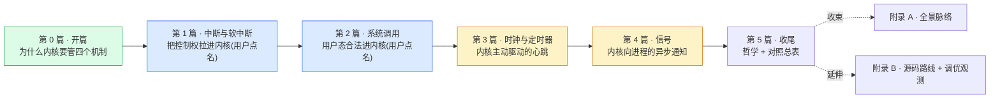

# 《Linux 内核机制深入浅出:中断·系统调用·时钟·信号》—— 目录与导读

> 一本写给"写过 Linux 用户态程序、读过操作系统课、甚至翻过 `kernel/irq/`/`softirq.c`/`kernel/time/`/`signal.c`,却总觉得一知半解"的人的小书。
>
> **一句话主旨**:中断/异常把控制权拉进内核、系统调用是用户态合法进内核的入口、时钟驱动调度与定时、信号是内核向进程的异步通知——这四个机制都是"事件跨越用户/内核边界",合起来构成内核的事件驱动骨架。
>
> **二分法**(迷路时回到它):**进内核**(中断/异常/系统调用入口,事件把控制权拉进内核) vs **内核主动驱动/通知**(时钟触发调度、信号投递,内核向外)。
>
> **★ 三向对照**:中断↔io_uring 完成事件、时钟↔Tokio 时间轮、信号↔Go channel/panic、系统调用↔Go runtime systrap。标 ★ 的章有对照栏。
>
> **基调**:直球讲透为主,比喻只在反直觉处点睛——延续《LevelDB》/《Linux mm》/《调度器》。

每章一行:**一句话钩子** —— 技巧标签 —— 二分法归属(`进内核` / `内核主动` / `支撑` / `收束`)。

---

## 全书结构总览

旅程:从"用户/内核边界是 OS 命脉 + 事件驱动 vs 轮询",到"CPU 怎么被中断拉进内核、上半部/下半部怎么切分、softirq/workqueue 怎么接力",到"`SYSCALL` 指令怎么走 `sys_call_table`、VDSO 怎么避免进内核",到"hrtimer 红黑树怎么挑最早到期、NOHZ 怎么让 CPU 睡又不丢 tick",再到"信号怎么挂 pending、延迟到返回用户态才跑 handler"。每篇都是这条路上的一个驿站——读完你能在脑子里放映出内核事件驱动的全过程。

---

## 第 0 篇 · 开篇:为什么内核要管中断/系统调用/时钟/信号

- [P0-01 · 第一性原理:为什么内核要管中断与系统调用](P0-01-第一性原理-为什么内核要管中断与系统调用.md) —— 用户/内核边界是 OS 命脉 + 事件驱动 vs 轮询 + 中断/系统调用/时钟/信号各是什么角色;立起"进内核 vs 内核主动"二分法。 —— 边界与事件驱动 —— `总览`

## 第 1 篇 · 中断与软中断:把控制权拉进内核 ⚠️ 用户点名 ★对照 Tokio

> 源码 `kernel/irq/`(`manage.c`/`handle.c`/`chip.c`/`irqdomain.c`)、`kernel/softirq.c`、`kernel/workqueue.c`、`include/linux/interrupt.h`/`irq.h`。**建议顺序读**(硬件中断 → 抽象 → 上下文 → 上半部/下半部 → softirq → workqueue)。

- [P1-02 · 硬件中断与中断向量:CPU 怎么被拉进内核](P1-02-硬件中断与中断向量-CPU怎么被拉进内核.md) —— 中断电气本质 + IDT 表 + IRQ 号 vs 向量号 + `handle_arch_irq` 入口。 —— IDT + CPU 自动保存上下文 —— `进内核`
- [P1-03 · IRQ domain 与中断控制器抽象:irq_chip/irq_domain](P1-03-IRQ-domain与中断控制器抽象-irq_chip-irq_domain.md) —— `irq_chip`/`irq_domain`/`irq_desc`,统一五花八门的硬件中断控制器。 —— irq_domain 层级映射 —— `支撑`
- [P1-04 · 中断上下文:为什么不能睡眠](P1-04-中断上下文-为什么不能睡眠.md) —— hardirq context 不是进程、`preempt_count` 计数、为什么不能 `sleep`/`mutex`。 —— preempt_count 嵌套计数 —— `支撑`
- [P1-05 · 上半部与下半部:为什么中断要切两段](P1-05-上半部与下半部-为什么中断要切两段.md) ★ —— hardirq 快收快放、softirq/tasklet/workqueue 三种下半部;对照 Tokio mio+task。 —— 上下半部切分 —— `进内核`
- [P1-06 · softirq 软中断:per-CPU 的延迟工作](P1-06-softirq软中断-per-CPU的延迟工作.md) ★ —— pending 位图 + `softirq_vec[]` + `__do_softirq`/`handle_softirqs` + `MAX_SOFTIRQ_RESTART` + ksoftirqd。 —— per-CPU 位图 + ffs + 防饿死 —— `进内核`
- [P1-07 · workqueue:可睡眠的延迟工作](P1-07-workqueue-可睡眠的延迟工作.md) —— `work_struct` + worker_pool + `process_one_work` + CMWQ 并发管制。 —— CMWQ worker 池管理 —— `进内核`

## 第 2 篇 · 系统调用:用户态合法进内核 ⚠️ 用户点名 ★对照 Go runtime

> 源码 `kernel/entry/common.c`(通用入口)、`kernel/sys.c`(系统调用实现集合)、`arch/x86/entry/`(描述 + 引通用框架)。

- [P2-08 · 系统调用入口:SYSCALL 指令与 sys_call_table](P2-08-系统调用入口-SYSCALL指令与sys_call_table.md) ★ —— `SYSCALL` vs `int 0x80` + `do_syscall_64` + `sys_call_table` + 六寄存器传参。 —— SYSCALL 快路径(MSR 跳转) —— `进内核`
- [P2-09 · 参数传递与系统调用返回](P2-09-参数传递与系统调用返回.md) —— `copy_from_user`/`copy_to_user` 边界检查 + 寄存器约定 + `-errno`。 —— copy_from_user page fault fixup —— `进内核`
- [P2-10 · VDSO:不进内核的"系统调用"](P2-10-VDSO-不进内核的系统调用.md) ★ —— `gettimeofday`/`clock_gettime` 完全在用户态读共享页。 —— VDSO + seqlock 无锁读 —— `进内核`(避免进内核)
- [P2-11 · 系统调用追踪:seccomp 与 ftrace](P2-11-系统调用追踪-seccomp与ftrace.md) —— seccomp BPF 过滤 + ftrace 观测系统调用延迟。 —— seccomp BPF 入口前过滤 —— `进内核`

## 第 3 篇 · 时钟与定时器:内核主动驱动的心跳 ★对照 Tokio 时间轮

> 源码 `kernel/time/`(`clocksource.c`/`clockevents.c`/`timekeeping.c`/`hrtimer.c`/`tick-sched.c`/`posix-timers.c`/`posix-cpu-timers.c`)。与调度器第 11 本 P1-04 hrtick 回扣。

- [P3-12 · clocksource/clockevent:硬件时钟抽象](P3-12-clocksource-clockevent-硬件时钟抽象.md) —— `clocksource`(只读纳秒源)+ `clock_event_device`(可编程定时中断)。 —— clocksource read 抽象 + watchdog —— `支撑`
- [P3-13 · timekeeping:墙上时间怎么维护](P3-13-timekeeping-墙上时间怎么维护.md) —— `struct timekeeper` + `ktime_get_*` + NTP 校正。 —— seqlock + per-CPU 缓存 —— `支撑`
- [P3-14 · hrtimer:高精度红黑树定时器](P3-14-hrtimer-高精度红黑树定时器.md) ★ ⚠️ 核心 —— 每核 `hrtimer_cpu_base` + timerqueue 红黑树 + softexpires 区间 + `hrtimer_interrupt`。 —— 红黑树 + softexpires 区间 —— `内核主动`
- [P3-15 · tick 与 NOHZ:动态时钟省电](P3-15-tick与NOHZ-动态时钟省电.md) ★ —— NOHZ_IDLE 进 idle 停 tick + NOHZ_FULL 单任务几乎无 tick。 —— NOHZ 借下一个 hrtimer 唤醒 —— `内核主动`
- [P3-16 · POSIX timer/itimer:用户态定时器 API](P3-16-POSIX-timer-itimer-用户态定时器API.md) —— `setitimer`/`timer_create` 映射成 hrtimer + CPU timer。 —— POSIX timer 复用 hrtimer —— `内核主动`

## 第 4 篇 · 信号:内核向进程的异步通知 ★对照 Go channel/panic

> 源码 `kernel/signal.c`、`include/linux/sched/signal.h`、`arch/x86/kernel/signal.c`(描述)。

- [P4-17 · 信号投递:send_sig/complete_signal](P4-17-信号投递-send_sig-complete_signal.md) ★ —— `kill`/`tgkill`/`rt_sigqueueinfo` + `do_send_sig_info` + 挂 `pending` 队列。 —— sigpending 队列 + 信号合并 —— `内核主动`
- [P4-18 · 处理入口:返回用户态检查 _TIF_SIGPENDING](P4-18-处理入口-返回用户态检查_TIF_SIGPENDING.md) ★ —— `exit_to_user_mode_loop` 检查 `_TIF_SIGPENDING` + `get_signal` + `handle_signal`。 —— 信号延迟到返回用户态才处理 —— `内核主动`
- [P4-19 · sigaction 与 handler 栈切换:rt_sigreturn](P4-19-sigaction与handler栈切换-rt_sigreturn.md) —— `sigaction` + 用户栈构建 sigframe + `rt_sigreturn` 回跳 + `SA_ONSTACK`。 —— sigframe + rt_sigreturn 劫持返回 —— `内核主动`
- [P4-20 · 信号与异常的关系](P4-20-信号与异常的关系.md) —— 缺页/除零/段错误等 CPU 异常统一走 `force_sig` 投递信号。 —— 异常路径与信号统一 —— `进内核`+`内核主动`桥梁

## 第 5 篇 · 收尾:哲学 + ★对照总表

- [P5-21 · 四个机制的哲学 + ★对照 Tokio/Go/io_uring 总表](P5-21-四个机制的哲学-对照Tokio-Go-io_uring总表.md) —— 延迟处理(softirq/信号)+ per-CPU 无锁化 + seqlock + 上下半部切分;Linux 机制 vs Tokio/Go/io_uring 总表。 —— 内核事件模型 vs 用户态运行时 —— `收束`

## 附录

- **附录 A · 全景脉络** —— 一次网卡中断从硬件到 NAPI 端到端时序 + 一次系统调用从用户到内核返回状态机 + hrtimer/NOHZ 时钟状态机 + 信号投递到 handler 完整流程。
- **附录 B · 源码阅读路线与延伸** —— `kernel/irq/`+`softirq.c`+`workqueue.c`+`entry/`+`time/`+`signal.c` 阅读地图、`/proc/interrupts`/`/proc/softirqs`/`/proc/timer_list`/`/proc/<pid>/{status,timers}`/`/proc/sys/kernel/hz` 观测、`perf`/`ftrace`/`strace`/`bpftrace` 用法、与 BSD/Windows 对照、调参(`CONFIG_HZ`/`isolcpus`/`nohz_full`/`irqaffinity`/RT preempt)。

---

## 推荐阅读路线

**主线(推荐)**:P0-01 → 第 1 篇全(P1-02~07,顺序读,中断最重要)→ 第 2 篇(P2-08~11,系统调用入口)→ 第 3 篇(P3-12~16,时钟核心重头 P3-14 hrtimer)→ 第 4 篇(P4-17~20,信号)→ 第 5 篇(P5-21)→ 附录 A。

按目标速查:

| 你的目标 | 读这几章 |
|------|------|
| 只想懂"中断怎么把 CPU 拉进内核" | P0-01 → P1-02 → P1-04 → P1-05 |
| 只想懂 softirq/workqueue 下半部 | P1-04 → P1-05 → P1-06 → P1-07 |
| 只想懂一次系统调用怎么走过入口 | P0-01 → P2-08 → P2-09 |
| 只想懂 VDSO 凭什么不进内核 | P2-08 → P2-10 |
| 只想懂 hrtimer 高精度怎么实现 | P3-12 → P3-13 → P3-14 |
| 只想懂 NOHZ 怎么停 tick 又不丢 | P3-14 → P3-15 |
| 只想懂信号为什么延迟到用户态才处理 | P4-17 → P4-18 → P4-19 |
| 和 Tokio/Go/io_uring 对照 | P1-05 → P3-14 → P3-15 → P4-18 → P5-21 |
| 想读内核这四个子系统源码 | 附录 B(阅读地图)+ 跟着本书章节啃 |

> 一个提醒:第 1 篇(中断 6 章)是最大重头,有顺序依赖(硬件中断 → 上下文 → 下半部);第 3 篇(时钟)中 P3-14(hrtimer)是核心,P3-15(NOHZ)依赖它;第 4 篇(信号)依赖第 1 篇中断上下文(P1-04)理解为什么信号要延迟处理。

---

## 配套文件

- [全书规划-总纲](全书规划-总纲.md) —— 主线、二分法、分篇分章、Linux 源码策略、写作约定、内核 C 技巧侧重、★对照 Tokio/Go/io_uring 特色。
- [_章节写作提示词](_章节写作提示词.md) —— 写作执行手册(铁律、四段式、技巧精解、★对照栏、宏/体系结构注意、自检清单、附 21 章清单与并行分组)。
- 源码(本地):`../linux/kernel/irq/` + `../linux/kernel/softirq.c` + `../linux/kernel/workqueue.c` + `../linux/kernel/entry/common.c` + `../linux/kernel/sys.c` + `../linux/kernel/time/` + `../linux/kernel/signal.c` + `../linux/include/linux/`(Linux 6.9)。本书所有源码引用均经 Grep/Read 核实行号。

---

> 这本书讲的不是"Linux 信号怎么用、`request_irq` 怎么调",而是"内核凭什么这么设计、`kernel/irq/handle.c`/`softirq.c`/`hrtimer.c`/`signal.c` 里那些 `__do_softirq`/`handle_softirqs`、`hrtimer_interrupt`、`complete_signal`、`exit_to_user_mode_loop` 到底在干什么"。读完,你该能在脑子里放映出内核事件驱动的全过程——一次中断怎么拉 CPU 进内核、一次 `read()` 怎么走过 `SYSCALL` 入口、一个 hrtimer 怎么在红黑树上挑最早到期、一个 `kill` 怎么挂到目标进程的 pending——并看清它和 Tokio 时间轮/Go channel/io_uring 完成事件的同与不同。
