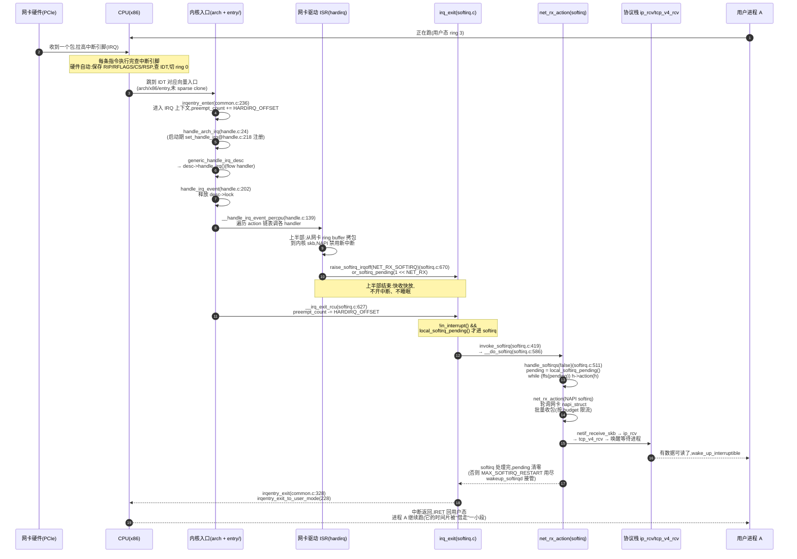
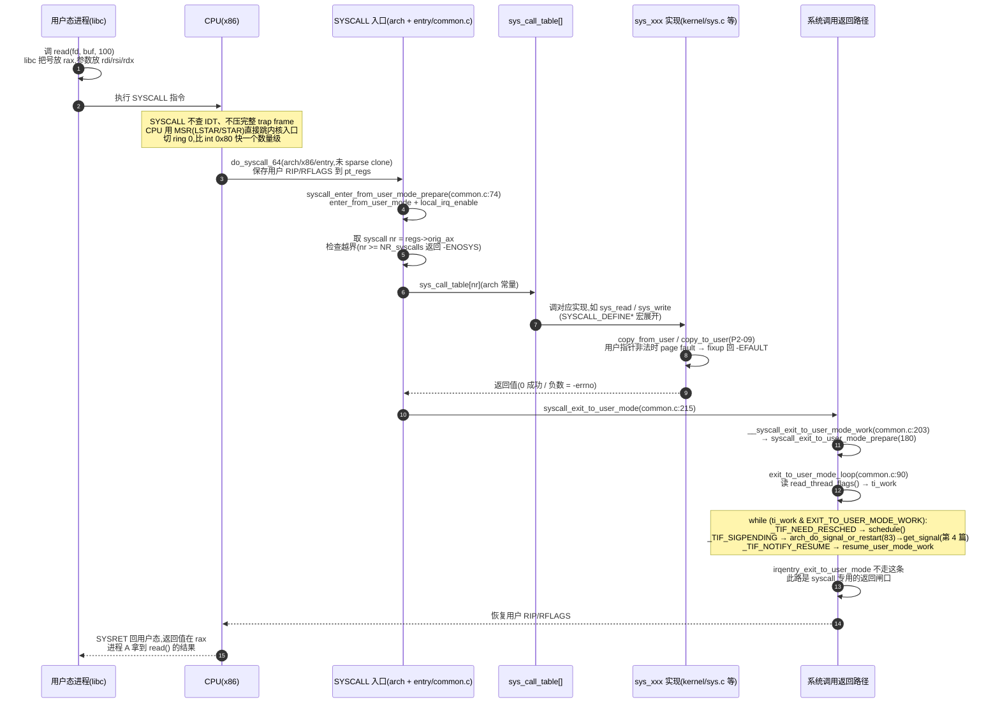
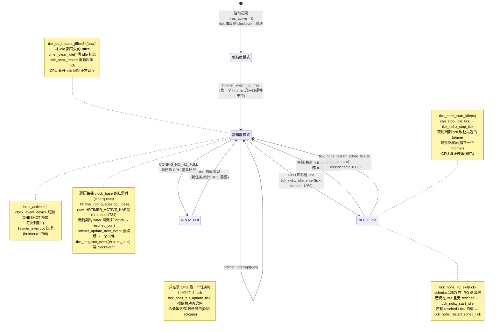
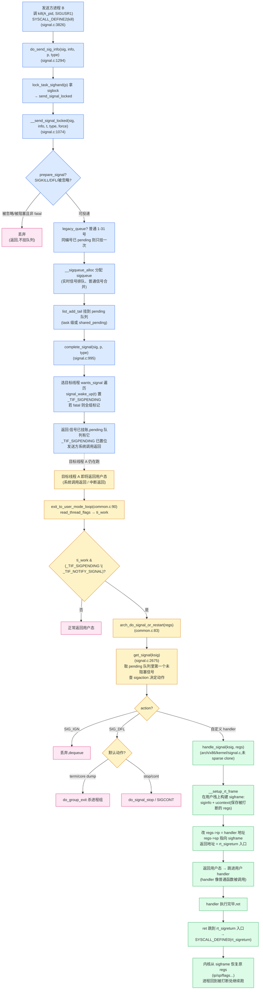

# 附录 A · 全景脉络:一次中断、一次系统调用、一个 hrtimer、一个信号的端到端旅程

> 这是全书的**脉络索引**:正文 21 章把中断、系统调用、时钟、信号四个机制逐层拆透,本附录把它们重新合成"四张完整的端到端旅程图",让你读完全书后**对照、合上书、在脑子里放映**。
>
> 四张图分别串起四个机制,每张图都标注了关键函数名与所在文件行号(Linux 6.9 sparse 树已逐个 Grep 核实)。读完正文再回这里看图,该有一种"原来这些零散的函数名串起来就是这么一条线"的感觉;反过来,如果某张图里某个节点你讲不清它为什么在那里,就该回到对应章节重读。
>
> 全书二分法在这四张图上一目了然:A.1(中断)与 A.2(系统调用)是**进内核**那一面——事件把控制权拉进内核或用户合法进内核;A.3(hrtimer/NOHZ)与 A.4(信号)是**内核主动**那一面——内核向外驱动调度与定时、向进程异步通知。

---

## A.1 一次网卡中断:从硬件触发到 NAPI 软中断

> 这张图串起第 1 篇(P1-02 硬件中断 → P1-03 IRQ 抽象 → P1-04 中断上下文 → P1-05 上下半部 → P1-06 softirq)。一张图讲清"为什么 hardirq 只做最少的事、softirq 在 IRQ 退出后接力"——这就是**上下半部切分**的全貌。

**这张图钉死的几件事**:

> **不这样会怎样**:如果上半部就把包推给协议栈(协议栈要拿软锁、可能递归触发中断、可能在中断上下文里阻塞),中断会占用 CPU 几十微秒,别的中断(尤其是同优先级)被屏蔽、整个系统的实时性和吞吐崩塌。

> **所以这样设计**:上半部只做"硬件相关、最紧急、不能延后"的事——把包从网卡拷到内存、置 softirq pending 位、退出中断;协议栈这种"重活"留给 softirq(`net_rx_action`),它在 IRQ 退出后的 softirq 上下文里跑,中断已重新打开、可以被新中断打断,且 `MAX_SOFTIRQ_RESTART`(`handle_softirqs`@[softirq.c:511](../linux/kernel/softirq.c#L511)) 防止 softirq 自激(网络 RX 触发 TX 触发 RX)永远占着 CPU——超了就 `wakeup_softirqd` 把剩下的活交给 ksoftirqd 内核线程。

> **钉死这件事**:中断上半部(hardirq)→ softirq(`__do_softirq`@[softirq.c:586](../linux/kernel/softirq.c#L586) → `handle_softirqs`@L511)→ 协议栈,这条三段路是 Linux 处理一切外部事件的骨架。图的第 5~7 步(`__handle_irq_event_percpu`@[handle.c:139](../linux/kernel/irq/handle.c#L139))是上半部,第 12~16 步是 softirq 下半部——第 11 步 `__irq_exit_rcu`@L627 的 `if (!in_interrupt() && local_softirq_pending()) invoke_softirq();` 是两段的分界与连接点。

---

## A.2 一次系统调用:从用户态到内核返回

> 这张图串起第 2 篇(P2-08 SYSCALL 入口 → P2-09 参数传递 → P2-10 VDSO)。一张图讲清"`SYSCALL` 指令凭什么快、参数怎么传、返回前为什么要 `exit_to_user_mode_loop` 检查 `ti_work`"——后者正是信号/调度进入用户态的统一闸口,也呼应第 18 章的 `_TIF_SIGPENDING` 检查。

**这张图钉死的几件事**:

> **不这样会怎样**:如果每次系统调用都走 `int 0x80`(软中断),CPU 要查 IDT、压完整 trap frame(SS/RSP/RFLAGS/CS/RIP/errno)、走中断控制器路径——一次调用多花几百个周期。一个高并发服务器每秒百万次 `epoll_wait`/`recvfrom`,开销直接拖垮 CPU。

> **所以这样设计**:`SYSCALL` 指令是 x86 专门为系统调用设计的"快通道"——CPU 用 MSR 寄存器(`LSTAR` 存入口地址、`STAR` 存段选择子)直接跳转,不查 IDT、不压完整 frame,只切特权级和保存最小现场(`RIP` 存到 `RCX`、`RFLAGS` 存到 `R11`)。返回时 `SYSRET` 也是对称的快通道。这就是第 8 章的核心技巧。

> **钉死这件事**:`exit_to_user_mode_loop`@[common.c:90](../linux/kernel/entry/common.c#L90) 是系统调用返回用户态前**唯一**的"扫尾闸口":它检查 `ti_work`,依次处理 `_TIF_NEED_RESCHED`(调度)、`_TIF_SIGPENDING`(信号,A.4 会展开)、`_TIF_NOTIFY_RESUME`(task_work)。**这意味着,无论进程在内核里待了多久,只要它即将回用户态,所有"该在用户态边界做的事"都会在这里被一次性收口**。这也是为什么信号、resched、task_work 都叫"延迟到返回用户态才处理"——它们共享同一个闸口。

---

## A.3 hrtimer 与 NOHZ:时钟的状态转换

> 这张图串起第 3 篇(P3-12 clocksource/clockevent → P3-13 timekeeping → P3-14 hrtimer → P3-15 NOHZ),也回扣调度器第 11 本 P1-04 的 hrtick(hrtimer 的薄包装,实现 EEVDF 精确抢占)。时钟是"内核主动"那一面的典型——硬件触发,内核借它推进调度/timer/墙上时间。

**这张图钉死的几件事**:

> **不这样会怎样**:如果没有 hrtimer 而用老的低精度 timer wheel(按 jiffies 精度,内核多年前已废弃),`sleep(0.5ms)` 这种纳秒级定时根本做不到——调度器 EEVDF 的精确 deadline、POSIX `timer_settime` 的 `CLOCK_MONOTONIC` 纳秒精度全无从谈起;如果进 idle 不停 tick,服务器空闲时还在每秒 100/250/1000 次空转,功耗与虚拟化噪声巨大。

> **所以这样设计**:① 每核一个 `hrtimer_cpu_base`,内含多棵红黑树(`MONOTONIC`/`REAL`/`BOOT`/`TAI` + 软中断模式各一棵),`__hrtimer_run_queues`@[hrtimer.c:1724](../linux/kernel/time/hrtimer.c#L1724) 在 `hrtimer_interrupt`@L1788 里扫到期、调回调;`__hrtimer_next_event_base`@L505 在每次入队后重算最早到期、`tick_program_event` 重编程 clockevent——这是**内核主动驱动**心跳的机制核心。② NOHZ idle 时 `tick_nohz_idle_enter`@[tick-sched.c:1250](../linux/kernel/time/tick-sched.c#L1250) 停掉周期 tick、借最近 hrtimer 唤醒 CPU;醒来后 `tick_nohz_restart_sched_tick`@L1086 用 `tick_do_update_jiffies64` 把 idle 欠的 jiffies 补上——这就是"停 tick 又不丢"的真相。

> **钉死这件事**:时钟篇是二分法"内核主动"那一面最纯粹的体现——clocksource/clockevent 是**支撑地基**(硬件抽象),timekeeper 是**支撑**(墙上时间),而 hrtimer `hrtimer_interrupt` + NOHZ 才是**内核主动向外**:它驱动调度器(回扣 sched P1-04 hrtick)、驱动用户 timer、驱动墙上时间更新。状态机的三个核心态(高精度模式 / NOHZ_Idle / NOHZ_Full)切换,本质都是"在精度与功耗之间动态取舍"。

---

## A.4 一个信号:从 kill 到 handler 的完整流程

> 这张图串起第 4 篇(P4-17 投递 → P4-18 处理入口 → P4-19 sigframe/rt_sigreturn → P4-20 异常统一)。一张图讲清"为什么信号要先挂 pending、延迟到返回用户态才跑 handler、handler 跑完凭什么能恢复原现场"——这正是"挂号信,内核先帮你签收,等你回家才当面交给你"的完整旅程。

**这张图钉死的几件事**:

> **不这样会怎样**:如果内核一收到 `kill` 就立刻打断目标进程、当场跑它的 handler,会有两个灾难:① 目标进程可能正持有锁、正在内核态执行关键路径(如正在 `schedule()`/正在 `copy_from_user`),强行跑用户 handler 会破坏内核状态机;② handler 是**用户代码**,它要访问用户栈、用户数据,必须跑在用户态——但目标进程此刻在内核态(或另一核上)。所以内核**绝不在投递时跑 handler**。

> **所以这样设计**:投递只做两件事——`__send_signal_locked`@[signal.c:1074](../linux/kernel/signal.c#L1074) 把 `sigqueue` 挂到 `pending` 队列、`complete_signal`@L995 置 `_TIF_SIGPENDING` 并 `signal_wake_up` 叫醒(或标记)目标线程。**真正跑 handler 推迟到目标线程返回用户态前**——`exit_to_user_mode_loop`@[common.c:90](../linux/kernel/entry/common.c#L90) 查到 `_TIF_SIGPENDING`,走 `arch_do_signal_or_restart`@L83 → `get_signal`@[signal.c:2675](../linux/kernel/signal.c#L2675) 取信号,`__setup_rt_frame` 在用户栈上构 sigframe(保存被打断的现场),把返回地址改成 `rt_sigreturn`。handler 跑完 `ret` 时跳进 `rt_sigreturn` 系统调用,内核据此恢复原现场——这是"挂号信内核先签收、等你回家才当面交给你"的完整闭环。

> **钉死这件事**:信号投递(`complete_signal` + `_TIF_SIGPENDING`)和信号处理(`exit_to_user_mode_loop` + `get_signal` + `__setup_rt_frame`)是**两个完全分离的阶段**,中间隔了任意长的"目标进程继续跑"的时间。这种"先记账、延迟到安全点才处理"的模式,和中断的"上下半部切分"(A.1)、和系统调用返回的"`exit_to_user_mode_loop` 扫尾闸口"(A.2)是同一种工程美学——**内核绝不强行打断自己,所有"该在边界做的事"都推迟到边界点统一收口**。

---

## 四张图合起来:全书的事件驱动骨架

把 A.1~A.4 叠在一起,你能看清本书二分法的全貌:

| 图 | 机制 | 二分法归属 | 关键闸口函数 |
|---|---|---|---|
| A.1 | 中断(网卡 RX) | 进内核 | `__irq_exit_rcu`@softirq.c:627(softirq 分界) |
| A.2 | 系统调用 | 进内核 | `exit_to_user_mode_loop`@common.c:90(返回闸口) |
| A.3 | 时钟(hrtimer/NOHZ) | 内核主动 | `hrtimer_interrupt`@hrtimer.c:1788 |
| A.4 | 信号(kill → handler) | 内核主动 | `complete_signal`@signal.c:995 + `get_signal`@signal.c:2675 |

四张图里有三个反复出现的"工程美学":

1. **上下半部切分**(A.1 hardirq/softirq、A.4 投递/处理):能延后的活一定延后到安全点。
2. **延迟到用户态边界统一收口**(A.2 与 A.4 共享 `exit_to_user_mode_loop`):信号、resched、task_work 全在这里一次性处理。
3. **per-CPU + 无锁化 + 红黑树**(A.1 softirq pending 位图、A.3 `hrtimer_cpu_base` 红黑树):把并发瓶颈消灭在数据结构设计里。

合上书,你该能在脑子里把这四张图依次放映出来:一个网卡包怎么把 CPU 拉进内核、上半部怎么快收快放、softirq 怎么在 IRQ 退出后接力推给协议栈;一个 `read()` 怎么走过 `SYSCALL` 入口和 `sys_call_table`、返回前怎么在 `exit_to_user_mode_loop` 扫尾;一个 hrtimer 怎么在红黑树上被挑出、NOHZ 怎么让 CPU 睡又不丢 tick;一个 `kill` 怎么挂到目标进程的 pending、延迟到它返回用户态时才跑 handler、handler 跑完 `rt_sigreturn` 怎么恢复现场。这就是本书承诺的"在脑子里放映内核事件驱动全过程"。

---

> 想看更细的源码阅读路线、`/proc`/`perf`/`ftrace`/`strace`/`bpftrace` 观测、调参(`CONFIG_HZ`/`isolcpus`/`nohz_full`/`irqaffinity`/RT preempt),见附录 B。
