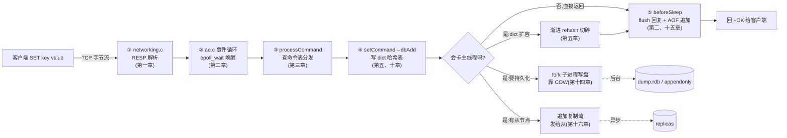

# 序章 · 为什么单线程的 Redis 这么快——以及,这不只是"快"的故事

> 主轴:这本书不打算给你一句口号、然后二十三章都往上贴。Redis 的设计是多元的,塞不进一条单一张力里。**本书要做的事很朴素:把 Redis 每一个设计决策讲清楚——它解决了什么问题、为什么是这样不是那样、换来了什么、付出了什么代价。** 读动机,也读精妙;既看它怎么快起来,也看它拿什么换的。

---

## 读完本系列你会明白

1. **单线程的 Redis 凭什么扛得住百万 QPS**——答案不是"它跑得快",而是它的瓶颈根本不在 CPU,而单线程恰恰让它免于锁与并发 bug 的拖累。
2. **"把耗时从主线程里解放出去"有哪五种姿势**——切碎摊还、外包给 fork 子进程、外包给后台线程、并行化纯 IO、塞进 `epoll_wait` 的睡眠缝隙。大半本书都在讲这五种姿势的具体化身。
3. **为什么 Redis 要为每种访问模式量身定制数据结构**——SDS、dict、listpack、quicklist、skiplist、rax,每一个都不是"通用最优",而是"为某种访问模式定制",这是"内存即数据库"的底色。
4. **编码自适应是怎么回事**——对外一套命令,底下多套实现,按数据规模自动切换,你毫无感知;listpack 长大了变 hashtable,小 zset 长大了变 skiplist。
5. **内存的"快"和"可靠"怎么同时攥在手里**——RDB/AOF 把状态落盘,主从把状态搬走,Cluster 把负载分摊;可靠不是天生的,是另一整套机制兜住的。

---

打开 Redis 的源码,最先撞上来的是一个反直觉的事实:这个撑得起百万 QPS、被全球基础设施当作缓存与队列中枢的服务,主线程只有一个。没有线程池抢锁,没有协程调度器,一条命令从进来到出去,在一个线程里走完全程。很多人听到这里,会问同一个问题——

**"单线程,凭什么还能这么快?"**

这是个好问题。但只盯着它,你会错过 Redis 真正值得读的地方。

## 0.1 一切始于一个 while 循环

Redis 启动到最后,主线程会调进 `aeMain`([ae.c:492](../../redis-8.0.2/src/ae.c#L492))——这是它真正"活着"的地方:

```c
/* ae.c:492-499 */
void aeMain(aeEventLoop *eventLoop) {
    eventLoop->stop = 0;
    while (!eventLoop->stop) {
        aeProcessEvents(eventLoop, AE_ALL_EVENTS|
                                   AE_CALL_BEFORE_SLEEP|
                                   AE_CALL_AFTER_SLEEP);
    }
}
```

就这么多。一个 `while` 循环,不停调 `aeProcessEvents`(处理一轮事件)。**整个服务器的脉搏,就是这个 while 循环转一圈的速度。** 一轮循环越短,Redis 越快。几万个客户端连接的所有读写、所有定时任务,全在这个单线程的循环里轮转。没有第二个线程在跑命令(8.0 的 IO 多线程只管读写和解析,命令执行仍在这个主线程里,第二十章细讲)。

这就是那个反直觉事实的全貌。那么问题来了——

## 0.2 快是结果:单线程为什么反而快

"快"不是 Redis 的设计目标,是它一路选择下来的结果。要理解单线程为什么反而快,得先看清 Redis 的瓶颈到底在哪。

### 瓶颈不在 CPU

Redis 的一条命令,本质是**内存访问 + 简单计算**:`GET` 是一次哈希表查找(几个纳秒),`SET` 是一次哈希表写入,`INCR` 是一次读-改-写。这些操作本身都是纳秒到几十纳秒级,CPU 根本跑不满。真正吃时间的是另外三件事:

1. **网络 IO**:从连接读字节、把回复写字节。一次 syscall + 数据拷贝,微秒级,比命令执行慢两个数量级。
2. **内存访问的 cache miss**:数据结构若指针跳来跳去(skiplist、链表),一次访问可能触发几次 cache miss,每次几十纳秒堆积起来很可观。
3. **偶发的大操作**:一次全量 rehash、删一个百万元素的大 key、fork 子进程、fsync 落盘——这些是毫秒到秒级,才是真正会"卡住"主线程的东西。

注意:前两件事(网络 IO、cache miss)是**每条命令都要付的固定成本**,而 CPU 执行命令本身几乎不花时间。这意味着——**多开几个线程跑命令,CPU 也吃不饱,省不下什么;反而引入一堆麻烦**。

### 多线程在这里得不偿失

最直观的"提速"想法是:多开几个线程,并行处理多个客户端的命令。这条路 Java 的传统网络编程走过(thread-per-connection),结果大家都知道了。它在 Redis 这个场景里不划算,原因有三:

> **不这样会怎样**:多线程并行执行命令,共享的数据结构(dict 哈希表、redisObject 对象)就要加锁。锁本身不贵,贵的是**锁竞争**——几个线程同时抢一把锁,失败的线程要挂起、切换、再唤醒,上下文切换是微秒级,比一次 dict 查找还贵。更要命的是,为了加锁得把 Redis 内部所有数据结构(全部是为"单线程无锁访问"设计的)改造成线程安全的,这是一次推倒重来。再加上并发 bug(死锁、竞态、内存可见性)——这些 bug 难复现、难调试,对一个长期跑在生产的内存数据库是致命的。

所以 Redis 的选择是:**主线程单线程串行执行命令,无锁、无竞争、行为可预测、好调试**。CPU 没吃满?没关系,瓶颈本来就不在 CPU。多核的利用,留给后面要讲的 fork 子进程、后台线程、IO 多线程——它们都不碰命令执行路径,不破坏单线程模型。

> **钉死这件事**:Redis 选单线程,不是"没能力多线程",是算清了账——它的瓶颈在网络 IO 和内存访问,不在 CPU;多线程并行执行命令带来的锁竞争和并发 bug,代价远大于那点 CPU 并行收益。单线程是把"无锁"这个最大红利拿到手,把多核利用用别的、不破坏单线程的方式补回来。

### 五种"把耗时从主线程解放"的姿势

单线程是底线,但"会卡住主线程的活"可不少:百万级 dict 的扩容、删大 key、持久化写盘、过期清理、碎片整理……这些要是全在主线程一次性干,主线程就废了。Redis 的全部精妙,在于它用**五种姿势**把这些活消化掉,既不破坏单线程,又不让它们卡住主线程:

1. **切碎,摊还进每次操作的缝隙里**——渐进式 rehash(第五章):百万级扩容拆成无数个 O(1) 小动作,夹在每次读写里;active expire 限时扫描(第十三章):每轮只占 CPU 的固定百分比;在线碎片整理(第十二章):每轮限时几百微秒。复杂度不消失,只是从一次尖峰摊成平原。
2. **外包给 fork 出来的子进程**——RDB 快照、AOF rewrite(第十四、十五章):靠操作系统的写时复制(COW),子进程慢慢写盘,主线程照常服务,还白捡一份一致快照。
3. **外包给后台线程(BIO)**——第十九章:异步 fsync、异步 close、异步释放大对象(lazyfree)。`DEL` 一个百万元素的 key,主线程只摘链表头,真正的释放丢给后台线程。
4. **并行化纯 IO(IO 多线程)**——第二十章:8.0 把网络读写和协议解析分发给 IO 线程并行,但**命令执行仍钉在主线程**。把网络耗时赶出主线程,把数据结构操作的纯粹留在主线程。
5. **塞进 `epoll_wait` 的睡眠缝隙**——第二章:`epoll_wait` 是必须阻塞的,Redis 在它睡前的最后一刻(beforesleep)和醒来的第一刻(aftersleep)塞进了足足 20 件事(刷 AOF、flush 回复、清过期、发复制心跳……),绝不浪费那段等待。

> **钉死这件事**:Redis 的单线程不是"什么都自己干所以慢",而是"命令执行单线程无锁,但所有会卡住的活都靠这五种姿势消化掉"——要么切碎摊还,要么外包给子进程/后台线程,要么并行化纯 IO,要么塞进睡眠缝隙。读懂这五种姿势,就读懂了大半本 Redis。

## 0.3 一张坐标系:Redis 反复在做的五件事

读下去之前,先给你一张地图。Redis 在各个模块里反复做的事,大致是这五条。读到任何一章,你都能把它放回这张图里看个究竟。这不是强制回扣的清单,是诚实的坐标系——哪条贴哪条,不强求一致。

**① 单线程 + 事件循环**。无锁、无并发 bug、行为可预测。撑起这套设计的,正是 0.2 节那五种"把耗时解放"的姿势——这是贯穿大半本书最显眼的一条线,但也只是五条里的一条,不再是独占主线。

**② 内存即数据库**。一切常驻内存;为每一种访问模式量身定制数据结构(SDS、dict、listpack、quicklist、skiplist、rax),用结构的精妙换 CPU 周期的节省。在 Redis 的世界里,内存就是真金白银,每个字节都要省着用——这也是为什么它的数据结构里到处是位运算编码、紧凑布局、柔性数组。

**③ 编码自适应**。对外给你一套命令,底下却有好几套实现,按数据的规模和形态自动切换。同一个 hash,数据少时是紧凑的 listpack(连续内存、缓存友好),长大了就变成 hashtable(查找 O(1));小 zset 是 listpack,大 zset 是 dict+skiplist。切换阈值写在 `config.c` 的默认值里,你毫无感知。

**④ 简单优先**。能用简单结构,就绝不上复杂的。skiplist 顶替红黑树(第八章),SDS 顶替 C++ string(第四章),连 LZF 压缩、自造 radix tree 都尽量不引第三方依赖。这不是图省事,是一种清醒的工程审美——**代码简单 = 少 bug = 好维护**,对一个长期单进程跑的内存数据库,这价值远超理论上的最优。

**⑤ 可靠性靠持久化 + 复制**。内存一掉电就什么都没了。于是 RDB 和 AOF 把状态落盘(第十四、十五章),主从复制把状态搬走(第十六章),Cluster 把负载分摊到多个节点(第十七章),Sentinel 在主挂了时选新主(第十八章)。内存的"快",和可靠性,在这里被另一整套机制兜住。

> **钉死这件事**:这五条不是铁律,是地图。有的章节主要落在第一条上(ae、lazyfree、IO 多线程),有的是第二条和第四条交织(dict、skiplist),有的四条都沾边(RDB 既是①的fork外包、又是⑤的可靠性)。每章讲完,我会诚实地说它落在哪条——不硬贴口号,不强求一致。

## 0.4 一条 SET 的旅程:全书地图

要把这五条线和二十一章串起来,最好的办法是跟着一条命令走一遍。你在客户端敲下 `SET key value`,到 Redis 把它存好、回一句 OK,中间发生了什么?



这条旅程几乎串起了大半本书:第一章讲字节怎么进来(RESP 协议、networking),第二章讲谁在盯着连接(ae 事件循环),第三章讲命令怎么被找到和执行(processCommand),第五章讲它落到哪张表(dict),第十章讲它作为一个 redisObject 的编码,第十四章/十五章讲它怎么被持久化,第十六章讲它怎么被复制到从节点。后面每一章,都是这条旅程某个环节的深挖。

> **钉死这件事**:一条 `SET` 从字节进来到回复出去,经过 networking → ae → processCommand → dict →(可能的 rehash/AOF/复制)→ beforeSleep flush 回复。记住这条主线,后面每一章都能找到自己的位置——它们不是孤立的技巧堆砌,而是这条旅程上某个环节的精雕细琢。

## 0.5 和那本 Tokio 是什么关系

如果你读过这套书里的《Tokio 设计与实现深入浅出》,会发现两本是天然的对仗。那本讲一个异步运行时,如何**把"等待"从线程的占用里解放出来**——一个线程上挂几万个 `.await` 任务,任务等 IO 时挂起、好了再恢复,线程从不空转。这本讲一个数据服务,如何**把"耗时"从主线程里解放出来**——而且不止于此,还要讲它怎么用数据结构、编码、简单性、持久化,把"快"和"可靠"同时攥在手里。

一本向内,讲运行时怎么调度等待;一本向外,讲服务端怎么搬运耗时。两本合起来,是从语言级异步到服务端架构的完整一条路。

## 0.6 源码版本与怎么读这本书

**源码版本**:本书基于 **Redis 8.0.2**(2025 年 GA,在这一版 Redis 重新回到了 BSD 开源许可)。所有引用的文件名、行号都来自这个版本。8.0 含全部现代内核:IO 多线程、kvstore 分片字典、keymeta(mstr)、memory_prefetch、listpack 全面取代 ziplist。建议你 `git clone --branch 8.0.2` 一份在手边,边读边对着源码看。

**每章的结构**:对标本系列《LevelDB 设计与实现深入浅出》的深度规格。每章大致是:章首"读完本章你会明白"(几条 why)→ 一句话点破 → 正文若干小节(每节"提出问题 → 不这样会怎样 → 所以这样设计 → **钉死这件事**")→ 技巧精解(核心技巧配反面对比 + 数学推导)→ 章末"五个为什么 + 往哪钻 + 引出下章"。源码行号引用密集(每章 15-40 处),核心处贴整段真实源码,引用前都经 Grep/Read 核实。

**验证物——这本书怎么说实话**:写一本源码精解,最大的诱惑是"贴一张跑出来的截图"显得有说服力。但本书作者的工作环境是 Windows,无法原生运行 redis-server(8.0 依赖 fork/epoll 等 Linux 特性)。与其贴一张无法溯源、可能是别处抄来的截图,不如给读者**能亲手复现的契约**。

所以本书每一章末尾都有一个"验证物"小节,固定三段:

1. **gdb 断点脚本**——关键函数断点 + 观察变量(比如讲 skiplist,给 `break zslInsert` + 观察 `rank[0]`、`update[i]->level[i].span` 的切分),对应真实源码行号,供你在 Linux 上 `make no-opt` 编译后复现。
2. **源码常量锚点表**——带行号的关键常量(如 `ZSKIPLIST_MAXLEVEL=32 @ server.h:576`),是你 grep 源码的导航图。
3. **OBJECT ENCODING 观察项**——需本地 redis-server 的观察方法,预期输出配**推导链**(不写"返回 skiplist",写"预期 skiplist,因 129 > 阈值 128,见 config.c")。

> **钉死这件事**:本书不附编造的运行输出,不写"实测得到 X"。凡是作者没实跑的,只给脚本、预期观察变量和推导依据,并诚实标注"本书 Windows 环境未实跑,供 Linux 复现"。你要的不是一张死截图,是一份你能亲手验证的契约——这套 gdb 断点 + 源码常量 + 推导链,正是本书的验证物。

## 0.7 从这里开始

那么,从最朴素的一个问题开始:一条 `SET key value`,从你在客户端敲下去,到 Redis 把它存好、回一句 OK,中间到底发生了什么?而这一切,发生在一个线程里。

这一切的第一步,是字节流怎么进来。下一章,我们从这条命令进门的那个瞬间——RESP 协议与 `networking.c`——讲起:客户端发来的字节,怎么被解析成一条命令,又怎么在解析的每一步都偷偷省下一点内存和拷贝。
