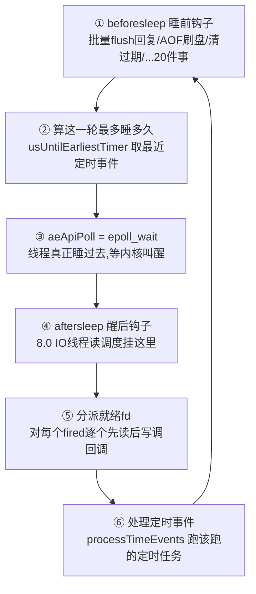

# 第二章 · ae:Redis 的心脏——单线程事件循环

> 篇:P1 命令的一生
> 主轴呼应:这一章是**取向①(单线程 + 事件循环)的根**。整套 Redis 就建立在"一个线程 + epoll + 一个 while 循环"之上。读完这章你会明白:Redis 凭什么用一条线程,同时照看几万个连接。

---

## 读完本章你会明白

1. **为什么 Redis 的主线程只有一个,却同时照看几万个连接**——答案不是"它跑得快",而是它把"等待"这件事整个交给了操作系统。
2. **为什么 Redis 选了 epoll 的水平触发(LT),而不是听起来更高级的边缘触发(ET)**——这背后是一个"宁可笨一点,也不能漏一个事件"的工程取舍。
3. **`epoll_wait` 是不得不阻塞的,那段等待时间 Redis 是怎么榨干的**——靠的是 `beforeSleep`/`afterSleep` 这对钩子,它们在睡前的最后一刻和醒来的第一刻塞进了 20 件事。
4. **定时任务为什么用一个看似很土的无序链表,而不是最小堆或时间轮**——以及 Redis 源码注释里那句"Redis 暂时不需要"透露的"拒绝过度设计"哲学。
5. **`AE_BARRIER` 这一个比特的标志位,凭什么能保证"回复了客户端就一定已经持久化"**——顺序的颠倒,换来语义的保证。

---

> **如果一读觉得太难:先只记住三件事**——
> ① Redis 主线程就是一个 `while (!stop)` 循环([ae.c:492](../../redis-8.0.2/src/ae.c#L492)),每一圈叫一轮事件循环;
> ② 每一轮它调 `epoll_wait` 睡一会,谁可读/可写了就醒来处理谁,处理完再睡;
> ③ 睡前它会把"批量写回复、刷 AOF、清过期 key"等一大堆活顺手干完,绝不浪费那段睡眠。
> 这三件事,就是 ae 的全部。

---

> **一句话点破:Redis 的事件循环,是用"一个线程 + 一次 `epoll_wait` + 一个 while 循环"这一套朴素到不能再朴素的机制,把"几万个连接的等待"整体外包给了内核;线程自己只做一件事——有事处理事,没事就睡,睡前顺手把能干的活全干了。**

第一章里我们反复看到 `connSetReadHandler(conn, readQueryFromClient)`、"数据可读就回调"。可是,**谁在盯着成千上万个连接、判断"哪个现在可读了"?又是谁,在恰当的时候把 `readQueryFromClient` 调起来的?** 答案就在这一章:`ae.c`。它是 Redis 的心脏。

## 2.1 这块要解决什么:几万个连接,一条线程怎么照看

想象你是 Redis 的主线程。你面前挂着几万个客户端连接,每个连接可能**随时**发来数据(可读),也可能随时可以接收回复(可写)。与此同时,你还有一堆**定时任务**要做:每隔一会清理过期的 key、更新统计、给集群里的其它节点发心跳、给从节点推复制流……

最笨的办法是:**每个连接配一个线程**去阻塞读。那几万个连接就要几万个线程。线程本身很贵(内核要给它分配栈、调度它、切换它),光是几万个线程互相抢锁、来回切换,就能把 CPU 吃光,真正干活的时间反而没多少。这条路 Java 的传统网络编程走过(thread-per-connection),结果大家都知道了——并发一上来就崩。

> **不这样会怎样**:线程数随连接数线性增长。1 万连接 = 1 万线程,每线程默认 MB 级栈 = GB 级内存;线程切换的代价随数量超线性上升;共享数据结构(dict、对象)要加锁,锁竞争进一步拖慢。这条路在几千并发就到顶了,撑不到 Redis 想要的"几万到几十万并发"。

所以 Redis 走了另一条路——**让操作系统帮我盯着所有连接**。Linux 内核提供了一个叫 `epoll` 的机制(术语叫 **I/O 多路复用**):你把所有想盯的连接扔给内核,然后调一次 `epoll_wait` **阻塞睡眠**;哪个连接有事(可读/可写)了,内核把你叫醒,告诉你"这几号连接有读事件、那几号有写事件"。你醒来逐个处理,处理完再去睡。

这就是 **reactor(反应堆)模式**:事件来了我才反应,没事件我就安静等着,绝不空转烧 CPU。Redis 的实现叫 `ae`(a event loop)。**一个线程,一个循环,搞定一切。**

> **钉死这件事**:ae 的本质不是"一个聪明的调度器",而是"把等待外包给内核"。线程自己几乎从不忙等——它要么在处理事件,要么在 `epoll_wait` 里睡着。这是单线程能撑高并发的物理前提。

## 2.2 数据结构:以 fd 为下标的事件表

事件循环的全部状态,都装在一个 `aeEventLoop` 结构体里([ae.h:79](../../redis-8.0.2/src/ae.h#L79))。先看它的全貌——这张表是后面所有动作的舞台:

```c
/* ae.h:79-93 */
typedef struct aeEventLoop {
    int maxfd;                    /* 当前注册的最大文件描述符              */
    int setsize;                  /* 最多能跟踪多少个 fd                  */
    long long timeEventNextId;    /* 下一个定时事件的 id                  */
    int nevents;                  /* events/fired 数组当前实际长度        */
    aeFileEvent *events;          /* 注册的事件,以 fd 为下标             */
    aeFiredEvent *fired;          /* 本轮 epoll 返回的就绪事件            */
    aeTimeEvent *timeEventHead;   /* 定时事件链表头                       */
    int stop;                     /* 主循环退出标志                       */
    void *apidata;                /* 多路复用后端的私有数据(epoll 用)    */
    aeBeforeSleepProc *beforesleep;  /* 睡前钩子                          */
    aeBeforeSleepProc *aftersleep;   /* 醒后钩子                          */
    int flags;
    void *privdata[2];
} aeEventLoop;
```

这张表里最关键的两块,是 `events` 和 `fired` 两个数组。先看每个槽位装什么。每个 `events[fd]` 是一个 `aeFileEvent`([ae.h:52](../../redis-8.0.2/src/ae.h#L52)):

```c
/* ae.h:52-57 */
typedef struct aeFileEvent {
    int mask;                 /* AE_READABLE / AE_WRITABLE / AE_BARRIER */
    aeFileProc *rfileProc;    /* 可读时调谁                            */
    aeFileProc *wfileProc;    /* 可写时调谁                            */
    void *clientData;         /* 附带数据(通常就是 client 指针)        */
} aeFileEvent;
```

这里藏着一个 Redis 最"偷懒"也最精妙的设计:**`events` 数组直接以文件描述符(fd)为下标**。fd 是什么?在 Linux 里,一个打开的连接就是一个非负小整数(0/1/2 是标准输入输出,之后每个新连接递增)。所以 `events[fd]` 一步就定位到"这个连接上注册了什么事件、回调是谁"——**O(1) 查找,无哈希、无搜索、无链表遍历**。

回忆第一章:`createClient` 里 `connSetReadHandler(conn, readQueryFromClient)`,最终走到 `aeCreateFileEvent`([ae.c:145](../../redis-8.0.2/src/ae.c#L145))。它干了两件事:

```c
/* ae.c:168-177 */
aeFileEvent *fe = &eventLoop->events[fd];
if (aeApiAddEvent(eventLoop, fd, mask) == -1) return AE_ERR;  /* 告诉 epoll 盯这个 fd */
fe->mask |= mask;
if (mask & AE_READABLE) fe->rfileProc = proc;   /* 记下:可读时调 readQueryFromClient */
if (mask & AE_WRITABLE) fe->wfileProc = proc;
fe->clientData = clientData;
if (fd > eventLoop->maxfd) eventLoop->maxfd = fd;  /* 顺手更新最大 fd */
```

所以"注册"就是:**告诉 epoll"帮我盯这个 fd 的可读"**(走 `aeApiAddEvent` → `epoll_ctl`),再**在 `events[fd]` 里记下"可读时调 `readQueryFromClient`"**。epoll 负责"盯",`events` 数组负责"记"。

那 `fired` 数组干什么用?它是 `aeApiPoll`(也就是 `epoll_wait`)的**返回值容器**。内核不会给你返回一个临时对象列表让你再分配内存去装——它直接把就绪结果写进你预分配好的 `fired` 数组:

```c
/* ae_epoll.c:107-108 —— 内核返回的就绪事件,直接落进预分配的 fired 数组 */
eventLoop->fired[j].fd = e->data.fd;
eventLoop->fired[j].mask = mask;
```

主循环醒来后,直接 `for (j = 0; j < numevents; j++)` 遍历 `fired[j]`,一步 `fe = &eventLoop->events[fired[j].fd]`([ae.c:411](../../redis-8.0.2/src/ae.c#L411))就拿到回调。**整个事件分派路径上,没有一次 `malloc`/`free`**——这在每秒几万到几十万次事件循环的负载下,是支撑吞吐的隐形前提。

> **钉死这件事**:`events` 用 fd 当下标,把"找回调"压成一次数组访问;`fired` 用预分配缓冲承接 `epoll_wait` 的返回,让事件分派零分配。这两处"利用 fd 是连续小整数这个事实偷懒"的写法,是 ae 能扛高并发的两个常数因子优化。

把这两个数组画出来,就是 ae 的舞台:

```text
aeEventLoop
┌─────────────────────────────────────────────────────────────┐
│ maxfd = 7   setsize = 1024   timeEventHead ──→ [定时事件链表] │
│                                                              │
│  events[]  (以 fd 为下标)          fired[]  (epoll_wait 写入) │
│  ┌───┬───┬───┬───┬───┬───┬───┬───┐  ┌───┬───┬───┐           │
│  │ 0 │ 1 │ 2 │ 3 │ 4 │ 5 │ 6 │ 7 │  │fd │fd │fd │ numevents=3│
│  └───┴───┴───┴───┴───┴───┴───┴───┘  │=5 │=3 │=7 │            │
│   监听 │   │   │   │   │   │   │    │R  │RW │ W │            │
│   sock │   │   │   │   │   │   │    └───┴───┴───┘            │
│         client client  client client                         │
│  fe->rfileProc = readQueryFromClient   醒来:逐个 events[fd]  │
│  fe->wfileProc = ...                   拿回调,先读后写       │
└─────────────────────────────────────────────────────────────┘
```

## 2.3 主循环 aeMain 与一轮 aeProcessEvents

整个 Redis 启动到最后,会调进 `aeMain`([ae.c:492](../../redis-8.0.2/src/ae.c#L492))——这是它真正开始"活着"的地方:

```c
/* ae.c:492-499 */
void aeMain(aeEventLoop *eventLoop) {
    eventLoop->stop = 0;
    while (!eventLoop->stop) {
        aeProcessEvents(eventLoop, AE_ALL_EVENTS|
                                   AE_CALL_BEFORE_SLEEP|
                                   AE_CALL_AFTER_SLEEP);
    }
}
```

就这么多。一个 `while` 循环,不停调 `aeProcessEvents`。Redis 的"一生",就是在这个循环里一轮又一轮地转,直到收到关闭信号(`stop=1`)。**整个服务器的脉搏,就是这个 while 循环转一圈的速度**——一轮循环越短,Redis 越快。

`aeProcessEvents`([ae.c:360](../../redis-8.0.2/src/ae.c#L360))是一轮循环的全部。把它拆成六步:



**① 睡前先干活(beforesleep)。** 这是 Redis 最聪明的设计之一:

```c
/* ae.c:377-378 */
if (eventLoop->beforesleep != NULL && (flags & AE_CALL_BEFORE_SLEEP))
    eventLoop->beforesleep(eventLoop);
```

`aeApiPoll`(也就是 `epoll_wait`)马上要让线程**阻塞睡眠**了。Redis 的思路是:**与其干等着,不如在"睡下去之前"把能干的活全干了。** `beforesleep` 钩子([server.c:1717](../../redis-8.0.2/src/server.c#L1717))里塞进了足足 20 件事(详见 2.5 节)。把本会浪费在 `epoll_wait` 等待里的时间,变成有用的处理时间。注意一个细节:ae 在 beforesleep 调用**之后**还会重新检查 `eventLoop->flags`([ae.c:380-384](../../redis-8.0.2/src/ae.c#L380))——因为 beforesleep 里面可能改了 flags(比如把循环设成"别等了"),这个重检保证 beforesleep 的副作用生效。

**② 算这一轮最多睡多久。** 如果有定时任务马上要到点了,`epoll_wait` 就不能睡太久,免得错过:

```c
/* ae.c:388-394 */
} else if (flags & AE_TIME_EVENTS) {
    usUntilTimer = usUntilEarliestTimer(eventLoop);
    if (usUntilTimer >= 0) {
        tv.tv_sec = usUntilTimer / 1000000;
        tv.tv_usec = usUntilTimer % 1000000;
        tvp = &tv;
    }
}
```

算出"离最近的定时事件还有多少微秒",把它当作 `epoll_wait` 的超时。这样既能在没事件时省 CPU(真睡),又绝不会错过定时任务。

**③ `aeApiPoll`:真正阻塞等待。**

```c
/* ae.c:398 */
numevents = aeApiPoll(eventLoop, tvp);
```

这一行在 Linux 上就是 `epoll_wait`([ae_epoll.c:89](../../redis-8.0.2/src/ae_epoll.c#L89))。线程在这里**真的睡过去**,直到某个 fd 就绪或超时。醒来时 `numevents` 告诉你"有几个 fd 有事了",具体哪些在 `fired` 数组里。

**④ 醒来回调(aftersleep)。**

```c
/* ae.c:406-407 */
if (eventLoop->aftersleep != NULL && flags & AE_CALL_AFTER_SLEEP)
    eventLoop->aftersleep(eventLoop);
```

8.0 里 IO 线程的"读取调度"就挂在这里([server.c:1895](../../redis-8.0.2/src/server.c#L1895) 的 `afterSleep`)——刚从 `epoll_wait` 醒来,顺手把就绪连接的读任务分发给 IO 线程(详见第二十章)。

**⑤ 分派就绪的 fd。** 对每个就绪 fd,按"先读后写"的顺序调回调([ae.c:409-461](../../redis-8.0.2/src/ae.c#L409)):

```c
/* ae.c:434-446,精简 */
if (!invert && fe->mask & mask & AE_READABLE) {
    fe->rfileProc(eventLoop,fd,fe->clientData,mask);   /* 先处理读 */
    fired++;
    fe = &eventLoop->events[fd]; /* Refresh in case of resize. */
}
if (fe->mask & mask & AE_WRITABLE) {
    if (!fired || fe->wfileProc != fe->rfileProc)
        fe->wfileProc(eventLoop,fd,fe->clientData,mask);   /* 再处理写 */
    fired++;
}
```

"先读后写"是有讲究的:先读完客户端的命令、执行完,紧接着就能在这个 fd 上把回复写出去,**一条连接一轮循环就处理完了一个完整的请求—回复**。注意 `fe = &eventLoop->events[fd]` 在读回调后**重新取了一次**([ae.c:437](../../redis-8.0.2/src/ae.c#L437))——因为读回调里可能触发了 `events` 数组的 `zrealloc` 扩容(见 `aeCreateFileEvent` 的扩容分支 [ae.c:155-166](../../redis-8.0.2/src/ae.c#L155)),旧指针会失效,必须刷新。这是一个"回调可能改变容器本身"的防守性细节。

**⑥ 处理定时事件。**

```c
/* ae.c:464-465 */
if (flags & AE_TIME_EVENTS)
    processed += processTimeEvents(eventLoop);
```

最后,跑该跑的定时任务——其中最重要的就是 `serverCron`(默认每秒跑 10 次,即 `server.hz=10`),它负责过期 key 清理、淘汰、统计、集群心跳等等。这些"慢活"如何做到不拖慢主循环,是第三、五篇的故事,这里先按下不表。

> **钉死这件事**:一轮事件循环的六步,本质是"睡前的最后冲刺(beforesleep)→ 算睡眠时长 → 睡 → 醒来的第一刻(aftersleep)→ 处理就绪连接 → 处理定时任务"。每一步的位置都不是随便排的——beforesleep 必须在 poll 前(否则白等),aftersleep 必须紧跟 poll 后(趁 IO 线程还没动),定时任务放最后(它们最不急)。

## 2.4 技巧精解①:epoll LT,不是 ET——为什么 Redis 选"笨"的那条路

这是 ae 里最常被问、却最容易被答错的一个取舍。`epoll` 有两种触发模式:

- **水平触发(Level Triggered, LT)**:只要 fd 上**还有**未读数据(或还可持续写),每次 `epoll_wait` 都会把它返回给你。你不读完,它会一直提醒你。
- **边缘触发(Edge Triggered, ET)**:只在 fd 状态**发生跳变**的那一刻(从无数据到有数据)通知你一次。你这次没读完,下次 `epoll_wait` 不会再提醒你——你得自己保证"一次性读到 `EAGAIN`"。

教科书上常说 ET"效率更高"(因为内核不用每次都检查 fd 状态、少进几次 syscall),所以很多高性能网络框架(Nginx、libuv)都用 ET。**但 Redis 偏偏用了 LT。** 看 `aeApiAddEvent` 的源码([ae_epoll.c:54](../../redis-8.0.2/src/ae_epoll.c#L54)):

```c
/* ae_epoll.c:62-67 */
ee.events = 0;
mask |= eventLoop->events[fd].mask; /* Merge old events */
if (mask & AE_READABLE) ee.events |= EPOLLIN;
if (mask & AE_WRITABLE) ee.events |= EPOLLOUT;
ee.data.fd = fd;
if (epoll_ctl(state->epfd,op,fd,&ee) == -1) return -1;
```

注意这段代码里**自始至终没有出现 `EPOLLET`**。`ee.events` 只拼了 `EPOLLIN` 和 `EPOLLOUT`——这是 LT 模式的默认行为(不加 `EPOLLET` 就是 LT)。Redis 全程水平触发。

为什么?要害在一个词:**容错**。Redis 是单线程 reactor,一个线程串行处理所有就绪 fd。考虑这样一个场景:一个客户端一次发来 100KB 的命令,但 socket 的读缓冲区只有 64KB。LT 模式下,`readQueryFromClient` 这次读了 64KB(没读完),下一次 `epoll_wait` 会**再次**把这个 fd 作为可读返回——Redis 自然会在下一轮循环继续读剩下的 36KB。逻辑简单、绝不会漏。

> **不这样会怎样(ET 的反面)**:如果用 ET,这个 fd 在"有数据到达"时被通知一次。`readQueryFromClient` 读了 64KB 就返回了(它不知道后面还有 36KB),没读到 `EAGAIN`。这时 socket 里还剩 36KB,但 ET 模式下 `epoll_wait` **不会再提醒你了**——除非客户端再发新数据触发一次跳变。结果就是这 36KB 被无限期"卡"在内核缓冲区里,这个连接看起来活着,却永远等不到完整命令。这就是 ET 的"漏读饿死"风险。要用 ET 不翻车,`readQueryFromClient` 必须**在一个循环里读到 `EAGAIN`** 为止,而且读到一半如果自己的 `querybuf` 暂时处理不过来,还得自己 `EPOLL_CTL_MOD` 重新武装这个 fd、记下"这个 fd 还有数据没读完下次继续"——整套逻辑复杂得多,bug 也多得多。

LT 的代价是什么?是"可能多进几次 `epoll_wait`/`read` syscall"。但这个代价在 Redis 的场景下**几乎可以忽略**:Redis 的命令绝大多数都很短(几十字节到几 KB),一次就读完了,根本触发不到"没读完"的二次唤醒;即便触发,多一次空转的 `read` 也只是几十纳秒。相比之下,ET 那套"必须循环读到 EAGAIN + 手动重武装"的复杂度和 bug 风险,才是真正的成本。

> **钉死这件事**:Redis 选 LT 不是不知道 ET 更"高级",而是算清了账——单线程 reactor 下,LT 的"笨"(多几次 syscall)是无害的常数,而 ET 的"聪明"(一次性读完 + 手动重武装)是复杂的、易错的、一旦漏读就饿死连接的。**宁可笨一点,也不能漏一个事件**——这是 ae 最核心的取舍,也是它简单可靠的根基。

再算一笔小账,把"LT 多几次 syscall"这个代价量化掉。假设一个连接持续有大量数据涌入(最坏情况),LT 模式下它每轮循环被唤醒一次、读一次;ET 模式下它在一次唤醒里循环读到 `EAGAIN`(可能多次 `read`)。两种模式总的 `read` 次数其实**差不多**(都要读完那批数据),差别只在 `epoll_wait` 的返回次数:LT 可能把这个 fd 多返回几轮。但每多一轮 `epoll_wait` 返回,Redis 多做的是"取回调 + 调一次 `read`"——O(1) 的常数工作。在命令普遍很短的真实负载下,这个差别淹没在噪声里。**LT 用一个可忽略的常数代价,换来了"绝不漏事件"的强保证。**

## 2.5 技巧精解②:beforesleep/aftersleep——把 epoll_wait 的等待时间榨干

`epoll_wait` 是**必须阻塞**的——不阻塞就要忙等烧 CPU,这违背了 reactor "没事就睡"的初衷。但"阻塞等待"这件事本身,看起来是纯粹的浪费时间:线程睡在那里,什么都不干。

Redis 的处理极度偏执:**既然必须睡,那就在"睡前的最后一刻"和"醒来的第一刻"把活塞进去,把这段本会空转的时间榨干。** 这就是 `beforesleep` 和 `aftersleep` 这对钩子存在的理由。

先看 `beforeSleep`([server.c:1717](../../redis-8.0.2/src/server.c#L1717))——它不是"顺手 flush 一下回复"那么简单,它是一个**20 步的 mini 事件循环**,在每次 `epoll_wait` 前雷打不动地跑一遍:

| 步 | beforeSleep 干的事 | 源码位置 | 为什么要放在"睡前" |
|---|---|---|---|
| 1 | 记录内存峰值 `stat_peak_memory` | server.c:1720 | 趁睡前采样,不影响命令路径 |
| 2 | 处理 TLS 等连接的 pending 数据 `connTypeProcessPendingData` | server.c:1749 | poll 前把已有数据捞上来 |
| 3 | 判断 `dont_sleep`(是否还有 pending 数据) | server.c:1752 | 决定这轮 poll 要不要真的睡 |
| 4 | 集群睡前处理 `clusterBeforeSleep`(cluster 模式) | server.c:1758 | 同步集群状态后再服务 |
| 5 | 处理阻塞客户端 `blockedBeforeSleep` | server.c:1763 | **必须在 flushAOF 前**(唤醒的客户端可能要写) |
| 6 | 快速过期清理 `activeExpireCycle(FAST)`(主节点) | server.c:1772 | 趁空闲清一把过期 key |
| 7 | 触发模块 BEFORE_SLEEP 事件 | server.c:1776 | 给模块介入点 |
| 8 | 给从节点发 ACK 请求(WAIT 命令) | server.c:1790 | 复制延迟确认 |
| 9 | 更新故障转移状态 `updateFailoverStatus` | server.c:1798 | 哨兵/副本状态机 |
| 10 | 广播客户端缓存失效消息 `trackingBroadcastInvalidationMessages` | server.c:1808 | client-side caching |
| 11 | **AOF 刷盘 `flushAppendOnlyFile`** | server.c:1820 | **必须在写回复前**(保证回复了就落盘) |
| 12 | 更新 fsync 偏移、唤醒 WAIT AOF 客户端 | server.c:1829 | AOF 持久化进度推进 |
| 13 | **把回复写给客户端 `handleClientsWithPendingWrites`** | server.c:1841 | 睡前把积攒的回复 flush 出去 |
| 14 | 分发待写客户端给 IO 线程 `sendPendingClientsToIOThreads` | server.c:1844 | 8.0 IO 多线程 |
| 15 | 异步关闭该关的客户端 `freeClientsInAsyncFreeQueue` | server.c:1850 | 懒回收 |
| 16 | 裁剪复制 backlog(10 倍速) | server.c:1854 | 趁空闲回收复制缓冲 |
| 17 | 驱逐超内存的客户端 `evictClients` | server.c:1858 | 客户端内存治理 |
| 18 | 统计事件循环耗时 | server.c:1864 | 性能监控 |
| 19 | 设置下一轮是否 `aeSetDontWait` | server.c:1881 | 若有 pending 则下轮别睡 |
| 20 | 释放模块 GIL | server.c:1886 | 睡着时让模块线程能跑 |

这张表里有两条**顺序约束**极其关键,直接体现了"为什么这些事必须挤在 beforesleep 里、且顺序不能乱":

**约束一:`flushAppendOnlyFile`(步 11)必须在 `handleClientsWithPendingWrites`(步 13)之前。** 注释 [server.c:1817-1819](../../redis-8.0.2/src/server.c#L1817) 明说:"must be done before handleClientsWithPendingWrites ... in case of appendfsync=always"。为什么?因为当 `appendfsync=always` 时,Redis 要保证"**回复了客户端,就一定已经持久化**"。如果先写回复再刷 AOF,可能出现"客户端收到 OK 了、但 AOF 还没落盘就崩了"的不一致。先刷 AOF,再回回复,这条因果链才牢靠。这和后面 2.7 节的 `AE_BARRIER` 是同一个语义的两种实现手段。

**约束二:`blockedBeforeSleep`(步 5)必须在 `flushAppendOnlyFile`(步 11)之前。** 因为被唤醒的阻塞客户端(比如 BLPOP 拿到了元素)会触发写操作,这些写必须赶在本轮 AOF 刷盘之前进入 AOF 缓冲,否则这一轮的持久化就漏了它们。

`afterSleep`([server.c:1895](../../redis-8.0.2/src/server.c#L1895))则短得多,主要干三件:**重新获取模块 GIL**(睡着时放掉,醒来要拿回来,否则模块线程会和主线程抢数据)、**记录事件循环起始时间**(`el_start`,用于耗时统计)、**更新时间缓存**(`updateCachedTime`,Redis 为省 `gettimeofday` 系统调用,把当前时间缓存起来,每轮循环刷新一次)。8.0 还在这里挂了"把就绪连接的读任务分发给 IO 线程"——这是第二十章的主线。

> **不这样会怎样**:如果不用 beforesleep/aftersleep 这对钩子,而是把这些活散落在各命令处理函数里,会怎样?第一,**顺序约束无法保证**——你没法在"命令执行中间"强行插入"先刷 AOF 再回回复";第二,**每条命令都要重复做这些活**——比如过期清理、回复 flush,本该攒一批做一次,散落开就变成每命令一次,开销翻几番;第三,**`epoll_wait` 的等待时间被白白浪费**——线程睡几毫秒,这几毫秒本可以清几十个过期 key、flush 一批回复。

> **钉死这件事**:beforesleep 是一个"在必须阻塞的睡眠前后,见缝插针塞进 20 件维护活"的设计。它把 `epoll_wait` 的等待时间从"纯浪费"变成"有用的批处理窗口",并且用严格的步骤顺序(AOF 先于回复、唤醒先于 AOF)守住了一致性语义。这是取向①"把耗时从主线程解放"的一个精妙变体——**不能外包给别的线程的活(刷盘、清过期、flush 回复),就塞进事件循环的睡眠缝隙里,让主线程感觉不到这件大事。**

## 2.6 定时事件:无序链表与"拒绝过度设计"

ae 的定时事件(`aeTimeEvent`)用什么数据结构组织?最小堆?时间轮?跳表?——都不是。**是一条无序双向链表**,挂在 `eventLoop->timeEventHead`([ae.h:86](../../redis-8.0.2/src/ae.h#L86))。每个 `aeTimeEvent` 带 `when`(到期时刻)、`timeProc`(回调)、`prev`/`next` 指针([ae.h:60-70](../../redis-8.0.2/src/ae.h#L60))。

每一轮循环要算"离最近的定时事件还有多久"时,ae 是**遍历整条链表**找最小的 `when`——`usUntilEarliestTimer`([ae.c:263](../../redis-8.0.2/src/ae.c#L263)):

```c
/* ae.c:263-276 */
static int64_t usUntilEarliestTimer(aeEventLoop *eventLoop) {
    aeTimeEvent *te = eventLoop->timeEventHead;
    if (te == NULL) return -1;
    aeTimeEvent *earliest = NULL;
    while (te) {
        if ((!earliest || te->when < earliest->when) && te->id != AE_DELETED_EVENT_ID)
            earliest = te;
        te = te->next;
    }
    monotime now = getMonotonicUs();
    return (now >= earliest->when) ? 0 : earliest->when - now;
}
```

这是 **O(N)** 的——N 是定时事件个数。教科书会立刻跳出来说:这应该用最小堆啊,O(1) 取最近、O(log N) 插入删除,不比链表强?

最绝的是,ae 的作者在源码注释里**自己把这个疑问问了出来,然后自己回答了**([ae.c:254-262](../../redis-8.0.2/src/ae.c#L254)):

```c
/* ae.c:254-262 原注释 */
/* How many microseconds until the first timer should fire.
 * If there are no timers, -1 is returned.
 *
 * Note that's O(N) since time events are unsorted.
 * Possible optimizations (not needed by Redis so far, but...):
 * 1) Insert the event in order, so that the nearest is just the head.
 *    Much better but still insertion or deletion of timers is O(N).
 * 2) Use a skiplist to have this operation as O(1) and insertion as O(log(N)).
 */
```

翻译过来:**"这个操作是 O(N),因为定时事件没排序。可能的优化(Redis 暂时还用不上,不过……):① 按序插入,最近的就在表头——好很多,但插入删除还是 O(N);② 用跳表,取最近 O(1)、插入 O(log N)。"**

这段注释是 Redis"拒绝过度设计"哲学的活标本。作者完全知道最小堆/跳表更"优",但他算了一笔账:Redis 运行时的定时事件**极少**——核心就一个 `serverCron`,外加偶尔几个模块定时器、阻塞命令的超时计时器。N 通常是个位数,撑死十几个。N=10 的时候,O(N) 遍历是 10 次比较,而最小堆的 O(log N) 取最近是 ~3 次比较 + 维护堆的额外代码 + 堆的内存开销。**省下来的那几次比较,根本抵不过多写一堆堆维护代码带来的复杂度和 bug 风险。** 数据结构不是越"高级"越好,而是要看 N 的实际规模。

> **钉死这件事**:ae 用无序链表存定时事件,是主动选择"在 N 很小时,O(N) 的常数项比 O(log N) 的代码复杂度更划算"。源码注释那句"not needed by Redis so far"——Redis 暂时不需要——是整套 Redis 设计气质(取向④ 简单优先)在事件循环层的一次诚实自白:**只在 N 真的变大时才升级数据结构,在此之前,简单就是最优解。**

## 2.7 AE_BARRIER:让"写"抢到"读"前面

回到 2.3 节的分派逻辑,我们说默认是"先读后写"。但有一个标志位能让它**反过来——先写后读**,那就是 `AE_BARRIER`([ae.h:24](../../redis-8.0.2/src/ae.h#L24))。看分派代码里这一行:

```c
/* ae.c:426 */
int invert = fe->mask & AE_BARRIER;
```

`AE_BARRIER` 的语义,源码注释([ae.h:24-28](../../redis-8.0.2/src/ae.h#L24))写得非常清楚:"With WRITABLE, never fire the event if the READABLE event already fired in the same event loop iteration. Useful when you want to persist things to disk before sending replies, and want to do that in a group fashion."

什么时候需要这个?考虑一个 fd **同时**可读又可写(客户端既发来新命令,又能收回复)。默认先读:读完新命令、执行、生成回复,再写回复出去——一轮搞定,效率最高。但有个场景会出问题:某个连接的处理逻辑要求"**必须先把该落盘的落盘,再回复客户端**"(典型是 AOF `appendfsync=always` 的场景)。如果先读(执行了新命令、可能改了数据),再写(回回复),中间没有给"刷盘"留位置——回复出去了,但落盘还没做,崩溃就不一致。

设了 `AE_BARRIER` 后,分派变成:先执行**写回调**(在这个回调里把回复写出去,而写回调之前 beforesleep 已经刷过 AOF 了),再执行**读回调**(处理新命令)。这样保证了"回复时数据已落盘"。注意 `aeDeleteFileEvent` 里有一个细节([ae.c:187-189](../../redis-8.0.2/src/ae.c#L187)):删除 `AE_WRITABLE` 时会连带删掉 `AE_BARRIER`——因为 BARRIER 是依附于 WRITABLE 的,写事件没了,反转也就没意义了,留着是脏状态。

> **钉死这件事**:`AE_BARRIER` 用一个 mask 比特位(`fe->mask & AE_BARRIER`),换来"写回调先于读回调"的顺序保证。它不是性能优化,而是**一致性语义的补丁**——在"回复即已持久"这种强语义要求的连接上,颠倒一次读写顺序,堵住"回复了却没落盘"的窗口。

## 2.8 两阶段删除:AE_DELETED_EVENT_ID 与 refcount

最后一个技巧,藏在定时事件的删除路径里。删一个定时事件,ae 不是立刻 `zfree`,而是**先打个标记**,下一轮才真删——`aeDeleteTimeEvent`([ae.c:241](../../redis-8.0.2/src/ae.c#L241)):

```c
/* ae.c:245-247 */
if (te->id == id) {
    te->id = AE_DELETED_EVENT_ID;   /* 标记为待删除,但不立刻 free */
    return AE_OK;
}
```

`AE_DELETED_EVENT_ID = -1`([ae.h:38](../../redis-8.0.2/src/ae.h#L38))。为什么要分两步?因为定时事件的回调 `timeProc` 可能在执行过程中**递归地操作定时事件列表**(比如自己删自己、或删别的定时器)。如果 `aeDeleteTimeEvent` 当场 `zfree` 掉节点,而此刻外层 `processTimeEvents`([ae.c:279](../../redis-8.0.2/src/ae.c#L279))正拿着这个节点的 `next` 指针在遍历,就会用到已释放内存——use-after-free。

所以 ae 的做法是:**删除只打标记,真正的摘链和释放推迟到 `processTimeEvents` 的下一轮扫描**([ae.c:291-313](../../redis-8.0.2/src/ae.c#L291))。在那里,遍历到 `id == AE_DELETED_EVENT_ID` 的节点才摘掉它、调 `finalizerProc`、`zfree`。

但这还不够——还有一层"递归调用"的坑。`processTimeEvents` 在调 `timeProc` 前会 `te->refcount++`,调完 `te->refcount--`([ae.c:329-331](../../redis-8.0.2/src/ae.c#L329))。如果 `timeProc` 内部递归触发了对这个定时器的删除(打上 `AE_DELETED_EVENT_ID`),到了摘链那一步会发现 `te->refcount` 还非零([ae.c:296](../../redis-8.0.2/src/ae.c#L296))——这时**不释放,只跳过**,等 refcount 归零(递归返回)后再由后续轮次释放。`aeTimeEvent.refcount` 的注释([ae.h:68-69](../../redis-8.0.2/src/ae.h#L68))直白:"refcount to prevent timer events from being freed in recursive time event calls"。

> **钉死这件事**:定时事件的删除用"标记 + 延迟摘链 + 引用计数"三件套,是经典的**两阶段删除**模式——在可能被递归访问的数据结构上,绝不就地释放,而是先标记、后回收。这套手法我们在第五章 dict 的 `dictTwoPhaseUnlinkFind`、第十九章 lazyfree 的异步释放里会反复看到它的变体,它是"安全删除"的通用范式。

## 章末:回扣、五个为什么、往哪钻

### 主线回扣

这一章是**取向①(单线程 + 事件循环)的根基**。ae 用"一个线程 + epoll + 一个 while 循环"这套朴素机制,撑起了几万并发连接。没有线程池,没有协程调度器,没有锁——简单到不可思议,但它就是 work。但请注意一个精妙的平衡:`epoll_wait` 是**必须阻塞**的(否则 CPU 空转),而这个阻塞本身就是一种"等待"。Redis 的处理分两手:**能外包给别的线程/fork 子进程的(fork 做 RDB/AOF、BIO 后台线程、IO 多线程),坚决外包**;**实在外包不了的(刷盘、清过期、flush 回复),就塞进 `epoll_wait` 前后的 beforesleep/aftersleep 缝隙里**。ae 同时是这两手的交汇点——它既是"单线程"的化身,又是"把耗时解放"这条主线的调度中枢。

### 五个为什么

**Q1:为什么 ae 不用多线程 reactor?**
Redis 的瓶颈从来不是 CPU(命令执行快得很),而是网络 IO 和内存访问。多线程在这里收益有限,代价却很大:共享数据结构(dict、对象)要加锁,锁竞争和上下文切换反而拖慢速度,还引入一堆并发 bug。一个线程、无锁、行为可预测、好调试——这是取向① + 取向④ 的联手。多核利用留给后来的 IO 线程和后台线程。

**Q2:LT 模式下,如果一个 fd 的数据一直读不完,会不会死循环?**
不会死循环,但这个 fd 会在连续多轮循环里被 `epoll_wait` 反复返回。每一轮 Redis 读一批、处理一批,直到读完。由于单线程串行,这期间其他 fd 会排队等待——这正是 Redis 对"大 key/大命令"敏感的根因(一个大命令霸占主线程,其他连接延迟飙升)。这是 LT 的固有代价,但 Redis 宁可接受它,也不要 ET 的漏读风险。

**Q3:beforesleep 里塞了 20 件事,会不会让"睡前"变得很慢、拖慢事件循环?**
会有一部分开销,但这些活本来就是**必须做的**(清过期、刷盘、flush 回复),塞在 beforesleep 里只是把它们**批量化、集中化**——比散落在每条命令里做一次要省得多。而且其中耗时最长的 AOF fsync,在 `appendfsync=everysec` 时是下放给 BIO 后台线程的(第十五章/第十九章),主线程在 beforesleep 里只做 `write` 不做 `fsync`。真正会拖慢的是 `appendfsync=always`——这也是为什么 always 模式慢,生产基本不用。

**Q4:定时事件用链表,O(N) 找最近,N 会不会很大?**
正常情况下 N 是个位数(核心就一个 serverCron)。只有在模块大量使用定时器、或有大量阻塞命令带超时的极端场景,N 才可能上来。这时可以按注释里的方案升级成跳表——但 Redis 至今没这么做,因为现实里没人把 Redis 当定时器调度器用。**为不存在的规模提前优化,是过度设计。**

**Q5:ae 这套机制,和 Tokio 那种异步运行时有什么本质区别?**
ae 是**语言无关、内核驱动**的 reactor:epoll 是 Linux 内核给的,ae 只是个薄封装,线程在 `epoll_wait` 里真睡。Tokio 是**语言级、用户态调度**的异步运行时:它用 epoll/io_uring 收事件,但 `.await` 的"等待"是靠 Rust 的 async/await 状态机在用户态挂起任务、零成本切换,一个线程能挂几万个 task 且切换无系统调用。ae 的"等待"是线程级阻塞(一个线程一次只能等一组 fd),Tokio 的"等待"是任务级挂起。这是"操作系统给你的事件循环" vs "语言自己造的事件循环"的根本分野——也是为什么 Redis 一个线程够用(它的"等待"都在 IO 上),而 Tokio 要造一套复杂的调度器(它要处理任意 `.await` 点的挂起/恢复)。本系列《Tokio 设计与实现》那本书是它的对照面。

### 想继续深入往哪钻

- 想看 IO 多路复用在不同平台的差异:读 `ae_epoll.c`(Linux)、`ae_kqueue.c`(Mac/BSD)、`ae_evport.c`(Solaris)、`ae_select.c`(fallback)——它们都实现同一组 `aeApi*` 接口,ae.c 靠编译期选择后端。注意 8.0 还没上 io_uring。
- 想看 `serverCron` 到底干了哪些定时活:读 [server.c](../../redis-8.0.2/src/server.c) 里 `serverCron` 函数(它在 `aeCreateTimeEvent` 注册,周期 = 1000/server.hz 毫秒)。
- 想理解 8.0 IO 多线程怎么和 ae 协作:读 [networking.c](../../redis-8.0.2/src/networking.c) 的 `handleClientsWithPendingReadsUsingThreads`,以及 `afterSleep` 里挂的读分发——这是第二十章的主线。
- 想对比"语言级异步运行时"怎么解同一道题:看本系列《Tokio 设计与实现深入浅出》的时间轮与 work-stealing 调度章节。

### 引出下一章

至此你已经看清 Redis 的骨架:一个事件循环,`epoll` 盯着所有连接,谁可读就回调 `readQueryFromClient` 解析出命令。那么命令解析出来之后,是怎么被找到、被执行、怎么从字节流变成一次数据库改动的?下一章,我们走进 `server.c` 的 `processCommand`,看一条命令"执行"这最后一公里——这也是"命令的一生"的终点。我们会看到命令表怎么组织、函数指针怎么分发、一条 `SET` 从进来到落库到底走了哪几步。

---

## 验证物:如何亲手确认本章的设计

> 说明:本书写作环境为 Windows,无法直接运行 redis-server(8.0 依赖 fork/epoll 等 Linux 特性)。以下 (1) gdb 断点脚本 (2) 源码常量锚点 (3) epoll 行为观察项 均为可复现的精确指引,供读者在 Linux 环境(Ubuntu 22.04 / CentOS 8 等)对 redis-8.0.2 源码 `make no-opt`(Makefile 里 no-opt 目标会去掉 -O2 加 -g)编译后自行验证。**本书不附编造的运行输出**——凡未实跑的,只给脚本与预期观察变量,不写具体数值。

### 1. gdb 断点脚本

编译:`cd redis-8.0.2 && make no-opt`(带 -g)
启动:`gdb ./src/redis-server`

```gdb
(gdb) break aeMain              # 主循环入口,ae.c:492
(gdb) break aeProcessEvents     # 一轮循环,ae.c:360
(gdb) break aeApiPoll           # epoll_wait 封装,ae_epoll.c:89
(gdb) break beforeSleep         # 睡前钩子,server.c:1717
(gdb) break afterSleep          # 醒后钩子,server.c:1895
(gdb) break ae.c:426            # int invert = fe->mask & AE_BARRIER
(gdb) run --port 6379

# 另开终端 redis-cli 发一条 SET foo bar,gdb 会在 aeProcessEvents 停下:
(gdb) print eventLoop->maxfd          # 预期:当前注册的最大 fd(监听 sock + 已连接 client)
(gdb) print eventLoop->fired[0].fd    # 预期:本轮就绪的 fd
(gdb) print eventLoop->fired[0].mask  # 预期:1(AE_READABLE)/2(AE_WRITABLE)/3(两者)
(gdb) print eventLoop->nevents        # 预期:events/fired 数组当前长度
(gdb) continue                        # 单步走完一轮,观察"先读后写"分派

# 验证 beforesleep 的步骤顺序(在 flushAppendOnlyFile 与 handleClientsWithPendingWrites 之间):
(gdb) break flushAppendOnlyFile       # server.c 调用于 beforeSleep 步 11
(gdb) break handleClientsWithPendingWrites  # 步 13
(gdb) continue                        # 预期:先命中 flushAppendOnlyFile,后命中 handleClientsWithPendingWrites
```

**预期观察**(基于源码 [ae.c:409-461](../../redis-8.0.2/src/ae.c#L409) 的分派逻辑,本书未实跑):普通连接 `invert` 恒为 0(`AE_BARRIER` 未设),走"先读后写";只有 AOF `appendfsync=always` 下的特定连接才会 `invert=1`。

### 2. 源码常量锚点(带行号,从 redis-8.0.2 源码 Grep 核实)

| 常量/字段 | 位置 | 值/说明 |
|----------|------|---------|
| `AE_READABLE` | ae.h:22 | 1 |
| `AE_WRITABLE` | ae.h:23 | 2 |
| `AE_BARRIER` | ae.h:24 | 4(反转读写顺序) |
| `AE_DELETED_EVENT_ID` | ae.h:38 | -1(定时事件待删除标记) |
| `aeEventLoop` 结构体 | ae.h:79-93 | maxfd/setsize/events/fired/timeEventHead/beforesleep/aftersleep |
| `aeFileEvent` 结构体 | ae.h:52-57 | mask/rfileProc/wfileProc/clientData |
| `aeApiAddEvent`(无 EPOLLET) | ae_epoll.c:54-69 | 证实 LT 模式 |
| `usUntilEarliestTimer`(O(N) 注释) | ae.c:254-262 | "time events are unsorted... not needed by Redis so far" |
| `aeMain` | ae.c:492 | `while (!stop) aeProcessEvents(...)` |
| `beforeSleep` | server.c:1717 | 睡前 20 步 mini 事件循环 |

### 3. epoll 行为观察项(需本地 redis-server,本 章 不涉及 OBJECT ENCODING)

> 本章不涉及数据结构编码切换,改附 epoll 行为观察。以下操作需在 Linux 本地启动 redis-server 后进行。本书未实跑,仅列观察方法。

```bash
# 用 strace 观察 redis-server 的 epoll_wait 调用(证实 LT 的"有数据就反复唤醒"):
strace -f -e epoll_wait,epoll_ctl -p <redis-server-pid>

# 另开终端,用 redis-cli 发一个大命令(如 1MB value 的 SET):
redis-cli -h 127.0.0.1 -p 6379 SET bigkey $(head -c 1048576 /dev/urandom | base64)

# 预期(基于 LT 模式 + 命令大于 socket 读缓冲):strace 输出里 epoll_wait 会对
# 同一个 fd 连续多次返回 EPOLLIN(每次 read 一部分),直到读完整条命令。
# 这正是 2.4 节"LT 容错"的活证据——若是 ET,只会唤醒一次。
```

标注:以上预期基于 LT 触发模式([ae_epoll.c:62-66](../../redis-8.0.2/src/ae_epoll.c#L62) 无 `EPOLLET`)与 Linux socket 缓冲区行为推导,本书未在本地实跑;若你的内核版本/socket 缓冲区大小不同,连续唤醒次数可能不同,但"LT 会反复唤醒直到读完"这一行为不变。
