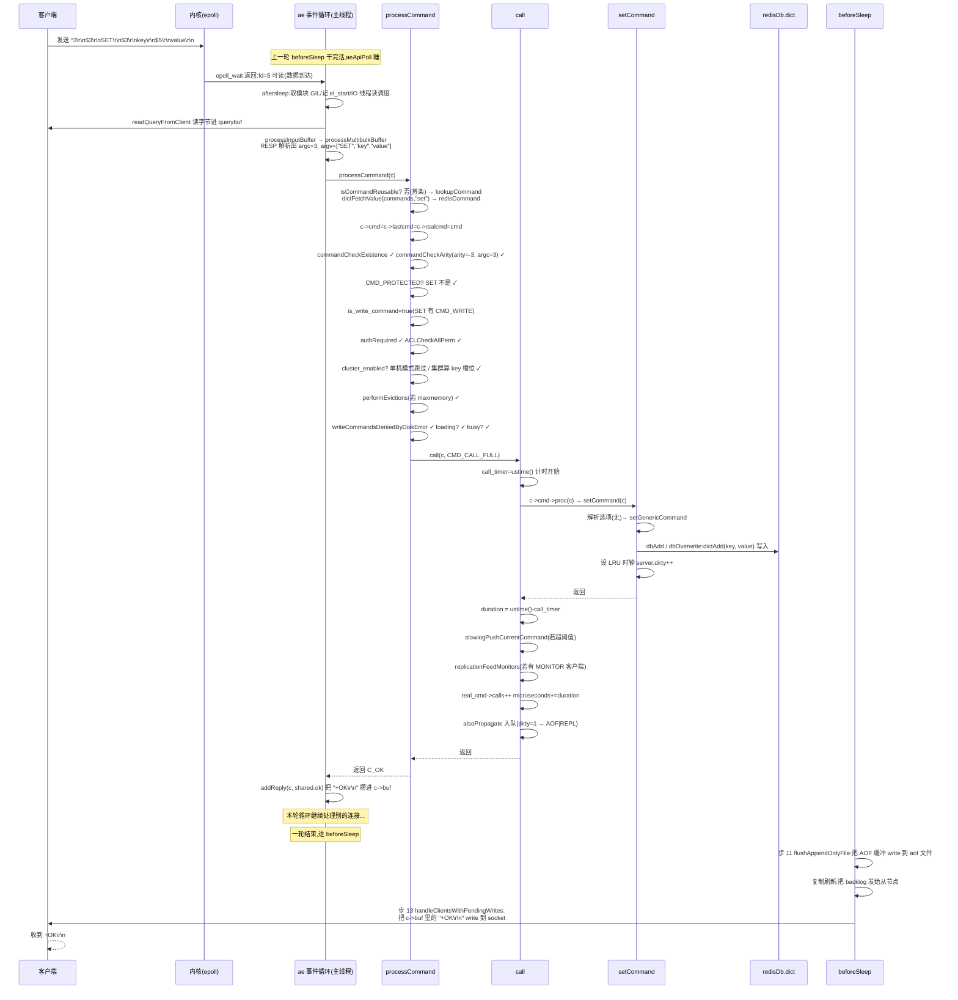

# 第三章 · processCommand:一条命令的执行旅程

> 篇:P1 命令的一生(终章)
> 主轴呼应:这一章落在**取向①(单线程、无锁执行)** 和**取向④(简单优先——用最朴素的函数指针 + 一个命令名字典,而非复杂框架,分派 200+ 命令)** 上。读完这章,一条命令"进门 → 心跳 → 执行"的一生就完整闭环了。

---

前两章我们把命令生命的两头讲完了:第一章里字节流进了门,被 RESP 协议啃成 `argc/argv`;第二章里 `ae` 事件循环用 `epoll_wait` 把"哪个连接可读了"调度起来,回调 `readQueryFromClient`,把字节读进 `querybuf`,再调到 `processInputBuffer` 把 `argc/argv` 准备好。

可那串 `argv[0]`,比如字符串 `"SET"`,是怎么找到它对应的 C 函数 `setCommand` 的?找到之后,谁来挡住"未认证""参数个数不对""内存爆了""集群里这个 key 不归我管"这些横在每条命令前头的规矩?最后,命令执行完那一瞬,又是谁把"这次改了哪些数据"的信号递给 AOF 和复制链路的?

这一章,我们走完一条命令生命的最后一公里——执行。这一公里,全部压在 `server.c` 里两个函数上:`processCommand`(执行前的层层关卡)和 `call`(真正执行那一行 + 收尾)。把这两个函数拆透,Redis 主线程每一轮循环的"执行"环节就再也没有黑箱。

## 读完本章你会明白

1. **Redis 是怎么用"一个字典 + 一个函数指针"分派 200+ 条命令的**——C 没有面向对象的多态,没有反射,但函数指针就够。这套机制简单到让人觉得"这不就是 switch-case 嘛",但它扛起了 Redis 的全部命令分派。
2. **`c->cmd`、`c->realcmd`、`c->lastcmd` 这三个字段长得像,凭什么要分三个**——它们对应"当前要执行的""真正执行的""上一条执行的"三种语义,在 `GEORADIUS` 改写成 `GEOSEARCH`、`MULTI/EXEC` 嵌套、命令复用 fast-path 这些场景下,它们的值会分道扬镳。
3. **`isCommandReusable` 这个微优化凭什么值得写进源码**——同客户端连发同命令,省一次字典查找。一次查找省不下几纳秒,乘上百万 QPS 就是真的吞吐。
4. **`processCommand` 为什么把认证、ACL、集群路由、`maxmemory` 淘汰、权限、`loading` 拒绝、`pubsub` 上下文检查……全部前置到一起**——职责分离:这些跨命令的通用检查集中把关,命令实现(如 `setCommand`)就能心无旁骛只写业务逻辑。
5. **命令的 `flags`(一个 64 位整数)怎么用几个比特位影响集群路由、淘汰、监控、`loading` 拒绝**——`CMD_WRITE`/`CMD_READONLY`/`CMD_DENYOOM`/`CMD_PROTECTED`/`CMD_LOADING`/`CMD_STALE` 这些 bit 不是装饰,每个 bit 都是一道关卡的开关。
6. **为什么"执行"是同步立刻生效的,而"AOF 落盘 + 复制到从节点"却是异步传播的**——这一刀切下去,主线程只背"执行"这一小段,把"持久化和复制"的耗时甩到了子进程 / 后台线程 / 网络。这是 P4(AOF/RDB)、P5(复制)两章的地基。
7. **子命令(如 `CONFIG GET`、`COMMAND INFO`)是怎么用 `subcommands_dict` 套在父命令里的**——Redis 8.0 的命令表不是扁平一张字典,容器命令有第二层字典。
8. **一条 `SET key value` 从字节到 `+OK\r\n` 出门,完整的 8 步旅程**——把前两章和本章串成一条线,这就是"一条命令的一生",也是本系列《数据库内核:从一条 SQL 说起》的姊妹叙事结构。

---

> **如果一读觉得太难:先只记住三件事**——
> ① 命令表 = `server.commands` 字典,键是命令名(小写 sds),值是 `redisCommand` 结构体,最关键字段是 `proc`(函数指针);
> ② `processCommand` 是执行前的层层关卡,把所有"跨命令的通用检查"集中在它里头;关卡全过才调 `call(c)`;
> ③ `call` 最核心就一行 `c->cmd->proc(c)`——一次函数指针调用,这就是 Redis 200+ 命令分派的全部执行机制。
> 这三件事,就是 `processCommand` + `call` 的全部。

---

> **一句话点破:Redis 把 200+ 条命令的执行,浓缩成"一次 O(1) 字典查找 + 一次函数指针调用";所有跨命令的通用规矩(认证、权限、集群、内存、loading)前置到 `processCommand` 统一把关,命令实现因此心无旁骛只写业务——这是取向①(单线程无锁执行)+ 取向④(简单优先)在命令执行层的一次联手落地。**

## 3.1 这块要解决什么:200+ 命令,怎么用一个机制分派

Redis 有两百多条命令:`SET`/`GET`/`LPUSH`/`ZADD`/`SUBSCRIBE`/`HSET`/`XADD`/`CLUSTER NODES`……每条的逻辑都天差地别(`SET` 改字符串、`ZADD` 维护 skiplist、`SUBSCRIBE` 维护订阅链表)。可它们都得经过同一条主干:拿到 `argv[0]`(命令名),找到对应实现,执行,收尾。

一个自然的问题:**怎么用一个统一的机制,把"输入命令名 → 找到对应 C 函数 → 执行"这件事做得既通用又快?**

最笨的办法是 `if-else` 或 `switch-case` 串起来两百多个分支。这条路的痛点显而易见:① 每次分派要线性扫一遍名字比较,最坏 O(N);② 加一条命令就要改这个巨大的 switch,扩展性极差;③ 命令名大小写、子命令、动态注册(模块)全都没法干净地塞进 switch。

C 语言没有面向对象的多态(没有虚函数表),也没有运行时反射(不能拿一个字符串名去找函数)。但 C 有**函数指针**。Redis 的答案简单到让人觉得"这不就是理所当然嘛":**把所有命令装进一个字典(以命令名为键),每个命令挂一个函数指针;来一条命令,查字典拿到函数指针,直接调用。**

> **不这样会怎样(switch-case 的反面)**:假设用 `if (strcasecmp(argv[0],"set")==0) setCommand(c); else if (strcasecmp(argv[0],"get")==0) ...` 串两百个分支。第一,最坏要 200 次字符串比较,每次 `strcasecmp` 是 O(字符串长度);分派成本随命令数线性增长,百万 QPS 下完全不可接受。第二,加命令要改这个巨型函数,模块动态注册命令根本塞不进来。第三,命令表是静态写死的,无法在运行时 `COMMAND` 命令枚举、无法 `CONFIG` 重命名。把命令表做成 dict,这三个问题一次全解:O(1) 查找、运行时增删、可枚举可改写。

这就是 `server.commands`——一个 `dict`,键是命令名(sds 小写字符串),值是 `redisCommand` 结构体指针。整个 Redis 的命令分派,就建立在这一个字典上。字典本身怎么做 O(1) 是第五章的事,这里你先把它当一个"超快的 map"用。

## 3.2 数据结构:redisCommand 与命令表

先看每个命令在表里长什么样。`redisCommand` 结构体定义在 [server.h:2509](../../redis-8.0.2/src/server.h#L2509),它分两块:**声明数据**(启动时从 `commands.def` 表填一次,基本不变)和**运行时数据**(执行中累计)。我们先关心和"分派执行"直接相关的几个字段。

```c
/* server.h:2509-2560,精简到与执行分派相关的字段 */
struct redisCommand {
    /* —— 声明数据(启动时从 commands.def 填) —— */
    redisCommandProc *proc;       /* 函数指针,这条命令的实现 @2524            */
    int arity;                    /* 参数个数约束,正数=精确,负数=至少 @2525  */
    uint64_t flags;               /* CMD_WRITE/CMD_READONLY/... 一堆 bit @2526 */
    keySpec *key_specs;           /* 哪些 argv 位置是 key(集群路由要)@2528  */
    int key_specs_num;
    struct redisCommand *subcommands; /* 子命令数组(如 CONFIG)@2535         */

    /* —— 运行时数据(执行中累计) —— */
    long long microseconds, calls, rejected_calls, failed_calls; /* @2544 */
    sds fullname;                 /* "config|get" 这种含子命令的全名 @2550    */
    dict *subcommands_dict;       /* 子命令字典,@2556                        */
    struct redisCommand *parent;  /* 父命令(自己是子命令时)@2558            */
};
```

最关键的就两个字段:**`proc`** 和 **`flags`**。

- **`proc`**:函数指针,类型是 `redisCommandProc`([server.h:3796](../../redis-8.0.2/src/server.h#L3796) 附近的 typedef),签名是 `void proc(client *c)`——每条命令的实现都是"给我一个 client,我办完事"。`SET` 的 `proc` 是 `setCommand`([t_string.c:276](../../redis-8.0.2/src/t_string.c#L276)),`GET` 的是 `getCommand`([t_string.c:318](../../redis-8.0.2/src/t_string.c#L318)),`ZADD` 的是 `zaddCommand`,以此类推。`call(c)` 里那一行 `c->cmd->proc(c)`,就是顺着这个指针跳进对应实现。
- **`flags`**:64 位整数,每位一个 `CMD_*` 标志([server.h:200-229](../../redis-8.0.2/src/server.h#L200))。这套标志位是后面所有前置检查的"开关",`processCommand` 不停地 `cmd->flags & CMD_XXX` 来决定要不要拦这条命令。

把 `redisCommand` 画出来,看看一个 `SET` 命令在表里占多大、长啥样:

```text
struct redisCommand  (以 SET 为例)
┌──────────────────────────────────────────────────────────────────┐
│ 声明区(启动时填好,基本不动)                                    │
│   declared_name  "set"                                           │
│   summary        "Set the string value of a key"                 │
│   proc           ──→ setCommand (函数指针,t_string.c:276)        │
│   arity          -3   (SET key value [EX|PX|...] 至少 3 个参数)  │
│   flags          CMD_WRITE(1<<0) | CMD_DENYOOM(1<<2) |           │
│                 CMD_FAST(1<<14)  → 0x4005                        │
│   key_specs[0]   {start=1, step=1, ...}  ← argv[1] 是 key        │
│   subcommands    NULL  (SET 不是容器命令)                        │
├──────────────────────────────────────────────────────────────────┤
│ 运行时区(随执行累积)                                            │
│   fullname       "set"                                           │
│   microseconds   0 → 累计  (INFO commandstats 的分子)            │
│   calls          0 → 累计  (INFO commandstats 的分母)            │
│   rejected_calls 0 → 累计  (被前置检查挡下的次数)                │
│   failed_calls   0 → 累计  (执行时失败的次数)                    │
│   subcommands_dict NULL                                           │
│   parent         NULL                                             │
└──────────────────────────────────────────────────────────────────┘
```

注意 `arity=-3` 那个负号。Redis 的 arity 约定:**正数表示精确等于 N 个参数(含命令名),负数表示至少 |N| 个参数**。`GET` 是 `arity=2`(必须恰好 `GET key`),`SET` 是 `arity=-3`(至少 `SET key value`,可带 `EX/NX/XX` 等可选参数)。`commandCheckArity` 会按这个符号判定。

再看 `flags`——这是命令的"基因"。把所有和执行分派相关的 `CMD_*` 标志列一张表,每个 bit 对应一道关卡:

| 标志位 | 位置 | 值 | 影响 `processCommand` 的哪道关卡 |
|--------|------|-----|---------------------------------|
| `CMD_WRITE` | server.h:200 | 1<<0 | 从节点拒绝写;集群路由;`maxmemory` 淘汰;`CMD_DENYOOM` 配套 |
| `CMD_READONLY` | server.h:201 | 1<<1 | 只读命令,从节点可执行;客户端缓存追踪 |
| `CMD_DENYOOM` | server.h:202 | 1<<2 | 内存爆了时拒绝(写命令子集) |
| `CMD_MODULE` | server.h:203 | 1<<3 | 模块命令,传播由模块自己管 |
| `CMD_ADMIN` | server.h:204 | 1<<4 | 不发给 MONITOR 客户端 |
| `CMD_PUBSUB` | server.h:205 | 1<<5 | RESP2 下 Pub/Sub 上下文限制 |
| `CMD_LOADING` | server.h:208 | 1<<9 | loading 期间允许执行 |
| `CMD_STALE` | server.h:209 | 1<<10 | 从节点断主期间允许执行 |
| `CMD_SKIP_MONITOR` | server.h:210 | 1<<11 | 不转发给 MONITOR 客户端 |
| `CMD_SKIP_SLOWLOG` | server.h:211 | 1<<12 | 不记慢日志 |
| `CMD_FAST` | server.h:213 | 1<<14 | 快命令(执行应在亚毫秒级) |
| `CMD_NO_AUTH` | server.h:214 | 1<<15 | 未认证也允许(AUTH/HELLO/QUIT) |
| `CMD_MAY_REPLICATE` | server.h:215 | 1<<16 | 可能触发复制 |
| `CMD_PROTECTED` | server.h:219 | 1<<20 | 受保护命令(DEBUG/MODULE),需配置开启 |
| `CMD_NO_ASYNC_LOADING` | server.h:222 | 1<<23 | 异步加载期间拒绝 |
| `CMD_NO_MULTI` | server.h:223 | 1<<24 | MULTI/EXEC 内禁止 |
| `CMD_MOVABLE_KEYS` | server.h:224 | 1<<25 | key 位置不固定,集群路由需 `getkeys_proc` |
| `CMD_ALLOW_BUSY` | server.h:226 | 1<<26 | 脚本/模块忙时仍允许 |
| `CMD_INTERNAL` | server.h:229 | 1<<29 | 内部命令,外部连接看不到 |

> **钉死这件事**:`redisCommand.flags` 是一个 64 位整数,每一位是一个 `CMD_*` 开关。`processCommand` 的每一道前置关卡,本质都是"看这个命令的 flags 第 X 位是 0 还是 1"。这是 Redis 把命令"属性"压进一个整数、用位运算 O(1) 判断的设计——没有任何属性表查找、没有任何字符串比较,只是一个 `&`。200+ 命令各自的"脾气"全靠这个 uint64 描述。

再看子命令机制。Redis 8.0 的命令表不是扁平一张字典,而是分两层:**顶层是 `server.commands` 字典;某些"容器命令"(如 `CONFIG`、`COMMAND`、`CLUSTER`、`XGROUP`)的 `redisCommand` 里,`subcommands_dict` 字段又挂着第二层字典**,键是子命令名(如 `"get"`/`"set"`/`"rewrite"`),值是子命令自己的 `redisCommand`。

```c
/* server.c:3261-3265,判断是不是容器命令 */
int isContainerCommandBySds(sds s) {
    struct redisCommand *base_cmd = dictFetchValue(server.commands, s);
    int has_subcommands = base_cmd && base_cmd->subcommands_dict;
    return has_subcommands;
}
```

为什么搞子命令?第一,把相关的一组命令(如 `CONFIG GET/SET/RESETSTAT/REWRITE`)归类到一个名字空间下,`COMMAND INFO CONFIG` 能一次拿到全部;第二,ACL 权限管理可以按容器整组授权或拒绝;第三,客户端文档生成、`COMMAND DOCS` 都按容器组织。子命令在 `lookupCommandLogic` 里被透明地解析:

```c
/* server.c:3279-3293,精简 */
struct redisCommand *lookupCommandLogic(dict *commands, robj **argv, int argc, int strict) {
    struct redisCommand *base_cmd = dictFetchValue(commands, argv[0]->ptr);
    int has_subcommands = base_cmd && base_cmd->subcommands_dict;
    if (argc == 1 || !has_subcommands) {
        return base_cmd;                              /* 普通命令,直接返回 */
    } else { /* argc > 1 && has_subcommands */
        return lookupSubcommand(base_cmd, argv[1]->ptr);  /* 进第二层字典查 */
    }
}
```

`argc==1`(只传 `CONFIG`)或不是容器命令,直接返回 `base_cmd`(注意 `base_cmd->proc` 可能是 NULL——`CONFIG` 自己没有实现,只是个壳);否则进 `lookupSubcommand` → `dictFetchValue(container->subcommands_dict, argv[1]->ptr)`([server.c:3267-3269](../../redis-8.0.2/src/server.c#L3267)),拿真正的子命令结构体。**两层字典,两次 O(1) 查找,搞定 `CONFIG GET maxclients` 这种复合命令。**

> **钉死这件事**:子命令机制是"两层 dict 嵌套":顶层查到容器命令(如 `CONFIG`),如果它有 `subcommands_dict` 且客户端多传了一个参数,就进第二层 dict 查子命令(如 `get`)。容器命令自己的 `proc` 通常为 NULL——它只负责"归类、授权、文档",不执行任何业务。这是 Redis 命令表的二级索引。

## 3.3 processCommand:执行前的层层关卡

拿到 `argc/argv` 后,`processInputBuffer` 会调到 `processCommand`([server.c:3985](../../redis-8.0.2/src/server.c#L3985))。这是"命令的一生"里最长、最关键的函数——它**不上来就执行**,而是先过一道道关卡。所有横在每条命令前头的通用规矩,全压在这里。我们按源码顺序,一层层拆。

### 第一关:找到命令(复用 fast-path)

`processCommand` 一开始(在认证之前)要先知道"这条命令是谁":

```c
/* server.c:4014-4049,精简 */
if (!client_reprocessing_command) {
    struct redisCommand *cmd = NULL;
    if (isCommandReusable(c->lastcmd, c->argv[0]))
        cmd = c->lastcmd;                                 /* server.c:4021-4022 */
    else
        cmd = c->iolookedcmd ? c->iolookedcmd : lookupCommand(c->argv, c->argc);  /* @4024 */
    /* ...安全检查、CMD_INTERNAL 检查... */
    c->cmd = c->lastcmd = c->realcmd = cmd;              /* server.c:4039 */
    if (!commandCheckExistence(c, &err)) { ... }         /* server.c:4041 */
    if (!commandCheckArity(c, &err)) { ... }             /* server.c:4045 */
    if (c->cmd->flags & CMD_PROTECTED) { ... }           /* server.c:4052 */
}
```

这里有三个值得展开的点。

**第一,`isCommandReusable` 是一个"小而美"的 fast-path。** 看它定义([server.c:97-101](../../redis-8.0.2/src/server.c#L97)):

```c
/* server.c:97-101 */
static inline int isCommandReusable(struct redisCommand *cmd, robj *commandArg) {
    return cmd != NULL &&
           cmd->subcommands_dict == NULL &&
           strcasecmp(cmd->fullname, commandArg->ptr) == 0;
}
```

逻辑:**如果上一条命令存在(`c->lastcmd != NULL`)、它不是容器命令(没有 `subcommands_dict`)、且它的名字和这次的 `argv[0]` 大小写无关相等,就直接复用 `c->lastcmd`,连 `dictFetchValue` 都省了。** 这个场景在 Redis 里非常普遍——pipeline 模式下一个客户端连发 100 个 `GET key1`/`GET key2`/...,或者批处理脚本里循环 `SET`,都是同命令名连发。

省一次字典查找值多少?dict 的 O(1) 查找约几十纳秒(算 hash + 桶内比较 + sds 比较),百万 QPS 下每秒省下 100 万次查找 ≈ 几十毫秒——是的,真金白银。**这是取向④(简单优先)的另一个变体:用三行 `inline` 函数换百万 QPS 的吞吐,而不是造一个"命令缓存框架"。**

> **钉死这件事**:`isCommandReusable` 是"同客户端连发同命令"的 fast-path——三个条件(上一条存在 + 不是容器 + 名字相等)全满足,就复用 `c->lastcmd`,跳过 `dictFetchValue`。它压榨的是"同一个 client 反复发同一条命令"这种 Redis 真实负载里极常见的模式。一个 `inline` 三元判断换百万 QPS 下几十毫秒/秒,这是 Redis 满地都是的"锱铢必较"。

**第二,`c->iolookedcmd` 是 IO 线程预热。** 8.0 的 IO 多线程在读取阶段已经 `lookupCommand` 过一次了(为了给主线程省事),结果挂在 `c->iolookedcmd` 上。主线程走到这里发现已经有了,直接拿来用。这是 IO 线程和主线程协作的一个细节(详见第二十章)。

**第三,三个字段 `c->cmd` / `c->realcmd` / `c->lastcmd` 一次性赋值**([server.c:4039](../../redis-8.0.2/src/server.c#L4039))。这一行看着普通,但三个字段语义不同,值得专门一节讲透——下一节(3.4)展开。

### 第二关:存在性、arity、PROTECTED

找到命令后,立刻过三个基础关卡:

```c
/* server.c:4041-4048 */
if (!commandCheckExistence(c, &err)) { rejectCommandSds(c, err); return C_OK; }
if (!commandCheckArity(c, &err))     { rejectCommandSds(c, err); return C_OK; }

/* server.c:4052-4064,CMD_PROTECTED */
if (c->cmd->flags & CMD_PROTECTED) {
    if ((c->cmd->proc == debugCommand && !allowProtectedAction(server.enable_debug_cmd, c)) ||
        (c->cmd->proc == moduleCommand && !allowProtectedAction(server.enable_module_cmd, c)))
    { rejectCommandFormat(c, ...); return C_OK; }
}
```

- **`commandCheckExistence`**([server.c:3914](../../redis-8.0.2/src/server.c#L3914)):如果 `c->cmd == NULL`(字典查不到),返回 0。`rejectCommandSds` 回一个 `-ERR unknown command`。注意它还有一个友好分支:如果 `argv[0]` 本身是个容器命令(如 `CONFIG`),说明用户想用子命令但写错了(如 `CONFIG FAKE`),它会提示"用法:CONFIG GET|SET|..."。

- **`commandCheckArity`**([server.c:3946](../../redis-8.0.2/src/server.c#L3946)):按 `arity` 符号判定。正数:`arity != argc` 拒绝(`GET` 要求 argc=2,`GET a b` 拒)。负数:`argc < -arity` 拒绝(`SET` arity=-3,要求 argc≥3,`SET k` 拒)。错误消息会用 `c->cmd->fullname` 带上命令全名,这是为什么子命令报错能精准说"command 'config|get'"。

- **`CMD_PROTECTED`**([server.c:4052](../../redis-8.0.2/src/server.c#L4052)):`DEBUG` 和 `MODULE` 这两条命令默认对外不可用,需要 `enable-debug-command yes`/`enable-module-command yes` 显式开启(或 `local` 仅本机)。这是 7.0 加的"安全加固"——旧版 DEBUG SLEEP 这种命令任何人都能敲,新版默认锁死。`allowProtectedAction` 还会判断连接是不是本机的(配 `local` 策略),这就是为什么 SSH 隧道里的 redis-cli 也算"本机"。

> **钉死这件事**:存在性 + arity + PROTECTED 三道关卡在 [server.c:4041-4064](../../redis-8.0.2/src/server.c#L4041) 这一小段里集中处理。它们都是"命令本身能不能用"的基础判断,和具体业务无关、和集群/复制/内存都无关。先过这三道,才谈得上后面的"上下文是否允许执行"。

### 第三关:命令属性判定(is_read/is_write/is_denyoom/...)

过了基础关卡,`processCommand` 算出一组"这条命令是不是只读/写/内存敏感/..."的布尔标记,这些标记在后面的集群路由、从节点拒绝写、OOM 拒绝等关卡里反复用:

```c
/* server.c:4067-4082 */
const uint64_t cmd_flags = getCommandFlags(c);

int is_read_command = (cmd_flags & CMD_READONLY) ||
                       (c->cmd->proc == execCommand && (c->mstate.cmd_flags & CMD_READONLY));
int is_write_command = (cmd_flags & CMD_WRITE) ||
                       (c->cmd->proc == execCommand && (c->mstate.cmd_flags & CMD_WRITE));
int is_denyoom_command = (cmd_flags & CMD_DENYOOM) || ...;
int is_denystale_command = !(cmd_flags & CMD_STALE) || ...;
int is_denyloading_command = !(cmd_flags & CMD_LOADING) || ...;
int is_may_replicate_command = (cmd_flags & (CMD_WRITE | CMD_MAY_REPLICATE)) || ...;
int is_deny_async_loading_command = (cmd_flags & CMD_NO_ASYNC_LOADING) || ...;
```

注意每个 `is_xxx` 都有一个 `|| (c->cmd->proc == execCommand && (c->mstate.cmd_flags & ...))` 的分支——这是 **`MULTI/EXEC` 的特殊处理**。`EXEC` 本身不是读写命令,但它内部要顺序执行队列里的事务命令,那些命令的读写属性汇总在 `c->mstate.cmd_flags`。所以判断"这条 EXEC 是不是写"要看事务队列里有没有写命令。这是命令嵌套的一种体现。

还要注意两个取反的:`is_denystale_command` 用 `!(cmd_flags & CMD_STALE)`——意思是"命令没有 STALE 标志就拒绝"。`CMD_STALE` 是"从节点断主期间仍允许执行"的标志(INFO/REPLICAOF 这种不依赖主节点数据的命令有)。反过来,大部分命令没这个标志,断主期间一律拒。`is_denyloading_command` 同理:`CMD_LOADING` 标志的命令(如 INFO/PING)loading 期间允许,没有这个标志的命令 loading 期间拒绝。

> **钉死这件事**:`is_read_command` / `is_write_command` / `is_denyoom_command` 这一组布尔标记,是"这条命令的属性"在 `processCommand` 里的物化。它们来源全是 `cmd->flags` 的位运算——一个 `&` 操作就能判断"这是不是写命令""内存爆了要不要拒"。这一组标记后面被集群路由、从节点拒绝写、OOM 拒绝、loading 拒绝、stale 拒绝等关卡反复使用。MULTI/EXEC 的特殊分支(`c->mstate.cmd_flags`)揭示了"命令嵌套时属性怎么汇总"。

### 第四关:认证、MULTI、ACL

```c
/* server.c:4085-4109 */
if (authRequired(c)) {
    if (!(c->cmd->flags & CMD_NO_AUTH)) {
        rejectCommand(c,shared.noautherr);
        return C_OK;
    }
}

if (c->flags & CLIENT_MULTI && c->cmd->flags & CMD_NO_MULTI) {
    rejectCommandFormat(c,"Command not allowed inside a transaction");
    return C_OK;
}

int acl_retval = ACLCheckAllPerm(c,&acl_errpos);
if (acl_retval != ACL_OK) {
    addACLLogEntry(...);
    rejectCommandFormat(c, "-NOPERM %s", msg);
    return C_OK;
}
```

- **认证**:没 `AUTH` 过的连接,只能跑带 `CMD_NO_AUTH` 标志的命令(AUTH/HELLO/QUIT/RESET)。其它一律 `-NOAUTH Authentication required.`。这是为什么"新连接一上来先 AUTH"——所有数据命令都在这里被挡住。
- **MULTI 上下文**:进了 `MULTI` 事务的连接,带 `CMD_NO_MULTI` 标志的命令(如 `SUBSCRIBE`、`WATCH` 自己)直接拒。事务有事务的规矩。
- **ACL**:Redis 6.0 加的细粒度权限。`ACLCheckAllPerm` 检查当前用户能不能跑这条命令、能不能访问这些 key、能不能在这个通道上 Pub/Sub。不过就 `-NOPERM`,还会写一条 ACL 日志记录是被谁、哪条命令、哪个参数挡下的。

### 第五关:集群路由(MOVED/ASK 重定向)

```c
/* server.c:4115-4134,精简 */
if (server.cluster_enabled &&
    !mustObeyClient(c) &&
    !(!(c->cmd->flags&CMD_MOVABLE_KEYS) && c->cmd->key_specs_num == 0 &&
      c->cmd->proc != execCommand))
{
    int error_code;
    clusterNode *n = getNodeByQuery(c,c->cmd,c->argv,c->argc,
                                    &c->slot,cmd_flags,&error_code);
    if (n == NULL || !clusterNodeIsMyself(n)) {
        /* ... */
        clusterRedirectClient(c,n,c->slot,error_code);  /* 回 MOVED/ASK */
        c->cmd->rejected_calls++;
        return C_OK;
    }
}
```

集群模式下,带 key 的命令要先算 key 落在哪个槽,再判断这个槽归不归当前节点管。不归我管 → 回 `MOVED <slot> <ip:port>` 或 `ASK <slot> <ip:port>`(迁移中),让客户端去正确的节点重试。**这就是为什么 Redis 集群客户端必须实现 MOVED/ASK 重定向——服务端在这里把责任甩回给客户端。**

注意那个复杂的 `if` 条件,有三个"不路由"的例外:① `mustObeyClient(c)`:主节点对从节点、AOF 加载,这些"必须服从"的客户端不路由(从节点收到的命令是主节点复制过来的,本来就在正确节点);② 命令没有 key(`key_specs_num == 0` 且不是 MOVABLE_KEYS):没 key 的命令(如 `INFO`、`PING`)在任何节点都能跑;③ `EXEC` 单独处理(它内部要检查事务里所有命令的 key 是不是同槽)。

### 第六关:客户端内存驱逐、maxmemory、OOM

```c
/* server.c:4154 客户端内存爆了先把超内存的客户端踢了 */
evictClients();

/* server.c:4166-4190 maxmemory 淘汰 + CMD_DENYOOM */
if (server.maxmemory && !isInsideYieldingLongCommand()) {
    int out_of_memory = (performEvictions() == EVICT_FAIL);
    trackingHandlePendingKeyInvalidations();
    if (out_of_memory && is_denyoom_command) {
        rejectCommand(c, shared.oomerr);  /* -OOM command not allowed when used memory > 'maxmemory'. */
        return C_OK;
    }
    server.pre_command_oom_state = out_of_memory;
}
```

这里有一个很重要的设计点:**`performEvictions`(淘汰)发生在每条命令执行前,而不是后台定时**。Redis 的淘汰是**同步的**——`maxmemory` 一旦设了,每条命令进来都先尝试淘汰一波,腾出空间。如果淘汰失败(实在没东西可淘汰),且当前命令是 `CMD_DENYOOM`(写命令子集,如 SET/LPUSH/HSET),直接 `-OOM` 拒绝;读命令(GET)不写新数据,即使内存爆了也允许执行。

为什么淘汰要同步、要前置?因为 Redis 单线程,没有"后台 GC 线程"偷偷帮你腾空间——只能在每条命令的缝隙里做。把淘汰放在命令执行前,保证"命令真正写下去时,空间已经腾好了"。

### 第七关:磁盘错误、从节点状态、Pub/Sub 上下文、loading、busy

```c
/* server.c:4199-4222 磁盘错误下拒绝写命令 */
int deny_write_type = writeCommandsDeniedByDiskError();
if (deny_write_type != DISK_ERROR_TYPE_NONE &&
    (is_write_command || c->cmd->proc == pingCommand))
{ ... rejectCommandSds(c, err); return C_OK; }

/* server.c:4226-4238 从节点配 min-slaves-to-write 不满足 + 从节点只读 */
if (is_write_command && !checkGoodReplicasStatus()) { rejectCommand(c, shared.noreplicaserr); ... }
if (server.masterhost && server.repl_slave_ro && !obey_client && is_write_command) {
    rejectCommand(c, shared.roslaveerr); ...
}

/* server.c:4243-4258 RESP2 下 Pub/Sub 上下文限制 */
if ((c->flags & CLIENT_PUBSUB && c->resp == 2) && c->cmd->proc != pingCommand && ...)
{ rejectCommandFormat(c, ...); return C_OK; }

/* server.c:4263-4276 主从断连 + replica-serve-stale-data=no */
if (server.masterhost && server.repl_state != REPL_STATE_CONNECTED &&
    server.repl_serve_stale_data == 0 && is_denystale_command)
{ rejectCommand(c, shared.masterdownerr); ... }

/* server.c:4273-4282 loading 期间拒绝 */
if (server.loading && !server.async_loading && is_denyloading_command) {
    rejectCommand(c, shared.loadingerr); ...
}

/* server.c:4284-4310 脚本/模块忙时只允许 CMD_ALLOW_BUSY */
if (isInsideYieldingLongCommand() && !(c->cmd->flags & CMD_ALLOW_BUSY)) {
    rejectCommand(c, shared.slowscripterr); ...
}
```

这一连串关卡看着琐碎,但每一条都对应一个真实的运维场景:磁盘写坏了要拒绝写、从节点配了只读、客户端进了订阅模式只能发订阅命令、刚启动还在 loading 不能跑业务命令、Lua 脚本卡死了只允许有限几条命令(如 `SHUTDOWN NOSAVE`)来打断。**这些检查的共性是:都和具体业务无关,但每条命令都要守。集中放在 `processCommand` 里,改一处全局生效。**

### 第八关:CLIENT_SLAVE 限制 + 暂停

```c
/* server.c:4307-4320 */
if ((c->flags & CLIENT_SLAVE) && (is_may_replicate_command || is_write_command || is_read_command)) {
    rejectCommandFormat(c, "Replica can't interact with the keyspace");
    return C_OK;
}

if (!(c->flags & CLIENT_SLAVE) && 
    ((isPausedActions(PAUSE_ACTION_CLIENT_ALL)) ||
    ((isPausedActions(PAUSE_ACTION_CLIENT_WRITE)) && is_may_replicate_command)))
{
    blockPostponeClient(c);  /* 暂停期间把客户端挂起,等暂停结束再处理 */
    return C_OK;       
}
```

从节点(作为客户端身份时)不能跑业务命令——它的职责是接收主节点复制流,不该有客户端拿从节点当业务库用。`CLIENT_PAUSE`(用于故障转移期间冻结写流量)激活时,写命令客户端会被 `blockPostponeClient` 挂起,暂停结束再恢复执行。

### 终于:执行(`MULTI` 入队 or 直接 `call`)

所有关卡通过后:

```c
/* server.c:4322-4339 */
if (c->flags & CLIENT_MULTI &&
    c->cmd->proc != execCommand &&
    c->cmd->proc != discardCommand &&
    c->cmd->proc != multiCommand &&
    c->cmd->proc != watchCommand &&
    c->cmd->proc != quitCommand &&
    c->cmd->proc != resetCommand)
{
    queueMultiCommand(c, cmd_flags);   /* 进了事务,先入队不执行 */
    addReply(c,shared.queued);
} else {
    int flags = CMD_CALL_FULL;
    if (client_reprocessing_command) flags |= CMD_CALL_REPROCESSING;
    call(c,flags);                     /* 没进事务(或就是 EXEC 自己),直接执行 */
    if (listLength(server.ready_keys) && !isInsideYieldingLongCommand())
        handleClientsBlockedOnKeys();  /* 唤醒被 BLPOP 等阻塞的客户端 */
}
```

进了 `MULTI` 事务的命令(除了 EXEC/DISCARD/MULTI/WATCH/QUIT/RESET 这几个控制命令自己)不立刻执行,而是入队 `c->mstate.commands[]`,回一个 `+QUEUED`。等客户端发 `EXEC`,才在 `execCommand` 里循环 `call` 队列里的每条命令。这是事务的"延迟执行"语义。

没进事务(或就是 EXEC 自己),直接 `call(c, CMD_CALL_FULL)`。`CMD_CALL_FULL` 是个组合标志,包含 `CMD_CALL_SLOWLOG | CMD_CALL_STATS | CMD_CALL_PROPAGATE`(慢日志、统计、传播全开)。这是"真正执行"的入口——下一节(3.5)专门拆 `call`。

> **钉死这件事**:`processCommand` 把**所有跨命令的通用检查**(认证、ACL、MULTI、集群路由、客户端内存、maxmemory、磁盘、从节点、Pub/Sub、loading、busy、暂停、从节点身份)全部前置,层层关卡串成一道长廊。命令的具体实现(`setCommand`/`getCommand`)因此可以心无旁骛只写业务——它拿到的 `client *c` 已经"该认证的认证了、该路由的路由了、该腾空间的腾空间了"。这是**职责分离**:通用策略集中维护、业务逻辑零负担。改一处 `processCommand`,全局 200+ 命令同时受益。

## 3.4 三个 cmd 字段:cmd / realcmd / lastcmd

在 [server.c:4039](../../redis-8.0.2/src/server.c#L4039) 那一行 `c->cmd = c->lastcmd = c->realcmd = cmd;`,三个字段一次性赋同一个值。乍一看"凭什么要分三个",但它们在执行过程中会分道扬镳。先看各自语义:

- **`c->cmd`**:当前正在(或即将)执行的命令。`call` 里 `c->cmd->proc(c)` 用的就是它。这是最常用的"当前命令"指针。
- **`c->lastcmd`**:上一条命令。两个用途:① `isCommandReusable` 的复用源(同客户端连发同命令,省字典查找);② 命令执行完,在 `call` 收尾时被重置为 `c->cmd`,成为下一条命令的"上一条"。
- **`c->realcmd`**:真正执行的命令(用于慢日志、监控、统计)。多数情况下和 `c->cmd` 相同,但在**命令被改写或嵌套执行**时会不同。

`call` 函数开头有一段 [server.c:3627](../../redis-8.0.2/src/server.c#L3627) `struct redisCommand *real_cmd = c->realcmd;`——把 `realcmd` 先存起来,因为执行过程中 `c->cmd` 可能被改写。`call` 的注释 [server.c:3715-3717](../../redis-8.0.2/src/server.c#L3715) 直说:

> "Note: the code below uses the real command that was executed. c->cmd and c->lastcmd may be different, in case of MULTI-EXEC or re-written commands such as EXPIRE, GEOADD, etc."

什么场景下 `c->cmd` 和 `c->realcmd` 会不同?

**场景一:命令改写。** `GEORADIUS`/`GEORADIUSBYMEMBER` 在 8.0 里被改写成调用 `GEOSEARCH` 的实现。客户端看到的是 `GEORADIUS`,但慢日志、MONITOR、`INFO commandstats` 统计的是 `GEOSEARCH`——旧客户端的命令能继续工作,统计上却归到新命令名下。`EXPIRE`/`PEXPIRE`/`GEOADD` 等也有类似改写。

**场景二:MULTI/EXEC。** `EXEC` 执行时,循环里每条事务命令的 `c->cmd` 被设成那条事务命令,但 `c->realcmd` 记的是"EXEC 这个外部命令"。统计 `EXEC` 的开销,和统计事务内部每条命令,是两件事。

**场景三:子命令。** `CONFIG GET` 的 `c->cmd` 是 `CONFIG|GET` 子命令结构体,某些统计场景要把开销归到父命令 `CONFIG` 上——这也是为什么 `redisCommand` 有个 `parent` 指针([server.h:2558](../../redis-8.0.2/src/server.h#L2558))。

**场景四:脚本内嵌。** `EVAL "redis.call('SET',...)" 0` 执行时,脚本内部触发 `SET`,那一刻 `c->cmd` 是 `SET`,但慢日志记成 EVAL 还是 SET,要靠 `realcmd` 区分。

> **钉死这件事**:`c->cmd` / `c->realcmd` / `c->lastcmd` 三个字段长得像,语义不同。`cmd`=当前执行指针(`call` 顺着它跳进 `proc`);`lastcmd`=上一条(`isCommandReusable` 复用源);`realcmd`=真正执行的命令(慢日志/监控/统计的归属)。命令改写(GEORADIUS→GEOSEARCH)、MULTI/EXEC 嵌套、子命令、脚本内嵌这些场景下,三者会分道扬镳。`call` 函数开头先把 `realcmd` 存起来([server.c:3627](../../redis-8.0.2/src/server.c#L3627)),正是因为执行中 `c->cmd` 可能被改写,而统计要用"真正执行的那条"。

## 3.5 call:真正执行的那一行 + 收尾

所有关卡通过,`processCommand` 调 `call(c, CMD_CALL_FULL)`,进入 [server.c:3624](../../redis-8.0.2/src/server.c#L3624)。`call` 函数很长(200 多行),但它的灵魂就两部分:**执行那行** + **一堆收尾**。先看执行那行。

### 3.5.1 执行:c->cmd->proc(c)

```c
/* server.c:3657-3692,精简到执行核心 */
const long long call_timer = ustime();                  /* 计时开始 @3657 */
enterExecutionUnit(1, call_timer);
c->flags |= CLIENT_EXECUTING_COMMAND;                   /* 标记"正在执行" @3664 */
if (reprocessing_command) c->flags |= CLIENT_REPROCESSING_COMMAND;

monotime monotonic_start = 0;
if (monotonicGetType() == MONOTONIC_HW)
    monotonic_start = getMonotonicUs();

c->cmd->proc(c);                                        /* ★ 真正执行的那一行 @3675 */

exitExecutionUnit();
if (!(c->flags & CLIENT_BLOCKED)) c->flags &= ~(CLIENT_EXECUTING_COMMAND);

ustime_t duration;
if (monotonicGetType() == MONOTONIC_HW)
    duration = getMonotonicUs() - monotonic_start;
else
    duration = ustime() - call_timer;                   /* 计时结束 @3692 */
c->duration += duration;
```

**`c->cmd->proc(c);`([server.c:3675](../../redis-8.0.2/src/server.c#L3675))——这就是 Redis 200+ 命令分派在执行层的全部。** 一个函数指针调用。`SET` 就跑 `setCommand`([t_string.c:276](../../redis-8.0.2/src/t_string.c#L276)),`GET` 就跑 `getCommand`([t_string.c:318](../../redis-8.0.2/src/t_string.c#L318)),`ZADD` 就跑 `zaddCommand`,以此类推。没有任何 switch-case、没有任何虚函数表查找——就是一个间接调用。

> **钉死这件事**:Redis 200+ 命令的执行分派,在执行层浓缩成 [server.c:3675](../../redis-8.0.2/src/server.c#L3675) 这一行 `c->cmd->proc(c)`。这是 C 语言实现"多态"的经典手法——函数指针。没有继承体系,没有运行时反射,没有虚函数表(其实函数指针本身就是最朴素的虚函数表,只是表里只有一个函数)。这是**取向④(简单优先)的极致**:能用最朴素的机制解决,就绝不引入复杂的。

`proc(c)` 执行前,有两个细节值得注意。

**第一,计时用了两套时钟。** `call_timer = ustime()` 总是记一笔([server.c:3657](../../redis-8.0.2/src/server.c#L3657))。但如果系统有硬件单调时钟(`MONOTONIC_CLOCK_HW`),还会额外用 `getMonotonicUs()` 再记一次([server.c:3671-3673](../../redis-8133/Desktop/深入浅出系列/redis-8.0.2/src/server.c#L3671))——因为硬件单调时钟读取代价远低于 `gettimeofday` 系统调用,源码注释 [server.c:3686-3687](../../redis-8.0.2/src/server.c#L3686) 直说"avoid performance implication due to querying the clock using a system call 3 times"。这是又一处"锱铢必较":每条命令省一次系统调用,百万 QPS 就是真金白银。

**第二,`CLIENT_EXECUTING_COMMAND` 标志**([server.c:3664](../../redis-8.0.2/src/server.c#L3664))。执行中设上,执行完(且没阻塞)清掉。它的作用是**防止 client-side caching 的失效消息在命令回复中间发出去**——执行 `SET key value` 时,如果有别的客户端在 tracking 这个 key,失效消息要等回复完整发完再广播,不能插在回复中间。这是 6.0 引入 client-side caching 后的一个微妙细节。

### 3.5.2 收尾①:慢日志

```c
/* server.c:3730-3733 */
if (update_command_stats && !(c->flags & CLIENT_BLOCKED))
    slowlogPushCurrentCommand(c, real_cmd, c->duration);
```

`slowlogPushCurrentCommand`([server.c:3458](../../redis-8.0.2/src/server.c#L3458))把这条命令塞进慢日志队列(如果耗时超过 `slowlog-log-slower-than` 阈值,默认 10 毫秒)。注意 `real_cmd` 是 `c->realcmd`——慢日志记录的是**真正执行的命令**(GEORADIUS 改写成 GEOSEARCH 后,慢日志里记的是 GEOSEARCH)。`CLIENT_BLOCKED` 分支是因为阻塞命令(BLPOP 等)在 `proc(c)` 里阻塞了,执行还没完,慢日志要等它被唤醒 reprocess 时再记。

### 3.5.3 收尾②:MONITOR 转发

```c
/* server.c:3735-3745,精简 */
if (update_command_stats && !reprocessing_command &&
    !(c->cmd->flags & (CMD_SKIP_MONITOR|CMD_ADMIN)))
{
    robj **argv = c->original_argv ? c->original_argv : c->argv;
    int argc = c->original_argv ? c->original_argc : c->argc;
    replicationFeedMonitors(c,server.monitors,c->db->id,argv,argc);
}
```

有客户端通过 `MONITOR` 命令订阅了"实时命令流",这里把这条命令转发给它们。带 `CMD_SKIP_MONITOR`(敏感命令)或 `CMD_ADMIN`(管理命令,如 `SHUTDOWN`)的不转发。`MONITOR` 是给运维调试用的,但代价不小——每条命令都要遍历所有 monitor 客户端、序列化 argv、写 socket,生产环境慎用。

### 3.5.4 收尾③:命令统计(INFO commandstats 的来源)

```c
/* server.c:3754-3759 */
if (update_command_stats && !(c->flags & CLIENT_BLOCKED)) {
    real_cmd->calls++;                              /* 调用次数 +1 @3755 */
    real_cmd->microseconds += c->duration;          /* 累计耗时 @3756 */
    if (server.latency_tracking_enabled && !(c->flags & CLIENT_BLOCKED))
        updateCommandLatencyHistogram(&(real_cmd->latency_histogram), c->duration*1000);
}
```

这就是 `INFO commandstats` 的数据源。每条命令的 `calls`(调用次数)和 `microseconds`(累计耗时)在这里累加。`latency_histogram` 是 7.0 加的 HDR 直方图,记录 P50/P95/P99 延迟分布(`LATENCY HISTOGRAM` 查看)。注意统计单位是 `real_cmd`——GEORADIUS 的开销归到 GEOSEARCH 名下。`INFO commandstats` 输出每条命令一行,带 `calls`(次数)、`usec`(总微秒)、`usec_per_call`(平均每次微秒)、`rejected_calls`(被前置检查挡的次数)、`failed_calls`(执行失败次数,见 [server.c:3705](../../redis-8.0.2/src/server.c#L3705))。这是运维定位"哪条命令拖慢了 Redis"的第一手数据。

### 3.5.5 收尾④:传播(propagate)——AOF 与复制的根

这是 `call` 收尾里最关键的一段,是 P4(AOF/RDB)和 P5(复制)两章的伏笔:

```c
/* server.c:3767-3803,精简 */
if (flags & CMD_CALL_PROPAGATE &&
    (c->flags & CLIENT_PREVENT_PROP) != CLIENT_PREVENT_PROP &&
    c->cmd->proc != execCommand &&
    !(c->cmd->flags & CMD_MODULE))
{
    int propagate_flags = PROPAGATE_NONE;

    if (dirty) propagate_flags |= (PROPAGATE_AOF|PROPAGATE_REPL);   /* 改了数据就传播 @3780 */

    if (c->flags & CLIENT_FORCE_REPL) propagate_flags |= PROPAGATE_REPL;
    if (c->flags & CLIENT_FORCE_AOF) propagate_flags |= PROPAGATE_AOF;

    if (c->flags & CLIENT_PREVENT_REPL_PROP        ||
        c->flags & CLIENT_MODULE_PREVENT_REPL_PROP ||
        !(flags & CMD_CALL_PROPAGATE_REPL))
            propagate_flags &= ~PROPAGATE_REPL;
    if (c->flags & CLIENT_PREVENT_AOF_PROP        ||
        c->flags & CLIENT_MODULE_PREVENT_AOF_PROP ||
        !(flags & CMD_CALL_PROPAGATE_AOF))
            propagate_flags &= ~PROPAGATE_AOF;

    if (propagate_flags != PROPAGATE_NONE)
        alsoPropagate(c->db->id,c->argv,c->argc,propagate_flags);
}
```

`dirty` 是什么?看 [server.c:3653](../../redis-8.0.2/src/server.c#L3653) `dirty = server.dirty;` 和 [server.c:3695](../../redis-8.0.2/src/server.c#L3695) `dirty = server.dirty-dirty;`——它取的是"这条命令执行前后 `server.dirty` 的差值"。`server.dirty` 是个全局计数器,每条写命令实现里会 `server.dirty++`(或 `+= N`),表示"这次改了多少个 key"。`SET` 改 1 个 key,`dirty=1`;`MSET k1 v1 k2 v2` 改 2 个,`dirty=2`;`FLUSHALL` 改全部,`dirty` 大幅增加。

**`if (dirty) propagate_flags |= (PROPAGATE_AOF|PROPAGATE_REPL);`——只要这条命令真的改了数据(`dirty != 0`),就既写 AOF 又复制给从节点。** 这是 Redis 持久化和复制的统一入口。

`alsoPropagate`([server.c](../../redis-8.0.2/src/server.c)) 把这条命令的 `(dbid, argv, argc)` 和 propagate_flags 推到一个待传播队列。注意:**这里只是"入队",不是立刻写 AOF 也不是立刻发给从节点**。真正落盘 AOF 是在下一轮事件循环的 `beforeSleep` 里 `flushAppendOnlyFile`(第二章 §2.5 表的步 11)做的;真正发给从节点是在 `beforeSleep` 的复制链路刷新里做的。**传播是异步的、批量的。**

> **钉死这件事**:执行与传播解耦,是 Redis 设计的一刀关键切割。**写命令的执行是同步立刻生效的**(`setCommand` 改完 dict,后续 `GET` 立刻能读到新值);**但 AOF 落盘和复制到从节点是异步传播的**(`alsoPropagate` 只入队,真正落盘和发从节点在 `beforeSleep` 里做)。这一刀让主线程只背"执行"这一小段,把"持久化和复制"的耗时甩到子进程(fork 做 RDB/AOF rewrite)、后台线程(BIO fsync)、网络(复制链路)上。这是 P4、P5 两章的地基——后续章节会反复回到这个"执行即生效、传播即异步"的模型。

还有一个细节:`c->cmd->proc != execCommand && !(c->cmd->flags & CMD_MODULE)` 这两个例外。`EXEC` 自己不传播(它内部循环 `call` 每条事务命令时各自传播,EXEC 自己只负责调度);模块命令自己管传播(`CMD_MODULE` 标志,模块作者用 `RM_ReplicateVerbatim` 等 API 显式控制)。

### 3.5.6 收尾⑤:客户端缓存 tracking、统计、峰值内存

```c
/* server.c:3811-3826,精简 */
if ((c->cmd->flags & CMD_READONLY) && (c->cmd->proc != evalRoCommand) && ...) {
    if (server.current_client &&
        (server.current_client->flags & CLIENT_TRACKING) &&
        !(server.current_client->flags & CLIENT_TRACKING_BCAST))
        trackingRememberKeys(server.current_client, c);   /* 只读命令记 key */
}

if (!(c->flags & CLIENT_BLOCKED))
    server.stat_numcommands++;                        /* 全局命令计数 +1 @3829 */

size_t zmalloc_used = zmalloc_used_memory();
if (zmalloc_used > server.stat_peak_memory)
    server.stat_peak_memory = zmalloc_used;           /* 峰值内存 @3834 */

afterCommand(c);                                      /* 维护钩子 @3838 */
```

只读命令(带 `CMD_READONLY`)执行完,如果客户端开了 client-side caching(`CLIENT TRACKING ON`),把这条命令访问的 key 记下来;后续这些 key 被改时,Redis 给这个客户端发失效通知——这是 6.0 的 client-side caching 机制,让应用层能安全地缓存 Redis 数据。`server.stat_numcommands` 是全局命令计数器(`INFO stats` 里的 `total_commands_processed`),每条非阻塞命令 +1。峰值内存在每条命令后采样,保证 `INFO memory` 的 `used_memory_peak` 始终最新。

`server.stat_numcommands` 是全局命令计数器(`INFO stats` 里的 `total_commands_processed`),每条非阻塞命令 +1。峰值内存在每条命令执行后采样,保证 `INFO memory` 里的 `used_memory_peak` 始终是最新的。

## 3.6 技巧精解①:职责分离——通用检查集中化

回头看 `processCommand` 这两百多行,会发现一个鲜明的结构:**业务逻辑只占最后一行(`call(c,flags)`),前面全是通用检查。** 把所有"跨命令的通用规矩"集中到 `processCommand`,带来三个实在的好处。

**好处一:命令实现零负担。** `setCommand`([t_string.c:276](../../redis-8.0.2/src/t_string.c#L276))只干两件事——**解析 EX/NX/XX/KEEPTTL 等选项** + **调 `setGenericCommand` 把 key/value 写进 dict + `server.dirty++`**。它完全不用关心:客户端认证了吗?集群里这个 key 归我管吗?内存爆了要不要淘汰?从节点该不该拒?磁盘坏了怎么办?——这些 `processCommand` 全包了。`setCommand` 拿到的 `client *c` 是"已经过了所有关卡"的干净 client,只管写就是。

**好处二:通用策略改一处全局生效。** 假设 Redis 8.0 要加一个新的安全检查(比如"未认证连接不能跑某条命令"),改 `processCommand` 一处,200+ 命令同时受益。如果这些检查散落在每个命令实现里,改 200 处,漏一个就是安全漏洞。

**好处三:可测试、可审计。** 所有"命令能不能跑"的判定集中在一处,审计权限模型、安全策略时只看 `processCommand` 就够。如果散落,审计要扫 200 个函数。

> **钉死这件事**:职责分离是 `processCommand` 的灵魂。通用检查集中把关,业务逻辑(在 `proc(c)` 里)只管自己的事。改一处 `processCommand`,全局 200+ 命令同时受益;命令实现者只写业务,不背通用策略的包袱。这是软件工程里"横切关注点集中化"在 Redis 命令层的落地,也是**取向④(简单优先)** 的体现——简单不是"代码少",而是"每块只做一件事,职责边界清晰"。

## 3.7 技巧精解②:执行与传播解耦——同步执行 + 异步传播

§3.5.5 里说过,写命令执行完,`alsoPropagate` 只是入队,真正落盘和复制在 `beforeSleep` 里做。这一节展开这个设计——它是后续 P4、P5 两章的地基。

**执行是同步的。** `SET key value` 一执行完,`setGenericCommand`([t_string.c:64](../../redis-8.0.2/src/t_string.c#L64))已经把 `(key, value)` 写进了对应 db 的 `dict`。同一主线程后续任何 `GET key` 立刻能读到新值——数据已经生效。这是 Redis "内存即数据库"(取向②)的承诺:执行即生效,没有 commit、没有 fsync 等待、没有"事务可见性"的复杂语义。

**传播是异步的。** 但"数据生效"和"数据安全"是两件事。如果 `SET key value` 执行完立刻崩溃,这条修改就丢了——除非它已经落盘(AOF/RDB)或已经复制到从节点。Redis 把这两件事甩到后台:

- **AOF 落盘**:`alsoPropagate` 把命令塞进 AOF 缓冲;`beforeSleep` 步 11([server.c:1820](../../redis-8.0.2/src/server.c#L1820),见第二章 §2.5 表)`flushAppendOnlyFile` 把缓冲 `write` 到 AOF 文件。`appendfsync=always` 每条命令都 fsync(慢但最安全);`everysec`(默认)每秒 fsync 一次,甩给 BIO 后台线程;`no` 让操作系统决定。
- **复制到从节点**:`alsoPropagate` 把命令塞进复制 backlog;`beforeSleep` 的复制链路刷新把 backlog 发给从节点,从节点异步应用,主节点不等 ACK(除非客户端用 `WAIT` 命令显式等)。

注意这两件事都在 `beforeSleep` 里——和命令执行是**同一线程同一轮循环**里的事,但被"批量化"了:这轮循环里所有写命令的 AOF/复制传播,攒到 `beforeSleep` 一次性 flush,而不是每条命令一次。这是用"批量"换吞吐。

> **不这样会怎样(同步传播的反面)**:如果每条写命令执行完立刻 fsync AOF + 同步等从节点 ACK,会怎样?第一,fsync 是磁盘 IO,毫秒级,百万 QPS 直接崩;第二,从节点 ACK 是网络往返,跨机房几十毫秒,等不起。Redis 走"同步执行 + 异步传播 + 批量化"这条路,主线程几乎不背 IO/网络开销,把吞吐拉满。代价是"执行完到落盘/复制完"之间有个小窗口(默认 `everysec` 下最多丢 1 秒数据),Redis 用这个窗口换来了吞吐——这是经典的延迟-持久性取舍。

> **钉死这件事**:Redis 写命令遵循"同步执行 + 异步传播"模型。`setCommand` 改完 dict 数据立刻生效;但 AOF 落盘和复制是异步的——`alsoPropagate` 只入队,真正落盘和发从节点在 `beforeSleep` 批量做,fsync 还能甩给 BIO 后台线程。主线程几乎不背磁盘 IO 和网络往返,把吞吐拉满。这是 P4(AOF/RDB)、P5(复制)两章的地基。

## 3.8 一条 SET key value 的完整一生

把前两章和本章串起来,看一条 `SET key value` 从敲下到 `+OK\r\n` 出门,完整的 8 步旅程。这张时序图是 P1 三章的总收束,也是本系列《数据库内核:从一条 SQL 说起》的姊妹叙事——一条命令的一生,串起 Redis 的各个部件。



8 步逐一对照:

1. **进门(第一章)**:客户端发字节 `*3\r\n$3\r\nSET\r\n$3\r\nkey\r\n$5\r\nvalue\r\n`。
2. **心跳(第二章)**:某一轮事件循环里,`epoll_wait` 发现这个连接可读,回调 `readQueryFromClient`,把字节读进 `querybuf`。
3. **解析(第一章末)**:`processInputBuffer` → `processMultibulkBuffer`,啃完 RESP,得到 `argc=3, argv=["SET","key","value"]`。
4. **分派(本章 §3.3)**:`processCommand` 调 `lookupCommand`,在 `server.commands` 字典里查到 `SET` 的 `redisCommand`,设给 `c->cmd`/`c->lastcmd`/`c->realcmd`;过完存在性、arity、PROTECTED、认证、ACL、集群、maxmemory、磁盘、loading、busy 等关卡。
5. **执行(本章 §3.5)**:`call(c)` → `c->cmd->proc(c)` → `setCommand`([t_string.c:276](../../redis-8.0.2/src/t_string.c#L276)) → `setGenericCommand`([t_string.c:64](../../redis-8.0.2/src/t_string.c#L64)):把 `(key, value)` 通过 `dbAdd`/`dbOverwrite` 写进对应 db 的 `dict`,设上 LRU 时钟,`server.dirty++`。
6. **收尾(本章 §3.5)**:`call` 给这条命令计时、慢日志、统计(`real_cmd->calls++`)、传播(`alsoPropagate` 入队 AOF/REPL)。
7. **出门前的攒批**:`addReply(c, shared.ok)` 把 `+OK\r\n` 攒进 `c->buf`(不立刻 write,等批量)。
8. **批量写(第二章 §2.5)**:下一轮事件循环的 `beforeSleep` 里,步 11 `flushAppendOnlyFile`(AOF 落盘)、复制刷新(发从节点)、步 13 `handleClientsWithPendingWrites`(把 `c->buf` 里的回复 `write` 到 socket)。

**一条命令,从字节到字节,在一个线程里走完全程。** 这就是 Redis 主线程每一轮循环干的核心事。

> **钉死这件事**:P1 三章的总收束,就是这条 SET 的 8 步旅程。第一章解决"字节怎么进门、怎么解析成 argv";第二章解决"谁来调度这一切——ae 事件循环";本章解决"argv 怎么找到命令、怎么执行、怎么收尾传播"。把这三章的源码路径串起来:`networking.c:readQueryFromClient` → `networking.c:processInputBuffer` → `server.c:processCommand` → `server.c:call` → `t_string.c:setCommand` → 回到 `server.c:call` 收尾 → 回到 `server.c:processCommand` 返回 → `ae.c:beforeSleep` 里 `flushAppendOnlyFile` + `handleClientsWithPendingWrites`。这条路径就是 Redis 主线程每一轮循环的核心主干。

## 章末:回扣、五个为什么、往哪钻

### 主线回扣

这一章是**取向①(单线程、无锁执行)** 和**取向④(简单优先——函数指针分派)** 在命令执行层的联手落地。Redis 把 200+ 条命令的分派和执行,浓缩成"一次 O(1) 字典查找 + 一次函数指针调用"——`lookupCommand` 拿到 `redisCommand`,`call` 里 `c->cmd->proc(c)` 跳进实现。没有锁(单线程天然无锁)、没有调度(就是一次间接调用)、没有框架(就是一个 dict)。

同时,本章也埋下了后续好几章的伏笔:**执行与传播解耦**(同步执行 + 异步传播,是 P4 AOF/RDB、P5 复制的地基)、**命令 flags 系统**(每个 bit 对应一道关卡,集群/淘汰/监控/loading 都靠它)、**子命令机制**(两层 dict,CONFIG/COMMAND/CLUSTER 用)、**三个 cmd 字段的分道扬镳**(命令改写/MULTI/脚本嵌套这些场景的统计归属)、**isCommandReusable 的百万 QPS fast-path**(锱铢必较的微优化典范)。

至此,**P1"命令的一生"完结**。我们看清了主线程每一轮循环的核心:

- **进门(Ch1)**:字节流进来,RESP 解析成 `argc/argv`;
- **心跳(Ch2)**:`ae` 事件循环用 epoll 调度这一切;
- **执行(Ch3)**:`processCommand` 分派 + 层层关卡,`call` 执行函数指针,收尾传播。

### 五个为什么

**Q1:`c->cmd` / `c->realcmd` / `c->lastcmd` 凭什么要分三个,合一个不行?**

合一个会丢信息。`cmd`=当前执行指针(`call` 顺着它跳进 `proc`);`lastcmd`=上一条(`isCommandReusable` 复用源);`realcmd`=真正执行的命令(慢日志/统计归属)。命令改写(GEORADIUS→GEOSEARCH)、MULTI/EXEC 嵌套、子命令这些场景下三者不同。如果合一个,慢日志会记错命令名(GEORADIUS 而非 GEOSEARCH)、统计会归错命令、命令复用会和改写打架。三个字段对应三种独立语义,不能合并。

**Q2:`isCommandReusable` 省一次字典查找,真值那么多吗?**

单次 dict 查找约几十纳秒(算 SipHash + 桶内 sds 比较)。百万 QPS 下每秒 100 万次查找 ≈ 几十毫秒/秒,占主线程 1% 量级的 CPU。这是"几乎免费"的优化——一个 `inline` 三元判断,换 1% 吞吐,杠杆比极高。Redis 满地都是这种"小钱也省"的设计,正是它能把单线程性能榨干的原因。

**Q3:前置检查这么长(200 多行),会不会拖慢每条命令?**

会有一部分开销,但这些都是**O(1) 的位运算和指针解引用**——`cmd->flags & CMD_WRITE` 一条指令、`ACLCheckAllPerm` 几次位图查找、`getNodeByQuery` 一次槽位计算。单条命令的前置检查总开销在百纳秒量级,远低于执行本身(微秒级)和 IO(微秒级)。集中化反而比散落快——散落后每个命令都要重复算 is_write/is_read、重复查 ACL,集中算一次复用到底。

**Q4:为什么命令改写(GEORADIUS→GEOSEARCH)不直接改 c->cmd,反而要分 realcmd?**

因为统计和监控要看"真正执行的那条",而客户端视角要看"客户端发的那条"。客户端发 `GEORADIUS`,回复、慢日志里要体现"这条 GEORADIUS 跑了多久";但命令统计 `INFO commandstats` 要把开销归到 8.0 推荐的 `GEOSEARCH` 名下(鼓励用户迁移)。两个需求冲突,所以分两个字段:`cmd` 跟随改写(执行 `proc` 用),`realcmd` 保持原样(统计归属)。

**Q5:Redis 的"dict + 函数指针"分派,和 Tokio 那种异步运行时的 spawn/task 模型有什么本质区别?**

Redis 的分派是**命令级、同步**的:一条命令进来,查 dict 拿函数指针,直接调,调完返回——主线程就在这个调用栈里,不切换、不挂起、不调度。Tokio 的 spawn/task 是**任务级、异步**的:每个 task 是一个未来(future),`.await` 时挂起、调度器切到别的 task、IO ready 后再恢复——一个线程能挂几万个 task 且切换无系统调用。Redis 一个线程一次只跑一条命令(命令粒度),Tokio 一个线程能交错跑几万个 task(任务粒度)。这是"操作系统/语言给你的并发单元"的根本分野——Redis 选了"命令级同步"(简单、无锁、行为可预测),Tokio 选了"任务级异步"(高并发、IO 密集)。本系列《Tokio 设计与实现》那本书是它的对照面。

### 想继续深入往哪钻

- 想看 Redis 8.0 命令表是怎么从 `commands.def` 启动时填进 `server.commands` 的:读 [server.c](../../redis-8.0.2/src/server.c) 里 `commandsDef` 数组(或 `commands.def`)和 `populateCommandTable` 函数。每个命令的 `fullname`/`arity`/`flags`/`key_specs` 都在那里静态声明。
- 想看 IO 线程怎么帮主线程 `lookupCommand`(`c->iolookedcmd` 的来源):读 [networking.c](../../redis-8.0.2/src/networking.c) 的 `handleClientsWithPendingReadsUsingThreads`,这是第二十章的主线。
- 想看 `EXEC` 怎么循环 `call` 事务队列:读 [multi.c](../../redis-8.0.2/src/multi.c) 的 `execCommand`,它会遍历 `c->mstate.commands[]` 逐条 `call`,并处理 `EXEC` 自己的 `realcmd` vs 队列里命令的 `cmd` 区分。
- 想看 client-side caching 的 tracking 机制(只读命令记 key、改 key 时广播失效):读 [tracking.c](../../redis-8.0.2/src/tracking.c) 的 `trackingRememberKeys` 和 `trackingBroadcastInvalidationMessages`(后者挂在 `beforeSleep` 步 10)。
- 想对比"语言级异步运行时"怎么解同一道分派题:看本系列《Tokio 设计与实现深入浅出》的 task 调度章节——Tokio 用 `poll_fn` 闭包分派,Redis 用函数指针分派,都是"函数指针 + 一次间接调用"的变体。

### 引出下一章

至此 P1 完结。命令的一生讲完了,可它执行的那一瞬,在操作什么?——**内存里的数据结构**。`setCommand` 把键值塞进 `dict`,`zaddCommand` 往 `skiplist` 里插节点,`lpushCommand` 操作 `quicklist`。这些数据结构,才是 Redis 真正的"内功",也是它最浓墨重彩、最值得慢慢拆的部分。

下一章起,我们进入 **P2 数据结构的执念**。先从最基础的一块讲起——Redis 连字符串都不用 C 自带的 `char*`,而是自己造了一个 SDS(Simple Dynamic String)。为什么?这是 Redis "简单优先"和"内存即数据库"两条取向,第一次鲜明地交汇。

---

## 验证物:如何亲手确认本章的设计

> 说明:本书写作环境为 Windows,无法直接运行 redis-server(8.0 依赖 fork/epoll 等 Linux 特性)。以下 (1) gdb 断点脚本 (2) 源码常量锚点 (3) INFO commandstats 观察项 均为可复现的精确指引,供读者在 Linux 环境(Ubuntu 22.04 / CentOS 8 等)对 redis-8.0.2 源码 `make no-opt` 编译后自行验证。**本书不附编造的运行输出**——凡未实跑的,只给脚本、预期观察变量与推导依据,不写具体数值。

### 1. gdb 断点脚本

编译:`cd redis-8.0.2 && make no-opt`(带 -g)
启动:`gdb ./src/redis-server`,另一终端 `redis-cli`。

```gdb
(gdb) break processCommand          # 执行前层层关卡入口,server.c:3985
(gdb) break isCommandReusable       # 复用 fast-path,server.c:97
(gdb) break lookupCommand           # 字典查找,server.c:3295
(gdb) break lookupCommandLogic      # 两层 dict 子命令解析,server.c:3279
(gdb) break commandCheckExistence   # 存在性关卡,server.c:3914
(gdb) break commandCheckArity       # arity 关卡,server.c:3946
(gdb) break call                    # 执行入口,server.c:3624
(gdb) break server.c:3675           # ★ c->cmd->proc(c) 真正执行那行
(gdb) break setCommand              # SET 的实现,t_string.c:276
(gdb) break slowlogPushCurrentCommand  # 慢日志收尾,server.c:3458
(gdb) break alsoPropagate           # 传播入队(AOF/复制的根)
(gdb) run --port 6379

# redis-cli 执行:SET foo bar
# gdb 会在 processCommand 停下,观察命令查找与关卡:
(gdb) print c->argc                 # 预期:3
(gdb) print (char*)c->argv[0]->ptr  # 预期:"SET"
(gdb) print c->lastcmd              # 预期:首条命令时为 0x0(NULL)
(gdb) continue                      # 走 isCommandReusable(返回 0,lastcmd 为 NULL)
(gdb) continue                      # 走 lookupCommand → lookupCommandLogic
(gdb) print cmd                     # 预期:非 NULL,指向 SET 的 redisCommand
(gdb) print cmd->fullname           # 预期:"set"
(gdb) print cmd->arity              # 预期:-3
(gdb) print cmd->flags              # 预期:0x4005(CMD_WRITE|CMD_DENYOOM|CMD_FAST)
(gdb) continue                      # 进入 call
# 在 server.c:3675 (c->cmd->proc(c)) 停下:
(gdb) print c->cmd->proc            # 预期:setCommand 函数地址
(gdb) step                          # 单步进入 setCommand
(gdb) finish                        # 执行完 setCommand,回到 call
(gdb) print c->duration             # 预期:本次执行的微秒数(常为个位数)
(gdb) print real_cmd->calls         # 预期:累加后递增
(gdb) print server.dirty            # 预期:SET 后 +1

# 验证 isCommandReusable 的复用(连发同命令):
# redis-cli 执行 pipeline:GET foo / GET bar / GET baz
(gdb) continue  # 走到第二次 processCommand
(gdb) print c->lastcmd              # 预期:上一条 GET 的 redisCommand(非 NULL)
(gdb) print isCommandReusable(c->lastcmd, c->argv[0])  # 预期:1(复用,跳过 lookupCommand)
```

**预期观察**(基于源码 [server.c:4021-4024](../../redis-8.0.2/src/server.c#L4021) 的复用逻辑与 [server.c:3675](../../redis-8.0.2/src/server.c#L3675) 的执行逻辑,本书未实跑):首条命令 `isCommandReusable` 返回 0(`c->lastcmd` 为 NULL),走 `lookupCommand`;连发同命令时 `isCommandReusable` 返回 1,跳过 `lookupCommand`,`c->lastcmd` 直接复用为 `c->cmd`。

### 2. 源码常量锚点(带行号,从 redis-8.0.2 源码 Grep 核实)

| 常量/字段 | 位置 | 值/说明 |
|----------|------|---------|
| `CMD_WRITE` | server.h:200 | 1<<0(写命令) |
| `CMD_READONLY` | server.h:201 | 1<<1(只读命令) |
| `CMD_DENYOOM` | server.h:202 | 1<<2(内存爆时拒绝) |
| `CMD_LOADING` | server.h:208 | 1<<9(loading 期间允许) |
| `CMD_STALE` | server.h:209 | 1<<10(从节点断主期间允许) |
| `CMD_SKIP_MONITOR` | server.h:210 | 1<<11(不转发 MONITOR) |
| `CMD_FAST` | server.h:213 | 1<<14(快命令) |
| `CMD_NO_AUTH` | server.h:214 | 1<<15(未认证允许) |
| `CMD_MAY_REPLICATE` | server.h:215 | 1<<16(可能触发复制) |
| `CMD_PROTECTED` | server.h:219 | 1<<20(受保护,DEBUG/MODULE) |
| `CMD_NO_MULTI` | server.h:223 | 1<<24(MULTI 内禁止) |
| `CMD_MOVABLE_KEYS` | server.h:224 | 1<<25(key 位置不固定) |
| `CMD_ALLOW_BUSY` | server.h:226 | 1<<26(脚本/模块忙时允许) |
| `CMD_INTERNAL` | server.h:229 | 1<<29(内部命令) |
| `struct redisCommand` | server.h:2509-2560 | proc@2524 / arity@2525 / flags@2526 / subcommands_dict@2556 / parent@2558 |
| `isCommandReusable` | server.c:97-101 | 复用三条件:非 NULL + 非容器 + 名字相等 |
| `lookupCommandLogic` | server.c:3279-3293 | 两层 dict:容器命令进 subcommands_dict |
| `lookupCommand` | server.c:3295-3297 | 入口,封装 `lookupCommandLogic(server.commands,...)` |
| `commandCheckExistence` | server.c:3914 | `c->cmd == NULL` 则拒 |
| `commandCheckArity` | server.c:3946 | 按 arity 符号判定 |
| `processCommand` 入口 | server.c:3985 | 执行前层层关卡 |
| 复用 fast-path | server.c:4021-4024 | `isCommandReusable` 命中则跳过 lookup |
| 三字段赋值 | server.c:4039 | `c->cmd = c->lastcmd = c->realcmd = cmd;` |
| PROTECTED 关卡 | server.c:4052 | DEBUG/MODULE 默认锁死 |
| is_read/is_write/... | server.c:4069-4082 | flags 位运算 + MULTI/EXEC 汇总 |
| 认证关卡 | server.c:4085 | `authRequired` + `CMD_NO_AUTH` |
| ACL 关卡 | server.c:4102 | `ACLCheckAllPerm` |
| 集群路由 | server.c:4115-4134 | `getNodeByQuery` + `clusterRedirectClient`(MOVED/ASK) |
| maxmemory 淘汰 | server.c:4166-4190 | `performEvictions` 前置同步 + `CMD_DENYOOM` 拒绝 |
| loading 拒绝 | server.c:4273 | `is_denyloading_command` |
| MULTI 入队 vs call | server.c:4322-4339 | `queueMultiCommand` vs `call(c, CMD_CALL_FULL)` |
| `call` 入口 | server.c:3624 | 执行 + 收尾 |
| `real_cmd` 缓存 | server.c:3627 | `struct redisCommand *real_cmd = c->realcmd;`(防执行中被改写) |
| `call_timer` 计时开始 | server.c:3657 | `ustime()` |
| ★ 执行那行 | server.c:3675 | `c->cmd->proc(c);` |
| `duration` 计时结束 | server.c:3692 | `ustime() - call_timer` |
| 慢日志收尾 | server.c:3733 | `slowlogPushCurrentCommand` |
| MONITOR 转发 | server.c:3739-3745 | 跳过 `CMD_SKIP_MONITOR`/`CMD_ADMIN` |
| 命令统计 | server.c:3754-3759 | `real_cmd->calls++`、`microseconds+=duration` |
| 传播(propagate) | server.c:3767-3803 | `alsoPropagate` 入队,`dirty != 0` 触发 AOF\|REPL |
| `setCommand` | t_string.c:276 | SET 实现,解析选项 + 调 setGenericCommand |
| `getCommand` | t_string.c:318 | GET 实现 |

### 3. INFO commandstats 观察项(需本地 redis-server)

> 以下操作需在 Linux 本地启动 redis-server 后用 redis-cli 执行。本书未实跑,仅列观察方法与预期格式(数据来自 [server.c:3754-3759](../../redis-8.0.2/src/server.c#L3754) 的 `real_cmd->calls++` 累计)。

```text
# 观察命令统计(对应 §3.5.4 的 real_cmd->calls / microseconds 累加):
127.0.0.1:6379> CONFIG RESETSTAT            # 清零所有统计
OK
127.0.0.1:6379> SET foo bar                  # 执行一次 SET
OK
127.0.0.1:6379> SET foo baz                  # 再执行一次 SET(同命令复用 fast-path)
OK
127.0.0.1:6379> GET foo
"baz"
127.0.0.1:6379> INFO commandstats
# 预期格式(本书未实跑,数值依实际负载):
# cmdstat_set:calls=2,usec=<个位数>,usec_per_call=<小数>,rejected_calls=0,failed_calls=0
# cmdstat_get:calls=1,usec=<个位数>,...
# cmdstat_config|resetstat:calls=1,...  ← 注意子命令用 | 分隔

# 验证 c->cmd vs c->realcmd 的区分(命令改写场景):
127.0.0.1:6379> GEOADD mygeo 13.361 38.115 "Palermo" 15.087 37.503 "Catania"
(integer) 2
127.0.0.1:6379> INFO commandstats
# 预期:cmdstat_geoadd:calls=1,...
# 注:GEOADD 在某些版本内部走 GEORADIUS 的同套几何计算,realcmd 归属依版本而定

# 验证 arity 关卡([server.c:3946](../../redis-8.0.2/src/server.c#L3946)):
127.0.0.1:6379> GET
(error) ERR wrong number of arguments for 'get' command
127.0.0.1:6379> GET foo bar
(error) ERR wrong number of arguments for 'get' command
# 注:错误消息里的 'get' 来自 c->cmd->fullname(子命令会是 'config|get')

# 验证 PROTECTED 关卡([server.c:4052](../../redis-8.0.2/src/server.c#L4052)):
127.0.0.1:6379> DEBUG SLEEP 0                # 默认 enable-debug-command no
(error) DEBUG command not allowed. If the enable-debug-command option is set to "local", ...
# 注:在 redis.conf 设 enable-debug-command yes 后重试,DEBUG 可执行

# 验证未认证关卡([server.c:4085](../../redis-8.0.2/src/server.c#L4085)):
# 在 redis.conf 设 requirepass yourpassword,重启后:
127.0.0.1:6379> SET foo bar
(error) NOAUTH Authentication required.
127.0.0.1:6379> AUTH yourpassword
OK
127.0.0.1:6379> SET foo bar                  # 认证后通过
OK
# 注:AUTH/HELLO/QUIT 带 CMD_NO_AUTH 标志,未认证也能跑
```

标注:以上预期基于源码常量与 [server.c:3754-3759](../../redis-8.0.2/src/server.c#L3754) 的统计逻辑、[server.c:3946](../../redis-8.0.2/src/server.c#L3946) 的 arity 判定、[server.c:4052](../../redis-8.0.2/src/server.c#L4052) 的 PROTECTED 判定、[server.c:4085](../../redis-8.0.2/src/server.c#L4085) 的认证判定推导,本书未在本地实跑;若你的 redis 版本/配置不同,具体数值/消息可能偏移,以实际输出为准。
