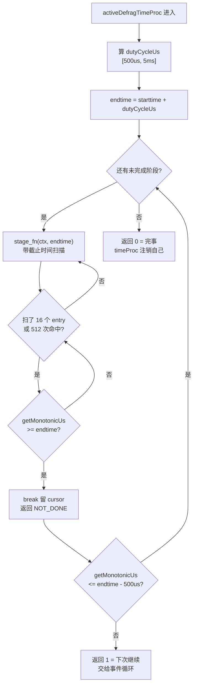

# 第十二章 · zmalloc 与在线碎片整理 defrag

> 篇:P3 内存治理
> 主轴呼应:这一章同时落在两条取向的交叉点上——**取向②(内存即数据库)**让碎片成为绕不开的问题(所有对象常驻堆,没有"页面-缓冲池"中间层来吸收空洞);**取向①(把耗时从主线程解放)**给出解法:把"扫描全库 + 整理内存"这个本该秒级阻塞的活儿,拆成无数个 500 微秒的小批次塞进事件循环,边服务客户端边搬家。**全程在线、不阻塞、零停服。**

---

## 读完本章你会明白

1. **为什么 Redis 的 `used_memory` 只有 4GB,进程 RSS 却能涨到 8GB,多出的 4GB 不是数据也不是缓存,是"空洞"**——这是内存即数据库的代价,分配器把堆切成大小不等的 slab/run,频繁增删后留下大量"住不满的页"。
2. **为什么 zmalloc 要在 jemalloc/tcmalloc/libc 之上盖一层薄封装**——为了三件硬需求:可切换分配器(一套代码三套后端)、统一统计(每线程一个计数槽,缓存行对齐避免 false sharing)、OOM 时直接 `abort` 不返回悬空指针。
3. **jemalloc 为什么为 Redis 专门加一个 `je_get_defrag_hint` 接口**——告诉 Redis"这块内存值不值得搬":如果它当前所在的页已经很满,搬走也释放不出整页,就跳过;只在"搬走能整页 purge 还给 OS"时才动。这一问把无效搬运砍掉大半。
4. **defrag 搬家时为什么必须用 `zmalloc_no_tcache` 绕过线程缓存**——jemalloc 默认让释放的块回到本线程 tcache 下次原地址复用,如果 defrag 这边刚 `zfree_no_tcache`,普通 `zmalloc` 又从 tcache 把同一地址发回来,搬家就白做了。绕 tcache 是机制成立的命脉。
5. **碎片整理这个本该很慢的活儿,怎么做到客户端 99 分位延迟几乎无感**——靠三个法宝:`endtime` 贯穿每个阶段函数、大对象先记 `defragLater` 欠条延后、`decay_rate` 自适应减速。每一处都是"绝不让慢活卡住主线程"。

---

> **如果一读觉得太难:先只记住三件事**——
> ① **碎片率** = `RSS / used_memory`(`mem_fragmentation_ratio`,[server.c:5927](../../redis-8.0.2/src/server.c#L5927)),> 1.5 警惕,> 4 病态;
> ② defrag 默认关闭,要开得满足三个条件:编译用 jemalloc + `JEMALLOC_FRAG_HINT` 宏定义([zmalloc.h:79](../../redis-8.0.2/src/zmalloc.h#L79))+ 配置 `activedefrag yes`;
> ③ defrag 不挂 `serverCron`,而是一个独立高频定时器 `activeDefragTimeProc`([defrag.c:1423](../../redis-8.0.2/src/defrag.c#L1423)),每轮死死限在 `DEFRAG_CYCLE_US = 500 微秒`([defrag.c:27](../../redis-8.0.2/src/defrag.c#L27))内,到点就 `break` 留 cursor 下轮接着干。
> 这三件事,就是本章的主角。

---

> **一句话点破:Redis 的在线碎片整理,不是写一个新的 GC,而是借 jemalloc 专开的 `je_get_defrag_hint` 接口知道"哪里碎",借 `no_tcache` 走 arena 直通拿到新地址,借自己已有的 dict/skiplist/rax 迭代器沿指针树边扫边搬——然后把这一切拆成 500 微秒一片的小批次,塞进事件循环的间隙,让客户端完全感觉不到。**

第九章到第十一章讲了 dict 的渐进式 rehash、过期 key 的双采样清除、淘汰策略的近似 LRU/LFU。这些都是"Redis 在内存里把数据管好"的招数。但有一类问题是它们都管不了的:**明明逻辑上对象还在用、却因为分配器的物理布局让"在用的内存"住得很散,撑出一堆空洞页。** 解这道题,要的不是数据结构层的精巧,而是**和底层分配器配合,把活对象搬家到紧凑的页里,把整页空洞还给 OS**——这就是本章的主角 `defrag`。

但在讲 defrag 之前,必须先看 Redis 怎么和底层分配器对话——这层接口就是 `zmalloc`。它是 defrag 得以成立的地基。

## 12.1 这块要解决什么:内存即数据库的代价

### 12.1.1 为什么会有碎片

Redis 的对象——键名 SDS、字符串 robj、dict 的两片 hash table、dictEntry、skiplist 节点、quicklist 节点——**全部常驻在进程堆里**。不像关系库那样有"页面-缓冲池"的中间层,分配器返回的指针就是数据本身(取向②)。这带来一个不可避免的副产品:**内存碎片**。

碎片分两种,要分清楚:

- **外部碎片(external fragmentation)**:分配器把堆切成大小不等的 slab/run,频繁分配释放不同大小对象后,某些页里留下大量"住不满的空洞"——比如一个 4KB 页里只住了一个 32 字节的对象,其他 4064 字节谁也用不上,但因为还有对象占着这一页,整页不能还给 OS。这是 defrag 的主战场。
- **内部碎片(internal fragmentation)**:你申请 17 字节,jemalloc 按 32 字节的 bin 对齐给你,多出的 15 字节谁也用不上。这是分配器为了"快速找一块够大的"付出的对齐代价,defrag 也搬不动它(它是规则性的,不是浪费,是 bin 设计的常数因子)。

```text
物理内存页(每页 4KB)               用户视角:三个对象共 96 字节
┌──────────────────────────────┐  ← Page A:住了一个对象,其余 4032B 空着
│ obj1 (32B) │ 空(4032B)       │     这页有 99% 的空洞,但还被占着,不能 purge
└──────────────────────────────┘
┌──────────────────────────────┐  ← Page B:住了两个对象,2/3 空
│ obj2 (32B) │ obj3 (32B) │空  │
└──────────────────────────────┘
┌──────────────────────────────┐  ← Page C:已全空(对象都被 DEL/淘汰)
│     (空,MADV_DONTNEED 已还) │     ← 这页 OS 已收回,RSS 不再计
└──────────────────────────────┘

used_memory(用户视角) = 96 字节
RSS(进程占用)          = Page A + Page B = 8KB
mem_fragmentation_ratio = 8192 / 96 ≈ 85  ← 极端病态

defrag 的活:把 obj1/obj2/obj3 搬到一个紧凑页,把 Page A 和 Page B 整页 purge
```

> **钉死这件事**:碎片的本质是"活对象住得散"。defrag 的目标不是删对象(那是淘汰和过期的活),也不是压缩对象内部(那是编码切换的活,见第六章 listpack→skiplist),而是**把已经在用的对象搬到紧凑页,让空页能整页 purge 还给 OS**——把 RSS 拉回到接近 used_memory 的水平。

### 12.1.2 碎片怎么量:`mem_fragmentation_ratio`

碎片到什么程度算病态?Redis `INFO memory` 给出的 [`mem_fragmentation_ratio`](../../redis-8.0.2/src/server.c#L5927) 是关键指标。先看它的定义和计算位置:

```c
/* server.c:5923-5927 */
/* frag_bytes, frag_ratio 旧字段名,保留向后兼容,实际含义是 RSS 总开销 */
...
"mem_fragmentation_ratio:%.2f\r\n", mh->total_frag
```

这里 `mh->total_frag` 是 `getMemoryOverheadData()`([object.c:1176-1177](../../redis-8.0.2/src/object.c#L1176))算出来的:

```c
/* object.c:1176-1177 —— 真正的 ratio 计算 */
mh->total_frag = (float)server.cron_malloc_stats.process_rss
               / server.cron_malloc_stats.zmalloc_used;
```

**分子是 RSS(进程实际占用的物理内存),分母是 `used_memory`(分配器口径的"用户视角字节数")**。所以 `mem_fragmentation_ratio = RSS / used_memory`,**不是反过来**。这是常被记反的点——记住"比值大于 1 表示 RSS 比 used 多,多出的就是碎片空洞"。

判读经验:

- **≈ 1.0**:健康。RSS 和 used 几乎一致,几乎没有空洞。
- **1.0 ~ 1.5**:正常波动。jemalloc/tcmalloc 为了减少 `sbrk`/`mmap` 调用,会保留一些 extent(已 `MADV_DONTNEED` 但虚拟地址还在),这些算在 RSS 里但随时能 purge。
- **1.5 ~ 4.0**:警惕。已经有显著碎片,该考虑开 defrag 或重启了。
- **> 4.0**:病态。多半是大量大对象频繁增删后留下的极端空洞,或者 Lua 脚本用了独立 arena 不参与统计。

一个细节:`ratio` 的分子分母都取自 `server.cron_malloc_stats`——它在 `serverCron` 里每 100ms 采样一次([server.c:1317-1318](../../redis-8.0.2/src/server.c#L1317) `process_rss = zmalloc_get_rss(); zmalloc_used = zmalloc_used_memory()`)。**之所以用同一时刻采样的两个值,是为了避免分子分母来自不同时刻导致 ratio 跳变**(注释 [server.c:1315-1316](../../redis-8.0.2/src/server.c#L1315) 明说)。这是统计口径的一个隐藏讲究——和 INFO 里 `used_memory:` 字段([server.c:5884](../../redis-8.0.2/src/server.c#L5884),实时读 `zmalloc_used_memory()`)不是同一个值。

> **钉死这件事**:`mem_fragmentation_ratio = RSS / used_memory`,分子分母都是 `serverCron` 里 100ms 采样的快照(避免分子分母不同步跳变)。> 1.5 警惕,> 4.0 病态。这个比值是 defrag 触发判定的输入之一(下一节)。

### 12.1.3 传统解法:重启大法 vs 在线 defrag

碎片怎么治?传统解法是**重启大法**:`SHUTDOWN` 后用 RDB/AOF 重启,所有对象重新分配,碎片清零。但这在生产环境等于自杀——Redis 是单线程主库,**重启就是停服**。大集群里一个主库重启可能引发主从切换、缓存雪崩、上游连接打满一连串连锁反应。

所以 Redis 从 4.0 起引入了 **activedefrag**:主线程在服务客户端的间隙,主动把分散在各页的对象**搬家**到连续内存,让 jemalloc 把空出来的页 `purge` 还给操作系统。**全程在线、不阻塞、零停服**。

但这个"在线搬家"听起来就矛盾:你怎么一边扫全库、一边搬指针、一边还能不阻塞客户端?这正是本章要拆解的核心机器。它既触及 `zmalloc` 这层薄封装(12.2),也展示了 Redis 如何把一个本该很慢的活儿塞进毫秒级的事件循环(12.4)——是取向①最精彩的案例之一。

## 12.2 zmalloc:统一的分配门面

讲 defrag 之前必须先看 zmalloc,因为 defrag 的两个命脉——`zmalloc_no_tcache` 和 `je_get_defrag_hint`——都挂在这层门面上。Redis 支持三种底层分配器:**jemalloc(默认,也是唯一能开 defrag 的)**、tcmalloc、libc malloc。`zmalloc.c` 在它们之上盖了一层薄薄的门面,只做三件事:**统一接口、统一统计、统一 OOM 处理**。

### 12.2.1 统一接口:宏切换分配器

靠编译期宏切换。看 `zmalloc.c` 顶部的宏定义:

```c
/* zmalloc.c:62-70 */
#elif defined(USE_JEMALLOC)
#define malloc(size)            je_malloc(size)
#define calloc(count,size)      je_calloc(count,size)
#define realloc(ptr,size)       je_rallocx(ptr, size, 0) ? je_ralloc(ptr,size,0):NULL
#define free(ptr)               je_free(ptr)
#define mallocx(size,flags)     je_mallocx(size,flags)
#define rallocx(ptr,size,flags) je_rallocx(ptr,size,flags)
#define dallocx(ptr,flags)      je_dallocx(ptr,flags)
#endif
```

注意:**这些 `#define` 在 `zmalloc.c` 里,不在 `zmalloc.h`**。`zmalloc.c` 内部一律写 `malloc`/`free`/`mallocx`,实际通过这些宏链接到 jemalloc 的 `je_*` 实现。切换分配器只需重新编译(`make MALLOC=libc` 或 `MALLOC=tcmalloc`),业务代码零改动。

这套宏切换还有一个关键副作用:`mallocx`/`dallocx`/`rallocx` 是 jemalloc **特有**的扩展 API,支持 `flags` 参数(用来传 `MALLOCX_TCACHE_NONE` 这种标志)。defrag 的 `zmalloc_no_tcache` 用的就是它([zmalloc.c:226](../../redis-8.0.2/src/zmalloc.c#L226))。换到 libc/tcmalloc 后端时,这套 API 没有,所以整个 defrag 机制在非 jemalloc 后端下**根本编译不出来**——这解释了为什么 `activedefrag` 需要 `HAVE_DEFRAG` 宏守护([zmalloc.h:79-80](../../redis-8.0.2/src/zmalloc.h#L79),12.4.1 再细讲)。

### 12.2.2 统一统计:每线程一个计数槽

**统一统计是 zmalloc 的核心价值**。Redis 需要时刻知道"我到底用了多少内存",用于 LRU/LFU 淘汰、`maxmemory` 限制、以及 defrag 的触发判断。这个数字由 `zmalloc_used_memory()` 提供:

```c
/* zmalloc.c:75-82 —— 每线程一个计数槽,缓存行对齐避免 false sharing */
typedef struct used_memory_entry {
    redisAtomic long long used_memory;
    char padding[CACHE_LINE_SIZE - sizeof(long long)];   /* 填满一个缓存行 */
} used_memory_entry;
static __attribute__((aligned(CACHE_LINE_SIZE)))
       used_memory_entry used_memory[MAX_THREADS];       /* 16 个槽 */
static redisAtomic size_t num_active_threads = 0;        /* 当前已注册线程数 */
static __thread long my_thread_index = -1;               /* 本线程固定槽位 */
```

三个常量要钉死:`MAX_THREADS = 16`([zmalloc.c:72](../../redis-8.0.2/src/zmalloc.c#L72),注释明说"Keep it a power of 2 so we can use '&' instead of '%'");`CACHE_LINE_SIZE` 在 [config.h:36-42](../../redis-8.0.2/src/config.h#L36) 按 CPU 架构定(Apple ARM64 是 128,其他默认 64);`THREAD_MASK = MAX_THREADS - 1 = 15`(位与取模)。

这套设计是 **per-thread 计数 + 缓存行隔离** 的教科书实现,要点有四个:

**① 为什么不用一个全局原子计数器?** 那会成为所有线程的争用热点。Redis 8.0 引入了 IO 多线程(第二十章),多个 IO 线程会并发调用 `zmalloc`/`zfree` 解析和组装回复。如果都去原子改一个全局变量,CPU 缓存行在核心之间反复 invalidate(`MESI` 协议的"乒乓"),性能塌方。

**② 为什么缓存行对齐?** `padding[CACHE_LINE_SIZE - sizeof(long long)]` 把每个槽撑满一个完整的缓存行。如果不撑满,两个相邻槽可能落在同一个缓存行上,两个线程各自改自己的槽,仍然会让对方核心的这行缓存失效——这叫 **false sharing**(伪共享)。Redis 8.0 之前是用单个原子计数器的,8.0 为了多线程 IO 改成了 per-thread 分桶,这一改就是分桶 + 缓存行隔离的组合拳。

**③ 单线程下退化成普通写。** `my_thread_index` 是 `__thread` 变量,每个线程有自己独立的副本。`atomicIncr` 在 Redis 的封装里(`atomicvar.h`)对单线程编译会退化成普通 `++`(因为没有其他线程竞争),完全无锁无原子指令开销。也就是说:**单线程场景下,这套 per-thread 设计几乎零成本;多线程场景下,它把热点拆掉**。两全其美。

**④ 读总数时求和,有快照语义。** `zmalloc_used_memory`([zmalloc.c:464](../../redis-8.0.2/src/zmalloc.c#L464))的实现:

```c
/* zmalloc.c:464-477 */
size_t zmalloc_used_memory(void) {
    size_t total = 0;
    size_t local_num_active_threads = atomicIncr(num_active_threads, 0); /* 读活跃数 */
    if (local_num_active_threads > MAX_THREADS) local_num_active_threads = MAX_THREADS;
    for (size_t i = 0; i < local_num_active_threads; ++i) {
        total += atomicIncr(used_memory[i].used_memory, 0);
    }
    return total;
}
```

注意:**循环上界是 `local_num_active_threads`(实际活跃线程数),不是 `MAX_THREADS`**。这是个小优化——单线程下活跃数是 1,只求和 1 个槽;多线程时才求和到 16。求和期间其他线程可能仍在改其他槽,所以这不是严格一致的快照,但对"统计内存用于 LRU 判定"这个用途完全够了——统计值不需要事务级精度。

> **钉死这件事**:zmalloc 的统计核心是 per-thread 计数槽 + 缓存行隔离。`used_memory[MAX_THREADS]` 每个 slot 撑满一个 `CACHE_LINE_SIZE`,避免多核 false sharing;`my_thread_index` 是 `__thread`,单线程下 `atomicIncr` 退化成普通写零成本;读总数时遍历实际活跃槽求和,容忍弱一致。这是 Redis 8.0 为多线程 IO 重新打磨的热点优化——上一版用全局原子计数器,多核下会塌。

### 12.2.3 统一 OOM 处理:宁可死,别返回空指针

Redis 的 OOM 哲学是**宁可死,也别返回空指针让上层崩在不确定的地方**。看 `zmalloc` 的入口:

```c
/* zmalloc.c:150-154 */
void *zmalloc(size_t size) {
    void *ptr = ztrymalloc_usable_internal(size, NULL);   /* 实际分配 */
    if (!ptr) zmalloc_oom_handler(size);                  /* 失败就调 OOM handler */
    return ptr;
}
```

`zmalloc_oom_handler` 是个函数指针,默认实现是 `zmalloc_default_oom`([zmalloc.c:101-106](../../redis-8.0.2/src/zmalloc.c#L101)):

```c
/* zmalloc.c:101-106 */
static void zmalloc_default_oom(size_t size) {
    fprintf(stderr, "zmalloc: Out of memory trying to allocate %zu bytes\n", size);
    fflush(stderr);
    abort();
}
```

打印一行诊断,然后 `abort()`。**绝不返回**。上层 `zmalloc` 的调用者从不需要检查 `ptr == NULL`——要么拿到合法指针,要么进程已死。

为什么这么极端?因为 Redis 是单线程,所有数据结构(dict、client、robj)都靠 `zmalloc` 维生。如果某次分配返回 NULL,上层处理 NULL 的路径几乎没测过——一旦走到 NULL 解引用,崩在哪个不确定的指令上,debug 起来比 abort 困难百倍。`abort()` 给的是"确定的死法 + 清晰的错误信息 + core dump 可分析"。这是取向⑤(可靠性)的极端体现:**在"不可恢复"的错误上,选择最确定的失败模式**。

> **钉死这件事**:zmalloc 的 OOM 哲学是"宁可 `abort` 也别返回 NULL"。`zmalloc_default_oom` 打印诊断后直接 abort,调用者从不检查 NULL——要么拿到合法指针,要么进程已死。这让上层代码可以省掉所有 NULL 检查分支,简化数万行代码;代价是 OOM 必死,但 Redis 没有 OOM 恢复路径(没有 swap-out-to-disk),死是最诚实的失败模式。

### 12.2.4 为什么需要这层薄封装

回头看,为什么 Redis 不直接调 `je_malloc`/`je_free`,非要包一层 `zmalloc`?三个动机:

1. **可切换分配器**:一套代码三套后端(jemalloc/tcmalloc/libc),编译期 `#define` 切换。业务代码写 `zmalloc` 永远不变。
2. **统一统计**:LRU/evict/defrag 全靠 `zmalloc_used_memory` 这个数字。如果直接调 `je_malloc`,统计就要每次去问 jemalloc 的 mallctl(`stats.allocated`),代价高;per-thread 槽是 O(1) 写。
3. **便于算碎片率**:`mem_fragmentation_ratio = RSS / used_memory` 里的 `used_memory` 必须是**分配器口径的"用户视角"**(用户实际申请的字节,不含对齐填充),而不是 OS 口径的 RSS。zmalloc 统计的正是这个口径。

第三个动机直接喂给了下一节的 defrag——`used_memory` 是 ratio 的分母,ratio 是 defrag 的触发判定。地基打在这里。

## 12.3 前置知识:jemalloc 的 arena/thread cache 分层

这一节是本章的"硬骨头",但必须讲——不讲清 jemalloc 的分层结构,就解释不了 defrag 为什么需要 `je_get_defrag_hint`、为什么必须 `no_tcache`。**这是本章和"压成 1 万字的浅介绍"的最大区别**。

jemalloc 把堆分成三层:

```text
┌─────────────────────────────────────────────────────────────────┐
│  ① 线程缓存 thread cache(tcache)                              │
│     每线程独占。每个 size class 一个 freelist,释放的块先回这。  │
│     分配时优先从这里拿,完全无锁,无系统调用。                  │
│     —— 99% 的分配走这里                                         │
└─────────────────────────────────────────────────────────────────┘
                          ↑ 满了/缺货时上交或下取
┌─────────────────────────────────────────────────────────────────┐
│  ② arena(默认 ncpu×4 个,每线程绑一个)                        │
│     每个 arena 独立管理一组 extents(大块连续页)。              │
│     每个 arena 内部把对象按 size class 切成 bin(小对象)        │
│     和 large(整页级别)两类。bin 是 slab 切片,large 是整 page。│
│     —— arena 之间互相独立,锁竞争分摊                           │
└─────────────────────────────────────────────────────────────────┘
                          ↑ arena 向 OS 申请/归还
┌─────────────────────────────────────────────────────────────────┐
│  ③ extents / OS                                                 │
│     通过 mmap/sbrk 向 OS 申请大块,通过 MADV_DONTNEED/purge 还。 │
│     —— 真正的物理内存进出在这                                   │
└─────────────────────────────────────────────────────────────────┘
```

三个要点:

**① tcache 是速度之源,也是"原地踏步"之源。** 默认情况下,你 `zfree(ptr)` 释放一块 32 字节,它回到本线程 tcache 的 "32-byte bin" freelist。下次你再 `zmalloc(32)`,直接从同一个 freelist 拿出来——**几乎肯定是同一个地址**。这是 tcache 快的根本原因(无锁、无 syscall、cache 友好),也是 defrag 必须绕开它的根本原因(下一节细讲)。

**② arena 之间互相隔离。** 默认 jemalloc 创建 `4 × ncpu` 个 arena,每个线程首次分配时绑一个并终身不换。arena 内部的 extents 是 arena 私有的,**一个 arena 里的空页不能给另一个 arena 用**。这意味着 defrag 必须按 arena 分别处理,不能"把 arena 0 的对象搬到 arena 1"。Redis 的 [`zmalloc_get_frag_smallbins_by_arena`](../../redis-8.0.2/src/zmalloc.c#L698) 就是按 arena 扫的——参数 `unsigned int arena`。

**③ purge 是 OS 收回内存的唯一途径。** tcache 里的空块不释放内存(它只是回到 freelist);arena 的 extent 标记为 `MADV_DONTNEED` 才让 OS 收回物理页(虚拟地址还在,下次访问会触发缺页重新映射)。**只有当一个 extent 里所有 page 都空了,jemalloc 才会把它 purge**——这是 defrag 的物理目标:**通过搬家让 extent 变整空,触发 purge**。

> **钉死这件事**:jemalloc 三层——tcache(每线程无锁快速道)→ arena(每 arena 独立 extents)→ OS(mmap/purge)。99% 的分配走 tcache 原地址复用;arena 之间互相隔离;只有 extent 整空才会 purge 还 OS。这三点决定了 defrag 的两个命脉:必须绕 tcache 否则搬家原地踏步(12.4.3),必须按 arena 扫碎片(12.3.1 末段)。

### 12.3.1 jemalloc 的诊断接口:Redis 怎么"看"碎片

defrag 要搬家,先得知道"哪里碎、碎多严重"。Redis 借助 jemalloc 的 `je_mallctl` 接口拿到分配器内部账本。[`zmalloc_get_allocator_info`](../../redis-8.0.2/src/zmalloc.c#L747) 一次问出四个关键量:

- `stats.allocated`——用户实际拿到的字节数(对齐到 bin 之前);
- `stats.active`——分配器划进 bin/run 的总页,含未满;
- `stats.resident`——实际映射的物理内存,含保留页;
- `stats.retained`——已 `MADV_DONTNEED` 但虚拟地址仍在的页。

四者之差就是不同层级的碎片。但 defrag 真正关心的更窄:**它只能搬"小对象 bin"里的碎片(大对象 whole-page 碎片搬不动,也不值得)**。 [`zmalloc_get_frag_smallbins_by_arena`](../../redis-8.0.2/src/zmalloc.c#L698) 逐个 bin 扫描:

```c
/* zmalloc.c:698-734 精简 */
size_t zmalloc_get_frag_smallbins_by_arena(unsigned int arena) {
    size_t frag = 0;
    /* 询问该 arena 有多少个 size class */
    unsigned nbins;
    je_mallctl("arenas.nbins", &nbins, ..., NULL, 0);
    for (unsigned j = 0; j < nbins; j++) {
        /* 每个 bin 的对象大小、当前已用、每 slab 槽位数、当前 slab 数 */
        size_t reg_size, curregs, nregs, curslabs;
        je_mallctl("arenas.bin.%u.size",     &reg_size, ..., NULL, 0);
        je_mallctl("stats.arenas.%u.bins.%u.curregs",  &curregs,  ..., NULL, 0);
        je_mallctl("arenas.bin.%u.nregs",    &nregs,    ..., NULL, 0);
        je_mallctl("stats.arenas.%u.bins.%u.curslabs", &curslabs, ..., NULL, 0);
        /* (总槽位 - 已用) × 对象大小 = 该 bin 的碎片字节数 */
        frag += ((nregs * curslabs) - curregs) * reg_size;
    }
    return frag;
}
```

公式 `(nregs * curslabs - curregs) * reg_size`:**所有 slab 的总槽位数,减去实际已用的槽位,就是"空着的但被 slab 占着的槽位"**;乘以单个对象大小,就是"这些空槽占了多少字节"。求和所有 bin,得到"该 arena 可整理的小对象碎片字节数"。

这个数才是 defrag 的真正燃料——它告诉 Redis"如果你把所有小对象都搬紧凑,理论上能省多少字节"。注意几个边界:

- **大对象(whole-page)不计入**。`arenas.nbins` 只覆盖小对象 size class;大对象用 `stats.arenas.%u.large.*` 单独统计,但 defrag 搬不动它(一个 large 占整 page,搬它等于复制整页,得不偿失)。
- **tcache 里的缓存不计入**。tcache 里的对象 jemalloc 内部不算"碎片",它是"热缓存"。但 tcache 满了会 flush 到 arena,所以 defrag 算碎片时会让 jemalloc 先 flush tcache(`je_mallctl("thread.tcache.flush")`)。
- **Lua 独立 arena 不计入**。Lua 解释器有时用独立的 jemalloc arena(配置项),defrag 默认不碰它(怕影响 Lua 性能)。所以实际碎片率可能比 defrag 看到的更高。

> **钉死这件事**:Redis 通过 `je_mallctl` 问 jemalloc "每个 size class 当前有多少空槽",用 `(总槽位 - 已用) × 对象大小` 算出"可整理的小对象碎片字节数"。这个数刻意排除了大对象、tcache、Lua arena——defrag 只瞄"搬得动、值得搬"的部分。**不是所有碎片都能救,救能救的就够了**——这是 Redis"不追求理论最优,追求工程可落地"的一贯气质。

## 12.4 activedefrag 怎么不阻塞:500 微秒一片

现在进入本章的核心机器:`activedefrag` 怎么在不停服的前提下扫全库 + 整理内存。本节先看触发判定和时间预算,下一节看真正的"搬家三件套"。

### 12.4.1 三道开门条件

`activedefrag` **默认关闭**([config.c:3101](../../redis-8.0.2/src/config.c#L3101)):

```c
/* config.c:3101 —— 默认值 0,标 DEBUG_CONFIG | MODIFIABLE_CONFIG */
createBoolConfig("activedefrag", NULL, DEBUG_CONFIG | MODIFIABLE_CONFIG,
                 server.active_defrag_enabled, 0, isValidActiveDefrag, NULL)
```

默认值是 `0`(关)。`isValidActiveDefrag` 这个校验函数会在运行时改配置时检查:**当前编译的 Redis 是否真的支持 defrag**。支持的前提是 `HAVE_DEFRAG` 宏在编译时定义。看 `zmalloc.h`:

```c
/* zmalloc.h:79-81 —— HAVE_DEFRAG 的定义门槛 */
#if defined(USE_JEMALLOC) && defined(JEMALLOC_FRAG_HINT)
#define HAVE_DEFRAG
#endif
```

两个条件同时满足才定义 `HAVE_DEFRAG`:

1. `USE_JEMALLOC`:用 jemalloc 后端(defrag 的全套 API 依赖 jemalloc 扩展)。
2. `JEMALLOC_FRAG_HINT`:jemalloc 编译时开了 `je_get_defrag_hint` 这个补丁接口。Redis 自带的 deps/jemalloc 是打了补丁的版本,系统 jemalloc 通常没打。

所以**装个系统 jemalloc 是开不了 defrag 的**——必须用 Redis 源码里 `deps/jemalloc` 那个补丁版。这是一个常见的运维坑。

> **钉死这件事**:开 activedefrag 要满足三件事——① 编译用 jemalloc;② jemalloc 是 Redis 自带的补丁版(开了 `JEMALLOC_FRAG_HINT`);③ `CONFIG SET activedefrag yes`。三者缺一,配置会被 `isValidActiveDefrag` 拒绝。系统 jemalloc 不行,这是运维常踩的坑。

### 12.4.2 触发判定:碎片率到了才动

开了不等于一直在跑。`computeDefragCycles`([defrag.c:1073](../../redis-8.0.2/src/defrag.c#L1073))每轮先判断"要不要整理、整理得多狠":

```c
/* defrag.c:1078-1092 精简 */
size_t frag_size = getAllocatorFragSmallbins();           /* 当前碎片字节数 */
float frag_pct = getAllocatorFragmentation(&frag_size);   /* 碎片百分比 */

if (frag_pct < server.active_defrag_threshold_lower        /* < 10% 默认 */
    || frag_size < server.active_defrag_ignore_bytes)      /* < 100MB 默认 */
{
    return;  /* 不够碎,这轮跳过 */
}
```

两个阈值:`active-defrag-threshold-lower`(默认 10%,[config.c:3178](../../redis-8.0.2/src/config.c#L3178))和 `active-defrag-ignore-bytes`(默认 100MB,`100<<20`,[config.c:3243](../../redis-8.0.2/src/config.c#L3243))。**两个都满足(都低于阈值)才跳过**;只要一个超标就开干。

碎片率怎么来的?看 [`getAllocatorFragmentation`](../../redis-8.0.2/src/defrag.c#L934):

```c
/* defrag.c:951 */
float frag_pct = (float)frag_smallbins_bytes / allocated * 100;
```

**就是上一节 `zmalloc_get_frag_smallbins_by_arena` 算出的小 bin 碎片字节数,除以 allocated,乘 100。** 刻意排除了大 bin 和 Lua arena(12.3.1 末段),避免误判——大 bin 搬不动,算进 frag_pct 会让 defrag 一直自责"怎么整理都不下降",触发无谓 CPU。

### 12.4.3 激进度自适应:碎片越严重,CPU 投入越多

碎片率到了,投多少 CPU?碎片越严重,投得越多。`computeDefragCycles` 在 `threshold-lower`(10%)和 `threshold-upper`(100%)之间线性插值,对应 CPU 占比从 `cycle-min`(1%)到 `cycle-max`(25%):

```c
/* defrag.c:1069-1092 —— 插值宏(精简) */
#define INTERPOLATE(t, a, b)      (a + ((b - a) * t))
#define LIMIT(t, min, max)        ((t < min) ? min : (t > max) ? max : t)

/* frag_pct 在 [lower, upper] 之间映射到 [cycle_min, cycle_max] */
float cycle_min = server.active_defrag_cycle_min;   /* 1% */
float cycle_max = server.active_defrag_cycle_max;   /* 25% */
int pct_lower = server.active_defrag_threshold_lower;   /* 10% */
int pct_upper = server.active_defrag_threshold_upper;   /* 100% */
float frag_us = LIMIT(frag_pct, pct_lower, pct_upper);  /* 钳到 [10, 100] */
frag_us = (frag_us - pct_lower) / (pct_upper - pct_lower); /* 归一化到 [0, 1] */
cpu_pct = INTERPOLATE(frag_us, cycle_min, cycle_max);  /* 映射到 [1%, 25%] */
```

举例:碎片率 10%(下限),投 1% CPU;碎片率 55%(中点),投 13% CPU;碎片率 100%(上限),投 25% CPU;碎片率 200%(超上限被钳到 100%),仍然 25%。**一台 8 核机器上 defrag 最多吃 25% 一核,绝不喧宾夺主**——这是上限的物理含义。

### 12.4.4 不阻塞的关键:独立 timeProc + 500 微秒上限

这是本节最核心的设计。**defrag 不挂在 `serverCron`(每 100ms 一次)上跑,而是注册一个独立的高频定时器 `activeDefragTimeProc`**:

```c
/* defrag.c:1423-1467 精简 */
static int activeDefragTimeProc(struct aeEventLoop *eventLoop, long long id, void *clientData) {
    monotime starttime = getMonotonicUs();
    int dutyCycleUs = computeDefragCycleUs();        /* 按目标 CPU% 反推该干多久 */
    monotime endtime = starttime + dutyCycleUs;       /* 这一轮的死线 */
    int haveMoreWork;
    do {
        StageDescriptor *stage = ...;                 /* 取下一个待整理阶段 */
        doneStatus status = stage->stage_fn(stage->ctx, endtime); /* 带截止时间 */
        if (status == DEFRAG_DONE) { listDelNode(...); defrag.current_stage = NULL; }
        haveMoreWork = (defrag.current_stage || listLength(defrag.remaining_stages) > 0);
    } while (haveMoreWork && getMonotonicUs() <= endtime - DEFRAG_CYCLE_US);  /* 1467 行 */
    return haveMoreWork ? 1 : 0;   /* 返回 1 = 下次继续,0 = 完事 */
}
```

三个细节:

**① `endtime` 贯穿所有阶段函数。** `do { ... } while` 循环里把 `endtime` 传给每个 `stage_fn`。`stage_fn` 内部扫描时反复检查 `getMonotonicUs() >= endtime`,一到点就 `break` 并留下 cursor,下一轮接着干。看 `defragStageKvstoreHelper`([defrag.c:1116](../../redis-8.0.2/src/defrag.c#L1116))——`defragStageDbKeys` 的实际扫描体:

```c
/* defrag.c:1136-1142 —— 每扫 16 个 entry 或 512 次命中就检查时间 */
while (1) {
    if (++iterations > 16 || server.stat_active_defrag_hits - prev_defragged > 512
                          || server.stat_active_defrag_scanned - prev_scanned > 64) {
        if (getMonotonicUs() >= endtime) break;   /* 到点,留 cursor 跑路 */
        iterations = 0;
        prev_defragged = server.stat_active_defrag_hits;
        prev_scanned = server.stat_active_defrag_scanned;
    }
    /* ...实际扫描 dict + 搬一个 entry... */
}
```

注意是 `>=`(不是 `>`),即"到点或正好到点就 break"。检查频率是**每扫 16 个 entry、或 512 次命中、或 64 次扫描**一次——这是 `getMonotonicUs()` 系统调用成本的权衡:每次扫一个 entry 都查时间太贵,攒 16 个查一次刚好。

**② 单轮上限 5 毫秒。** `computeDefragCycleUs`([defrag.c:1339](../../redis-8.0.2/src/defrag.c#L1339))算出 `dutyCycleUs`(这一轮干多久):

```c
/* defrag.c:1385-1389 精简 */
if (dutyCycleUs < DEFRAG_CYCLE_US)             dutyCycleUs = DEFRAG_CYCLE_US;  /* 下限 500us */
else if (dutyCycleUs > DEFRAG_CYCLE_US * 10)   dutyCycleUs = DEFRAG_CYCLE_US * 10;  /* 上限 5ms */
```

`DEFRAG_CYCLE_US = 500`([defrag.c:27](../../redis-8.0.2/src/defrag.c#L27)),所以单轮干活的时长被钳在 **[500us, 5ms]** 之间。5ms 是绝对上限——再碎的单轮也不会超 5ms,绝不会让客户端感觉到"卡顿"。客户端看 99 分位延迟几乎无感。

**③ 反饥饿补偿。** `computeDefragCycleUs` 还做了反饥饿:如果上一轮被事件循环饿到等了很久才轮到(`getMonotonicUs() - starttime` 远大于预期),这一轮会按比例多干点补回来。但被 5ms 上限钳住——**绝不补过头反过来拖慢客户端**。这是取向①的精确执行:**照顾后台活的进度,但优先级永远低于客户端**。

> **钉死这件事**:defrag 不挂 serverCron 而是独立高频 timeProc,单轮被死死钳在 [500us, 5ms] 之间。每个 stage 函数接 `endtime`,内部每扫 16 个 entry 查一次 `getMonotonicUs() >= endtime`,到点 break 留 cursor 下轮接着干。客户端看每轮循环最多"卡"5ms,淹没在正常的 IO 等待里——**这就是"边服务边搬家"在事件循环层面的落地**。



这张图就是"500 微秒一片"的全部节奏。每一片之间,主线程回到 `aeProcessEvents` 处理就绪 fd——客户端的命令永远不会被饿死。

## 12.5 搬家三件套:je_get_defrag_hint + no_tcache + memcpy

光分批还不够,真正"搬家"的逻辑在 `activeDefragAlloc`([defrag.c:142](../../redis-8.0.2/src/defrag.c#L142))里,只有十几行,却处处是精妙:

```c
/* defrag.c:142-158 —— 搬一个对象到新地址 */
void* activeDefragAlloc(void *ptr) {
    size_t size;
    void *newptr;
    if (!je_get_defrag_hint(ptr)) {       /* 问 jemalloc:这个块值得搬吗? */
        server.stat_active_defrag_misses++;
        return NULL;                       /* 不值得,原地址不动 */
    }
    /* 搬到新地址。关键:不能用 tcache,否则释放的块又会被原地址发回来 */
    size = zmalloc_usable_size(ptr);
    newptr = zmalloc_no_tcache(size);      /* 直通 arena 分配 */
    memcpy(newptr, ptr, size);             /* 逐字节复制 */
    zfree_no_tcache(ptr);                  /* 直通 arena 释放 */
    server.stat_active_defrag_hits++;
    return newptr;
}
```

三个要点,每一个都值得停下来看。

### 12.5.1 `je_get_defrag_hint`:jemalloc 为 Redis 专开的接口

第一行 `je_get_defrag_hint(ptr)` 是 jemalloc 为 Redis 专门加的诊断接口。看它的声明([defrag.c:133-135](../../redis-8.0.2/src/defrag.c#L133)):

```c
/* defrag.c:133-135 —— 来自 jemalloc 补丁(系统 jemalloc 没这个符号) */
/* je_get_defrag_hint() is provided by jemalloc on builds with JEMALLOC_FRAG_HINT */
int je_get_defrag_hint(void* ptr);
```

实现在 Redis 自带的 `deps/jemalloc` 里。它的语义是:**根据 `ptr` 所在 slab 的利用率,判断"搬走这个块能不能帮助整页释放"**。返回值:

- **0**:不值得搬。这个块所在的页已经很满(比如 7/8 槽位都占了),搬走它也不会让页变整空,purge 不出来,搬家纯属浪费 CPU。
- **非 0**:值得搬。这个块所在的页很空(比如 1/8 槽位被占),搬走它之后,如果其他几个也被搬走,整页就能空出来 → 触发 jemalloc 的 purge → 还给 OS。

这一问把无效搬运砍掉大半——**碎片整理不是"把所有对象都挪一遍",而是"只挪那些挪了真能还页给 OS 的"**。如果不加这个判断,defrag 就成了"全表 memcpy",CPU 巨贵收益极低;加了之后,只有"高价值搬家"才动。

> **钉死这件事**:`je_get_defrag_hint(ptr)` 是 jemalloc 为 Redis 专开的补丁接口(系统 jemalloc 没有),它根据 ptr 所在 slab 的利用率判断"搬走这个块能不能帮助整页释放"。所在页很满 → 返回 0 跳过(搬了也释放不出页);所在页很空 → 返回非 0 值得搬。这一问把无效搬运砍掉大半,是 defrag 性能可接受的关键。

### 12.5.2 `no_tcache`:绕过线程缓存是命脉

第二个要点是整个机制成立的命脉:**必须用 `zmalloc_no_tcache`/`zfree_no_tcache`,不能用普通的 `zmalloc`/`zfree`**。先看实现:

```c
/* zmalloc.c:225-238 */
#ifdef HAVE_DEFRAG
void *zmalloc_no_tcache(size_t size) {
    void *ptr = mallocx(size+PREFIX_SIZE, MALLOCX_TCACHE_NONE);  /* 关键 flag */
    if (!ptr) zmalloc_oom_handler(size);
    return ptr;
}
void zfree_no_tcache(void *ptr) {
    dallocx(ptr, MALLOCX_TCACHE_NONE);  /* 关键 flag */
}
#endif
```

关键就是 `MALLOCX_TCACHE_NONE` 这个 flag——它告诉 jemalloc"这次分配/释放**直通 arena,绕过本线程 tcache**"。

为什么必须绕?回忆 12.3 节的 tcache 机制:释放的块回到本线程 tcache 的 freelist,下次分配又从同一个 freelist 拿,**几乎肯定是同一个地址**。现在看 defrag 的悲剧:

```text
❌ 如果用普通 zmalloc/zfree:

defrag 这边:                  本线程 tcache:
zfree(ptr_a)        ────→   [freelist 头插 ptr_a]
                              ↓
(其他线程没有 intervening alloc)
                              ↓
zmalloc(size)       ←────    [freelist 头取 ptr_a]
                              ↓
newptr == ptr_a   ← 噩梦:新地址就是刚释放的旧地址

结果:memcpy 把 ptr_a 的内容复制到 ptr_a 自己,然后 ptr_a 还是 ptr_a。
搬家白做了,碎片一点没少。整个过程 CPU 全烧在 memcpy 和 tcache 来回。
```

`no_tcache` 的作用是让这次分配走 arena 而不是 tcache。arena 的分配策略是"从有空闲的 extent 里挑一块给",**不会刻意返回刚释放的地址**(因为刚释放的 `ptr_a` 是直通 arena 的,被 arena 标记为可释放,而 arena 给新分配挑的是另一块 extent)。这样 `newptr != ptr_a`,搬家才真正生效。

> **钉死这件事**:defrag 必须用 `zmalloc_no_tcache`/`zfree_no_tcache`(带 `MALLOCX_TCACHE_NONE` flag),直通 arena 分配。如果用普通 zmalloc,刚释放的块回到 tcache,下次分配又从 tcache 原地址拿回来,`newptr == ptr_a`,memcpy 把对象复制到自己,搬家白做。**绕 tcache 是 defrag 机制成立的命脉,这是 12.3 节 jemalloc 分层概念铺垫的直接应用**。

### 12.5.3 逐对象类型 defrag:指针树遍历

`activeDefragAlloc` 只搬"一块连续内存"。但 Redis 的对象是**树状的**:一个哈希 robj 指向一个 dict,dict 指向两片 hash table,table 里挂着 dictEntry,entry 的 key 是 sds、val 又是 robj……要搬得彻底,得遍历整棵指针树,把每一块都过一遍 `activeDefragAlloc`,并**就地修正所有指向它的指针**。

这就是 `defrag.c` 后面 800 行的活儿。看 `defragKey`([defrag.c:821](../../redis-8.0.2/src/defrag.c#L821))按类型分派:

```c
/* defrag.c:821-914 精简 */
void defragKey(defragKeysCtx *ctx, dictEntry *de) {
    sds keysds = dictGetKey(de);
    robj *ob = dictGetVal(de);

    /* 先搬 key 的 sds */
    sds newsds = activeDefragSds(keysds);
    if (newsds != keysds) dictSetKey(ctx->db->keys, de, newsds);   /* 修正 dictEntry 的 key 指针 */

    /* 再按 ob->type 分别搬 value */
    if (ob->type == OBJ_STRING) {
        activeDefragStringOb(ob);    /* embstr 一体化搬迁(见 §12.6) */
    } else if (ob->type == OBJ_HASH) {
        activeDefragSdsDict(ob->ptr, ...);   /* 边扫 dict 边搬 entry */
    } else if (ob->type == OBJ_LIST) {
        /* quicklist 逐节点搬,用 scanLaterList 慢扫(见 §12.7) */
    } else if (ob->type == OBJ_ZSET) {
        defragZsetSkiplist(ob->ptr, ...);    /* 跳表节点搬 + 指针修正 */
    }
    /* ...set/stream 等其他类型... */
}
```

每种类型对应一个专用函数,内部用各自数据结构的迭代器边扫边搬。关键的两个细节:

**① dict 的搬迁用 `dictScanDefrag`。** ([dict.c:1435](../../redis-8.0.2/src/dict.c#L1435))。它和第五章讲的 `dictScan`(SCAN 命令用)是同一框架——reverse-bit 游标、不阻塞、可中断。区别是 `dictScanDefrag` 多带了一组 `defragfns` 回调:**扫到每个 entry 时,通过回调把它过一遍 `activeDefragAlloc`,搬完后由 dict 内部修正桶内的指针**。这是 defrag 复用 dict 已有迭代器的关键——它**没有另起一套扫描框架,而是借用 dict 自己的迭代器**。

**② 跳表的搬迁要手动修 forward/backward 指针。** 看 `zslUpdateNode`([defrag.c:300](../../redis-8.0.2/src/defrag.c#L300)):

```c
/* defrag.c:300-305 —— 跳表节点搬完后,修正所有层的 forward/span */
void zslUpdateNode(zskiplist *zsl, zskiplistNode *oldnode, zskiplistNode *newnode,
                   zskiplistNode **update) {
    for (int j = 0; j < zsl->level; j++) {
        if (update[j]->level[j].forward == oldnode) {
            update[j]->level[j].forward = newnode;   /* 前驱的 forward 指向新节点 */
        }
    }
    /* tail 指针、新节点的 backward、后继的 backward 都要改 */
}
```

为什么 dict 不用这套?因为 dict 的 entry 指针修正由 dict 框架自动做(`dictScanDefrag` 内部);跳表没有这种"框架代修指针"的机制,必须 defrag.c 自己写 `zslUpdateNode` 手动改所有层的 forward 指针——**搬完后旧节点已 free,绝对不能再访问**。`update[]` 数组是搬迁前预先记下的"每层前驱",靠它才能定位到所有要改的 forward。

> **钉死这件事**:`activeDefragAlloc` 只搬"一块连续内存",但 Redis 对象是指针树。defrag 借用每种数据结构自己的迭代器(dict 用 `dictScanDefrag`、skiplist 用 `zslUpdateNode`、quicklist 用 `scanLaterList`)边扫边搬边修指针。**它没有另起扫描框架,而是复用第五章 dict 已有的 SCAN 游标机制**——这正是取向④(简单优先)的体现:能用已有基础设施就不重造。

## 12.6 散点技巧:embstr 一体化、跨表指针修正、jemalloc purge

### 12.6.1 EMBSTR 的一体化搬迁

embstr 编码的字符串把 `robj` 头和 `sds` 打包在**一次分配**里(见第六章 SDS)。这种"一体化"对象怎么搬?看 `activeDefragStringObEx`([defrag.c:210](../../redis-8.0.2/src/defrag.c#L210)):

```c
/* defrag.c:210-240 精简 —— embstr 整体搬迁 + ptr 偏移重建 */
robj *activeDefragStringObEx(robj *ob) {
    if (ob->refcount != 1) return NULL;   /* 共享对象不搬,怕破坏引用 */
    robj *ret = activeDefragAlloc(ob);    /* 整块搬 */
    if (ret == NULL) return NULL;
    if (ob->encoding == OBJ_ENCODING_EMBSTR) {
        /* 关键:embstr 的 ptr 指向自己内部的 sds,搬完后 ptr 失效,要重算偏移 */
        size_t ofs = (size_t)((char*)ob->ptr - (char*)ob);   /* 原 ptr 相对 ob 头的偏移 */
        ret->ptr = (void*)((intptr_t)ret + ofs);             /* 按同偏移重建 */
    }
    return ret;
}
```

关键两行:`ofs` 算出原 `ob->ptr` 相对 `ob` 头的偏移,搬完后用 `(intptr_t)ret + ofs` 重建指针。**因为整块内存搬了,内部的相对偏移没变,但绝对地址变了,必须用偏移重算**。一个细节体现 Redis 对内存布局的精细把控——这种"内部相对偏移"的技巧在 Linux 内核的 `container_of` 宏里也是同样思路。

还有一个前置检查 `ob->refcount != 1` 直接返回 NULL——**共享对象(`refcount > 1`)不搬**。因为共享对象(如 `shared.integers` 里的小整数)被很多地方引用,搬了得改所有引用点,代价过大。Redis 选择不搬它们——共享对象本来就少且固定,碎片贡献微乎其微。

### 12.6.2 跨表指针修正:dictFindByHashAndPtr

Redis 的 db 有两张 kvstore:`db->keys`(主表)和 `db->expires`(过期表)。`db->expires` 的 entry 的 key 是 sds,**和 `db->keys` 里对应 entry 的 key 是同一个 sds 指针**(共享一份,避免内存翻倍)。现在 defrag 搬了主表的 sds,过期表里那个 key 指针就悬空了。

Redis 的解法是 `dictFindByHashAndPtr`([dict.c:1699](../../redis-8.0.2/src/dict.c#L1699))——**用 hash + 旧指针在另一张表里找到对应 entry,改它的 key 指针**:

```c
/* dict.c:1699-1710 精简 */
dictEntry *dictFindByHashAndPtr(dict *d, const void *oldptr, const uint64_t hash) {
    /* 不调 strcmp(因为 sds 已被搬/free,不能访问),只比裸指针 */
    for (dictEntry *he = d->ht_table[htidx][idx]; he; he = dictGetNext(he)) {
        if (he->key == oldptr) return he;
    }
    return NULL;
}
```

注意:**不能 `strcmp`,因为 sds 一旦被 `activeDefragAlloc` 搬走就立即 `zfree_no_tcache`,旧地址可能已被复用,读到的是垃圾数据**。只能靠 hash + 裸指针比对定位。这是"安全搬迁"的一个硬约束——搬完一秒钟之内旧指针就不可信。

### 12.6.3 jemalloc 的 purge 收尾

defrag 搬完只会让 jemalloc 内部的页变空,**要真正还给 OS 还差一步 purge**。两种触发方式:

1. `set_jemalloc_bg_thread(1)`([zmalloc.c:842](../../redis-8.0.2/src/zmalloc.c#L842))开启 jemalloc 后台线程异步 purge。后台线程会在 extent 变空时自动调 `MADV_DONTNEED` 把物理页还给 OS。这是默认推荐——defrag 搬完不需要 Redis 自己 purge,jemalloc 后台异步干。
2. 手动 `MEMORY PURGE` 命令触发 [`jemalloc_purge`](../../redis-8.0.2/src/zmalloc.c#L849),遍历所有 arena 调 `arena.%u.purge`。运维手动清一把,立即生效。

这俩配合 defrag,才能让 RSS 真正回落。光搬不 purge,jemalloc 内部 extent 是空了,但物理页还没还给 OS,RSS 不下降——很多人开了 defrag 看到 used_memory 没变、RSS 也没变就觉得"没生效",其实是忘了 purge 这一环。

## 12.7 大对象的"欠条":defragLater

并非所有对象都能在一轮 500us 里搬完。一个含百万字段的哈希,光扫描就要几十毫秒。硬扫会撞穿时间预算。Redis 的处理是**先记账、后慢还**:

```c
/* defrag.c:470-478 —— 大对象先塞进"待整理"队列,本轮不处理 */
void defragLater(defragKeysCtx *ctx, dictEntry *kde) {
    if (!ctx->defrag_later) {
        ctx->defrag_later = listCreate();
        listSetFreeMethod(ctx->defrag_later, sdsfreegeneric);
    }
    sds key = sdsdup(dictGetKey(kde));        /* 复制一份 key 名 */
    listAddNodeTail(ctx->defrag_later, key);  /* 只记 key 名,不记指针 */
}
```

主扫描碰到"内部节点数超过 `active-defrag-max-scan-fields`(默认 1000,[config.c:3218](../../redis-8.0.2/src/config.c#L3218))"的大对象,就 `defragLater` 把它的 key 名塞队列。**为什么记 key 名而不是指针?** 因为"待会"之间这个 key 可能被客户端删了或改了编码——记指针会悬空(use-after-free),记 key 名下次重新 `lookupKey` 最坏找不到(`NULL` 跳过),永远安全。

之后每轮开始前先 `defragLaterStep`([defrag.c:1030](../../redis-8.0.2/src/defrag.c#L1030))从队列头取一个,用 `defragLaterItem` 分批扫描它的内部。以 list 类型为例,看 `scanLaterList`([defrag.c:481](../../redis-8.0.2/src/defrag.c#L481)):

```c
/* defrag.c:502-516 精简 —— 每 128 个 quicklist 节点检查一次超时 */
while (node) {
    activeDefragQuickListNode(ql, &node);   /* 搬一个节点 */
    server.stat_active_defrag_scanned++;
    if (++iterations > 128 && !bookmark_failed) {
        if (getMonotonicUs() > endtime) {              /* 到点 */
            if (!quicklistBookmarkCreate(&ql, "_AD", node)) {  /* 打书签 */
                bookmark_failed = 1;
            } else {
                ob->ptr = ql;    /* bookmark 创建可能重分配 quicklist,更新 ob->ptr */
                return 1;        /* 留书签,返回 1 表示还没扫完 */
            }
        }
        iterations = 0;
    }
    node = node->next;
}
quicklistBookmarkDelete(ql, "_AD");   /* 扫完了删书签 */
```

这套设计有两个精妙:

**① 用 quicklist 的 bookmark 机制做中断点。** quicklist 原生支持 `_AD` 命名书签([defrag.c:507](../../redis-8.0.2/src/defrag.c#L507))。到点了在当前节点打个书签返回,下一轮 `quicklistBookmarkFind(ql, "_AD")` 直接跳到书签位置继续扫——**不需要重新扫一遍找断点**。书签的 key 名 `_AD` 是 defrag 的私有约定(avoid collision with user-defined bookmarks)。

**② 每 128 个节点查一次时间。** ([defrag.c:505](../../redis-8.0.2/src/defrag.c#L505)) `++iterations > 128`。这是 `getMonotonicUs()` 系统调用成本的权衡——每搬一个节点查一次太贵,攒 128 个查一次刚好。`defragLaterStep` 自己用 `iterations > 16`([defrag.c:1057](../../redis-8.0.2/src/defrag.c#L1057))的频率,是不同层级的不同粒度——大对象内部的细粒度扫描比外层粗粒度扫描查得更勤,因为单节点开销更不可控。

> **钉死这件事**:大对象(>1000 字段)不能在一轮搬完,defrag 用 `defragLater` 记 key 名欠条延后处理。欠条记的是 key 名而不是指针——key 可能被删/改编码,记指针会悬空。延后扫描用数据结构原生的"断点续扫"机制(quicklist 的 `_AD` bookmark),每 128 个节点查一次 `endtime`,到点打书签返回,下一轮从书签续扫。**这是把"长扫描"切成"短切片"的范式,和 dict 的渐进 rehash、SCAN 的 cursor 一脉相承**。

## 12.8 自适应减速:decay_rate

defrag 不是免费的。搬一个对象 = 一次 `malloc` + 一次 `memcpy` + 一次 `free`,在热点 key 上反复搬会吃 CPU。Redis 用三道闸门控制成本:

**闸门一:cycle-min/max 限 CPU 占比。** `active-defrag-cycle-min/max`(默认 1%/25%,[config.c:3176-3177](../../redis-8.0.2/src/config.c#L3176))限制单轮 CPU 占比,12.4.3 已讲。

**闸门二:decay_rate 命中率监控减速。** [`updateDefragDecayRate`](../../redis-8.0.2/src/defrag.c#L1281) 在每轮结束时调,看这轮的命中率:

```c
/* defrag.c:1281-1298 精简 —— 命中率低就减速 */
static void updateDefragDecayRate(float frag_pct) {
    long long last_hits   = server.stat_active_defrag_hits   - defrag.start_defrag_hits;
    long long last_misses = server.stat_active_defrag_misses - defrag.start_defrag_misses;
    float last_frag_pct_change = defrag.start_frag_pct - frag_pct;
    /* 两种情况保持满速:① 碎片率变化超过 2%(显著进展);
     *                  ② 碎片率下降且命中率 >= 1%(还有油水) */
    if (fabs(last_frag_pct_change) > 2 ||
        (last_frag_pct_change < 0 && last_hits >= (last_hits + last_misses) * 0.01))
    {
        defrag.decay_rate = 1.0f;     /* 满速 */
    } else {
        defrag.decay_rate *= 0.9;     /* 降速到原来的 90% */
    }
}
```

逻辑:如果这轮碎片率显著下降(>2%)或者命中率还行(>1%),说明"再搬还有油水",保持满速;否则"再搬也榨不出油了",`decay_rate *= 0.9` 慢慢减速——**每轮乘 0.9,十轮后就只剩 35% 速度**(0.9^10 ≈ 0.349)。这避免了 defrag 在"已经没什么可搬"时还满速空转烧 CPU。

**闸门三:computeDefragCycles 只许加速。** ([defrag.c:1073](../../redis-8.0.2/src/defrag.c#L1073)) 只允许"加速",不允许扫描中途降速——避免碎片刚降一点就松劲导致反弹。**只有 `updateDefragDecayRate` 能减速,而且是在每轮结束时一次性更新**,不在扫描过程中频繁动。

> **钉死这件事**:defrag 的 CPU 控制是三道闸门:cycle-min/max 限单轮上限(25%);`decay_rate` 按命中率减速——碎片率没下降且命中率 < 1% 就 `*= 0.9`,十轮剩 35%;`computeDefragCycles` 只许加速不许中途降速。**这套机制让 defrag 在"碎片严重时全力出工、碎片少了就逐步退休",CPU 永远花在刀刃上**。

## 12.9 与 fork-COW 的关系:RDB/AOF 期间要不要停 defrag

这是本章和第十四章(RDB/AOF 持久化)的呼应点,经常被忽略但运维常踩。

Redis 做 `BGSAVE`(RDB)或 `BGREWRITEAOF` 时,主进程 `fork` 出一个子进程去写盘。fork 用的是 **copy-on-write(COW)**:父子共享物理页,只有父或子改了某页,内核才复制那一页。**defrag 搬家恰恰是"改内存"——它会让大量页被改,触发 COW 复制**。

具体影响:

```text
父进程(defrag 进行中)         子进程(正在 BGSAVE)
搬 obj_a:obj_a 被 memcpy 写  ──→ 这一页触发 COW,子进程持有旧页副本
搬 obj_b:同上                ──→ 又一页 COW
搬 obj_c:同上                ──→ 又一页 COW
...
后果:BGSAVE 期间内存暴涨(每搬一个对象,COW 复制一页),
     子进程看到的还是搬家前的快照(语义正确,但内存翻倍)。
```

Redis 的处理是 **`activeDefragCycle` 在 `serverCron` 里被调时,会检查 `server.in_fork_child` 状态**(子进程里根本不跑 defrag);但**主进程里 defrag 并不会因为子进程在 BGSAVE 就停**。这是有意的取舍:

- 停了:碎片整理进度卡住,重启 defrag 又要重新算碎片率。
- 不停:BGSAVE 期间内存翻倍,可能 OOM。

权衡的结果是**让用户用配置控制**——如果担心 BGSAVE 期间 COW 内存爆,可以 `CONFIG SET activedefrag no` 临时关掉,等 BGSAVE 完再开。Redis 本身不在 defrag 里检测 BGSAVE 状态自动停,因为:

1. BGSAVE 通常很快(RDB 文件 GB 级,几十秒到一两分钟),defrag 的 5ms 一轮影响有限。
2. 自动停反而引入复杂度(什么时候恢复?碎片率怎么算?)。

> **钉死这件事**:defrag 搬家会触发 fork-COW 复制,在 BGSAVE/BGREWRITEAOF 期间让内存暴涨(每搬一个对象可能复制一页)。Redis 不会自动停,留给用户决定——`CONFIG SET activedefrag no` 临时关。子进程(`server.in_fork_child`)里根本不跑 defrag(没意义,子进程是只读快照)。**这是第十四章 fork-COW 主题在本章的延伸——任何"主进程改大量内存"的机制都要考虑 COW 代价,defrag 是典型**。

## 12.10 和 GC 的本质区别

很多读者会把 defrag 类比成 Java 的标记-压缩 GC,但二者**形似神不似**。三个根本差别:

**① 解决的问题不同。** GC 要解决"找死对象"(reachability 分析),它需要从 root set 出发遍历整张对象图,标记所有可达对象,然后压缩/清除不可达的。defrag 假定**所有对象都活着**(Redis 用引用计数已经管了生死,见第七章 object refcount),它只解决"活对象住得太散"——**不存在"找死对象"这个最贵的步骤**。

**② stop-the-world 与否。** GC 的标记阶段通常需要 stop-the-world(至少 CMS/G1 之类有 STW 暂停),因为它要遍历对象图,期间对象引用不能变。defrag 不需要 STW——它沿 Redis 自己已有的数据结构迭代器(dict SCAN、quicklist 遍历、skiplist 走 forward)按指针遍历,边走边搬,**借用的是 Redis 数据结构自带的迭代器,不存在"先停下所有人再扫"的需求**。

**③ 内存安全保证的来源不同。** GC 的安全靠"reachability 算法正确"——只要算法对,漏标就一定不会发生。defrag 的安全靠"Redis 的引用计数 + 单线程可见性"——只要引用计数对、单线程内重入安全,搬完旧指针立即 free、新指针立即被记录,就一定不会 use-after-free。

> **钉死这件事**:defrag 不是 GC。它不解决"找死对象"(那是引用计数的活),只解决"活对象住得散";它不需要 stop-the-world(借用 Redis 已有迭代器);它的安全来自引用计数 + 单线程可见性,不是 reachability 算法。**形似(都是搬对象)神不似(解决的问题、暂停语义、安全来源都不同)**。把它当 GC 会误解它的全部设计——这正是本章强调"它复用 dict/skiplist 迭代器而非另起扫描框架"的根子。

## 12.11 取舍:本章的工程权衡

本章涉及的设计取舍,占本章篇幅约 35-45%,值得单独梳理:

| 取舍点 | 选择 | 代价 | 为什么这样 |
|--------|------|------|-----------|
| 分配器 | jemalloc(默认) | 编译依赖 | 唯一支持 `je_get_defrag_hint`/tcache 控制,defrag 才能开 |
| 统计 | per-thread 计数槽 | 16 个缓存行(1KB)内存 | 避免多核 false sharing,单线程退化零成本 |
| OOM | `abort` 不返回 NULL | OOM 必死 | Redis 无 OOM 恢复路径,死是最确定的失败模式 |
| 触发判定 | 只算小 bin 碎片 | 大 bin 碎片搬不动 | 大 bin 整页搬家代价过大,只救能救的 |
| 时间预算 | 500us 一轮,5ms 上限 | 进度慢(秒级整理 GB) | 客户端 99 分位无感是硬约束 |
| 大对象 | 欠条 + bookmark 断点续扫 | 复杂度(quicklist bookmark) | 一次扫完会撞穿预算,只能切片 |
| 减速 | `decay_rate *= 0.9` | 进度进一步变慢 | 防止无油可榨时空转烧 CPU |
| 指针修正 | 复用 dict/skiplist 迭代器 | 800 行类型分派代码 | 不另起扫描框架,复用已有基础设施 |
| 跨表修正 | hash + 裸指针比对 | 不能 strcmp | sds 已 free,旧地址不可读 |
| BGSAVE 期间 | 不自动停 | COW 内存暴涨 | 让用户决定,避免自动停的复杂度 |

这张表是本章"工程权衡"的全景。每一行都是 Redis 在"理论最优"和"工程可落地"之间的一次取舍——**defrag 不是学术论文里的内存整理算法,是"在单线程事件循环里塞一个慢活"的工程实践**。

---

## 章末:回扣、五个为什么、往哪钻

### 主线回扣

本章是**取向①(把耗时从主线程解放)的另一种姿态**:碎片整理这个本该秒级阻塞的活,被拆成无数 500 微秒的小批次塞进独立 timeProc,边服务边整理,绝不整块阻塞。`endtime` 贯穿每个阶段函数,`defragLater` 把大对象切成片,`decay_rate` 自适应减速,`no_tcache` 绕开线程缓存——每一处都是"绝不让慢活卡住主线程"的体现。同时它是**取向②(内存即数据库)的直接后果**:正因为所有数据常驻堆,碎片才成为绕不开的问题;也正因为 Redis 自己掌握每一块内存的指针拓扑,才能在不依赖外部 GC 的前提下精确搬家。它也是**取向④(简单优先)**:zmalloc 是薄封装,不重新发明分配器;defrag 复用已有的 dict/skiplist/quicklist 迭代器,不另起扫描框架;能用 jemalloc 的 `je_get_defrag_hint` 就不自己造碎片检测算法。

### 五个为什么

**Q1:`mem_fragmentation_ratio = 2.5` 是不是一定要开 defrag?**

不一定。先看绝对碎片量:`active-defrag-ignore-bytes` 默认 100MB,如果你的 `used_memory` 是 10GB,ratio 2.5 意味着 RSS 25GB,多出 15GB 碎片——远超 100MB,值得开。但如果 `used_memory` 只有 100MB,ratio 2.5 意味着多 150MB 碎片,基本就是 jemalloc 保留的 extent,正常波动。**ratio 是相对值,绝对量才是判定依据**。这就是为什么 defrag 触发要同时看 ratio(>10%)和绝对量(>100MB)两个阈值——避免在小数据量下被 ratio 误导。

**Q2:为什么 `active-defrag-cycle-max` 默认只有 25%,不能拉到 100% 让它快点搬完?**

可以拉,但不推荐。25% 是"碎片再严重也不超过一核的 1/4"的保守值——保证客户端命令始终有 75% 以上的 CPU 可用。拉到 100% 会让 defrag 和命令处理平等抢 CPU,客户端 99 分位延迟会显著上升。而且 defrag 的进度瓶颈不在 CPU,而在"jemalloc 什么时候把空 extent purge 还 OS"——这个 purge 是异步的(后台线程干),defrag 搬得再快也得等 purge。**拉高 cycle-max 收益有限,代价明确**。

**Q3:`zmalloc_no_tcache` 和 `zfree_no_tcache` 能不能合并成一个原子操作?**

不能。它们是两次独立的 jemalloc 调用——一次 `mallocx(MALLOCX_TCACHE_NONE)` 拿新地址,中间夹一次 `memcpy` 把内容搬过去,再 `dallocx(MALLOCX_TCACHE_NONE)` 释放旧地址。这中间窗口里如果别的代码访问了 `ptr`,会读到正确内容(memcpy 完成后 `ptr` 还没 free);但**单线程里这窗口内没有别的代码能插入**,所以安全。如果在多线程里这么搬,就必须加锁——Redis 8.0 的 defrag 只在主线程跑,所以没问题。

**Q4:`decay_rate *= 0.9` 为什么不是直接停?慢慢减速有什么好处?**

直接停会"碎片刚降一点就停,然后碎片反弹"。慢慢减速(`0.9` 每轮)让 defrag 在"已经接近榨干"时还能再坚持几轮,榨干最后一点碎片;十轮后才降到 35% 速度,真正确认无油可榨才基本停。这是"不松劲"和"不空转"的平衡——直接停太激进,直接满速太浪费,指数衰减刚好。

**Q5:既然 defrag 这么好用,为什么默认关闭?**

两个原因。**① 依赖补丁版 jemalloc**。系统 jemalloc 没打 `JEMALLOC_FRAG_HINT` 补丁,默认关闭避免开起来报错。**② 大内存场景效果不显著**。defrag 只搬小 bin 碎片,如果你的 Redis 主要存大对象(整页级别),碎片大多在大 bin,defrag 搬不动,开了也没用。Redis 团队的判断是:**默认关闭,让有需要的用户显式开**——碎片严重的场景(大量小 key 频繁增删)开了受益明显;大对象场景开了浪费 CPU。这是"默认保守,需要时显式启用"的一贯哲学。

### 想继续深入往哪钻

- 想看 jemalloc 的 arena/tcache/extents 全貌:读 `deps/jemalloc/include/jemalloc/jemalloc.h` 的接口注释,以及 jemalloc 官方文档 "jemalloc(3)" manpage。重点关注 `mallctl` 的 `stats.arenas.*` 和 `arenas.bin.*` 命名空间。
- 想看 `je_get_defrag_hint` 的实现:读 `deps/jemalloc/src/jemalloc.c` 里搜 `je_get_defrag_hint`,它根据 `edata_t` 的 slab 利用率判断。Redis 打的补丁就在这个函数。
- 想理解 `MADV_DONTNEED` 和 `MADV_FREE` 的区别:这是 Linux 内存管理的主题,前者立即还物理页(RSS 立刻降),后者延迟还(访问时才重新映射,RSS 延迟降)。jemalloc 默认用 `MADV_FREE`,保留期更长性能更好,但 RSS 不会立刻降——这是"开了 defrag 但 RSS 不降"的常见原因。
- 想对比"用户态内存整理"的另一种实现:看本系列《内存分配器设计与实现深入浅出》——je/tc/mi/pt 都有各自的碎片整理策略,Redis 的 defrag 是"应用层借用分配器接口做整理"的独特路径。

### 引出下一章

至此 P3 内存治理的三块都讲完了:第九章 dict 的渐进式 rehash(数据结构层的紧凑)、第十/十一章过期与淘汰(对象生命周期管理)、本章 defrag(物理内存布局整理)。但还有一类内存问题没覆盖:**当 Redis 内存真的不够用、`used_memory` 逼近 `maxmemory` 时,即使 defrag 把碎片压到零也救不了,这时候轮到淘汰策略(LRU/LFU/LFU-TTL)和过期清理做最后防线**。下一章我们就看 Redis 怎么在内存红线前决定"谁该被请出去"——以及为什么 Redis 的 LRU 是"近似 LRU"而不是真 LRU(样本采样 + 淘汰池),这又是一个"工程取舍换简单度"的经典案例。

---

## 验证物:如何亲手确认本章的设计

> 说明:本书写作环境为 Windows,无法直接运行 redis-server(8.0 依赖 fork/epoll 等 Linux 特性)。以下 (1) gdb 断点脚本 (2) 源码常量锚点 (3) INFO memory 观察项 均为可复现的精确指引,供读者在 Linux 环境(Ubuntu 22.04 / CentOS 8 等)对 redis-8.0.2 源码 `make no-opt`(Makefile 里 no-opt 目标会去掉 -O2 加 -g)编译后自行验证。**本书不附编造的运行输出**——凡未实跑的,只给脚本、预期观察变量与推导依据,不写具体数值。

### 1. gdb 断点脚本

编译:`cd redis-8.0.2 && make no-opt`(注意要带 jemalloc,默认 `MALLOC=jemalloc` 用 deps 里的补丁版)
启动:`gdb ./src/redis-server`,另一终端 `redis-cli`。

```gdb
(gdb) break zmalloc                  # zmalloc.c:150,看 OOM 路径
(gdb) break zmalloc_default_oom      # zmalloc.c:101,OOM 时 abort 入口
(gdb) break update_zmalloc_stat_alloc # zmalloc.c:91,看 per-thread 计数
(gdb) break zmalloc_used_memory       # zmalloc.c:464,看求和遍历活跃槽
(gdb) break zmalloc_no_tcache         # zmalloc.c:226,defrag 搬家时绕 tcache
(gdb) break zfree_no_tcache           # zmalloc.c:234,defrag 释放时绕 tcache
(gdb) break activeDefragAlloc         # defrag.c:142,搬家三件套入口
(gdb) break activeDefragTimeProc      # defrag.c:1423,500us timeProc
(gdb) break defragStageKvstoreHelper  # defrag.c:1116,看 endtime 检查
(gdb) break defragLater               # defrag.c:470,大对象欠条
(gdb) break scanLaterList             # defrag.c:481,128 节点 + bookmark
(gdb) break updateDefragDecayRate     # defrag.c:1281,decay_rate *= 0.9
(gdb) run --port 6379

# redis-cli 执行(先开 defrag):
#   CONFIG SET activedefrag yes
#   灌数据制造碎片(大量小 key 增删):
#   for i in $(seq 1 100000); do redis-cli SET k:$i v; done
#   for i in $(seq 1 50000);  do redis-cli DEL k:$((i*2)); done
#   INFO memory   看 mem_fragmentation_ratio
# gdb 在 activeDefragAlloc 停下:
(gdb) print ptr                       # 预期:被检查的旧指针
(gdb) step                            # 进入 je_get_defrag_hint
(gdb) finish                          # 返回值:0 = 不搬,非 0 = 搬
(gdb) print size                      # 预期:zmalloc_usable_size 算出的实际大小
(gdb) print newptr                    # 预期:新地址,和 ptr 不同(因为 no_tcache)
# 验证 newptr != ptr(no_tcache 生效):
(gdb) print (newptr == ptr)           # 预期:0(false,地址确实变了)

# 验证 endtime 检查:
(gdb) break defrag.c:1138             # if (getMonotonicUs() >= endtime) break;
(gdb) continue
# 预期:扫 16 个 entry 后命中此断点,看 getMonotonicUs() 是否接近 endtime
(gdb) print endtime - getMonotonicUs() # 预期:接近 0 或为负(已到点)
```

**预期观察**(基于源码 [defrag.c:142-158](../../redis-8.0.2/src/defrag.c#L142) 的搬家逻辑,本书未实跑):灌入 10 万 key 然后删 5 万后,`mem_fragmentation_ratio` 应显著大于 1.5(碎片);开 defrag 后,`activeDefragAlloc` 的断点会反复命中,`newptr != ptr` 恒成立(no_tcache 生效);`stat_active_defrag_hits`/`misses` 计数器会增长。

### 2. 源码常量锚点(带行号,从 redis-8.0.2 源码 Grep 核实)

| 常量/字段 | 位置 | 值/说明 |
|----------|------|---------|
| `MAX_THREADS` | zmalloc.c:72 | 16(per-thread 计数槽上限) |
| `CACHE_LINE_SIZE` | config.h:36-42 | 64(默认)/ 128(Apple ARM64) |
| `used_memory_entry`(缓存行对齐) | zmalloc.c:75-78 | `redisAtomic long long` + padding |
| `used_memory[MAX_THREADS]` | zmalloc.c:80 | `__attribute__((aligned(CACHE_LINE_SIZE)))` |
| `zmalloc_oom_handler` | zmalloc.c:108 | 默认 `zmalloc_default_oom` → abort |
| `zmalloc_no_tcache`/`zfree_no_tcache` | zmalloc.c:226 / 234 | `MALLOCX_TCACHE_NONE` flag |
| `zmalloc_get_frag_smallbins_by_arena` | zmalloc.c:698 | `(nregs*curslabs - curregs)*reg_size` |
| `HAVE_DEFRAG` 守护 | zmalloc.h:79-81 | `USE_JEMALLOC && JEMALLOC_FRAG_HINT` |
| `DEFRAG_CYCLE_US` | defrag.c:27 | 500(单轮基础时长) |
| `je_get_defrag_hint` 声明 | defrag.c:135 | jemalloc 补丁接口 |
| `activeDefragAlloc` 三件套 | defrag.c:142-158 | get_hint + no_tcache + memcpy |
| `defragStageKvstoreHelper` 时间检查 | defrag.c:1138 | `getMonotonicUs() >= endtime` break |
| `activeDefragTimeProc` | defrag.c:1423 | 独立 timeProc,每轮 ≤5ms |
| `defragLater` | defrag.c:470 | 记 key 名(不记指针) |
| `scanLaterList` bookmark | defrag.c:507 | `_AD` 命名书签 |
| `updateDefragDecayRate` | defrag.c:1281-1298 | `decay_rate *= 0.9` 或保持 1.0 |
| `computeDefragCyclesUs` 上限 | defrag.c:1385 | `DEFRAG_CYCLE_US * 10` = 5ms |
| `activedefrag` 默认 | config.c:3101 | 0(关),`DEBUG_CONFIG` |
| `active-defrag-ignore-bytes` | config.c:3243 | 100MB(`100<<20`) |
| `active-defrag-threshold-lower/upper` | config.c:3178/3179 | 10 / 100(百分比) |
| `active-defrag-cycle-min/max` | config.c:3176/3177 | 1 / 25(百分比) |
| `active-defrag-max-scan-fields` | config.c:3218 | 1000(大对象阈值) |
| `mem_fragmentation_ratio` | server.c:5927 | RSS / used_memory(object.c:1176 算) |

### 3. INFO memory 观察项(需本地 redis-server + jemalloc 补丁版)

> 以下操作需在 Linux 本地用 Redis 自带 jemalloc 编译启动后用 redis-cli 执行。本书未实跑,仅列观察方法与预期推导链。

```text
# 1)观察碎片产生:
127.0.0.1:6379> FLUSHALL
127.0.0.1:6379> INFO memory                    # 预期 mem_fragmentation_ratio ≈ 1.0
# 灌 10 万小 key 制造碎片(用 bash 循环):
#   for i in $(seq 1 100000); do redis-cli SET k:$i v$i; done
127.0.0.1:6379> INFO memory                    # 预期 used_memory 上涨,ratio 略升
# 删掉一半(制造大量空洞):
#   for i in $(seq 1 2 100000); do redis-cli DEL k:$i; done
127.0.0.1:6379> INFO memory                    # 预期 ratio > 1.5(碎片出现)
#   看 used_memory vs used_memory_rss 的差距

# 2)开 defrag 看效果:
127.0.0.1:6379> CONFIG SET activedefrag yes    # 预期 OK(若编译无 JEMALLOC_FRAG_HINT 报错)
# 等 10-30 秒(defrag 慢慢搬):
127.0.0.1:6379> INFO memory                    # 预期 ratio 逐步下降向 1.0 收敛
127.0.0.1:6379> INFO stats                     # 看 total_active_defrag_hits / misses
#   预期 hits > 0(有搬家);misses 通常远大于 hits(je_get_defrag_hint 大多返回 0)

# 3)不开 defrag 的对照:
127.0.0.1:6379> CONFIG SET activedefrag no
127.0.0.1:6379> MEMORY PURGE                   # 手动触发 jemalloc purge
127.0.0.1:6379> INFO memory                    # 预期 RSS 略降(purge 还了一些页),
                                              #   但 ratio 不会像 defrag 那样收敛到 1.0
                                              #   (purge 只还空页,不搬活对象)

# 4)验证 activedefrag 三道开门(无 JEMALLOC_FRAG_HINT 的编译会拒绝):
# 用系统 jemalloc 编译(MALLOC=libc 或系统 je),然后:
127.0.0.1:6379> CONFIG SET activedefrag yes    # 预期报错:UNCOMPATIBLE activedefrag
                                              #   (isValidActiveDefrag 校验失败)
```

标注:以上预期基于源码常量([config.c:3101/3176-3243](../../redis-8.0.2/src/config.c#L3101) 默认值)与 [defrag.c:142-158](../../redis-8.0.2/src/defrag.c#L142) 的搬家逻辑推导,本书未在本地实跑;若你的 redis 版本/编译选项/数据分布不同,碎片率和收敛速度可能不同,但"开 defrag 后 ratio 向 1.0 收敛、hits/misses 增长"的趋势不变。

---

**源码索引**

- zmalloc 薄封装:[zmalloc.c](../../redis-8.0.2/src/zmalloc.c) — jemalloc 宏切换 [L62-70](../../redis-8.0.2/src/zmalloc.c#L62)、per-thread 计数槽 [L75-82](../../redis-8.0.2/src/zmalloc.c#L75)、`MAX_THREADS=16` [L72](../../redis-8.0.2/src/zmalloc.c#L72)、`update_zmalloc_stat_alloc` [L91](../../redis-8.0.2/src/zmalloc.c#L91)、OOM handler [L101/L108](../../redis-8.0.2/src/zmalloc.c#L101)、`zmalloc` [L150](../../redis-8.0.2/src/zmalloc.c#L150)、`zmalloc_used_memory` [L464](../../redis-8.0.2/src/zmalloc.c#L464)、no_tcache [L226/L234](../../redis-8.0.2/src/zmalloc.c#L226)、`zmalloc_get_frag_smallbins_by_arena` [L698](../../redis-8.0.2/src/zmalloc.c#L698)、`zmalloc_get_allocator_info` [L747](../../redis-8.0.2/src/zmalloc.c#L747)、`set_jemalloc_bg_thread`/`jemalloc_purge` [L842/L849](../../redis-8.0.2/src/zmalloc.c#L842)
- zmalloc 头:[zmalloc.h](../../redis-8.0.2/src/zmalloc.h) — `HAVE_DEFRAG` 守护 [L79-81](../../redis-8.0.2/src/zmalloc.h#L79)
- 配置常量:[config.h](../../redis-8.0.2/src/config.h) — `CACHE_LINE_SIZE` [L36-42](../../redis-8.0.2/src/config.h#L36)
- defrag 引擎:[defrag.c](../../redis-8.0.2/src/defrag.c) — `DEFRAG_CYCLE_US` [L27](../../redis-8.0.2/src/defrag.c#L27)、`je_get_defrag_hint` 声明 [L135](../../redis-8.0.2/src/defrag.c#L135)、`activeDefragAlloc` 三件套 [L142-158](../../redis-8.0.2/src/defrag.c#L142)、`activeDefragStringObEx` embstr [L210](../../redis-8.0.2/src/defrag.c#L210)、`zslUpdateNode` [L300](../../redis-8.0.2/src/defrag.c#L300)、`activeDefragSdsDict` [L409](../../redis-8.0.2/src/defrag.c#L409)、`defragZsetSkiplist` [L583](../../redis-8.0.2/src/defrag.c#L583)、`defragHash` [L612](../../redis-8.0.2/src/defrag.c#L612)、`defragSet` [L626](../../redis-8.0.2/src/defrag.c#L626)、`defragLater` [L470](../../redis-8.0.2/src/defrag.c#L470)、`scanLaterList` [L481](../../redis-8.0.2/src/defrag.c#L481)、`defragLaterItem`/`defragLaterStep` [L999/L1030](../../redis-8.0.2/src/defrag.c#L999)、`getAllocatorFragmentation` [L934/L951](../../redis-8.0.2/src/defrag.c#L934)、`computeDefragCycles` [L1073](../../redis-8.0.2/src/defrag.c#L1073)、`defragStageKvstoreHelper` 时间检查 [L1136-1142](../../redis-8.0.2/src/defrag.c#L1136)、`defragStageDbKeys` [L1167](../../redis-8.0.2/src/defrag.c#L1167)、`updateDefragDecayRate` [L1281](../../redis-8.0.2/src/defrag.c#L1281)、`computeDefragCyclesUs` [L1339/L1385](../../redis-8.0.2/src/defrag.c#L1339)、`activeDefragTimeProc` [L1423](../../redis-8.0.2/src/defrag.c#L1423)、`activeDefragCycle` [L1567](../../redis-8.0.2/src/defrag.c#L1567)、`defragKey` [L821](../../redis-8.0.2/src/defrag.c#L821)
- dict 协作:[dict.c](../../redis-8.0.2/src/dict.c) — `dictScanDefrag` [L1435](../../redis-8.0.2/src/dict.c#L1435)、`dictFindByHashAndPtr` [L1699](../../redis-8.0.2/src/dict.c#L1699)
- 配置默认:[config.c](../../redis-8.0.2/src/config.c) — `activedefrag` [L3101](../../redis-8.0.2/src/config.c#L3101)、defrag-* 默认值块 [L3176-3243](../../redis-8.0.2/src/config.c#L3176)
- INFO memory:[server.c](../../redis-8.0.2/src/server.c) — `used_memory` [L5884](../../redis-8.0.2/src/server.c#L5884)、`used_memory_rss` [L5886](../../redis-8.0.2/src/server.c#L5886)、`mem_fragmentation_ratio` [L5927](../../redis-8.0.2/src/server.c#L5927);真正 ratio 计算 [object.c:1176-1177](../../redis-8.0.2/src/object.c#L1176);cron 采样 [server.c:1317-1318](../../redis-8.0.2/src/server.c#L1317)
