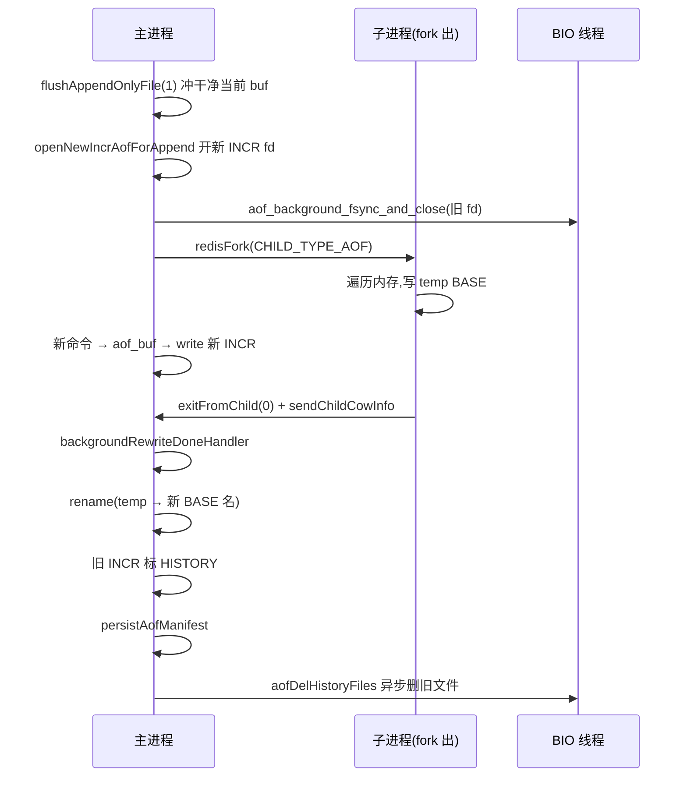

# 第十五章 · AOF:追加、rewrite 与 fsync 的三档取舍

> 篇:P4 持久化
> 主轴呼应:这一章是**取向⑤(可靠性)**与**取向①(把耗时从主线程解放)**的联手——AOF 用"重放"代替"快照",把丢失窗口压到 1 秒内;而 fsync 这个慢且必须的操作,被三档策略和 BIO 后台线程驯服;rewrite 复用 fork+COW,把压缩这个重活搬出主线程。

---

## 读完本章你会明白

1. **为什么 Redis 在已经有 RDB 之后,还要再搞一套 AOF**——因为 RDB 是"全量快照",粒度太粗,两次快照之间的几分钟写入全丢;AOF 记录每一条写命令,把丢失窗口压到最后一秒。
2. **`appendfsync` 三档(always/everysec/no)到底差在哪,为什么默认是 everysec**——三档不是三个"频率",而是三个"谁来承担 fsync 这个慢操作":主线程同步、BIO 后台线程、操作系统。
3. **everysec 模式下那个"空 buffer 也要补 fsync"的隐蔽 bug 是怎么回事**——老逻辑只在 buffer 非空时才 fsync,用户写一阵停了之后,page cache 里那部分可能永远落不了盘。
4. **MP-AOF(多部分 AOF)为什么把单文件拆成 base+incr+manifest**——rewrite 期间的增量直接落进一个新的 incr 文件,不必像老版本那样在内存里攒双缓冲,用文件追加换掉了手搓的内存缓冲 + 管道同步。
5. **`aof_use_rdb_preamble` 为什么让 base 文件用 RDB 格式**——rewrite 产出的就是一份"当前内存快照",直接复用 RDB 的紧凑二进制和快速加载代码,恢复时从"重放几 GB 文本"变成"rdbLoad + 重放少量增量"。

---

> **如果一读觉得太难:先只记住三件事**——
> ① AOF = 把每条写命令按执行顺序追加进文件,重启时从头重放一遍,内存状态就回来了([aof.c:1405](../../redis-8.0.2/src/aof.c#L1405) 的 `feedAppendOnlyFile`);
> ② 真正落盘靠 `appendfsync` 三档,默认 everysec = 主线程只 `write` 进 page cache,BIO 后台线程每秒一次 `fsync`([aof.c:1343](../../redis-8.0.2/src/aof.c#L1343)),最多丢 1 秒;
> ③ AOF 会无限膨胀,靠 rewrite 压缩——fork 一个子进程,扫一遍内存只输出"能达到当前状态的最小命令集",期间的新写入落进一个新的 incr 文件,完成后原子切换。
> 这三件事,就是 AOF 的全部。

---

> **一句话点破:AOF 用"记下每一条写命令"换来了细到一条的丢失窗口,用"把 fsync 下放给 BIO 线程"保住了单线程的吞吐,用"fork+COW 做 rewrite"把压缩这个重活搬出主线程,用"MP-AOF 多文件 + manifest + rename"换掉了老版本的双缓冲和管道同步——四件事合起来,才让"细粒度持久化"在单线程模型下真正可用。**

## 15.1 这块要解决什么:RDB 留下的那个"窗口"

上一章我们讲了 RDB。RDB 是"全量快照":周期性地把整个内存数据库 dump 成一份紧凑的二进制文件,恢复快、体积小,但有一个绕不开的硬伤——**粒度太粗**。假设 `save 900 1`(15 分钟内有 1 个 key 变化才触发),那么最坏情况下,服务器在两次快照之间崩溃,这 15 分钟内的所有写入全部丢失。对一个把 Redis 当主库用的在线业务来说,丢 15 分钟往往是不可接受的。

于是 Redis 给出了第二条持久化路线:**AOF(Append Only File,追加日志)**。它的思路朴素到近乎反常——

> 既然每条写命令执行完之后,内存里的状态就变了,那我把**每一条写命令本身**按执行顺序追加到文件里。重启时从头到尾重放一遍,内存状态就回来了。

就这么一句话,带来三个本质好处:①**粒度细到"每条命令"**,丢的最多是最后那一两条还没落盘的;②**文件是人类可读的 RESP 文本**(就是 `*3\r\n$3\r\nSET\r\n...` 那种多行 bulk),出问题能人工修;③**重放即恢复**,语义和正常执行一条命令完全一致,不存在 RDB 那种"快照格式和版本绑定"的兼容包袱。

代价当然也有:文件比 RDB 大(记的是命令序列而非压缩后的最终状态)、恢复比 RDB 慢(要逐条重放)、长期运行会无限膨胀(同一个 key `SET` 一万次,文件里就老老实实记了一万条)。前两个是机制本身带来的,第三个——Redis 用 **rewrite(重写)**来解决。而"什么时候把缓冲区真正写到磁盘"这个问题,催生了本章的灵魂:**appendfsync 三档策略**。

> **不这样会怎样**:如果没有 AOF,只有 RDB,会发生什么?想象一个把 Redis 当主库存的电商库存系统:`save 900 1` 配置下,假设服务器在第 14 分钟崩溃,这 14 分钟里所有扣减库存的命令全部丢失——超卖、对不上账,灾难性的。RDB 的"周期性全量快照"对这种场景粒度太粗。AOF 的存在就是把这个窗口从"分钟级"压到"秒级甚至零",代价是更大的文件和稍慢的恢复。这是 Redis 在"快但不丢"这条主轴上,给 RDB 打的那块补丁。

## 15.2 追加写:从命令执行到 AOF 缓冲

一条写命令(比如 `SET k v`)在 Redis 主线程里走完 `call()` 执行逻辑后,并不会立刻写文件。它会先被"传播(propagate)"——看 `propagateNow`([server.c:3390](../../redis-8.0.2/src/server.c#L3390))这段:

```c
/* server.c:3399-3402 */
if (server.aof_state != AOF_OFF && target & PROPAGATE_AOF)
    feedAppendOnlyFile(dbid,argv,argc);
if (target & PROPAGATE_REPL)
    replicationFeedSlaves(server.slaves,dbid,argv,argc);
```

传播有两个目标:**AOF** 和**从节点(replication)**。同一条写命令执行完之后,既要进 AOF 日志,也要发给从节点——这两条线在传播点汇合,后面章节讲复制时会看到。本章只看 AOF 这条。

`feedAppendOnlyFile`([aof.c:1405](../../redis-8.0.2/src/aof.c#L1405))做的事很直接:先把命令序列化成 RESP 格式(就是 `*3\r\n$3\r\nSET\r\n...` 那种多行 bulk,由 `catAppendOnlyGenericCommand` 拼装),如果跨 db 还顺手插一条 `SELECT`,然后拼到 `server.aof_buf` 这个 SDS 缓冲区尾部:

```c
/* aof.c:1437-1441 */
if (server.aof_state == AOF_ON ||
    (server.aof_state == AOF_WAIT_REWRITE && server.child_type == CHILD_TYPE_AOF))
{
    server.aof_buf = sdscatlen(server.aof_buf, buf, sdslen(buf));
}
```

注意这一步**只是写内存**,没有任何系统调用,所以主线程几乎不会被它拖慢。真正的写文件发生在事件循环每次轮回前的 `beforeSleep` 里(第二章 2.5 节那张 20 步表的步 11),它调用 `flushAppendOnlyFile(0)`([server.c:1821](../../redis-8.0.2/src/server.c#L1821))。

这里有一个关键设计:**命令先回复客户端、还是先落 AOF**?在 beforesleep 的步骤顺序里,`flushAppendOnlyFile`(步 11)必须在 `handleClientsWithPendingWrites`(步 13)之前。注释 [server.c:1817-1819](../../redis-8.0.2/src/server.c#L1817) 明说:"must be done before handleClientsWithPendingWrites ... in case of appendfsync=always"。为什么?因为当 `appendfsync=always` 时,Redis 要保证"**回复了客户端,就一定已经持久化**"。如果先写回复再刷 AOF,可能出现"客户端收到 OK 了、但 AOF 还没落盘就崩了"的不一致。先刷 AOF,再回回复,这条因果链才牢靠。

> **钉死这件事**:AOF 的写入路径是"命令执行完 → `feedAppendOnlyFile` 拼进 `aof_buf` 内存缓冲 → beforesleep 里 `flushAppendOnlyFile` 一把 `write` 到 fd → page cache"。整条路径上,主线程只做了"拼字符串"和"一次 write"——真正的脏活(fsync)被推迟到下一步,而且有办法不阻塞主线程。这是 AOF 能在单线程模型下不打垮吞吐的第一道防线。

但 `write(2)` 只保证数据到了内核 page cache,cache 在内存里,断电就没了。真正到磁盘还得 `fsync`——而这才是真正的性能杀手。

## 15.3 灵魂三档:appendfsync 与"谁来承担 fsync"

`write(2)` 把数据交给内核 page cache,但 cache 在内存里,断电就没了。要真正持久化,必须 `fsync`,逼内核把脏页刷到物理磁盘。问题是:`fsync` 极慢——一次机械盘的 fsync 可能要十几毫秒,比命令执行慢上千倍。如果每条命令都 fsync,Redis 的"单线程十万 QPS"神话当场破灭。

于是 Redis 给了三档,由 `appendfsync` 配置决定。三档的差别不是"频率",而是"**谁来承担 fsync 这个慢操作**"——这是理解 AOF 性能取舍的钥匙。三档的分流在 `flushAppendOnlyFile` 的 `try_fsync` 段([aof.c:1319](../../redis-8.0.2/src/aof.c#L1319))。

### 15.3.1 第一档 always:最安全,最慢,失败即崩

```c
/* aof.c:1326-1337 */
if (server.aof_fsync == AOF_FSYNC_ALWAYS) {
    /* redis_fsync is defined as fdatasync() for Linux in order to avoid
     * flushing metadata. */
    latencyStartMonitor(latency);
    if (redis_fsync(server.aof_fd) == -1) {
        serverLog(LL_WARNING,"Can't persist AOF for fsync error when the "
          "AOF fsync policy is 'always': %s. Exiting...", strerror(errno));
        exit(1);
    }
    latencyEndMonitor(latency);
    ...
}
```

`always` 模式下,主线程**同步**等 fsync 完成才继续。每条命令都保证已到磁盘,掉电一条不丢。但代价是每条写命令都要吃一次 fsync 延迟,QPS 会跌到几百到几千。源码里甚至有一条铁律:`always` 模式下如果 `write` 或 `fsync` 失败,Redis 直接 `exit(1)`([aof.c:1281](../../redis-8.0.2/src/aof.c#L1281) 的 write 失败分支、[aof.c:1336](../../redis-8.0.2/src/aof.c#L1336) 的 fsync 失败分支)——因为此时回复已经发给客户端了(因为 beforesleep 里先 flush AOF 再回回复),用户以为写成功了,数据却没落盘,这违反了 always 的契约,**宁可崩掉也不能撒谎**。注释 [aof.c:1276-1280](../../redis-8.0.2/src/aof.c#L1276) 写得直白:"We have a contract with the user that on acknowledged or observed writes are is synced on disk, we must exit."

### 15.3.2 第二档 everysec:默认值,工程上的甜点

```c
/* aof.c:1343-1350 */
} else if (server.aof_fsync == AOF_FSYNC_EVERYSEC &&
           server.mstime - server.aof_last_fsync >= 1000) {
    if (!sync_in_progress) {
        aof_background_fsync(server.aof_fd);   /* 交给 BIO 线程!*/
        server.aof_last_incr_fsync_offset = server.aof_last_incr_size;
    }
    server.aof_last_fsync = server.mstime;
}
```

每秒**最多**触发一次 fsync,但关键是这一句 `aof_background_fsync`——它**不自己 fsync,而是把活儿派给 BIO 后台线程**(15.4 节专讲)。主线程发完任务立刻返回,完全不阻塞。掉电最多丢最后一秒的数据,对绝大多数业务可接受,而性能几乎和无 fsync 一样。这就是为什么 `everysec` 是默认值:它在"可靠性"和"性能"之间找到了一个让两者都及格的平衡点。

注意 [aof.c:1345](../../redis-8.0.2/src/aof.c#L1345) 这个 `if (!sync_in_progress)` 的细节:`sync_in_progress` 来自 [aof.c:1180](../../redis-8.0.2/src/aof.c#L1180) 的 `aofFsyncInProgress()`,它查的是"BIO 线程里还有没有未完成的 fsync 任务"。如果上一秒的 fsync 还没回来(磁盘卡了),这一秒就**不发新任务**——避免在 BIO 队列里堆积越来越多的 fsync 请求。`server.aof_last_fsync = server.mstime` 仍然更新(标记"这一秒我尝试过了"),但实际 fsync 被跳过。这个"磁盘忙就跳过"的设计,是 everysec 保住主线程延迟的第二道保险(第一道是 15.3.3 的 2 秒退避)。

### 15.3.3 everysec 的 2 秒退避:对付磁盘突然变慢

`everysec` 还藏着一个精巧的"退避"机制。看 [aof.c:1182-1201](../../redis-8.0.2/src/aof.c#L1182) 这段——它在 `write` 之前判断"上一次 BIO fsync 还没回来":

```c
/* aof.c:1186-1201,精简 */
if (sync_in_progress) {
    if (server.aof_flush_postponed_start == 0) {
        /* 第一次发现 fsync 还没回来,记下开始推迟的时刻,本次 write 推迟 */
        server.aof_flush_postponed_start = server.mstime;
        return;
    } else if (server.mstime - server.aof_flush_postponed_start < 2000) {
        /* 还在等 fsync,且没超过 2 秒,继续推迟 write */
        return;
    }
    /* 超过 2 秒还卡着,那就硬写,并记一笔 aof_delayed_fsync 告警 */
    server.aof_delayed_fsync++;
    serverLog(LL_NOTICE,"Asynchronous AOF fsync is taking too long ...");
}
```

这个设计体现出对真实磁盘行为的深刻理解:fsync 的延迟方差极大(SSD 几毫秒,机械盘上偶尔几十毫秒,磁盘满时甚至几秒)。如果 fsync 卡住了,主线程还在拼命 `write` 进 page cache,page cache 越积越多,最终一次 `write` 都可能被内核堵住(因为脏页比例太高,内核的 writeback 强制介人)。`everysec` 的策略是:**如果 fsync 没回来,我连 write 都先等等,最多等 2 秒;超过 2 秒还卡着,那就硬写,并记一笔 `aof_delayed_fsync` 告警**。这个 `aof_delayed_fsync` 计数器会在 `INFO persistence` 里露出来(详见 15.10 验证物),运维可以盯它——这个数不为 0,说明磁盘扛不住了。

`everysec` 不是机械地"每秒一次",而是"每秒尝试一次,如果磁盘忙就礼貌地让一让,但绝不让超过两秒"——既保护了主线程的延迟,又保住了"最多丢一秒"的承诺(因为推迟的是 write,fsync 还是 BIO 线程在做,数据其实在 page cache 里,只是没追加到 AOF 文件末尾而已,丢的最多还是 1 秒)。

### 15.3.4 第三档 no:最快,最可能丢

配置成 `no` 时,Redis 永远不主动 fsync,把这件事完全交给操作系统——OS 觉得 page cache 脏页够多了就自己刷。性能最高(几乎零 fsync 开销),但掉电时可能丢掉几十秒的数据,具体多少看 OS 的刷脏页策略(`/proc/sys/vm/dirty_writeback_centisecs` 等)。这一档实际上是在说"可靠性我不要了,你随便"。

### 15.3.5 三档总览

**三档的取舍可以用一张表概括:**

| 档位 | 谁来 fsync | 主线程阻塞 | 最坏丢失 | 性能 | 适用 |
|------|-----------|-----------|---------|------|------|
| `always` | 主线程同步 | 每条都阻塞 | 一条不丢 | 最慢(几百-几千 QPS) | 金融级、数据极敏感 |
| `everysec` | **BIO 后台线程** | 不阻塞 | **≤1 秒** | 接近裸速 | **默认**,绝大多数场景 |
| `no` | 操作系统 | 不阻塞 | 几十秒 | 最快 | 缓存场景,丢得起 |

> **钉死这件事**:三档的本质不是"fsync 多频繁",而是"fsync 这个慢操作由谁承担"。`always` = 主线程自己等(最可靠但最慢);`everysec` = 下放给 BIO 后台线程(主线程不阻塞,丢 1 秒);`no` = 下放给 OS page cache(主线程不阻塞,丢几十秒)。**可靠性每升一档,就是把 fsync 这个慢操作从"更外面"往"更里面"挪一档**——离主线程越近,越可靠但越慢。这是取向⑤(可靠性)和取向①(把耗时从主线程解放)在持久化层的直接对撞,默认 everysec 是两者的妥协点。

## 15.4 把 fsync 赶出主线程:BIO 后台线程

`everysec` 之所以能既可靠又不卡主线程,全靠一个叫 **BIO(Background I/O)**的后台线程池。`aof_background_fsync`([aof.c:979](../../redis-8.0.2/src/aof.c#L979))只有一行,但它干的事是整个 everysec 模式的核心:

```c
/* aof.c:979-981 */
void aof_background_fsync(int fd) {
    bioCreateFsyncJob(fd, server.master_repl_offset, 1);
}
```

`bioCreateFsyncJob`([bio.c:248](../../redis-8.0.2/src/bio.c#L248))只是 `zmalloc` 一个 `bio_job`,填上 fd 和当前的 `master_repl_offset`(这个 offset 用来给 `WAITAOF` 命令判断"哪条命令已经 fsync 了",见后),然后 `bioSubmitJob(BIO_AOF_FSYNC, job)` 把它塞进 BIO_AOF_FSYNC 队列。主线程到这就返回了——**整个过程零阻塞**。

真正的 fsync 在 `bio.c` 的 worker 线程里执行([bio.c:311](../../redis-8.0.2/src/bio.c#L311)):

```c
/* bio.c:311-329,精简 */
} else if (job_type == BIO_AOF_FSYNC || job_type == BIO_CLOSE_AOF) {
    /* The fd may be closed by main thread and reused for another
     * socket, pipe, or file. We just ignore these errno because
     * aof fsync did not really fail. */
    if (redis_fsync(job->fd_args.fd) == -1 &&
        errno != EBADF && errno != EINVAL)
    {
        atomicSet(server.aof_bio_fsync_status, C_ERR);
        atomicSet(server.aof_bio_fsync_errno, errno);
        ...
    } else {
        atomicSet(server.aof_bio_fsync_status, C_OK);
        atomicSet(server.fsynced_reploff_pending, job->fd_args.offset);
    }
    ...
}
```

这段代码有三个细节值得抠:

**第一,fsync 失败不崩,只记原子变量。** 注意它不像 `always` 模式那样失败就 `exit(1)`,而是 `atomicSet(server.aof_bio_fsync_status, C_ERR)`——用原子变量记一笔,主线程在下一轮循环里查到这个状态才会处理。为什么 everysec 能这么"宽容"?因为 everysec 的契约本来就是"最多丢 1 秒",fsync 失败了丢的可能不止 1 秒,但那总比崩了强。这是一个"降级而非崩溃"的设计——磁盘临时抖一下,业务能继续跑,运维通过 `INFO` 看到 `aof_bio_fsync_status` 异常再去处理。注释 [bio.c:312-314](../../redis-8.0.2/src/bio.c#L312) 还专门解释:fd 可能已经被主线程关闭并复用成另一个 socket/pipe/file,这种情况 errno 是 EBADF/EINVAL,不算真失败——这是 fd 生命周期管理的边界细节。

**第二,fsync 成功后才更新 `fsynced_reploff_pending`。** `atomicSet(server.fsynced_reploff_pending, job->fd_args.offset)` 这一行,把"已经 fsync 到的复制 offset"推进到提交 job 时记下的那个 offset。这个值是 `WAITAOF` 命令(`WAIT numreplicas timeout asyncload` 的 AOF 版本)判断"客户端等的那条命令到底落盘没"的依据。主线程在 beforesleep 步 12([server.c:1829](../../redis-8.0.2/src/server.c#L1829))会读这个 pending 值,推进 `fsynced_reploff`,然后唤醒等着的 `WAITAOF` 客户端。这一套是 8.0 才补齐的 AOF 持久化进度确认机制,让 AOF 也能像复制那样"客户端确认写到了多少个节点/落了多少盘"。

**第三,`need_reclaim_cache` 的细节。** `bioCreateFsyncJob` 的第三个参数是 `need_reclaim_cache=1`([aof.c:980](../../redis-8.0.2/src/aof.c#L980))。fsync 成功后,worker 线程还会调 `reclaimFilePageCache`([bio.c:331-334](../../redis-8.0.2/src/bio.c#L331))——这是 7.0 引入的"主动回收 page cache"机制,用 `fallocate(FALLOC_FL_PUNCH_HOLE)` 把已经落盘的数据在 page cache 里打成洞,腾出内核内存。大 AOF 文件长期 append 会占满 page cache,这个回收是防止 Redis 把机器内存吃光的隐形防线。

> **钉死这件事**:BIO 后台线程把 fsync 这头"又慢又抖的大象"关进了笼子。主线程只做"把命令塞进 page cache"这件快事(一次 `write` 系统调用,微秒级),真正磨人的刷盘(几毫秒到几十毫秒)交给后台线程异步做,主线程通过原子变量(`aof_bio_fsync_status`/`fsynced_reploff_pending`)查询结果。这是**取向①(把耗时从主线程解放)**在持久化层的完美演绎——任何会阻塞主线程的操作,都必须有异步化的出路,否则单线程模型就破产了。

这里有个常被问的问题:**fsync 在后台线程做,主线程同时在 write 同一个 fd,难道不会竞争、不会数据错乱吗?** 不会。原因有两层:①`write(2)` 和 `fsync` 对同一个 fd 是安全的——`write` 追加数据到 page cache,`fsync` 把当前 cache 刷盘,内核有完善的锁保证一致性,`fsync` 刷的至多是"调用那一刻之前已写入的数据",主线程之后的新 write 这次刷不到也无妨,下一秒再刷;②fsync 失败不会让 Redis 崩,只是用原子变量记一笔(`aof_bio_fsync_status`),主线程在下一次循环里查到这个状态才会处理——把一个可能很慢且不可控的操作彻底异步化、解耦化。`write` 和 `fsync` 在不同线程对同一 fd 并发,是 Linux 内核保证的安全操作,Redis 利用了这一点。

## 15.5 技巧精解①:空 buffer 补 fsync——一个被忽视的丢数据 bug

这一节讲一个 everysec 模式下、曾经真实存在过、修了之后很多资料还在讲老逻辑的隐蔽 bug。理解它,你才真正理解 everysec 的"最多丢 1 秒"承诺。

先看老逻辑(简化,等价于 6.x 时代的代码):

```text
if (aof_buf 非空) {
    write(aof_buf)
    if (距上次 fsync >= 1 秒) fsync_in_background;
}
```

看起来没问题:有数据才写、才 fsync。但考虑这个场景:①用户写一阵命令,`write` 把命令塞进 page cache,BIO 线程每秒一次 fsync;②用户突然不写了(`aof_buf` 空),但这时距离上一次 fsync 可能还差 0.5 秒——也就是说,page cache 里还有最近 0.5 秒的脏数据没落盘;③从此再没有新命令进来,`aof_buf` 永远是空的,`flushAppendOnlyFile` 走"buffer 空就直接 return"的分支,**再也没有触发 fsync**;④这时候断电——page cache 里那 0.5 秒的数据丢了,但用户以为"我写完了,eachsec 应该保证最多丢 1 秒,这 0.5 秒应该没事啊?"——丢了。

这就是 bug:**用户停止写入后,最后那一秒的数据可能永远落不了盘**。Redis 7 修了这个 bug,看 `flushAppendOnlyFile` 开头的这段([aof.c:1148-1176](../../redis-8.0.2/src/aof.c#L1148)):

```c
/* aof.c:1148-1176,精简 */
if (sdslen(server.aof_buf) == 0) {
    if (server.aof_last_incr_fsync_offset == server.aof_last_incr_size) {
        /* 当前 incr 文件的所有数据都 fsync 过了,更新 fsynced_reploff_pending */
        if (!aofFsyncInProgress())
            atomicSet(server.fsynced_reploff_pending, server.master_repl_offset);
    } else {
        /* ★空 buffer 也要补 fsync 的修复★
         * 之前 everysec 模式只在 aof_buf 非空时才 fsync,
         * 如果用户在 fsync 被调用前停止写命令,page cache 里的数据无法及时落盘。 */
        if (server.aof_fsync == AOF_FSYNC_EVERYSEC &&
            server.mstime - server.aof_last_fsync >= 1000 &&
            !(sync_in_progress = aofFsyncInProgress()))
            goto try_fsync;       /* ← 即使 buffer 空,也去触发一次 fsync */

        if (server.aof_fsync == AOF_FSYNC_ALWAYS)
            goto try_fsync;
    }
    return;
}
```

注释 [aof.c:1159-1163](../../redis-8.0.2/src/aof.c#L1159) 把这个 bug 说得很清楚:"previously in AOF_FSYNC_EVERYSEC mode, fsync is called only when aof buffer is not empty, so if users stop write commands before fsync called in one second, the data in page cache cannot be flushed in time."

修复逻辑:进入 buffer 空的分支后,先看 `server.aof_last_incr_fsync_offset == server.aof_last_incr_size`——这俩相等表示"当前 incr 文件里所有写过的字节都已经 fsync 到位了",那就没什么事,只更新一下 `fsynced_reploff_pending`(为 `WAITAOF` 服务);**如果不相等,说明 incr 文件里还有字节没 fsync**,这时即使 buffer 空也要补一次 fsync——条件是"距上次 fsync ≥ 1 秒"且"没有 fsync 在进行中"。补的这次 fsync 走 `goto try_fsync`,跳到 15.3 节那个 `try_fsync` 标签,走 everysec 的正常 `aof_background_fsync` 路径。

> **钉死这件事**:everysec 模式下,即使 `aof_buf` 是空的,只要"当前 incr 文件还有字节没 fsync"且"距上次 fsync ≥ 1 秒",就会补一次 fsync。这个"空 buffer 补 fsync"的修复堵住了"用户停止写入后最后那一秒丢数据"的隐蔽窗口。它的存在说明:**"最多丢 1 秒"不是一句口号,而是一条需要在每一个边界条件(buffer 空、fsync 在进行、磁盘忙)下都被认真兑现的契约**。读源码读到这里,你才真正理解 everysec 三个字母的分量。

## 15.6 技巧精解②:rewrite 期间的增量不丢——MP-AOF 的精妙

AOF 有一个天然缺陷:**只追加,不删除**。对一个 key 做 `INCR` 一万次,AOF 里就老老实实记了一万条 `INCR`,但内存里这个 key 的最终状态只是一个数字。恢复时要重放一万次,既慢又浪费。**rewrite(重写)**就是来治这个病的:扫一遍当前内存数据库,对每个 key 只输出**能达到当前状态的最小命令集**,生成一份全新的、紧凑的 AOF。

### 15.6.1 什么时候触发 rewrite

触发方式有两种。手动:`BGREWRITEAOF` 命令,走 `bgrewriteaofCommand`([aof.c:2604](../../redis-8.0.2/src/aof.c#L2604))。自动:在 `serverCron` 里检查([server.c:1526](../../redis-8.0.2/src/server.c#L1526)):

```c
/* server.c:1527-1539 */
if (server.aof_state == AOF_ON &&
    !hasActiveChildProcess() &&
    server.aof_rewrite_perc &&
    server.aof_current_size > server.aof_rewrite_min_size)
{
    long long base = server.aof_rewrite_base_size ?
        server.aof_rewrite_base_size : 1;
    long long growth = (server.aof_current_size*100/base) - 100;
    if (growth >= server.aof_rewrite_perc && !aofRewriteLimited()) {
        serverLog(LL_NOTICE,"Starting automatic rewriting of AOF on %lld%% growth",growth);
        rewriteAppendOnlyFileBackground();
    }
}
```

翻译成人话:当 AOF 当前大小超过 `auto-aof-rewrite-min-size`(默认 64MB),且相对上次 rewrite 后的大小增长了 `auto-aof-rewrite-percentage`(默认 100%,即翻倍)时,自动触发一次后台重写。默认配置下就是"AOF 涨到 64MB 以上,且又翻了一倍,就压一次"。注意 `!hasActiveChildProcess()` 这个条件——rewrite 和 bgsave 不能同时跑(都是 fork 重活),如果 bgsave 正在进行,rewrite 等下一轮 cron 再试。

还有一个 `aofRewriteLimited()`([aof.c:932](../../redis-8.0.2/src/aof.c#L932))的细节:如果 rewrite 连续失败 ≥ 3 次,Redis 会指数退避(1 分钟、2 分钟、4 分钟……最多 1 小时)再重试,避免反复 fork 子进程又失败、留下一堆碎 INCR 文件。注释 [aof.c:910-929](../../redis-8.0.2/src/aof.c#L910) 解释得很细:"we may get a lot of very small INCR files"。

### 15.6.2 MP-AOF:为什么从单文件改多部分

rewrite 不是一瞬间的事,子进程遍历内存可能要几秒到几十秒。这期间主进程还在源源不断地处理新的写命令——这些命令**必须被记录下来**,否则 rewrite 完成后新 AOF 就丢了这段时间的数据。

Redis 6 及以前的做法是:只有一个 AOF 文件,rewrite 期间主进程要把新命令同时写进一个内存 `aof_rewrite_buf`(双缓冲),子进程结束后再通过管道把这部分 diff 追加到新文件。这套机制有两个毛病:①**占内存**——rewrite 期间所有新命令都要在内存里攒一份;②**复杂**——管道传输、缓冲区管理、父子进程同步,bug 面大。

Redis 7.0 引入 **Multi-Part AOF(MP-AOF)**,Redis 8 沿用。AOF 不再是单个文件,而是一个**目录**,里面有三类文件,由一个 `manifest.aof` 清单文件统一管理。看源码开头这段注释([aof.c:46-70](../../redis-8.0.2/src/aof.c#L46))和类型定义([server.h:1649-1673](../../redis-8.0.2/src/server.h#L1649)):

```c
/* server.h:1649-1673 */
typedef enum {
    AOF_FILE_TYPE_BASE  = 'b', /* BASE file */
    AOF_FILE_TYPE_HIST  = 'h', /* HISTORY file */
    AOF_FILE_TYPE_INCR  = 'i', /* INCR file */
} aof_file_type;

typedef struct {
    sds           file_name;
    long long     file_seq;
    aof_file_type file_type;
    long long     start_offset;  /* 该文件起始的复制 offset */
    long long     end_offset;    /* 该文件结束的复制 offset */
} aofInfo;

typedef struct {
    aofInfo     *base_aof_info;     /* 当前 BASE,最多一个,NULL 表示没有 */
    list        *incr_aof_list;     /* 当前 INCR 列表,rewrite 失败重试可能多个 */
    list        *history_aof_list;  /* 被 AOFRW 取代后的旧 BASE/INCR,待 BIO 删 */
    long long   curr_base_file_seq;
    long long   curr_incr_file_seq;
    int         dirty;              /* 内存 manifest 和磁盘不一致,需持久化 */
} aofManifest;
```

三类文件:

- **BASE**——某次 rewrite 产出的全量快照。manifest 里**最多一个** BASE,且永远是文件列表的第一个。
- **INCR**——BASE 之后累积的增量命令日志。**可能有多个**(比如 rewrite 失败重试期间,每次 fork 前都会开一个新 INCR),按 seq 顺序排列。
- **HISTORY**——被新版本取代的旧 BASE/INCR,rewrite 成功后由 BIO 线程异步删除。

文件命名规则在 [aof.c:72-78](../../redis-8.0.2/src/aof.c#L72):`.base`/`.incr` 后缀,RDB 格式加 `.rdb`,纯 AOF 格式加 `.aof`,manifest 加 `.manifest`,临时文件前缀 `temp-`。一个可能的 manifest 内容([aof.c:62-69](../../redis-8.0.2/src/aof.c#L62) 注释给的例子):

```text
file appendonly.aof.2.base.rdb seq 2 type b
file appendonly.aof.1.incr.aof seq 1 type h
file appendonly.aof.2.incr.aof seq 2 type h
file appendonly.aof.3.incr.aof seq 3 type h
file appendonly.aof.4.incr.aof seq 4 type i
file appendonly.aof.5.incr.aof seq 5 type i
```

这个例子里:当前 BASE 是 `appendonly.aof.2.base.rdb`(RDB 格式),当前 INCR 是 seq 4 和 seq 5(两个,说明 seq 3 那次 rewrite 失败了),seq 1/2/3 都已经标成 `type h`(HISTORY)等 BIO 删。

画出来,MP-AOF 的目录布局长这样:

```text
appendonlydir/                          ← server.aof_dirname(默认 appendonlydir)
├── appendonly.aof.manifest             ← 清单:记录所有文件的顺序与类型
├── appendonly.aof.2.base.rdb           ← 当前 BASE(RDB 二进制格式)
├── appendonly.aof.4.incr.aof           ← 当前 INCR #1(RESP 文本)
├── appendonly.aof.5.incr.aof           ← 当前 INCR #2(RESP 文本)
├── appendonly.aof.1.incr.aof           ← HISTORY(等 BIO 删)
├── appendonly.aof.2.incr.aof           ← HISTORY
├── appendonly.aof.3.incr.aof           ← HISTORY
└── temp-rewriteaof-bg-<pid>.aof        ← rewrite 进行中:子进程在写的临时 BASE
```

> **钉死这件事**:MP-AOF 把 AOF 从"单个大文件"拆成"目录 + BASE + INCR×N + manifest"。这个拆分不是"为了好看",而是让 rewrite 期间的增量数据有一个**天然的落点——一个新的 INCR 文件**,从而彻底干掉了老版本"内存双缓冲 + 管道同步"那套复杂机制。增量直接追加到文件,用 OS 的文件追加语义替代手搓的内存缓冲——这是取向④(简单优先)的一次漂亮胜利:用已有的、可靠的机制(文件追加 + rename)替换掉手搓的、易错的机制(内存缓冲 + 管道)。

### 15.6.3 rewrite 时序:fork 前开新 INCR,子进程写 BASE

理解 MP-AOF 的关键是 rewrite 的时序。看 `rewriteAppendOnlyFileBackground`([aof.c:2534](../../redis-8.0.2/src/aof.c#L2534))的开头,**fork 之前**先干两件关键事:

```c
/* aof.c:2548-2553 */
server.aof_selected_db = -1;        /* 强制下一条 feedAppendOnlyFile 发 SELECT */
flushAppendOnlyFile(1);             /* 把当前 aof_buf 冲干净 */
if (openNewIncrAofForAppend() != C_OK) { ... }  /* ★开一个新的 INCR 文件★ */
```

`openNewIncrAofForAppend`([aof.c:800](../../redis-8.0.2/src/aof.c#L800))是 MP-AOF 的灵魂。它在 **fork 之前**就把一个全新的 INCR 文件打开,作为此后所有新写命令的落点:

```c
/* aof.c:815-849,精简 */
temp_am = aofManifestDup(server.aof_manifest);  /* 复制一份 manifest 改 */
new_aof_name = sdsdup(getNewIncrAofName(temp_am, server.master_repl_offset));
new_aof_filepath = makePath(server.aof_dirname, new_aof_name);
newfd = open(new_aof_filepath, O_WRONLY|O_TRUNC|O_CREAT, 0644);  /* 开新 INCR */
...
if (persistAofManifest(temp_am) == C_ERR) goto cleanup;  /* 持久化 manifest */
...
/* 旧 fd 交给 BIO fsync+close,换成新 fd */
if (server.aof_fd != -1) {
    aof_background_fsync_and_close(server.aof_fd);  /* BIO_AOF_FSYNC+BIO_CLOSE_AOF */
    server.aof_last_fsync = server.mstime;
}
server.aof_fd = newfd;   /* ★主线程从此 write 到新 INCR★ */
```

注意 [aof.c:845-848](../../redis-8.0.2/src/aof.c#L845) 这个细节:旧的 `aof_fd` 不是直接 `close`,而是 `aof_background_fsync_and_close`——丢给 BIO 线程去"先 fsync 再 close"(走 `BIO_CLOSE_AOF` 任务类型,见 [bio.c:336-337](../../redis-8.0.2/src/bio.c#L336))。注释 [aof.c:842-844](../../redis-8.0.2/src/aof.c#L842) 解释:"in fsync everysec it's ok to delay the fsync as long as we grantee it happens"——everysec 模式下,旧 fd 的 fsync 可以延后,只要保证发生就行。

fork 之后,主进程和子进程各干各的:

```text
       主进程                                    子进程(fork 后)
       ──────                                    ─────────────
  fork 时刻 ──────────────────────────────────→  拿到 fork 时刻内存快照(COW)
  继续接客户端                                     遍历所有 db
  新命令 → feedAppendOnlyFile                    对每个 key 输出最小命令集
       → aof_buf                                 写 temp-rewriteaof-bg-<pid>.aof
       → flushAppendOnlyFile → write 到新 INCR   (这是未来的新 BASE)
  (主进程对新 INCR 的追加,子进程看不见)
  (子进程写的 temp BASE,主进程看不见)
                                                 写完 → exitFromChild(0)
  backgroundRewriteDoneHandler 收尾 ←──────────  sendChildCowInfo(报告 COW 大小)
```



于是 rewrite 期间的数据分成了天然的两半,谁也不用等谁:

- **子进程**:对着 fork 那一刻的内存快照(凭借 COW),产出新的 **BASE 文件**(temp 文件 `temp-rewriteaof-bg-<pid>.aof`)。它看不到主进程 fork 之后的新写入。
- **主进程**:fork 之后的所有新写命令,统统追加到**新 INCR 文件**(因为 fork 前已经 `openNewIncrAofForAppend` 把 `server.aof_fd` 换成了新 fd)。

子进程写完后发信号(`sendChildCowInfo` 顺带报告 COW 内存大小,见 [aof.c:2581](../../redis-8.0.2/src/aof.c#L2581)),主进程在 `backgroundRewriteDoneHandler`([aof.c:2691](../../redis-8.0.2/src/aof.c#L2691))里收尾。整个切换靠**文件 rename** 保证原子性——manifest 写成功之前,旧文件还在,挂了也能恢复。

> **钉死这件事**:MP-AOF 下 rewrite 的增量一致性,靠的是"fork 前开新 INCR,主进程从此往新 INCR 追加,子进程基于 fork 时刻快照写新 BASE"这个分工。**主进程的增量天然落进新 INCR 文件,子进程的全量天然落进新 BASE 文件,两者物理隔离、互不干扰**——既不用内存双缓冲,也不用管道同步。这套机制把"rewrite 期间不丢数据"这件事,从"手搓的复杂同步逻辑"降维成了"OS 文件追加的天然语义"。fork+COW 是这套机制能成立的物理前提(子进程拿到一致快照、主进程照常接客),这是 rewrite 复用 fork 的第二处收益(RDB 是第一处)。

### 15.6.4 backgroundRewriteDoneHandler:三步原子切换

rewrite 完成后的切换在 `backgroundRewriteDoneHandler`([aof.c:2691](../../redis-8.0.2/src/aof.c#L2691))里,核心是三步:

**第一步:temp BASE rename 成正式名([aof.c:2717-2734](../../redis-8.0.2/src/aof.c#L2717))。**

```c
/* aof.c:2713-2719 */
sds new_base_filename = getNewBaseFileNameAndMarkPreAsHistory(temp_am);
/* ↑顺便把旧 BASE 标成 HISTORY */
new_base_filepath = makePath(server.aof_dirname, new_base_filename);
if (rename(tmpfile, new_base_filepath) == -1) { ... 失败回滚 ... }
```

`getNewBaseFileNameAndMarkPreAsHistory` 干两件事:①生成新 BASE 的文件名(`appendonly.aof.<新 seq>.base.rdb`);②如果之前有旧 BASE,把它在 manifest 副本里标成 `type h`(HISTORY)。然后 `rename` 把子进程写的 temp 文件挪成正式 BASE 名——rename 在同一文件系统上是原子的。

**第二步:旧 INCR 标 HISTORY([aof.c:2769-2771](../../redis-8.0.2/src/aof.c#L2769))。**

```c
/* aof.c:2771 */
markRewrittenIncrAofAsHistory(temp_am);
```

这一步把"rewrite 开始前那个旧 INCR"(也就是 fork 前被 `aof_background_fsync_and_close` 关掉的那个)标成 HISTORY。注意**新 INCR**(fork 后开的那个,rewrite 期间主进程一直在往里写)**不标**——它要保留,因为它装的是 rewrite 期间到现在的增量。

**第三步:持久化 manifest([aof.c:2773-2785](../../redis-8.0.2/src/aof.c#L2773))。**

```c
/* aof.c:2774 */
if (persistAofManifest(temp_am) == C_ERR) { ... 失败回滚:删新 BASE、还原 ... }
aofManifestFreeAndUpdate(temp_am);  /* 用改好的 manifest 副本替换全局 */
```

注意整个切换是对一个 `temp_am`(manifest 的副本)操作的——先在副本上把所有改动做完(rename BASE、标 HISTORY),再 `persistAofManifest` 把副本写回磁盘,最后才用副本替换全局 `server.aof_manifest`。任何一步失败都能回滚(把已经 rename 的新 BASE `bg_unlink` 掉)。这是经典的"先在 staging 改,再原子提交"模式。

最后,[aof.c:2800](../../redis-8.0.2/src/aof.c#L2800) 的 `aofDelHistoryFiles()` 把 HISTORY 文件丢给 BIO 线程异步删——避免主线程被大文件 `unlink` 阻塞。

> **钉死这件事**:rewrite 完成后的切换是"temp BASE rename + 旧 BASE/INCR 标 HISTORY + manifest 持久化"三步,全部在一个 manifest 副本上操作,失败可回滚,成功才原子提交。**任何时刻崩溃都能恢复到一个一致的 AOF 状态**——要么看到旧 BASE + 旧 INCR,要么看到新 BASE + 新 INCR,绝不会看到半个切换。这种"用文件 rename + 清单持久化构建应用层事务"的思路,是 Unix 编程智慧的应用:rename 在同一文件系统上是原子的,要么看到旧文件,要么看到新文件,绝不会看到半个。

## 15.7 技巧精解③:aof_use_rdb_preamble——让 AOF 白嫖 RDB 的加载速度

rewrite 产出的 BASE 文件,本质上是什么?是"当前内存数据库的一份快照"。既然是快照,那为什么不用 RDB 格式来存?——这正是 `aof_use_rdb_preamble`(默认 yes)做的事。看子进程实际写文件的分支([aof.c:2477-2485](../../redis-8.0.2/src/aof.c#L2477)):

```c
/* aof.c:2477-2485 */
if (server.aof_use_rdb_preamble) {
    int error;
    /* 默认开:base 文件直接用 RDB 二进制格式,体积更小、加载更快 */
    if (rdbSaveRio(SLAVE_REQ_NONE,&aof,&error,RDBFLAGS_AOF_PREAMBLE,NULL) == C_ERR) {
        errno = error;
        goto werr;
    }
} else {
    /* 纯命令文本格式:遍历每个 key,输出 RPUSH/SADD/ZADD 等变长命令 */
    if (rewriteAppendOnlyFileRio(&aof) == C_ERR) goto werr;
}
```

`aof_use_rdb_preamble=on`(8.0 默认)时,BASE 直接调 `rdbSaveRio` 写成 RDB 二进制——**复用 RDB 的序列化代码**。这是 Redis 7+ 的标准做法,理由很直接:

1. **体积更小**:RDB 是紧凑二进制(变长整数编码、LZF 压缩),比 RESP 文本小得多。一个装 100 万元素的 zset,RDB 可能 20MB,纯文本 AOF 可能 80MB。
2. **加载更快**:RDB 是一次性 mmap + 解码,RESP 文本要逐行 `fgets` + 解析 + 命令分派,RDB 快一个数量级。
3. **代码复用**:rewrite 的"最终状态集"本质上就是一份快照,那直接复用 RDB 的 `rdbSaveRio` 就行了,不用维护两套"遍历内存输出快照"的逻辑。

注意那个 `RDBFLAGS_AOF_PREAMBLE` 标志——它告诉 `rdbSaveRio`"这次保存是作为 AOF 的 preamble(BASE)",加载时会用它来区分。

**关掉 `aof_use_rdb_preamble` 会怎样?** 走 `rewriteAppendOnlyFileRio`([aof.c:2374](../../redis-8.0.2/src/aof.c#L2374) 附近),纯文本模式:遍历每个 key,对每种类型输出**变长命令**(variadic commands)以减少命令数。比如一个装 1000 个元素的 list,不输出 1000 条 `RPUSH`,而是输出若干条 `RPUSH key e1 e2 ... e64`(每条最多 `AOF_REWRITE_ITEMS_PER_CMD=64` 个元素,见 [server.h:111](../../redis-8.0.2/src/server.h#L111)),把 1000 条压缩成 16 条。看 `rewriteListObject`([aof.c:1879](../../redis-8.0.2/src/aof.c#L1879)):

```c
/* aof.c:1885-1912,精简 */
if (count == 0) {
    int cmd_items = (items > AOF_REWRITE_ITEMS_PER_CMD) ?
        AOF_REWRITE_ITEMS_PER_CMD : items;       /* 每条最多 64 个 */
    if (!rioWriteBulkCount(r,'*',2+cmd_items) ||
        !rioWriteBulkString(r,"RPUSH",5) ||
        !rioWriteBulkObject(r,key)) { ... }
}
... 逐个写元素 ...
if (++count == AOF_REWRITE_ITEMS_PER_CMD) count = 0;  /* 攒满 64 个开新条 */
```

set 用 `SADD`、zset 用 `ZADD`、hash 用 `HMSET`,都是同样的变长命令套路。但即便如此,纯文本模式产出的 BASE 仍然比 RDB 大、加载比 RDB 慢——所以默认是 RDB preamble。

> **钉死这件事**:`aof_use_rdb_preamble=on` 让 AOF 的 BASE 文件白嫖了 RDB 的紧凑二进制和快速加载。重启时从"重放几 GB RESP 文本"变成"`rdbLoad` 一次性加载 BASE + 重放少量增量 INCR"——把 AOF 的"细粒度"和 RDB 的"快恢复"缝合在了一起。这也是为什么实践中 AOF 的恢复时间往往没想象中那么慢。变长命令(`RPUSH key e1..e64`,每条最多 `AOF_REWRITE_ITEMS_PER_CMD=64`)是纯文本模式为缩小体积做的努力,但终究比不过 RDB 二进制的紧凑度。

## 15.8 AOF 加载重放:rdbLoad base + 逐条重放 incr

讲完了写入,来看读取。Redis 启动时,如果开了 AOF,优先从 AOF 恢复(而不是 RDB),入口是 `loadAppendOnlyFiles`([aof.c:1734](../../redis-8.0.2/src/aof.c#L1734))。它按 manifest 顺序加载:先 BASE,再逐个 INCR。

### 15.8.1 整体流程

```c
/* aof.c:1782-1840,精简 */
/* 1. 先算所有 BASE+INCR 的总大小,用于 loading 进度条 */
total_size = getBaseAndIncrAppendOnlyFilesSize(am, &status);
startLoading(total_size, RDBFLAGS_AOF_PREAMBLE, 0);

/* 2. 加载 BASE */
if (am->base_aof_info) {
    serverAssert(am->base_aof_info->file_type == AOF_FILE_TYPE_BASE);
    ret = loadSingleAppendOnlyFile(aof_name);
    /* 截断只有最后一个文件才允许 */
    if (ret == AOF_TRUNCATED && !last_file) ret = AOF_FAILED;
}

/* 3. 逐个加载 INCR */
if (listLength(am->incr_aof_list)) {
    listRewind(am->incr_aof_list, &li);
    while ((ln = listNext(&li)) != NULL) {
        aofInfo *ai = (aofInfo*)ln->value;
        serverAssert(ai->file_type == AOF_FILE_TYPE_INCR);
        ret = loadSingleAppendOnlyFile(aof_name);
        ...
    }
}
```

注意 [aof.c:1791](../../redis-8.0.2/src/aof.c#L1791) 这行 `ret == AOF_TRUNCATED && last_file`——**只有最后一个文件**允许被截断(`aof-load-truncated=yes` 时截断的部分会被丢弃并继续启动),中间文件截断视为致命错误。这很容易理解:最后一个文件可能是崩溃时没写完,截断是合理的;中间文件应该是上次 rewrite 完整切过来的,截断说明文件损坏,不能含糊。

### 15.8.2 RDB preamble 的加载分支

`loadSingleAppendOnlyFile`([aof.c:1480](../../redis-8.0.2/src/aof.c#L1480))先读 5 字节判断格式([aof.c:1520-1551](../../redis-8.0.2/src/aof.c#L1520)):

```c
/* aof.c:1523-1551,精简 */
char sig[5]; /* "REDIS" */
if (fread(sig,1,5,fp) != 5 || memcmp(sig,"REDIS",5) != 0) {
    /* 不是 RDB 格式,seek 回开头,按 RESP 文本读 */
    if (fseek(fp,0,SEEK_SET) == -1) goto readerr;
} else {
    /* RDB 格式(RDB preamble base,或老版 RDB-preamble AOF)*/
    rio rdb;
    int old_style = !strcmp(filename, server.aof_filename);
    if (fseek(fp,0,SEEK_SET) == -1) goto readerr;
    rioInitWithFile(&rdb,fp);
    if (rdbLoadRio(&rdb,RDBFLAGS_AOF_PREAMBLE,NULL) != C_OK) { ... 失败 ... }
    else { loadingAbsProgress(ftello(fp)); ... }
}
```

RDB 文件都以魔数 `"REDIS"` 开头(RDB 版本号跟着),所以读 5 字节比对就能判断。是 RDB 就走 `rdbLoadRio`(上一章讲过),否则按 RESP 文本读。这就是 BASE 用 RDB preamble 的加载路径——**复用 RDB 的快速加载代码**。

### 15.8.3 RESP 文本重放:伪造 client + 命令分派

非 RDB 部分(BASE 是纯文本模式、或所有 INCR)走 RESP 文本重放。核心思路([aof.c:1450-1472](../../redis-8.0.2/src/aof.c#L1450) 注释):**在 Redis 里,命令总是在一个 client 上下文里执行的,所以为了加载 AOF,需要伪造一个 client**。

```c
/* aof.c:1452-1472 */
struct client *createAOFClient(void) {
    struct client *c = createClient(NULL);
    c->id = CLIENT_ID_AOF; /* 模块能识别这是 AOF client */
    /* AOF client 永远不能被阻塞(否则可能死锁,因为没人唤醒它) */
    c->flags = CLIENT_DENYBLOCKING;
    /* 设成 slave 等同步状态,Redis 就不会给它发回复 */
    c->replstate = SLAVE_STATE_WAIT_BGSAVE_START;
    return c;
}
```

注意三个细节:①`CLIENT_DENY_BLOCKING` 标志——重放时遇到 `BLPOP` 这种阻塞命令不能真阻塞(没人会往里 push 元素),要退化成立即返回;②`replstate = SLAVE_STATE_WAIT_BGSAVE_START`——伪装成从节点,Redis 就不会给这个假 client 发回复(`+OK` 之类的),避免回复污染输出缓冲;③`id = CLIENT_ID_AOF`——让模块能识别"这条命令来自 AOF 重放",做一些特殊处理。

重放主循环([aof.c:1554-1661](../../redis-8.0.2/src/aof.c#L1554))做的事情,和正常处理一条客户端命令几乎一模一样:

```c
/* aof.c:1554-1646,精简 */
while(1) {
    /* 每读 1024 条命令,处理一下事件循环(让 loading 期间还能响应部分信号) */
    if (!(loops++ % 1024)) {
        loadingIncrProgress(...);
        processEventsWhileBlocked();      /* ★加载大文件时不完全卡死★ */
        processModuleLoadingProgressEvent(1);
    }
    /* 读 *argc\r\n */
    if (fgets(buf,sizeof(buf),fp) == NULL) { if (feof(fp)) break; else goto readerr; }
    if (buf[0] == '#') continue;          /* 跳过注释行(时间戳注解等)*/
    argc = atoi(buf+1);
    /* 逐个读参数 */
    argv = zmalloc(sizeof(robj*)*argc);
    for (j = 0; j < argc; j++) {
        fgets(buf,sizeof(buf),fp);        /* $len\r\n */
        len = strtol(buf+1,NULL,10);
        argsds = sdsnewlen(SDS_NOINIT,len);
        fread(argsds,len,1,fp);           /* 读 len 字节 */
        fread(buf,2,1,fp);                /* 丢 CRLF */
        argv[j] = createObject(OBJ_STRING,argsds);
    }
    /* 命令查找 + 执行,完全复用 processCommand 的分派逻辑 */
    cmd = lookupCommand(argv,argc);
    if (cmd->proc == multiCommand) valid_before_multi = valid_up_to;  /* 记 MULTI 前 offset */
    if (fakeClient->flags & CLIENT_MULTI && fakeClient->cmd->proc != execCommand) {
        queueMultiCommand(fakeClient, cmd->flags);   /* MULTI 内的命令入队 */
    } else {
        cmd->proc(fakeClient);                       /* ★直接调命令处理函数★ */
    }
    freeClientArgv(fakeClient);
    if (server.aof_load_truncated) valid_up_to = ftello(fp);  /* 记录合法 offset */
}
```

这段代码的精妙在于:**重放完全复用了正常命令执行的分派路径**——`lookupCommand` 找命令、`cmd->proc(fakeClient)` 直接调命令处理函数。这意味着所有命令的副作用(改 dict、过期检查、订阅通知等)在重放时和正常运行时**完全一致**。这就是 AOF "重放即恢复"的语义保障——不需要专门的"恢复模式",正常的命令执行逻辑就是恢复逻辑。

**过期检查怎么处理?** 重放时,如果 AOF 里有一条 `SET k v` 然后 `PEXPIRE k 1000`,重放完 `SET` 后这个 key 没过期,重放 `PEXPIRE` 后才开始计时——和正常运行时一模一样。Redis 5.0 之后,AOF 里还会记录带相对时间戳的过期 key(`#TS:` 注解,见 [aof.c:1386](../../redis-8.0.2/src/aof.c#L1386) 的 `genAofTimestampAnnotationIfNeeded`),重放时用这个时间戳恢复"这个 key 当时还剩多久过期"。`buf[0] == '#'` 那一行就是跳过这些注解行——它们只在重放时用,不参与命令执行。

**`processEventsWhileBlocked`**([aof.c:1567](../../redis-8.0.2/src/aof.c#L1567))是个贴心的设计:加载几 GB 的 AOF 要几十秒到几分钟,期间主线程完全卡在重放循环里,不响应任何客户端请求。但每 1024 条命令调一次 `processEventsWhileBlocked`,这个函数会非阻塞地处理一下事件循环——让 `INFO` 命令能查到 loading 进度(配合 `loadingAbsProgress`/`loadingIncrProgress` 那几个进度更新)、让 `SHUTDOWN` 这种信号能被响应。所以加载大 AOF 时,你仍然能 `redis-cli INFO` 看到 `Loading: 1` 和进度百分比,就是这个机制。

### 15.8.4 截断与 MULTI/EXEC 的处理

加载到 EOF 时不一定是正常结束——可能是崩溃时写了一半。代码分三种情况处理:

**读错误(readerr,[aof.c:1679](../../redis-8.0.2/src/aof.c#L1679))**:如果是 `feof`(读到文件尾),fall through 到 uxeof;否则是真的 IO 错误,`AOF_FAILED`。

**意外 EOF(uxeof,[aof.c:1686](../../redis-8.0.2/src/aof.c#L1686))**:如果 `aof-load-truncated=yes`(默认),用之前记的 `valid_up_to`(`ftello` 在每条命令成功后更新的)"**截掉**最后一个不完整的命令",继续启动,返回 `AOF_TRUNCATED`。否则拒绝启动,提示用 `redis-check-aof --fix` 修复。

**MULTI/EXEC 不完整([aof.c:1667-1672](../../redis-8.0.2/src/aof.c#L1667))**:如果重放完发现 fakeClient 还在 `CLIENT_MULTI` 状态(说明 AOF 里只有 `MULTI` 没有 `EXEC`,事务没提交),即使文件正常 EOF 也当成截断处理——回退到 `MULTI` 之前的 `valid_before_multi`。这避免了"半个事务"被部分重放导致的不一致。

> **钉死这件事**:AOF 的加载是"rdbLoad(BASE)+ 逐条重放(INCR)"。重放完全复用正常的命令分派路径(`lookupCommand` + `cmd->proc(fakeClient)`),所以"重放即恢复"的语义和正常运行一致——过期检查、MULTI/EXEC、订阅通知都按正常逻辑走。伪造的 `AOF client` 有三个标志(`CLIENT_DENY_BLOCKING` 不阻塞、`SLAVE_STATE_WAIT_BGSAVE_START` 不发回复、`CLIENT_ID_AOF` 让模块识别),让重放能在不污染输出、不死锁的前提下跑完。截断/MULTI 不完整的容错,靠每条命令成功后记录的 `valid_up_to` 来"截掉坏尾巴"。

## 15.9 aof_no_fsync_on_rewrite:rewrite/bgsave 时让出磁盘带宽

最后讲一个不那么显眼但运维常踩的配置:`aof_no_fsync_on_rewrite`(默认 no)。它的逻辑在 `flushAppendOnlyFile` 的 `try_fsync` 标签开头([aof.c:1320-1323](../../redis-8.0.2/src/aof.c#L1320)):

```c
/* aof.c:1319-1323 */
try_fsync:
    /* Don't fsync if no-appendfsync-on-rewrite is set to yes and there are
     * children doing I/O in the background. */
    if (server.aof_no_fsync_on_rewrite && hasActiveChildProcess())
        return;
```

意思很直白:**如果开了这个配置,且有子进程(bgsave 或 bgrewriteaof)在跑,主进程就跳过 fsync**。为什么要这样?因为 bgsave/bgrewriteaof 子进程正在大量写盘(RDB dump 或新 BASE 文件),如果主进程的 fsync 同时也在抢磁盘,磁盘带宽被打满,子进程的写盘会被拖慢,fork 时间拉长,COW 触发的页更多,主进程内存暴涨——一连串连锁反应。开这个配置就是"rewrite 期间,主进程让一让磁盘,把带宽全给子进程"。

代价是:**rewrite 期间崩溃,会多丢一些数据**(因为主进程没 fsync,page cache 里的脏页没落盘)。对 everysec 来说,正常最多丢 1 秒,rewrite 期间可能丢几十秒(看 rewrite 持续多久)。这是一个"rewrite 期间用可靠性换 rewrite 速度"的取舍。

什么时候开?大内存实例(几十 GB)、磁盘 IO 紧张(机械盘或共享云盘)、rewrite 频繁触发时,可以考虑开。但要注意:开了之后,rewrite 期间 `WAITAOF` 的客户端会等到 rewrite 结束才能确认(因为 fsync 被跳过,`fsynced_reploff_pending` 不推进)。

> **钉死这件事**:`aof_no_fsync_on_rewrite=on` 让主进程在 bgsave/bgrewriteaof 子进程在跑时跳过 fsync,把磁盘带宽让给子进程,避免父子进程抢磁盘导致 rewrite 拖长、COW 内存暴涨。代价是 rewrite 期间崩溃多丢数据。这是"rewrite 期间用可靠性换 rewrite 速度"的取舍,大内存 + 磁盘紧张的场景才开。

## 章末:回扣、五个为什么、往哪钻

### 主线回扣

这一章是**取向⑤(可靠性)**和**取向①(把耗时从主线程解放)**在持久化层的联手。

- **取向⑤**:AOF 用"记下每一条写命令"代替 RDB 的"周期性全量快照",把丢失窗口从"分钟级"压到"秒级甚至零"。三档 appendfsync 把"数据丢多少"变成一个用户可以明确选择的旋钮——`always` 给出"已确认的写绝不丢"的强契约,为此不惜在失败时 `exit(1)`([aof.c:1281](../../redis-8.0.2/src/aof.c#L1281)、[aof.c:1336](../../redis-8.0.2/src/aof.c#L1336));`everysec` 默认保住"最多丢 1 秒"的承诺,甚至为"用户停止写入后最后那 1 秒"修了空 buffer 补 fsync 的 bug([aof.c:1163-1167](../../redis-8.0.2/src/aof.c#L1163))。这种"宁崩不谎"+"每个边界条件都兑现契约"的硬骨头,正是可靠性的底色。

- **取向①**:fsync 是 Redis 路上最慢的一块石头,Redis 没有硬吞它,而是发明了 BIO 后台线程把它搬走。主线程只做"把命令塞进 page cache"这件快事,真正磨人的刷盘交给后台线程异步做。rewrite 复用 fork+COW,把"压缩这个重活"整体搬出主线程——子进程凭 COW 拿一致快照,主进程照常接客。这是事件循环单线程模型能扛住高写入吞吐的关键一招——**任何会阻塞主线程的操作,都必须有异步化的出路**(BIO 线程 / fork 子进程 / beforesleep 缝隙)。

- **取向④(简单优先)**:MP-AOF 用"多文件 + manifest + rename"替换掉老版本的"内存缓冲 + 管道同步",用文件系统已有的原子性替代手搓的同步逻辑;`aof_use_rdb_preamble` 让 rewrite 复用 RDB 的序列化和加载代码;rewrite 的变长命令(`RPUSH key e1..e64`)用 RESP 已有的多 bulk 格式压缩体积。都是"不重复造轮子"的体现。

### 五个为什么

**Q1:everysec 模式下,如果 BIO 线程的 fsync 一直失败(比如磁盘满了),会发生什么?**
不会崩。BIO 线程把失败状态记进 `server.aof_bio_fsync_status`(用原子变量,见 [bio.c:320](../../redis-8.0.2/src/bio.c#L320)),主线程下一轮循环查到 `C_ERR` 会处理(打日志)。业务能继续跑,只是 page cache 越积越多,丢数据的风险越来越大。运维通过 `INFO persistence` 看到 `aof_bio_fsync_status` 异常或 `aof_delayed_fsync` 飙升就该警觉。这是"降级而非崩溃"的设计——`always` 模式失败才 `exit(1)`,everysec 允许降级。

**Q2:rewrite 期间主进程在往新 INCR 写,子进程在写新 BASE,如果这时候主进程崩了(不是子进程),数据会怎样?**
看 `backgroundRewriteDoneHandler` 的切换顺序:temp BASE 先 rename 成正式名,旧 INCR 标 HISTORY,manifest 持久化——**只有这一整套切换完成后,新 BASE 才"生效"**。如果切换还没开始(子进程还没写完)主进程就崩了,那 manifest 还是老的状态(旧 BASE + 旧 INCR + rewrite 期间新开的那个 INCR),重启时按老 manifest 加载,rewrite 期间的数据都在那个新 INCR 里——**不丢**。如果切换到一半崩了(rename 成功但 manifest 没写),那 manifest 还是老的,新 BASE 是个孤儿文件(被下次启动时的清理逻辑或下次 rewrite 清掉),也不丢。MP-AOF 的这套设计在任何崩溃点都能恢复到一致状态。

**Q3:为什么 BASE 用 RDB 格式,INCR 不用?**
因为 BASE 是"某次 rewrite 时刻的全量快照",它装的是那一刻所有 key 的最终状态——这正好是 RDB 擅长的事(紧凑二进制 + 快速加载)。而 INCR 装的是"rewrite 之后的增量命令流",每条命令是独立的 RESP 文本——这正好是 AOF 的原生格式(可追加、可重放、人类可读)。把两者用各自最擅长的格式存,是"编码自适应"(取向③)在持久化层的体现。如果 INCR 也用 RDB,那每条新命令都要触发一次"全量快照",完全失去了 AOF 的增量语义。

**Q4:rewrite 期间的那段增量,为什么不用管道传给子进程合并进新 BASE(老版本的做法)?**
老版本(6.x)确实这么做:子进程写完 temp 文件后,主进程把 `aof_rewrite_buf` 里的增量通过管道发给子进程,子进程追加到 temp 文件末尾。这套机制的问题:①子进程要"等着"接收管道数据,父子同步复杂;②增量在内存里攒一份(`aof_rewrite_buf`),大流量下占内存;③管道读写有边界处理、缓冲管理。MP-AOF 直接把增量落进一个新 INCR 文件,主进程的 `feedAppendOnlyFile` → `write` 路径完全不变,只是 fd 换了——零额外内存、零管道同步。代价是 BASE 和 INCR 分两个文件,但 manifest 把它们管得好好的。

**Q5:AOF 和 RDB 同时开,重启时从哪个恢复?**
从 AOF。看 `loadAppendOnlyFiles` 的调用点(在 `loadDataFromDisk` 里):如果 `aof_state == AOF_ON`,优先 `loadAppendOnlyFiles`;只有 AOF 关闭时才从 RDB 恢复。理由是 AOF 的粒度更细(每条命令),数据更完整。生产环境几乎都是**两者都开**——AOF 保日常不丢,RDB 做兜底快照(也用于快速重启和备份)。注意 RDB 文件和 AOF 目录是分开存的,互不干扰。

### 想继续深入往哪钻

- 想看 manifest 文件的读写细节:读 [aof.c](../../redis-8.0.2/src/aof.c) 的 `aofLoadManifestFromFile`、`persistAofManifest`、`aofInfoFormat`(manifest 行格式:`file <name> seq <n> type <b|h|i>`)。
- 想看 BIO 线程池的完整实现:读 [bio.c](../../redis-8.0.2/src/bio.c)——它不光做 AOF fsync,还做 `BIO_CLOSE_FILE`(异步关 fd)、`BIO_LAZY_FREE`(异步释放大对象,见第十九章 lazyfree)。三种 job 类型共用同一套 worker 线程框架。
- 想理解 `WAITAOF` 命令怎么和 BIO fsync 配合:读 [aof.c](../../redis-8.0.2/src/aof.c) 里 `fsynced_reploff_pending`/`fsynced_reploff` 的使用,以及 `beforeSleep` 步 12([server.c:1829](../../redis-8.0.2/src/server.c#L1829))的 `handleClientsWithPendingWrites` 之前如何唤醒 `WAITAOF` 客户端。
- 想看老版本(6.x)AOF 的"内存双缓冲 + 管道同步"是怎么做的:对照读 Redis 6.2 的 `aof.c`,看 `aofRewriteBufferWrite`、`aofRewriteAppendOnlyAppendOnlyAppendOnlyAppendOnlyFile` 等函数——感受 MP-AOF 把它们全删了的清爽。

### 引出下一章

至此,持久化这条线讲完了:RDB 解决"全量快照",AOF 解决"细粒度日志",rewrite 解决"AOF 膨胀",MP-AOF 解决"rewrite 的增量一致性",BIO 线程解决"fsync 阻塞主线程",三档 appendfsync 解决"丢多少 vs 慢多少"。但这一切都建立在一个前提上——**这台 Redis 是孤立的、数据只存在于它自己的内存里**。一旦它挂了,即使有持久化,恢复也要时间,这段时间业务是断的。真正的生产系统,需要的是**一台挂了,另一台立刻顶上,数据无损**。这就要求把单机的状态**复制**到其他节点。下一章(P5 复制)我们就进入这个主题:Redis 是怎么把一台主节点的写命令,近实时地同步到一个或多个从节点上的——这背后又是一套精巧的握手、全量同步、增量同步(PSYNC)机制。而 AOF 的"命令传播"机制(`feedAppendOnlyFile` → `replicationFeedSlaves`),正是复制的地基之一。

---

## 验证物:如何亲手确认本章的设计

> 说明:本书写作环境为 Windows,无法直接运行 redis-server(8.0 依赖 fork/epoll 等 Linux 特性)。以下 (1) gdb 断点脚本 (2) 源码常量锚点 (3) INFO persistence 观察项 均为可复现的精确指引,供读者在 Linux 环境(Ubuntu 22.04 / CentOS 8 等)对 redis-8.0.2 源码 `make no-opt` 编译后自行验证。**本书不附编造的运行输出**——凡未实跑的,只给脚本与预期观察变量,不写具体数值。

### 1. gdb 断点脚本

编译:`cd redis-8.0.2 && make no-opt`(带 -g)
启动:`gdb ./src/redis-server`,配置文件里设 `appendonly yes`、`appendfsync everysec`。

```gdb
(gdb) break flushAppendOnlyFile       # 主写入入口,aof.c:1143
(gdb) break aof_background_fsync      # 派 fsync 给 BIO,aof.c:979
(gdb) break feedAppendOnlyFile        # 命令进 aof_buf,aof.c:1405
(gdb) break rewriteAppendOnlyFileBackground  # fork rewrite,aof.c:2534
(gdb) break openNewIncrAofForAppend   # 开新 INCR,aof.c:800
(gdb) break backgroundRewriteDoneHandler    # rewrite 收尾,aof.c:2691
(gdb) break loadAppendOnlyFiles       # 启动加载,aof.c:1734
(gdb) break loadSingleAppendOnlyFile  # 单文件加载,aof.c:1480
(gdb) run /path/to/redis.conf --port 6379

# 另开终端 redis-cli 执行:SET foo bar
# gdb 在 feedAppendOnlyFile 停下,观察命令进 buffer:
(gdb) print server.aof_state          # 预期:1(AOF_ON)
(gdb) print sdslen(server.aof_buf)    # 预期:SET 命令的 RESP 字节数(*3\r\n$3\r\nSET...)
(gdb) continue
# 在 flushAppendOnlyFile 停下(下一轮 beforesleep):
(gdb) print server.aof_fsync          # 预期:2(AOF_FSYNC_EVERYSEC)
(gdb) print server.aof_last_fsync     # 预期:上次 fsync 的 mstime
(gdb) print server.mstime - server.aof_last_fsync  # 预期:>=1000 就会触发 fsync
# 单步到 aof.c:1346,观察 aof_background_fsync 被调:
(gdb) step
(gdb) print fd                        # 预期:当前 server.aof_fd

# 触发一次 BGREWRITEAOF,观察 MP-AOF 切换:
(gdb) continue
# redis-cli 执行:BGREWRITEAOF
# gdb 在 rewriteAppendOnlyFileBackground 停下:
(gdb) print server.aof_manifest->curr_incr_file_seq  # 预期:当前 INCR seq
(gdb) break aof.c:2571                # redisFork 调用点
(gdb) continue
# fork 后,在 backgroundRewriteDoneHandler 观察 rename:
(gdb) print server.child_pid          # 预期:子进程 pid
(gdb) print tmpfile                   # 预期:temp-rewriteaof-bg-<pid>.aof
```

**预期观察**(基于源码 [aof.c:1143](../../redis-8.0.2/src/aof.c#L1143) 起的 `flushAppendOnlyFile` 逻辑,本书未实跑):`AOF_FSYNC_EVERYSEC=2`;每秒最多一次 `aof_background_fsync` 被调,且仅在 `!sync_in_progress` 时;`BGREWRITEAOF` 会触发 `openNewIncrAofForAppend` 开新 fd,然后 `redisFork`。

### 2. 源码常量锚点(带行号,从 redis-8.0.2 源码 Grep 核实)

| 常量/字段 | 位置 | 值/说明 |
|----------|------|---------|
| `AOF_OFF/ON/WAIT_REWRITE` | server.h:308-310 | 0/1/2(AOF 状态机) |
| `AOF_FSYNC_NO/ALWAYS/EVERYSEC` | server.h:581-583 | 0/1/2(三档) |
| `AOF_FILE_TYPE_BASE/HIST/INCR` | server.h:1650-1652 | 'b'/'h'/'i'(MP-AOF 三类) |
| `aofManifest` 结构 | server.h:1663-1673 | base_aof_info/incr_aof_list/history_aof_list/dirty |
| `AOF_REWRITE_ITEMS_PER_CMD` | server.h:111 | 64(rewrite 变长命令每条最多元素数) |
| `feedAppendOnlyFile` | aof.c:1405 | 命令 → RESP → aof_buf |
| `flushAppendOnlyFile` | aof.c:1143 | write + 三档 fsync 分流 |
| 空 buffer 补 fsync | aof.c:1163-1167 | everysec 隐蔽 bug 修复 |
| 2 秒退避 | aof.c:1192 | `mstime - postponed_start < 2000` |
| `aof_background_fsync` | aof.c:979 | 派 `BIO_AOF_FSYNC` 任务 |
| BIO worker fsync | bio.c:311-329 | `redis_fsync` + 原子记状态 |
| `openNewIncrAofForAppend` | aof.c:800 | fork 前开新 INCR |
| `rewriteAppendOnlyFileBackground` | aof.c:2534 | fork rewrite |
| RDB preamble 分支 | aof.c:2477-2485 | `rdbSaveRio` 写 BASE |
| `backgroundRewriteDoneHandler` | aof.c:2691 | rename + 标 HISTORY + persist |
| `loadAppendOnlyFiles` | aof.c:1734 | 启动加载入口 |
| RDB preamble 加载 | aof.c:1520-1551 | 读 "REDIS" 魔数判格式 |
| `aof_no_fsync_on_rewrite` | aof.c:1322 | 子进程在跑时跳过 fsync |
| `sendChildCowInfo` | aof.c:2581 | 报告 rewrite COW 内存 |

### 3. INFO persistence 观察项(需本地 redis-server)

> 以下操作需在 Linux 本地启动 redis-server(开 AOF)后用 redis-cli 执行。本书未实跑,仅列观察方法与预期字段含义。

```text
127.0.0.1:6379> CONFIG SET appendonly yes          # 开 AOF(会触发一次初始 rewrite)
127.0.0.1:6379> CONFIG SET appendfsync everysec    # 默认值
127.0.0.1:6379> SET k1 v1                          # 写几条
127.0.0.1:6379> INFO persistence                   # 观察 AOF 相关字段

# 关注这些字段(来自 INFO persistence 输出,源码 server.c 的 genRedisInfoString):
# aof_enabled:1            ← AOF 开启(AOF_ON 或 AOF_WAIT_REWRITE)
# aof_rewrite_in_progress:0  ← 是否有 rewrite 子进程在跑
# aof_rewrite_scheduled:0    ← 是否有 rewrite 排队等上一次结束
# aof_last_rewrite_time_sec:-1  ← 上次 rewrite 耗时(秒)
# aof_current_rewrite_time_sec:-1 ← 当前 rewrite 已耗时
# aof_bgrewrite_status:0(看 aof_lastbgrewrite_status,源码里是 C_OK/C_ERR)
# aof_rewrite_perc:100       ← 触发阈值百分比
# aof_rewrite_min_size:67108864  ← 64MB 触发阈值
# aof_current_size:<bytes>   ← 当前 AOF(BASE+INCR)总大小
# aof_base_size:<bytes>      ← 上次 rewrite 完的 base 大小
# aof_pending_rewrite:0
# aof_buffer_length:<bytes>  ← 当前 aof_buf 长度(应很小,被 beforesleep 及时冲)
# aof_buffer_length:<bytes>
# aof_rewrite_buffer_length:0  ← MP-AOF 后这个字段不再用(老版双缓冲大小)
# aof_pending_bio_fsync:0    ← BIO 队列里待 fsync 的任务数(对应 aofFsyncInProgress)
# aof_delayed_fsync:0        ← ★2 秒退避硬写的次数★,非 0 说明磁盘扛不住
# aof_fsync politics/strategy... (字段名以实际 INFO 输出为准)

# 触发一次 BGREWRITEAOF,观察 rewrite 全过程:
127.0.0.1:6379> BGREWRITEAOF
# Background append only file rewriting started
127.0.0.1:6379> INFO persistence
# 预期:aof_rewrite_in_progress:1,aof_current_rewrite_time_sec:开始计时
# 等几秒后:
127.0.0.1:6379> INFO persistence
# 预期:aof_rewrite_in_progress:0,aof_last_rewrite_time_sec:<耗时>
#         aof_current_size 缩小(rewrite 压缩了),aof_base_size 更新

# 观察目录布局(MP-AOF 的直接证据):
# ls appendonlydir/
# 预期:manifest + base.rdb + 若干 incr.aof (+ 可能的 history)
```

标注:以上预期基于源码常量(`AOF_FSYNC_*`/`AOF_FILE_TYPE_*`/`aofManifest` 结构,见 [server.h:308-310/581-583/1649-1673](../../redis-8.0.2/src/server.h#L308))与 `flushAppendOnlyFile`/`rewriteAppendOnlyFileBackground` 的逻辑推导,本书未在本地实跑;字段名以实际 `INFO persistence` 输出为准(不同版本字段略有增减),`aof_delayed_fsync` 是磁盘压力的关键指标。
