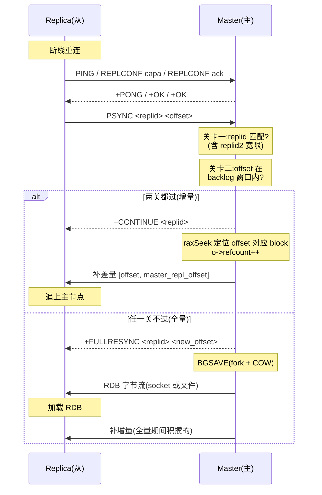

# 第十六章 · 主从复制:全量同步、增量复制与共享缓冲

> 篇:P5 复制与集群
> 主轴呼应:这一章是**取向⑤(可靠性靠持久化 + 复制)的招牌**——主节点身上的每一字节状态,都要有一份副本在从节点上随时待命;主节点倒下,从节点能立刻顶上,数据不丢。同时它把**取向①(把耗时从主线程解放)**和**取向④(简单优先)**拉到同一张桌子上:全量同步复用第十四章 RDB 的 fork+COW,命令传播只挂引用不阻塞,整个协议全异步——一个半同步的多数派协议(像 Raft)复杂度远超单线程事件循环能消受的范围,Redis 坚决不碰。

---

## 读完本章你会明白

1. **为什么 Redis 的复制是全异步,主节点确认了、回 OK 了,这条数据却仍可能丢**——这是 Redis 在 CAP 里主动选 AP 的根子,不是缺陷而是定位。理解了这条根本取舍,后面所有机制都顺理成章。
2. **为什么 Redis 7.0 把 backlog 从"环形数组"重写成"带引用计数的块链表"**——因为老实现里 backlog 和 N 个从节点的输出缓冲是分开的 N 份内存,新实现让它们共享同一份全局块链表、靠引用计数回收。一个写动作同时喂给所有消费者,百从节点场景内存省数量级。
3. **慢从节点拖累时,backlog 为什么宁可超出配置大小也不裁剪**——`incrementalTrimReplicationBacklog` 看到头部 block 的 `refcount != 1` 就立刻停手,宁愿内存多用一点也要保住"还能部分重同步"的可能。
4. **PSYNC 增量复制的两道关卡到底是什么**——replid 双 ID 校验(含故障转移后的 replid2 宽限)+ offset 落在 backlog 窗口内。两关都过才回 `+CONTINUE`,只补差量;否则退回全量。
5. **故障转移后 `shiftReplicationId` 为什么把 offset +1**——因为从节点 PSYNC 时请求的是"它还没收到的第一个字节",旧 replid 存进 replid2、`second_replid_offset = master_repl_offset + 1`,身份迁移的宽限期就此打开,避免原从节点风暴式全量。
6. **diskless 同步与 SWAPDB 加载凭什么近乎零不可用**——RDB 直接走 socket 不落盘省一次写一次读;replica 端用临时 dbarray 边收边解析,失败回滚原库,成功原子切换,加载期间仍能服务旧数据。

---

> **如果一读觉得太难:先只记住三件事**——
> ① 全量同步 = 主 fork 一个子进程写 RDB(第十四章那套 fork+COW,主线程不阻塞)+ 把这期间主节点继续收到的写命令缓存进 backlog + RDB 传完后补差量;
> ② 增量复制(PSYNC)= 从节点断线重连时带 `(replid, offset)` 来,主节点只要判断"这段 offset 还在我的 backlog 窗口里",就只补差量不重传整个 RDB;
> ③ Redis 7.0 起 backlog 不是环形数组,是一条**所有从节点 + backlog 共享**的 `replBufBlock` 双向链表,靠引用计数决定哪块可以回收——慢从节点还指着的块永远不删。
> 这三件事,就是本章的全部。

---

> **一句话点破:Redis 的复制把"主节点的状态"拆成三段搬运到从节点——历史快照(RDB)、此后每一条写命令(增量流)、断线后那一段缺口(backlog 差量);整套协议全异步,主线程从头到尾只做"挂引用、更新 offset"这种纳秒级操作,真正耗时的 fork 和网络发送全部外包给子进程和事件循环。**

## 16.1 这块要解决什么:单机的两个天生风险,复制怎么补

单机 Redis 把所有数据放在内存里,这带来两个与生俱来的风险。第一,**进程一死,内存里的世界瞬间归零**——第十四章的 RDB、第十五章的 AOF 能把数据落盘,但落盘和崩溃之间总有时间差,且磁盘本身也可能坏。第二,**单机吞吐有物理上限**——CPU、网卡、单线程模型都是天花板,一个实例扛不住全量读流量。

复制(replication)就是在这两个痛点上找补。主从复制做三件事:

1. **读写分离**:读流量摊到从节点,主节点专心写。
2. **容灾冗余**:主挂了从顶上,数据有一份(或多份)热副本。
3. **高可用基石**:没有复制就谈不上第十七章 Sentinel、第十八章 Cluster 的自动故障转移——故障转移的本质就是"把某个从节点提升为主"。

本章只讲最底层的那一环:**主从之间数据怎么同步**。

Redis 的复制从设计第一天起就做了一个决定性的取舍——**全异步**。主节点执行完写命令、把命令塞进复制缓冲区就立刻给客户端回 `OK`,**它不等任何从节点确认**。这是取向①(把等待从主线程解放)在复制上的直接落地,也是取向④(简单优先)的体现。半同步/强一致的复制协议(像 etcd 的 Raft、Spanner 的 Paxos)要协调 N 个节点的时钟与多数派、要处理 leader 选举与日志冲突,复杂度远超单线程事件循环能消受的范围。

代价写在明面上:**主节点确认了、回 OK 了,但还没传到从节点就宕机,这条数据就真的丢了**。这就是 CAP 定理在 Redis 复制上的具象——Redis 选了 **AP**(可用 + 分区容忍),放弃了 C(强一致)。这不是 Redis 不懂一致性,而是它清楚自己的定位:**内存数据库的第一价值是低延迟,强一致是副驾驶位置**。需要强一致的场景,你应该用 `WAIT` 命令显式等(且仍非绝对可靠),或者干脆换系统。

> **钉死这件事**:Redis 复制的全部设计都建立在"全异步"这条根本取舍上——主节点回 OK 时,数据可能还没到任何从节点。已确认的写仍可能丢,这是 Redis 用一致性换延迟的主动选择,不是缺陷。理解了这条根子,后面 backlog 为什么宁可超内存也要保住增量同步、为什么 `replid2` 要给故障转移一个宽限期,都是为了在"不丢"和"不重传"之间尽量往"不重传"靠——它们是异步取舍下的补救,不是对异步本身的否定。

理解了这个根本取舍,我们就能从容地看后面每一个机制——它们都是在这条主线下,把"不丢不重不阻塞"三者往最优处推。

## 16.2 全量同步:复用第十四章 RDB 的 fork + COW

一个从节点第一次连上来,或者断了重连却无法做增量同步时,主节点就得走**全量同步(full resync)**。它的逻辑直白到一句话:**主节点拍一张当前内存的快照(RDB),发给从节点;从节点加载 RDB 把内存重建到快照那一刻;主节点再把快照之后积攒的增量命令补发过去**。

这里有一个 Redis 最漂亮的复用:**全量同步没有为复制单独发明一套快照机制,而是直接复用第十四章的 RDB 持久化**。回忆第十四章:`BGSAVE` 命令走 `rdbSaveBackground`([rdb.c:1642](../../redis-8.0.2/src/rdb.c#L1642)),`fork` 出一个子进程,子进程拿着 COW(copy-on-write)的内存视图慢慢把整个数据库写成 RDB 文件,**主线程在这期间继续服务客户端,完全不阻塞**。全量同步就是主节点对自己执行一次 `BGSAVE`,只是把输出目标从磁盘换成"发给从节点"。

入口是从节点发来的 `PSYNC` 命令。看 `replication.c` 里 `syncCommand` 的全量分支([replication.c:1144](../../redis-8.0.2/src/replication.c#L1144)):

```c
/* replication.c:1144-1157 */
/* Full resynchronization. */
server.stat_sync_full++;

/* Setup the slave as one waiting for BGSAVE to start. */
c->replstate = SLAVE_STATE_WAIT_BGSAVE_START;
if (server.repl_disable_tcp_nodelay)
    connDisableTcpNoDelay(c->conn);
c->repldbfd = -1;
c->flags |= CLIENT_SLAVE;
listAddNodeTail(server.slaves,c);

/* Create the replication backlog if needed. */
createReplicationBacklogIfNeeded();
```

这段代码做了三件事:把从节点标记成"等待 BGSAVE 启动"状态、把它挂进 `server.slaves` 列表、顺便确保 backlog 存在(没有就建一个)。接下来 `syncCommand` 要决定怎么发起这次 BGSAVE。这里分三种情况([replication.c:1159-1227](../../redis-8.0.2/src/replication.c#L1159)):

**情况一:此刻正好有另一个从节点触发的磁盘目标 BGSAVE 在跑。** 检查它能不能搭便车——只要 capability 匹配,新从节点直接复用同一次 fork,把那个从节点的输出缓冲 `copyReplicaOutputBuffer` 拷一份过来([replication.c:1188-1190](../../redis-8.0.2/src/replication.c#L1188)),然后 `replicationSetupSlaveForFullResync`。这是 Redis 在"多从节点同时上线"场景的关键优化——**N 个从节点同时来,只 fork 一次**。fork 是个不便宜的操作(要复制页表、COW 后写多了内存翻倍),能省一次是一次。

**情况二:此刻有 socket 目标(diskless)的 BGSAVE 在跑。** 这种没法搭便车——socket 目标是子进程直接把 RDB 字节流打到每个从节点的 socket 上,新来的从节点只能等下一轮(`replication.c:1199-1205`)。

**情况三:没有任何 BGSAVE 在跑。** 这时再看 `repl_diskless_sync` 配置(下一节细讲)。如果开了 diskless 且配了延迟,就先攒着,等 `replicationCron` 定时器里再批量 fork([replication.c:1209-1215](../../redis-8.0.2/src/replication.c#L1209));否则立刻 `startBgsaveForReplication`([replication.c:1220](../../redis-8.0.2/src/replication.c#L1220))。

无论走哪种,`BGSAVE` 成功 fork 出来后,主节点会回复从节点一行 `+FULLRESYNC <replid> <offset>`——这就是 `replicationSetupSlaveForFullResync` 的核心动作([replication.c:801-806](../../redis-8.0.2/src/replication.c#L801)):

```c
/* replication.c:801-806 */
buflen = snprintf(buf,sizeof(buf),"+FULLRESYNC %s %lld\r\n",
                  server.replid,offset);
if (connWrite(slave->conn,buf,buflen) != buflen) {
    freeClientAsync(slave);
    return C_ERR;
}
```

告诉从节点"你这次全量同步对应的复制 ID 是 `replid`、起始偏移量是 `offset`"。从节点记住这对值,下次断了就能拿它去试增量。注意这一行**故意延迟到 BGSAVE 真正 fork 出来那一刻才发**,因为 offset 必须精确对应 RDB 快照那一瞬——`replication.c` 在 `need_full_resync` 分支的注释里([replication.c:907-911](../../redis-8.0.2/src/replication.c#L907))把这点点破:"The reply must include the master offset at the time the RDB file we transfer is generated, so we need to delay the reply to that moment."

> **钉死这件事**:全量同步复用第十四章 RDB 的 fork+COW,是 Redis"绝不重复造轮子"哲学(取向④)的招牌——快照机制已经有一套了,复制直接拿来用。fork 在子进程里慢慢写 RDB,主线程一个字节都不阻塞(取向①);多个从节点同时来还能搭同一辆 fork 的车,N 个从节点一次 fork 搞定。一箭双雕:代码简单 + 主线程不卡。

### diskless 同步:RDB 直接走 socket,不落盘

全量同步默认是"磁盘目标":fork 出来的子进程把 RDB 写到磁盘文件,主节点再把文件内容读出来通过 socket 发给从节点。这中间多了一次磁盘写 + 一次磁盘读。

Redis 提供了一个更省的选项——`repl-diskless-sync yes`。开了之后,子进程**根本不写磁盘**,而是直接把 RDB 字节流打到从节点的 socket 上。看 `startBgsaveForReplication` 的分支判定([replication.c:942-960](../../redis-8.0.2/src/replication.c#L942)):

```c
/* replication.c:942-960 */
socket_target = (server.repl_diskless_sync || req & SLAVE_REQ_RDB_MASK)
              && (mincapa & SLAVE_CAPA_EOF);
...
if (socket_target)
    retval = rdbSaveToSlavesSockets(req,rsiptr);
else {
    /* Keep the page cache since it'll get used soon */
    retval = rdbSaveBackground(req, server.rdb_filename, rsiptr,
                               RDBFLAGS_REPLICATION | RDBFLAGS_KEEP_CACHE);
}
```

diskless 的好处是:**省一次磁盘写 + 一次磁盘读**。对那些磁盘慢、网络快的场景(比如 SSD 寿命敏感的容器环境、或挂载网络盘的实例),这一招能显著缩短全量同步时间。代价是:主节点子进程要同时给多个从节点发包,网络压力集中(对应地,diskless 模式下 socket 目标的 BGSAVE 不能搭便车,就是因为每个从节点的 socket 流都是独立的)。

但 diskless 还藏着一个更精妙的设计——**延迟触发**。看 `syncCommand` 情况三的判定([replication.c:1209-1215](../../redis-8.0.2/src/replication.c#L1209)):

```c
/* replication.c:1209-1215 */
if (server.repl_diskless_sync && (c->slave_capa & SLAVE_CAPA_EOF) &&
    server.repl_diskless_sync_delay)
{
    /* Diskless replication RDB child is created inside
     * replicationCron() since we want to delay its start a
     * few seconds to wait for more slaves to arrive. */
    serverLog(LL_NOTICE,"Delay next BGSAVE for diskless SYNC");
}
```

`repl-diskless-sync-delay` 默认 5 秒(config.c:3183,`createIntConfig("repl-diskless-sync-delay", ... 5, ...)`)。**第一个从节点来的时候不立刻 fork,而是等 5 秒**。这 5 秒里如果又有新的从节点连上来,它们都被记录在等待队列里;5 秒到点时,`replicationCron` 一次性 fork 一个子进程,这个子进程同时给所有等待中的从节点发 RDB(走 socket 多路分发)。

为什么要等?**fork 是个贵动作,要复制整个页表**。多个从节点先后到来时,如果每个来都立刻 fork,就是 N 次 fork;攒 5 秒合并成一次 fork,把 fork 的固定成本摊还到 N 个从节点上。这是一种典型的"延迟摊还"——用一点点额外的等待延迟,换显著的 CPU/内存节省。

> **不这样会怎样**:如果不延迟,每个从节点来就立刻 fork 一次。假设 10 个从节点在 1 秒内陆续连上来,主节点要 fork 10 次。fork 要复制页表(几十 GB 内存的实例,页表本身就是几十 MB),10 次连续 fork 会让主线程明显卡顿(COW 期间内存压力也大)。延迟 5 秒把它们合并成 1 次 fork,主线程轻松得多。代价是第一个从节点要多等 5 秒才拿到 RDB——这是显式可调的取舍,默认值 5 秒是经验上的平衡点。

### 从节点收尾:sendBulkToSlave 与 diskless load

主节点把 RDB 准备好(或者直接打到 socket),从节点开始收。磁盘目标模式下,主节点的事件循环挂一个 `sendBulkToSlave` 写回调([replication.c:1542](../../redis-8.0.2/src/replication.c#L1542)),每次 socket 可写就发一段:

```c
/* replication.c:1571-1598,精简 */
lseek(slave->repldbfd,slave->repldboff,SEEK_SET);
buflen = read(slave->repldbfd,buf,PROTO_IOBUF_LEN);   /* 从 RDB 文件读一段 */
...
if ((nwritten = connWrite(conn,buf,buflen)) == -1) {   /* 发给从节点 */
    ...
}
slave->repldboff += nwritten;
if (slave->repldboff == slave->repldbsize) {           /* 发完了 */
    closeRepldbfd(slave);
    connSetWriteHandler(slave->conn,NULL);
    if (!replicaPutOnline(slave)) { freeClient(slave); return; }
    replicaStartCommandStream(slave);                   /* 切到增量流模式 */
}
```

注意这里 RDB 是在主节点的**子进程**里生成的,主线程通过 `repldbfd` 读这个文件慢慢发给从节点——读和发都在事件循环里增量进行,不会一次性塞满内存。`sendBulkToSlave` 每次只读 `PROTO_IOBUF_LEN`(16KB)就返回,把控制权还给事件循环,等下次 socket 可写再继续。

从节点那边,`readSyncBulkPayload`([replication.c:2024](../../redis-8.0.2/src/replication.c#L2024))是接收主体。它有两种模式:**写到磁盘临时文件再加载**(传统模式),或者**直接喂给 RDB 解析器不落盘**(`repl-diskless-load`,5.0 引入)。后者对应从节点端的 diskless——主节点不落盘,从节点也不落盘,两端都省磁盘 I/O。

从节点的 diskless load 有两个子模式(配置 `repl-diskless-load`):

- **`empty`:** 只在当前数据库为空时启用。新建的从节点常用。
- **`swapdb`:** 总是启用,加载期间用一份临时 `dbarray`,成功后原子切换。

`swapdb` 是这两个里更精妙的——它让**从节点在全量同步期间仍能继续服务旧数据**,近乎零不可用窗口。看 `readSyncBulkPayload` 里 `swapdb` 的核心逻辑([replication.c:2238-2269](../../redis-8.0.2/src/replication.c#L2238)):

```c
/* replication.c:2238-2269,精简 */
if (server.repl_diskless_load == REPL_DISKLESS_LOAD_SWAPDB) {
    ...
    /* 异步加载:replid 没变时,加载期间继续服务旧数据 */
    if (memcmp(server.replid, server.master_replid, CONFIG_RUN_ID_SIZE) == 0)
        asyncLoading = 1;
}
...
if (server.repl_diskless_load == REPL_DISKLESS_LOAD_SWAPDB) {
    dbarray = disklessLoadInitTempDb();           /* 建临时 dbarray */
    functions_lib_ctx = functionsLibCtxCreate();
} else {
    dbarray = server.db;                          /* 直接灌当前 db */
    ...
}
...
/* 边收 RDB 边解析,灌进 dbarray */
if (rdbLoadRioWithLoadingCtx(&rdb,RDBFLAGS_REPLICATION,&rsi,&loadingCtx) != C_OK) {
    loadingFailed = 1;
}
```

加载成功后([replication.c:2334-2353](../../redis-8.0.2/src/replication.c#L2334)):

```c
/* replication.c:2334-2353,精简 */
if (server.repl_diskless_load == REPL_DISKLESS_LOAD_SWAPDB) {
    replicationAttachToNewMaster();
    serverLog(LL_NOTICE, "...: Swapping active DB with loaded DB");
    swapMainDbWithTempDb(dbarray);                 /* 原子切换 */
    functionsLibCtxSwapWithCurrent(functions_lib_ctx);
    ...
    disklessLoadDiscardTempDb(dbarray);            /* 老库异步释放 */
}
```

加载失败时([replication.c:2304-2316](../../redis-8.0.2/src/replication.c#L2304)),临时 `dbarray` 被丢弃、原库完整保留——**回滚**。这套设计的关键是:整个加载过程对原库是只读的(数据全灌进临时 dbarray),原库一直在那儿正常服务;只有最后那一次 `swapMainDbWithTempDb` 是原子的指针交换。从客户端视角看,就是"上一秒还能读到旧数据,下一秒全变成新数据"——切换瞬间近乎零不可用。

但这里有一个条件:`asyncLoading = 1` 仅在"replid 没变"时成立([replication.c:2247-2249](../../redis-8.0.2/src/replication.c#L2247))。如果主节点换了(replid 变了),说明这是全新的数据集,旧数据和正在加载的数据不是"同一段历史的不同时间点",继续服务旧数据有正确性风险,这时只能老老实实进入 loading 状态拒绝服务。这个判定是 swapdb 安全性的护栏。

> **钉死这件事**:`swapdb` 模式用"临时 dbarray + 原子指针交换"实现了加载期间的零不可用——RDB 灌进临时库,原库不受影响继续服务,只在最后一刻原子切换。这是 Redis 5.0 之后才有的,之前的全量同步必然有一段 loading 期间从节点不能服务。代价是要多占一份内存(临时库 + 原库并存),但换来的可用性对生产环境意义巨大。

## 16.3 命令传播:主线程只管塞,不等待

全量同步把历史快照送出去后,主从之间进入**命令传播(command propagation)**阶段——主节点此后执行的每一条写命令,都要原样复制给所有从节点。这一步是**异步的、不阻塞主线程的**。

入口在 `server.c` 的 `propagateNow`([server.c:3390](../../redis-8.0.2/src/server.c#L3390))。每条写命令执行完,Redis 都会调它,把命令按目标(AOF / 复制)分发:

```c
/* server.c:3390-3403 */
static void propagateNow(int dbid, robj **argv, int argc, int target) {
    if (!shouldPropagate(target))
        return;

    /* This needs to be unreachable since the dataset should be fixed during
     * replica pause (otherwise data may be lost during a failover) */
    serverAssert(!(isPausedActions(PAUSE_ACTION_REPLICA) &&
                   (!server.client_pause_in_transaction)));

    if (server.aof_state != AOF_OFF && target & PROPAGATE_AOF)
        feedAppendOnlyFile(dbid,argv,argc);
    if (target & PROPAGATE_REPL)
        replicationFeedSlaves(server.slaves,dbid,argv,argc);
}
```

注意中间那个 `serverAssert`([server.c:3396-3397](../../redis-8.0.2/src/server.c#L3396))——**故障转移期间主节点暂停过复制,这段时间内的写命令绝不能传播出去**(否则数据会在新主节点身上丢失)。这是 Sentinel/Cluster 故障转移正确性的护栏之一,断言式地把规则焊死。

`replicationFeedSlaves` 在 [replication.c:496](../../redis-8.0.2/src/replication.c#L496)。它做两件事:必要时先发一条 `SELECT` 切换到正确的 db,然后把命令按 RESP 协议序列化(`*argc\r\n$len\r\n...`)塞进**全局复制缓冲区**。注意它开头就 `if (server.masterhost != NULL) return;`(实际是 `replicationFeedSlaves` 内部通过 `server.slaveseldb` 等机制判断是否级联)——这一行是**级联复制**的关键:当本节点本身是从节点时,它不再自己造命令,而是把主节点发来的流原样转发给挂在自己下面的子从节点。这样一条复制链就能挂多级从节点,且它们都共享同一个 replid 和 offset 历史。

真正干活的底层是 `feedReplicationBuffer`([replication.c:390](../../redis-8.0.2/src/replication.c#L390))。这是整个复制的心脏,下一节专门讲它。

## 16.4 复制缓冲区:不是环形数组,是带引用计数的块链表

很多老资料会把 Redis 的 `repl_backlog` 描述成"固定大小的环形缓冲区(circular buffer)"。**那是 Redis 4.x 及更早的实现**。从 Redis 7.0 起,它被彻底重写成**一个全局共享的、由多个 `replBufBlock` 组成的双向链表**,backlog 和所有在线从节点通过引用计数共享同一份内存。这是 8.0.2 里你能在源码里看到的真实结构。

先看 `server.h` 里的数据结构定义和那张经典配图([server.h:1036-1061](../../redis-8.0.2/src/server.h#L1036)):

```text
+--------------+       +--------------+       +--------------+
| refcount = 1 |  ...  | refcount = 0 |  ...  | refcount = 2 |
+--------------+       +--------------+       +--------------+
     |                                            /       \
     |                                           /         \
 Repl Backlog                               Replica_A    Replica_B
```

每个块是一个 `replBufBlock`([server.h:1055-1061](../../redis-8.0.2/src/server.h#L1055)):

```c
/* server.h:1055-1061 */
typedef struct replBufBlock {
    int refcount;           /* Number of replicas or repl backlog using. */
    long long id;           /* The unique incremental number. */
    long long repl_offset;  /* Start replication offset of the block. */
    size_t size, used;
    char buf[];             /* 柔性数组,实际数据 */
} replBufBlock;
```

六个字段:`refcount`(被多少消费者引用)、`id`(单调递增编号)、`repl_offset`(本块起始 replication offset)、`size`/`used`(容量/已用)、`buf[]`(柔性数组,实际字节流)。

backlog 自身不持有数据,只持有几个指针和统计量([server.h:1212-1222](../../redis-8.0.2/src/server.h#L1212)):

```c
/* server.h:1212-1222 */
typedef struct replBacklog {
    listNode *ref_repl_buf_node; /* backlog 当前引用的链表节点 */
    size_t unindexed_count;      /* 距上次建索引后又攒了多少块 */
    rax *blocks_index;           /* 基数树索引,加速 offset 查找 */
    long long histlen;           /* Backlog actual data length */
    long long offset;            /* Replication "master offset" of first
                                  * byte in the replication backlog buffer.*/
} replBacklog;
```

backlog 是这条链表的"消费者之一",从节点(client)也是消费者。每个消费者都持有一个 `ref_repl_buf_node` 指针,指向它当前读到的那一块;读完一块就前进到下一块。

### 为什么不是环形数组:4.x 实现的三个痛点

要把 7.0 这次重写的价值讲透,得先回头看看 4.x 的老实现为什么不行。老版本的 `repl_backlog` 确实是一段固定大小的连续内存(`char* repl_backlog + repl_backlog_size`),逻辑上当成环形数组用,写入位置 `backlog_idx` 在环形里绕圈,超过末尾就回卷到开头。这个结构有三个难以根治的痛点。

**痛点一:backlog 和 N 个从节点的输出缓冲是 N+1 份独立内存。** 老实现里,backlog 是 backlog(环形数组),每个从节点的输出缓冲(`slave->reply` 链表)是从节点自己的。同一段写命令字节流,主节点要分别塞进 backlog 一次 + 每个 slave->reply 一次,共 N+1 份拷贝。如果实例挂了 100 个从节点,一条 `SET foo bar`(20 字节)要被 memcpy 101 次,内存占用是 101×20 字节。新实现里只有一份全局块,refcount++ 挂引用——一次 memcpy,N+1 个消费者共享,内存和 CPU 都是 O(1)。这是数量级的差距。

**痛点二:环形数组的"逻辑地址 vs 物理地址 + 回绕"边界 bug。** 环形数组天然要处理"写入位置绕过末尾回卷到开头"这件事。增量同步时,从节点带一个 offset 来,主节点要算"这个 offset 对应的字节在环形里物理位置是哪儿"——如果 offset 对应的范围横跨回绕点(一段在末尾、一段在开头),要把两段拼起来发给从节点。这个回绕边界处理是 bug 温床,4.x 系列修过多轮。块链表没有回绕——每个块是一段连续内存,链表顺序就是 offset 顺序,定位就是"找到包含 offset 的那个块,块内偏移 `offset - block.repl_offset`",没有任何边界特例。这是 7.0 把判定简化成两个整数比较(`backlog.offset <= psync_offset <= backlog.offset + histlen`)的隐性收益。

**痛点三:backlog 大小调整(`CONFIG SET repl-backlog-size`)的尴尬。** 环形数组是预分配的固定内存,要改大小得重新 malloc 一块、把老数据拷过去(或者直接清空重建)。4.x 的 `resizeReplicationBacklog` 就是这条路径——把老环形里的数据按"截取最新一段"的逻辑拷到新环形,代码不简单,且调整期间没法继续写。块链表天然支持渐变——新数据写进新块,老块按引用计数回收,backlog 大小调整本质就是"让裁剪更激进或更宽松",`resizeReplicationBacklog`([replication.c:180-185](../../redis-8.0.2/src/replication.c#L180))直接调 `incrementalTrimReplicationBacklog` 把超出部分裁掉就行,几行代码搞定。

> **钉死这件事**:7.0 这次重写不是"换个数据结构试试",是对老实现三个痛点的根治——N+1 份拷贝变 1 份、回绕边界 bug 消失、大小调整变成"调裁剪强度"。其中"N+1 份拷贝变 1 份"是数量级的节省,百从节点场景内存从 O(N) 降到 O(1)。这是 Redis 复制在 7.0 完成的一次架构跃迁,后续版本(包括 8.0.2)都建立在这套共享缓冲之上。

### feedReplicationBuffer:全局广播的心脏

`feedReplicationBuffer`([replication.c:390](../../redis-8.0.2/src/replication.c#L390))的核心逻辑分三步走。这个函数是 Redis 7.0 重写的精华,值得逐段拆开看。

**第一步,写数据。** 优先追加到链表尾部那个还没写满的 `replBufBlock`;写不下就新分配一块。新块的大小有上下限约束([replication.c:421-425](../../redis-8.0.2/src/replication.c#L421)):

```c
/* replication.c:421-425 */
/* Avoid creating nodes smaller than PROTO_REPLY_CHUNK_BYTES, so that we can
 * append more data into them, and also avoid creating nodes bigger than
 * repl_backlog_size / 16, so that we won't have huge nodes that can't trim
 * when we only still need to hold a small portion from them. */
size_t limit = max((size_t)server.repl_backlog_size / 16,
                   (size_t)PROTO_REPLY_CHUNK_BYTES);
size_t size = min(max(len, (size_t)PROTO_REPLY_CHUNK_BYTES), limit);
```

两个约束,两端都不让走极端:

- **下限 `PROTO_REPLY_CHUNK_BYTES = 16KB`**(server.h:164):不要造太碎的块,否则链表节点本身(`listNode` + `replBufBlock` 头部)的元数据开销占比太高,一个块装 16KB 数据 vs 装 64 字节数据,后者光元数据就占了一半。
- **上限 `repl_backlog_size / 16`**(默认 backlog 是 1MB,上限就是 64KB):不要造太大的块。这条约束的注释解释得很直白——"so that we won't have huge nodes that can't trim when we only still need to hold a small portion from them"(避免造出超大块,导致我们只想保留它一小段却无法裁剪)。引用计数是**块级**的,只要有一个消费者还指着某个块,整个块都不能释放。如果块太大,一个慢从节点拖着,backlog 就要为它保留一大块——内存浪费。块越小,引用计数的粒度越细,慢从节点拖累的范围越窄。

每写一段,`server.master_repl_offset` 和 `histlen` 同步加上这段字节数([replication.c:414-415](../../redis-8.0.2/src/replication.c#L414)):

```c
/* replication.c:414-415 */
server.master_repl_offset += copy;
server.repl_backlog->histlen += copy;
```

**第二步,分发引用。** 写完数据后,遍历所有在线从节点([replication.c:451-466](../../redis-8.0.2/src/replication.c#L451)):

```c
/* replication.c:451-466,精简 */
listRewind(server.slaves,&li);
while((ln = listNext(&li))) {
    client *slave = ln->value;
    if (!canFeedReplicaReplBuffer(slave)) continue;

    /* Update shared replication buffer start position. */
    if (slave->ref_repl_buf_node == NULL) {
        slave->ref_repl_buf_node = start_node;     /* 从节点引用起点 */
        slave->ref_block_pos = start_pos;
        ((replBufBlock *)listNodeValue(start_node))->refcount++;   /* 仅起点块 +1 */
    }
    ...
}
```

**注意只对起点块 `refcount++`,不是对每个写进去的块都加。** 这是个关键优化:从节点持有的是"我从哪一块开始读"的引用,它读完后会自己前进到下一块(那个前进动作会再次 `refcount++` 下一块、`refcount--` 当前块)。换句话说,**引用计数维护的是"当前正在读的那一块",而不是"读过的所有块"**。这样无论一个从节点读了多久,它身上始终只有一个引用,refcount 不会无限增长。

backlog 自己同理占一个引用([replication.c:469-477](../../redis-8.0.2/src/replication.c#L469)):

```c
/* replication.c:469-477 */
if (server.repl_backlog->ref_repl_buf_node == NULL) {
    server.repl_backlog->ref_repl_buf_node = start_node;
    ((replBufBlock *)listNodeValue(start_node))->refcount++;
    serverAssert(add_new_block == 1 && start_pos == 0);
}
```

这里有个细节:`serverAssert(add_new_block == 1 && start_pos == 0)`——backlog 只在"新建了第一块"时被初始化引用,且必须从块的开头开始。这是 backlog 的不变式:它一定是数据流的第一个消费者。

从节点此后通过 `writeHandler` 慢慢把节点里的数据发出去——**主线程只是挂个引用,真正发包由事件循环驱动**。

**第三步,裁剪。** 一旦 `histlen` 超过配置的 `repl_backlog_size`,就从链表头部开始回收([replication.c:485](../../redis-8.0.2/src/replication.c#L485))。但裁剪动作并不在这里展开,它被封装到 `incrementalTrimReplicationBacklog`——这是下一个主角。

### incrementalTrimReplicationBacklog:引用计数不裁剪被引用块

这是 Redis 7.0 重写最精华的函数,藏着一个让人拍案的取舍:**只要还有任何消费者指着头部块,backlog 宁可超出配置大小也绝不释放**。看 `incrementalTrimReplicationBacklog`([replication.c:317](../../redis-8.0.2/src/replication.c#L317)):

```c
/* replication.c:317-365,精简 */
void incrementalTrimReplicationBacklog(size_t max_blocks) {
    serverAssert(server.repl_backlog != NULL);

    size_t trimmed_blocks = 0;
    while (server.repl_backlog->histlen > server.repl_backlog_size &&
           trimmed_blocks < max_blocks)
    {
        /* We never trim backlog to less than one block. */
        if (listLength(server.repl_buffer_blocks) <= 1) break;

        /* Replicas increment the refcount of the first replication buffer block
         * they refer to, in that case, we don't trim the backlog even if
         * backlog_histlen exceeds backlog_size. This implicitly makes backlog
         * bigger than our setting, but makes the master accept partial resync as
         * much as possible. So that backlog must be the last reference of
         * replication buffer blocks. */
        listNode *first = listFirst(server.repl_buffer_blocks);
        serverAssert(first == server.repl_backlog->ref_repl_buf_node);
        replBufBlock *fo = listNodeValue(first);
        if (fo->refcount != 1) break;                       /* 关键! */

        /* We don't try trim backlog if backlog valid size will be lessen than
         * setting backlog size once we release the first repl buffer block. */
        if (server.repl_backlog->histlen - (long long)fo->size <=
            server.repl_backlog_size) break;

        /* Decr refcount and release the first block later. */
        fo->refcount--;
        trimmed_blocks++;
        server.repl_backlog->histlen -= fo->size;

        /* Go to use next replication buffer block node. */
        listNode *next = listNextNode(first);
        server.repl_backlog->ref_repl_buf_node = next;
        serverAssert(server.repl_backlog->ref_repl_buf_node != NULL);
        /* Incr reference count to keep the new head node. */
        ((replBufBlock *)listNodeValue(next))->refcount++;

        /* Remove the node in recorded blocks. */
        uint64_t encoded_offset = htonu64(fo->repl_offset);
        raxRemove(server.repl_backlog->blocks_index,
            (unsigned char*)&encoded_offset, sizeof(uint64_t), NULL);

        /* Delete the first node from global replication buffer. */
        ...
        listDelNode(server.repl_buffer_blocks, first);
    }

    /* Set the offset of the first byte we have in the backlog. */
    server.repl_backlog->offset = server.master_repl_offset -
                              server.repl_backlog->histlen + 1;
}
```

最关键的那一行就是 **`if (fo->refcount != 1) break;`**([replication.c:336](../../redis-8.0.2/src/replication.c#L336))。头部块(链表最老的那一块)的 `refcount`,正常情况下应该是 1——只有 backlog 自己引用它(因为最老的块,任何从节点都早已读过去了)。如果 `refcount != 1`,说明**有某个慢从节点还指着这块没读完**,这时 `break`,本轮裁剪到此为止。

注释把这条取舍解释得不能再直白了([replication.c:327-332](../../redis-8.0.2/src/replication.c#L327)):

> "This implicitly makes backlog bigger than our setting, but makes the master accept partial resync as much as possible."(这隐式地让 backlog 超过我们的配置大小,但让主节点尽可能多地接受部分重同步。)

翻译过来:**慢从节点拖累时,backlog 宁可内存多用一点,也要保住"还能给这个慢从节点做部分重同步"的可能**。如果为了内存严格裁剪,慢从节点需要的那些字节就没了,它一断线就得全量——全量同步的代价(fork + 传整个 RDB)远比多用几 MB backlog 内存大得多。这是"内存换全量同步"的精算取舍。

还有一个常量要讲——`max_blocks`。每次 `feedReplicationBuffer` 写完数据后调一次 `incrementalTrimReplicationBacklog(REPL_BACKLOG_TRIM_BLOCKS_PER_CALL)`,这个常量是 64([server.h:544](../../redis-8.0.2/src/server.h#L544) `#define REPL_BACKLOG_TRIM_BLOCKS_PER_CALL 64`)。意思是**每次最多裁 64 个块**。为什么要限制?看函数开头的注释([replication.c:312-316](../../redis-8.0.2/src/replication.c#L312)):

```c
/* replication.c:312-316 */
/* Generally, we only have one replication buffer block to trim when replication
 * backlog size exceeds our setting and no replica reference it. But if replica
 * clients disconnect, we need to free many replication buffer blocks that are
 * referenced. It would cost much time if there are a lots blocks to free, that
 * will freeze server, so we trim replication backlog incrementally. */
```

**裁剪动作是 `zfree` + `listDelNode`,如果一次裁太多,会卡住主线程。** 尤其是从节点断线时,它引用的那些块全部要回收——可能几百上千块。一次全裁会让事件循环这一轮显著变长。所以 Redis 把裁剪摊到多轮事件循环里做,每轮最多 64 块。这是又一个"把耗时切片塞进事件循环缝隙"的设计,呼应第二章的 beforesleep 哲学。

裁剪完后,backlog 重新计算自己的 `offset`([replication.c:368-369](../../redis-8.0.2/src/replication.c#L368)):

```c
/* replication.c:368-369 */
server.repl_backlog->offset = server.master_repl_offset -
                              server.repl_backlog->histlen + 1;
```

这个 `offset` 就是 backlog 现存最老数据的起始位置——后面 PSYNC 增量同步要靠它判断"从节点要的那段还在不在"。

> **钉死这件事**:Redis 7.0 把 backlog 从环形数组改成块链表 + 引用计数,最大的收益是把"backlog 的历史窗口"和"N 个从节点的追赶缓冲"统一成了同一条链表、同一份内存。一个写动作广播给所有消费者只需 O(1)——挂引用,真正发包外包给事件循环。慢从节点拖累时,`incrementalTrimReplicationBacklog` 看到 `refcount != 1` 就停手,宁可内存超配也要保住"还能部分重同步"——这是"内存换全量同步"的精算,因为全量同步的代价(fork + 整个 RDB)远大于多用几 MB backlog。老实现的环形数组里,backlog 和每个从节点的输出缓冲是分开的 N 份拷贝,百从节点场景内存翻 100 倍;新实现只有一份,内存省一个数量级。

### rax 稀疏索引:O(log) 定位起始 block

backlog 链表可能很长(几万个块),PSYNC 增量同步时怎么快速找到"offset 对应的那一块"?线性扫描整个链表是 O(N),几十万块的实例会卡住主线程。

Redis 的解法是**稀疏索引**——每隔 `REPL_BACKLOG_INDEX_PER_BLOCKS = 64` 块,在 radix tree 里记一条 `offset → listNode*` 的映射。看 `createReplicationBacklogIndex`([replication.c:212](../../redis-8.0.2/src/replication.c#L212)):

```c
/* replication.c:209-222 */
/* To make search offset from replication buffer blocks quickly
 * when replicas ask partial resynchronization, we create one index
 * block every REPL_BACKLOG_INDEX_PER_BLOCKS blocks. */
void createReplicationBacklogIndex(listNode *ln) {
    server.repl_backlog->unindexed_count++;
    if (server.repl_backlog->unindexed_count >= REPL_BACKLOG_INDEX_PER_BLOCKS) {
        replBufBlock *o = listNodeValue(ln);
        uint64_t encoded_offset = htonu64(o->repl_offset);
        raxInsert(server.repl_backlog->blocks_index,
                  (unsigned char*)&encoded_offset, sizeof(uint64_t),
                  ln, NULL);
        server.repl_backlog->unindexed_count = 0;
    }
}
```

每写满 64 块,把第 64 块的 `repl_offset` 作为 key、`listNode*` 作为 value 插进 rax。整个 backlog 链表的索引密度是 1/64——稀疏的。为什么不全索引?因为索引本身要占内存,每个块都索引就退化成"一份完整的偏移目录",内存开销等于链表本身。64 块索引一次,索引大小只有 1/64,且查找时 rax 定位到最近的索引点后,线性扫不超过 64 块就能找到目标——**O(64) 的常数线性扫 + O(log N) 的 rax 查找,总成本远小于全表线性扫**。

PSYNC 增量同步时,`addReplyReplicationBacklog`([replication.c:680](../../redis-8.0.2/src/replication.c#L680))用 rax 快速定位([replication.c:702-733](../../redis-8.0.2/src/replication.c#L702)):

```c
/* replication.c:702-733,精简 */
listNode *node = NULL;
if (raxSize(server.repl_backlog->blocks_index) > 0) {
    uint64_t encoded_offset = htonu64(offset);
    raxIterator ri;
    raxStart(&ri, server.repl_backlog->blocks_index);
    raxSeek(&ri, ">", (unsigned char*)&encoded_offset, sizeof(uint64_t));
    if (raxEOF(&ri)) {
        /* No found, so search from the last recorded node. */
        raxSeek(&ri, "$", NULL, 0);
        raxPrev(&ri);
        node = (listNode *)ri.data;
    } else {
        raxPrev(&ri); /* Skip the sought node. */
        if (raxPrev(&ri))
            node = (listNode *)ri.data;
        else
            node = server.repl_backlog->ref_repl_buf_node;
    }
    raxStop(&ri);
} else {
    /* No recorded blocks, just from the start node to search. */
    node = server.repl_backlog->ref_repl_buf_node;
}

/* Search the exact node. */
while (node != NULL) {
    replBufBlock *o = listNodeValue(node);
    if (o->repl_offset + (long long)o->used >= offset) break;
    node = listNextNode(node);
}
```

逻辑是:**先用 rax `raxSeek ">"` 找到"第一个 offset 严格大于目标"的索引点,然后 `raxPrev` 退一格,拿到不超过目标的最近索引点**;从那个点开始,沿链表 `listNextNode` 线性走,直到找到包含目标 offset 的块(判定条件 `o->repl_offset + o->used >= offset`)。线性走的步数最多是 64(两个索引点之间的距离),所以整体是 O(log N) + O(64) = O(log N)。

找到后,把那个 block 的引用挂到从节点身上([replication.c:739-742](../../redis-8.0.2/src/replication.c#L739)):

```c
/* replication.c:739-742 */
replBufBlock *o = listNodeValue(node);
o->refcount++;
c->ref_repl_buf_node = node;
c->ref_block_pos = offset - o->repl_offset;
```

`refcount++` 把这块标记为"有从节点正在引用",后续 `incrementalTrimReplicationBacklog` 看到它 `refcount != 1` 就不会释放——从节点可以慢慢读,读完前数据都在。

> **钉死这件事**:rax 稀疏索引(每 64 块记一条 offset → node)把"在几十万块的链表里找某个 offset"从 O(N) 压到 O(log N) + O(64)。这个设计完美呼应第八章 rax 的"前缀压缩"思想——不需要索引每一块,稀疏索引 + 短距离线性扫就够了。这是 Redis"用对的数据结构,不堆料"的又一例:全索引是 O(1) 查找但内存翻倍,稀疏索引是 O(log N) 但内存只多 1/64,后者的工程性价比完胜。

## 16.5 增量复制:PSYNC 的两道关卡

讲完全量,再讲增量——这才是日常运行中真正频繁发生的场景。从节点网络抖动断了几秒重连上来,如果每次都全量同步(主节点又 fork 又传 RDB),代价极高。增量复制(partial resync,PSYNC 协议)就是为此而生:**只要从节点要的那段历史还在 backlog 里,主节点就只补差量,不重传 RDB**。

从节点重连时发送:`PSYNC <replid> <offset>`。`replid` 是它记忆中主节点的复制 ID(40 字节十六进制串,`changeReplicationId` 用 `getRandomHexChars` 生成,[replication.c:1843-1846](../../redis-8.0.2/src/replication.c#L1843));`offset` 是它上次收到的最后一个字节位置 + 1(它要请求"还没收到的第一个字节")。主节点拿到后,核心判定在 `masterTryPartialResynchronization`([replication.c:816](../../redis-8.0.2/src/replication.c#L816))。这是一个两道关卡的判定,两关都过才回 `+CONTINUE`,否则退回全量。

### 关卡一:replid 要对得上(含 replid2 宽限)

主节点同时维护两个复制 ID——`replid`(当前身份)和 `replid2`(上一任身份,仅对到 `second_replid_offset` 为止的历史有效)。看 `server.h` 的字段定义([server.h:2022-2025](../../redis-8.0.2/src/server.h#L2022)):

```c
/* server.h:2022-2025 */
char replid[CONFIG_RUN_ID_SIZE+1];  /* My current replication ID. */
char replid2[CONFIG_RUN_ID_SIZE+1]; /* replid inherited from master*/
long long second_replid_offset; /* Accept offsets up to this for replid2. */
```

`CONFIG_RUN_ID_SIZE = 40`(server.h:113),所以 replid 是 40 字符的十六进制串。

判定逻辑([replication.c:828-830](../../redis-8.0.2/src/replication.c#L828)):

```c
/* replication.c:828-830 */
if (strcasecmp(master_replid, server.replid) &&
    (strcasecmp(master_replid, server.replid2) ||
     psync_offset > server.second_replid_offset))
{
    ...
    goto need_full_resync;   /* ID 对不上,只能全量 */
}
```

读这行代码的逻辑:**从节点的 master_replid 必须等于我的 replid,或者(等于我的 replid2 且 offset 不超过 second_replid_offset)**。两个条件满足任一就算过。

为什么有第二个条件?这是为**故障转移**准备的——主节点换了(从节点升主),新主的 replid 是新的,但它把旧 replid 存进了 replid2。原来挂在老主身上的从节点,用老 replid 来 PSYNC,新主能识别"这是我从老主那里继承来的身份",在 `second_replid_offset` 之前的历史我都有,可以给你做增量。下一节 `shiftReplicationId` 会专门讲这个机制。

`strcasecmp` 返回 0 表示字符串相等,所以 `strcasecmp(a, b)` 为真表示"不等"。整行翻译:**replid 不等 且(replid2 也不等 或 offset 超过 replid2 的有效范围)→ 退回全量**。

### 关卡二:offset 要在 backlog 窗口内

第二道关卡更直接([replication.c:855-857](../../redis-8.0.2/src/replication.c#L855)):

```c
/* replication.c:855-857 */
if (!server.repl_backlog ||
    psync_offset < server.repl_backlog->offset ||
    psync_offset > (server.repl_backlog->offset + server.repl_backlog->histlen))
{
    ...
    goto need_full_resync;
}
```

翻译成白话:从节点要的 offset 必须**落在 `[backlog.offset, backlog.offset + histlen]`** 这个窗口内。窗口左端是 backlog 现存最老数据的起点(16.4 节裁剪时维护),右端是最新已写入的位置。

- offset 太小(< backlog.offset):太老了,已经被 backlog 裁掉了。退回全量。
- offset 太大(> backlog.offset + histlen):太新了,超过主节点当前进度(可能是从节点记错了,或者主从版本错乱)。退回全量。

判定只是几个整数比较,O(1)。这比在环形数组里算"逻辑地址 vs 物理地址、是否跨越回绕点"简单得多——这也是 Redis 7+ 改用链表的一个隐性收益(老环形数组要处理回绕边界,容易出 bug)。

两关都过,主节点回复 `+CONTINUE <replid>`([replication.c:880-884](../../redis-8.0.2/src/replication.c#L880)):

```c
/* replication.c:880-884 */
if (c->slave_capa & SLAVE_CAPA_PSYNC2) {
    buflen = snprintf(buf,sizeof(buf),"+CONTINUE %s\r\n", server.replid);
} else {
    buflen = snprintf(buf,sizeof(buf),"+CONTINUE\r\n");
}
```

注意 PSYNC2 协议(支持故障转移场景的 PSYNC 版本)会在 `+CONTINUE` 后面带上主节点当前的 replid——因为故障转移后新主的 replid 可能和从节点带的不一样,带上让从节点更新自己的记忆。老协议只回 `+CONTINUE`。

然后调用 `addReplyReplicationBacklog(c, psync_offset)`(16.4 节讲过的那个,用 rax 稀疏索引定位起始块),把 `[psync_offset, 当前]` 这段差量发给从节点。整个过程主线程几乎不阻塞——定位是 O(log N),挂引用是 O(1),真正发包外包给事件循环。

下面这张图把 PSYNC 的完整握手时序画清楚:



> **钉死这件事**:PSYNC 增量复制的成败,被两道整数判定焊死——replid 匹配(关卡一,含 replid2 宽限)+ offset 在 `[backlog.offset, backlog.offset + histlen]` 窗口内(关卡二)。两关都过只补差量,网络抖动后秒级恢复避免全量 RDB 重传;任一关不过退回全量。这套机制把"网络抖动几秒"这种常态从"灾难性全量同步"降级为"亚秒级补差",是 Redis 复制可用性的核心支柱。

## 16.6 shiftReplicationId:故障转移后的身份延续

这是 Redis 复制里最容易被讲错的一个机制。**故障转移后,新主为什么要保留老主的 replid 一段时间?** 因为如果不保留,原来挂在老主身上的从节点(新主的"兄弟")全部要全量同步——它们带着老 replid 来 PSYNC,新主不认,只能让每个都重新全量。一个集群里几十个从节点同时全量,主节点 fork 几十次,网络带宽撑爆,这个风暴叫"thundering herd"。

`shiftReplicationId`([replication.c:1862](../../redis-8.0.2/src/replication.c#L1862))就是为避免这场风暴而生的。当一个从节点升主时(`replicationUnsetMaster` 或 `clusterPromoteSelfToMaster` 触发,见 [replication.c:3307](../../redis-8.0.2/src/replication.c#L3307)),它会调用 `shiftReplicationId`:

```c
/* replication.c:1862-1874 */
void shiftReplicationId(void) {
    memcpy(server.replid2,server.replid,sizeof(server.replid));
    /* We set the second replid offset to the master offset + 1, since
     * the slave will ask for the first byte it has not yet received, so
     * we need to add one to the offset: for example if, as a slave, we are
     * sure we have the same history as the master for 50 bytes, after we
     * are turned into a master, we can accept a PSYNC request with offset
     * 51, since the slave asking has the same history up to the 50th
     * byte, and is asking for the new bytes starting at offset 51. */
    server.second_replid_offset = server.master_repl_offset+1;
    changeReplicationId();
    serverLog(LL_NOTICE,"Setting secondary replication ID to %s, valid up to offset: %lld. New replication ID is %s", server.replid2, server.second_replid_offset, server.replid);
}
```

三步:

1. **`memcpy(replid2, replid)`:** 把当前 replid 拷到 replid2,备份。
2. **`second_replid_offset = master_repl_offset + 1`:** 设置 replid2 的有效上界。
3. **`changeReplicationId()`:** 换一个全新的 replid(随机生成)。

注释里那个 off-by-one 是理解这套机制的关键——**为什么要 +1?**

注释解释:假设我作为从节点,确认自己已经收到了主节点的 50 字节(我的 `master_repl_offset = 50`)。现在我升主了,某个兄弟从节点来 PSYNC,带着 `offset = 51`——它是在请求"第 51 字节起还没收到的数据"。我能给它做增量吗?能,因为我和它共享同一段历史(都是老主的 50 字节)。所以 `second_replid_offset = 50 + 1 = 51`,意思是"用 replid2 来 PSYNC 的请求,只要 offset ≤ 51,我都认"。

如果写成 `second_replid_offset = master_repl_offset`(不加 1),那就是要求 offset ≤ 50。但 PSYNC 的语义里 offset 是"要请求的第一个字节",从节点能请求的最大合法值就是 `master_repl_offset + 1`(请求它还没收到的第一字节)——offset = 50 意味着它请求"第 50 字节起的数据",但它已经收到了 50 字节,这个请求是不应该出现的。所以正确上界是 +1。

加上 16.5 节关卡一的判定 `psync_offset > server.second_replid_offset → 退回全量`——`second_replid_offset = master_repl_offset + 1` 刚好覆盖"从节点合法请求的最大 offset"。这是 off-by-one 的精确性:差一就漏掉合法请求或接纳非法请求。

`shiftReplicationId` 调用点在 `replication.c:3307`(在 `replicationUnsetMaster` 里,从节点脱离主节点成为主节点时):

```c
/* replication.c:3307,context */
shiftReplicationId();
```

调用之后,新主身上有两个 replid:新的 `replid`(自己产生的,从此刻起新写命令归属这个 ID)和 `replid2`(从老主继承的,在 `second_replid_offset` 之前的历史归属这个 ID)。原从节点来 PSYNC 时,关卡一的第二条分支(`strcasecmp(master_replid, server.replid2) || psync_offset > server.second_replid_offset`)会让"带老 replid 且 offset 在范围内的请求"通过——增量同步成功,避免全量风暴。

但 replid2 的有效期是有限的。一旦 backlog 把 `second_replid_offset` 之前的数据都裁掉了,关卡二(offset 在窗口内)就会失败,老从节点还是要全量。这是设计上的渐退:replid2 提供一个宽限期,宽限期内避免风暴;过了宽限期就回归常态。

> **钉死这件事**:`shiftReplicationId` 的本质是"身份迁移的宽限期"。从节点升主时,把老 replid 存进 replid2、设 `second_replid_offset = master_repl_offset + 1`(那个 +1 是 off-by-one 的精确性:从节点 PSYNC 时请求的是"还没收到的第一字节")。这让原从节点能用老 replid 继续增量同步,而不是因为主换了就全量——避免故障转移后的全量同步风暴。replid2 的有效期 = backlog 还保留着老历史的那段时间,过了就回归常态。这是异步复制语义下,为"主节点切换"打的补丁。

## 16.7 几个散点:搭便车、级联、replid 生成、CLEAR replid2

**搭便车的精确条件。** 16.2 节讲全量同步时提过"多个从节点搭同一次 fork 的车"。精确条件是([replication.c:1183-1190](../../redis-8.0.2/src/replication.c#L1183)):新从节点的 capability 必须是已搭车从节点的子集(`(c->slave_capa & slave->slave_capa) == slave->slave_capa`),且 `slave_req` 完全相同。为什么不要求超集?因为已搭车的从节点可能用了某个特性(比如 EOF marker),新从节点必须也能处理这个特性,否则搭车后收到的数据它看不懂。capability 是"我能处理什么",已搭车的能处理 X,新来的也必须能处理 X,所以新来的是已搭车的子集。满足这个条件,`copyReplicaOutputBuffer` 把输出缓冲拷一份,新从节点立刻进入 `WAIT_BGSAVE_END` 状态等 RDB。

**级联复制(chain replication)。** 一个从节点自己也可以挂从节点——它对上游是从,对下游是主。`replicationFeedSlaves` 里那个 `if (server.masterhost != NULL) return;` 的判定让级联自然成立:从节点不自己造命令,而是把主节点发来的字节流原样转发给挂在自己下面的子从节点。这套设计让复制链可以挂多级,每级都是"接收 + 转发",共享同一份 replid 和 offset 历史。级联的好处是:主节点不用直接给所有从节点发包(减轻主节点网络压力),数据像自来水管一样一级级流下去。

**replid 的生成。** `changeReplicationId`([replication.c:1843-1846](../../redis-8.0.2/src/replication.c#L1843))用 `getRandomHexChars` 生成 40 字节的十六进制串:

```c
/* replication.c:1843-1846 */
void changeReplicationId(void) {
    getRandomHexChars(server.replid,CONFIG_RUN_ID_SIZE);
    server.replid[CONFIG_RUN_ID_SIZE] = '\0';
}
```

40 字节 = 160 bit,足够大,两台 Redis 实例生成相同 replid 的概率是 2^-160,可忽略。replid 不是密码(不用于鉴权),它的作用是"标识一段复制历史"——只要主从之间的数据流没断,它们就共享同一个 replid;一旦数据流断了(主节点重启、或从节点升主),就要换新 replid 表示"新的一段历史开始了"。

**clearReplicationId2。** 和 `shiftReplicationId` 对称,有一个 `clearReplicationId2`([replication.c:1851-1855](../../redis-8.0.2/src/replication.c#L1851)),把 replid2 清成全 0、`second_replid_offset = -1`。调用时机是"完成一次全量同步"——全量同步意味着开始一段全新的历史,replid2 那段老历史作废,清掉避免误用。`createReplicationBacklogIfNeeded` 里([replication.c:262-273](../../redis-8.0.2/src/replication.c#L262))也能看到这套逻辑:第一次建 backlog 时 `changeReplicationId() + clearReplicationId2()`。

> **钉死这件事**:replid 是"复制历史的身份标识",不是密码。40 字节随机串,碰撞概率 2^-160 可忽略。replid 变了意味着"这是一段新的历史",老 replid 存进 replid2 + `second_replid_offset` 给宽限期;宽限期结束(replid2 失效或 backlog 裁过界)就回归全量。这套身份管理让 Redis 复制能优雅处理"主节点重启、从节点升主、级联拓扑变化"等场景,而不需要外部协调。

## 16.8 一次完整的断线重连:走查 PSYNC 全流程

把前面几节拼起来,走一遍真实场景。假设有一个主节点 M(端口 6379)和两个从节点 R1、R2,稳态运行了一段时间,`master_repl_offset = 100000`,backlog 窗口是 `[50000, 100000]`(histlen = 50000,repl_backlog_size 配的是 50000,刚到上限)。

**时刻 T0:R1 因为网络抖动断开。** M 那边 `freeClient(R1)`,触发 `freeReplicaReferencedReplBuffer`([replication.c:373](../../redis-8.0.2/src/replication.c#L373))——R1 之前引用的那一块 `refcount--`。如果那一块之前 refcount = 2(backlog + R1),现在变成 1,下一轮裁剪就可以释放了。

**时刻 T1-T2:M 继续服务,写入若干命令。** `master_repl_offset` 涨到 100500。`feedReplicationBuffer` 把新命令字节流追加到尾部块(或新建块),`histlen` 涨到 50500。这超过 repl_backlog_size(50000)了,触发 `incrementalTrimReplicationBacklog(REPL_BACKLOG_TRIM_BLOCKS_PER_CALL)`——头部块的 refcount = 1(只剩 backlog 引用,R1 已断),可以裁。裁掉头部一块(假设 16KB ≈ 一条 `SET` 命令若干次),`histlen` 回到 50000 以内,backlog 窗口变成 `[50500 - 50000 + 1, 100500] = [501, 100500]`……这里数字是示意,真实 backlog 不会这么小,只是说明裁剪后窗口会前移。

**时刻 T3:R1 重连,发 `PSYNC <replid_M> 100000`。** R1 记着自己最后收到的字节是 100000(实际上它请求的是"还没收到的第一字节",所以 offset = 100001 更精确,这里简化)。M 走 `syncCommand` → `masterTryPartialResynchronization`。

**关卡一判定(replid):** R1 带的 replid_M 等于 M 的 `server.replid`,通过。

**关卡二判定(offset 在窗口内):** R1 的 offset 100000。M 的 `repl_backlog->offset` ≈ 501,`histlen` = 50000,窗口右端 = 501 + 50000 - 1 = 50500。判定 `100000 > 50500`——**不通过!** R1 断线太久,backlog 已经把 R1 需要的那段裁掉了。退回全量。

**退回全量:** M 走 `need_full_resync`,后面 `startBgsaveForReplication`(假设 diskless 开了 + delay = 5),先等 5 秒(攒其他从节点),然后 fork 一个子进程把 RDB 直接打到 R1 的 socket。R1 加载 RDB,完成后进入命令传播阶段,追上 M 的当前进度。

**反例(增量成功的场景):** 假设 R1 只断线 1 秒,期间 M 的写入很少,backlog 没裁掉 R1 需要的范围。R1 重连发 `PSYNC <replid_M> 100001`,M 判定 offset 100001 落在窗口 `[501, 100500]` 内——通过。M 回 `+CONTINUE <replid_M>`,然后 `addReplyReplicationBacklog(R1, 100001)` 用 rax 稀疏索引定位到 offset 100001 对应的块(假设是第 1000 块,rax 索引点在第 960、1024 块,先 raxSeek 跳到第 960 块的索引点,再线性走 40 块找到目标),给那块 `refcount++` 挂到 R1 身上。R1 慢慢读这段差量(约 500 字节),追上 M。整个过程亚秒级,主线程几乎没动。

这个走查把本章所有机制串了起来:**断线 → 引用计数回收 → backlog 裁剪 → PSYNC 双判定 → 增量或全量 → rax 定位或 fork RDB**。每个机制都不是孤立的,它们协同构成"在异步取舍下尽量不重传"的完整防御。

## 16.9 内存账:百从节点场景的量化对比

把"7.0 重写 vs 4.x 老实现"的内存账算清楚,能看出这次重写的价值有多大。

假设:实例挂 100 个从节点,写入速率 10 万 QPS,平均每条写命令在复制流里 50 字节,backlog 大小 1MB。计算 backlog + 所有从节点缓冲总共占多少内存。

**4.x 老实现(环形数组 + per-replica 输出缓冲):**
- backlog:1 份,1MB。
- 每个从节点的输出缓冲:从节点收到命令后,要先把命令塞进自己的 `slave->reply` 链表,再慢慢发给 socket。如果所有从节点都在追赶最新进度(稳态),每个从节点的输出缓冲 ≈ 几 KB(刚收到的、还没发出去的)。保守估算每个从节点 4KB,100 个 = 400KB。但只要有一个慢从节点,它身上积压的命令会一直堆——慢 10 万条就是 5MB,100 个从节点全慢就是 500MB。最坏情况:backlog(1MB)+ 100 个慢从节点的独立缓冲(500MB)= **501MB**。

**7.0 新实现(全局共享块链表 + 引用计数):**
- 全局块链表:就是 backlog,1MB。
- 慢从节点:它引用着某个块,那块的 refcount > 1,不被裁剪。但它**不拥有**那块——所有从节点共享同一份块链表。100 个慢从节点都引用同一批块,refcount 从 1 涨到 101,但块还是那些块,内存不增。最坏情况:块链表略超配(为了不裁被引用块),假设超配 50%,就是 **1.5MB**。

差距:**501MB vs 1.5MB,333 倍**。这就是"O(N) 份拷贝 vs O(1) 份共享"在 100 从节点场景的具象。

这个量化不是极端构造——生产里挂几十个从节点的实例很常见(读 QPS 大的业务,主节点扛不住,得靠从节点摊)。4.x 时代,这种规模的实例常常因为"慢从节点拖累导致内存爆涨"出问题;7.0 之后这个问题从根本上消失了。

> **不这样会怎样**:如果没这次重写,Redis 复制在大规模从节点场景的可扩展性会卡在内存上。每个慢从节点都是一份独立的内存负担,N 个慢从节点 = N 倍内存。这是 4.x 时代真实存在的运维痛点——某个机房从节点集体变慢,主节点内存爆涨 OOM。7.0 的引用计数共享把这条曲线从 O(N) 压成 O(1),是 Redis 复制能扩展到百从节点级别的物理前提。

## 16.10 全异步复制的代价,以及与 Raft 的对照

把 Redis 复制和 etcd 的 Raft(本系列《etcd 设计与实现》的主线)放一起对照,能看清 Redis 选 AP 的代价与收益。

| 维度 | Redis 复制 | etcd Raft |
|------|-----------|-----------|
| 一致性 | **最终一致**(已确认的写可能丢) | **强一致**(多数派确认才算 committed) |
| 协议 | 单向异步流(主→从) | 多数派共识(leader 收集 ack) |
| 主线程开销 | 几乎为零(挂引用) | 显著(每个写要等多数派 ack) |
| 故障转移 | 手动 / Sentinel / Cluster | 自动(leader election) |
| 数据丢失窗口 | 主宕机时,未传到从的数据全丢 | 多数派存活则零丢失 |
| 复杂度 | 低(几行 `feedReplicationBuffer`) | 高(状态机 + 选举 + 日志复制) |
| 适用场景 | 缓存、低延迟会话 | 配置中心、元数据 |

Redis 的全异步意味着:`SET foo bar` 主节点回 `OK` 后,这条命令可能还在 backlog 里没来得及发给任何从节点。这一刻主节点宕机,Sentinel 选某个从节点升主——`foo=bar` 这条命令如果没传到这个新主身上,就永久丢了。

这个丢失窗口有多大?取决于主从之间的网络延迟和写入速率。LAN 环境下,延迟几毫秒,丢失窗口是几毫秒内的写命令;WAN 跨机房,延迟几十毫秒,窗口更大。对缓存场景(数据本来就是从别处重建的),这点丢失可接受;对真正重要的数据,Redis 也提供了 `WAIT numreplicas timeout` 命令——主节点阻塞等至少 `numreplicas` 个从节点确认收到这条写,才继续。但 `WAIT` 仍是 best-effort:从节点确认收到 ≠ 从节点落盘,而且 `WAIT` 阻塞主线程,违背取向①,只能偶尔用。

相比之下,Raft 的"多数派确认"语义更强:leader 写一条日志,要等多数派节点持久化(落盘)后才回客户端 OK。这意味着任意多数派存活的故障下,数据零丢失。代价是每个写要等多数派 ack,延迟 = max(到最慢多数派节点的 RTT),且 Raft 要维护复杂的 leader election、log matching、snapshot 等机制。etcd 那本书里讲了一整套 term/vote/log/snapshot 的复杂状态机——那是强一致的代价。

Redis 的选择是:**把这一整套复杂度让出去,换主线程的零阻塞**。这个选择在 Redis 的定位(缓存、低延迟、单线程)下是合理的——它知道自己不是 etcd,不背"元数据零丢失"的锅。但用户必须清楚这条边界:**Redis 不是数据库,它的复制不保证零丢失**。把 Redis 当 etcd 用,迟早会踩"已确认的写丢失"这个坑。

> **钉死这件事**:Redis 复制和 Raft 的根本分野,是"主节点回 OK 的语义"。Redis 的 OK = "主节点收到了",Raft 的 OK = "多数派都收到了"。前者快(零阻塞),后者稳(零丢失,只要多数派活)。Redis 主动选了前者,因为它的定位是缓存/低延迟,不是配置中心。但这意味着:**Redis 的复制不是为强一致设计的,生产里要用它扛重要数据,必须清楚"已确认的写仍可能丢"这条铁律**。这是本章最重要的一句话,值得反复读。

## 16.11 WAIT 命令:全异步里的"半同步"应急阀

Redis 知道全异步复制对某些场景太松,提供了一个"事后等"的应急阀——`WAIT numreplicas timeout`。语义是:让主节点阻塞,等至少 `numreplicas` 个从节点确认收到**当前这条命令之前的所有写命令**,或者超时(`timeout` 毫秒,0 = 永久等)。

比如 `SET foo bar; WAIT 2 1000`——主节点会阻塞最多 1 秒,等至少 2 个从节点 ACK 它们已经收到(包括 foo=bar 这条)。

但这个命令有几个必须清楚的细节,否则容易误用。

**第一,`WAIT` 等的是"从节点收到",不是"从节点落盘"。** 从节点收到 = 从节点收到了字节流并更新了 `slave_repl_offset`,但这些字节可能还在从节点的输出缓冲里没 apply 到字典。从节点宕机,这些字节还是丢。这和 Raft 的"committed = 多数派持久化"差一个落盘动作。所以 `WAIT` 仍非绝对可靠,只能算"尽量减少丢失窗口"。

**第二,`WAIT` 阻塞主线程。** 这违背取向①。主线程在 `WAIT` 期间不能服务任何其他命令——所有客户端的请求都排队等。这是为什么 `WAIT` 不能常用:用它换一点可靠性,代价是主线程一段时间的延迟,这笔账通常不划算。生产里几乎只在"对某几条关键写要尽量保证不丢"的场景偶尔用,不是稳态行为。

**第三,从节点的 ACK 是异步的。** 从节点每收到 1 秒钟的复制流(或收到 REPLCONF GETACK 探测),会回一个 `REPLCONF ACK <offset>`。主节点靠这个 ACK 知道每个从节点的进度。`WAIT` 就是循环检查"有几个从节点的 offset ≥ 当前 offset",直到满足 numreplicas 或超时。

从代码上,`WAIT` 命令在 `waitCommand`(`server.c` 里),核心是 `replicationRequestAckFromSlaves` + 轮询 `replicationGoodSlavesCount`。注意它**不是一个真的同步协议**——从节点并不会"主动告诉主节点我收到了某条特定命令",而是主节点被动观察从节点的累计 offset。这进一步说明 `WAIT` 是个 best-effort 的应急阀,不是 Raft 那种严格的多数派确认。

> **钉死这件事**:`WAIT` 是 Redis 给"全异步太松"这个痛点打的补丁,但它是事后阻塞、非持久化、非严格的——不是 Redis 变成了"同步复制",只是给关键写提供"尽量减少丢失"的应急手段。真正需要强一致的场景,正确答案是换系统(PostgreSQL 同步复制、etcd Raft、Spanner),而不是靠 `WAIT` 硬撑。`WAIT` 的存在恰恰证明 Redis 始终清楚自己的定位:它是缓存,不是数据库。

## 16.12 生产调参:三个关键旋钮

把本章的设计落到运维上,有三个关键参数要会调。它们都是 `CONFIG SET` 可动态改的,不必重启。

**`repl-backlog-size`(默认 1MB)。** 这是最常被调错的参数。1MB 的 backlog 在 10 万 QPS、平均每命令 50 字节的写入下,只能保留约 200 毫秒的历史——意味着从节点断线超过 200 毫秒就得全量。生产里这个值几乎总是要调大,典型值 64MB~256MB,保留 5~30 秒的历史,够覆盖大多数网络抖动。但也不是越大越好:backlog 越大,断线越久还能增量,但内存占用也越多。算账:写入速率 × 想覆盖的抖动时长 = 合理的 backlog 大小。

**`repl-diskless-sync-delay`(默认 5 秒)。** 16.2 节讲过,这是延迟触发 fork 的攒批时间。批量从节点上线场景(如扩容、机房迁移),保持 5 秒合适;单从节点稳态运行,5 秒意味着每次断线重连都要多等 5 秒——如果业务对恢复延迟敏感,可以调到 1~2 秒甚至 0。调到 0 的代价:无法合并多个同时到达的从节点,fork 次数变多。这是"恢复延迟 vs fork 成本"的取舍。

**`repl-timeout`(默认 60 秒)。** 主从连接的 idle 超时。超过这个时间没收到对方任何数据,判定连接断了。这个值要大于主从之间的 RTT × 心跳间隔,否则正常的慢网络会被误判为断线触发全量。跨机房场景(RTT 几十到几百毫秒),60 秒通常够;但如果有大 RDB 在传(全量同步期间可能几分钟没数据交互),要确保 `repl-timeout` 大于 RDB 传输时长,否则传输到一半就被判超时断开,前功尽弃。

> **钉死这件事**:这三个参数不是孤立的,它们共同决定"复制在异常下的行为"。`repl-backlog-size` 决定增量同步能覆盖多久的断线;`repl-diskless-sync-delay` 决定全量同步的启动时机和摊还效率;`repl-timeout` 决定连接判活的灵敏度。生产调参的核心思路:**先估算业务能容忍的最大断线时长,反推 backlog 大小;再根据从节点规模和恢复延迟要求,权衡 delay;最后根据网络环境(RTT、RDB 大小)设 timeout**。盲目保持默认值,是生产事故的常见根因。

## 章末:回扣、五个为什么、往哪钻

### 主线回扣

这一章是**取向⑤(可靠性靠持久化 + 复制)的招牌**——复制是 Redis 数据冗余的全部来源,backlog 让短暂的断连不至于全量重传,`replid2` 让故障转移的切换不丢增量,这一切都是在为"不丢、不重、能恢复"兜底。同时它把**取向①(把耗时从主线程解放)**和**取向④(简单优先)**拉到同一张桌子上:全量同步的 BGSAVE 在子进程(fork + COW),命令传播只挂引用不阻塞,真正发包外包给事件循环,diskless 同步连磁盘 I/O 都省了,延迟触发还能合并多次 fork——主线程从头到尾只做"塞缓冲、更新 offset、挂引用"这种纳秒级操作。**取向②(内存即数据库)** 的代价也暴露无遗:正因为数据全在内存,全量同步才必须传整个 RDB(几十 GB 的实例全量一次代价惊人),这也反向论证了增量复制(backlog)存在的必要性——它把"常态"和"异常"分开,常态只走增量。

最后必须再次强调那条根本取舍:**全异步复制意味着已确认的写命令仍可能丢**。主节点回 OK 后、命令传到从节点前,主节点宕机且新主不是这个从节点,这条数据就永久丢失了。这是 Redis 用一致性换延迟的主动选择,不是缺陷。对丢失零容忍的场景,第十七章的 Cluster(以及 Sentinel 的故障转移)能提供可用性,但**单实例层面的最终一致语义不会改变**。要真正的强一致,得跳出 Redis 的设计范畴。

### 五个为什么

**Q1:`incrementalTrimReplicationBacklog` 看到 `refcount != 1` 就停手,backlog 岂不是会无限增长?**

不会无限增长,只是暂时超出配置大小。一旦那个慢从节点追上了(读完它引用的块、`refcount--`),下一轮 `feedReplicationBuffer` 调用就会触发 `incrementalTrimReplicationBacklog` 把积压的头部块批量裁掉(每轮最多 64 块)。如果慢从节点彻底掉线(连接断开),`freeReplicaReferencedReplBuffer`([replication.c:373](../../redis-8.0.2/src/replication.c#L373))立刻 `refcount--` 并触发裁剪。所以最坏情况是"慢从节点活着但读得慢",backlog 暂时超配——这是显式的取舍:用一点内存换全量同步的避免。生产里可以监控 `INFO replication` 的 `repl_backlog_histlen` vs 配置的 `repl_backlog_size`,异常超配说明有慢从节点。

**Q2:为什么 block 大小上限是 `repl_backlog_size / 16`,不是 `/ 4` 或 `/ 32`?**

这是粒度的权衡。引用计数是块级的,慢从节点拖着一块,整块都不能释放。块越大,被拖累的内存越多;块越小,链表节点元数据(`listNode` + `replBufBlock` 头部,约 40 字节)占比越高。`/ 16` 是经验上的平衡点:1MB backlog 对应 64KB 上限的块,一个块被拖累最多浪费 64KB,可接受;同时一个块至少装几条命令,元数据占比小。如果是 `/ 4`,块上限 256KB,慢从节点拖一块就是 256KB 浪费,百从节点场景累积明显;如果是 `/ 32`,块上限 32KB,粒度更细但元数据占比上升,且块数量翻倍导致裁剪/索引开销增加。

**Q3:shiftReplicationId 的 `second_replid_offset = master_repl_offset + 1`,那个 +1 写成 +0 会怎样?**

会漏接合法的 PSYNC 请求。假设老主有 50 字节历史,从节点升主时 `master_repl_offset = 50`。原从节点带着 `offset = 51` 来 PSYNC(请求第 51 字节起的数据,这是它能请求的最大合法值)。如果 `second_replid_offset = 50`,判定 `psync_offset > second_replid_offset` 就是 `51 > 50 = true`,退回全量——但本来应该能增量的。写成 +1 让上界 = 51,正好覆盖这个最大合法请求。这是 PSYNC 语义里"offset 是请求的第一字节,不是已收到的最后字节"的精确体现。

**Q4:diskless 同步的延迟触发(`repl-diskless-sync-delay = 5`)会不会让第一个从节点等太久?**

5 秒是默认值,可以配。对于刚启动、大量从节点同时连上来的场景,5 秒等待换 N 次 fork 合并成 1 次,非常划算。对于稳态运行(偶尔一个从节点掉线重连),5 秒等待是额外的恢复延迟——但此时一般没有"多个从节点同时连"的情况,延迟触发也不会触发(因为 `replicationCron` 会发现没有新从节点连上来,就正常 fork)。所以这个延迟主要影响"批量从节点上线"场景,对单从节点重连影响很小。如果业务对恢复延迟极敏感,可以把 delay 配成 0(第一个从节点来立刻 fork)。

**Q5:Redis 复制和 PostgreSQL 的流复制(streaming replication)有什么本质区别?**

PostgreSQL 的流复制是**物理复制**——直接传 WAL(预写日志)字节流,从节点按字节 apply,主从字节级一致。Redis 是**逻辑复制**——传的是 RESP 命令,从节点重新执行一遍,主从是"命令级一致"(同一序列的命令在两边产生相同结果)。物理复制的好处是从节点可以随时拿 WAL 字节流恢复到任意时间点,且复制是确定性的;逻辑复制的好处是协议简单、跨版本兼容性好、可以做命令过滤。PostgreSQL 还提供同步复制(`synchronous_commit = on`),主节点等至少一个从节点确认才回 OK——这是 Redis 没有的(它的 `WAIT` 是事后等,不是事中阻塞)。两者根本区别还是取舍:PostgreSQL 是 OLTP 数据库,把一致性放第一;Redis 是内存缓存,把延迟放第一。

### 想继续深入往哪钻

- 想看 backlog 大小调整的运行时逻辑:读 [replication.c](../../redis-8.0.2/src/replication.c) 的 `resizeReplicationBacklog`([replication.c:180](../../redis-8.0.2/src/replication.c#L180))——CONFIG SET 改 `repl-backlog-size` 时,会立刻 `incrementalTrimReplicationBacklog` 把超出部分裁掉,或者保留原有数据等下次写时自然扩容。
- 想理解 PSYNC 的完整握手(从节点侧):读 [replication.c](../../redis-8.0.2/src/replication.c) 的 `slaveTryPartialResynchronization` 函数(在 `replication.c` 后半部分,从节点发 PSYNC 的入口),以及 `REPLCONF` 命令处理(`replconfCommand`)——capability 协商、ACK 机制都在那里。
- 想看 Sentinel/Cluster 怎么在这套复制地基上做故障转移:第十七章讲 Cluster 的 gossip 与 slot,第十八章(如果有)讲 Sentinel 的 leader election 与 promote 流程。`shiftReplicationId` 是它们共同的底层。
- 想对比"强一致复制"怎么解同一道题:看本系列《etcd 设计与实现深入浅出》的 Raft 章节——`raftNode.start` 的 leader 先 Send 后 Save 顺序、`readOnly` 的只读一致性、PreVote 防脑裂,每一处都是 Redis 全异步复制不需要面对的复杂度。

### 引出下一章

至此你已经看清 Redis 复制的全貌:全量同步(复用 RDB 的 fork+COW)+ 增量同步(backlog 块链表 + 引用计数 + rax 稀疏索引)+ 身份管理(replid/replid2/shiftReplicationId)。这套机制解决的是"一份数据在主从之间同步"的问题。但现实里的数据规模往往超过单机内存,且需要按 key 分片、需要主挂了自动选主、需要客户端路由——这就从"复制"走向了"集群"。下一章我们进入 Redis Cluster,看 slot 分片、gossip 协议、故障选举如何在这套异步复制的地基上,搭出一个去中心化的集群。

---

## 验证物:如何亲手确认本章的设计

> 说明:本书写作环境为 Windows,无法直接运行 redis-server(8.0 依赖 fork/epoll 等 Linux 特性)。以下 (1) gdb 断点脚本 (2) 源码常量锚点 (3) INFO replication 观察项 均为可复现的精确指引,供读者在 Linux 环境(Ubuntu 22.04 / CentOS 8 等)对 redis-8.0.2 源码 `make no-opt`(Makefile 里 no-opt 目标会去掉 -O2 加 -g)编译后自行验证。**本书不附编造的运行输出**——凡未实跑的,只给脚本、预期观察变量与推导依据,不写具体数值。

### 1. gdb 断点脚本

编译:`cd redis-8.0.2 && make no-opt`(带 -g)
启动:`gdb ./src/redis-server`,另开两个终端分别 `redis-cli`(主)和 `redis-cli --replica`(从)。

```gdb
(gdb) break masterTryPartialResynchronization    # PSYNC 关卡一二,replication.c:816
(gdb) break addReplyReplicationBacklog           # rax 稀疏索引定位,replication.c:680
(gdb) break feedReplicationBuffer                # 全局广播心脏,replication.c:390
(gdb) break incrementalTrimReplicationBacklog    # 引用计数裁剪,replication.c:317
(gdb) break shiftReplicationId                   # 故障转移身份迁移,replication.c:1862
(gdb) break startBgsaveForReplication            # 全量同步 fork 入口,replication.c:933
(gdb) break replicationSetupSlaveForFullResync   # +FULLRESYNC 回复,replication.c:771
(gdb) break sendBulkToSlave                      # RDB 发送回调,replication.c:1542
(gdb) break readSyncBulkPayload                  # 从节点接收主体,replication.c:2024
(gdb) run --port 6379

# 步骤 A:从节点连上,观察 PSYNC 关卡判定
# (在从节点终端 redis-cli --replica 启动)
# gdb 在 masterTryPartialResynchronization 停下:
(gdb) print psync_offset                        # 从节点请求的 offset
(gdb) print server.replid
(gdb) print server.replid2                      # 故障转移后才有值,稳态为 0
(gdb) print server.second_replid_offset         # 同上
(gdb) print server.repl_backlog->offset         # backlog 窗口左端
(gdb) print server.repl_backlog->histlen        # backlog 窗口长度
# 预期:首次连接 psync_offset=-1(从节点强制全量),走 need_full_resync 分支

# 步骤 B:主节点执行 SET foo bar,观察 feedReplicationBuffer
(gdb) continue                                  # 跑到 feedReplicationBuffer
(gdb) print len                                 # 本次写入字节
(gdb) print server.master_repl_offset           # 累计偏移,应递增
(gdb) print server.repl_backlog->histlen
# 单步进入增量裁剪逻辑,观察 refcount:
(gdb) break replication.c:336                   # if (fo->refcount != 1) break
(gdb) continue
(gdb) print fo->refcount                        # 预期 1(只有 backlog 引用,可裁)
# 若有慢从节点指向头部块,refcount > 1,break 跳出裁剪——验证"不裁被引用块"

# 步骤 C:观察 rax 稀疏索引定位
(gdb) continue                                  # 跑到 addReplyReplicationBacklog
(gdb) print offset                              # 从节点请求的 offset
# 单步过 raxSeek,观察 node 跳到了哪个 block:
(gdb) print node
(gdb) print ((replBufBlock *)listNodeValue(node))->repl_offset   # 该块起始 offset
(gdb) print ((replBufBlock *)listNodeValue(node))->used          # 该块已用字节
# 预期:块的 repl_offset <= offset <= repl_offset + used(块包含目标 offset)
```

**预期观察**(基于源码 [replication.c:816-913](../../redis-8.0.2/src/replication.c#L816) 的判定逻辑与 [replication.c:317-365](../../redis-8.0.2/src/replication.c#L317) 的裁剪逻辑,本书未实跑):稳态下首次连接走全量(`psync_offset=-1` 触发 `need_full_resync`);正常运行后从节点掉线重连(模拟:`CLIENT PAUSE` 后断开重连),只要 backlog 没裁过界,会走 `+CONTINUE` 分支只补差量;若 backlog 已裁掉请求范围(offset < `server.repl_backlog->offset`),退回全量。

### 2. 源码常量锚点(带行号,从 redis-8.0.2 源码 Grep 核实)

| 常量/字段 | 位置 | 值/说明 |
|----------|------|---------|
| `CONFIG_RUN_ID_SIZE` | server.h:113 | 40(replid 长度,40 字符十六进制) |
| `REPL_BACKLOG_TRIM_BLOCKS_PER_CALL` | server.h:544 | 64(每次事件循环最多裁 64 块) |
| `REPL_BACKLOG_INDEX_PER_BLOCKS` | server.h:548 | 64(每 64 块在 rax 建一条索引) |
| `PROTO_REPLY_CHUNK_BYTES` | server.h:164 | 16KB(block 下限) |
| `replBufBlock` 结构 | server.h:1055-1061 | refcount/id/repl_offset/size/used/buf[] |
| `replBacklog` 结构 | server.h:1212-1222 | ref_repl_buf_node/unindexed_count/blocks_index/histlen/offset |
| `replid` / `replid2` | server.h:2022-2023 | 两个 40 字符十六进制串 |
| `second_replid_offset` | server.h:2025 | replid2 的有效 offset 上界 |
| `repl_diskless_sync_delay` 默认 | config.c:3183 | 5(秒,延迟 fork 摊还) |
| `repl_backlog_size` 默认 | config.c:3230 | 1MB(1024*1024) |
| `incrementalTrimReplicationBacklog` | replication.c:317 | refcount != 1 即停手@336 |
| `feedReplicationBuffer` | replication.c:390 | 三步走:写/分发引用/裁剪 |
| `addReplyReplicationBacklog` | replication.c:680 | raxSeek 定位@702-733 |
| `masterTryPartialResynchronization` | replication.c:816 | 关卡一@828-830,关卡二@855-857 |
| `replicationSetupSlaveForFullResync` | replication.c:771 | +FULLRESYNC 回复@801 |
| `startBgsaveForReplication` | replication.c:933 | diskless socket_target@942 |
| `sendBulkToSlave` | replication.c:1542 | RDB 发送回调,PROTO_IOBUF_LEN 增量 |
| `shiftReplicationId` | replication.c:1862 | replid2←replid,offset+1@1871 |
| `changeReplicationId` | replication.c:1843 | getRandomHexChars 40 字节 |
| `clearReplicationId2` | replication.c:1851 | replid2 清 0,second_replid_offset=-1 |
| `syncCommand` 全量分支 | replication.c:1144-1228 | 三种情况,搭便车@1188,delay@1209 |
| `readSyncBulkPayload` | replication.c:2024 | 从节点接收主体,SWAPDB 切换@2238-2341 |
| `propagateNow` | server.c:3390 | 命令传播入口,REPL 分发@3401 |
| `rdbSaveBackground`(复用) | rdb.c:1642 | 第十四章 fork+COW,主线程不阻塞 |

### 3. INFO replication 观察项(需本地 redis-server 一主一从)

> 以下操作需在 Linux 本地启动一主一从两个 redis-server 实例后用 redis-cli 执行。本书未实跑,仅列观察方法与预期输出项(配置来自 config.c 默认值,可 `CONFIG GET` 确认)。

```text
# 主节点(6379):
127.0.0.1:6379> CONFIG GET repl-backlog-size            # 预期 1048576(1MB)
127.0.0.1:6379> CONFIG GET repl-diskless-sync           # 预期 yes(8.0 默认)
127.0.0.1:6379> CONFIG GET repl-diskless-sync-delay     # 预期 5(秒)

# 启动从节点(6380):redis-server --port 6380 --replicaof 127.0.0.1 6379

# 主节点观察复制状态:
127.0.0.1:6379> INFO replication
# 预期关键字段(基于 replication.c 维护逻辑推导,本书未实跑):
#   role:master
#   connected_slaves:1
#   slave0:ip=127.0.0.1,port=6380,state=online,offset=<递增>,lag=<秒>
#   master_failover_state:no-failover
#   master_replid:<40 字符十六进制>
#   master_replid2:<全 0>(稳态,故障转移后才有值)
#   master_repl_offset:<递增>
#   second_replid_offset:-1(稳态)
#   repl_backlog_active:1
#   repl_backlog_size:1048576
#   repl_backlog_first_byte_offset:<offset - histlen + 1>
#   repl_backlog_histlen:<实际历史长度,≤ 1048576>

# 从节点观察复制状态:
127.0.0.1:6380> INFO replication
# 预期关键字段:
#   role:slave
#   master_host:127.0.0.1
#   master_port:6379
#   master_replid:<与主节点相同>
#   master_repl_offset:<与主节点相同>
#   slave_repl_offset:<追赶主节点,稳定后相等>

# 模拟断线重连做增量同步:
127.0.0.1:6380> REPLICAOF NO ONE                      # 断开
127.0.0.1:6379> SET k1 v1                             # 主节点继续写,进 backlog
127.0.0.1:6380> REPLICAOF 127.0.0.1 6379              # 重连
127.0.0.1:6379> INFO replication
# 预期:slave0 状态从 online 短暂变为 wait_bgsave/then online,
#       若 backlog 窗口覆盖断线期间 offset,走 +CONTINUE 只补差量,
#       主节点日志可见 "Partial resynchronization request ... accepted"。
#       (见 replication.c:890-893 的 serverLog 输出)

# 模拟故障转移的 replid2 宽限期(需 Sentinel 或 Cluster,本章略;
# 可直接在主节点 CONFIG GET replid / REPLICAOF NO ONE 后观察 replid2 变化,
# 但手动模拟不严谨,建议读 Sentinel 章节的实验)。
```

标注:以上预期基于源码常量与 [replication.c](../../redis-8.0.2/src/replication.c) 的字段维护逻辑推导,本书未在本地实跑;若你的 redis 版本/配置不同(尤其 8.0 的 diskless 默认值与旧版不同),输出可能偏移,以 `INFO replication` 实际值为准。

---

*源码版本:Redis 8.0.2。本章涉及核心文件:`replication.c`(复制主体,本章主角)、`server.c`(`propagateNow` 命令传播入口 @3390)、`server.h`(`replBufBlock` @1055 / `replBacklog` @1212 / `replid`/`replid2` @2022-2025 结构定义)、`config.c`(默认值 repl_backlog_size=1MB @3230 / repl_diskless_sync_delay=5 @3183)、`rdb.c`(`rdbSaveBackground` @1642,第十四章)。所有行号均经 Grep/Read 对源码逐条核实。*
