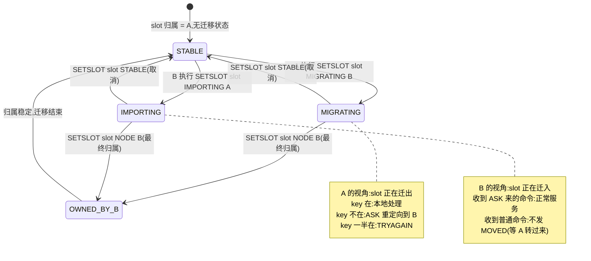

# 第十七章 · Cluster:16384 个 slot 与 gossip

> 篇:P5 复制与集群
> 主轴呼应:这一章是**取向⑤(可靠性靠分摊负载)的招牌**——把数据分片到多节点,让负载和单点故障一起被分摊掉;同时它也是**取向④(简单优先——16384 够用就行,gossip 用采样传播代全量广播)** 的根:作者拿"slot 位图 2KB × 集群 1000 节点 × 带宽容忍"三个约束反推出 16384,把"每个 PING 带几个 gossip 条目"用一段概率论注释钉死在 1/10。Cluster 把"分摊"做成了一套自洽的去中心化协议:负载分摊到多节点、故障检测分摊给闲聊、故障转移分摊给副本投票。

---

## 读完本章你会明白

1. **为什么 Redis Cluster 选了 16384 个 slot 而不是 1024 或 65536**——这不是拍脑袋的数字,而是"slot 位图 2KB × 集群 1000 节点 × 心跳带宽容忍"三个硬约束反推出来的交集,源码里写成 `1<<14` 而非字面量,处处在提醒你这是"14 位掩码"。
2. **gossip 的 1/10 比例凭什么恰好够**——作者把概率论直接写进了 `clusterSendPing` 的源码注释:`PROB × ENTRIES × TOTAL_PACKETS = (1/N) × 10 × 8N = 80`,一个超时窗口内一个 PFAIL 节点会被全集群约 80% 的节点报告,稳稳压过半数。
3. **PFAIL → FAIL 的两段式凭什么不会误判**——PFAIL 是本地廉价的"我联系不上它",FAIL 是全局昂贵的"多数 master 都说联系不上";怀疑可以反复发生,判定需要 quorum,这把网络抖动误判和真故障识别分了层。
4. **MOVED 与 ASK 凭什么不对称**——MOVED 是永久的(slot 已迁完,客户端该更新本地映射表),ASK 是临时的(slot 正在迁,客户端这次去目标节点试但映射不变);这种不对称是 slot 在线迁移的语义基石。
5. **slot 迁移为什么用 MIGRATING_TO/IMPORTING 两个显式状态**——`getNodeByQuery` 据此决定本地处理或 ASK 重定向,状态机可查询、可回退(STABLE)、可观测,比隐式"按 key 在不在"判断鲁棒得多。

---

> **如果一读觉得太难:先只记住三件事**——
> ① `key → slot` 是纯函数(`crc16(key) & 0x3FFF`,有 hash tag `{}` 则只算括号内),`slot → node` 是配置;两层解耦,增删节点就是搬 slot;
> ② 节点之间用 gossip 闲聊(每 100ms 一次,每条 PING 带 N/10 个随机节点的状态),靠概率传播把"某节点挂了"在秒级扩散到全集群;
> ③ 客户端走错门有两种重定向:MOVED(永久,更新本地映射)和 ASK(临时,仅本次去目标试)。
> 这三件事,就是 Cluster 的全部。

---

> **一句话点破:Redis Cluster 不是把"一个 Redis"复制成多份(那是主从),而是把 16384 个 slot 这张明牌表分摊给 N 个节点——slot 归属是配置、key 到 slot 是纯函数,两者解耦;再用 gossip 这种去中心化的闲聊协议,把"谁负责哪些 slot""谁挂了"在节点间以 O(N) 带宽(而非 O(N²))扩散。整套设计的精妙不在某个组件多复杂,而在每个参数(16384、1/10、15s 超时)都是从硬约束反推出来的最优解。**

前一章我们讲清楚了主从复制:所有节点存同一份数据,一台机器宕机不丢数据。但主从治不了**一台机器装不下**——Redis 是把全部数据放在内存里的纯内存数据库(取向②),单机内存再大也有上限。这一章讲的 Cluster,就是 Redis 给出的水平扩展答案:把 key 散到几十上百个节点,把故障检测和故障转移都内置进协议,不再需要一个独立的 Sentinel 进程。

## 17.1 这块要解决什么:一台机器装不下,而且单点会挂

主从架构解决了"可靠性"的一半——主挂了副本顶上,数据不丢。但主从里**所有节点存的是同一份数据**,容量受限于单机内存。要扩容,只能把数据**切**开,每个节点只负责一部分 key。这就是分片(sharding)。

分片要回答两个根本问题:

1. 一个 key 该落到哪个节点?——需要一个**确定的、无中心的**映射函数。客户端、集群里任何一个节点,给定同一个 key 必须算出同一个结论,否则一切就乱了。
2. 加节点、删节点时,数据怎么搬?——映射函数要能平滑调整,而且搬迁的粒度可控、可观测。

> **不这样会怎样(不分片)**:Redis 的全部数据必须在内存里(取向②)。一个 256GB 内存的机器很贵,而且单机主线程(取向①)也跑满了——`SET`/`GET` 再快,单核每秒也就处理十几万命令,几十万 QPS 的业务(电商秒杀、Feed 流)就顶不住了。不分片,Redis 就只能服务"一个机器能装下的数据量 + 一个 CPU 能扛住的并发量"这种小场面,撑不起真正的生产规模。

工业界最常见的一派解法是**一致性哈希**(consistent hashing):把节点和 key 都哈希到同一个环上,key 顺时针找最近节点。它优雅,但有三个工程问题:

- **数据分布不可控**。某个节点管多宽的环段,完全由哈希决定,可能出现某个节点分到特别多热点 key,你却没办法把它"切"出来重新分配——你必须虚拟出大量虚拟节点(每个真实节点挂几百个虚拟节点)才能把环抹平。
- **槽位分配是隐式的**。运维不知道某个 key 究竟归谁,得现场算环,观测和迁移都不友好。
- **迁移粒度不可控**。加一个节点,理论上要从环上每个现有节点"借"一小段,这一小段多宽、涉及哪些 key,全是哈希说了算,没法在线精细调度。

Redis 的作者选了另一条更直球的路:**哈希槽(hash slot)**。预定义固定数量的 slot(16384 个),再把 slot 分配给节点。`key → slot` 是纯函数,`slot → node` 是配置,两层解耦。增删节点就是搬 slot,粒度是固定的 1/16384,可控、可观测、可在线迁移。

> **钉死这件事**:Cluster 的分片用"两层解耦"对抗一致性哈希的"隐式分配":`key → slot` 是纯哈希函数(无状态、确定性),`slot → node` 是显式配置表(谁负责哪些 slot 一目了然)。两层各自独立变化——加节点只动第二层(搬 slot 配置),不动第一层(key 到 slot 的映射永远不变)。这把"数据分布"做成了明牌,运维可观测、可精细调度,而不是让大家去算环。

## 17.2 为什么偏偏是 16384:三个约束反推出的数字

这是初学者最常追问、也最容易答错的一点。常见的三个候选是 1024、16384、65536,Redis 选了中间的 16384。作者 Salvatore Sanfilippo(antirez)在 GitHub issue #2576 有原话回答过这个问题,理由落在**三个约束的交集**:

**约束一:消息体里的 slot 位图要小。** 每个节点都会在 gossip 心跳里把自己负责的 slot 用位图广播给全集群(下一节讲 gossip 会看到)。一个 slot 一个 bit,16384 个 slot 需要 `16384/8 = 2048 字节 = 2KB`;如果是 65536 个 slot,位图就要 `65536/8 = 8192 字节 = 8KB`。集群规模一大,这条 gossip 消息每秒在每两个节点之间来回,带宽就上去了。**千节点集群下,2KB → 8KB 意味着每条 PING 的位图部分从 ~2KB 涨到 ~8KB,全网带宽爆炸。**

**约束二:集群规模够用。** Redis 官方建议集群规模不超过 1000 个节点。16384 个 slot 平均分给 1000 个节点,每个节点也有 `16384/1000 ≈ 16` 个 slot 左右,粒度足够细到能做负载均衡;实际部署一般几十个节点,每个节点几百到上千个 slot,绰绰有余。**如果选 65536,位图胀 4 倍但绝大多数 slot 永远用不上,纯浪费。**

**约束三:作者原话的带宽容忍。** antirez 的原话大意是:节点间带宽在正常情况下不是瓶颈,但当集群规模上千、或部署在带宽受限的环境(如跨机房、云上虚拟网络)时,8KB 的位图差就不可忽视。**16384 是这三者之间的最优折中——既保证 1000 节点集群每节点有 ~16 个 slot 可分,又把心跳位图压在 2KB。**

源码里这个数字不是字面量 16384,而是一个移位表达式。看 [`cluster.h:8`](../../redis-8.0.2/src/cluster.h#L8):

```c
/* cluster.h:8-10 */
#define CLUSTER_SLOT_MASK_BITS 14 /* Number of bits used for slot id. */
#define CLUSTER_SLOTS (1<<CLUSTER_SLOT_MASK_BITS) /* Total number of slots in cluster mode, which is 16384. */
#define CLUSTER_SLOT_MASK ((unsigned long long)(CLUSTER_SLOTS - 1)) /* Bit mask for slot id stored in LSB. */
```

`1<<14 = 16384`。`CLUSTER_SLOTS - 1 = 16383 = 0x3FFF`。注释写得直白:slot id 用 14 个 bit 表示。**整个源码里没有任何一处写"16384"这个十进制字面量,处处是 `1<<14` 或 `& 0x3FFF`**——作者在用位运算的形式反复提醒你:"这是一个 14 位掩码决定的设计参数,不是任选的数字。"

key 到 slot 的映射函数 `keyHashSlot` 也定义在同一个头文件,是个 `static inline`([`cluster.h:43`](../../redis-8.0.2/src/cluster.h#L43))——内联是因为它在每条命令路径上都要算一次,是热点:

```c
/* cluster.h:43-62 —— 注释保留了原作者的 */
/* We have 16384 hash slots. The hash slot of a given key is obtained
 * as the least significant 14 bits of the crc16 of the key. */
static inline unsigned int keyHashSlot(char *key, int keylen) {
    int s, e; /* start-end indexes of { and } */

    for (s = 0; s < keylen; s++)
        if (key[s] == '{') break;

    /* No '{' ? Hash the whole key. This is the base case. */
    if (likely(s == keylen)) return crc16(key,keylen) & 0x3FFF;

    /* '{' found? Check if we have the corresponding '}'. */
    for (e = s+1; e < keylen; e++)
        if (key[e] == '}') break;

    /* No '}' or nothing between {} ? Hash the whole key. */
    if (e == keylen || e == s+1) return crc16(key,keylen) & 0x3FFF;

    /* If we are here there is both a { and a } on its right. Hash
     * what is in the middle between { and }. */
    return crc16(key+s+1,e-s-1) & 0x3FFF;
}
```

读这段代码,有四个细节钉死:

第一,**公式是 `crc16(key) & 0x3FFF`**。`0x3FFF` 就是十进制 16383。为什么写 `0x3FFF` 不写 `16383`?因为 14 位掩码写成十六进制比十进制更直白地表达"取低 14 位"——读者一眼看见 `3FFF` 就知道是 14 个 1,而不是一个来路不明的常数。

第二,**`crc16` 是非加密哈希**。它用的是标准的 **CRC-16/XMODEM**(poly 0x1021,初值 0x0000,不反射),作者在 [`crc16.c:32`](../../redis-8.0.2/src/crc16.c#L32) 亲自写了一段 TLA 风格的参数注释确认:`"Note by @antirez: this is actually the XMODEM CRC 16 algorithm"`。查表 256 项,O(n) 计算,极快。**slot 只求均匀分布,不求抗碰撞**——分片场景下,服务端算 slot,客户端无法构造特定 key 来撞 slot(攻击面不存在),所以不需要 SHA-256 那种加密哈希。这是"够用就好"(取向④)的又一例。

第三,**`static inline` 是热点优化**。每条命令执行前都要算 key 的 slot(用于判定是该本地处理还是 MOVED/ASK 重定向),`getNodeByQuery` 在 `processCommand` 里被调用([server.c:4119](../../redis-8.0.2/src/server.c#L4119))。inline 展开省了一次函数调用,对每秒几十万命令累积下来是可观的常数优化。`cluster.c` 里还有一个面向 SCAN 模式的兄弟函数 `patternHashSlot`([`cluster.c:30`](../../redis-8.0.2/src/cluster.c#L30)),处理"通配符 pattern 能否唯一确定一个 slot"的场景。

第四,**最后那段 `{` `}` 处理是 hash tag**,17.4 节单独细讲。

> **钉死这件事**:16384 不是任选的数字,是"slot 位图 2KB × 集群 1000 节点 × 心跳带宽容忍"三个硬约束反推出的最优解。源码用 `1<<14` 而非 `16384`、用 `& 0x3FFF` 而非 `& 16383`,作者在每个出现的地方都用位运算的写法提醒你:"这是 14 位掩码决定的设计参数。"crc16 选型的精髓是"只要均匀快不要抗碰撞"——slot 由服务端算,客户端构造不出攻击。这正是取向④(简单优先)的招牌:不为不存在的威胁(恶意碰撞)付加密哈希的代价。

## 17.3 MOVED 与 ASK:客户端走错门怎么办

分片之后,客户端连到任意一个节点发命令,但这条命令的 key 不一定属于这个节点。比如客户端连到节点 A,执行 `GET user:42`,而 `user:42` 的 slot 现在归节点 B。怎么办?

Redis 的做法极简:**节点算出 key 的 slot,发现不归自己管,就回一个 MOVED 重定向,告诉客户端正确节点是谁**。客户端收到后,记下这条映射,下次直接找对的节点。

判定逻辑入口在 `getNodeByQuery`([`cluster.c:1081`](../../redis-8.0.2/src/cluster.c#L1081)),函数顶部的注释把职责说得清清楚楚([`cluster.c:1057-1080`](../../redis-8.0.2/src/cluster.c#L1057)):"If the node is not 'myself' a redirection must be performed. The kind of redirection is specified setting the integer passed by reference 'error_code', which will be set to CLUSTER_REDIR_ASK or CLUSTER_REDIR_MOVED."

函数末尾的 base case([`cluster.c:1291-1294`](../../redis-8.0.2/src/cluster.c#L1291))是 MOVED 的发源地:

```c
/* cluster.c:1291-1294 */
/* Base case: just return the right node. However, if this node is not
 * myself, set error_code to MOVED since we need to issue a redirection. */
if (n != myself && error_code) *error_code = CLUSTER_REDIR_MOVED;
return n;
```

真正把 error_code 转成客户端可见字符串的是 `clusterRedirectClient`([`cluster.c:1304`](../../redis-8.0.2/src/cluster.c#L1304)),MOVED 和 ASK 共用一段格式化代码([`cluster.c:1318-1326`](../../redis-8.0.2/src/cluster.c#L1318)):

```c
/* cluster.c:1318-1326 */
} else if (error_code == CLUSTER_REDIR_MOVED ||
           error_code == CLUSTER_REDIR_ASK)
{
    /* Report TLS ports to TLS client, and report non-TLS port to non-TLS client. */
    int port = clusterNodeClientPort(n, c->conn);
    addReplyErrorSds(c,sdscatprintf(sdsempty(),
                                    "-%s %d %s:%d",
                                    (error_code == CLUSTER_REDIR_ASK) ? "ASK" : "MOVED",
                                    hashslot, clusterNodePreferredEndpoint(n), port));
}
```

回给客户端的就是 `-MOVED 5474 10.0.0.2:6379`。聪明的客户端(jedis、lettuce、go-redis、redis-py 的 cluster 模式)会缓存这份 slot→node 映射,基本只在集群拓扑变化时才会再撞到 MOVED;笨客户端每次都跟着 MOVED 走也能工作,只是慢一点。

### slot 迁移中:ASK 才出场

MOVED 是永久的——slot 归属已经变了。但有一种过渡态:**slot 正在从节点 A 迁到节点 B**。此时同一个 slot 里的 key 一部分还在 A,一部分已经在 B。这种时候不能让客户端只认准一个节点(因为归属还没定),得用一个**临时的**重定向:ASK。

slot 迁移是用 `CLUSTER SETSLOT` 命令驱动的,处理函数在 `clusterCommandSpecial` 里。四种用法对应迁移的四个阶段,源码在 [`cluster_legacy.c:6092`](../../redis-8.0.2/src/cluster_legacy.c#L6092) 一带:

```c
/* cluster_legacy.c:6092 —— MIGRATING 子句 */
server.cluster->migrating_slots_to[slot] = n;

/* cluster_legacy.c:6109 —— IMPORTING 子句 */
server.cluster->importing_slots_from[slot] = n;

/* cluster_legacy.c:6112-6113 —— STABLE 子句(取消迁移状态,双向清空) */
server.cluster->importing_slots_from[slot] = NULL;
server.cluster->migrating_slots_to[slot] = NULL;

/* cluster_legacy.c:6114 一带 —— NODE 子句(最终归属改派) */
```

状态存在 `clusterState` 的两个数组里([`cluster_legacy.h:341-342`](../../redis-8.0.2/src/cluster_legacy.h#L341)),按 slot 索引:

```c
/* cluster_legacy.h:341-342 */
clusterNode *migrating_slots_to[CLUSTER_SLOTS];    /* 这个 slot 正在迁出到谁那 */
clusterNode *importing_slots_from[CLUSTER_SLOTS];  /* 这个 slot 正在从谁那迁入 */
```

> **钉死这件事**:迁移状态是 **per-slot 的两个数组项**,不是节点的标志位。`migrating_slots_to[slot]` 和 `importing_slots_from[slot]` 直接以 slot 为下标,查一次就是 O(1)——这是 `getNodeByQuery` 在每条命令路径上都要查的热点,必须压成数组访问。8.0.2 源码里**没有** `CLUSTER_SLOT_MIGRATING_TO` 这种宏,迁移不是"节点的某种状态",而是"某个 slot 在某个节点眼里的过渡归属"。

那么 ASK 到底什么时候发?关键在 `getNodeByQuery` 里这一段([`cluster.c:1250-1259`](../../redis-8.0.2/src/cluster.c#L1250)):

```c
/* cluster.c:1250-1259 */
/* If we are migrating the slot and there are missing keys, the client
 * should be redirected to the target node. */
if (migrating_slot && missing_keys) {
    /* If we have keys but we don't have all keys, we return TRYAGAIN */
    if (existing_keys) {
        if (error_code) *error_code = CLUSTER_REDIR_UNSTABLE;
        return NULL;
    } else {
        if (error_code) *error_code = CLUSTER_REDIR_ASK;
        return getMigratingSlotDest(slot);
    }
}
```

翻译成人话,三种情况:

- 客户端连到**迁出方 A**,A 发现这个 slot 在迁出、且 key 已经不在自己这儿了(被搬走了) → 回 `ASK <slot> <B>`,让客户端临时去 B 找。
- A 发现 key **一部分**在自己这儿、一部分已经搬走(多键命令如 `MGET`) → 回 `TRYAGAIN`(error_code = `CLUSTER_REDIR_UNSTABLE`),让客户端稍等重试,因为现在没法完整服务这条多键命令。
- 客户端连到**迁入方 B**,B 没有 key 但 slot 处于 IMPORTING 状态 → 不发 MOVED。因为客户端理应是被 A 用 ASK 转过来的,ASK 隐含一个约定:"这次去 B 试,但映射不变"。B 直接服务这条 ASK 来的命令。

### MOVED vs ASK:不对称才是对的

ASK 和 MOVED 的本质区别在于**是否改客户端的本地映射**:

| 维度 | MOVED | ASK |
|------|-------|-----|
| 语义 | slot 已永久归属新节点 | slot 正在迁移,本次去目标试 |
| 客户端动作 | **更新本地 slot→node 映射** | **不改映射,仅本次跟随** |
| 触发条件 | `n != myself`(slot 归属不是我)且 slot 不在迁移态 | `migrating_slot && missing_keys`(我在迁出且 key 已搬走) |
| 源码位置 | cluster.c:1293 | cluster.c:1258 |

这套不对称是 slot 在线迁移的语义基石。设想如果 ASK 也让客户端改本地映射会发生什么:迁移还没完,A 上还有一部分 key,客户端就把这个 slot 全量映射指向 B 了,后续访问 A 上还没搬走的 key 会一直 MOVED 回 A,然后再 ASK 到 B——来回弹跳。所以 ASK 必须是"仅本次"的临时重定向,等 `SETSLOT ... NODE <B>` 最终落定,才会触发 MOVED 让客户端永久切换。

> **钉死这件事**:MOVED 和 ASK 的不对称是刻意设计的——MOVED 永久(更新本地映射),ASK 临时(仅本次去目标试)。这种不对称解决了"slot 迁移中归属不确定"的语义难题:迁移未完成时,客户端的本地映射必须保持指向原节点 A(因为大部分 key 可能还在 A),只有某条具体命令的 key 已搬走时才临时去 B 试一次。迁移一旦完成(SETSLOT NODE 落定),才会用 MOVED 让全集群的客户端永久切换到新归属。**显式的两态重定向比"单一 MOVED + 客户端猜"鲁棒得多。**

### 跨 slot 的多键操作:CROSSSLOT 与 hash tag

分片有个绕不开的限制:`MGET`、`MSET`、事务、Lua 脚本这类涉及多个 key 的命令,**所有 key 必须落在同一个 slot**,否则命令直接被拒,回 `-CROSSSLOT`。因为 slot 在不同节点上,节点间没有分布式事务,硬要做跨节点事务代价巨大,违反"简单优先"(取向④)。

绕开的办法是 **hash tag**。回头看 `keyHashSlot`([cluster.h:43-62](../../redis-8.0.2/src/cluster.h#L43))那段 `{` `}` 处理:如果 key 形如 `foo:{user42}:cart` 和 `foo:{user42}:profile`,函数只对 `{` 和 `}` 之间的 `user42` 算 crc16,所以这两个 key 落在同一个 slot,可以一起做多键操作。这是 Redis 给应用层开的一个口子:**只要你在 key 里嵌入一对大括号,括号里的内容相同,这些 key 就被钉在同一个 slot**。这对"一个用户的购物车、订单、地址必须放一起"这种场景极其重要。

规则细节(`cluster.h:46-62` 那几行)值得记牢:

- **取第一个 `{` 和它之后第一个 `}`**,中间非空才算 hash tag。
- `{}` 空大括号、或 `{` 后没有配对 `}` → 退化成对整个 key 算 crc16(当作没有 hash tag)。
- 只要符合规则,只 hash 括号内的内容,括号外的字符不参与哈希。

> **钉死这件事**:hash tag 是一个四两拨千斤的设计——多键操作受限于"同 slot",看似很死板。但加一对 `{}` 就能强制多 key 落同 slot,既保留了分片的均匀性(默认行为不变),又给了应用一个可控的逃生口。规则刻意设计成"第一个 `{` 和其后第一个 `}`、且非空"——足够简单,不引入正则表达式开销,符合 Redis 一贯的工程美学。注意 hash tag 的代价:被钉在同 slot 的 key 无法享受分片的负载分摊,热点用户会压垮一个节点,这是应用要自己权衡的。

## 17.4 gossip:节点之间怎么知道彼此还活着

前面讲的 slot、MOVED、ASK 都是**单节点视角**——每个节点只需要知道"slot 归属表"就能服务客户端。但集群是个整体:节点宕机了,谁负责发现?新增节点了,谁负责广播?slot 迁移完成,怎么让全集群都改派?这就需要一个**节点间的协调协议**。

Redis Cluster 用的是 **gossip**——一种去中心化的最终一致性协议。每个节点周期性地挑几个同伴,跟它们 PING/PONG,顺带在 PING/PONG 里捎带一些"我最近听到的其他节点的状态"。这样状态像八卦一样在全集群扩散,几轮之后所有节点都知道了全集群的全貌。

为什么不直接用一个中心化的协调者(比如 ZooKeeper、etcd)?三个理由:

1. **额外依赖**。中心化协调者本身是个独立进程,要部署、要监控、要容灾——Redis 的部署复杂度直接翻倍。gossip 是节点间自洽的,不引入任何外部依赖。
2. **实现简单**(取向④)。gossip 不需要写盘的共识日志,不需要 leader 选举,每个节点跑同样的代码,逻辑对称。Raft/Paxos 那套复杂度,Cluster 用不上。
3. **足够用**。gossip 的状态收敛是**最终一致**,有几百毫秒到秒级的传播延迟。但对故障检测这种秒级响应的领域,这点延迟完全可接受——比"等一个 Raft leader 投票出来"还快。

代价是状态收敛是最终一致而非强一致。但对故障检测这种秒级响应的领域,完全够用,换来了实现简单、无需外部依赖。

### 周期入口:每 100ms 跑一次

整个 gossip 引擎的节拍器是 `clusterCron`,注释直白([`cluster_legacy.c:4653`](../../redis-8.0.2/src/cluster_legacy.c#L4653)):

```c
/* cluster_legacy.c:4653-4654 */
/* This is executed 10 times every second */
void clusterCron(void) {
```

它在 `serverCron` 里每 100ms 调一次([server.c:1580](../../redis-8.0.2/src/server.c#L1580)):

```c
/* server.c:1580 附近的 serverCron 内 */
run_with_period(100) {
    if (server.cluster_enabled) clusterCron();
}
```

`server.hz=10`(默认每秒 10 次)意味着 `serverCron` 每 100ms 跑一次,`run_with_period(100)` 保证 `clusterCron` 也每 100ms 跑一次。`clusterCron` 做三件事:给一些最近没联系的节点发 PING、检测哪些节点超时了(打 PFAIL 标志)、驱动副本故障转移。所有这些都在这一个函数里串起来。

### PING/PONG 里塞了什么:那 2KB 的 slot 位图就飞在这里

节点之间发的消息头是 `clusterMsg` 结构体([`cluster_legacy.h:229-255`](../../redis-8.0.2/src/cluster_legacy.h#L229)),用一段 `static_assert` 把每个字段的偏移钉死([`cluster_legacy.h:266-286`](../../redis-8.0.2/src/cluster_legacy.h#L266))——这是为了滚动升级时不同版本能互通。关键字段有三个:

```c
/* cluster_legacy.h:236-243 节选 */
uint64_t configEpoch;                      /* 发送方当前的配置纪元 */
/* ... offset, sender ... */
unsigned char myslots[CLUSTER_SLOTS/8];    /* 发送方负责的 slot 位图,2KB */
char slaveof[CLUSTER_NAMELEN];
```

`myslots[CLUSTER_SLOTS/8]` 就是前面讲 16384 时说的那个 2KB 位图——每个 bit 对应一个 slot,1 表示"我负责"。`static_assert(offsetof(clusterMsg, myslots) == 80, ...)` 把它钉在偏移 80 字节处。这就是 16384 不能选大的**直接成本**:它要随每条 PING/PONG 在全网飞。`cluster_legacy.h:277` 的 `static_assert(offsetof(clusterMsg, slaveof) == 2128, ...)` 明示 myslots 这块从偏移 80 到 2128,正好 2048 字节 = 2KB。

除了自己的状态,消息里还夹带一串 **gossip 条目**,每条描述一个"我听说的别的节点",条目类型是 `clusterMsgDataGossip`([`cluster_legacy.h:109-119`](../../redis-8.0.2/src/cluster_legacy.h#L109)):

```c
/* cluster_legacy.h:109-119 节选 */
typedef struct {
    char nodename[CLUSTER_NAMELEN];   /* 节点名(40 字符 hex) */
    uint32_t ping_sent;
    uint32_t pong_received;
    char ip[NET_IP_STR_LEN];
    uint16_t port;
    uint16_t cport;
    uint16_t pport;                   /* secondary port */
    uint16_t flags;                   /* 我所知的这个节点的标志(PFAIL?FAIL?) */
    ...
} clusterMsgDataGossip;
```

`flags` 字段承载的就是"我所知的这个节点是否 PFAIL/FAIL"——这是 17.5 节故障检测的载体。

### 那个著名的 1/10:概率论藏在源码注释里

塞多少条 gossip 进去?这是 gossip 协议最精妙的一个数字。看 [`cluster_legacy.c:3609`](../../redis-8.0.2/src/cluster_legacy.c#L3609) 的 `clusterSendPing`,作者写了一段著名注释解释"为什么是 1/10"([`cluster_legacy.c:3620-3646`](../../redis-8.0.2/src/cluster_legacy.c#L3620)):

```c
/* cluster_legacy.c:3620-3646 原注释,译意保留原文结构 */
/* How many gossip sections we want to add? 1/10 of the number of nodes
 * and anyway at least 3. Why 1/10?
 *
 * If we have N masters, with N/10 entries, and we consider that in
 * node_timeout we exchange with each other node at least 4 packets
 * (we ping in the worst case in node_timeout/2 time, and we also
 * receive two pings from the host), we have a total of 8 packets
 * in the node_timeout*2 failure reports validity time. So we have
 * that, for a single PFAIL node, we can expect to receive the following
 * number of failure reports (in the specified window of time):
 *
 * PROB * GOSSIP_ENTRIES_PER_PACKET * TOTAL_PACKETS:
 *
 * PROB = probability of being featured in a single gossip entry,
 *        which is 1 / NUM_OF_NODES.
 * ENTRIES = 10.
 * TOTAL_PACKETS = 2 * 4 * NUM_OF_MASTERS.
 *
 * If we assume we have just masters (so num of nodes and num of masters
 * is the same), with 1/10 we always get over the majority, and specifically
 * 80% of the number of nodes, to account for many masters failing at
 * the same time. */
wanted = floor(dictSize(server.cluster->nodes)/10);
if (wanted < 3) wanted = 3;
```

这段注释本身就是一个教科书级的概率分析,逐句翻译:

- **"with N/10 entries"**:每个 PING 包带 `N/10` 条 gossip(`N` 是集群节点数)。
- **"in node_timeout we exchange with each other node at least 4 packets"**:一个 `node_timeout` 周期内,两个特定节点之间至少交换 4 个包——我自己每 `node_timeout/2` 最差也会 ping 对方一次(2 个包),对方也同样会 ping 我(2 个包),合计 4 个包。
- **"in the node_timeout*2 failure reports validity time"**:failure report 的有效期是 `2 × node_timeout`(源码 `CLUSTER_FAIL_REPORT_VALIDITY_MULT` 常量),所以在这个有效窗口内有 `2 × 4 = 8` 个包往来。
- **"TOTAL_PACKETS = 2 * 4 * NUM_OF_MASTERS"**:全网一个节点在一个有效窗口内能收到约 `8 × N` 个包(`N` 个 master,每个 8 个包)。

现在算一个 PFAIL 节点在这个窗口内被报告的总次数期望:

```
PROB × ENTRIES × TOTAL_PACKETS = (1/N) × 10 × (8N) = 80
```

- **PROB = 1/N**:某个特定 PFAIL 节点被某条 gossip 选中的概率(随机选,均匀分布)。
- **ENTRIES = 10**:每包带 10 条 gossip(`N/10 × ...` 归一化后,作者简化成 10 这个量级)。
- **TOTAL_PACKETS = 8N**:一个节点在窗口内收到的 gossip 包总数。

**结果:80。** 也就是说,只要 gossip 持续跑,一个挂掉的节点在 `2 × node_timeout` 窗口内会被全集群约 80% 的节点报告——稳稳压过半数(`N/2 + 1`),触发它从 PFAIL 晋升 FAIL(下一节讲)。注释最后那句 `"80% of the number of nodes, to account for many masters failing at the same time"` 解释了为什么是 80% 而不是 51%:留出余量,即便同时挂掉一批 master,剩下的票数也够触发 FAIL。

> **钉死这件事**:gossip 的 1/10 不是拍脑袋的比例,是拿"故障节点在一个超时窗口内必须能凑够多数派报告"这个硬约束倒推出来的。作者把概率分析直接写进源码注释——`PROB × ENTRIES × TOTAL_PACKETS = (1/N) × 10 × 8N = 80`——证明 10% 采样率足以在 `2 × node_timeout` 内让一个 PFAIL 节点收到约 80% 节点的报告,远超半数。这是"用采样 + 概率传播代全量广播"的招牌:带宽是 O(N)(每节点每周期只发 `N/10` 条 gossip)而非 O(N²)(全量两两广播),代价是状态收敛最终一致而非强一致。

### 接收端:每条 gossip 都立即检查"票数够了没"

接收端处理 gossip section 的函数是 `clusterProcessGossipSection`([`cluster_legacy.c:2088`](../../redis-8.0.2/src/cluster_legacy.c#L2088))。它遍历 PING/PONG 里捎带的每一条 gossip,如果 gossip 条目说某节点是 PFAIL/FAIL,接收方会把它登记到该节点的 failure reports 列表里([`cluster_legacy.c:2131-2138`](../../redis-8.0.2/src/cluster_legacy.c#L2131)):

```c
/* cluster_legacy.c:2131-2138 */
if (sender && clusterNodeIsMaster(sender)) {
    if (flags & (CLUSTER_NODE_FAIL|CLUSTER_NODE_PFAIL)) {
        if (clusterNodeAddFailureReport(node,sender)) {
            serverLog(LL_VERBOSE,
                "Node %.40s (%s) reported node %.40s (%s) as not reachable.",
                sender->name, sender->human_nodename, node->name, node->human_nodename);
        }
        markNodeAsFailingIfNeeded(node);   /* 每收一条,立即检查是否够 quorum */
    }
    ...
}
```

注意 `markNodeAsFailingIfNeeded(node)` 是**每收到一条 failure report 都立即调用**——不是攒一批再检查。这保证了"票数一够就立刻晋升 FAIL",故障检测延迟压到最低。`flags` 在这里用 `ntohs(g->flags)`([`cluster_legacy.c:2106`](../../redis-8.0.2/src/cluster_legacy.c#L2106))从网络字节序转回主机字节序——gossip 条目里的 flags 是 16 位整数,跨网络传输必须字节序转换。

### cluster bus:专用端口 + 二进制协议

讲到这里要补一个常被忽略的工程细节。Cluster 节点之间的通信走的是**独立的 cluster bus**,不是一个端口。看 [`cluster_legacy.c:1240`](../../redis-8.0.2/src/cluster_legacy.c#L1240) 的 `clusterAcceptHandler`:

```c
/* cluster_legacy.c:1239-1240 */
#define MAX_CLUSTER_ACCEPTS_PER_CALL 1000
void clusterAcceptHandler(aeEventLoop *el, int fd, void *privdata, int mask) {
```

这个 accept handler 监听的是 **cport**(cluster bus port),它独立于客户端连接的 port。默认情况下,如果客户端端口是 6379,cluster bus 端口就是 6379+10000=16379。**这是两套完全隔离的通信通道**:客户端的 RESP 协议走 port,gossip 的二进制协议走 cport。

为什么隔离?两个理由:

- **协议隔离**。客户端协议是文本 RESP,cluster bus 协议是紧凑的二进制(`clusterMsg` 结构体直接 memcpy 上网,所有多字节字段用 `htonl`/`ntohs` 转网络字节序,见 [`cluster_legacy.c:2031`](../../redis-8.0.2/src/cluster_legacy.c#L2031) 一带的 `ntohs(hdr->port)`)。两套协议混在一个端口上,解析逻辑要分支判断"这是 client 还是 peer",复杂且低效。
- **性能隔离**。客户端的大流量(GET 上百 MB value)不会阻塞 gossip 心跳。如果走同一个端口,一个慢客户端把 send buffer 撑满,gossip PING 排在后面发不出去,故障检测就误判了。独立端口 = 独立连接 = 独立 send/recv buffer = 互不干扰。

真正发送消息的函数是 `clusterSendMessage`([`cluster_legacy.c:3477`](../../redis-8.0.2/src/cluster_legacy.c#L3477)):

```c
/* cluster_legacy.c:3477-3494 节选 */
void clusterSendMessage(clusterLink *link, clusterMsgSendBlock *msgblock) {
    if (!link) {
        return;
    }
    if (listLength(link->send_msg_queue) == 0 && msgblock->msg.totlen != 0)
        connSetWriteHandlerWithBarrier(link->conn, clusterWriteHandler, 1);

    listAddNodeTail(link->send_msg_queue, msgblock);
    msgblock->refcount++;
    /* ... 统计 */
    uint16_t type = ntohs(msgblock->msg.type);
    if (type < CLUSTERMSG_TYPE_COUNT)
        server.cluster->stats_bus_messages_sent[type]++;
}
```

注意两个细节:第一,**消息不是同步 write,而是入队 `send_msg_queue`,挂一个可写事件**(`connSetWriteHandlerWithBarrier`)——这是和 ae 事件循环(第二章)的衔接,cluster bus 也走 reactor 模式,非阻塞。第二,**`ntohs(msgblock->msg.type)`**——从结构体里读 type 时也要字节序转换,证实了 cluster bus 是网络字节序的紧凑二进制协议。`CLUSTERMSG_TYPE_COUNT` 是消息类型枚举的上界,用于 stats 数组下标。

> **钉死这件事**:Cluster 节点间通信走**独立的 cluster bus**(cport = port + 10000),与客户端的 RESP 协议完全隔离。两套协议——客户端是文本 RESP,gossip 是紧凑二进制 `clusterMsg`(网络字节序,`htonl`/`ntohs` 转换)——各跑各的连接,互不干扰。性能上,客户端的大流量不会阻塞 gossip 心跳(独立 send buffer);实现上,两套解析逻辑互不污染。这是"协议分层 + 通道隔离"的工程纪律。

下面用一张图把 gossip 的传播过程画出来,看一个 PFAIL 状态如何在几轮 PING 后扩散到全集群:

```text
t=0      节点 A 发现节点 X 超时,本地打 PFAIL 标志
         │
         │  A 的下一轮 clusterCron(100ms 后)
         ▼
t=100ms  A 给随机 N/10 个邻居发 PING,每条 PING 夹带"X 是 PFAIL"的 gossip
         │  接收方 B/C/D 把"X PFAIL"记进 failure reports,立即查 quorum
         │
         │  B/C/D 各自的下一轮 clusterCron
         ▼
t=200ms  B/C/D 又各自给 N/10 个邻居发 PING,夹带"X PFAIL"
         │  二跳扩散:E/F/G/H 也收到"X PFAIL"
         │
         ▼  ... 概率传播,不保证每跳都中
         
t=2×node_timeout 窗口内
         全集群约 80% 的 master 都报告过"X PFAIL"
         markNodeAsFailingIfNeeded 凑够 quorum → X 晋升 FAIL
         A 立即广播 CLUSTERMSG_TYPE_FAIL,全集群秒级同步
```

这张图的关键是"**概率传播,不保证每跳都中**"——gossip 不像 Raft 那样有 leader 把日志推给所有人,它是每个节点随机挑几个邻居唠嗑。某个 PFAIL 状态能不能传到某个具体节点,是概率事件。但只要窗口够长(`2 × node_timeout`),概率分析(80)保证票数稳够。这就是"采样传播代全量广播"的精髓。

## 17.5 故障检测:PFAIL 到 FAIL 的两段式

gossip 不仅是状态扩散,也承载故障检测。这里有一个**两段式**设计,是 Cluster 最值得讲透的部分之一。

### 第一阶段:PFAIL,本地怀疑

`clusterCron` 每轮都遍历所有已知节点,看它们的 PING/PONG 是否超时。超时判定的核心在 [`cluster_legacy.c:4809-4817`](../../redis-8.0.2/src/cluster_legacy.c#L4809):

```c
/* cluster_legacy.c:4807-4817 */
/* our cluster bus link is also used for data: under heavy data
 * load pong delays are possible. */
mstime_t node_delay = (ping_delay < data_delay) ? ping_delay : data_delay;

if (node_delay > server.cluster_node_timeout) {
    /* Timeout reached. Set the node as possibly failing if it is
     * not already in this state. */
    if (!(node->flags & (CLUSTER_NODE_PFAIL|CLUSTER_NODE_FAIL))) {
        node->flags |= CLUSTER_NODE_PFAIL;
        update_state = 1;
        ...
    }
}
```

读这段代码有三个细节:

第一,**`node_delay = min(ping_delay, data_delay)`**。`ping_delay` 是"我多久前给对方发了 PING 还没收到 PONG",`data_delay` 是"我多久没收到对方的任何数据"。取较小者——只要有任意一种联系迹象就算活着。注释 [@4807-4808](../../redis-8.0.2/src/cluster_legacy.c#L4807) 说:"our cluster bus link is also used for data: under heavy data load pong delays are possible"——cluster bus 同时跑 gossip 和数据(如副本复制),重负载下 PONG 可能延迟,所以不能只看 PONG。

第二,**阈值是 `cluster_node_timeout`**,默认 15 秒([`config.c:3224`](../../redis-8.0.2/src/config.c#L3224) 附近的默认配置)。这个值是 Cluster 调参的核心:`node_timeout` 太短,网络抖一下就误判 PFAIL;太长,真挂了要等太久才 FAIL。生产环境通常按网络质量设在 5-30 秒。

第三,**PFAIL 是本地标志,别人还不知道**。`node->flags |= CLUSTER_NODE_PFAIL` 只改了本地状态,没有立即发任何消息。这一阶段的设计哲学是:**单点怀疑不可信**——可能是我自己网络抖了,可能是我太忙没及时收 PONG。所以 PFAIL 不会触发任何动作,只是把怀疑写进本地状态,等下一轮 gossip(100ms 后)顺带传出去。

两个标志位定义在 [`cluster_legacy.h:60-61`](../../redis-8.0.2/src/cluster_legacy.h#L60):

```c
/* cluster_legacy.h:58-61 */
#define CLUSTER_NODE_MASTER 1     /* The node is a master */
#define CLUSTER_NODE_SLAVE 2      /* The node is a slave */
#define CLUSTER_NODE_PFAIL 4      /* Failure? Need acknowledge */
#define CLUSTER_NODE_FAIL 8       /* The node is believed to be malfunctioning */
```

注意 `CLUSTER_NODE_PFAIL` 的注释 `"Failure? Need acknowledge"`——作者用问号和 "Need acknowledge" 明示:PFAIL 是个**待确认**的怀疑状态,需要别人的 acknowledge 才能晋升。配套的判定宏在 [cluster_legacy.h:74-75](../../redis-8.0.2/src/cluster_legacy.h#L74):`nodeTimedOut(n)` 测 PFAIL,`nodeFailed(n)` 测 FAIL。

### 第二阶段:FAIL,集群共识

当某个节点收集到的关于 X 的 failure reports(包括自己这一票,如果自己是 master)超过了半数 master,就把它晋升为 FAIL。判定函数 `markNodeAsFailingIfNeeded`([`cluster_legacy.c:1881`](../../redis-8.0.2/src/cluster_legacy.c#L1881)):

```c
/* cluster_legacy.c:1881-1902 节选 */
void markNodeAsFailingIfNeeded(clusterNode *node) {
    int failures;
    int needed_quorum = (server.cluster->size / 2) + 1;   /* 过半 master */

    if (!nodeTimedOut(node)) return; /* We can reach it. */
    if (nodeFailed(node)) return;    /* Already FAILing. */

    failures = clusterNodeFailureReportsCount(node);
    /* Also count myself as a voter if I'm a master. */
    if (clusterNodeIsMaster(myself)) failures++;
    if (failures < needed_quorum) return; /* No weak agreement from masters. */

    serverLog(LL_NOTICE,
        "Marking node %.40s (%s) as failing (quorum reached).", node->name, node->human_nodename);

    /* Mark the node as failing. */
    node->flags &= ~CLUSTER_NODE_PFAIL;
    node->flags |= CLUSTER_NODE_FAIL;
    node->fail_time = mstime();
    ...
    clusterSendFail(node->name);   /* 立即广播 FAIL 消息 */
}
```

读这段代码有四个细节:

第一,**`needed_quorum = (size / 2) + 1`**。经典的多数派公式。`server.cluster->size` 是集群 master 数。N 个 master,quorum 是 `⌊N/2⌋ + 1`,例如 5 个 master 要 3 票,3 个 master 要 2 票。

第二,**`if (clusterNodeIsMaster(myself)) failures++`**。如果我自己是 master,我自己这一票也算——我已经在第一阶段给 X 打了 PFAIL,这一票要计入总数。注意只有 master 的票算数,slave 的 failure report 不计入 quorum(这是 `clusterProcessGossipSection` 里 `if (sender && clusterNodeIsMaster(sender))` 守卫的用意)。

第三,**晋升时清 PFAIL 标 FAIL**:`node->flags &= ~CLUSTER_NODE_PFAIL; node->flags |= CLUSTER_NODE_FAIL;`。FAIL 是 PFAIL 的升级态,不是叠加态——一旦判定 FAIL,就不再是"怀疑"了。

第四,**`clusterSendFail(node->name)` 立即广播**。晋升 FAIL 后,不等下一轮 gossip,立即主动广播一条 `CLUSTERMSG_TYPE_FAIL` 消息,让全集群尽快把该节点的状态同步到 FAIL(而不是各自再等一轮 gossip 慢慢传)。这是"急事走专用快通道,日常走 gossip"的混合策略。

### 为什么两段式:怀疑廉价,判定昂贵

从 PFAIL 到 FAIL 的两段式,本质是把"怀疑"和"判定"分离:

- **PFAIL(怀疑)是廉价的、本地的、可以反复发生的**。我联系不上你,我就单方面打 PFAIL,不触发任何全局动作。如果下一轮我又联系上了你,PFAIL 自动清除([`cluster_legacy.c:2995`](../../redis-8.0.2/src/cluster_legacy.c#L2995) 一带:`link->node->flags &= ~CLUSTER_NODE_PFAIL`)。这一阶段误判代价极小——只是本地多个标志位。
- **FAIL(判定)是昂贵的、全局的、需要多数同意的**。它要凑够 quorum,一旦判 FAIL 就触发故障转移(副本上位)。这一阶段误判代价巨大——一次错误的 FAIL 可能导致双主(split-brain)。所以它必须慎重,要全网多数 master 同意才行。

这种分层避免了网络抖动造成误判:假设节点 A 和 B 之间网络瞬断,A 单方面觉得 B 是 PFAIL,但 B 其实活得好好的,其他节点都还能联系上 B。这时 A 一票不够 quorum,B 永远不会晋升 FAIL。等网络恢复,A 的 PFAIL 自动清掉,什么都没发生。如果是单段式(我联系不上你就直接 FAIL),这种瞬断就会触发副本上位,造成不必要的数据迁移和潜在 split-brain。

> **钉死这件事**:PFAIL/FAIL 两段式的本质是"怀疑廉价,判定昂贵"——PFAIL 是本地标志位,误判代价极小(下一轮 gossip 自动清);FAIL 是全局 quorum 共识,误判代价巨大(触发故障转移、可能 split-brain)。这把"我自己联系不上你"和"全集群都联系不上你"分了层:前者是本地观测(可能是我自己的问题),后者是全局事实(才是真故障)。**可靠性不是一个开关,而是一组分级的承诺**——这正是取向⑤(可靠性靠分摊负载)在故障检测上的落地:怀疑可以单点发起,判定必须多数摊牌。

### 内置的故障转移:不需要 Sentinel

一旦 master 被判 FAIL,它的某个副本就要接管。这就是**故障转移**。和下一章要讲的 Sentinel 不同,**Cluster 把故障转移内置在协议里**,不需要额外起一个 Sentinel 进程。

驱动函数是 `clusterHandleSlaveFailover`([`cluster_legacy.c:4225` 一带](../../redis-8.0.2/src/cluster_legacy.c#L4225)),它在 `clusterCron` 末尾被调用。前置条件很清晰:我得是副本(`!clusterNodeIsMaster(myself)`)、我的主得是 FAIL 状态(`nodeFailed(myself->slaveof)`)、我的主得有 slot(`myself->slaveof->numslots != 0`)——这些守卫保证"该我发起选举时我才发起"。

副本发起选举,需要拿到 `needed_quorum = (size / 2) + 1` 张票(和 FAIL 判定同一个 quorum 公式),投给自己,然后晋升:把自己从副本改成 master,接管原主的所有 slot,广播新的 `configEpoch`。这一套基于 gossip 总线的投票机制,和下一章 Sentinel 的 leader 选举算法**形不同而神同**——都是 Raft 风格的多数派选举,但 Cluster 的选举完全跑在已经存在的 cluster bus 上,不需要 Sentinel 那套独立的主从监控拓扑。

为了避免选举风暴,有几个节流阀:`auth_timeout = node_timeout × 2`(至少 2 秒)控制选举超时,`auth_retry_time = auth_timeout × 2` 控制重试间隔([`cluster_legacy.c:4242-4244`](../../redis-8.0.2/src/cluster_legacy.c#L4242))。还有一个"`node_timeout × 2` 内不重复投票"的守卫([`cluster_legacy.c:4039`](../../redis-8.0.2/src/cluster_legacy.c#L4039)),防止一个副本反复发起选举把集群搞乱。这些参数都是从 `node_timeout` 派生的——再一次说明 `cluster_node_timeout` 是 Cluster 调参的核心旋钮。

## 17.6 技巧精解①:slot 迁移状态机——显式状态比隐式判断鲁棒

这一节我们把 17.3 提到的 slot 迁移单独拎出来深挖。slot 迁移是 Cluster 最复杂的在线操作,它要在不停服务的前提下,把一个 slot 的所有 key 从 A 搬到 B。难点在于:**迁移过程中,这个 slot 的 key 一部分在 A、一部分在 B,客户端的命令该往哪发?**

Redis 的答案是**显式状态机**。每个 slot 在每个节点上有两个状态位:`migrating_slots_to[slot]`(我在把这个 slot 迁出到谁那)和 `importing_slots_from[slot]`(我在从谁那迁入这个 slot)。配合 slot 本身的归属 `server.cluster->slots[slot]`(这个 slot 当前归谁),构成一个有限状态机:



`getNodeByQuery` 就是这个状态机的查询接口。它在判定"该不该 ASK"时,逻辑完全围绕这两个状态位展开([`cluster.c:1250-1259`](../../redis-8.0.2/src/cluster.c#L1250) 已贴)。`getMigratingSlotDest(slot)` 和 `getImportingSlotSource(slot)` 是两个查询函数([`cluster_legacy.c:6455-6459`](../../redis-8.0.2/src/cluster_legacy.c#L6455)):

```c
/* cluster_legacy.c:6455-6459 */
return server.cluster->migrating_slots_to[slot];   /* 我在迁出到谁 */
...
return server.cluster->importing_slots_from[slot]; /* 我在从谁那迁入 */
```

直接数组下标,O(1)。这是 per-slot 数组的好处:状态查询压成一次内存访问。

> **钉死这件事**:slot 迁移用**显式状态机**(MIGRATING_TO/IMPORTING_FROM/STABLE/NODE)而非隐式"按 key 在不在判断",是工程上的关键取舍。显式状态的好处:① **可查询**——`getNodeByQuery` 直接读数组就知道该不该 ASK;② **可回退**——SETSLOT STABLE 一键取消,回到迁移前状态;③ **可观测**——`CLUSTER NODES` 输出里能看到每个 slot 的迁移状态,运维好诊断;④ **鲁棒**——即便 key 搬迁中途出错(网络断、节点挂),状态位不会丢,恢复后能接着迁或回滚。隐式判断("试着找 key,找不到就算搬走了")在网络抖动时极易误判。**显式状态机是分布式系统对抗不确定性的通用武器。**

迁移的粒度也是一个设计点。slot 是迁移的最小单位——一个 slot 里的所有 key 必须一起搬到目标节点。为什么不按单个 key 迁移?因为 slot 是配置变更的原子单位:slot 归属一变,全集群通过 gossip 同步新的 `slots[]` 数组,客户端通过 MOVED 更新本地映射。如果按 key 迁移,归属表会变成 per-key 的,元数据爆炸。slot 的粒度(1/16384)正好够细(负载均衡够灵活)又够粗(元数据可控)——这又回到 17.2 节 16384 的反推。

## 17.7 技巧精解②:gossip 概率传播——O(N) 带宽代 O(N²) 全量

这一节我们把 17.4 提到的 1/10 概率分析再深挖一层,看"采样传播"为什么是 gossip 的精髓。

先算一笔账:**如果不采样,全量广播要多少带宽?** 假设集群 N 个节点,每个节点每轮要把自己知道的所有节点状态告诉所有其他节点。这是经典的 O(N²) 通信——每对节点之间都要交换信息。N=1000 时,每轮要 100 万次状态交换,带宽和 CPU 都爆炸。

gossip 的精髓是**采样传播**:每个节点每轮只挑 `N/10` 个邻居唠嗑(不是全部 N 个),每条 PING 只夹带 `N/10` 条 gossip(不是全部 N 条)。这样每轮每个节点的发送成本是 `O(N/10) = O(N)`,全网总带宽是 `O(N²/10)`,**常数因子降一个数量级**。但更重要的是:**经过 `O(log N)` 轮后,状态能以高概率扩散到全集群**。这是 gossip 协议的经典结论——和流行病传播同构。

```
全量广播(中心化思维):
  每节点 → 全部 N 个邻居,每条消息 → 全部 N 条状态
  每轮带宽:O(N²),N=1000 时 = 100 万次交换/轮

gossip 采样传播(去中心化思维):
  每节点 → N/10 个随机邻居,每条消息 → N/10 条随机 gossip
  每轮带宽:O(N),N=1000 时 = ~10 万次交换/轮
  扩散轮数:O(log N) ≈ 10 轮(N=1000)
  最终全集群都收到:概率 → 1
```

这套机制为什么能 work?核心是**概率分析**。17.4 节那段 `PROB × ENTRIES × TOTAL_PACKETS = 80` 的算式证明了:在一个 `2 × node_timeout` 窗口内,一个 PFAIL 节点会被全集群约 80% 的节点报告。这不是直觉,是数学保证。作者把这段概率论写进源码注释,正是为了让后续维护者理解"为什么是 1/10 而不是 1/2 或 1/100"——这是经过计算的,不是任选的。

代价是什么?**最终一致,不是强一致**。某个 PFAIL 状态从节点 A 产生,到全集群 80% 节点收到报告,需要 `O(log N)` 轮 gossip,每轮 100ms,N=1000 时约 10 轮 = 1 秒。这 1 秒的延迟就是 gossip 换来的代价——但它换来了 O(N) 带宽、无中心依赖、实现简单。对故障检测这种秒级响应的领域,1 秒延迟完全可接受;对要求毫秒级强一致的领域(比如金融交易),gossip 不合适,得上 Raft/Paxos——但那不是 Redis Cluster 的目标场景。

> **钉死这件事**:gossip 的精髓是"**采样传播代全量广播**"——每个节点每轮只挑 N/10 个邻居、每条消息只夹带 N/10 条状态,把通信成本从 O(N²) 压到 O(N)。代价是状态收敛变成最终一致(O(log N) 轮,秒级延迟),但对故障检测这种秒级响应的领域完全够用。作者把概率分析(PROB × ENTRIES × TOTAL_PACKETS = 80)直接写进源码注释,证明 10% 采样率足以让一个 PFAIL 节点在窗口内收到 80% 节点的报告,稳压 quorum。这是"用数学论证采样的充分性"的招牌——不是拍脑袋选 1/10,是算出来的。

## 章末:回扣、五个为什么、往哪钻

### 主线回扣

这一章是**取向⑤(可靠性靠分摊负载)的招牌**。Cluster 把"可靠性"做成了一套自洽的分摊机制:数据分片分摊存储和并发负载到多节点;gossip 把故障检测分摊给节点间的闲聊协议(每节点只挑 N/10 个邻居唠嗑,带宽 O(N));故障转移把"master 挂了怎么办"分摊给副本投票(副本凑够 quorum 自己上位)。整套设计没有一个单点——没有中心协调者、没有 leader 节点、没有 master config server。所有节点跑同样的代码,对称、去中心、最终一致。

同时它也是**取向④(简单优先——16384 够用就行,gossip 采样代全量)** 的根。两个最关键的参数都是从硬约束反推出来的:16384 是"slot 位图 2KB × 集群 1000 节点 × 带宽容忍"的交集;1/10 是"故障报告在窗口内必须凑够 quorum"的反推。gossip 选去中心化采样而非 Raft/Paxos,是为了实现简单、无需外部依赖(不用部署 ZooKeeper/etcd)。hash tag 而非分布式事务,是为了不引入跨节点协调的复杂度。MOVED/ASK 分离临时与永久,是为了让 slot 在线迁移对应用透明。

至于**取向②(内存即数据库)**:正是因为内存有限,才必须分片——这是 Cluster 存在的根本动机。**取向①(单线程 + 事件循环)**:每 100ms 跑一次 `clusterCron`,夹在主线程的事件循环里,和持久化、命令处理共享同一个线程;cluster bus 走独立的 cport 但同样挂在 ae 上(`clusterAcceptHandler` 就是普通的 ae file event)。

### 五个为什么

**Q1:16384 个 slot,1000 个节点平均每节点 16 个 slot,够细吗?会不会负载不均?**

够细。16 个 slot 的粒度已经足够做负载均衡——如果某个节点过载,可以搬几个 slot 出去,粒度是 1/16384 ≈ 0.006% 的数据量,非常精细。实际部署几十个节点时,每节点几百到上千 slot,粒度更细。真正的不均不来自 slot 数,而来自 key 本身的热点(某个 key 被 QPS 几十万地访问)——这不是 slot 粒度能解决的,得靠应用层(比如给热点 key 加随机后缀,或用 hash tag 之外的副本读)。65536 slot 看起来更细,但位图胀 4 倍(8KB)换来的精细度在 1000 节点规模下完全用不上。

**Q2:gossip 的 1/10,N 很小时(比如 5 个节点)会怎样?**

`wanted = floor(N/10)`,N=5 时算出来是 0,但有下限 `if (wanted < 3) wanted = 3`——所以最少带 3 条 gossip。小集群下,3 条 gossip 基本覆盖了大部分其他节点,信息扩散极快。这个 `wanted < 3` 的下限是小集群的保险——N/10 算出来太小会导致 gossip 信息不足,所以强制至少 3 条。反过来,N 很大时(比如 1000),`wanted = 100`,每条 PING 带 100 条 gossip,包大小可控,扩散速度仍够。

**Q3:PFAIL 自动清除会不会导致故障检测不稳定?会不会反复 PFAIL/清除?**

会反复,但不影响稳定性。PFAIL 是本地状态,反复打 PFAIL 再清除只是本地标志位翻转,不触发任何全局动作。只有当 FAIL 被判出(凑够 quorum)才会触发故障转移。而 FAIL 一旦判定,不会因为某个节点又联系上了就自动清除——`clearNodeFailureIfNeeded`([`cluster_legacy.c:1933`](../../redis-8.0.2/src/cluster_legacy.c#L1933))有严格条件:必须是 master 且过了 `node_timeout × CLUSTER_FAIL_UNDO_TIME_MULT` 时间才能清除。这避免了 FAIL 状态抖动。

**Q4:slot 迁移中,如果 A 和 B 同时挂了怎么办?key 会不会丢?**

不会丢,但可能需要人工介入。迁移中的 key 已经有一部分在 B 了,如果 A 挂了,A 上还没搬走的 key 由 A 的副本顶上(主从复制);如果 B 挂了,B 上已经搬过来的 key 由 B 的副本顶上。只要主从复制正常,key 不丢。但如果 A 和 B 同时挂且都没有副本,这个 slot 的部分 key 就不可用了——`CLUSTERDOWN Hash slot not served`。这是为什么生产环境 Cluster 要求每个 master 至少有一个副本。迁移操作本身是幂等的:状态位 `migrating_slots_to`/`importing_slots_from` 持久化在 `nodes.conf` 里,节点恢复后能接着迁或回滚。

**Q5:Cluster 和下一章的 Sentinel 都做故障转移,为什么不统一成一套?**

历史原因 + 设计哲学不同。Sentinel 是 Redis 早期的高可用方案(2013 年),独立进程监控主从,适合"不分片只要主从"的场景。Cluster 是后来的分片 + 高可用一体化方案(2015 年稳定),把故障转移内置进协议。两者的故障检测机制形似(Sentinel 也用 quorum)神不同:Sentinel 的 quorum 是 Sentinel 之间的(独立于数据节点),Cluster 的 quorum 是数据节点之间的(master 互相投票)。统一成一套意味着要么 Cluster 强制配 Sentinel(部署复杂度翻倍),要么 Sentinel 支持分片(它本来就不是为分片设计的)。Redis 选择两套并存:不分片用 Sentinel,分片用 Cluster,各取所需。新项目基本都直接上 Cluster。

### 想继续深入往哪钻

- 想看 `CLUSTER NODES` 输出格式的解析:读 `clusterLegacyClusterNodesCommand` 或 `clusterNodesCommand` 函数(在 cluster_legacy.c 里),它会输出每个节点的 flags(`M`/`S`/`f`/`fail?`)、slot 范围、主从关系,是运维诊断的入口。
- 想理解 configEpoch 冲突解决:读 `clusterUpdateSlotsConfigWith` 和 `clusterHandleConfigEpochCollision`,这是 cluster 应对"两个节点同时声称自己负责同一个 slot"的最后防线,靠 configEpoch 大小仲裁。
- 想看副本选举的完整流程:读 `clusterHandleSlaveFailover`([cluster_legacy.c:4225](../../redis-8.0.2/src/cluster_legacy.c#L4225))和 `clusterSendFailoverAuthRequest`/`clusterSendFailoverAuthAck`——投票、拉票、计票全在 cluster bus 上。
- 想对比"中心化协调"怎么解同一道题:看下一章 Sentinel,以及本系列《etcd 设计与实现深入浅出》的 Raft 章节——Cluster 的 quorum 是"数据节点间松散多数",Raft 的 quorum 是"日志复制严格多数",两者形似神不同。

### 引出下一章

至此你已经看清 Cluster 的全貌:16384 个 slot 这张明牌表分摊给 N 个节点,gossip 在节点间以 O(N) 带闲聊传播状态,PFAIL/FAIL 两段式分离怀疑与判定,MOVED/ASK 让 slot 在线迁移对应用透明,故障转移内置在协议里不需要外部进程。但 Redis 的高可用方案不止 Cluster 一种。很多老系统、或者不想引入分片(不想被"跨 slot 不可用"约束)的场景,用的是更早的方案:**主从复制 + Sentinel**。Sentinel 是一个独立的进程,专门盯着 master,挂了就指挥副本上位。它和 Cluster 的故障转移思路形似但拓扑完全不同——Cluster 把协调能力下放给数据节点自己,Sentinel 把协调能力独立出来。下一章我们就走进 Sentinel:为什么 Redis 要维护两套高可用方案?Sentinel 的 leader 选举和 Cluster 的故障转移投票有什么异同?它和 Cluster 各自适合什么场景?

---

## 验证物:如何亲手确认本章的设计

> 说明:本书写作环境为 Windows,无法直接运行 redis-server(8.0 依赖 fork/epoll 等 Linux 特性)。以下 (1) gdb 断点脚本 (2) 源码常量锚点 (3) cluster 命令观察项 均为可复现的精确指引,供读者在 Linux 环境(Ubuntu 22.04 / CentOS 8 等)对 redis-8.0.2 源码 `make no-opt`(Makefile 里 no-opt 目标会去掉 -O2 加 -g)编译后自行验证。**本书不附编造的运行输出**——凡未实跑的,只给脚本、预期观察变量与推导依据,不写具体数值。

### 1. gdb 断点脚本

编译:`cd redis-8.0.2 && make no-opt`(带 -g)
启动:至少 3 主 3 从的最小集群(单节点无法观察 gossip)。`gdb ./src/redis-server`

```gdb
(gdb) break keyHashSlot            # slot 计算,cluster.h:43(static inline,可能需 -O0)
(gdb) break clusterSendPing         # gossip 发送主流程,cluster_legacy.c:3609
(gdb) break clusterProcessGossipSection  # gossip 接收处理,cluster_legacy.c:2088
(gdb) break markNodeAsFailingIfNeeded    # PFAIL → FAIL 判定,cluster_legacy.c:1881
(gdb) break clusterRedirectClient   # MOVED/ASK 重定向,cluster.c:1304
(gdb) break getNodeByQuery          # 命令路径的 slot 判定入口,cluster.c:1081
(gdb) break clusterSendMessage      # 二进制消息发送,cluster_legacy.c:3477
(gdb) run --port 6379 --cluster-enabled yes

# 另开终端用 redis-cli 发一条跨 slot 的命令,观察重定向:
# redis-cli -p 6379 GET user:42
# (假设 user:42 的 slot 不归 6379 这个节点)

# gdb 在 getNodeByQuery 停下,观察 slot 判定:
(gdb) print slot                    # 预期:keyHashSlot 算出的 slot id(0-16383)
(gdb) print n                       # 预期:slot 归属的 clusterNode*
(gdb) print myself                  # 当前节点
# 若 n != myself,会在 cluster.c:1293 设 error_code = CLUSTER_REDIR_MOVED

# 观察 gossip 发送时塞了多少条:
# (等 clusterCron 触发,约 100ms 一次)
(gdb) print wanted                  # 预期:floor(dictSize(nodes)/10),至少 3
(gdb) print dictSize(server.cluster->nodes)  # 预期:集群总节点数
```

**预期观察**(基于源码逻辑,本书未实跑):

- `keyHashSlot` 对 `user:42` 算出 `crc16("user:42") & 0x3FFF`,值在 0-16383 区间。
- `wanted = floor(N/10)`,N=6(3 主 3 从)时算出 0,但被 `if (wanted < 3) wanted = 3` 拉到 3——每条 PING 至少带 3 条 gossip。
- `clusterRedirectClient` 命中时,`error_code` 为 `CLUSTER_REDIR_MOVED`(2)或 `CLUSTER_REDIR_ASK`(3),格式化出 `-MOVED <slot> <ip>:<port>` 或 `-ASK <slot> <ip>:<port>`。

### 2. 源码常量锚点(带行号,从 redis-8.0.2 源码 Grep 核实)

| 常量/字段 | 位置 | 值/说明 |
|----------|------|---------|
| `CLUSTER_SLOT_MASK_BITS` | cluster.h:8 | 14(slot id 用 14 位) |
| `CLUSTER_SLOTS` | cluster.h:9 | `1<<14` = 16384 |
| `CLUSTER_SLOT_MASK` | cluster.h:10 | `0x3FFF`(低 14 位掩码) |
| `keyHashSlot`(static inline) | cluster.h:43-62 | `crc16(key) & 0x3FFF`,hash tag `{...}` 只算括号内 |
| `patternHashSlot` | cluster.c:30 | SCAN 模式的 slot 判定 |
| `crc16`(XMODEM,poly 0x1021) | crc16.c:32,82 | 注释@32 "this is actually the XMODEM CRC 16" |
| `crc16` 声明 | server.h:3669 | `unsigned short crc16(const char *buf, int len)` |
| `CLUSTER_NODE_PFAIL` | cluster_legacy.h:60 | 4("Failure? Need acknowledge") |
| `CLUSTER_NODE_FAIL` | cluster_legacy.h:61 | 8 |
| `clusterMsg.myslots[CLUSTER_SLOTS/8]` | cluster_legacy.h:243 | 2KB slot 位图,@80-2128 偏移 |
| `migrating_slots_to`/`importing_slots_from` | cluster_legacy.h:341-342 | per-slot 迁移状态数组 |
| `clusterSendPing`(1/10 注释) | cluster_legacy.c:3609-3648 | `wanted = floor(N/10)`,至少 3 |
| `clusterProcessGossipSection` | cluster_legacy.c:2088 | gossip 接收,每条立即 markNodeAsFailingIfNeeded |
| `markNodeAsFailingIfNeeded` | cluster_legacy.c:1881 | `needed_quorum = (size/2)+1` |
| PFAIL 判定 | cluster_legacy.c:4812-4817 | `node_delay > cluster_node_timeout` 打 PFAIL |
| `clusterAcceptHandler`(cluster bus) | cluster_legacy.c:1240 | cport 独立于 client port |
| `clusterSendMessage`(二进制) | cluster_legacy.c:3477 | 入队 + 写事件,ntohs 转 type |
| `getNodeByQuery` | cluster.c:1081 | MOVED@1293 / ASK@1258 / CROSSSLOT |
| `clusterRedirectClient` | cluster.c:1304-1326 | MOVED/ASK 共用格式化@1318-1326 |
| SETSLOT 四态 | cluster_legacy.c:6092-6113 | MIGRATING@6092 / IMPORTING@6109 / STABLE@6112 / NODE@6114 |

### 3. Cluster 命令观察项(需本地最小集群)

> 以下操作需在 Linux 本地启动至少 6 个 redis-server(3 主 3 从)组成集群后用 redis-cli 执行。本书未实跑,仅列观察方法与预期(基于源码常量推导)。

```text
# 1. 观察 slot 分配和节点 flags(CLUSTER NODES 输出格式):
redis-cli -p 7000 CLUSTER NODES
# 预期输出每行:<id> <ip:port@cport> <flags> <master-id> <ping> <pong> <epoch> <link> <slot-ranges>
# flags 含义:M=master S=slave myself f=fail(若挂了) fail?=PFAIL(只在本地不输出)

# 2. 观察 slot → node 映射(CLUSTER SLOTS):
redis-cli -p 7000 CLUSTER SLOTS
# 预期:16384 个 slot 分成若干区间,每区间标注 master 和 replicas

# 3. 观察 MOVED 重定向(故意连错节点):
redis-cli -p 7000 GET user:42
# 预期(若 user:42 的 slot 不归 7000):-MOVED <slot> <正确节点 ip:port>
# 智能客户端(go-redis/jedis)会自动跟随并缓存映射;裸 redis-cli 不会

# 4. 观察 hash tag 强制同 slot:
redis-cli -p 7000 CLUSTER KEYSLOT foo:{user42}:cart
redis-cli -p 7000 CLUSTER KEYSLOT foo:{user42}:profile
# 预期:两个 key 算出同一个 slot(只 hash "user42")
redis-cli -p 7000 CLUSTER KEYSLOT foo:user42:cart
# 预期:不同(无 {} 则全 key 参与 hash)

# 5. 观察跨 slot 多键操作被拒:
redis-cli -p 7000 MGET user:42 user:43
# 预期(若两 key 不同 slot):-CROSSSLOT Keys in request don't hash to the same slot

# 6. 观察 cluster bus 端口独立(默认 port + 10000):
ss -tlnp | grep redis
# 预期:每个 redis-server 监听两个端口,如 7000(客户端) 和 17000(cluster bus)
```

标注:以上预期基于源码常量([cluster.h:8-10](../../redis-8.0.2/src/cluster.h#L8) 的 `CLUSTER_SLOTS=16384`、[cluster.h:43-62](../../redis-8.0.2/src/cluster.h#L43) 的 `keyHashSlot` 逻辑、[cluster_legacy.h:243](../../redis-8.0.2/src/cluster_legacy.h#L243) 的 `myslots` 位图、[cluster.c:1305-1326](../../redis-8.0.2/src/cluster.c#L1305) 的 MOVED/ASK 格式化)推导,本书未在本地实跑;若你的集群拓扑/端口配置不同,具体输出会变,但"-MOVED/ASK 格式""CLUSTER NODES 的 flags 字段""cluster bus 独立端口"这些行为不变。
