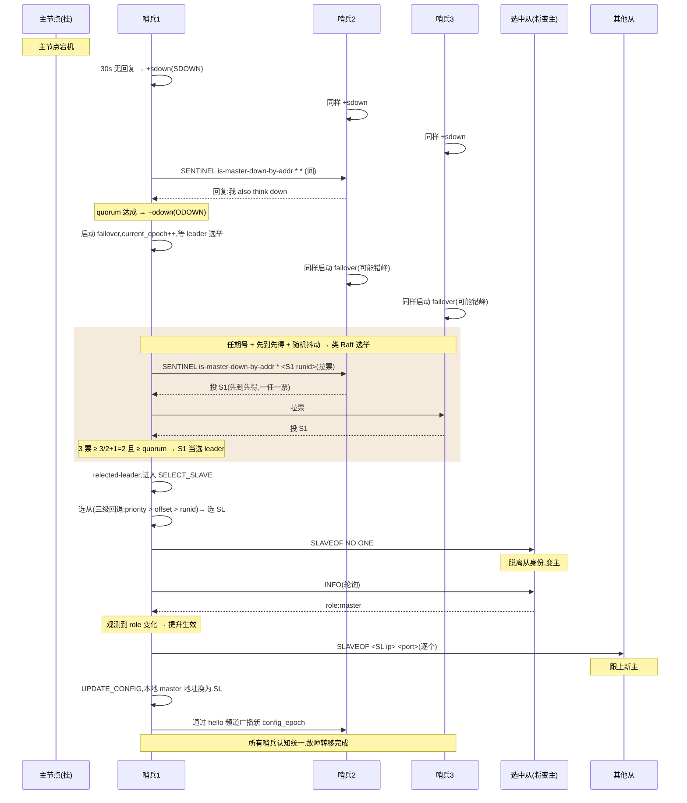

# 第十八章 · Sentinel 哨兵:主挂了,谁来接管

> 篇:P5 复制与集群(收口章)
> 主轴呼应:这一章是**取向⑤(可靠性)**的高潮——主从架构下,主节点是单点,它的失效是整条业务线最致命的故障。Sentinel 用一组独立哨兵的多数投票,把"主节点挂了"这件原本要运维半夜起床手工处理的事,变成自动选新主、自动让从晋升、自动通知客户端的自愈机制。**这是 Redis 高可用的最后一道防线**——主从只负责把数据复制出去(可靠性:不丢),Sentinel 负责在主挂掉时把整个集群自动接起来(可靠性:可用)。

---

## 读完本章你会明白

1. **为什么 Sentinel 是"一组独立进程",而不是把故障转移做进数据节点本身**——因为 Sentinel 服务的是主从架构,这种架构里节点没有"同伴意识",故障转移必须有一个站在数据节点之外的第三方裁判。
2. **几个 Sentinel 是怎么自动发现彼此的**——靠 `__sentinel__:hello` 这个 pubsub 频道做去中心化自动发现,运维只需配主节点地址,不用配所有哨兵。
3. **"主观下线 SDOWN → 客观下线 ODOWN"两段式判定,为什么门槛一松一紧**——SDOWN 是单点判断(便宜),ODOWN 用可配的 quorum 弱多数确认;而后面选 leader 执行真正的切换,用的是更严的绝对多数。**代价越大,门槛越高。**
4. **类 Raft 选举到底"类"在哪里**——current_epoch 任期号 + 先到先得一任一票 + 起跑随机抖动,这三招组合,使得大多数情况下一轮就能选出 leader;Redis 没引 Raft 库,用约 120 行手写代码复刻了它的选举核心。
5. **故障转移选哪个从晋升,为什么是"优先级 → 偏移量 → runid"三级回退**——运维意图优先、数据完整性次之、确定性兜底,每一级都回答一个具体问题。
6. **TILT 模式凭什么体现"对自己诚实"**——当哨兵检测到自己的时间感都不可信(被卡住、时钟跳变),它停止一切会改变集群状态的动作,只继续收集情报。这是分布式系统里少见的自觉。

---

> **如果一读觉得太难:先只记住三件事**——
> ① Sentinel = 一组独立哨兵进程,持续 ping 主从,主挂了投票决定下线、选一个 leader 哨兵执行切换;
> ② 切换的核心是两段判定 + 类 Raft 选举:SDOWN(我自己觉得挂了)→ ODOWN(达到 quorum 个哨兵同意)→ 选 leader 哨兵(绝对多数)→ leader 选最优从晋升新主 → 其他从改指向 → 通知客户端;
> ③ 选最优从的三级回退:运维设的优先级 → 复制偏移量最大(数据最新)→ runid 字典序最小(确定性兜底)。
> 这三件事,就是 Sentinel 的全部。

---

> **一句话点破:Sentinel 不是"更聪明的故障检测器",而是"用一组独立哨兵的多数投票,把'主挂了'这件事从单点误判的风险里解放出来"——它把分布式共识里最贵的'绝对多数'留给最贵的那步(选 leader 切换),把'弱多数'留给便宜的那步(判定下线),让代价和门槛严格对称。**

前面第十七章我们把复制讲透了:主写从读,数据从主节点流向从节点。但那个故事留了一个一直没回答的问题——**主节点挂了怎么办?**

这不是危言耸听。在主从架构下,主节点是单点:所有写都经过它,所有从都认它作源头。一旦它宕机,整个集群就失去了写入能力,客户端要么报错、要么阻塞。运维人员半夜被电话叫醒,手工 `REPLICAOF NO ONE` 把某个从提升为主、再让其他从改认新主——这套流程在凌晨三点的人脑里,出错率极高。

能不能让程序自己干?这就是 Sentinel(哨兵)要解决的事。但"自动故障转移"这件事远比看上去复杂——一个判断错了,就是数据丢失或集群永久分裂(脑裂)。所以 Sentinel 这 5400 行代码,每一道机制都在回答一个具体的失败模式。

## 18.1 这块要解决什么:主节点是单点,如何自愈

先看清 Sentinel 在整个 Redis 多节点版图里的位置:

- **主从复制**(第十七章):数据从主到从。主挂了,**不自动切**——可靠性只覆盖"不丢数据",不覆盖"主挂了还能用"。
- **Sentinel**(本章):给主从架构**外挂**一组哨兵,监控主从,主挂了**自动选新主、切流量**。
- **Cluster**(第十六章):分片 + 内置故障转移二合一。节点之间本来就有 Gossip 在通信,故障转移可以内化进数据节点。

这里有一个关键的架构选择:**为什么 Sentinel 是"独立进程",而不是像 Cluster 那样把故障转移做进数据节点本身?** 因为 Sentinel 服务的对象是**主从架构**(不分片),这种架构里的节点本身没有"同伴意识"——从节点不知道还有别的从节点,更不会去协调谁该上位。故障转移需要一个"第三方裁判"站在所有数据节点之外,看着全局做决策。这就是 Sentinel 独立存在的理由。而 Cluster 因为节点之间本来就有 Gossip 在互相通信,故障转移可以内化到数据节点里,不需要外挂。

源码上,Sentinel 的全部逻辑塞在一个文件里:`sentinel.c`,约 5400 行。它复用了 Redis 的网络层、事件循环、命令分发,只是入口不同。哨兵进程启动时 `redis-sentinel sentinel.conf`,内核识别到 `server.sentinel_mode`,把命令表切换成哨兵命令集,主循环里挂上 `sentinelTimer` 这个定时回调——哨兵就这样"活"了。它本质上是**一个特殊模式运行的 Redis 实例**(不开持久化、不接业务数据,只跑监控逻辑)。

那么"一组"哨兵到底是几个?**生产环境至少 3 个,且必须是奇数**。为什么奇数?因为要投票——偶数个哨兵在分裂投票(一半投 A、一半投 B)时无法形成多数,奇数能保证至少有一方能拿到多数。这是分布式系统里最朴素的设计常识。

> **钉死这件事**:Sentinel 的存在前提是"主从架构本身没有自愈能力"。它是一个站在数据节点之外、用多数投票保证决策可靠性的第三方裁判。3 个起步、奇数为宜——这是为了投票系统能在分裂场景下仍能形成多数。

## 18.2 数据结构:哨兵眼里的世界

在讲机制之前,先看哨兵内部用什么结构组织它监控的所有实例。哨兵监控三类对象:

1. **主节点**(master):配置文件里 `sentinel monitor <name> <ip> <port> <quorum>` 直接配的。
2. **从节点**(slave):从 INFO 命令的回复里**自动发现**(下面 18.3 详讲)。
3. **其他哨兵**(sentinel):从 `__sentinel__:hello` 频道**自动发现**(18.3 详讲)。

每个对象在哨兵内部都是一个 `sentinelRedisInstance` 结构(注释在 [sentinel.c:5359](../../redis-8.0.2/src/sentinel.c#L5359) 上方的注释块),挂在不同字典里:

- `sentinel.masters`:所有被监控的主节点。
- 每个 master 的 `->slaves` 字典:它的所有从节点。
- 每个 master 的 `->sentinels` 字典:监控同一个主的其他哨兵。

每个实例还维护**两条连接**(这是哨兵设计的一个关键细节):

- **命令链路(cc,command connection)**:发 `PING` / `INFO` / `SENTINEL is-master-down-by-addr` / `SLAVEOF` 这类命令。
- **pubsub 链路(pc,pubsub connection)**:订阅 `__sentinel__:hello` 频道,收发心跳。

为什么要两条?因为 Redis 的 pubsub 是"订阅后只走该频道的消息流",你没法在 pubsub 连接上发普通命令(发了会报错);反之命令连接上也不能收 pubsub 推送。所以一条管"我问你答",一条管"广播 + 收听"。`sentinelReconnectInstance`([sentinel.c:5362](../../redis-81.0.2/src/sentinel.c#L5362) 调用入口,见 `sentinelHandleRedisInstance`)负责维护这两条连接,断了就重建。

实例有一组标志位标识当前状态,最关键的几个([sentinel.c:47-49](../../redis-8.0.2/src/sentinel.c#L47)):

```c
/* sentinel.c:47-49 */
#define SRI_S_DOWN (1<<3)   /* Subjectively down (no quorum). */
#define SRI_O_DOWN (1<<4)   /* Objectively down (confirmed by others). */
#define SRI_MASTER_DOWN (1<<5) /* A Sentinel with this flag set thinks that
                                  this master is down. */
```

注意注释里 `(no quorum)` 和 `(confirmed by others)`——这两个修饰语是 SDOWN 和 ODOWN 的本质差别:SDOWN 是"我自己觉得它挂了,不需要任何票数",ODOWN 是"其他哨兵也确认了"。这套语义的层次,是 18.4 节要展开的重点。

## 18.3 自动发现:三个层次,从配置到探测

这是 Sentinel 设计里最优雅的一块,也是用户最常误解的一块。运维只需要在配置文件里写**主节点**的地址:

```text
sentinel monitor mymaster 192.168.1.10 6379 2
```

最后那个 `2` 是 quorum(18.4 节详讲)。其他哨兵呢?其他从节点呢?**全部自动发现。** 这是三层去中心化发现机制:

**第一层:主节点是配置的(运维手工写)。** 这是唯一的"种子"。

**第二层:从节点是从主节点的 INFO 回复里发现的。** 哨兵周期性给主节点发 `INFO` 命令,INFO 回复里有 `slave0:ip=...,port=...` 这样的行。哨兵解析出从节点地址,加到 `master->slaves` 字典里,然后也开始给这些从节点发 INFO / PING。从节点之间不直接发现彼此,但通过同一个主节点这个"中介",所有哨兵最终都看到同一份从节点列表。

**第三层:哨兵之间是通过 `__sentinel__:hello` pubsub 频道发现的。** 这是最精妙的一层。看 `sentinelSendHello`([sentinel.c:2997](../../redis-8.0.2/src/sentinel.c#L2997)):

```c
/* sentinel.c:3022-3033 */
snprintf(payload,sizeof(payload),
    "%s,%d,%s,%llu," /* Info about this sentinel. */
    "%s,%s,%d,%llu", /* Info about current master. */
    announce_ip, announce_port, sentinel.myid,
    (unsigned long long) sentinel.current_epoch,
    /* --- */
    master->name,announceSentinelAddr(master_addr),master_addr->port,
    (unsigned long long) master->config_epoch);
retval = redisAsyncCommand(ri->link->cc,
    sentinelPublishReplyCallback, ri, "%s %s %s",
    sentinelInstanceMapCommand(ri,"PUBLISH"),
    SENTINEL_HELLO_CHANNEL,payload);
```

每个哨兵定期(默认 `sentinel_publish_period = 2000ms`,[sentinel.c:68](../../redis-8.0.2/src/sentinel.c#L68))向 `__sentinel__:hello` 频道 PUBLISH 一条消息,内容是**8 个字段**:哨兵自己的 ip/port/runid/current_epoch,加上"我认为当前主节点的" name/ip/port/config_epoch。

每个哨兵同时又**订阅**了 `__sentinel__:hello` 频道(在建立到主从节点的 pubsub 链路时,通过 `SUBSCRIBE __sentinel__:hello` 注册)。这样,只要两个哨兵监控同一个主节点,它们就都会收到对方 PUBLISH 的 hello 消息——发现彼此的存在。看接收回调 `sentinelReceiveHelloMessages`([sentinel.c:2956](../../redis-8.0.2/src/sentinel.c#L2956)):

```c
/* sentinel.c:2980-2983 */
/* We are not interested in meeting ourselves */
if (strstr(r->element[2]->str,sentinel.myid) != NULL) return;

sentinelProcessHelloMessage(r->element[2]->str, r->element[2]->len);
```

收到 hello 后,先过滤掉自己发的(用 runid 比对),剩下的交给 `sentinelProcessHelloMessage` 解析——它会更新"我眼里这个 master 周围有哪些其他哨兵"的字典,需要时建立连接。**整个发现过程是去中心化的、Gossip 风格的**:运维只配主节点地址,两个或更多哨兵通过同一个主节点这个中介,在 hello 频道上互相发现。

> **钉死这件事**:Sentinel 的三层发现机制——主节点配置、从节点靠 INFO、哨兵靠 `__sentinel__:hello` pubsub——是它"易部署"的根。运维只写一行配置,整个监控拓扑自动建立。这个设计巧妙地复用了 Redis 自己的 pubsub 机制:哨兵不需要专门的"哨兵间通信协议",直接借用主从节点作为 hello 频道的中介,就完成了 Gossip 式发现。

hello 消息里那 8 个字段不是随便选的,每一个都有用:`ip/port/runid` 让其他哨兵能建立连接;`current_epoch` 让所有哨兵的"任期号"能同步(下面 18.5 节会看到,任期能不能同步是选举成败的关键);`master_name/ip/port/config_epoch` 让所有监控同一个主的哨兵能确认"我们看的是同一个东西",并且能感知到配置变化(比如新主产生后 config_epoch 会更新)。

## 18.4 SDOWN 与 ODOWN:两段式判定,门槛一松一紧

现在进入故障转移的第一道关:**怎么判断主节点真的挂了。** Sentinel 把"挂了"分成两段——主观下线(SDOWN)和客观下线(ODOWN)。这两段的门槛不一样,这是整个 Sentinel 设计里最重要的一处取舍。

### 18.4.1 SDOWN:一个哨兵的主观判断

`sentinelCheckSubjectivelyDown`([sentinel.c:4517](../../redis-8.0.2/src/sentinel.c#L4517))做的事很直白:算"距离上次收到有效回复过去了多久",超过阈值就打上 `SRI_S_DOWN` 标志:

```c
/* sentinel.c:4562-4575 */
if (elapsed > ri->down_after_period ||
    (ri->flags & SRI_MASTER &&
     ri->role_reported == SRI_SLAVE &&
     mstime() - ri->role_reported_time >
      (ri->down_after_period+sentinel_info_period*2)) ||
      (ri->flags & SRI_MASTER_REBOOT &&
       mstime()-ri->master_reboot_since_time > ri->master_reboot_down_after_period))
{
    /* Is subjectively down */
    if ((ri->flags & SRI_S_DOWN) == 0) {
        sentinelEvent(LL_WARNING,"+sdown",ri,"%@");
        ri->s_down_since_time = mstime();
        ri->flags |= SRI_S_DOWN;
    }
}
```

`down_after_period` 就是配置项 `down-after-milliseconds`,默认 30 秒([sentinel.c:69](../../redis-8.0.2/src/sentinel.c#L69))。除了"ping 不通"超过 30 秒,还有一个判定:主节点本来是 master,但 INFO 报告自己是 slave 已经超过 `down_after_period + sentinel_info_period*2`(30 秒 + 20 秒)——意思是它"被降级成从了",这也算 SDOWN。这是为了应对"主节点其实没挂,但被某次错误的故障转移降级成从了"的场景。

这就是"主观"二字的由来:**只有一个哨兵自己的判断**,可能是网络抖动、可能是它自己被调度器卡住了、可能是时钟跳变——单点判断不可信。所以需要第二步。

注意这个函数还会顺手做一件事:如果命令链路或 pubsub 链路"看起来连着但很久没活动",它会**主动断开重连**([sentinel.c:4531-4554](../../redis-8.0.2/src/sentinel.c#L4531))。这是对"半死不活"连接的预防——TCP 连接可能在内核层还活着,但应用层早就卡住了,主动断开重连能让问题更快暴露出来。

### 18.4.2 ODOWN:弱多数确认

光我自己说不算,得问别的哨兵。哨兵之间用 `SENTINEL is-master-down-by-addr <ip> <port> <epoch> <runid>` 这条命令互相打听:"你觉得那个主挂了吗?"(在 `sentinelAskMasterStateToOtherSentinels`([sentinel.c:4671](../../redis-8.0.2/src/sentinel.c#L4671))里发):

```c
/* sentinel.c:4700-4710 */
retval = redisAsyncCommand(ri->link->cc,
            sentinelReceiveIsMasterDownReply, ri,
            "%s is-master-down-by-addr %s %s %llu %s",
            sentinelInstanceMapCommand(ri,"SENTINEL"),
            announceSentinelAddr(master->addr), port,
            sentinel.current_epoch,
            (master->failover_state > SENTINEL_FAILOVER_STATE_NONE) ?
            sentinel.myid : "*");
```

注意最后一个参数 `<runid>`:当传 `*` 时,这只是"问其他哨兵你觉得主挂没挂";当传 `sentinel.myid`(自己的 runid)时,这一句同时是"投我一票当 leader"(下面 18.5 详讲)。**一条命令两用,根据最后一个参数是 `*` 还是 runid 区分**——这是源码里一个紧凑的设计。

被问的哨兵如果也判定 SDOWN,回复里就带一个标志,本地哨兵把对应的"他哨兵"打上 `SRI_MASTER_DOWN` 标志。`sentinelCheckObjectivelyDown`([sentinel.c:4591](../../redis-8.0.2/src/sentinel.c#L4591))数票:

```c
/* sentinel.c:4585-4607 */
/* Is this instance down according to the configured quorum?
 *
 * Note that ODOWN is a weak quorum, it only means that enough Sentinels
 * reported in a given time range that the instance was not reachable.
 * However messages can be delayed so there are no strong guarantees about
 * N instances agreeing at the same time about the down state. */
void sentinelCheckObjectivelyDown(sentinelRedisInstance *master) {
    dictIterator *di;
    dictEntry *de;
    unsigned int quorum = 0, odown = 0;

    if (master->flags & SRI_S_DOWN) {
        /* Is down for enough sentinels? */
        quorum = 1; /* the current sentinel. */
        /* Count all the other sentinels. */
        di = dictGetIterator(master->sentinels);
        while((de = dictNext(di)) != NULL) {
            sentinelRedisInstance *ri = dictGetVal(de);

            if (ri->flags & SRI_MASTER_DOWN) quorum++;
        }
        dictReleaseIterator(di);
        if (quorum >= master->quorum) odown = 1;
    }
```

注释里那句 **"ODOWN is a weak quorum"**(弱多数)是关键。为什么"弱"?因为各哨兵的 `SRI_MASTER_DOWN` 标志是基于"上次回我消息时的判断"——而那个时间点每个哨兵都不一样。注释明说:"there are no strong guarantees about N instances agreeing at the same time about the down state"(无法保证 N 个哨兵是在同一时刻一致认为它挂了的)。也就是说,ODOWN 是"在某个时间窗内,有 quorum 个哨兵先后报告过它挂了"——这是一个最终一致式的判断,不是强一致的快照。

达到 `master->quorum` 后,主节点正式打上 `SRI_O_DOWN` 标志,发出 `+odown` 事件:

```c
/* sentinel.c:4611-4617 */
if (odown) {
    if ((master->flags & SRI_O_DOWN) == 0) {
        sentinelEvent(LL_WARNING,"+odown",master,"%@ #quorum %d/%d",
            quorum, master->quorum);
        master->flags |= SRI_O_DOWN;
        master->o_down_since_time = mstime();
    }
}
```

`+odown` 事件里会带 `#quorum 2/2` 这样的文本,意思是"需要 2 票,拿到了 2 票"。这才是真正触发故障转移的信号。

> **钉死这件事**:SDOWN 是单点判断(`down_after_period` 默认 30 秒不发 PING/pong 即触发),ODOWN 是弱多数(达到配置的 quorum 个哨兵同意即触发)。两者的关键差别:SDOWN 可逆(只要恢复回复就立刻 `-sdown`,便宜得很),ODOWN 不可逆(一旦进入 ODOWN 就直接启动故障转移)。这种"轻判断可逆、重判断不可逆"的两段设计,是为了把误判的影响降到最低。

### 18.4.3 两个 quorum 的区分——本章最容易混淆的点

这里必须把两个 quorum 区分得清清楚楚,因为它们是本章后续所有"门槛"讨论的基础:

| | 触发什么 | 门槛 | 配置项 | 性质 |
|---|---|---|---|---|
| **配置 quorum** | ODOWN 判定 | `sentinel monitor ... <quorum>` 配的那个数 | `master->quorum` | **弱多数**(各哨兵时间点不必对齐) |
| **绝对多数 quorum** | Leader 选举 | 投票者半数 +1 | 写死为 `voters/2+1` | **绝对多数**(必须严格过半) |

比如 3 个哨兵、配置 quorum=2:判定 ODOWN 只要 2 个同意(弱多数),但选 leader 要 2 票(3/2+1=2,恰好也是 2)。但如果 5 个哨兵、配置 quorum=2:判定 ODOWN 只要 2 个同意(弱多数),选 leader 却要 3 票(5/2+1=3,绝对多数)。后者明显更严——**判 ODOWN 便宜,选 leader 昂贵,所以前者松后者紧。** 这个"松紧不一"是 18.6 节的核心。

## 18.5 类 Raft 选举:任期号 + 先到先得 + 抖动

主挂了,ODOWN 达成。但**如果有 3 个哨兵同时开始故障转移,各自选一个从提升为主,集群就裂了**。所以必须先选出一个 leader 哨兵,只有它来执行转移。

这一节是本章最硬的部分,也是 Sentinel 设计里最有"分布式系统血统"的一块。它**借鉴了 Raft 共识算法**的核心思想,但没用 Raft 库,用约 120 行手写代码复刻了选举的精髓。

### 18.5.1 启动故障转移:三个前置条件

不是 ODOWN 一达成就立刻选——`sentinelStartFailoverIfNeeded`([sentinel.c:4952](../../redis-8.0.2/src/sentinel.c#L4952))检查三个条件:

```c
/* sentinel.c:4952-4979 */
int sentinelStartFailoverIfNeeded(sentinelRedisInstance *master) {
    /* We can't failover if the master is not in O_DOWN state. */
    if (!(master->flags & SRI_O_DOWN)) return 0;             // ① 主在 ODOWN

    /* Failover already in progress? */
    if (master->flags & SRI_FAILOVER_IN_PROGRESS) return 0;  // ② 当前没有进行中的转移

    /* Last failover attempt started too little time ago? */
    if (mstime() - master->failover_start_time <
        master->failover_timeout*2)                          // ③ 距上次尝试 > 2×failover-timeout
    { ... return 0; }

    sentinelStartFailover(master);
    return 1;
}
```

第三个条件里的 `failover_timeout*2` 是个保护:`failover_timeout` 默认 3 分钟([sentinel.c:77](../../redis-8.0.2/src/sentinel.c#L77)),所以一次失败后至少要等 6 分钟才能再次尝试。这是为了防止"主节点假死→频繁触发故障转移→把好好的集群搅得一团糟"的情况。

三个条件都满足,`sentinelStartFailover`([sentinel.c:4928](../../redis-8.0.2/src/sentinel.c#L4928))把状态机推到 `WAIT_START`,并自增 `current_epoch`:

```c
/* sentinel.c:4928-4939 */
void sentinelStartFailover(sentinelRedisInstance *master) {
    serverAssert(master->flags & SRI_MASTER);

    master->failover_state = SENTINEL_FAILOVER_STATE_WAIT_START;
    master->flags |= SRI_FAILOVER_IN_PROGRESS;
    master->failover_epoch = ++sentinel.current_epoch;       // 任期号 +1
    sentinelEvent(LL_WARNING,"+new-epoch",master,"%llu",
        (unsigned long long) sentinel.current_epoch);
    sentinelEvent(LL_WARNING,"+try-failover",master,"%@");
    master->failover_start_time = mstime()+rand()%SENTINEL_MAX_DESYNC;   // 起跑时间 + 随机抖动
    master->failover_state_change_time = mstime();
}
```

注意两件事:

- **`current_epoch` 自增**:`current_epoch` 就是"任期号",Raft 里的那个 term。每次启动一轮新的故障转移,任期号 +1。这是 Raft 共识的基础——任期号单调递增,用来标识"这是第几轮选举"。注释里 `+new-epoch` 事件就是把这个新任期广播出去。
- **起跑时间 + 随机抖动**:`mstime()+rand()%SENTINEL_MAX_DESYNC`,`SENTINEL_MAX_DESYNC = 1000`([sentinel.c:84](../../redis-8.0.2/src/sentinel.c#L84))。这一行是避免活锁的关键——3 个哨兵同时 ODOWN、同时启动,如果不抖动,它们会同时开始拉票、同时拿不到多数、同时失败、同时再试……永远选不出来。加上 0-1000ms 的随机延迟,错峰开跑,先开的那个更可能拿到多数。这是 Raft 那套"随机化选举超时避免活锁"的简化版。

> **钉死这件事**:`current_epoch` 是直接致敬 Raft 的 term(任期号)。它单调递增,作用是标识"这是第几轮选举"——一个哨兵一旦在任期 N 里投了票,在任期 N 里就不能再投给别人(下面 18.5.2 讲)。这把"防止同一轮里多张票导致分裂"的锁,是共识算法的根本。

### 18.5.2 投票:先到先得,一任一票

每个启动了故障转移的哨兵,都会向其他哨兵发 `SENTINEL is-master-down-by-addr <ip> <port> <epoch> <runid>`——注意这里最后一个参数是自己的 runid,而不是 `*`。这就是"请投我一票"的请求。

被请求投票的哨兵,在 `sentinelVoteLeader`([sentinel.c:4729](../../redis-8.0.2/src/sentinel.c#L4729))里决定投不投:

```c
/* sentinel.c:4729-4754 */
char *sentinelVoteLeader(sentinelRedisInstance *master, uint64_t req_epoch, char *req_runid, uint64_t *leader_epoch) {
    if (req_epoch > sentinel.current_epoch) {
        sentinel.current_epoch = req_epoch;                  // 对方的任期比我高,我跟上
        sentinelFlushConfig();
        sentinelEvent(LL_WARNING,"+new-epoch",master,"%llu",
            (unsigned long long) sentinel.current_epoch);
    }

    if (master->leader_epoch < req_epoch && sentinel.current_epoch <= req_epoch)
    {
        sdsfree(master->leader);
        master->leader = sdsnew(req_runid);                  // 在这个任期里投给请求者
        master->leader_epoch = sentinel.current_epoch;
        sentinelFlushConfig();
        sentinelEvent(LL_WARNING,"+vote-for-leader",master,"%s %llu",
            master->leader, (unsigned long long) master->leader_epoch);
        /* If we did not voted for ourselves, set the master failover start
         * time to now, in order to force a delay before we can start a
         * failover for the same master. */
        if (strcasecmp(master->leader,sentinel.myid))
            master->failover_start_time = mstime()+rand()%SENTINEL_MAX_DESYNC;
    }

    *leader_epoch = master->leader_epoch;
    return master->leader ? sdsnew(master->leader) : NULL;
}
```

这段代码的精髓在 `if (master->leader_epoch < req_epoch && ...)` 这一行——**这就是 Raft 的"先到先得、一任一票"**:

- `master->leader_epoch < req_epoch`:在我记录里,这个 master 还没在 `req_epoch` 这个任期里投过票(我投过的最高任期比 req_epoch 小)。
- `sentinel.current_epoch <= req_epoch`:请求者的任期不比我老(避免旧任期的票污染新任期)。
- 两个条件都满足,我把票投给请求者,并记录"在 req_epoch 任期里我投给了谁"。

一旦投了票,`master->leader_epoch` 就更新成 `req_epoch`,下次同一个任期里再来拉票的请求,这个条件就不满足了——**这一任期里这一票就用完了,不能再投给别人**。这就是"先到先得":谁先到,我先投给谁;后来的,对不起,这一任期我没票了。

`sentinelFlushConfig()` 是把投票结果立刻刷盘——这很重要,如果这个哨兵投票后崩溃重启,它不能"忘记"自己投过谁然后又投给别人,那会导致同一任期出现两个 leader。刷盘保证投票是持久的。

注意还有一个细节:如果这个哨兵投的不是自己(`strcasecmp(master->leader,sentinel.myid)`),它会把自己的 `failover_start_time` 设为 `mstime()+rand()%SENTINEL_MAX_DESYNC`——意思是"我既然投票给别人了,我就别那么快启动自己的选举,延后一点"。这是一种谦让:已经在这一任期里投了别人,就该让别人有机会先成功,而不是抢着竞争。

### 18.5.3 统票:绝对多数才算赢

谁来统计总票数、宣布赢家?是 `sentinelGetLeader`([sentinel.c:4785](../../redis-8.0.2/src/sentinel.c#L4785))。这个函数每个启动了故障转移的哨兵都会调——它统计"所有哨兵(包括我)在这个任期里投给了谁",然后判定赢家。看核心逻辑:

```c
/* sentinel.c:4785-4847 (精简) */
char *sentinelGetLeader(sentinelRedisInstance *master, uint64_t epoch) {
    ...
    voters = dictSize(master->sentinels)+1; /* All the other sentinels and me.*/

    /* Count other sentinels votes */
    di = dictGetIterator(master->sentinels);
    while((de = dictNext(di)) != NULL) {
        sentinelRedisInstance *ri = dictGetVal(de);
        if (ri->leader != NULL && ri->leader_epoch == sentinel.current_epoch)
            sentinelLeaderIncr(counters,ri->leader);          // 数其他哨兵投的票
    }
    ...
    /* Check what's the winner. For the winner to win, it needs two conditions:
     * 1) Absolute majority between voters (50% + 1).
     * 2) And anyway at least master->quorum votes. */
    ...                                                       // 找出票数最多的候选

    /* Count this Sentinel vote: if this Sentinel did not voted yet,
     * either vote for the most common voted sentinel, or for itself
     * if no vote exists at all. */
    if (winner)
        myvote = sentinelVoteLeader(master,epoch,winner,&leader_epoch);   // 跟票投给暂时领先者
    else
        myvote = sentinelVoteLeader(master,epoch,sentinel.myid,&leader_epoch);   // 没人投,投自己

    ...
    voters_quorum = voters/2+1;
    if (winner && (max_votes < voters_quorum || max_votes < master->quorum))
        winner = NULL;                                        // 两条都不满足,本轮选不出来
    ...
}
```

注释把规则说得很清楚:**赢家要同时满足两个条件**([sentinel.c:4809-4811](../../redis-8.0.2/src/sentinel.c#L4809)):

1. **绝对多数**:`max_votes >= voters/2+1`(投票者半数 +1)。这是写死的,不可配。
2. **至少 quorum 票**:`max_votes >= master->quorum`。这是配置的。

代码里两个条件任何一个不满足,`winner` 被置为 NULL——**这一轮选不出来**。等下一轮,任期号自增重投,和 Raft 一模一样。

为什么需要两个条件?这是冗余防护:

- **绝对多数**(条件 1)防止脑裂:5 个哨兵分裂成 3+2,绝对多数要求 3 票,所以 2 个那一拨永远选不出来——保证全局只有一个 leader。
- **至少 quorum**(条件 2)防止"少数但绝对多数":比如 5 个哨兵配 quorum=4,极端情况 3 个哨兵形成了"绝对多数"(3 > 5/2),但这 3 票 < 配置的 quorum=4,系统认为这不够可靠。这是给运维一个"我想要求更严"的旋钮。

> **钉死这件事**:Leader 选举的"绝对多数"是写死的 `voters/2+1`,比 ODOWN 的可配 quorum 严格得多。原因:ODOWN 判错了,顶多多此一举启动一次选举,leader 选不出来自然流产,代价小;Leader 选错了,就是两个哨兵各自扶植一个新主,集群永久分裂(脑裂),代价巨大。**代价越大,门槛越高——这是工程上对"不对称风险"的标准处理。** 这条原则在分布式系统里反复出现,Sentinel 把它体现得淋漓尽致。

还有一处精妙:`sentinelGetLeader` 里如果这个哨兵还没投过票,它会**跟票**——投给当前票数最多的候选(如果有);如果完全没票,才投自己(`myvote = sentinelVoteLeader(master,epoch,sentinel.myid,...)`)。这种"先看有没有别人领先,跟票,而不是无脑投自己"的策略,极大提高了第一轮就选出 leader 的概率。Raft 里没有这个机制(每个节点都投自己),Sentinel 这里是个改进。

### 18.5.4 与 Raft 的对照:一致与简化

把 Sentinel 的选举和教科书 Raft 放一起对比:

| 维度 | Raft | Sentinel |
|---|---|---|
| 任期号 | term,单调递增 | `current_epoch`,单调递增 |
| 一任一票 | 是 | 是(`leader_epoch < req_epoch` 才投) |
| 选举超时 | 随机化(150-300ms) | `rand()%SENTINEL_MAX_DESYNC`(0-1000ms)|
| 防活锁 | 随机超时错峰 | 起跑时间随机抖动错峰 |
| 绝对多数 | 是 | 是(`voters/2+1`)|
| 日志复制 | 有(commit index 等) | **无**(Sentinel 不管数据,只管切主)|
| 心跳保活 | leader 给 follower 发 | 哨兵之间用 hello 频道 |

最关键的区别在最后一行:**Sentinel 不管数据复制,只管"谁该是主"**。Raft 是完整的复制状态机,要保证日志一致;Sentinel 只用 Raft 的选举部分来解决"谁有资格执行故障转移"这一个问题,数据一致性它交给 Redis 自己的复制机制(主从复制偏移量)。这是 Redis 的态度:**只为必要的问题引入必要的复杂度。**

> **钉死这件事**:Sentinel 的类 Raft 选举是"只用 Raft 的选举一半,不要 Raft 的日志复制一半"。这一半足够解决"谁是 leader"的问题,而"数据是否一致"它交给底层的主从复制。Redis 没有引入 Raft 库,用约 120 行手写代码复刻了选举核心——这是取向④(简单优先)的极致体现:够用就好,不为完美共识付出不必要的复杂度。

## 18.6 故障转移状态机:六状态的接力

Leader 诞生后,真正的切换才开始。`sentinelFailoverStateMachine`([sentinel.c:5311](../../redis-8.0.2/src/sentinel.c#L5311))推动一个七状态的小状态机(注释在 [sentinel.c:90-96](../../redis-8.0.2/src/sentinel.c#L90)):

```text
NONE → WAIT_START → SELECT_SLAVE → SEND_SLAVEOF_NOONE → WAIT_PROMOTION → RECONF_SLAVES → UPDATE_CONFIG
```

```c
/* sentinel.c:5311-5333 */
void sentinelFailoverStateMachine(sentinelRedisInstance *ri) {
    serverAssert(ri->flags & SRI_MASTER);

    if (!(ri->flags & SRI_FAILOVER_IN_PROGRESS)) return;

    switch(ri->failover_state) {
        case SENTINEL_FAILOVER_STATE_WAIT_START:
            sentinelFailoverWaitStart(ri);
            break;
        case SENTINEL_FAILOVER_STATE_SELECT_SLAVE:
            sentinelFailoverSelectSlave(ri);
            break;
        case SENTINEL_FAILOVER_STATE_SEND_SLAVEOF_NOONE:
            sentinelFailoverSendSlaveOfNoOne(ri);
            break;
        case SENTINEL_FAILOVER_STATE_WAIT_PROMOTION:
            sentinelFailoverWaitPromotion(ri);
            break;
        case SENTINEL_FAILOVER_STATE_RECONF_SLAVES:
            sentinelFailoverReconfNextSlave(ri);
            break;
    }
}
```

注意状态机没有 `NONE` 和 `UPDATE_CONFIG` 的分支——`NONE` 是初始状态(进入这个函数时一定已经不是 NONE 了),`UPDATE_CONFIG` 是收尾,直接在外层 `sentinelHandleDictOfRedisInstances` 里处理([sentinel.c:5409](../../redis-8.0.2/src/sentinel.c#L5409),那里 `switch_to_promoted` 的逻辑会触发)。

下面逐个状态展开。每个状态里,成功的条件下推到下一个状态;失败(超时、选不出从等)则调 `sentinelAbortFailover` 回到 NONE,整个流程重来。

### 18.6.1 WAIT_START:等 leader 选举结束

`sentinelFailoverWaitStart`([sentinel.c:5088](../../redis-8.0.2/src/sentinel.c#L5088))的核心就是问一句"我是这任期的 leader 吗":

```c
/* sentinel.c:5092-5118 (精简) */
leader = sentinelGetLeader(ri, ri->failover_epoch);          // 问:这任期的 leader 是谁?
isleader = leader && strcasecmp(leader,sentinel.myid) == 0;
sdsfree(leader);

if (!isleader && !(ri->flags & SRI_FORCE_FAILOVER)) {
    mstime_t election_timeout = sentinel_election_timeout;
    if (election_timeout > ri->failover_timeout)
        election_timeout = ri->failover_timeout;
    /* Abort the failover if I'm not the leader after some time. */
    if (mstime() - ri->failover_start_time > election_timeout) {
        sentinelEvent(LL_WARNING,"-failover-abort-not-elected",ri,"%@");
        sentinelAbortFailover(ri);                            // 超时还没当选,放弃
    }
    return;
}
sentinelEvent(LL_WARNING,"+elected-leader",ri,"%@");
ri->failover_state = SENTINEL_FAILOVER_STATE_SELECT_SLAVE;
ri->failover_state_change_time = mstime();
```

如果这个哨兵在 `sentinelGetLeader` 里被判为赢家(`isleader`),立刻推进到 `SELECT_SLAVE`。如果不是 leader,它就等——等到 `sentinel_election_timeout`(默认 10 秒)还没当选,就放弃整个故障转移(`sentinelAbortFailover`)。

非 leader 的哨兵什么时候退出这个状态?它们会持续调用 `sentinelGetLeader`,一旦有别的哨兵当选(它们在 hello 频道和投票回复里看到别人当选),它们会自然过渡——其实非 leader 哨兵不会真的进入这个状态机,它们进入的是"我知道有别人在主导故障转移,我跟着配合"的模式,主要工作就是响应 leader 哨兵的 `is-master-down-by-addr` 查询、在 INFO 里看到新主后更新自己的配置。

### 18.6.2 SELECT_SLAVE:选最优从

`sentinelFailoverSelectSlave`([sentinel.c:5121](../../redis-8.0.2/src/sentinel.c#L5121))调用 `sentinelSelectSlave`([sentinel.c:5042](../../redis-8.0.2/src/sentinel.c#L5042))选出最优从。这一步是故障转移的核心决策:**新主该是谁?**

`sentinelSelectSlave` 先用一串过滤条件剔除不合格的([sentinel.c:5061-5074](../../redis-8.0.2/src/sentinel.c#L5061)):

```c
/* sentinel.c:5061-5074 (精简) */
if (slave->flags & (SRI_S_DOWN|SRI_O_DOWN)) continue;       // 自己也挂了的从
if (slave->link->disconnected) continue;                    // 断连的从
if (mstime() - slave->link->last_avail_time > sentinel_ping_period*5) continue;  // 长时间没回复
if (slave->slave_priority == 0) continue;                   // 优先级 0 = 永远不晋升
...
if (mstime() - slave->info_refresh > info_validity_time) continue;  // INFO 太久没更新
if (slave->master_link_down_time > max_master_down_time) continue;  // 主从断开太久
```

注意 `slave_priority == 0` 这一条:运维可以手动把某个从设为"永远不晋升"(在 redis.conf 里 `replica-priority 0`)。这是给"这个从只用来读,不允许它变主"的场景准备的——比如一个跨数据中心的从,变主会让写延迟爆炸。

剩下的合格从,用 `qsort` 按 `compareSlavesForPromotion`([sentinel.c:5014](../../redis-8.0.2/src/sentinel.c#L5014))排序,取 `instance[0]`([sentinel.c:5079-5081](../../redis-8.0.2/src/sentinel.c#L5079)):

```c
/* sentinel.c:5078-5081 */
if (instances) {
    qsort(instance,instances,sizeof(sentinelRedisInstance*),
        compareSlavesForPromotion);
    selected = instance[0];
}
```

排序键是**三级回退**,这是本章最值得讲透的设计之一:

```c
/* sentinel.c:5014-5039 */
int compareSlavesForPromotion(const void *a, const void *b) {
    sentinelRedisInstance **sa = (sentinelRedisInstance **)a,
                          **sb = (sentinelRedisInstance **)b;
    char *sa_runid, *sb_runid;

    if ((*sa)->slave_priority != (*sb)->slave_priority)
        return (*sa)->slave_priority - (*sb)->slave_priority;     // ① 优先级数值小的优先

    /* If priority is the same, select the slave with greater replication
     * offset (processed more data from the master). */
    if ((*sa)->slave_repl_offset > (*sb)->slave_repl_offset) {
        return -1; /* a < b */                                    // ② 复制偏移量大的(数据新)优先
    } else if ((*sa)->slave_repl_offset < (*sb)->slave_repl_offset) {
        return 1; /* a > b */
    }

    /* If the replication offset is the same select the slave with that has
     * the lexicographically smaller runid. ... */
    sa_runid = (*sa)->runid;
    sb_runid = (*sb)->runid;
    if (sa_runid == NULL && sb_runid == NULL) return 0;
    else if (sa_runid == NULL) return 1;  /* a > b */
    else if (sb_runid == NULL) return -1; /* a < b */
    return strcasecmp(sa_runid, sb_runid);                        // ③ runid 字典序小的兜底
}
```

这三级的动机非常清楚,每一级都在回答一个具体问题:

**① 优先级 (`slave_priority`,默认 100,[sentinel.c:80](../../redis-8.0.2/src/sentinel.c#L80))**:回答"**运维想让谁上**"。这是人工旋钮——硬件好、地理位置优、网络稳定的节点,运维给它设小一点的优先级(数值小优先)。优先级 0 是"永不晋升"。这一级排在最前,因为它代表**人的意图**:运维最清楚哪个节点适合当主。

**② 复制偏移量 (`slave_repl_offset`)**:回答"**谁的数据最全**"。偏移量是从节点从主节点接收数据的字节位置——偏移量大,意味着它接收了更多主节点的更新,数据更接近主节点。这一级排第二,因为它是"不丢数据"的硬要求:选数据最新的从晋升,丢失的数据最少。

**③ runid 字典序**:回答"**前两个打平时,谁是确定的**"。这一级没有任何业务含义,纯粹是确定性兜底——前两级都相同时,如果还有多个候选,必须有一个确定的规则选出一个,否则故障转移卡住。字典序是最简单且确定的破并列规则。

> **钉死这件事**:选从的三级回退,每一级都有不可替代的语义,没有冗余:① 优先级——运维意图(人最清楚);② 偏移量——数据完整性(不丢);③ runid——确定性兜底(前两个打平时的仲裁)。**这个排序故意把"运维意图"排在"数据完整性"之前**——为什么?因为在大多数故障场景里,所有合格从的偏移量都差不多(主挂之前大家都在同步),所以这一级常常打平,真正起作用的是优先级;而少数情况下偏移量差异大(某个从明显落后),数据完整性才会主导。把意图放前面、让完整性做少数场景的保护,是这个排序的精髓。

如果选不出从(`slave == NULL`),发 `-failover-abort-no-good-slave` 事件,放弃故障转移。这种场景是:所有从都挂了、或都断连了、或 INFO 都太旧了——此时确实没有合适的从可晋升。

### 18.6.3 SEND_SLAVEOF_NOONE:让从变主

选定从后,`sentinelFailoverSendSlaveOfNoOne`([sentinel.c:5140](../../redis-8.0.2/src/sentinel.c#L5140))给这个从发 `SLAVEOF NO ONE`:

```c
/* sentinel.c:5154-5162 */
/* Send SLAVEOF NO ONE command to turn the slave into a master.
 * We actually register a generic callback for this command as we don't
 * really care about the reply. We check if it worked indirectly observing
 * if INFO returns a different role (master instead of slave). */
retval = sentinelSendSlaveOf(ri->promoted_slave,NULL);
if (retval != C_OK) return;
sentinelEvent(LL_NOTICE, "+failover-state-wait-promotion",
    ri->promoted_slave,"%@");
ri->failover_state = SENTINEL_FAILOVER_STATE_WAIT_PROMOTION;
```

注意注释里那句非常诚实的话:**"We actually register a generic callback for this command as we don't really care about the reply. We check if it worked indirectly observing if INFO returns a different role"**——我们不关心 `SLAVEOF NO ONE` 的回复,我们通过观察后续 INFO 的 `role` 字段从 slave 变成 master 来**间接**确认它成功了。

这是哨兵一贯的"通过观测副作用而非直接应答来判断"的设计。为什么不直接看 `SLAVEOF NO ONE` 的 OK?因为这条命令可能因为各种原因(网络抖动、命令排队)回复成功但实际没生效,或者回复失败但其实生效了——直接的应答不可靠。但 INFO 报告的 `role` 是 Redis 实例真实状态的反映:它真的是 master 了,INFO 就会报 master。观测副作用比信任直接应答更鲁棒。这是分布式系统里"trust but verify"的一个微缩体现。

`SLAVEOF NO ONE` 的实际执行在 Redis 内核里会触发 `replicationUnsetMaster()`——清掉这个实例的从身份,变成主。它不会再连接任何主,开始接受客户端的写请求。

### 18.6.4 WAIT_PROMOTION:等提升生效

`WAIT_PROMOTION` 阶段不主动发命令,只是等。下一轮定时器发 INFO 时,如果看到这个被提升的从报告 `role:master`——晋升成功,推进到 RECONF_SLAVES;如果等了 `failover_timeout`(默认 3 分钟)还没看到 role 变化,放弃整个故障转移。

### 18.6.5 RECONF_SLAVES:其他从改指向新主

`sentinelFailoverReconfNextSlave` 让其余从节点 `SLAVEOF <新主>`,全部跟上。这个阶段是**逐个**进行的,不是一次性全发——每轮定时器只发一个,等它跟上再发下一个。这是为了避免所有从同时与新主全量同步、把新主的网络和 CPU 打爆。`parallel-syncs` 配置项(默认 1,[sentinel.c:81](../../redis-8.0.2/src/sentinel.c#L81))控制"同时允许多少个从重新同步",大多数场景保持默认 1 即可。

### 18.6.6 UPDATE_CONFIG:收尾,本地配置换新主

所有从都跟上后,`failover_state` 推进到 `UPDATE_CONFIG`。这个状态没有在 switch 里(它在外层处理),做的事是:把哨兵本地配置里这个 master 的地址换成新主的地址,从此监控的就是新主了。`sentinelFailoverSwitchToPromotedSlave`([sentinel.c:5414-5415](../../redis-8.0.2/src/sentinel.c#L5414))在 `sentinelHandleDictOfRedisInstances` 末尾触发——这就是状态机收口的位置。

### 18.6.7 完整的故障转移时序

把上面六个状态画成时序图,看完整流程:



> **钉死这件事**:故障转移六状态机是 Sentinel 设计的"骨架":WAIT_START(选 leader)→ SELECT_SLAVE(选最优从)→ SEND_SLAVEOF_NOONE(让从变主)→ WAIT_PROMOTION(等提升生效)→ RECONF_SLAVES(其他从跟上)→ UPDATE_CONFIG(本地配置换新主)。每个状态成功推进、失败回滚(`sentinelAbortFailover`)——这是一个典型的"可逆有限状态机",任何一步失败都不会留下中间状态污染集群。

## 18.7 技巧精解:被忽视的细节

这一节把几个被大多数资料忽略、但实际很关键的细节讲透。

### 18.7.1 随机化 server.hz:反同步的最后一招

`sentinaTimer` 末尾有一行常被忽视的代码([sentinel.c:5450-5464](../../redis-8.0.2/src/sentinel.c#L5450)):

```c
/* sentinel.c:5450-5464 */
void sentinelTimer(void) {
    sentinelCheckTiltCondition();
    sentinelHandleDictOfRedisInstances(sentinel.masters);
    sentinelRunPendingScripts();
    sentinelCollectTerminatedScripts();
    sentinelKillTimedoutScripts();

    /* We continuously change the frequency of the Redis "timer interrupt"
     * in order to desynchronize every Sentinel from every other.
     * This non-determinism avoids that Sentinels started at the same time
     * exactly continue to stay synchronized asking to be voted at the
     * same time again and again (resulting in nobody likely winning the
     * election because of split brain voting). */
    server.hz = CONFIG_DEFAULT_HZ + rand() % CONFIG_DEFAULT_HZ;
}
```

最后一行:**每一轮定时器都把 `server.hz` 随机重设**。`server.hz` 是 Redis 主循环的频率(每秒跑多少次 `serverCron`)。哨兵的 `sentinelTimer` 挂在 `serverCron` 里,所以 `server.hz` 直接决定哨兵跑得多频繁。这里每一轮都把它设成 `CONFIG_DEFAULT_HZ + rand() % CONFIG_DEFAULT_HZ`(默认 HZ=10,所以是 10-19 之间的随机值)。

注释解释得清清楚楚:**"We continuously change the frequency ... in order to desynchronize every Sentinel from every other."**——如果 3 个哨兵同时启动,它们的 `serverCron` 是同步的:每一轮几乎同时触发、同时发现 ODOWN、同时拉票、同时拿不到多数、同时失败、再同时触发……**死循环**。通过随机化频率,几次循环后,3 个哨兵的触发时间就会自然错开——这就是为什么 Sentinel 在随机化抖动(`rand()%SENTINEL_MAX_DESYNC`)之外,还要在频率层面再来一次随机化:前者是"起跑时间随机化",后者是"循环周期随机化",两者叠加,几乎不可能让两个哨兵长期保持同步。

这是 Raft "随机化选举超时"思想在 Redis 里的强化版——Raft 是一次性随机超时,Sentinel 是**每轮都重新随机化频率**,效果更彻底。

> **钉死这件事**:`server.hz = CONFIG_DEFAULT_HZ + rand() % CONFIG_DEFAULT_HZ` 是 Sentinel 反活锁的隐藏大招。它在两个层面错峰:起跑时间(`rand()%SENTINEL_MAX_DESYNC`)和循环周期(`server.hz` 随机)。没有这个,即使所有哨兵同时启动,它们也会永远同步、永远选不出 leader。这是分布式系统里"打破对称性"原则的一个教科书级实现。

### 18.7.2 看不到直接应答:INFO 观测副作用的哲学

18.6.3 节提到,Sentinel 不看 `SLAVEOF NO ONE` 的回复,而是通过 INFO 报告的 role 变化来确认提升生效。这个设计贯穿整个 Sentinel——它几乎不信任直接应答,而是观测副作用:

- 判断主是否挂了:不看某次 PING 的具体回复,看"30 秒内有没有收到任何有效回复"(elapsed time)。
- 判断从是否晋升成功:不看 SLAVEOF NO ONE 的 OK,看 INFO 的 role 字段。
- 判断其他哨兵的认知:不直接问,看 hello 频道里它广播的 config_epoch。

这是"trust but verify"在分布式监控里的体现:**直接应答可能撒谎(网络延迟、命令排队、半执行),但持续观测的状态变化不会**。Sentinel 几乎所有的"判断生效"都基于"持续观测的副作用",而不是"一次性的应答"。这让它在网络抖动、半连接、半执行等场景下,比"信任直接应答"的系统鲁棒得多。

### 18.7.3 ODOWN 不可逆,SDOWN 可逆

回看 18.4 的代码,有一个不对称的细节容易被错过:SDOWN 是可逆的,ODOWN 是不可逆的。

SDOWN 的 else 分支([sentinel.c:4577-4581](../../redis-8.0.2/src/sentinel.c#L4577)):

```c
/* sentinel.c:4577-4581 */
} else {
    /* Is subjectively up */
    if (ri->flags & SRI_S_DOWN) {
        sentinelEvent(LL_WARNING,"-sdown",ri,"%@");
        ri->flags &= ~(SRI_S_DOWN|SRI_SCRIPT_KILL_SENT);     // SDOWN 可清除
    }
}
```

只要实例恢复回复,SDOWN 立刻被清除,发 `-sdown` 事件。这是"轻判断可逆"——网络抖一抖导致 30 秒无回复,事后恢复正常,SDOWN 就撤销,不影响集群。

但 ODOWN 没有这样的清除路径——一旦进入 ODOWN,代码立刻进入故障转移流程,ODOWN 标志在故障转移完成、UPDATE_CONFIG 后才通过配置重写消除。这是"重判断不可逆"——一旦决定"主真的挂了",就不再回头,直接走完故障转移。

这种不对称是有意的:**轻判断(可逆)过滤大多数误报,重判断(不可逆)只在确信时触发**。如果 ODOWN 也可逆,就会出现"ODOWN 了又恢复、又 ODOWN、又恢复"的反复抖动,每次抖动都可能触发一次故障转移,集群会被搅得一团糟。

> **钉死这件事**:SDOWN 可逆、ODOWN 不可逆——这是 Sentinel 对"误报处理"的层次化设计。SDOWN 是便宜的单点判断,允许反复进入退出(网络抖一抖,事后清除);ODOWN 是昂贵的多数确认,一旦进入就不可逆地走完整个故障转移。这种"轻判断可逆、重判断不可逆"的分层,把误报对集群的影响降到最低——一个误报的 SDOWN 几乎没有副作用,一个误报的 ODOWN 会触发一次故障转移,但因为 ODOWN 需要 quorum 多数同意,误报概率极低。

## 18.8 TILT 模式:对自己诚实的防御

整个 Sentinel 设计里最特殊的一块是 TILT 模式。它解决的是一个被大多数分布式系统忽视的问题:**我自己也可能出问题。**

### 18.8.1 触发条件

`sentinelCheckTiltCondition`([sentinel.c:5438](../../redis-8.0.2/src/sentinel.c#L5438)):

```c
/* sentinel.c:5438-5448 */
void sentinelCheckTiltCondition(void) {
    mstime_t now = mstime();
    mstime_t delta = now - sentinel.previous_time;

    if (delta < 0 || delta > sentinel_tilt_trigger) {
        sentinel.tilt = 1;
        sentinel.tilt_start_time = mstime();
        sentinelEvent(LL_WARNING,"+tilt",NULL,"#tilt mode entered");
    }
    sentinel.previous_time = mstime();
}
```

`delta` 是两次调用 `sentinelTimer` 之间的时间差。`sentinel_tilt_trigger` 默认 2 秒([sentinel.c:70](../../redis-8.0.2/src/sentinel.c#L70))。两种异常:

- `delta < 0`:时间倒流了。这意味着系统时钟被调回去了(NTP 校正、手动改时钟)。
- `delta > 2 秒`:本来应该 100ms 触发一次,实际等了 2 秒以上。这意味着哨兵进程被阻塞了(CPU 被占满、被信号 STOP 过、虚拟机被挂起恢复)。

源码注释([sentinel.c:5420-5437](../../redis-8.0.2/src/sentinel.c#L5420))列出了几种典型情况:负载巨大、机器被冻结一段时间、进程被信号停止。**这些情况下,哨兵的时间感都不可信了**——它以为过去了 100ms,实际过去了 2 秒,这意味着它所有的"30 秒无回复=SDOWN"这类基于时间的判断都可能是错的(可能主节点一直好好的,只是这个哨兵自己被卡住了)。

### 18.8.2 TILT 期间的行为

`sentinelHandleRedisInstance`([sentinel.c:5366-5373](../../redis-8.0.2/src/sentinel.c#L5366)):

```c
/* sentinel.c:5366-5373 */
/* We don't proceed with the acting half if we are in TILT mode.
 * TILT happens when we find something odd with the time, like a
 * sudden change in the clock. */
if (sentinel.tilt) {
    if (mstime()-sentinel.tilt_start_time < sentinel_tilt_period) return;
    sentinel.tilt = 0;
    sentinelEvent(LL_WARNING,"-tilt",NULL,"#tilt mode exited");
}
```

TILT 期间,哨兵的"监控半"(`sentinelReconnectInstance`/`sentinelSendPeriodicCommands`)继续跑——它还在收集情报,但**"行动半"完全停止**:不做 SDOWN 判定、不做 ODOWN 判定、不启动故障转移、不投票。它在 `sentinel_tilt_period`(默认 30 秒,[sentinel.c:71](../../redis-8.0.2/src/sentinel.c#L71))后自动退出 TILT 模式。

注释 [sentinel.c:5437](../../redis-8.0.2/src/sentinel.c#L5437) 说得很直白:**"During TILT time we still collect information, we just do not act."**(TILT 期间我们仍然收集情报,只是不行动。)

这是一种难得的自觉:**既然我连自己的时间感都不可信了,那我就别再做会影响别人的决策。** 一个因为被卡住而误判主节点挂了、错误触发故障转移的哨兵,可能把一个健康的集群搅得一团糟。与其冒险,不如停手——继续观察、等其他哨兵(它们没被卡住)去做决策。

> **钉死这件事**:TILT 模式是 Sentinel 对"我自己也可能出问题"这件事的诚实防御。当它检测到自己的时间感不可信(被卡住、时钟跳变),它停止一切会改变集群状态的动作,只继续收集情报。这是分布式系统里少见的自觉——大多数系统默认"我是对的,别人可能是错的",Sentinel 反过来承认"我也可能是错的"。这种自我怀疑的精神,在高可用系统里比"无畏的自信"宝贵得多。

TILT 模式不影响其他哨兵——它们各自独立判断,某个哨兵 TILT 了,只是少了一票,只要剩余哨兵还能形成 quorum 和绝对多数,故障转移照常进行。所以 TILT 是"自损式保护":牺牲自己这一票,换整个集群不被自己的误判拖累。

## 章末:回扣、五个为什么、往哪钻

### 主线回扣

本章是**取向⑤(可靠性)**在主从架构上的落地。主节点是单点,它的失效是主从架构最致命的故障。Sentinel 用四道防线层层兜住:

1. **三层自动发现**(主配置 / 从 INFO / 哨兵 hello 频道)→ 部署简单,拓扑自动建立;
2. **两段下线判定**(SDOWN 可逆 → ODOWN 不可逆)→ 误报处理分层,SDOWN 便宜可逆、ODOWN 昂贵不可逆;
3. **类 Raft 多数选举**(任期号 + 先到先得 + 随机抖动)→ 选出唯一 leader,不脑裂;
4. **三级选从**(优先级 / 偏移量 / runid)→ 转移后运维意图优先、数据完整性次之、确定性兜底。

每一道都对应一种具体的失败模式,没有一道是"为了显得严谨"而设的摆设。同时本章也深刻体现了**取向④(简单优先)**——哨兵没有用 Paxos、没有用完整的 Raft 库、没有用 ZooKeeper,只用一个 `SENTINEL is-master-down-by-addr` 命令 + 一个手写的多数计数 + 一个六状态的小状态机,就把分布式故障转移做成了。整个 `sentinel.c` 5400 行,塞进一个文件,逻辑自洽、边界清晰。这正是 Redis 一贯的哲学:**用最小的机制,覆盖最常见的故障场景。** 对于极致的 CAP 强一致场景,Redis 的态度是——那你应该用别的东西,而不是让哨兵背上无穷的复杂度。

最后,回到全书脉络。本章是 P5(复制与集群)的收口章,讲的是"主从架构如何自愈"。而第十六章的 Cluster 已经把"分片 + 内置故障转移"合二为一——两者是互补而非替代:**Sentinel 适合不分片、需要读写分离、只想给现有主从加高可用的场景;Cluster 适合数据量超出单机、需要水平扩展的场景。** 选哪个,取决于你的数据规模和对分片的需求,而不是哪个"更先进"。

### 五个为什么

**Q1:为什么 Sentinel 要奇数个,3 个够吗?**
奇数是为了在分裂投票时仍能形成多数。3 个哨兵:分裂最多是 2+1,2 仍能形成多数(quorum=2 时);偶数 4 个:可能 2+2 互不让步,谁也拿不到 3 票绝对多数。3 个起步是性价比最高的配置——能容忍 1 个哨兵挂掉(剩 2 个仍能形成 quorum=2、绝对多数 2 票)。生产环境推荐 3 个,跨可用区部署;更高要求用 5 个(容忍 2 个挂)。

**Q2:SDOWN 和 ODOWN 都是"挂了",为什么要分两段?**
因为两种判断的代价不对称。SDOWN 是单点判断,容易误报(网络抖动、自身卡顿),但它本身不触发任何动作——只是打个标志。ODOWN 需要多数确认,误报概率极低,但它一旦达成就会启动故障转移(代价巨大:数据可能丢、客户端要切换)。两段式的本质是:**便宜的判断(单点)用来过滤大多数噪声,昂贵的判断(多数)只在确信时触发**。如果没有 SDOWN 这道筛子,任何一次网络抖动都会触发多数投票查询,把网络流量打爆。

**Q3:类 Raft 选举里,"先到先得"会不会导致不公平?**
会,但这种"不公平"是良性的。先发起拉票的哨兵先拿到票,确实占优——但发起顺序是由 `rand()%SENTINEL_MAX_DESYNC` 这个随机抖动决定的,本身就是随机的,所以长期来看每个哨兵先发起的概率均等。而且 `sentinelGetLeader` 里有个优化:如果哨兵还没投票,它会**跟票**——投给当前票数最多的候选,而不是无脑投自己。这种"先发优势 + 跟票"的组合,使得大多数情况下第一任期就能选出 leader,极少需要重试。这比纯 Raft(每个节点都先投自己,冲突时全失败重试)更高效。

**Q4:选从时为什么优先级排第一,数据完整性(偏移量)排第二?**
因为大多数故障场景里,所有合格从的偏移量都差不多——主挂之前大家都在同步,偏移量差异在毫秒级,几乎打平。这时真正起决定作用的是优先级(运维意图)。而偏移量差异大的场景(某个从明显落后)是少数,这种时候数据完整性才需要主导。把意图放前面、让完整性做少数场景的保护,是这个排序的精髓:它默认相信运维的判断,只在运维没指定时让数据说话。

**Q5:Sentinel 自己挂了怎么办?**
每个哨兵独立工作,互不依赖。某个哨兵挂了,只是少一票。只要剩余哨兵仍能形成 quorum(判定 ODOWN)和绝对多数(选 leader),故障转移照常进行。3 个哨兵容忍 1 个挂、5 个容忍 2 个挂。哨兵的配置(`sentinel.conf`)在每次状态变化时都通过 `sentinelFlushConfig()` 刷盘——重启后能恢复到崩溃前的认知。注意一个细节:哨兵本身**不做集群化**(哨兵之间不复制状态),它们是"独立判断 + 投票协调"的松耦合,任何一个挂掉都不影响其他哨兵的判断能力。

### 想继续深入往哪钻

- 想看 Sentinel 完整源码:`sentinel.c` 单文件 5400 行,本章覆盖了主干(发现、判定、选举、状态机)。还有几块没展开:脚本通知(`sentinelNotificationScript`/`sentinelCallNotificationScript`)、客户端重定向(`sentinelGetMasterAddrByName`,客户端怎么从哨兵拿主地址)、命令处理(`sentinelCommand`,处理 `SENTINEL masters`/`SENTINEL failover` 等命令)。建议通读 `sentinel.c` 注释,作者写得非常诚实。
- 想看 Sentinel 与客户端的交互协议:客户端不是直接连 Redis 主,而是先问哨兵"当前主是谁"(`SENTINEL get-master-addr-by-addr` 或 `SENTINEL get-master-addr-by-name`)。主切换后,客户端通过订阅 `+switch-master` 频道收到通知,然后重新查询新主地址。这是"客户端感知故障转移"的标准模式,各大 Redis 客户端(lettuce/jedis/go-redis)都内置支持。
- 想对比完整 Raft 共识:看本系列《etcd 设计与实现深入浅出》——etcd 用的是完整 Raft(有日志复制、commit index、leader 主动心跳),Sentinel 只用了 Raft 的选举一半。对比着读,能看清"只取一半"的边界在哪里。
- 想理解 Redis Cluster 的内置故障转移:第十六章 Cluster 里,故障转移不用独立哨兵,数据节点之间通过 Gossip 互相监控,从节点主动发起选举请求。两套机制的对照是"外挂式 vs 内置式"故障转移的经典案例。

### 引出下一章

至此,P5 把 Redis 的多节点形态讲完了:复制(第十七章)+ Sentinel(本章)+ Cluster(第十六章)。但还有一类工作,无论单机还是集群都得面对,却一直被我们推迟——那些"慢得不能在主线程做、又不能不做"的活儿:关闭文件、刷盘、lazy free 释放大对象。这些活儿由谁干、怎么干得不阻塞主线程?下一章 P6 我们走进 BIO(后台 I/O)线程,看 Redis 如何在"单线程"的旗帜下,悄悄养着一群干脏活的后台工人。

---

## 验证物:如何亲手确认本章的设计

> 说明:本书写作环境为 Windows,无法直接运行 redis-sentinel(它依赖 fork/epoll 等 Linux 特性)。以下 (1) gdb 断点脚本 (2) 源码常量锚点 (3) SENTINEL 命令观察项 均为可复现的精确指引,供读者在 Linux 环境(Ubuntu 22.04 / CentOS 8 等)对 redis-8.0.2 源码 `make no-opt`(Makefile 里 no-opt 目标会去掉 -O2 加 -g)编译后自行验证。**本书不附编造的运行输出**——凡未实跑的,只给脚本与预期观察变量,不写具体数值。

### 1. gdb 断点脚本

编译:`cd redis-8.0.2 && make no-opt`(带 -g)
启动:启动 3 个哨兵进程 `gdb ./src/redis-server`,参数 `--sentinel sentinel.conf`(配 3 份不同的 conf,端口 26379/26380/26381,监控同一个主);另起一个 redis-server 当主、一个当从。

```gdb
(gdb) break sentinelStartFailover        # 启动故障转移,sentinel.c:4928
(gdb) break sentinelVoteLeader           # 投票,sentinel.c:4729
(gdb) break sentinelGetLeader            # 统票选 leader,sentinel.c:4785
(gdb) break sentinelCheckObjectivelyDown # ODOWN 判定,sentinel.c:4591
(gdb) break sentinelFailoverStateMachine # 状态机入口,sentinel.c:5311
(gdb) break sentinelSelectSlave          # 选最优从,sentinel.c:5042
(gdb) break sentinelSendSlaveOf          # 发 SLAVEOF(包括 NO ONE),sentinel.c:4860
(gdb) break sentinelCheckTiltCondition   # TILT 触发检测,sentinel.c:5438
(gdb) break sentinelTimer                # 顶层定时器,sentinel.c:5450
(gdb) run --sentinel sentinel.conf

# 在主节点上 kill 掉 redis-server,模拟主挂。约 30s(down-after-milliseconds)后:
# - gdb 在 sentinelCheckObjectivelyDown 停下:观察 quorum 计数
(gdb) print master->quorum               # 预期:配置的 quorum(如 2)
(gdb) print quorum                       # 预期:本哨兵 1 + 其他哨兵报 SRI_MASTER_DOWN 的数
(gdb) print master->flags & SRI_O_DOWN   # 预期:达 quorum 后变为非 0

# - gdb 在 sentinelStartFailover 停下:观察任期号自增
(gdb) print sentinel.current_epoch       # 预期:自增后的新任期号
(gdb) print master->failover_state       # 预期:1(SENTINEL_FAILOVER_STATE_WAIT_START)
(gdb) print master->failover_start_time  # 预期:mstime()+rand()%1000(含随机抖动)

# - gdb 在 sentinelVoteLeader 停下:观察先到先得
(gdb) print req_epoch                    # 预期:拉票者的任期号
(gdb) print master->leader_epoch         # 预期:此前投过的最高任期(若 < req_epoch 才投)

# - gdb 在 sentinelGetLeader 停下:观察绝对多数判定
(gdb) print voters                       # 预期:dictSize(master->sentinels)+1
(gdb) print voters_quorum                # 预期:voters/2+1(绝对多数)
(gdb) print max_votes                    # 预期:赢家票数(必须 >= voters_quorum 且 >= quorum)

# - gdb 在 sentinelFailoverStateMachine 停下:状态机推进
(gdb) print ri->failover_state           # 预期:逐步从 1→2→3→4→5→6
(gdb) continue                           # 单步走完状态机各阶段

# - 选从阶段,gdb 在 sentinelSelectSlave 停下:
(gdb) print instances                    # 预期:过滤后剩余的合格从数
# 单步到 qsort 后,观察 instance[0](选中的从):
(gdb) print instance[0]->slave_priority  # 预期:三级回退第一级
(gdb) print instance[0]->slave_repl_offset  # 预期:三级回退第二级(若 priority 相同)

# 验证 TILT:用 signal STOP 暂停哨兵 3 秒,再 CONT
(gdb) call (void)kill(getpid(), 19)      # SIGSTOP,等 3 秒后在 shell 里 kill -18 <pid>
# 预期:sentinelTimer 下次触发时,delta > 2 秒,sentinelCheckTiltCondition 设 sentinel.tilt=1
(gdb) print sentinel.tilt                # 预期:1(进入 TILT)
(gdb) print sentinel.tilt_start_time     # 预期:进入 TILT 的时刻
```

**预期观察**(基于源码 [sentinel.c:4928-4939](../../redis-8.0.2/src/sentinel.c#L4928) 的 `sentinelStartFailover`、[sentinel.c:4729-4754](../../redis-8.0.2/src/sentinel.c#L4729) 的 `sentinelVoteLeader`、[sentinel.c:4785-4848](../../redis-8.0.2/src/sentinel.c#L4785) 的 `sentinelGetLeader`,本书未实跑):3 个哨兵会错峰进入 ODOWN(因为 `server.hz` 随机化),先进入的哨兵发起拉票,3 票 ≥ voters/2+1=2 且 ≥ quorum=2,当选 leader;leader 推进状态机,选最优从(观察三级回退字段),发 SLAVEOF NO ONE;约 `failover_timeout`(3 分钟)内完成切换。

### 2. 源码常量锚点(带行号,从 redis-8.0.2 源码 Grep 核实)

| 常量/字段 | 位置 | 值/说明 |
|----------|------|---------|
| `SRI_S_DOWN` | sentinel.c:47 | `1<<3` 主观下线标志 |
| `SRI_O_DOWN` | sentinel.c:48 | `1<<4` 客观下线标志 |
| `SRI_MASTER_DOWN` | sentinel.c:49 | `1<<5` 哨兵认为主挂了(用于投票) |
| `SENTINEL_PING_PERIOD` | sentinel.c:63 | 1000ms(默认 PING 周期) |
| `sentinel_default_down_after` | sentinel.c:69 | 30000ms(默认 down-after 30 秒) |
| `sentinel_tilt_trigger` | sentinel.c:70 | 2000ms(TILT 触发阈值 2 秒) |
| `sentinel_tilt_period` | sentinel.c:71 | `PING_PERIOD*30` = 30 秒(TILT 持续期) |
| `sentinel_election_timeout` | sentinel.c:74 | 10000ms(选举超时 10 秒) |
| `sentinel_default_failover_timeout` | sentinel.c:77 | `60*3*1000` = 3 分钟 |
| `SENTINEL_HELLO_CHANNEL` | sentinel.c:79 | `"__sentinel__:hello"` |
| `SENTINEL_DEFAULT_SLAVE_PRIORITY` | sentinel.c:80 | 100(默认从优先级) |
| `SENTINEL_DEFAULT_PARALLEL_SYNCS` | sentinel.c:81 | 1(同时重新同步的从数) |
| `SENTINEL_MAX_DESYNC` | sentinel.c:84 | 1000(起跑随机抖动上限) |
| `SENTINEL_FAILOVER_STATE_*`(7 个) | sentinel.c:90-96 | NONE=0 ... UPDATE_CONFIG=6 |
| `sentinelSendHello`(8 字段 payload) | sentinel.c:3022-3029 | ip/port/runid/epoch + name/ip/port/config_epoch |
| `sentinelCheckSubjectivelyDown` | sentinel.c:4517 | SDOWN 判定主体 |
| `sentinelCheckObjectivelyDown`("weak quorum" 注释) | sentinel.c:4585-4624 | ODOWN 判定主体 |
| `sentinelAskMasterStateToOtherSentinels` | sentinel.c:4671 | 发 is-master-down-by-addr |
| `sentinelVoteLeader`(先到先得) | sentinel.c:4737 | `leader_epoch < req_epoch && current_epoch <= req_epoch` |
| `sentinelGetLeader`(绝对多数双条件) | sentinel.c:4809-4842 | `voters/2+1` 且 `>= master->quorum` |
| `sentinelStartFailover`(任期++ + 抖动) | sentinel.c:4933/4937 | `++current_epoch` + `mstime()+rand()%MAX_DESYNC` |
| `compareSlavesForPromotion`(三级回退) | sentinel.c:5019/5024/5039 | priority / repl_offset / runid |
| `sentinelSelectSlave`(qsort 取 instance[0]) | sentinel.c:5079-5081 | 排序后选最优 |
| `sentinelFailoverStateMachine`(switch 5 状态) | sentinel.c:5316-5332 | WAIT_START/SELECT_SLAVE/.../RECONF_SLAVES |
| `sentinelTimer`(随机化 server.hz) | sentinel.c:5463 | `CONFIG_DEFAULT_HZ + rand()%CONFIG_DEFAULT_HZ` |
| `sentinelCheckTiltCondition` | sentinel.c:5442 | `delta<0 \|\| delta>tilt_trigger` |

### 3. SENTINEL 命令观察项(需本地 redis-sentinel)

> 以下操作需在 Linux 本地启动 3 个 redis-sentinel + 1 主 1 从后用 redis-cli 执行。本书未实跑,仅列观察方法与预期变化(默认参数来自 [sentinel.c:63-77](../../redis-8.0.2/src/sentinel.c#L63))。

```text
# 配置(sentine127.conf):sentinel monitor mymaster 127.0.0.1 6379 2
# 启动:redis-sentinel --port 26379 sentinel.conf (再起 26380/26381 两份)

# 1. 观察自动发现(刚启动时,sentinel.masters 只有配的主节点):
127.0.0.1:26379> SENTINEL masters              # 预期:列出 mymaster
127.0.0.1:26379> SENTINEL sentinels mymaster   # 预期:启动几秒后看到另外 2 个哨兵(hello 频道发现)
127.0.0.1:26379> SENTINEL replicas mymaster    # 预期:看到主节点的从(INFO 自动发现)

# 2. 观察 SDOWN/ODOWN 事件(订阅 pubsub):
127.0.0.1:26379> PSUBSCRIBE *
# (在另一个终端 kill 掉主节点的 redis-server)
# 预期:30 秒后看到 +sdown 事件(主观下线),再几秒后 +odown 事件(客观下线)
# 预期:接着 +new-epoch、+try-failover、+vote-for-leader、+elected-leader、+selected-slave、
#       +failover-state-send-slaveof-noone、+failover-state-wait-promotion、
#       +failover-state-reconf-slaves、+failover-state-update-config、+switch-master
# switch-master 事件含新旧主地址,客户端订阅它来做重连

# 3. 观察切换后的配置自动更新:
127.0.0.1:26379> SENTINEL get-master-addr-by-name mymaster
# 预期:返回的地址已变成新主(原从)的 ip:port

# 4. 观察 TILT(可选):用 kill -STOP <哨兵 pid> 暂停 3 秒后 kill -CONT
127.0.0.1:26379> SENTINEL master mymaster
# 预期(在 TILT 期间):flags 里出现 tilt;期间不会触发任何 +sdown/+odown 事件
# 30 秒后(sentinel_tilt_period)自动退出 TILT,恢复判断

# 5. 观察类 Raft 任期号:
127.0.0.1:26379> SENTINEL master mymaster
# 字段 current_epoch:每次启动一次新的故障转移,这个值 +1
# 字段 leader_epoch:当前 leader 所在的任期
```

标注:以上预期基于源码常量与事件流([sentinel.c:4613/4934/4936/5113/5130/5160](../../redis-8.0.2/src/sentinel.c#L4613) 的 `sentinelEvent` 调用序列)推导,本书未在本地实跑;若你的哨兵配置(down-after/failover-timeout/quorum)不同,时间窗口和投票数会不同,但事件序列不变。
