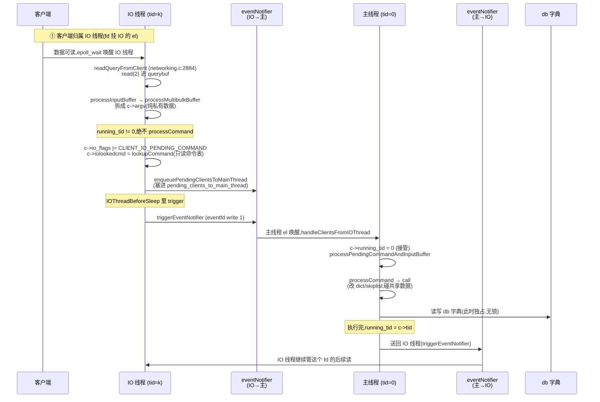

# 第二十章 · IO 多线程:把读写和解析外包,执行仍单线程

> 篇:P6 后台与多线程(收口章)
> 主轴呼应:本章是**取向①(单线程 + 事件循环)的现代化身**——Redis 8.0 把最枯燥的 socket 读写和 RESP 协议解析并行化给一组 IO 线程,却把碰共享 db 字典的命令执行死死钉在主线程。"IO 并行 + 执行单线程"这个混合,是单线程模型与多核利用之间一道被精确划过的边界。它不是"把 Redis 改成多线程数据库",而是"让那个唯一的主线程,从字节搬运里解放出来,专心做它最擅长的事"。

---

## 读完本章你会明白

1. **为什么 Redis 不干脆像 MySQL/PostgreSQL 那样改成"一连接一线程、共享数据加锁"的多线程数据库**——因为命根子(微秒级延迟)恰恰来自命令执行的无锁;一旦在 dict/skiplist 上挂锁,锁竞争会把延迟打回毫秒级。Redis 宁可只并行一半,也不背叛这条。
2. **8.0 的 IO 多线程和 6.x 到底差在哪、为什么这么差**——6.x 是"主线程每轮把客户端轮询分给几个 IO 线程、忙等收工再继续";8.0 改成"每个 IO 线程拥有自己独立的 `ae` 事件循环,客户端 accept 时就半永久归属某个 IO 线程",把分发的忙等开销彻底消掉。
3. **`c->running_tid != IOTHREAD_MAIN_THREAD_ID` 这一行 if,凭什么能划出"解析下放、执行不下放"的分水岭**——IO 线程解析自己 pending 里的 client,只动该 client 私有的 `querybuf`/`argv`,不碰任何 db 字典;命令执行要读写共享 db,必须回主线程。
4. **主线程要碰 IO 线程手里的东西时,为什么用忙等 + 原子状态机,而不是条件变量**——暂停只在低频路径(配置变更、迁移客户端)用,窗口极短,忙等省一次 futex 切换;且 `atomicSetWithSync`/`atomicGetWithSync` 自带内存屏障,顺便保证可见性。
5. **为什么一个 fd 任何时刻只挂在一个线程的事件循环上,是"IO 线程无锁并行"成立的物理前提**——fd 不打架 → `querybuf` 私有 → 解析无共享 → 无锁安全。Redis 用"职责切分"代替"加锁"。

---

> **如果一读觉得太难:先只记住三件事**——
> ① 8.0 开启 `io-threads N` 后,会启动 N−1 个 IO 线程(0 号槽位是主线程自己),每个 IO 线程跑自己独立的 `aeMain` 事件循环([iothread.c:548](../../redis-8.0.2/src/iothread.c#L548));
> ② 客户端被 accept 时由 `assignClientToIOThread`([iothread.c:127](../../redis-8.0.2/src/iothread.c#L127))按"最少连接数"半永久分配给某个 IO 线程,之后这个连接的 read 和 RESP 解析都在该 IO 线程里发生,执行则通过 eventNotifier 送回主线程;
> ③ 命令执行永远且只在主线程发生——因为执行要读写共享 db 字典,加锁就背叛了取向①。
> 这三件事,就是 8.0 IO 多线程的全部。

---

> **一句话点破:Redis 8.0 的 IO 多线程,是把"网络字节搬运 + 协议解析"这件 CPU 密集但纯私有的活外包给一组跑独立事件循环的 IO 线程,却把"命令执行"这件碰共享数据的活死死钉在主线程——不是不会做全多线程,而是算清了账:在内存数据库这个场景,单线程执行已经快到飞起,真正的瓶颈只在 IO 字节搬运,加锁的代价远大于它保护的价值。**

第二章讲 `ae` 事件循环时我们埋了伏笔:`aftersleep` 钩子([server.c:1895](../../redis-8.0.2/src/server.c#L1895))里挂着"把就绪连接的读任务分发给 IO 线程"——这一章就来兑现这条伏笔。它回答的是一个 Redis 用户迟早会问的问题:**机器有 16 核,Redis 主线程只用一核,剩下 15 核白闲着,凭什么?**

## 20.1 这块要解决什么:单线程再快,socket 仍是天花板

回到第二章的舞台。Redis 主线程靠一个 `ae` 事件循环,把几万个客户端复用在一根线程上:`epoll_wait` 一次唤醒一批就绪 fd,主线程挨个 `read` 进 `querybuf`、`processInputBuffer` 解析、`processCommand` 执行、`addReply` 攒回复,睡前在 `beforeSleep` 里 `handleClientsWithPendingWrites` 一次性 flush 出去。这套模型快,是因为命令执行不碰锁、不走上下文切换、缓存行还热。

但这套模型有一道物理天花板,而且是材料性质的:`read(2)` 和 `write(2)` 是**系统调用**,要陷内核、要走协议栈、要做 user-space ↔ kernel-space 的字节拷贝。当一个实例扛着几十万 QPS,又夹着一批大 key(比如一个 1MB 的 `GET` 返回值,或者一个深 pipeline 一次发来 1000 条命令),主线程的 CPU 时间会大量耗在"把字节从用户态搬到 socket"这种最枯燥的事上。你 `top` 一看,CPU 也许才 60%,但 p99 已经抖起来了——因为那一根主线程的 `epoll` 循环被一次大 `write` 卡住了几百微秒,后面的客户端全在排队。

问题的本质是:**CPU 没跑满,但全卡在一个线程的 socket IO 上。** 多核机器在旁边看着,白闲着。

> **不这样会怎样**:那能不能干脆把 Redis 改成多线程,像 MySQL、PostgreSQL 那样一条连接一个线程、共享数据(buffer pool、索引)加锁保护?这是数据库的常规答案,但 Redis 拒绝了。第三章讲 `processCommand` 时埋过伏笔:Redis 几乎所有命令的执行都是"纯内存操作 + 无锁",这是它微秒级延迟的命根子。一旦在 dict(第五章)、skiplist(第八章)、listpack 上挂锁,锁竞争本身就会把延迟打回毫秒级,还顺手带来死锁、ABA、缓存行乒乓一组新麻烦。第三章那个"`GET foo` 一条命令从进来到落库只走几微秒"的故事,前提就是"执行路径上零锁"。这条路数据库能走,是因为它的数据在磁盘、执行本来就慢,锁的相对开销可以忽略;Redis 的数据全在内存,执行快到锁的开销反而成了主导——**场景不同,选择就不同。**

于是 Redis 给出了一个极其克制、又极其聪明的折中:**只把最枯燥的 socket 读写和协议解析外包出去,命令执行一个字都不松口。** 这就是 IO 多线程。它不是"让 Redis 变成多线程数据库",而是"让那个唯一的主线程,从字节搬运里解放出来,专心做它最擅长的事——碰共享数据的命令执行"。

> **钉死这件事**:Redis 的 IO 多线程不是"全多线程",而是"IO 并行 + 执行单线程"的混合。它把网络字节搬运(读、写、RESP 解析)这种 CPU 密集但纯私有的活外包给 IO 线程,却把碰共享 db 字典的命令执行死死钉在主线程。这条边界不是工程妥协,而是场景匹配——内存数据库里,锁的代价远大于它保护的价值。

一个关键事实先记住:Redis 8.0 的 IO 多线程和 6.x 有**本质区别**,不是同一个设计的微调,而是推倒重来。本章所有源码以 8.0.2 为准;6.x 那套"主线程轮询分发 + 忙等收工"我们放 20.3 节专门对照讲。

## 20.2 数据结构:每线程一个事件循环 + 四条链表 + 一根通知管子

打开 IO 多线程只需一行配置:

```ini
io-threads 4
```

在 [`config.c:3170`](../../redis-8.0.2/src/config.c#L3170) 注册:`io-threads` 是不可变配置(`IMMUTABLE_CONFIG`),取值 1~128(`IO_THREADS_MAX_NUM` = 128,见 [`server.h:191`](../../redis-8.0.2/src/server.h#L191)),默认 1(即纯单线程)。[`redis.conf:1315-1322`](../../redis-8.0.2/redis.conf#L1315) 给出的建议是:**至少 4 核的机器才开,且留至少一个核给主线程**(4 核开 3 线程,8 核开 7 线程)。一个常被忽略的事实是,8.0 一旦开启 IO 线程,**读和写都并行**——[`redis.conf:1328-1330`](../../redis-8.0.2/redis.conf#L1328) 明说"we not only use threads for writes ... but also use threads for reads and protocol parsing"。(6.x 是默认只并行写、读要单独 `io-threads-do-reads yes`;8.0 里 `io-threads-do-reads` 这个配置虽然还在 `config.c:437` 解析,但 `server.io_threads_do_reads` 字段 [`server.h:1792`](../../redis-8.0.2/src/server.h#L1792) **全代码无任何读取处**——是个 6.x 残留的死配置,实际行为由"客户端归属 IO 线程"自然决定。这是 8.0 重构没清干净的一处小遗迹,看到时不必困惑。)

初始化在 [`iothread.c:553`](../../redis-8.0.2/src/iothread.c#L553) 的 `initThreadedIO`。注意循环从 `i = 1` 开始([iothread.c:565](../../redis-8.0.2/src/iothread.c#L565))——**0 号槽位留给了主线程自己**(`IOTHREAD_MAIN_THREAD_ID = 0`,见 [`server.h:196`](../../redis-8.0.2/src/server.h#L196))。每个 IO 线程拿到的东西相当"重":

```c
/* iothread.c:565-574 —— 每个 IO 线程一个独立事件循环 + 四个链表 */
for (int i = 1; i < server.io_threads_num; i++) {
    IOThread *t = &IOThreads[i];
    t->id = i;
    t->el = aeCreateEventLoop(server.maxclients+CONFIG_FDSET_INCR);  /* 自己的事件循环 */
    t->el->privdata[0] = t;                                          /* 回指 */
    t->pending_clients = listCreate();              /* 主线程要塞给我的(写方向) */
    t->processing_clients = listCreate();           /* 我正在处理的 */
    t->pending_clients_to_main_thread = listCreate();/* 我要交回主线程的(读解析完) */
    t->clients = listCreate();                      /* 归我长期管的 */
    atomicSetWithSync(t->paused, IO_THREAD_UNPAUSED); /* 初始未暂停 */
    ...
}
```

这四条链表,就是 IO 线程和主线程之间所有"客户端状态"的容器。每个 `IOThread` 结构体本身在 [`server.h:1415-1427`](../../redis-8.0.2/src/server.h#L1415) 定义:

```c
/* server.h:1415-1427 */
typedef struct __attribute__((aligned(CACHE_LINE_SIZE))) {
    uint8_t id;                              /* 1..127 */
    pthread_t tid;                           /* pthread 线程 ID */
    redisAtomic int paused;                  /* 暂停状态机(原子) */
    aeEventLoop *el;                         /* 本 IO 线程独立的事件循环 */
    list *pending_clients;                   /* 主线程 → IO 线程的待处理队列 */
    list *processing_clients;                /* IO 线程当前处理中 */
    eventNotifier *pending_clients_notifier; /* 唤醒 IO 线程的通知器 */
    pthread_mutex_t pending_clients_mutex;   /* 保护 pending_clients 的互斥 */
    list *pending_clients_to_main_thread;    /* IO 线程 → 主线程的待执行队列 */
    list *clients;                           /* 本 IO 线程长期管理的客户端 */
} IOThread;
```

注意那个 `__attribute__((aligned(CACHE_LINE_SIZE)))`——整个 `IOThread` 结构体按缓存行对齐。为什么?因为 `paused` 字段是主线程和 IO 线程都要原子读写的热点(20.5 节详述),如果不让整个结构体跨缓存行,主线程改 `paused` 时可能把同一个缓存行里 IO 线程正在读的其它字段(比如 `el` 指针)一起"乒乓"到另一个核,这就是经典的 **false sharing**。一个 `aligned(CACHE_LINE_SIZE)` 把每个 IOThread 钉死在自己独立的缓存行上,从根上消除这种伪共享。这是取向①("单线程快")在多线程语境下的延续——**多核之间也不能因为缓存行乒乓拖慢彼此。**

> **钉死这件事**:每个 IO 线程拥有自己独立的 `ae` 事件循环([iothread.c:568](../../redis-8.0.2/src/iothread.c#L568)),不是 6.x 那种"被动接活的短工",而是"各有地盘的地主"。这是 8.0 与 6.x 最大的分野(20.3 节深挖)。而 `IOThread` 结构体按 `CACHE_LINE_SIZE` 对齐([server.h:1415](../../redis-8.0.2/src/server.h#L1415)),把多核间的 false sharing 从结构体层面就堵死——这是把"单线程快"的命根子,在多线程语境下重新守住的一个细节。

主线程和 IO 线程之间靠**两根 eventNotifier** 双向通信(每对线程一组):

- **主线程 → IO 线程**:`IOThreads[i].pending_clients_notifier`([server.h:1423](../../redis-8.0.2/src/server.h#L1423))。主线程在 `sendPendingClientsToIOThreads`([iothread.c:293](../../redis-8.0.2/src/iothread.c#L293))里把待处理客户端 `listJoin` 进 `t->pending_clients`,然后 `triggerEventNotifier(t->pending_clients_notifier)`([iothread.c:305](../../redis-8.0.2/src/iothread.c#L305))唤醒 IO 线程。
- **IO 线程 → 主线程**:`mainThreadPendingClientsNotifiers[i]`([iothread.c:21](../../redis-8.0.2/src/iothread.c#L21))。IO 线程读 + 解析完一条命令,在 `IOThreadBeforeSleep` 里把客户端塞进 `mainThreadPendingClients`,然后 `triggerEventNotifier(mainThreadPendingClientsNotifiers[t->id])`([iothread.c:534](../../redis-8.0.2/src/iothread.c#L534))唤醒主线程。

eventNotifier 是什么?它是一个跨平台的"事件通知管子",实现在 [`eventnotifier.c:23`](../../redis-8.0.2/src/eventnotifier.c#L23):

```c
/* eventnotifier.c:23-40,平台差异 */
eventNotifier* createEventNotifier(void) {
    eventNotifier *en = zmalloc(sizeof(eventNotifier));
#ifdef HAVE_EVENT_FD
    if ((en->efd = eventfd(0, EFD_NONBLOCK|EFD_CLOEXEC)) != -1)  /* Linux:eventfd */
        return en;
#else
    if (anetPipe(en->pipefd, O_CLOEXEC|O_NONBLOCK, O_CLOEXEC|O_NONBLOCK) != -1)  /* 其它:pipe */
        return en;
#endif
    zfree(en);
    return NULL;
}
```

Linux 上用 **eventfd**(一个 8 字节计数器的轻量 fd,`triggerEventNotifier` 往里 `write(2)` 一个 `uint64_t=1`([eventnotifier.c:60-61](../../redis-8.0.2/src/eventnotifier.c#L60)),`handleEventNotifier` 一次 `read` 把计数清零([eventnotifier.c:75-76](../../redis-8.0.2/src/eventnotifier.c#L75)));其它平台(BSD/Mac)退化为 **pipe**(写端写一个 `'R'` 字节,读端读出来)。为什么要做这个平台分支?因为 eventfd 比 pipe 轻得多:它不分配两个 fd、不走管道缓冲、内核里就是一个 64 位计数器加一个等待队列。在"主线程和 IO 线程每秒可能互相通知几万次"的场景下,这个差异累积起来不可忽略。注意 eventNotifier 的语义是**边沿式累计**(写多次计数累加,读一次清零),这正好契合"我有 N 个客户端要你处理"这种批量通知——一次 trigger 就能把这一批都送过去,IO 线程醒来后一把处理完,不需要每客户端一次通知。

把这套画出来,就是 8.0 IO 多线程的舞台:

```text
                         主线程 (tid=0)
                  server.el (主事件循环)
                            │
        ┌───────────────────┼───────────────────┐
        │                   │                   │
   sendPendingClients   handleClients      beforeSleep
   ToIOThreads          FromIOThread       (步 14:送 IO 线程)
   (iothread.c:293)     (iothread.c:414)   (server.c:1844)
        │                   ▲                   │
        ▼ trigger           │ trigger           ▼ trigger
   ┌────────┐          ┌────────┐          ┌────────┐
   │IOThd[1]│ ◀──────► │IOThd[1]│ ◀──────► │IOThd[1]│
   │  el    │          │  el    │          │  el    │
   │pending │ read+    │pending │  parse   │pending │
   │clients │ parse    │_to_main│ ────────►│_to_main│
   └────────┘          └────────┘          └────────┘
   独立 aeMain          独立 aeMain          独立 aeMain
   (iothread.c:548)     每 IO 线程一个       每 IO 线程一个

   关键不变量:一个 fd,任意时刻只挂在一个线程的 el 上
   → querybuf/argv 是该 client 私有的 → 解析无锁安全
```

## 20.3 8.0 vs 6.x:从"主线程轮询分发"到"每线程独立事件循环"

这是本章最重要的一段对照,讲清"8.0 凭什么比 6.x 高级"。很多人对 Redis IO 多线程的印象还停在 6.0(2020 年那个版本),以为就是"开几个线程帮主线程读写"。8.0(2024 年)的设计已经和 6.x 是两回事了。

先回忆 6.x 的设计。6.0 的 IO 线程**没有自己的事件循环**——它们是纯粹的"工作线程",主循环长这样:

```text
6.x 的主线程每一轮:
  1. epoll_wait 拿到一批就绪 fd
  2. 把这些 fd 逐个分配到 N-1 个 IO 线程的队列(轮询或最少连接)
  3. 主线程自己处理 1/N 的 fd(分担)
  4. 主线程忙等(busy wait)所有 IO 线程把 read+parse 干完
  5. 所有线程收工 → 主线程串行执行这批命令(processCommand)
  6. 把回复再分发给 IO 线程 → 忙等它们 write 完
  7. 进入下一轮 epoll_wait
```

这套设计有两个**结构性开销**:

- **主线程每轮都要分发 + 收工忙等**。每个 `epoll_wait` 周期,主线程都要做一次"把就绪 fd 派给 N 个线程、然后等它们全干完"的协调。这个协调本身在主线程上发生,而且每次都要做——即便只有 1 个客户端就绪,也要走一遍"分发 + 收工"的流程。
- **IO 线程每一轮都"接活—干—交回去—闲着"**,无法积累任何状态。客户端这一轮在 IO 线程 A 手里,下一轮可能跑到 IO 线程 B 手里(主线程重新分配),IO 线程对客户端没有任何"长期归属感"。

8.0 的重构,把这两个开销都消掉了。核心改动是:**给每个 IO 线程配一个独立的 `ae` 事件循环,客户端在 accept 时就半永久地分配给某一个 IO 线程,之后这个连接的 read 和 RESP 解析永远在那个 IO 线程的事件循环里发生。** 主线程不再每轮分发——它只负责"在 beforeSleep 里把要送回 IO 线程的客户端批量 trigger 一次",以及"收到 IO 线程的通知后执行待执行的命令"。

这个改动带来三个直接好处:

**好处一:主线程不再忙等收工。** 6.x 的主线程每轮都要"分发 + 等 IO 线程干完",这个等待是串行的——主线程在等的时候什么都干不了。8.0 改成事件通知后,主线程把客户端 trigger 给 IO 线程后**可以继续干别的**(执行别的已就绪命令、跑定时任务),等 IO 线程异步通知回来再处理。主线程的 CPU 利用率显著提升。

**好处二:fd 归属稳定,解析状态连续。** 6.x 每轮重新分配,可能让同一个客户端这一轮在线程 A、下一轮在线程 B。虽然 6.x 不会真的出 bug(querybuf 是 client 私有的,线程切换不会丢数据),但缓存局部性差——上一轮线程 A 把这个 client 的 querybuf 读进了 L1/L2,下一轮轮到线程 B 又要重新从内存读。8.0 让客户端归属固定,缓存命中率天然更高。

**好处三:解析可以下放。** 这是 6.x→8.0 最关键的变化。6.x 的 IO 线程**只读 socket,不做协议解析**——解析(`processInputBuffer`/`processMultibulkBuffer`)还在主线程做,因为 6.x 主线程每轮要等所有 IO 线程收工再统一解析,解析如果下放就没有协调点。8.0 改成独立事件循环后,IO 线程在自己的循环里 `readQueryFromClient` → `processInputBuffer` → 解析出 `c->argv` → 发现是完整命令就 `enqueuePendingClientsToMainThread` 送回去,主线程拿到的就是已经切好的 `argv`,直接 `processCommand`。

| 维度 | 6.x(2020) | 8.0(2024) |
|------|-----------|-----------|
| IO 线程是否有独立 `ae` | **无**(被动接活的短工) | **有**([iothread.c:568](../../redis-8.0.2/src/iothread.c#L568),各有地盘的地主) |
| 客户端归属 | 每轮主线程重新分配 | accept 时 `assignClientToIOThread` 一次性敲定([iothread.c:127](../../redis-8.0.2/src/iothread.c#L127)),长期固定 |
| 主线程每轮做什么 | 分发 + 忙等收工 + 解析 + 执行 | 只做执行;读写解析都在 IO 线程异步推进 |
| 解析(`processMultibulkBuffer`)在哪 | **主线程**(IO 线程只 read) | **IO 线程**(`networking.c:2814` 在 IO 线程被调用) |
| 线程间通信 | 共享队列 + 忙等 | eventNotifier(eventfd/pipe)异步通知 |
| 主线程 CPU 利用率 | 受忙等拖累 | 显著提升(异步通知,不空转) |

> **钉死这件事**:8.0 IO 多线程的本质跃迁,是从"主线程轮询分发 + 忙等收工"的协调式,变成"每 IO 线程独立事件循环 + 异步通知"的自治式。这个改动让"协议解析下放"第一次成为可能——6.x 解析必须留主线程(否则没有协调点),8.0 解析可以下放(IO 线程在自己的循环里读完就解析,解析完通知主线程执行)。**解析下放、执行不下放**这条分水岭,是 8.0 独有设计自然结出的果。

## 20.4 读流水线:IO 线程读 + 解析,主线程执行

现在走进一条命令从 socket 字节到 db 改动的完整旅程。客户端被 accept 后,`acceptCommonHandler` 末尾分流:

```c
/* networking.c:1385-1386 */
/* Assign the client to an IO thread */
if (server.io_threads_num > 1) assignClientToIOThread(c);
```

`assignClientToIOThread`([iothread.c:127](../../redis-8.0.2/src/iothread.c#L127))的策略是最朴素的**最少连接数**:扫一遍所有 IO 线程,挑当前客户端数最少的那个:

```c
/* iothread.c:130-143 */
int min_id = 0;
int min = INT_MAX;
for (int i = 1; i < server.io_threads_num; i++) {
    if (server.io_threads_clients_num[i] < min) {
        min = server.io_threads_clients_num[i];
        min_id = i;
    }
}
server.io_threads_clients_num[c->tid]--;
c->tid = min_id;
c->running_tid = min_id;                      /* 半永久归属:tid 和 running_tid 都置为 IO 线程 id */
server.io_threads_clients_num[min_id]++;
connUnbindEventLoop(c->conn);                 /* 从主线程的 el 解绑 */
c->io_flags &= ~(CLIENT_IO_READ_ENABLED | CLIENT_IO_WRITE_ENABLED); /* 暂关读写 */
listAddNodeTail(mainThreadPendingClientsToIOThreads[c->tid], c);    /* 等下轮 beforeSleep 送过去 */
```

注意一个精妙的字段分裂:`c->tid`(归属线程)和 `c->running_tid`(当前正在哪个线程跑)。`assignClientToIOThread` 把两者都设成 IO 线程 id,但客户端此刻**还没真正到 IO 线程手里**——它要先在 `mainThreadPendingClientsToIOThreads` 队列里排队,等 [`server.c:1844`](../../redis-8.0.2/src/server.c#L1844) 的 `sendPendingClientsToIOThreads` 批量送过去。`tid` 是"户口",`running_tid` 是"人在哪"。后面会看到,主线程临时接管某个 client 时(比如要执行它的命令),会把 `running_tid` 改回 `IOTHREAD_MAIN_THREAD_ID`,但 `tid` 不变——户口还在 IO 线程那边,执行完还要还回去。

这一步极其关键:**同一个连接的 fd,任何时刻只挂在一个线程的事件循环上。** `connUnbindEventLoop` 把 fd 从主线程 el 摘下来,稍后 `handleClientsFromMainThread`([iothread.c:455](../../redis-8.0.2/src/iothread.c#L455))会把它 `connRebindEventLoop` 到 IO 线程的 el。这是"IO 线程不碰共享数据"能成立的物理前提——fd 不打架,数据结构自然也不打架。

客户端被送到 IO 线程后,`handleClientsFromMainThread` 把它挂进 `t->clients`,把 fd 绑到 IO 线程自己的 `el` 上,并注册读处理函数——就是第二章讲过的 `readQueryFromClient`:

```c
/* iothread.c:495-500 */
if (!connHasEventLoop(c->conn)) {
    connRebindEventLoop(c->conn, t->el);
    serverAssert(!connHasReadHandler(c->conn));
    connSetReadHandler(c->conn, readQueryFromClient);   /* 复用同一套读处理函数 */
}
```

注意这里**复用了第二章那套 `readQueryFromClient`**——主线程和 IO 线程用的是同一个函数,不是两套。这很关键:它意味着读 + 解析的代码路径只有一条,差异完全由 `c->running_tid` 这个字段在运行时分流。

数据可读时,IO 线程调 `readQueryFromClient`([networking.c:2884](../../redis-8.0.2/src/networking.c#L2884))。这里有一个**容易被忽略但决定全局设计**的细节:IO 线程不仅读 socket,还顺手**解析协议**。读完后调 `processInputBuffer`([networking.c:2776](../../redis-8.0.2/src/networking.c#L2776) 附近,由 `readQueryFromClient` 触发),它进一步调 `processMultibulkBuffer`/`processInlineBuffer`,把 `querybuf` 里的 RESP 字节流拆成 `c->argv`(一堆 redisObject)。注意这一步**只构建参数数组,不碰任何 db 字典**——它操作的完全是这个 client 私有的 `querybuf` 和 `argv`,所以并行安全。

真正的分水岭在 `processInputBuffer` 里这段([networking.c:2830-2848](../../redis-8.0.2/src/networking.c#L2830)):

```c
/* networking.c:2830-2848 —— 解析出一条完整命令后 */
} else {
    /* If we are in the context of an I/O thread, we can't really
     * execute the command here. All we can do is to flag the client
     * as one that needs to process the command. */
    if (c->running_tid != IOTHREAD_MAIN_THREAD_ID) {
        c->io_flags |= CLIENT_IO_PENDING_COMMAND;            /* 打标记:有待执行的命令 */
        c->iolookedcmd = lookupCommand(c->argv, c->argc);    /* 只查命令表(只读全局结构) */
        enqueuePendingClientsToMainThread(c, 0);             /* 送回主线程 */
        break;
    }
    /* We are finally ready to execute the command. */
    if (processCommandAndResetClient(c) == C_ERR) return C_ERR;
}
```

`if (c->running_tid != IOTHREAD_MAIN_THREAD_ID)` 这一行,是整章的灵魂。IO 线程解析出了一条完整的命令,**自己绝对不执行**,而是:

1. 打上 `CLIENT_IO_PENDING_COMMAND` 标记([server.h:409](../../redis-8.0.2/src/server.h#L409),`1ULL<<2`,注释明说 "Similar to CLIENT_PENDING_COMMAND")。
2. **顺手查一下命令表**:`c->iolookedcmd = lookupCommand(c->argv, c->argc)`。这一步是 20.6 节的主角——它读的是**全局命令表**(只读不改),所以并行安全,可以下放给 IO 线程。
3. 通过 `enqueuePendingClientsToMainThread`([iothread.c:26](../../redis-8.0.2/src/iothread.c#L26))把它塞进 `pending_clients_to_main_thread` 链表。
4. 然后在 IO 线程的 `IOThreadBeforeSleep`([iothread.c:513](../../redis-8.0.2/src/iothread.c#L513))里,把这个链表 `listJoin` 进 `mainThreadPendingClients[t->id]`([iothread.c:527-530](../../redis-8.0.2/src/iothread.c#L527)),并 `triggerEventNotifier`([iothread.c:534](../../redis-8.0.2/src/iothread.c#L534))通知主线程。

主线程被 eventNotifier 唤醒后,走 `handleClientsFromIOThread`([iothread.c:414](../../redis-8.0.2/src/iothread.c#L414))→ `processClientsFromIOThread`([iothread.c:323](../../redis-8.0.2/src/iothread.c#L323))。这里有一段关键的"接管":

```c
/* iothread.c:339-362 */
/* Let main thread to run it, set running thread id first. */
c->running_tid = IOTHREAD_MAIN_THREAD_ID;   /* ← 主线程接管,running_tid 改回 0 */

if (c->read_error) handleClientReadError(c); /* 读错误统一在主线程处理(打日志/释放) */

if (c->io_flags & CLIENT_IO_CLOSE_ASAP) { freeClient(c); continue; }

updateClientMemUsageAndBucket(c);

/* Process the pending command and input buffer. */
if (!c->read_error && c->io_flags & CLIENT_IO_PENDING_COMMAND) {
    c->flags |= CLIENT_PENDING_COMMAND;     /* 把 IO 标记转成全局标记 */
    if (processPendingCommandAndInputBuffer(c) == C_ERR) continue;
}
```

`processPendingCommandAndInputBuffer`([networking.c:2680](../../redis-8.0.2/src/networking.c#L2680))进而调 `processCommandAndResetClient`,这就回到了第三章讲过的 `processCommand` → `call` → 真正改 dict/skiplist 的那条路径。**命令执行,永远且只在主线程发生。**

执行完后,主线程在 [`iothread.c:384`](../../redis-8.0.2/src/iothread.c#L384) 把 `running_tid` 改回 `c->tid`,把客户端塞回 `mainThreadPendingClientsToIOThreads[c->tid]`,等下一轮 beforeSleep 送回 IO 线程——户口归还,IO 线程继续管它的读和后续命令解析。



> 一句话总结读路径:**IO 线程负责 read + RESP 解析(纯私有数据),主线程负责 processCommand(碰共享数据)。** 解析之所以能下放,是因为它只动这个 client 自己的 `querybuf` 和 `argv`;执行之所以绝不下放,是因为它会动 db 字典——动字典就得加锁,加锁就背叛了取向①。

## 20.5 写流水线:主线程攒回复,IO 线程 flush 到 socket

写方向是对称的,但更简单。命令执行后,回复被 `addReply*` 系列函数追加到 client 的输出 buffer。`addReply` 末尾有一个**决定写路径分流**的守卫([networking.c:296-300](../../redis-8.0.2/src/networking.c#L296)):

```c
/* networking.c:296-300 */
/* If the client runs in an IO thread, we should not put the client in the
 * pending write queue. Instead, we will install the write handler to the
 * corresponding IO thread's event loop and let it handle the reply. */
if (!clientHasPendingReplies(c) && likely(c->running_tid == IOTHREAD_MAIN_THREAD_ID))
    putClientInPendingWriteQueue(c);
```

注释和代码合起来读,意思很直白:**归 IO 线程管的客户端,回复攒好后不进主线程的 `clients_pending_write` 队列。** 那进哪?进它自己 IO 线程的事件循环。具体路径是:`processClientsFromIOThread` 执行完命令后,在末尾([iothread.c:400-408](../../redis-8.0.2/src/iothread.c#L400))把客户端塞回 `mainThreadPendingClientsToIOThreads[c->tid]`,然后 `triggerEventNotifier` 通知 IO 线程。IO 线程的 `handleClientsFromMainThread`([iothread.c:455](../../redis-8.0.2/src/iothread.c#L455))收到后,如果客户端有 pending reply,直接 `writeToClient`([iothread.c:504](../../redis-8.0.2/src/iothread.c#L504));如果没写完,再 `connSetWriteHandler(c->conn, sendReplyToClient)`([iothread.c:506](../../redis-8.0.2/src/iothread.c#L506))注册写事件,等 socket 可写时继续 flush。

主线程自己也有 `clients_pending_write`(纯主线程的客户端用,以及某些特殊场景下从 IO 线程临时拉过来的客户端),在 `beforeSleep` 里:

```c
/* server.c:1841-1844 */
/* Handle writes with pending output buffers. */
handleClientsWithPendingWrites();

/* Let io thread to handle its pending clients. */
sendPendingClientsToIOThreads();
```

这两步的顺序也有讲究。注释 [`server.c:1817-1819`](../../redis-8.0.2/src/server.c#L1817) 明说:"`flushAppendOnlyFile` must be done before `handleClientsWithPendingWrites` and `sendPendingClientsToIOThreads`, in case of `appendfsync=always`"——和第二章 2.5 节那条"AOF 先于回复"的顺序约束是同一个语义:**回复了客户端,就一定已经持久化**。`sendPendingClientsToIOThreads` 紧跟在 `handleClientsWithPendingWrites` 后面,让两条写路径(主线程直写、IO 线程写)在同一个 beforeSleep 窗口里都被触发。

一个值得注意的细节:`handleClientsWithPendingWrites`([networking.c:2214-2220](../../redis-8.0.2/src/networking.c#L2214))里还有一条"回收"逻辑——某些原本归主线程的客户端,如果满足条件(不是 CLOSE_AFTER_REPLY、不是必须主线程处理的特殊客户端),会被 `assignClientToIOThread` 转交给 IO 线程:

```c
/* networking.c:2213-2220 */
/* Let IO thread handle the client if possible. */
if (server.io_threads_num > 1 &&
    !(c->flags & CLIENT_CLOSE_AFTER_REPLY) &&
    !isClientMustHandledByMainThread(c))
{
    assignClientToIOThread(c);
    continue;
}
```

这是 Redis 在动态平衡负载:主线程的 `clients_pending_write` 如果太长,可以把一部分客户端"移交"给 IO 线程管,让后续的回复 flush 也并行起来。`isClientMustHandledByMainThread`([iothread.c:114](../../redis-8.0.2/src/iothread.c#L114))列出了一类**绝不能交出去**的客户端:CLOSE_ASAP、MASTER、SLAVE、PUBSUB、MONITOR、BLOCKED、TRACKING、LUA_DEBUG 等——它们要么主线程可能直接写(比如从节点、pubsub 订阅者),要么生命周期特殊(比如要立刻关闭),必须主线程亲自照看。

> **钉死这件事**:写路径的分流靠 `addReply` 末尾那一个 `likely(c->running_tid == IOTHREAD_MAIN_THREAD_ID)` 守卫([networking.c:299](../../redis-8.0.2/src/networking.c#L299))。归 IO 线程的客户端不进主线程的 `clients_pending_write`,而是通过 `processClientsFromIOThread` 末尾的 trigger 送回 IO 线程,由 IO 线程在自己的 el 里 `writeToClient`。两条写路径(主线程直写、IO 线程写)在 beforeSleep 的同一个窗口里被分别触发,且都遵守"AOF 先于回复"的顺序约束。

## 20.6 技巧精解①:`c->running_tid` 分水岭——为什么解析下放、执行不下放

这是整章最该想透的一点。看 `processInputBuffer` 那行 `if (c->running_tid != IOTHREAD_MAIN_THREAD_ID)`,表面上只是个"在不在主线程"的判断,但它背后是一道被精心划过的边界。我们要问:**凭什么解析能下放,执行不能?凭什么 IO 线程跑 `processMultibulkBuffer` 不出问题,跑 `processCommand` 就会出问题?**

先看 IO 线程在 `processInputBuffer` 里到底动了什么。`processMultibulkBuffer` 把 RESP 字节流(比如 `*3\r\n$3\r\nSET\r\n$3\r\nfoo\r\n$3\r\nbar\r\n`)拆成 `c->argv`(三个 redisObject:`SET`、`foo`、`bar`)。它读的是 `c->querybuf`(这个 client 的输入缓冲),写的是 `c->argv`/`c->argc`/`c->multibulklen`/`c->bulklen`(这个 client 的解析状态)。**这些字段全部是 `client` 结构体私有的**——没有任何其它客户端、任何 db 字典会碰它们。所以 N 个 IO 线程同时解析 N 个客户端的命令,各自动各自的私有数据,物理上不可能互相干扰,**不需要锁**。

再看 `lookupCommand(c->argv, c->argc)`([networking.c:2836](../../redis-8.0.2/src/networking.c#L2836))——这一步是 IO 线程解析时顺手做的"命令查找"。它读的是什么?是 `server.commands` 这个全局命令表(一个 dict,key 是命令名字符串,value 是 `struct redisCommand`)。看 `lookupCommand` 的实现([server.c:3295](../../redis-8.0.2/src/server.c#L3295)):

```c
/* server.c:3295-3297 */
struct redisCommand *lookupCommand(robj **argv, int argc) {
    return lookupCommandLogic(server.commands, argv, argc, 0);
}
```

`lookupCommandLogic`([server.c:3279](../../redis-8.0.2/src/server.c#L3279))做的事是 `dictFetchValue(commands, argv[0]->ptr)`——一次 dict 的只读查找。命令表在 Redis 启动完成后(`populateCommandTable`)就**只读不改**(运行时不会动态增删命令,除非 `MODULE LOAD`,而模块加载会暂停所有 IO 线程)。所以多个 IO 线程并发查命令表,是**只读共享 + 只读共享 = 无冲突**,不需要锁。

> **钉死这件事**:解析能下放的根,是"它只动私有数据 + 只读全局只读结构"。`querybuf`/`argv` 是 client 私有的,IO 线程各管各的;`lookupCommand` 读的命令表是启动后只读的。两者都不写共享,所以并行安全。Redis 在这里把线划得极清:**只读的全局结构可以碰(命令表),可写的全局数据(dict/skiplist/listpack)一个字节都不碰。** 这条线划得多准,设计就有多克制。

那执行呢?`processCommand` → `call` → 命令自己的 `proc`(比如 `setCommand` → `setGenericCommand` → `dbAdd` → `dictAdd`)。这一路要**写 db 字典**(`server.db[j].dict`)、可能要更新 LRU 时钟、可能要触发 keyspace notification、可能要推进 replication backlog。这些都是**全局共享且会被修改**的数据。如果让 N 个 IO 线程同时执行 N 个客户端的命令,它们会同时写同一个 db 字典——必须加锁。而锁的代价我们在 20.1 算过:微秒级的内存操作一旦挂锁,锁竞争、缓存行乒乓、上下文切换会把它打回毫秒级,Redis 的立身之本(快)就没了。

所以 Redis 的选择是:**把执行留主线程,代价是吞吐受限;换来的是无锁执行,延迟保住。** 这不是"不会做全多线程",而是**清醒地选择了"半并行"作为单线程模型的最优补丁**。

```text
                ┌─────────── IO 线程能碰 ───────────┐    ┌── 只主线程能碰 ──┐
                │                                    │    │                  │
client 私有      │  querybuf  argv  multibulklen     │    │                  │
(每 client 一份) │  bulklen  io_flags  reply buf     │    │                  │
                │                                    │    │                  │
全局只读         │  server.commands (命令表)         │    │                  │
(启动后不变)     │  全套配置常量                       │    │                  │
                │                                    │    │                  │
全局可写         │                                    │    │  server.db[].dict │
(必须加锁)       │                                    │    │  server.db[].expires
                │                                    │    │  replication 缓冲 │
                │                                    │    │  统计计数器       │
                └────────────────────────────────────┘    └──────────────────┘
                          ↑                                          ↑
                  IO 线程解析在这里                              执行必须回主线程
                  (processMultibulkBuffer                        (processCommand→call
                   + lookupCommand)                               → dbAdd 等)
```

把这条分水岭和序章讲过的**五种把耗时从主线程解放的姿势**对应起来:Redis 的"并行化"只并行**纯 IO**(姿势之"并行化纯 IO"),不并行**执行**——因为执行碰共享。这是五种姿势里最克制的一种,它知道边界在哪。

## 20.7 技巧精解②:暂停机制——忙等 + 原子状态机

主线程有时必须"安全地"碰 IO 线程手里的东西——比如 resize 事件循环([iothread.c:156](../../redis-8.0.2/src/iothread.c#L156) 的 `resizeAllIOThreadsEventLoops`)、把某个客户端从 IO 线程迁回主线程([iothread.c:55](../../redis-8.0.2/src/iothread.c#L55) 的 `keepClientInMainThread`)、或者临时 fetch 一个客户端(`fetchClientFromIOThread`,[iothread.c:75](../../redis-8.0.2/src/iothread.c#L75))。这些操作要改 IO 线程事件循环的状态、或者改 IO 线程管理的 client 链表——必须确保 IO 线程此刻**没在跑事件循环的任何回调**,否则就是数据竞争。

8.0 给的是一套**忙等 + 原子状态机**的暂停机制。状态有四档,定义在 [`server.h:646-649`](../../redis-8.0.2/src/server.h#L646):

```c
/* server.h:646-649 */
#define IO_THREAD_UNPAUSED      0   /* 正常运行 */
#define IO_THREAD_PAUSING       1   /* 主线程请求暂停,IO 线程还没确认 */
#define IO_THREAD_PAUSED        2   /* IO 线程已暂停,主线程可以动它了 */
#define IO_THREAD_RESUMING      3   /* 主线程请求恢复,IO 线程还没确认 */
```

主线程这一侧的暂停逻辑在 `pauseIOThreadsRange`([iothread.c:198](../../redis-8.0.2/src/iothread.c#L198)):

```c
/* iothread.c:204-226,精简 */
for (int i = start; i <= end; i++) {
    PausedIOThreads[i]++;
    if (PausedIOThreads[i] > 1) continue;   /* 嵌套暂停:只计数,不重复暂停 */

    atomicSetWithSync(IOThreads[i].paused, IO_THREAD_PAUSING);   /* ① 置 PAUSING */
    triggerEventNotifier(IOThreads[i].pending_clients_notifier); /* ② 唤醒它(别在 poll 里睡着) */
}
/* Wait for all io threads paused */
for (int i = start; i <= end; i++) {
    if (PausedIOThreads[i] > 1) continue;
    int paused = IO_THREAD_PAUSING;
    while (paused != IO_THREAD_PAUSED) {                          /* ③ 忙等变 PAUSED */
        atomicGetWithSync(IOThreads[i].paused, paused);
    }
}
```

IO 线程这一侧在 `handlePauseAndResume`([iothread.c:257](../../redis-8.0.2/src/iothread.c#L257)),它**只在 `IOThreadBeforeSleep` 里被调**([iothread.c:523](../../redis-8.0.2/src/iothread.c#L523)):

```c
/* iothread.c:257-269 */
void handlePauseAndResume(IOThread *t) {
    int paused;
    atomicGetWithSync(t->paused, paused);
    if (paused == IO_THREAD_PAUSING) {
        atomicSetWithSync(t->paused, IO_THREAD_PAUSED);   /* 自报已暂停 */
        while (paused != IO_THREAD_RESUMING) {            /* 忙等恢复 */
            atomicGetWithSync(t->paused, paused);
        }
        atomicSetWithSync(t->paused, IO_THREAD_UNPAUSED); /* 自报已恢复 */
    }
}
```

把这套状态机画出来:

```text
主线程                              IO 线程
  │                                    │
  │ atomicSetWithSync(paused,PAUSING)  │
  │ ─────────────────────────────────► │
  │ triggerEventNotifier(唤醒它)       │
  │                                    │
  │                                    │ IOThreadBeforeSleep 里检查
  │                                    │ handlePauseAndResume
  │                                    │ atomicSetWithSync(paused,PAUSED)
  │ ◄───────────────────────────────── │
  │ busy while (paused != PAUSED)      │
  │                                    │ busy while (paused != RESUMING)
  │ [此时主线程可以安全地碰 IO 线程数据] │ (IO 线程在自己 beforeSleep 后阻塞在
  │ resize el / 迁移 client / ...      │  aeApiPoll 之前,不发事件)
  │                                    │
  │ atomicSetWithSync(paused,RESUMING) │
  │ ─────────────────────────────────► │
  │ busy while (paused != UNPAUSED)    │
  │                                    │ atomicSetWithSync(paused,UNPAUSED)
  │ ◄───────────────────────────────── │
  │                                    │ 继续 aeMain 循环
```

这里有两个反直觉的设计选择,正是 8.0 的精妙处。

**第一,为什么用忙等(busy while),而不是条件变量(pthread_cond_wait)?** 注释 [`iothread.c:171-190`](../../redis-8.0.2/src/iothread.c#L171) 自己解释了:"to avoid thread suspended, we use busy waiting to confirm the target status"。原因是**暂停窗口极短**:IO 线程在自己的 `IOThreadBeforeSleep` 里检查到 `PAUSING` 就立刻自报 `PAUSED`,这个"看到 PAUSING → 自报 PAUSED"只差几条指令;主线程那边"看到 PAUSED → 干活 → 置 RESUMING"通常也是几微秒的活(resize el、迁移一个 client)。如果用条件变量,光 `pthread_cond_wait`/`pthread_cond_signal` 的两次 futex 系统调用就要几微秒,加上线程切换,可能比忙等还慢。忙等的代价是**烧 CPU**,但暂停是低频操作(配置变更、连接迁移时才用),常态下根本不触发,烧一下无所谓。

**第二,为什么用 `atomicSetWithSync`/`atomicGetWithSync`,而不是普通 atomic?** 关键在 `WithSync`——这两个宏([`server.h`](../../redis-8.0.2/src/server.h))内部用的是带**内存屏障**的原子操作(GCC 的 `__atomic` 系列,`__ATOMIC_SEQ_CST` 全序)。这一层屏障保证:**主线程改 `paused=PAUSING` 之前的所有写(比如准备要 resize 的新数组),对 IO 线程在看到 `PAUSING` 之后是可见的**;反之亦然。如果不带屏障,只靠 `volatile` 或普通原子,CPU 乱序执行和缓存可见性延迟可能让"主线程以为已经改完了"的数据,IO 线程其实还没看到——暂停就形同虚设。`atomicSetWithSync` 一条指令既改值又插屏障,简洁又正确。

还有一个细节:`PausedIOThreads[i]` 这个计数器([iothread.c:195](../../redis-8.0.2/src/iothread.c#L195))支持**嵌套暂停**。主线程可能在一个调用链里多次触发暂停(比如 resize 时内部又调了一次 `pauseIOThread`),每次 `PausedIOThreads[i]++`,只有第一次真正发 PAUSING;对应地 `resumeIOThreadsRange` 每次减一,只有最后一次才真正发 RESUMING。这避免了"嵌套暂停的内外层互相把对方刚 resume 的线程又 pause 住"的混乱,是个小巧的引用计数。

> **钉死这件事**:暂停机制是"忙等 + 原子状态机(UNPAUSED→PAUSING→PAUSED→RESUMING→UNPAUSED)"的组合。忙等是为了省 futex 切换(暂停窗口极短,忙等比条件变量快);`atomicSetWithSync`/`atomicGetWithSync` 自带 `__ATOMIC_SEQ_CST` 屏障,顺便保证主线程和 IO 线程之间的内存可见性。这是 Redis 在"必须协调多线程"的少数路径上,用最少的机制(一个原子 int + 状态机)做到既快又正确的范例——也是取向④(简单优先)在多线程语境下的体现。

## 20.8 技巧精解③:fd 归属一fd一线程,与 reusable query buffer

回头看整章的设计,支撑"IO 线程无锁并行"的物理事实只有一条:**任意时刻,一个连接(socket fd)只被一个线程的事件循环管理。** 这件事由 `assignClientToIOThread` 在 accept 时一次性敲定,后续除非 `keepClientInMainThread`([iothread.c:55](../../redis-8.0.2/src/iothread.c#L55))这种显式迁移,否则归属不变。迁移时要做什么?看 `keepClientInMainThread`:

```c
/* iothread.c:55-70 */
void keepClientInMainThread(client *c) {
    serverAssert(c->tid != IOTHREAD_MAIN_THREAD_ID &&
                 c->running_tid == IOTHREAD_MAIN_THREAD_ID);   /* 必须主线程已接管 */
    server.io_threads_clients_num[c->tid]--;
    unbindClientFromIOThreadEventLoop(c);                       /* ← 关键:先暂停 IO 线程再解绑 */
    connRebindEventLoop(c->conn, server.el);                   /* fd 挂回主线程 el */
    connSetReadHandler(c->conn, readQueryFromClient);
    c->io_flags |= CLIENT_IO_READ_ENABLED | CLIENT_IO_WRITE_ENABLED;
    c->running_tid = IOTHREAD_MAIN_THREAD_ID;
    c->tid = IOTHREAD_MAIN_THREAD_ID;                          /* 户口也迁过来 */
    server.io_threads_clients_num[c->tid]++;
}
```

注意 `unbindClientFromIOThreadEventLoop`([iothread.c:42](../../redis-8.0.2/src/iothread.c#L42))——它**先 `pauseIOThread(c->tid)` 再 `connUnbindEventLoop` 再 `resumeIOThread`**。为什么?因为 `connUnbindEventLoop` 要改 fd 在 IO 线程事件循环里的注册状态(`epoll_ctl(EPOLL_CTL_DEL)`),这个操作必须保证 IO 线程此刻没在用这个 fd——否则 IO 线程可能正在 `epoll_wait` 里盯着这个 fd,你这边一删,那边就出竞态。暂停机制就是为这一刻准备的:**让 IO 线程停在 `beforeSleep` 的干净点上,主线程从容地动它的 fd,再放它走。** 一个 fd 一根管子,迁移时要"先停后动",这是这条不变量的操作守则。

```text
fd 归属的状态机(一个 fd 的一生):

  accept 时 ──► assignClientToIOThread ──► fd 挂 IO 线程 A 的 el
                                            │
                                  (长期归属,读+解析在 A)
                                            │
                                            ▼
                    若 isClientMustHandledByMainThread:
                    keepClientInMainThread(先 pauseIOThread(A))
                                            │
                                            ▼
                              fd 挂回主线程 el(户口也迁)
                                            │
                                  (主线程长期管这个 client)
                                            │
                                            ▼
                    若又可交回:assignClientToIOThread(networking.c:2218)
                              fd 再挂某个 IO 线程 B 的 el
```

**关键不变量:任意时刻,fd 只在一个线程的 el 上。** 这个不变量成立 → `querybuf` 不共享 → 解析无锁安全。

这套"一fd一线程"的设计,还顺带解决了一个小问题:**`aeDeleteFileEvent` 不是线程安全的。** 如果两个线程都对同一个 el 调 `aeDeleteFileEvent`(它要改 `events[fd].mask`),会出竞态。8.0 让每个 IO 线程有自己的 el,各自管各自的 fd,`aeDeleteFileEvent` 永远只被"拥有这个 fd 的那个线程"调用,从根上消除了这个竞态——不需要给 `ae` 加锁,只需要保证"el 不被跨线程访问"。这是把并发问题从"加锁保护共享"转化为"切分避免共享"的又一例。

另一个细节是 **reusable query buffer**。看 `readQueryFromClient` 里这段([networking.c:2920-2939](../../redis-8.0.2/src/networking.c#L2920)):

```c
/* networking.c:35-36 —— 每线程一个复用 buffer(线程局部) */
__thread sds thread_reusable_qb = NULL;
__thread int thread_reusable_qb_used = 0;
```

每个线程(主线程 + 每个 IO 线程)有自己的 `thread_reusable_qb`,这是一个 `__thread` 线程局部变量。第一次读小命令时,`readQueryFromClient` 把它"借给" client 当 querybuf 用,读完(`processInputBuffer` 处理完)再归还([networking.c:1662-1676](../../redis-8.0.2/src/networking.c#L1662))。为什么?因为绝大多数命令都很小(< 16KB),给每个 client 独立分配 `querybuf` 既费内存又碎缓存。借一个线程级的复用 buffer,既省分配,又让小命令的内存访问集中在少数几个缓存行上——热数据天然在 L1。

注意它是 `__thread`(每线程一个),不是全局一个。为什么?因为 8.0 有多个 IO 线程各自读,如果还是全局一个 `reusable_qb`,多个 IO 线程同时借就要加锁——这就违背了"IO 路径无锁"的原则。做成 `__thread` 后,每个线程有自己的复用 buffer,各自借各自还,**零锁**。这是"IO 线程独立事件循环"设计的自然延伸——又一个用职责切分回避锁的小巧思。大命令(≥ `PROTO_MBULK_BIG_ARG`)则不借,直接给 client 独立分配 querybuf([networking.c:2907](../../redis-8.0.2/src/networking.c#L2907)),因为大命令可能把复用 buffer 撑大超过 32K,导致 client "买下"这个 buffer,反而违背复用的初衷。

> **钉死这件事**:fd 归属的"一fd一线程"不变量,是整个 IO 多线程设计的物理基石。它由 `assignClientToIOThread` 在 accept 时敲定,由 `keepClientInMainThread`(迁移时 `pauseIOThread` → `connUnbind` → `resume`)在切换时守护。这个不变量成立,`querybuf` 就是 client 私有的,`aeDeleteFileEvent` 就永远只被拥有者线程调用——并行无锁、`ae` 不用加锁,两条安全性都从这个不变量自然导出。而 `__thread thread_reusable_qb` 把"复用 buffer"也做成每线程一份,同样是"切分避免共享"的延伸。

## 20.9 IO 多线程的收益与代价:什么场景该开,什么场景别开

讲清楚了机制,最后要诚实地说清这套设计的**适用边界**——它不是"开了就快"的银弹。

**收益:网络 IO 并行,吞吐随核数线性涨。** IO 多线程解决的是"主线程被 socket 字节搬运卡住"这个问题。当负载特征是**大 key 频繁 + 高 QPS + 多客户端**(比如一个缓存 1MB 图片的 Redis、或者一个深 pipeline 的统计聚合场景),主线程单核处理 read/write 来不及时,开 IO 线程能让 read/write/解析并行到多个核上,吞吐随核数近线性增长。redis-benchmark 在 SET/GET 大量短连接场景下,开 IO 线程通常能看到 1.5x~2x 的吞吐提升(具体数值取决于核数和负载)。

**代价一:执行仍单线程,重命令场景收益不明显。** IO 多线程只并行 IO 和解析,**不并行执行**。如果你的瓶颈是命令执行本身(比如一个复杂的 `ZUNIONSTORE`、一个跑 Lua 脚本的长任务、一个 `SORT` 大集合),开 IO 线程帮不上忙——因为执行还是串在主线程上。这种场景的瓶颈在 CPU 单核性能和算法复杂度,不是 IO。Redis 的 [`redis.conf:1317-1319`](../../redis-8.0.2/redis.conf#L1317) 自己也提醒:"We also recommend using threaded I/O only if you actually have performance problems, with Redis instances being able to use a quite big percentage of CPU time, otherwise there is no point in using this feature."——没事别开。

**代价二:小连接/轻命令场景,反而可能变慢。** 如果你的负载是大量小客户端发大量短命令(每条命令几十字节),主线程单核已经绰绰有余,开 IO 线程反而引入开销:每条命令要多走一次"IO 线程 → eventNotifier → 主线程"的来回,这个通知和链表操作的开销,在轻负载下可能比它省下来的 IO 时间还多。Redis 默认 `io-threads 1`(不开)正是出于这个考虑——开 IO 线程是一个**有门槛的优化**,不是"开了更好"。

**代价三:编程复杂度。** 这套设计(独立事件循环 + 暂停机制 + eventNotifier 双向通知 + client 双 tid 字段 + isClientMustHandledByMainThread 的特殊客户端列表)的复杂度,远高于 6.x 那套"主线程轮询分发"。复杂度 = bug 风险 = 维护成本。Redis 团队愿意承受这个复杂度,是因为 8.0 的目标是**让 Redis 在多核机器上不再浪费 CPU**——这个目标值这个代价。但对用户来说,理解这套机制的门槛也变高了,排障时(比如某个客户端卡在 IO 线程没回主线程)需要知道这套流水线怎么走。

**代价四:与持久化/复制的微妙交互。** 注意 [`iothread.c:400-402`](../../redis-8.0.2/src/iothread.c#L400) 那个判断:

```c
if (listLength(mainThreadPendingClientsToIOThreads[t->id]) &&
    server.aof_fsync != AOF_FSYNC_ALWAYS &&
    !ProcessingEventsWhileBlocked)
```

**当 `appendfsync=always` 时,执行完命令的客户端不会立刻送回 IO 线程**——要等到下一轮 `beforeSleep` 里 `flushAppendOnlyFile` 之后再送(见 `server.c:1844`)。为什么?因为 always 模式要求"回复客户端前必须先 fsync",如果命令执行完立刻把客户端送回 IO 线程,IO 线程可能在主线程 fsync 之前就把回复写出去了——破坏了"AOF 先于回复"的语义。这是个非常细节的交互,体现了 8.0 在"IO 并行"和"持久化语义"之间的精确权衡。

把这套收益和代价摆在一起,Redis 的建议是清晰的:**生产环境,如果你的 Redis 实例 CPU 经常跑到 70%+、瓶颈在网络 IO(典型是大 key 或深 pipeline)、机器至少 4 核,才考虑开 `io-threads N`(N = 核数 − 1)。否则别开,单线程模型本身就够快。** 这是 Redis 一贯的工程气质——不为了"用上多核"而用多核,只在真正需要时才引入复杂度。

> **钉死这件事**:IO 多线程是"IO 并行 + 执行单线程"的混合,不是"全多线程"。它解决的是网络 IO 瓶颈(大 key、深 pipeline、高 QPS),不解决执行瓶颈(重命令)。Redis 默认不开(`io-threads 1`),只在"CPU 跑满 + 瓶颈在 IO + 至少 4 核"这三个条件都满足时才建议开。这是取向④(简单优先)在配置层的体现——**复杂度是代价,只在收益明确时才付。**

## 章末:回扣、五个为什么、往哪钻

### 主线回扣

本章是**取向①(单线程 + 事件循环)的终极体现**——但不是"单线程"本身的胜利,而是"单线程模型与多核利用之间精确折中"的胜利。Redis 把整套设计押在一句话上:**宁可只并行最枯燥的 socket 读写和解析,也不愿在数据结构访问上加一把锁。** 把这句话拆开,每半句都对应一条取舍:

- "**只并行最枯燥的 socket 读写和解析**" → 因为 read/write/解析是 CPU 密集但纯私有的活,外包出去主线程就能从字节搬运里解放,吞吐随核数线性涨。
- "**不愿在数据结构访问上加一把锁**" → 因为一旦加锁,微秒级的内存操作会被锁竞争、缓存行乒乓打回毫秒级,Redis 的立身之本(快)就没了。

这套取舍落到 8.0 的具体设计上,就是四个关键决策:① 每 IO 线程独立 `ae` 事件循环(消除主线程分发开销);② 客户端 accept 时半永久归属一个 IO 线程(保证 fd 归属稳定,缓存局部性好);③ `c->running_tid` 分水岭(解析下放执行不下放);④ 忙等 + 原子状态机的暂停机制(低频协调用最少的机制做到既快又正确)。这四个决策合起来,把"IO 并行 + 执行单线程"这条边界守得滴水不漏。

至此,P6 后台与多线程篇的三个主角——第十八章的后台任务(bgsave/bgrewriteaof/惰性删除)、第十九章的 BIO 线程(fsync/close/lazyfree)、第二十章的 IO 多线程(读写+解析)——凑齐了。它们的共同哲学是一致的:**主线程只做它最擅长、最不可并行的事(执行命令、改数据),其余能外包的全外包。** 而"外包给谁"有明确分工:fork 子进程干重活(RDB/AOF rewrite)、BIO 线程干阻塞性系统调用(fsync/close)、IO 线程干纯 IO(读写+解析)。每种外包都对应一种"把耗时从主线程解放"的姿势,合起来就是序章五种姿势的全部落地。

### 五个为什么

**Q1:为什么 IO 线程不能执行命令,只能解析?**

执行要读写共享 db 字典(`server.db[].dict`/`expires`),N 个 IO 线程同时执行 N 个客户端命令就要加锁,锁竞争会把微秒级内存操作打回毫秒级。解析只动 client 私有的 `querybuf`/`argv` 和只读的命令表,无共享可写,所以并行安全。这条边界由 `c->running_tid != IOTHREAD_MAIN_THREAD_ID` 这一行 if 划定([networking.c:2834](../../redis-8.0.2/src/networking.c#L2834)),是"解析下放、执行不下放"的物理实现。

**Q2:8.0 为什么给每个 IO 线程配独立 `ae`,不像 6.x 那样让主线程轮询分发?**

6.x 的"主线程每轮分发 + 忙等收工"有两个结构性开销:主线程每轮都做协调(即便只 1 个客户端就绪)、IO 线程对客户端没有长期归属感(缓存局部性差)。8.0 的独立事件循环 + 客户端固定归属,消除了这两个开销,还顺带让"协议解析下放"第一次成为可能——6.x 解析必须留主线程(否则没有协调点),8.0 解析可以下放(IO 线程在自己循环里读完就解析,解析完通知主线程执行)。

**Q3:暂停机制为什么用忙等而不是条件变量?**

暂停窗口极短:IO 线程在 `IOThreadBeforeSleep` 里看到 `PAUSING` 就立刻自报 `PAUSED`,主线程看到 `PAUSED` 干几微秒活就置 `RESUMING`,整个过程常在微秒级。条件变量的 `pthread_cond_wait`/`signal` 两次 futex 系统调用 + 线程切换,可能比忙等还慢。忙等烧 CPU,但暂停是低频操作(配置变更、连接迁移时才用),烧一下可以接受。`atomicSetWithSync`/`atomicGetWithSync` 自带 `__ATOMIC_SEQ_CST` 屏障,顺便保证内存可见性。

**Q4:为什么 `io-threads-do-reads` 这个配置在 8.0 里是"死"的?**

它是 6.x 残留:`config.c:437` 还在解析,`server.h:1792` 还有字段 `io_threads_do_reads`,但全代码 `grep server.io_threads_do_reads` 无任何读取处。8.0 的设计改成"客户端归属 IO 线程"后,IO 线程天然既读又解析(读和解析在同一函数 `readQueryFromClient` → `processInputBuffer` 里,无法分开),所以这个开关失去意义。这是个"重构没清干净"的小遗迹,看到时不必困惑——实际行为由"客户端归属 IO 线程"自然决定。

**Q5:Redis 这套和 Tokio 那种异步运行时、和 Go 的 GMP,本质区别在哪?**

三套都是"用少量线程驱动海量并发单元",但并发单元的载体不同。Redis 的并发单元是**客户端连接**,载体是**操作系统给的 epoll 事件**——IO 线程和主线程都在 `epoll_wait` 里真睡,等内核叫醒。Tokio 的并发单元是 **task**(Rust 的 async/await 状态机),载体是**用户态调度器**——`.await` 的"等待"是 task 在用户态挂起,一个线程能挂几万个 task 且切换零系统调用。Go 的 GMP 并发单元是 **goroutine**,载体是**语言运行时的 GMP 调度器**——goroutine 切换在用户态、由 runtime 抢占式调度。三者解决的是同一个问题(少量线程驱动海量并发),但 Redis 把并发粒度留在"连接"这一层(IO 线程数固定),Tokio/Go 把并发粒度压到"task/goroutine"这一层(并发数可海量)。Redis 选择更粗的粒度,是因为它的命令执行必须串行(碰共享数据),细粒度并发对它没意义;Tokio/Go 选细粒度,是因为它们要处理任意 `.await`/channel 点的挂起,粒度细才有价值。本系列《Tokio 设计与实现》和《Go runtime 设计与实现》是它们的对照面。

### 想继续深入往哪钻

- 想看 6.x IO 多线程的原始设计:读 Redis 6.0 源码的 `networking.c`(`handleClientsWithPendingReadsUsingThreads`/`handleClientsWithPendingWritesUsingThreads`),对比 8.0 的 `iothread.c`。6.x 那套"主线程轮询分发 + 忙等"在 8.0 已经不存在(`grep handleClientsWithPendingReadsUsingThreads networking.c` 无匹配),这是版本演进最直观的证据。
- 想看 eventNotifier 的平台分支细节:读 [`eventnotifier.c`](../../redis-8.0.2/src/eventnotifier.c)(只有 99 行),看 `HAVE_EVENT_FD` 宏如何由 configure 检测 `sys/eventfd.h` 决定,Linux 走 eventfd、其它平台走 pipe。
- 想看 IO 线程如何被 kill:读 [`iothread.c:615`](../../redis-8.0.2/src/iothread.c#L615) 的 `killIOThreads`,它用 `pthread_cancel` + `pthread_join`——注意 Redis 关闭时先 kill IO 线程再退出主循环,确保 fd 都回到主线程手里。
- 想看 `isClientMustHandledByMainThread` 的完整列表:读 [`iothread.c:114`](../../redis-8.0.2/src/iothread.c#L114),理解为什么 MASTER/SLAVE/PUBSUB/MONITOR/BLOCKED/TRACKING 这些客户端必须主线程亲自照看——它们要么主线程可能直接写(从节点、pubsub),要么生命周期特殊(BLOCKED 的唤醒要走 blockedBeforeSleep)。
- 想对比"语言级异步运行时"怎么解同一道题:看本系列《Tokio 设计与实现深入浅出》的 work-stealing 调度章节,以及《Go runtime 设计与实现深入浅出》的 GMP 章节——三者(reactor 单线程、Tokio 多线程调度、Go GMP)是"少量线程驱动海量并发"的三个范式。

### 引出下一章

至此 P6 后台与多线程篇收口。下一章是全书 P7 收尾篇,我们会把五条设计取向重新串一遍:从内存即数据库(②)、到编码自适应(③)、到可靠性(⑤)、到本章的取向①(单线程 + 事件循环,以及它的现代化身 IO 多线程),最后回到取向④(简单优先)这条贯穿一切的尺子。读到这里,你应该已经能从一行 `io-threads 4` 的配置,一路看到 Redis 团队对"快"与"不丢不乱"这两个执念的全部坚持了——而 P7 会把这份坚持收束成一个完整的世界观。

---

## 验证物:如何亲手确认本章的设计

> 说明:本书写作环境为 Windows,无法直接运行 redis-server(8.0 依赖 fork/epoll/eventfd 等 Linux 特性)。以下 (1) gdb 断点脚本 (2) 源码常量锚点 (3) INFO/io-threads 观察项 均为可复现的精确指引,供读者在 Linux 环境(Ubuntu 22.04 / CentOS 8 等)对 redis-8.0.2 源码 `make no-opt`(Makefile 里 no-opt 目标会去掉 -O2 加 -g)编译后自行验证。**本书不附编造的运行输出**——凡未实跑的,只给脚本与预期观察变量,不写具体数值。

### 1. gdb 断点脚本

编译:`cd redis-8.0.2 && make no-opt`(带 -g)
启动:`gdb ./src/redis-server`,配置文件里设 `io-threads 4`。

```gdb
(gdb) break initThreadedIO                  # IO 线程初始化,iothread.c:553
(gdb) break IOThreadMain                    # IO 线程主循环入口,iothread.c:540
(gdb) break assignClientToIOThread          # 客户端归属分配,iothread.c:127
(gdb) break readQueryFromClient             # IO 线程读处理,networking.c:2884
(gdb) break processInputBuffer              # 解析入口,networking.c:2776 附近
(gdb) break networking.c:2834               # 分水岭:if (running_tid != MAIN_THREAD_ID)
(gdb) break lookupCommand                   # 命令表查找(只读),server.c:3295
(gdb) break enqueuePendingClientsToMainThread  # 送回主线程,iothread.c:26
(gdb) break processClientsFromIOThread      # 主线程接管执行,iothread.c:323
(gdb) break pauseIOThreadsRange             # 暂停机制,iothread.c:198
(gdb) break handlePauseAndResume            # IO 线程侧暂停配合,iothread.c:257
(gdb) break IOThreadBeforeSleep             # IO 线程睡前钩子,iothread.c:513
(gdb) run /path/to/redis.conf               # 配置里含 io-threads 4

# 另开终端 redis-cli 发一条 SET foo bar:
# 预期断点命中顺序(多线程下 gdb 跟踪一个线程,需用 thread 命令切换):
#   initThreadedIO(启动时,创建 3 个 IO 线程)
#   → assignClientToIOThread(accept 时,挑最少连接数的 IO 线程)
#   → IOThreadMain(在某个 IO 线程里跑 aeMain)
#   → readQueryFromClient(数据可读)
#   → processInputBuffer → 命中 networking.c:2834(running_tid != 0)
#   → lookupCommand(查命令表,只读)
#   → enqueuePendingClientsToMainThread(塞进 pending_clients_to_main_thread)
#   → IOThreadBeforeSleep(trigger eventNotifier 通知主线程)
#   → processClientsFromIOThread(主线程接管,running_tid 改回 0)
#   → processCommand → call → setCommand(执行,改 db 字典)

# 观察 running_tid 的切换:
(gdb) print c->tid                          # 预期:归属的 IO 线程 id(1,2,3 之一)
(gdb) print c->running_tid                  # 预期:accept 后 = tid;执行时 = 0;执行后 = tid
(gdb) print c->io_flags                     # 预期:解析完含 CLIENT_IO_PENDING_COMMAND (1<<2)
```

**预期观察**(基于源码 [iothread.c:323-385](../../redis-8.0.2/src/iothread.c#L323) 的接管逻辑,本书未实跑):一条命令的生命周期里,`c->running_tid` 会经历 `tid(归属IO线程) → 0(主线程接管执行) → tid(归还)`的切换;`c->tid` 全程不变(户口不迁)。这是"半永久归属 + 临时接管"模型的直接证据。

### 2. 源码常量锚点(带行号,从 redis-8.0.2 源码 Grep 核实)

| 常量/字段 | 位置 | 值/说明 |
|----------|------|---------|
| `IOTHREAD_MAIN_THREAD_ID` | server.h:196 | 0(主线程的 tid 槽位) |
| `IO_THREADS_MAX_NUM` | server.h:191 | 128(io-threads 配置上限) |
| `IO_THREAD_UNPAUSED/PAUSING/PAUSED/RESUMING` | server.h:646-649 | 0/1/2/3(暂停状态机四档) |
| `CLIENT_IO_READ_ENABLED` | server.h:407 | `1ULL<<0`(client 可被 IO 线程读) |
| `CLIENT_IO_WRITE_ENABLED` | server.h:408 | `1ULL<<1`(client 可被 IO 线程写) |
| `CLIENT_IO_PENDING_COMMAND` | server.h:409 | `1ULL<<2`(IO 线程解析出的待执行命令) |
| `CLIENT_IO_REUSABLE_QUERYBUFFER` | server.h:410 | `1ULL<<3`(借用 thread_reusable_qb) |
| `CLIENT_IO_CLOSE_ASAP` | server.h:411 | `1ULL<<4`(IO 线程要求主线程关闭此 client) |
| `io-threads` 配置 | config.c:3170 | 1~128,默认 1,IMMUTABLE_CONFIG |
| `io-threads-do-reads` 配置(8.0 死配置) | config.c:437 / server.h:1792 | 解析但全代码无读取处 |
| `IOThread` 结构体(CACHE_LINE 对齐) | server.h:1415-1427 | id/tid/paused/el/pending_clients/.../clients |
| `thread_reusable_qb`(__thread) | networking.c:35 | 每线程一个复用 querybuf |
| `initThreadedIO`(从 i=1 起) | iothread.c:553/565 | 0 号槽位留主线程 |
| `assignClientToIOThread`(最少连接数) | iothread.c:127-151 | accept 时一次性归属 |
| `processInputBuffer` 分水岭 | networking.c:2834 | `if (running_tid != MAIN_THREAD_ID)` |
| `lookupCommand`(只读命令表) | server.c:3295 | `lookupCommandLogic(server.commands,...)` |
| `enqueuePendingClientsToMainThread` | iothread.c:26 | IO→主方向送回 |
| `handleClientsFromIOThread` | iothread.c:414 | 主线程被 eventNotifier 唤醒 |
| `processClientsFromIOThread` | iothread.c:323 | 主线程接管执行(running_tid 改回 0) |
| `pauseIOThreadsRange`/`handlePauseAndResume` | iothread.c:198/257 | 忙等 + 原子状态机 |
| `createEventNotifier`(eventfd/pipe 平台分支) | eventnotifier.c:23-40 | Linux eventfd,其它 pipe |

### 3. INFO 与 io-threads 观察项(需本地 redis-server)

> 以下操作需在 Linux 本地启动 redis-server(配置 `io-threads 4`)后用 redis-cli 执行。本书未实跑,仅列观察方法与预期(基于源码字段 [`server.h:1864-1865`](../../redis-8.0.2/src/server.h#L1864) 的统计计数器推导)。

```text
# 观察 IO 线程是否真的在工作(统计计数器):
127.0.0.1:6379> INFO stats
# 预期输出含:
#   io_threaded_reads_processed:0    # 主线程处理的读事件数
#   io_threaded_reads_processed:1    # IO 线程 1 处理的读事件数
#   io_threaded_reads_processed:2    # IO 线程 2 处理的读事件数
#   io_threaded_reads_processed:3    # IO 线程 3 处理的读事件数
#   io_threaded_writes_processed:0..3  # 对应的写事件数
# 对应源码 server.h:1864-1865 的 stat_io_reads_processed[IO_THREADS_MAX_NUM]
# 和 stat_io_writes_processed[IO_THREADS_MAX_NUM]。
# 若 io-threads 1(单线程),只有 [0] 有值;若 io-threads 4,[0..3] 都应有值。

# 观察配置生效(io-threads 是 IMMUTABLE,启动后不能改):
127.0.0.1:6379> CONFIG GET io-threads
# 预期:"4"(或你设的值)
127.0.0.1:6379> CONFIG SET io-threads 8
# 预期:错误(IMMUTABLE_CONFIG,不可运行时修改,需重启)

# 观察 io-threads-do-reads 这个"死配置":
127.0.0.1:6379> CONFIG GET io-threads-do-reads
# 预期:"no"(默认值),但即便设 yes 也无效果(8.0 全代码无读取处)

# 用 strace 观察 eventfd 通知(证实主线程↔IO 线程异步通信):
strace -f -e eventfd2,read,write -p <redis-server-pid> 2>&1 | grep -E 'eventfd|\[1\]'
# 预期:看到 eventfd2() 系统调用(创建 eventNotifier),
# 以及对 eventfd 的 write(8 字节,uint64=1)和 read(清零)。
# 这正是 triggerEventNotifier/handleEventNotifier 的内核侧证据。
```

标注:以上预期基于源码常量([server.h:1864-1865](../../redis-8.0.2/src/server.h#L1864) 统计数组、[eventnotifier.c:60-76](../../redis-8.0.2/src/eventnotifier.c#L60) eventfd 读写)与 Linux 内核行为推导,本书未在本地实跑;若你的 redis 版本/配置不同(比如 `io-threads 1`),统计数组只有 `[0]` 有值,eventfd 也不一定被创建(单线程模式下 initThreadedIO 直接返回,见 [iothread.c:554](../../redis-8.0.2/src/iothread.c#L554))。
