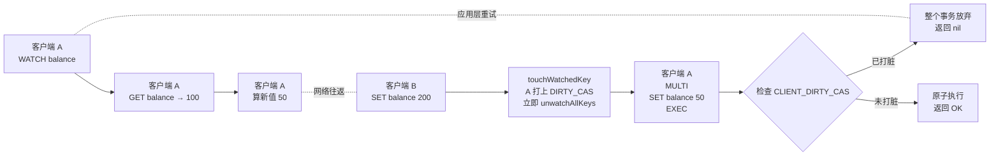
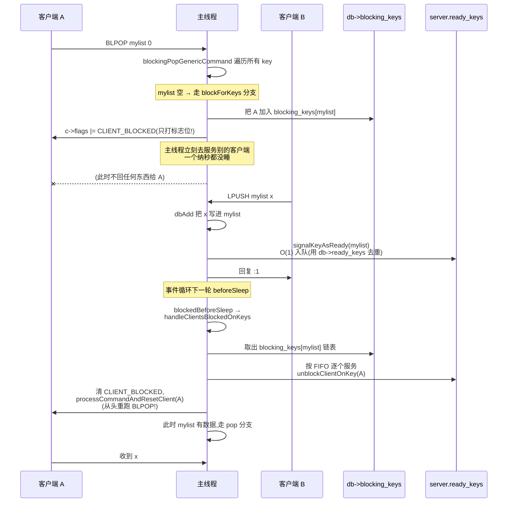

# 第二十一章 · 那些"看似阻塞"的特性如何不阻塞

> 篇:P7 收尾(正文终章)
> 主轴呼应:这一章是**取向①(单线程 + 事件循环)的终极收束**。事务的 `MULTI`/`EXEC`、Lua 的 `EVAL`、阻塞命令的 `BLPOP`——这三个特性听起来都会让主线程"等一下",但读完这章你会看到:它们一个都没让主线程真的等。Redis 把"等待"这件事整个翻译成了"数据结构里的一个状态 + 事件循环的下一轮"。

---

## 读完本章你会明白

1. **为什么 Redis 事务敢宣称"原子执行",却又拒绝提供回滚**——因为"原子"在这里指的是"队列里一口气跑完、中间不被插队",而单线程天然就提供了这个保证;至于运行时出错,antirez 的判断是"那不是数据库该兜底的 bug"。
2. **`WATCH` 这个乐观锁凭什么不需要任何锁**——靠的是"改动时打脏标记、提交时查一眼",所有"标脏"和"检查"都发生在同一个线程里,没有并发,就不需要锁。
3. **Lua 脚本一旦开始执行,主线程为什么不回头处理别的客户端**——这正是它"原子"的来源;但代价是脚本可能死循环,Redis 靠 Lua 的 count hook + `processEventsWhileBlocked` 这套机制,在"卡死"和"可被 KILL"之间留了一条活路。
4. **`BLPOP` 听上去要让主线程 sleep,它凭什么一个纳秒都不睡**——靠的是"挂起(client 打个标志位)+ 就绪队列(`signalKeyAsReady` O(1) 入队)+ beforeSleep 统一唤醒"这三步,把多线程的 wait/notify 翻译成了单线程里的状态机。
5. **这三处"看似阻塞"的机制,如何收束全书五条设计取向**——它们共同印证了 Redis 的核心哲学:**凡是需要让主线程停下来的需求,都要被重新组织成"数据结构里的状态 + 事件循环的下一轮",绝不真停。**

---

> **如果一读觉得太难:先只记住三件事**——
> ① 事务 = `MULTI` 开启后命令只入队不执行,`EXEC` 时一口气跑完;`WATCH key` 后任何改动会让本次 `EXEC` 直接失败(乐观锁);
> ② Lua `EVAL` 的原子性不是用锁换的,是单线程天然给的;脚本死循环靠 `lua_sethook` 每 10 万条指令触发一次钩子,钩子里嵌套跑一轮事件循环好让 `SCRIPT KILL` 进来;
> ③ `BLPOP` 空列表时,client 只是被打上 `CLIENT_BLOCKED` 标志位(主线程立刻去服务别的客户端);别的客户端 `LPUSH` 数据进来,这个 key 被 O(1) 入"就绪队列",事件循环下一轮 `beforeSleep` 统一唤醒。
> 这三件事,就是本章的全部。

---

> **一句话点破:Redis 没有"阻塞主线程"这回事——事务靠排队、Lua 靠超时钩子、阻塞命令靠挂起与唤醒,三种看似会卡的特性,全部被翻译成了"数据结构里记一个状态,事件循环下一轮再来处理"。把"等"外包给状态机和事件循环,主线程自己永远在跑命令。**

第二章里我们看清楚了 `aeMain` 那个 `while (!stop)` 循环([ae.c:492](../../redis-8.0.2/src/ae.c#L492))是 Redis 的心脏:每一轮它 `epoll_wait` 睡一下,谁可读了就处理谁,处理完再睡。这套机制之所以能撑起几万并发,关键就一句话:**主线程不能在任何一条命令上"等"——它一等,所有客户端都得跟着等,几十万 QPS 瞬间归零。** 第三章顺着这条线看 `processCommand` 怎么把一条命令跑完,第十九、二十章看 fork 子进程和 IO 线程怎么把慢活外包——这二十章其实都在回答同一个问题:**怎么让主线程不卡。**

但 Redis 偏偏提供了三个"听起来就会卡"的特性:

- **事务**(`MULTI`/`EXEC`/`WATCH`):客户端要把几条命令打包,要求"原子地一口气跑完,中间不能被别人插队"。
- **Lua 脚本与 Functions**(`EVAL`/`FUNCTION`):一段脚本里能跑任意多条命令,Redis 还承诺脚本"原子执行"。
- **阻塞命令**(`BLPOP`/`BRPOP`/`BLMOVE` 等):列表空了,客户端要"阻塞等待"直到有数据。

初学者一看到这三个特性的名字就会本能担心:原子执行一大串命令,期间主线程不就被占住了吗?客户端 `BLPOP` 等数据,主线程不就得跟着 sleep 吗?如果是多线程数据库,这些担心是合理的——锁、条件变量、线程切换都得上。**但 Redis 的答案全部一样:主线程从不真的阻塞,它把"等"这件事外包给了数据结构和事件循环。** 这一章就是要把这套"外包等待"的机制讲透,并把它收束到全书的主轴上。

## 21.1 这块要解决什么:三个"听起来会卡住"的特性

先把三个特性的"卡住风险"摆出来,看它们为什么听上去危险。

**事务的卡住风险**。客户端 A 发来 `MULTI` → `DECRBY alice 100` → `INCRBY bob 100` → `EXEC`,这四条命令是分四次网络往返发过来的。Redis 主线程收到第二条 `DECRBY` 时,如果立刻执行,那 A 还没发 `INCRBY`,这时候客户端 B 完全可以插进来一条 `GET alice` 看到扣了钱、bob 还没到账——破坏了"转账"的原子语义。所以 Redis 必须把这几条命令攒起来,等 `EXEC` 一到再一口气跑。可这一口气跑完期间,别的客户端是不是要等?这是事务的第一个风险。

**Lua 的卡住风险**。比事务更进一步,Lua 脚本里可以写控制流:`if redis.call('GET', k) > 10 then redis.call('SET', k, 0) end`。这段脚本一旦开始,Redis 必须一口气跑完——否则脚本里读到的状态、改的数据,会被别的客户端插进来打乱。可一段脚本可以跑任意久(死循环也行),如果它卡死,整个 Redis 是不是跟着卡死?这是 Lua 的致命风险。

**阻塞命令的卡住风险**。客户端 A 执行 `BLPOP mylist 0`(0 表示无限等),如果 mylist 此时是空的,最直白的实现就是主线程 `sleep` 等,直到别的客户端 `LPUSH` 进来。可主线程一 sleep,几十万别的客户端全得跟着 sleep——这显然不行。

> **不这样会怎样**:这三个风险,在多线程数据库里是靠"锁 + 条件变量 + 线程切换"来解决的。事务用行锁(读时上锁,提交时解锁);脚本用全局锁或事务锁;阻塞命令用 `pthread_cond_wait`(线程 park,等别人 `notify`)。这些机制的共同点是:**会让线程真的停下来等**。在多核多线程的环境下,这是合理的——一个线程睡了,别的线程还在跑,整体吞吐不受影响。但 Redis 是单线程,**主线程一旦睡,就全睡**。所以这三套多线程方案在 Redis 这里一个都不能用——它必须另想出路。

这一章就是要看清楚这条"出路"长什么样。结论先放这里,后面三节展开:**事务靠"入队 + 排队执行"(软件级攒批,不耗时);Lua 靠"超时钩子 + 嵌套事件循环"(脚本期间不回事件循环,但超时后让事件循环喘口气);阻塞命令靠"挂起标志位 + 就绪队列 + beforeSleep 统一唤醒"(纯状态机,零等待)。** 三者机制不同,哲学一致:**把"等"翻译成"状态 + 下一轮"。**

## 21.2 事务的入队与执行:queueMultiCommand 的 argv 过户零拷贝

事务的动机很朴素:客户端想把几条命令打包,要求它们"看起来像一条"地执行完,中间不能被别的客户端的命令夹断。比如转账——`DECRBY alice 100` 紧接着 `INCRBY bob 100`,中间不能让别人看到 alice 扣了钱、bob 还没到账的中间态。

Redis 的实现极其直球,核心就一句话:**`MULTI` 开启后,后续命令不执行,只入队;`EXEC` 时再把队列里的命令一口气跑完。** 客户端打上 `CLIENT_MULTI` 标志位([server.h:334](../../redis-8.0.2/src/server.h#L334) 的 `#define CLIENT_MULTI (1<<3)`)之后,`processCommand` 在 [server.c:4323-4333](../../redis-8.0.2/src/server.c#L4323) 这段判断里把命令拦下:

```c
/* server.c:4323-4333,精简 */
if (c->flags & CLIENT_MULTI &&
    c->cmd->proc != execCommand &&      /* 这 7 个命令是事务控制命令, */
    c->cmd->proc != discardCommand &&   /* 即便在 MULTI 里也要立即执行, */
    c->cmd->proc != multiCommand &&     /* 不能入队 */
    c->cmd->proc != watchCommand &&
    c->cmd->proc != quitCommand &&
    c->cmd->proc != resetCommand)
{
    queueMultiCommand(c, cmd_flags);    /* 入队,不执行 */
    addReply(c,shared.queued);          /* 回一个 +QUEUED */
} else {
    /* 不在事务里,或者属于上面 7 个豁免命令,才真执行 */
    call(c, flags);
}
```

注意这个豁免名单——`EXEC`/`DISCARD`/`MULTI`/`WATCH`/`QUIT`/`RESET` 自己不能入队,否则事务永远出不来(`MULTI` 入队了,谁来触发 `EXEC`?)。除了这 7 个,其余命令在 `CLIENT_MULTI` 状态下一律进 `queueMultiCommand`。

真正精妙的是 `queueMultiCommand`([multi.c:40](../../redis-8.0.2/src/multi.c#L40))——它做了一件极其巧妙的事:**argv 过户零拷贝**。

```c
/* multi.c:40-76,核心几行 */
void queueMultiCommand(client *c, uint64_t cmd_flags) {
    multiCmd *mc;

    /* 事务已经被标脏(WATCH 失效)或已 ABORT,直接丢弃后续命令,
       省得浪费内存——这对 pipeline 场景尤其友好(客户端可能一口气
       发十几条命令还没看到上一条的失败回复)。 */
    if (c->flags & (CLIENT_DIRTY_CAS|CLIENT_DIRTY_EXEC))
        return;
    /* 首次入队,默认开 2 个槽:假设事务至少两条命令。 */
    if (c->mstate.count == 0) {
        c->mstate.commands = zmalloc(sizeof(multiCmd)*2);
        c->mstate.alloc_count = 2;
    }
    /* 倍增扩容,和 std::vector 一个套路。 */
    if (c->mstate.count == c->mstate.alloc_count) {
        c->mstate.alloc_count = c->mstate.alloc_count < INT_MAX/2
                                ? c->mstate.alloc_count*2 : INT_MAX;
        c->mstate.commands = zrealloc(c->mstate.commands,
                                      sizeof(multiCmd)*(c->mstate.alloc_count));
    }
    mc = c->mstate.commands+c->mstate.count;
    mc->cmd = c->cmd;
    mc->argc = c->argc;
    mc->argv = c->argv;       /* ★ 指针过户,不复制 */
    mc->argv_len = c->argv_len;

    c->mstate.count++;
    /* ...累加 cmd_flags、argv_len_sums... */

    /* Reset the client's args since we copied them into the mstate and
     * shouldn't reference them from c anymore. */
    c->argv = NULL;           /* ★ 把 client 的 argv 置空 */
    c->argc = 0;
    c->argv_len_sum = 0;
    c->argv_len = 0;
}
```

看末尾 `[multi.c:62](../../redis-8.0.2/src/multi.c#L62)` 的 `mc->argv = c->argv;` 和 `[multi.c:72-73](../../redis-8.0.2/src/multi.c#L72)` 的 `c->argv = NULL; c->argc = 0;`——**入队不是复制参数,而是把 `argv` 指针的所有权"过户"给队列**。`argv` 是 `robj **`(指向 robj 指针数组的指针),里面每一项都是指向共享对象的引用(见第一章 SDS 和第三章对象系统)。过户后,客户端结构体这一轮的 `argv` 被置空,下一轮它继续接收新命令时,`readQueryFromClient` 会重新分配新的 `argv`,不会误释放队列里的命令。

这个设计呼应了第一章反复出现的"对象引用计数,不复制 SDS"的总原则:从客户端 socket 解析出来的 `argv`,从来不是被复制来复制去,而是靠"谁用谁 reference、谁不用谁 dereference"这套引用计数在各方之间流动。事务入队只是又多了一个持有者——而且这次连引用计数都不动,直接把 `argv` 数组指针过户,因为 client 自己马上就不引用它了。

> **钉死这件事**:事务入队的 argv 过户是 Redis 里"零拷贝 + 所有权转移"的教科书例子。`mc->argv = c->argv`([multi.c:62](../../redis-8.0.2/src/multi.c#L62))把指针数组挪给队列,`c->argv = NULL`([multi.c:72](../../redis-8.0.2/src/multi.c#L72))把 client 那边的引用清空。整套入队过程**没有一次 `memcpy`、没有一次对象深拷贝**——这和第三章讲的 `call(c)` 命令执行直接吃 `c->argv` 是同一条思路的延续。在每秒几万事务的负载下,这种零拷贝是隐形吞吐前提。

入队攒够了,`EXEC` 一到就执行。`execCommand`([multi.c:128](../../redis-8.0.2/src/multi.c#L128))先把 `CLIENT_DENY_BLOCKING` 标志打上([multi.c:164](../../redis-8.0.2/src/multi.c#L164)),然后是一个 for 循环逐条 `call`:

```c
/* multi.c:176-216,核心执行循环,精简 */
addReplyArrayLen(c,c->mstate.count);
for (j = 0; j < c->mstate.count; j++) {
    /* 把队列里的 argv 还给 client —— 与 queueMultiCommand 过户时的反向操作 */
    c->argc = c->mstate.commands[j].argc;
    c->argv = c->mstate.commands[j].argv;
    c->argv_len = c->mstate.commands[j].argv_len;
    c->cmd = c->realcmd = c->mstate.commands[j].cmd;
    /* ACL 权限复查(队列里的命令每条都要再查一次) */
    if (c->id == CLIENT_ID_AOF)
        call(c,CMD_CALL_NONE);        /* AOF 客户端走简化路径 */
    else
        call(c,CMD_CALL_FULL);        /* 普通客户端完整执行+传播 */
    serverAssert((c->flags & CLIENT_BLOCKED) == 0);   /* ★ 底线断言 */
}
```

这一段有三个细节值得钉死:

第一,**argv 反向过户**。执行循环每跑一条命令,就把队列里的 `argv` 还给 `c->argv`([multi.c:177-180](../../redis-8.0.2/src/multi.c#L177))。这正好是 `queueMultiCommand` 过户的逆操作——入队时指针从 client 流向队列,执行时指针从队列流回 client。Redis 之所以能用同一份 `client` 结构体走完整的命令执行链路(`call(c)` 内部读 `c->argv`、`c->cmd`,见第三章),就是靠这套"指针来回过户"实现的,而不是为事务单独搞一套执行路径。

第二,**AOF 客户端走 `CMD_CALL_NONE`**([multi.c:211](../../redis-8.0.2/src/multi.c#L211))。AOF 重放时的事务执行不带 `CMD_CALL_FULL` 的传播逻辑——因为重放本身就是被传播过来的命令,没必要再传播一次(否则会无限循环)。这是一个"知道自己从哪来"的细节。

第三,也是最关键的——**`serverAssert((c->flags & CLIENT_BLOCKED) == 0)`**([multi.c:215](../../redis-8.0.2/src/multi.c#L215))。这条断言是底线:`EXEC` 期间任何一条命令都**不许把客户端挂起阻塞**。前面打 `CLIENT_DENY_BLOCKING` 标志位就是为了这个——阻塞命令(`BLPOP` 等)看到这个标志会直接返回 nil 而不是真阻塞(详见 21.4 节)。为什么这么严格?因为 `EXEC` 是一个 for 循环,如果中间某条命令把 client 阻塞了,主线程要么跟着 sleep(灾难),要么把 client 挂起然后自己继续跑下一条(那事务就被拆成两半了,不原子)。**Redis 选择一刀切:事务里根本不能出现阻塞命令,主线程的执行权必须紧凑地归还给事件循环。**

> **钉死这件事**:事务执行的 for 循环里那行 `serverAssert((c->flags & CLIENT_BLOCKED) == 0)`([multi.c:215](../../redis-8.0.2/src/multi.c#L215))是整套设计的底线——它把"事务 = 一口气跑完不可拆分"这条语义,用一条 assert 写死在源码里。配合 `CLIENT_DENY_BLOCKING` 标志位([multi.c:164](../../redis-8.0.2/src/multi.c#L164) 设置、`t_list.c:1261` 检查),Redis 从机制上杜绝了"事务执行到一半被挂起"的可能。这是取向①"主线程不能在任何命令上等"在事务特性上的硬执行。

## 21.3 WATCH 乐观锁:三套数据结构 + 一个脏标记,没有任何锁

事务光有"原子执行"还不够,客户端经常需要"读—改—写"的隔离:先 `GET balance`,应用层算出新值,再 `SET balance 新值`。可这两条命令之间隔着网络往返,别的客户端完全可能改掉 balance。关系数据库用行锁解决(读时上锁,改完提交时解锁,期间别人不能动);Redis 选了另一条路——**乐观锁 + CAS(Check-And-Set)**:`WATCH balance` 之后,任何对这个 key 的修改都会让本次 `EXEC` 直接失败,客户端拿到 nil 后自己决定是否重试。

为什么 Redis 选乐观锁而不是悲观锁?要害在一个事实:**悲观锁要让主线程等**。`WATCH balance` 之后如果给 balance 上锁,别的客户端改 balance 就要等本次事务结束——可"本次事务"可能还没开始(客户端还在算),这就意味着主线程要持有锁等待,期间所有想改 balance 的客户端都得排队。单线程下,这就是让主线程 sleep。**Redis 不能容忍主线程等任何东西,所以它选了乐观锁——把"等待"翻译成"重试",重试发生在客户端,不占主线程一毫秒。**

机制的核心是三套数据结构 + 一个标记位。先看结构体——`watchedKey` 在 [multi.c:254](../../redis-8.0.2/src/multi.c#L254) 定义(**只在 multi.c 内部,不导出到 server.h**,是个实现细节):

```c
/* multi.c:254-260 */
typedef struct watchedKey {
    listNode node;        /* ★ 内嵌链表节点,省一次 malloc,可同时挂两条链 */
    robj *key;
    redisDb *db;
    client *client;
    unsigned expired:1;   /* WATCH 时 key 已过期 */
} watchedKey;
```

这里有个 C 语言的精彩技巧——**`listNode node` 内嵌**。Redis 的 `list` 是双向链表,但它的节点不是"指向数据的指针",而是"数据结构体里内嵌一个 `listNode` 字段"。一个 `watchedKey` 同时挂在两条链上:一条是 `db->watched_keys[key]`(数据库视角:谁在盯我这个 key),另一条是 `c->watched_keys`(客户端视角:我盯了哪些 key)。靠 `redis_member2struct(watchedKey, node, ln)`(见 [multi.c:378](../../redis-8.0.2/src/multi.c#L378))这种"由内嵌节点反推外层结构体地址"的宏,一次 `zmalloc` 同时服务于两条链。这是 Linux 内核 `list_head`、`struct hlist_node` 那套手法的 Redis 版本——**C 里"内嵌节点 + container_of"是省内存的标准姿势,比"链表节点里放 void* 数据"省一次 malloc。**

另外两套数据结构在 server.h 里:`redisDb.watched_keys` 是一个 dict([server.h:1075](../../redis-8.0.2/src/server.h#L1075),key → 监视它的客户端链表),`client.watched_keys` 是一个 list([server.h:1354](../../redis-8.0.2/src/server.h#L1354),客户端自己监视了哪些 key)。`watchForKey`([multi.c:280](../../redis-8.0.2/src/multi.c#L280))把这两条链对齐建好:既在 `db->watched_keys[key]` 链表尾追加一个 `watchedKey`,又在 `c->watched_keys` 链表尾追加同一个 `watchedKey`——同一节点,两条链共享。

真正让 `EXEC` 失效的是 `touchWatchedKey`([multi.c:365](../../redis-8.0.2/src/multi.c#L365))。**凡是改 key 的路径**——`SET`、`DEL`、`LPUSH`、`EXPIRE`、过期删除、`flushdb`、复制重写——都会调它。它做两件事:

```c
/* multi.c:365-403,精简 */
void touchWatchedKey(redisDb *db, robj *key) {
    list *clients;
    listIter li;
    listNode *ln;

    if (dictSize(db->watched_keys) == 0) return;   /* 没人 WATCH 任何 key,快速短路 */
    clients = dictFetchValue(db->watched_keys, key);   /* 这个 key 上有谁在 WATCH */
    if (!clients) return;                          /* 这个 key 没人盯,直接返回 */

    listRewind(clients,&li);
    while((ln = listNext(&li))) {
        watchedKey *wk = redis_member2struct(watchedKey, node, ln);
        client *c = wk->client;
        /* ...(expired 标志的边界处理,见下文)... */
        c->flags |= CLIENT_DIRTY_CAS;              /* ★ 把这个 client 标脏 */
        /* As the client is marked as dirty, there is no point in getting here
         * again in case that key (or others) are modified again (or keep the
         * memory overhead till EXEC). */
        unwatchAllKeys(c);                          /* ★ 立即清理,省内存 */
    }
}
```

打脏(`c->flags |= CLIENT_DIRTY_CAS`,[multi.c:395](../../redis-8.0.2/src/multi.c#L395))+ 立即摘链(`unwatchAllKeys(c)`,[multi.c:399](../../redis-8.0.2/src/multi.c#L399))这两个动作一气呵成。注释把第二件事的理由说清楚了:**既然已经脏了,后面再被 touch 也无意义,提前清理省内存**——不然这些 watchedKey 节点要一直挂到 EXEC 才被回收,对长 WATCH + 高写入场景是内存负担。这是"提前释放不可逆状态"的小优化。

`EXEC` 开头([multi.c:150](../../redis-8.0.2/src/multi.c#L150) 附近)一眼看到 `CLIENT_DIRTY_CAS` 就直接回 nil,事务整体放弃。这套机制没有任何锁、没有等待、没有条件变量——就是**"改动时打个脏标记,提交时查一眼"**。



> **钉死这件事**:`WATCH` 的整套乐观锁机制,**没有一个锁、没有一次 wait、没有一次条件变量**。它靠的是 `watched_keys` dict + `c->watched_keys` list + `CLIENT_DIRTY_CAS` 标志位这三样东西,以及"改动 key 必调 `touchWatchedKey`"这条纪律。这套机制能成立的物理前提是单线程——"标脏"和"`EXEC` 检查"之间不可能有并发修改,所以不需要锁。如果 Redis 是多线程,这套机制立刻不成立(标脏和检查之间会有 race),就必须上锁——这正是 Redis 选单线程换简单的一个具体兑现(取向① + 取向④)。

补一个细节:`touchWatchedKey` 里有 `if (wk->expired)` 这段边界处理([multi.c:381-392](../../redis-8.0.2/src/multi.c#L381))。如果客户端 WATCH 的是一个当时就已过期的 key,Redis 的语义是"它逻辑上等于不存在"。所以当真的有人 `DEL` 这个 key(物理删除)时,反而要**清掉** `expired` 标志、跳过这次打脏——因为从 WATCH 客户端视角看,key 一直是"不存在",物理删除没有改变它的逻辑状态,不应该触发 CAS 失败。这是个为罕见场景设计的微妙语义,体现了 Redis 对"逻辑一致性"的较真。

## 21.4 事务无回滚哲学:bug 不该在生产里出现

这是初学者最常踩的坑,也是 Redis 事务最被诟病的一点:**事务里如果某条命令运行时出错(比如对一个 string 执行 `LPUSH`,或对非数字 string 执行 `INCR`),它不会回滚前面已成功的命令,后面的命令照常执行。** 对比关系数据库的 ACID,这显得"不严谨"——很多人第一反应是"这是缺陷"。

但这是作者 antirez 明确的哲学选择,不是疏忽。源码里 `flagTransaction`([multi.c:87](../../redis-8.0.2/src/multi.c#L87))只处理"入队阶段的语法/权限错误"——这种错误是确定的 bug,客户端发了不存在的命令或权限不足,`EXEC` 整体放弃,返回 `EXECABORT`:

```c
/* multi.c:85-90 */
/* Flag the transaction as DIRTY_EXEC so that EXEC will fail.
 * Should be called every time there is an error while queueing a command. */
void flagTransaction(client *c) {
    if (c->flags & CLIENT_MULTI)
        c->flags |= CLIENT_DIRTY_EXEC;
}
```

至于"运行时错误"(命令本身合法、参数也对,但执行时类型不对),作者的态度是:**这些错误本质是程序员的 bug——你不该对 string 做 LPUSH。bug 不该在生产环境出现,那为它实现一套复杂的回滚机制(undo log、补偿事务)就是纯粹的复杂度浪费。**

这个判断对不对?分两面看:

**支持 Redis 的理由**:undo log 是关系数据库最复杂的部件之一。它要在每条命令执行前记录"逆操作"(SET 之前记下旧值,INCR 之前记下旧值,LPUSH 之前记下"这个元素本来不在"),出错时反向应用。这套机制意味着每个命令都要写一份"逆操作"代码,内存里要维护 undo 链表,执行路径要插钩子。对一个以"简单优先"(取向④)为魂的内存数据库,这是不可承受的复杂度——**而且它兜底的是"程序员写错代码"这种本不该发生的事**。Redis 的态度是:这种 bug 应该在开发/测试阶段发现,而不是让数据库在内核里永远背着一层防护网。

**反对 Redis 的理由**:生产环境总是会出现意想不到的边界情况——某个 key 的类型被别的客户端改了、某个值恰好不是数字——这些不是"显然的 bug",而是真实的运维陷阱。没有回滚,一次失败的事务会留下"半成品"状态,运维要手动补救。

Redis 选了前者,antirez 的原话精神是:**"复杂度守恒,但回滚的复杂度更适合放在应用层。**" 应用层比数据库内核更清楚"半成品状态意味着什么、该怎么补偿"——是重试、是告警、还是回滚到一个已知的检查点。把这些判断推回给应用,数据库内核保持简单。这与第二、五、八章反复出现的取向④一脉相承:**不为罕见错误引入复杂机制,简单优先。**

> **钉死这件事**:Redis 事务"无回滚"不是疏漏,是取向④(简单优先)在事务语义上的彻底贯彻。代价是程序员要自己保证命令的类型/参数正确性,运维要面对"半成品状态"。换来的是源码里完全没有 undo log、没有补偿事务——整个 `multi.c` 才 489 行,核心逻辑(`queueMultiCommand` 40 行 + `execCommand` 90 行 + `touchWatchedKey` 40 行)清清楚楚。这是"用语义换简单"的明确取舍,不是缺陷。

## 21.5 Lua 原子性:单线程天然给的免费午餐,以及它的代价

事务把多条命令排队执行,但事务里的命令之间仍然是"一条一条独立跑"的——它们之间看不到彼此的中间结果,你也写不出 `if GET(k) > 10 then SET(k, 0) end` 这种条件逻辑。于是 Redis 提供了 Lua 脚本:一段脚本里既能调用 Redis 命令、又能写控制流,而且**整段脚本是原子的**。

这是 Redis 里最容易被误解的一点:**Lua 脚本的"原子性"不是用什么锁换来的,而是单线程事件循环天然给的。** 脚本一旦开始执行,主线程就埋头把这段 Lua 跑完,期间不回头处理事件循环(不接新连接、不读 socket、不跑 cron)。换句话说,脚本执行期间,Redis 这个进程对别的客户端是"消失"的——别的客户端发来的命令会堆在 socket 缓冲区里没人读,直到脚本跑完。**这恰恰是它能原子、却又是它最大的风险。**

**脚本缓存:lua_scripts 字典。** 每次 `EVAL "脚本..."` 都重新编译 Lua 字节码太亏,所以 Redis 用一个 SHA1 → 脚本体 的字典缓存编译过的脚本。注意 8.x 一个重大重组——**这个字典已经从 `struct redisServer` 移出来了**,现在在 [eval.c:59-65](../../redis-8.0.2/src/eval.c#L59) 定义的 `struct luaCtx lctx` 里:

```c
/* eval.c:59-65,精简 */
struct luaCtx {
    dict *lua_scripts;          /* SHA1 → luaScript 缓存,eval.c:62 */
    list *lua_scripts_lru_list; /* LRU 淘汰链表,eval.c:63 */
    /* ... Lua state、客户端等 ... */
} lctx;
```

客户端可以先用 `EVAL` 提交一次(顺带缓存),之后用 `EVALSHA <sha1>` 只发哈希([eval.c:641](../../redis-8.0.2/src/eval.c#L641) 的 `evalShaCommand`),服务器命中缓存就直接跑——省网络、省编译。LRU 淘汰链表(`lua_scripts_lru_list`)防止缓存无限增长。这套 SHA1 缓存机制是 Lua 脚本能高效复用的关键。

**沙箱:deny_list + 不加载 package 库。** Lua 是图灵完备的,直接把原生 Lua 交给客户端等于把服务器交出去——`os.execute("rm -rf /")` 一行就完蛋。Redis 必须把危险函数全堵死。**注意:8.x 的禁用机制和老资料里的 `dictRemoveUnsupported` 完全不同**,现在是三层防御:

第一层,**`deny_list[]` 黑名单**([script_lua.c:110-115](../../redis-8.0.2/src/script_lua.c#L110)):

```c
/* script_lua.c:110-115 */
static char *deny_list[] = {
    "dofile",
    "loadfile",
    "print",
    NULL
};
```

这里赫然列着 `dofile`/`loadfile`——文件系统通道全堵死。**注意这里没有 `require`**——`require` 不是被"删字符串",而是根本没加载 `package` 库(见第三层)。

第二层,**`libraries_allow_list[]` 白名单**([script_lua.c:26-36](../../redis-8.0.2/src/script_lua.c#L26)):只允许 `string`/`cjson`/`bit`/`cmsgpack`/`math`/`table`/`struct`/`os` 这几个库,其它一律不加载。注意 `os` 库**是允许的**(里面有时钟、env 等只读功能),但下一层的 deny_list 会处理它的危险子函数。

第三层,**`luaLoadLibraries` 里直接 `#if 0` 注释掉 `luaopen_package`**([script_lua.c:1231-1233](../../redis-8.0.2/src/script_lua.c#L1231)):

```c
/* script_lua.c:1231-1233 */
#if 0
    /* retire the package library */
    luaopen_package(lua, NULL);  /* 这行被注释掉,require/loadlib 通道不存在 */
#endif
```

**`require` 不是被"删字符串",而是 package 库压根没加载**——Lua VM 里压根没有 `require` 这个函数。这比黑名单更彻底:黑名单可能漏,不加载是结构性堵死。再加上 `luaSetAllowListProtection`([script_lua.c:1328](../../redis-8.0.2/src/script_lua.c#L1328))对全局表写保护,防止脚本运行时偷偷往全局表里塞自定义函数。

> **钉死这件事**:Redis 的 Lua 沙箱在 8.x 用了"黑名单 + 白名单 + 不加载"三层防御,比老资料里的 `dictRemoveUnsupported` 单点防御严密得多。`require` 不是被"删字符串",而是 package 库压根没加载([script_lua.c:1231-1233](../../redis-8.0.2/src/script_lua.c#L1231) 的 `#if 0`);`dofile`/`loadfile` 在 deny_list([script_lua.c:110-115](../../redis-8.0.2/src/script_lua.c#L110));`os` 库允许但 `os.exit` 通过事件循环保护堵死。Redis 暴露给脚本的只有一组安全的 `redis.call` / `redis.pcall` 接口([script_lua.c:1411-1419](../../redis-8.0.2/src/script_lua.c#L1411) 注册)。这套沙箱是 Redis 敢把 Lua VM 交给客户端的前提。

**超时与中断:busy_reply_threshold 与 count hook。** 既然脚本执行期间事件循环停摆,一个死循环脚本就能把整个 Redis 卡死。所以有了超时阈值——配置项叫 `busy-reply-threshold`(旧名 `lua-time-limit`,作为别名保留),默认 5000 毫秒,在 [config.c:3223](../../redis-8.0.2/src/config.c#L3223) 注册:

```c
/* config.c:3223 */
createLongLongConfig("busy-reply-threshold", "lua-time-limit", MODIFIABLE_CONFIG,
    0, LONG_MAX, server.busy_reply_threshold, 5000, INTEGER_CONFIG, NULL, NULL),
```

字段定义在 [server.h:2194](../../redis-8.0.2/src/server.h#L2194) 的 `mstime_t busy_reply_threshold`。这个超时**不是靠另起线程定时**——单线程里你没法可靠地"在脚本跑的时候插入一段定时器代码",因为定时器要触发也得等主线程让出来,而主线程正在跑脚本不让出来,死锁。Redis 的解法极其巧妙:用 Lua VM 自己的 **count hook**。在脚本启动前注册一个钩子([script_lua.c:1616](../../redis-8.0.2/src/script_lua.c#L1616)):

```c
/* script_lua.c:1615-1616 */
if (server.busy_reply_threshold > 0 && !debug_enabled) {
    /* 每 100000 条 Lua 字节码指令触发一次 luaMaskCountHook */
    lua_sethook(lua, luaMaskCountHook, LUA_MASKCOUNT, 100000);
}
```

`LUA_MASKCOUNT` + `100000` 的语义是:**每执行 10 万条 Lua 字节码指令,Lua VM 主动回调一次 `luaMaskCountHook`**。这个回调不是 Redis 自己轮询出来的,是 Lua VM 内置的——VM 在解释执行每条字节码前,会检查"距离上次回调是不是已经 10 万条了",是就调钩子。所以哪怕脚本是个 `while true do end` 死循环,VM 也会乖乖每 10 万条指令回调一次,Redis 借这个时机检查超时。

钩子 `luaMaskCountHook`([script_lua.c:1546](../../redis-8.0.2/src/script_lua.c#L1546))转手调 `scriptInterrupt`([script.c:120](../../redis-8.0.2/src/script.c#L120)),这是整套机制的核心:

```c
/* script.c:120-148,精简 */
int scriptInterrupt(scriptRunCtx *run_ctx) {
    if (run_ctx->flags & SCRIPT_TIMEDOUT) {
        /* 已超时:边跑边放一点事件进来,好让 SCRIPT KILL 能送达 */
        processEventsWhileBlocked();                             /* script.c:124 */
        return (run_ctx->flags & SCRIPT_KILLED) ? SCRIPT_KILL : SCRIPT_CONTINUE;
    }

    long long elapsed = elapsedMs(run_ctx->start_time);
    if (elapsed < server.busy_reply_threshold)
        return SCRIPT_CONTINUE;          /* 还没超时,继续 */

    serverLog(LL_WARNING, "Slow script detected: still in execution after %lld ms...", elapsed);
    enterScriptTimedoutMode(run_ctx);   /* 进入超时模式 */
    protectClient(run_ctx->original_client);  /* 保护原客户端不被 disconnect */

    processEventsWhileBlocked();         /* ★ 关键:让事件循环喘口气,script.c:146 */

    return (run_ctx->flags & SCRIPT_KILLED) ? SCRIPT_KILL : SCRIPT_CONTINUE;
}
```

注意有**两处** `processEventsWhileBlocked()` 调用——第一处在 [script.c:124](../../redis-8.0.2/src/script.c#L124)(已经在超时模式,每 10 万条指令嵌套跑一次事件循环),第二处在 [script.c:146](../../redis-8.0.2/src/script.c#L146)(刚跨过阈值进入超时模式那一刻)。两者目的相同:**让主线程在被 Lua 脚本"占住"的间隙里,偷偷跑一轮事件循环,处理别的客户端的命令。**

`processEventsWhileBlocked` 的实现在 [networking.c:4466](../../redis-8.0.2/src/networking.c#L4466)——**全书最独特的一处"事件循环被嵌套调用"**:

```c
/* networking.c:4466-4506,精简 */
void processEventsWhileBlocked(void) {
    int iterations = 4; /* 最多跑 4 轮,避免无限嵌套 */

    updateCachedTime(0);
    /* ...时间快照管理... */

    ProcessingEventsWhileBlocked++;      /* ★ 全局嵌套计数器,networking.c:4487 */
    while (iterations--) {
        long long startval = server.events_processed_while_blocked;
        long long ae_events = aeProcessEvents(server.el,
            AE_FILE_EVENTS|AE_DONT_WAIT|             /* ★ 不是 AE_ALL_EVENTS! */
            AE_CALL_BEFORE_SLEEP|AE_CALL_AFTER_SLEEP);
        server.events_processed_while_blocked += ae_events;
        long long events = server.events_processed_while_blocked - startval;
        if (!events) break;             /* 这轮没处理任何事件,提前退出 */
    }

    whileBlockedCron();
    ProcessingEventsWhileBlocked--;      /* networking.c:4502 */
    serverAssert(ProcessingEventsWhileBlocked >= 0);
    /* ...恢复时间快照... */
}
```

三个细节钉死:

第一,**flags 是 `AE_FILE_EVENTS|AE_DONT_WAIT`,不是 `AE_ALL_EVENTS`**([networking.c:4491](../../redis-8.0.2/src/networking.c#L4491))。**这里只处理文件事件(socket IO),不处理时间事件**(cron、过期清理等)。为什么?因为时间事件里可能有 `serverCron`,它会去动各种共享状态——而我们现在还在 Lua 脚本的执行栈里,数据正被脚本读着,跑 cron 可能引入不一致。所以只让文件事件进来,让运维至少能 `SCRIPT KILL`、能 PING、能看到服务器还活着。

第二,**`ProcessingEventsWhileBlocked` 全局计数器**([networking.c:34](../../redis-8.0.2/src/networking.c#L34) 定义、4487 自增、4502 自减)。这个计数器是给 IO 线程看的——当它非零时,IO 线程不走 read 路径(见第二十章),因为这时候的"读"是被嵌套事件循环触发的,不能跟正常 IO 线程并发读混在一起。`serverAssert(ProcessingEventsWhileBlocked >= 0)`([networking.c:4503](../../redis-8.0.2/src/networking.c#L4503))是底线,保证自增自减成对。

第三,**最多迭代 4 轮**([networking.c:4467](../../redis-8.0.2/src/networking.c#L4467))。每轮 `aeProcessEvents` 都带 `AE_DONT_WAIT`(非阻塞,处理完就绪事件就返回),如果某轮没处理任何事件就提前 break。4 轮上限是防"嵌套事件循环里又触发了新的 Lua 脚本"导致无限递归——这是工程上的稳健防御。

> **钉死这件事**:`processEventsWhileBlocked` 是全书唯一一处"事件循环被嵌套调用"——本来 `aeProcessEvents` 是 `aeMain` 那个 while 循环的循环体(第二章),是主线程的顶层驱动;这里它却被嵌进了一个 Lua 脚本的执行流内部。flags 精心选成 `AE_FILE_EVENTS|AE_DONT_WAIT`(只文件事件、非阻塞),既让运维能 `SCRIPT KILL`,又不破坏脚本占住的数据一致性。理解了这一处,就理解了 Redis 对"绝不真阻塞"这条铁律的执着——**哪怕脚本快卡死了,也要想办法在卡死的间隙里嵌一轮事件循环,留一条命。**

**SCRIPT KILL 的语义。** `scriptKill`([script.c:337](../../redis-8.0.2/src/script.c#L337))只做一件事——给 `curr_run_ctx->flags` 打个 `SCRIPT_KILLED` 标记([script.c:365](../../redis-8.0.2/src/script.c#L365))。真正的中断发生在**下一次 Lua hook 触发时**:`luaMaskCountHook` 看到 `SCRIPT_KILLED` 就 `luaError` 抛异常退出 Lua。但有一个硬约束——如果脚本已经执行过写命令(`SCRIPT_WRITE_DIRTY` flag,[script.h:41](../../redis-8.0.2/src/script.h#L41)),Redis **拒绝 kill**:

```c
/* script.c:347-353,精简 */
if (curr_run_ctx->flags & SCRIPT_WRITE_DIRTY) {
    addReplyError(c, "-UNKILLABLE Script is already executing write commands. "
                     "Using the SHUTDOWN NOSAVE command to shutdown the server "
                     "is the only way to kill it.");
    return;
}
```

数据已经被改了一半,强行中断会破坏一致性,Redis 不愿自己决定"是回滚还是继续",它把决定权交还给运维——要么等脚本自然跑完,要么 `SHUTDOWN NOSAVE`(整体放弃这次启动的所有数据)。**这一条把"原子性"的代价摆得很清楚:一旦脚本开始改数据,它就必须跑完,没有任何中途安全退出的办法。** 写脚本时要格外小心死循环——尤其是写过写命令之后。

**Functions:7.0 的演进。** `EVAL` 的脚本是一段字符串,不持久化、不便于管理、重启就丢。Redis 7.0 引入 Functions——把脚本注册成一个有名字、有引擎、可持久化到 RDB/AOF 的函数,用 `FUNCTION LOAD` 注册、`FCALL` 调用([functions.c:1034](../../redis-8.0.2/src/functions.c#L1034) 的 `functionLoadCommand`、[functions.c:656](../../redis-8.0.2/src/functions.c#L656) 的 `fcallCommand`)。**底层执行机制和 `EVAL` 完全一样**——共用 `scriptPrepareForRun`([functions.c:645](../../redis-8.0.2/src/functions.c#L645) 调用、定义在 [script.c:171](../../redis-8.0.2/src/script.c#L171))、共用 count hook、共用 `processEventsWhileBlocked`、共用原子性来源(单线程)。差别只在外面那层"注册—管理—复制"的壳。所以本章讲的 Lua 机制,对 Functions 全部适用。

## 21.6 阻塞命令 BLPOP:挂起—就绪—唤醒的三步状态机

最后看阻塞命令,这是最能体现"名不副实"的特性。`BLPOP mylist 0` 的语义是:如果 mylist 为空,就阻塞等待,直到有数据可弹出。听上去主线程得 sleep,实际上它一个纳秒都不睡。

整个机制可以拆成三步:**挂起 → 就绪 → 唤醒**。先看总览,再分别钻进去。



**第一步:命令发现自己拿不到数据,选择把自己"挂起来"。** `BLPOP` 走 `blpopCommand`([t_list.c:1271](../../redis-8.0.2/src/t_list.c#L1271)),进 `blockingPopGenericCommand`([t_list.c:1205](../../redis-8.0.2/src/t_list.c#L1205))。这个函数**先老老实实地遍历所有 key,有数据就 pop 返回**(和普通 `LPOP` 一样);**只有所有 key 都空时**,才走 [t_list.c:1261-1267](../../redis-8.0.2/src/t_list.c#L1261) 这段:

```c
/* t_list.c:1261-1267,精简 */
if (c->flags & CLIENT_DENY_BLOCKING) {
    /* 事务里 EXEC 打了 DENY_BLOCKING,不阻塞,直接返回 nil */
    addReplyNullArray(c);
    return;
}
/* 没数据可弹,且允许阻塞 → 把自己挂起来 */
blockForKeys(c, BLOCKED_LIST, keys, numkeys, timeout, 0);
```

注意 `CLIENT_DENY_BLOCKING` 检查在**遍历 pop 之后、blockForKeys 之前**——这就是 21.2 节 `execCommand` 打的标志位起作用的地方:事务里的 `BLPOP` 会直接返回 nil,绝不会真阻塞。这是"事务不可被拆分"这条铁律在阻塞命令上的硬执行。

`blockForKeys`([blocked.c:361](../../redis-8.0.2/src/blocked.c#L361))干两件事:把 client 挂进 `db->blocking_keys`(key → 等待客户端链表,见 [server.h:1070](../../redis-8.0.2/src/server.h#L1070))和 client 自己的 `c->bstate.keys`(**注意:8.x 的 `bstate.keys` 是 dict 不是 list**,见 [server.h:1125](../../redis-8.0.2/src/server.h#L1125),老资料说是 list 是过时的);然后调 `blockClient`([blocked.c:68](../../redis-8.0.2/src/blocked.c#L68)),核心就三行:

```c
/* blocked.c:68-80,精简 */
void blockClient(client *c, int btype) {
    c->flags |= CLIENT_BLOCKED;      /* ★ 关键:只是打个标志位,blocked.c:75 */
    c->bstate.btype = btype;         /* 记下阻塞类型(BLOCKED_LIST 等) */
    c->bstate.unblock_on_nokey = 0;
    addClientToTimeoutTable(c);      /* 注册超时检查,timeout.c:96 */
}
```

**注意:没有任何 sleep、没有任何条件变量等待。** "阻塞"在这里纯粹是个软件状态——client 被打上 `CLIENT_BLOCKED` 标志位(值 `(1<<4)`,[server.h:335](../../redis-8.0.2/src/server.h#L335))后,事件循环再看它时就会跳过(不解析它的输入、不给它调度命令,具体见 `call()` 在 [server.c:3684/3732/3749](../../redis-8.0.2/src/server.c#L3684) 等处的 `if (!(c->flags & CLIENT_BLOCKED))` 短路),仅此而已。主线程立刻回头去服务别的客户端。

> **钉死这件事**:阻塞命令的"阻塞"是给客户端看的语义,**主线程视角下它只是给 client 打了个 `CLIENT_BLOCKED` 标志位**([blocked.c:75](../../redis-8.0.2/src/blocked.c#L75)),立刻返回继续服务别人。这就是"阻塞命令不阻塞主线程"的全部秘密——它阻塞的是*客户端视角下的请求/响应*,而不是*服务器主线程*。这是 21.1 节"把等待翻译成状态"的最纯粹落地。

**第二步:别的客户端 push 数据进来,key 被标记"就绪"。** 当另一个客户端执行 `LPUSH mylist x`,底层会创建或更新 mylist 这个对象。创建走 `dbAdd` → `dbAddInternal`([db.c:258](../../redis-8.0.2/src/db.c#L258)),在 [db.c:270](../../redis-8.0.2/src/db.c#L270) 有一行不起眼但至关重要的调用:

```c
/* db.c:258-275,精简 */
static dictEntry *dbAddInternal(redisDb *db, robj *key, robj *val, int update_if_existing) {
    /* ...把 key 加入 keys 字典、设置 value 指针... */
    kvstoreDictSetVal(db->keys, slot, de, val);            /* db.c:269 */
    signalKeyAsReady(db, key, val->type);                  /* ★ db.c:270,这一行唤醒所有阻塞在这个 key 上的客户端 */
    return de;
}
```

`signalKeyAsReady`([blocked.c:544](../../redis-8.0.2/src/blocked.c#L544))是个 1 行 wrapper,真身在 `signalKeyAsReadyLogic`([blocked.c:449](../../redis-8.0.2/src/blocked.c#L449))。它**不直接唤醒,而是把这个 key 塞进一个全局就绪队列 `server.ready_keys`**(用 `db->ready_keys` dict 去重,避免一次 push 多个元素时反复入队):

```c
/* blocked.c:479-498,精简 */
static void signalKeyAsReadyLogic(redisDb *db, robj *key, int type, int deleted) {
    readyList *rl;

    /* 去重:db->ready_keys 字典里如果已经有这个 key,直接返回(本轮已入队) */
    if (dictAddRaw(db->ready_keys, key, &existing) == NULL)
        return;   /* 命中已存在,提前返回,blocked.c:485-488 */

    /* 首次入队:分配 readyList,加入全局 server.ready_keys 链表 */
    rl = zmalloc(sizeof(*rl));
    rl->key = key;
    rl->db = db;
    listAddNodeTail(server.ready_keys, rl);    /* blocked.c:495 */
}
```

**这一步是 O(1) 的,完全不影响 push 命令本身的性能**——只是 dictAddRaw(去重)+ listAddNodeTail(入队)两个常数操作。`LPUSH mylist x` 该多快还是多快,挂起在 mylist 上的客户端再多,也不会让这次 LPUSH 变慢。这是"写路径不背唤醒开销"的关键设计。

> **钉死这件事**:阻塞命令的唤醒机制把"notify"拆成了**异步两段**——`signalKeyAsReady` 只负责 O(1) 入队(写路径零负担),真正的"逐个唤醒客户端"被推迟到事件循环下一轮 beforeSleep。这种"通知入队 + 批量处理"的模式,把多线程的 `pthread_cond_broadcast`(立刻唤醒所有等待者,代价在 notify 方)翻译成了单线程的"先记账,稍后统一处理"。代价是被唤醒的客户端要多等一个事件循环周期(微秒级),换的是写路径的极简和零负担。

**第三步:事件循环下一轮 beforeSleep,统一处理就绪队列。** `handleClientsBlockedOnKeys`([blocked.c:308](../../redis-8.0.2/src/blocked.c#L308))在每轮事件循环的 `beforeSleep` 里被 `blockedBeforeSleep`([blocked.c:738](../../redis-8.0.2/src/blocked.c#L738))调用,而 `blockedBeforeSleep` 在第二章讲过的 beforeSleep 20 步里是**步 5**([server.c:1763](../../redis-8.0.2/src/server.c#L1763),必须在 `flushAppendOnlyFile` 步 11 之前——因为被唤醒的客户端会触发写,这些写必须赶在本轮 AOF 刷盘之前进入 AOF 缓冲)。

它扫一遍 `server.ready_keys`,对每个就绪 key 调 `handleClientsBlockedOnKey`([blocked.c:555](../../redis-8.0.2/src/blocked.c#L555)):取出这个 key 上等待的客户端链表,**按 FIFO 顺序**逐个尝试服务它们。FIFO 公平性的细节,源码注释在 [blocked.c:299-307](../../redis-8.0.2/src/blocked.c#L299) 写得明明白白:

> *This function is normally "fair", that is, it will serve clients using a FIFO behavior. However this fairness is violated in certain edge cases, that is, when we have clients blocked at the same time in a sorted set and in a list, for the same key (a very odd thing to do client side, indeed!). Because mismatching clients ... are moved in the other side of the linked list. However as long as the key starts to be used only for a single type, like virtually any Redis application will do, the function is already fair.*

翻译:正常情况下先阻塞的先被唤醒(FIFO),只有在"同一 key 上同时有 list 和 zset 类型阻塞客户端"这种诡异用法下才会被打破——而现实里没人会这么用。还有一处工程细节:`handleClientsBlockedOnKeys` 开头有个 `static int in_handling_blocked_clients = 0;`([blocked.c:312](../../redis-8.0.2/src/blocked.c#L312))防递归——如果正在处理就绪队列时又触发了新的就绪(比如 `BLMOVE` 这种边服务边产生新阻塞的命令),递归调用会被短路掉,以保证 FIFO 顺序不被打乱。

`handleClientsBlockedOnKey` 限制了"最多服务初始链表长度个客户端"([blocked.c:569](../../redis-8.0.2/src/blocked.c#L569) 的 `count` 变量,`&& count--` 在循环条件里),防止 `BLMOVE` 这种边服务边产生新阻塞的命令导致无限循环。能服务的就走 `unblockClientOnKey`([blocked.c:633](../../redis-8.0.2/src/blocked.c#L633))。

> **钉死这件事**:阻塞命令唤醒后的执行路径,是**"从头重跑一遍那条阻塞命令",而不是"接着上次往下跑"**——`unblockClientOnKey` 在 [blocked.c:647](../../redis-8.0.2/src/blocked.c#L647) 先 `unblockClient(c, 0)`(清 `CLIENT_BLOCKED` 标志),[blocked.c:660](../../redis-8.0.2/src/blocked.c#L660) 调 `processCommandAndResetClient(c)` **重新执行**这条命令。为什么是重跑?因为挂起期间别的客户端可能又把 list 弹空了、可能改了 key 的类型,唤醒时必须重新面对这些竞态——重跑让逻辑保持线性简单(一条命令从头到尾一次跑完),代价是多了一次 `lookupKeyWrite`,但比起维护复杂的"挂起/恢复状态机"(记下上次执行到哪、从哪续上),这点开销完全值得。这又是取向④的胜利:**用"重新执行"换"无状态机"**。

还有一处精巧的配套——阻塞前 client 怎么"记住"自己当时在跑哪条命令?答案在 `blockForKeys` 的最后一行:`c->flags |= CLIENT_PENDING_COMMAND;`([blocked.c:410](../../redis-8.0.2/src/blocked.c#L410))。这个标志位(注意是单数 `CLIENT_PENDING_COMMAND`,[server.h:368](../../redis-8.0.2/src/server.h#L368) 的 `(1<<30)`,不是老资料写的复数)告诉 `unblockClient`:**别释放这个 client 的 argv**——它的命令还要重跑,argv 还要还给 `c->argv`。正常命令执行完 `call()` 会 `freeClientOriginalArgv`,但带 `CLIENT_PENDING_COMMAND` 的客户端被跳过(见 [blocked.c:188](../../redis-8.0.2/src/blocked.c#L188) 的判断)。这是"重跑"得以成立的底层保障。

整个挂起—就绪—唤醒机制,**主线程从未真的停下来等过任何东西**。它只是在合适的时间点扫一扫就绪队列,把该交付的数据交付出去。"阻塞命令"这个名字其实是给客户端看的——在服务器内部,它是一套协作式的状态机,完全跑在事件循环的节奏里。

## 21.7 三处对比:Redis 用"推迟"和"外包"代替了"等待"和"占用"

把三个特性放一起对比,能看清 Redis 的几处精妙权衡。

**WATCH(乐观锁)vs 悲观锁的代价。** 关系数据库对"读—改—写"用行锁:读完上锁,改完提交时解锁,期间别人不能动这行。优点是冲突场景下吞吐稳定,缺点是要维护锁表、要处理死锁、要让事务排队等待——主线程(或工作线程)会被迫 sleep。Redis 反其道:不锁,只记"谁在盯着这个 key"(`db->watched_keys` dict);改 key 时遍历打脏标记(`touchWatchedKey`),提交时查一眼(`EXEC` 开头看 `CLIENT_DIRTY_CAS`)。代价是冲突频繁时客户端要反复重试(`WATCH` → `MULTI` → `EXEC` 失败 → 重来),吞吐反而下降。但 Redis 选这条路是对的:**它的核心使命是低延迟单线程服务,任何"让主线程等待"的机制都是不可接受的。** 乐观锁把"等待"翻译成了"重试",而重试发生在客户端,不占主线程一毫秒。这是单线程架构下唯一合理的选择。

**Lua 原子性的来源与代价。** 脚本原子性的来源是"单线程 + 脚本期间不回到事件循环"——这不是一个被设计出来的复杂机制,而是单线程模型的副产品,几乎免费。但代价同样来自这里:**脚本期间主线程对其他客户端不可见**。所以才有 `busy_reply_threshold`,有 count hook,有 `processEventsWhileBlocked` 这种"在脚本内部反向嵌入事件循环"的补救。Redis 在这里其实做了一个微妙的让步:它承认脚本可能跑很久,于是在超时后让事件循环"喘口气",好让运维还能 `SCRIPT KILL` 进来。这是全书里事件循环唯一一次被嵌套调用,理解了它就理解了 Redis 对"绝不真阻塞"这条铁律的执着——**哪怕脚本快卡死了,也要想办法留一条命**。

**挂起—就绪—唤醒如何与事件循环共生。** 阻塞命令那套 `blocking_keys`/`ready_keys` 字典,本质上是把"条件变量 + wait/notify"这套多线程原语,**翻译成了单线程里的"链表注册 + 延迟扫描"**。多线程版本里,`wait` 会让线程 park、`notify` 会 unpark 一个线程;Redis 版本里,`blockClient` 只是改个标志位([blocked.c:75](../../redis-8.0.2/src/blocked.c#L75)),`signalKeyAsReady` 只是入个队([blocked.c:495](../../redis-8.0.2/src/blocked.c#L495)),真正的"notify"(`handleClientsBlockedOnKeys`)被统一推迟到 `beforeSleep`([blocked.c:738](../../redis-8.0.2/src/blocked.c#L738))。这样做有两个好处:一是 push 命令本身不背唤醒开销(只 O(1) 入队),二是唤醒逻辑集中在一处,避免了多线程 notify 时机的各种竞态。代价是被唤醒的客户端要多等一个事件循环周期才能拿到数据——微秒级延迟,完全可以接受。

三处对比指向同一个结论:**Redis 用"推迟"和"外包"代替了"等待"和"占用"。** 这不是某个特性的技巧,而是整个架构的品格。

## 章末:回扣、五个为什么、往哪钻

### 主线回扣

这一章是**取向①(单线程 + 事件循环)的终极收束**,也是全书正文二十章的收口。事务、Lua、阻塞命令这三个特性,正好从三个不同角度印证了同一条哲学:**凡是需要让主线程停下来的需求,都要被重新组织成"数据结构里的状态 + 事件循环的下一轮",绝不真停。** 事务靠"入队攒批 + argv 指针过户"(零拷贝、零等待);Lua 靠"单线程天然原子 + 超时钩子 + 嵌套事件循环"(原子性是免费的,代价靠钩子兜底);阻塞命令靠"挂起标志位 + 就绪队列 + beforeSleep 统一唤醒"(纯状态机,零等待)。三者机制不同,但精神一致——**它们都解决了"看起来需要让主线程停下来"的需求,而它们的答案完全一致:不停。**

这二十章其实是同一条主线在不同层面的展开:**Redis 的一致性哲学,靠两条腿走路。**

**第一条腿:靠单线程无锁换简单。** 全书所有"一致性"都建立在"主线程是唯一修改者"这个前提上。事务的原子执行,是因为 `EXEC` 期间没有别人能插队(单线程);脚本的原子执行,是因为脚本期间主线程不回头(单线程);阻塞命令唤醒时的 FIFO 公平,是因为就绪队列只有一个消费者(单线程);`WATCH` 的乐观锁能成立,是因为"打脏标记"和"`EXEC` 检查"之间不可能有并发修改(单线程)。第五章 dict 的渐进式 rehash、第十四章的过期删除、第八章 skiplist 的无锁访问,全部依赖同一个事实:**没有并发,就不需要锁;没有锁,就没有锁竞争、死锁、内存序这些折磨人的东西。** 这换来的是代码极简(整个 `multi.c` 才 489 行、`blocked.c` 主流程也就几百行)、bug 极少、行为极易推理。这是取向①(单线程+事件循环)和取向④(简单优先)的合谋。

**第二条腿:靠把耗时外包装换快。** 单线程最大的软肋是"主线程一卡,全线陪葬"。Redis 的对策不是"让主线程能扛住慢操作",而是"根本不让慢操作出现在主线程"。持久化的 `fork`、AOF 的 fsync、复制的全量同步传输、对象的大块释放(lazyfree)、网络 IO 的读写(ae + IO 线程)——所有可能耗时的地方,要么 fork 出进程(取向⑤可靠性),要么丢给 bio 线程(第十九章),要么用非阻塞 IO(第二章)。这条腿甚至延伸到本章的三个特性:事务的"原子"不靠锁靠排队(排队本身是 O(1)、不耗时);脚本的"原子"虽然会占主线程,但用沙箱+超时+count hook 把"会占多久"死死框住;阻塞命令的"阻塞"不靠 sleep 靠状态机(状态机本身零等待)。**Redis 几乎从来没有"在主线程上等待"过任何东西——它要么做完,要么挂起来待会儿再做。**

这两条腿合起来,撑起了 Redis 所有看似矛盾的能力:**它单线程却比多线程快,因为它不锁、不切换、不等待;它简单却支持事务/脚本/集群/持久化这些重型特性,因为它把每一处复杂度都外包装到了合适的地方——要么推给数据结构,要么推给子进程/后台线程,要么推给客户端,要么推给"稍后处理"的事件循环下一轮。** 复杂度守恒,但守恒不等于原地不动——Redis 的全部艺术,在于判断每一份复杂度该去哪儿。

### 五个为什么

**Q1:`WATCH` 之后,如果别的客户端没改这个 key,只是 `EXPIRE` 让它过期了,会不会触发 `CLIENT_DIRTY_CAS`?**
会。`touchWatchedKey` 的调用方包括过期删除路径——key 过期被清理时也会调它,把所有 WATCH 这个 key 的 client 打脏。边界情况见 [multi.c:381-392](../../redis-8.0.2/src/multi.c#L381):如果 WATCH 时 key 就已经过期(`wk->expired` 标志),后续物理删除反而清脏(因为逻辑状态没变);如果 WATCH 时 key 还活着,过期触发就是正常的"key 改变了",CAS 失败。

**Q2:Lua 脚本里 `redis.call` 和 `redis.pcall` 有什么区别?**
`redis.call` 执行命令,如果命令出错,**立刻抛出 Lua 错误,脚本中断**(默认行为,错误向上冒泡到 `EVAL` 调用方);`redis.pcall` 执行命令,出错时**返回一个带 `err` 字段的 table**,脚本可以捕获后决定怎么办。注册位置在 [script_lua.c:1014/1019](../../redis-8.0.2/src/script_lua.c#L1014) 的 `luaRedisCallCommand`/`luaRedisPCallCommand`。注意:一旦脚本执行过任何 `redis.call` 写命令,就打上 `SCRIPT_WRITE_DIRTY` flag([script.h:41](../../redis-8.0.2/src/script.h#L41)),后续 `SCRIPT KILL` 会被拒绝。

**Q3:`BLPOP mylist 0` 阻塞期间,如果 list 被 `DEL` 了会怎样?**
不会立刻醒来。`DEL` 走的是删除路径,会调 `signalDeletedKeyAsReady`([blocked.c:548](../../redis-8.0.2/src/blocked.c#L548)),把 key 入就绪队列。下一轮 beforeSleep,客户端被唤醒重跑 `BLPOP`,发现 list 不存在(等于空),**根据 `unblock_on_nokey` 标志**决定:普通 `BLPOP` 这个标志是 0,会直接返回 nil;`BLMOVE` 等带 `NOKEY` 选项的命令会重新挂起等待 key 被创建。

**Q4:事务执行到一半,网络断了,客户端 disconnect 了,EXEC 还会跑完吗?**
会。`execCommand` 的 for 循环一旦开始,就会跑完队列里所有命令([multi.c:176-216](../../redis-8.0.2/src/multi.c#L176)),哪怕中途客户端断开。这是"原子性"的硬保证——事务要么整体生效要么整体放弃,不存在"跑一半"状态。命令的回复会写到已断开 client 的输出缓冲(然后被丢弃),但命令本身对数据库的改动已经落库,而且**已经通过 `alsoPropagate` 进入 AOF/复制流**(每条命令的 `call(c, CMD_CALL_FULL)` 都带传播)。这是"原子优先于客户端可见性"的体现。

**Q5:既然 Lua 脚本期间事件循环停摆,那脚本里用 `redis.call` 调的命令,会不会触发 beforeSleep?**
会,但走的是另一条路。`redis.call` 内部走的不是 `processCommand`→`aeProcessEvents` 那条主路径,而是直接调 `call(c, ...)` 执行命令——命令的回复直接被脚本拿到,不走 client 输出缓冲。命令产生的 AOF/复制传播会累积在 `server.also_propagate` 队列里,**等整个脚本跑完才统一 `propagatePendingCommands`** 一次性传播(对比事务的同样机制,见 [server.c:3486](../../redis-8.0.2/src/server.c#L3486))。这是"脚本期间不回事件循环,但副作用要积累到外面统一处理"的设计。

### 想继续深入往哪钻

- 想看事务传播的完整链路:读 [server.c](../../redis-8.0.2/src/server.c) 的 `propagatePendingCommands`(server.c:3486),以及 `call` 在 [server.c:3773](../../redis-8.0.2/src/server.c#L3773) 的 `c->cmd->proc != execCommand` 那条豁免——EXEC 自己不被传播,而是把队列里的命令包成 `MULTI...EXEC` 一次性传播给从节点和 AOF。
- 想看 Lua 沙箱的完整禁用清单:读 [script_lua.c](../../redis-8.0.2/src/script_lua.c) 的 `deny_list`(110 行)、`libraries_allow_list`(26 行)、`luaLoadLibraries`(1219 行,注意 1231-1233 的 `#if 0` 注释掉 package 库)、`luaSetAllowListProtection`(1328 行)。
- 想看阻塞命令的完整类型清单:读 [server.h](../../redis-8.0.2/src/server.h) 的 `blocking_type` 枚举(server.h:431-443),包括 `BLOCKED_LIST`/`BLOCKED_WAIT`/`BLOCKED_WAITAOF`/`BLOCKED_MODULE`/`BLOCKED_STREAM`/`BLOCKED_ZSET` 等 11 种阻塞原因,每种对应不同的唤醒路径。
- 想理解 Modules 怎么挂自己的阻塞命令:读 [module.c](../../redis-8.0.2/src/module.c) 的 `RM_BlockClientOnKeys`(搜 `BlockClientOnKeys`),以及 `moduleUnblockClientOnKey`([blocked.c:587](../../redis-8.0.2/src/blocked.c#L587))——模块系统复用了本章的挂起/唤醒机制。
- 想对比"语言级 async/await"怎么解同一道题:看本系列《Tokio 设计与实现深入浅出》——Tokio 的 `.await` 是任务级挂起(零成本切换),一个线程能挂几万个 task;Redis 的"阻塞"是软件状态机(标志位 + 下一轮)。两者都是"把等待从线程解放",但解放的层次不同(语言层 vs 应用层)。

### 引出附录

至此正文的二十一章就讲完了。第三章我们看命令链路时,见到的是主线程在 `aeMain` 里循环:从就绪 socket 读命令、解析、执行、回写,一气呵成;第六到十章看数据结构,见到的是 listpack、intset、跳表、dict 怎么在内存里把"快"做到极致;第十二、十三章看持久化,见到的是 `fork` 出子进程做 RDB、`bio` 线程做 AOF fsync;第十五到十八章看复制集群,见到的是主从同步、槽位路由怎么在不锁主线程的前提下扩展到多节点;第十九、二十章看后台多线程,见到的是 IO 读写、lazyfree 怎么进一步给主线程减负;本章(第二十一章)把三个"看似阻塞"的特性讲透,见到了 Redis 如何把"等待"翻译成"状态 + 事件循环下一轮"。

但这本书只是一个引子——真正的 Redis,在 `redis-8.0.2/src/` 的每一个 `.c` 文件里等你。**附录 A** 会给出一份"怎么读 Redis 源码"的路线图,告诉你从哪个文件开始、按什么顺序读、哪些是核心哪些是支线;**附录 B** 是一份"命令与源码函数映射表",把本书讲过的所有命令(`SET`/`GET`/`ZADD`/`MULTI`/`EVAL`/`BLPOP`……)对应到具体的处理函数和章节;**附录 C** 是 Redis 版本演进时间线,从 1.0 到 8.0 的关键变化一图打通。源码是最好的老师,这本书希望能成为你打开源码的那把钥匙。

---

## 验证物:如何亲手确认本章的设计

> 说明:本书写作环境为 Windows,无法直接运行 redis-server。以下 (1) gdb 断点脚本 (2) 源码常量锚点 (3) MULTI/WATCH/BLPOP 观察项 均为可复现的精确指引,供读者在 Linux 环境(Ubuntu 22.04 / CentOS 8 等)对 redis-8.0.2 源码 `make no-opt`(Makefile 里 no-opt 目标会去掉 -O2 加 -g)编译后自行验证。**本书不附编造的运行输出**——凡未实跑的,只给脚本与预期观察变量,不写具体数值。

### 1. gdb 断点脚本

编译:`cd redis-8.0.2 && make no-opt`(带 -g)
启动:`gdb ./src/redis-server`,另一终端 `redis-cli`。

```gdb
# === 事务 ===
(gdb) break queueMultiCommand          # argv 过户,multi.c:40
(gdb) break execCommand                # 事务执行主入口,multi.c:128
(gdb) break multi.c:215                # serverAssert(!CLIENT_BLOCKED) 底线
(gdb) break touchWatchedKey            # WATCH 打脏,multi.c:365
(gdb) break multi.c:395                # c->flags |= CLIENT_DIRTY_CAS

# === Lua ===
(gdb) break evalCommand                # EVAL 入口,eval.c:627
(gdb) break luaMaskCountHook           # count hook,script_lua.c:1546
(gdb) break scriptInterrupt            # 超时检查,script.c:120
(gdb) break processEventsWhileBlocked  # 嵌套事件循环,networking.c:4466
(gdb) break scriptKill                  # KILL 入口,script.c:337

# === 阻塞命令 ===
(gdb) break blockingPopGenericCommand  # BLPOP 主流程,t_list.c:1205
(gdb) break blockClient                # 打 CLIENT_BLOCKED 标志,blocked.c:68
(gdb) break blocked.c:75               # c->flags |= CLIENT_BLOCKED 那一行
(gdb) break signalKeyAsReadyLogic      # 就绪队列入队,blocked.c:449
(gdb) break handleClientsBlockedOnKeys # beforeSleep 统一唤醒,blocked.c:308
(gdb) break unblockClientOnKey         # 唤醒单个客户端,blocked.c:633
(gdb) break blocked.c:660              # processCommandAndResetClient 重跑命令
(gdb) run --port 6379

# === redis-cli 端验证脚本 ===

# [事务 argv 过户]在一个客户端:
#     MULTI
#     SET foo bar
# 在 gdb 里 queueMultiCommand 停下:
(gdb) print c->argv                    # 预期:非 NULL,指向参数数组
(gdb) next                              # 走过 mc->argv = c->argv(multi.c:62)
(gdb) print mc->argv                   # 预期:等于上一行 c->argv 的值(指针过户)
(gdb) next                              # 走过 c->argv = NULL(multi.c:72)
(gdb) print c->argv                    # 预期:0(NULL)
(gdb) print mc->argv                   # 预期:仍是非 NULL(指针已挪给队列)

# [WATCH 打脏]客户端 A:WATCH foo;客户端 B:SET foo bar:
(gdb) continue                          # 命中 touchWatchedKey
(gdb) print clients->len                # 预期:1(只有 A 在 WATCH foo)
(gdb) next                              # 走到 multi.c:395 的 c->flags |= CLIENT_DIRTY_CAS
(gdb) print c->flags & CLIENT_DIRTY_CAS # 预期:32(CLIENT_DIRTY_CAS = 1<<5)
# 之后 A 执行 EXEC,gdb 在 execCommand 停下,观察 c->flags 仍有 DIRTY_CAS → 整体放弃

# [BLPOP 挂起与唤醒]
# 客户端 A:BLPOP mylist 0(此时 mylist 空):
(gdb) continue                          # 命中 blockingPopGenericCommand → blockClient
(gdb) print c->flags & CLIENT_BLOCKED   # 预期:走到 blocked.c:75 后变 16(1<<4)
# 客户端 B:LPUSH mylist hello:
(gdb) continue                          # 命中 signalKeyAsReadyLogic
(gdb) print server.ready_keys->len      # 预期:1(mylist 入队)
# 事件循环下一轮 beforeSleep:
(gdb) continue                          # 命中 handleClientsBlockedOnKeys
(gdb) continue                          # 命中 unblockClientOnKey → blocked.c:660
(gdb) print c->cmd->proc                # 预期:blpopCommand(命令在重跑!)
```

**预期观察**(基于 [multi.c](../../redis-8.0.2/src/multi.c)/[blocked.c](../../redis-8.0.2/src/blocked.c) 源码,本书未实跑):事务入队时 `c->argv` 在 multi.c:62 之后变 NULL,而 `mc->argv` 保持非 NULL(指针过户);`touchWatchedKey` 命中时 `c->flags` 的 `CLIENT_DIRTY_CAS` 位(第 5 位)被置 1;`BLPOP` 空列表时 client 的 `CLIENT_BLOCKED` 位(第 4 位)被置 1,主线程立刻返回,直到别的客户端 push 触发 `signalKeyAsReadyLogic` → 下一轮 beforeSleep 在 `handleClientsBlockedOnKeys` 唤醒。

### 2. 源码常量锚点(带行号,从 redis-8.0.2 源码 Grep 核实)

| 常量/字段 | 位置 | 值/说明 |
|----------|------|---------|
| `CLIENT_MULTI` | server.h:334 | `(1<<3)`,事务开启标志 |
| `CLIENT_BLOCKED` | server.h:335 | `(1<<4)`,阻塞命令挂起标志 |
| `CLIENT_DIRTY_CAS` | server.h:336 | `(1<<5)`,WATCH 失效标志,注释明说 "Watched keys modified. EXEC will fail." |
| `CLIENT_DIRTY_EXEC` | server.h:344 | `(1<<12)`,入队阶段错误标志 |
| `CLIENT_PENDING_COMMAND`(单数) | server.h:368 | `(1<<30)`,唤醒重跑时保留 argv |
| `CLIENT_DENY_BLOCKING` | server.h:384 | `(1ULL<<41)`,事务里禁阻塞,**注意是 1ULL**(64 位扩展区) |
| `SCRIPT_KILL`/`SCRIPT_CONTINUE` | script.h:37-38 | 1 / 2(scriptInterrupt 返回码) |
| `SCRIPT_WRITE_DIRTY` | script.h:41 | `(1ULL<<0)`,脚本已写过 → 拒绝 KILL |
| `SCRIPT_TIMEDOUT` | script.h:42 | `(1ULL<<3)`,脚本已超时 |
| `SCRIPT_KILLED` | script.h:43 | `(1ULL<<4)`,KILL 已请求 |
| `redisDb.watched_keys` | server.h:1075 | dict *,WATCH 用,key → 客户端链表 |
| `redisDb.blocking_keys` | server.h:1070 | dict *,BLPOP 用,key → 客户端链表 |
| `redisDb.ready_keys` | server.h:1074 | dict *,本轮去重用 |
| `server.ready_keys` | server.h:2118 | list *,全局就绪队列 |
| `blockingState.keys` | server.h:1125 | **dict *(8.x 是 dict 不是 list)** |
| `multiCmd` 结构体 | server.h:1095-1100 | argv/argv_len/argc/cmd 四字段 |
| `multiState` 结构体 | server.h:1102-1113 | commands/count/cmd_flags/cmd_inv_flags/argv_len_sums/alloc_count |
| `watchedKey` 结构体(不导出) | multi.c:254-260 | 内嵌 listNode node + key/db/client/expired |
| `queueMultiCommand` argv 过户 | multi.c:62,72-73 | `mc->argv=c->argv` → `c->argv=NULL` |
| `touchWatchedKey` DIRTY_CAS 打脏 | multi.c:395 | `c->flags \|= CLIENT_DIRTY_CAS` |
| `lua_sethook LUA_MASKCOUNT 100000` | script_lua.c:1616 | 每 10 万条 Lua 指令触发 count hook |
| `deny_list[]` 沙箱黑名单 | script_lua.c:110-115 | dofile/loadfile/print |
| `package 库 #if 0 不加载` | script_lua.c:1231-1233 | require/loadlib 结构性堵死 |
| `busy_reply_threshold` 字段 | server.h:2194 | mstime_t,默认 5000ms |
| `busy-reply-threshold` 配置 | config.c:3223 | 别名 `lua-time-limit`,默认 5000 |
| `processEventsWhileBlocked` flags | networking.c:4491 | `AE_FILE_EVENTS\|AE_DONT_WAIT\|...`,**非 AE_ALL_EVENTS** |
| `signalKeyAsReady` 调用点 | db.c:270 | `dbAddInternal` 内,新 key 加入时 |
| `blockedBeforeSleep` 在 beforeSleep 步 5 | server.c:1763 | 必须在 flushAppendOnlyFile 前 |
| EXEC 执行循环 serverAssert | multi.c:215 | `(c->flags & CLIENT_BLOCKED) == 0` |
| 唤醒重跑命令 | blocked.c:660 | `processCommandAndResetClient(c)` |

### 3. MULTI/WATCH/BLPOP 观察项(需本地 redis-server)

> 以下操作需在 Linux 本地启动 redis-server 后用 redis-cli 执行。本书未实跑,仅列观察方法与预期(基于源码常量推导)。

```text
# === 观察事务 argv 过户的间接证据 ===
127.0.0.1:6379> MULTI
OK
127.0.0.1:6379> SET foo bar
QUEUED                              # 预期:+QUEUED(queueMultiCommand 已入队)
127.0.0.1:6379> GET foo
QUEUED
127.0.0.1:6379> EXEC
1) OK                                # SET 的回复
2) bar                               # GET 的回复

# === 观察 WATCH 乐观锁的 CAS 失效 ===
# 客户端 A:
127.0.0.1:6379> SET balance 100
OK
127.0.0.1:6379> WATCH balance        # 预期:OK
OK
127.0.0.1:6379> GET balance          # 预期:100
"100"
# 此时不退出 A,用客户端 B 改 balance:
# 客户端 B:
127.0.0.1:6379> SET balance 200      # 触发 touchWatchedKey,A 被打脏
OK
# 回到客户端 A:
127.0.0.1:6379> MULTI
OK
127.0.0.1:6379> SET balance 50
QUEUED
127.0.0.1:6379> EXEC
(nil)                                # ★ 预期:nil(整个事务放弃,CLIENT_DIRTY_CAS)
# 再查 balance:
127.0.0.1:6379> GET balance
"200"                                # 预期:200(B 的写入生效,A 的事务没跑)

# === 观察事务无回滚 ===
127.0.0.1:6379> SET num 10
OK
127.0.0.1:6379> MULTI
OK
127.0.0.1:6379> INCR num             # 这条会成功:num → 11
QUEUED
127.0.0.1:6379> LPUSH num x          # 这条会失败:num 是 string 不是 list
QUEUED
127.0.0.1:6379> INCR num             # 这条会成功:num → 12
QUEUED
127.0.0.1:6379> EXEC
1) (integer) 11                      # INCR 成功
2) (error) WRONGTYPE Operation against a key holding the wrong kind of value
3) (integer) 12                      # ★ 第二条失败不影响第三条,前面已成功的不回滚
127.0.0.1:6379> GET num
"12"                                 # 预期:12(无回滚)

# === 观察 BLPOP 挂起与唤醒 ===
# 客户端 A:
127.0.0.1:6379> BLPOP mylist 0       # 此时 mylist 不存在,A 应该"阻塞"
# (这里 redis-cli 会卡住等结果,正是阻塞语义的体现;但服务器主线程一个纳秒都没睡)
# 客户端 B:
127.0.0.1:6379> LPUSH mylist hello
(integer) 1
# 回到客户端 A,应该立刻收到:
1) "mylist"
2) "hello"                           # ★ 预期:被唤醒,数据弹出

# === 观察 CLIENT_LIST 里阻塞客户端的状态字段 ===
127.0.0.1:6379> CLIENT INFO          # A 阻塞期间,在 B 里查 A 的状态
# 预期:A 的 flags 字段会包含某个标志位(具体值需对位 CLIENT_BLOCKED=16,
# 但 Redis 的 CLIENT INFO 输出里 flags 是字符符号如 "N" 等,不直接显数值,
# 可改用 CLIENT LIST 看 cmd 字段 = "blpop" 且该 client 长期 idle 来佐证阻塞态)

# === 观察 Lua 脚本超时与 SCRIPT KILL(谨慎,会真卡服务器)===
# 警告:下面这条脚本会卡住服务器 5 秒以上,生产环境别做!
127.0.0.1:6379> EVAL "local i=0 while true do i=i+1 end" 0
# (这里 redis-cli 会卡住,服务器进入 busy 状态)
# 另开客户端 B:
127.0.0.1:6379> PING                 # 预期:超过 5 秒后能回复(说明 processEventsWhileBlocked 生效)
127.0.0.1:6379> SCRIPT KILL          # 预期:+OK(脚本被请求中断,下一次 count hook 真正退出)
# 回到客户端 A,EVAL 返回:
(error) USER_SCRIPT handled error    # 或类似错误,脚本被中断
```

标注:以上预期基于源码常量([multi.c](../../redis-8.0.2/src/multi.c)/[blocked.c](../../redis-8.0.2/src/blocked.c)/[script.c](../../redis-8.0.2/src/script.c))与配置默认值([config.c:3223](../../redis-8.0.2/src/config.c#L3223))推导,本书未在本地实跑;若你的 redis 版本/配置不同(比如 `busy-reply-threshold` 被改大、或用了 Functions 而非 EVAL),具体行为细节可能偏移,以源码与 `CONFIG GET` 实际值为准。Lua 超时实验尤其要注意:**别在生产 redis 上做**,busy 期间虽然 `processEventsWhileBlocked` 能放点事件进来,但整体吞吐会严重下降。
