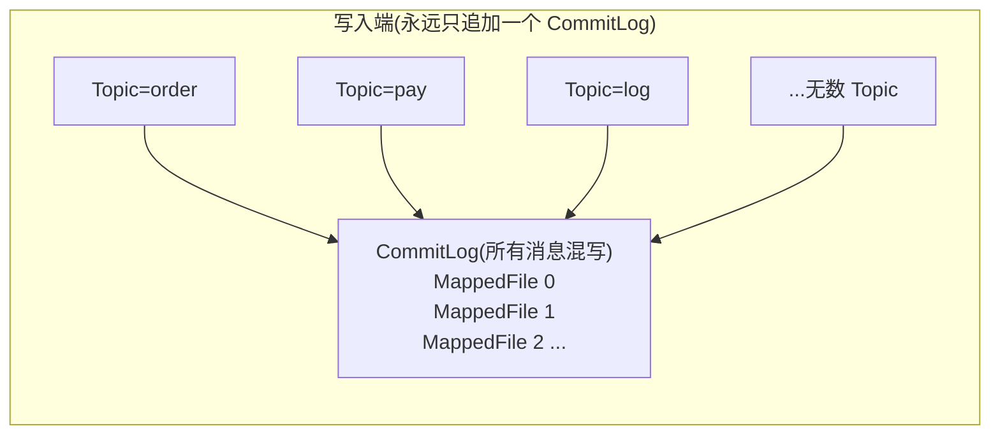
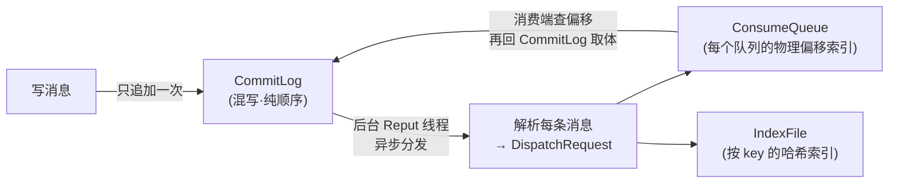
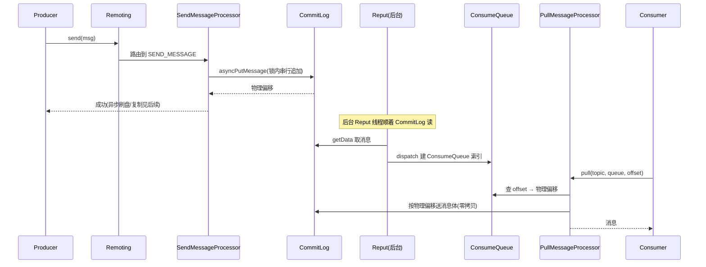

# 第一章 · 第一性原理:为什么把所有消息堆进一个 CommitLog

> 篇:P0 开篇
> 主线呼应:这一章是全书的**总览与定调**。RocketMQ 的全部精妙,源于一个**反直觉**的设计抉择——**把所有 Topic 的所有消息,一股脑混写进一个 CommitLog**。这不是图省事,是深思熟虑:它换来了磁盘**纯顺序写**的极致吞吐,代价是消费端要面对一个"混写的大文件",于是逼出了 ConsumeQueue、IndexFile、Reput 异步分发一整套精妙机制。读懂这一章,你就拿到了全书剩余 21 章的钥匙。

## 核心问题

**为什么 RocketMQ 要把所有 Topic 的消息全堆进一个 CommitLog 顺序写,而不是像 Kafka 那样每个 Partition 一个文件?这一条抉择,逼出了 RocketMQ 存储内核的整套架构。**

读完本章你会明白:

1. 消息中间件到底要解决什么:生产者消费者解耦、削峰填谷、异步化。
2. Kafka 那条"每 Partition 一个文件"的路好在哪里、又卡在哪里(并发顺序写有上限、海量小文件、Topic/Partition 数受限)。
3. RocketMQ 的第三条路:所有 Topic 混写一个 CommitLog,**纯顺序写吞吐极致、Topic 再多也不退化为随机写**——代价是消费端的随机读。
4. 这个代价怎么收回:ConsumeQueue 重建逻辑队列、IndexFile 建 key 索引、Reput 后台异步分发,让"混写"和"按队列消费"两全。
5. 全书的二分法:**存储内核**(消息怎么只追加一次、又怎么被高效读出)vs **分布式骨架**(消息怎么可靠流转、不丢不重不漏)。

---

## 1.1 一句话点破

> **RocketMQ 把所有 Topic 的所有消息一股脑追加进一个 CommitLog。这换来磁盘纯顺序写的极致写入吞吐——Topic、Queue 再多,写也永远只是"往一个大文件末尾追",绝不退化为随机写。代价是消费端拿到的是一个"所有业务混在一起的大文件",于是它另起炉灶,用 ConsumeQueue 重建每个队列的逻辑顺序、用 IndexFile 建 key 索引、用后台 Reput 线程异步把混写的消息分发出去。写,极致简单;读的复杂性,被它甩给了后台和索引。**

这是结论,不是理由。本章倒过来拆:先看消息中间件到底要什么,再看 Kafka 那条路好在哪、卡在哪,最后看 RocketMQ 怎么用"混写 + 后台分发"把这件事做成,以及它凭什么这么取舍。

---

## 1.2 消息中间件要解决什么

在讲存储之前,先卸掉一个包袱:**消息中间件(MQ)到底解决什么问题?**

最朴素的场景:服务 A 想通知服务 B"订单已创建"。最直接的做法是 A 同步调用 B 的 HTTP 接口。但这有三个痛点:

- **耦合**:A 必须知道 B 的地址、B 必须在线,A 调 B 失败,A 的业务也失败。
- **削峰**:突然来 1 万个订单,A 同步调 B,B 扛不住就拖垮 A。
- **异步**:有些事(发短信、记日志、统计)不必马上做,A 没必要等。

消息中间件就是插在 A 和 B 中间的那个**缓冲与转发**角色:A 把消息扔给 MQ 立刻返回(不用等 B),MQ 把消息**存起来**(B 慢一点也没关系、B 挂了重启还能拉),B 按自己的节奏从 MQ **拉**消息处理。


这里有一个**生死攸关的要求**:消息**不能丢**。A 发了"订单已创建",MQ 必须保证 B 一定能收到——哪怕 MQ 自己的机器在这中间挂了、重启了。所以 MQ 的核心,归根结底是两件事:

1. **把消息可靠地存下来**(存到磁盘,且最好有副本)。
2. **让消费端高效地把它读出来**(按队列、按顺序、按 key)。

**存储**,是 MQ 的命门。RocketMQ 的全部精妙,都在回答一个问题:**这堆消息,在磁盘上到底怎么摆,才能既写得飞快、又读得出来?**

---

## 1.3 朴素方案 A:每个 Partition 一个文件(Kafka 的取舍)

既然要存消息,最直觉的摆法是:**按 Topic / Partition 分文件**。Topic `order` 有 4 个队列,就开 4 个文件(或 4 组文件),每个文件只存自己那个队列的消息。这正是 **Kafka** 的做法——每个 Partition 一个 log(由一组滚动 segment 文件组成)。

这条路的好处一目了然:**写入天然并行**。4 个 Partition 写到 4 个文件,4 路顺序写可以打满 4 块盘的吞吐;消费时,消费者要某个 Partition 的消息,直接读那个文件,里面**只有这一个队列的消息**,顺序读下去就行——读路径干净利落,不需要任何"从一堆混合数据里挑出我要的队列"的额外步骤。

> **钉死这件事**:Kafka 的"每 Partition 一个文件",让**写并发**(多 Partition 多文件并行)和**读简单**(一个文件就是一个队列)都很顺。这是读优先、并发优先的设计。

但这条路有一个**隐秘的代价**,在 Topic/Partition 数量爆炸时会现形。

设想一个云原生场景:一个 PaaS 平台上跑了**几万个**业务,每个业务一个 Topic,每个 Topic 几个 Partition。于是磁盘上躺着**几万组** Partition 文件。现在问题来了:

- **写退化为随机写**:虽然每个 Partition 内部是顺序写,但**成千上万个 Partition 的写入,对磁盘而言是"在这几千个文件之间来回切"**——每个文件写一点、跳到下一个、再跳回来。磁头(或 SSD 的写放大)在大量文件间寻址,**宏观上变成了随机写**。Kafka 的顺序写优势,在 Topic/Partition 数量爆炸时被稀释。
- **文件句柄爆炸**:每个 Partition 至少一个 active segment,几万个 Partition 就是几万个打开的文件句柄,内存和内核资源吃紧。
- **Partition 数成为吞吐天花板**:想提写入并发就得加 Partition,但加 Partition 又加剧上面的随机化——这是一个自我矛盾的天花板。

这就是 Kafka 在"海量 Topic"场景下的痛点。它本质上是**把"队列"和"文件"绑死了**:一个队列必须对应一组文件,队列多了文件就多,文件多了写就散。

---

## 1.4 RocketMQ 的抉择:把"队列"和"文件"解耦

RocketMQ 问了一个不一样的问题:

> **能不能让"写入"永远只对着一个文件(纯顺序写,吞吐拉满),而把"按队列组织"这件事,甩给另一套机制去做?**

它的答案是:**把所有 Topic 的所有消息,一股脑追加进一个全局的 CommitLog。**

写入端,无论你发的是哪个 Topic、哪个 Queue,RocketMQ 都不做区分,**一律追加到同一个 CommitLog 末尾**。CommitLog 是一组固定大小(默认 1GB)的 `MappedFile`,写满一个就滚动建下一个,首尾相接成一个逻辑上的"无限长文件"。



**注意这张图的关键**:不管多少个 Topic,写入端永远是"往一个 CommitLog 末尾追"。对磁盘来说,这就是**纯粹的顺序写**——磁头/SSD 永远只在一个位置往后刷,**Topic 再多,写也不退化为随机写**。

> **钉死这件事**:RocketMQ 把"队列"和"文件"解耦——写入只认一个 CommitLog(纯顺序写),至于"这条消息属于哪个队列",写的时候根本不在乎。这是写吞吐优先的设计。

这就是 RocketMQ 和 Kafka 在存储上**最根本的分野**:

| | Kafka | RocketMQ |
|------|-------|----------|
| 写入 | 每 Partition 一个文件,多 Partition 并发多文件 | 所有 Topic 混写一个 CommitLog,纯顺序写 |
| Topic 很多时 | 写退化为"多文件间随机" | 写仍是纯顺序,不受 Topic 数影响 |
| 读取 | 一个文件就是一个队列,直接读 | 混写的 CommitLog 不能直接按队列读,要靠索引重建 |
| 倾向 | 读优先、并发优先 | 写吞吐优先 |

> **打个比方**:Kafka 像**按业务分柜台的银行**——存钱的柜台、取钱的柜台、贷款的柜台各排各的队,每个柜台内部顺畅,但柜台(文件)多了,大堂(磁盘)里的人流就在柜台间乱窜。RocketMQ 像**只开一个超大流水账窗口**——所有人(所有业务)都在这一个窗口排队记账,极快;但事后想查"存钱的那几笔",得靠柜台另做的分类索引去找。

这个比方点到为止。后面讲 ConsumeQueue、IndexFile、Reput,我们都直球讲,不再套这个比方。

---

## 1.5 代价:消费端的随机读——三个文件怎么分工

天下没有免费的吞吐。RocketMQ 把所有消息混写进一个 CommitLog,换来的是写端的极致简单,但**读端立刻撞墙**了:

消费者说"我要 `Topic=order` 的 `Queue=2` 从 `offset=100` 开始的消息"。可 CommitLog 里,`order` 的消息和 `pay`、`log` 的消息**交错混排**在一起,你怎么知道 `order-queue2-offset100` 那条消息在 CommitLog 的哪个物理字节?

如果朴素地"扫 CommitLog 找 order 的消息",那是 O(全量)的灾难。RocketMQ 的解法是:**写的时候只管往 CommitLog 追,读的复杂性甩给另外两个文件 + 一个后台线程**。于是有了存储内核的**三件套**:

1. **CommitLog**:所有消息**只存这一份**,纯顺序追加。它是消息的**物理真相**(消息体 + 全部元数据都在这)。
2. **ConsumeQueue**:每个 `Topic-Queue` 一个逻辑队列索引。它不存消息体,只存"这条消息在 CommitLog 的物理偏移、多长、tag 是什么"。消费端拿着队列 offset,先查 ConsumeQueue 拿到物理偏移,再回 CommitLog 取消息体。
3. **IndexFile**:按 `msgId` / 业务 key 建的哈希索引,支持"按 key 查消息"这种非顺序消费的场景。

还有把这三者粘起来的关键角色:**ReputMessageService**——一个后台线程,顺着 CommitLog 一条条读,把每条消息**分发**进对应的 ConsumeQueue 和 IndexFile。**写只写 CommitLog,ConsumeQueue 和 IndexFile 不是写时同步建的,而是后台异步从 CommitLog 里"二次加工"出来的。**



这张图是全书存储内核的总纲。记住它:

- **写**永远是"追加进 CommitLog"一件事,极快。
- **ConsumeQueue / IndexFile** 是后台 Reput 线程**异步**从 CommitLog 加工出来的,**不拖慢写**。
- **消费**是"查 ConsumeQueue 拿偏移 → 回 CommitLog 取体",两次跳转。

> **不这样会怎样**:如果 ConsumeQueue 和 CommitLog 一起在写消息时同步建,那写一条消息就要**同时顺序写 CommitLog + 随机写 N 个队列的 ConsumeQueue**,写路径从"纯顺序"退化成"顺序 + 随机",吞吐立刻被拖垮。RocketMQ 把建索引的脏活甩给后台 Reput 线程,**写路径始终保持纯顺序**,这是它写吞吐的核心。

---

## 1.6 三件套的源码印证

上面讲的是"道理"。现在落到 RocketMQ 的源码,看这三件事是不是真的字面对应。我们从写入入口看起。

### 第一件:CommitLog —— 所有消息只追加一次

Producer 发消息到 Broker,经过网络层(`SendMessageProcessor`)后,最终调到 `DefaultMessageStore.asyncPutMessage`。看它的实现([DefaultMessageStore.java:647](../rocketmq/store/src/main/java/org/apache/rocketmq/store/DefaultMessageStore.java#L647)):

```java
@Override
public CompletableFuture<PutMessageResult> asyncPutMessage(MessageExtBrokerInner msg) {
    for (PutMessageHook putMessageHook : putMessageHookList) {
        PutMessageResult handleResult = putMessageHook.executeBeforePutMessage(msg);
        if (handleResult != null) {
            return CompletableFuture.completedFuture(handleResult);
        }
    }
    // ... 一些合法性校验 ...
    long beginTime = this.getSystemClock().now();
    CompletableFuture<PutMessageResult> putResultFuture = this.commitLog.asyncPutMessage(msg);  // DefaultMessageStore.java:671
    // ... 统计耗时 ...
    return putResultFuture;
}
```

它几乎没干正事——跑几个 hook、做点校验,核心一行是 `this.commitLog.asyncPutMessage(msg)`([:671](../rocketmq/store/src/main/java/org/apache/rocketmq/store/DefaultMessageStore.java#L671))。真正的戏在 `CommitLog.asyncPutMessage`([CommitLog.java:969](../rocketmq/store/src/main/java/org/apache/rocketmq/store/CommitLog.java#L969))。我们只看它最核心的几行:

```java
public CompletableFuture<PutMessageResult> asyncPutMessage(final MessageExtBrokerInner msg) {
    // ... 设置 storeTimestamp、CRC、版本、IPv6 标志 ...
    topicQueueLock.lock(topicQueueKey);            // CommitLog.java:1038 —— 先锁 topic-queue,分配 queueOffset
    try {
        // ... assignOffset 分配队列内偏移、encode 把消息编成字节 ...
        putMessageLock.lock();   //spin or ReentrantLock, depending on store config   // CommitLog.java:1057
        try {
            long beginLockTimestamp = this.defaultMessageStore.getSystemClock().now();
            this.beginTimeInLock = beginLockTimestamp;                                  // :1060
            // Here settings are stored timestamp, in order to guarantee an orderly global
            if (!defaultMessageStore.getMessageStoreConfig().isDuplicationEnable()) {
                msg.setStoreTimestamp(beginLockTimestamp);                              // 锁内重设 storeTimestamp
            }
            if (null == mappedFile || mappedFile.isFull()) {
                mappedFile = this.mappedFileQueue.getLastMappedFile(0);                 // 当前文件满了,滚动建新文件
            }
            // ... mappedFile.appendMessage(msg) 把消息追加进 CommitLog ...
        } finally {
            putMessageLock.unlock();
        }
    } finally {
        topicQueueLock.unlock();
    }
    // ...
}
```

这几行印证了三件事:

1. **所有消息只追加进一个 `mappedFileQueue`**——`mappedFileQueue.getLastMappedFile()` 拿到当前那个 `MappedFile`,消息往里追加。满 1GB 就滚动建下一个。**没有按 Topic 分文件,就是一组首尾相接的 `MappedFile`**。
2. **写入是加锁串行化的**——`putMessageLock.lock()`([:1057](../rocketmq/store/src/main/java/org/apache/rocketmq/store/CommitLog.java#L1057))。注释原话 `//spin or ReentrantLock, depending on store config`,这把锁有三种实现可选(自旋 `PutMessageSpinLock` / 重入 `PutMessageReentrantLock` / 自适应退避 `AdaptiveBackOffSpinLock`)。**为什么写必须加锁?** 因为"所有消息混写一个 CommitLog"注定是**全局串行追加**——必须有一个临界区保证"一次只有一条消息在追加、物理偏移不冲突、storeTimestamp 全局有序"。这是"混写"这一抉择的直接代价(详见第 3 章 P1-03)。
3. **锁内重设 `storeTimestamp`**——注释 `// Here settings are stored timestamp, in order to guarantee an orderly global`(为保全局有序)。`beginTimeInLock`([:98](../rocketmq/store/src/main/java/org/apache/rocketmq/store/CommitLog.java#L98))记录"进锁的时刻",锁内把 storeTimestamp 设成它。**凭什么这能保证全局有序?** 因为锁是全局串行的,锁内拿的时间戳天然单调递增,于是消息的 storeTimestamp 也单调递增——这就是 RocketMQ 能提供"按存储时间有序"的根。

> **钉死这件事**:RocketMQ 的写路径源码,就是"往一个 CommitLog 串行追加"的字面实现——`mappedFileQueue.getLastMappedFile()` + `appendMessage()`,外加一把 `putMessageLock` 保证串行与全局有序。没有按 Topic 分文件。

### 第二件:Reput 后台分发 —— 混写的消息,异步加工成 ConsumeQueue/Index

写只写了 CommitLog。那 ConsumeQueue 和 IndexFile 怎么来的?答案是后台的 `ReputMessageService`。它是 `DefaultMessageStore` 的内部类([:2657](../rocketmq/store/src/main/java/org/apache/rocketmq/store/DefaultMessageStore.java#L2657)),核心是 `doReput()`([:2713](../rocketmq/store/src/main/java/org/apache/rocketmq/store/DefaultMessageStore.java#L2713)):

```java
for (boolean doNext = true; isCommitLogAvailable() && doNext; ) {
    SelectMappedBufferResult result = DefaultMessageStore.this.commitLog.getData(reputFromOffset);   // :2725 从 CommitLog 取一段
    if (result == null) { break; }
    try {
        this.reputFromOffset = result.getStartOffset();
        for (int readSize = 0; readSize < result.getSize() && reputFromOffset < getReputEndOffset() && doNext; ) {
            DispatchRequest dispatchRequest =
                DefaultMessageStore.this.commitLog.checkMessageAndReturnSize(result.getByteBuffer(), false, false, false);  // :2736 解析出一条消息
            int size = ...;
            if (dispatchRequest.isSuccess()) {
                if (size > 0) {
                    currentReputTimestamp = dispatchRequest.getStoreTimestamp();
                    DefaultMessageStore.this.doDispatch(dispatchRequest);                // :2747 分发给所有 dispatcher
                    notifyMessageArriveIfNecessary(dispatchRequest);                     // :2750 唤醒挂着的长轮询消费者
                    this.reputFromOffset += size;
                    readSize += size;
                }
                // ...
            }
        }
    } // ...
}
```

它干的事清晰得不能再清晰:**顺着 CommitLog 从 `reputFromOffset` 往后读(`commitLog.getData` :2725)→ 把每条消息解析成 `DispatchRequest`(`checkMessageAndReturnSize` :2736)→ 分发给所有 dispatcher(`doDispatch` :2747)→ 顺带唤醒可能挂着等消息的长轮询消费者(`notifyMessageArriveIfNecessary` :2750)。**

`doDispatch` 是个责任链([:2066](../rocketmq/store/src/main/java/org/apache/rocketmq/store/DefaultMessageStore.java#L2066)):

```java
public void doDispatch(DispatchRequest req) throws RocksDBException {
    for (CommitLogDispatcher dispatcher : this.dispatcherList) {   // :2067
        dispatcher.dispatch(req);
    }
}
```

`dispatcherList`([:176](../rocketmq/store/src/main/java/org/apache/rocketmq/store/DefaultMessageStore.java#L176))里注册了谁?构造函数里一目了然:

```java
this.dispatcherList.addLast(new CommitLogDispatcherBuildConsumeQueue());   // :250 —— 建逻辑队列索引
this.dispatcherList.addLast(new CommitLogDispatcherBuildIndex());          // :251 —— 建 key 哈希索引
this.dispatcherList.addLast(new CommitLogDispatcherBuildTransIndex());     // :252 —— 事务消息索引
```

两个核心 dispatcher 正是 ConsumeQueue([:2240](../rocketmq/store/src/main/java/org/apache/rocketmq/store/DefaultMessageStore.java#L2240))和 IndexFile([:2257](../rocketmq/store/src/main/java/org/apache/rocketmq/store/DefaultMessageStore.java#L2257))的建造者。**每条消息被 Reput 读出来后,顺着这条责任链,同时被写进 ConsumeQueue 和 IndexFile。**

> **钉死这件事**:ConsumeQueue 和 IndexFile **不是写消息时同步建的**,而是后台 `ReputMessageService` 线程**异步**从 CommitLog 加工出来的。`doDispatch` 是一条 `dispatcherList` 责任链——想加一种新索引(比如事务索引 `CommitLogDispatcherBuildTransIndex`、压缩 `CommitLogDispatcherCompaction`),只要往链上加一个 dispatcher,**写路径零改动**。这是"写只管纯顺序追加、读的复杂性甩后台"在源码里的直接体现。

### 第三件:刷盘 + 复制 —— 不丢

CommitLog 写进 `MappedFile`(内存映射),还只是在**页缓存**里,掉电会丢。第三件事就是把这些消息**真正落盘**(刷盘)、**复制到副本**(主从),保证不丢。这部分在第 4 章(P1-04 刷盘)和第 17 章(P6-17 主从复制)详讲,这里只点一下:`CommitLog` 持有一个 `FlushManager`([CommitLog.java:90](../rocketmq/store/src/main/java/org/apache/rocketmq/store/CommitLog.java#L90)),同步刷盘靠 `GroupCommitService` 等待 force 完成,异步刷盘靠 `FlushRealTimeService` 定时 force;复制靠 `store/ha/` 下的 `DefaultHAService`。这两件事和"混写 CommitLog"无关,但和"不丢"生死攸关。

---

## 1.7 立起全书的二分法

讲到这里,全书的二分法已经呼之欲出。RocketMQ 的每一个机制,都可以归到这两面之一:

> **存储内核(CommitLog/ConsumeQueue/IndexFile:消息怎么只追加一次、又怎么被各种姿势高效读出)vs 分布式骨架(NameServer/Remoting/HA/刷盘/Rebalance:消息怎么可靠流转、不丢不重不漏)。**

- **存储内核这一面**:CommitLog(全局顺序追加)、ConsumeQueue(逻辑队列重建)、IndexFile(key 哈希索引)、Reput 异步分发、零拷贝(mmap/sendfile)、刷盘。源码主体在 `store` 模块。这些要"快"。
- **分布式骨架这一面**:Remoting(Netty 主从 Reactor + 协议)、NameServer(路由发现)、HA(主从复制/DLedger/Controller)、Rebalance(queue 分配)、消费位点、长轮询。源码在 `remoting` / `namesrv` / `broker` / `client` / `store/ha` 模块。这些要"稳"和"不丢不乱"。

往后读任何一章,如果看不懂某个机制在干嘛,回到这个二分法问一句:"这是在让存储内核更快地写/读,还是在让分布式骨架更可靠地流转?"答案会立刻帮你定位。

一条消息从发出到被消费,完整旅程长这样:



这本书接下来,就是沿着这张图,一个驿站一个驿站地走完。第 1 篇讲写怎么进来(P1-02 编码 → P1-05 Reput 分发),第 2 篇讲怎么高效读出(P2-06~08),第 3 篇讲消费端怎么拉、怎么分 queue、怎么记位点(P3-09~11),第 4 篇讲底层通信 Remoting(P4-12~14),第 5 篇讲 NameServer 路由(P5-15~16),第 6 篇讲高可用(P6-17~19),第 7 篇讲顺序/延时/事务特性(P7-20~22),第 8 篇讲 5.x 新架构(P8-23),第 9 篇收束(P9-24)。

---

## 1.8 技巧精解:混写一个 CommitLog —— RocketMQ 用什么换什么

这一章是定调章,我们把全书会反复回扣的"混写 CommitLog 的权衡"立清楚。这是 RocketMQ 存储设计的核心抉择,理解了它,你就理解了 RocketMQ 为什么要有 ConsumeQueue、为什么写要加锁、为什么有 Reput 后台分发。

RocketMQ 用"所有消息混写一个 CommitLog"换来了**纯顺序写的极致吞吐**,代价是三笔账。这三笔账**互相牵制**,压低一个往往抬高另一个:

| 代价 | 是什么 | 来源 | 谁在收敛它 |
|------|--------|------|-----------|
| **写串行化** | 所有写共享一把 `putMessageLock`,全局串行追加 | 混写注定一个 CommitLog,只能串行 | 自适应锁 `AdaptiveBackOffSpinLock`(锁开销最小化)、堆外内存池(避开页缓存竞争) |
| **读随机化** | 消费一条要"查 ConsumeQueue 拿偏移 → 回 CommitLog 取体",CommitLog 是混写的,消费按队列跳着读 | 混写让"队列顺序"和"物理顺序"不一致 | ConsumeQueue(把队列偏移映射成物理偏移)、零拷贝(随机读也尽量快)、页缓存(热数据在内存) |
| **写读放大** | ConsumeQueue/IndexFile 是 CommitLog 之外的额外存储;消费要两次跳转 | 读复杂性被甩给了索引和后台 | Reput 异步建索引(不拖慢写)、索引尽量紧凑(ConsumeQueue 每条才 20 字节) |

> **反面对比**:假设 RocketMQ 不混写、回到 Kafka 那条"每 Partition 一个文件"的路会怎样?读路径会干净(一个文件就是一个队列),写并发也高(多 Partition 并行)——**但 Topic 数量一爆炸,写就退化为"多文件间随机"**,而 Topic 海量正是 RocketMQ 当年(在淘宝)要解决的核心场景。RocketMQ 选了"宁可让读多跳一次、写串行化,也要保住'写永远是纯顺序'这个吞吐底线"。在它看重的场景(海量 Topic、写密集)里,这笔交易是划算的。

这三笔账的另一面是收益:**写吞吐对 Topic 数量完全免疫**——10 个 Topic 和 10 万个 Topic,写的物理行为都是"往一个 CommitLog 末尾追",这给了 RocketMQ 在多租户、海量 Topic 场景下的底气。这是 Kafka 给不了的。

> **钉死这件事**:RocketMQ 不是免费的午餐。它用"写串行化""读随机化""写读放大"这三笔账,换来了"写吞吐对 Topic 数量免疫"这一核心优势;而 ConsumeQueue(重建队列)、Reput(异步建索引)、零拷贝(随机读也快)、自适应锁(串行开销最小化)联手把这三笔账收敛到可接受的范围。全书剩余 21 章,本质上都在讲"怎么把这三笔账管好"。

---

## 章末小结

这一章是全书的**总览与定调**,我们没有钻进任何一行复杂的实现,但立起了贯穿全书的三个东西:

1. **一个抉择**:把所有 Topic 的消息混写进一个 CommitLog——这是 RocketMQ 存储的灵魂,换来纯顺序写的极致吞吐,代价是读的复杂性。
2. **一条主线 + 一个二分法**:主线是"用混写换纯顺序写吞吐,代价是读随机化,靠 ConsumeQueue/IndexFile/零拷贝收敛,再靠 NameServer/HA/刷盘守不丢、靠 Rebalance/位点守不重不漏";二分法是"**存储内核**(快)vs **分布式骨架**(稳)"。迷路时回到它们。
3. **三件套**:CommitLog(消息只追加一次)、ConsumeQueue/IndexFile(异步分发重建队列与索引)、刷盘+复制(不丢)——源码里 `commitLog.asyncPutMessage` / `ReputMessageService.doReput` / `FlushManager` + `HAService` 字面对应。

### 五个"为什么"清单

1. **为什么消息中间件要存消息、不只做转发?** 为了解耦生产消费、削峰填谷、扛住消费者掉线或慢消费——MQ 必须把消息可靠存下来,等消费者按自己节奏拉。存储是 MQ 的命门。
2. **为什么 RocketMQ 要混写一个 CommitLog,而不是像 Kafka 每 Partition 一个文件?** 混写让"写入永远纯顺序",Topic/Queue 再多也不退化为随机写——这是海量 Topic 场景下的吞吐底线。Kafka 的分文件在 Topic 爆炸时写会随机化。
3. **混写的代价是什么?** 读随机化(消费要查 ConsumeQueue 拿偏移再回 CommitLog 取体)、写串行化(全局一把锁)、写读放大(额外索引)。靠 ConsumeQueue/零拷贝/自适应锁收敛。
4. **为什么写 CommitLog 必须加锁?** 混写注定全局串行追加——必须保证一次只有一条消息在追加(物理偏移不冲突)、storeTimestamp 全局单调(锁内重设 `beginTimeInLock`)。详见第 3 章 P1-03。
5. **ConsumeQueue 和 IndexFile 是写时建的吗?** 不是。写只写 CommitLog;ConsumeQueue/Index 由后台 `ReputMessageService` 异步从 CommitLog 分发加工——这样写路径保持纯顺序,不被建索引拖垮。详见第 5 章 P1-05。

### 想继续深入往哪钻

- 本章点到的"写为什么必须加锁、三种锁怎么选"(`PutMessageSpinLock`/`PutMessageReentrantLock`/`AdaptiveBackOffSpinLock`),详见第 3 章 P1-03。
- "一条消息在 CommitLog 里到底是什么字节布局、为什么字段这么排",详见第 2 章 P1-02。
- "Reput 怎么顺着 CommitLog 分发、dispatcher 责任链怎么扩展",详见第 5 章 P1-05。
- "消费端怎么靠 ConsumeQueue 把混写消息按队列读出来",详见第 6 章 P2-06。
- 如果你想立刻看一眼真实的写路径全貌,读 `../rocketmq/store/src/main/java/org/apache/rocketmq/store/CommitLog.java` 的 `asyncPutMessage`([#L969](../rocketmq/store/src/main/java/org/apache/rocketmq/store/CommitLog.java#L969))——969 到 1100 这一百多行,是本章 1.6 的完整背景。

### 引出下一章

我们立起了"三件套"和"存储内核 vs 分布式骨架"的二分法。但真要走进"一次写",第一个要卸掉的包袱是:**一条消息,在 CommitLog 里到底长什么样?** 为什么不直接存消息体?那些 `TOTALSIZE`、`QUEUEOFFSET`、`PHYSICALOFFSET`、`STORETIMESTAMP`、`PROPERTIES` 字段是干嘛的、为什么这个顺序?下一章,我们从消息的编码——`MessageExtEncoder`——讲起,正式进入第 1 篇:存储写入。
