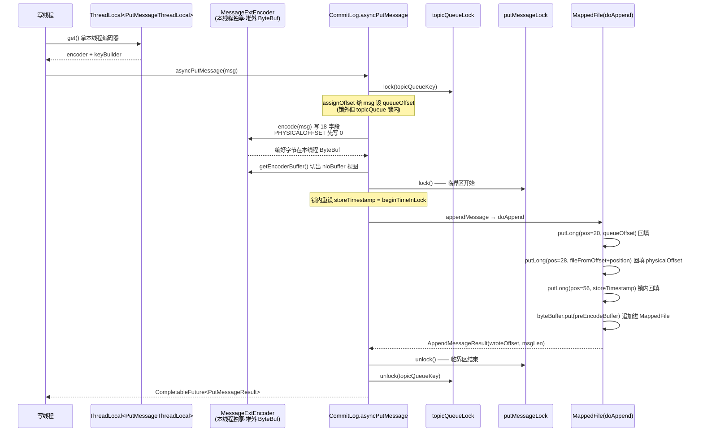

# 第二章 · 消息的编码:一条消息在 CommitLog 里长什么样

> 篇:P1 存储内核之写入(CommitLog 与刷盘)
> 主线呼应:上一章我们立起了 RocketMQ 的灵魂抉择——把所有 Topic 的消息一股脑混写进一个 CommitLog,换纯顺序写的极致吞吐。但"混写"留下一个最朴素的问题:**一条消息,在这个大文件里,到底是什么样子?** 为什么不直接把消息体(body)往文件里一塞完事?那些 `TOTALSIZE`、`QUEUEOFFSET`、`PHYSICALOFFSET`、`STORETIMESTAMP`、`PROPERTIES` 字段是干嘛的、为什么是这个顺序?这一章把这条消息在磁盘上的字节布局一层层拆开,并讲清 `MessageExtEncoder` 用了什么巧手段,把"编出这段字节"这件事做得既快又不出错——它是第 1 篇(存储写入)的地基,后面 CommitLog 怎么追加、刷盘怎么不丢、Reput 怎么分发,全要回到这张字节布局图。

## 核心问题

**一条消息在 CommitLog 里到底长什么样?为什么 RocketMQ 不直接存裸 body,而要在前后塞一堆元信息?这些元信息为什么是这个顺序?`MessageExtEncoder` 怎么在每秒上万次写入下,把"编出这段固定布局的字节"这件事做得既快又安全?**

读完本章你会明白:

1. 为什么裸 body 不够用:消费端要按队列消费、要按 key 查、要识别来源、要防篡改、要支持事务——这些都得靠消息自带的元信息(`topic`/`queueId`/`queueOffset`/`physicalOffset`/`bornTimestamp`/`bornHost`/`storeTimestamp`/`storeHost`/`bodyCRC`/`sysFlag`/`reconsumeTimes`/`preparedTransactionOffset`/`properties`)。
2. 一条消息在 CommitLog 里的字节布局是**定长头 + 变长尾**(定长的 `TOTALSIZE`/`MAGICCODE`/各 offset/时间戳/host/sysFlag + 变长的 body/topic/properties),消费端靠定长头里的字段做 O(1) 跳转解码。
3. 为什么 `queueOffset` 和 `physicalOffset` 紧挨着排在前头:它们是消费端 ConsumeQueue 索引、消息回溯、msgId 生成的命脉,放前面方便解码器直接按固定偏移 `getInt(pos)` 取,不用扫整条消息。
4. `MessageExtEncoder` 不是单例、不是每条 new 一个,而是**每个写线程一个**(`ThreadLocal<PutMessageThreadLocal>`),内部复用一块**堆外 `ByteBuf`**(不是堆内 ByteBuffer),既避开高并发下编码器的竞争,又避开 JVM 堆的分配与 GC 压力。

---

## 2.1 一句话点破

> **一条消息在 CommitLog 里不是裸 body,而是一段"定长头 + 变长尾"的自描述字节:前面是 18 个固定字段(TOTALSIZE 当总长、QUEUEOFFSET/PHYSICALOFFSET 当坐标、STORETIMESTAMP 当时序、BORNHOST/STOREHOST 当来源、SYSFLAG 当位域标志、BODYCRC 当防篡改……),后面跟着变长的 body/topic/properties。编码它的是 `MessageExtEncoder`,但这个编码器不是全局单例——而是被 `ThreadLocal` 绑在每个写线程上,内部复用一块堆外 `ByteBuf`,encode 完切片交给 `MappedFile` 追加。元信息这么多,是为了让"混写进一个 CommitLog"的消息,事后还能被按队列、按 key、按时间、按来源还原出来。**

这是结论,不是理由。本章倒过来拆:先看为什么不存裸 body,再看每个字段为什么必须存在,然后看它们为什么是这个顺序,最后钻进 `MessageExtEncoder` 看它怎么把这段字节编得又快又不出错。

---

## 2.2 为什么不直接存裸 body

最朴素的设计是:Producer 发什么 body,Broker 就把 body 一字节不少地追加进 CommitLog。读的时候顺着文件读出来就是消息。这听起来最省事,可一旦你往下走一步,就会立刻撞墙。

### 2.2.1 撞墙一:消费端不知道这条消息属于哪个 Topic/Queue

CommitLog 是**所有 Topic 混写**的大文件(见 P0-01)。如果只存裸 body,消费端拿到一段字节,根本无法知道它是 `Topic=order` 还是 `Topic=pay`,是 `queue=2` 还是 `queue=5`。后台 Reput 线程想把它分发进对应 Topic 的 ConsumeQueue 也无从下手——因为它不知道该往哪个 ConsumeQueue 分。

> **不这样会怎样**:如果消息只存 body,RocketMQ 的"混写换顺序写吞吐"这条路直接死掉——混写的前提是事后能按 Topic/Queue 还原,而这个还原能力全靠消息**自带**的 topic/queueId。裸 body 让消息失去自我描述能力,整条存储链路塌方。

所以一条消息至少得带上 `topic` 和 `queueId`,告诉所有人"我是谁家的、第几个队列的"。

### 2.2.2 撞墙二:不知道这条消息在队列里排第几、在 CommitLog 的哪个字节

按队列消费(P2-06 ConsumeQueue)的核心,是"消费端说我要 `topic=T, queue=Q, offset=O` 的消息"。这个 `offset` 是**队列内的序号**(queueOffset,从 0 单调递增)。如果消息不自带 queueOffset,消费端就没法和这条消息对上号——你给 Producer 一个队列内序号,Producer 写完后,谁来保证这条消息的 queueOffset 就是这个号?

答案是:Broker 在写之前给它分配。但分配完得记下来——记在消息自己的字节里。所以消息得自带 `queueOffset`。

光有队列内偏移还不够。CommitLog 是一个超长的物理文件,消息在里面的位置叫 `physicalOffset`(也叫 CommitLog offset,从文件起点算的字节偏移)。消费端从 ConsumeQueue 拿到这个物理偏移,才能回 CommitLog 把消息体捞出来(见 P2-06)。ConsumeQueue 也靠它做索引。所以消息还得自带 `physicalOffset`,作为"我在 CommitLog 大文件里的物理坐标"。

> **钉死这件事**:`queueOffset`(队列内逻辑序号)和 `physicalOffset`(CommitLog 内物理字节偏移)是两个完全不同的坐标。前者给消费端按队列消费用,后者给系统按物理位置定位用。它们紧挨着排在消息头的第 6、7 个字段——这是后面所有索引机制的根。

### 2.2.3 撞墙三:消息被消费失败、要重试、要做事务,得记状态

RocketMQ 支持"至少一次"语义——消息可能被重复投递。消费者处理失败要重试,重试次数得记下来(`reconsumeTimes`),超过一定次数进死信队列。事务消息要记"这条是 half message、对应的本地事务在哪"(`preparedTransactionOffset`)。压缩消息要标"body 被压缩过、用什么算法"(`sysFlag` 的 `COMPRESSED_FLAG` 位)。IPv6 环境下要标"bornHost/storeHost 是 16 字节还是 4 字节"(`sysFlag` 的 `BORNHOST_V6_FLAG` / `STOREHOSTADDRESS_V6_FLAG` 位)。

这些标志位如果分散存到处都是,解码端就要到处找。RocketMQ 把它们集中塞进两个地方:一个 4 字节的 `SYSFLAG` 位域,一个 4 字节的 `RECONSUMETIMES` 计数器,外加一个 8 字节的 `preparedTransactionOffset`。

### 2.2.4 撞墙四:运维、排查、安全,得知道消息的来历和时序

线上出问题,你要知道:这条消息是哪个 Producer 在什么时间、什么 IP 发出来的(`bornTimestamp` + `bornHost`);Broker 又是什么时候、在哪台机器上把它存下来的(`storeTimestamp` + `storeHost`)。前者帮你看链路,后者帮你看时序和落盘点。body 如果在传输中被改过,要有手段发现(`bodyCRC`)。

把这些"为什么不存裸 body"的答案汇到一起,就是 CommitLog 消息头里那 18 个字段。

> **所以这样设计**:一条消息的字节布局,不是"裸 body + 几个零散字段",而是一段精心设计的**自描述结构**——定长的元信息头(让解码器能按固定偏移 O(1) 取字段)+ 变长的载荷尾(body/topic/properties)。这个布局让"混写进一个 CommitLog"的消息,事后还能被按队列、按 key、按时间、按来源完整还原。这是混写架构能成立的字面前提。

---

## 2.3 一条消息在 CommitLog 里的字节布局

讲清了"为什么",现在直球把字节布局画出来。下面这张图是一条消息在 CommitLog 里的完整字节布局(IPv4 场景),这是本章的核心配图,后面所有章节都会回来对照它:

```
 一条消息在 CommitLog 里的字节布局(V1, IPv4 场景):

 偏移    长度   字段                     含义
 ───────────────────────────────────────────────────────────────────────
 [定长头 —— 所有字段固定长度,解码时按偏移 O(1) 取]
 0       4     TOTALSIZE                本条消息总字节数(含本字段)
 4       4     MAGICCODE                消息版本魔术字(V1=-626843481 / V2=-626843477)
 8       4     BODYCRC                  body 的 CRC32(防篡改/防损坏)
 12      4     QUEUEID                  这条消息属于 Topic 的第几个 Queue
 16      4     FLAG                     业务自定义标志位(给 Producer/Consumer 自用)
 20      8     QUEUEOFFSET              队列内逻辑序号(消费端 offset 对应的就是它)
 28      8     PHYSICALOFFSET           在 CommitLog 大文件里的物理字节偏移
 36      4     SYSFLAG                  系统位域(压缩/V6 标志等,见下文拆位)
 40      8     BORNTIMESTAMP            Producer 发出时间(ms)
 48      8     BORNHOST                 Producer 的 IP(4B)+ Port(4B)= 8B(IPv4)
 56      8     STORETIMESTAMP           Broker 落盘时间(ms,锁内重设保全局有序)
 64      8     STOREHOSTADDRESS         Broker 的 IP(4B)+ Port(4B)= 8B(IPv4)
 72      4     RECONSUMETIMES           已重试消费次数(至少一次语义下记状态)
 76      8     PREPAREDTRANSACTIONOFFSET 事务消息 half message 的队列偏移(非事务=0)
 ───────────────────────────────────────────────────────────────────────
 [变长尾 —— 长度写在紧挨它前面的长度字段里]
 84      4     BODY_LENGTH              body 字节数
 88      N     BODY                     消息体(N = BODY_LENGTH)
 88+N    1/2   TOPIC_LENGTH             topic 字节数(V1=1B、V2=2B,V1 限 topic ≤127B)
 89+N    M     TOPIC                    topic 字符串(M = TOPIC_LENGTH,UTF-8)
 89+N+M  2     PROPERTIES_LENGTH        properties 字符串字节数
 91+N+M  P     PROPERTIES               "k1v1k2v2..." 形式的 KV
 [可选尾]
 ...     19    CRC32 区块               仅当开启 enabledAppendPropCRC 时预留
 ───────────────────────────────────────────────────────────────────────
 合计         TOTALSIZE                 = 上面所有字段之和(写回偏移 0 处)
```

这张图是后面所有存储机制的字面根。ConsumeQueue 的 20 字节索引单元(8B physicalOffset + 4B size + 8B tagHash)、IndexFile 按 key 哈希、msgId 生成(`storeHost + physicalOffset` 编码)、消费端解码(`MessageDecoder.decode`)——全都回到这张图。**先记住它的形状,后面任何一章提到"消息格式"都指它。**

### 2.3.1 几个字段的精确口径

字段名容易混,这里钉死几个口径,免得后面读源码错位:

- **`QUEUEOFFSET` ≠ 队列 ID**。`QUEUEID`(第 4 字段,4 字节)是"这条消息属于 Topic 的第几个队列"(0、1、2……);`QUEUEOFFSET`(第 6 字段,8 字节)是"在这条队列内排第几条"(从 0 单调递增的逻辑序号)。一个 Topic 有多个 Queue,每个 Queue 内的消息靠 queueOffset 排序。消费端说的 `consumeOffset`,对应的就是这个 queueOffset。
- **`PHYSICALOFFSET` ≠ `QUEUEOFFSET`**。前者是"在 CommitLog 大文件里的物理字节偏移"(从 0 开始,每写一条 += TOTALSIZE),后者是"在队列里的逻辑序号"。两个坐标系——物理 vs 逻辑。混写让它们不一致(同一队列的消息在 CommitLog 里不连续),ConsumeQueue 就是把这两套坐标对应起来的桥(见 P2-06)。
- **`SYSFLAG` 是位域不是布尔**。4 字节里塞了好几个独立标志:`COMPRESSED_FLAG = 0x1`(body 压缩)、`BORNHOST_V6_FLAG = 0x1 << 4 = 16`(bornHost 是 IPv6)、`STOREHOSTADDRESS_V6_FLAG = 0x1 << 5 = 32`(storeHost 是 IPv6)。解码 host 时先看这两位,才知道后面 host 字段是 8 字节还是 20 字节——这是 host 字段变长的根。
- **`MAGICCODE` 是版本号**。V1(`MESSAGE_MAGIC_CODE = -626843481`)topic 长度字段是 1 字节(限 topic 名 ≤ 127 字节);V2(`MESSAGE_MAGIC_CODE_V2 = -626843477`)topic 长度字段是 2 字节(topic 名可到 32767 字节,给超长 topic 名用)。Broker 默认 V1,只有 topic 长度超过 127 才自动升 V2(见 `CommitLog.asyncPutMessage:989-991`)。文件末尾不足放下一条消息时,会写一个 `BLANK_MAGIC_CODE = -875286124` 作为"文件填空标志"(见 2.3.2)。
- **`PROPERTIES` 不是 JSON、不是 Map 序列化,是一段自定义分隔符字符串**。形如 `key1value1key2value2`,用 `NAME_VALUE_SEPARATOR = 0x01` 分隔 key 和 value,用 `PROPERTY_SEPARATOR = 0x02` 分隔不同 KV。为什么不用 JSON?省字节,而且解码只用 `indexOf` 扫一遍(见 `MessageDecoder.string2messageProperties`)。

### 2.3.2 文件尾部的填空:BLANK_MAGIC_CODE

一个细节,但很关键。CommitLog 的每个 `MappedFile` 默认固定 1GB(`mappedFileSizeCommitLog`)。一条消息要追加时,如果当前文件剩余空间不足以放下整条消息(连最小的填空都放不下),怎么办?

朴素做法是"写到哪算哪,剩下的下个文件继续"——但这破坏了"一条消息物理连续"的保证。解码端靠 TOTALSIZE 逐条跳,如果一条消息横跨两个文件,解码就要做跨文件拼接,极复杂。

RocketMQ 的做法是:**当前文件尾部剩余空间不足时,直接把它填空**——写一个 8 字节的填空块:`[4B TOTALSIZE = maxBlank][4B BLANK_MAGIC_CODE = -875286124]`,然后滚动建下一个 MappedFile,把这条消息完整地写进新文件。看 `CommitLog.DefaultAppendMessageCallback.doAppend`([CommitLog.java:2022-2037](../rocketmq/store/src/main/java/org/apache/rocketmq/store/CommitLog.java#L2022-L2037)):

```java
// Determines whether there is sufficient free space
if ((msgLen + END_FILE_MIN_BLANK_LENGTH) > maxBlank) {
    this.msgStoreItemMemory.clear();
    // 1 TOTALSIZE
    this.msgStoreItemMemory.putInt(maxBlank);
    // 2 MAGICCODE
    this.msgStoreItemMemory.putInt(CommitLog.BLANK_MAGIC_CODE);
    // 3 The remaining space may be any value
    // Here the length of the specially set maxBlank
    final long beginTimeMills = CommitLog.this.defaultMessageStore.now();
    byteBuffer.put(this.msgStoreItemMemory.array(), 0, 8);
    return new AppendMessageResult(AppendMessageStatus.END_OF_FILE, wroteOffset,
        maxBlank, /* only wrote 8 bytes, but declare wrote maxBlank for compute write position */
        msgIdSupplier, msgInner.getStoreTimestamp(),
        queueOffset, CommitLog.this.defaultMessageStore.now() - beginTimeMills);
}
```

返回 `END_OF_FILE` 状态后,上层 `asyncPutMessage` 滚动建新文件、把消息重新追加一次(见 `CommitLog.asyncPutMessage:1084-1101`)。

> **钉死这件事**:`BLANK_MAGIC_CODE` 是 CommitLog 文件尾部的填空标志。它保证每条消息在物理上始终连续,解码端只需"读 TOTALSIZE → 跳过这么多字节 → 下一条",不会遇到跨文件拼接。代价是每个 `MappedFile` 平均浪费半条消息的空间(最多 1GB 的尾部填空几 KB),可忽略。

---

## 2.4 字段顺序为什么这么排

光知道有哪些字段不够,RocketMQ 的字段顺序也不是随便排的,里面有动机。这一节拆两个最关键的设计。

### 2.4.1 queueOffset 和 physicalOffset 紧挨着排在前头:为了固定偏移取坐标

看字节布局:`QUEUEOFFSET` 在偏移 20,`PHYSICALOFFSET` 在偏移 28——两者紧挨,都排在前 36 字节内。这不是巧合。

`MessageDecoder` 把这几个固定偏移**提成了常量**([MessageDecoder.java:42-57](../rocketmq/common/src/main/java/org/apache/rocketmq/common/message/MessageDecoder.java#L42-L57)):

```java
public final static int MESSAGE_MAGIC_CODE_POSITION = 4;          // MAGICCODE 在偏移 4
public final static int MESSAGE_FLAG_POSITION = 16;               // FLAG 在偏移 16
public final static int MESSAGE_PHYSIC_OFFSET_POSITION = 28;      // PHYSICALOFFSET 在偏移 28
public final static int MESSAGE_STORE_TIMESTAMP_POSITION = 56;    // STORETIMESTAMP 在偏移 56

public static final int PHY_POS_POSITION = 4 + 4 + 4 + 4 + 4 + 8;        // = 32,定长头到 PHYSICALOFFSET 结束
public static final int QUEUE_OFFSET_POSITION = 4 + 4 + 4 + 4 + 4;       // = 24,定长头到 QUEUEOFFSET 结束(下标 20 起)
public static final int SYSFLAG_POSITION = 4 + 4 + 4 + 4 + 4 + 8 + 8;    // = 36,定长头到 SYSFLAG 结束
```

这些常量的存在说明一件事:**很多解码场景不需要扫完整条消息,只靠固定偏移就能取到关键字段**。比如:

- **Reput 分发时取 physicalOffset + size,建 ConsumeQueue 索引**:Reput 顺着 CommitLog 一条条读,拿到一条消息只要知道它的 physicalOffset 和 TOTALSIZE,就能往 ConsumeQueue 写一条 20 字节索引(physicalOffset + size + tagHash)。这两个字段都在定长头里,固定偏移可取。
- **按 storeTimestamp 做时间范围查**:`MESSAGE_STORE_TIMESTAMP_POSITION = 56` 是固定偏移,扫描 CommitLog 按时间过滤时,直接 `getLong(56)` 取时间戳,不用解码整条消息。
- **`decodeProperties` 只想取 properties,不想解 body**:见 `MessageDecoder.decodeProperties`([:116-154](../rocketmq/common/src/main/java/org/apache/rocketmq/common/message/MessageDecoder.java#L116-L154)),先按 SYSFLAG 算出 host 字段长度,再跳到 body 长度字段位置,跳过 body,跳过 topic,定位到 properties。整个跳转全靠固定偏移算,不用顺序读。

> **不这样会怎样**:如果 QUEUEOFFSET 和 PHYSICALOFFSET 不排在前头、而是塞在变长 body 后面会怎样?解码端为了取这两个最常用的坐标,就得**先读 body 长度 → 跳过 body → 再读 topic 长度 → 跳过 topic → ……**,每次取坐标都要遍历前面所有变长字段。Reput 每秒分发上万条消息,这个开销会立刻拖垮分发吞吐。RocketMQ 把"被频繁取用、且值在写时就能定下来"的字段全排进定长头,把"长度本身可变"的 body/topic/properties 放尾巴,让定长头始终能 O(1) 索引。

### 2.4.2 为什么 body 在 topic 前面:body 长、topic 短,长字段在后能让短字段定长化

观察字节布局:`BODY`(变长,可能几 KB 到几 MB)在 `TOPIC`(变长,通常几十字节)前面。这看起来反直觉——为什么不把短的 topic 放前面?

实际答案是:`TOPIC` 的长度字段本身在 V1 里是 1 字节、V2 里是 2 字节,这是 topic 字段定长化的关键(让解码端读 1 或 2 字节就知道 topic 多长)。如果 topic 在 body 前面,解码端要先解 topic 才能定位到 body,而 topic 解码依赖 MAGICCODE 判断 V1/V2(决定 topic 长度字段是 1 还是 2 字节)——这是一条依赖链。

RocketMQ 把 `BODY_LENGTH`(4 字节定长)放在 body 紧前,让"body 的位置和长度"完全不依赖 topic——解码端就算不解 topic,也能 `getInt(84)` 拿到 body 长度、跳过 body、直接定位到 topic。这种"长字段在后、定长长度字段紧贴它、定长字段位置不依赖前面变长字段"的排列,让解码端的跳转路径最短。

> **钉死这件事**:CommitLog 消息格式的字段顺序,本质是在优化"解码端的跳转成本"。定长字段排前面、被频繁取用的字段排最前、变长字段排尾巴且自带定长长度前缀——这是一套为"高吞吐解码"量身定做的二进制布局。和 LevelDB 的 Block 尾部 restart array、etcd 的 protobuf length-prefixed,是同一种"为快速跳转而设计"的思想。

---

## 2.5 `MessageExtEncoder`:怎么把消息编成这段字节

字段布局清楚了,现在看 `MessageExtEncoder` 怎么把一条 `MessageExtBrokerInner`(Broker 内部的消息对象)编成上面这段字节。这是写路径上最核心的一步,所有源码都在 `store/src/main/java/org/apache/rocketmq/store/MessageExtEncoder.java`。

### 2.5.1 encode 的主流程:18 个字段一个个写进 ByteBuf

主入口是 `encode(MessageExtBrokerInner msgInner)`([MessageExtEncoder.java:175](../rocketmq/store/src/main/java/org/apache/rocketmq/store/MessageExtEncoder.java#L175))。它干的事直球得不能再直球——先 `byteBuf.clear()` 复位,然后按字段顺序一个个 `writeInt` / `writeLong` / `writeBytes` 写进去,和我们上面画的那张字节布局图字面对应:

```java
public PutMessageResult encode(MessageExtBrokerInner msgInner) {
    this.byteBuf.clear();                                                    // :176 复位 ByteBuf

    // ... 算 propertiesData/topicData/bodyLength,校验长度 ...                // :185-219

    final long queueOffset = msgInner.getQueueOffset();                      // :212

    // 1 TOTALSIZE
    this.byteBuf.writeInt(msgLen);                                           // :222
    // 2 MAGICCODE
    this.byteBuf.writeInt(msgInner.getVersion().getMagicCode());             // :224
    // 3 BODYCRC
    this.byteBuf.writeInt(msgInner.getBodyCRC());                            // :226
    // 4 QUEUEID
    this.byteBuf.writeInt(msgInner.getQueueId());                            // :228
    // 5 FLAG
    this.byteBuf.writeInt(msgInner.getFlag());                               // :230
    // 6 QUEUEOFFSET
    this.byteBuf.writeLong(queueOffset);                                     // :232
    // 7 PHYSICALOFFSET, need update later
    this.byteBuf.writeLong(0);                                               // :234 —— 关键:先写 0
    // 8 SYSFLAG
    this.byteBuf.writeInt(msgInner.getSysFlag());                            // :236
    // 9 BORNTIMESTAMP
    this.byteBuf.writeLong(msgInner.getBornTimestamp());                     // :238

    // 10 BORNHOST
    ByteBuffer bornHostBytes = msgInner.getBornHostBytes();                  // :241
    this.byteBuf.writeBytes(bornHostBytes.array());                          // :242

    // 11 STORETIMESTAMP
    this.byteBuf.writeLong(msgInner.getStoreTimestamp());                    // :245

    // 12 STOREHOSTADDRESS
    ByteBuffer storeHostBytes = msgInner.getStoreHostBytes();                // :248
    this.byteBuf.writeBytes(storeHostBytes.array());                         // :249

    // 13 RECONSUMETIMES
    this.byteBuf.writeInt(msgInner.getReconsumeTimes());                     // :252
    // 14 Prepared Transaction Offset
    this.byteBuf.writeLong(msgInner.getPreparedTransactionOffset());         // :254
    // 15 BODY
    this.byteBuf.writeInt(bodyLength);                                       // :256
    if (bodyLength > 0)
        this.byteBuf.writeBytes(msgInner.getBody());                         // :258

    // 16 TOPIC
    if (MessageVersion.MESSAGE_VERSION_V2.equals(msgInner.getVersion())) {
        this.byteBuf.writeShort((short) topicLength);                        // :262 V2 topic 长度 2 字节
    } else {
        this.byteBuf.writeByte((byte) topicLength);                          // :264 V1 topic 长度 1 字节
    }
    this.byteBuf.writeBytes(topicData);                                      // :266

    // 17 PROPERTIES
    this.byteBuf.writeShort((short) propertiesLength);                       // :269
    if (propertiesLength > crc32ReservedLength) {
        this.byteBuf.writeBytes(propertiesData);                             // :271
    }
    if (needAppendLastPropertySeparator) {
        this.byteBuf.writeByte((byte) MessageDecoder.PROPERTY_SEPARATOR);    // :274
    }
    // 18 CRC32
    this.byteBuf.writerIndex(this.byteBuf.writerIndex() + crc32ReservedLength);  // :277 预留 19 字节,doAppend 时回填

    return null;
}
```

这段代码几乎是字节布局图的 1:1 翻译,但有两处藏着精妙,值得单独拆。

### 2.5.2 字段总长怎么算:`calMsgLength` 提前算 TOTALSIZE

`TOTALSIZE` 是消息的第一个字段,但写它的时候 body/topic/properties 都还没写进 buffer。怎么知道总长?

答案是 `calMsgLength`([MessageExtEncoder.java:60-83](../rocketmq/store/src/main/java/org/apache/rocketmq/store/MessageExtEncoder.java#L60-L83))——一个纯函数,根据 sysFlag、body 长度、topic 长度、properties 长度,把所有字段的字节数加起来:

```java
public static int calMsgLength(MessageVersion messageVersion,
    int sysFlag, int bodyLength, int topicLength, int propertiesLength) {

    int bornhostLength = (sysFlag & MessageSysFlag.BORNHOST_V6_FLAG) == 0 ? 8 : 20;
    int storehostAddressLength = (sysFlag & MessageSysFlag.STOREHOSTADDRESS_V6_FLAG) == 0 ? 8 : 20;

    return 4 //TOTALSIZE
        + 4 //MAGICCODE
        + 4 //BODYCRC
        + 4 //QUEUEID
        + 4 //FLAG
        + 8 //QUEUEOFFSET
        + 8 //PHYSICALOFFSET
        + 4 //SYSFLAG
        + 8 //BORNTIMESTAMP
        + bornhostLength //BORNHOST
        + 8 //STORETIMESTAMP
        + storehostAddressLength //STOREHOSTADDRESS
        + 4 //RECONSUMETIMES
        + 8 //Prepared Transaction Offset
        + 4 + (Math.max(bodyLength, 0)) //BODY
        + messageVersion.getTopicLengthSize() + topicLength //TOPIC
        + 2 + (Math.max(propertiesLength, 0)); //propertiesLength
}
```

注意 host 长度是从 sysFlag 算出来的——IPv4 是 8 字节(4 IP + 4 Port),IPv6 是 20 字节(16 IP + 4 Port)。topic 长度字段本身占几个字节,看版本(`messageVersion.getTopicLengthSize()`,V1 是 1、V2 是 2)。

> **钉死这件事**:`calMsgLength` 是个**纯函数**,意味着只要 sysFlag、body/topic/properties 长度定了,消息总长就唯一确定。这让 encode 能在写 TOTALSIZE 之前就算出它——这是"自描述定长头"成立的根。Reput 分发、消费端按 TOTALSIZE 跳转、ConsumeQueue 写 size,全都依赖这个纯函数的可预测性。

### 2.5.3 encode 时写 0,锁内 doAppend 回填:两阶段写坐标

回头看 encode 第 234 行,`PHYSICALOFFSET` 写的是 **0**——不是真值。注释 `// 7 PHYSICALOFFSET, need update later`(需要稍后更新)。

为什么不一次写真值?因为 encode 这一刻还不知道物理偏移。

`MessageExtEncoder.encode` 是在 `topicQueueLock` 内、`putMessageLock` 外执行的(见 `CommitLog.asyncPutMessage:1050`)。物理偏移 `physicalOffset = fileFromOffset + byteBuffer.position()`,`byteBuffer.position()` 是 `MappedFile` 当前的写入位置——这个值只有在真正追加(`appendMessage` → `doAppend`)那一刻才能定下来,而且必须**在 putMessageLock 锁内**(因为多线程并发追加,position 必须串行化,见 P1-03)。queueOffset 也是,虽然 `assignOffset` 在 encode 之前就分配了,但物理偏移做不到。

所以 RocketMQ 用了**两阶段写坐标**:encode 阶段先写 0 占位,锁内 `doAppend` 阶段再用绝对位置写入(`putLong(pos, value)`)回填。看 `CommitLog.DefaultAppendMessageCallback.doAppend`([CommitLog.java:2039-2054](../rocketmq/store/src/main/java/org/apache/rocketmq/store/CommitLog.java#L2039-L2054)):

```java
int pos = 4     // 1 TOTALSIZE
    + 4     // 2 MAGICCODE
    + 4     // 3 BODYCRC
    + 4     // 4 QUEUEID
    + 4;    // 5 FLAG
// 6 QUEUEOFFSET
preEncodeBuffer.putLong(pos, queueOffset);              // :2045 回填 queueOffset
pos += 8;
// 7 PHYSICALOFFSET
preEncodeBuffer.putLong(pos, fileFromOffset + byteBuffer.position());  // :2048 回填 physicalOffset
pos += 8;
int ipLen = (msgInner.getSysFlag() & MessageSysFlag.BORNHOST_V6_FLAG) == 0 ? 4 + 4 : 16 + 4;
// 8 SYSFLAG, 9 BORNTIMESTAMP, 10 BORNHOST
pos += 4 + 8 + ipLen;
// 11 STORETIMESTAMP refresh store time stamp in lock
preEncodeBuffer.putLong(pos, msgInner.getStoreTimestamp());   // :2054 锁内重设 storeTimestamp 后回填
```

注意三个细节:

1. **`preEncodeBuffer.putLong(pos, value)` 是绝对位置写入**——不改 buffer 的 position 指针。这样回填完后,后面 `byteBuffer.put(preEncodeBuffer)` 仍能把整段字节从 position=0 开始追加进 MappedFile,position 不被回填打乱。
2. **queueOffset 在 `doAppend` 里也回填一次**——虽然 encode 时已经写了 `msgInner.getQueueOffset()`(第 232 行),但 `doAppend` 又写了一次。为什么?因为 encode 用的 queueOffset 是 `assignOffset` 给的(锁外),而 `doAppend` 在锁内,可能有更精确的值(尤其事务消息的 prepared/rollback 分支会把 queueOffset 改成 0,见 `doAppend:2010-2020`)。锁内这一写覆盖 encode 时写的值,保证最终落盘的是锁内确定的真值。
3. **storeTimestamp 也在锁内重设**(`CommitLog.asyncPutMessage:1064-1066` 把 storeTimestamp 设成 `beginTimeInLock`,doAppend 第 2054 行再写进字节)。这就是 P0-01 提到的"锁内重设 storeTimestamp 保全局有序"的字面实现——锁内拿的时间戳天然单调递增,storeTimestamp 就单调递增。

> **钉死这件事**:encode 阶段(锁外)写 0 占位、doAppend 阶段(锁内)用绝对位置 `putLong(pos, value)` 回填,是 RocketMQ 写路径上的一个关键技巧。它让"耗时的字节编码"能放在锁外并行做,只有"决定物理偏移和最终时序"这一小步进锁串行——锁内只做几次 `putLong`,不做完整编码,锁持有时间最短。这是 putMessageLock 自旋/自适应锁能扛住高并发的根之一(详见 P1-03)。

---

## 2.6 编码器怎么避免高并发竞争:`ThreadLocal<PutMessageThreadLocal>`

字节布局讲完了,encode 流程讲完了。但还有一个最关键的问题没回答:**这套编码器在高并发下怎么不撞车?**

朴素想法有三个,我们一个个看为什么不行,再看 RocketMQ 怎么做的。

### 2.6.1 朴素方案 A:全局单例编码器 + 一把大锁

最省事:Broker 进程里只有一个 `MessageExtEncoder` 实例,所有写线程共享,encode 时加一把锁串行。

> **不这样会怎样**:编码本身要算 CRC、写 18 个字段、操作 ByteBuf,耗时几百纳秒到几微秒。全局一把锁串行所有 encode,等于把 encode 和后面 `putMessageLock` 串行追加**两段都串成一段**——锁的临界区从"只有 append"扩到"encode + append",锁竞争爆炸。更要命的是,encode 是 CPU 活、append 是内存写,把两者锁在一起,既浪费 CPU 并行能力又拖慢 append。

### 2.6.2 朴素方案 B:每条消息 new 一个编码器 + new 一个 ByteBuffer

既然不能共享,那就每条消息自己 new 一个 `MessageExtEncoder`,自己分配一块 ByteBuffer 用完就丢。

> **不这样会怎样**:RocketMQ 单 Broker 每秒能写十万级消息。每条 new 一个 encoder + 分配一块堆内 ByteBuffer,意味着每秒十万次对象分配、十万次 young GC 候选对象、十万次 ByteBuf 内存申请。JVM 的 young GC 频率立刻被推爆,STW 抖动直接拖垮写吞吐。这是把"无锁"做到了极端,但代价是 GC 压力。

### 2.6.3 朴素方案 C:编码器做线程局部 + 复用 buffer

正确答案在 `MessageExtEncoder.java` 文件末尾,藏着一个**内部静态类**——名字就叫 `PutMessageThreadLocal`([MessageExtEncoder.java:401-417](../rocketmq/store/src/main/java/org/apache/rocketmq/store/MessageExtEncoder.java#L401-L417)):

```java
static class PutMessageThreadLocal {
    private final MessageExtEncoder encoder;
    private final StringBuilder keyBuilder;

    PutMessageThreadLocal(MessageStoreConfig messageStoreConfig) {
        encoder = new MessageExtEncoder(messageStoreConfig);
        keyBuilder = new StringBuilder();
    }

    public MessageExtEncoder getEncoder() {
        return encoder;
    }

    public StringBuilder getKeyBuilder() {
        return keyBuilder;
    }
}
```

每个 `PutMessageThreadLocal` 持有一个 `MessageExtEncoder`(内部有自己的 ByteBuf)和一个 `StringBuilder`(拼 topic-queue key 用,见 `generateKey`)。

谁创建它、谁绑到线程上?看 `CommitLog` 的构造函数([CommitLog.java:135-140](../rocketmq/store/src/main/java/org/apache/rocketmq/store/CommitLog.java#L135-L140)):

```java
putMessageThreadLocal = new ThreadLocal<PutMessageThreadLocal>() {
    @Override
    protected PutMessageThreadLocal initialValue() {
        return new PutMessageThreadLocal(defaultMessageStore.getMessageStoreConfig());
    }
};
```

每个 `CommitLog` 实例(Broker 一个)持有一个 `ThreadLocal<PutMessageThreadLocal>` 字段([:94](../rocketmq/store/src/main/java/org/apache/rocketmq/store/CommitLog.java#L94))。第一个写线程第一次访问它,`initialValue` 被调用,为这个线程创建一个独立的 encoder + keyBuilder;后续这个线程再访问,直接拿到自己的那个,不再创建。

写路径怎么用它?看 `CommitLog.asyncPutMessage`([:1003-1054](../rocketmq/store/src/main/java/org/apache/rocketmq/store/CommitLog.java#L1003-L1054)):

```java
PutMessageThreadLocal putMessageThreadLocal = this.putMessageThreadLocal.get();    // :1003 拿本线程的
updateMaxMessageSize(putMessageThreadLocal);                                       // :1004 配置变化时同步扩容
String topicQueueKey = generateKey(putMessageThreadLocal.getKeyBuilder(), msg);    // :1005 复用 StringBuilder
// ... topicQueueLock.lock ...
// ... assignOffset ...
PutMessageResult encodeResult = putMessageThreadLocal.getEncoder().encode(msg);    // :1050 用本线程 encoder 编码
if (encodeResult != null) {
    return CompletableFuture.completedFuture(encodeResult);
}
msg.setEncodedBuff(putMessageThreadLocal.getEncoder().getEncoderBuffer());          // :1054 切出 ByteBuf 的 nioBuffer 视图
```

四个动作,全部走线程局部:复用 keyBuilder、复用 encoder、复用 ByteBuf、切出 nioBuffer 视图。**全程无锁,全程无对象分配**。

> **所以这样设计**:`ThreadLocal<PutMessageThreadLocal>` 是朴素方案 B 和 C 的最优解——每线程一个编码器(无锁并行 encode),每个编码器内部复用一块堆外 ByteBuf(无对象分配、无 GC 压力)。它把"耗时的 encode"从 `putMessageLock` 临界区里解放出来,让多线程能真正并行编码,锁内只做"决定偏移 + append"的串行操作。

### 2.6.4 一个反直觉:encoder 用堆外 ByteBuf 不是堆内 ByteBuffer

仔细看 `MessageExtEncoder` 构造函数([MessageExtEncoder.java:48-58](../rocketmq/store/src/main/java/org/apache/rocketmq/store/MessageExtEncoder.java#L48-L58)):

```java
public MessageExtEncoder(final MessageStoreConfig messageStoreConfig) {
    ByteBufAllocator alloc = UnpooledByteBufAllocator.DEFAULT;       // :49 用 Unpooled 分配器
    this.messageStoreConfig = messageStoreConfig;
    this.maxMessageBodySize = messageStoreConfig.getMaxMessageSize();
    //Reserve 64kb for encoding buffer outside body
    int maxMessageSize = Integer.MAX_VALUE - maxMessageBodySize >= 64 * 1024 ?
        maxMessageBodySize + 64 * 1024 : Integer.MAX_VALUE;          // :52-54 body 之外预留 64KB
    byteBuf = alloc.directBuffer(maxMessageSize);                    // :55 堆外 DirectBuffer
    this.maxMessageSize = maxMessageSize;
    this.crc32ReservedLength = messageStoreConfig.isEnabledAppendPropCRC() ? CommitLog.CRC32_RESERVED_LEN : 0;
}
```

两个细节:

1. **`alloc.directBuffer(maxMessageSize)` 是堆外内存**(DirectByteBuffer),不是堆内 ByteBuffer。encode 写出来的字节在堆外,后面 `getEncoderBuffer()` 切出 nioBuffer、`doAppend` 用 `byteBuffer.put(preEncodeBuffer)` 把它追加进 MappedFile(MappedFile 本身也是 mmap 的堆外映射)——**整条 encode → append 路径全在堆外,字节不进 JVM 堆,零 GC 压力**。
2. **buffer 容量 = body 最大长度 + 64KB**(`//Reserve 64kb for encoding buffer outside body`)。64KB 是给 body 之外所有字段(18 字段头 + topic + properties)预留的上限。这样不管 body 多大(默认 4MB,可配到 128MB),buffer 一次分配到位、永远够用,encode 时不用动态扩容。

> **不这样会怎样**:如果 encoder 用堆内 ByteBuffer 会怎样?每条消息 encode 出的字节先是堆内对象,然后 `byteBuffer.put(preEncodeBuffer)` 把堆内字节拷贝进 MappedFile 的堆外映射——多一次堆内到堆外的内存拷贝。在每秒十万次写入下,这个拷贝开销会累加成可观的 CPU 占用。RocketMQ 让 encoder 直接用堆外 ByteBuf,encode 出的字节直接进堆外,`doAppend` 把堆外的字节 memcpy 进 MappedFile 的堆外映射——全程不进 JVM 堆,零拷贝(就这一次 memcpy,无法避免,因为 encoder 的 buffer 和 MappedFile 是两块独立的堆外内存)。

> **钉死这件事**:`MessageExtEncoder` 用 `UnpooledByteBufAllocator.DEFAULT.directBuffer(...)` 分配堆外 ByteBuf,是 RocketMQ 写路径"全栈堆外"思想的体现——encoder 复用的 buffer、MappedFile 的 mmap 映射、`TransientStorePool` 的堆外池(见 P2-08),全在堆外。整条写路径从 Producer 的 Netty ByteBuf 到 Broker 的 CommitLog 落盘,字节可以不进 JVM 堆。这是它扛住高吞吐的内存层面根因之一。

### 2.6.5 配置变了怎么办:`updateMaxMessageSize` 动态扩容

还有一处精妙。Broker 运行时如果改了 `maxMessageSize`(运维动态调大消息上限),已分配的 encoder buffer 容量不够怎么办?

看 `CommitLog.asyncPutMessage:1004` 的 `updateMaxMessageSize`([CommitLog.java:960-966](../rocketmq/store/src/main/java/org/apache/rocketmq/store/CommitLog.java#L960-L966)):

```java
public void updateMaxMessageSize(PutMessageThreadLocal putMessageThreadLocal) {
    int newMaxMessageSize = defaultMessageStore.getMessageStoreConfig().getMaxMessageSize();
    if (newMaxMessageSize > 0
        && putMessageThreadLocal.getEncoder().getMaxMessageBodySize() != newMaxMessageSize) {
        putMessageThreadLocal.getEncoder().updateEncoderBufferCapacity(newMaxMessageSize);
    }
}
```

调到 `MessageExtEncoder.updateEncoderBufferCapacity`([:393-399](../rocketmq/store/src/main/java/org/apache/rocketmq/store/MessageExtEncoder.java#L393-L399)):

```java
public void updateEncoderBufferCapacity(int newMaxMessageBodySize) {
    this.maxMessageBodySize = newMaxMessageBodySize;
    //Reserve 64kb for encoding buffer outside body
    this.maxMessageSize = Integer.MAX_VALUE - newMaxMessageBodySize >= 64 * 1024 ?
        this.maxMessageBodySize + 64 * 1024 : Integer.MAX_VALUE;
    this.byteBuf.capacity(this.maxMessageSize);   // :398 Netty ByteBuf 的动态扩容
}
```

`this.byteBuf.capacity(this.maxMessageSize)` 是 Netty ByteBuf 的特性——可以原地扩容(底层会重新分配一块更大的堆外内存、拷贝旧数据、释放旧块)。每个写线程下次拿自己的 encoder 时,容量已经被同步更新。这避免了"重启 Broker 才能改消息上限"的运维痛点。

---

## 2.7 一张图把 encode → doAppend 串起来

讲到这里,encode 和 doAppend 的协作已经清楚。画一张 mermaid 把它串起来,这是本章最核心的流程图:



这张图把"encode 在锁外并行、doAppend 在锁内串行、坐标两阶段写"三件事同时立起来。锁内只做几次 `putLong` 和一次 `byteBuffer.put`——这是 `putMessageLock` 临界区极短的根。

---

## 2.8 技巧精解:`ThreadLocal<PutMessageThreadLocal>` 与堆外 ByteBuf 复用

这是本章最硬核的技巧,值得单独拆透。

### 技巧本身

`CommitLog` 不持有单个 `MessageExtEncoder`,而是持有一个 `ThreadLocal<PutMessageThreadLocal>` 字段。每个写线程第一次访问,`initialValue` 给它创建一个独立的 `PutMessageThreadLocal`(内含一个 `MessageExtEncoder` + 一个 `StringBuilder`);这个 encoder 内部分配一块堆外 `ByteBuf`(容量 = body 最大长度 + 64KB)。后续这个线程每次 encode,都复用自己的 encoder 和 buffer——`encode` 开头 `byteBuf.clear()` 复位、写 18 字段、`getEncoderBuffer()` 切 nioBuffer 视图、交给 `doAppend` 追加进 MappedFile。全程无锁、全程无堆内对象分配。

### 为什么 sound:三件事同时成立

这个技巧的精妙在于它同时让三件事成立,缺一不可:

1. **并发安全**:每个线程的 encoder 是线程局部的,不存在多线程同时写一个 ByteBuf 的数据竞争。无需任何锁就做到 encode 并行。`ThreadLocal` 的内部实现(ThreadLocalMap)本身用线性探测的弱引用哈希表,访问开销远小于锁。
2. **零 GC 压力**:encoder 的 ByteBuf 是堆外 DirectBuffer,每次 encode 复用同一块(只是 `clear()` 复位 position),不创建新对象。每秒十万次 encode,堆内零对象分配,GC 看不到这堆字节。
3. **正确性不破**:虽然每个线程的 encoder 独立,但 `putMessageLock` 在 append 阶段仍然串行——多线程编出来的字节最终串行追加进同一个 MappedFile,物理偏移由锁内 `doAppend` 唯一分配,不会冲突。encode 阶段写的 PHYSICALOFFSET = 0 是占位,真值锁内回填。

### 反面对比:三个朴素方案各自撞什么墙

把三个反面对比放一起,这个技巧的妙处就显形了:

| 方案 | encode 并行? | GC 压力? | 锁竞争? | 撞什么墙 |
|------|-----------|---------|---------|---------|
| 全局单例 encoder + 大锁 | ❌ 串行 | ✅ 低 | ❌ encode+append 都在锁内 | 锁临界区爆炸,encode 的 CPU 并行能力全废 |
| 每条消息 new encoder + new ByteBuffer | ✅ 并行 | ❌ 高 | ✅ 无 | 每秒十万次堆内分配,young GC 频率爆,STW 抖动拖垮写 |
| **ThreadLocal + 堆外 ByteBuf 复用** | ✅ 并行 | ✅ 低 | ✅ encode 无锁 | (最优解,唯一代价是每线程占一块堆外内存) |

`ThreadLocal + 堆外 ByteBuf 复用` 唯一的代价是"每个写线程占一块独立的堆外内存"(默认 body 上限 4MB + 64KB ≈ 4.1MB)。RocketMQ 的写线程数受 `putMessageExecutor` 线程池大小限制(默认几十个),堆外内存总占用可控(几十 × 4MB ≈ 几百 MB),远比"每条 new"的 GC 抖动划算。

### 反面对比延伸:为什么不是 Netty 的 PooledByteBufAllocator

熟悉 Netty 的人会问:Netty 自带 `PooledByteBufAllocator`(jemalloc 风格的池化分配器),为什么不直接用它,而要走 ThreadLocal + Unpooled?

答案是:**池化分配器解决的是"分配/释放开销",没解决"多线程并发写同一份逻辑"**。就算用 PooledByteBufAllocator,你每条消息仍然要从池里 allocate 一块 ByteBuf、encode 完再 release——allocate/release 本身有 pool 锁竞争(虽然 Netty 用 PoolArena 做了线程局部优化),仍然比"每线程一块 buffer 永远复用"多几次操作。RocketMQ 选了最极端的方案:**完全不分配,每线程一块永久复用**,把 allocate/release 开销归零。代价是这块 buffer 的容量必须按 body 最大长度预留(4MB+),堆外内存占用稍高。

> **钉死这件事**:`ThreadLocal<PutMessageThreadLocal>` 不是"为了用 ThreadLocal 而用",而是把 encode 这个"耗 CPU 但无共享状态"的步骤从锁里彻底解放,同时用堆外 ByteBuf 复用消除 GC 压力。它是 RocketMQ 写路径"encode 在锁外并行、append 在锁内串行"这个架构的内存层面支撑——没有它,encode 就得进锁,锁临界区翻倍,`putMessageLock` 的自旋/自适应优化(P1-03)全废。这个技巧和第 8 章要讲的 `TransientStorePool` 堆外内存池、第 13 章 Netty 的池化 ByteBuf,都是 RocketMQ"全栈堆外、零 GC"思想的同源体现。

---

## 章末小结

这一章我们钻进了 RocketMQ 存储的字节层面,把"一条消息在 CommitLog 里长什么样"这件事彻底拆透。我们立起了三件事:

1. **一张字节布局图**:定长头(TOTALSIZE/MAGICCODE/BODYCRC/QUEUEID/FLAG/QUEUEOFFSET/PHYSICALOFFSET/SYSFLAG/BORNTIMESTAMP/BORNHOST/STORETIMESTAMP/STOREHOSTADDRESS/RECONSUMETIMES/PREPAREDTRANSACTIONOFFSET)+ 变长尾(BODY/TOPIC/PROPERTIES,可选 CRC32)。这是后面所有章节的字面根。
2. **字段顺序的两个设计**:queueOffset/physicalOffset 紧挨着排在前头(让定长头能 O(1) 取坐标);body 在 topic 前面(让 body 定位不依赖 topic 解码)——都是为"高吞吐解码"量身定做。
3. **encode 的两阶段写坐标**:encode(锁外、并行、ThreadLocal 复用堆外 ByteBuf)写 18 字段、坐标写 0;doAppend(锁内、串行)用 `putLong(pos, value)` 绝对位置回填真值。这让锁内只做几次回填 + 一次 memcpy,临界区极短。

这一章服务"**存储内核**"那一面——它讲的是"消息怎么只追加一次"的字节前提。混写架构能成立,前提是每条消息自描述、可被按队列/key/时间/来源还原;而还原能力,字面上来自这套精心设计的字节布局。

### 五个"为什么"清单

1. **为什么不直接存裸 body?** 裸 body 让消息失去自我描述能力——消费端不知道它属于哪个 Topic/Queue、在队列里排第几、在 CommitLog 哪个字节、谁发的、什么时候存的、有没有被篡改。CommitLog 是所有 Topic 混写的大文件,事后还原全靠消息自带的元信息。所以一条消息得带 topic/queueId/queueOffset/physicalOffset/timestamps/hosts/CRC/sysFlag 等十几个字段。
2. **为什么 queueOffset 和 physicalOffset 紧挨着排在前头?** 它们是最常被取用的坐标(ConsumeQueue 建索引、Reput 分发、消费端解码、msgId 生成都靠它们)。排在定长头里、固定偏移,解码端用 `getInt(pos)` / `getLong(pos)` O(1) 取,不用扫整条消息。`MessageDecoder` 把这些固定偏移提成常量(`PHY_POS_POSITION = 32` 等),正是这个设计的字面体现。
3. **为什么 encode 时 PHYSICALOFFSET 写 0、doAppend 时再回填?** encode 在锁外执行,这一刻还不知道物理偏移(`fileFromOffset + byteBuffer.position()`,position 必须在 putMessageLock 锁内串行确定)。所以两阶段写:encode 写 0 占位,锁内 doAppend 用 `putLong(pos, value)` 绝对位置回填。这让耗时的 encode 能并行、锁内只做几次回填,锁临界区最短。
4. **为什么编码器用 ThreadLocal 而不是单例或每条 new?** 单例 + 锁会让 encode 串行,锁临界区翻倍;每条 new 会让每秒十万次堆内分配,young GC 爆。ThreadLocal 让每线程一个 encoder(无锁并行),encoder 内部复用一块堆外 ByteBuf(零 GC)。代价是每线程占一块堆外内存(默认 ~4MB),可接受。
5. **为什么 encoder 用堆外 ByteBuf 不是堆内 ByteBuffer?** 堆外 ByteBuf 让 encode 出来的字节直接是堆外的,`doAppend` 用 `byteBuffer.put(preEncodeBuffer)` 把它 memcpy 进 MappedFile 的堆外 mmap 映射——全程不进 JVM 堆,零 GC 压力。堆内 ByteBuffer 会多一次堆内到堆外的拷贝。这是 RocketMQ 写路径"全栈堆外"思想的体现。

### 想继续深入往哪钻

- **源码主线**:`store/src/main/java/org/apache/rocketmq/store/MessageExtEncoder.java` 全文(才 419 行,encode 的所有变体——单条 `encode`、批量 `encode(MessageExtBatch, ...)`、去 properties 的 `encodeWithoutProperties` 都在这)。配 `common/src/main/java/org/apache/rocketmq/common/message/MessageDecoder.java`(字段常量、CRC32、properties 序列化、`decode` 解码,encode 的镜像)。
- **写路径全貌**:`store/src/main/java/org/apache/rocketmq/store/CommitLog.java` 的 `asyncPutMessage`([#L969](../rocketmq/store/src/main/java/org/apache/rocketmq/store/CommitLog.java#L969))到 1140 这一百多行,看 encode 怎么嵌进整个写流程。重点是 `DefaultAppendMessageCallback.doAppend`([#L1972](../rocketmq/store/src/main/java/org/apache/rocketmq/store/CommitLog.java#L1972))——encode 的字节是怎么被回填坐标、追加进 MappedFile 的。
- **解码端对照**:`MessageDecoder.decode`([:430-570](../rocketmq/common/src/main/java/org/apache/rocketmq/common/message/MessageDecoder.java#L430-L570))是 encode 的逆过程,逐字段读回来。读它你会发现:decode 完全靠字节布局的固定结构,不依赖任何外部信息——这就是"自描述"的威力。
- **延伸**:对比 Kafka 的消息格式(Kafka 用 record batch + varint length-prefixed,protobuf-like),RocketMQ 用定长头 + 变长尾。两者都在优化"解码跳转成本",但 RocketMQ 的设计更直球(固定偏移),Kafka 的更紧凑(varint 节省字节)。设计取向不同:RocketMQ 重解码速度,Kafka 重字节紧凑。
- **延伸到第 8 章**:5.x 的 RocksDB 存储(P8-23)用了完全不同的存储格式(LSM,对标《LevelDB》),本章的字节布局是经典 CommitLog 的格式,RocksDB 路径不走它。两套并存在 master 里。

### 引出下一章

我们已经把一条消息的字节布局、encode 流程、ThreadLocal 编码器复用讲透。但还差最关键的一步:**这段编好的字节,怎么被串行追加进 CommitLog 这个全局大文件?** `putMessageLock` 那把"自旋/重入/自适应三选一"的锁到底怎么工作?为什么锁内要重设 storeTimestamp?`MappedFileQueue` 满了怎么滚动建新文件?下一章 P1-03,我们钻进 `CommitLog.asyncPutMessage` 的锁内核心,正式讲清"全局顺序追加"这件事。
