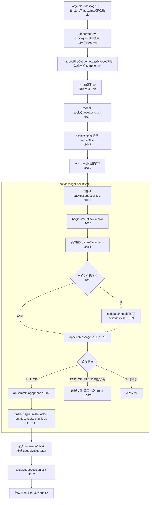

# 第 3 章 · CommitLog:全局顺序追加

> 篇:第 1 篇 · 存储写入(CommitLog + 刷盘 + Reput)
> 主线呼应:第 1 章(P0-01)立了那个反直觉的抉择——**把所有 Topic 的所有消息一股脑混写进一个 CommitLog**。这一章就是把这个抉择**字面落到代码上**:Broker 收到一条消息后,它到底怎么被追加进那个"混写的大文件"。我们会看到,RocketMQ 用一把全局锁 `putMessageLock` 把所有写**串行化**,再在锁内重设 `storeTimestamp` 换"全局有序",再靠 `MappedFileQueue` 把一组 1GB 的 `MappedFile` 首尾相接滚动起来。**混写这一抉择的直接代价——写串行化——在本章现形,而 RocketMQ 用三选一的锁(自旋/重入/自适应)把这个代价压到最小**。

## 核心问题

**所有 Topic 的消息都往一个 `MappedFileQueue`(一组 1GB 的 `MappedFile`)末尾追加,这是怎么做到不乱、不冲突的?具体说:写入为什么要加一把全局锁?那把锁为什么有三种实现可选?锁内为什么要重新设 `storeTimestamp`?文件写满了怎么滚动建下一个?**

读完本章你会明白:

1. `asyncPutMessage` 的完整流程:`topicQueueLock` 分配 `queueOffset` → encode → `putMessageLock.lock()` 锁内 `getLastMappedFile` + `appendMessage`,以及为什么是这个顺序。
2. 为什么"混写一个 CommitLog"注定要把写入**全局串行化**——不加锁会撞什么墙(物理偏移冲突、`storeTimestamp` 乱序)。
3. `putMessageLock` 三选一(`PutMessageReentrantLock` 重入 / `PutMessageSpinLock` 自旋 / `AdaptiveBackOffSpinLockImpl` 自适应退避)各自省在哪、亏在哪,默认为什么是重入锁,自适应锁在什么条件下切换。
4. `beginTimeInLock` 凭什么保证全局有序——锁全局串行 → 锁内取的时间戳天然单调 → `storeTimestamp` 单调递增。
5. `topicQueueLock` 为什么是 32 段分段锁(按 topic-queue 分桶),它和 `putMessageLock` 一前一后,各自守什么。

> **如果一读觉得太难**:先只记住三件事——① 写入有两把锁,外层 `topicQueueLock`(分段,管 `queueOffset` 分配),内层 `putMessageLock`(全局,管物理追加);② 锁内重设 `storeTimestamp` 是为了全局有序;③ 默认用重入锁,自旋和自适应是另两种可选实现。锁的具体切换机制没看懂不影响读后续章节。

---

## 3.1 一句话点破

> **`asyncPutMessage` 把一条消息的追加做成两段加锁的串行操作:先用分段锁 `topicQueueLock` 给这条消息分配一个"它在所属队列里的序号"(queueOffset),再用全局锁 `putMessageLock` 在锁内拿到最后一个 `MappedFile`、把字节追加进去、并在锁内重设 `storeTimestamp`。这把全局锁是"混写一个 CommitLog"的直接代价——所有写注定串行,但这串行换来物理偏移不冲突、存储时间戳全局单调。RocketMQ 给这把锁三种实现(自旋/重入/自适应),让你按负载挑最省的那一种。**

这是结论,不是理由。本章倒过来拆:先看混写为什么注定串行,再看那段锁内代码到底干了什么,再看三把锁各自的取舍,最后看文件怎么滚动。

---

## 3.2 混写一个 CommitLog,为什么注定要把写串行化

回到第 1 章(P0-01)的抉择:**所有 Topic 的消息都追加进同一个 CommitLog**。现在的问题是——这个"追加",能不能并发?

设想 8 个线程同时往 CommitLog 追加 8 条消息。每条消息要落进 `MappedFile` 的某个字节位置,这个位置 = 当前文件已写到的偏移(`wrotePosition`)+ 这条消息的长度。问题是:**如果两个线程同时读到同一个 `wrotePosition`,再各自"往后挪自己的消息长度",它们会写到同一个位置——数据相互覆盖**。

更具体地,看 `DefaultMappedFile.appendMessagesInner`([DefaultMappedFile.java:351](../rocketmq/store/src/main/java/org/apache/rocketmq/store/logfile/DefaultMappedFile.java#L351)):

```java
public AppendMessageResult appendMessagesInner(final MessageExt messageExt, final AppendMessageCallback cb,
    PutMessageContext putMessageContext) {
    // ...
    int currentPos = WROTE_POSITION_UPDATER.get(this);       // :356 读当前写位置
    long fileFromOffset = this.getFileFromOffset();

    if (currentPos < this.fileSize) {
        // ... 拿到 byteBuffer、定位到 currentPos ...
        result = cb.doAppend(fileFromOffset, byteBuffer, this.fileSize - currentPos,
            (MessageExtBrokerInner) messageExt, putMessageContext);   // :380 把消息字节写进去
        // ...
        WROTE_POSITION_UPDATER.addAndGet(this, result.getWroteBytes());  // :416 把写位置往后推
        return result;
    }
    // ...
}
```

这段代码本身**没有锁**。`WROTE_POSITION_UPDATER` 是个 `AtomicIntegerFieldUpdater`,它的 `get` 和 `addAndGet` 各自是原子的,但**"读 currentPos → 写消息 → 把 currentPos 往后推"这三步合起来不是原子的**。如果两个线程并发进来:

- 线程 A 读到 `currentPos = 100`,开始往 100 这个位置写自己的消息(假设长 50)。
- 线程 B 在 A 还没 `addAndGet` 之前也读到 `currentPos = 100`,也开始往 100 写自己的消息(假设长 60)。
- 两个线程的字节**互相覆盖**,CommitLog 这一段数据损坏。之后 A 推 `currentPos` 到 150,B 推到 160,中间还有一段空洞。

> **不这样会怎样**:朴素地让多线程并发 `appendMessagesInner`,会撞上"两个线程读到同一个 `wrotePosition`、写到同一个位置"的物理偏移冲突。`AtomicIntegerFieldUpdater` 救不了——它只保证单次读/写原子,保证不了"读-改-写"这一组操作原子。要让这组操作原子,要么用 CAS 自旋重试(`compareAndSet` 写位置),要么**直接加一把锁把整个追加串行化**。

RocketMQ 选了后者。原因不复杂:**追加一条消息是个相对重的操作**(要写几十到几百字节,还要算 `msgId`、填 `queueOffset`、填 `physicalOffset`),CAS 重试的话,并发一高,失败重试会让 CPU 空烧、还可能写一半被打断。**加一把全局锁,所有写线程排成一条队,一个一个进锁追加,简单、正确、且对顺序写磁盘友好**(磁头/SSD 永远只往后刷,不回跳)。

> **钉死这件事**:`putMessageLock` 这把全局锁,是"所有消息混写一个 CommitLog"的直接代价。它不是可选的——混写注定串行追加,串行追加就要有一把锁保证"一次只有一条消息在写、物理偏移不冲突"。这把锁开销多大,直接决定 RocketMQ 的写入吞吐。这也是为什么 RocketMQ 给它三种实现、还专门写了个自适应锁——锁是写路径的头号瓶颈。

---

## 3.3 asyncPutMessage 的完整流程:两段加锁

现在我们把那段被反复引用的 `CommitLog.asyncPutMessage`([CommitLog.java:969](../rocketmq/store/src/main/java/org/apache/rocketmq/store/CommitLog.java#L969))拆开看。它是整个 RocketMQ 写入的心脏,从网络层(`SendMessageProcessor`)接过来一条 `MessageExtBrokerInner`,把它追加进 CommitLog。

整体是**两段加锁**:



我们逐段讲。下面这段是从真实源码摘录的核心(允许 `...` 省略,保留行号与关键代码逐字一致):

```java
// CommitLog.java
public CompletableFuture<PutMessageResult> asyncPutMessage(final MessageExtBrokerInner msg) {  // :969
    // 1. 先做一批"锁外可做"的预处理
    if (!defaultMessageStore.getMessageStoreConfig().isDuplicationEnable()) {
        msg.setStoreTimestamp(System.currentTimeMillis());   // :972 这里设的 storeTimestamp 待会儿锁内会覆盖
    }
    msg.setBodyCRC(UtilAll.crc32(msg.getBody()));           // :975
    msg.setVersion(MessageVersion.MESSAGE_VERSION_V1);      // :986
    // ... IPv6 标志、拿到 ThreadLocal 编码器、生成 topicQueueKey ...
    PutMessageThreadLocal putMessageThreadLocal = this.putMessageThreadLocal.get();   // :1003
    String topicQueueKey = generateKey(putMessageThreadLocal.getKeyBuilder(), msg);   // :1005 —— "topic-queueId"
    MappedFile mappedFile = this.mappedFileQueue.getLastMappedFile();                 // :1008 锁外先拿一次
    // ... HA 前置检查(inSyncReplicas 够不够):1017-1036 ...

    // 2. 外层锁:topicQueueLock 分段锁,管 queueOffset 分配
    topicQueueLock.lock(topicQueueKey);                                                // :1038
    try {
        boolean needAssignOffset = true;
        if (needAssignOffset) {
            defaultMessageStore.assignOffset(msg);                                     // :1047 给这条消息分配 queueOffset
        }

        // 3. encode 成字节(这一步在 topicQueueLock 内,因为要用刚分配的 queueOffset)
        PutMessageResult encodeResult = putMessageThreadLocal.getEncoder().encode(msg); // :1050
        if (encodeResult != null) {
            return CompletableFuture.completedFuture(encodeResult);
        }
        msg.setEncodedBuff(putMessageThreadLocal.getEncoder().getEncoderBuffer());     // :1054
        PutMessageContext putMessageContext = new PutMessageContext(topicQueueKey);    // :1055

        // 4. 内层锁:putMessageLock 全局锁,管物理追加
        putMessageLock.lock(); //spin or ReentrantLock, depending on store config          // :1057 —— 注释原话
        try {
            long beginLockTimestamp = this.defaultMessageStore.getSystemClock().now();  // :1059
            this.beginTimeInLock = beginLockTimestamp;                                  // :1060

            // Here settings are stored timestamp, in order to guarantee an orderly
            // global
            if (!defaultMessageStore.getMessageStoreConfig().isDuplicationEnable()) {
                msg.setStoreTimestamp(beginLockTimestamp);                              // :1065 锁内覆盖 storeTimestamp
            }

            if (null == mappedFile || mappedFile.isFull()) {                           // :1068 文件满了?
                mappedFile = this.mappedFileQueue.getLastMappedFile(0);                // :1069 滚动建新文件
                if (isCloseReadAhead()) {
                    setFileReadMode(mappedFile, LibC.MADV_RANDOM);
                }
            }
            if (null == mappedFile) {                                                  // :1074 建文件失败
                return CompletableFuture.completedFuture(... CREATE_MAPPED_FILE_FAILED ...);
            }

            result = mappedFile.appendMessage(msg, this.appendMessageCallback, putMessageContext);  // :1079 追加!
            switch (result.getStatus()) {
                case PUT_OK:                                                           // :1081 成功
                    onCommitLogAppend(msg, result, mappedFile);                        // :1082 (堆外内存 commit / 触发刷盘等钩子)
                    break;
                case END_OF_FILE:                                                      // :1084 刚好这条消息塞不下,文件满
                    onCommitLogAppend(msg, result, mappedFile);
                    unlockMappedFile = mappedFile;
                    mappedFile = this.mappedFileQueue.getLastMappedFile(0);            // :1088 建新文件
                    result = mappedFile.appendMessage(msg, this.appendMessageCallback, putMessageContext); // :1097 重写
                    if (AppendMessageStatus.PUT_OK.equals(result.getStatus())) {
                        onCommitLogAppend(msg, result, mappedFile);
                    }
                    break;
                case MESSAGE_SIZE_EXCEEDED: case PROPERTIES_SIZE_EXCEEDED:             // :1102 消息太大
                    return CompletableFuture.completedFuture(... MESSAGE_ILLEGAL ...);
                case UNKNOWN_ERROR: default:                                           // :1106
                    return CompletableFuture.completedFuture(... UNKNOWN_ERROR ...);
            }

            elapsedTimeInLock = this.defaultMessageStore.getSystemClock().now() - beginLockTimestamp;  // :1110
        } finally {
            beginTimeInLock = 0;                                                        // :1112 清零,表示当前没人在锁内
            putMessageLock.unlock();                                                    // :1113
        }
        // Increase queue offset when messages are successfully written
        if (AppendMessageStatus.PUT_OK.equals(result.getStatus())) {
            this.defaultMessageStore.increaseOffset(msg, getMessageNum(msg));          // :1117 推进 queueOffset(注意在锁外!)
        }
    } finally {
        topicQueueLock.unlock(topicQueueKey);                                          // :1122
    }
    // ... 处理刷盘 + 复制,返回 future ...
}
```

这段代码有三个值得反复琢磨的点,我们一个一个讲。

### 第一个点:为什么要两把锁,各守什么

注意 `topicQueueLock`(:1038)和 `putMessageLock`(:1057)是**两把不同的锁,作用域不同、保护的资源不同**:

- **`putMessageLock` 是全局唯一的**,所有 Topic 的所有写共享它。它保护的是**物理追加**(往 `MappedFile` 的字节位置写),保证一次只有一条消息在追加、物理偏移不冲突。它的粒度最粗——全局。
- **`topicQueueLock` 是分段的**(默认 32 段),按 `topicQueueKey` 的 hash 分桶。它保护的是**`queueOffset` 的分配与推进**,保证同一个 topic-queue 内的多条消息按顺序拿到连续递增的 queueOffset。

这两把锁为什么不能合并成一把?因为它们的**粒度需求不同**。物理追加必须全局串行(一个 CommitLog 只有一个写位置),但 `queueOffset` 的分配是**按 queue 隔离**的——topic `order` queue 0 的 offset 分配,完全不需要等 topic `pay` queue 3 的 offset 分配。如果用一把全局锁管 `queueOffset` 分配,所有 topic 的 offset 分配都要排队,但这个排队完全没必要(它们改的是 map 里不同的 key)。

> **钉死这件事**:两把锁的分工是——`topicQueueLock`(分段,细粒度)管"这条消息在它队列里排第几"(queueOffset),`putMessageLock`(全局,粗粒度)管"这条消息的字节往哪写"(物理偏移)。前者按 topic-queue 分桶降竞争,后者因为物理位置只有一个、必须全局串行。

### 第二个点:queueOffset 分配在锁内,推进在锁外

看 `:1047` 的 `assignOffset(msg)`(锁内分配)和 `:1117` 的 `increaseOffset(msg, ...)`(锁外推进)。这是个**刻意的设计**:

- `assignOffset` 在 `topicQueueLock` 内,它读 `topicQueueTable` 里这个 topic-queue 的当前 offset、赋给这条消息(`msg.setQueueOffset(...)`)。这一步必须串行,否则同一个 queue 的两条并发消息可能读到同一个 offset。
- `increaseOffset` 在 `putMessageLock` 释放**之后**才执行(`:1117`),它把这个 queue 的 offset **加 1**(或加 messageNum)。为什么放锁外?因为**只有这条消息真的追加成功了**(走到了 `:1116` 的 `PUT_OK` 判断)才推进 offset——追加失败的消息不该占用 offset。放锁外推进不影响正确性,因为同一个 topic-queue 的写入都被 `topicQueueLock` 串行化了,即便推进在锁外,下一条同 queue 的消息要进 `topicQueueLock` 时,这条的推进已经完成(因为同 queue 的锁是同一个桶)。

> **不这样会怎样**:`increaseQueueOffset` 在 `QueueOffsetOperator` 里([QueueOffsetOperator.java:54](../rocketmq/store/src/main/java/org/apache/rocketmq/store/queue/QueueOffsetOperator.java#L54))是 `computeIfAbsent` + `put(key, offset + messageNum)` 的**非原子 read-modify-write**——

```java
public void increaseQueueOffset(String topicQueueKey, short messageNum) {
    Long queueOffset = ConcurrentHashMapUtils.computeIfAbsent(this.topicQueueTable, topicQueueKey, k -> 0L);
    topicQueueTable.put(topicQueueKey, queueOffset + messageNum);   // :56 读出来 + messageNum 再 put 回去
}
```

——**如果两个同 queue 的线程并发执行这行,会丢更新**(都读到 5,都 put 成 6,丢了中间那个 7)。`topicQueueLock` 把同 queue 的这段操作串行,就是堵这个洞。不同 queue 的写落到不同的桶,不互相阻塞,这就是分段的意义(3.5 节详讲)。

### 第三个点:END_OF_FILE —— 文件满了,滚动建新文件

注意 `appendMessage` 可能返回 `END_OF_FILE`(:1084),意思是"这条消息塞不进当前文件了——当前文件剩余空间不够"。这时候 RocketMQ 不是直接报错,而是:

1. 先对老文件调 `onCommitLogAppend`(钩子,堆外内存 commit 等);
2. 调 `mappedFileQueue.getLastMappedFile(0)`(:1088)建一个新 `MappedFile`;
3. **重新 `appendMessage` 一次**(:1097),把这条消息写进新文件。

那 `appendMessage` 怎么判定"塞不下"?看 `DefaultAppendMessageCallback.doAppend`([CommitLog.java:1972](../rocketmq/store/src/main/java/org/apache/rocketmq/store/CommitLog.java#L1972)):

```java
public AppendMessageResult doAppend(final long fileFromOffset, final ByteBuffer byteBuffer, final int maxBlank,
    final MessageExtBrokerInner msgInner, PutMessageContext putMessageContext) {
    // ...
    final int msgLen = preEncodeBuffer.getInt(0);   // :1985 消息总长
    // ...
    // Determines whether there is sufficient free space
    if ((msgLen + END_FILE_MIN_BLANK_LENGTH) > maxBlank) {                         // :2023 剩余不够?
        this.msgStoreItemMemory.clear();
        this.msgStoreItemMemory.putInt(maxBlank);                                  // :2026 写一个 BLANK 头(总长=maxBlank)
        this.msgStoreItemMemory.putInt(CommitLog.BLANK_MAGIC_CODE);                // :2028 写魔数标识"这是空白填充"
        byteBuffer.put(this.msgStoreItemMemory.array(), 0, 8);
        return new AppendMessageResult(AppendMessageStatus.END_OF_FILE, wroteOffset,
            maxBlank, msgIdSupplier, msgInner.getStoreTimestamp(),
            queueOffset, ...);                                                     // :2033 返回 END_OF_FILE
    }
    // ... 否则正常把消息字节写进 byteBuffer ...
}
```

`END_FILE_MIN_BLANK_LENGTH = 4 + 4 = 8`([:1896](../rocketmq/store/src/main/java/org/apache/rocketmq/store/CommitLog.java#L1896))。意思是:**当前文件剩余空间(`maxBlank`)如果连"消息长度 + 8 字节"都放不下,就判定为满**。这 8 字节是留给文件末尾的"空白填充头"的——写满时,RocketMQ 在文件末尾写一个 `[maxBlank][BLANK_MAGIC_CODE]` 的 8 字节头,告诉后续读这个文件的人"从这以后是空白填充,不是消息"。这是个很干净的设计:**每个 `MappedFile` 要么是满的消息,要么末尾带一个明确的"到此为止"标记,不会读到一半发现是半截消息**。

> **钉死这件事**:`appendMessage` 返回 `END_OF_FILE` 不是错误,是"文件正常写满了"的信号。RocketMQ 在文件末尾写一个 8 字节的 BLANK 头(`[剩余长度][BLANK_MAGIC_CODE = -875286124]`),然后外层 `asyncPutMessage` 滚动建一个新 `MappedFile`,把这条消息重写进新文件。这就是 `MappedFileQueue` 首尾相接滚动的由来——下一节详讲。

---

## 3.4 MappedFileQueue:一组 1GB 的 MappedFile 怎么首尾相接

现在专门讲 `MappedFileQueue` 怎么管这组 `MappedFile`。

CommitLog 在磁盘上不是一个无限大的文件,而是一组固定大小(默认 **1GB**,`MessageStoreConfig.mappedFileSizeCommitLog = 1024 * 1024 * 1024` [MessageStoreConfig.java:52](../rocketmq/store/src/main/java/org/apache/rocketmq/store/config/MessageStoreConfig.java#L52))的 `MappedFile`,首尾相接:

```
CommitLog 目录:  ${storePathRootDir}${File.separator}commitlog${File.separator}

  文件名 = 起始偏移(20位补零)         起始偏移        写位置(wrotePosition)
  ┌─────────────────────────┐
  │ 00000000000000000000     │  ←  MappedFile 0   起始偏移 = 0
  │                          │     大小 1GB,已写满
  ├─────────────────────────┤
  │ 00000000001073741824     │  ←  MappedFile 1   起始偏移 = 1073741824 (= 1GB)
  │                          │     大小 1GB,已写满
  ├─────────────────────────┤
  │ 00000000002147483648     │  ←  MappedFile 2   起始偏移 = 2147483648 (= 2GB)
  │                          │     大小 1GB,正在写(当前活跃文件)
  │         ↓ wrotePosition  │
  ├─────────────────────────┤
  │            ...           │
  └─────────────────────────┘

  全局物理偏移 = MappedFile 起始偏移 + 文件内 wrotePosition
  例:全局偏移 2147483712 → 落在 MappedFile 2,文件内偏移 = 2147483712 - 2147483648 = 64
```

**关键观察**:文件名就是这个文件的**起始全局偏移**。于是给定任意全局物理偏移,要定位到它落在哪个文件,只需 `偏移 / 1GB = 文件下标`——这就是为什么 ConsumeQueue 存"全局物理偏移"能 O(1) 反查 CommitLog(P2-06 详讲)。

`getLastMappedFile` 是这组文件的入口,看它怎么滚动建新文件([MappedFileQueue.java:323](../rocketmq/store/src/main/java/org/apache/rocketmq/store/MappedFileQueue.java#L323)):

```java
public MappedFile getLastMappedFile(final long startOffset, boolean needCreate) {
    long createOffset = -1;
    MappedFile mappedFileLast = getLastMappedFile();   // :325 拿当前最后一个

    if (mappedFileLast == null) {                      // :327 一个文件都没有
        createOffset = startOffset - (startOffset % this.mappedFileSize);   // :328 对齐到文件大小边界
    }

    if (mappedFileLast != null && mappedFileLast.isFull()) {   // :331 最后一个满了
        createOffset = mappedFileLast.getFileFromOffset() + this.mappedFileSize;   // :332 新文件起始 = 老文件起始 + 1GB
    }

    if (createOffset != -1 && needCreate) {            // :335 需要建
        return tryCreateMappedFile(createOffset);      // :336
    }

    return mappedFileLast;                             // :339 没满就返回当前最后一个
}
```

逻辑清晰:如果当前没有文件、或当前文件满了,就算出新文件的**起始偏移**(`createOffset`,永远是 1GB 的整数倍),然后 `tryCreateMappedFile` 建它。

`tryCreateMappedFile`([:368](../rocketmq/store/src/main/java/org/apache/rocketmq/store/MappedFileQueue.java#L368))有个细节值得点一下:

```java
public MappedFile tryCreateMappedFile(long createOffset) {
    String nextFilePath = this.storePath + File.separator + UtilAll.offset2FileName(createOffset);
    String nextNextFilePath = this.storePath + File.separator + UtilAll.offset2FileName(createOffset
            + this.mappedFileSize);                    // :370 还准备了"下下一个"文件的路径
    return doCreateMappedFile(nextFilePath, nextNextFilePath);
}
```

它**同时准备了"下一个"和"下下一个"两个文件路径**。为什么?因为 `doCreateMappedFile`([:375](../rocketmq/store/src/main/java/org/apache/rocketmq/store/MappedFileQueue.java#L375))会把它交给 `allocateMappedFileService`——一个**后台预创建线程**。这个线程会先把下一个文件 mmap 好、缓存起来,等你这个文件写满、要建下下一个的时候,**直接从缓存拿,不用现场 mmap**(mmap 一个 1GB 文件是个慢操作,有几十毫秒的 page fault 开销)。这就是为什么 RocketMQ 写满一个文件、无缝切到下一个,延迟不会抖——下一个文件早就在后台建好了。

> **钉死这件事**:`MappedFileQueue` 用"文件名 = 起始偏移"的约定,让任意全局偏移能 O(1) 反查文件;用 1GB 固定大小,让文件数不会爆炸(写 1TB 数据才 1024 个文件);用 `AllocateMappedFileService` 后台预创建,让滚动建新文件零延迟。这三个设计合起来,让"一组 MappedFile 首尾相接"在写入端表现得像一个无限长的顺序文件。

---

## 3.5 技巧精解:`putMessageLock` 三选一 + `topicQueueLock` 分段锁

这一节是本章的硬核。我们把这两把锁拆透——它们各自的"为什么 sound"和"不这么写会撞什么墙"。

### 三种锁实现:省在哪、亏在哪

`CommitLog` 构造时根据配置选锁([CommitLog.java:142](../rocketmq/store/src/main/java/org/apache/rocketmq/store/CommitLog.java#L142)):

```java
PutMessageLock adaptiveBackOffSpinLock = new AdaptiveBackOffSpinLockImpl();   // :142

this.putMessageLock = messageStore.getMessageStoreConfig().getUseABSLock() ? adaptiveBackOffSpinLock :
    messageStore.getMessageStoreConfig().isUseReentrantLockWhenPutMessage() ? new PutMessageReentrantLock() : new PutMessageSpinLock();   // :144-145
```

这是个三层 if-else:

- 配 `useABSLock=true` → 用**自适应锁** `AdaptiveBackOffSpinLockImpl`;
- 否则配 `useReentrantLockWhenPutMessage=true`(默认值,[MessageStoreConfig.java:167](../rocketmq/store/src/main/java/org/apache/rocketmq/store/config/MessageStoreConfig.java#L167))→ 用**重入锁** `PutMessageReentrantLock`;
- 否则 → 用**自旋锁** `PutMessageSpinLock`。

**默认是重入锁**(`useABSLock=false`,`useReentrantLockWhenPutMessage=true`)。我们一种一种看。

#### 实现 1:`PutMessageReentrantLock`——朴素的非公平重入锁

最简单的实现([PutMessageReentrantLock.java](../rocketmq/store/src/main/java/org/apache/rocketmq/store/PutMessageReentrantLock.java)):

```java
public class PutMessageReentrantLock implements PutMessageLock {
    private ReentrantLock putMessageNormalLock = new ReentrantLock(); // NonfairSync   // :25 非公平

    @Override
    public void lock() {
        putMessageNormalLock.lock();   // :29 拿不到就 park
    }

    @Override
    public void unlock() {
        putMessageNormalLock.unlock(); // :33 唤醒一个等待者
    }
}
```

它就是包了一层 `java.util.concurrent.locks.ReentrantLock`(非公平模式)。**它省在哪、亏在哪?**

- **省**:CPU 不空转。拿不到锁的线程被 OS 调度器 `park`(挂起,让出 CPU),不占计算资源。在**高并发、锁持有时间长**的场景下,这是对的——你让 100 个等待线程各自 spin,等于 100 个核全在空转,吞吐反而崩。
- **亏**:`park/unpark` 是系统调用,有用户态-内核态切换开销(微秒级)。在**低并发、锁持有时间短**的场景下,这个开销远大于"自旋几十纳秒拿到锁"——比如只有 2 个线程在抢,你 park 了,刚 park 就被唤醒,白白付了两次系统调用的钱。

#### 实现 2:`PutMessageSpinLock`——朴素的自旋锁

另一种实现([PutMessageSpinLock.java](../rocketmq/store/src/main/java/org/apache/rocketmq/store/PutMessageSpinLock.java)):

```java
/**
 * Spin lock Implementation to put message, suggest using this with low race conditions
 */
public class PutMessageSpinLock implements PutMessageLock {
    //true: Can lock, false : in lock.
    private AtomicBoolean putMessageSpinLock = new AtomicBoolean(true);   // :26

    @Override
    public void lock() {
        boolean flag;
        do {
            flag = this.putMessageSpinLock.compareAndSet(true, false);    // :32 CAS 抢
        }
        while (!flag);                                                     // :33 没抢到就一直转
    }

    @Override
    public void unlock() {
        this.putMessageSpinLock.compareAndSet(false, true);               // :39 CAS 还
    }
}
```

注意源码注释:**"suggest using this with low race conditions"**(建议在低竞争下用)。它就是一个 `AtomicBoolean` 的 CAS 自旋。

- **省**:没有 `park/unpark`,没有系统调用,没有内核态切换。**低竞争下拿到锁极快**——一两次 CAS 就成功了,纳秒级。
- **亏**:拿不到锁就**死转**(`while (!flag)`)。**高竞争下,所有等待线程都在各自的核心上 100% 空转**,白白烧 CPU,而且 CPU 空转还会和真正持锁的线程抢缓存、抢内存带宽,反而让持锁线程变慢——这就是为什么源码注释明确说"低竞争才用"。

> **反面对比**:朴素地选错锁,会撞什么墙?
> - 在**高竞争**(几百线程抢一把锁)下用自旋锁 → 几百个核全 100% 空转,CPU 飙满,持锁线程被拖慢,吞吐反而低于重入锁。
> - 在**低竞争**(两三个线程、锁内操作很快)下用重入锁 → 每次 `park/unpark` 付两次微秒级系统调用,而本来几十纳秒就能拿到锁,白白浪费。

**这两种锁各有最佳场景,但生产环境的并发是动态的**——白天高峰几百线程抢,凌晨低谷两三个线程抢。固定选一种,总有一段时间是亏的。这就是为什么 RocketMQ 还提供第三种:自适应锁。

#### 实现 3:`AdaptiveBackOffSpinLockImpl`——在高并发和低并发之间自动切

这是最精巧的一种,在 `store/lock/` 子包([AdaptiveBackOffSpinLockImpl.java](../rocketmq/store/src/main/java/org/apache/rocketmq/store/lock/AdaptiveBackOffSpinLockImpl.java))。它的核心思想是:**运行时根据竞争强度,自动在自旋和重入之间切换**。

它的内部持有一对锁——一个 `BackOffSpinLock`(自旋,带可调的 spin 次数 K)、一个 `BackOffReentrantLock`(重入),用一个 `state` 标志当前用哪个:

```java
public class AdaptiveBackOffSpinLockImpl implements AdaptiveBackOffSpinLock {
    private AdaptiveBackOffSpinLock adaptiveLock;                            // :33 当前用的那把
    private AtomicBoolean state = new AtomicBoolean(true);                  // :35 true=可进锁/可换锁,false=换锁中

    private final static float SWAP_SPIN_LOCK_RATIO = 0.8f;                 // :38 重入→自旋的回切比例(0.8)

    private final static int SPIN_LOCK_ADAPTIVE_RATIO = 4;                  // :42 调 K 的下限比例
    private final static int BASE_SWAP_LOCK_RATIO = 320;                    // :46 调 K 的上限比例

    private Map<String, AdaptiveBackOffSpinLock> locks;                     // :52 两把锁的字典
    private final List<AtomicInteger> tpsTable;                             // :54 按秒分槽统计 TPS(2 个槽,每秒一切)
    private final List<Set<Thread>> threadTable;                            // :56 按秒分槽统计活跃线程数
    private int swapCriticalPoint;                                          // :58 自旋→重入的临界点
    private AtomicInteger currentThreadNum = new AtomicInteger(0);          // :60 当前在锁内/抢锁的线程数

    public AdaptiveBackOffSpinLockImpl() {
        this.locks = new HashMap<>();
        this.locks.put(REENTRANT_LOCK, new BackOffReentrantLock());         // :66
        this.locks.put(BACK_OFF_SPIN_LOCK, new BackOffSpinLock());          // :67
        // ... 初始化两个 TPS 槽、两个线程集合槽 ...
        adaptiveLock = this.locks.get(BACK_OFF_SPIN_LOCK);                  // :77 默认从自旋开始
    }
    // ...
}
```

它的核心是两个方法:`lock()` 和 `swap()`。

`lock()`([:80](../rocketmq/store/src/main/java/org/apache/rocketmq/store/lock/AdaptiveBackOffSpinLockImpl.java#L80)):

```java
@Override
public void lock() {
    int slot = LocalTime.now().getSecond() % 2;          // :82 按当前秒数选槽(0 或 1)
    this.threadTable.get(slot).add(Thread.currentThread()); // :83 记下"这一秒有哪些线程在抢锁"
    this.tpsTable.get(slot).getAndIncrement();           // :84 这一秒的 TPS +1
    boolean state;
    do {
        state = this.state.get();                        // :87 等 state=true(没人正在换锁)
    } while (!state);

    currentThreadNum.incrementAndGet();                  // :90 当前活跃线程数 +1
    this.adaptiveLock.lock();                            // :91 调用当前选中的那把锁
}
```

注意它**先记账再锁**——把"这一秒有多少线程在抢锁"记到 `tpsTable` 和 `threadTable`,这些数据后面 `swap()` 用来判断竞争强度。

`unlock()`([:94](../rocketmq/store/src/main/java/org/apache/rocketmq/store/lock/AdaptiveBackOffSpinLockImpl.java#L94)):

```java
@Override
public void unlock() {
    this.adaptiveLock.unlock();                          // :95 先解锁
    currentThreadNum.decrementAndGet();                  // :97 活跃线程数 -1
    if (isOpen.get()) {
        swap();                                          // :99 每次解锁都尝试评估是否要换锁
    }
}
```

每次 `unlock` 都调 `swap()`——这是它的"自适应"所在。

`swap()`([:108](../rocketmq/store/src/main/java/org/apache/rocketmq/store/lock/AdaptiveBackOffSpinLockImpl.java#L108))是核心,简化讲它的逻辑:

```java
@Override
public void swap() {
    if (!this.state.get()) return;                       // :110 有人在换锁了,退出
    // ...
    int slot = 1 - LocalTime.now().getSecond() % 2;      // :114 拿"上一秒"的槽(因为当前秒可能还没结束)
    int tps = this.tpsTable.get(slot).get() + 1;         // :115 上一秒的 TPS
    int threadNum = this.threadTable.get(slot).size();   // :116 上一秒有多少线程在抢
    this.tpsTable.get(slot).set(-1);                     // :117 清掉(下一秒这槽会被复用)
    this.threadTable.get(slot).clear();                  // :118
    if (tps == 0) return;                                // :119 上一秒没活动,不换

    if (this.adaptiveLock instanceof BackOffSpinLock) {  // :123 当前是自旋锁
        BackOffSpinLock lock = (BackOffSpinLock) this.adaptiveLock;
        // 如果"退避次数 / TPS"超过 BASE_SWAP_LOCK_RATIO(320),说明自旋空转太多 → 换重入锁
        if (lock.getNumberOfRetreat(slot) * BASE_SWAP_LOCK_RATIO >= tps) {   // :128
            if (lock.isAdapt()) {
                lock.adapt(true);                        // :130 还能调,先调大 spin 次数 K
            } else {
                this.swapCriticalPoint = tps * threadNum; // :133 记下临界点,准备换重入锁
                needSwap = true;
            }
        } else if (lock.getNumberOfRetreat(slot) * BASE_SWAP_LOCK_RATIO * SPIN_LOCK_ADAPTIVE_RATIO <= tps) {
            lock.adapt(false);                           // :137 退避少,调小 K(更接近纯自旋)
        }
    } else {                                             // :140 当前是重入锁
        // 如果 TPS * threadNum 跌到 swapCriticalPoint 的 0.8 倍以下 → 竞争降了,换回自旋
        if (tps * threadNum <= this.swapCriticalPoint * SWAP_SPIN_LOCK_RATIO) {  // :141
            needSwap = true;
        }
    }

    if (needSwap) {                                      // :146 真的要换
        if (this.state.compareAndSet(true, false)) {     // :147 CAS 抢"换锁权",只允许一个线程换
            // 关键:等所有线程都退出锁和临界区,再换
            int currentThreadNum;
            do {
                currentThreadNum = this.currentThreadNum.get();   // :151
            } while (currentThreadNum != 0);             // :152 等到没人持锁/抢锁

            try {
                if (this.adaptiveLock instanceof BackOffSpinLock) {
                    this.adaptiveLock = this.locks.get(REENTRANT_LOCK);   // :156 自旋 → 重入
                } else {
                    this.adaptiveLock = this.locks.get(BACK_OFF_SPIN_LOCK); // :158 重入 → 自旋
                    ((BackOffSpinLock) this.adaptiveLock).adapt(false);
                }
            } finally {
                this.state.compareAndSet(false, true);   // :164 换完,放行
            }
        }
    }
}
```

这里有三个精妙的点:

1. **切换判据是"退避次数 / TPS"**——这个比值衡量"每个请求平均要自旋空转多少次"。比值高,说明锁竞争激烈、自旋空转多,该换重入锁(让等待者 park,省 CPU);比值低,说明竞争轻、自旋很快拿到,该保持自旋(省系统调用)。`BASE_SWAP_LOCK_RATIO = 320` 是经验阈值,意思是"每个请求平均空转超过 1/320 次"才考虑换——这是个相当宽松的阈值,保护自旋锁不被轻易换掉。

2. **换锁前要等到 `currentThreadNum == 0`**——这是 sound 的关键。`currentThreadNum` 在 `lock()` 入口 `+1`(:90)、`unlock()` 出口 `-1`(:97)。要换锁,必须等到没有任何线程在抢锁或持锁(`do { ... } while (currentThreadNum != 0)`)。否则一个线程正持着自旋锁在临界区里写,你把 `adaptiveLock` 换成重入锁,它 unlock 时调的是重入锁的 unlock——状态全错。等 `currentThreadNum == 0` 是个"全局静止点",换锁才安全。代价是高并发下 `currentThreadNum` 很难归零,可能换锁迟迟完不成——但 `state.compareAndSet(true, false)` 保证只有一个线程在等,不会一堆线程都卡在这。

3. **重入→自旋的回切用 0.8 倍**——`SWAP_SPIN_LOCK_RATIO = 0.8f`(:38)。从自旋换到重入的临界点是 `swapCriticalPoint = tps * threadNum`,从重入换回自旋的临界点是 `swapCriticalPoint * 0.8`。这个**滞回**(hysteresis)是有意的——避免在临界点附近来回抖动,一会儿换自旋、一会儿换重入,抖动本身就是开销。

> **钉死这件事**:自适应锁的本质是——**低竞争用自旋(省系统调用)、高竞争用重入(省 CPU)、运行时根据"退避次数/TPS"自动在两者间切,且切换前等全局静止点保证 sound**。它解决的痛点是"生产环境并发是动态的,固定选一种锁总有亏的时间段"。代价是实现复杂、调参敏感(`BASE_SWAP_LOCK_RATIO`/`SPIN_LOCK_ADAPTIVE_RATIO`/`SWAP_SPIN_LOCK_RATIO` 三个魔数都是经验值),所以默认不开(`useABSLock=false`)——它适合对延迟极度敏感、且你能持续观察调参的场景。

#### 三把锁的取舍总账

| 锁 | 实现 | 省 | 亏 | 最佳场景 |
|----|------|----|----|---------|
| `PutMessageReentrantLock` | 非公平 `ReentrantLock`,拿不到就 park | CPU 不空转(高竞争友好) | 每次有 park/unpark 系统调用(低竞争浪费) | **默认**,通用场景 |
| `PutMessageSpinLock` | `AtomicBoolean` CAS 死旋 | 无系统调用,低竞争拿锁极快(纳秒级) | 高竞争下所有核 100% 空转烧 CPU | 源码注释明说"低竞争" |
| `AdaptiveBackOffSpinLockImpl` | 自旋+重入二选一,运行时按"退避/TPS"切换 | 动态适应,两个场景都不太亏 | 实现复杂、调参敏感、换锁有静止点等待 | 极致延迟优化,默认不开 |

### topicQueueLock:32 段分段锁,为什么分段

讲完 `putMessageLock`,回头看 `topicQueueLock`。它的实现极简([TopicQueueLock.java](../rocketmq/store/src/main/java/org/apache/rocketmq/store/TopicQueueLock.java)):

```java
public class TopicQueueLock {
    private final int size;
    private final List<Lock> lockList;

    public TopicQueueLock() {
        this.size = 32;                                  // :30 默认 32 段
        this.lockList = new ArrayList<>(32);
        for (int i = 0; i < this.size; i++) {
            this.lockList.add(new ReentrantLock());      // :33 每段一把 ReentrantLock
        }
    }

    public TopicQueueLock(int size) {                    // :37 可配
        // ... 同上 ...
    }

    public void lock(String topicQueueKey) {
        Lock lock = this.lockList.get((topicQueueKey.hashCode() & 0x7fffffff) % this.size);   // :46 hash 取模选段
        lock.lock();
    }

    public void unlock(String topicQueueKey) {
        Lock lock = this.lockList.get((topicQueueKey.hashCode() & 0x7fffffff) % this.size);   // :51
        lock.unlock();
    }
}
```

就是 **32 把 `ReentrantLock` 的数组**,按 `topicQueueKey` 的 hash 取模选一把。`(hashCode & 0x7fffffff)` 是为了把符号位清掉(保证非负),再 `% 32` 落到某个桶。

**为什么要分段?** 因为 `queueOffset` 分配是**按 topic-queue 隔离**的——topic `order` queue 0 的 offset 分配和 topic `pay` queue 3 的 offset 分配,操作的是 `topicQueueTable` 里**不同的 key**,完全可以并行。如果用一把全局锁,所有 topic 的 offset 分配都要排队,但这个排队毫无必要(改的是不同 key)。

分段之后,只有 **hash 到同一个桶**的 topic-queue 才互相阻塞,不同桶的并行。32 个桶,假设你有 1000 个 topic-queue,平均每个桶 30 个 topic-queue——竞争被降到原来的 1/32。

> **不这样会怎样**:如果 `topicQueueLock` 是一把全局锁会怎样?那所有写线程在 `assignOffset` 阶段要排一条长队(比 `putMessageLock` 那条队还长,因为 `assignOffset` 还要在锁内跑 encode)。但实际它只需要保证"同一个 topic-queue 的 offset 分配串行",**不同 topic-queue 完全可以并行**——分段锁把这个粒度做到了正好。

注意一个细节:`topicQueueLock` 用 `ReentrantLock` 而不是自旋锁。为什么?因为它的临界区**比 `putMessageLock` 长**——它包住了 `assignOffset`(读 map、setQueueOffset)+ `encode`(编码成字节,几十微秒)+ 整个 `putMessageLock` 临界区。这么长的临界区,自旋会烧 CPU,所以分段用 `ReentrantLock` 是对的。

> **钉死这件事**:`topicQueueLock` 是"按 topic-queue 分桶的 32 段 ReentrantLock",它把"queueOffset 分配的串行化"做到刚好——同 queue 串行,不同 queue 并行。它和 `putMessageLock` 的分工是:**前者管逻辑顺序(queueOffset),后者管物理顺序(物理偏移)**。前者分段细粒度,后者全局唯一。

---

## 3.6 技巧精解:`beginTimeInLock` 凭什么保证全局有序

最后一个硬技巧——锁内重设 `storeTimestamp`。

看 `asyncPutMessage` 锁内这几行(:1059-1066):

```java
putMessageLock.lock(); //spin or ReentrantLock, depending on store config          // :1057
try {
    long beginLockTimestamp = this.defaultMessageStore.getSystemClock().now();  // :1059 进锁立刻取时间
    this.beginTimeInLock = beginLockTimestamp;                                  // :1060 存到字段

    // Here settings are stored timestamp, in order to guarantee an orderly
    // global
    if (!defaultMessageStore.getMessageStoreConfig().isDuplicationEnable()) {
        msg.setStoreTimestamp(beginLockTimestamp);                              // :1065 用锁内时间覆盖 storeTimestamp
    }
    // ... 追加 ...
} finally {
    beginTimeInLock = 0;                                                        // :1112 出锁清零
    putMessageLock.unlock();                                                    // :1113
}
```

注意 `asyncPutMessage` 入口处(:972)**已经设过一次 `storeTimestamp`**:

```java
if (!defaultMessageStore.getMessageStoreConfig().isDuplicationEnable()) {
    msg.setStoreTimestamp(System.currentTimeMillis());   // :972 锁外先设一次
}
```

那为什么锁内(:1065)**还要覆盖一次**?源码注释 `// Here settings are stored timestamp, in order to guarantee an orderly global`(这里设存储时间戳,是为了保证全局有序)给出了答案,但我们要拆透。

**问题是什么?** RocketMQ 要保证:消息的 `storeTimestamp`(存储时间戳)**全局单调递增**——也就是,先存进 CommitLog 的消息,`storeTimestamp` 一定 ≤ 后存进的消息。这个性质很多地方要用:

- 消费端按时间戳回溯(`pull from timestamp`)要靠它;
- Reput 后台分发按时间戳推进 `reputFromOffset` 要靠它;
- 延时消息的到期判断要靠它。

**如果不锁内重设会怎样?** 设想 8 个线程并发调 `asyncPutMessage`:

- 线程 A 在 `:972` 取到 `storeTimestamp = 100ms`,然后进锁、追加、出锁(假设锁内耗时到 `150ms`)。
- 线程 B 在 `:972` 取到 `storeTimestamp = 120ms`(比 A 晚 20ms 取),然后等锁,在 `200ms` 才进锁、追加。

问题来了:**A 的 storeTimestamp(100) < B 的 storeTimestamp(120),但 A 是先追加的(150 出锁)、B 是后追加的(200 出锁)**——物理上 A 在前、B 在后,但时间戳 A 也确实小于 B,这个例子看似 OK。换个例子:

- 线程 A 在 `:972` 取到 `storeTimestamp = 100ms`,然后等锁(锁被别人占着),等到 `500ms` 才进锁、追加。
- 线程 B 在 `:972` 取到 `storeTimestamp = 200ms`,进锁顺利,在 `250ms` 就追加了。

这下 **B 先追加(250ms 进锁)、storeTimestamp=200;A 后追加(500ms 进锁)、storeTimestamp=100**——物理偏移上 B 在前 A 在后,但时间戳 A(100) < B(200),**反了**!消费端按时间戳回溯,会以为 A 先到,但 A 物理上在 B 后面,语义就乱了。

**锁内重设怎么解决?** 在锁内(:1059)重新取一次时间 `beginLockTimestamp`,用它覆盖 `storeTimestamp`(:1065)。因为**锁是全局串行的**,线程进锁的顺序就是它追加的顺序,而 `beginLockTimestamp` 是进锁那一刻取的——**进锁顺序 = 追加顺序 = `beginLockTimestamp` 单调递增顺序**。于是 `storeTimestamp` 严格单调递增,和物理偏移顺序一致。

> **钉死这件事**:`beginTimeInLock` 凭"锁全局串行"保证全局有序。锁是全局唯一的,线程进锁的顺序就是物理追加的顺序;锁内第一件事取时间戳,这个时间戳天然随进锁顺序单调递增;用它覆盖 `storeTimestamp`,于是 `storeTimestamp` 严格单调,与物理偏移同序。**不锁内重设,多线程并发取的锁外时间戳会和实际进锁追加的顺序错位,时间戳乱序。**

`beginTimeInLock` 这个字段还有个旁支用途——它还对外暴露(`getBeginTimeInLock` [:944](../rocketmq/store/src/main/java/org/apache/rocketmq/store/CommitLog.java#L944)),刷盘服务用它来算"锁内耗时"(`elapsedTimeInLock = now - beginLockTimestamp` [:1110]),监控写路径的锁竞争程度。锁外清零(:1112)是为了让"当前没人在锁内"这个状态可被观测——`beginTimeInLock == 0` 表示空闲。

---

## 章末小结

这一章把"所有 Topic 混写一个 CommitLog"这个抉择**字面落到了代码上**。我们走完了 `asyncPutMessage` 的两段加锁流程,看清了三件事:

1. **混写注定串行**:`putMessageLock` 这把全局锁是混写的直接代价——一次只有一条消息能追加,否则物理偏移冲突。
2. **两把锁分工**:`topicQueueLock`(32 段分段)管 `queueOffset` 分配(逻辑顺序),`putMessageLock`(全局唯一)管物理追加(物理顺序)。前者细粒度,后者粗粒度,各守各的,不互相拖累。
3. **锁内重设 storeTimestamp 换全局有序**:`beginTimeInLock` 凭"锁全局串行"让存储时间戳严格单调,与物理偏移同序。

**二分法归属**:这一章整章都在**存储内核**这一面——它讲的是"消息怎么被高效地只追加一次"。`putMessageLock` 是写入吞吐的头号瓶颈,RocketMQ 用三选一(重入/自旋/自适应)让你按负载挑最省的,这是存储内核在"串行化"这个代价下能做的极致优化。

### 五个"为什么"清单

1. **为什么所有 Topic 混写一个 CommitLog 要加全局锁?** 混写意味着所有写共享一个 `MappedFile` 的写位置(`wrotePosition`)。"读 currentPos → 写消息字节 → 推进 currentPos"这三步不是原子的,并发会撞物理偏移冲突(两条消息写同一位置)。加全局锁串行化是唯一 sound 的解。详见 3.2。
2. **为什么 `putMessageLock` 有三种实现?** 因为生产环境并发是动态的——低竞争下自旋锁最快(无系统调用),高竞争下重入锁最省 CPU(不空转)。固定选一种总有亏的时间段。三种实现(重入/自旋/自适应)让你按负载挑;自适应锁运行时按"退避次数/TPS"自动切换。默认用重入锁(`useReentrantLockWhenPutMessage=true`)。详见 3.5。
3. **自适应锁怎么保证切换 sound?** 切换前用 `state.compareAndSet(true,false)` 抢"换锁权",再 `do { } while (currentThreadNum != 0)` 等到全局静止点(没人持锁/抢锁),才把内部锁对象换掉。这样不会出现"一个线程持着自旋锁、unlock 时却调了重入锁的 unlock"的错乱。详见 3.5。
4. **为什么 `topicQueueLock` 要分段,而 `putMessageLock` 不分?** 因为 `queueOffset` 分配是按 topic-queue 隔离的(不同 queue 改 map 里不同 key),可以并行;而物理追加只共享一个写位置,必须全局串行。分段把前者做到刚好(同 queue 串行、不同 queue 并行),后者无法分段(物理位置只有一个)。详见 3.3、3.5。
5. **锁内重设 `storeTimestamp` 凭什么保证全局有序?** 锁全局串行 → 进锁顺序 = 追加顺序 → 锁内第一件事取的时间戳天然随进锁顺序单调递增 → 用它覆盖 `storeTimestamp`,`storeTimestamp` 严格单调,与物理偏移同序。不锁内重设,锁外并发取的时间戳会和实际追加顺序错位。详见 3.6。

### 想继续深入往哪钻

- **三把锁的真实实现**:读 `store/.../PutMessageSpinLock.java`(41 行,极简)、`PutMessageReentrantLock.java`(36 行,极简)、`store/.../lock/AdaptiveBackOffSpinLockImpl.java`(209 行,自适应核心)和它依赖的 `BackOffSpinLock`、`BackOffReentrantLock`(同子包)。自适应锁的三个魔数 `BASE_SWAP_LOCK_RATIO=320`/`SPIN_LOCK_ADAPTIVE_RATIO=4`/`SWAP_SPIN_LOCK_RATIO=0.8` 值得琢磨——它们是经验调参的结果。
- **`MappedFileQueue` 的预创建**:`AllocateMappedFileService`(在 `store/.../AllocateMappedFileService.java`)是"写满一个文件无缝切下一个"的关键,它后台预 mmap 文件。读它的 `putRequestAndReturnMappedFile` 看"下下一个文件"怎么提前建。
- **`appendMessage` 的字节级操作**:`CommitLog.DefaultAppendMessageCallback.doAppend`([:1972](../rocketmq/store/src/main/java/org/apache/rocketmq/store/CommitLog.java#L1972))是消息字节真正落进 `ByteBuffer` 的地方,它怎么填 `queueOffset`、`physicalOffset`、写 BLANK 头——这部分和 P1-02(消息编码)的字节布局严丝合缝,可对照读。
- **延伸到 Kafka**:Kafka 每 Partition 一个文件,写入天然并行(不同 Partition 不同文件),**不需要这把全局锁**——这是"混写 vs 分文件"在锁开销上的直接对比。但 Kafka 的代价是 Topic 爆炸时写退化为随机(P0-01 讲过)。RocketMQ 用一把全局锁换"Topic 数量免疫",这是个有意识的权衡。
- **延伸到 RocketMQ 5.x**:5.x 的 RocksDB 存储(`RocksDBMessageStore`)用 LSM 的 MemTable 写入,写入靠跳表 + 后台 compaction,**不需要这把全局锁**(LSM 的写天然并发友好)。这是 5.x 在"海量 Topic + 高写入"场景下相对经典 CommitLog 的一个优势——P8-23 详讲。

### 引出下一章

消息已经追加进 CommitLog 的 `MappedFile`——但**它现在只在内存的页缓存里(`MappedByteBuffer` 映射的那块),掉电会丢**。Producer 收到"发送成功"的响应,不代表消息真的落盘了。下一章 P1-04 我们讲**刷盘策略**:同步刷盘怎么靠 `GroupCommitService` 等待 `force` 完成、又不阻塞前台 IO 线程;异步刷盘怎么定时 `force` 换吞吐;"写到 mmap"和"真正落盘"之间到底差了什么。
