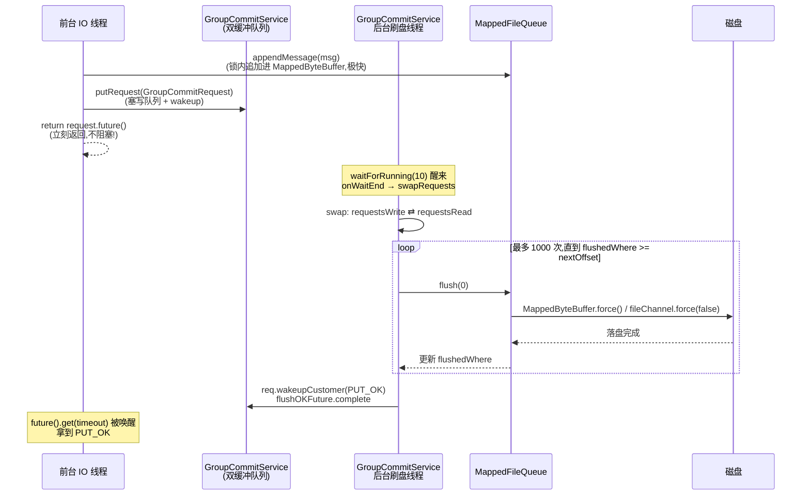

# 第四章 · 刷盘策略:同步刷盘 vs 异步刷盘

> 篇:第 1 篇 · 存储内核之写入
> 主线呼应:上一章(P1-03)讲完了一条消息怎么在 `putMessageLock` 锁内串行追加进 CommitLog 的 `MappedFile`。可"追加进 MappedFile"离"真正落盘"还差临门一脚——`MappedByteBuffer` 写的字,其实只是写进了内核的**页缓存(page cache)**,掉电会丢。这一章讲的就是这临门一脚:**怎么把页缓存里的数据真正 `force` 进磁盘**。RocketMQ 在这里又一次玩出了"前台快、脏活甩后台"的花样——同步刷盘靠 `GroupCommitService` 用等待队列把"等落盘"变成异步 Future、异步刷盘靠 `FlushRealTimeService` 定时 force;还顺手把"堆外→页缓存"和"页缓存→磁盘"拆成 commit / flush 两步,配合堆外内存池 `TransientStorePool` 把高并发下的页缓存锁竞争避开。这一章守的是全书二分法里"**一致性**"那一面——守住"不丢"。

## 核心问题

**写到 `MappedByteBuffer` 只算写进了页缓存,掉电会丢;RocketMQ 怎么把消息真正落盘,又怎么在"落盘"和"前台吞吐"之间取舍?同步刷盘凭什么不阻塞前台 IO 线程、异步刷盘凭什么不丢太多?为什么还要把落盘拆成 commit 与 flush 两步?**

读完本章你会明白:

1. 为什么写进 mmap 的 `MappedByteBuffer` 还不算落盘(只是页缓存),`MappedByteBuffer.force()` 才是真落盘,而 force 是个**慢且会阻塞**的系统调用。
2. 同步刷盘(`FlushDiskType.SYNC_FLUSH`)怎么靠 `GroupCommitService` + `GroupCommitRequest` 的**等待队列 + Future**,把"前台不等 force、又能确认落盘"这对矛盾解开;以及它为什么用**双缓冲 swap** 而不是一把大锁。
3. 异步刷盘(`ASYNC_FLUSH`)的 `FlushRealTimeService` 怎么定时 force、用 `leastPages` 攒批减少 force 次数、用 `thoroughInterval` 兜底防止"攒不够页就永远不刷"。
4. 为什么 RocketMQ 区分 **commit(堆外→页缓存)** 与 **flush(页缓存→磁盘)** 两步——这是 `TransientStorePool` 堆外内存池模式下的关键,它把写的热路径从"竞争页缓存锁"挪到"写堆外 DirectByteBuffer",换来的代价就是必须多一步 commit。
5. `FlushManager` 接口怎么把"同步还是异步"这个策略选择收敛成一个可替换的实现(`DefaultFlushManager`),让写路径主体与刷盘策略解耦。

> **如果一读觉得太难**:先只记住三件事——① 写进 MappedByteBuffer 只是页缓存,force 才落盘;② 同步刷盘 = 前台塞个"等落盘的 Future"进队列、后台线程 force 完唤醒,前台 IO 线程不亲自 force;③ 异步刷盘 = 后台线程定时 force,前台写完即返回、不保证落盘。commit/flush 两步是堆外内存池的配套,可以先放。

---

## 4.1 一句话点破

> **写进 `MappedByteBuffer` 只是把字节写进了内核页缓存,掉电会丢;真正落盘要调 `MappedByteBuffer.force()`(或 `FileChannel.force(false)`),这是个会把调用线程阻塞住、等磁盘 IO 完成的慢系统调用。RocketMQ 的核心抉择是:**绝不让前台写消息的 IO 线程亲自去 force**——同步刷盘时,前台把"等这条消息落盘"包成一个 `GroupCommitRequest`(带 offset 和一个 `CompletableFuture`),塞进 `GroupCommitService` 的等待队列,后台刷盘线程 force 完逐个唤醒;异步刷盘时,前台连队列都不塞,写完页缓存就返回,后台 `FlushRealTimeService` 定时 force。**这样一来,前台写路径永远只做"往 MappedByteBuffer 追加"这件快事,慢的 force 系统调用全部甩给后台线程,前台吞吐不被磁盘拖垮。**

这是结论,不是理由。本章倒过来拆:先看为什么"写进 MappedByteBuffer 不算落盘",再看朴素地"前台自己 force"会撞什么墙,最后看 `GroupCommitService` 的等待队列怎么解这个结,以及 commit/flush 两步的来由。

---

## 4.2 写进 MappedByteBuffer 为什么还不算落盘

上一章(P1-03)讲到,一条消息在 `putMessageLock` 锁内被 `mappedFile.appendMessage` 追加进了 `MappedFile`。这个 `MappedFile` 底层是一个 `MappedByteBuffer`——也就是 Java 对 `mmap` 系统调用的封装:它把磁盘文件**映射**进进程的虚拟地址空间,于是你对这个 `ByteBuffer` 的 `put`,直接就是往那段虚拟地址写,内核负责把脏页择时写回磁盘。

听起来很美,但这里有一个**致命的错觉**:`put` 完返回了,数据并不在磁盘上,甚至**不一定在页缓存里**(虽然 `MappedByteBuffer` 的写通常进页缓存,但何时从页缓存刷到磁盘,完全由内核的 pdflush/writeback 线程决定,可能是几秒后,也可能机器在此期间就掉电了)。

```
  你的写                                  真正的磁盘
   │                                          ▲
   ▼                                          │ force() / fsync()
 MappedByteBuffer.put()  ──→  内核页缓存(脏页) ──┘
 (用户态,极快)                (内存,掉电会丢!)    (慢系统调用,等 IO)
```

> **不这样会怎样**:假设你"写完 MappedByteBuffer 就告诉 producer 成功",然后机器掉电。页缓存里那些还没被内核 writeback 的脏页,全没了。对一个消息中间件来说,这意味着 producer 以为"消息已经存下来了"、消费者却再也拉不到——这是不可接受的数据丢失。所以"落盘"必须是一个**显式的、可确认的动作**,而不是依赖内核的写回时机。

真正把页缓存里的脏页**强制写回磁盘**的动作,在 Linux 是 `msync`/`fsync`,在 Java 里对应 `MappedByteBuffer.force()`(底层走 `msync`)或 `FileChannel.force(false)`(底层走 `fsync`)。这一调,当前线程就会被阻塞,直到磁盘 IO 完成、确认写回——这是一个**毫秒级的慢操作**,远比"往内存里 put 一下"慢几个数量级。

这就是本章的全部矛盾的根源:

- **要"不丢"**,就必须 force,且最好能确认 force 完了再告诉 producer 成功。
- **要"快"**,就绝不能在写消息的热路径上 force——它会一把拖垮前台吞吐。

RocketMQ 用 `FlushDiskType` 这个枚举给出两种取舍([store/.../config/FlushDiskType.java](../rocketmq/store/src/main/java/org/apache/rocketmq/store/config/FlushDiskType.java)):

```java
public enum FlushDiskType {
    SYNC_FLUSH,    // 同步刷盘:这条消息落盘了,才告诉 producer 成功
    ASYNC_FLUSH    // 异步刷盘:写进页缓存就告诉 producer 成功,落盘交给后台
}
```

只有两个值,干净利落。默认是 `ASYNC_FLUSH`(下文讲为什么默认是它)。

> **钉死这件事**:`MappedByteBuffer.put()` 只是写页缓存,`MappedByteBuffer.force()` 才是真落盘。前者纳秒级,后者毫秒级且阻塞。整个刷盘策略的设计,本质上都是在回答一个问题:**这个慢的 force,该在哪个线程上做、什么时候做、做完了要不要通知前台**。

---

## 4.3 朴素方案的墙:让前台 IO 线程自己 force

我们先看一个最朴素的"同步刷盘"实现会怎样——**让前台写消息的 IO 线程,在把消息追加进 MappedFile 之后,自己顺手 force 一下**。伪代码:

```java
// (朴素方案,非源码原文,只为说明问题)
mappedFile.appendMessage(msg);          // 追加进 MappedByteBuffer(快,纳秒级)
mappedFile.force();                      // 前台自己 force(慢,毫秒级,阻塞!)
return success;                          // 告诉 producer 成功
```

看起来简单直接,而且确实保证了"落盘才返回成功"。但它有三个致命问题:

1. **前台吞吐被磁盘拖垮**。前台 IO 线程(在 RocketMQ 里就是处理 `SEND_MESSAGE` 请求的业务线程)本来是高吞吐的——它一秒要处理成千上万条消息。现在每条消息都要 force 一次,而一次 force 是毫秒级——前台线程被磁盘 IO 阻塞,一秒只能 force 几百次,吞吐直接掉两个数量级。
2. **force 成了串行瓶颈,且无法攒批**。`force` 的开销绝大部分是固定的(等磁盘 IO 完成),刷 1 条和刷 100 条的耗时几乎一样。前台每条消息都 force,等于把本可以攒一批一起 force 的活,拆成了 N 次固定开销的 force——磁盘带宽被白白浪费。
3. **阻塞了 `CompletableFuture` 全链路异步**。RocketMQ 5.x 的写路径是全链路异步的(从 `SendMessageProcessor` 到 `asyncPutMessage`,全程返回 `CompletableFuture`,不阻塞 Netty 业务线程)。前台一旦自己 force,这条异步链就被一次同步阻塞的 IO 打断了。

> **不这样会怎样**:朴素方案下,RocketMQ 在同步刷盘模式的写入吞吐,会和"每条消息一次 fsync"一样惨——单机每秒几百到一两千条,这对一个号称"海量消息"的中间件是不可接受的。**force 必须从前台拿走。**

那把 force 拿到哪个线程上去做?RocketMQ 的答案是:**一个专门的后台刷盘线程**。前台只管"把消息追加进 MappedFile"这件快事,force 全部甩给后台。问题是——同步刷盘模式下,前台怎么"等到这条消息真的被后台 force 完了"再返回成功?这就引出了 `GroupCommitService` 的等待队列。

---

## 4.4 FlushManager:把刷盘策略做成一个可替换的实现

在讲后台刷盘线程之前,先看 RocketMQ 怎么把"同步还是异步"这个策略选择**封装**起来。`CommitLog` 持有一个 `FlushManager` 字段([CommitLog.java:90](../rocketmq/store/src/main/java/org/apache/rocketmq/store/CommitLog.java#L90)):

```java
public class CommitLog implements Swappable {
    // ...
    private final FlushManager flushManager;       // CommitLog.java:90
```

构造函数里实例化它([CommitLog.java:131](../rocketmq/store/src/main/java/org/apache/rocketmq/store/CommitLog.java#L131)):

```java
this.flushManager = new DefaultFlushManager();     // CommitLog.java:131
```

`FlushManager` 本身是一个**接口**([store/.../FlushManager.java:23](../rocketmq/store/src/main/java/org/apache/rocketmq/store/FlushManager.java#L23)):

```java
public interface FlushManager {
    void start();
    void shutdown();
    void wakeUpFlush();
    void wakeUpCommit();
    CompletableFuture<PutMessageStatus> handleDiskFlush(AppendMessageResult result, MessageExt messageExt);
    // ...(还有一个同步阻塞版本的重载,见 4.6)
}
```

真正的实现在 `CommitLog` 的内部类 `DefaultFlushManager`([CommitLog.java:2184](../rocketmq/store/src/main/java/org/apache/rocketmq/store/CommitLog.java#L2184))。它的核心价值是:**把"刷盘策略"这件事,从 CommitLog 的写路径主体里剥离出来**。写路径主体(`asyncPutMessage`)只负责"锁内追加",追加完之后调一句 `flushManager.handleDiskFlush(...)`,具体怎么刷——同步等待还是异步不管——完全由 `FlushManager` 的实现决定。

这就是为什么 `FlushManager` 是个接口:将来如果有别的刷盘策略(比如对接 SSD 的特定优化、或者 5.x 的某些变种),只要换一个实现,写路径主体一行不用改。这是策略模式在源码里的直接体现。

> **钉死这件事**:`FlushManager` 是接口,`DefaultFlushManager` 是它唯一的实现(且是 CommitLog 的内部类)。CommitLog 持有 `flushManager` 字段(CommitLog.java:90),构造时实例化(CommitLog.java:131)。写路径主体通过它调用刷盘,策略选择被封装在内。记住这个事实:总纲里说"CommitLog 持有 FlushManager"是对的,但 `FlushManager` 是接口不是类、真身在 `DefaultFlushManager`,行号在 2184 不是 90(90 是字段声明)。

`asyncPutMessage` 在锁内追加完后,最后一行就把"刷盘 + 主从复制"交给 `handleDiskFlushAndHA`([CommitLog.java:1139](../rocketmq/store/src/main/java/org/apache/rocketmq/store/CommitLog.java#L1139)):

```java
// CommitLog.asyncPutMessage 末尾
return handleDiskFlushAndHA(putMessageResult, msg, needAckNums, needHandleHA);   // :1139
```

`handleDiskFlushAndHA`([CommitLog.java:1330](../rocketmq/store/src/main/java/org/apache/rocketmq/store/CommitLog.java#L1330))用 `CompletableFuture.thenCombine` 把"刷盘的 Future"和"复制的 Future"合起来:

```java
private CompletableFuture<PutMessageResult> handleDiskFlushAndHA(PutMessageResult putMessageResult,
    MessageExt messageExt, int needAckNums, boolean needHandleHA) {
    CompletableFuture<PutMessageStatus> flushResultFuture =
        handleDiskFlush(putMessageResult.getAppendMessageResult(), messageExt);   // :1332 刷盘
    CompletableFuture<PutMessageStatus> replicaResultFuture;
    if (!needHandleHA) {
        replicaResultFuture = CompletableFuture.completedFuture(PutMessageStatus.PUT_OK);
    } else {
        replicaResultFuture = handleHA(...);                                       // :1337 复制(第 17 章 P6-17 讲)
    }
    return flushResultFuture.thenCombine(replicaResultFuture, (flushStatus, replicaStatus) -> {
        if (flushStatus != PutMessageStatus.PUT_OK) {
            putMessageResult.setPutMessageStatus(flushStatus);                     // 刷盘失败,整体标失败
        }
        if (replicaStatus != PutMessageStatus.PUT_OK) {
            putMessageResult.setPutMessageStatus(replicaStatus);                   // 复制失败,整体标失败
        }
        return putMessageResult;
    });
}
```

刷盘这条支线,最终走到 `handleDiskFlush`([CommitLog.java:1351](../rocketmq/store/src/main/java/org/apache/rocketmq/store/CommitLog.java#L1351)),它一行转给 `flushManager`:

```java
private CompletableFuture<PutMessageStatus> handleDiskFlush(AppendMessageResult result, MessageExt messageExt) {
    return this.flushManager.handleDiskFlush(result, messageExt);                 // :1352
}
```

接下来所有的精彩,都在 `DefaultFlushManager.handleDiskFlush` 内部。

---

## 4.5 同步刷盘:GroupCommitService 的等待队列

### 4.5.1 把"等落盘"包成一个对象

现在焦点来了:同步刷盘下,前台怎么"不自己 force、又能等到这条消息落盘"?

答案的第一步,是定义一个**代表"等落盘"的对象**——`GroupCommitRequest`。它是 `CommitLog` 的一个**静态内部类**([CommitLog.java:1634](../rocketmq/store/src/main/java/org/apache/rocketmq/store/CommitLog.java#L1634)):

```java
public static class GroupCommitRequest {
    private final long nextOffset;                                                       // :1635 等到 flushedWhere >= nextOffset
    // Indicate the GroupCommitRequest result: true or false
    private final CompletableFuture<PutMessageStatus> flushOKFuture = new CompletableFuture<>();  // :1637 关键:一个 Future,不是 CountDownLatch
    private volatile int ackNums = 1;                                                    // :1638 给主从复制用,这里不用
    private final long deadLine;                                                         // :1639 超时点(nanoTime)

    public GroupCommitRequest(long nextOffset, long timeoutMillis) {
        this.nextOffset = nextOffset;
        this.deadLine = System.nanoTime() + (timeoutMillis * 1_000_000);
    }
    // ...
    public void wakeupCustomer(final PutMessageStatus status) {
        this.flushOKFuture.complete(status);                                             // :1664 落盘完成(或超时),complete 这个 Future
    }
    public CompletableFuture<PutMessageStatus> future() {
        return flushOKFuture;                                                            // :1668 前台拿这个 Future 去 .get(timeout)
    }
}
```

> **钉死这件事(修正总纲)**:总纲和目录里多处写"GroupCommitService 用 CountDownLatch"。**这是错的**。真实的 `GroupCommitRequest` 用的是一个 `CompletableFuture<PutMessageStatus> flushOKFuture`(CommitLog.java:1637),靠 `complete(status)` 唤醒、前台 `future().get(timeout)` 等待。`CompletableFuture` 比 `CountDownLatch` 更合适,因为它**带返回值**(刷盘成功还是 `FLUSH_DISK_TIMEOUT`),而 `CountDownLatch` 只能表达"数到了"。这是写作时 Grep 源码修正总纲的一处关键。

这个对象的语义清晰得不能再清晰:**"我已经把消息追加到了 CommitLog 的 `wroteOffset + wroteBytes` 这个位置,请你(后台刷盘线程)force 到 `flushedWhere >= nextOffset` 之后,complete 我的 Future"**。前台拿到这个 Future,要么 `.get(timeout)` 阻塞等,要么挂到 `CompletableFuture` 链上异步等。

### 4.5.2 前台:塞请求进队列,拿 Future 等待

现在看 `DefaultFlushManager.handleDiskFlush` 在同步刷盘下怎么走([CommitLog.java:2249](../rocketmq/store/src/main/java/org/apache/rocketmq/store/CommitLog.java#L2249)):

```java
@Override
public CompletableFuture<PutMessageStatus> handleDiskFlush(AppendMessageResult result, MessageExt messageExt) {
    // Synchronization flush
    if (FlushDiskType.SYNC_FLUSH == CommitLog.this.defaultMessageStore.getMessageStoreConfig().getFlushDiskType()) {
        final GroupCommitService service = (GroupCommitService) this.flushCommitLogService;
        if (messageExt.isWaitStoreMsgOK()) {                                          // :2253 这条消息要求等待落盘
            GroupCommitRequest request = new GroupCommitRequest(
                result.getWroteOffset() + result.getWroteBytes(),                     // :2254 nextOffset = 写到哪了
                CommitLog.this.defaultMessageStore.getMessageStoreConfig().getSyncFlushTimeout());
            flushDiskWatcher.add(request);                                             // :2255 注册到超时监控
            service.putRequest(request);                                               // :2256 塞进 GroupCommitService 的等待队列
            return request.future();                                                   // :2257 返回 Future,前台异步等
        } else {
            service.wakeup();                                                          // :2259 这条消息不要求等,只唤醒刷盘线程
            return CompletableFuture.completedFuture(PutMessageStatus.PUT_OK);
        }
    }
    // Asynchronous flush(下一节讲)
    // ...
}
```

关键就三步:

1. **构造 request**:用消息的 `wroteOffset + wroteBytes` 算出 `nextOffset`——这是"刷到哪才算我这条落盘了"的依据。
2. **塞队列**:`service.putRequest(request)` 把这个"等落盘"的请求交给后台刷盘线程。
3. **返回 Future**:前台拿 `request.future()` 这个 `CompletableFuture` 返回,接入全链路异步链。**前台 IO 线程在这里一行都没阻塞——它立刻就返回了**,继续处理下一条消息。

> **所以这样设计**:前台 IO 线程把"等落盘"这件事**外包**给了后台刷盘线程。前台只做两件快事——追加进 MappedFile、塞一个 request 进队列——然后立刻返回 Future。慢的 force 完全在后台线程上发生,前台吞吐不被磁盘拖累。这正是"前台快、脏活甩后台"在刷盘策略上的直接体现,和 Reput 把"建索引"甩给后台(第 5 章)是同一种哲学。

### 4.5.3 后台:GroupCommitService 怎么 force 怎么唤醒

现在轮到后台刷盘线程 `GroupCommitService` 登场。它是 `CommitLog` 的内部类([CommitLog.java:1675](../rocketmq/store/src/main/java/org/apache/rocketmq/store/CommitLog.java#L1675)):

```java
class GroupCommitService extends FlushCommitLogService {
    private LinkedList<GroupCommitRequest> requestsWrite = new LinkedList<>();         // :1676 写队列:前台往这里塞
    private LinkedList<GroupCommitRequest> requestsRead = new LinkedList<>();          // :1677 读队列:后台从这里刷
    private final PutMessageSpinLock lock = new PutMessageSpinLock();                  // :1678 保护 swap 的自旋锁

    public void putRequest(final GroupCommitRequest request) {
        lock.lock();
        try {
            this.requestsWrite.add(request);                                           // :1683 前台往写队列塞
        } finally {
            lock.unlock();
        }
        this.wakeup();                                                                 // :1687 唤醒可能在等待的后台线程
    }
    // ...
}
```

它的核心是一个**双缓冲(double buffer)**结构:`requestsWrite`(前台往这塞)和 `requestsRead`(后台从这刷)是两个独立的链表。两者通过 `swapRequests` 交换([CommitLog.java:1690](../rocketmq/store/src/main/java/org/apache/rocketmq/store/CommitLog.java#L1690)):

```java
private void swapRequests() {
    lock.lock();
    try {
        LinkedList<GroupCommitRequest> tmp = this.requestsWrite;
        this.requestsWrite = this.requestsRead;
        this.requestsRead = tmp;                                                       // :1695 交换两个链表的引用
    } finally {
        lock.unlock();
    }
}
```

而后台线程的 `run` 方法([CommitLog.java:1738](../rocketmq/store/src/main/java/org/apache/rocketmq/store/CommitLog.java#L1738))是个标准的 `ServiceThread` 循环:

```java
@Override
public void run() {
    CommitLog.log.info("{} service started", this.getServiceName());
    while (!this.isStopped()) {
        try {
            this.waitForRunning(10);        // :1743 等 10ms 或被 wakeup,醒来时 onWaitEnd → swapRequests
            this.doCommit();                // :1744 处理 requestsRead 里所有请求
        } catch (Exception e) {
            CommitLog.log.warn("{} service has exception. ", this.getServiceName(), e);
        }
    }
    // ... shutdown 时再 swap + doCommit 兜底 ...
}
```

`waitForRunning(10)` 是 `ServiceThread` 的方法([common/.../ServiceThread.java:109](../rocketmq/common/src/main/java/org/apache/rocketmq/common/ServiceThread.java#L109)):它要么被 `wakeup()`(前台 `putRequest` 时调)唤醒,要么 10ms 超时自己醒。醒来时回调 `onWaitEnd`,而 `GroupCommitService` 重写了它([CommitLog.java:1764](../rocketmq/store/src/main/java/org/apache/rocketmq/store/CommitLog.java#L1764)):

```java
@Override
protected void onWaitEnd() {
    this.swapRequests();                  // :1766 醒来第一件事:把写队列翻到读队列
}
```

这个顺序很关键:**先 swap,再 doCommit**。也就是说,后台线程处理的是"swap 之前那一拨"请求,而 swap 之后新来的请求(前台还在不停往新 `requestsWrite` 塞)要等下一轮。这保证后台在 force 时,前台往写队列塞请求**完全不阻塞**——因为它们操作的是两个不同的链表,只在 swap 那一瞬间短暂抢一下 `PutMessageSpinLock`。

真正干活的是 `doCommit`([CommitLog.java:1701](../rocketmq/store/src/main/java/org/apache/rocketmq/store/CommitLog.java#L1701)):

```java
private void doCommit() {
    if (!this.requestsRead.isEmpty()) {
        for (GroupCommitRequest req : this.requestsRead) {
            boolean flushOK = CommitLog.this.mappedFileQueue.getFlushedWhere() >= req.getNextOffset();   // :1704 已经刷够了?
            for (int i = 0; i < 1000 && !flushOK; i++) {                                                  // :1705 没刷够,最多重试 1000 次
                CommitLog.this.mappedFileQueue.flush(0);                                                  // :1706 force 一下(flushLeastPages=0,全刷)
                flushOK = CommitLog.this.mappedFileQueue.getFlushedWhere() >= req.getNextOffset();       // :1707 再看刷够了没
                if (flushOK) {
                    break;                                                                                 // :1708 够了,本条完成
                } else {
                    // When transientStorePoolEnable is true, the messages in writeBuffer may not be committed
                    // to pageCache very quickly, and flushOk here may almost be false, so we can sleep 1ms to
                    // wait for the messages to be committed to pageCache.
                    try {
                        Thread.sleep(1);                                                                   // :1715 等堆外 commit 进页缓存
                    } catch (InterruptedException ignored) {
                    }
                }
            }
            req.wakeupCustomer(flushOK ? PutMessageStatus.PUT_OK : PutMessageStatus.FLUSH_DISK_TIMEOUT); // :1721 唤醒前台!
        }
        // ... 更新 storeCheckpoint ...
        this.requestsRead = new LinkedList<>();                                                            // :1729 清空读队列
    } else {
        // 没有同步刷盘请求时,也顺手刷一下(给异步刷盘兜底)
        CommitLog.this.mappedFileQueue.flush(0);                                                          // :1733
    }
}
```

这里有四个关键点要拆透:

1. **`mappedFileQueue.flush(0)` 才是真正调 force 的地方**(下节看它怎么 force)。`flushLeastPages=0` 意味着"不管攒了几页,全刷"——同步刷盘要的就是"这条落盘",不能攒批。
2. **`getFlushedWhere() >= req.getNextOffset()` 是"刷够了"的判定**。`flushedWhere` 是"CommitLog 已经刷到哪个物理 offset"的全局指针(由 `MappedFileQueue` 维护),它是个**单调递增**的量。后台 force 完,`flushedWhere` 往前推,只要它追上了 `req.nextOffset`,就意味着"我这条消息(以及在我之前的所有消息)都落盘了"——于是可以唤醒前台。
3. **最多重试 1000 次、每次 sleep 1ms**(:1705/:1715)。这是给堆外内存池模式留的缓冲:堆外 writeBuffer 里的数据可能还没被 commit 进页缓存,这时候 force 也刷不到它们,所以睡 1ms 等 commit 跟上。1000 次重试到了还没刷够,就判 `FLUSH_DISK_TIMEOUT`(刷盘超时)。
4. **`req.wakeupCustomer(...)` 调 `flushOKFuture.complete(status)`**(:1721 → :1664)。这一 complete,前台那个 `request.future().get(timeout)`(或者挂在 `CompletableFuture` 链上的回调)立刻被唤醒——要么拿到 `PUT_OK`(成功落盘),要么拿到 `FLUSH_DISK_TIMEOUT`(超时没刷上)。

把前台和后台串起来,一次同步刷盘的完整时序长这样:



> **钉死这件事**:同步刷盘的精髓是"**前台塞 Future 进队列、后台 force 完 complete Future**"。前台 IO 线程从追加 MappedFile 到塞 request 进队列、返回 Future,全程没有任何阻塞的磁盘 IO——慢的 force 全在后台线程上发生。前台吞吐和异步刷盘几乎一样高(区别只是前台多塞了个 request),而"等落盘"这件事,通过 Future 在时间上被推迟到了 force 真正完成之后。这就是 `GroupCommitService` 解决"同步又不阻塞前台"的核心技巧。双缓冲 swap 则是让"前台塞队列"和"后台读队列"几乎不抢锁——两者操作不同链表,只在 swap 瞬间短暂同步。

### 4.5.4 默认值与取舍:为什么默认是 ASYNC_FLUSH

讲到这里读者会问:同步刷盘这么好(不丢又快),为什么默认是 `ASYNC_FLUSH`?

答案在 `MessageStoreConfig` 的默认值([store/.../config/MessageStoreConfig.java:247](../rocketmq/store/src/main/java/org/apache/rocketmq/store/config/MessageStoreConfig.java#L247)):

```java
private FlushDiskType flushDiskType = FlushDiskType.ASYNC_FLUSH;   // :247 默认异步刷盘
private int syncFlushTimeout = 1000 * 5;                           // :249 同步刷盘超时 5s
```

这背后是一个**可靠性 vs 性能**的取舍,而且要和"主从复制"放在一起看才完整(第 17 章 P6-17 详讲):

- **真正的"不丢"靠副本,不靠单机刷盘**。机器整机着火烧掉,你单机刷盘刷得再勤也没用——磁盘也烧了。RocketMQ 的"不丢"主防线是**主从复制**(把消息复制到另一台机器的磁盘上)。所以生产环境典型配置是 **`ASYNC_FLUSH` + 主从同步复制(`SYNC_MASTER`)**——单机用异步刷盘换吞吐,跨机用同步复制换不丢。
- **单机同步刷盘**(`SYNC_FLUSH`)用于"没有副本、又要求不丢"的场景,比如单节点部署、或者对每条消息都要求落盘的金融场景。它的代价是写吞吐明显低于异步(虽然 GroupCommitService 已经把前台解放了,但 force 毕竟慢,后台线程成了新的吞吐上限)。

这个取舍在第 17 章(P6-17 主从复制)和第 24 章(P9-24 权衡哲学)会再回扣。本章只要记住:**默认 `ASYNC_FLUSH`,是因为"不丢"这件事 RocketMQ 更倾向于交给副本去做**。

---

## 4.6 异步刷盘:FlushRealTimeService 定时 force

看懂了同步刷盘,异步刷盘就简单了——**前台连队列都不塞,写完页缓存就返回;后台一个定时线程周期性 force**。

异步刷盘下,`DefaultFlushManager` 构造的 `flushCommitLogService` 是 `FlushRealTimeService` 而不是 `GroupCommitService`([CommitLog.java:2191](../rocketmq/store/src/main/java/org/apache/rocketmq/store/CommitLog.java#L2191)):

```java
public DefaultFlushManager() {
    if (FlushDiskType.SYNC_FLUSH == CommitLog.this.defaultMessageStore.getMessageStoreConfig().getFlushDiskType()) {
        this.flushCommitLogService = new CommitLog.GroupCommitService();          // :2193 同步
    } else {
        this.flushCommitLogService = new CommitLog.FlushRealTimeService();        // :2195 异步
    }
    this.commitRealTimeService = new CommitLog.CommitRealTimeService();           // :2198 堆外模式的 commit 线程(下节讲)
}
```

而异步刷盘下,`handleDiskFlush` 干的事也简单([CommitLog.java:2263](../rocketmq/store/src/main/java/org/apache/rocketmq/store/CommitLog.java#L2263)):

```java
// Asynchronous flush
else {
    if (!CommitLog.this.defaultMessageStore.isTransientStorePoolEnable()) {
        if (defaultMessageStore.getMessageStoreConfig().isWakeFlushWhenPutMessage()) {
            flushCommitLogService.wakeup();            // :2267 可选:每条消息都唤醒刷盘(默认 false)
        }
    } else {
        if (defaultMessageStore.getMessageStoreConfig().isWakeCommitWhenPutMessage()) {
            commitRealTimeService.wakeup();            // :2271 堆外模式:唤醒的是 commit 线程
        }
    }
    return CompletableFuture.completedFuture(PutMessageStatus.PUT_OK);   // :2274 直接返回成功,不等落盘
}
```

注意最后一行:`return CompletableFuture.completedFuture(PutMessageStatus.PUT_OK)`——**立刻返回成功,根本不等落盘**。前台写完页缓存就告诉 producer"成功",至于真什么时候落盘,那是后台线程的事。这就是异步刷盘"快"的来源:前台完全没有等磁盘的环节。

真正干活的是 `FlushRealTimeService`([CommitLog.java:1548](../rocketmq/store/src/main/java/org/apache/rocketmq/store/CommitLog.java#L1548)):

```java
class FlushRealTimeService extends FlushCommitLogService {
    private long lastFlushTimestamp = 0;
    private long printTimes = 0;

    @Override
    public void run() {
        CommitLog.log.info("{} service started", this.getServiceName());
        while (!this.isStopped()) {
            boolean flushCommitLogTimed = CommitLog.this.defaultMessageStore
                .getMessageStoreConfig().isFlushCommitLogTimed();                              // :1557 默认 true:用 Thread.sleep
            int interval = CommitLog.this.defaultMessageStore
                .getMessageStoreConfig().getFlushIntervalCommitLog();                          // :1559 默认 500ms
            int flushPhysicQueueLeastPages = CommitLog.this.defaultMessageStore
                .getMessageStoreConfig().getFlushCommitLogLeastPages();                        // :1560 默认 4 页
            int flushPhysicQueueThoroughInterval = CommitLog.this.defaultMessageStore
                .getMessageStoreConfig().getFlushCommitLogThoroughInterval();                  // :1563 默认 10s

            // Print flush progress
            long currentTimeMillis = System.currentTimeMillis();
            if (currentTimeMillis >= (this.lastFlushTimestamp + flushPhysicQueueThoroughInterval)) {   // :1569 超过彻底间隔
                this.lastFlushTimestamp = currentTimeMillis;
                flushPhysicQueueLeastPages = 0;                                                // :1571 攒页要求清零,强制刷
                printFlushProgress = (printTimes++ % 10) == 0;
            }

            try {
                if (flushCommitLogTimed) {
                    Thread.sleep(interval);                                                    // :1577 默认 sleep 500ms
                } else {
                    this.waitForRunning(interval);                                             // :1579 也可用 wakeup 提前唤醒
                }
                // ...
                long begin = System.currentTimeMillis();
                CommitLog.this.mappedFileQueue.flush(flushPhysicQueueLeastPages);              // :1587 真正 force
                // ... 更新 storeCheckpoint、统计耗时 ...
            } catch (Throwable e) {
                // ...
            }
        }
        // ... shutdown 时多 force 几次兜底 ...
    }
}
```

异步刷盘有三个攒批/兜底机制,直接对应三个配置项:

1. **`flushIntervalCommitLog`(默认 500ms):刷盘间隔**。后台线程每 500ms 醒来 force 一次。这就是"异步"的含义——消息最多在页缓存里待 500ms(加上 force 耗时)才落盘,这期间掉电会丢。`flushCommitLogTimed=true`(默认)时用 `Thread.sleep`,等于"雷打不动每 500ms 刷一次";设成 false 则用 `waitForRunning`,可以被 `wakeUpFlush` 提前唤醒(配合 `wakeFlushWhenPutMessage=true`,每条消息都唤醒——但默认 false,所以默认就是定时 500ms)。
2. **`flushCommitLogLeastPages`(默认 4 页):攒够多少页才刷**。这是**攒批减少 force 次数**的关键——4 页(每页 4KB,即 16KB)以下不刷,攒够了再刷。因为 force 的开销基本固定(等磁盘 IO),刷 16KB 和刷 1KB 耗时几乎一样,所以攒批能显著减少 force 次数、提升有效吞吐。
3. **`flushCommitLogThoroughInterval`(默认 10s):彻底刷盘间隔**。这是防止"攒不够页就永远不刷"的**兜底**——如果消息很稀疏,迟迟攒不够 4 页,那么至少每 10s 强制刷一次(`flushPhysicQueueLeastPages = 0`,即不管几页都刷)。这保证了即使流量很小,消息在页缓存里最多待 10s 必落盘。

> **钉死这件事**:异步刷盘 = 前台写完即返回成功 + 后台每 500ms force 一次(攒够 4 页、最多拖 10s)。前台吞吐和"不刷盘"几乎一样高(因为前台根本不碰磁盘),代价是"掉电最多丢最近 500ms~10s 的消息"。这个代价在"有副本"的生产配置下是可以接受的——因为单机丢了,副本上还有。三个配置(间隔/最少页数/彻底间隔)联手把"force 次数尽量少"和"消息别在页缓存待太久"这两个矛盾平衡好。

同步刷盘和异步刷盘的对比收在一张表里:

| | 同步刷盘 `SYNC_FLUSH` | 异步刷盘 `ASYNC_FLUSH` |
|------|------|------|
| 前台行为 | 塞 `GroupCommitRequest` 进队列,返回 Future | 写完页缓存直接返回成功 |
| 后台线程 | `GroupCommitService`(等待队列 + force + 唤醒) | `FlushRealTimeService`(定时 force) |
| force 频率 | 有同步请求就 force(`flushLeastPages=0`,不攒批) | 每 500ms force 一次(攒 4 页、最多拖 10s) |
| 前台 IO 线程阻塞 | 不阻塞(靠 Future 异步等) | 不阻塞 |
| 不丢保证 | 单机掉电不丢(这条落盘了才返回成功) | 单机掉电最多丢最近 500ms~10s |
| 典型场景 | 无副本 + 要求不丢(金融) | 有副本 + 换吞吐(默认) |

注意两栏的"前台 IO 线程阻塞"都是**不阻塞**——这正是 `GroupCommitService` 等待队列的功劳。同步刷盘的"慢",只体现在后台 force 线程成了吞吐上限、以及前台 Future 最终等到的延迟变长,而不是前台被 force 卡住。

---

## 4.7 commit 与 flush 两步:堆外内存池 TransientStorePool 的配套

到这里,刷盘的主线已经讲完了。但如果你回头看 `DefaultMappedFile.flush` 的源码,会发现一个看似多余的分支([DefaultMappedFile.java:526](../rocketmq/store/src/main/java/org/apache/rocketmq/store/logfile/DefaultMappedFile.java#L526)):

```java
@Override
public int flush(final int flushLeastPages) {
    if (!isWriteable()) {
        return this.getFlushedPosition();
    }
    if (this.isAbleToFlush(flushLeastPages)) {
        if (this.hold()) {
            int value = getReadPosition();
            try {
                this.mappedByteBufferAccessCountSinceLastSwap++;
                //We only append data to fileChannel or mappedByteBuffer, never both.
                if (writeWithoutMmap || writeBuffer != null || this.fileChannel.position() != 0) {
                    this.fileChannel.force(false);                  // :539 走 FileChannel.force
                } else {
                    this.mappedByteBuffer.force();                  // :541 走 MappedByteBuffer.force
                }
                this.lastFlushTime = System.currentTimeMillis();
                FLUSHED_POSITION_UPDATER.set(this, value);
            } catch (Throwable e) {
                // ...
            }
            this.release();
        }
        // ...
    }
    return this.getFlushedPosition();
}
```

注释那行点破了一切:`//We only append data to fileChannel or mappedByteBuffer, never both.`(**我们永远只往 FileChannel 或 mappedByteBuffer 其中之一写数据,不会两个都写**)。

这暗示了一个关键事实:**写消息的热路径,有两种完全不同的内存位置可选**——

1. **默认模式**(`transientStorePoolEnable=false`,默认):直接写 `MappedByteBuffer`(即写 mmap 映射的页缓存)。这时 `writeBuffer == null`,`flush` 走 `mappedByteBuffer.force()`(:541)。
2. **堆外内存池模式**(`transientStorePoolEnable=true`):先写一块堆外的 `DirectByteBuffer`(`writeBuffer`),后台再把它 `commit` 进 `FileChannel`(等价于进页缓存),最后 `flush` 走 `fileChannel.force(false)`(:539)。

这两种模式下,落盘的"路径"是不同的:

```
默认模式(写 MappedByteBuffer):
  你的写 ──→ MappedByteBuffer(=页缓存) ──force──→ 磁盘
                                       (一步,force 即落盘)

堆外内存池模式(写 writeBuffer):
  你的写 ──→ writeBuffer(堆外 DirectByteBuffer)
                       │ commit(写进 FileChannel = 进页缓存)
                       ▼
                   FileChannel(=页缓存) ──force──→ 磁盘
                                        (两步:先 commit 再 flush)
```

为什么搞出第二种模式?这就引出了 `TransientStorePool` 和 commit/flush 两步的动机。

### 4.7.1 默认模式的痛点:页缓存锁竞争

直接写 `MappedByteBuffer` 看起来最简单——写即进页缓存,一步到位。但它在**极高并发写入**下有一个隐秘的痛点:多线程写同一个 `MappedByteBuffer`(实际上是不同的位置),内核为了维护页缓存的一致性,内部是有锁竞争的(页缓存的 page 要加锁、要处理 dirty 标记)。虽然 RocketMQ 的写路径有 `putMessageLock` 串行化了(第 3 章 P1-03),但那只保证用户态的串行;**内核态页缓存层面的开销,锁管不到**。

更麻烦的是:**写和读共享同一个页缓存**。后台刷盘线程 `force` 时要遍历脏页、消费端读消息时(`sendfile`)也要碰页缓存,这些都会和前台写竞争页缓存相关的内核资源。在"写极其密集"的场景下,这个竞争会成为吞吐的隐形天花板。

### 4.7.2 TransientStorePool:把写的热路径挪到堆外

`TransientStorePool` 的思路是:**把写的热路径,从"共享的页缓存"挪到"独占的堆外内存"**。它是一个预分配的堆外 `DirectByteBuffer` 池子([store/.../TransientStorePool.java:31](../rocketmq/store/src/main/java/org/apache/rocketmq/store/TransientStorePool.java#L31)):

```java
public class TransientStorePool {
    private final int poolSize;                              // :34 池子大小(默认 5)
    private final int fileSize;                              // :35 每个 buffer 大小(= CommitLog 一个 MappedFile 大小,1GB)
    private final Deque<ByteBuffer> availableBuffers;        // :36 可用的 DirectByteBuffer 栈
    private volatile boolean isRealCommit = true;

    public TransientStorePool(final int poolSize, final int fileSize) {
        this.poolSize = poolSize;
        this.fileSize = fileSize;
        this.availableBuffers = new ConcurrentLinkedDeque<>();   // :42 无锁的双端队列
    }

    /**
     * It's a heavy init method.
     */
    public void init() {
        for (int i = 0; i < poolSize; i++) {
            ByteBuffer byteBuffer = ByteBuffer.allocateDirect(fileSize);    // :50 堆外分配
            final long address = PlatformDependent.directBufferAddress(byteBuffer);
            Pointer pointer = new Pointer(address);
            LibC.INSTANCE.mlock(pointer, new NativeLong(fileSize));         // :54 mlock 锁内存,防被 swap 出去
            availableBuffers.offer(byteBuffer);
        }
    }
    // ...
}
```

两个细节值得停一下:

- **`ByteBuffer.allocateDirect`**:堆外内存,不在 JVM 堆里,GC 管不到,写入时没有 GC 压力(对比堆内 ByteBuffer 的写会受 GC 影响)。
- **`LibC.INSTANCE.mlock`**:这是个 JNI 调用(JNA),调 Linux 的 `mlock`,把这段内存**锁在物理内存里,禁止被换出(swap)**。为什么?因为这块堆外内存是写消息的热路径,如果被 swap 到磁盘,那写消息等于又退化成写磁盘了——这违背了用堆外内存换速度的初衷。`mlock` 保证它永远在物理内存。

`MappedFile` 在堆外模式下,初始化时从这个池子借一个 `writeBuffer`([DefaultMappedFile.java:189](../rocketmq/store/src/main/java/org/apache/rocketmq/store/logfile/DefaultMappedFile.java#L189)):

```java
@Override
public void init(final String fileName, final int fileSize, final RunningFlags runningFlags,
    final TransientStorePool transientStorePool) throws IOException {
    init(fileName, fileSize, runningFlags);
    if (transientStorePool != null) {
        this.writeBuffer = transientStorePool.borrowBuffer();    // :194 借一个堆外 buffer
        this.transientStorePool = transientStorePool;
    }
}
```

于是前台写消息时,`appendMessage` 实际上是往这块堆外 `writeBuffer` 写(而不是 `mappedByteBuffer`)。这就是 `DefaultMappedFile` 里这段的用意([DefaultMappedFile.java:424](../rocketmq/store/src/main/java/org/apache/rocketmq/store/logfile/DefaultMappedFile.java#L424)):

```java
this.mappedByteBufferAccessCountSinceLastSwap++;
return writeBuffer != null ? writeBuffer : this.mappedByteBuffer;    // :425 有堆外 buffer 就用它,否则用 mmap
```

> **钉死这件事**:`TransientStorePool` 用 `ByteBuffer.allocateDirect` + `mlock` 锁内存,预分配一批堆外 DirectByteBuffer。堆外模式开启时,前台写消息往 `writeBuffer`(堆外)写,而不是往 `mappedByteBuffer`(页缓存)写。这把写热路径从"共享的、有内核锁竞争的页缓存"挪到了"独占的、锁在物理内存的堆外内存",换来了极高并发下的写吞吐。代价就是——必须额外有一步把这些堆外数据搬进页缓存,才能 force 落盘。这就是 commit 这一步的来历。

### 4.7.3 commit:从堆外搬到页缓存

`commit` 是堆外模式独有的步骤——把 `writeBuffer`(堆外)里的数据,写到 `FileChannel`(= 进页缓存)。它在 `MappedFile` 层是 `commit`([DefaultMappedFile.java:562](../rocketmq/store/src/main/java/org/apache/rocketmq/store/logfile/DefaultMappedFile.java#L562)):

```java
@Override
public int commit(final int commitLeastPages) {
    if (writeBuffer == null) {
        //no need to commit data to file channel, so just regard wrotePosition as committedPosition.
        return WROTE_POSITION_UPDATER.get(this);                 // :565 非堆外模式:不用 commit
    }
    // ...
    else if (this.isAbleToCommit(commitLeastPages)) {
        if (this.hold()) {
            commit0();                                            // :573 真正搬
            this.release();
        }
    }
    // 搬完了,把 writeBuffer 还回池子
    if (writeBuffer != null && this.transientStorePool != null && this.fileSize == COMMITTED_POSITION_UPDATER.get(this)) {
        this.transientStorePool.returnBuffer(writeBuffer);       // :582 还 buffer
        this.writeBuffer = null;
    }
    return COMMITTED_POSITION_UPDATER.get(this);
}

protected void commit0() {
    int writePos = WROTE_POSITION_UPDATER.get(this);
    int lastCommittedPosition = COMMITTED_POSITION_UPDATER.get(this);
    if (writePos - lastCommittedPosition > 0) {
        try {
            ByteBuffer byteBuffer = writeBuffer.slice();
            byteBuffer.position(lastCommittedPosition);
            byteBuffer.limit(writePos);
            this.fileChannel.position(lastCommittedPosition);
            this.fileChannel.write(byteBuffer);                  // :599 堆外 → FileChannel(= 进页缓存)
            COMMITTED_POSITION_UPDATER.set(this, writePos);
        } catch (Throwable e) {
            log.error("Error occurred when commit data to FileChannel.", e);
        }
    }
}
```

注意第一行的判断:`writeBuffer == null` 就直接返回(默认模式下根本没 writeBuffer,commit 是空操作)。这印证了——**commit 是堆外模式的专属步骤**,默认模式不存在。

负责定时 commit 的后台线程是 `CommitRealTimeService`([CommitLog.java:1493](../rocketmq/store/src/main/java/org/apache/rocketmq/store/CommitLog.java#L1493)),它和 `FlushRealTimeService` 结构几乎一样,但干的是 commit:

```java
class CommitRealTimeService extends FlushCommitLogService {
    private long lastCommitTimestamp = 0;

    @Override
    public void run() {
        CommitLog.log.info("{} service started", this.getServiceName());
        while (!this.isStopped()) {
            int interval = CommitLog.this.defaultMessageStore.getMessageStoreConfig().getCommitIntervalCommitLog();          // :1509 默认 200ms
            int commitDataLeastPages = CommitLog.this.defaultMessageStore.getMessageStoreConfig().getCommitCommitLogLeastPages();
            int commitDataThoroughInterval = CommitLog.this.defaultMessageStore.getMessageStoreConfig().getCommitCommitLogThoroughInterval();
            long begin = System.currentTimeMillis();
            if (begin >= (this.lastCommitTimestamp + commitDataThoroughInterval)) {
                this.lastCommitTimestamp = begin;
                commitDataLeastPages = 0;                          // :1519 彻底间隔到,强制 commit
            }
            try {
                boolean result = CommitLog.this.mappedFileQueue.commit(commitDataLeastPages);   // :1523 commit 进页缓存
                long end = System.currentTimeMillis();
                if (!result) {
                    this.lastCommitTimestamp = end; // result = false means some data committed.
                    CommitLog.this.flushManager.wakeUpFlush();    // :1527 ★commit 完,唤醒 flush 线程去 force
                }
                // ...
                this.waitForRunning(interval);                     // :1533 等 200ms
            } catch (Throwable e) {
                // ...
            }
        }
        // ... shutdown 兜底 ...
    }
}
```

这里有一行**串起 commit 和 flush 的关键**:`CommitLog.this.flushManager.wakeUpFlush()`(:1527)。它的语义是:**commit 把数据搬进页缓存了,现在该 flush 线程去 force 落盘了,所以我唤醒它**。这就解释了为什么堆外模式需要"两步"——commit 进页缓存,flush 进磁盘,两步由两个后台线程协作(commit 线程唤醒 flush 线程)。

`DefaultFlushManager.start` 也印证了这点([CommitLog.java:2201](../rocketmq/store/src/main/java/org/apache/rocketmq/store/CommitLog.java#L2201)):

```java
@Override
public void start() {
    this.flushCommitLogService.start();                       // :2203 flush 线程总是要启动
    if (defaultMessageStore.isTransientStorePoolEnable()) {
        this.commitRealTimeService.start();                   // :2206 堆外模式才启动 commit 线程
    }
}
```

> **所以这样设计(为什么要拆 commit / flush 两步)**:因为堆外内存池模式下,前台写的是堆外 `writeBuffer`,这块内存内核不知道、force 不到它(force 只能刷页缓存里的脏页)。所以必须**先 commit 把堆外数据搬进页缓存(`FileChannel.write`),才能 force 把页缓存刷进磁盘**。这两步对应两种不同的内存位置(堆外 vs 页缓存)和两个不同的系统调用(`FileChannel.write` vs `force`),拆成两个后台线程(每 200ms commit、每 500ms flush)既能各自攒批、又能解耦。代价是——堆外模式下,一条消息从写入到落盘,要经过"堆外 → 页缓存 → 磁盘"三个位置、两个后台线程接力,延迟比默认模式(直接写页缓存 → force)略高。但换来了极高并发下写热路径避开页缓存锁竞争的吞吐收益。

> **打个比方(点到为止)**:默认模式像"直接把字写在能复写的纸上(页缓存),写完按一下固定器(force)就存档了"。堆外模式像"先在草稿本(堆外)上飞快地记,过一会儿统一誊抄到能存档的正式本(页缓存),再按固定器存档"。草稿本不在共享空间里,谁都不抢;代价是多一道誊抄。在"很多人同时记"的场景下,草稿本模式的总吞吐反而更高。

---

## 4.8 技巧精解:同步刷盘的等待队列 —— Future + 双缓冲 swap

本章最硬核的技巧,是同步刷盘下 `GroupCommitService` 的等待队列设计。我们把它单独拆透。

### 4.8.1 它解决什么问题

同步刷盘要同时满足两个看似矛盾的要求:

1. **前台 IO 线程不能阻塞在 force 上**(否则吞吐崩塌,见 4.3)。
2. **前台又要能确认"这条消息真的落盘了"才能返回 producer 成功**(否则不叫同步刷盘)。

朴素解法"前台自己 force"满足 2 不满足 1;朴素的"写完就返回成功"满足 1 不满足 2。`GroupCommitService` 的等待队列同时满足两者。

### 4.8.2 它用了什么手段

三个手段叠加:

**手段一:把"等落盘"包成一个带 Future 的对象。** `GroupCommitRequest`(CommitLog.java:1634)持有 `nextOffset`(刷到哪算完)+ `CompletableFuture<PutMessageStatus> flushOKFuture`(怎么通知前台)。前台不需要"亲自在场"等 force 完成,它只要持有这个 Future——`future().get(timeout)` 阻塞等,或者挂到 `CompletableFuture` 链上异步等。**Future 把"等待"这个动作,从"占着线程"变成了"占着一个对象"**,这是关键。

**手段二:等待队列 + 后台刷盘线程。** 前台把 request 塞队列(`putRequest`,:1680)、拿 Future 返回;后台 `GroupCommitService` 线程从队列里取 request、force、`wakeupCustomer` complete Future。**前台和后台在时间上解耦**——前台塞完立刻走,force 在后台慢慢做,做完了 complete Future 唤醒前台。

**手段三:双缓冲 swap,让"塞"和"刷"几乎不抢锁。** 这是最精妙的一手。如果只有一个队列,前台往里塞、后台从里取,必须共享一把锁,高并发下这把锁会成瓶颈。`GroupCommitService` 用两个链表 `requestsWrite` / `requestsRead`:

- 前台永远往 `requestsWrite` 塞。
- 后台永远从 `requestsRead` 刷。
- 每轮(`waitForRunning(10)` 醒来)`onWaitEnd` 里 `swapRequests` 把两者交换——交换瞬间抢一下 `PutMessageSpinLock`,交换完前台往(新的、空的)`requestsWrite` 塞、后台刷(刚换过来的)`requestsRead`,两者又各干各的。

这样,前台塞队列和后台刷队列,在**绝大多数时间里操作的是两个不同的链表,完全不竞争**。只有 swap 那一瞬间的锁,而 swap 只是交换两个引用(O(1)),锁持有时间极短。这是经典的无锁/低锁设计——用空间(两个链表)换时间(避免共享锁竞争)。

### 4.8.3 为什么 sound(不会出问题)

这里有几个读者会担心的正确性问题,源码都堵住了:

- **前台塞的 request 会不会被后台漏刷?** 不会。后台 `run` 每轮 `waitForRunning(10)` 醒来就 `swapRequests` + `doCommit`,swap 把当前 `requestsWrite`(前台这 10ms 内塞的)翻到 `requestsRead` 一起刷。即便前台没塞新 request,后台也会每 10ms 自己醒来兜底。而且 `putRequest` 塞完会 `wakeup()` 立刻唤醒后台(不用等 10ms),保证响应性。
- **`flushedWhere` 的可见性?** 它由 `MappedFileQueue` 维护([MappedFileQueue.java:52](../rocketmq/store/src/main/java/org/apache/rocketmq/store/MappedFileQueue.java#L52) `protected long flushedWhere = 0`),`getFlushedWhere` / `setFlushedWhere`(:887/:890)读写。后台 force 完设它,前台(其实前台不直接读它,是后台自己读它判定 `flushOK`)在同一个后台线程里读——单线程内的读写天然有序。前台只是等 Future,不直接看 `flushedWhere`,所以没有跨线程可见性问题。
- **超时怎么办?** `GroupCommitRequest` 带 `deadLine`(nanoTime)。`DefaultFlushManager` 的另一个重载(同步阻塞版,:2211)用 `flushOkFuture.get(syncFlushTimeout, MILLISECONDS)` 等待,超时抛 `TimeoutException`,catch 后标 `FLUSH_DISK_TIMEOUT`(:2228)。而 `doCommit` 里那个 `for (int i = 0; i < 1000; ...)`(:1705)是后台线程**主动**的重试上限——1000 次(每次 sleep 1ms,最多约 1s)还没刷够就 complete 一个 `FLUSH_DISK_TIMEOUT`,防止后台线程被一个刷不上的 request 永久卡住。两者配合:前台等不到有超时、后台刷不上也有重试上限。

### 4.8.4 反面对比:不这么写会怎样

**反例 A:前台自己 force。** 见 4.3——吞吐掉两个数量级,前台被磁盘阻塞,全链路异步被打断。

**反例 B:单队列 + 一把大锁。** 假设 `GroupCommitService` 只有一个队列、前台塞和后台刷都抢同一把锁。前台每条同步消息都要抢这把锁塞 request,后台 force 完也要抢这把锁取 request——在高并发同步刷盘下,这把锁的竞争会成为新的瓶颈,而且后台 force 是长操作,它持锁取 request 时会让前台塞 request 阻塞。双缓冲 swap 把"塞"和"刷"在绝大多数时间隔离到不同链表,正是为了消除这把锁的竞争。

**反例 C:前台轮询 `flushedWhere`。** 假设不用 Future,前台塞完 request 后用一个循环 `while (flushedWhere < nextOffset) { sleep(1); }` 自旋等。这会让前台线程既不阻塞(白占 CPU 自旋)、又不能做别的(空转等),且 `flushedWhere` 的跨线程可见性还得额外保证。Future(`CompletableFuture.complete` / `.get`)底层是 JDK 的 LockSupport.park/unpack,前台线程在 `.get` 时是真正挂起的(不占 CPU),被 complete 唤醒——比自旋优雅得多。

> **钉死这件事**:`GroupCommitService` 用"**带 Future 的 request + 等待队列 + 双缓冲 swap**"三件套,把"同步刷盘既要前台不阻塞、又要确认落盘"这对矛盾解开了。它的精妙在于——用 Future 把"等待"从"占线程"变成"占对象",用队列把"前台"和"后台"在时间上解耦,用双缓冲把"塞队列"和"刷队列"在空间上隔离。这是 RocketMQ 高并发技巧的典范,和下一章(Reput 的写-建索引解耦)、第 17 章(GroupTransferService 同步双写的等待)是同一种"等待队列 + Future + 后台线程"的套路。

---

## 4.9 一张图收束:刷盘策略的全景

把本章所有角色画在一张图里,看清它们怎么协作:

```
                       前台 IO 线程(写消息热路径)
                              │
              ┌───────────────┼────────────────┐
              ▼                                 ▼
    appendMessage(msg)                (堆外模式:写 writeBuffer)
    进 MappedByteBuffer              (默认模式:写 mappedByteBuffer)
    (= 页缓存)                              │
              │                              │
              │ flushManager.handleDiskFlush │
              ▼                              ▼
    ┌─────────────────────┐        ┌──────────────────────┐
    │  DefaultFlushManager │        │ CommitRealTimeService│
    │  (策略选择)          │        │ (堆外模式独有)        │
    └─────────────────────┘        │ 每 200ms commit:      │
              │                    │ writeBuffer→FileChannel
   ┌──────────┴───────────┐        │ (= 进页缓存)          │
   ▼                      ▼        │ 然后 wakeUpFlush()    │
 SYNC_FLUSH           ASYNC_FLUSH  └──────────────────────┘
   │                      │
   ▼                      ▼
┌────────────────┐  ┌──────────────────┐
│GroupCommitService│ │FlushRealTimeService│
│(等待队列)        │  │(定时 force)        │
│                │  │                  │
│前台塞:         │  │每 500ms:        │
│ GroupCommitReq │  │ flush(leastPages │
│  (nextOffset,  │  │  =4,thorough=10s)│
│   Future)      │  │                  │
│后台:          │  │force 进磁盘      │
│ swap → doCommit│  │                  │
│  force(0)      │  │                  │
│  complete Future│  │                  │
└────────────────┘  └──────────────────┘
        │                   │
        ▼                   ▼
   MappedFileQueue.flush(leastPages)
        │
        ▼ (DefaultMappedFile.flush)
   writeBuffer!=null ? fileChannel.force(false)
                      : mappedByteBuffer.force()
        │
        ▼
       磁盘(真正落盘,不丢)
```

记住这张图的三个分叉:

1. **堆外模式 vs 默认模式**(是否经过 `CommitRealTimeService` 这一步 commit)。
2. **同步刷盘 vs 异步刷盘**(`GroupCommitService` 等待队列 vs `FlushRealTimeService` 定时)。
3. **force 的两条路**(`fileChannel.force` vs `mappedByteBuffer.force`,取决于数据在页缓存里是怎么进的)。

---

## 章末小结

这一章讲的是 CommitLog 的"临门一脚"——把页缓存里的消息真正落盘。我们立起了几个关键事实:

1. **写进 MappedByteBuffer 只是页缓存**,`force()` 才落盘。force 是慢且阻塞的系统调用,绝不能让它阻塞前台。
2. **同步刷盘**靠 `GroupCommitService` 的"等待队列 + Future + 双缓冲 swap",前台塞 request 进队列、立刻返回 Future,后台 force 完 complete Future 唤醒——前台 IO 线程全程不阻塞,又能确认落盘。
3. **异步刷盘**靠 `FlushRealTimeService` 每 500ms 定时 force,攒够 4 页、最多拖 10s 兜底——前台写完即返回成功,单机掉电最多丢最近一段时间(由副本补)。
4. **commit / flush 两步**是堆外内存池 `TransientStorePool` 的配套:堆外模式把写热路径挪到锁了 `mlock` 的堆外 DirectByteBuffer,换极高并发下的写吞吐,代价是多一步 commit 把堆外数据搬进页缓存。
5. **`FlushManager` 是接口**,`DefaultFlushManager` 是实现,把"同步还是异步"的策略选择封装成可替换的实现,写路径主体一行不用改。

### 二分法归属

刷盘策略守的是"**一致性**"这一面——它直接服务于"**不丢**"这个分布式骨架的核心要求。它本身既碰存储内核(`MappedByteBuffer.force`、`CommitLog` 的内部类),又属于分布式骨架(落盘是可靠性的底线)。可以说它是存储内核与分布式骨架的**交汇点**:技术上在 store 模块,语义上为"不丢"服务。记住这个定位,后面第 17 章(P6-17 主从复制)讲 `GroupTransferService` 时,你会发现那是同一个"等待队列 + Future"套路在"等副本 ACK"上的复用。

### 五个"为什么"清单

1. **为什么写进 MappedByteBuffer 还不算落盘?** 因为 `MappedByteBuffer.put` 只是写进内核页缓存(内存),掉电会丢;真正落盘要 `MappedByteBuffer.force()`(走 `msync`)或 `FileChannel.force(false)`(走 `fsync`),这是慢且阻塞的系统调用。
2. **为什么同步刷盘不让前台 IO 线程自己 force?** 因为 force 是毫秒级慢操作,前台每条消息都 force,吞吐掉两个数量级,且打断 `CompletableFuture` 全链路异步。所以 force 必须甩给后台线程。
3. **`GroupCommitService` 凭什么让前台"同步又不阻塞"?** 前台塞一个带 `CompletableFuture` 的 `GroupCommitRequest`(含 nextOffset)进队列、立刻返回 Future;后台刷盘线程 force 完、`flushedWhere >= nextOffset` 后 `complete(PUT_OK)` 唤醒前台。前台等的是 Future 不是 force,所以不阻塞。
4. **异步刷盘为什么默认(`ASYNC_FLUSH`)?** 因为 RocketMQ 的"不丢"主防线是**主从副本**(第 17 章),不是单机刷盘。单机异步刷盘换吞吐、跨机同步复制换不丢,是生产环境的典型组合。单机同步刷盘只用于无副本且要求不丢的场景。
5. **为什么堆外模式要拆 commit / flush 两步?** 因为堆外 `writeBuffer` 不在页缓存里,force 刷不到它。必须先 commit(`writeBuffer → FileChannel` = 进页缓存),才能 flush(`force` 进磁盘)。两个后台线程(每 200ms commit、每 500ms flush)各攒批、解耦,commit 完 `wakeUpFlush` 唤醒 flush。代价是落盘延迟略高,换来极高并发下写热路径避开页缓存锁竞争。

### 想继续深入往哪钻

- **本章核心源码**:[CommitLog.java](../rocketmq/store/src/main/java/org/apache/rocketmq/store/CommitLog.java) 的 `DefaultFlushManager`(:2184)、`GroupCommitService`(:1675)、`GroupCommitRequest`(:1634)、`FlushRealTimeService`(:1548)、`CommitRealTimeService`(:1493),这是本章的全部主角。
- **force 的真身**:[DefaultMappedFile.java](../rocketmq/store/src/main/java/org/apache/rocketmq/store/logfile/DefaultMappedFile.java) 的 `flush`(:526)、`commit`(:562)、`commit0`(:589),看清 `mappedByteBuffer.force()` 与 `fileChannel.force(false)` 的分支。
- **堆外内存池**:[TransientStorePool.java](../rocketmq/store/src/main/java/org/apache/rocketmq/store/TransientStorePool.java),看 `allocateDirect` + `mlock` 怎么锁内存。这部分和第 8 章(P2-08 零拷贝)是同一套机制的另一面——本章讲它怎么影响"写",第 8 章讲它怎么和 mmap/sendfile 配合影响"读"。
- **配置项**:[MessageStoreConfig.java](../rocketmq/store/src/main/java/org/apache/rocketmq/store/config/MessageStoreConfig.java) 的 `flushDiskType`(:247)、`flushIntervalCommitLog`(:151)、`commitIntervalCommitLog`(:156)、`flushCommitLogLeastPages`(:206)、`flushCommitLogThoroughInterval`(:213)、`syncFlushTimeout`(:249)、`transientStorePoolEnable`(:266)、`transientStorePoolSize`(:267)——动手改这些值能直观看到刷盘行为的变化。
- **同一个套路在第 17 章**:`GroupTransferService`(P6-17 同步双写)是"等待队列 + Future + 后台线程"在"等副本 ACK"上的复用,把那章和本章对照读,你会看到 RocketMQ 怎么用同一套抽象解决"同步等待"这类问题。
- **延伸到 Linux 内核**:`force`/`fsync`/`msync` 在内核里到底干了什么(查 dirty page writeback、`sync_file_range`、`O_DIRECT` 的对比),可以参考《Linux 文件系统》相关章节或 kernel 文档。RocketMQ 选 `force(false)`(`false` 表示不强制刷元数据),是个性能与一致性的细粒度取舍。

### 引出下一章

消息现在真正落盘了(同步等到了 force 完成、或者异步交给后台)。但落盘只是把字节写进了 CommitLog 这个"混写的大文件"——消费端要的可是"topic=T 的 queue=Q 从 offset=O 开始的消息"。CommitLog 里所有 topic 混在一起,怎么把它重新按队列组织?这就是后台 `ReputMessageService` 的活:它顺着 CommitLog 一条条读、解析成 `DispatchRequest`、分发给 `CommitLogDispatcherBuildConsumeQueue` 和 `CommitLogDispatcherBuildIndex`,异步地把混写的消息"加工"成 ConsumeQueue 和 IndexFile。下一章(P1-05),我们看这个**全书最反直觉的转折**——写只写 CommitLog,建索引的脏活全甩后台。
