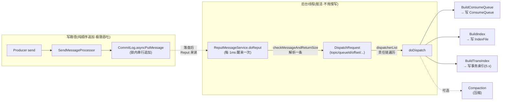

# 第五章 · ReputMessageService:从 CommitLog 异步分发到 ConsumeQueue/Index

> 篇:第 1 篇 · 存储内核之写入
> 主线呼应:前一章讲了"消息已落盘"——同步刷盘靠 `GroupCommitService` 等 force 完成,异步刷盘靠 `FlushRealTimeService` 定时 force。但你有没有注意到一个细节:第 3 章 P1-03 讲 `CommitLog.asyncPutMessage` 时,**全程只字未提 ConsumeQueue 和 IndexFile**。消息被追加进 CommitLog 后,那两个文件是**怎么、什么时候、被谁**建起来的?这一章就是全书**最反直觉的转折**:ConsumeQueue 和 IndexFile **不是写消息时同步建的**,而是后台 `ReputMessageService` 线程顺着 CommitLog 一条条读、解析成 `DispatchRequest`、再分发给一串 dispatcher 异步建出来的。读懂这一章,你就理解了 RocketMQ 为什么能把"写吞吐"和"建索引"这两件看起来必须耦合的事,彻底拆开。

## 核心问题

**ConsumeQueue 和 IndexFile 是写时同步建的,还是后台异步从 CommitLog 加工出来的?RocketMQ 为什么选了后者?这个"写完不立刻建索引"的延迟,凭什么不会出问题?**

读完本章你会明白:

1. 写一条消息时 RocketMQ 只做了"往 CommitLog 末尾追加"一件事,**ConsumeQueue 和 IndexFile 的建造根本不在写路径里**——它们由后台 `ReputMessageService` 线程异步加工出来。
2. `ReputMessageService` 是怎么工作的:它持有一个 `reputFromOffset`,每毫秒醒来一次,顺着 CommitLog 往后读、用 `checkMessageAndReturnSize` 解析出一条条 `DispatchRequest`,再把每个 request 喂给 `dispatcherList` 这条责任链。
3. `reputFromOffset` 凭什么能稳定推进、`isCommitLogAvailable` 凭什么判活、`getReputEndOffset` 为什么用 `confirmOffset` 而不是 `maxOffset`(这关系到主从复制场景下"消息还没复制成功就被 dispatch"的可靠性陷阱)。
4. `doDispatch` 那个 for 循环为什么是**开闭原则**的教科书例子:加一种新索引(事务索引、压缩、5.x 的 RocksDB 索引)只往 `dispatcherList` 上加一个 dispatcher,**写路径一行都不用改**。
5. `notifyMessageArriveIfNecessary` 怎么在这一步顺手唤醒长轮询挂着等消息的消费者(为第 9 章 P3-09 埋下伏笔)。

> **如果一读觉得太难**:先只记住三件事——① 写只写 CommitLog,ConsumeQueue/Index 由后台线程异步加工,这就是"写-建索引解耦";② 后台线程叫 `ReputMessageService`,核心方法是 `doReput`,顺着 CommitLog 读一条 dispatch 一条;③ dispatch 走的是一条 `dispatcherList` 责任链,加索引类型只加 dispatcher。理解这三点,你就抓住了本章的灵魂。

---

## 5.1 一句话点破

> **RocketMQ 的写路径只干一件事——往 CommitLog 末尾纯顺序追加。ConsumeQueue 和 IndexFile 不是写时同步建的,而是后台 `ReputMessageService` 线程顺着 CommitLog 一条条读、解析成 `DispatchRequest`、再分发给 `dispatcherList` 责任链里的每个 dispatcher 异步建出来的。写路径因此始终保持纯顺序追加的极致吞吐,建索引的脏活(解析、定位、写多个小文件)全部甩到后台——这就是 RocketMQ 把"写"和"建索引"彻底解耦的那一刀。**

这是结论,不是理由。本章倒过来拆:先讲"如果写时同步建索引会怎样",再看 RocketMQ 怎么用 Reput 把这件事拆开,然后钻进 `doReput` 看它怎么逐条加工,最后讲 `dispatcherList` 责任链凭什么是一个干净的开闭原则实现。

---

## 5.2 反面教材:写时同步建索引会怎样

在讲 Reput 怎么做之前,先想清楚它要解决的问题。一个朴素的设计是:**写消息的时候,顺手把 ConsumeQueue 和 IndexFile 也一起建了**。直觉上这很合理——反正这条消息的所有元数据(topic、queueId、queueOffset、commitLogOffset、tag)在写的那一刻全在手边,直接顺手写进 ConsumeQueue 岂不省事?

> **不这样会怎样**(朴素方案会撞的墙):写一条消息本来只是"往一个 CommitLog 末尾追加"——纯顺序写,磁头/SSD 永远只在一个位置往后刷,这是 RocketMQ 写吞吐的命根子(详见第 1 章 P0-01)。可如果写时同步建索引,会发生什么?

- **ConsumeQueue 写退化成随机写**。ConsumeQueue 是按 `topic-queue` 分文件的(详见第 6 章 P2-06):`order-queue0` 一个文件、`pay-queue3` 一个文件、`log-queue1` 一个文件……CommitLog 里所有 topic 的消息是**交错混写**的,所以写时同步建 ConsumeQueue 意味着"这一毫秒往 `order-queue0` 写一条、下一毫秒往 `pay-queue3` 写一条、再下一毫秒往 `log-queue1` 写一条"——**对磁盘而言这是在成百上千个 ConsumeQueue 文件之间来回跳的随机写**。写路径从"纯顺序追加"瞬间退化成"顺序写 CommitLog + 随机写 N 个 ConsumeQueue",吞吐立刻被拖垮。
- **IndexFile 写更随机**。IndexFile 是按 key 的哈希索引(详见第 7 章 P2-07),新消息落到哪个 hash slot 完全不可预测,同步建索引意味着写路径还要额外承受 IndexFile 的随机写。
- **写路径被建索引的耗时拖慢**。建索引要查表、要算 hash、要更新 slot 指针,这些 CPU 开销和 IO 开销一旦挪进写路径,写消息的尾延迟立刻恶化。`putMessageLock` 那把全局锁(第 3 章 P1-03 讲过)的临界区也会被撑大——锁内多干一份脏活,所有在锁外排队的写请求都要多等一会儿。

这就是"写时同步建索引"的代价:**它把 RocketMQ 用"混写一个 CommitLog"换来的纯顺序写优势,在最后这一步亲手葬送了**。

> **所以这样设计**:RocketMQ 把建索引这件事**整条地从写路径里挖出来,甩给一个后台线程**。写路径只管往 CommitLog 末尾追加——纯顺序、零负担、极致吞吐。建索引的脏活(解析、定位、写多个小文件)由后台 `ReputMessageService` 线程慢慢干,干得多快、干得多慢,都不影响写路径。这两件事被解耦后,**写吞吐对"建索引有多复杂"完全免疫**——你今天想多建一种索引(比如 5.x 加的事务索引 `CommitLogDispatcherBuildTransIndex`),写路径一行都不用改。



这张图就是本章的全部戏:左边写路径只追加 CommitLog,右边后台线程把 CommitLog 里的消息读出来、解析、分发给一串 dispatcher 建各种索引。中间那条虚线就是"写-建索引解耦"的那一刀。

---

## 5.3 ReputMessageService:一个 ServiceThread 后台线程

讲清了"为什么要解耦",现在看 Reput 是怎么把这件事做成的。它就是 `DefaultMessageStore` 的一个内部类([DefaultMessageStore.java:2657](../rocketmq/store/src/main/java/org/apache/rocketmq/store/DefaultMessageStore.java#L2657)):

```java
class ReputMessageService extends ServiceThread {                   // :2657

    protected volatile long reputFromOffset = 0;                    // :2659 —— 当前已 dispatch 到 CommitLog 的哪个字节
    protected volatile long currentReputTimestamp = System.currentTimeMillis();   // :2660

    public long getReputFromOffset() { return reputFromOffset; }    // :2662
    public void setReputFromOffset(long reputFromOffset) { this.reputFromOffset = reputFromOffset; }   // :2666

    public long behind() {                                          // :2692 —— 落后 CommitLog 多少字节
        return DefaultMessageStore.this.getConfirmOffset() - this.reputFromOffset;
    }

    public boolean isCommitLogAvailable() {                         // :2705 —— 还有没有消息没 dispatch
        return this.reputFromOffset < getReputEndOffset();
    }

    protected long getReputEndOffset() {                            // :2709 —— dispatch 的终点
        return DefaultMessageStore.this.getMessageStoreConfig().isReadUnCommitted()
            ? DefaultMessageStore.this.commitLog.getMaxOffset()
            : DefaultMessageStore.this.commitLog.getConfirmOffset();
    }

    @Override
    public void run() {                                             // :2822
        DefaultMessageStore.LOGGER.info(this.getServiceName() + " service started");
        while (!this.isStopped()) {
            try {
                TimeUnit.MILLISECONDS.sleep(1);                     // :2827 —— 每毫秒醒一次
                this.doReput();                                     // :2828 —— 干活
            } catch (Throwable e) {
                DefaultMessageStore.LOGGER.warn(this.getServiceName() + " service has exception. ", e);
            }
        }
        DefaultMessageStore.LOGGER.info(this.getServiceName() + " service end");
    }
}
```

这几行已经把 Reput 的骨架讲完了。它是一个 `ServiceThread`(RocketMQ 自研的后台线程基类,提供 `start`/`shutdown`/`isStopped` 这些常规控制),`run()` 里就是一个死循环:**每 1 毫秒醒一次,调一次 `doReput()`**。注意那个 `sleep(1)`——它不是"忙等",也不是"等消息到了再醒",而是一个**固定的低频轮询**。

> **钉死这件事**:Reput 是一个**轮询后台线程**(`sleep(1)` + `doReput()`),不是事件驱动的(不是"写一条消息就触发一次 dispatch")。这是个有意识的取舍:**轮询的好处是写路径完全不知道 Reput 的存在**,写线程不持有任何"通知 Reput"的引用、不发任何信号,写路径因此极轻。代价是 Reput 最多有 1ms 的延迟才会看到新消息——对 RocketMQ 这种追求吞吐、能容忍毫秒级延迟的场景,1ms 是完全可接受的。这也是 RocketMQ 区别于"每条消息都同步通知索引器"的设计(那种设计会让写路径背上一个回调负担)。

这里有几个字段要先讲清楚,后面 `doReput` 全靠它们驱动:

- **`reputFromOffset`**([:2659](../rocketmq/store/src/main/java/org/apache/rocketmq/store/DefaultMessageStore.java#L2659)):Reput 的"读游标"。它表示"我已经把 CommitLog 里 `[0, reputFromOffset)` 这段字节里的消息全部 dispatch 完了,下次从 `reputFromOffset` 这个字节继续读"。它是 `volatile` 的,因为 `setReputFromOffset`(启动时设置初始值)和 `doReput`(运行时推进)在不同线程,需要可见性保证。注意它是**字节偏移**(物理偏移),不是消息序号——因为 CommitLog 是按字节顺序追加的,"读到哪了"用字节偏移最自然。
- **`currentReputTimestamp`**([:2660](../rocketmq/store/DefaultMessageStore.java)):最近一次 dispatch 的消息的 `storeTimestamp`。`behindMs()`([:2696](../rocketmq/store/src/main/java/org/apache/rocketmq/store/DefaultMessageStore.java#L2696))用它和最后一个 CommitLog 文件的 `storeTimestamp` 比较,算出"Reput 落后了多久"——这是个运维监控指标,告诉你 Reput 是否跟得上写入速度。
- **`isCommitLogAvailable()`**([:2705](../rocketmq/store/src/main/java/org/apache/rocketmq/store/DefaultMessageStore.java#L2705)):判断"还有没有活干"。逻辑直白得不能再直白:`reputFromOffset < getReputEndOffset()`——只要读游标还没追上终点,就有消息没 dispatch。`doReput` 和 `run` 的循环都靠它判活。

这里有一个**容易翻车的细节**,叫 `getReputEndOffset`([:2709](../rocketmq/store/src/main/java/org/apache/rocketmq/store/DefaultMessageStore.java#L2709))。它返回的是"Reput 的终点",但这个终点**不是简单的 `commitLog.getMaxOffset()`**——它根据 `isReadUnCommitted()` 在 `maxOffset` 和 `confirmOffset` 之间二选一。这是为什么?这是全书**第一个和数据可靠性挂钩的细节**,值得讲透。

### getReputEndOffset:为什么用 confirmOffset 而不是 maxOffset

先看这两个 offset 是什么:

- **`maxOffset`**:CommitLog 已经写到哪了——最后一条被 `appendMessage` 追加成功的消息的尾字节偏移。这是个**纯物理概念**,只关心"字节有没有被写进 MappedFile",不关心"这条消息有没有被复制到 slave、有没有刷盘"。
- **`confirmOffset`**:CommitLog 里**已确认可靠**的字节偏移。它的语义会随部署模式变。在传统单机/异步刷盘模式下,`confirmOffset == maxOffset`(写进 MappedFile 就算确认);但在**同步双写**(`SYNC_MASTER`)或 **5.x Controller 自动切换**模式下,`confirmOffset` 表示"已经被 slave ACK 确认复制"的那个字节位置——它**小于等于** `maxOffset`。源码里 `CommitLog` 持有一个 `confirmOffset` 字段([CommitLog.java:96](../rocketmq/store/src/main/java/org/apache/rocketmq/store/CommitLog.java#L96),`volatile`),`getConfirmOffset()`([:681](../rocketmq/store/src/main/java/org/apache/rocketmq/store/CommitLog.java#L681))在 5.x autoswitch 模式下会动态计算。

> **不这样会怎样**(Reput 追过 confirmOffset 的灾难):假设 Reput 用 `maxOffset` 当终点,会发生什么?master 写了 100 条消息进 CommitLog(`maxOffset` 推到 1MB),其中后 50 条**还没复制到 slave**(`confirmOffset` 还停在 500KB)。Reput 不知情,顺着 `maxOffset` 把 100 条全部 dispatch 出来,建了 ConsumeQueue——消费者立刻能消费到这 100 条。可就在这一刻 master 挂了,5.x Controller 选新 master,新 master 只有前 50 条(后 50 条没复制成功)。**结果:消费者已经消费了第 51~100 条消息,但集群里这些消息根本不存在了**——这是数据丢失现场。

所以 Reput 必须用 `confirmOffset` 当终点:**它只 dispatch 那些"已经被集群确认可靠"的消息**。`isReadUnCommitted()` 那个开关是个逃生阀——某些不需要严格可靠性的场景(比如某些测试或只读 slave)可以读未确认消息,默认是关的。

> **钉死这件事**:`getReputEndOffset` 用 `confirmOffset` 而不是 `maxOffset`,是 Reput 与数据可靠性之间的**第一道契约**——它保证"被 dispatch 出来、消费者能看到"的消息,都是已经被集群确认可靠的消息。这一行代码,把第 1 篇(存储写入)和第 6 篇(高可用)悄悄连了起来。详见第 17 章 P6-17 同步双写。

---

## 5.4 doReput:逐条读 CommitLog、逐条 dispatch

`doReput()`([:2713](../rocketmq/store/src/main/java/org/apache/rocketmq/store/DefaultMessageStore.java#L2713))是 Reput 的核心。我们逐段拆。先看它的整体结构(已核对源码 [:2713-2791](../rocketmq/store/src/main/java/org/apache/rocketmq/store/DefaultMessageStore.java#L2713-L2791)):

```java
public void doReput() {
    // ① 边界保护:reputFromOffset 落后到 CommitLog 已删除的部分,纠偏
    if (this.reputFromOffset < DefaultMessageStore.this.commitLog.getMinOffset()) {     // :2714
        LOGGER.warn("The reputFromOffset={} is smaller than minPyOffset={}...",
            this.reputFromOffset, DefaultMessageStore.this.commitLog.getMinOffset());
        this.reputFromOffset = DefaultMessageStore.this.commitLog.getMinOffset();       // :2717
    }
    boolean isCommitLogAvailable = isCommitLogAvailable();                              // :2719
    if (!isCommitLogAvailable) {
        currentReputTimestamp = System.currentTimeMillis();                             // :2721 —— 没活干也要更新时间戳
    }

    // ② 主循环:只要还有消息没 dispatch,就一轮轮干
    for (boolean doNext = true; isCommitLogAvailable() && doNext; ) {                   // :2723

        // ②-a 从 CommitLog 取一段(从 reputFromOffset 开始到文件尾)
        SelectMappedBufferResult result =
            DefaultMessageStore.this.commitLog.getData(reputFromOffset);                // :2725

        if (result == null) { break; }

        try {
            this.reputFromOffset = result.getStartOffset();                             // :2732

            // ②-b 在这一段里,逐条解析消息
            for (int readSize = 0; readSize < result.getSize()
                    && reputFromOffset < getReputEndOffset() && doNext; ) {              // :2734

                // 解析一条消息成 DispatchRequest
                DispatchRequest dispatchRequest =
                    DefaultMessageStore.this.commitLog.checkMessageAndReturnSize(        // :2736
                        result.getByteBuffer(), false, false, false);
                int size = dispatchRequest.getBufferSize() == -1
                    ? dispatchRequest.getMsgSize() : dispatchRequest.getBufferSize();   // :2737

                // ②-c 终点保护:这条消息跨越了 confirmOffset,停下来别 dispatch
                if (reputFromOffset + size > getReputEndOffset()) {                     // :2739
                    doNext = false;
                    break;
                }

                if (dispatchRequest.isSuccess()) {                                      // :2744
                    if (size > 0) {
                        currentReputTimestamp = dispatchRequest.getStoreTimestamp();     // :2746
                        DefaultMessageStore.this.doDispatch(dispatchRequest);           // :2747 —— 喂给责任链

                        if (!notifyMessageArriveInBatch) {
                            notifyMessageArriveIfNecessary(dispatchRequest);            // :2750 —— 唤醒长轮询
                        }

                        this.reputFromOffset += size;                                   // :2753 —— 游标推进
                        readSize += size;
                        // ... slave 端的统计 ...
                    } else if (size == 0) {
                        // 文件末尾的 BLANK_MAGIC_CODE 占位,跳到下一个 MappedFile
                        this.reputFromOffset =
                            DefaultMessageStore.this.commitLog.rollNextFile(this.reputFromOffset);   // :2764
                        readSize = result.getSize();
                    }
                } else {
                    // ... 解析失败的 BUG 处理 ...
                }
            }
        } catch (RocksDBException e) {
            ERROR_LOG.info("dispatch message to cq exception. reputFromOffset: {}", this.reputFromOffset, e);
            return;
        } finally {
            result.release();                                                           // :2788 —— 释放引用计数
        }
    }
}
```

`doReput` 的逻辑分两段:**外层 for** 一段段地从 CommitLog 取数据(`getData` 一次取一个 MappedFile 里从 `reputFromOffset` 到文件尾的那一段),**内层 for** 在这一段里一条条解析消息。逐条解析靠的是 `checkMessageAndReturnSize`,每解析出一条成功的 `DispatchRequest`,就干三件事:**① 喂给 `doDispatch`(责任链)② 唤醒长轮询消费者 ③ 推进 `reputFromOffset`**。我们一个一个看。

### 5.4.1 getData:从 CommitLog 取一段切片

`commitLog.getData(reputFromOffset)`([CommitLog.java:254](../rocketmq/store/src/main/java/org/apache/rocketmq/store/CommitLog.java#L254))干的事很直白:根据 `reputFromOffset` 找到它落在哪个 `MappedFile` 上,从那个 MappedFile 的对应位置切一段到文件尾,包成 `SelectMappedBufferResult` 返回。源码([:258](../rocketmq/store/src/main/java/org/apache/rocketmq/store/CommitLog.java#L258)):

```java
public SelectMappedBufferResult getData(final long offset, final boolean returnFirstOnNotFound) {
    int mappedFileSize = this.defaultMessageStore.getMessageStoreConfig().getMappedFileSizeCommitLog();   // 1GB
    MappedFile mappedFile = this.mappedFileQueue.findMappedFileByOffset(offset, returnFirstOnNotFound);   // :260 找文件
    if (mappedFile != null) {
        int pos = (int) (offset % mappedFileSize);                       // :262 算文件内偏移
        SelectMappedBufferResult result = mappedFile.selectMappedBuffer(pos);
        return result;
    }
    return null;
}
```

这里有两个细节值得点一下:

1. **`pos = (int)(offset % mappedFileSize)`**:CommitLog 是一组 1GB 的 MappedFile 首尾相接(详见第 3 章 P1-03),全局 `offset` 取模 1GB 就得到文件内偏移。这是"一组定长文件拼成逻辑无限长文件"的标准玩法。
2. **`selectMappedBuffer` 切片不拷贝**:它返回的是 MappedFile 内部 `MappedByteBuffer` 的一个**切片视图**(slice),底层还是同一块 mmap 内存,**零拷贝**。所以 `doReput` 读 CommitLog 根本不经过 JVM 堆,直接读页缓存。这也是为什么 finally 里要 `result.release()`([:2788](../rocketmq/store/src/main/java/org/apache/rocketmq/store/DefaultMessageStore.java#L2788))——`SelectMappedBufferResult` 持有 MappedFile 的引用计数,不释放会导致 MappedFile 无法被回收(文件过期清理会受影响)。

> **技巧点**(零拷贝读 CommitLog):Reput 读 CommitLog 用的是 mmap 切片(`MappedByteBuffer.slice()`),读消息**全程不进 JVM 堆**。这是第 8 章 P2-08 会详讲的"读用 mmap/sendfile 零拷贝"在 Reput 这里的提前亮相。这一步零拷贝,是 Reput 即使每毫秒扫一遍 CommitLog 也不拖慢系统的前提。

### 5.4.2 checkMessageAndReturnSize:把字节解析成 DispatchRequest

拿到一段 `SelectMappedBufferResult` 后,`doReput` 要在这一段里**逐条**解析消息。怎么知道一条消息从哪开始、到哪结束?靠的是 CommitLog 里每条消息开头的 `TOTALSIZE` 字段(详见第 2 章 P1-02 讲消息字节布局)。`checkMessageAndReturnSize`([CommitLog.java:451](../rocketmq/store/src/main/java/org/apache/rocketmq/store/CommitLog.java#L451))就是干这个的:

```java
public DispatchRequest checkMessageAndReturnSize(java.nio.ByteBuffer byteBuffer,
        final boolean checkCRC, final boolean checkDupInfo, final boolean readBody) {
    try {
        if (byteBuffer.remaining() <= 4) {
            return new DispatchRequest(-1, false /* fail */);                // 剩余不足 4 字节,失败
        }
        // 1 TOTAL SIZE —— 整条消息(含这个字段本身)的总字节数
        int totalSize = byteBuffer.getInt();
        if (byteBuffer.remaining() < totalSize - 4) {
            return new DispatchRequest(-1, false /* fail */);                // 剩余不够一条,失败(部分消息)
        }

        // 2 MAGIC CODE —— 区分正常消息 / 文件末尾占位 / 非法
        int magicCode = byteBuffer.getInt();
        switch (magicCode) {
            case MessageDecoder.MESSAGE_MAGIC_CODE:
            case MessageDecoder.MESSAGE_MAGIC_CODE_V2:
                break;
            case BLANK_MAGIC_CODE:
                return new DispatchRequest(0, true /* success */);           // 文件末尾占位,size=0
            default:
                log.warn("found a illegal magic code 0x{}", Integer.toHexString(magicCode));
                return new DispatchRequest(-1, false /* success */);         // 非法
        }

        MessageVersion messageVersion = MessageVersion.valueOfMagicCode(magicCode);
        byte[] bytesContent = new byte[totalSize];

        // 3..N 依次读出每一段元数据
        int bodyCRC = byteBuffer.getInt();           // :480
        int queueId = byteBuffer.getInt();           // :482
        int flag = byteBuffer.getInt();              // :484
        long queueOffset = byteBuffer.getLong();     // :486 —— 队列内偏移
        long physicOffset = byteBuffer.getLong();    // :488 —— CommitLog 物理偏移
        int sysFlag = byteBuffer.getInt();           // :490
        long bornTimeStamp = byteBuffer.getLong();   // :492
        // ... bornHost / storeTimestamp / storeHost / reconsumeTimes / preparedTransactionOffset / body / topic / properties ...
        long storeTimestamp = byteBuffer.getLong();  // :501
        // ...
    }
}
```

这里有几个**非常关键**的设计点:

1. **解析靠 `TOTALSIZE` 自描述定界**。CommitLog 里消息是一条紧挨着一条的,没有分隔符。`checkMessageAndReturnSize` 先读 4 字节的 `TOTALSIZE`,就知道这一条消息一共多长,然后按消息格式逐字段读出来。**它不依赖任何外部索引**——纯粹靠消息自身的字节布局自描述。这就是为什么 Reput 能"裸读"CommitLog:CommitLog 是自描述的,拿一段字节进来,就能逐条解析。
2. **`BLANK_MAGIC_CODE` 与 `rollNextFile`**。一个 MappedFile 写满 1GB 滚动到下一个时,老文件末尾可能有一段写不满的空白,会被填上一个 `BLANK_MAGIC_CODE` 占位。`checkMessageAndReturnSize` 遇到它就返回 `size=0` 的成功 result,`doReput` 见状调 `commitLog.rollNextFile(this.reputFromOffset)`([:2764](../rocketmq/store/src/main/java/org/apache/rocketmq/store/DefaultMessageStore.java#L2764))——它([CommitLog.java:1423](../rocketmq/store/src/main/java/org/apache/rocketmq/store/CommitLog.java#L1423))把 `reputFromOffset` 对齐到下一个 MappedFile 的开头(`offset + mappedFileSize - offset % mappedFileSize`),Reput 就跳到了下一个文件继续读。
3. **`readBody=false`**。注意 `doReput` 调它的时候传的是 `checkMessageAndReturnSize(byteBuffer, false, false, false)`——第四个参数 `readBody` 是 `false`!意思是**只解析元数据,不读消息体**。为什么?因为 Reput 要建的是 ConsumeQueue(只存物理偏移+长度+tag hash,详见第 6 章)和 IndexFile(只存 key 到偏移的映射),**它们根本不需要消息体**——只要元数据(尤其是 `commitLogOffset`、`size`、`tagsCode`)就够建索引了。**跳过读 body 是个重要的性能优化**:不用把消息体(可能几 KB)拷进 `byte[]`,省一次内存分配和拷贝。

> **钉死这件事**:`checkMessageAndReturnSize` 的本质是"按 CommitLog 的字节布局逐字段解析一条消息,产出一个 `DispatchRequest`"。`DispatchRequest`([DispatchRequest.java:24](../rocketmq/store/src/main/java/org/apache/rocketmq/store/DispatchRequest.java#L24))就是"一条消息被解析后的结构化表示",带 topic、queueId、consumeQueueOffset、commitLogOffset、msgSize、tagsCode、storeTimestamp、sysFlag、propertiesMap 等字段——这些正是建 ConsumeQueue 和 IndexFile 所需的全部信息。Reput 拿到 DispatchRequest,下一步就是喂给责任链。

### 5.4.3 doDispatch + notifyMessageArriveIfNecessary:分发与唤醒

每解析出一条成功的 `DispatchRequest`,`doReput` 干两件事:

```java
DefaultMessageStore.this.doDispatch(dispatchRequest);           // :2747

if (!notifyMessageArriveInBatch) {
    notifyMessageArriveIfNecessary(dispatchRequest);            // :2750
}

this.reputFromOffset += size;                                   // :2753 游标推进
```

**第一件,`doDispatch`**——分发。我们下一节(5.5)专门讲它,这里只先点一句:它把 `dispatchRequest` 喂给 `dispatcherList` 里的每个 dispatcher,让它们各自去建自己的索引(ConsumeQueue、IndexFile、事务索引……)。

**第二件,`notifyMessageArriveIfNecessary`**——唤醒长轮询。这是 Reput 与消费端的一次"暗号"。它([:2646](../rocketmq/store/src/main/java/org/apache/rocketmq/store/DefaultMessageStore.java#L2646))干的事:

```java
@Override
public void notifyMessageArriveIfNecessary(DispatchRequest dispatchRequest) {
    if (DefaultMessageStore.this.brokerConfig.isLongPollingEnable()               // :2647
        && DefaultMessageStore.this.messageArrivingListener != null) {
        DefaultMessageStore.this.messageArrivingListener.arriving(                // :2649
            dispatchRequest.getTopic(),
            dispatchRequest.getQueueId(),
            dispatchRequest.getConsumeQueueOffset() + 1,
            dispatchRequest.getTagsCode(),
            dispatchRequest.getStoreTimestamp(),
            dispatchRequest.getBitMap(),
            dispatchRequest.getPropertiesMap());
        DefaultMessageStore.this.reputMessageService.notifyMessageArrive4MultiQueue(dispatchRequest);  // :2653
    }
}
```

这段代码的关键是 `messageArrivingListener.arriving(...)`——它**回调**了 broker 层注入的监听器(在 `DefaultMessageStore` 构造函数里注入,[:231/234](../rocketmq/store/src/main/java/org/apache/rocketmq/store/DefaultMessageStore.java#L231))。broker 层的 `NotifyMessageArrivingListener` 实现了这个回调,它会去唤醒那些挂着等消息的长轮询消费者——告诉它们"你等的 topic-queue 有新消息了,起来拉吧"。

这里先不展开长轮询的细节(那是第 9 章 P3-09 的主场),只钉一件事:**Reput 是消息"从存储内核流向消费"的关键衔接点**——消息被 dispatch 出来、ConsumeQueue 建好的那一刻,Reput 顺手就通知了消费端。这是写路径、存储内核、消费端三者在这一个后台线程上的交汇。第 1 章立的二分法里,Reput 正好站在"存储内核"和"分布式骨架"的接缝处。

### 5.4.4 reputFromOffset 怎么推进

回到 `this.reputFromOffset += size;`([:2753](../rocketmq/store/src/main/java/org/apache/rocketmq/store/DefaultMessageStore.java#L2753))。这一行是 Reput 游标推进的命脉。逻辑清晰得不能再清晰:**每成功 dispatch 一条消息,就把游标往前推这条消息的字节长度**。因为 CommitLog 是顺序追加的,消息在文件里是一条紧挨一条的,所以"读完一条推 `size` 字节"就能精确地跳到下一条消息的开头。

但有三个边界情况要处理,源码都写得很小心:

- **`reputFromOffset < commitLog.getMinOffset()`**([:2714](../rocketmq/store/src/main/java/org/apache/rocketmq/store/DefaultMessageStore.java#L2714)):CommitLog 会定期清理老文件(默认 72 小时过期,详见第 3 章),`minOffset` 会往前走。如果 Reput 落后太多(比如系统卡了一下),它的 `reputFromOffset` 可能落到已经被删除的范围。源码的处理是直接把 `reputFromOffset` 拉到 `minOffset`——**老消息已经被删了,只能跳过,这是有损恢复**。日志会 warn 出来,运维该警觉。
- **`reputFromOffset + size > getReputEndOffset()`**([:2739](../rocketmq/store/src/main/java/org/apache/rocketmq/store/DefaultMessageStore.java#L2739)):这条消息的尾字节超过了 `confirmOffset`——前面 5.3 讲过,这种消息还没被集群确认可靠,**不能 dispatch**。`doNext = false`,跳出循环,等下一轮(下一轮 `confirmOffset` 可能已经推进)。
- **`BLANK_MAGIC_CODE`(size=0)**([:2763](../rocketmq/store/src/main/java/org/apache/rocketmq/store/DefaultMessageStore.java#L2763)):文件末尾的占位,`rollNextFile` 跳到下一个 MappedFile。

> **钉死这件事**:Reput 的游标推进是**纯字节级**的——`reputFromOffset += size`,没有任何"消息序号"概念。这是因为 CommitLog 本身就是按字节顺序追加的字节流,Reput 是这个字节流的"消费者"。这个设计有一个直接后果:**Reput 的进度可以完全用 `reputFromOffset` 这一个 long 值持久化**——broker 重启时只要把这个值恢复(从 `StoreCheckpoint` 或重算),Reput 就能从断点继续(详见 5.6 启动恢复)。

---

## 5.5 dispatcherList:一条责任链,凭什么是个干净的开闭原则

现在专门讲 `doDispatch` 和它的责任链。`doDispatch` 本身短得不像话([:2066](../rocketmq/store/src/main/java/org/apache/rocketmq/store/DefaultMessageStore.java#L2066)):

```java
public void doDispatch(DispatchRequest req) throws RocksDBException {
    for (CommitLogDispatcher dispatcher : this.dispatcherList) {     // :2067
        dispatcher.dispatch(req);
    }
}
```

就一个 for 循环——遍历 `dispatcherList`,把同一个 `DispatchRequest` 喂给每个 dispatcher。`dispatcherList` 是 `DefaultMessageStore` 的一个字段([:176](../rocketmq/store/src/main/java/org/apache/rocketmq/store/DefaultMessageStore.java#L176)):

```java
private final LinkedList<CommitLogDispatcher> dispatcherList = new LinkedList<>();
```

它在构造函数里被填充([:250-273](../rocketmq/store/src/main/java/org/apache/rocketmq/store/DefaultMessageStore.java#L250)):

```java
this.dispatcherList.addLast(new CommitLogDispatcherBuildConsumeQueue());    // :250 —— 建逻辑队列索引
this.dispatcherList.addLast(new CommitLogDispatcherBuildIndex());           // :251 —— 建 key 哈希索引
this.dispatcherList.addLast(new CommitLogDispatcherBuildTransIndex());      // :252 —— 事务消息索引(5.x RocksDB)
// ... 后续根据配置,可能再加 ...
if (...) {
    this.dispatcherList.addLast(new CommitLogDispatcherCompaction(compactionService));   // :273 —— 压缩(可选)
}
```

三个核心 dispatcher 是 `DefaultMessageStore` 的内部类。`CommitLogDispatcher` 是一个极简的接口([CommitLogDispatcher.java:25](../rocketmq/store/src/main/java/org/apache/rocketmq/store/CommitLogDispatcher.java#L25)):

```java
public interface CommitLogDispatcher {
    /**
     *  Dispatch messages from store to build consume queues, indexes, and filter data
     */
    void dispatch(final DispatchRequest request) throws RocksDBException;
}
```

三个 dispatcher 各自干什么,源码一目了然。

**`CommitLogDispatcherBuildConsumeQueue`**([:2240](../rocketmq/store/src/main/java/org/apache/rocketmq/store/DefaultMessageStore.java#L2240))——建 ConsumeQueue:

```java
class CommitLogDispatcherBuildConsumeQueue implements CommitLogDispatcher {
    @Override
    public void dispatch(DispatchRequest request) throws RocksDBException {
        final int tranType = MessageSysFlag.getTransactionValue(request.getSysFlag());
        switch (tranType) {
            case MessageSysFlag.TRANSACTION_NOT_TYPE:            // 普通消息
            case MessageSysFlag.TRANSACTION_COMMIT_TYPE:         // 事务消息已 commit
                putMessagePositionInfo(request);                 // :2248 —— 写 ConsumeQueue(一条 20 字节单元)
                break;
            case MessageSysFlag.TRANSACTION_PREPARED_TYPE:       // 事务 half message(未决)
            case MessageSysFlag.TRANSACTION_ROLLBACK_TYPE:       // 事务回滚
                break;                                           // 不进 ConsumeQueue(对消费者不可见)
        }
    }
}
```

这里有一个**和第 7 篇事务消息(P7-22)挂钩的细节**:事务 half message(`TRANSACTION_PREPARED_TYPE`)和回滚消息**不进业务 ConsumeQueue**——它们对消费者不可见。这就是为什么事务消息先写 `RMQ_SYS_TRANS_HALF_TOPIC` 暂存、等本地事务决定后再 commit 写回业务 topic:在 Reput 这一步,dispatcher 看到 `PREPARED` 就直接跳过,不建业务队列索引。这一行 switch 把"事务消息的可见性"钉死在了存储内核里。

**`CommitLogDispatcherBuildIndex`**([:2257](../rocketmq/store/src/main/java/org/apache/rocketmq/store/DefaultMessageStore.java#L2257))——建 IndexFile:

```java
class CommitLogDispatcherBuildIndex implements CommitLogDispatcher {
    @Override
    public void dispatch(DispatchRequest request) {
        if (DefaultMessageStore.this.messageStoreConfig.isMessageIndexEnable()) {        // :2261 全局开关
            if (DefaultMessageStore.this.messageStoreConfig.isIndexFileWriteEnable()) {  // 经典 IndexFile
                DefaultMessageStore.this.indexService.buildIndex(request);               // :2263
            }
            if (DefaultMessageStore.this.messageStoreConfig.isIndexRocksDBEnable()) {    // 5.x RocksDB 索引
                DefaultMessageStore.this.indexRocksDBStore.buildIndex(request);          // :2266
            }
        }
    }
}
```

注意它和 BuildConsumeQueue 的一个差异:**它受 `isMessageIndexEnable()` 开关控制**——IndexFile 是可选的(有些场景不需要按 key 查消息,关掉省 IO);ConsumeQueue 是必需的(没有它消费端就没法按队列消费)。这个差异也体现在 dispatcher 责任链的设计上——ConsumeQueue 永远建,IndexFile 可关。

**`CommitLogDispatcherBuildTransIndex`**([:2272](../rocketmq/store/src/main/java/org/apache/rocketmq/store/DefaultMessageStore.java#L2272))——5.x 事务消息的 RocksDB 索引(只在 `isTransRocksDBEnable()` 时生效),这里不展开,留到第 7 篇讲。

### 这条链凭什么是开闭原则的好例子

现在站远一点看这条 `dispatcherList`。`doDispatch` 的那个 for 循环,**不关心链上有几个 dispatcher、每个 dispatcher 干什么**——它只负责"把同一个 request 喂给链上每一个"。这意味着:

> **钉死这件事(开闭原则的字面体现)**:想加一种新索引,只做两件事——① 写一个新类 `XxxDispatcher implements CommitLogDispatcher`;② 在构造函数里 `dispatcherList.addLast(new XxxDispatcher())`。**`doDispatch` 一行不用改、`doReput` 一行不用改、写路径(`CommitLog.asyncPutMessage`)更是根本不知道有这回事**。这就是"对扩展开放(加 dispatcher),对修改关闭(不改老代码)"的开闭原则(OCP)。

历史演进印证了这一点:

- 最初只有两个 dispatcher:`BuildConsumeQueue` + `BuildIndex`。
- 5.x 引入 RocksDB 存储后,加了 `CommitLogDispatcherBuildTransIndex`(事务索引走 RocksDB)和 `CommitLogDispatcherCompaction`([:273](../rocketmq/store/src/main/java/org/apache/rocketmq/store/DefaultMessageStore.java#L273),消息压缩)。**这两个新功能加进来,Reput 主流程零改动**。
- 想象未来要加一种"消息过期标记 dispatcher"或"分级存储 dispatcher",同样只加 dispatcher 不改主流程。

这是 RocketMQ 把"建索引"这件事**插件化**的设计:索引类型是可插拔的插件,Reput 是统一的调度器,两者通过 `CommitLogDispatcher` 接口解耦。这个设计的妙处,只有和"写时同步建索引"对比才显形:

> **反面对比**(如果不是责任链):假设写时同步建索引,每加一种新索引,你都要去**改 `CommitLog.asyncPutMessage` 这段写路径的核心代码**——加一段"写完 CommitLog 后调用新索引器"。这有两个灾难:① 写路径是全局加锁的串行热点,每改一次都是引入 bug 的高风险区(锁内多调一个方法可能死锁、可能 OOM);② 写路径变得臃肿,职责不清(它到底该管"追加 CommitLog"还是"追加 CommitLog + 建 N 种索引 + 通知 N 个监听器"?)。责任链把"建索引"这件事从写路径彻底剥离,**写路径保持极简(只追加 CommitLog),建索引的复杂性全部收敛到独立的 dispatcher**。

> **技巧点(为什么用 LinkedList 而不是 ArrayList)**:`dispatcherList` 是 `LinkedList`, dispatcher 用 `addLast` 追加。这是个有意识的选择吗?其实差别不大(dispatcher 数量极少,3~5 个),但 `LinkedList` 的 `addLast` 语义更贴合"责任链按顺序追加"的心智模型,且如果将来想在链中间或链头插入 dispatcher(比如某种"前置过滤 dispatcher"),`LinkedList` 更灵活。这是个无关性能、关乎代码表达力的选择。

---

## 5.6 启动与恢复:reputFromOffset 怎么初始化

讲完了 doReput 和责任链,还剩一个关键问题:**broker 启动时,`reputFromOffset` 的初值是多少?** 这关系到 broker 重启后 Reput 从哪开始扫 CommitLog。

答案在 `DefaultMessageStore` 的 `load` / `start` 流程里。源码([:444](../rocketmq/store/src/main/java/org/apache/rocketmq/store/DefaultMessageStore.java#L444)):

```java
this.reputMessageService.setReputFromOffset(this.commitLog.getConfirmOffset());   // :444
this.reputMessageService.start();                                                  // :445
```

 broker 启动时,把 `reputFromOffset` 设成 `commitLog.getConfirmOffset()`——也就是"已被集群确认可靠"的那个字节位置。然后启动 Reput 线程。这意味着:

- **正常重启**:Reput 从上次确认可靠的位置继续扫,把还没建索引的消息补建。这正是为什么 CommitLog 是消息的"物理真相"——只要 CommitLog 在,ConsumeQueue 和 IndexFile 就能从 CommitLog 重建。**CommitLog 是 source of truth,ConsumeQueue/Index 是它的衍生物**。
- **极端恢复**:即使 ConsumeQueue 和 IndexFile 全部损坏或被删,RocketMQ 也能从 CommitLog 完整重建它们——只要 `reputFromOffset` 从 0 开始扫整个 CommitLog 即可。这是个强大的恢复能力,源码里 `recoverTopicQueueTable`([:504](../rocketmq/store/src/main/java/org/apache/rocketmq/store/DefaultMessageStore.java#L504))就走了这条路。

还有一个细节:本章只讲了单 master 的 Reput,但 slave 节点也有 Reput。slave 从 master 拉到 CommitLog 数据(详见第 17 章 P6-17 HA 复制),写进自己的 CommitLog 后,**它自己的 Reput 线程也会扫这些数据、建自己的 ConsumeQueue/Index**。所以 `doReput` 里 `:2755-2762` 那段 slave 统计代码才有意义——slave 也在 dispatch,只是它 dispatch 的是从 master 复制过来的消息。

---

## 5.7 技巧精解:Reput 的"写-建索引"解耦 + dispatcher 责任链

这一章的硬核技巧有两条:一是"写-建索引解耦"本身,二是支撑它的 `dispatcherList` 责任链。我们分别拆透。

### 技巧一:写-建索引解耦——把脏活整条挖出写路径

第一个技巧,是本章的**总纲**:把"建索引"这件事**整条地从写路径里挖出来,甩给一个独立的轮询后台线程**。这个设计的精髓不在"用了后台线程"(这谁都会),而在它**凭什么 sound**——凭什么把建索引挪到后台不会出问题?三个保证:

1. **写吞吐对建索引免疫**。写路径只追加 CommitLog,不知道 Reput 的存在。ConsumeQueue 建得快、建得慢、暂时不建,都不影响写。`putMessageLock` 的临界区因此极短(锁内只追加字节),所有写请求的尾延迟都可控。
2. **CommitLog 是自描述的,Reput 能裸读**。CommitLog 里每条消息靠开头的 `TOTALSIZE` 自描述定界,`checkMessageAndReturnSize` 不依赖任何外部索引就能逐条解析。**这是"写-建索引解耦"能成立的物理前提**——如果 CommitLog 不能自描述(比如长度需要外部索引才能知道),Reput 就没法独立工作,解耦就不成立。
3. **`getReputEndOffset` 用 `confirmOffset` 守住可靠性**。Reput 只 dispatch 已被集群确认可靠的消息,不会把"还没复制成功就可能丢失"的消息提前暴露给消费者。这把"写-建索引解耦"和"数据可靠性"这两个本来可能冲突的目标调和了。

> **反面对比**(写时同步建索引会怎样,详讲):上一节 5.2 已经点过,这里钉死。假设写时同步建 ConsumeQueue,`CommitLog.asyncPutMessage` 的锁内就要多做这些事:**根据 topic-queue 找到对应的 ConsumeQueue 文件 → 算 slot 位置 → 写 20 字节单元**。这有两个直接后果:① `putMessageLock` 的临界区被撑大——锁内本来只是"算偏移 + append 字节"(纳秒级),现在多了"查 ConsumeQueue + 写另一个文件"(微秒级),所有排队等锁的写请求尾延迟恶化 10~100 倍;② CommitLog 是混写的,所以同步建 ConsumeQueue 意味着**每条消息要随机写一个 ConsumeQueue 文件**(不同 topic 的 ConsumeQueue 是不同文件),写路径的纯顺序写优势被亲手葬送。这两个后果叠加,RocketMQ 在海量 Topic 下的写吞吐会从"10 万 TPS"掉到"几千 TPS"——直接退回 Kafka 在海量 Topic 下的水平,**混写 CommitLog 这一笔交易就白做了**。把建索引挪到后台,写路径保住纯顺序追加,这才是混写 CommitLog 换来的吞吐优势能落地的关键。

### 技巧二:dispatcherList 责任链——加索引类型零改写路径

第二个技巧是支撑解耦的工程实现:`dispatcherList` 责任链。它的精髓在两个层次:

**层次一,责任链模式本身**。`doDispatch` 的 for 循环把"分发"和"具体建什么索引"解耦——分发逻辑(遍历链)是统一的,具体建什么索引是各 dispatcher 自己的事。这意味着加新索引类型只需加 dispatcher,不改分发逻辑。这一点 5.5 节已经讲透。

**层次二,dispatcher 的执行顺序与隔离**。注意 `dispatcherList` 是 `LinkedList` + `addLast`,dispatcher 按注册顺序执行:`BuildConsumeQueue` → `BuildIndex` → `BuildTransIndex` → 可选 `Compaction`。这个顺序有意义吗?有——**ConsumeQueue 必须先于其他建好**,因为消费端最先依赖它(消费端不依赖 IndexFile 也能顺序消费,但没有 ConsumeQueue 就完全没法消费)。所以把 `BuildConsumeQueue` 放在链头,保证它最先执行。同时,每个 dispatcher 是独立的,一个失败(比如 `BuildIndex` 抛异常)不影响其他——这是责任链相比"一坨 if-else"的优势。

> **技巧点(同一个 DispatchRequest 喂给所有 dispatcher)**:注意 `doDispatch` 把**同一个** `DispatchRequest` 对象喂给链上每个 dispatcher(`dispatcher.dispatch(req)` 传的是同一个引用)。这有没有线程安全问题?有,但被规避了——① dispatcher 的 `dispatch` 方法**只读** DispatchRequest 的字段,不修改它(看 BuildConsumeQueue 和 BuildIndex 的源码,都是只读 request 然后写自己的索引文件);② Reput 是单线程的(`ReputMessageService extends ServiceThread`,一个 broker 一个 Reput 线程,除非开了 `isEnableBuildConsumeQueueConcurrently` 用 `ConcurrentReputMessageService`),所以同一个 request 不会并发被多个 dispatcher 访问。这种"单生产者(Reput)→ 串行多消费者(dispatcher)"的模型,天然避免了并发修改。这是 Java 里"用单线程换取无锁共享"的典型用法,和 Netty 的 EventLoop、Redis 的单线程模型同源。

> **反面对比**(如果用 if-else 而不是责任链):假设 `doDispatch` 写成 `if (needConsumeQueue) buildCQ(req); if (needIndex) buildIndex(req); if (needTransIndex) buildTrans(req); ...`,会发生什么?① 加新索引要改 `doDispatch` 本身(违反开闭原则);② 各种 if 判断逻辑混在一起,`doDispatch` 越来越长,职责不清;③ 无法动态增减 dispatcher(责任链可以运行时 `addLast`/`remove`,if-else 是编译期固定的)。RocketMQ 选了责任链,这三个问题全消失。这是个"用对设计模式省掉一坨复杂度"的典型例子。

---

## 章末小结

这一章是全书**最反直觉的转折**——ConsumeQueue 和 IndexFile 不是写时同步建的,而是后台 `ReputMessageService` 线程异步从 CommitLog 加工出来的。这个设计把"写"和"建索引"彻底解耦,让写路径始终保持纯顺序追加的极致吞吐,把建索引的脏活全部甩到后台。

回到第 1 章立的二分法:**ReputMessageService 是"存储内核"和"分布式骨架"的衔接点**。它本身在 `store` 模块(存储内核),但它 dispatch 完一条消息后会回调 `messageArrivingListener` 唤醒消费端(分布式骨架)——这一步是消息从"被可靠存储"走向"被消费"的关键过渡。全书的地基(第 1 篇)讲到这里就收尾了:消息怎么编码(P1-02)、怎么进 CommitLog(P1-03)、怎么落盘不丢(P1-04)、怎么被异步分发建索引(P1-05)——四件事讲完,一条消息已经在 Broker 里"躺好且可被消费"了。

### 五个"为什么"清单

1. **为什么 ConsumeQueue 和 IndexFile 不在写消息时同步建?** 因为写时同步建索引会让写路径从"纯顺序追加 CommitLog"退化成"顺序追加 CommitLog + 随机写 N 个 ConsumeQueue 文件",吞吐被拖垮,直接葬送"混写一个 CommitLog"换来的优势。把建索引甩给后台 Reput 线程,写路径保持纯顺序。
2. **Reput 凭什么能稳定推进、不丢消息?** 三道保险:① CommitLog 是自描述的(每条消息靠 `TOTALSIZE` 定界),Reput 能裸读逐条解析;② `reputFromOffset` 是字节级游标,每条推进 `size` 字节,精确跳到下一条;③ `getReputEndOffset` 用 `confirmOffset` 当终点,只 dispatch 已被集群确认可靠的消息。
3. **`reputFromOffset < confirmOffset` 而不是 `< maxOffset` 是为什么?** 防止 master 把"还没复制到 slave"的消息提前 dispatch 给消费者——那样 master 挂了、消息实际丢了,但消费者已经消费过,造成数据丢失。`confirmOffset` 是"已被集群确认可靠"的字节位置,Reput 只追到它,保证消费者看到的消息一定不会丢。详见第 17 章 P6-17。
4. **`dispatcherList` 责任链比写时 if-else 好在哪?** 开闭原则:加新索引类型只写新 dispatcher + `addLast`,不改 `doDispatch`/`doReput`/写路径任何一行。5.x 加 `BuildTransIndex` 和 `Compaction` 就是这么加的,Reput 主流程零改动。同时 dispatcher 各自独立,一个失败不影响其他。
5. **Reput 和消费端怎么衔接?** 每条消息 dispatch 完,`doReput` 顺手调 `notifyMessageArriveIfNecessary`,回调 broker 注入的 `messageArrivingListener`,唤醒那些挂着等消息的长轮询消费者。这是 Push 本质是 Pull 长轮询(第 9 章 P3-09)的"消息到达"触发点——Reput 是这个触发的发起者。

### 想继续深入往哪钻

- 想看 Reput 主循环的真身,读 `../rocketmq/store/src/main/java/org/apache/rocketmq/store/DefaultMessageStore.java` 的 `ReputMessageService`([#L2657-L2843](../rocketmq/store/src/main/java/org/apache/rocketmq/store/DefaultMessageStore.java#L2657-L2843))和 `doReput`([#L2713-L2791](../rocketmq/store/src/main/java/org/apache/rocketmq/store/DefaultMessageStore.java#L2713-L2791))。这段不到 200 行,是本章的全部背景。
- 想理解 `checkMessageAndReturnSize` 怎么按字节布局解析一条消息,读 `../rocketmq/store/src/main/java/org/apache/rocketmq/store/CommitLog.java` 的 `checkMessageAndReturnSize`([#L451-L670](../rocketmq/store/src/main/java/org/apache/rocketmq/store/CommitLog.java#L451))——它和第 2 章 P1-02 讲的字节布局字字对应。
- 想看 5.x 引入的"并发 Reput"(多线程并行 dispatch),搜 `ConcurrentReputMessageService`——它继承自 `ReputMessageService`,在 `isEnableBuildConsumeQueueConcurrently` 开启时启用,把不同 topic 的 dispatch 分到不同线程并行建 ConsumeQueue。这是 5.x 为海量 Topic 场景做的优化。
- 想延伸到 Kafka 对比:Kafka 是"每 Partition 一个文件",ConsumeQueue 这个概念在 Kafka 里不存在(Kafka 的索引是每个 Partition 内部的 `.index` 文件,写消息时同步建,但因为一个 Partition 一个文件,索引也是顺序写,没有 RocketMQ 的"随机写 ConsumeQueue"问题)。这是 RocketMQ 混写 CommitLog 这一抉择逼出的独特机制,Kafka 不需要。

### 引出下一章

第 1 篇(存储写入)到这里全部讲完——一条消息从编码、进 CommitLog、落盘、到被异步分发建索引,完整旅程已经走完。但你一定有个疑问:Reput dispatch 出来的 **ConsumeQueue 到底长什么样**?为什么第 1 章说它"每条消息占 20 字节定长单元"?为什么消费端拿着 `consumeOffset` 能 O(1) 定位回 CommitLog?那个 20 字节里塞了什么、tag hash 又是怎么在服务端做第一道过滤的?下一章我们走进第 2 篇存储读取的第一站——**ConsumeQueue:逻辑队列的重建**。
