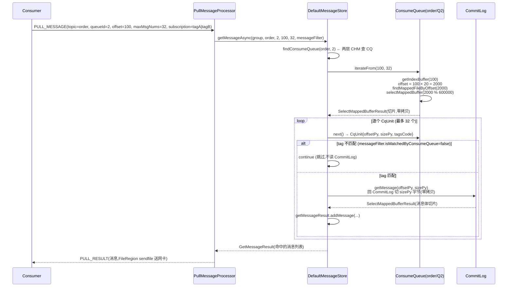

# 第六章 · ConsumeQueue:逻辑队列的重建

> 篇:第 2 篇 · 存储读取
> 主线呼应:第 1 篇(P1-02 ~ P1-05)讲完了"一条消息怎么进 CommitLog"——编码成字节、锁内串行追加、刷盘不丢、后台 `ReputMessageService` 异步分发建索引。但有一个问题从 P0-01 开始就吊着没答:**消费者说"我要 `Topic=order` 的 `Queue=2` 从 `offset=100` 开始的下 32 条消息",Broker 怎么从那个所有 Topic 混写的 CommitLog 里,把这几条消息捞出来?** 直接扫 CommitLog 是 O(全量)的灾难(它是混写的大文件);CommitLog 自己也没有"按 topic-queue 排好序"的能力。这一章就是答这个问题——RocketMQ 用一个叫 **ConsumeQueue** 的文件,把混写的 CommitLog **重新按"每个 topic-queue 在队列内的偏移"组织起来**。它不存消息体,只存一条条 **20 字节定长单元**(8 字节 CommitLog 物理偏移 + 4 字节消息总长 + 8 字节 tag hashcode),让消费端拿着 `consumeOffset` 用一次乘法 O(1) 算出 CommitLog 里的物理位置,再回 CommitLog 取消息体。读懂这一章,你就理解了 RocketMQ 怎么把"混写换纯顺序写"付出的那笔"读随机化"的账,用一张紧凑的索引表收回来。

## 核心问题

**CommitLog 里所有 Topic 的消息交错混写,消费端"我要 topic=T 的 queue=Q 从 offset=O 开始的消息"怎么找?RocketMQ 怎么用每个 topic-queue 一个 ConsumeQueue、每条消息占固定 20 字节的紧凑数组,让 consumeOffset 能 O(1) 算出 CommitLog 物理偏移、并顺手做一道 tag 过滤?**

读完本章你会明白:

1. 为什么 CommitLog 直接答不了"按 topic-queue-offset 找消息",必须再起一张"按队列顺序重建"的索引——以及为什么这张索引**不存消息体**,只存 20 字节(物理偏移 + 长度 + tag hash)。
2. ConsumeQueue 怎么按 `consumeOffset` O(1) 定位:因为 20 字节定长,`偏移 = consumeOffset × 20`,**consumeOffset 就是数组下标**——这一行乘法是它"消费拉取飞快"的根。
3. 8 字节 tag hashcode 怎么做服务端 tag 过滤的第一道筛:`PullMessageProcessor` 用消费者订阅的 `subscriptionData` 的 `tagsCode` 集合比对 CqUnit 的 `tagsCode`,**命中才回 CommitLog 取体**——绝大多数 tag 不匹配的消息,**根本不会触发那一次 CommitLog 随机读**。
4. ConsumeQueue 也是一个 `MappedFileQueue`(一组滚动 `MappedFile`,默认每个 30 万条 × 20 字节 = 60 万字节),`getIndexBuffer` 怎么 `startIndex × 20` 换算物理偏移再 `slice()` 切片返回,mmap 零拷贝。
5. 写一条 ConsumeQueue 的入口(`putMessagePositionInfo`):拿 8 字节 offset、4 字节 size、8 字节 tagsCode 塞进 `byteBufferIndex`、再追加进 MappedFile——这条路径由 Reput 后台线程调用,前台写路径完全不知情。

> **如果一读觉得太难**:先只记住三件事——① ConsumeQueue 每个 topic-queue 一个文件,每条消息对应一个 20 字节单元(8 物理偏移 + 4 长度 + 8 tag hash),**不存消息体**;② `consumeOffset` 就是数组下标,`偏移 = consumeOffset × 20`,一次乘法 O(1) 定位;③ tag hash 让服务端**不用回 CommitLog 读消息体**就能做第一道 tag 过滤。理解这三点,你就抓住了本章的灵魂。

---

## 6.1 一句话点破

> **ConsumeQueue 是每个 topic-queue 一个的逻辑队列索引。它不存消息体,只把 CommitLog 里混写的每条消息,重新按"队列内偏移"排成一张紧凑的 20 字节定长数组——8 字节 CommitLog 物理偏移、4 字节消息总长、8 字节 tag hashcode。消费端拿着 `consumeOffset` 一查,一次乘法 `consumeOffset × 20` 算出它在 ConsumeQueue 里的字节位置,读出物理偏移,再回 CommitLog 取消息体。定长换 O(1) 定位、紧凑换索引也常驻页缓存、tag hash 换服务端过滤不读消息体——三笔账一起把"混写 CommitLog"付出的"读随机化"代价收回来。**

这是结论,不是理由。本章倒过来拆:先看 CommitLog 凭什么答不了这个问题,再看 ConsumeQueue 这张表为什么非 20 字节定长不可,然后钻进 `putMessagePositionInfo` 看写一条怎么落盘,最后看消费拉取时 `iterateFrom` 怎么切片返回、`getMessage` 怎么两段式回 CommitLog 取消息体。

---

## 6.2 CommitLog 答不了这个问题:必须重建逻辑队列

第 1 章(P0-01)立了那个反直觉的抉择——所有 Topic 的所有消息一股脑追加进一个 CommitLog。这个抉择换来纯顺序写的极致吞吐,代价立刻现形:**CommitLog 在物理上是"所有 topic 的消息按到达顺序交错排成的字节流",根本没有"按 topic-queue 在队列内顺序排好"的能力**。

举个具体例子。假设 Topic=`order` 有 4 个 queue,一段时间内 broker 收到的消息按到达顺序是:

```
T0  pay/Q1/msg-A      CommitLog 字节 [0,    100)
T1  order/Q2/msg-B    CommitLog 字节 [100,  280)   ← order-Q2 的第 0 条 (queueOffset=0)
T2  log/Q0/msg-C      CommitLog 字节 [280,  340)
T3  order/Q2/msg-D    CommitLog 字节 [340,  520)   ← order-Q2 的第 1 条 (queueOffset=1)
T4  pay/Q3/msg-E      CommitLog 字节 [520,  640)
T5  order/Q2/msg-F    CommitLog 字节 [640,  820)   ← order-Q2 的第 2 条 (queueOffset=2)
...
```

现在消费者说"我要 `order/Q2` 从 `offset=1` 开始的下 32 条"。CommitLog 是混写的,你要的 `order/Q2` 的消息(`msg-D`、`msg-F`、……)在 CommitLog 里**和 pay、log 的消息交错着**,物理位置完全不连续。要找到它们,只能干一件事:**从头扫整个 CommitLog,逐条解析出 topic/queueId,挑出 `order/Q2` 的那几条**——这是 O(全量) 的灾难,百万条消息里找 32 条要扫遍百万条。

> **不这样会怎样**(朴素地扫 CommitLog):百万消息的 Topic,消费端每拉一次都要把 CommitLog 全扫一遍,IO 放大 100 万倍,消费尾延迟到几秒甚至几十秒——这种 MQ 根本没法用。**CommitLog 在物理上是混写的,而消费要的是"按队列顺序"——这两者天然不一致,必须有一张中间表把"队列顺序"从"物理混写"里重建出来**。

那张中间表就是 **ConsumeQueue**。每个 topic-queue 一份(`order-Q0` 一份、`order-Q1` 一份、……、`order-Q2` 一份),只把这个 topic-queue 的消息**按队列内偏移(queueOffset)排好序**,每条对应一个**定长 20 字节单元**。消费者拿着 `order/Q2` 的 ConsumeQueue,从 `offset=1` 开始——第 1 个单元就是 `msg-D` 在 CommitLog 的物理偏移(`340`),第 2 个单元是 `msg-F`(`640`),依此类推。**消费端的"按队列顺序拉消息",在 ConsumeQueue 里就是顺着数组从头读到尾——O(队列长度),不是 O(全量)**。

那为什么不直接把消息体按 topic-queue 分文件存(Kafka 的做法)?这正是第 1 章讲过的根本分野:那样会让写退化为"多文件间随机写",Topic 一多吞吐就崩。RocketMQ 选了"写混写一个 CommitLog,读靠 ConsumeQueue 重建逻辑队列"——**写极致简单,读多一张索引表**,这笔交易换来的是写吞吐对 Topic 数量免疫。

> **钉死这件事**:ConsumeQueue 是"混写一个 CommitLog"这笔交易里,**必然要出现的那个补丁**。它把"按队列顺序"这个消费端需要的视图,从"按到达顺序物理混写"的 CommitLog 里**重新切出来**。没有它,消费端就只能 O(全量) 扫 CommitLog,RocketMQ 的"混写换吞吐"就完全不可用。

---

## 6.3 20 字节定长单元:本章核心图

现在看 ConsumeQueue 这张表到底长什么样。这是本章最核心的一张图,务必记牢:

```
 ConsumeQueue 一个单元 = 20 字节定长(CQ_STORE_UNIT_SIZE = 20,ConsumeQueue.java#L64):
 ┌────────────────────┬──────────────┬────────────────────┐
 │  CommitLog Offset  │   MsgSize    │     TagHashCode    │
 │      (8 字节)       │   (4 字节)    │      (8 字节)       │
 ├────────────────────┼──────────────┼────────────────────┤
 │ 这条消息在 CommitLog │ 消息总长度    │ tag 字符串的        │
 │ 的物理字节偏移       │ (含全部字段)   │ hashCode,Long 型   │
 │ → 拿它回 CommitLog   │ → 回 CommitLog│ → 服务端 tag 过滤   │
 │   取真实消息体       │   取多少字节  │   第一道筛(6.6 节) │
 └────────────────────┴──────────────┴────────────────────┘
       ↑                                            ↑
       └── 一个 ConsumeQueue 文件 = 这种单元一条紧挨一条的紧凑数组

 consumeOffset(队列内偏移) = 数组下标:
   第 0 条消息的单元  → ConsumeQueue 字节偏移 [0,   20)
   第 1 条消息的单元  → ConsumeQueue 字节偏移 [20,  40)
   第 2 条消息的单元  → ConsumeQueue 字节偏移 [40,  60)
   ...
   第 N 条消息的单元  → ConsumeQueue 字节偏移 [N×20, (N+1)×20)

 所以:ConsumeQueue 字节偏移 = consumeOffset × 20     ← 一次乘法 O(1) 定位
```

源码里这个常量就是这么写的([ConsumeQueue.java#L64](../rocketmq/store/src/main/java/org/apache/rocketmq/store/ConsumeQueue.java#L64)):

```java
public static final int CQ_STORE_UNIT_SIZE = 20;       // :64 —— 20 字节定长
```

源码文件里 `#L52-L63` 的注释,就是上面这张图的字面来源——把 20 字节拆成 `offset(long) + size(int) + tagscode(long)`。**8 + 4 + 8 = 20,一个不多一个不少**。

几个**容易卡住的点**,逐一拆透。

### 第一,为什么是 20 字节,不是 24、不是 16?

这 20 字节是 ConsumeQueue 能 O(1) 定位、又能服务端过滤的最小必要信息集:

- **8 字节 CommitLog 物理偏移**(long):CommitLog 单文件 1GB,多个文件首尾相接,总偏移可以到 TB 级——必须 8 字节 long 才存得下。**没有这个字段,根本找不到消息在 CommitLog 哪里**。
- **4 字节消息总长**(int):单条消息最大约 4MB(`maxMessageSize`),int(2GB)够用——**4 字节而不是 8 字节,省 4 字节**。知道长度才能回 CommitLog 取对应字节数,也能在 CommitLog 里跳过这条。
- **8 字节 tag hashcode**(long):tag 是消息属性里的一个字符串(如 `tagA`、`vip`),消费端订阅时可以只订某些 tag。8 字节存的是 tag 的 hashCode,**不存 tag 字符串本身**——存字符串就变长了,定长就破了。

> **钉死这件事**:20 字节 = 8(offset)+ 4(size)+ 8(tagsCode),是"能定位 + 能取体 + 能过滤"三件事的最小必要字段集。三个字段都是定长,且都压到了能用的最小宽度(size 用 4 字节而非 8)。**ConsumeQueue 的所有特性(O(1) 定位、零拷贝切片、服务端 tag 过滤)都建立在这 20 字节定长之上**。

### 第二,为什么必须定长?—— 定长是 O(1) 定位的前提

这是本章最关键的技巧,值得反复钉。因为单元定长 20 字节,所以:

```
ConsumeQueue 文件偏移 = consumeOffset × 20
```

一次乘法。消费端说"从 offset=100 开始",`getIndexBuffer(100)` 立刻知道要从 ConsumeQueue 的字节偏移 `100 × 20 = 2000` 开始读——不需要扫前面的 99 条,不需要查任何"长度查找表",不需要二分。**这就是 ConsumeQueue 拉取飞快的根**。

> **反面对比**(不定长索引会怎样):假设 ConsumeQueue 每条单元长度可变(比如存了 tag 字符串而不是 hashcode,长度随 tag 字符数变化),那"第 N 条在哪个字节偏移"就**算不出来了**——只能要么存一张"每条长度表"(额外空间 + 多一次查表),要么从头累加长度(O(N) 扫描),要么建一棵"前缀和索引 + 二分"(O(log N) + 实现复杂度爆炸)。无论哪种,都比"一次乘法"慢得多、复杂得多。**定长换 O(1),这是 ConsumeQueue 设计的灵魂**。

这条原理在第 7 章(P2-07 IndexFile)还会再出现一次——IndexFile 也是单文件定长(slot 4 字节 + 条目 20 字节),原理同构。**"定长 → 偏移可算 → O(1) 定位"是 RocketMQ 所有高性能索引的通用范式**。

### 第三,8 字节 tag hashcode 凭什么能做服务端过滤?(详讲见 6.6)

tag 是消息的属性字符串,但 ConsumeQueue **不存 tag 字符串本身**,存的是它的 hashCode。这有两个直接好处:

- **定长**:hashCode 是固定 8 字节 long,不破坏 20 字节定长。
- **够用**:服务端 tag 过滤只需要"这条消息的 tag 是不是消费者订的那几个之一"——这是个**集合成员判定**,用 hashcode 比对**几乎足够**(hashcode 碰撞时会有假阳性,但这一步只是粗筛,真正的 tag 比对在客户端拿到消息后再做一次,假阳性最多浪费一次 CommitLog 读,不会错)。

这个 tag hash 是怎么算的?在 `CommitLogDispatcherBuildConsumeQueue` 的上游(Reput 解析消息时),`DispatchRequest.getTagsCode()` 就已经算好了——它是 `MessageConst.PROPERTY_TAGS` 这个 properties 字符串的 `hashCode()`,转成 long。这个值在 ConsumeQueue 里随消息一起写进去,消费端拉消息时,`PullMessageProcessor` 拿消费者订阅的 `subscriptionData.getCodeSet()`(订阅 tag 的 hashcode 集合)和 CqUnit 的 tagsCode 比对——**命中才回 CommitLog 取消息体**。

> **钉死这件事**:tag hashcode 这一字段,让 ConsumeQueue 在"不读 CommitLog 消息体"的前提下,就能完成服务端 tag 过滤的第一道筛。**绝大多数 tag 不匹配的消息,根本不会触发那次 CommitLog 随机读**——这是 ConsumeQueue 把"读随机化"代价进一步压缩的关键。详见 6.6 节。

### 第四,ConsumeQueue 也是一个 MappedFileQueue

ConsumeQueue 不是单文件,而是一组滚动的 `MappedFile` 首尾相接——和 CommitLog 一样基于 `MappedFileQueue`([ConsumeQueue.java#L71](../rocketmq/store/src/main/java/org/apache/rocketmq/store/ConsumeQueue.java#L71))。默认每个 MappedFile 30 万个单元(30w × 20 = 600000 字节,约 600KB),配在 `MessageStoreConfig.mappedFileSizeConsumeQueue`([:228](../rocketmq/store/src/main/java/org/apache/rocketmq/store/config/MessageStoreConfig.java#L228))。

为什么这么小(600KB)?因为 ConsumeQueue 单条才 20 字节,600KB 已经能存 30 万条消息索引——一个繁忙的 topic-queue,几小时就写满一个文件,滚动建下一个。文件小的好处是:**过期清理粒度细**(老消息的索引能精确删)、**mmap 友好**(整文件常驻页缓存,消费热点 topic 时 ConsumeQueue 几乎全在内存)。

```
 单个 ConsumeQueue = 一组 600KB 的 MappedFile 首尾相接(MappedFileQueue):

 ┌─────────────────────────────────────────┬─────────────────────────────────────────┬─────────┐
 │  MappedFile[0]  (600KB = 30w 个 20B 单元) │  MappedFile[1]  (30w 个单元)             │   ...   │
 │  consumeOffset [0,            300000)    │  consumeOffset [300000,       600000)    │         │
 │  物理 [0,            600000)             │  物理 [600000,          1200000)         │         │
 └─────────────────────────────────────────┴─────────────────────────────────────────┴─────────┘
                       ↑                          ↑
                       │                          │
          findMappedFileByOffset(offset) 按 offset / 600000 直接算下标
```

ConsumeQueue 的"逻辑偏移"(字节偏移)和 CommitLog 的"物理偏移"用了同一套 `MappedFileQueue` 机制——`findMappedFileByOffset(offset)` 用 `offset / mappedFileSize` 算出落在第几个 MappedFile,再 `offset % mappedFileSize` 算文件内偏移。**这个"一组定长文件拼成逻辑无限长文件"的玩法,和 CommitLog 完全同构**(详见 P1-03)。

---

## 6.4 写一条 ConsumeQueue:putMessagePositionInfo

讲清楚 ConsumeQueue 的结构,现在看一条 ConsumeQueue 单元是**怎么被写进去的**。这要从第 5 章(P1-05)的 Reput 责任链接过来。

回忆 P1-05:Reput 线程顺着 CommitLog 一条条读,把每条消息解析成 `DispatchRequest`,再喂给 `dispatcherList` 责任链。链上第一个 dispatcher 就是 `CommitLogDispatcherBuildConsumeQueue`([DefaultMessageStore.java#L2240](../rocketmq/store/src/main/java/org/apache/rocketmq/store/DefaultMessageStore.java#L2240)):

```java
class CommitLogDispatcherBuildConsumeQueue implements CommitLogDispatcher {
    @Override
    public void dispatch(DispatchRequest request) throws RocksDBException {
        final int tranType = MessageSysFlag.getTransactionValue(request.getSysFlag());
        switch (tranType) {
            case MessageSysFlag.TRANSACTION_NOT_TYPE:            // 普通消息
            case MessageSysFlag.TRANSACTION_COMMIT_TYPE:         // 事务消息已 commit
                putMessagePositionInfo(request);                 // :2248 —— 写 ConsumeQueue
                break;
            case MessageSysFlag.TRANSACTION_PREPARED_TYPE:       // 事务 half message(未决)
            case MessageSysFlag.TRANSACTION_ROLLBACK_TYPE:       // 事务回滚
                break;                                           // 不进 ConsumeQueue(对消费者不可见)
        }
    }
}
```

`putMessagePositionInfo(DispatchRequest)`([DefaultMessageStore.java#L2076](../rocketmq/store/src/main/java/org/apache/rocketmq/store/DefaultMessageStore.java#L2076))只是个薄转发:

```java
protected void putMessagePositionInfo(DispatchRequest dispatchRequest) throws RocksDBException {
    this.consumeQueueStore.putMessagePositionInfoWrapper(dispatchRequest);   // :2077
}
```

`ConsumeQueueStore.putMessagePositionInfoWrapper`([ConsumeQueueStore.java#L191](../rocketmq/store/src/main/java/org/apache/rocketmq/store/queue/ConsumeQueueStore.java#L191))先按 `topic-queueId` 找到(或创建)那个 ConsumeQueue,再委托给它:

```java
public void putMessagePositionInfoWrapper(DispatchRequest dispatchRequest) {
    ConsumeQueueInterface cq = this.findOrCreateConsumeQueue(
        dispatchRequest.getTopic(), dispatchRequest.getQueueId());            // 按 topic-queueId 找 CQ
    this.putMessagePositionInfoWrapper(cq, dispatchRequest);                  // 委托
}
```

注意 `consumeQueueTable` 的结构([AbstractConsumeQueueStore.java#L37](../rocketmq/store/src/main/java/org/apache/rocketmq/store/queue/AbstractConsumeQueueStore.java#L37)):

```java
protected final ConcurrentMap<String/* topic */, ConcurrentMap<Integer/* queueId */, ConsumeQueueInterface>> consumeQueueTable;
```

这是个**两层嵌套的 `ConcurrentHashMap`**——外层 key 是 topic,内层 key 是 queueId。`findOrCreateConsumeQueue(topic, queueId)`([ConsumeQueueStore.java#L414](../rocketmq/store/src/main/java/org/apache/rocketmq/store/queue/ConsumeQueueStore.java#L414))就是双层 `computeIfAbsent`——外层拿 topic 的内层 map、内层按 queueId 拿 ConsumeQueue,没有就新建。CHM 自身的分段并发性,保证"多 topic 并发建 ConsumeQueue"不互锁。

真正写 20 字节单元的代码在 `ConsumeQueue.putMessagePositionInfo`([ConsumeQueue.java#L835](../rocketmq/store/src/main/java/org/apache/rocketmq/store/ConsumeQueue.java#L835)):

```java
private boolean putMessagePositionInfo(final long offset, final int size, final long tagsCode,
    final long cqOffset) {

    this.byteBufferIndex.flip();                                  // :848 复用 ByteBuffer
    this.byteBufferIndex.limit(CQ_STORE_UNIT_SIZE);
    this.byteBufferIndex.putLong(offset);                         // 8 字节 CommitLog 物理偏移
    this.byteBufferIndex.putInt(size);                            // 4 字节 消息总长
    this.byteBufferIndex.putLong(tagsCode);                       // 8 字节 tag hashcode

    final long expectLogicOffset = cqOffset * CQ_STORE_UNIT_SIZE;  // :854 期望逻辑偏移 = cqOffset × 20

    MappedFile mappedFile = this.mappedFileQueue.getLastMappedFile(expectLogicOffset);
    if (mappedFile != null) {
        // ... 边界检查、ConsumeQueueExt 处理 ...
        return mappedFile.appendMessageUsingFileChannel(this.byteBufferIndex.array())
            || mappedFile.appendMessage(this.byteBufferIndex.array());    // :890-L894 追加 20 字节
    }
    return false;
}
```

这段代码每个细节都值得拆:

1. **`byteBufferIndex` 是 ConsumeQueue 实例字段**(`private final ByteBuffer byteBufferIndex;` [:L74](../rocketmq/store/src/main/java/org/apache/rocketmq/store/ConsumeQueue.java#L74),`ByteBuffer.allocate(CQ_STORE_UNIT_SIZE)`)。每写一条,先 `flip()` + `limit(20)` 复位、写满 20 字节、再 `array()` 拿底层字节数组追加进 MappedFile。**这个 20 字节 buffer 在 ConsumeQueue 生命周期内复用,不每条 new 一个**——零分配,这是高吞吐的细节。

2. **`expectLogicOffset = cqOffset × CQ_STORE_UNIT_SIZE`**([:854](../rocketmq/store/src/main/java/org/apache/rocketmq/store/ConsumeQueue.java#L854))——这行代码是本章主题的字面体现。"这条消息在 ConsumeQueue 应该写到哪个字节偏移",就是它的队列偏移 `cqOffset` 乘 20。`getLastMappedFile(expectLogicOffset)` 用这个偏移决定写到哪个 MappedFile(如果跨文件就滚动建下一个)。

3. **写底层用 FileChannel 或 mmap 二选一**(`isPutConsumeQueueDataByFileChannel()` 控制开关)。两条路径都把 20 字节追加进 MappedFile 末尾——区别只是"经 FileChannel.write 还是经 MappedByteBuffer.put"。写完后 MappedFile 的 `wrotePosition` 推进 20 字节。

4. **整条路径在前台写路径之外**:这段代码由 Reput 后台线程调(详见 P1-05 的 dispatcher 责任链),**`CommitLog.asyncPutMessage` 完全不知道 ConsumeQueue 的存在**。写 CommitLog 保持纯顺序追加的极致吞吐,建 ConsumeQueue 的脏活全甩后台——这正是 P1-05 立的"写-建索引解耦"。

> **钉死这件事**:写一条 ConsumeQueue 的核心动作就是 `byteBufferIndex.putLong(offset); putInt(size); putLong(tagsCode);`——往一个 20 字节 buffer 里塞三段、追加进 MappedFile。`cqOffset × 20` 算逻辑偏移,是"定长换 O(1)"在写路径上的镜像——**读时 O(1) 定位靠它,写时算目标文件也靠它,读写对称**。

### 谁分配 cqOffset?—— topicQueueTable + QueueOffsetOperator

写 ConsumeQueue 时 `cqOffset` 从哪来?这是另一个值得讲清的细节,它和 P1-03 的 `topicQueueLock` 衔接。

消息进 CommitLog 时(前台写路径),`CommitLog.asyncPutMessage` 会先给这条消息**在它所属 topic-queue 内分配一个偏移(queueOffset)**——这步叫 `assignQueueOffset`,走的不是 `putMessageLock`(那是 CommitLog 物理追加的锁),而是另一套机制:`QueueOffsetOperator`([QueueOffsetOperator.java#L35](../rocketmq/store/src/main/java/org/apache/rocketmq/store/queue/QueueOffsetOperator.java#L35))。

它持有一张表:

```java
private ConcurrentMap<String, Long> topicQueueTable = new ConcurrentHashMap<>(1024);   // :38
```

key 是 `"topic-queueId"` 字符串,value 是"这个 topic-queue 的下一个 queueOffset"。分配逻辑(`increaseQueueOffset` [:L54](../rocketmq/store/src/main/java/org/apache/rocketmq/store/queue/QueueOffsetOperator.java#L54)):

```java
public void increaseQueueOffset(String topicQueueKey, short messageNum) {
    Long queueOffset = ConcurrentHashMapUtils.computeIfAbsent(this.topicQueueTable, topicQueueKey, k -> 0L);
    topicQueueTable.put(topicQueueKey, queueOffset + messageNum);
}
```

`computeIfAbsent` 拿到当前 offset(就是这条消息的 queueOffset),然后 `put` 推进 `messageNum` 条(普通消息是 1,批量消息是批量大小)。这个值会被写进消息的 `QUEUEOFFSET` 字段(P1-02 讲过)——所以**消息进 CommitLog 时,它的 queueOffset 已经定下来了**。

后台 Reput 解析这条消息时,从消息字节的 `QUEUEOFFSET` 字段读到这个值,放进 `DispatchRequest.consumeQueueOffset`,然后写 ConsumeQueue 时 `cqOffset = dispatchRequest.getConsumeQueueOffset()`——**和当初分配的值精确对应**。

> **技巧点**(为什么 topicQueueTable 用 CHM 而不是加锁):`topicQueueTable` 是个 `ConcurrentHashMap`,key 是 topic-queueId。多线程同时写不同 topic-queue 的消息,各自的 queueOffset 分配走不同桶,**互不锁**——这正是 P1-03 提到的 `topicQueueLock` 分段锁思想的演进版本(老版本用 32 段分段锁,新版本直接用 CHM 的分段并发性)。只有"同一个 topic-queueId 并发写"才会桶级互斥。这让 queueOffset 分配的并发度对 topic-queue 数量免疫。

---

## 6.5 消费拉取的两段式:查 ConsumeQueue → 回 CommitLog 取体

讲清楚写路径,现在看消费端怎么用 ConsumeQueue。这是 P2-06 的另一半核心。

消费端的拉取请求(详见第 9 章 P3-09 长轮询)到了 broker,`PullMessageProcessor.processRequest`([PullMessageProcessor.java#L304](../rocketmq/broker/src/main/java/org/apache/rocketmq/broker/processor/PullMessageProcessor.java#L304))最终调到 `messageStore.getMessageAsync(...)`([:L566](../rocketmq/broker/src/main/java/org/apache/rocketmq/broker/processor/PullMessageProcessor.java#L566))。真正的核心在 `DefaultMessageStore.getMessage`([DefaultMessageStore.java#L866](../rocketmq/store/src/main/java/org/apache/rocketmq/store/DefaultMessageStore.java#L866))。这段代码是 ConsumeQueue → CommitLog 两段式的字面实现,值得逐段拆。

### 第一段:从 ConsumeQueue 取一批 CqUnit

```java
public GetMessageResult getMessage(String group, String topic, int queueId, long offset,
        int maxMsgNums, final MessageFilter messageFilter) {

    ConsumeQueueInterface consumeQueue = findConsumeQueue(topic, queueId);          // :898 找 CQ
    long minOffset = consumeQueue.getMinOffsetInQueue();                            // :900
    long maxOffset = consumeQueue.getMaxOffsetInQueue();                            // :901

    if (maxOffset < 0)            return GetMessageResult.NO_MESSAGE_IN_QUEUE;
    if (offset < minOffset)       return GetMessageResult.OFFSET_TOO_SMALL;
    if (offset == maxOffset)      return GetMessageResult.NO_MESSAGE_IN_QUEUE;
    if (offset > maxOffset)       return GetMessageResult.OFFSET_OVERFLOW_ONE;
    // ... 各种 offset 边界校验 ...

    long nextBeginOffset = offset;
    // ...
    SelectMappedBufferResult bufferConsumeQueue = consumeQueue.iterateFrom(nextBeginOffset, maxMsgNums);  // :934 从 CQ 取迭代器
```

`findConsumeQueue(topic, queueId)` 走的就是 6.4 节那个两层 CHM,拿到这个 topic-queue 的 ConsumeQueue。然后边界校验(`offset` 在 `[minOffset, maxOffset]` 范围内)——这步保证消费端的 offset 没越界(越界就返回对应错误码,消费端会做 reset 或重试)。

`consumeQueue.iterateFrom(nextBeginOffset, maxMsgNums)`([ConsumeQueue.java#L929](../rocketmq/store/src/main/java/org/apache/rocketmq/store/ConsumeQueue.java#L929))是取数据的关键:

```java
@Override
public ReferredIterator<CqUnit> iterateFrom(long startOffset) {
    SelectMappedBufferResult sbr = getIndexBuffer(startOffset);          // :930 切片
    if (sbr == null) {
        return null;
    }
    return new ConsumeQueueIterator(sbr);                                 // :934 包成迭代器
}
```

`getIndexBuffer`([ConsumeQueue.java#L917](../rocketmq/store/src/main/java/org/apache/rocketmq/store/ConsumeQueue.java#L917))是本章的"读时 O(1) 定位"的字面实现:

```java
public SelectMappedBufferResult getIndexBuffer(final long startIndex) {
    int mappedFileSize = this.mappedFileSize;
    long offset = startIndex * CQ_STORE_UNIT_SIZE;                       // :920 —— consumeOffset × 20!
    if (offset >= this.getMinLogicOffset()) {
        MappedFile mappedFile = this.mappedFileQueue.findMappedFileByOffset(offset);   // :923 定位 MappedFile
        if (mappedFile != null) {
            return mappedFile.selectMappedBuffer((int) (offset % mappedFileSize));     // :926 切片
        }
    }
    return null;
}
```

`:920` 那行 `startIndex * CQ_STORE_UNIT_SIZE` 就是"一次乘法 O(1) 定位"——消费端给个 `consumeOffset=100`,立刻算出字节偏移 `2000`,经 `findMappedFileByOffset` 找到落在哪个 MappedFile,再 `offset % mappedFileSize` 算文件内偏移,`selectMappedBuffer` 切片返回。

**注意 `selectMappedBuffer` 切片不拷贝**(详见 P1-05 5.4.1):它返回的是 MappedFile 的 `MappedByteBuffer.slice()`,底层还是同一块 mmap 内存,零拷贝。所以"从 ConsumeQueue 取一批 CqUnit"**全程不进 JVM 堆**,直接读页缓存——这是 ConsumeQueue 即使在百万消息 topic 上消费也飞快的底层保证。

### 第二段:迭代 CqUnit,回 CommitLog 取消息体

拿到迭代器后,`getMessage` 的主循环逐个读 CqUnit、回 CommitLog 取体:

```java
while (bufferConsumeQueue.hasNext()                      // :945
        && nextBeginOffset < maxOffset
        && getMessageResult.getMessageMap().size() < maxMsgNums) {

    CqUnit cqUnit = bufferConsumeQueue.next();            // :947 读一个 CqUnit
    long offsetPy = cqUnit.getPos();                      // :948 —— 8 字节 CommitLog 物理偏移
    int sizePy = cqUnit.getSize();                        // :949 —— 4 字节 消息总长
    long tagsCode = cqUnit.getTagsCode();                 // (tag hashcode,过滤用)

    // ... maxTotalMsgSize 累加、上界判断 ...

    if (messageFilter != null
        && !messageFilter.isMatchedByConsumeQueue(cqUnit.getValidTagsCodeAsLong(), cqUnit.getCqExtUnit())) {
        // :978-L982 tag 不匹配,跳过这条,不回 CommitLog 取体
        if (getResult.getPullStatus() == PullStatus.NO_MATCHED_MSG) {
            nextBeginOffset = cqUnit.getQueueOffset() + cqUnit.getBatchNum();
        }
        continue;
    }

    SelectMappedBufferResult selectResult = this.commitLog.getMessage(offsetPy, sizePy);   // :985 回 CommitLog 取体
    if (selectResult != null) {
        getMessageResult.addMessage(selectResult, cqUnit.getQueueOffset(), cqUnit.getBatchNum());
    }
    // ...
}
```

这段代码的**两段式结构**清晰得不能再清晰:

1. **第一段**(ConsumeQueue):`bufferConsumeQueue.next()` 读一个 CqUnit(20 字节),拿出 `offsetPy`(CommitLog 物理偏移)、`sizePy`(消息长)、`tagsCode`(tag hash)。
2. **tag 过滤**:用 `messageFilter.isMatchedByConsumeQueue(tagsCode, ...)` 判断——**不匹配就 `continue`,不触发第二步**。这一步只用了 CqUnit 的 8 字节 tagsCode,**没有读 CommitLog 消息体**(6.6 详讲)。
3. **第二段**(CommitLog):tag 匹配的,才 `this.commitLog.getMessage(offsetPy, sizePy)`——按物理偏移和长度,从 CommitLog 切一段消息体出来。

`commitLog.getMessage(offset, size)`([CommitLog.java](../rocketmq/store/src/main/java/org/apache/rocketmq/store/CommitLog.java))干的事和 `getData` 类似(P1-05 5.4.1 讲过):按 `offset` 找到落在哪个 MappedFile,`offset % 1GB` 算文件内偏移,`mappedFile.selectMappedBuffer(pos, size)` 切 `size` 字节返回。**同样零拷贝**——切片不进 JVM 堆。

这张两段式时序画出来:



这张图是 P2-06 的全部戏:**消费端的"按队列顺序拉消息",在 broker 侧就是 ConsumeQueue → CommitLog 的两段跳转**。第一段靠 20 字节定长 O(1) 定位 + 零拷贝切片,第二段靠 CommitLog 物理偏移 + 零拷贝切片。两次零拷贝,消息全程不进 JVM 堆(8.2 章 P2-08 详讲)。

> **钉死这件事**:ConsumeQueue 的全部价值,就是这张两段式图。它把"按 topic-queue-offset 顺序消费"这个消费端最核心的需求,翻译成"一次 ConsumeQueue 乘法定位 + 一次 CommitLog 物理读"。**没有 ConsumeQueue,这个翻译不存在,消费就只能 O(全量) 扫 CommitLog**。这是它作为"混写 CommitLog 必然补丁"的完整论证。

---

## 6.6 技巧精解:20 字节定长单元 + tag hashcode 服务端过滤

这一节挑本章最硬核的两个技巧单独拆透:**(1) 为什么 ConsumeQueue 必须定长 20 字节;(2) tag hashcode 怎么让服务端过滤不读 CommitLog**。两者都配反面对比,让妙处显形。

### 技巧一:20 字节定长 → consumeOffset 即数组下标 → O(1) 定位

这个技巧是 ConsumeQueue 的灵魂,贯穿读路径(`getIndexBuffer`)和写路径(`putMessagePositionInfo` 的 `expectLogicOffset = cqOffset × 20`)。它的精髓可以用一句话概括:

> **因为每条单元定长 20 字节,所以"第 N 条在哪个字节偏移"就是 `N × 20`,一次乘法算出来。consumeOffset 直接当数组下标用,不需要任何长度查找表、不需要二分、不需要扫描。**

这一点为什么 sound(为什么这么写不会出错)?三个保证:

1. **20 字节是编译期常量**(`CQ_STORE_UNIT_SIZE = 20`)。每条单元都恰好 20 字节,从第 0 条到第 N 亿条,**永远不变**。所以乘法公式 `N × 20` 对所有 N 都精确成立。
2. **写时按 `cqOffset` 顺序追加**。Reput 是单线程的(P1-05 讲过),按 CommitLog 物理顺序读消息;同一个 topic-queue 的消息,它的 `cqOffset` 是 `QueueOffsetOperator` 单调递增分配的(`computeIfAbsent` + `put` 推进)。所以"第 N 条一定写在 `[N×20, (N+1)×20)`"——**下标和位置严格对应,不会有空洞**。
3. **MappedFile 滚动透明**。一组 600KB 的 MappedFile 首尾相接,`findMappedFileByOffset(offset)` 用 `offset / 600000` 算文件下标,对上层透明。所以"在哪个 MappedFile"也不需要额外的查找逻辑。

> **反面对比**(不定长索引会怎样):这条钉死要再讲一次。假设 ConsumeQueue 单元长度可变(比如存了 tag 字符串),消费端说"给我 offset=100 开始的"——你**不知道第 100 条在哪个字节偏移**。三种朴素解法各有死穴:
>
> 1. **存一张"每条单元的起始偏移"表**:每读一条要先查表,表本身又是变长的(随消息数增长),内存和 IO 双重开销。
> 2. **从头累加长度**:O(N) 扫描,百万消息的 topic 要扫百万次乘法,完全无法接受。
> 3. **前缀和数组 + 二分**:O(log N) 但要维护前缀和,且插入新条目要更新整段前缀和(或用平衡树维护,实现复杂度爆炸)。
>
> 三种都比"一次乘法"慢且复杂。**定长是 ConsumeQueue O(1) 定位的唯一前提,这也是它敢叫"逻辑队列"而不是"逻辑链表"的根**——它是数组,不是链表。

这个原理和第 7 章(P2-07 IndexFile)同构:IndexFile 也是单文件定长(slot 4 字节 + 条目 20 字节),slot 和条目的偏移都能 `O(1)` 算。**"定长 → 偏移可算 → O(1) 定位"是 RocketMQ 所有高性能索引的通用范式**,和《LevelDB》里 block 的定长 entry offset、《Linux 内存管理》里 buddy 的定长页阶是同一种工程直觉。

### 技巧二:tag hashcode 让服务端过滤不读 CommitLog

第二个技巧更巧妙。ConsumeQueue 的第三段 8 字节 tag hashcode,让服务端能在**完全不读 CommitLog 消息体**的前提下,完成 tag 过滤的第一道筛。

先看消费端订阅 tag 的语义。消费者订阅时会带一个 `subscription`:

```java
consumer.subscribe("order", "tagA || tagB");   // 只订 tagA 或 tagB 的消息
```

这个订阅到了 broker,被解析成 `SubscriptionData`,里面有一个 `Set<String> tags` 和一个 `Set<Long> codeSet`——后者是前者每个 tag 字符串的 `hashCode()` 集合(`tagsCode`)。**注意:broker 端持有的是 `codeSet`(hashcode 集合),不是 tag 字符串集合**——因为 ConsumeQueue 里存的也是 hashcode,两边都用 hashcode 比对,直接 `codeSet.contains(cqUnit.getTagsCode())`。

在 `getMessage` 主循环里,这一步是:

```java
if (messageFilter != null
    && !messageFilter.isMatchedByConsumeQueue(cqUnit.getValidTagsCodeAsLong(), cqUnit.getCqExtUnit())) {
    // 不匹配:跳过,不回 CommitLog 取体
    continue;
}
SelectMappedBufferResult selectResult = this.commitLog.getMessage(offsetPy, sizePy);   // 匹配才取体
```

`isMatchedByConsumeQueue` 的默认实现(`ExpressionForRetryMessageFilter` / `ExpressionMessageFilter`)就是 `codeSet.contains(tagsCode)`——**一次 HashSet 查找,O(1)**。命中才回 CommitLog 取体,不命中直接跳过。

这个设计的精妙处,要和反面对比才显形:

> **反面对比**(如果不存 tag hashcode 会怎样):假设 ConsumeQueue 只有 12 字节(8 offset + 4 size,没有 tag hash),那 broker 做 tag 过滤就**必须回 CommitLog 读消息体**——逐条把消息取出来、解析 properties、读出 tag 字符串、比对订阅。会发生什么?
>
> - **IO 放大爆炸**:消费者订了 `tagA`,但 topic 里 99% 是 `tagB` 的消息。broker 要把这 99% 的消息**全部从 CommitLog 读出来、解析、比对、扔掉**——每次拉取,CommitLog 的随机读放大 100 倍。ConsumeQueue 的紧凑索引白建了,消费拉取直接被 CommitLog 随机读拖垮。
> - **CPU 浪费**:每条消息都要解析 properties(字符串解析、HashMap 查找),哪怕最后扔掉。
>
> 存了 tag hashcode 后,**99% 的 tag 不匹配消息,在 ConsumeQueue 这一层就被筛掉了,根本不触发那次 CommitLog 随机读**。这是 ConsumeQueue 把"读随机化"代价进一步压缩的关键一招——**用 8 字节 hashcode 换 99% 的 IO 放大消失**,这笔交易极其划算。

注意 `isMatchedByConsumeQueue` 这一步是**粗筛**:

- **hashcode 碰撞的假阳性**:两个不同 tag 的 hashcode 可能相同,`codeSet.contains` 返回 true,但其实 tag 不匹配。这种情况下会回 CommitLog 取出消息体,客户端拿到后再做一次**精确 tag 比对**(用真实 tag 字符串),把假阳性的扔掉。**假阳性的代价是多一次 CommitLog 读,但不会出错**——消息不会错发给消费者。
- **null tag 的处理**:消息没带 tag(`tagsCode` 可能为 0 或特殊值),过滤逻辑有专门分支处理——具体在 `ExpressionMessageFilter` 里,这里不展开。

> **钉死这件事**:tag hashcode 这一字段,是 ConsumeQueue "索引不只是定位、还能过滤"的关键。它把"服务端 tag 过滤"从"必须读 CommitLog 消息体"降到"只读 ConsumeQueue 的 8 字节",让 99% 的不匹配消息在索引层就被筛掉。这是 ConsumeQueue 三段字节里最巧妙的一段——**前 12 字节负责"在哪",后 8 字节负责"要不要"**。

### 技巧三(补):consumeOffset 是逻辑队列内偏移,和 CommitLog 物理偏移解耦

最后点一个常被忽略的技巧:**consumeOffset(队列内偏移)和 CommitLog 物理偏移是两套独立坐标**。

- **consumeOffset**:这条消息在它所属 topic-queue 里的第几条(从 0 递增),由 `QueueOffsetOperator` 分配。它在 ConsumeQueue 里对应字节偏移 `consumeOffset × 20`。
- **CommitLog 物理偏移**:这条消息在 CommitLog 这个全局混写大文件里的字节位置,由 CommitLog 串行追加顺序分配。

这两套坐标**完全独立**——同一个 topic-queue 的两条相邻消息(consumeOffset 连续),在 CommitLog 里物理位置可能隔了几千字节(中间插了别的 topic 的消息);反过来,CommitLog 里相邻的两条消息,可能分属完全不同的 topic-queue,consumeOffset 互不相关。

ConsumeQueue 这张表,本质就是**这两套坐标的映射表**——`consumeOffset → CommitLog 物理偏移`。它让消费端的"队列内顺序"语义(我要第 N 条)和存储层的"物理混写"语义(消息在 CommitLog 哪里)解耦,**消费端只管递增 consumeOffset,CommitLog 怎么混写它完全不关心**。这个解耦是"混写 CommitLog"这笔交易能成立的关键——没有 ConsumeQueue 做这个映射,消费端就得直接面对"物理混写",那就和扫 CommitLog 一样灾难。

---

## 6.7 并发与生命周期:谁在写、谁在读、怎么恢复

ConsumeQueue 的并发模型和生命周期,几个关键点要补一下,和 P2-07 的 IndexFile 对照看。

### 写:Reput 单线程 → 无锁写

ConsumeQueue 的写入由 Reput 后台线程串行触发(P1-05 讲过 Reput 是单线程 `ServiceThread`,除非开了 `isEnableBuildConsumeQueueConcurrently` 用并发 Reput)。**同一个 ConsumeQueue 的写入天然串行**——`putMessagePositionInfo` 不加任何锁,靠 Reput 单线程的串行性保证。

> **技巧点**(单线程换无锁共享):这是和 Netty EventLoop、Redis 单线程同源的思想——用"单生产者"换"写路径无锁"。如果 Reput 是多线程并发写同一个 ConsumeQueue,`byteBufferIndex` 这个实例字段就要加锁(否则 `flip` / `putLong` / `putInt` / `putLong` 这几步会被别的线程打断,数据错乱)。RocketMQ 选了"Reput 单线程串行 dispatch",写 ConsumeQueue 零锁。代价是 Reput 是吞吐瓶颈(单线程处理所有 topic 的 dispatch),但在 RocketMQ 的场景下够用——5.x 为极端场景提供了并发 Reput 选项。

### 读:消费拉取多线程并发 → mmap 页缓存兜底

读 ConsumeQueue 的线程是**消费拉取的处理线程**(`PullMessageProcessor` 的线程池,详见第 14 章 P4-14),多个 topic-queue 的拉取请求并发执行。它们通过 `getIndexBuffer` 切片读 MappedFile——**切片是只读的,多个线程同时读同一个 ConsumeQueue 互不影响**(mmap 的页缓存对多读者并发友好)。

注意读 ConsumeQueue **不加锁**——这得益于两点:① 读只切 MappedByteBuffer 的 slice,不改 MappedFile 的元数据;② Reput 写新条目时,是追加在 MappedFile 末尾(`wrotePosition` 推进),不会改老数据。所以"读老单元"和"写新单元"在同一个 MappedFile 上是**无冲突的**(append-only 的天然优势,和 CommitLog 一样)。

### 生命周期:load / 滚动 / 过期删 / 刷盘

ConsumeQueue 的生命周期管理和 IndexFile 同构(对照 P2-07 7.7):

- **load**:`ConsumeQueueStore.load` 启动时扫 `storePath/consumequeue` 目录,按 `topic/queueId/` 二级目录加载所有 ConsumeQueue 的 MappedFile,恢复 `minLogicOffset` 等字段。**ConsumeQueue 是衍生物,允许部分丢失——只要 CommitLog 在,Reput 能从 `confirmOffset` 开始扫,把 ConsumeQueue 重建**(P1-05 5.6 讲过这个恢复路径)。
- **滚动建新文件**:写满一个 600KB MappedFile,`getLastMappedFile(expectLogicOffset)` 自动滚动建下一个(6.4 节讲过)。文件名是起始的逻辑偏移(如 `00000000000000000000`、`0000000000000600000`),按名排序即按物理顺序。
- **过期删**:`CleanConsumeQueueService`([ConsumeQueueStore.java#L867](../rocketmq/store/src/main/java/org/apache/rocketmq/store/queue/ConsumeQueueStore.java#L867))按 CommitLog 的最小物理偏移删——如果某个 ConsumeQueue 文件的 `maxPhysicOffset < commitLog.minOffset`(它索引的消息在 CommitLog 里已经被清了),这个文件就没用了,删掉。
- **刷盘**:`FlushConsumeQueueService`([ConsumeQueueStore.java#L668](../rocketmq/store/src/main/java/org/apache/rocketmq/store/queue/ConsumeQueueStore.java#L668))定时 flush。和 CommitLog 的刷盘是**两套独立机制**(P1-04 讲 CommitLog 刷盘)——ConsumeQueue 是衍生物,丢一部分能从 CommitLog 重建,所以刷盘频率可以低很多,省 IO。

> **钉死这件事**:ConsumeQueue 的生命周期策略,处处体现"它是衍生物、CommitLog 是 source of truth"这个第 1 章立的原则——丢失可重建、刷盘可低频、过期按 CommitLog 删。这让 ConsumeQueue 的运维成本极低:你不用担心它损坏,只要 CommitLog 还在,它就能重建。这是"混写一个 CommitLog"这笔交易的一个意外红利——**索引可重建,意味着索引层可以放手优化(定长、紧凑、mmap),不怕丢**。

---

## 章末小结

这一章我们讲完了 RocketMQ 的第一条读路径——**按 topic-queue-offset 顺序消费**。ConsumeQueue 用一张"每个 topic-queue 一份、每条消息 20 字节定长"的紧凑数组,把混写的 CommitLog 重新按队列顺序组织起来,让消费端拿 consumeOffset 一次乘法 O(1) 定位、再回 CommitLog 取消息体。这是"混写一个 CommitLog"这笔交易里,把"读随机化"代价收回来的第一根支柱(第二根是第 7 章 IndexFile,管"按 key 查";第三根是第 8 章零拷贝,管"读得快")。

回到第 1 章立的二分法:**ConsumeQueue 属于"存储内核"这一面**——它是消息在 CommitLog 之上的第一套衍生物,由后台 Reput 异步建、用 mmap、回 CommitLog 取体。它和 CommitLog 的关系是"衍生物 vs source of truth":CommitLog 是消息的物理真相,ConsumeQueue 是为了"按队列顺序消费"这个读路径专门建的索引。两者职责分明、生命周期独立、损坏可重建。

第 1 篇(存储写入)和第 2 篇(存储读取)在这一章接上了——P1-05 的 Reput 把消息分发进 ConsumeQueue,P2-06 的 ConsumeQueue 让消费端能高效读出来。从下一章 P2-07 开始,我们看 RocketMQ 怎么用 IndexFile 把"按 key 随机查"这条读路径也兜起来——和 ConsumeQueue 平行,殊途同归都回到 CommitLog 取消息体。

### 五个"为什么"清单

1. **为什么消费端不能直接扫 CommitLog 找消息?** CommitLog 是所有 Topic 混写的字节流,要找某 topic-queue 的消息只能逐条解析挑出匹配的,O(全量) 灾难。必须有一张"按队列顺序重建"的中间表(ConsumeQueue),把"队列顺序"这个视图从"物理混写"里切出来。
2. **为什么 ConsumeQueue 每条单元固定 20 字节?** 定长才能"consumeOffset × 20"一次乘法 O(1) 算出字节偏移,consumeOffset 即数组下标。不定长就要查长度表/累加/二分,慢且复杂。20 字节 = 8(CommitLog 偏移)+ 4(消息长,int 够用省 4 字节)+ 8(tag hashcode),是"定位 + 取体 + 过滤"的最小必要字段集。
3. **tag hashcode 凭什么能做服务端过滤?** ConsumeQueue 存的是 tag 的 hashCode(8 字节),不是 tag 字符串。broker 端持有订阅 tag 的 hashCode 集合(codeSet),用 `codeSet.contains(cqUnit.getTagsCode())` O(1) 判断。命中才回 CommitLog 取体,不命中跳过——**99% 的不匹配消息不触发 CommitLog 随机读**,IO 放大被压到最低。hashcode 碰撞的假阳性由客户端精确 tag 比对兜底。
4. **ConsumeQueue 是写时同步建的吗?** 不是。和 IndexFile 一样,由后台 `ReputMessageService` 异步从 CommitLog 加工——`CommitLogDispatcherBuildConsumeQueue` 调 `consumeQueueStore.putMessagePositionInfoWrapper` → `ConsumeQueue.putMessagePositionInfo` 把 20 字节单元追加进 MappedFile。写路径只追加 CommitLog,建 ConsumeQueue 的脏活甩后台(详见 P1-05)。
5. **为什么 ConsumeQueue 文件可以丢、可以低频刷盘?** 因为它是衍生物——只要 CommitLog 在,Reput 从 `confirmOffset` 开始扫,能把它完整重建(P1-05 5.6 的恢复路径)。这让 ConsumeQueue 的运维成本极低,损坏可重建,刷盘频率低省 IO。这是"CommitLog 是 source of truth,ConsumeQueue 是衍生物"原则的直接红利。

### 想继续深入往哪钻

- **源码主线**:`store/ConsumeQueue.java`(`CQ_STORE_UNIT_SIZE=20`@L64、`putMessagePositionInfo`@L835、`getIndexBuffer`@L917、`iterateFrom`@L929、`increaseQueueOffset`@L828、`ConsumeQueueIterator`@L997)、`store/queue/ConsumeQueueStore.java`(`findOrCreateConsumeQueue`@L414、`putMessagePositionInfoWrapper`@L191)、`store/queue/AbstractConsumeQueueStore.java`(`consumeQueueTable`@L37 双层 CHM)、`store/queue/CqUnit.java`(`pos`@L27 / `size`@L26 / `tagsCode`@L30 字段,`getPos`@L58、`getTagsCode`@L62)、`store/queue/QueueOffsetOperator.java`(`topicQueueTable`@L38、`increaseQueueOffset`@L54)、`store/DefaultMessageStore.java`(`CommitLogDispatcherBuildConsumeQueue`@L2240、`getMessage`@L866、`commitLog.getMessage(offsetPy, sizePy)`@L985)。
- **5.x RocksDB ConsumeQueue**:在百万 Topic 场景下,经典 ConsumeQueue 每个 topic-queue 一组 MappedFile,文件数会爆炸。5.x 的 `RocksDBConsumeQueue` 用 LSM 替代,把所有 topic-queue 的索引收进一个 RocksDB。对照第 23 章(P8-23)和《LevelDB》《Linux 内存管理》的 LSM 思想。
- **并发 Reput**:5.x 的 `ConcurrentReputMessageService` 在 `isEnableBuildConsumeQueueConcurrently` 开启时启用,把不同 topic 的 dispatch 分到多线程并行建 ConsumeQueue——单线程 Reput 不够用的场景。
- **和 Kafka 对照**:Kafka 是"每 Partition 一个文件",ConsumeQueue 这个概念在 Kafka 里**不存在**(Kafka 的 `.index` 文件是 Partition 内部的 offset 索引,且因为一个 Partition 一个 log 文件,索引天然顺序写,不需要 RocketMQ 这种"重建逻辑队列"的机制)。ConsumeQueue 是 RocketMQ "混写一个 CommitLog" 这一抉择逼出的独特机制,Kafka 不需要。
- **回扣主线**:ConsumeQueue 是 P0-01 讲的"三件套"里的第二件——CommitLog(物理真相)、ConsumeQueue(按队列重建)、IndexFile(按 key 索引)。读到这里,CommitLog 和 ConsumeQueue 已经讲透,下一章 P2-07 讲第三件 IndexFile——和 ConsumeQueue 平行的另一条读路径(按 key 随机查),结构上也是"hash + 单文件定长 + mmap"的同构设计。

### 引出下一章

ConsumeQueue 解决了"按 topic-queue-offset 顺序消费",但消费还有另一种姿势——**按 key 查消息**(给我 `uniqKey=xxx` 的那条、给我 `keys=order-9527` 的那条)。ConsumeQueue 按 offset 排,根本不存业务 key,答不了这个问题。下一章 P2-07 讲 RocketMQ 怎么用 IndexFile(500w hash slot + 2000w 条目,单文件 mmap)把"按 key 查"这条读路径也兜起来——和 ConsumeQueue 平行,殊途同归最后都回到 CommitLog 取消息体。读完 P2-06 和 P2-07,你就理解了 RocketMQ 的两条核心读路径,以及它们为什么必须用两套完全不同的索引(一套按 offset 定长数组、一套按 key hash 链表)。
