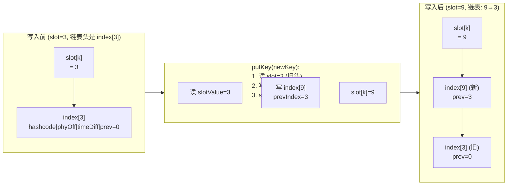
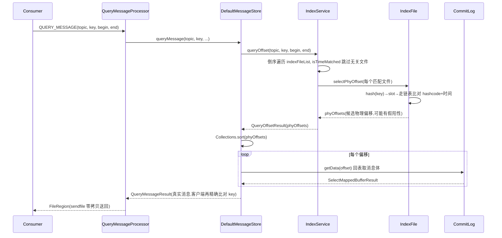

# 第七章 · IndexFile:按 key 的哈希索引

> 篇:第 2 篇 · 存储读取
> 主线呼应:上一章(P2-06)我们讲完了 ConsumeQueue——它把混写的 CommitLog 重新按"topic-queue-offset"组织起来,让消费端能顺序消费。但消费还有另一种姿势:**按 key 查消息**。生产者发消息时会带一个 `keys`(业务 key)和一个 `uniqKey`(消息唯一 id),消费者要能"给我 key 是 `order-9527` 的那条消息""给我 msgId 是 `xxx` 的那条"。CommitLog 是混写的大文件,ConsumeQueue 只按队列顺序排,它们都答不了这个问题。于是 RocketMQ 仿照数据库的二级索引,给消息建了一套**按 key 的哈希索引**——IndexFile。这一章讲透它怎么用一个"hash slot + 链表 + 单文件定长"的结构,在纯顺序写 CommitLog 的代价下,把"按 key 随机查"这条读路径也兜起来。

## 核心问题

**消费端除了按 topic-queue-offset 顺序消费,还要能"按 msgId / 业务 key 查某一条消息"。CommitLog 是混写的、ConsumeQueue 只按队列排,它们都答不了"按 key 查"——RocketMQ 怎么用一套 hash 索引(500w 个 hash slot + 2000w 条目,单文件 mmap)把这条读路径兜住?**

读完本章你会明白:

1. 为什么按 key 查不能用 ConsumeQueue(它按队列 offset 排,根本找不到 key)、也不能扫 CommitLog(O(全量)灾难)——必须建一套**独立于队列顺序**的二级索引。
2. IndexFile 的单文件布局长什么样:40 字节 IndexHeader + 500w 个 4 字节 slot + 2000w 个 20 字节条目,为什么"slot 表在前、链表条目在后"是能 mmap 的关键。
3. hash 冲突怎么用**链地址法**解决:slot 存"链表头 index 的下标",新条目头插(prevIndex 指向上一个),顺着 prevIndex 走链表比对 hashcode——整套机制只读写一个 mmap 文件,不进 JVM 堆。
4. IndexService 怎么管多个 IndexFile、按时间范围倒序遍历挑文件、QueryMessageProcessor 怎么把查到的物理偏移再回 CommitLog 取消息体(和 ConsumeQueue 一样的两段式)。

> **如果一读觉得太难**:先只记住三件事——① IndexFile 是给消息建的"按 key 的二级哈希索引",和 ConsumeQueue(按队列)是两套平行的读路径,殊途同归都回到 CommitLog 取体;② 单文件分三段(头 / slot 表 / 条目区),slot 存链表头下标,条目存 hashcode+物理偏移+时间差+前驱下标,用链地址法解冲突;③ `indexCount` 初值是 **1 不是 0**(第 0 号条目空着不用,0 当"空槽"哨兵),这是看源码最容易卡住的点。

---

## 7.1 一句话点破

> **IndexFile 是给每条消息按"topic#key"建的二级哈希索引。它把 key 哈希到一个固定大小的 slot 表,slot 存链表头条目的下标,条目区用链地址法串起所有哈希冲突的 key——key 的 hashcode、消息在 CommitLog 的物理偏移、时间差、前驱下标,四样东西紧凑成 20 字节存在同一个 mmap 文件里。查的时候 `hash(key) → slot → 顺着链表比 hashcode`,拿到物理偏移再回 CommitLog 取消息体。整套结构纯内存映射、单文件定长、重启不丢,朴素 HashMap 的两个死穴(内存放不下、重启即丢)全部化解。**

这是结论,不是理由。本章倒过来拆:先看按 key 查到底卡在哪,再看 hash + 链表这套结构为什么这么搭,最后看 IndexService 怎么把多个 IndexFile 组织起来、接到 Reput 写路径和 QueryMessageProcessor 读路径上。

---

## 7.2 按 key 查:ConsumeQueue 答不了,CommitLog 更答不了

在讲 IndexFile 之前,先把"为什么需要它"立清楚。

RocketMQ 有两种典型的读消息姿势:

- **按队列顺序消费**(第 6 章 P2-06 讲的):消费者说"我要 `Topic=order` 的 `Queue=2` 从 `offset=100` 开始的下 32 条"。ConsumeQueue 把每条消息按队列顺序排成 20 字节一单元的紧凑数组,`consumeOffset × 20` 直接算出偏移,O(1) 定位回 CommitLog。这是绝大多数消费场景。
- **按 key 查消息**(本章讲的):消费者说"给我 `uniqKey=AC11000118C0200000000001234` 的那条""给我 `keys=order-9527` 的那条"。常见于:消息追溯(某笔订单到底发了没)、去重检查(这条消息处理过没)、对账(按订单号拉全部相关消息)。

第二种姿势,前一章的 ConsumeQueue **答不了**。ConsumeQueue 的索引 key 是"队列内的 offset"——你给我 offset 我给你物理偏移,但它**不存业务 key**。想在 ConsumeQueue 里找 `order-9527`?只能从头扫到尾,逐条回 CommitLog 取出来比对 key,O(全量)灾难。

那直接扫 CommitLog 呢?更糟——CommitLog 是所有 Topic 混写的大文件,扫一遍等于把全部历史消息读一遍,百万消息的 Topic 找一条 key 要几十秒。

> **不这样会怎样**:如果 RocketMQ 不提供按 key 查的索引,业务要做"按订单号查消息"就只能自己在数据库里维护一张"订单号 → 消息位置"的表,每次发消息额外写一次库——这笔账从 MQ 转嫁给了业务,而且业务自己维护的索引和 MQ 的存储容易不一致(发消息成功但写库失败,索引就丢了)。RocketMQ 把这套二级索引**内置进存储引擎**,和消息写路径解耦(异步建),让按 key 查成为开箱即用的能力。

所以需要一个**独立于队列顺序**的、按 key 组织的索引。它要满足:

1. **按 key 能快速定位**(不能扫全量)。
2. **海量消息也存得下**(几亿条消息的 key 不能全进 JVM 堆)。
3. **重启不丢**(broker 挂了索引不能没)。
4. **建索引不拖慢写**(异步建,和 ConsumeQueue 一样甩给后台 Reput)。

RocketMQ 的答案是 IndexFile——一套**hash + 链地址法 + 单文件定长 + mmap** 的二级索引。下面看它怎么搭。

---

## 7.3 单文件布局:三段定长,能 mmap 的关键

IndexFile 的核心设计抉择是:**一个文件,分三段,全部定长,整体 mmap 进内存**。

```
 IndexFile 单文件布局(默认 hashSlotNum=500w, indexNum=2000w):
 ┌─────────────────────────────┬──────────────────────────────┬─────────────────────────────────────────┐
 │   IndexHeader (40 字节)      │   Hash Slot 表 (500w × 4B)    │   Index 条目区 (2000w × 20B)             │
 │                             │                              │                                         │
 │ beginTimestamp     (8B)     │  slot[0]   → 链表头下标 (4B)  │  index[0]  ← 空置(下标0当哨兵)           │
 │ endTimestamp       (8B)     │  slot[1]   → 链表头下标 (4B)  │  index[1]  hashcode|phyOff|timeDiff|prev│
 │ beginPhyOffset     (8B)     │  ...                         │  index[2]  hashcode|phyOff|timeDiff|prev│
 │ endPhyOffset       (8B)     │  slot[hash%slotNum] → 头下标 │  ...                                     │
 │ hashSlotCount      (4B)     │  ...                         │  index[indexCount-1] (当前待写位置)      │
 │ indexCount         (4B)     │  slot[4999999] (4B)          │  ... 直到 index[2000w-1]                 │
 ├─────────────────────────────┴──────────────────────────────┴─────────────────────────────────────────┤
 │ 文件总大小 = 40 + 500w×4 + 2000w×20 = 40 + 2000w字节 + 40000w字节 ≈ 420 MB                            │
 │ 文件名 = 时间戳的 HumanString(如 20260623120000000),按时间排序即按建文件顺序                            │
 └─────────────────────────────────────────────────────────────────────────────────────────────────────────┘

 IndexHeader 六字段(IndexHeader.java#L36-L43,INDEX_HEADER_SIZE=40):
 ┌──────────────────┬────────────────┬──────────────────┬────────────────┬─────────────────┬──────────────┐
 │ beginTimestamp(8)│ endTimestamp(8)│ beginPhyOffset(8)│ endPhyOffset(8)│ hashSlotCount(4)│ indexCount(4)│
 └──────────────────┴────────────────┴──────────────────┴────────────────┴─────────────────┴──────────────┘
 每写一条都更新后四个字段;begin*/end* 划定这个文件覆盖的时间/物理偏移区间,查询时按它跳过不相关文件。

 Index 条目 20 字节(IndexFile.java#L33-L45):
 ┌───────────────┬──────────────────────┬───────────────┬───────────────────┐
 │ keyHash (4B)   │ phyOffset (8B)       │ timeDiff (4B) │ prevIndex (4B)     │
 ├───────────────┴──────────────────────┴───────────────┴───────────────────┤
 │ keyHash:  indexKeyHashMethod(key) 的值(key.hashCode() 取绝对值)          │
 │ phyOffset: 这条消息在 CommitLog 的物理偏移 → 拿它回 CommitLog 取消息体    │
 │ timeDiff:  storeTimestamp - beginTimestamp,秒级(查询时按时间区间过滤)    │
 │ prevIndex: 链表中上一个条目的下标(头插法:新条目指向上一次的链表头)        │
 └──────────────────────────────────────────────────────────────────────────┘
```

这几张图是本章的核心。先看几个**容易卡住的点**,逐一拆透。

### 第一,为什么三段都定长,且放在同一个文件里?

这是 IndexFile 最关键的抉择。slot 表和链表条目区**逻辑上是两套数据结构**(一张 hash 表 + 一堆链表节点),但物理上**塞在同一个 mmap 文件里**。好处是:

- **整体 mmap,纯内存随机读写**。slot 表查 `hash(key) % slotNum` 那一项,就是文件偏移 `40 + slotPos × 4`,直接 `mappedByteBuffer.getInt(absSlotPos)` 读出链表头下标;再算条目偏移 `40 + slotNum×4 + index × 20` 读节点。全程没有"打开另一个文件""跨文件跳转",就是在一个 `MappedByteBuffer` 上做带偏移的 get/put。**mmap 把这堆磁盘 IO 全变成内存随机访问**,这正是它能 mmap 的前提——如果 slot 和条目分两个文件,mmap 就要维护两块映射,跨文件的下标对齐会非常麻烦。
- **定长 → 偏移可算**。slot 固定 4 字节,条目固定 20 字节,所以任意 slot/条目的文件偏移都能 `O(1)` 算出来,不需要任何"长度前缀""变长查找表"。这是 hash 索引能 O(1) 落槽、O(链长) 查找的根。
- **单文件 → 生命周期好管**。一个 IndexFile 就是一个文件,满了滚动建下一个,Reput 写、Query 读、过期删除,都以"文件"为粒度,简单清晰。

> **钉死这件事**:IndexFile 把"hash slot 表"和"链表条目区"塞进**同一个 mmap 文件**,三段定长——这是它"能 mmap、能 O(1) 算偏移、能用一个文件管完整生命周期"的全部根。朴素地分成两个文件(一个存表、一个存链表),mmap 和下标对齐的复杂度立刻爆炸。

### 第一·补,500w slot 对 2000w 条目,负载因子为什么是 4

这里藏着一个常被忽略的比例问题:`hashSlotNum = 5000000`、`indexNum = 5000000 * 4 = 20000000`([MessageStoreConfig.java#L228-L229](../rocketmq/store/src/main/java/org/apache/rocketmq/store/config/MessageStoreConfig.java#L228-L229)),**条目数是 slot 数的 4 倍**。这意味着一个 IndexFile 写满时,平均每个 slot 挂 **4 条**链表节点——负载因子(load factor)= 4。

这个 4 不是随便拍的:

- **负载因子太小**(比如 slot=2000w、条目=2000w,负载因子=1):链表几乎不冲突,查询快,但 slot 表占 80MB(2000w×4),文件膨胀,且 slot 表里大量 slot 永远空着(消息再多也填不满 2000w 个 slot),浪费空间。
- **负载因子太大**(比如 slot=100w、条目=2000w,负载因子=20):slot 表只占 4MB,省空间,但每个 slot 平均挂 20 条链表,查询要顺着链表走 20 步,退化明显。
- **负载因子 = 4** 是个工程平衡点:slot 表占 20MB(可接受),平均链长 4(查询多数情况一两步命中),文件总大小 ~420MB(单文件 mmap 友好,不超过默认的 mmap 粒度)。Java 的 `HashMap` 默认负载因子是 0.75(基于"每个桶平均 0.75 条"的统计优化),IndexFile 取 4 是因为它**不 rehash**(单文件定长,不能动态扩容),宁可链长一点也要把"单文件存得下 2000w 条"这个容量目标吃满。

> **钉死这件事**:500w slot / 2000w 条目 = 负载因子 4,是"slot 表空间、链表查询长度、单文件容量"三角的工程平衡。RocketMQ 选了"链长可接受、容量拉满",因为它不能 rehash——一旦文件建好,slot 数就定死了,必须一开始就给足桶数把平均链长压在个位数。

### 第二,40 字节的 IndexHeader 存什么,凭什么要它?

IndexHeader([IndexHeader.java#L36-L43](../rocketmq/store/src/main/java/org/apache/rocketmq/store/index/IndexHeader.java#L36-L43))是文件头,存这个 IndexFile 的**全局元信息**:

```java
public class IndexHeader {
    public static final int INDEX_HEADER_SIZE = 40;                              // :37
    private static int beginTimestampIndex = 0;                                  // :38
    private static int endTimestampIndex = 8;                                    // :39
    private static int beginPhyoffsetIndex = 16;                                 // :40
    private static int endPhyoffsetIndex = 24;                                   // :41
    private static int hashSlotcountIndex = 32;                                  // :42
    private static int indexCountIndex = 36;                                     // :43
    private final AtomicLong beginTimestamp = new AtomicLong(0);                 // :45
    // ... endTimestamp / beginPhyOffset / endPhyOffset / hashSlotCount / indexCount ...
    private final AtomicInteger indexCount = new AtomicInteger(1);               // :50 —— 初值是 1,不是 0!
}
```

六个字段分两类:

- **beginTimestamp / endTimestamp / beginPhyOffset / endPhyOffset**:这个文件覆盖的**时间区间**和**物理偏移区间**。每写一条消息,更新 `endTimestamp`/`endPhyOffset`(`putKey` 里 :161-162)。查询时,`IndexService` 拿用户给的 `[begin, end]` 时间范围,先用 `isTimeMatched`([IndexFile.java#L197-L202](../rocketmq/store/src/main/java/org/apache/rocketmq/store/index/IndexFile.java#L197-L202))判断这个文件要不要扫——时间区间不重叠就直接跳过,**这是查询能快速跳过无关文件的关键**。
- **hashSlotCount / indexCount**:已经写了多少个非空 slot、多少条 index。`indexCount` 还兼"下一条该写到哪个条目"的指针(`indexCount` 就是下一个待写的条目下标)。

注意 IndexHeader 的每个 setter **都双写**——既更新内存里的 `AtomicLong`/`AtomicInteger`,又同步写进 `byteBuffer`(比如 `setEndPhyOffset` :110-113):

```java
public void setEndPhyOffset(long endPhyOffset) {
    this.endPhyOffset.set(endPhyOffset);                        // 内存(快,查询用)
    this.byteBuffer.putLong(endPhyoffsetIndex, endPhyOffset);   // mmap(持久,重启恢复用)
}
```

> **不这样会怎样**:如果 IndexHeader 只写内存不写 mmap, broker 重启后 IndexFile 就丢了"这个文件写了多少条、覆盖什么时间区间"的信息——`load()`([IndexHeader.java#L56-L68](../rocketmq/store/src/main/java/org/apache/rocketmq/store/index/IndexHeader.java#L56-L68))正是从 mmap 的 byteBuffer 里把这六个字段读回内存。双写是"内存快查询 + mmap 持久"的兼容,代价只是一个 setter 里多一行 put。

### 第三,为什么 `indexCount` 初值是 1,第 0 号条目要空着?

这是看源码最容易卡住的点。`IndexHeader` 构造时 `indexCount = new AtomicInteger(1)`([:50](../rocketmq/store/src/main/java/org/apache/rocketmq/store/index/IndexHeader.java#L50)),`load()` 里也 `if (this.indexCount.get() <= 0) { this.indexCount.set(1); }`([:65-L67](../rocketmq/store/src/main/java/org/apache/rocketmq/store/index/IndexHeader.java#L65-L67))。

为什么?因为 **slot 的值用了 `0` 当"空槽"哨兵**。看 `IndexFile` 里的两个常量:

```java
private static int invalidIndex = 0;     // IndexFile.java:46 —— slot 值为 0 表示"这个槽还空着,没有链表"
```

`putKey`([IndexFile.java#L116-L174](../rocketmq/store/src/main/java/org/apache/rocketmq/store/index/IndexFile.java#L116-L174))写新条目时,先把上一个链表头的下标(从 slot 读出的 `slotValue`)填进新条目的 `prevIndex` 字段;然后 slot 的值更新成**新条目的下标**(就是当前的 `indexCount`):

```java
int slotValue = this.mappedByteBuffer.getInt(absSlotPos);                    // :124 读链表头
if (slotValue <= invalidIndex || slotValue > this.indexHeader.getIndexCount()) {  // :125 哨兵/越界校验
    slotValue = invalidIndex;                                                // 当作空槽
}
// ... 写新条目,prevIndex = slotValue(:148)...
this.mappedByteBuffer.putInt(absSlotPos, this.indexHeader.getIndexCount());  // :150 slot 指向新条目(头插)
```

如果第 0 号条目也能被写入,那 slot 值 = 0 就**歧义**了——"这个槽空着"和"这个槽的链表头是 index[0]"分不开。所以 RocketMQ 干脆**让第 0 号条目空着不用**,真正的 index 从下标 1 开始写,`indexCount` 初值设成 1(指向第一个可写位置),slot 值 = 0 永远表示"空槽"。这是用**牺牲一个条目(20 字节)换下标空间无歧义**的典型技巧。

> **钉死这件事**:IndexFile 的 slot 用 `0` 当"空槽"哨兵,所以第 0 号条目空置、`indexCount` 初值是 1。看 `putKey`/`selectPhyOffset` 时碰到 `slotValue <= invalidIndex` 的判断,要立刻反应过来——它在判"这个槽有没有链表"。

---

## 7.4 写一条:`putKey` 怎么把 key 哈希进槽、头插进链表

IndexFile 的写入入口是 `putKey`([IndexFile.java#L116-L174](../rocketmq/store/src/main/java/org/apache/rocketmq/store/index/IndexFile.java#L116-L174))。但要注意:**IndexFile 本身不直接被 Reput 调用**,中间还隔着一层 `IndexService`——Reput 的 `CommitLogDispatcherBuildIndex` 调 `IndexService.buildIndex`,后者负责挑文件、拼 key、再调 `IndexFile.putKey`。我们先看最底层的 `putKey`,再看上面的 `IndexService`。

`putKey` 干的事,一句话:**hash(key) → 落 slot → 头插链表**。逐段拆:

### Step 1:hash key,定位 slot

```java
public boolean putKey(final String key, final long phyOffset, final long storeTimestamp) {
    if (this.indexHeader.getIndexCount() < this.indexNum) {                    // :117 文件没写满
        int keyHash = indexKeyHashMethod(key);                                  // :118 hash
        int slotPos = keyHash % this.hashSlotNum;                               // :119 落槽
        int absSlotPos = IndexHeader.INDEX_HEADER_SIZE + slotPos * hashSlotSize;// :120 slot 在文件的绝对偏移
```

`indexKeyHashMethod`([IndexFile.java#L176-L183](../rocketmq/store/src/main/java/org/apache/rocketmq/store/index/IndexFile.java#L176-L183))很简单:

```java
public int indexKeyHashMethod(final String key) {
    int keyHash = key.hashCode();              // Java 的 String.hashCode
    int keyHashPositive = Math.abs(keyHash);   // 取绝对值
    if (keyHashPositive < 0) {                 // 防 Integer.MIN_VALUE(Math.abs 返回负数)
        keyHashPositive = 0;
    }
    return keyHashPositive;
}
```

这里有个**Java 陷阱**:`Math.abs(Integer.MIN_VALUE)` 仍然是 `Integer.MIN_VALUE`(负数!),因为补码表示下 `Integer.MIN_VALUE` 的绝对值溢出。RocketMQ 显式判 `if (keyHashPositive < 0) keyHashPositive = 0` 兜住这个边界——如果不兜,一个负的 hash 落到 `hash % slotNum` 会得到负 slotPos,后面 `absSlotPos` 算出来是负的,`mappedByteBuffer.getInt(负数)` 直接抛 `IndexOutOfBoundsException`。

> **钉死这件事**:`indexKeyHashMethod` 的 `if (keyHashPositive < 0)` 不是冗余——它在堵 `Math.abs(Integer.MIN_VALUE) == Integer.MIN_VALUE` 这个 Java 补码边界。写 Java 哈希相关代码时,凡是 `Math.abs` 之后马上要当数组下标用的,都要防这一手。

### Step 2:读 slot,拿到当前链表头

```java
        int slotValue = this.mappedByteBuffer.getInt(absSlotPos);               // :124 读当前 slot 值(链表头下标)
        if (slotValue <= invalidIndex || slotValue > this.indexHeader.getIndexCount()) {  // :125 校验
            slotValue = invalidIndex;                                           // 空槽(0)或越界 → 当空槽处理
        }
```

`slotValue` 现在是**这个槽当前的链表头 index 的下标**(0 表示空槽,这个 key 是第一次落这个槽)。它将作为新条目的 `prevIndex`——也就是说,**新条目的 prev 指向旧的链表头**,然后 slot 再更新成指向新条目,完成"头插"。

`:125` 的校验是**防御性的**:万一文件损坏、slot 里存了个越界值(比如大于已写条目数),不能傻乎乎顺着它读,否则读越界。落到 `invalidIndex`(0) 当空槽处理,等价于"这条 key 重新当链表头"。

### Step 3:算时间差(秒级),写新条目

```java
        long timeDiff = storeTimestamp - this.indexHeader.getBeginTimestamp();  // :129 相对文件 begin 的时间差
        timeDiff = timeDiff / 1000;                                             // :131 毫秒→秒
        if (this.indexHeader.getBeginTimestamp() <= 0) {                        // :133 文件刚建,begin 还没设
            timeDiff = 0;
        } else if (timeDiff > Integer.MAX_VALUE) {                              // :135 防溢出(4字节存不下)
            timeDiff = Integer.MAX_VALUE;
        } else if (timeDiff < 0) {                                              // :137 时钟回拨?
            timeDiff = 0;
        }

        int absIndexPos =                                                       // :141 新条目的绝对偏移
            IndexHeader.INDEX_HEADER_SIZE + this.hashSlotNum * hashSlotSize
                + this.indexHeader.getIndexCount() * indexSize;

        this.mappedByteBuffer.putInt(absIndexPos, keyHash);                     // :145 写 keyHash
        this.mappedByteBuffer.putLong(absIndexPos + 4, phyOffset);              // :146 写物理偏移
        this.mappedByteBuffer.putInt(absIndexPos + 4 + 8, (int) timeDiff);      // :147 写时间差
        this.mappedByteBuffer.putInt(absIndexPos + 4 + 8 + 4, slotValue);       // :148 写 prevIndex(旧的链表头)
```

注意 `timeDiff` 是**相对文件 beginTimestamp 的秒级差**,不是绝对时间戳。为什么?因为绝对时间戳是 `long`(8 字节),而相对差在合理时间跨度内(文件通常几小时到几天就写满一个)用秒级 `int`(4 字节)就够了——**省 4 字节**。20 字节条目里每个字段都抠过,这是为海量消息省空间的细节。查询时(`selectPhyOffset`)再 `timeRead = beginTimestamp + timeDiff × 1000` 反算回绝对时间做区间过滤。

### Step 4:slot 头插,更新 IndexHeader

```java
        this.mappedByteBuffer.putInt(absSlotPos, this.indexHeader.getIndexCount());  // :150 slot 指向新条目(头插)

        if (this.indexHeader.getIndexCount() <= 1) {                            // :152 文件第一条
            this.indexHeader.setBeginPhyOffset(phyOffset);                      // 设 begin(之前是 0)
            this.indexHeader.setBeginTimestamp(storeTimestamp);
        }

        if (invalidIndex == slotValue) {                                        // :157 这个槽第一次被占
            this.indexHeader.incHashSlotCount();                                // 非空 slot 数 +1
        }
        this.indexHeader.incIndexCount();                                       // :160 条目数 +1(也=下一条的写入位置)
        this.indexHeader.setEndPhyOffset(phyOffset);                            // :161 更新 end
        this.indexHeader.setEndTimestamp(storeTimestamp);                       // :162
        return true;
```

`:150` 是头插的精髓:**slot 从"指向旧头"变成"指向新条目",新条目的 prev 从"读出来的旧 slotValue"指向旧头**——这一来一回,新条目就成了新的链表头,旧头挂在新条目后面。用一张图把这个"头插"过程画清楚:



**头插法**有一个隐含的好处:新写的消息(通常也是查询最频繁的——"刚发的那条哪去了")在链表头,查询从 slot 顺着链表走,**先命中新的**。对"消息追溯"这种"查最近消息"的场景,头插让热点查询更短路径命中。

> **不这样会怎样**:如果用尾插(新条目挂到链表末尾),每次 putKey 都要先遍历整个链表找到尾——链表越长越慢,putKey 退化成 O(链长)。头插是 O(1):读一次 slot、写一次条目、回写一次 slot,三步固定。这是用"查询时先读到新消息"换"写入永远 O(1)"的取舍,在 RocketMQ 的写密集场景下完全值得。

---

## 7.5 查一条:`selectPhyOffset` 怎么顺着链表找

读入口是 `selectPhyOffset`([IndexFile.java#L204-L259](../rocketmq/store/src/main/java/org/apache/rocketmq/store/index/IndexFile.java#L204-L259))。和 putKey 对称,它干的是:**hash(key) → 落 slot → 顺着 prevIndex 走链表,逐个比对 hashcode + 时间区间**。

```java
public void selectPhyOffset(final List<Long> phyOffsets, final String key, final int maxNum,
                            final long begin, final long end) {
    if (this.mappedFile.hold()) {
        int keyHash = indexKeyHashMethod(key);                                  // :207 同样的 hash
        int slotPos = keyHash % this.hashSlotNum;                               // :208 同样的槽
        int absSlotPos = IndexHeader.INDEX_HEADER_SIZE + slotPos * hashSlotSize; // :209

        try {
            int slotValue = this.mappedByteBuffer.getInt(absSlotPos);           // :212 读链表头
            if (slotValue <= invalidIndex || slotValue > this.indexHeader.getIndexCount()
                || this.indexHeader.getIndexCount() <= 1) {                     // :213-214 空槽/越界/文件几乎空
            } else {
                for (int nextIndexToRead = slotValue; ; ) {                     // :216 从链表头开始走
                    if (phyOffsets.size() >= maxNum) {                          // :217 够了
                        break;
                    }

                    int absIndexPos =                                           // :221 算条目偏移
                        IndexHeader.INDEX_HEADER_SIZE + this.hashSlotNum * hashSlotSize
                            + nextIndexToRead * indexSize;

                    int keyHashRead = this.mappedByteBuffer.getInt(absIndexPos);          // :225 读 hashcode
                    long phyOffsetRead = this.mappedByteBuffer.getLong(absIndexPos + 4);  // :226 读物理偏移

                    long timeDiff = this.mappedByteBuffer.getInt(absIndexPos + 4 + 8);    // :228 读时间差
                    int prevIndexRead = this.mappedByteBuffer.getInt(absIndexPos + 4 + 8 + 4); // :229 读前驱

                    if (timeDiff < 0) {                                         // :231 损坏
                        break;
                    }

                    timeDiff *= 1000L;                                          // :235 秒→毫秒
                    long timeRead = this.indexHeader.getBeginTimestamp() + timeDiff;  // :237 反算绝对时间
                    boolean timeMatched = timeRead >= begin && timeRead <= end;       // :238 时间区间过滤

                    if (keyHash == keyHashRead && timeMatched) {                // :240 hashcode 相同且时间命中
                        phyOffsets.add(phyOffsetRead);                          // 收集物理偏移
                    }

                    if (prevIndexRead <= invalidIndex                           // :244 链表走完
                        || prevIndexRead > this.indexHeader.getIndexCount()     // :245 越界
                        || prevIndexRead == nextIndexToRead                     // :246 自环(防死循环)
                        || timeRead < begin) {                                  // :247 时间早于查询区间(链表按头插,越往后越老)
                        break;
                    }

                    nextIndexToRead = prevIndexRead;                            // :250 走到前驱
                }
            }
        } // ...
    }
}
```

几个**精妙处**要拆透:

### hashcode 比对 ≠ key 比对:这只是个"粗筛"

注意 `:240` 只比 `keyHash == keyHashRead`——**两个不同的 key 可能 hashcode 相同**(hash 冲突)。所以 IndexFile 的链表里,顺着同一个 slot 走,可能撞上**完全不同的 key**。怎么办?

答案是:**IndexFile 只返回物理偏移,真正的 key 比对在上一层做**。`selectPhyOffset` 把所有"hashcode 相同且时间区间命中"的物理偏移全收进 `phyOffsets`,然后 `DefaultMessageStore.queryMessage`([:1474-L1491](../rocketmq/store/src/main/java/org/apache/rocketmq/store/DefaultMessageStore.java#L1474-L1491))拿着这些偏移**回 CommitLog 取出真实消息**,再由调用方(或者客户端)比对真实的 key/msgId。这是个"hash 索引粗筛 + 回表精确比对"的两段式,和数据库的"二级索引扫到主键、再回聚簇索引取行"是同构的。

> **打个比方**:IndexFile 像图书馆的"按书名首字母分类架"——你要《深入浅出 RocketMQ》,它先按首字母"深"的 hash 把你引到一架,架上的书都是 hash 落到这架的(可能有《深海生物》《深度学习》),你还得逐本翻书名确认是不是你要的那本。hash 索引的代价就是"可能有假阳性",靠回表精确比对兜底。

### 时间区间过滤:用 `timeRead < begin` 提前 break

`:247` 的 `timeRead < begin` 是个**剪枝**。因为头插法,链表从新到旧排(链表头最新,越往后越老)。一旦走到一条 `timeRead < begin`(比查询区间的起点还早),后面的一定更老,**直接 break**,不白走。这对"查最近一段时间"的常见查询能省大量链表遍历。

### 自环检测:防损坏文件死循环

`:246` 的 `prevIndexRead == nextIndexToRead` 是防**文件损坏导致的自环**——万一某个条目的 prevIndex 指向自己,顺着链表走会无限循环。RocketMQ 显式判相等就 break。这是对损坏文件的防御性编程,正常数据不会触发。

---

## 7.6 IndexService:多个 IndexFile 的管家

一个 IndexFile 最多存 2000w 条 index,写满就滚动建新的。管这一串 IndexFile 的是 `IndexService`([IndexService.java](../rocketmq/store/src/main/java/org/apache/rocketmq/store/index/IndexService.java))。它干三件事:**建文件**(写路径)、**查消息**(读路径)、**管生命周期**(load/delete/flush)。

### 写路径:从 Reput 接 DispatchRequest,拼 key,挑文件

回忆 P1-05,Reput 的 dispatcher 责任链里有 `CommitLogDispatcherBuildIndex`([DefaultMessageStore.java#L2257-L2270](../rocketmq/store/src/main/java/org/apache/rocketmq/store/DefaultMessageStore.java#L2257-L2270)):

```java
class CommitLogDispatcherBuildIndex implements CommitLogDispatcher {
    @Override
    public void dispatch(DispatchRequest request) {
        if (DefaultMessageStore.this.messageStoreConfig.isMessageIndexEnable()) {         // 总开关
            if (DefaultMessageStore.this.messageStoreConfig.isIndexFileWriteEnable()) {   // 经典 IndexFile 开关
                DefaultMessageStore.this.indexService.buildIndex(request);                // :2263
            }
            if (DefaultMessageStore.this.messageStoreConfig.isIndexRocksDBEnable()) {     // 5.x RocksDB 索引(第 23 章)
                DefaultMessageStore.this.indexRocksDBStore.buildIndex(request);
            }
        }
    }
}
```

它受 `isMessageIndexEnable()` 总开关控制——**IndexFile 是可选的**(有些场景不需要按 key 查,关掉省 IO;ConsumeQueue 则是必需的)。这是它和 BuildConsumeQueue 的一个差异。

真正干活的是 `IndexService.buildIndex`([IndexService.java#L224-L282](../rocketmq/store/src/main/java/org/apache/rocketmq/store/index/IndexService.java#L224-L282))。它先拿到/建最后一个 IndexFile(`retryGetAndCreateIndexFile`,写满自动滚动建新),然后**对一条消息建最多三类 index**:

```java
public void buildIndex(DispatchRequest req) {
    IndexFile indexFile = retryGetAndCreateIndexFile();                        // :225 挑/建文件
    // ... 事务类型校验(ROLLBACK 不建索引):235-L243 ...

    if (req.getUniqKey() != null) {                                            // :245 ① uniqKey(msgId)
        indexFile = putKey(indexFile, msg, buildKey(topic, req.getUniqKey()));
    }

    if (keys != null && keys.length() > 0) {                                   // :253 ② 业务 key(可多个)
        String[] keyset = keys.split(MessageConst.KEY_SEPARATOR);
        for (int i = 0; i < keyset.length; i++) {
            indexFile = putKey(indexFile, msg, buildKey(topic, key));
        }
    }

    if (propertiesMap.containsKey(MessageConst.PROPERTY_TAGS)) {               // :268 ③ tag
        indexFile = putKey(indexFile, msg, buildKey(topic, tags, MessageConst.INDEX_TAG_TYPE));
    }
}
```

**一条消息最多建三个 index 条目**(uniqKey、每个业务 key、tag),每个 key 都拼成 `topic#key` 或 `topic#tagType#tag` 再 hash——拼 topic 前缀是为了**避免不同 topic 的相同 key 撞到同一个链表**,把冲突局限在 topic 内。`buildKey`([IndexService.java#L217-L222](../rocketmq/store/src/main/java/org/apache/rocketmq/store/index/IndexService.java#L217-L222)):

```java
private String buildKey(final String topic, final String key) {
    return topic + "#" + key;
}
private String buildKey(final String topic, final String key, final String indexType) {
    return topic + "#" + indexType + "#" + key;
}
```

`putKey`([IndexService.java#L284-L297](../rocketmq/store/src/main/java/org/apache/rocketmq/store/index/IndexService.java#L284-L297))是个**循环重试**:如果当前 IndexFile 写满了(`indexFile.putKey` 返回 false),就 `retryGetAndCreateIndexFile` 建新文件再写。这保证一条消息的多个 key 即使跨文件也能完整建索引。

### 读路径:按时间范围倒序遍历文件

读入口是 `IndexService.queryOffset`([IndexService.java#L173-L215](../rocketmq/store/src/main/java/org/apache/rocketmq/store/index/IndexService.java#L173-L215))。用户给 `[begin, end]` 时间区间 + key,它要**从最新的文件往最老的倒序遍历**,挑出时间区间重叠的文件,每个文件 `selectPhyOffset`:

```java
public QueryOffsetResult queryOffset(String topic, String key, int maxNum, long begin, long end, String indexType) {
    // ...
    try {
        this.readWriteLock.readLock().lock();                                  // :179 读锁(允许多个查询并发)
        if (!this.indexFileList.isEmpty()) {
            for (int i = this.indexFileList.size(); i > 0; i--) {              // :181 倒序(最新文件先查)
                IndexFile f = this.indexFileList.get(i - 1);
                // ...
                if (f.isTimeMatched(begin, end)) {                            // :189 时间区间重叠才查
                    String queryKey = buildKey(topic, key, ...);               // 拼 topic#key
                    f.selectPhyOffset(phyOffsets, queryKey, maxNum, begin, end); // :196 顺着链表找
                }

                if (f.getBeginTimestamp() < begin) {                          // :199 这个文件全早于查询区间
                    break;                                                     // 后面更老,不用查了
                }

                if (phyOffsets.size() >= maxNum) {                            // :203 够了
                    break;
                }
            }
        }
    } finally {
        this.readWriteLock.readLock().unlock();
    }
    return new QueryOffsetResult(phyOffsets, indexLastUpdateTimestamp, indexLastUpdatePhyoffset);
}
```

三个细节:

- **倒序遍历**(`i = size; i > 0; i--`):因为"按 key 查"通常是查**最近**的消息(刚发的订单哪去了),最新文件命中率高,倒序能更快找到。
- **`isTimeMatched` 跳过无关文件**:用 IndexHeader 的 begin/end 时间区间,如果这个文件和查询区间完全不重叠,直接跳过,不进 `selectPhyOffset`。这是文件级的粗筛。
- **`f.getBeginTimestamp() < begin` 提前 break**:文件按时间顺序排(文件名是时间戳),倒序遍历到某个文件"整个都早于查询区间",后面的更老,直接 break。

`QueryOffsetResult`([QueryOffsetResult.java](../rocketmq/store/src/main/java/org/apache/rocketmq/store/index/QueryOffsetResult.java))只装三样东西:`phyOffsets`(命中的物理偏移列表)+ `indexLastUpdateTimestamp`/`indexLastUpdatePhyoffset`(最新索引文件的尾时间/尾偏移,用于客户端判断"索引建到哪了")。

### 从物理偏移回 CommitLog 取消息体:和 ConsumeQueue 一样的两段式

`queryOffset` 返回的 `phyOffsets` 只是"候选位置"。真正取消息在 `DefaultMessageStore.queryMessage`([:1455-L1502](../rocketmq/store/src/main/java/org/apache/rocketmq/store/DefaultMessageStore.java#L1455-L1502)):

```java
public QueryMessageResult queryMessage(String topic, String key, int maxNum, long begin, long end, ...) {
    QueryMessageResult queryMessageResult = new QueryMessageResult();
    for (int i = 0; i < 3; i++) {                                              // :1459 最多重试 3 轮
        QueryOffsetResult queryOffsetResult = null;
        if (messageStoreConfig.isIndexFileReadEnable()) {
            queryOffsetResult = this.indexService.queryOffset(topic, key, maxNum, begin, end, indexType);  // :1462 索引查偏移
        }
        // ...
        Collections.sort(queryOffsetResult.getPhyOffsets());                   // :1471 偏移排序
        for (int m = 0; m < queryOffsetResult.getPhyOffsets().size(); m++) {
            long offset = queryOffsetResult.getPhyOffsets().get(m);
            // ...
            SelectMappedBufferResult result = this.commitLog.getData(offset, false);  // :1481 回 CommitLog 取体!
            if (result != null) {
                queryMessageResult.addMessage(result);
            }
        }
        // ...
    }
    return queryMessageResult;
}
```

**注意 `:1481` 的 `this.commitLog.getData(offset, false)`**——和上一章 ConsumeQueue 拿到物理偏移后回 CommitLog 取体是**同一个调用**。殊途同归:不管你是按队列顺序(ConsumeQueue)还是按 key 随机(IndexFile),最后都要回到 CommitLog 这个"消息物理真相"取消息体。这正是第 1 章(P0-01)讲的"CommitLog 是 source of truth,ConsumeQueue/Index 都是它的衍生物"在读路径上的又一次印证。

往上,`QueryMessageProcessor.queryMessage`([:78](../rocketmq/broker/src/main/java/org/apache/rocketmq/broker/processor/QueryMessageProcessor.java#L78))接到 `QUERY_MESSAGE` 请求,调 `getMessageStore().queryMessage`,把结果用 `FileRegion`(sendfile 零拷贝)送回客户端——零拷贝细节留给下一章(P2-08)。

### 并发模型:读写锁分层,读多写少场景的标配

注意 `IndexService` 持有一把 `ReadWriteLock`:

```java
private final ReadWriteLock readWriteLock = new ReentrantReadWriteLock();   // IndexService.java:51
```

它的用法是**分层并发**的经典套路——和第 15 章(P5-15)的 `RouteInfoManager` 同出一辙:

- **读路径(查询)用 readLock**:`queryOffset` 里 `this.readWriteLock.readLock().lock()`([:179](../rocketmq/store/src/main/java/org/apache/rocketmq/store/index/IndexService.java#L179))。多个按 key 查的请求可以**并发**持有读锁,一起遍历 `indexFileList`,互不阻塞。
- **写路径(滚动建文件、删除过期文件)用 writeLock**:`getAndCreateLastIndexFile`(:359)、`deleteExpiredFile`(:138)、`destroy`(:157)、`shutdown`(:410)都拿 writeLock。这些操作会**改 `indexFileList` 本身**(增删元素),必须互斥,否则查询时正好在删文件会 `ConcurrentModificationException` 或读到半态。

> **不这样会怎样**:如果用一把普通 `ReentrantLock`(读写都互斥),那么"按 key 查"这种高频读操作会互相阻塞——一个查询进行时,别的查询得排队,查询吞吐直接腰斩。ReadWriteLock 让"读读并发、读写互斥",在"读多写少"(查询频繁、偶尔滚动建文件)的场景下把读并发度拉满。注意它只保护 **`indexFileList` 这个列表本身**的一致性,不保护单个 IndexFile 内部的写入——单个 IndexFile 的 putKey/selectPhyOffset 是**串行**的(都来自单一 Reput 线程写、查询线程读 mmap),靠 mmap 的页缓存一致性兜底,不需要额外锁。这是"粗粒度锁管集合、无锁管单文件"的分层,和 RouteInfoManager 的"CHM 管单表、ReadWriteLock 管跨表"是同构思想。

还有一个细节:`getAndCreateLastIndexFile` 用了**锁降级**的雏形——它先拿 readLock 检查最后一个文件写没写满(:336-L348),释放后才拿 writeLock 建新文件(:359-L365),中间没有"读锁内直接升级写锁"(那会死锁)。这是一段"先读探路、必要时再写"的两阶段,避免每次都无脑拿写锁。



---

## 7.7 生命周期:load / 滚动建 / 过期删 / 刷盘

IndexService 还管 IndexFile 的生命周期,几个关键点:

### load:启动时加载,异常退出按 checkpoint 截断

`IndexService.load`([:61-L92](../rocketmq/store/src/main/java/org/apache/rocketmq/store/index/IndexService.java#L61-L92))启动时扫 `storePath/index` 目录,按文件名(时间戳)升序加载。如果上次**异常退出**(`!lastExitOK`),会用 `StoreCheckpoint.indexMsgTimestamp` 做**截断**——凡是 `endTimestamp > checkpoint` 的文件,认为它可能写了未确认的数据,**直接销毁**(:73-L77)。这是"索引可丢(能从 CommitLog 重建)、但不能有脏数据"的取舍——和 ConsumeQueue 的恢复策略一致(详见 P1-05 5.6 节)。

### 滚动建新文件:getAndCreateLastIndexFile

`getAndCreateLastIndexFile`([:329-L383](../rocketmq/store/src/main/java/org/apache/rocketmq/store/index/IndexService.java#L329-L383))挑最后一个文件,写满了(`isWriteFull()`)就用上一个文件的 `endPhyOffset`/`endTimestamp` 当新文件的 begin,建新文件、加入 `indexFileList`。注意它**新建文件后,异步起一个 `FlushIndexFileThread` 把上一个(写满的)文件 flush 到磁盘**(:367-L379)——写满才 flush,避免频繁 force 拖慢写。

### 刷盘:写满 flush + checkpoint

`IndexService.flush`([:385-L402](../rocketmq/store/src/main/java/org/apache/rocketmq/store/index/IndexService.java#L385-L402))只对**写满**的文件刷盘(`if (f.isWriteFull())`),刷完更新 `StoreCheckpoint.indexMsgTimestamp`。注意:**IndexFile 的刷盘和 CommitLog 的刷盘是两套独立的机制**——CommitLog 有自己的 `FlushManager`(P1-04),IndexFile 靠"写满触发 + shutdown 触发"。这是因为 IndexFile 是衍生物(能从 CommitLog 重建),允许丢一部分,**刷盘频率可以低很多**,省 IO。

### 过期删除:按物理偏移

`deleteExpiredFile`([:102-L133](../rocketmq/store/src/main/java/org/apache/rocketmq/store/index/IndexService.java#L102-L133))按 CommitLog 的物理偏移删:如果某个 IndexFile 的 `endPhyOffset < 当前 CommitLog 最小偏移`(对应 CommitLog 已经被删了),这个 IndexFile 也就没用了(回表取不到消息),删掉。注意它**永远保留最后一个文件**(`i < files.length - 1`,:122),避免误删正在写的。

---

## 7.8 技巧精解:hash + 链地址法 + 单文件定长 —— 凭什么不用 HashMap

这一节挑本章最硬核的技巧单独拆透:**IndexFile 为什么用"hash slot 表 + 链地址法 + 单文件定长 mmap"这套结构,而不是朴素地用 Java 的 `HashMap`?**

先看朴素方案的**两个死穴**:

> **反面对比 · 用 HashMap 会怎样**:
> 1. **内存放不下海量消息的 key**。假设一个 broker 累积 10 亿条消息,每条平均带 2 个 key(uniqKey + 1 个业务 key),就是 20 亿个 key。一个 Java `HashMap<String, Long>` 条目,光是 `Node` 对象头 + 引用 + String + Long,随便上百字节,20 亿条要 200GB 堆内存——根本放不下。而且这些 key 大部分**永远查不到**,全驻留内存是巨大浪费。
> 2. **重启即丢**。`HashMap` 是纯内存结构,broker 一重启全部没了。要持久化就得每次 put 都写一次磁盘(序列化 key + offset),写路径被拖垮;或者周期性 dump,但 dump 期间崩溃又会丢一段。
>
> HashMap 的"快"是建立在"全部数据驻留内存"的前提上的。对"海量 + 需持久化"的索引场景,这个前提不成立。

RocketMQ 的解法是**把 hash 表从 JVM 堆搬到一个 mmap 文件里**。这一搬,带来三个根本变化:

### 变化一:容量只受磁盘限制,不占 JVM 堆

整个 IndexFile 是一个 mmap 文件,`MappedByteBuffer` 映射的是**磁盘上的一段**,JVM 堆里只有一个 `MappedByteBuffer` 对象(几百字节),真正存的是磁盘上的 slot 表和条目区。一个文件 ~420MB(40 + 500w×4 + 2000w×20),能存 2000w 条 index;写满滚动建新文件,容量只受磁盘限制。**海量消息的 key 不再吃 JVM 堆**,20 亿 key 也就 100 个文件,~42GB 磁盘,对服务器是小意思。

而且 mmap 让"读写磁盘"变成"读写内存"——操作系统按需把文件页换进页缓存,热数据(最近写的、最近查的)自然在内存,冷数据自动换出。**JVM 堆零占用,页缓存按热度自动管理**。

### 变化二:链地址法的冲突解决,全程在 mmap 上,不进堆

hash 冲突怎么解决?经典的**链地址法**:每个 slot 维护一个链表,hash 到同一个 slot 的 key 串成链。但 RocketMQ 的链表节点**不是 Java 对象**,而是 mmap 文件里 20 字节的定长条目——`prevIndex` 字段存的是**前一个节点的条目下标**(int),不是 Java 引用。

所以"顺着链表走"是这样的:

```java
int nextIndexToRead = slotValue;                                       // 链表头下标
while (true) {
    int absIndexPos = HEADER + slotNum*4 + nextIndexToRead * 20;       // 算条目偏移
    int keyHashRead = mappedByteBuffer.getInt(absIndexPos);            // 读 hashcode
    int prevIndexRead = mappedByteBuffer.getInt(absIndexPos + 16);     // 读前驱下标
    // ... 比对 ...
    nextIndexToRead = prevIndexRead;                                   // 走到前驱
}
```

**全程就是在一个 `MappedByteBuffer` 上做带偏移的 get**,没有 new 任何对象,没有进 JVM 堆,没有 GC 压力。链表的"指针"是文件内的下标(int),链表的"节点"是定长字节块——这就是"链地址法 + 单文件定长"的精髓:**用文件偏移模拟指针,用定长字节块模拟节点,把整套链表塞进一个 mmap**。

> **钉死这件事**:IndexFile 的链表不是 Java 对象链表,是**mmap 文件里的"下标链表"**——`prevIndex` 是文件内条目下标,顺着它走就是"在 `MappedByteBuffer` 上跳着读"。零堆分配、零 GC、重启不丢(数据在 mmap 文件里),朴素 HashMap 的两个死穴全部化解。

### 变化三:单文件定长 → 偏移可算 → O(1) 落槽

因为 slot 固定 4 字节、条目固定 20 字节,任意 slot/条目的文件偏移都能 O(1) 算出来:

- slot `k` 的偏移 = `40 + k × 4`
- 条目 `i` 的偏移 = `40 + slotNum × 4 + i × 20`

这是 hash 索引能"hash 一次就落槽、O(1) 定位"的根。如果 slot 或条目变长(比如 slot 存变长链表),就没法直接算偏移,要存"长度前缀"或"二级查找表",复杂度爆炸。**定长是 O(1) 定位的前提**,这也是为什么 RocketMQ 把"key 的 hashcode(4)"、"物理偏移(8)"、"时间差(4)"、"前驱下标(4)"严格压成 20 字节,宁可时间差用秒级 int 也不用毫秒级 long——为定长让路。

> **不这样会怎样**:如果条目变长(比如直接存 key 字符串而不是 hashcode),落槽后要"顺着链表读出每个变长条目",每读一个要先读长度、再读内容,偏移计算变成累加,mmap 的随机读优势大打折扣。RocketMQ **存 hashcode 而非 key 本身**(4 字节 vs 变长),正是为了定长——代价是"hash 冲突时可能有假阳性",靠回表比对真实 key 兜底(7.5 节)。这是个经典的"用精度换密度"的索引设计取舍。

---

## 章末小结

这一章我们讲完了 RocketMQ 的第二条读路径——**按 key 查消息**。和上一章的 ConsumeQueue(按队列顺序)平行,IndexFile 用一套"hash slot + 链地址法 + 单文件定长 mmap"的二级索引,把"按 msgId / 业务 key 随机查"这条读路径兜住,殊途同归最后都回到 CommitLog 取消息体。

回到全书的二分法:IndexFile 属于**存储内核**这一面——它是消息在 CommitLog 之上的第二套衍生物(第一套是 ConsumeQueue),和 ConsumeQueue 一样由后台 Reput 异步建、一样用 mmap、一样回 CommitLog 取体。它和 ConsumeQueue 的分工是:**ConsumeQueue 服务"按队列顺序消费"(绝大多数场景),IndexFile 服务"按 key 随机查"(消息追溯、去重、对账)**。两套索引并存,是因为它们的查询模式根本不同——一个按 offset 顺序、一个按 key 随机,一套索引无法同时高效服务两者。

### 五个"为什么"清单

1. **为什么按 key 查不能用 ConsumeQueue 或扫 CommitLog?** ConsumeQueue 按"队列内 offset"排,根本不存业务 key,想找 key 只能逐条回 CommitLog 比对;直接扫 CommitLog 更是 O(全量) 灾难(混写大文件)。必须建一套独立于队列顺序、按 key 组织的二级索引。
2. **为什么 IndexFile 把 slot 表和链表条目塞进同一个 mmap 文件?** 整体 mmap → 读写全是内存随机访问,跨文件下标对齐的复杂度清零;定长 → 偏移可 O(1) 算;单文件 → 生命周期(写满滚动、过期删除、刷盘)好管。分两个文件会让 mmap 和下标对齐爆炸。
3. **为什么 slot 用链地址法,而不是开放寻址?** 链地址法在 mmap 上实现简单——链表节点是定长 20 字节条目,`prevIndex` 存前驱下标,顺着下标在 `MappedByteBuffer` 上跳着读即可。开放寻址在冲突时要 rehash/探测,对定长文件布局不友好(无法动态扩容 slot 表)。头插法还让 putKey 永远 O(1)。
4. **为什么 `indexCount` 初值是 1,第 0 号条目空着?** slot 用 `0` 当"空槽"哨兵。如果第 0 号条目也能被写入,slot 值 = 0 就歧义("空槽"vs"链表头是 index[0]")。牺牲一个条目(20 字节)换下标空间无歧义,这是 putKey/selectPhyOffset 里所有 `<= invalidIndex` 判断的前提。
5. **IndexFile 是写时同步建的吗?** 不是。和 ConsumeQueue 一样,IndexFile 由后台 `ReputMessageService` 异步从 CommitLog 加工——`CommitLogDispatcherBuildIndex` 调 `IndexService.buildIndex` 拼 `topic#key`,再 `IndexFile.putKey` 头插进链表。写路径只管纯顺序追加 CommitLog,建索引的脏活甩后台(详见 P1-05)。

### 想继续深入往哪钻

- **源码主线**:`store/index/IndexFile.java`(putKey@116、selectPhyOffset@204、indexKeyHashMethod@176)、`store/index/IndexService.java`(buildIndex@224、queryOffset@173、getAndCreateLastIndexFile@329)、`store/index/IndexHeader.java`(INDEX_HEADER_SIZE=40、indexCount 初值=1)、`broker/processor/QueryMessageProcessor.java`(queryMessage@78,QUERY_MESSAGE/@62)、`store/DefaultMessageStore.java#L1455`(queryOffset → commitLog.getData 回表取体)。
- **5.x RocksDB 索引**:`CommitLogDispatcherBuildIndex` 里有个 `isIndexRocksDBEnable()` 分支调 `indexRocksDBStore.buildIndex`——5.x 用 RocksDB(LSM)替代经典 IndexFile,在百万 Topic 场景下文件数不再爆炸。对照第 23 章(P8-23)和《LevelDB》《Linux 内存管理》的 LSM 思想。
- **和 Kafka 对照**:Kafka 没有内置的"按 key 查"索引(它有 offset 索引和时间戳索引,但都是按 offset/时间,不是按业务 key)。RocketMQ 把"按 key 查"内置进存储引擎,是它面向电商场景(消息追溯、对账)的特色设计。
- **回扣第 1 章**:IndexFile 是 P0-01 讲的"三件套"里的第三件——CommitLog(物理真相)、ConsumeQueue(按队列重建)、IndexFile(按 key 索引)。读到这里,三件套的读路径全部讲完,下一章(P2-08)讲它们共用的底层加速:mmap 写 + sendfile 读零拷贝。

### 引出下一章

我们在第 6、7 章反复看到"回 CommitLog 取消息体"这个动作——ConsumeQueue 给物理偏移、IndexFile 给物理偏移,最后都要 `commitLog.getData(offset)`。但"从 CommitLog 的 mmap 取出来"到"送进消费者的网卡",中间还有一次拷贝能省掉。下一章(P2-08)讲透 RocketMQ 怎么用 `MappedByteBuffer`(mmap)写、用 `FileChannel.transferTo`(sendfile)读、用 `TransientStorePool` 堆外内存池避开页缓存锁竞争——把磁盘到网卡的 CPU 拷贝清零。这是存储内核读路径的最后一公里。
