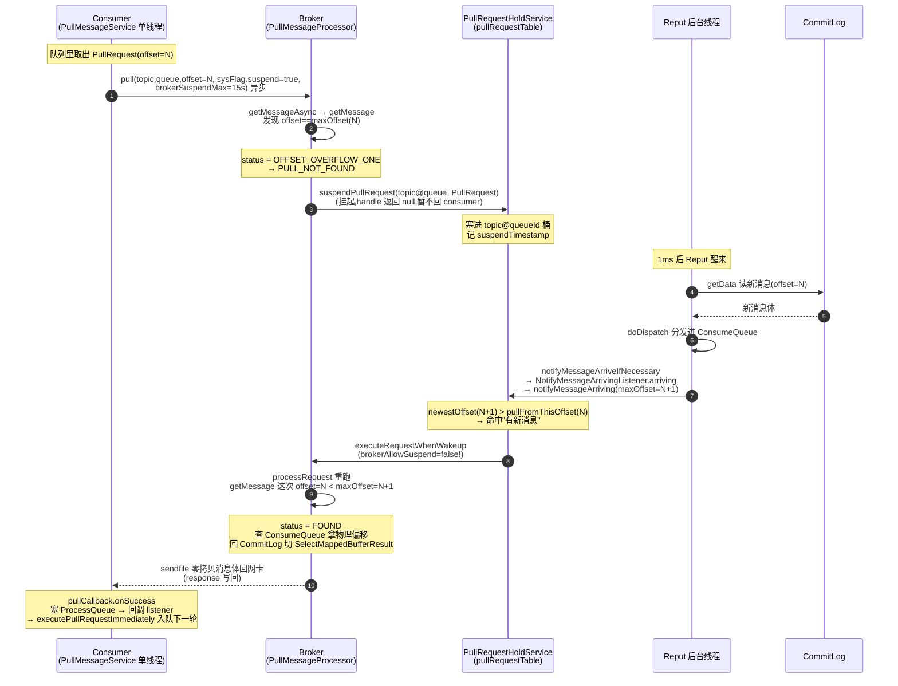

# 第九章 · 消费模型:Push 本质是 Pull 长轮询

> 篇:第 3 篇 · 消费
> 主线呼应:前两篇把消息"写进 CommitLog、刷盘落盘、后台 Reput 分发成 ConsumeQueue/Index、再靠 mmap/sendfile 零拷贝高效读出"这条链路走完了。第 8 章 P2-08 的最后一幕是:消费端来拉消息时,broker 端 `PullMessageProcessor` 通过 `FileChannel.transferTo`(sendfile)把页缓存里的消息体零拷贝送上网卡。但那一刻留下了一个没回答的问题:**消费端这次"拉"是怎么发起的?broker 端这次"应答"是怎么发生的?** 更要命的是——你写代码时调的是 `DefaultMQPushConsumer`(push 语义),可它的底层根本不是 broker 主动推,而是消费者自己不停拉。这一章就拆穿这层窗户纸:Push 本质是 Pull,而且是一种叫"长轮询"的精妙 Pull。

## 核心问题

**用户调的是 `DefaultMQPushConsumer`(push 语义),底层却是 `PullMessageService` 单线程不断拉(本质 Pull);没有消息时 broker 端 `PullRequestHoldService` 把请求挂起(长轮询 suspend),消息到达由 Reput 的 `NotifyMessageArrivingListener` 唤醒返回。RocketMQ 为什么不用真正的 broker 主动推送,而要走这么一圈"消费者拉、broker 挂起、消息到再唤醒"的长轮询?**

读完本章你会明白:

1. 你写 `consumer.registerMessageListener(...)` 收到的"推送",其实是 `PullMessageService` 这个单线程在客户端**不停拉**拉出来的——拉到消息扔进 `ProcessQueue`,再回调你的 listener。broker 从头到尾没有主动发过任何东西。
2. 没有消息时,这一拉不会立刻返回空,而是被 broker 端的 `PullRequestHoldService` **挂起**(suspend),最多挂 15 秒;这期间只要有新消息进来,后台 Reput 线程的 `notifyMessageArriveIfNecessary` 会**立刻唤醒**挂起的请求返回。这就是"长轮询"。
3. broker 端 `PullMessageProcessor` 收到一个 pull 请求后,怎么算从哪个 offset 开始(`requestHeader.getQueueOffset()` 怎么变成 `nextBeginOffset`)、怎么查 ConsumeQueue 拿物理偏移再回 CommitLog 取消息体、消息体怎么靠 sendfile 零拷贝回网卡。
4. 长轮询凭什么比"短轮询(消费者不停问)"和"纯推送(broker 主动发)"都好:实时性逼近推送(消息到立刻唤醒),无状态性逼近轮询(broker 不维护每消费者的推送游标,挂起的请求只在内存里,有超时兜底)。
5. 一个关键技巧——唤醒后**重跑**的请求为什么 `brokerAllowSuspend=false`(不再挂起),凭什么不会无限挂起。

> **如果一读觉得太难**:先只记住三件事——① 你调 push,底层是 pull,客户端有个 `PullMessageService` 单线程死循环从队列里取 `PullRequest` 去拉;② 拉不到消息时,broker 不立刻返回空,而是把请求挂进 `PullRequestHoldService`(按 `topic@queueId` 分桶),最多挂 15 秒;③ 这 15 秒内有新消息进 CommitLog,后台 Reput 线程顺手唤醒对应桶里挂着的请求,重跑一次 pull。这就是"Push 本质是 Pull 长轮询"。

---

## 9.1 一句话点破

> **RocketMQ 的"Push 消费"是个善意的谎言。你写的 `DefaultMQPushConsumer`,底层是客户端的 `PullMessageService` 单线程不断从一个阻塞队列里取 `PullRequest`、对 broker 发起 pull 请求。当队列里没有新消息时,broker 端的 `PullRequestHoldService` 不会立刻返回空响应,而是把这个请求**挂起**(suspend)——最多挂 15 秒。在这 15 秒内,只要 Reput 后台线程把新消息分发进 ConsumeQueue,就会顺手通过 `NotifyMessageArrivingListener` 唤醒对应挂起的请求,重新执行一次 pull,把刚到的消息拉回去。Push 的"实时感",就是这么用"拉 + 挂起 + 唤醒"骗出来的。**

这是结论,不是理由。本章倒过来拆:先看朴素的"短轮询"和"纯推送"各自撞什么墙,再看 RocketMQ 怎么用长轮询把两者的好处都拿到手,然后钻进源码看 PullMessageService、PullRequestHoldService、Reput 唤醒这条链怎么字面对应,最后讲一个最容易被忽略的细节——唤醒后重跑为什么不再挂起。

---

## 9.2 反面教材一:短轮询(消费者不停问)会怎样

在讲长轮询之前,先把"为什么不长轮询"想清楚。一个最直觉的 Pull 消费模型是**短轮询**:消费者不停问 broker "有新消息吗?",有就拿走,没有就立刻返回空,然后立刻再问。

> **打个比方**(这是少数值得用比喻的地方,因为"Push 本质 Pull"反直觉):这就像你订的报纸,不是报社主动塞进你家门,而是报童每隔几秒来敲一次门问"要新的吗?"。短轮询的报童敲得勤,长轮询的报童敲一次、没新的就在门口**等**到有新的或等够 15 秒才走。

> **不这样会怎样**(短轮询撞的墙):RocketMQ 的典型场景是**海量 Topic、海量消费组、很多队列长时间没消息**(比如某些业务 Topic 一天才几条消息)。短轮询下,每个消费组的每个队列,消费者都在以固定频率(比如每秒一次)发 pull 请求问"有新的吗?"。绝大多数请求的答案是"没有"。

- **空请求刷爆 CPU 和网络**:一个 consumer 订阅 100 个队列,每秒每个队列问一次,就是每秒 100 次几乎全是空的 pull 请求。1 万个 consumer 就是每秒 100 万次空请求。broker 端 `PullMessageProcessor` 要解码请求、查 ConsumeQueue、构造空响应、编码回包、走一次网络往返——全是无用功,CPU 和网卡带宽被空请求吃光。
- **实时性和空请求率是个死结**:你问得越勤,实时性越好(消息到了很快被发现),但空请求越多;你问得越稀,空请求少了,但实时性差(消息到了要等下一次轮询才发现)。这两个目标在短轮询里**无法同时满足**。

短轮询的本质问题在于:**消费者不知道消息什么时候到,只能盲目地、按时间表去问;而 broker 其实知道消息什么时候到(就是 Reput 把它分发进 ConsumeQueue 的那一刻)——这个信息差没有被利用**。

---

## 9.3 反面教材二:纯推送(broker 主动发)会怎样

既然短轮询浪费在"盲目问"上,那反过来——**让 broker 主动推**呢?broker 一有新消息,主动发给订阅了这个队列的 consumer。这才是字面意义的"Push"。

> **不这样会怎样**(纯推送撞的墙):纯推送看起来优雅,但在 MQ 这种"消费方速度参差不齐、可能掉线、可能慢消费"的场景下,会把所有复杂度甩给 broker:

- **broker 要维护每消费者的推送状态**:哪个 consumer 消费到哪了(offset)、哪个 consumer 现在在线、它处理得过来吗、上一批推过去的它 ACK 了吗……broker 必须为**每个 consumer × 每个 queue** 维护一套推送游标和未确认队列。消费者一多,broker 内存和状态机爆炸。这违背了 RocketMQ "broker 尽量无状态、轻量"的设计取向(第 15 章 P5-15 会讲 broker 的路由信息都尽量 CHM 化、避免重状态)。
- **背压难做**:consumer 消费慢了(比如业务处理一条要 1 秒),broker 还在按自己节奏推,会把 consumer 撑爆,或者堆在 broker 的发送队列里 OOM。纯推送的背压要么靠 consumer 反馈(broker 又得记状态),要么靠 broker 限速(更重的状态)。
- **consumer 掉线 / 重连的处理变复杂**:纯推送下,consumer 网络断了,broker 推的消息丢了怎么办?要重发,得记住"推到哪了、哪些没 ACK"。又是状态。

一句话:**纯推送把"消费进度管理"的复杂度从消费端搬到了 broker 端**。在 RocketMQ 这种一拖几万 consumer 的场景下,broker 端维护几万套推送状态是灾难。

---

## 9.4 RocketMQ 的抉择:长轮询——拉的外壳,推的实时

短轮询浪费在"盲目问",纯推送把状态全堆给 broker。RocketMQ 选了第三条路:**长轮询**。

长轮询的精髓是:**消费者主动拉(外壳是 Pull,broker 无状态),但 broker 收到拉请求后,如果没有新消息,不立刻返回空,而是把请求挂起一段时间(最长 15 秒);这段时间内一旦有新消息,立刻唤醒挂起的请求返回**。

| | 短轮询 | 纯推送 | **长轮询(RocketMQ)** |
|------|--------|--------|----------------------|
| 谁发起 | consumer 拉 | broker 推 | consumer 拉 |
| 无消息时 | 立刻返回空,consumer 立刻再问 | 不发(本来就没消息) | **broker 挂起请求,最多 15s** |
| 消息到达时 | 等下一次轮询才发现(延迟) | broker 主动推(实时) | **Reput 唤醒挂起请求(实时)** |
| broker 状态 | 无(每次请求自带 offset) | **有(每 consumer 游标)** | 无(挂起的请求自带 offset,内存里,超时兜底) |
| 背压 | consumer 自己控制拉速 | 难(broker 要记) | consumer 自己控制拉速 |

长轮询拿到了两者的好处:**实时性逼近推送**(消息一到 Reput 就唤醒,延迟在毫秒级),**无状态性逼近轮询**(broker 不维护任何"消费进度",挂起的请求只在 `PullRequestHoldService` 的内存 Map 里,挂够 15 秒没消息就自动超时返回——broker 重启这些挂起请求丢了就丢了,consumer 收到超时会立刻重新发起,没有任何正确性问题)。

> **钉死这件事**:RocketMQ 的"Push"= **Pull(消费者发起)+ 长轮询(broker 挂起 + Reput 唤醒)**。broker 全程无消费进度状态(进度存在 consumer 内存 + broker 的 `ConsumerOffsetManager`,但那是 consumer 主动上报的,不是 broker 推送时维护的),挂起请求只是内存里的临时对象,有 15 秒超时兜底。这套设计让 broker 在海量 consumer 场景下依然轻量。

下面三节,我们钻进源码,把"消费者发起 → broker 挂起 → Reput 唤醒"这条链逐段拆透。

---

## 9.5 客户端:PullMessageService 单线程拉,DefaultMQPushConsumerImpl 处理

### PullMessageService:一个死循环,从阻塞队列里取 PullRequest

客户端这边,所谓"Push"的发动机是 `PullMessageService`——它是一个 `ServiceThread`(后台线程),`run()` 方法就是一个死循环,从一个 `LinkedBlockingQueue<MessageRequest>` 里 `take()` 出 `PullRequest`,然后调 `DefaultMQPushConsumerImpl.pullMessage`([PullMessageService.java:105](../rocketmq/client/src/main/java/org/apache/rocketmq/client/impl/consumer/PullMessageService.java#L105)):

```java
public class PullMessageService extends ServiceThread {
    private final LinkedBlockingQueue<MessageRequest> messageRequestQueue = new LinkedBlockingQueue<>();   // :33

    private void pullMessage(final PullRequest pullRequest) {
        final MQConsumerInner consumer = this.mQClientFactory.selectConsumer(pullRequest.getConsumerGroup());
        if (consumer != null) {
            DefaultMQPushConsumerImpl impl = (DefaultMQPushConsumerImpl) consumer;
            impl.pullMessage(pullRequest);                                                                  // :109
        } else {
            logger.warn("No matched consumer for the PullRequest {}, drop it", pullRequest);
        }
    }

    @Override
    public void run() {
        logger.info(this.getServiceName() + " service started");
        while (!this.isStopped()) {
            try {
                MessageRequest messageRequest = this.messageRequestQueue.take();                            // :131 阻塞取
                if (messageRequest.getMessageRequestMode() == MessageRequestMode.POP) {
                    this.popMessage((PopRequest) messageRequest);
                } else {
                    this.pullMessage((PullRequest) messageRequest);                                         // :135
                }
            } catch (InterruptedException ignored) {
            } catch (Throwable e) {
                logger.error("Pull Message Service Run Method exception", e);
            }
        }
    }
}
```

**注意这里的两个细节**:

1. **它是单线程的**(`extends ServiceThread`)。一个客户端实例只有一个 `PullMessageService` 线程,串行地从队列里取 `PullRequest` 去拉。所以 RocketMQ 客户端的拉取是**异步**的——`pullMessage` 内部用的是 `CommunicationMode.ASYNC`(下面会看到),拉请求发出去后线程立刻返回去取下一个 `PullRequest`,不会阻塞在这个拉上。这是单线程能扛住多队列拉取的关键。
2. **`PullRequest` 是从哪来的?** 它由 `RebalanceImpl`(下一章 P3-10 讲)分配 queue 时塞进队列,而且每次拉完一批(或拉不到、或被流控),回调里会**把自己重新塞回队列**继续拉。所以只要这个 queue 还归这个 consumer,`PullRequest` 就会在队列里循环出现,形成"不停拉"的效果。

> **钉死这件事**:客户端的"Push"发动机就是 `PullMessageService` 这一个单线程,死循环从 `messageRequestQueue` 阻塞队列里取 `PullRequest`,异步对 broker 发起 pull。`PullRequest` 由 Rebalance 分配 queue 时入队、每次拉完回调里再入队,形成自循环。broker 从未主动发过任何东西。

### DefaultMQPushConsumerImpl.pullMessage:流控 + 构造请求 + 异步回调

`PullMessageService.pullMessage` 调到 `DefaultMQPushConsumerImpl.pullMessage`([:246](../rocketmq/client/src/main/java/org/apache/rocketmq/client/impl/consumer/DefaultMQPushConsumerImpl.java#L246))。这个方法干两件事:**(a) 流控判断**(决定"现在要不要拉、拉多少),**(b) 构造 pull 请求参数 + 异步发起 + 注册回调**。

流控部分先看一眼——它解释了"Push 模型怎么背压":

```java
public void pullMessage(final PullRequest pullRequest) {
    final ProcessQueue processQueue = pullRequest.getProcessQueue();
    if (processQueue.isDropped()) { return; }                                          // :248 这个 queue 不再归我了,直接丢弃

    long cachedMessageCount = processQueue.getMsgCount().get();
    long cachedMessageSizeInMiB = processQueue.getMsgSize().get() / (1024 * 1024);

    if (cachedMessageCount > this.defaultMQPushConsumer.getPullThresholdForQueue()) {   // :272 本地堆积太多条
        this.executePullRequestLater(pullRequest, PULL_TIME_DELAY_MILLS_WHEN_CACHE_FLOW_CONTROL);  // 延迟再拉
        return;
    }
    if (cachedMessageSizeInMiB > this.defaultMQPushConsumer.getPullThresholdSizeForQueue()) {  // :282 本地堆积太大
        this.executePullRequestLater(pullRequest, PULL_TIME_DELAY_MILLS_WHEN_CACHE_FLOW_CONTROL);
        return;
    }
    // ... 还有 maxSpan(消息跨度)流控、顺序消费的锁检查 ...
```

> **不这样会怎样**:如果不做这个流控,broker 消息来得快、consumer 业务处理得慢,`PullMessageService` 会疯狂往 `ProcessQueue`(本地待消费的内存树)里塞消息,consumer 自己先 OOM 了。RocketMQ 的背压设计很干净——**消费者自己控制拉速**:`ProcessQueue` 里堆积超过阈值(默认 1000 条 / 100MiB),就延迟 50ms 再拉(`PULL_TIME_DELAY_MILLS_WHEN_CACHE_FLOW_CONTROL`)。这正是 9.3 节说"长轮询的背压由 consumer 自己控制"的源码体现。

流控过了,就构造请求并异步发起。**注意这里有几个关键参数**([:473](../rocketmq/client/src/main/java/org/apache/rocketmq/client/impl/consumer/DefaultMQPushConsumerImpl.java#L473)):

```java
int sysFlag = PullSysFlag.buildSysFlag(
    commitOffsetEnable, // commitOffset
    true, // suspend  ← 关键!硬编码 true,告诉 broker "没消息就挂起我"
    subExpression != null, // subscription
    classFilter // class filter
);
try {
    this.pullAPIWrapper.pullKernelImpl(
        pullRequest.getMessageQueue(),
        subExpression,
        subscriptionData.getExpressionType(),
        subscriptionData.getSubVersion(),
        pullRequest.getNextOffset(),                            // 从哪个 offset 开始拉
        this.defaultMQPushConsumer.getPullBatchSize(),
        this.defaultMQPushConsumer.getPullBatchSizeInBytes(),
        sysFlag,
        commitOffsetValue,
        BROKER_SUSPEND_MAX_TIME_MILLIS,                         // :490 = 1000 * 15 = 15 秒,broker 最多挂我多久
        CONSUMER_TIMEOUT_MILLIS_WHEN_SUSPEND,                   // :491 = 1000 * 30 = 30 秒,consumer 这边整个请求的超时
        CommunicationMode.ASYNC,                                // :492 异步!单线程能拉多队列的关键
        pullCallback
    );
}
```

三个钉子要钉死:

1. **`suspend = true` 是硬编码的**([:475](../rocketmq/client/src/main/java/org/apache/rocketmq/client/impl/consumer/DefaultMQPushConsumerImpl.java#L475))。Push 模式的 consumer **总是**告诉 broker "没消息就挂起我"。这通过 `PullSysFlag` 的位运算塞进 `sysFlag` 的第二位(`FLAG_SUSPEND = 0x1 << 1`,见 `PullSysFlag.java:21`)。broker 端再用 `PullSysFlag.hasSuspendFlag(sysFlag)` 把它解出来。
2. **`BROKER_SUSPEND_MAX_TIME_MILLIS = 15 秒`**([:114](../rocketmq/client/src/main/java/org/apache/rocketmq/client/impl/consumer/DefaultMQPushConsumerImpl.java#L114))。这是长轮询挂起的上限——broker 最多把请求挂 15 秒。`CONSUMER_TIMEOUT_MILLIS_WHEN_SUSPEND = 30 秒` 是 consumer 端的总超时(挂起 15s + 网络 + 处理余量)。
3. **`CommunicationMode.ASYNC`**([:492](../rocketmq/client/src/main/java/org/apache/rocketmq/client/impl/consumer/DefaultMQPushConsumerImpl.java#L492))。发起后立刻返回,响应回来调 `pullCallback`。这是 `PullMessageService` 单线程能驱动多队列拉取的命脉——发起一个拉不阻塞,立刻去取下一个 `PullRequest`。

拉到消息后,`pullCallback.onSuccess` 把消息塞进 `ProcessQueue`、提交给 `consumeMessageService` 去回调你的 listener——这才是你写代码时感受到的"收到消息"([:345](../rocketmq/client/src/main/java/org/apache/rocketmq/client/impl/consumer/DefaultMQPushConsumerImpl.java#L345) 起的 `PullCallback`)。**注意**:无论拉到消息、拉不到、被流控、超时,回调里最后都会**把 `PullRequest` 重新塞回 `messageRequestQueue`**(通过 `executePullRequestImmediately`),形成下一轮拉取。这就是"不停拉"的循环。

---

## 9.6 broker 端:PullMessageProcessor 怎么处理、什么时候挂起

### processRequest:校验 + 取消息

请求到了 broker,走 Netty pipeline(第 13 章 P4-13)后被路由到 `PullMessageProcessor`。入口是 `processRequest`([:290](../rocketmq/broker/src/main/java/org/apache/rocketmq/broker/processor/PullMessageProcessor.java#L290)),它转发到私有的重载 `processRequest(channel, request, brokerAllowSuspend, brokerAllowFlowCtrSuspend)`([:304](../rocketmq/broker/src/main/java/org/apache/rocketmq/broker/processor/PullMessageProcessor.java#L304))——**注意第三个参数 `brokerAllowSuspend`**,这是本章的命脉之一,先记住。

`processRequest` 主体很长(校验 topic、订阅组、权限、tag 过滤……),核心就一句——调 `messageStore.getMessageAsync` 真正去 CommitLog 取消息([:566](../rocketmq/broker/src/main/java/org/apache/rocketmq/broker/processor/PullMessageProcessor.java#L566)):

```java
messageStore.getMessageAsync(group, storeTopic, queueId, requestHeader.getQueueOffset(),
        requestHeader.getMaxMsgNums(), messageFilter)
    .thenApply(result -> {
        // ... 处理 result ...
        return pullMessageResultHandler.handle(
            result, request, requestHeader, channel, finalSubscriptionData,
            subscriptionGroupConfig, brokerAllowSuspend, messageFilter, finalResponse,
            mappingContext, beginTimeMills);                                  // :582 brokerAllowSuspend 透传下去
    })
```

`getMessageAsync` 最终落到 `DefaultMessageStore.getMessage`([:867](../rocketmq/store/src/main/java/org/apache/rocketmq/store/DefaultMessageStore.java#L867))。这里有一个**和长轮询生死攸关的分支**——它根据请求 offset 和队列 maxOffset 的关系决定状态:

```java
ConsumeQueueInterface consumeQueue = findConsumeQueue(topic, queueId);            // :898
if (consumeQueue != null) {
    minOffset = consumeQueue.getMinOffsetInQueue();
    maxOffset = consumeQueue.getMaxOffsetInQueue();

    if (maxOffset == 0) {
        status = GetMessageStatus.NO_MESSAGE_IN_QUEUE;                            // :904 队列空
    } else if (offset < minOffset) {
        status = GetMessageStatus.OFFSET_TOO_SMALL;
    } else if (offset == maxOffset) {
        status = GetMessageStatus.OFFSET_OVERFLOW_ONE;                            // :910 ← 关键!请求的 offset 正好等于 maxOffset,说明没有新消息
    } else if (offset > maxOffset) {
        status = GetMessageStatus.OFFSET_OVERFLOW_BADLY;
    } else {
        // 正常情况:offset < maxOffset,有消息可取,去 ConsumeQueue 查物理偏移、回 CommitLog 取体
    }
```

> **钉死这件事**:长轮询挂起的触发点,就在 `offset == maxOffset`(以及 `maxOffset == 0`)这两种"没新消息"的状态。consumer 请求的 `queueOffset` 正好等于队列的 `maxOffset`,意味着"我要的 offset 就是队列目前最后一条的下一条,也就是还没生产出来的那条"——这时 broker 知道:**现在没消息,但 consumer 在等**。这就是长轮询挂起的时机。`OFFSET_OVERFLOW_ONE` 这个状态码,经过 `composeResponseHeader` 翻译成 `ResponseCode.PULL_NOT_FOUND`([PullMessageProcessor.java:664](../rocketmq/broker/src/main/java/org/apache/rocketmq/broker/processor/PullMessageProcessor.java#L664)),正是下一节挂起逻辑的入口。

(取到消息的正常分支,呼应第 6 章 P2-06 和第 8 章 P2-08:`getMessage` 在 `offset < maxOffset` 的 else 分支里,用 `consumeQueue.getIndexBuffer(offset)` 拿到 ConsumeQueue 那段 20 字节单元的切片(每个单元含 8 字节 CommitLog 物理偏移 + 4 字节消息总长 + 8 字节 tag hash),逐条解析出物理偏移、回 CommitLog 切 `SelectMappedBufferResult`——这些都是 `MappedByteBuffer` 的视图,本身不拷贝数据。攒够 `maxMsgNums` 条或越界停止,结果 `GetMessageResult` 持有一组 `ByteBuffer` 视图引用。最后 `DefaultPullMessageResultHandler` 在 `ResponseCode.SUCCESS` 分支里,若 `transferMsgByHeap=false`(默认),直接构造一个 `ManyMessageTransfer`(实现 Netty 的 `FileRegion` 接口),`channel.writeAndFlush(fileRegion)`——底层就是 `FileChannel.transferTo`,页缓存里的消息字节**零拷贝**直送 socket,全程不进 JVM 堆。这就是第 8 章 P2-08 讲的 sendfile 读路径,本章只点出"它就发生在 `DefaultPullMessageResultHandler` 的 SUCCESS 分支",不重复展开。我们这里只钻"没消息"这条挂起分支。)

> **钉死这条衔接**:pull 请求的处理在 broker 端走的是"取消息(`getMessage`)→ 判状态(`composeResponseHeader` 翻译成 ResponseCode)→ 处理结果(`DefaultPullMessageResultHandler.handle` 的 switch)"三段式。`FOUND` 走零拷贝回包,`PULL_NOT_FOUND` 走长轮询挂起,`PULL_RETRY_IMMEDIATELY` / `PULL_OFFSET_MOVED` 走立刻返回让 consumer 校正 offset 重拉。本章只详讲 `PULL_NOT_FOUND` 这一支,但你要知道整个 switch 是 pull 响应的完整分诊台。

### 长轮询挂起:PULL_NOT_FOUND → suspendPullRequest

真正决定"挂起还是返回"的代码在 `DefaultPullMessageResultHandler.handle` 里。这是 `PullMessageProcessor` 持有的一个 handler(`new DefaultPullMessageResultHandler(brokerController)`,见 `PullMessageProcessor.java:91`),`processRequest` 取完消息后调它的 `handle` 方法处理结果。长轮询挂起就在它的 `switch` 里:

```java
case ResponseCode.PULL_NOT_FOUND:
    final boolean hasSuspendFlag = PullSysFlag.hasSuspendFlag(requestHeader.getSysFlag());              // DefaultPullMessageResultHandler.java:173
    final long suspendTimeoutMillisLong = hasSuspendFlag ? requestHeader.getSuspendTimeoutMillis() : 0;

    if (brokerAllowSuspend && hasSuspendFlag) {                                                         // :176 两个条件都满足才挂
        long pollingTimeMills = suspendTimeoutMillisLong;
        if (!this.brokerController.getBrokerConfig().isLongPollingEnable()) {
            pollingTimeMills = this.brokerController.getBrokerConfig().getShortPollingTimeMills();      // :179 关了长轮询就退化成短轮询(默认 1s)
        }

        String topic = requestHeader.getTopic();
        long offset = requestHeader.getQueueOffset();
        int queueId = requestHeader.getQueueId();
        PullRequest pullRequest = new PullRequest(request, channel, pollingTimeMills,                    // :185 构造挂起对象
            this.brokerController.getMessageStore().now(), offset, subscriptionData, messageFilter);
        this.brokerController.getPullRequestHoldService().suspendPullRequest(topic, queueId, pullRequest); // :187 挂!
        return null;                                                                                     // :188 注意:返回 null,这次请求暂不应答
    }
```

(注意:`broker/.../longpolling/PullRequest` 这个类是 broker 端的挂起对象,**和 client 端的 `client/.../impl/consumer/PullRequest` 同名但完全不同**——后者是客户端拉取任务,前者是 broker 端一个挂起的 HTTP 请求的封装。引用时务必标清。)

挂起的两个前提:

1. **`hasSuspendFlag`**:consumer 在 sysFlag 里带了 suspend 位(9.5 节看到的硬编码 `true`)。
2. **`brokerAllowSuspend`**:这个参数是 `processRequest` 的入参。正常请求进来时是 `true`(`PullMessageProcessor.java:292` 的公开 `processRequest` 调用时传 `true`),允许挂起。

挂起动作分两步:**(a)** 用请求参数构造一个 broker 端的 `PullRequest` 对象(记住当前 channel、要拉的 offset、挂起超时时间);**(b)** 调 `PullRequestHoldService.suspendPullRequest` 把它挂进一张 Map。然后 `handle` 返回 `null`——**这次请求暂不回响应**,Netty 那边这个请求的 response 就被"按住"了。

> **不这样会怎样**:如果这里直接返回空响应(短轮询),consumer 收到空就立刻再拉,9.2 节的"空请求刷爆"就来了。挂起,正是为了把"立刻再问"变成"等到有消息再答"。

### PullRequestHoldService:按 topic@queueId 分桶挂 + 定时兜底检查

`PullRequestHoldService` 是 broker 端管理所有挂起请求的总管,也是个 `ServiceThread`。它的核心是**一张按 `topic@queueId` 分桶的 Map**([PullRequestHoldService.java:38](../rocketmq/broker/src/main/java/org/apache/rocketmq/broker/longpolling/PullRequestHoldService.java#L38)):

```java
protected ConcurrentMap<String/* topic@queueId */, ManyPullRequest> pullRequestTable =
    new ConcurrentHashMap<>(1024);
```

`ManyPullRequest` 是个简单的 synchronized `ArrayList<PullRequest>` 容器(`ManyPullRequest.java:22`),`cloneListAndClear` 方法在持锁内"克隆一份并清空原列表"——这是唤醒时把挂起请求"取走处理"的原子操作。

挂起一个请求,就是把塞进对应桶([:45](../rocketmq/broker/src/main/java/org/apache/rocketmq/broker/longpolling/PullRequestHoldService.java#L45)):

```java
public void suspendPullRequest(final String topic, final int queueId, final PullRequest pullRequest) {
    String key = this.buildKey(topic, queueId);                       // :46 "topic@queueId"
    ManyPullRequest mpr = this.pullRequestTable.get(key);
    if (null == mpr) {
        mpr = new ManyPullRequest();
        ManyPullRequest prev = this.pullRequestTable.putIfAbsent(key, mpr);   // :50 无锁建桶
        if (prev != null) { mpr = prev; }
    }
    pullRequest.getRequestCommand().setSuspended(true);              // :56 标记这个请求"被挂起过"
    mpr.addPullRequest(pullRequest);                                 // :57 加进桶
}
```

> **技巧点睛·为什么按 `topic@queueId` 分桶?** 因为唤醒是"某个队列来了新消息"粒度的——Reput 分发一条 `order-queue0` 的消息,只要唤醒 `order@0` 这个桶里挂着的请求,没必要扫所有挂起请求。这是把"挂起请求"按"唤醒键"预先分桶,O(1) 找到该唤醒谁。如果按 consumer 分桶或者用一个大列表,每次来消息都要遍历找匹配的,在海量挂起请求下就是性能灾难。

`PullRequestHoldService` 自己还有一个 `run` 循环,作用是**超时兜底**([:69](../rocketmq/broker/src/main/java/org/apache/rocketmq/broker/longpolling/PullRequestHoldService.java#L69)):

```java
@Override
public void run() {
    while (!this.isStopped()) {
        try {
            if (this.brokerController.getBrokerConfig().isLongPollingEnable()) {
                this.waitForRunning(5 * 1000);                        // :74 长轮询开,每 5 秒醒一次
            } else {
                this.waitForRunning(this.brokerController.getBrokerConfig().getShortPollingTimeMills()); // 短轮询,默认 1s
            }
            this.checkHoldRequest();                                  // :80 兜底检查所有挂起请求
        } catch (Throwable e) { ... }
    }
}
```

`checkHoldRequest`([:101](../rocketmq/broker/src/main/java/org/apache/rocketmq/broker/longpolling/PullRequestHoldService.java#L101))遍历所有桶,对每个 `topic@queueId` 重新查一次 `getMaxOffsetInQueue`,调 `notifyMessageArriving`——**这是防止 Reput 唤醒遗漏的兜底**:即使 Reput 的唤醒因任何原因没触发(比如消息是在 Reput 停顿期进的),最多 5 秒后这个定时检查也会把该唤醒的请求唤醒。注意它和 Reput 唤醒是**冗余**关系,谁先触发都行,都调同一个 `notifyMessageArriving`。

### notifyMessageArriving:唤醒的判定与执行

真正"唤醒"的逻辑在 `notifyMessageArriving`([:123](../rocketmq/broker/src/main/java/org/apache/rocketmq/broker/longpolling/PullRequestHoldService.java#L123))。它被两处调用:Reput 的 `NotifyMessageArrivingListener.arriving`(下一节),和上面这个 5 秒兜底检查。逻辑很干净:

```java
public void notifyMessageArriving(final String topic, final int queueId, final long maxOffset, ...) {
    String key = this.buildKey(topic, queueId);
    ManyPullRequest mpr = this.pullRequestTable.get(key);
    if (mpr != null) {
        List<PullRequest> requestList = mpr.cloneListAndClear();              // :128 原子地"取走并清空"这个桶的挂起请求
        if (requestList != null) {
            List<PullRequest> replayList = new ArrayList<>();
            for (PullRequest request : requestList) {
                long newestOffset = maxOffset;
                if (newestOffset <= request.getPullFromThisOffset()) {        // :134 传进来的 maxOffset 不够新,现查一次
                    newestOffset = getMessageStore().getMaxOffsetInQueue(topic, queueId);
                }

                if (newestOffset > request.getPullFromThisOffset()) {         // :143 有新消息了!
                    // 还要做一次 tag 过滤匹配(避免唤醒了但 tag 不匹配又拉空)
                    boolean match = request.getMessageFilter().isMatchedByConsumeQueue(tagsCode, ...);
                    if (match && properties != null) {
                        match = request.getMessageFilter().isMatchedByCommitLog(null, properties);
                    }
                    if (match) {
                        getPullMessageProcessor().executeRequestWhenWakeup(   // :153 唤醒!重跑这个请求
                            request.getClientChannel(), request.getRequestCommand());
                        continue;
                    }
                }

                if (System.currentTimeMillis() >= (request.getSuspendTimestamp() + request.getTimeoutMillis())) {
                    getPullMessageProcessor().executeRequestWhenWakeup(        // :166 超时了!也唤醒(重跑会拉空,正常返回)
                        request.getClientChannel(), request.getRequestCommand());
                    continue;
                }
                replayList.add(request);                                      // :176 既没新消息也没超时,放回去继续挂
            }
            if (!replayList.isEmpty()) { mpr.addPullRequest(replayList); }    // :180 放回桶
        }
    }
}
```

唤醒有**两个触发条件**,任意一个满足就把挂起请求"重跑"一遍(`executeRequestWhenWakeup`):

1. **`newestOffset > pullFromThisOffset`**——队列里来了比 consumer 当时请求的 offset 更新的消息(:143)。这是"消息到达唤醒"的主路径。
2. **`System.currentTimeMillis() >= suspendTimestamp + timeoutMillis`**——挂够超时时间了(:164)。这是 15 秒兜底,即使没新消息,到点也唤醒(重跑会再拉一次空,consumer 收到空响应会立刻重新发起 pull,形成下一轮长轮询)。

**注意第 176 行的 `replayList`**:既没新消息、也没超时的请求,会被放回桶里继续挂。所以一次 `notifyMessageArriving` 不会粗暴唤醒所有挂起请求,只唤醒"该醒的"(有新消息或超时),其余继续挂。

`executeRequestWhenWakeup` 的实现([PullMessageProcessor.java:806](../rocketmq/broker/src/main/java/org/apache/rocketmq/broker/processor/PullMessageProcessor.java#L806))是本章最后一个、也是最容易被忽略的关键点,下一节单独拆。

---

## 9.7 唤醒后重跑:为什么 brokerAllowSuspend=false

`executeRequestWhenWakeup` 把唤醒的请求重新丢给 `PullMessageProcessor` 处理([:810](../rocketmq/broker/src/main/java/org/apache/rocketmq/broker/processor/PullMessageProcessor.java#L810)):

```java
public void executeRequestWhenWakeup(final Channel channel, final RemotingCommand request) {
    Runnable run = () -> {
        try {
            boolean brokerAllowFlowCtrSuspend = ...;
            final RemotingCommand response = PullMessageProcessor.this.processRequest(channel, request,
                false,  // ← brokerAllowSuspend = false!唤醒重跑不再挂起
                brokerAllowFlowCtrSuspend);
            if (response != null) {
                response.setOpaque(request.getOpaque());
                response.markResponseType();
                NettyRemotingAbstract.writeResponse(channel, request, response, ...);   // :816 这次有响应了,写回 consumer
            }
        } catch (...) { ... }
    };
    this.brokerController.getPullMessageExecutor().submit(new RequestTask(run, channel, request));  // :833 丢线程池异步跑
}
```

> **钉死这件事(本章最关键的一个细节)**:`executeRequestWhenWakeup` 重跑请求时,第三个参数 `brokerAllowSuspend` **写死 `false`**(:810)。这意味着:**唤醒后重跑的 pull,即使又拉不到消息(比如刚被别的 consumer 拉走、或 tag 不匹配),也不会再挂起,而是正常返回空响应给 consumer**。

> **不这样会怎样**:如果唤醒后重跑还允许挂起,会出什么问题?想象一个边界场景——`notifyMessageArriving` 因为"有新消息"唤醒了一个请求,但那个新消息的 tag 不匹配这个 consumer(被 `MessageFilter` 过滤掉),重跑后 `getMessage` 又返回 `NO_MATCHED_MESSAGE` → `PULL_RETRY_IMMEDIATELY`,或者又 `offset == maxOffset` → `PULL_NOT_FOUND`。如果此时还允许挂起,这个请求会被**再次挂进 `PullRequestHoldService`**,然后等下一次唤醒再重跑……万一 tag 一直不匹配,就陷入"挂起→唤醒→拉空→再挂起→再唤醒"的**无限循环**,这个请求永远不返回 consumer,consumer 端 30 秒超时后才会发现。设成 `false` 就堵死了这条路:**重跑最多拉一次,拉空就老实返回,让 consumer 自己决定下一步**(consumer 收到空会立刻重新发起 pull,这是 consumer 主导的循环,可控)。

这个 `false` 是个不起眼但极其 sound 的设计——它保证**每个挂起的请求最多被唤醒重跑一次**,不会在 broker 端自循环。配合 consumer 端的"收到空响应立刻重新 pull",整个循环的控制权始终在 consumer 手里(broker 无状态),这正是 9.4 节那张表里"broker 无状态"的底气。

---

## 9.8 Reput 怎么唤醒:notifyMessageArriveIfNecessary(呼应第 5 章 P1-05)

最后把唤醒的"触发端"补全。9.6 节的 `notifyMessageArriving` 是被谁调的?两个入口:

1. **`PullRequestHoldService.checkHoldRequest`** 每 5 秒兜底(9.6 节已讲)。
2. **Reput 后台线程分发消息时,顺手唤醒**——这是主路径,实时性的来源。

第 5 章 P1-05 讲过,`ReputMessageService.doReput` 顺着 CommitLog 读消息、分发进 ConsumeQueue/Index 后,会调一句 `notifyMessageArriveIfNecessary(dispatchRequest)`(`DefaultMessageStore.java:2750`)。这个方法的实现([:2646](../rocketmq/store/src/main/java/org/apache/rocketmq/store/DefaultMessageStore.java#L2646)):

```java
public void notifyMessageArriveIfNecessary(DispatchRequest dispatchRequest) {
    if (DefaultMessageStore.this.brokerConfig.isLongPollingEnable()
        && DefaultMessageStore.this.messageArrivingListener != null) {
        DefaultMessageStore.this.messageArrivingListener.arriving(dispatchRequest.getTopic(),
            dispatchRequest.getQueueId(), dispatchRequest.getConsumeQueueOffset() + 1,    // :2650 +1 = 这条消息的 offset 加 1 = 新的 maxOffset
            dispatchRequest.getTagsCode(), dispatchRequest.getStoreTimestamp(),
            dispatchRequest.getBitMap(), dispatchRequest.getPropertiesMap());
        DefaultMessageStore.this.reputMessageService.notifyMessageArrive4MultiQueue(dispatchRequest);
    }
}
```

它通过一个 `MessageArrivingListener` 接口(`store/.../MessageArrivingListener.java:22`)回调。`DefaultMessageStore` 是 `store` 模块的,不该直接依赖 `broker` 模块的 `PullRequestHoldService`——所以这里用了**接口反转**:`broker` 模块在启动时把一个 `NotifyMessageArrivingListener`(`broker/.../longpolling/NotifyMessageArrivingListener.java:28`)注入给 `DefaultMessageStore`。这个 listener 的 `arriving` 实现([:48](../rocketmq/broker/src/main/java/org/apache/rocketmq/broker/longpolling/NotifyMessageArrivingListener.java#L48)):

```java
@Override
public void arriving(String topic, int queueId, long logicOffset, long tagsCode,
                     long msgStoreTime, byte[] filterBitMap, Map<String, String> properties) {
    if (LiteUtil.isLiteTopicQueue(topic)) { ... return; }
    this.pullRequestHoldService.notifyMessageArriving(        // :48 ← 唤醒 Pull 挂起的请求
        topic, queueId, logicOffset, tagsCode, msgStoreTime, filterBitMap, properties);
    this.popMessageProcessor.notifyMessageArriving(...);      // :50 唤醒 Pop 模式(5.x)挂起的请求
    this.notificationProcessor.notifyMessageArriving(...);    // :52 通知 Proxy 等
}
```

> **钉死这条链**:消息进 CommitLog → 后台 Reput 线程 `doReput` 读出来分发 → `notifyMessageArriveIfNecessary` → `MessageArrivingListener.arriving`(接口)→ `NotifyMessageArrivingListener.arriving`(broker 端实现)→ `PullRequestHoldService.notifyMessageArriving` → 找到 `topic@queueId` 桶里挂起的请求 → `executeRequestWhenWakeup` 重跑(不再挂起)→ 这次重跑有消息了 → sendfile 零拷贝回 consumer。**整条链从消息落 CommitLog 到 consumer 收到,延迟主要在 Reput 的分发周期(默认 1ms 醒一次,见第 5 章),所以 Push 的实时性是毫秒级**。

这就是为什么 RocketMQ 敢说"Push 体验"——它不是真的推,但靠"Reput 1ms 分发 + 即时唤醒",把延迟压到了和真推几乎无感的程度。



这张图是本章的核心。把它记住,长轮询就再没有秘密。

---

## 9.9 长轮询全景:三类超时的关系

讲到这里,本章涉及三个时间常量,容易混。立个表钉死:

| 常量 | 值 | 在哪 | 含义 |
|------|----|----|------|
| `BROKER_SUSPEND_MAX_TIME_MILLIS` | 15 秒 | client 端 `DefaultMQPushConsumerImpl.java:114` | consumer 告诉 broker:**你最多挂我 15 秒**。这个值作为请求参数 `suspendTimeoutMillis` 传给 broker,构造 broker 端 `PullRequest` 的 `timeoutMillis` |
| `CONSUMER_TIMEOUT_MILLIS_WHEN_SUSPEND` | 30 秒 | client 端 `DefaultMQPushConsumerImpl.java:115` | consumer 端这个 pull 请求的**总超时**(挂起 15s + 网络往返 + 处理 + 余量)。超过这个 consumer 认为 broker 没响应 |
| `shortPollingTimeMills` | 1 秒 | broker 端 `BrokerConfig.java:119` | **关了长轮询时**(`longPollingEnable=false`)的退化挂起时间——退化成"短轮询但稍微挂 1s" |
| `PullRequestHoldService` 定时检查 | 5 秒 | `PullRequestHoldService.java:74` | 不是超时,是**兜底检查周期**——即使 Reput 唤醒漏了,5s 内必有一次 checkHoldRequest 兜底 |

> **技巧点睛·15 秒和 30 秒为什么差这么多?** `BROKER_SUSPEND_MAX_TIME_MILLIS = 15s` 是 broker 挂起上限,`CONSUMER_TIMEOUT_MILLIS_WHEN_SUSPEND = 30s` 是 consumer 总超时。留了 15 秒余量给"broker 挂到 15s 超时返回 + 网络往返 + consumer 处理"。如果两个值一样,broker 刚挂满 15s 返回时 consumer 这边已经超时报错了——长轮询就白挂了。这个余量设计是防止"broker 没问题但 consumer 误判超时"的常见 distributed systems 陷阱。

---

## 9.10 技巧精解:长轮询凭什么兼顾实时与无状态

这一章的硬核技巧,就是**长轮询(suspend timeout)本身**。我们把它的"为什么 sound"拆透。

### 长轮询的三个 sound 点

**sound 点一:挂起的请求丢了不会出正确性问题。**

`PullRequestHoldService.pullRequestTable` 是个内存 `ConcurrentHashMap`,broker 重启它就没了。这听起来像 bug,其实不是——因为:

- consumer 端的 `CONSUMER_TIMEOUT_MILLIS_WHEN_SUSPEND = 30s`。broker 重启,挂起的请求消失,consumer 这边 30s 内必然超时。
- consumer 的 `pullCallback` 里,超时(或任何异常)的处理都是**把 `PullRequest` 重新塞回 `messageRequestQueue` 再拉一次**(9.5 节讲过的自循环)。
- 重拉时 consumer 带的是自己内存里的 `nextOffset`(它一直记着消费到哪了,不依赖 broker 的挂起状态),broker 重启后从 ConsumeQueue 重新查就行。

所以 broker 端的挂起状态是**纯缓存性质的**——丢了 consumer 自动重拉,不会有任何消息丢失或重复。这就是 9.4 节表里"broker 无状态"的真正含义:挂起请求只是优化实时性的内存缓存,broker 不靠它保证正确性。**对比纯推送**(9.3 节):纯推送的 broker 必须记住"推到哪、哪些没 ACK",丢了就是真丢消息——所以纯推送必须持久化推送状态,重。长轮询把这部分状态完全甩给了 consumer 内存 + `ConsumerOffsetManager`(那是 consumer 主动上报的位点,见第 11 章 P3-11)。

**sound 点二:`brokerAllowSuspend=false` 防无限挂起。**

9.7 节已详述。唤醒重跑不再挂起,保证每个挂起请求最多被唤醒一次,不会在 broker 端自循环。配合 consumer 端自循环(收到空响应立刻重拉),控制权始终在 consumer。

**sound 点三:唤醒按 `topic@queueId` 分桶 + Reput 即时触发 + 5s 兜底,三重保证唤醒不漏。**

- 分桶让唤醒 O(1)(来一条 `order-queue0` 的消息,只查 `order@0` 桶)。
- Reput 即时触发(`notifyMessageArriveIfNecessary` 在分发消息的同一毫秒调),保证实时性。
- 5s 兜底检查(`checkHoldRequest`),即使 Reput 漏了(理论上有并发窗口),5s 内必唤醒。

三重里任何一个生效都行,冗余设计。

### 反面对比:如果朴素地实现会怎样

> **不这样会怎样**(朴素长轮询会撞的墙):

1. **如果挂起请求不分桶(用一个大列表)**:每来一条消息,要遍历整个列表找 `topic+queueId+offset` 匹配的请求,O(N)。N 万个挂起请求时,每次唤醒都是 O(N) 扫描,broker CPU 被唤醒逻辑吃光。分桶后是 O(桶大小),通常桶里只有一两个请求(一个 consumer 一个 queue 同时只挂一个 pull)。
2. **如果唤醒后还允许挂起(9.7 节的反面)**:tag 不匹配会触发"挂起→唤醒→拉空→再挂起"无限循环,请求永远不返回,consumer 30s 超时才发现,期间白白占用 broker 一个挂起槽和一次 Reput 唤醒。`brokerAllowSuspend=false` 一刀切断。
3. **如果只靠 Reput 唤醒、没有 5s 兜底**:Reput 的 `notifyMessageArriveIfNecessary` 和 `PullRequestHoldService` 之间没有强同步(一个在 store 模块、一个在 broker 模块,跨模块回调),极端情况下(比如消息是在 Reput 刚好停顿那一瞬进的)可能漏唤醒。5s 兜底保证最坏 5s 延迟,不会无限挂。这个冗余换的是"实时性(Reput 即时)+ 可靠性(5s 兜底)"的兼得。
4. **如果挂起状态要持久化(像纯推送那样)**:broker 每挂起一个请求要写盘,重启要恢复——挂起请求是高频操作(每个 consumer 每个队列都在挂),写盘开销直接拖垮 broker。长轮询选择"挂起状态纯内存、丢了 consumer 重拉",把持久化的负担完全甩掉。

### 长轮询不是 RocketMQ 独有

长轮询是个经典的分布式系统模式(WebSocket 早期、Nacos 配置推送、Apollo 都用)。RocketMQ 把它和"Reput 后台分发"结合得天衣无缝——Reput 本来就要 1ms 醒一次分发消息建 ConsumeQueue,顺手唤醒挂起的 pull 请求,几乎零额外成本。这是"复用已有机制"的教科书例子:没有为 Push 单独造一套推送通道,而是寄生在 Reput 的分发周期上。

---

## 9.11 关掉长轮询会怎样:退化成短轮询

最后看一个配置开关,验证我们对长轮询的理解。`BrokerConfig.longPollingEnable` 默认 `true`([BrokerConfig.java:117](../rocketmq/common/src/main/java/org/apache/rocketmq/common/BrokerConfig.java#L117))。如果设成 `false`:

- broker 端 `DefaultPullMessageResultHandler` 里(:178),`pollingTimeMills` 不再用 consumer 传来的 15s,而是用 `shortPollingTimeMills`(默认 1s)——挂起请求只挂 1s 就超时返回。
- `PullRequestHoldService.run` 里(:76),`waitForRunning` 用 `shortPollingTimeMills` 而不是 5s。
- `notifyMessageArriveIfNecessary` 里(:2647),`if (longPollingEnable)` 直接不调 listener——Reput 不再唤醒挂起请求。

效果:退化成"挂 1s 的短轮询"。为什么不彻底关掉挂起、立刻返回空?因为即使 1s 的挂起,也比"立刻返回空、consumer 立刻再问"省一个数量级的空请求——1s 内的消息会被这 1s 挂起兜住返回,而不是每个消息都触发一次独立的 pull 往返。所以"短轮询"在 RocketMQ 里其实是"挂 1s 的迷你长轮询",是个退化档位,不是真正的立刻返回空。这个细节再次印证:RocketMQ 的 Push **本质就是 Pull 长轮询**,关长轮询只是把挂起时间从 15s 缩到 1s,机制完全一样。

---

## 章末小结

这一章拆穿了 RocketMQ "Push 消费"的真相,落在**分布式骨架**这一面——它解决的是"消息怎么从 broker 流到 consumer、且实时又无状态"的问题。

我们立起了三件事:

1. **Push 本质是 Pull**:`DefaultMQPushConsumer` 的底层是客户端 `PullMessageService` 单线程死循环从队列取 `PullRequest`、异步对 broker 发起 pull;拉到消息塞 `ProcessQueue`、回调 listener。broker 全程没主动发任何东西。
2. **长轮询 = Pull + 挂起 + Reput 唤醒**:没消息时 broker 端 `PullRequestHoldService` 把请求挂进 `topic@queueId` 分桶的 Map(最多 15s);这期间 Reput 分发新消息时通过 `NotifyMessageArrivingListener` 即时唤醒(5s 兜底检查冗余);唤醒后 `executeRequestWhenWakeup` 重跑请求,**`brokerAllowSuspend=false`** 保证不无限挂起。
3. **长轮询兼顾实时与无状态**:实时性靠 Reput 1ms 分发 + 即时唤醒(毫秒级延迟,逼近推送);无状态性靠"挂起请求纯内存、丢了 consumer 重拉"(broker 不维护消费进度,对比纯推送的重状态)。

回到全书二分法:这一章讲的机制(消费发起、长轮询挂起/唤醒)是**分布式骨架**那一面——它让消息可靠地从 broker 流到 consumer,同时保证 broker 轻量无状态。但它和**存储内核**紧密衔接:pull 请求到了 broker,取消息走的是第 6 章 P2-06 的 ConsumeQueue 查偏移、第 8 章 P2-08 的 sendfile 零拷贝;唤醒靠的是第 5 章 P1-05 的 Reput 分发。所以这一章是典型的"衔接章"——把存储内核(消息已存好、能高效读)和分布式骨架(消息怎么流转)缝起来。

### 五个"为什么"清单

1. **为什么 RocketMQ 的 Push 底层是 Pull?** 真正的 broker 主动推送,broker 要为每 consumer × 每 queue 维护推送游标和未确认队列,海量 consumer 下 broker 状态爆炸、背压难做。Pull 把"消费进度"状态完全留在 consumer 内存(加 consumer 主动上报的 `ConsumerOffsetManager`),broker 无状态,轻量。
2. **为什么不用短轮询(不停问)?** 短轮询下绝大多数 pull 请求答案是"没有",空请求刷爆 CPU 和网络;且实时性和空请求率是死结——问得勤空请求多、问得稀实时性差。长轮询把"盲目问"变成"等到有消息再答",空请求率趋零、实时性靠 Reput 即时唤醒。
3. **长轮询挂起的请求,broker 重启丢了怎么办?** 不出问题。挂起请求只是内存缓存,丢了 consumer 端 30s 内超时、自动把 `PullRequest` 重新塞回队列重拉,带的还是自己内存里的 offset。broker 不靠挂起状态保证正确性——这是长轮询"无状态"的核心。
4. **为什么唤醒后重跑要 `brokerAllowSuspend=false`?** 防止"挂起→唤醒→拉空(tag 不匹配或被别人拉走)→再挂起"的无限循环。设成 false 保证每个挂起请求最多被唤醒重跑一次,控制权始终在 consumer(收到空自己决定重拉)。
5. **Push 的实时性凭什么逼近真推?** Reput 后台线程默认 1ms 醒一次分发消息,分发时同一毫秒调 `notifyMessageArriveIfNecessary` 唤醒挂起请求。所以从消息落 CommitLog 到 consumer 收到,主路径延迟是 Reput 周期(毫秒级)。5s 兜底检查保证即使 Reput 漏唤醒,最坏 5s 延迟。

### 想继续深入往哪钻

- 本章多次提到 `PullRequest` 由 `RebalanceImpl` 分配 queue 时塞进队列——下一章 **P3-10 Rebalance** 讲消费组内多个 consumer 怎么分 queue、`PullRequest` 怎么被创建和回收。
- consumer 内存里的 `nextOffset` 怎么管、怎么上报 broker、`increaseOnly` 防什么——第 11 章 **P3-11 消费位点**。
- pull 请求到了 broker 取消息那一步,本章只点了"查 ConsumeQueue 拿偏移、回 CommitLog 取体",完整机制(20 字节定长单元、offset 即下标、sendfile 零拷贝)在第 6 章 **P2-06** 和第 8 章 **P2-08**。
- 想看真实的长轮询挂起代码,读 `../rocketmq/broker/src/main/java/org/apache/rocketmq/broker/longpolling/PullRequestHoldService.java` 全文(才 200 行,是本章 9.6~9.8 的完整背景);唤醒入口 `../rocketmq/store/src/main/java/org/apache/rocketmq/store/DefaultMessageStore.java` 的 `notifyMessageArriveIfNecessary`([#L2646](../rocketmq/store/src/main/java/org/apache/rocketmq/store/DefaultMessageStore.java#L2646))。
- 5.x 的 **Pop 消费模式**(本章 `NotifyMessageArrivingListener` 里出现的 `popMessageProcessor.notifyMessageArriving` 那条线)是另一种消费模型,基于 pop + 资源锁,适合海量队列场景,第 23 章 **P8-23** 对照讲。

### 引出下一章

这一章讲了 consumer 怎么发起 pull、broker 怎么长轮询应答。但留下一个前提没回答:**一个 topic 有多个 queue,一个消费组有多个 consumer,这些 queue 怎么分给这些 consumer?谁决定哪个 consumer 拉哪个 queue?** 本章里 `PullRequest` 是从 `messageRequestQueue` 里取出来的,可它**最初是谁塞进去的**?下一章 **P3-10 Rebalance**,讲 `RebalanceImpl` 怎么在没有中心协调者的情况下,让全网 consumer 各自算出互斥的 queue 分配,以及 consumer 增减时怎么重算。
