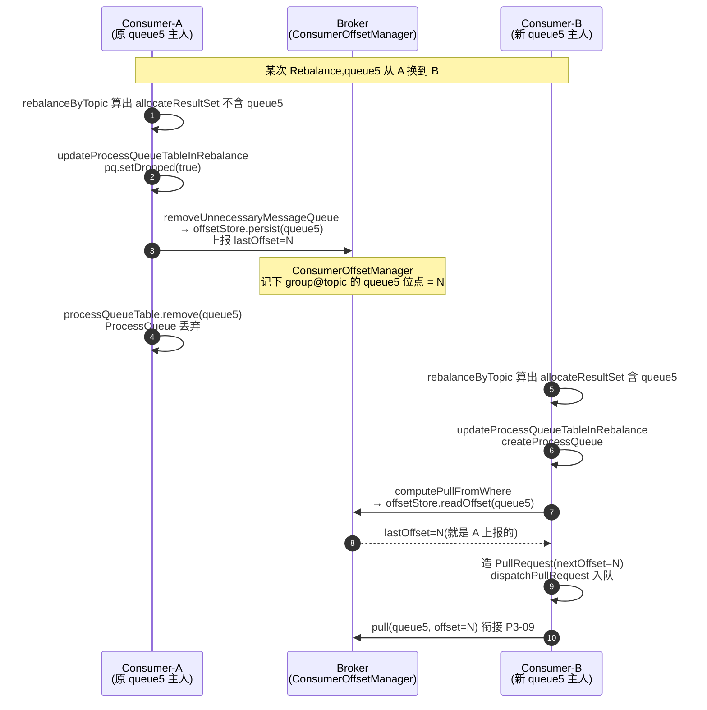

# 第十章 · Rebalance:Queue 怎么分配给 Consumer

> 篇:第 3 篇 · 消费
> 主线呼应:上一章 P3-09 把"消费端怎么拉消息"拆透了——`PullMessageService` 单线程死循环从 `messageRequestQueue` 里取 `PullRequest`、对 broker 发起长轮询 pull。但那一章留了一个根本性的尾巴:**`PullRequest` 最初是谁塞进队列的?** 更本质的问题:一个 topic 有 16 个 queue,一个消费组有 4 个 consumer,这 16 个 queue 凭什么分给这 4 个 consumer?谁拉 queue0、谁拉 queue1?如果第 5 个 consumer 上线、或者某个 consumer 宕机,queue 归属怎么重分?这一章就回答这个——它叫 Rebalance,而且它有一个最反直觉的特点:**没有一个中心协调者来分配**,全网每个 consumer 各自算,却算出互斥的结果。

## 核心问题

**一个消费组内有多个 consumer,topic 的多个 queue 怎么分给它们?凭什么每个 consumer 各自算出来的归属是互斥的(不重复、不遗漏),而不需要一个中心协调者?consumer 增减时又是怎么触发重算、新归属下的消费位点怎么平稳迁移?**

读完本章你会明白:

1. Rebalance 的发动机是客户端 `RebalanceService` 这个后台线程,默认 **20 秒**醒一次(没平衡还会降到 1 秒重试),调 `RebalanceImpl.doRebalance` → `rebalanceByTopic`,对订阅的每个 topic 算一次分配。
2. CLUSTERING 模式下,每个 consumer 算分配用的是**同一份输入**:全量 queue 列表 `mqAll` + 全量 consumer id 列表 `cidAll`,两者都 `Collections.sort` 保证全网顺序一致,再喂给**同一个确定性分配算法**(默认 `AllocateMessageQueueAveragely` 均分)。同输入 + 同算法 = 同输出,无需协调。
3. RocketMQ 自带六种分配策略:均分(`AVG`)、轮分(`AVG_BY_CIRCLE`)、一致性哈希(`CONSISTENT_HASH` + 虚拟节点)、机房就近(`MACHINE_ROOM_NEARBY`)、配置(`CONFIG`)。一致性哈希靠虚拟节点让扩缩容时**只迁移少量 queue**,对比均分算法在加机器时的大范围重排。
4. 分配结果变化后,`updateProcessQueueTableInRebalance` 会**丢弃不再归我的 queue**(顺便把最后消费位点 `persist` 上报 broker)、**为新增 queue 建 `ProcessQueue` + 算起始 offset + 造 `PullRequest` 塞进 `PullMessageService` 队列**——这里就是 P3-09 `PullRequest` 的诞生地。
5. 一个容易混的点:`MessageQueueSelector` 是**发送端**选 queue(P7-20 顺序消息按 hash(key) 选),与本章**消费端**的 Rebalance 分配是两回事,别混。

> **如果一读觉得太难**:先只记住三件事——① Rebalance 是客户端后台线程每 20s 触发一次,对每个订阅 topic 算"哪些 queue 归我";② 全网 consumer 各自算却互斥,靠的是**输入全网一致(双排序 mqAll/cidAll)+ 算法确定**这两条,没有协调者;③ 算完,新归我的 queue 就建 `ProcessQueue` 造 `PullRequest` 塞进拉取队列(衔接 P3-09),不再归我的就丢弃(先把位点上报)。

---

## 10.1 一句话点破

> **RocketMQ 的 Rebalance 是一次"无需协调的算术题":每个 consumer 自己拿一份全量 queue 列表(mqAll)和全量 consumer id 列表(cidAll),两个列表都按固定规则排好序,再喂给一个大家事先约定好的确定性分配算法(默认均分)。同样的输入 + 同样的算法 = 同样的输出,于是每个 consumer 只要从结果里挑出"属于自己 clientId 的那一份",全网拼起来天然互斥不重不漏——没有一个 master 在那里分发,也没有一次跨节点的协调通信。consumer 增减时,新一轮 Rebalance 用更新后的 cidAll 重算,归属自然迁移;新归我的 queue 建个 ProcessQueue 造个 PullRequest 就开始拉(衔接 P3-09),不再归我的把最后位点上报后丢弃。**

这是结论,不是理由。本章倒过来拆:先看"需要中心协调分配"会撞什么墙,再看 RocketMQ 怎么用"双排序 + 确定性算法"绕开协调者,然后钻进源码看 `doRebalance` → `rebalanceByTopic` → `updateProcessQueueTableInRebalance` 这条链怎么字面对应,最后把"一致性哈希 + 虚拟节点为什么扩缩容只迁少量 queue"这个最硬核的技巧单独拆透。

---

## 10.2 反面教材:需要中心协调分配会怎样

在讲"无需协调"之前,先把"为什么要绕开协调"想清楚。一个最直觉的分配方案是:**有个中心协调者(比如某个 broker,或者 ZooKeeper)负责把 queue 分配给 consumer**。consumer 上下线都告诉协调者,协调者算好分配方案后**推给每个 consumer**:"你,consumer-3,负责 queue 2、5、9"。

> **不这样会怎样**(中心协调撞的墙):

- **协调者是单点**:它挂了,全网分配停滞。为了不单点,协调者自己又要做成集群(还要共识,又回到 ZK 那套 RocketMQ 一开始就想绕开的重运维,见第 16 章 P5-16)。
- **协调者要维护"全网 consumer 列表"这个动态状态**:每个 consumer 上下线、心跳超时,协调者都要更新这个列表,再触发重算和下发。状态越多,故障恢复越复杂(重启要重建状态)。
- **通信开销**:每次分配变化,协调者要给每个 consumer 发一次"你的新分配"。N 个 consumer 就是 N 次下发,加上 consumer 上下线的高频,这条控制面的流量和延迟都不低。
- **脑裂风险**:协调者和 consumer 之间网络分区时,协调者以为 consumer-3 还在,consumer-3 自己以为被踢了,两边对"谁负责 queue 5"的认知不一致——要么两个 consumer 都拉 queue 5(重复消费),要么都没人拉(消息堆积)。

一句话:**中心协调把"分配决策"集中了,代价是引入了单点、状态维护、通信开销和脑裂风险**。这在 RocketMQ 海量 consumer(一个集群几万 consumer 几千消费组)的场景下是灾难。

> **钉死这件事**:Rebalance 选择"无中心协调"——每个 consumer 自己算,不需要协调者下发方案。这和第 16 章 P5-16 "NameServer 各节点独立、broker 向全部注册、放弃 ZK 共识"是同一种设计取向:**能用最终一致性 + 各自计算解决的,绝不引入中心协调和强一致**。

那么问题来了:**没有协调者,每个 consumer 各自算,凭什么算出互斥的结果?** 这就是下一节的核心。

---

## 10.3 凭什么各自算出互斥结果:双排序 + 同一确定性算法

无中心协调的关键,在于让"每个 consumer 的计算输入"和"计算逻辑"都**全网严格一致**。RocketMQ 用了两招:

**第一招:输入全网一致——`mqAll` 和 `cidAll` 都 `Collections.sort`。**

CLUSTERING 模式下,每个 consumer 算分配前,都要拿到两份列表:

- `mqAll`:这个 topic 的**全部** MessageQueue(从 NameServer 拉路由得到,见 P5-15)。比如 topic `order` 在两个 broker 上各 8 个 queue,`mqAll` 就是这 16 个 `MessageQueue` 对象。
- `cidAll`:这个消费组的**全部** consumer id(clientId)列表(向 broker 查 `getConsumerIdListByGroup` 得到,broker 端由各 consumer 心跳注册汇总)。

关键是这两份列表在算之前都要**排序**:

```java
List<MessageQueue> mqAll = new ArrayList<>(mqSet);
Collections.sort(mqAll);      // RebalanceImpl.java:303 全量 queue 排序
Collections.sort(cidAll);     // RebalanceImpl.java:304 全量 consumer id 排序
```

`MessageQueue` 和 `String` 都是 `Comparable` 的,排序是确定的(按 brokerName、queueId 字典序;clientId 按字符串字典序)。**只要每个 consumer 拿到的 `mqAll` 和 `cidAll` 内容一样(都是全量),排序后顺序就全网一致**。

> **钉死这件事**:排序的目的不是"好看",而是**消除"列表顺序"这个不确定性**。如果各 consumer 拿到的 queue 列表顺序不一样(比如 consumer-A 拿到的是 [q0,q1,q2,q3],consumer-B 拿到的是 [q3,q2,q1,q0]),即使后面用同样的算法,在"按 index 切分"时也会切错。排序把顺序钉死,让"输入"这一维全网统一。

那 `mqAll` 和 `cidAll` 怎么保证各 consumer 拿到的是**同一份内容**?这是最终一致性的:

- `mqAll` 来自 NameServer 的路由(全网 broker 都向 NameServer 注册 topic 配置,各 consumer 都从 NameServer 拉同一份路由,见 P5-15)。30s 一拉(P5-16),短期可能有 consumer 拿到旧路由,但最终一致。
- `cidAll` 来自 broker 的 `ConsumerManager`(每个 consumer 启动时向 broker 心跳注册自己的 clientId,broker 汇总成消费组的 id 列表;任何 consumer 查 `getConsumerIdListByGroup` 都拿到同一份)。心跳 30s 一次,最终一致。

所以在某个瞬间,可能有 consumer 的 `cidAll` 还是旧的(比如新 consumer 刚上线还没被全网感知),这时会出现**短暂的分配不一致**(可能有两个 consumer 都算出自己负责 queue5,或者 queue5 没人负责)。但下一个 Rebalance 周期(20s 内)路由和心跳都更新后,全网重新一致,不一致自动收敛。这就是"最终一致性 + 重复重算"——不追求某一瞬间绝对一致,靠周期性重算把偏差抹平。

**第二招:算法全网同一——`AllocateMessageQueueStrategy.allocate`。**

光输入一致不够,算法还得确定。`allocate` 方法是个**纯函数**:给定 `(consumerGroup, currentCID, mqAll, cidAll)`,返回"属于 currentCID 这个 consumer 的 queue 子列表"。**同样的入参,无论在哪个 consumer 上跑,输出都一样**。然后每个 consumer 跑这个函数时,把 `currentCID` 换成自己的 clientId,就从"全量分配方案"里挑出了"属于我的那一份"。

```java
AllocateMessageQueueStrategy strategy = this.allocateMessageQueueStrategy;
List<MessageQueue> allocateResult = strategy.allocate(
    this.consumerGroup,                 // RebalanceImpl.java:311 消费组
    this.mQClientFactory.getClientId(), // :312 当前 consumer 的 id
    mqAll,                              // :313 全量 queue(已排序)
    cidAll);                            // :314 全量 consumer(已排序)
```

默认的 `AllocateMessageQueueAveragely`(均分,下一节拆源码)就是这样:它按"我在 cidAll 里的 index"切 mqAll 的某一段。每个 consumer 算自己的 index,各切各的,加起来正好是整个 mqAll,互斥不漏。

> **钉死这件事**:无中心协调分配的两个支点是 **(1) 双排序保证输入全网一致,(2) 同一确定性算法保证输出可复现**。这两个支点有一个不稳,就会算出冲突(两个 consumer 抢同一个 queue)或遗漏(某个 queue 没人管)。下一章 P3-11 讲位点时会看到,即使出现短暂冲突(两个 consumer 都拉 queue5),"至少一次"语义 + 业务幂等也能兜住,不会出正确性问题。

---

## 10.4 默认算法:AllocateMessageQueueAveragely 怎么均分

默认的均分算法,源码短得惊人([AllocateMessageQueueAveragely.java:28](../rocketmq/client/src/main/java/org/apache/rocketmq/client/consumer/rebalance/AllocateMessageQueueAveragely.java#L28)):

```java
@Override
public List<MessageQueue> allocate(String consumerGroup, String currentCID, List<MessageQueue> mqAll,
    List<String> cidAll) {

    List<MessageQueue> result = new ArrayList<>();
    if (!check(consumerGroup, currentCID, mqAll, cidAll)) {   // :33 校验:自己在 cidAll 里、列表非空
        return result;
    }

    int index = cidAll.indexOf(currentCID);                   // :37 我在 cidAll 里的下标
    int mod = mqAll.size() % cidAll.size();                   // :38 余数:queue 数除不尽 consumer 数
    int averageSize =
        mqAll.size() <= cidAll.size() ? 1 : (mod > 0 && index < mod ? mqAll.size() / cidAll.size()
            + 1 : mqAll.size() / cidAll.size());              // :39-41 我这段多分一个还是少分一个
    int startIndex = (mod > 0 && index < mod) ? index * averageSize : index * averageSize + mod;  // :42 我的起点
    int range = Math.min(averageSize, mqAll.size() - startIndex);   // :43 我这段多长(防越界)
    for (int i = 0; i < range; i++) {
        result.add(mqAll.get(startIndex + i));                // :45 切这一段
    }
    return result;
}
```

核心是这几行算术。以"16 个 queue,4 个 consumer"为例(排好序的 cidAll = [c0, c1, c2, c3],mqAll = [q0..q15]):

| consumer | index | mod | averageSize | startIndex | range | 分到 |
|----------|-------|-----|-------------|-----------|-------|------|
| c0 | 0 | 0 | 16/4=4 | 0×4=0 | 4 | q0,q1,q2,q3 |
| c1 | 1 | 0 | 4 | 1×4=4 | 4 | q4,q5,q6,q7 |
| c2 | 2 | 0 | 4 | 2×4=8 | 4 | q8,q9,q10,q11 |
| c3 | 3 | 0 | 4 | 3×4=12 | 4 | q12,q13,q14,q15 |

整除,每人 4 个,干净利落。再看除不尽的"17 个 queue,4 个 consumer"(mod = 1):

| consumer | index | mod | averageSize | startIndex | range | 分到 |
|----------|-------|-----|-------------|-----------|-------|------|
| c0 | 0 | 1 | 17/4+1=5 | 0×5=0 | 5 | q0..q4 |
| c1 | 1 | 1 | 17/4=4 | 1×4+1=5 | 4 | q5..q8 |
| c2 | 2 | 1 | 4 | 2×4+1=9 | 4 | q9..q12 |
| c3 | 3 | 1 | 4 | 3×4+1=13 | 4 | q13..q16 |

排在前面的 consumer(`index < mod`)每人多扛一个,排后面的少扛一个。这是 `:42` 那行 `startIndex = index * averageSize + mod` 的精妙之处——**当 index >= mod 时,startIndex 要加上前面多分的 mod 个,把自己的起点顺延**。不这么顺延,就会和前面 consumer 切重叠。

> **钉死这件事**:均分算法是"按 index 把 mqAll 切成连续的 N 段,前 mod 段每段多一个"。它依赖两个前提:**cidAll 全网排序一致**(否则各 consumer 的 index 对不上)、**mqAll 全网排序一致**(否则切的是不同的段)。这两个前提就是 10.3 节那两个 `Collections.sort` 提供的。

> **不这样会怎样**:如果不用连续切段,而是"每个 consumer 按自己 index 取模挑 queue"(q0,q4,q8,q12 给 c0;q1,q5,q9,q13 给 c1……),那就是下一个算法 `AllocateMessageQueueAveragelyByCircle`(轮分)干的事。轮分的好处我们下一节对比。

---

## 10.5 三种策略对照:均分、轮分、一致性哈希

除了默认的 `AVG`,还有 `AVG_BY_CIRCLE`(轮分)和 `CONSISTENT_HASH`(一致性哈希)。三者源码都不长,对比着看最清楚。

**轮分 `AllocateMessageQueueAveragelyByCircle`**([:28](../rocketmq/client/src/main/java/org/apache/rocketmq/client/consumer/rebalance/AllocateMessageQueueAveragelyByCircle.java#L28)):

```java
int index = cidAll.indexOf(currentCID);
for (int i = index; i < mqAll.size(); i++) {
    if (i % cidAll.size() == index) {     // :39 每隔 cidAll.size() 个取一个
        result.add(mqAll.get(i));
    }
}
```

4 个 consumer 16 个 queue,结果:c0 拿 q0,q4,q8,q12;c1 拿 q1,q5,q9,q13…… **打散分配**,每个 consumer 分到的 queue 在 broker 维度上是交错的(不是连续的一段)。

均分 vs 轮分,关键差别在**扩缩容时的迁移量**:

| | 均分(AVG,默认) | 轮分(AVG_BY_CIRCLE) |
|---|---|---|
| 分配方式 | 连续切段 | 隔步取 |
| 16q/4c 例子 | c0=q0-3, c1=q4-7, c2=q8-11, c3=q12-15 | c0=q0,4,8,12, c1=q1,5,9,13... |
| 加 1 个 consumer(变 5c)后 | 重新切段:c0=q0-3,c1=q4-7,c2=q8-11,c3=q12-15 → c0=q0-2,c1=q3-5,c2=q6-8,c3=q9-11,**c4=q12-15**。**几乎每个 consumer 的归属都变了** | 重新打散,c0=q0,5,10,15,c1=q1,6,11...。**也是大部分都变了** |

两者在"加一个 consumer"时,**迁移范围都很大**(大部分 queue 换主人)。这对"消费位点要随之迁移"来说是个负担——每个换了主人的 queue,新主人要重新 `computePullFromWhere` 算起始 offset、建 ProcessQueue、拉一批消息。迁移面越大,瞬时抖动越大。

**一致性哈希 `AllocateMessageQueueConsistentHash`** 就是为"扩缩容只迁少量 queue"而生的。它把 consumer 节点用虚拟节点撒到一个哈希环上,每个 queue 按自己的哈希值在环上"顺时针找下一个 consumer 节点"。加一个 consumer,只影响环上一小段——只有哈希值落在"新 consumer 节点前面那段"的 queue 会迁移,其余不动。这个机制下一节"技巧精解"单独拆。

三种策略一张表钉死:

| 策略 | 类名 | getName() | 适用 |
|------|------|-----------|------|
| 均分(默认) | `AllocateMessageQueueAveragely` | `AVG` | consumer 数稳定、想负载均匀 |
| 轮分 | `AllocateMessageQueueAveragelyByCircle` | `AVG_BY_CIRCLE` | 想让每个 consumer 分到的 queue 在 broker 维度打散(避免单 consumer 全压一个 broker) |
| 一致性哈希 | `AllocateMessageQueueConsistentHash` | `CONSISTENT_HASH` | consumer 频繁上下线、想最小化迁移 |
| 机房就近 | `AllocateMachineRoomNearby` | `MACHINE_ROOM_NEARBY-x` | 多机房、想同机房消费同机房 queue |
| 配置 | `AllocateMessageQueueByConfig` | `CONFIG` | 想写死分配规则 |

> **钉死这件事**:默认是 `AVG`(`DefaultMQPushConsumer` 构造函数 `new AllocateMessageQueueAveragely()`,见 [DefaultMQPushConsumer.java:295](../rocketmq/client/src/main/java/org/apache/rocketmq/client/consumer/DefaultMQPushConsumer.java#L295) 等多处)。想换策略,`consumer.setAllocateMessageQueueStrategy(new AllocateMessageQueueConsistentHash())` 即可——但**消费组内所有 consumer 必须用同一个策略**,否则各算各的必然冲突。

---

## 10.6 源码链:doRebalance → rebalanceByTopic → updateProcessQueueTableInRebalance

现在把 Rebalance 这条链从触发到落地,顺源码走一遍。

### 触发:RebalanceService 20 秒(或 1 秒)一跑

客户端启动时,`MQClientInstance.start()` 会起一个 `RebalanceService` 后台线程([MQClientInstance.java:213](../rocketmq/client/src/main/java/org/apache/rocketmq/client/impl/factory/MQClientInstance.java#L213) 创建、[:327](../rocketmq/client/src/main/java/org/apache/rocketmq/client/impl/factory/MQClientInstance.java#L327) start)。它的 `run` 循环([RebalanceService.java:40](../rocketmq/client/src/main/java/org/apache/rocketmq/client/impl/consumer/RebalanceService.java#L40)):

```java
private static long waitInterval =
    Long.parseLong(System.getProperty(
        "rocketmq.client.rebalance.waitInterval", "20000"));     // :25-27 默认 20s
private static long minInterval =
    Long.parseLong(System.getProperty(
        "rocketmq.client.rebalance.minInterval", "1000"));        // :28-30 最快 1s

@Override
public void run() {
    long realWaitInterval = waitInterval;
    while (!this.isStopped()) {
        this.waitForRunning(realWaitInterval);                     // :45 等一会

        long interval = System.currentTimeMillis() - lastRebalanceTimestamp;
        if (interval < minInterval) {
            realWaitInterval = minInterval - interval;             // :49 太快了,再等等(限速)
        } else {
            boolean balanced = this.mqClientFactory.doRebalance(); // :51 真正的 Rebalance
            realWaitInterval = balanced ? waitInterval : minInterval;  // :52 没平衡就 1s 再跑
            lastRebalanceTimestamp = System.currentTimeMillis();
        }
    }
}
```

> **技巧点睛·为什么默认 20s,没平衡降到 1s?** Rebalance 是个"全网周期性收敛"的过程,跑得太勤(比如 1s)没必要——路由和心跳都是 30s 级更新,跑再勤输入也没变,纯浪费 CPU。但跑得太稀(比如 1 分钟)又响应慢——consumer 宕机后,要等一分钟才有人接手它的 queue,这期间消息堆积。20s 是个平衡点。**关键在 :52 的自适应**:如果这一轮算出来还没平衡(`balanced=false`,可能是某 consumer 刚下线、路由还没更新),下一轮立刻降到 1s 重试,快速收敛;平衡了再回 20s 慢跑。这是"平时省资源、动荡时快速响应"的典型自适应设计。

除了这个定时触发,还有几个**事件触发**会立刻唤醒 Rebalance(`rebalanceService.wakeup()` 让 `waitForRunning` 立刻返回):

- **路由变化**:`MQClientInstance` 每 30s 从 NameServer 拉一次路由([:352](../rocketmq/client/src/main/java/org/apache/rocketmq/client/impl/factory/MQClientInstance.java#L352) 的 `updateTopicRouteInfoFromNameServer` 定时任务),如果发现 topic 的 queue 列表变了(比如扩容了 queue 数),会触发 Rebalance。
- **consumer 上下线**:broker 感知到消费组 consumer 列表变化(心跳超时或新注册),client 心跳响应里带 `REBALANCE_LATER` 标志,触发 Rebalance。
- **顺序消费锁失败**:`updateProcessQueueTableInRebalance` 里给新 queue 加锁失败时,`rebalanceLater(500)` 半秒后重试([RebalanceImpl.java:500](../rocketmq/client/src/main/java/org/apache/rocketmq/client/impl/consumer/RebalanceImpl.java#L500))。

### doRebalance:遍历订阅的每个 topic

`RebalanceService` 调 `MQClientInstance.doRebalance`([:1185](../rocketmq/client/src/main/java/org/apache/rocketmq/client/impl/factory/MQClientInstance.java#L1185)),它遍历所有 consumer(一个 client 实例可能跑多个消费组),每个调 `tryRebalance` → 最终落到 `RebalanceImpl.doRebalance`([:232](../rocketmq/client/src/main/java/org/apache/rocketmq/client/impl/consumer/RebalanceImpl.java#L232)):

```java
public boolean doRebalance(final boolean isOrder) {
    boolean balanced = true;
    Map<String, SubscriptionData> subTable = this.getSubscriptionInner();
    if (subTable != null) {
        for (final Map.Entry<String, SubscriptionData> entry : subTable.entrySet()) {   // :236 遍历订阅的每个 topic
            final String topic = entry.getKey();
            try {
                if (!clientRebalance(topic)) {
                    boolean result = this.getRebalanceResultFromBroker(topic, isOrder);  // :240 走 broker 端分配(5.x Assignments)
                } else {
                    boolean result = this.rebalanceByTopic(topic, isOrder);              // :245 走客户端分配(本章重点)
                    if (!result) { balanced = false; }
                }
            } catch (Throwable e) {
                if (!topic.startsWith(MixAll.RETRY_GROUP_TOPIC_PREFIX)) {
                    balanced = false;
                }
            }
        }
    }
    this.truncateMessageQueueNotMyTopic();    // :259 清理不再订阅的 topic 的 ProcessQueue
    return balanced;
}
```

注意 :239 的分支:`clientRebalance(topic)` 默认返回 `true`(走客户端分配,本章重点),但 5.x 引入了 broker 端分配(`getRebalanceResultFromBroker`,基于 `MessageQueueAssignment`,适合 Pop 模式)。Push 模式默认还是客户端算,我们只讲这条。

### rebalanceByTopic:CLUSTERING 模式的双排序 + allocate

核心在这里([:268](../rocketmq/client/src/main/java/org/apache/rocketmq/client/impl/consumer/RebalanceImpl.java#L268)),CLUSTERING 分支:

```java
case CLUSTERING: {
    Set<MessageQueue> mqSet = this.topicSubscribeInfoTable.get(topic);     // :288 我拉到的全量 queue
    if (null == mqSet || mqSet.isEmpty()) {
        // topic 路由还没拉到,跳过
        break;
    }

    List<String> cidAll = this.mQClientFactory.findConsumerIdList(topic, consumerGroup);  // :297 向 broker 查全量 consumer id
    if (null == cidAll || cidAll.isEmpty()) {
        // 还没拿到消费组列表,跳过
    } else {
        List<MessageQueue> mqAll = new ArrayList<>(mqSet);

        Collections.sort(mqAll);    // :303 双排序之一:queue
        Collections.sort(cidAll);   // :304 双排序之二:consumer id

        AllocateMessageQueueStrategy strategy = this.allocateMessageQueueStrategy;

        List<MessageQueue> allocateResult = null;
        try {
            allocateResult = strategy.allocate(   // :310 调分配算法
                this.consumerGroup,
                this.mQClientFactory.getClientId(),
                mqAll,
                cidAll);
        } catch (Throwable e) {
            return false;
        }

        Set<MessageQueue> allocateResultSet = new HashSet<>();
        if (allocateResult != null) {
            allocateResultSet.addAll(allocateResult);   // :322 我分到的 queue 集合
        }

        boolean changed = this.updateProcessQueueTableInRebalance(topic, allocateResultSet, isOrder);  // :325 落地:建/删 ProcessQueue
        if (changed) {
            this.messageQueueChanged(topic, mqSet, allocateResultSet);   // :331 通知(更新订阅版本号、重算流控阈值、心跳)
        }
        balanced = allocateResultSet.equals(getWorkingMessageQueue(topic));
    }
    break;
}
```

这就是 10.3 节讲的那套:**取 mqAll(全量 queue)+ cidAll(全量 consumer id)+ 双排序 + 调 `allocate`**,得到"属于我的 queue 集合",然后 `updateProcessQueueTableInRebalance` 把它落地。

`:297` 的 `findConsumerIdList` 值得单独说一句——它向 broker 发 `GET_CONSUMER_LIST_BY_GROUP` 请求([MQClientInstance.java:1307](../rocketmq/client/src/main/java/org/apache/rocketmq/client/impl/factory/MQClientInstance.java#L1307)),broker 端的 `ConsumerManager` 汇总了所有心跳注册过的 consumer clientId。**每个 consumer 查到的 cidAll 都是同一份**(都是 broker 那份),这就是"输入全网一致"的来源。注意这是最终一致的——新 consumer 刚上线,要等下一次心跳被 broker 感知、再被其他 consumer 查到,最多差一两个心跳周期(30s)。这期间可能出现短暂的不一致分配,靠下一轮 Rebalance 收敛。

### updateProcessQueueTableInRebalance:落地——丢弃不归我的、为新增的建队列

分配算完了,要把"理论归属"变成"实际拉取"——这就是 `updateProcessQueueTableInRebalance`([:426](../rocketmq/client/src/main/java/org/apache/rocketmq/client/impl/consumer/RebalanceImpl.java#L426))。它干三件事:

```java
private boolean updateProcessQueueTableInRebalance(final String topic, final Set<MessageQueue> mqSet,
    final boolean needLockMq) {
    boolean changed = false;

    // ① 丢弃不再归我的 queue
    HashMap<MessageQueue, ProcessQueue> removeQueueMap = new HashMap<>(...);
    Iterator<Entry<MessageQueue, ProcessQueue>> it = this.processQueueTable.entrySet().iterator();
    while (it.hasNext()) {
        Entry<MessageQueue, ProcessQueue> next = it.next();
        MessageQueue mq = next.getKey();
        ProcessQueue pq = next.getValue();
        if (mq.getTopic().equals(topic)) {
            if (!mqSet.contains(mq)) {           // :439 不在新分配结果里
                pq.setDropped(true);             // :440 标记丢弃
                removeQueueMap.put(mq, pq);
            }
        }
    }
    for (Entry<MessageQueue, ProcessQueue> entry : removeQueueMap.entrySet()) {
        MessageQueue mq = entry.getKey();
        ProcessQueue pq = entry.getValue();
        if (this.removeUnnecessaryMessageQueue(mq, pq)) {   // :456 丢弃前先持久化位点(顺序消费还要 unlock)
            this.processQueueTable.remove(mq);
            changed = true;
        }
    }

    // ② 为新增 queue 建 ProcessQueue + 算起始 offset + 造 PullRequest
    List<PullRequest> pullRequestList = new ArrayList<>();
    for (MessageQueue mq : mqSet) {
        if (!this.processQueueTable.containsKey(mq)) {       // :467 新归我的
            // (顺序消费需要先 lock)
            this.removeDirtyOffset(mq);
            ProcessQueue pq = createProcessQueue();          // :475 建本地待消费缓冲
            pq.setLocked(true);
            long nextOffset = this.computePullFromWhere(mq); // :477 算从哪开始拉(位点迁移!)
            if (nextOffset >= 0) {
                ProcessQueue pre = this.processQueueTable.putIfAbsent(mq, pq);
                if (pre == null) {
                    PullRequest pullRequest = new PullRequest();   // :484 造 PullRequest
                    pullRequest.setConsumerGroup(consumerGroup);
                    pullRequest.setNextOffset(nextOffset);         // :486 起始 offset
                    pullRequest.setMessageQueue(mq);
                    pullRequest.setProcessQueue(pq);
                    pullRequestList.add(pullRequest);
                    changed = true;
                }
            }
        }
    }

    // ③ 把新 PullRequest 派发给 PullMessageService(衔接 P3-09!)
    this.dispatchPullRequest(pullRequestList, 500);   // :503
    return changed;
}
```

三件事里,③ 是衔接 P3-09 的关键:`dispatchPullRequest` 的实现([RebalancePushImpl.java:261](../rocketmq/client/src/main/java/org/apache/rocketmq/client/impl/consumer/RebalancePushImpl.java#L261)):

```java
@Override
public void dispatchPullRequest(final List<PullRequest> pullRequestList, final long delay) {
    for (PullRequest pullRequest : pullRequestList) {
        if (delay <= 0) {
            this.defaultMQPushConsumerImpl.executePullRequestImmediately(pullRequest);   // :264 立刻塞进 messageRequestQueue
        } else {
            this.defaultMQPushConsumerImpl.executePullRequestLater(pullRequest, delay);  // :266 延迟 500ms 塞
        }
    }
}
```

`executePullRequestImmediately` 就是把 `PullRequest` 塞进 `PullMessageService` 的 `messageRequestQueue`(P3-09 讲的那个阻塞队列)。**所以 P3-09 里"PullRequest 是从哪来的",答案就在这里——Rebalance 算出新归我的 queue 时造出来塞进去的**。一旦塞进去,`PullMessageService` 单线程就会 `take()` 到它,发起长轮询 pull,这个 queue 的消费循环就启动了。

> **钉死这条衔接**:Rebalance 落地的最后一步 `dispatchPullRequest`,就是把新归属 queue 的 `PullRequest` 塞进 P3-09 讲的 `messageRequestQueue`。P3-09 的"拉"和 P3-10 的"分"在这里闭环:Rebalance 决定"谁拉哪些 queue",造 PullRequest 入队;PullMessageService 从队列取出 PullRequest 去拉。两章讲的是同一条流水线的两个环节。

---

## 10.7 位点怎么迁移:computePullFromWhere + removeUnnecessaryMessageQueue

Rebalance 让 queue 换主人,最敏感的是**消费位点(offset)**:queue5 从 consumer-A 换到 consumer-B,consumer-B 得知道"consumer-A 消费到哪了",从那个位置接着拉,否则要么重复消费(从头拉)、要么漏消息(从最新拉)。这个迁移由两个方法完成。

**接手方:computePullFromWhereWithException 算起始 offset**

新主人接手 queue5 时,`updateProcessQueueTableInRebalance` 的 :477 调 `computePullFromWhere(mq)`。它的实现([RebalancePushImpl.java:166](../rocketmq/client/src/main/java/org/apache/rocketmq/client/impl/consumer/RebalancePushImpl.java#L166))核心是先查 offset store:

```java
public long computePullFromWhereWithException(MessageQueue mq) throws MQClientException {
    long result = -1;
    final ConsumeFromWhere consumeFromWhere = ...getConsumeFromWhere();
    final OffsetStore offsetStore = ...getOffsetStore();
    switch (consumeFromWhere) {
        case CONSUME_FROM_LAST_OFFSET: {
            long lastOffset = offsetStore.readOffset(mq, ReadOffsetType.READ_FROM_STORE);   // :175 先查已记录的位点
            if (lastOffset >= 0) {
                result = lastOffset;                // :177 有记录,从这开始(位点迁移的关键!)
            } else if (-1 == lastOffset) {
                // 没记录(第一次消费这个 queue)
                if (mq.getTopic().startsWith(MixAll.RETRY_GROUP_TOPIC_PREFIX)) {
                    result = 0L;
                } else {
                    result = this.mQClientFactory.getMQAdminImpl().maxOffset(mq);   // :185 从最新开始(忽略历史)
                }
            }
            break;
        }
        case CONSUME_FROM_FIRST_OFFSET: { ... result = 0L; ... }    // 从头
        case CONSUME_FROM_TIMESTAMP: { ... }                         // 按时间
    }
    return result;
}
```

关键在 :175 的 `offsetStore.readOffset`。CLUSTERING 模式下 offsetStore 是 `RemoteBrokerOffsetStore`(下一章 P3-11 详讲),它会向 broker 查这个 queue 的已记录位点。**这个位点是上一个 consumer 消费时上报给 broker 的**(P3-11 讲 5s 上报一次)。所以新主人查到的,就是老主人走的时候留下的进度——这就是位点迁移的机制。

> **钉死这件事**:CLUSTERING 模式下,消费位点是消费组共享的(存在 broker 端的 `ConsumerOffsetManager`,key 是 `topic@group`,不是按 consumer 存)。所以 queue5 换主人,新主人查 `offsetStore.readOffset(queue5)` 查到的是"这个消费组消费 queue5 到哪了",和上一任是谁无关。这是"位点存在 broker、按 group 聚合"的好处——换 consumer 不丢进度。代价是位点上报有延迟(5s),换主人瞬间可能少拉 5s 的消息,但下任会从上报过的位点继续,加上"至少一次"+ 业务幂等(P3-11),不丢不重(语义层面)。

**交出方:removeUnnecessaryMessageQueue 持久化最后位点**

老主人丢弃 queue5 前,`:456` 调 `removeUnnecessaryMessageQueue`,实现([RebalancePushImpl.java:94](../rocketmq/client/src/main/java/org/apache/rocketmq/client/impl/consumer/RebalancePushImpl.java#L94)):

```java
@Override
public boolean removeUnnecessaryMessageQueue(final MessageQueue mq, final ProcessQueue pq) {
    if (this.defaultMQPushConsumerImpl.isConsumeOrderly()
        && MessageModel.CLUSTERING.equals(this.defaultMQPushConsumerImpl.messageModel())) {
        this.defaultMQPushConsumerImpl.getOffsetStore().persist(mq);    // :99 立刻把内存位点上报 broker
        return tryRemoveOrderMessageQueue(mq, pq);                      // :102 顺序消费还要 unlock
    } else {
        this.defaultMQPushConsumerImpl.getOffsetStore().persist(mq);    // :104 上报最后位点
        this.defaultMQPushConsumerImpl.getOffsetStore().removeOffset(mq); // :105 清本地内存
        return true;
    }
}
```

无论是否顺序消费,丢弃前都 `offsetStore.persist(mq)`——把内存里这个 queue 的最后消费位点上报 broker。这就是"交出方留下进度"。新主人的 `readOffset` 查到的就是它。`:102` 的顺序消费分支还要 `unlock`(释放 broker 端的分布式 queue 锁,见 P7-20),保证新主人能重新加锁。



这张图是 Rebalance 时 queue 迁移的全貌。位点在 broker 端中转,新老主人不直接通信,通过 broker 的 `ConsumerOffsetManager` 间接交接。这是"消费组共享位点"的核心机制,下一章 P3-11 会把 offsetStore 的内存缓冲、5s 上报、increaseOnly 拆透。

---

## 10.8 一个容易混的点:MessageQueueSelector ≠ Rebalance

最后澄清一个读者常混的概念。RocketMQ 里有两个"选 queue"的机制,名字像、干的事完全不同:

| | MessageQueueSelector(发送端) | AllocateMessageQueueStrategy(消费端 Rebalance) |
|---|---|---|
| 谁用 | Producer 发消息时 | Consumer Rebalance 时 |
| 解决什么 | **这条消息发到哪个 queue** | **这个 consumer 拉哪些 queue** |
| 典型场景 | 顺序消息:按 hash(businessKey) 选 queue,保证同 key 进同 queue(P7-20) | 把 topic 的所有 queue 分给消费组的所有 consumer |
| 输入 | 一条消息 + businessKey | 全量 mqAll + 全量 cidAll |
| 输出 | 一个 queue | 一组 queue |
| 类位置 | `client/.../producer/MessageQueueSelector` | `client/.../consumer/AllocateMessageQueueStrategy` |

> **钉死这件事**:`MessageQueueSelector` 是**发送端**决定"消息进哪个 queue"(P7-20 顺序消息的核心),`AllocateMessageQueueStrategy` 是**消费端**决定"哪些 queue 归我拉"。两者一个在 Producer、一个在 Consumer,解决的问题完全不同,只是都涉及"queue"这个词容易混。本章只讲后者。

---

## 10.9 技巧精解:一致性哈希 + 虚拟节点 —— 扩缩容凭什么只迁少量 queue

这一章最硬核的技巧,是 `AllocateMessageQueueConsistentHash` 用的一致性哈希。我们把它和"为什么虚拟节点"一起拆透。

### 朴素一致性哈希:环上顺时针找下一个

一致性哈希的核心思路:把所有 consumer 节点和所有 queue 都映射到一个 `0 ~ 2^64` 的哈希环上,每个 queue 归"环上顺时针方向遇到的第一个 consumer 节点"。看 RocketMQ 的实现([ConsistentHashRouter.java](../rocketmq/common/src/main/java/org/apache/rocketmq/common/consistenthash/ConsistentHashRouter.java)):

```java
public class ConsistentHashRouter<T extends Node> {
    private final SortedMap<Long, VirtualNode<T>> ring = new TreeMap<>();   // :33 哈希环,按 hash 值排序
    private final HashFunction hashFunction;

    public ConsistentHashRouter(Collection<T> pNodes, int vNodeCount, HashFunction hashFunction) {
        this.hashFunction = hashFunction;
        for (T pNode : pNodes) {
            addNode(pNode, vNodeCount);      // :52 每个 consumer 节点撒到环上
        }
    }

    public void addNode(T pNode, int vNodeCount) {
        for (int i = 0; i < vNodeCount; i++) {
            VirtualNode<T> vNode = new VirtualNode<>(pNode, i);          // 虚拟节点
            ring.put(hashFunction.hash(vNode.getKey()), vNode);          // :69 算 hash,塞进环
        }
    }

    public T routeNode(String objectKey) {
        if (ring.isEmpty()) { return null; }
        Long hashVal = hashFunction.hash(objectKey);                      // :96 queue 的 hash
        SortedMap<Long, VirtualNode<T>> tailMap = ring.tailMap(hashVal);  // :97 环上 >= queue hash 的部分
        Long nodeHashVal = !tailMap.isEmpty() ? tailMap.firstKey() : ring.firstKey();  // :98 顺时针第一个,环回取首
        return ring.get(nodeHashVal).getPhysicalNode();                   // :99 返回那个 consumer
    }
}
```

`TreeMap` 的 `tailMap(hashVal).firstKey()` 就是"顺时针找下一个"——`tailMap` 返回所有 key >= hashVal 的子 Map,`firstKey` 是其中最小的(也就是环上 >= queue hash 的最近一个 consumer 节点)。如果 `tailMap` 空(queue 的 hash 比所有 consumer 都大),取 `ring.firstKey()`——环回到首部,这就是"环"的语义。

分配时([AllocateMessageQueueConsistentHash.java:73](../rocketmq/client/src/main/java/org/apache/rocketmq/client/consumer/rebalance/AllocateMessageQueueConsistentHash.java#L73)):

```java
for (MessageQueue mq : mqAll) {
    ClientNode clientNode = router.routeNode(mq.toString());    // :74 每个 queue 找它的主人
    if (clientNode != null && currentCID.equals(clientNode.getKey())) {
        results.add(mq);   // :76 主人是我,这个 queue 归我
    }
}
```

每个 consumer 都跑这个循环,但只有 `currentCID` 等于 `routeNode` 返回的主人的 consumer,才会把 mq 加进自己的结果。**全网拼起来,每个 queue 恰好被一个 consumer 认领,互斥不漏**。

### 扩缩容的迁移量:为什么只动一截

一致性哈希最妙的地方在扩缩容。假设环上有 c0、c1、c2 三个 consumer,queue 散落环上:

```
新增 c4 前:
      c0
   /      \
 q1        q5
 |    c2   |
 q9        q3
   \      /
      c1
queue 归属:q1→c0, q3→c1, q5→c0, q9→c2 (顺时针找下一个)

新增 c4(假设 c4 的 hash 落在 c2 和 c0 之间):
      c0
   /      \
 q1   c4   q5
 |         |
 q9   c2   q3
   \      /
      c1
现在环序:c0 → c1 → c2 → c4 → c0(顺时针)
queue 归属重算:
  q1 → 顺时针遇到 c4(不是 c0 了!)→ 迁移给 c4
  q3 → 还是 c1 → 不变
  q5 → 还是 c0 → 不变
  q9 → 还是 c2 → 不变
只有 q1 迁移!
```

新增一个 consumer,只有"哈希值落在新节点前面那截"的 queue 会迁移,其余不动。这就是"扩缩容只迁少量 queue"。对比 10.5 节的均分算法——加一个 consumer,几乎每个 consumer 的归属都变。在"位点要随之迁移、ProcessQueue 要重建"的场景下,迁移量小意味着瞬时抖动小,这是一致性哈希的核心价值。

### 为什么还要虚拟节点

朴素一致性哈希有个问题:**consumer 少的时候,节点在环上分布不均**。只有 3 个 consumer,每个在环上只占一个点,很可能某个 consumer 的"管辖弧段"特别长(包揽大部分 queue),另外两个特别短——负载严重不均。

虚拟节点的解法:每个 consumer 在环上**不止占一个点,而是占 `virtualNodeCnt` 个点**(默认 10),均匀打散。看 `VirtualNode.getKey()`([VirtualNode.java:29](../rocketmq/common/src/main/java/org/apache/rocketmq/common/consistenthash/VirtualNode.java#L29)):

```java
@Override
public String getKey() {
    return physicalNode.getKey() + "-" + replicaIndex;   // clientId-0, clientId-1, ..., clientId-9
}
```

每个 consumer 生成 10 个虚拟节点(`clientId-0` 到 `clientId-9`),各自 hash 后撒到环上不同位置。`routeNode` 返回虚拟节点,但 `getPhysicalNode()` 还原成真实 consumer。这样 3 个 consumer 在环上就有 30 个点,分布均匀得多。

> **技巧点睛·虚拟节点为什么是 10?** 这是个经验值。虚拟节点越多,负载越均匀,但 `TreeMap` 占用越大、`routeNode` 的查找略慢。10 是均匀性和开销的平衡点。生产环境 consumer 多(几十上百个)时,10 个虚拟节点已经足够均匀;consumer 极少(2-3 个)时,可以调大 `virtualNodeCnt`。

### 反面对比:均分算法扩容时大范围重排

> **不这样会怎样**(用均分不用一致性哈希会撞的墙):

回到 10.5 节那张表。16 个 queue 4 个 consumer,均分算法:c0=q0-3, c1=q4-7, c2=q8-11, c3=q12-15。**加第 5 个 consumer 后重新均分**:c0=q0-2, c1=q3-5, c2=q6-8, c3=q9-11, c4=q12-15。**c0、c1、c2、c3 的归属全变了**——每个都要丢弃一部分原 queue、接手一部分新 queue。每个迁移的 queue 都要 `removeUnnecessaryMessageQueue`(上报位点)+ 新主人 `computePullFromWhere`(查位点)+ 建 ProcessQueue + 造 PullRequest。consumer 多、queue 多时,这种"大范围重排"在每次扩缩容时都会引发一波拉取风暴,瞬时延迟飙升。

一致性哈希把"加一个 consumer"的迁移量从"几乎全部"压到"约 1/N"(N 是 consumer 数),代价是负载分布稍微不严格均匀(虚拟节点够多时近似均匀)。在 consumer 频繁上下线(比如容器化部署、弹性扩缩)的场景,这个权衡非常值。

### 一致性哈希的代价

一致性哈希不是银弹,它有三个代价:

1. **queue 数远大于 consumer 数时,负载可能轻微不均**。虚拟节点 10 个,consumer 3 个,30 个点撒环上仍可能有疏密。严格均匀得用均分。
2. **不能保证"连续 queue 段"归一个 consumer**。均分算法下,c0 拿 q0-3 是连续的,在某些监控/统计场景方便;一致性哈希打散分配,queue 归属在 broker 维度上是乱跳的。
3. **算法稍复杂,有 `TreeMap` 开销**。均分是纯算术,O(1);一致性哈希每次 `routeNode` 是 O(log N)。N 不大时无感,但理论开销在那。

所以 RocketMQ 默认还是 `AVG`(均分)——多数场景 consumer 数稳定、追求严格均匀;一致性哈希作为可选项,给"频繁扩缩容、想最小化迁移"的场景用。**这是个工程取舍,不是非此即彼**。

---

## 10.10 Rebalance 何时收敛:全网一致性是怎么达成的

讲到这里,你可能会担心一个问题:**每个 consumer 各算各的,凭什么保证它们算的结果在某一时刻是一致的?** 比如新 consumer c4 刚上线,c0、c1、c2、c3 的 cidAll 还没更新(还没查到 c4),c4 自己查到的 cidAll 已经有自己了——这一瞬间,c4 算出来的归属和其他人算出来的不一样,会不会冲突?

答案是:**某一瞬间可能不一致,但最终一致**。机制是:

1. c4 上线,向 broker 心跳注册自己的 clientId。broker 的 `ConsumerManager` 更新消费组列表。
2. c4 第一次 `doRebalance`,`findConsumerIdList` 查到包含自己的 cidAll(5 个),算出自己该拉哪些 queue,开始拉。
3. 但 c0、c1、c2、c3 此刻 `findConsumerIdList` 查到的还是 4 个的旧列表(它们的 cidAll 缓存还没刷新),它们算的结果里 c4 不存在——所以它们还在拉"按 4 个 consumer 分配的归属",其中一部分(按 5 个算应该归 c4 的)和 c4 重叠。
4. **短暂重叠期**:c4 和某个老 consumer 都在拉同一批 queue。这是"重复消费"——但 RocketMQ 是"至少一次"语义,本来就可能重复消费(消息处理完但位点没上报就崩了),业务靠幂等兜底(P3-11)。所以这个重叠不出正确性问题,只是瞬时多消费了一遍。
5. 下一个 Rebalance 周期(20s 内,c0-c3 的路由和心跳都更新了),它们的 `findConsumerIdList` 查到包含 c4 的 cidAll,重新算,把该归 c4 的 queue 让出来(`removeUnnecessaryMessageQueue` 上报位点后丢弃)。全网收敛。

> **钉死这件事**:Rebalance 是**最终一致**的,不追求某一瞬间绝对一致。短暂的重叠或空窗,靠"至少一次 + 业务幂等"兜底语义正确性,靠周期性重算(20s,动荡时 1s)收敛实际归属。这是"放弃强一致换轻量"的典型——和 NameServer 的 AP 设计(P5-16)、长轮询的无状态(P3-09)是同一套哲学。

---

## 章末小结

这一章讲了消费组内多个 consumer 怎么分 queue,落在**分布式骨架**这一面——它解决的是"queue 怎么在 consumer 之间分配、且无需中心协调"的问题。

我们立起了三件事:

1. **无中心协调的确定性分配**:每个 consumer 自己拿全量 `mqAll` + `cidAll`,双 `Collections.sort` 保证输入全网一致,再调同一确定性算法 `AllocateMessageQueueStrategy.allocate`(默认 `AllocateMessageQueueAveragely` 均分)。同输入 + 同算法 = 同输出,每个 consumer 挑出"属于自己 clientId 的那一份",天然互斥不重不漏。
2. **Rebalance 的触发与落地**:`RebalanceService` 后台线程默认 20s 一跑(未平衡降到 1s 快速收敛),路由变化/上下线还会立刻唤醒;`doRebalance` → `rebalanceByTopic` 算分配 → `updateProcessQueueTableInRebalance` 落地(丢弃不归我的 queue 并上报位点、为新增 queue 建 ProcessQueue 造 PullRequest 派发给 PullMessageService——衔接 P3-09)。
3. **三种策略 + 一致性哈希的迁移优势**:均分(默认,严格均匀但扩缩容大范围重排)、轮分(queue 维度打散)、一致性哈希(虚拟节点,扩缩容只迁少量 queue)。一致性哈希靠 `TreeMap` 环 + `tailMap(firstKey)` 顺时针找下一个 + 虚拟节点打散,把"加一个 consumer"的迁移量从"几乎全部"压到"约 1/N"。

回到全书二分法:这一章讲的机制(分配算法、ProcessQueue 增删、PullRequest 派发)是**分布式骨架**那一面——它让 queue 在 consumer 之间可靠分配、归属变化时平稳迁移。但它和**存储内核**与**消费链**紧密衔接:queue 的全量列表来自 NameServer 路由(P5-15)、位点来自 broker 的 `ConsumerOffsetManager`(P3-11 详讲)、PullRequest 最终走 P3-09 的长轮询拉取。所以这一章是消费篇的"分配中枢"——上承 P3-09 的"怎么拉",下接 P3-11 的"拉到哪了怎么记"。

### 五个"为什么"清单

1. **为什么每个 consumer 各自算分配,不需要中心协调者?** 因为输入(mqAll/cidAll)全网一致(双 `Collections.sort`)+ 算法确定(`allocate` 是纯函数),同输入同算法 = 同输出。每个 consumer 挑"属于自己 clientId 的那一份",天然互斥。中心协调会引入单点、状态维护、通信开销和脑裂(10.2 节)。
2. **为什么 `mqAll` 和 `cidAll` 都要 `Collections.sort`?** 排序消除"列表顺序"这个不确定性。均分算法按 index 切段,如果各 consumer 拿到的 queue 列表顺序不同,切的段就对不上,必然冲突或遗漏。排序把输入这一维钉死(10.3 节)。
3. **consumer 增减时怎么触发重算?** `RebalanceService` 后台线程 20s 一跑(未平衡降到 1s),路由变化和上下线还会 `wakeup` 立刻唤醒。重算用更新后的 cidAll,归属自然迁移。某一瞬间可能不一致(新老 consumer 的 cidAll 有时差),靠周期性重算收敛(10.10 节)。
4. **一致性哈希为什么扩缩容只迁少量 queue?** 一致性哈希把 consumer 撒在哈希环上,queue 顺时针找下一个 consumer。加一个 consumer,只影响"环上新节点前面那截"的 queue,其余不动。虚拟节点(默认 10)解决"consumer 少时环上分布不均"。对比均分算法加 consumer 时几乎全部重排(10.9 节)。
5. **queue 换主人时位点怎么不丢?** 老主人在 `removeUnnecessaryMessageQueue` 丢弃前 `offsetStore.persist(mq)` 把最后位点上报 broker;新主人在 `computePullFromWhere` 用 `offsetStore.readOffset(mq)` 从 broker 查到这个位点,从那继续拉。位点按 `topic@group` 存在 broker,和具体 consumer 无关,所以换人不丢进度(10.7 节)。

### 想继续深入往哪钻

- 本章多次提到 `offsetStore.persist` / `readOffset`——下一章 **P3-11 消费位点** 拆透 `RemoteBrokerOffsetStore` 的内存缓冲 + 5s 批量上报 + `increaseOnly` 只增不减。
- 本章 `PullRequest` 派发给 `PullMessageService` 后怎么拉——上一章 **P3-09 消费模型** 已讲透长轮询。
- 本章只讲了 Push 模式(客户端 Rebalance)。5.x 的 Pop 模式走 `getRebalanceResultFromBroker`(broker 端 `MessageQueueAssignment`),适合海量队列场景,第 23 章 **P8-23** 对照讲。
- 本章点到的顺序消费在 Rebalance 时的 `lock` / `unlock`(分布式 queue 锁),第 20 章 **P7-20 顺序消息** 详讲。
- 想看真实的分配算法源码,读 `../rocketmq/client/src/main/java/org/apache/rocketmq/client/consumer/rebalance/` 下六个 `Allocate*.java`(都很短,均分 50 行、一致性哈希 100 行),以及 `../rocketmq/common/src/main/java/org/apache/rocketmq/common/consistenthash/ConsistentHashRouter.java`([#L32](../rocketmq/common/src/main/java/org/apache/rocketmq/common/consistenthash/ConsistentHashRouter.java#L32),才 138 行,是一致性哈希的完整实现)。

### 引出下一章

这一章讲了 queue 怎么分给 consumer、换主人时位点怎么迁移。但留下一个核心没拆:**消费位点(offset)到底怎么管?** 本章里 `offsetStore.persist` 上报、`offsetStore.readOffset` 查询,可这个 offsetStore 内部怎么缓存、多久上报一次 broker、broker 怎么存、为什么 `increaseOnly` 只增不减、重启怎么恢复、为什么"至少一次"语义逼着业务做幂等?下一章 **P3-11 消费位点**,把 `RemoteBrokerOffsetStore` + `ConsumerOffsetManager` + `increaseOnly` 这套机制拆透,消费篇就此闭环。
