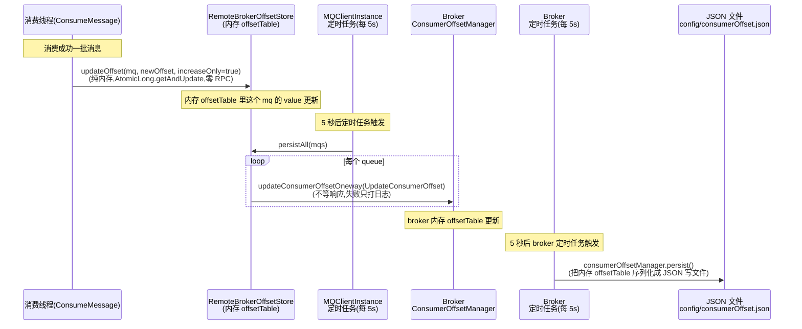

# 第十一章 · 消费位点:ConsumeOffset 与幂等

> 篇:第 3 篇 · 消费(拉取、Rebalance、位点)
> 主线呼应:第 9 章讲了 consumer 怎么发起 pull、broker 怎么长轮询应答;第 10 章讲了消费组内多个 consumer 怎么在没有中心协调者的情况下,各自算出互斥的 queue 分配。但这两章都把一个前提悬着没回答:**消费到哪了(offset),存在哪、怎么上报、重启怎么恢复、凭什么不重不漏?** 这一章就来填这个坑。RocketMQ 的答案是:消费进度只存在内存里不够(重启就丢),全塞 broker 又把每条消费都变成一次 RPC——于是它走了"**内存缓冲 + 定时 oneway 上报 + increaseOnly + 至少一次语义靠业务幂等兜底**"这条路,用一个并不复杂的工程权衡,把"精度"和"吞吐"两头都稳住了。

## 核心问题

**消费到哪了(offset)怎么记、存哪、重启怎么恢复,以及为什么 RocketMQ 的"至少一次"语义意味着业务必须自己做幂等?**

读完本章你会明白:

1. offset 存在哪、为什么 CLUSTERING(集群)和 BROADCASTING(广播)两套存储不同——集群存 broker(全网共享一个进度),广播存本地文件(每个 consumer 各自一份)。
2. 为什么消费位点默认在**内存**里高频更新、只**每 5 秒**才 oneway 上报 broker 一次——凭什么叫"批量"其实是"低频",以及崩了最多丢 5 秒进度为什么可接受。
3. `increaseOnly`(只增不减)防的是什么——并发上报乱序会让位点回退,一旦回退,重复消费会像雪崩一样滚起来。
4. RocketMQ 的"至少一次"(at-least-once)是怎么由这套机制**天然**保证的,以及为什么这条语义把"重复消费"的代价甩给了业务侧——业务不做幂等,这套机制就是定时炸弹。

> **如果一读觉得太难**:先只记住三件事——① 消费进度记在 consumer 内存,定时上报 broker(集群)或写本地文件(广播);② 位点只增不 decrease(`increaseOnly`),防乱序回退;③ RocketMQ 保证"至少一次",所以业务**必须幂等**,不幂等就会重复处理。

---

## 11.1 一句话点破

> **消费进度的核心矛盾是"精度"和"吞吐"二选一:每消费一条消息就同步把 offset 落盘一次,精度最高(崩了不丢进度),但每条都多一次 RPC,吞吐直接腰斩;完全不记,吞吐最高,但崩了就要从头消费,重复爆炸。RocketMQ 的解法是:offset 在 consumer 内存里高频更新(消费成功一条就更新,纯内存操作,零 RPC),每 5 秒才用 oneway 把内存里的进度批量上报 broker 一次(异步、不等响应),broker 再每 5 秒把内存里的进度写进 JSON 文件。崩了最多丢最近 5 秒的进度,重启从 broker 上次的位点重拉——重拉的那一小段消息会被重复消费,所以业务必须幂等。这是用"至少一次 + 幂等"换"高吞吐"的工程权衡,而不是什么精巧的不重不漏魔法。**

这是结论,不是理由。本章倒过来拆:先看 offset 为什么要存、存哪,再看内存缓冲凭什么够用,increaseOnly 防什么,最后回到"至少一次 + 幂等"这条贯穿全书的取舍。

---

## 11.2 为什么消费进度必须持久化

第 10 章讲 Rebalance 时,我们说每个 consumer 拉到分配给自己的 queue,从某个 offset 开始拉。这个"某个 offset"就是消费进度(consume offset),它回答的是**"我这个消费组在这个 queue 上,已经消费到了哪里"**。

最朴素的实现是:每个 consumer 把自己负责的 queue 的 offset 记在内存里,拉到下一条就从内存里的 offset 开始。问题来了——**consumer 进程崩了,内存里的 offset 没了**。重启之后,它不知道上次消费到哪,要么从头消费(已经消费过的全部重复)、要么从最新消费(中间没消费的全部丢失)。两条都不能接受。

> **不这样会怎样**:如果消费进度只在内存、不持久化,consumer 一重启就失忆。从头消费 = 历史消息重复处理一遍(订单重复下单、扣款重复扣);从最新消费 = 重启期间的消息全丢。所以 offset **必须落到比内存更可靠的地方**:要么 broker 端(集群模式),要么本地磁盘文件(广播模式)。

所以 offset 的存储要回答两个问题:**存哪**(broker 还是本地文件)、**怎么存**(同步还是异步)。RocketMQ 按**消费模式**分了两套实现。

### 集群模式 vs 广播模式:进度要不要全网共享

回顾一下两种消费模式(第 9 章点过):

- **CLUSTERING(集群消费)**:同一个消费组(consumer group)内,一条消息**只会被组内一个 consumer 消费**。topic 的多个 queue 被组内 consumer 分摊(第 10 章 Rebalance 干的就是这个)。一个 queue 在某一时刻只归一个 consumer,但**这个 consumer 可能换**(扩缩容、挂掉重平衡)。
- **BROADCASTING(广播消费)**:同一条消息会被组内**每个** consumer 各消费一次。每个 consumer 都要消费全部 queue。

这两种模式下,消费进度的语义完全不同:

| | CLUSTERING 集群 | BROADCASTING 广播 |
|------|----------------|------------------|
| 一条消息谁消费 | 组内**一个** consumer | 组内**每个** consumer 各消费一次 |
| 一个 queue 的进度归谁 | 当前负责它的**那个** consumer(可能换) | 每个 consumer **各自一份**进度 |
| 进度要不要全网共享 | **要**——换 consumer 时新 consumer 要接着老进度 | **不要**——人手一份,互不相干 |
| 进度存哪 | **broker**(全网共享的中央仓库) | **本地文件**(各管各的) |

> **钉死这件事**:集群模式下进度必须存 broker,因为负责某个 queue 的 consumer 会换(Rebalance),新接手的 consumer 必须从老 consumer 上次的进度接着拉——这个"老进度"得有个全组都信任的中央仓库,就是 broker。广播模式下每个 consumer 各自消费全部消息、互不相干,进度存本地文件就够,没必要去打扰 broker。

这两套实现,在客户端源码里就是 `OffsetStore` 接口的两个实现类。

---

## 11.3 OffsetStore 接口:两套实现,一套语义

RocketMQ 把"消费进度怎么存"抽象成一个接口 `OffsetStore`([OffsetStore.java:29](../rocketmq/client/src/main/java/org/apache/rocketmq/client/consumer/store/OffsetStore.java#L29)),两个实现按消费模式选:

```java
public interface OffsetStore {
    void load() throws MQClientException;                                          // :33  启动时加载已持久化的进度
    void updateOffset(final MessageQueue mq, final long offset, final boolean increaseOnly);  // :38  消费成功,更新内存里的进度
    void updateAndFreezeOffset(final MessageQueue mq, final long offset);         // :46  更新并冻结(给 reset offset 用)
    long readOffset(final MessageQueue mq, final ReadOffsetType type);            // :53  读进度(内存/存储/先内存后存储)
    void persistAll(final Set<MessageQueue> mqs);                                  // :58  把内存进度批量落盘(到 broker 或文件)
    void persist(final MessageQueue mq);                                           // :63  单个 queue 落盘
    void removeOffset(MessageQueue mq);                                            // :68  删进度(不再订阅这个 queue)
    Map<MessageQueue, Long> cloneOffsetTable(String topic);                       // :73  克隆一份(给监控用)
    void updateConsumeOffsetToBroker(MessageQueue mq, long offset, boolean isOneway)  // :80  显式上报 broker(集群模式才有意义)
        throws RemotingException, MQBrokerException, InterruptedException, MQClientException;
}
```

这个接口的关键设计:**所有更新只动内存**(`updateOffset` 只改内存里的 `offsetTable`,零 RPC),**只有 `persistAll` / `persist` 才真正落盘**。这就是"内存缓冲 + 批量上报"的接口层体现:更新是高频的、纯内存的;落盘是低频的、可以跨网络或写文件的。

两个实现:

- **`RemoteBrokerOffsetStore`**(集群模式,[:42](../rocketmq/client/src/main/java/org/apache/rocketmq/client/consumer/store/RemoteBrokerOffsetStore.java#L42)):`persistAll` 把内存进度 **oneway 上报 broker**(不等响应);`readOffset` 的 `READ_FROM_STORE` 分支会发 `QueryConsumerOffset` 请求去 broker 查。
- **`LocalFileOffsetStore`**(广播模式,[:42](../rocketmq/client/src/main/java/org/apache/rocketmq/client/consumer/store/LocalFileOffsetStore.java#L42)):`persistAll` 把内存进度写进本地 JSON 文件(`~/.rocketmq_offsets/{clientId}/{group}/offsets.json`,[:43-59](../rocketmq/client/src/main/java/org/apache/rocketmq/client/consumer/store/LocalFileOffsetStore.java#L43-L59));`updateConsumeOffsetToBroker` 是个**空方法**([:211-214](../rocketmq/client/src/main/java/org/apache/rocketmq/client/consumer/store/LocalFileOffsetStore.java#L211-L214))——广播模式压根不跟 broker 报进度。

> **钉死这件事**:`OffsetStore` 接口把"内存更新"和"持久化"在接口层就分开了。`updateOffset` 永远只动内存(零 RPC),`persistAll` 才落盘。这意味着无论集群还是广播,内存里都有一份高频更新的 `offsetTable`,持久化只是定时把这份内存"快照"出去。这是后面"5 秒上报一次"能成立的前提——更新本来就不碰网络/磁盘。

### 内存里的 offsetTable 长什么样

两个实现类的内存结构几乎一样,都是一个 `ConcurrentMap`:

```
 client 端内存 offsetTable(集群模式 RemoteBrokerOffsetStore):
 ┌─────────────────────────────┬──────────────────────────┐
 │ key: MessageQueue           │ value: ControllableOffset │
 │ (topic=order,queue=2,...)   │  AtomicLong value=1024    │ ← 当前已消费到 1024
 │                             │  volatile allowToUpdate   │ ← 是否允许更新(freeze 用)
 ├─────────────────────────────┼──────────────────────────┤
 │ (topic=order,queue=3,...)   │  AtomicLong value=2048    │
 ├─────────────────────────────┼──────────────────────────┤
 │ (topic=pay, queue=0,...)    │  AtomicLong value=0       │ ← 第一次消费,还没进度
 └─────────────────────────────┴──────────────────────────┘
  key 是 MessageQueue(topic+queueId+brokerName),全网唯一定位一个队列
  value 不是裸 Long,是 ControllableOffset(AtomicLong + 可冻结标志,5.x 新结构)
```

注意 value 类型是 `ControllableOffset`([ControllableOffset.java:50](../rocketmq/client/src/main/java/org/apache/rocketmq/client/consumer/store/ControllableOffset.java#L50)),不是裸 `Long`。它内含一个 `AtomicLong value` 和一个 `volatile boolean allowToUpdate`。这个 `allowToUpdate` 是给 `updateAndFreezeOffset`(管理员 reset offset 时冻结进度,见 11.6)用的。普通消费流程只动 `value`。

为什么用 `AtomicLong` 而不是 `long` + 锁?因为消费是**多线程并发**的(一个 consumer 有多个消费线程池,见第 9 章),同一个 queue 的 offset 会被多个消费线程并发更新。`AtomicLong` 让"只增不减"的更新无锁完成(11.5 节细讲),这是这套机制能在高并发下稳的关键之一。

---

## 11.4 集群模式:内存缓冲 + 每 5 秒 oneway 上报

集群模式是 RocketMQ 的默认(绝大多数生产环境),它的 offset 流转是这个样子的:



这张图是本章核心。两个"每 5 秒"叠在一起——client 每 5 秒上报一次,broker 每 5 秒落盘一次。**最坏情况下,从消费成功到 offset 真正持久化到磁盘,要经过最多 10 秒**(client 那边 5 秒没报出去就崩 + broker 那边 5 秒没落盘就崩)。这 10 秒内消费的消息,重启后会从 broker 上次落盘的位点重拉——重拉 = 重复消费。

> **钉死这件事**:集群模式的 offset 流转是"**消费线程更新内存 → 5 秒定时任务 oneway 上报 broker → broker 5 秒定时任务写 JSON 文件**"三段式。前两段都不阻塞消费线程(更新是纯内存原子操作、上报是 oneway 异步),所以吞吐不受影响;代价是"崩了最多丢 10 秒进度",这个代价靠"至少一次 + 业务幂等"兜底。

### 消费线程怎么更新内存 offset

消费成功后更新 offset 的代码,在 `ConsumeMessageConcurrentlyService.processConsumeResult`([:306-309](../rocketmq/client/src/main/java/org/apache/rocketmq/client/impl/consumer/ConsumeMessageConcurrentlyService.java#L306-L309)):

```java
long offset = consumeRequest.getProcessQueue().removeMessage(consumeRequest.getMsgs());   // 从 ProcessQueue 算出这批消费完后的新 offset
if (offset >= 0 && !consumeRequest.getProcessQueue().isDropped()) {
    this.defaultMQPushConsumerImpl.getOffsetStore()
        .updateOffset(consumeRequest.getMessageQueue(), offset, true);   // :308 —— increaseOnly=true
}
```

这里有几个细节值得讲清:

1. **offset 是 `ProcessQueue.removeMessage` 算出来的**,不是消费线程随便给的。`ProcessQueue` 内部维护着一个按 queueOffset 排序的 `TreeMap<Long, MessageExt> msgTreeMap`(拉来的消息先进这里),`removeMessage` 把这批消费完的消息从 map 移除,然后返回**当前 map 里最小的那个 queueOffset**——也就是"下一个该被消费的 offset"。这个设计保证了 offset 始终是"连续已消费段的下一条",不会跳号。
2. **`increaseOnly=true`** 是写死的。消费成功永远只会让 offset 增大(消费了新消息,进度往前走),绝不 decrease。
3. **`isDropped()` 检查**:如果这个 queue 在消费过程中被 Rebalance 移走了(`ProcessQueue.dropped=true`),就不更新 offset——因为这个 consumer 已经不负责这个 queue 了,它写的 offset 是过时的,会干扰新接手的 consumer。

> **钉死这件事**:消费成功后,offset 从 `ProcessQueue.msgTreeMap` 算出来(连续段下一条),用 `increaseOnly=true` 更新内存 `offsetTable`。这一步**纯内存、零 RPC、多线程并发安全(AtomicLong)**,所以消费多快它就能记多快,不拖消费的后腿。

### 5 秒定时任务:oneway 批量上报

内存里的进度怎么落盘到 broker?靠 `MQClientInstance` 的一个定时任务([:369-375](../rocketmq/client/src/main/java/org/apache/rocketmq/client/impl/factory/MQClientInstance.java#L369-L375)):

```java
this.scheduledExecutorService.scheduleAtFixedRate(() -> {
    try {
        MQClientInstance.this.persistAllConsumerOffset();   // :371
    } catch (Throwable t) {
        log.error("ScheduledTask persistAllConsumerOffset exception", t);
    }
}, 1000 * 10, this.clientConfig.getPersistConsumerOffsetInterval(), TimeUnit.MILLISECONDS);
```

这个定时任务的周期是 `getPersistConsumerOffsetInterval()`,默认 `1000 * 5`,也就是 **5 秒一次**([ClientConfig.java:66](../rocketmq/client/src/main/java/org/apache/rocketmq/client/ClientConfig.java#L66))。10 秒后首次执行,之后每 5 秒一次。

`persistAllConsumerOffset`([:562](../rocketmq/client/src/main/java/org/apache/rocketmq/client/impl/factory/MQClientInstance.java#L562))遍历所有 consumer,调每个 consumer 的 `persistConsumerOffset`。对 push consumer,这个方法在 `DefaultMQPushConsumerImpl.persistConsumerOffset`([:1405-1416](../rocketmq/client/src/main/java/org/apache/rocketmq/client/impl/consumer/DefaultMQPushConsumerImpl.java#L1405-L1416)):

```java
@Override
public void persistConsumerOffset() {
    try {
        this.makeSureStateOK();
        Set<MessageQueue> mqs = new HashSet<>();
        Set<MessageQueue> allocateMq = this.rebalanceImpl.getProcessQueueTable().keySet();   // :1409 只上报当前分配给我的 queue
        mqs.addAll(allocateMq);
        this.offsetStore.persistAll(mqs);   // :1412
    } catch (Exception e) {
        log.error("group: " + this.defaultMQPushConsumer.getConsumerGroup() + " persistConsumerOffset exception", e);
    }
}
```

注意一个**重要细节**:只上报"当前 `ProcessQueueTable` 里的 queue"——也就是当前分配给我的 queue。如果某个 queue 被 Rebalance 移走了(不再在 `ProcessQueueTable` 里),它的 offset **不会被上报**。这是有意的:防止一个已经不负责某 queue 的 consumer 还在往 broker 写过时的进度,干扰新接手的 consumer。

`RemoteBrokerOffsetStore.persistAll`([:122-155](../rocketmq/client/src/main/java/org/apache/rocketmq/client/consumer/store/RemoteBrokerOffsetStore.java#L122-L155))的核心:

```java
@Override
public void persistAll(Set<MessageQueue> mqs) {
    if (null == mqs || mqs.isEmpty()) return;
    final HashSet<MessageQueue> unusedMQ = new HashSet<>();
    for (Map.Entry<MessageQueue, ControllableOffset> entry : this.offsetTable.entrySet()) {
        MessageQueue mq = entry.getKey();
        ControllableOffset offset = entry.getValue();
        if (offset != null) {
            if (mqs.contains(mq)) {
                try {
                    this.updateConsumeOffsetToBroker(mq, offset.getOffset());   // :134 —— 每个队列一次 oneway RPC
                } catch (Exception e) {
                    log.error("updateConsumeOffsetToBroker exception, " + mq.toString(), e);   // 失败只打日志,不抛
                }
            } else {
                unusedMQ.add(mq);   // 不再负责的 queue,后面清掉内存
            }
        }
    }
    if (!unusedMQ.isEmpty()) {
        for (MessageQueue mq : unusedMQ) {
            this.offsetTable.remove(mq);   // :151 清掉不再订阅的 queue 的内存进度
        }
    }
}
```

两个点:

1. **每个队列一次 oneway RPC**。注意这**不是真正的"批量"**(不是把所有队列的 offset 打包成一个请求),而是**对每个队列分别发一个 `updateConsumerOffsetOneway`**。所谓"批量"是"**定时批量**"(攒 5 秒的进度一次性发掉),不是"请求批量"。这点容易看走眼,要讲清。
2. **失败只打日志、不抛异常**([:140-142](../rocketmq/client/src/main/java/org/apache/rocketmq/client/consumer/store/RemoteBrokerOffsetStore.java#L140-L142))。上报失败(网络抖、broker 重启)不会重试、不会阻塞——反正 5 秒后还会再报一次,这次的丢了下次补上。这正是 oneway 的精髓:**尽力而为,丢了不影响正确性**(因为至少一次语义会兜底)。

> **钉死这件事**:集群模式的"批量上报"是"**定时批量**"不是"请求批量"——每 5 秒触发一次,触发后对每个队列发一个独立的 oneway `updateConsumerOffsetOneway`,失败只打日志。oneway 不等响应,所以不阻塞定时任务线程,也不重试。这个"低频 + oneway + 失败容忍"组合,是 offset 上报不影响吞吐的关键。

---

## 11.5 broker 端:ConsumerOffsetManager 与 JSON 持久化

client 上报到 broker 的 offset,broker 怎么存?答案在 `ConsumerOffsetManager`([:42](../rocketmq/broker/src/main/java/org/apache/rocketmq/broker/offset/ConsumerOffsetManager.java#L42))。它的核心是一个嵌套的 `ConcurrentMap`:

```java
protected ConcurrentMap<String/* topic@group */, ConcurrentMap<Integer, Long>> offsetTable =
    new ConcurrentHashMap<>(512);                                              // :48
public static final String TOPIC_GROUP_SEPARATOR = "@";                        // :44
```

这个结构的意思是:**key 是 `topic@group`(用 `@` 拼接),value 又是一个 map,key 是 queueId,value 是 offset**。画成图:

```
 broker 端 ConsumerOffsetManager.offsetTable:
 ┌──────────────────────────┬───────────────────────────────────────┐
 │ key: "order@cg_pay"      │ value: ConcurrentMap<queueId, offset>  │
 │ (topic=order, group=...) │   { 0 -> 1024,  1 -> 2048,            │
 │                          │     2 -> 1536, 3 -> 3072 }             │
 ├──────────────────────────┼───────────────────────────────────────┤
 │ "order@cg_log"           │   { 0 -> 500, 1 -> 500 }              │
 ├──────────────────────────┼───────────────────────────────────────┤
 │ "pay@cg_pay"             │   { 0 -> 88 }                          │
 └──────────────────────────┴───────────────────────────────────────┘
  第一层 key 拼 topic 和 group:同一个 topic 被不同 group 消费,各算各的进度
  第二层 key 是 queueId:value 是这个 group 在这个 queue 上的消费进度
```

为什么用 `topic@group` 作 key 而不是 `(topic, group)` 二元组?因为要序列化成 JSON 存文件——JSON 的 key 必须是字符串,把两个维度拼成一个字符串最直接。`@` 这个分隔符也埋了坑:topic 和 group 名里不能含 `@`(否则 split 会出错),这是个隐式约定。

### commitOffset:broker 端不强制 increaseOnly

`ConsumerManageProcessor` 处理 client 发来的 `UPDATE_CONSUMER_OFFSET` 请求,调 `commitOffset`([:203](../rocketmq/broker/src/main/java/org/apache/rocketmq/broker/processor/ConsumerManageProcessor.java#L203)):

```java
this.brokerController.getConsumerOffsetManager().commitOffset(
    RemotingHelper.parseChannelRemoteAddr(ctx.channel()), group, topic, queueId, offset);
```

`commitOffset` 的实现([:198-220](../rocketmq/broker/src/main/java/org/apache/rocketmq/broker/offset/ConsumerOffsetManager.java#L198-L220)):

```java
public void commitOffset(final String clientHost, final String group, final String topic, final int queueId,
    final long offset) {
    String key = topic + TOPIC_GROUP_SEPARATOR + group;              // "order@cg_pay"
    this.commitOffset(clientHost, key, queueId, offset);
}

private void commitOffset(final String clientHost, final String key, final int queueId, final long offset) {
    ConcurrentMap<Integer, Long> map = this.offsetTable.get(key);
    if (null == map) {
        map = new ConcurrentHashMap<>(2);
        map.put(queueId, offset);
        this.offsetTable.put(key, map);
    } else {
        Long storeOffset = map.put(queueId, offset);                 // 直接覆盖
        if (storeOffset != null && offset < storeOffset) {
            LOG.warn("[NOTIFYME]update consumer offset less than store. ...");   // :214 回退只告警,不拒绝
        }
    }
    if (versionChangeCounter.incrementAndGet() % brokerController.getBrokerConfig().getConsumerOffsetUpdateVersionStep() == 0) {
        updateDataVersion();                                          // 每 N 次更新动一次 DataVersion(给路由发现用)
    }
}
```

这里有个**容易看错的细节**:broker 端的 `commitOffset` **不强制 increaseOnly**——它只是 `map.put(queueId, offset)` 直接覆盖。如果 client 发来的 offset 比现存的小(回退),broker 只打一条 `[NOTIFYME]` 告警日志,**照样接受这个回退**。

那 increaseOnly 在哪保证?在 **client 端的 `ControllableOffset`** 里(11.6 节细讲)。也就是说,真正"只增不减"的防线在 client 内存层,broker 只是被动接受 client 报上来的值。这是一个**纵深**设计:client 层先把乱序挡掉,broker 层兜底告警。为什么要这样分?因为同一个 group 可能有多个 client 同时上报同一个 queue 的 offset(Rebalance 期间、或者错配),broker 没法判断哪个 client 是"当前合法的负责人",所以干脆都接受,把判断权交给 client 的 increaseOnly。

### 5 秒落盘:JSON 文件 + 启动加载

broker 端的 offset 也只在内存,要落到磁盘才算真持久化。这又是一个定时任务,在 `BrokerController`([:692-702](../rocketmq/broker/src/main/java/org/apache/rocketmq/broker/BrokerController.java#L692-L702)):

```java
this.scheduledExecutorService.scheduleAtFixedRate(new Runnable() {
    @Override
    public void run() {
        try {
            BrokerController.this.consumerOffsetManager.persist();   // :696
        } catch (Throwable e) {
            LOG.error("BrokerController: failed to persist config file of consumerOffset", e);
        }
    }
}, 1000 * 10, this.brokerConfig.getFlushConsumerOffsetInterval(), TimeUnit.MILLISECONDS);
```

周期是 `getFlushConsumerOffsetInterval()`,默认也是 `1000 * 5`([BrokerConfig.java:90](../rocketmq/common/src/main/java/org/apache/rocketmq/common/BrokerConfig.java#L90))。`persist` 把整个 `ConsumerOffsetManager` 序列化成 JSON,写到 `configFilePath()`([:295](../rocketmq/broker/src/main/java/org/apache/rocketmq/broker/offset/ConsumerOffsetManager.java#L295))返回的路径——通常是 `{storePathRootDir}/config/consumerOffset.json`。broker 关闭时也会再 persist 一次([:1751-1753](../rocketmq/broker/src/main/java/org/apache/rocketmq/broker/BrokerController.java#L1751-L1753)),启动时 `load`([:862](../rocketmq/broker/src/main/java/org/apache/rocketmq/broker/BrokerController.java#L862))把 JSON 反序列化回内存。

> **钉死这件事**:broker 端 offset 也是"内存 + 5 秒落盘 JSON"两段。`commitOffset` 直接覆盖(不强制 increaseOnly,只告警回退),increaseOnly 的真正防线在 client 端。broker 关闭会再 persist 一次、启动会 load,保证正常重启不丢进度。异常宕机(broker 进程被 kill -9)最多丢最近 5 秒的 offset 更新。

### 重启恢复:QUERY_CONSUMER_OFFSET 的三种结果

consumer 启动时(或 Rebalance 接手一个新 queue 时),要从 broker 查回上次的进度。这走 `QUERY_CONSUMER_OFFSET` 请求,`ConsumerManageProcessor.queryConsumerOffset`([:305-354](../rocketmq/broker/src/main/java/org/apache/rocketmq/broker/processor/ConsumerManageProcessor.java#L305-L354)):

```java
long offset = this.brokerController.getConsumerOffsetManager().queryOffset(
    requestHeader.getConsumerGroup(), requestHeader.getTopic(), requestHeader.getQueueId());   // :321-323

if (offset >= 0) {
    responseHeader.setOffset(offset);
    response.setCode(ResponseCode.SUCCESS);                          // 情况一:有记录,直接返回
} else {
    long minOffset = this.brokerController.getMessageStore().getMinOffsetInQueue(...);          // :330
    if (requestHeader.getSetZeroIfNotFound() != null && Boolean.FALSE.equals(requestHeader.getSetZeroIfNotFound())) {
        response.setCode(ResponseCode.QUERY_NOT_FOUND);              // 情况二:没记录,且 client 说"找不到就别设 0"
    } else if (minOffset <= 0
        && this.brokerController.getMessageStore().checkInMemByConsumeOffset(...)) {            // :336-337
        responseHeader.setOffset(0L);
        response.setCode(ResponseCode.SUCCESS);                      // 情况三:没记录但队列几乎是空的,从 0 开始
    } else {
        response.setCode(ResponseCode.QUERY_NOT_FOUND);              // 情况四:没记录,让 client 自己决定
    }
}
```

四种情况里,关键是**情况三**:broker 没有这个 group 的进度(第一次消费,或进度被清了),但这个 queue 的 minOffset<=0 且第一条消息还在内存里(`checkInMemByConsumeOffset`),就**默认从 0 开始**(从头消费)。否则返回 `QUERY_NOT_FOUND`,让 client 端按 `ConsumeFromWhere` 策略决定——是从最新(`CONSUME_FROM_LAST_OFFSET`→`maxOffset`)、从最早(`CONSUME_FROM_FIRST_OFFSET`→0)、还是按时间戳(`CONSUME_FROM_TIMESTAMP`→`searchOffset(time)`)。这个决策逻辑在 client 端的 `RebalancePushImpl.computePullFromWhereWithException`([:166](../rocketmq/client/src/main/java/org/apache/rocketmq/client/impl/consumer/RebalancePushImpl.java#L166))。

> **钉死这件事**:consumer 重启恢复进度,是"broker 查得到就用、查不到按 `ConsumeFromWhere` 兜底"。默认 `CONSUME_FROM_LAST_OFFSET`,所以一个全新的消费组默认**只消费启动之后的新消息**(不回放历史)。这是个常被新用户误解的点——"我启动 consumer 怎么收不到之前的消息",根因就在这。

---

## 11.6 技巧精解一:内存缓冲 + oneway 上报,凭什么 5 秒够用

这一章最核心的工程权衡,就是"**为什么 offset 在内存高频更新、5 秒才上报一次,这个频率够用**"。我们把它的"为什么 sound"拆透。

### 三个 sound 点

**sound 点一:5 秒上报一次,崩了最多丢 5 秒进度,靠"至少一次 + 业务幂等"兜底。**

这是整套机制的灵魂。我们来算一笔账:

- consumer 每 5 秒上报一次。如果 consumer 在第 4.9 秒崩了,这 4.9 秒内消费成功的进度**全没上报**。
- 重启后,consumer 从 broker 上次记录的进度(5 秒前那个)开始重拉。
- 这 4.9 秒内消费过的消息,会被**重新拉取、重新消费一遍**。

这就是"重复消费"。为什么 RocketMQ 能接受?因为它承诺的是"**至少一次**"(at-least-once)语义——一条消息**至少**被消费一次,可能更多次。它**不**承诺"恰好一次"(exactly-once)。在至少一次语义下,重复消费是**设计内的正常情况**,不是 bug。业务侧只要做到**幂等**(同一条消息消费一次和消费十次效果一样),重复就重复了,无所谓。

> **不这样会怎样**(每条消费完立刻同步上报会撞的墙):
> 假设朴素地实现——每消费成功一条消息,就同步发一个 `updateConsumerOffset`(等 broker 响应)上报。后果:
> 1. **RPC 风暴**:一个 consumer 每秒消费 1 万条消息,就是每秒 1 万次到 broker 的 RPC。broker 光处理 offset 上报就吃不消,更别说这些 RPC 还要排队、要走 Netty 线程池(第 13 章)、要占连接。
> 2. **消费被 RPC 拖慢**:消费线程要等 broker 响应才能继续,把"本地内存操作"变成"跨网络同步调用",消费吞吐直接被网络 RTT 锁死。原本每秒 1 万条,变成每秒几百条。
> 3. **broker 状态热点**:所有 consumer 的 offset 上报全压在 broker 一个 `ConsumerOffsetManager` 上,锁竞争激烈(CHM 能缓解但写放大仍在)。
>
> RocketMQ 选了"5 秒攒一批、oneway 发掉",把 RPC 频率从"每条一次"降到"每 5 秒一次",吞吐保住了;代价是"崩了重复消费 5 秒的消息",这个代价甩给业务幂等。这是**用精度换吞吐**的典型权衡。

**sound 点二:oneway 上报,不等响应,失败不重试。**

`RemoteBrokerOffsetStore.updateConsumeOffsetToBroker`([:207-233](../rocketmq/client/src/main/java/org/apache/rocketmq/client/consumer/store/RemoteBrokerOffsetStore.java#L207-L233))默认走 `isOneway=true`:

```java
if (isOneway) {
    this.mQClientFactory.getMQClientAPIImpl().updateConsumerOffsetOneway(   // :224 oneway,不等响应
        findBrokerResult.getBrokerAddr(), requestHeader, 1000 * 5);
} else {
    this.mQClientFactory.getMQClientAPIImpl().updateConsumerOffset(         // 同步,等响应(很少用)
        findBrokerResult.getBrokerAddr(), requestHeader, 1000 * 5);
}
```

oneway 是 RocketMQ Remoting 的三种调用语义之一(第 14 章详讲):发出去就不管了,不等响应、不处理失败。为什么 offset 上报能用 oneway?

- **丢了不致命**:这次上报失败,broker 还是旧进度,5 秒后再报一次新的(进度只会往前,因为 increaseOnly),旧的会被覆盖。最坏情况是 broker 多保留一个过时的进度,重启时多重复消费一点,业务幂等兜底。
- **不等响应 = 不阻塞**:定时任务线程发完 oneway 立刻返回,不会被一个慢 broker 卡住,5 秒周期不会漂移。
- **不重试 = 不放大故障**:如果 broker 挂了,重试只会让故障雪上加霜(重试请求堆积)。oneway 失败就失败,等 broker 恢复后自然就报上去了。

> **钉死这件事**:offset 上报用 oneway,是"至少一次"语义的直接体现——上报本身就是尽力而为,丢了靠重拉重消补上。这和"同步刷盘等 force 完成"(第 4 章,要保证不丢)是两种截然不同的可靠性等级:刷盘关乎"消息丢不丢"(不可恢复),offset 上报关乎"进度准不准"(可由重消恢复)。**不可恢复的必须同步,可恢复的可以异步 oneway**——这是分布式系统可靠性设计的通用原则。

**sound 点三:increaseOnly 在 client 内存层挡掉乱序,broker 层只兜底告警。**

前面 11.5 说过,broker 的 `commitOffset` 不强制 increaseOnly。真正"只增不减"的防线在 client 的 `ControllableOffset.update`([:72-86](../rocketmq/client/src/main/java/org/apache/rocketmq/client/consumer/store/ControllableOffset.java#L72-L86)):

```java
public void update(long target, boolean increaseOnly) {
    if (allowToUpdate) {
        value.getAndUpdate(val -> {              // AtomicLong 无锁 CAS 更新
            if (allowToUpdate) {
                if (increaseOnly) {
                    return Math.max(target, val); // 只增不减:max(target, 当前值)
                } else {
                    return target;                // 允许 decrease:直接设成 target
                }
            } else {
                return val;                       // 已冻结,拒绝更新
            }
        });
    }
}
```

这里有几个精妙之处:

1. **`AtomicLong.getAndUpdate` 是原子的**。`val -> Math.max(target, val)` 这个 lambda 在 CAS 循环里执行,保证"读当前值、算 max、写回"这三步是不可分割的。即使多个消费线程同时更新同一个 queue 的 offset,也不会出现"线程 A 读到 100、线程 B 读到 100、A 写 105、B 写 103,结果变成 103"的回退——因为每次 CAS 都基于最新的 `val` 算 max。
2. **`Math.max(target, val)` 一行实现 increaseOnly**。不用 if-else 判断,直接 max,简洁且原子。
3. **`allowToUpdate` 双重检查**:方法入口检查一次,CAS 的 lambda 里再检查一次。这是为了应对"`update` 已经过了入口检查、正卡在 CAS 循环里时,另一个线程调了 `updateAndFreeze` 把 `allowToUpdate` 设成 false"的并发窗口——lambda 里的二次检查保证冻结后绝不再被更新(`volatile` 保证可见性)。

> **不这样会怎样**(increaseOnly 防的乱序场景):
> 假设没有 increaseOnly,offset 可以 decrease。考虑 Rebalance 期间的并发:
> - 时刻 T1:consumer A 负责_queue0,消费到 offset=1000,内存里记 1000。
> - 时刻 T2:Rebalance,_queue0 从 A 转给 consumer B。A 还没来得及上报,B 接手了。
> - 时刻 T3:B 从 broker 查到_queue0 的进度(还是 A 上次上报的 950),从 950 开始消费,消费到 980,内存里记 980。
> - 时刻 T4:A 的旧上报请求姗姗来迟,把 1000 报给 broker。B 的上报把 980 报给 broker。
> - 如果 broker 按到达顺序处理:950 → 1000(A) → 980(B 回退!)。offset 从 1000 退到 980。
> - 后果:_queue0 在 [980, 1000] 这段消息被**重新消费一遍**。而且这个回退会**反复发生**——每次 Rebalance 都可能触发,重复消费像滚雪球。
>
> increaseOnly 在 A 这边就挡住了:A 的内存 offset 已经是 1000(`increaseOnly` 保证只会增),A 上报的就是 1000;B 接手后查到 950,消费到 980,B 上报 980。broker 收到 A 的 1000 和 B 的 980,980 < 1000,触发 `[NOTIFYME]` 告警——但**关键是 B 接手时查到的就是 950(B 的起点),B 消费只会让 B 自己的内存 offset 从 950 往前走,不会影响 A 的 1000**。实际生产里,A 上报的 1000 会先到 broker,broker 存 1000;B 上报 980 时被 increaseOnly 兜底(B 端 `updateOffset(mq, 980, true)` 不会把内存里的值 decrease,但 B 内存里本来就是 980 < 1000... 这里要靠 broker 端也有一层:见下)。
>
> 真正的纵深是:**client 层 increaseOnly 保证单个 consumer 内部不回退,broker 层 +告警**让运维能发现跨 consumer 的乱序。两者合力,把 Rebalance 期间的进度抖动降到最小。

### 反面对比总结

把这三个 sound 点合起来看,RocketMQ 的 offset 机制是个"**三层兜底**"设计:

| 层 | 机制 | 防什么 | 失败的后果 |
|------|------|--------|-----------|
| client 内存 | `AtomicLong` + increaseOnly | 并发更新乱序、Rebalance 期间回退 | 单 consumer 内进度不会回退 |
| client→broker | 5 秒 oneway 上报 | RPC 风暴、吞吐拖慢 | 崩了丢 5 秒进度,重拉重消 |
| broker→磁盘 | 5 秒 JSON 落盘 | broker 进程内存丢失 | broker 异常退出丢 5 秒上报 |
| 业务侧 | 幂等 | 以上任何一层丢的进度导致重复消费 | 重复消费被幂等吸收,无副作用 |

四层里前三层都可能丢一点进度,第四层(业务幂等)是**最终的保险丝**。这就是为什么 RocketMQ 文档反复强调"消费必须幂等"——它不是可选项,是这套机制成立的**前提**。

---

## 11.7 技巧精解二:increaseOnly 与 ControllableOffset 的并发设计

我们把 `ControllableOffset` 这个看似简单的小类再单独拆透,因为它是 increaseOnly 的真正实现,也是 5.x 相对老版本的一个改进点。

### 5.x 的改进:从裸 Long 到 ControllableOffset

老版本(4.x)的 `offsetTable` value 是 `AtomicLong`,直接 `update` 用 `AtomicLong` 的 CAS。5.x 包了一层 `ControllableOffset`,加了 `allowToUpdate` 这个**冻结**能力。为什么?

因为 5.x 引入了**服务端 reset offset**(`BrokerConfig.useServerSideResetOffset`)——管理员可以手动把某个 group 在某个 queue 上的进度**重置**到指定 offset(比如跳过一段坏数据、或者回滚重消费)。reset 之后,要**冻结** client 端的自动更新一段时间,防止 client 还按老进度往上报、把 reset 的值又覆盖回去。

看 `updateAndFreezeOffset` 的调用点——`DefaultMQPushConsumerImpl` 在收到 `PULL_OFFSET_MOVED`(broker 告诉 client"你的 offset 不对,得纠正")时([:413-416](../rocketmq/client/src/main/java/org/apache/rocketmq/client/impl/consumer/DefaultMQPushConsumerImpl.java#L413-L416)):

```java
DefaultMQPushConsumerImpl.this.offsetStore.updateAndFreezeOffset(pullRequest.getMessageQueue(),
    pullRequest.getNextOffset());                                    // :413 先冻结成纠正后的值
DefaultMQPushConsumerImpl.this.offsetStore.persist(pullRequest.getMessageQueue());  // :416 立刻上报
DefaultMQPushConsumerImpl.this.rebalanceImpl.removeProcessQueue(pullRequest.getMessageQueue());  // :419 移走这个 queue(会解冻)
```

冻结的目的是:**保证纠正后的 offset 不被并发的旧消费回调覆盖**。如果不冻结,可能出现"broker 纠正成 500,但 client 内存里有个并发的消费回调正要把 offset 更新成 1000(老进度),把 500 又盖回 1000"。冻结后,`update` 方法的 `if (allowToUpdate)` 直接 return,挡掉这次覆盖。`removeProcessQueue` 时会把这个 queue 从 `offsetTable` 移除(下次重新初始化),冻结状态自然解除。

### update 方法的 sound 性

回到 `update` 本身。它的并发 sound 性靠三件事:

1. **`AtomicLong.getAndUpdate`**:`val -> Math.max(target, val)` 在 CAS 循环里原子执行,无需外部锁。高并发下多个消费线程同时更新同一个 queue 的 offset,性能远好于 `synchronized`。
2. **`volatile allowToUpdate`**:保证 `updateAndFreeze` 对 `allowToUpdate` 的修改对所有线程立即可见。没有 `volatile`,冻结后其他线程可能还读到旧的 `true`,造成短暂窗口内的更新漏网。
3. **双重检查**:方法入口 `if (allowToUpdate)` 是快速路径(避免无谓的 CAS),CAS lambda 内再检查一次是慢速路径(堵住"入口检查通过后、CAS 执行前被冻结"的窗口)。

> **钉死这件事**:`ControllableOffset` 用 `AtomicLong` + `volatile boolean` + 双重检查,把"只增不减的并发安全更新"和"可冻结"两个能力用不到 50 行代码实现。这是 5.x 在并发设计上的一个精致改进——老版本的裸 `AtomicLong` 没有"冻结"能力,reset offset 要靠别的机制兜底,容易出竞态。这个类的注释([:22-49](../rocketmq/client/src/main/java/org/apache/rocketmq/client/consumer/store/ControllableOffset.java#L22-L49))把并发场景讲得很清楚,值得读一遍。

---

## 11.8 广播模式:LocalFileOffsetStore 与本地 JSON

讲完集群模式,广播模式(`LocalFileOffsetStore`)就简单了——它和集群模式的差异只有两点:

1. **持久化目标**:集群上报 broker,广播写本地文件。
2. **进度语义**:集群是组内共享,广播是各 consumer 各自一份。

`LocalFileOffsetStore` 的存储路径([:43-59](../rocketmq/client/src/main/java/org/apache/rocketmq/client/consumer/store/LocalFileOffsetStore.java#L43-L59)):

```java
public final static String LOCAL_OFFSET_STORE_DIR = System.getProperty(
    "rocketmq.client.localOffsetStoreDir",
    System.getProperty("user.home") + File.separator + ".rocketmq_offsets");      // 默认 ~/.rocketmq_offsets

// 构造函数里拼路径:
this.storePath = LOCAL_OFFSET_STORE_DIR + File.separator +
    this.mQClientFactory.getClientId() + File.separator +   // 按 clientId 分目录(一台机器多个 client 不冲突)
    this.groupName + File.separator +                        // 按 group 分目录
    "offsets.json";                                           // 文件名固定
```

所以一个广播 consumer 的进度文件是 `~/.rocketmq_offsets/{clientId}/{groupName}/offsets.json`。`persistAll`([:140-170](../rocketmq/client/src/main/java/org/apache/rocketmq/client/consumer/store/LocalFileOffsetStore.java#L140-L170))把整个 `OffsetSerializeWrapper` 序列化成 JSON,用 `MixAll.string2File` 写文件(这是个原子写:先写临时文件再 rename,避免写一半崩了损坏原文件)。`load`([:63-75](../rocketmq/client/src/main/java/org/apache/rocketmq/client/consumer/store/LocalFileOffsetStore.java#L63-L75))启动时读回,还有 `.bak` 备份文件兜底([:253-275](../rocketmq/client/src/main/java/org/apache/rocketmq/client/consumer/store/LocalFileOffsetStore.java#L253-L275))——主文件损坏就读备份,备份也坏才报错。

广播模式的 `updateConsumeOffsetToBroker` 是个**空方法**([:211-214](../rocketmq/client/src/main/java/org/apache/rocketmq/client/consumer/store/LocalFileOffsetStore.java#L211-L214))——它实现了接口但什么都不做,因为广播模式压根不跟 broker 报进度。

> **钉死这件事**:广播模式和集群模式的差异只在"存哪"——集群存 broker(共享)、广播存本地文件(各管各的)。其余机制(内存 offsetTable、increaseOnly、ControllableOffset、5 秒 persistAll)完全一样。这是 `OffsetStore` 接口抽象的价值:同一个接口、两套实现,消费主流程(`processConsumeResult` 调 `updateOffset`、定时任务调 `persistAll`)对两种模式完全无感。

---

## 11.9 至少一次与幂等:为什么业务必须自己做

现在回到贯穿全书的取舍——**至少一次(at-least-once)语义**。我们已经看到,RocketMQ 在三个地方都可能让消息被重复消费:

1. **consumer 崩溃**:最多丢 5 秒进度,重启重拉(11.4)。
2. **broker 崩溃**:broker 内存 offset 丢了 5 秒,重启后 consumer 查到的进度是旧的(11.5)。
3. **Rebalance 期间**:进度上报乱序,虽然有 increaseOnly 兜底,但极端情况下仍可能重复(11.6)。
4. **消费失败重试**:`RECONSUME_LATER` 的消息会被发回 broker 的重试 topic,过一会儿重新投递——这条消息会被消费多次直到成功(第 9 章 pull 自循环 + 重试机制)。

这四种情况都是**设计内的正常行为**,不是 bug。RocketMQ 明确承诺"至少一次"——一条消息**至少**被消费一次,可能更多次。它**不**承诺"恰好一次"(exactly-once)。

> **为什么不承诺恰好一次?** 恰好一次在分布式系统里代价极高(要靠两阶段提交、事务性消息、或者分布式事务协议),会严重拖慢吞吐。RocketMQ 选了"至少一次 + 业务幂等"这条路——把"去重"的责任交给业务,因为业务最清楚什么算"重复"(同一个订单号?同一个 msgKey?同一个数据库唯一键?)。这是个工程上的合理取舍:MQ 做不到通用去重(它不知道业务语义),硬要做就会变成一个又慢又难用的"事务性 MQ"。

### 业务怎么做幂等

业务幂等的通用套路(不是 RocketMQ 特有,是分布式系统常识):

1. **唯一键去重**:每条消息带一个业务唯一键(订单号、流水号、`msgKey`),消费前先查"这个键处理过没有"。处理过的直接跳过。可以用数据库唯一索引、Redis 的 SETNX、或者本地缓存。
2. **状态机**:消费就是把业务状态往前推(待支付→已支付→已发货)。重复消费时检查当前状态,已经处于后续状态的就跳过。比如收到"已支付"消息,但订单已经是"已发货",这条消息就是重复的,忽略。
3. **乐观锁/版本号**:更新时带版本号,`UPDATE ... WHERE version = ?`,版本对不上说明已经被处理过。

RocketMQ 给的辅助:每条消息有全局唯一的 `msgId`(broker 存时分配),还有业务可以自己设的 `keys`(可以塞业务唯一键)。消费侧可以维护一个"最近处理过的 msgId 集合"(带过期,比如 Redis 的 SETNX + TTL),实现"短期去重"。但**长期去重必须靠业务唯一键**——msgId 在重试场景下每次可能不同(发回重试 topic 会生成新的),不能作为长期去重依据。

> **钉死这件事**:RocketMQ 的"至少一次"是这套 offset 机制的**直接后果**——5 秒上报 + oneway + 不强制同步,精度换吞吐,代价就是重复消费。业务幂等不是"最佳实践",是**让这套机制成立的硬性前提**。不做幂等,consumer 一崩就重复处理,订单重复下单、扣款重复扣、通知重复发——线上事故。

### AT_MOST_ONCE vs AT_LEAST_ONCE:能不能换

有人会问:能不能做成"至多一次"(at-most-once),宁可丢消息也不重复?技术上可以——每消费一条立刻同步上报 offset,上报成功才算"消费完成"。但代价是:

- **吞吐暴跌**:每条消息一次同步 RPC,前面 11.6 算过。
- **依然不保证不丢**:如果消费成功但上报前 consumer 崩了,这条消息**既被消费了、又没记进度**,重启还会再消费——变成"至少一次"了。要真做到"至多一次",得"上报成功后才算消费成功",但这又要求消费和上报是原子的(两阶段提交),回到恰好一次的难题。

所以在"吞吐"和"语义"之间,主流 MQ(Kafka、RocketMQ、Pulsar)都选了"至少一次 + 业务幂等"——这是工业界验证过的最优解。RocketMQ 还提供了**事务消息**(第 22 章 P7-22)来在"发消息 + 本地事务"这个特定场景做到近似恰好一次,但那是另一个机制,不是 offset 的事。

---

## 11.10 Pull 请求带的 commitOffset:一个小优化

最后讲一个容易被忽略的细节,作为对本章机制的收尾。consumer 发 pull 请求时,会**顺便**把自己内存里的 offset 带给 broker。看 `DefaultMQPushConsumerImpl.pullMessage`([:453-474](../rocketmq/client/src/main/java/org/apache/rocketmq/client/impl/consumer/DefaultMQPushConsumerImpl.java#L453-L474)):

```java
boolean commitOffsetEnable = false;
long commitOffsetValue = 0L;
if (MessageModel.CLUSTERING == this.defaultMQPushConsumer.getMessageModel()) {
    commitOffsetValue = this.offsetStore.readOffset(pullRequest.getMessageQueue(), ReadOffsetType.READ_FROM_MEMORY);  // :456 只读内存
    if (commitOffsetValue > 0) {
        commitOffsetEnable = true;
    }
}
// ... 构造 pull 请求,把 commitOffsetEnable 和 commitOffsetValue 带上 ...
```

这个 `commitOffset` 会随 pull 请求带给 broker。broker 在 `PullMessageProcessor` 里(第 9 章讲过)如果发现 `commitOffsetEnable=true`,会**顺带**把这个 offset 提交给 `ConsumerOffsetManager`(等于一次免费的上报)。

这是个**优化**:pull 请求本来就要发(每秒好几次),顺便把 offset 带过去,比单独发 `UPDATE_CONSUMER_OFFSET` 省一次 RPC。注意它**只读内存**(`READ_FROM_MEMORY`),不读存储——因为这里要的是"最新的、还没到 5 秒上报周期的进度",读内存最快。这也解释了为什么这个优化只在 CLUSTERING 模式——广播模式的 offset 不存 broker,带了也没用。

> **钉死这件事**:pull 请求顺带 commit offset,是个"搭便车"优化——把高频的 offset 上报寄生在本来就高频的 pull 请求上,省 RPC。这和第 9 章讲的"Reput 唤醒长轮询寄生在 Reput 分发周期上"是同一种设计哲学:不为单一功能造独立通道,复用已有高频路径。这种"搭便车"在 RocketMQ 里反复出现,是它工程精简的体现。

---

## 章末小结

这一章填上了第 9、10 章留下的"消费进度怎么记"的坑,落在二分法的**衔接**这一面——它既不是纯存储内核(offset 不存 CommitLog,存独立的 JSON / 内存表),也不是纯分布式骨架(它关乎消息不重不漏的可靠性)。它缝在两者之间:消费侧(第 9 章 pull、第 10 章 Rebalance)产出进度,存储侧(broker `ConsumerOffsetManager`)保管进度,这一章讲进度怎么在这两者之间流转、凭什么不重不漏。

我们立起了四件事:

1. **两套存储,一套语义**:`OffsetStore` 接口抽象,集群模式 `RemoteBrokerOffsetStore`(上报 broker、全网共享),广播模式 `LocalFileOffsetStore`(写本地 JSON、各管各的)。两者内存结构一样(`ConcurrentMap<MessageQueue, ControllableOffset>`),差异只在 `persistAll` 的目标。
2. **内存缓冲 + 5 秒 oneway 上报 + 5 秒 JSON 落盘**:消费线程更新内存(纯原子操作,零 RPC),定时任务每 5 秒 oneway 批量上报 broker,broker 每 5 秒写 JSON 文件。崩了最多丢 10 秒进度,重启从 broker 上次位点重拉。
3. **increaseOnly 在 client 层挡乱序**:broker 端 `commitOffset` 不强制 increaseOnly(只告警回退),真正的"只增不减"防线在 client 的 `ControllableOffset.update`(`AtomicLong.getAndUpdate` + `Math.max`),防并发更新和 Rebalance 乱序导致回退。
4. **至少一次 + 业务幂等**:这套机制的直接后果是"至少一次"语义——重复消费是设计内的正常情况,业务**必须**幂等(唯一键去重、状态机、乐观锁)。这不是最佳实践,是硬性前提。

回到全书二分法:这一章是**衔接章**——它把消费侧(分布式骨架的 consumer)和存储侧(broker 的 `ConsumerOffsetManager`,偏存储内核的边缘)缝起来。它守护的是"不重不漏"里的"不重"(靠 increaseOnly + 业务幂等)和"不漏"(靠至少一次的重拉重消)。和第 4 章(刷盘,守护"不丢")、第 17 章(主从复制,守护"不丢")合在一起,构成了 RocketMQ "不丢不重不漏" 三道防线的完整图景。

### 五个"为什么"清单

1. **为什么集群模式的 offset 存 broker、广播模式存本地文件?** 集群模式下一个 queue 在某一时刻只归一个 consumer,但负责它的 consumer 会换(Rebalance),新接手的 consumer 要从老进度接着拉——这个"老进度"得有全网共享的中央仓库,就是 broker。广播模式每个 consumer 各自消费全部消息、互不相干,进度各管各的,存本地文件就够,不必要也不该去打扰 broker。

2. **为什么 offset 5 秒才上报一次,不是每条消费完立刻报?** 每条都同步上报 = 每条一次 RPC,RPC 风暴 + 消费被网络 RTT 锁死 + broker 状态热点,吞吐腰斩。5 秒攒一批、oneway 发掉,RPC 频率从"每条一次"降到"每 5 秒一次",吞吐保住;代价是崩了重复消费最多 10 秒的消息,这个代价由"至少一次 + 业务幂等"兜底。

3. **为什么上报用 oneway 不等响应?** offset 上报丢了不致命——这次没报上,5 秒后再报新的(increaseOnly 保证进度只增),旧的会被覆盖;最坏是重启多重复消费一点,业务幂等吸收。oneway 不阻塞定时任务线程、不重试(不放大故障),是"可恢复的可以异步"原则的体现。对比刷盘(关乎消息丢不丢,不可恢复)必须同步。

4. **为什么 increaseOnly,offset 不能 decrease?** 防并发更新乱序和 Rebalance 期间上报乱序导致回退。一旦回退,[旧offset, 新offset] 这段消息会被重新消费,而且 Rebalance 反复触发会让回退像滚雪球。`ControllableOffset.update` 用 `AtomicLong.getAndUpdate(val -> Math.max(target, val))` 在 client 内存层原子地保证只增不减;broker 层只兜底告警(`[NOTIFYME]`),因为 broker 没法判断哪个 client 是当前合法负责人。

5. **为什么 RocketMQ 是"至少一次"不是"恰好一次"?** 恰好一次要靠两阶段提交/分布式事务,代价极高,严重拖慢吞吐。RocketMQ 选"至少一次 + 业务幂等"——把去重责任交给业务(业务最清楚什么算重复:订单号、msgKey、数据库唯一键),MQ 专注高吞吐。这是工业界主流 MQ(Kafka/RocketMQ/Pulsar)的共同选择。事务消息(第 22 章)只在"发消息+本地事务"这个特定场景做到近似恰好一次。

### 想继续深入往哪钻

- 本章的 offset 上报走的是 `UpdateConsumerOffset` / `QueryConsumerOffset` 这两个 RequestCode,它们是怎么打包成 `RemotingCommand`、怎么经 Netty 发出去的——第 12 章 **P4-12 RemotingCommand** 讲协议字节布局,第 14 章 **P4-14** 讲 Processor 路由(这两个请求由 `ConsumerManageProcessor` 处理)。
- `commitOffset` 里那个 `updateDataVersion()`(每 N 次更新动一次 DataVersion)是给谁用的?DataVersion 是 NameServer 路由发现的心跳仲裁机制——第 16 章 **P5-16** 讲 broker 心跳怎么带 DataVersion、NameServer 怎么用它判断"配置变了没"。
- 本章只讲了并发消费(`ConsumeMessageConcurrentlyService`)的 offset 更新,顺序消费(`ConsumeMessageOrderlyService`)的 offset 更新时机不同(它是消费完一批才更新,且要配合 broker 端的 queue 锁)——第 20 章 **P7-20 顺序消息** 详讲。
- 5.x 的服务端 reset offset(`useServerSideResetOffset` + `resetOffsetTable` + `ControllableOffset.updateAndFreeze`)是运维利器,本章点到为止,深入可读 `ConsumerOffsetManager.hasOffsetReset` / `queryOffset` 里 reset 优先的逻辑([:239-259](../rocketmq/broker/src/main/java/org/apache/rocketmq/broker/offset/ConsumerOffsetManager.java#L239-L259))。
- 想看真实链路,读 `../rocketmq/client/src/main/java/org/apache/rocketmq/client/consumer/store/RemoteBrokerOffsetStore.java` 全文(才 250 行,是本章 11.4-11.6 的完整背景);broker 端读 `../rocketmq/broker/src/main/java/org/apache/rocketmq/broker/offset/ConsumerOffsetManager.java` 的 `commitOffset`([#L198](../rocketmq/broker/src/main/java/org/apache/rocketmq/broker/offset/ConsumerOffsetManager.java#L198))和 `queryOffset`([#L239](../rocketmq/broker/src/main/java/org/apache/rocketmq/broker/offset/ConsumerOffsetManager.java#L239))。

### 引出下一章

第 3 篇(消费)到此收束:第 9 章讲 consumer 怎么发起 pull、broker 怎么长轮询,第 10 章讲 queue 怎么分给 consumer,这一章讲消费到哪了怎么记。但这三章里,所有跨进程通信——pull 请求、QUERY_CONSUMER_OFFSET、UPDATE_CONSUMER_OFFSET、心跳、路由拉取——背后都走的是同一套通信底座:RocketMQ 自研的 `remoting` 模块。pull 请求是怎么打包成字节的?broker 怎么按 RequestCode 路由到不同 Processor?Netty 三组线程怎么分工?下一章 **P4-12 RemotingCommand**,我们沉到协议层,看一个请求在网络上到底长什么样。
