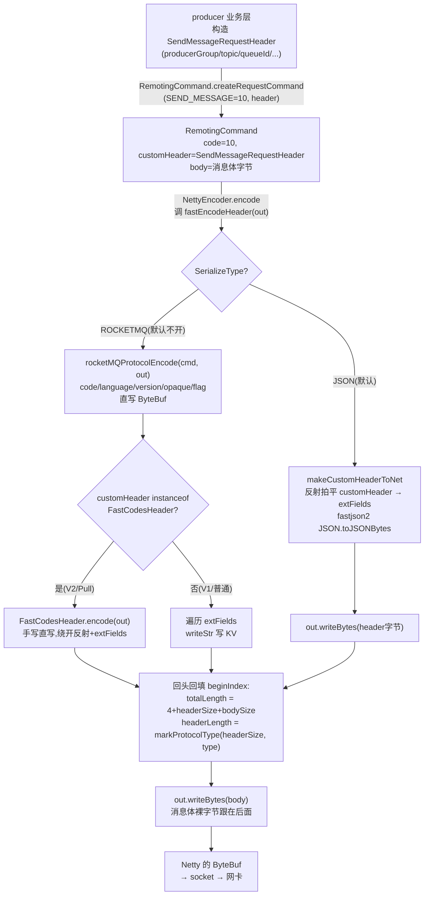

# 第十二章 · RemotingCommand:协议的字节布局与零拷贝编码

> 篇:第 4 篇 · Remoting:协议、Netty、Processor
> 主线呼应:前 3 篇讲的是存储内核与消费端——一条消息怎么进 CommitLog、怎么被 ConsumeQueue/Index 重建、怎么被零拷贝送出去、消费端怎么 Pull 长轮询、怎么 Rebalance、怎么记位点。可这些场景里出现过的每一次"跨进程通信"——producer 调 `DefaultMQProducer.send` 把消息发给 broker、consumer 向 broker 发 `PULL_MESSAGE` 请求、broker 向 NameServer 注册心跳、master 向 slave 推 CommitLog——**最终都走进同一个网络底座**:`remoting` 模块。从这一章开始,我们沉到这个底座。它身上有一个朴素却贯穿的问题:**怎么把一个 Java 对象,在网络上变成一串自解释的字节,又快又不出错**。RocketMQ 给的答案,就是这一章的主角——`RemotingCommand`,以及它那一套藏在 4 字节位域里的精妙编码。

## 核心问题

**RocketMQ 自家所有跨进程的请求和响应,都长成同一个样子:一个 `RemotingCommand`。它在线上的字节布局是 `[4字节 totalLength][4字节 headerLength(高 8 位塞 SerializeType)][header][body]`。凭什么一个 4 字节的 headerLength 能既表达长度、又表达序列化类型?为什么不让 header 直接走 JSON 一条路,还要单独搞一个 ROCKETMQ 二进制协议?那些热路径上的请求 header 又是怎么做到绕开反射、直写 ByteBuf 的?**

读完本章你会明白:

1. 为什么 RocketMQ 把"所有请求/响应一律统一成 `RemotingCommand`":一套编解码通吃 send / pull / heartbeat / 注册 / 复制 ACK,协议层和业务彻底解耦,加一种新请求只加一个 `RequestCode` 常量 + 一个 `CommandCustomHeader` 子类。
2. 那段 `[totalLength][headerLength][header][body]` 的 wire 格式凭什么解决 TCP 粘包、又凭什么让接收端一次性把"长度 / 序列化类型 / 头 / 体"四件事拆清——核心是 headerLength 的高 8 位被**位域复用**塞进了 SerializeType。
3. `markProtocolType` / `getProtocolType` / `getHeaderLength` 这三对移位与掩码在源码里到底怎么写,为什么是 24 位长度 + 8 位类型(而不是总纲里某些旧资料写的 26 位)。
4. 热路径上的 `PullMessageRequestHeader`、`SendMessageRequestHeaderV2` 怎么靠实现 `FastCodesHeader` 接口、**手写** encode/decode,把反射开销彻底甩掉;`fastEncodeHeader` 又怎么做到"零拷贝"直写 Netty `ByteBuf`,连一次中间 `byte[]` 都不分配。

> **如果一读觉得太难**:先只记住三件事——① 所有跨进程通信,在线上都是一段 `[长度][头长(高 8 位塞序列化类型)][头][体]` 的字节;② 序列化类型和头长共用一个 4 字节,靠掩码 `0x00FFFFFF` 和移位 `<< 24` 拆开;③ 热路径 header 通过实现 `FastCodesHeader` 手写编解码绕开反射,这是 RocketMQ 在每秒百万级 QPS 下抠出来的优化。这三件先抓住,源码细节可以回头再细看。

---

## 12.1 一句话点破

> **RocketMQ 的网络协议只有一个对象:`RemotingCommand`。它在线上的样子,是 `[4字节 totalLength][4字节 headerLength(高 8 位塞 SerializeType)][header 字节][body 字节]`——前面 4 字节告诉接收端"整帧多大"(解决 TCP 粘包),紧接着的 4 字节告诉接收端"头多大、用什么序列化类型"(高位 8 位塞类型、低 24 位塞长度),后面就是头和体本身。header 内部有两种序列化:JSON(fastjson2)或 ROCKETMQ 自研二进制(更省字节)。热路径上 Pull/Send 的 header 还会实现 `FastCodesHeader`,把 encode/decode 手写到 `ByteBuf` 直读写,反射开销一并甩掉。一个 4 字节同时表达长度和序列化类型,是整套协议最反直觉、也最经济的点睛。**

这是结论,不是理由。本章倒过来拆:先看为什么要统一成 `RemotingCommand`、为什么 wire 格式这么排,再看那 4 字节位域到底怎么塞的,最后看热路径 header 怎么靠 `FastCodesHeader` + `fastEncodeHeader` 把编解码的开销抠到地板。

---

## 12.2 为什么要统一成一个 RemotingCommand

在讲字节布局之前,先卸掉一个朴素包袱:**为什么不每种请求一个数据结构,要统一成一个 `RemotingCommand`?**

直觉上,producer 发消息、consumer 拉消息、broker 心跳注册、master-slave 复制 ACK,这些是完全不同语义的网络交互。给每种单独建一个类(`SendMessageRequest`、`PullMessageRequest`、`HeartBeatRequest`...),在业务层最清晰。但这条路在网络层有一个**致命的散装**问题:

- 每种请求一个 wire 格式,意味着每加一种请求都要重新设计"长度前缀放哪、头放哪、体放哪、序列化怎么搞"。
- Netty 的编解码 handler(`MessageToByteEncoder` / `LengthFieldBasedFrameDecoder`)是绑在 pipeline 上、对所有 channel 数据通用的——它必须看到"一个统一的帧结构"才能工作,不能为每种业务换一套帧格式。
- 协议层和业务层耦合:改一个业务字段,可能要动到粘包解码、长度计算等协议骨架。

> **不这样会怎样**:如果每种业务一个 wire 格式,Netty pipeline 里就要么放 N 个 decoder 各自认领(怎么认领?要先解一种格式才知道是不是这种,鸡生蛋)、要么每种业务一条专属 channel。前者解不开,后者把连接数和长连接复用的优势全废了。

> **所以这样设计**:RocketMQ 在协议层只认**一种**对象——`RemotingCommand`。无论你发的是消息、拉的是消息、还是心跳、还是注册,统一被包成一个 `RemotingCommand`,在它身上带一个 `code`(`RequestCode` 整数枚举)告诉对方"我是什么请求"。**协议层只管"怎么把一个 RemotingCommand 编成字节、又怎么从字节解回来",完全不关心业务语义;业务层只管"我这个 RequestCode 对应什么处理逻辑",完全不关心字节怎么排。** 两层彻底解耦,加一种新请求,协议层一行不动。

`RemotingCommand` 类本身就这么朴素([RemotingCommand.java:47](../rocketmq/remoting/src/main/java/org/apache/rocketmq/remoting/protocol/RemotingCommand.java#L47)):

```java
public class RemotingCommand {
    public static final String SERIALIZE_TYPE_PROPERTY = "rocketmq.serialize.type";
    // ...
    private int code;                                       // 请求/响应码,对应 RequestCode 里的常量
    private LanguageCode language = LanguageCode.JAVA;
    private int version = 0;
    private int opaque = requestId.getAndIncrement();       // 请求 id,响应里原样回填,用于配对
    private int flag = 0;                                   // 标志位:是请求还是响应、是否 oneway
    private String remark;
    private HashMap<String, String> extFields;              // 头部扩展字段(键值对,核心)
    private transient CommandCustomHeader customHeader;     // 类型化的 header(强类型字段)
    private transient CommandCustomHeader cachedHeader;
    private SerializeType serializeTypeCurrentRPC = serializeTypeConfigInThisServer;
    private transient byte[] body;                          // 消息体(真正的 payload)
    // ... 几个 transient 的运行时字段(suspended/processTimer 等),不参与序列化
}
```

这里有一个**关键设计**值得单独点出来:头部有两种表达方式并存——

- **`customHeader`**:类型化的强类型 header,比如 `SendMessageRequestHeader`(有 `producerGroup`、`topic`、`queueId` 这些带类型的字段)。这是**业务侧舒服**的样子,你拿到一个请求能直接 `cmd.decodeCommandCustomHeader(SendMessageRequestHeader.class)` 得到一个强类型对象。
- **`extFields`**:一个 `HashMap<String, String>`,所有字段都序列化成字符串塞进去。这是**线上传输**的样子——因为线上的 ROCKETMQ 二进制协议只认字符串键值对,JSON 协议也是序列化这个 map。

两者的桥梁是反射:`makeCustomHeaderToNet()` 把 `customHeader` 的每个字段**反射读出来**、`toString()` 后塞进 `extFields`;`decodeCommandCustomHeader()` 反过来,从 `extFields` **反射写回** `customHeader` 的字段。这个反射,就是后面 `CLASS_HASH_MAP` 缓存和 `FastCodesHeader` 快路径要对付的开销。

`RequestCode` 是这套统一协议的"业务路由码",全是 `int` 常量([RequestCode.java:22](../rocketmq/remoting/src/main/java/org/apache/rocketmq/remoting/protocol/RequestCode.java#L22)):

```java
public class RequestCode {
    public static final int SEND_MESSAGE = 10;            // 发消息
    public static final int PULL_MESSAGE = 11;            // 拉消息
    public static final int HEART_BEAT = 34;              // 心跳
    public static final int QUERY_CONSUMER_OFFSET = 14;   // 查消费位点
    public static final int UPDATE_CONSUMER_OFFSET = 15;  // 更新消费位点
    public static final int REGISTER_BROKER = 103;        // broker 向 NameServer 注册
    public static final int SEND_MESSAGE_V2 = 310;        // 发消息 V2(热路径优化版)
    public static final int POP_MESSAGE = 200050;         // 5.x pop 消费
    // ... 还有上百个
}
```

它为什么是 `int` 而不是 `enum`?因为 wire 格式里 `code` 是按整数(short 或 int)直接编码的(下面 12.3 会看到),`int` 常量省掉了 enum 序列化的额外开销,也方便跨语言客户端(golang / cpp / rust 的 client)直接用裸整数对接。broker 收到请求后,就是用这个 `code` 去 `processorTable` 查"哪个 Processor 处理它"——这是下一章 P4-13 / P4-14 的戏,这里只点一句:统一成一个 `RemotingCommand` + 一个 `code`,是协议层和业务层解耦的钥匙。

> **钉死这件事**:RocketMQ 的协议层只认 `RemotingCommand` 这一种对象。业务多样性靠 `code`(RequestCode 整数)在协议层之上区分,协议层完全不感知业务语义。这一刀切下去,Netty pipeline 里只需一套 Encoder/Decoder 通吃所有请求,加新请求不动协议一行。

---

## 12.3 wire 格式:那 4 字节 headerLength 凭什么两用

统一成 `RemotingCommand` 之后,下一个问题就是:**它在 TCP 字节流里长什么样?**

TCP 是字节流,没有消息边界。一个 producer 连着发了 3 个 `RemotingCommand`,接收端收到的就是一串连续字节,它怎么知道第一个命令在第几字节结束、第二个从哪开始?这是经典的 **TCP 粘包/半包** 问题。最稳的解法是**带长度前缀**:每个消息开头放一个"我整条有多长"的字段,接收端按这个长度切。

RocketMQ 的 wire 格式就这样设计(下面这张 ASCII 框图是本章核心图):

```
 一个 RemotingCommand 在 TCP 字节流里的样子(网络字节序,Big-Endian):

 偏移    字段               长度     含义
 ┌──────────────────────────┬────────┬───────────────────────────────────────────────────┐
 │ 0                        │ 4 字节  │ totalLength = 4(headerLen 字段) + header.length    │
 │                          │        │             + body.length                          │
 │                          │        │  ← 接收端凭它切帧(LengthFieldBasedFrameDecoder)  │
 ├──────────────────────────┼────────┼───────────────────────────────────────────────────┤
 │ 4                        │ 4 字节  │ headerLength(位域复用!)                            │
 │                          │        │   高 8 位 (bit24~31):SerializeType(0=JSON,1=ROCKETMQ) │
 │                          │        │   低 24 位 (bit0~23):header 字节长度               │
 │                          │        │  ← 一个 int 同时表达"头多长"+"用什么序列化"        │
 ├──────────────────────────┼────────┼───────────────────────────────────────────────────┤
 │ 8                        │ N 字节  │ header(序列化后的头部:JSON 文本 或 ROCKETMQ 二进制) │
 │                          │        │   含 code/language/version/opaque/flag/remark/      │
 │                          │        │   extFields(及 customHeader 反射拍平进来的字段)    │
 ├──────────────────────────┼────────┼───────────────────────────────────────────────────┤
 │ 8+N                      │ M 字节  │ body(payload,原始字节,不再做任何序列化)          │
 │                          │        │   发消息 = 消息体;拉消息响应 = 一批消息           │
 └──────────────────────────┴────────┴───────────────────────────────────────────────────┘

 切帧后:NettyDecoder 用 super(FRAME_MAX_LENGTH, 0, 4, 0, 4)
   lengthFieldOffset=0      → 长度字段从第 0 字节开始
   lengthFieldLength=4      → 长度字段占 4 字节
   lengthAdjustment=0       → totalLength 已含自身 4 字节,无需调整
   initialBytesToStrip=4    → 切帧后剥掉前 4 字节 totalLength
 剩下 [headerLength(4)][header(N)][body(M)] 交给 RemotingCommand.decode 处理
```

这张图有三个要点必须钉死。

**第一,totalLength 解决粘包。** 前 4 字节告诉接收端"我整条有多大",`LengthFieldBasedFrameDecoder` 就是靠它切帧的。一条消息的边界由此确定。注意 `totalLength` **包含了它自己这 4 字节**(所以 `lengthAdjustment=0`),它的值是 `4 + header.length + body.length`(下面 `encode()` 源码印证)。

**第二,headerLength 位域复用,是整套协议最反直觉的点睛。** 紧接着的 4 字节,**低 24 位**装 header 的字节长度,**高 8 位**装 SerializeType(0=JSON,1=ROCKETMQ)。也就是说,接收端读这 4 字节,**一次性**就同时拿到了"头多大"和"头用什么序列化"两件事。

**第三,body 不参与序列化,是裸字节。** body 字段在源码里是 `transient byte[] body`——它在线上就是原样跟在 header 后面,既不 JSON 也不 ROCKETMQ 编码。这是有意为之:发消息时 body 是消息体本身(可能很大),拉消息响应时 body 是一串消息,如果再走一次序列化纯属浪费。`totalLength` 减去 `4 + headerLength` 就是 body 长度,直接 `readBytes` 拿到原始字节。

> **不这样会怎样(关于 body 的设计)**:如果 body 也序列化进 header(比如 JSON 里嵌一个 base64 的 body),那每次编解码都要把整个消息体过一次 JSON,既慢又占内存(base64 还膨胀 33%)。RocketMQ 把 body 摘出来当裸字节跟在后面,header 只放"元数据",这套分工让"大头"的消息体始终以原始字节流转,从不进 JSON 解析器。

现在落到源码,看这套格式怎么编出来。`RemotingCommand.encode()` 是"编码成一整个 ByteBuffer"的入口([RemotingCommand.java:387](../rocketmq/remoting/src/main/java/org/apache/rocketmq/remoting/protocol/RemotingCommand.java#L387)):

```java
public ByteBuffer encode() {
    // 1> header length size
    int length = 4;                          // :389  预留 headerLength 字段自己占的 4 字节

    // 2> header data length
    byte[] headerData = this.headerEncode(); // :392  把 header 编成字节(JSON 或 ROCKETMQ)
    length += headerData.length;

    // 3> body data length
    if (this.body != null) {
        length += body.length;
    }

    ByteBuffer result = ByteBuffer.allocate(4 + length);   // :400  totalLength 自身 4 字节 + length

    // length
    result.putInt(length);                                  // :403  写 totalLength(含 headerLen 字段的 4 字节)

    // header length
    result.putInt(markProtocolType(headerData.length, serializeTypeCurrentRPC));  // :406  位域复用!

    // header data
    result.put(headerData);                                 // :409

    // body data;
    if (this.body != null) {
        result.put(this.body);                              // :413
    }

    result.flip();
    return result;
}
```

这段源码字面对应上面 ASCII 框图:`result.putInt(length)` 写 totalLength,`result.putInt(markProtocolType(...))` 写那个"两用"的 headerLength,然后 header、body 依次跟上。注意 `length` 这个变量初值就是 `4`(`:389` 注释 `header length size`)——这正是 totalLength 包含 headerLength 字段自身 4 字节的体现。

解码是对称的(`decode()` 在 [:191](../rocketmq/remoting/src/main/java/org/apache/rocketmq/remoting/protocol/RemotingCommand.java#L191)):

```java
public static RemotingCommand decode(final ByteBuf byteBuffer) throws RemotingCommandException {
    int length = byteBuffer.readableBytes();
    int oriHeaderLen = byteBuffer.readInt();                // :193  读那 4 字节"两用"的 headerLength
    int headerLength = getHeaderLength(oriHeaderLen);       // :194  掩码取出低 24 位 = 真正的头长
    if (headerLength > length - 4) {
        throw new RemotingCommandException("decode error, bad header length: " + headerLength);
    }

    RemotingCommand cmd = headerDecode(byteBuffer, headerLength, getProtocolType(oriHeaderLen));  // :199  高 8 位取出 SerializeType

    int bodyLength = length - 4 - headerLength;             // :201  body 长度 = 剩余 - headerLength 字段的 4 字节
    byte[] bodyData = null;
    if (bodyLength > 0) {
        bodyData = new byte[bodyLength];
        byteBuffer.readBytes(bodyData);                     // :205  body 直接当裸字节读
    }
    cmd.body = bodyData;

    return cmd;
}
```

注意 `decode` 接收的 `byteBuffer` 是 `NettyDecoder` 切帧后的——`LengthFieldBasedFrameDecoder` 已经把前 4 字节 totalLength 剥掉了(`initialBytesToStrip=4`),所以这里 `byteBuffer.readInt()` 读到的是第二个 4 字节(那个两用的 headerLength)。`length - 4` 里的 `4` 是 headerLength 字段自身占的字节。一切对得上。

> **钉死这件事**:wire 格式 `[totalLength][headerLength(高 8 位塞 SerializeType)][header][body]` 的每一字节,都在 `encode()` / `decode()` 里字面对应。totalLength 解决粘包,headerLength 位域复用一次性给"头长+序列化类型",body 是裸字节不参与序列化。这是 RocketMQ 协议的全部骨架。

---

## 12.4 位域复用的三对移位:markProtocolType / getProtocolType / getHeaderLength

上一节点到了 `markProtocolType` 和 `getProtocolType`,这一节单独拆透——这是本章技巧精解的第一主角。

先看 SerializeType 本身([SerializeType.java:20](../rocketmq/remoting/src/main/java/org/apache/rocketmq/remoting/protocol/SerializeType.java#L20)):

```java
public enum SerializeType {
    JSON((byte) 0),
    ROCKETMQ((byte) 1);

    private static final SerializeType[] BY_CODE = {JSON, ROCKETMQ};

    private byte code;

    SerializeType(byte code) {
        this.code = code;
    }

    public static SerializeType valueOf(byte code) {
        int idx = code & 0xFF;
        return idx < BY_CODE.length ? BY_CODE[idx] : null;
    }

    public byte getCode() {
        return code;
    }
}
```

只有两种:JSON(code=0)、ROCKETMQ(code=1)。`code` 是 `byte`,取值 0 或 1——**只需要 1 个 bit** 就能区分(实际用了整个 byte,但只用低 1 位)。

现在看那个"两用"的 4 字节怎么塞。`markProtocolType` 负责把 SerializeType 塞进 headerLength 的高位([RemotingCommand.java:248](../rocketmq/remoting/src/main/java/org/apache/rocketmq/remoting/protocol/RemotingCommand.java#L248)):

```java
public static int markProtocolType(int source, SerializeType type) {
    return (type.getCode() << 24) | (source & 0x00FFFFFF);
}
```

就这一行,但信息密度极高。拆开看:

- `source` 是真正的 header 字节长度(比如 header 编出来 200 字节,`source=200`)。
- `type.getCode()` 是 SerializeType 的 byte 值(0 或 1)。
- `type.getCode() << 24`:把类型值左移 24 位,推到 int 的最高 8 位(bit24~bit31)。比如 `ROCKETMQ` 的 code=1,左移 24 位后就是 `0x01000000`。
- `source & 0x00FFFFFF`:把 source 与 `0x00FFFFFF`(低 24 位全 1、高 8 位全 0)按位与,**保留低 24 位、清零高 8 位**。这一步是个安全网——万一 source 超过 24 位能表示的最大值(16MB),也不会污染高 8 位的类型字段,而是被截断(实际不会发生,因为 frame 最大就 16MB,见下面 NettyDecoder)。
- `|`:把"高 8 位的类型"和"低 24 位的长度"按位或,合成一个 int。

举例:header 长 200 字节(`0x0000C8`),SerializeType 是 ROCKETMQ(`0x01`)。`markProtocolType(200, ROCKETMQ)`:
- `0x01 << 24` = `0x01000000`
- `200 & 0x00FFFFFF` = `0x000000C8`
- `0x01000000 | 0x000000C8` = `0x010000C8`

写到线上就是这个 int `0x010000C8`(大端序,字节是 `01 00 00 C8`)。接收端读出来,反过来拆。

**反解的三对函数**:

```java
public static SerializeType getProtocolType(int source) {           // :236
    return SerializeType.valueOf((byte) ((source >> 24) & 0xFF));   // 右移 24 位把高 8 位挪到最低,再 & 0xFF 取出
}

public static int getHeaderLength(int length) {                     // :212
    return length & 0xFFFFFF;                                       // 直接 & 0xFFFFFF 取低 24 位
}
```

- `getProtocolType(0x010000C8)`:`0x010000C8 >> 24` = `0x01`,`& 0xFF` = `0x01`,转回 `SerializeType.ROCKETMQ`。
- `getHeaderLength(0x010000C8)`:`0x010000C8 & 0x00FFFFFF` = `0x000000C8` = 200。header 长 200 字节,对上了。

三对函数对称得不能再对称:**塞进去用 `(type << 24) | (len & 0x00FFFFFF)`,取出来用 `(source >> 24) & 0xFF` 取类型、`source & 0xFFFFFF` 取长度。**

> **修正一处常见误传**:有的资料(包括本书总纲的初稿)把这套位运算写成"`(length & 0x3FFFFFFF) | (serializeType << 24)`",暗示长度占 26 位、类型占 6 位。**这是错的**。源码白纸黑字是 `source & 0x00FFFFFF`(24 位长度)+ `<< 24`(8 位类型),不是 26 位 / 6 位。 SerializeType 用整个 byte(8 位)虽然实际只用 1 位,但布局上是 8+24,不是 6+26。记错位宽会在自己实现兼容客户端时翻车(算错掩码)。

> **不这样会怎样(关于位域复用本身)**:如果不在 headerLength 里复用,而是**单独加一个字节**标 SerializeType,wire 格式就变成 `[totalLength][serializeType(1字节)][headerLength(4字节)][header][body]`——看似更直观,实则三个毛病:
> 1. **破坏 4 字节对齐**:多出来的 1 字节让后续所有字段都错位 1 字节,在某些 CPU 架构上读取未对齐的 int 会有性能损失(虽然 Big-Endian 序列化时影响小,但哲学上不优雅)。
> 2. **多一次解析**:接收端要先读 1 字节类型、再读 4 字节长度,两次读取。位域复用后一次 readInt 拿到两件事。
> 3. **协议变长**:每帧多 1 字节,百万 QPS 下累积可观(虽然 1 字节看着小,但协议设计的洁癖就是抠这种)。
>
> RocketMQ 选了把类型塞进一个**本来就要存在**的字段(长度字段)的高位,代价是这个字段的长度表达能力从 32 位缩到 24 位——但 24 位能表达 16MB 的 header,远远超过实际需要(`NettyDecoder` 的 `FRAME_MAX_LENGTH` 默认也就 16MB,见 [:32](../rocketmq/remoting/src/main/java/org/apache/rocketmq/remoting/netty/NettyDecoder.java#L32))。**用绰绰有余的位数换一个字段的复用,这是协议设计的经济。**

---

## 12.5 两条序列化路径:JSON vs ROCKETMQ 自研二进制

headerLength 高位标了 SerializeType,意味着 header 有两种编码方式。这一节看这两种分别长什么样、为什么要有两条路。

**路径一:JSON(fastjson2)。** header 用 fastjson2 序列化成 JSON 文本字节。代码在 `headerEncode()`([:421](../rocketmq/remoting/src/main/java/org/apache/rocketmq/remoting/protocol/RemotingCommand.java#L421))的 else 分支:

```java
private byte[] headerEncode() {
    this.makeCustomHeaderToNet();                          // 先把 customHeader 反射拍平进 extFields
    if (SerializeType.ROCKETMQ == serializeTypeCurrentRPC) {
        return RocketMQSerializable.rocketMQProtocolEncode(this);
    } else {
        return RemotingSerializable.encode(this);          // :426  fastjson2 的 JSON.toJSONBytes
    }
}
```

`RemotingSerializable.encode` 就是 `JSON.toJSONBytes(obj, CHARSET_UTF8)`([RemotingSerializable.java:29](../rocketmq/remoting/src/main/java/org/apache/rocketmq/remoting/protocol/RemotingSerializable.java#L29))。JSON 路径的好处是**可读、可调试**——抓包能直接看到 header 内容;坏处是文本格式体积大(`"producerGroup":"myGroup"` 这种字段名都要传一遍)、解析也要过 JSON parser。

**路径二:ROCKETMQ 自研二进制。** 这是 RocketMQ 自己定义的一套紧凑二进制 header 格式,代码在 `RocketMQSerializable`。`rocketMQProtocolEncode(cmd, ByteBuf out)` 直写 ByteBuf([RocketMQSerializable.java:135](../rocketmq/remoting/src/main/java/org/apache/rocketmq/remoting/protocol/RocketMQSerializable.java#L135)):

```java
public static int rocketMQProtocolEncode(RemotingCommand cmd, ByteBuf out) {
    int beginIndex = out.writerIndex();
    // int code(~32767)
    out.writeShort(cmd.getCode());                  // :138  注意是 short 不是 int!省 2 字节
    // LanguageCode language
    out.writeByte(cmd.getLanguage().getCode());     // :140  1 字节
    // int version(~32767)
    out.writeShort(cmd.getVersion());               // :142  short
    // int opaque
    out.writeInt(cmd.getOpaque());                  // :144  4 字节
    // int flag
    out.writeInt(cmd.getFlag());                    // :146  4 字节
    // String remark
    String remark = cmd.getRemark();
    if (remark != null && !remark.isEmpty()) {
        writeStr(out, false, remark);               // :150  4字节长度 + UTF8 字节
    } else {
        out.writeInt(0);                            // :152  remark 为空,直接写 0
    }

    int mapLenIndex = out.writerIndex();
    out.writeInt(0);                                // :156  先占位 extFields 总长度
    if (cmd.readCustomHeader() instanceof FastCodesHeader) {
        ((FastCodesHeader) cmd.readCustomHeader()).encode(out);  // :158  快路径!直写
    }
    HashMap<String, String> map = cmd.getExtFields();
    if (map != null && !map.isEmpty()) {
        map.forEach((k, v) -> {
            if (k != null && v != null) {
                writeStr(out, true, k);             // :164  key: 2字节长度(short)+ UTF8
                writeStr(out, false, v);            // :165  value: 4字节长度(int)+ UTF8
            }
        });
    }
    out.setInt(mapLenIndex, out.writerIndex() - mapLenIndex - 4);  // :169  回填 extFields 实际长度
    return out.writerIndex() - beginIndex;          // 返回 header 总字节数
}
```

ROCKETMQ 二进制 header 的字节布局(在 `[headerLength][header][body]` 的 header 部分里):

```
 ROCKETMQ 二进制 header 内部布局:
 ┌───────────┬──────┬─────────┬────────┬────────┬────────────────────┬───────────────────────────┐
 │ code      │ lang │ version │ opaque │ flag   │ remark             │ extFields                 │
 │ 2 字节    │ 1字节│ 2 字节  │ 4 字节 │ 4 字节 │ 4字节len + UTF8    │ 4字节totalLen + N×(KV)    │
 │ (short)   │      │ (short) │ (int)  │ (int)  │ 空=写 0            │ key=2字节len+str          │
 │           │      │         │        │        │                    │ val=4字节len+str          │
 └───────────┴──────┴─────────┴────────┴────────┴────────────────────┴───────────────────────────┘
 固定部分 = 2+1+2+4+4 = 13 字节;remark 和 extFields 变长
```

几个省字节的细节:

- **code 用 short 不用 int**:RequestCode 的值(10、11、103、310...)都远小于 32767,short 装得下。源码注释 `// int code(~32767)` 明说"虽然是 int 字段,但实际值不超过 32767,用 short 编码省 2 字节"。
- **version 同理用 short**。
- **language 用 1 字节**:`LanguageCode` 枚举(JAVA、CPP、GO...)的 code 是 byte。
- **remark 为空时只写 4 字节的 0**,不写长度+空字符串。
- **extFields 的 key 用 2 字节 short 长度**(key 一般很短,如 "topic"、"queueId",short 足够),value 用 4 字节 int 长度(value 可能很长,如消息 properties)。

> **不这样会怎样**:如果 header 只走 JSON,每条请求的 header 都会膨胀——字段名 `"producerGroup"`、`"queueOffset"` 这些字符串每次都要在线上传输一遍(JSON 没有字段名压缩),还要过 fastjson2 的解析器(反射 + 字符串匹配)。ROCKETMQ 二进制协议把字段名隐式化(靠位置和类型直接读),header 体积比 JSON 小 30%~50%,解析也快得多。代价是**不可读**(抓包看到的是二进制,要靠 Wireshark 插件或专门工具解读)、**改协议不灵活**(加减字段要改编解码两端)。所以 RocketMQ 默认走 JSON(可读、好调试),性能敏感场景切 ROCKETMQ(靠 `-Drocketmq.serialize.type=ROCKETMQ` 配置,见 `:76` 的 static block)。

实际线上,`serializeTypeConfigInThisServer` 默认就是 `JSON`([:73](../rocketmq/remoting/src/main/java/org/apache/rocketmq/remoting/protocol/RemotingCommand.java#L73))——也就是说,**大多数部署用的是 JSON 路径**。ROCKETMQ 路径更多是给"抠到极致"的内部场景留的口子。理解了这两条路的取舍,你才能在抓包看到 JSON header 时不困惑"不是说有二进制协议吗"——默认不开。

---

## 12.6 fastEncodeHeader:零拷贝直写 Netty ByteBuf

讲完协议骨架,看一个**和性能直接相关**的编码路径:`fastEncodeHeader`。前面 12.3 的 `encode()` 是"编成一整个 ByteBuffer"(中间分配了一个 `ByteBuffer.allocate(4 + length)`,再把 totalLength、headerLength、header、body 拷进去)。这条路在"把命令交给 Netty 发出去"的场景下不够优——因为 Netty 的 `MessageToByteEncoder` 已经给了一个现成的 `ByteBuf out`,如果先用 `encode()` 编成 `ByteBuffer`、再拷进 `out`,就多了一次中间分配和拷贝。

`fastEncodeHeader` 就是为这个场景设计的,**直接把内容写进 Netty 给的 `ByteBuf`,不分配中间 `byte[]`**([RemotingCommand.java:458](../rocketmq/remoting/src/main/java/org/apache/rocketmq/remoting/protocol/RemotingCommand.java#L458)):

```java
public void fastEncodeHeader(ByteBuf out) {
    int bodySize = this.body != null ? this.body.length : 0;
    int beginIndex = out.writerIndex();
    // skip 8 bytes
    out.writeLong(0);                                   // :462  先占 8 字节(totalLength + headerLength)
    int headerSize;
    if (SerializeType.ROCKETMQ == serializeTypeCurrentRPC) {
        if (customHeader != null && !(customHeader instanceof FastCodesHeader)) {
            this.makeCustomHeaderToNet();              // :466  非 FastCodesHeader 才反射拍平
        }
        headerSize = RocketMQSerializable.rocketMQProtocolEncode(this, out);  // :468  直写 out!
    } else {
        this.makeCustomHeaderToNet();
        byte[] header = RemotingSerializable.encode(this);
        headerSize = header.length;
        out.writeBytes(header);                          // JSON 路径还是先编 byte[] 再写
    }
    out.setInt(beginIndex, 4 + headerSize + bodySize);              // :475  回填 totalLength
    out.setInt(beginIndex + 4, markProtocolType(headerSize, serializeTypeCurrentRPC));  // :476  回填 headerLength
}
```

这段的精妙在三处:

**第一,先占 8 字节、回头回填。** `out.writeLong(0)` 先把 `totalLength` 和 `headerLength` 这两个 4 字节字段的位置占住(写成 0),然后继续往后写 header。写完 header 后,`headerSize` 已知,再 `out.setInt(beginIndex, ...)` 和 `out.setInt(beginIndex + 4, ...)` **回头把这两个字段填对**。为什么这么别扭?因为 totalLength 和 headerLength 都依赖 header 的实际大小,而 header 大小要等编完才知道。先占位、后回填,避免了"先编 header 到临时 buffer 算长度、再拷贝"两次拷贝。

**第二,ROCKETMQ 路径完全直写。** `RocketMQSerializable.rocketMQProtocolEncode(this, out)` 接受 `ByteBuf out` 参数,把 code、language、version、opaque、flag、remark、extFields **一个个直接 writeShort / writeByte / writeInt 进 `out`**——全程不分配任何中间 `byte[]`。这就是"零拷贝编码"的字面含义:**编码产物直接落在最终发送的 ByteBuf 上,中间不经过任何 Java 数组。**

**第三,JSON 路径无法零拷贝。** 注意 else 分支 `byte[] header = RemotingSerializable.encode(this)`——JSON 路径还是先编成 `byte[]` 再 `out.writeBytes`。因为 fastjson2 的 `JSON.toJSONBytes` 返回的就是 `byte[]`,没法直接写进任意 `ByteBuf`。这是 JSON 路径的固有代价,也是 ROCKETMQ 路径的性能优势所在。

谁调 `fastEncodeHeader`?Netty pipeline 里的 `NettyEncoder`([NettyEncoder.java:30](../rocketmq/remoting/src/main/java/org/apache/rocketmq/remoting/netty/NettyEncoder.java#L30)):

```java
@ChannelHandler.Sharable
public class NettyEncoder extends MessageToByteEncoder<RemotingCommand> {
    @Override
    public void encode(ChannelHandlerContext ctx, RemotingCommand remotingCommand, ByteBuf out)
        throws Exception {
        try {
            remotingCommand.fastEncodeHeader(out);      // :37  直写 out
            byte[] body = remotingCommand.getBody();
            if (body != null) {
                out.writeBytes(body);                   // :40  body 也直接跟在后面
            }
        } catch (Exception e) {
            // ... 出错关 channel
        }
    }
}
```

`MessageToByteEncoder<RemotingCommand>` 是 Netty 提供的基类,它会给 `encode` 方法一个已分配好的 `ByteBuf out`,你往里写就行。`NettyEncoder` 调 `fastEncodeHeader(out)` 把 header 写进去、再 `out.writeBytes(body)` 把 body 跟上,整条命令就编完了——**从头到尾,在 ROCKETMQ 路径下,header 部分没有一个中间 `byte[]` 被分配**。

> **钉死这件事**:`fastEncodeHeader` 用"先占 8 字节、后回填"的技巧,让 ROCKETMQ 路径下的 header 编码**直写 Netty ByteBuf、零中间分配**。`NettyEncoder` 调它完成整条命令的编码。这是 RocketMQ 在每秒百万级 QPS 下抠出来的优化——每条命令省一次 `byte[]` 分配,百万 QPS 就是百万次 GC 压力的消除。

---

## 12.7 技巧精解:位域复用 + 反射缓存 + FastCodesHeader 快路径

这一节把本章三个最硬核的技巧单独拆透。

### 技巧一:headerLength 高位塞 SerializeType(位域复用)

这个技巧在 12.4 已经拆过移位和掩码,这里补"为什么 sound"。sound 的关键在两点:

1. **不丢信息**。SerializeType 只有两个值(0/1),用 1 bit 就够;header 长度实际不超过 16MB(`FRAME_MAX_LENGTH`),24 bit 够装。一个 32 位 int 装 8 位类型 + 24 位长度,两边都绰绰有余,没有信息丢失。
2. **不串扰**。`markProtocolType` 写入时用 `source & 0x00FFFFFF` 清掉 source 的高 8 位,保证长度不会污染类型字段;`<< 24` 把类型推到高 8 位,保证类型不会污染长度字段。两边在 bit 层面完全隔离,按位或后各自占据自己的位段,互不干扰。读出时 `>> 24` 和 `& 0xFFFFFF` 分别取自己的位段,也互不干扰。

这套位运算的 sound 性,本质是**位段隔离**——只要写入和读出对同一位段用一致的掩码和移位,信息就不会错位。这是所有位域复用协议(IP 头、TCP 头、USB 描述符)的共同基础。

### 技巧二:CLASS_HASH_MAP 反射缓存,避免每条请求重扫字段

回想 12.2 提到的:`customHeader`(强类型)和 `extFields`(HashMap<String,String>)之间靠反射互转。`makeCustomHeaderToNet()` 把 customHeader 的字段反射读出来塞进 extFields;`decodeCommandCustomHeaderDirectly()` 反过来。反射本身慢(`getDeclaredFields` 每次都扫类的所有字段),如果每条请求都重扫,百万 QPS 下反射开销会累积成可观的热点。

RocketMQ 的优化是**缓存反射结果**。看 `getClazzFields`([:348](../rocketmq/remoting/src/main/java/org/apache/rocketmq/remoting/protocol/RemotingCommand.java#L348)):

```java
//make it able to test
Field[] getClazzFields(Class<? extends CommandCustomHeader> classHeader) {
    Field[] field = CLASS_HASH_MAP.get(classHeader);          // :349  先查缓存

    if (field == null) {
        Set<Field> fieldList = new HashSet<>();
        for (Class className = classHeader; className != Object.class; className = className.getSuperclass()) {
            Field[] fields = className.getDeclaredFields();   // :354  反射扫字段(含父类)
            fieldList.addAll(Arrays.asList(fields));
        }
        field = fieldList.toArray(new Field[0]);
        synchronized (CLASS_HASH_MAP) {
            CLASS_HASH_MAP.put(classHeader, field);           // :359  放进缓存
        }
    }
    return field;
}
```

`CLASS_HASH_MAP` 是个 `HashMap<Class<? extends CommandCustomHeader>, Field[]>`(`:54`),**类级别的全局缓存**。第一次遇到某个 header 类(比如 `SendMessageRequestHeader`),反射扫一遍它的所有字段(含父类,`:353` 的 `getSuperclass()` 循环),把 `Field[]` 存起来;以后再遇到同一个类,直接从缓存拿,不再反射。这个缓存是 **Class → Field[]** 的映射,**对同一个类的所有实例共享**——反射只在"第一次见到这个类"时发生一次。

类似的还有 `CANONICAL_NAME_CACHE`(`:56`,缓存 `Class → canonicalName`,避免每次 `getCanonicalName()`)和 `NULLABLE_FIELD_CACHE`(`:59`,缓存 `Field → 是否允许 null`,避免每次读 `@CFNotNull` 注解)。

> **为什么 sound(关于缓存的线程安全)**:`CLASS_HASH_MAP` 是普通 `HashMap` 不是 `ConcurrentHashMap`,但 `getClazzFields` 的写入用了 `synchronized (CLASS_HASH_MAP)`(`:358`)。这里有个微妙的点:读不加锁(`:349` 的 `get` 不在 synchronized 块里),写加锁。这看似有竞争(读时可能正写),但 **HashMap 在 JDK8+ 里,只要不是并发扩容,读操作读到的是已发布对象的引用,不会崩**;而同一个 Class 重复 put 进去的 `Field[]` 内容一致(反射对同一个 Class 结果确定性),所以即使读到旧值或新值都对。这是"读多写极少 + 写幂等"场景下绕开 CHM 开销的小技巧——反射扫每个类只发生一次,绝大多数时候是纯读。

> **反面对比**:如果不缓存,每条 send/pull 请求编解码都要 `getDeclaredFields()` 重扫一遍 `SendMessageRequestHeader` 的十几个字段(还要 `getSuperclass()` 遍历父类)。反射 `getDeclaredFields` 每次返回新数组(JDK 内部要复制),百万 QPS 下光是字段数组分配就是可观开销,外加注解读取(`isFieldNullable` 里的 `getAnnotation`)。缓存把这些一次性开销摊到了"类首次出现"的那一次。

### 技巧三:FastCodesHeader 手写编解码,热路径彻底甩开反射

反射缓存再好,也还是反射——`field.get()` / `field.set()` 的调用开销比直接访问字段高一个数量级。对于 send / pull 这种**每条消息都要走**的热路径,RocketMQ 提供了一条更狠的快路径:`FastCodesHeader` 接口,让 header **自己手写** encode/decode,绕开反射。

接口定义([FastCodesHeader.java:26](../rocketmq/remoting/src/main/java/org/apache/rocketmq/remoting/protocol/FastCodesHeader.java#L26)):

```java
public interface FastCodesHeader {

    default String getAndCheckNotNull(HashMap<String, String> fields, String field) {
        // 从 extFields 取字段,带日志(不抛异常,保持向后兼容)
    }

    default void writeIfNotNull(ByteBuf out, String key, Object value) {
        if (value != null) {
            RocketMQSerializable.writeStr(out, true, key);              // key 用 short 长度
            if (value instanceof Long) {
                RocketMQSerializable.writeDecimalLong(out, (Long) value);
            } else if (value instanceof Integer) {
                RocketMQSerializable.writeDecimalInt(out, (Integer) value);
            } else {
                RocketMQSerializable.writeStr(out, false, value.toString());
            }
        }
    }

    // ... writeLong / writeInt 等辅助方法

    void encode(ByteBuf out);                                           // 子类实现
    void decode(HashMap<String, String> fields) throws RemotingCommandException;
}
```

实现这个接口的 header,encode/decode 完全手写——直接调 `writeIfNotNull(out, "topic", this.topic)`,字段名硬编码、字段访问是直接 `this.topic`,**没有反射**。看最热路径的 `PullMessageRequestHeader`([PullMessageRequestHeader.java:82](../rocketmq/remoting/src/main/java/org/apache/rocketmq/remoting/protocol/header/PullMessageRequestHeader.java#L82)):

```java
@Override
public void encode(ByteBuf out) {
    writeIfNotNull(out, "consumerGroup", consumerGroup);     // :84  直接字段访问,无反射
    writeIfNotNull(out, "topic", topic);                     // :85
    writeIfNotNull(out, "liteTopic", liteTopic);
    writeIfNotNull(out, "queueId", queueId);
    writeIfNotNull(out, "queueOffset", queueOffset);
    writeIfNotNull(out, "maxMsgNums", maxMsgNums);
    writeIfNotNull(out, "sysFlag", sysFlag);
    // ... 一长串手写的字段
}

@Override
public void decode(HashMap<String, String> fields) throws RemotingCommandException {
    String str = getAndCheckNotNull(fields, "consumerGroup");
    if (str != null) {
        this.consumerGroup = str;                            // :110  直接字段赋值,无反射
    }
    str = getAndCheckNotNull(fields, "topic");
    if (str != null) {
        this.topic = str;
    }
    // ... 手写的反序列化
    str = getAndCheckNotNull(fields, "queueOffset");
    if (str != null) {
        this.queueOffset = Long.parseLong(str);              // :130  类型转换手写,不走反射判断
    }
    // ...
}
```

注意 `encode` 在 `RocketMQSerializable.rocketMQProtocolEncode` 里被调用(`:157`):

```java
if (cmd.readCustomHeader() instanceof FastCodesHeader) {
    ((FastCodesHeader) cmd.readCustomHeader()).encode(out);   // :158  快路径!直写 ByteBuf
}
HashMap<String, String> map = cmd.getExtFields();
if (map != null && !map.isEmpty()) {
    map.forEach((k, v) -> { ... });                           // 慢路径:遍历 extFields
}
```

**这里有个微妙的协同**:`FastCodesHeader.encode(out)` 把字段直接写进 ByteBuf,这些字段**不再**塞回 `extFields`(因为 `makeCustomHeaderToNet()` 在 `fastEncodeHeader` 里被跳过了,见 `:465` 的判断 `!(customHeader instanceof FastCodesHeader)`)。也就是说,FastCodesHeader 的字段直接从 customHeader 写到线上,绕开了 extFields 这个中间 map——**连 HashMap 的开销都省了**。解码端对称:`decodeCommandCustomHeaderDirectly` 里 `if (objectHeader instanceof FastCodesHeader && useFastEncode)`(`:292`)走 `((FastCodesHeader) objectHeader).decode(this.extFields)`,直接从 map 手写赋值给字段,绕开反射字段遍历。

> **不这样会怎样**:如果 `PullMessageRequestHeader` 不实现 FastCodesHeader,每条 pull 请求的编解码都要:① `getClazzFields` 拿 Field[](虽然有缓存);② 遍历每个 Field,`field.get(customHeader)`(反射读)+ `value.toString()`(可能拆箱);③ 塞进 extFields HashMap;④ 解码端再反射 `field.set()`。光是 `field.get` / `field.set` 的 JNI 开销 + 拆箱装箱,在百万 QPS 拉消息场景下就是显著热点。FastCodesHeader 把这条路径上的反射、HashMap 全砍掉,编码直接字段→ByteBuf,解码直接 map→字段。
>
> 代价是**手写代码冗长且易错**——每加一个字段,encode 和 decode 两处都要改,字段名还要和 `extFields` 的 key 严格一致(因为跨版本/跨序列化类型要兼容)。RocketMQ 在热路径(send/pull 及其 V2 版、response header)上承受了这个代价,冷路径(管理类、查询类请求)还是走反射,这就是"热路径手工优化、冷路径用反射保开发效率"的典型工程权衡。

哪些 header 实现了 FastCodesHeader?热路径的几个:`SendMessageRequestHeaderV2`(SEND_MESSAGE_V2,code=310)、`PullMessageRequestHeader`、`SendMessageResponseHeader`、`PullMessageResponseHeader`——都是每秒被调成千上万次的。看一眼它们的共性:**都是 V2 版或响应头**——V2 是 V1 的字段压缩版(SEND_MESSAGE_V2 把一些字段缩成 short、合并默认值),响应头字段少,手写成本低、收益高。

---

## 12.8 把它串起来:一条 SEND_MESSAGE 请求的编码旅程

讲完所有零件,用一条真实的 send 请求把它们串起来,看 `RemotingCommand` 怎么从 producer 端的 Java 对象变成网卡上的字节。



producer 端这条路径上,关键优化在两处:**fastEncodeHeader 的先占位后回填(省中间 byte[])** 和 **FastCodesHeader 的手写直写(省反射)**。broker 端解码是对称的(`NettyDecoder` → `LengthFieldBasedFrameDecoder` 切帧 → `RemotingCommand.decode` → `headerDecode` → 业务 Processor 调 `decodeCommandCustomHeader` 还原强类型 header),这里不展开,留到 P4-13 讲 Netty pipeline 时连起来。

---

## 章末小结

这一章沉到了 RocketMQ 的网络协议底座。我们没有碰 Netty 的线程模型(那是下一章 P4-13 的戏),也没有碰 Processor 路由(P4-14),只讲透了一件事:**所有跨进程通信,在线上都长成 `[totalLength][headerLength(高 8 位塞 SerializeType)][header][body]` 这串字节,而 `RemotingCommand` 就是这串字节在 Java 侧的统一化身。**

回到全书的二分法,这一章服务的是**分布式骨架**那一面——`remoting` 模块是消息在集群里可靠流转的通信底座,producer 发消息、consumer 拉消息、broker 心跳注册、master-slave 复制 ACK,全走它。它本身不存消息(那是存储内核的事),但它把消息(以及所有控制信令)变成字节送出去、又把字节变回对象交给人处理。协议层的统一(`RemotingCommand` 一个对象 + 一个 `code`),让这套通信底座和业务彻底解耦;wire 格式的位域复用(headerLength 高 8 位塞 SerializeType),让协议在 4 字节对齐的前提下省下了"单独标序列化类型"的开销;热路径的 `FastCodesHeader` + `fastEncodeHeader`,把反射和中间分配甩掉,撑住百万 QPS。

### 五个"为什么"清单

1. **为什么 RocketMQ 把所有请求/响应统一成一个 `RemotingCommand`?** 协议层和业务层解耦。协议层只管"一个 RemotingCommand 怎么编成字节、怎么从字节解回来",完全不感知业务;业务层靠 `code`(RequestCode)区分请求类型,加新请求协议层一行不动。Netty pipeline 里一套 Encoder/Decoder 通吃所有请求。

2. **wire 格式为什么是 `[totalLength][headerLength][header][body]`?** totalLength 解决 TCP 粘包(接收端凭它切帧);headerLength(高 8 位塞 SerializeType)一次性告诉接收端"头多大、用什么序列化";header 装元数据(code/opaque/extFields 等);body 是裸字节(消息体直接跟在后面,不参与序列化,省一次 JSON 编解码和 base64 膨胀)。

3. **headerLength 高 8 位塞 SerializeType 凭什么不串扰?** 位域复用。写入用 `(type << 24) | (len & 0x00FFFFFF)`,类型占高 8 位、长度占低 24 位,按位或后各占各的位段;读出用 `(source >> 24) & 0xFF` 取类型、`source & 0xFFFFFF` 取长度,对称拆开。24 位长度能表达 16MB header,绰绰有余。**注意是 8+24,不是某些资料误传的 6+26。**

4. **为什么要有 JSON 和 ROCKETMQ 两条序列化路径?** JSON(默认)可读、好调试、改协议灵活(fastjson2 反射),但体积大、解析慢;ROCKETMQ 自研二进制省字节(code/version 用 short、字段名隐式化),解析快,但不可读、加减字段要改两端。默认走 JSON,性能敏感场景靠 `-Drocketmq.serialize.type=ROCKETMQ` 切到二进制。

5. **热路径 header 为什么要实现 `FastCodesHeader` 手写 encode/decode?** 反射再快也慢于直接字段访问。send/pull 这种每条消息都走的路径,反射的 `field.get/set` + extFields HashMap 开销累积成热点。FastCodesHeader 让 header 自己手写编解码,字段直接 → ByteBuf、map 直接 → 字段,绕开反射和 HashMap。代价是手写代码冗长易错,所以只用在 V2/Pull/Response 这几个热路径 header 上,冷路径还是走反射保开发效率。

### 想继续深入往哪钻

- 想亲眼看 `markProtocolType` 和 `getProtocolType` 的对称性:读 `../rocketmq/remoting/src/main/java/org/apache/rocketmq/remoting/protocol/RemotingCommand.java` 的 `:248`(`markProtocolType`)、`:236`(`getProtocolType`)、`:212`(`getHeaderLength`)——三个函数加起来不到 10 行,是位域复用的全部。
- 想看 ROCKETMQ 二进制 header 的完整布局:读 `../rocketmq/remoting/src/main/java/org/apache/rocketmq/remoting/protocol/RocketMQSerializable.java` 的 `rocketMQProtocolEncode`(`:135`)和 `rocketMQProtocolDecode`(`:281`)——一对 encode/decode,把 header 的每个字段怎么读怎么写写得清清楚楚。
- 想理解 `LengthFieldBasedFrameDecoder` 怎么凭 totalLength 切帧:读 `../rocketmq/remoting/src/main/java/org/apache/rocketmq/remoting/netty/NettyDecoder.java`——构造参数 `super(FRAME_MAX_LENGTH, 0, 4, 0, 4)` 是 Netty 粘包解码的全部魔法(lengthFieldOffset=0, lengthFieldLength=4, lengthAdjustment=0, initialBytesToStrip=4)。
- 想看 FastCodesHeader 手写编解码的真实样本:读 `../rocketmq/remoting/src/main/java/org/apache/rocketmq/remoting/protocol/header/PullMessageRequestHeader.java` 的 `encode`(`:82`)和 `decode`(`:106`)——拉消息请求头的编解码全手写,对照反射路径能直观感受"快"在哪。
- 延伸到 Kafka 对照:Kafka 用的是自研二进制协议(Request/Response 带 API key + API version + correlation id),没有 JSON 路径;RocketMQ 保留 JSON 路径是出于"可调试 + 跨语言客户端易实现"的权衡。可以对比两者的 wire 格式设计哲学。

### 引出下一章

我们讲完了 `RemotingCommand` 怎么编成字节、怎么从字节解回来——这是协议层的全部。但协议层只是"一个对象 ↔ 一串字节"的转换,真正把字节送上 TCP、又把 TCP 字节流喂给解码器的,是 Netty 的线程模型和 pipeline。RocketMQ 用了经典的**主从 Reactor 三组线程**(Boss accept / Selector IO / Worker 业务),还在 pipeline 里串了 Handshake → Encoder → Decoder → IdleState → ConnectManage → ServerHandler 一长串 handler,并用 `setAutoRead(false)` 做背压。这些,就是下一章 P4-13 的戏。

