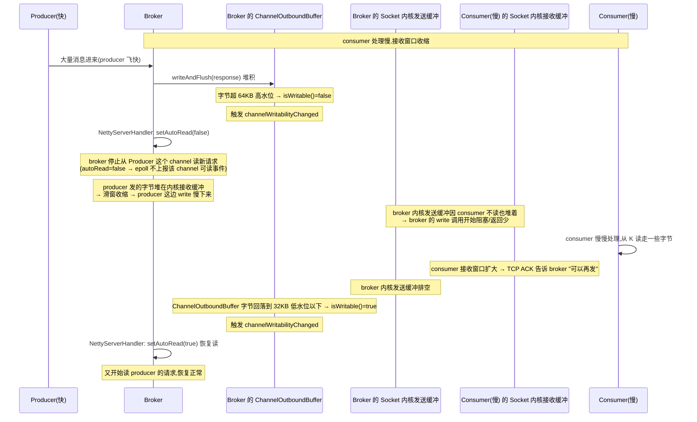
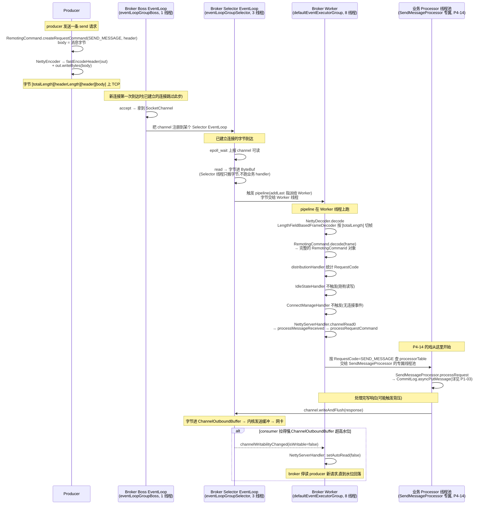

# 第十三章 · Netty 主从 Reactor 线程模型与背压

> 篇:第 4 篇 · Remoting:协议、Netty、Processor
> 主线呼应:上一章(P4-12)讲完了 `RemotingCommand` 怎么编成一串字节、又怎么从字节解回来——那是协议层。可协议层只是"一个 Java 对象 ↔ 一串字节"的转换,真正把字节送上 TCP、又把 TCP 字节流喂给解码器的,是 Netty 的**线程模型**和 **ChannelPipeline**。这一章就沉到这个底座的下面一层:`NettyRemotingServer` 怎么用**主从 Reactor 三组线程**编排海量连接、怎么在 pipeline 里串一长串 handler 收发数据、怎么靠 `setAutoRead(false)` 做背压防止慢消费者把 broker 拖死。讲完这一章,你脑子里就该有一张完整的"字节怎么在 broker 这台机器上被一群线程接力处理"的图——这是下一章 P4-14 Processor 路由的舞台。

## 核心问题

**`NettyRemotingServer` 起了三组线程:`eventLoopGroupBoss`(1 个,只管 accept)、`eventLoopGroupSelector`(N 个,Linux 上用 EpollEventLoopGroup,管 read/write)、`defaultEventExecutorGroup`(M 个,跑编解码和业务 handler 的那一长串 ChannelHandler)。为什么要把"接连接"和"读写 IO"拆开?为什么还要再把"业务 handler"从 IO 线程里摘出去单独跑?那条 `Handshake → Encoder → NettyDecoder → distributionHandler → IdleState → ConnectManage → ServerHandler` 的 pipeline 顺序凭什么这么排?更反直觉的:当一个 consumer 拉得慢、broker 写缓冲堆满时,RocketMQ 居然用 `setAutoRead(false)` 主动**停止读取**这个 channel——凭什么停读反而能避免丢数据?**

读完本章你会明白:

1. 为什么 Netty 的"主从 Reactor"比经典的"一连接一线程"(BIO 线程池)强得多——少量线程靠 epoll/selector 一个线程盯住成千上万个连接,IO 线程从不阻塞在某个慢连接上。
2. RocketMQ 为什么在 Netty 默认的"两组线程(Boss/Worker)"之上,又加了第三组 `defaultEventExecutorGroup`:把**会阻塞、会算 CPU 的 handler**(尤其是后续业务 Processor 的入口)从 IO 线程里彻底剥离,IO 线程只做"搬字节",绝不染指业务。
3. `LengthFieldBasedFrameDecoder` 凭什么解决 TCP 粘包/半包(前 4 字节 totalLength 定界,与 P4-12 的 wire 格式呼应),以及它的 4 个构造参数 `super(FRAME_MAX_LENGTH, 0, 4, 0, 4)` 每一位在干什么。
4. 背压凭什么不丢数据:`channelWritabilityChanged` 回调 + 写缓冲水位(高水位 `WRITE_BUFFER_HIGH_WATER_MARK` / 低水位 `WRITE_BUFFER_LOW_WATER_MARK`)联动——超水位停读 → 对端 TCP 滑窗收缩 → 水位回落 → 恢复 autoRead,整套链路靠 TCP 流控层层回压,没有任何应用层丢消息。

> **如果一读觉得太难**:先只记住三件事——① broker 有三组线程,各管一段(接连接 / 搬字节 / 跑业务),互不拖累;② pipeline 顺序是固定的,`NettyDecoder` 靠 `[totalLength]` 前缀切帧解决粘包;③ 写爆了就 `setAutoRead(false)` 停读,TCP 自己会回压,数据一行不丢。这三件先抓住,源码细节回头再啃。

---

## 13.1 一句话点破

> **`NettyRemotingServer` 是一个教科书级的"主从 Reactor 三组线程"实现:1 个 Boss 线程只 accept 新连接,N 个 Selector 线程靠 epoll 盯着所有活跃连接的 read/write,M 个 Worker 线程(`DefaultEventExecutorGroup`)专门跑编解码和业务 handler 的那一长串 pipeline。三组线程职责隔离——接连接的专心接、搬字节的专心搬、跑业务的不许碰 IO。每条新连接进来,被串上一条固定顺序的 ChannelPipeline(`Handshake → Encoder → NettyDecoder → distributionHandler → IdleState → ConnectManage → ServerHandler`),字节顺着这条链一路被加工成 `RemotingCommand`。当某个慢消费者让 broker 的写缓冲堆过水位,`NettyServerHandler.channelWritabilityChanged` 就 `setAutoRead(false)` 主动停读——这一停,TCP 滑窗收缩回压给对端,数据在网卡缓冲里等、不进 JVM、不丢。**

这是结论,不是理由。本章倒过来拆:先看为什么要分三组线程(而不是一组线程全包揽),再看 pipeline 每一节在干什么、顺序凭什么这么排,最后看背压这一套"停读反而保数据"的机制凭什么 sound。

---

## 13.2 朴素方案:一连接一线程,卡在哪

在讲主从 Reactor 之前,先卸掉一个最朴素的包袱:**为什么不能"每个连接分配一个线程"专门伺候它?**

这是 BIO(Thread-Per-Connection)时代最直觉的做法:服务器 `accept` 到一个连接,就 `new Thread(...).start()` 一个线程,这个线程里跑一个死循环 `socket.getInputStream().read(...)`,读到啥处理啥。在并发不高、连接数不多的年代,这够用。但这条路在"C10K"以上(单机上万连接)的场景有三个致命的卡点:

- **线程数爆炸**:1 万连接就 1 万线程。JVM 里每个线程默认占 512KB~1MB 栈空间,1 万线程就是 5~10GB 纯栈内存,直接把 JVM 撑爆。
- **线程切换开销**:1 万线程在 N 个 CPU 核心上轮转,光上下文切换(保存/恢复寄存器、TLB 失效)就把 CPU 烧光,真正的业务没跑多少。
- **阻塞是灾难**:一个线程在 `read()` 上阻塞,等着这个连接发数据。如果这个连接的客户端正好卡住了(没发数据也没断开),这个线程就**死等**——它什么也干不了。1 万连接里只要有几百个"挂着不说话"的,几百个线程就被绑死在 `read()` 上空耗。

> **不这样会怎样**:如果 RocketMQ 用 BIO 一连接一线程,一个 broker 承载几万 producer/consumer 长连接(RocketMQ 的常态),光是线程栈内存就几十 GB,加上频繁的线程切换, broker 的 CPU 大半都耗在"管理线程"而不是"搬消息"上。一台机器根本撑不住几个 broker 实例。

这就是为什么所有高性能网络框架(Netty、nginx、Redis、tokio)都不走 BIO,而是走 **Reactor + IO 多路复用(epoll/kqueue)**。RocketMQ 的 `remoting` 模块,就是 Netty 这套 Reactor 模型的一个直接应用。

---

## 13.3 Reactor 的核心:少量线程,盯住海量连接

Reactor 模式的精髓一句话:**不要给每个连接配线程,而是给每个线程配一堆连接**。线程不阻塞在某个连接的 `read()` 上,而是去问操作系统内核:"我管的那 1 万个连接里,谁现在有数据可读、谁现在可写?" 这个"问"的动作,在 Linux 上就是 `epoll_wait`。

`epoll_wait` 的妙处在于它是**水平触发、O(1) 返回活跃连接**:你把 1 万个 socket 注册给内核一次,以后每次调 `epoll_wait`,内核直接把这 1 万个里"现在有事件"的那几个还给你(活跃的少就返回少,活跃的多就返回多,复杂度和活跃连接数成正比,和总连接数无关)。一个线程调一次 `epoll_wait`,就能同时伺候 1 万个连接,而且**绝不在某个空闲连接上空等**——内核说没事件,线程就回去干别的或者继续等。

Netty 把这套封装成了 `EpollEventLoopGroup`(Linux 原生 epoll)和 `NioEventLoopGroup`(跨平台 JDK NIO,底层在 Linux 也是 epoll)。每个 `EventLoop` 就是一个线程,绑一个 `Selector`(对 epoll 的封装),绑一组 channel。这个 EventLoop 既负责"select 出活跃 channel",又负责"在活跃 channel 上读/写"——读和写都在这个线程里做,不需要再切线程。

> **钉死这件事**:Reactor 模式相对 BIO 的根本优势,不是"用了 epoll"(BIO 也可以用 epoll),而是**线程模型变了**——线程不再绑定单个连接,而是绑定一个 Selector,Selector 再绑定一组连接。一个线程可以高效伺候成千上万个连接,因为 epoll 让它只在"有事可干"的连接上花时间。

RocketMQ 用的就是这个。看 `NettyRemotingServer` 怎么选 epoll 还是 NIO([NettyRemotingServer.java:151](../rocketmq/remoting/src/main/java/org/apache/rocketmq/remoting/netty/NettyRemotingServer.java#L151)):

```java
protected EventLoopGroup buildEventLoopGroupSelector() {
    if (useEpoll()) {
        return new EpollEventLoopGroup(nettyServerConfig.getServerSelectorThreads(),
            new ThreadFactoryImpl("NettyServerEPOLLSelector_"));          // :153 Linux 上用原生 epoll
    } else {
        return new NioEventLoopGroup(nettyServerConfig.getServerSelectorThreads(),
            new ThreadFactoryImpl("NettyServerNIOSelector_"));            // :155 其他平台用 JDK NIO
    }
}

private boolean useEpoll() {
    return NetworkUtil.isLinuxPlatform()                                   // :215 是 Linux
        && nettyServerConfig.isUseEpollNativeSelector()                    // 配置允许
        && Epoll.isAvailable();                                            // netty-native-epoll 在 classpath
}
```

三个条件全满足才走 `EpollEventLoopGroup`:Linux 平台 + 配置开启 + netty 的 native epoll 库可用。任何一个不满足就退回 `NioEventLoopGroup`(JDK NIO,跨平台但比原生 epoll 慢一点,主要慢在 JDK NIO 的 Selector 实现有额外的同步开销、且没有 edge-triggered 模式)。`serverSelectorThreads` 默认 **3**([NettyServerConfig.java:29](../rocketmq/remoting/src/main/java/org/apache/rocketmq/remoting/netty/NettyServerConfig.java#L29))——也就是说,搬字节的 Selector 线程,默认就 3 个。这 3 个线程能扛住几万连接,全靠 epoll。

> **为什么 sound(关于 epoll 替代 NIO)**:Netty 的 `EpollEventLoopGroup` 直接用 JNI 调 Linux 内核 epoll,绕开了 JDK NIO Selector 的中间层。在百万级小包场景下,netty-native-epoll 比 JDK NIO 快 20%~30%(少了 Selector.open 的 pipe、少了 selectionKey 的同步、支持 `EPOLLET` 边沿触发)。RocketMQ 默认 `useEpollNativeSelector=false`([NettyServerConfig.java:52](../rocketmq/remoting/src/main/java/org/apache/rocketmq/remoting/netty/NettyServerConfig.java#L52))是出于"运维默认稳"——生产环境想开就显式设 true,前提是部署的 netty-native-epoll jar 和内核版本对得上。

---

## 13.4 主从 Reactor:为什么把 accept 和 read/write 拆成两组

现在你大概会问:既然一个 Selector 线程能伺候海量连接,为什么还要分两组——一组专门 accept,另一组专门 read/write?这是"主从 Reactor"里"主"和"从"的区分。

先看 RocketMQ 怎么搭的([NettyRemotingServer.java:159](../rocketmq/remoting/src/main/java/org/apache/rocketmq/remoting/netty/NettyRemotingServer.java#L159)):

```java
protected EventLoopGroup buildEventLoopGroupBoss() {
    if (useEpoll()) {
        return new EpollEventLoopGroup(1, new ThreadFactoryImpl("NettyEPOLLBoss_"));   // :161  就 1 个线程!
    } else {
        return new NioEventLoopGroup(1, new ThreadFactoryImpl("NettyNIOBoss_"));      // :163
    }
}
```

注意那个硬编码的 `1`——Boss 组**永远只有 1 个线程**。这个线程只干一件事:在监听 socket 上 `accept()` 新连接。新连接进来后,Boss 线程不亲自伺候它的读写,而是把这条新 channel **注册到 Selector 组**里的某个 EventLoop 上(Netty 默认轮询分配),交给那个 Selector 线程接手后续的 read/write。

这个分工的合理性,要回到 accept 和 read/write 的本质差异上看:

- **accept 是一次性的、廉价的**:一个新连接到达,accept 一次就拿到一个 `SocketChannel`,工作就完了。即使有连接风暴(短时间大量新连接),accept 的处理也只是"拿 fd、建 channel、注册到 selector"这几步,微秒级。
- **read/write 是持续性的、可能很重的**:一条长连接的生命周期里,会发生成千上万次 read/write。每次 read 要把内核缓冲的字节搬到 ByteBuf、过 pipeline 解码;每次 write 要把 ByteBuf 往内核送。一个慢连接的 write 可能因为对端 TCP 窗口收缩而阻塞、触发背压。

> **不这样会怎样**:如果 accept 和 read/write 混在一组线程里,假设某个 Selector 线程正卡在一条慢连接的 write 上(写缓冲满了在排队),此时恰好有新连接进来要 accept——这个新连接就只能等。在连接风暴(比如大批 producer 重启后同时连 broker)的场景,Boss 线程被某个慢 write 卡住,新连接 accept 超时,producer 报 `connect timed out`。把 accept 单独拎出来给一个专职线程,这个线程永远只做 accept(几乎不会阻塞),新连接进来立刻被接住、注册到某个 Selector,后续即使那个 Selector 卡在慢 write 上,也只影响那一组连接的读写,**不影响新连接被接纳**。

这就是"主从"的精髓:**主(Boss)只接客,绝不让接客被任何单个连接的慢拖累;从(Selector)只搬货,搬不动了影响的是自己组内的连接,不波及接客**。RocketMQ 的 Boss 组固定 1 个线程,正是因为 accept 这件事根本不需要并发——一个监听 socket 串行 accept 完全够用,加更多 Boss 线程是浪费。

```
 主从 Reactor 线程模型(broker 侧 NettyRemotingServer):

  ┌─────────────────────────────────────────────────────────────────┐
  │  eventLoopGroupBoss  (1 个线程)                                   │
  │  ┌─────────────────────────┐                                      │
  │  │ Boss EventLoop          │  ← 监听 listenPort,只 accept 新连接   │
  │  │ epoll_wait(listen_fd)   │     拿到新 SocketChannel 后,轮询       │
  │  └──────────┬──────────────┘     注册到下方某个 Selector EventLoop  │
  └─────────────┼───────────────────────────────────────────────────┘
                │ channel.register(selector)
                ▼
  ┌─────────────────────────────────────────────────────────────────┐
  │  eventLoopGroupSelector  (N=3 个线程,默认)                          │
  │  ┌──────────────┐  ┌──────────────┐  ┌──────────────┐             │
  │  │ Selector EL0 │  │ Selector EL1 │  │ Selector EL2 │             │
  │  │ epoll_wait   │  │ epoll_wait   │  │ epoll_wait   │             │
  │  │  ┌────────┐  │  │  ┌────────┐  │  │  ┌────────┐  │             │
  │  │  │conn 1  │  │  │  │conn 4  │  │  │  │conn 7  │  │             │
  │  │  │conn 2  │  │  │  │conn 5  │  │  │  │conn 8  │  │             │
  │  │  │conn 3  │  │  │  │conn 6  │  │  │  │...     │  │             │
  │  │  └────────┘  │  │  └────────┘  │  │  └────────┘  │             │
  │  │  read/write  │  │  read/write  │  │  read/write  │             │
  │  │  + 跑 pipeline│ │  + 跑 pipeline│ │  + 跑 pipeline│             │
  │  └──────────────┘  └──────────────┘  └──────────────┘             │
  └─────────────────────────────────────────────────────────────────┘
                │ pipeline 里的 Encoder/Decoder/Handler 默认在
                │ Selector 线程跑;RocketMQ 把它们挪到 ↓
                ▼
  ┌─────────────────────────────────────────────────────────────────┐
  │  defaultEventExecutorGroup  (M=8 个线程,默认)                      │
  │  专门跑 ChannelHandler 业务逻辑(Decoder/ConnectManage/Server...) │
  └─────────────────────────────────────────────────────────────────┘
```

> **钉死这件事**:主从 Reactor 的"主从"分工,本质是"接客"和"搬货"的职责隔离。Boss 组 1 个线程专心 accept,绝不被慢连接拖累;Selector 组 N 个线程分担海量连接的 read/write。慢连接再慢,只影响自己所在的那个 Selector 组,接客和别的组照样飞。

---

## 13.5 第三组线程:为什么还要把 handler 从 IO 线程里摘出去

到这里你可能觉得两组线程已经够了:Boss accept、Selector 搬字节并在自己的线程里跑 pipeline。可 RocketMQ 又加了**第三组**:`defaultEventExecutorGroup`。这是最容易被忽略、却最体现 Netty 工程哲学的一刀。

先看这组线程什么时候起([NettyRemotingServer.java:241](../rocketmq/remoting/src/main/java/org/apache/rocketmq/remoting/netty/NettyRemotingServer.java#L241)):

```java
@Override
public void start() {
    this.defaultEventExecutorGroup = new DefaultEventExecutorGroup(nettyServerConfig.getServerWorkerThreads(),
        new ThreadFactoryImpl("NettyServerCodecThread_"));              // :241-242 起第三组线程
    initServerBootstrap(serverBootstrap);
    // ...
}
```

`serverWorkerThreads` 默认 **8**([NettyServerConfig.java:27](../rocketmq/remoting/src/main/java/org/apache/rocketmq/remoting/netty/NettyServerConfig.java#L27))。这 8 个线程是 `DefaultEventExecutorGroup`——它和 `EventLoopGroup` 的区别在于:**它不是 EventLoop,不绑定 Selector,纯粹是个线程池**,专门用来跑那些被显式指派给它的 ChannelHandler。

关键在 pipeline 注册时,看谁被指派给这组线程([NettyRemotingServer.java:293](../rocketmq/remoting/src/main/java/org/apache/rocketmq/remoting/netty/NettyRemotingServer.java#L293)):

```java
protected ChannelPipeline configChannel(SocketChannel ch) {
    return ch.pipeline()
        .addLast(getDefaultEventExecutorGroup(),                       // :295  Handshake 给第三组线程
            HANDSHAKE_HANDLER_NAME, new HandshakeHandler())
        .addLast(getDefaultEventExecutorGroup(),                       // :297  后面这一长串全给第三组线程
            encoder,                                                    //        NettyEncoder
            new NettyDecoder(),                                         //        NettyDecoder
            distributionHandler,                                        //        RemotingCodeDistributionHandler
            new IdleStateHandler(0, 0,
                nettyServerConfig.getServerChannelMaxIdleTimeSeconds()),//        IdleStateHandler
            connectionManageHandler,                                    //        NettyConnectManageHandler
            serverHandler);                                             //        NettyServerHandler
}

public DefaultEventExecutorGroup getDefaultEventExecutorGroup() {
    return nettyServerConfig.isServerNettyWorkerGroupEnable() ? defaultEventExecutorGroup : null;  // :453
}
```

注意 `addLast(EventExecutorGroup executor, ChannelHandler...)` 这个重载——第一个参数指定"这些 handler 在哪个 executor 上跑"。RocketMQ 把**整条 pipeline 的 handler 全都指派给 `defaultEventExecutorGroup`**,而不是让它们在 Selector EventLoop 上跑。`isServerNettyWorkerGroupEnable()` 默认 `true`([NettyServerConfig.java:39](../rocketmq/remoting/src/main/java/org/apache/rocketmq/remoting/netty/NettyServerConfig.java#L39)),所以默认就走第三组线程;设 false 才退回让 handler 在 Selector EventLoop 上跑(那种模式下 IO 和业务挤一组线程,慢业务会拖累 IO)。

> **不这样会怎样(关于第三组线程的必要性)**:如果所有 handler 都在 Selector EventLoop 上跑(也就是 `getDefaultEventExecutorGroup()` 返回 null),那么:`NettyDecoder.decode` 解完帧 → `NettyServerHandler.channelRead0` 收到 `RemotingCommand` → `processMessageReceived` → `processRequestCommand` → **调业务 Processor**。注意这一步——业务 Processor(比如 `SendMessageProcessor`)会去做编码消息、加锁、追加 CommitLog、刷盘这些**可能很重、可能阻塞**的事(详见 P1-03 的 `putMessageLock`、P1-04 的同步刷盘等待)。如果这些事在 Selector EventLoop 线程里干,那么:① 这个 Selector 线程就被占住了,它名下的其他几千个连接的 read/write 全部被堵死;② broker 的写入吞吐被这个 Selector 线程的单核能力限死。
>
> 把 handler 挪到独立的 `defaultEventExecutorGroup`,Selector EventLoop 就只负责"select + read 字节进 ByteBuf + write ByteBuf 出去",字节进了 ByteBuf 之后,过 pipeline 的事(解码、路由、业务)全甩给第三组线程的 8 个工作线程去抢着干。**IO 永远不等业务**——这是第三组线程的根本价值。

这一刀的妙处,在 P4-14 会看得更清楚:`processRequestCommand` 最终会把请求交给**每 Processor 各自独立的业务线程池**(比如 `SendMessageProcessor` 有自己的 sendThreadPool)再跑一次业务。所以一条 send 请求的实际旅程是:**Selector 读字节 → 第三组线程解码+路由 → 业务 Processor 自己的线程池跑 CommitLog 追加**。三层线程,层层隔离,慢业务再慢也只堵自己那一层,不向上传染。

> **钉死这件事**:第三组 `defaultEventExecutorGroup` 是"IO 线程不染指业务"这一原则的物理实现。它让 Selector EventLoop 永远只做"搬字节",把所有"会算 CPU、会阻塞"的 handler(解码、连接管理、业务入口)统统剥离到独立的 8 个工作线程上。这是 broker 能扛住百万 QPS 而不让 IO 被业务拖死的命脉。

---

## 13.6 ChannelPipeline:那一长串 handler 顺序凭什么这么排

现在看 pipeline 本身。`configChannel` 在每条新连接进来时被调用一次,给这条连接的 channel 串上一条固定的 handler 链。这条链的顺序,每一节都有讲究。

先画清整条链(以 broker 默认 TLS 关闭、不走 HAProxy 的常见情况):

```
 一条新连接进来,ChannelPipeline 的 handler 链(默认 TLS 关闭):

   字节进 socket
        │
        ▼
 ┌──────────────────────────────────────────────────────────────────┐
 │ 1. HandshakeHandler   (ByteToMessageDecoder)                      │
 │    第一帧探测:是 HAProxy proxy_protocol(代理转发真实 client IP)? │
 │    是 → 插入 HAProxyDecoder/HAProxyHandler/TlsModeHandler          │
 │    否 → 只插入 TlsModeHandler                                       │
 │    干完把自己从 pipeline 移除(一次性 handler)                      │
 └──────────────────────────────────────────────────────────────────┘
        │
        ▼
 ┌──────────────────────────────────────────────────────────────────┐
 │ (可能插入的)TlsModeHandler                                         │
 │    看首字节:0x16=TLS 握手 → 按 tlsMode 决定加 SslHandler            │
 │    干完移除自己                                                      │
 └──────────────────────────────────────────────────────────────────┘
        │ (TLS 卸载后,明文字节流)
        ▼
 ┌──────────────────────────────────────────────────────────────────┐
 │ 2. NettyEncoder (outbound, MessageToByteEncoder<RemotingCommand>)  │
 │    发出方向:RemotingCommand → fastEncodeHeader(out) + writeBytes   │
 │    (详见 P4-12)                                                    │
 ├──────────────────────────────────────────────────────────────────┤
 │ 3. NettyDecoder (inbound, LengthFieldBasedFrameDecoder)            │
 │    接收方向:按 [4字节 totalLength] 切帧 → RemotingCommand.decode    │
 ├──────────────────────────────────────────────────────────────────┤
 │ 4. RemotingCodeDistributionHandler                                 │
 │    统计各类 RequestCode/ResponseCode 的频次,定时打 traffic 日志     │
 ├──────────────────────────────────────────────────────────────────┤
 │ 5. IdleStateHandler(0, 0, 120s)                                    │
 │    120 秒读写都空闲 → 触发 IdleStateEvent.ALL_IDLE                  │
 ├──────────────────────────────────────────────────────────────────┤
 │ 6. NettyConnectManageHandler (ChannelDuplexHandler)                │
 │    connect/active/inactive/exception/idle 事件 → 投递 NettyEvent     │
 │    给 NettyEventExecutor(异步回调 ChannelEventListener)            │
 ├──────────────────────────────────────────────────────────────────┤
 │ 7. NettyServerHandler (SimpleChannelInboundHandler<RemotingCommand>)│
 │    channelRead0 → processMessageReceived → 路由请求/响应            │
 │    channelWritabilityChanged → 背压(autoRead 开关)                  │
 └──────────────────────────────────────────────────────────────────┘
        │
        ▼
   后续 processRequestCommand → processorTable 路由(P4-14 的戏)
```

逐节看每一节在干什么、为什么排在那个位置。

**第 1 节 HandshakeHandler:一次性协议探测。** 这是 pipeline 的第一道关卡,职责是判断这个连接是不是带 HAProxy proxy_protocol 头(很多云环境的负载均衡器会在 TCP 流最前面塞一段 proxy_protocol,告诉后端"真实客户端 IP 是谁")。它继承 `ByteToMessageDecoder`,逐字节看第一帧能不能识别成 proxy_protocol:能识别就往后面插 HAProxy 解码器和处理器、再插 TlsModeHandler;不能识别就直接插 TlsModeHandler。**干完之后,`ctx.pipeline().remove(this)` 把自己从 pipeline 里摘掉**([:494](../rocketmq/remoting/src/main/java/org/apache/rocketmq/remoting/netty/NettyRemotingServer.java#L494))——这是一次性的,只在连接刚建立时探测一次,后续这个连接的所有数据都不再过它。这是 Netty pipeline"动态增删 handler"的典型用法。

**第 2 节(可能插入)TlsModeHandler:TLS 探测。** 看第一个字节是不是 `0x16`(TLS 握手 magic)。是的话,按服务器配置的 `tlsMode`(DISABLED / PERMISSIVE / ENFORCING)决定要不要插入 `SslHandler` 做加密卸载。干完同样移除自己。这两节一起构成了"连接握手期的协议协商",一旦协商完,pipeline 就稳定成后面那几节,数据流不再回头。

**第 3-4 节 NettyEncoder + NettyDecoder:协议编解码。** 这就是 P4-12 讲透的 `RemotingCommand` 编解码落地处。`NettyEncoder` 是 outbound handler(发出方向),把 `RemotingCommand` 调 `fastEncodeHeader(out)` 写成字节;`NettyDecoder` 是 inbound handler(接收方向),继承 `LengthFieldBasedFrameDecoder`,按 `[totalLength]` 切帧再 `RemotingCommand.decode`。这一对是整条 pipeline 的核心,13.7 会单独拆 `LengthFieldBasedFrameDecoder`。

**第 5 节 RemotingCodeDistributionHandler:流量统计。** 这是个相对轻的 handler,统计 inbound/outbound 的 RequestCode/ResponseCode 分布。broker 启动后有个 `scheduledExecutorService` 每秒把分布打到 `TRAFFIC_LOGGER`([NettyRemotingServer.java:278](../rocketmq/remoting/src/main/java/org/apache/rocketmq/remoting/netty/NettyRemotingServer.java#L278)),运维可以借此看"这个端口每秒在收什么类型的请求"。它排在 Decoder 之后、业务之前,是因为它要的是"已经解码成 RemotingCommand 的 code",不是裸字节。

**第 6 节 IdleStateHandler:空闲检测。** 构造参数 `(0, 0, serverChannelMaxIdleTimeSeconds)`,三个数分别是 readerIdleTime / writerIdleTime / allIdleTime。这里是 `0, 0, 120`——读空闲 0(不检测)、写空闲 0(不检测)、**读写都空闲 120 秒触发**。也就是说,一个连接如果 120 秒既没读也没写,IdleStateHandler 就会触发一个 `IdleStateEvent.ALL_IDLE` 事件,这个事件会被下一节 ConnectManageHandler 捕获,关掉这个连接。**为什么排在 Encoder/Decoder 之后?** 因为它要的是"应用层的读写活跃度"(解码成功的消息算活跃,不是字节级的活跃),排在编解码之后更贴近业务语义。

**第 7 节 NettyConnectManageHandler:连接生命周期管理。** 继承 `ChannelDuplexHandler`(同时处理 inbound 和 outbound),覆盖 `channelActive/channelInactive/userEventTriggered/exceptionCaught` 等生命周期回调。它干的事是把每个连接事件**转成一个 `NettyEvent`** 投递给 `NettyEventExecutor`(一个单线程的 `ServiceThread`,在 `NettyRemotingAbstract` 里定义),后者异步回调业务层的 `ChannelEventListener`(详见 13.8)。为什么这一刀?**因为连接事件回调(channelActive、exceptionCaught)发生在 Netty IO 线程,如果业务在回调里做重活(比如扫表、重连、打日志),会卡住 IO 线程**。RocketMQ 用一个独立的单线程消费这些事件,IO 线程只负责"扔事件进队列就返回",绝不等待业务回调。

**第 8 节 NettyServerHandler:终点 handler。** 这是 pipeline 的最后一节,真正处理已经解码好的 `RemotingCommand`。它的 `channelRead0` 调 `processMessageReceived` → `processRequestCommand`/`processResponseCommand`(P4-14 的主角)。同时它还覆盖了一个对背压至关重要的方法:`channelWritabilityChanged`(13.9 详讲)。

> **钉死这件事**:pipeline 的顺序不是随便排的——握手探测在最前(用完即删)、编解码紧随其后(协议层)、流量统计在解码后(要拿 code)、空闲检测看应用层活跃度、连接管理把事件甩给异步线程、终点 handler 路由业务。每一节的位置都对应它的数据依赖:它需要"已经加工到什么程度"的输入。

---

## 13.7 LengthFieldBasedFrameDecoder:凭什么解决 TCP 粘包

`NettyDecoder` 只有一百来行,但它继承的 `LengthFieldBasedFrameDecoder` 是整套协议落地的基石。这一节单独拆透。

TCP 是**字节流**,没有消息边界。一个 producer 连着发了 3 个 `RemotingCommand`,它们在 TCP 流里就是连成一串的字节——`[cmd1 整帧][cmd2 整帧][cmd3 整帧]`,但接收端不可能知道第一个命令在第几字节结束。更糟的是,网络分片会让一次发送被拆成多个 TCP 段,或者多个发送被合并成一个 TCP 段(这就是"粘包/半包"的来源)。所以应用层必须**自己定边界**。

最稳的边界方式是**长度前缀**:每条消息开头放一个固定长度的"我这条多长"字段,接收端按这个长度切。这就是 `LengthFieldBasedFrameDecoder` 的全部哲学——它是一个通用的"基于长度字段切帧"的解码器,你需要告诉它 5 件事:

| 参数 | 含义 | RocketMQ 的值 |
|------|------|--------------|
| `maxFrameLength` | 单帧最大长度,超了当恶意包/异常丢掉 | `FRAME_MAX_LENGTH` = 16MB |
| `lengthFieldOffset` | 长度字段从帧的第几字节开始 | `0`(开头就是长度) |
| `lengthFieldLength` | 长度字段本身占几字节 | `4`(4 字节 int) |
| `lengthAdjustment` | 长度字段值的调整量 | `0`(长度字段值就是"从长度字段之后到帧尾"的字节数) |
| `initialBytesToStrip` | 切帧后剥掉前几字节 | `4`(剥掉长度字段本身) |

看 RocketMQ 的构造([NettyDecoder.java:32](../rocketmq/remoting/src/main/java/org/apache/rocketmq/remoting/netty/NettyDecoder.java#L32)):

```java
private static final int FRAME_MAX_LENGTH =
    Integer.parseInt(System.getProperty("com.rocketmq.remoting.frameMaxLength", "16777216"));   // :32-33  默认 16MB

public NettyDecoder() {
    super(FRAME_MAX_LENGTH, 0, 4, 0, 4);    // :36
}

@Override
public Object decode(ChannelHandlerContext ctx, ByteBuf in) throws Exception {
    ByteBuf frame = null;
    Stopwatch timer = Stopwatch.createStarted();
    try {
        frame = (ByteBuf) super.decode(ctx, in);       // :44  父类切帧,返回一帧(剥掉了前 4 字节 totalLength)
        if (null == frame) {
            return null;                                // 字节不够一帧,等下一次
        }
        RemotingCommand cmd = RemotingCommand.decode(frame);    // :48  把这一帧解成 RemotingCommand
        cmd.setProcessTimer(timer);                     // :49  挂上计时器,后续超时统计用
        return cmd;
    } catch (Exception e) {
        log.error(...);
        RemotingHelper.closeChannel(ctx.channel());     // :53  解码异常,关连接(防恶意包)
    } finally {
        if (null != frame) {
            frame.release();                            // :56  释放 ByteBuf 引用计数
        }
    }
    return null;
}
```

这套参数和 P4-12 讲的 wire 格式严丝合缝。回顾 P4-12 的 wire 布局:`[4字节 totalLength][4字节 headerLength(高 8 位塞 SerializeType)][header][body]`。`LengthFieldBasedFrameDecoder` 工作的过程是这样:

1. **读前 4 字节 = totalLength**(`lengthFieldOffset=0`, `lengthFieldLength=4`)。这 4 字节的值 = 整帧字节数(含 totalLength 自己的 4 字节)。
2. **算出这一帧总长 = totalLength**,等积攒到这么多字节后,切出这一帧。
3. **剥掉前 4 字节**(`initialBytesToStrip=4`)——返回的 `frame` ByteBuf 里,前 4 字节 totalLength 已经被剥掉,从第 4 字节(也就是 headerLength 那个"两用"的 4 字节)开始。
4. `RemotingCommand.decode(frame)` 接手——它 `frame.readInt()` 读到的就是那个 headerLength(高 8 位塞 SerializeType),再取 header、再取 body,这一帧就完整还原成一个 `RemotingCommand`。

注意 `lengthAdjustment=0` 这个值的微妙:totalLength **包含了 totalLength 字段自己的 4 字节**(P4-12 的 `encode()` 里 `length` 初值就是 4)。那么"长度字段之后的字节数" = totalLength - 4。如果 `lengthAdjustment` 是按"长度字段之后的字节数"理解的,本该是 `-4`;但 Netty 的语义里,`lengthAdjustment` 是加到"长度字段读出的值"上,然后**再减去长度字段自身长度 + lengthFieldOffset**,才是实际帧长。RocketMQ 这里 totalLength 已含自身,所以 `lengthAdjustment=0` 表示"读出的值直接当总长(含长度字段),不用调整"——一切都对得上 P4-12 的 `encode()`。

> **不这样会怎样(关于粘包)**:如果没有 `LengthFieldBasedFrameDecoder`,光靠 `RemotingCommand.decode`,接收端拿到一坨字节流,根本不知道第一个命令在第几字节结束——`decode` 一读 `readInt()` 可能读到的是上一条消息尾巴拼上这一条开头的乱七八糟字节,直接长度错乱、抛异常。`LengthFieldBasedFrameDecoder` 的存在,就是把"按长度切帧"这一步从业务层拎出来,变成 Netty 通用能力。RocketMQ 只需要把 `[totalLength]` 这个长度前缀写在协议里(4 字节大端序),解码器自动按它切。

> **为什么 sound(关于半包)**:`super.decode(ctx, in)` 在字节不够一帧时会返回 `null`(Netty 内部把这次读到的字节缓存起来,等下次再读)。RocketMQ 的 `NettyDecoder` 对 `null` 直接 `return null`——也就是说,**半包状态下解码器静默等待,不报错、不丢数据**。下一波字节到了,Netty 会再次调用 `decode`,累积的字节够了就切出一帧。这是 `ByteToMessageDecoder` 的内建行为:它会一直累积 `in` 里的字节,直到够切。这一切对上层透明,业务 handler 拿到的永远是"完整的一帧"。

---

## 13.8 NettyEventExecutor:连接事件为什么要异步回调

第 6 节 ConnectManageHandler 把每个连接事件扔进一个队列,这个队列的消费者是 `NettyEventExecutor`。这一节单独拆它,因为它体现了一个"IO 线程不染指业务"的延续。

`NettyEventExecutor` 是 `NettyRemotingAbstract` 的内部类([NettyRemotingAbstract.java:765](../rocketmq/remoting/src/main/java/org/apache/rocketmq/remoting/netty/NettyRemotingAbstract.java#L765)),继承 `ServiceThread`(RocketMQ 的后台线程基类):

```java
class NettyEventExecutor extends ServiceThread {
    private final LinkedBlockingQueue<NettyEvent> eventQueue = new LinkedBlockingQueue<>();   // :766

    public void putNettyEvent(final NettyEvent event) {
        int currentSize = this.eventQueue.size();
        int maxSize = 10000;                                                                  // :770 队列上限 1 万
        if (currentSize <= maxSize) {
            this.eventQueue.add(event);
        } else {
            log.warn("event queue size [{}] over the limit [{}], so drop this event {}",       // :774 满了直接丢(有日志)
                currentSize, maxSize, event.toString());
        }
    }

    @Override
    public void run() {
        log.info(this.getServiceName() + " service started");
        final ChannelEventListener listener = NettyRemotingAbstract.this.getChannelEventListener();   // :782 拿业务回调
        while (!this.isStopped()) {
            try {
                NettyEvent event = this.eventQueue.poll(3000, TimeUnit.MILLISECONDS);         // :786 阻塞 3 秒取一个事件
                if (event != null && listener != null) {
                    switch (event.getType()) {
                        case IDLE:     listener.onChannelIdle(...);          break;
                        case CLOSE:    listener.onChannelClose(...);         break;
                        case CONNECT:  listener.onChannelConnect(...);       break;
                        case EXCEPTION:listener.onChannelException(...);     break;
                        case ACTIVE:   listener.onChannelActive(...);        break;
                        default: break;
                    }
                }
            } catch (Exception e) {
                log.warn(this.getServiceName() + " service has exception. ", e);
            }
        }
    }
}
```

注意它是个**单线程**的 ServiceThread(`new` 出来一个实例就是一个线程)。连接事件(CONNECT/CLOSE/IDLE/EXCEPTION/ACTIVE)被 `ConnectManageHandler` 投进来,这个单线程串行消费,回调业务层的 `ChannelEventListener`(broker 侧的实现在 `BrokerController` 里,负责维护连接表、做心跳、必要时清理资源)。

为什么这一刀?直接在 ConnectManageHandler 的回调里同步调业务逻辑不行吗?

> **不这样会怎样**:如果 `channelActive`、`exceptionCaught` 这些回调直接在 Netty IO 线程(Selector EventLoop 或 defaultEventExecutorGroup)里同步调业务,那么业务回调里任何一点重活(比如扫一遍连接表、加重锁更新路由、打详细日志)都会卡住这个 IO 线程。一个 broker 几万连接,连接事件频繁(尤其 producer 重启时大量连接同时建立/断开),业务回调一慢,IO 直接被堵。用一个独立单线程 + 队列把事件异步化,IO 线程"扔完就走",业务在另一边慢慢消费——这是"IO 线程不染指业务"在连接事件上的延续。

注意队列上限 1 万、满了直接丢(`:770-775`)。这是个**有意的背压**:连接事件不是请求/响应那种"丢了会出错"的数据,丢一个 `IDLE` 事件顶多让某个空闲连接晚一拍被发现(下次心跳周期还会再触发)。所以宁可丢事件也不让队列无限长拖垮内存——这和下一节的背压是同一哲学的不同应用。

> **钉死这件事**:`NettyEventExecutor` 是"IO 线程不染指业务"在连接事件上的延续——一个单线程 + 1 万上限队列异步消费连接事件,IO 线程只负责扔事件、不等回调。队列满丢事件不丢数据,因为连接事件幂等、可重新触发。

---

## 13.9 背压:setAutoRead(false) 凭什么不丢数据

这一章最反直觉的机制来了:**当一个 consumer 拉得慢、broker 的写缓冲堆过水位时,broker 会 `setAutoRead(false)` 主动停止读这个 channel**。停读——听起来像是要丢数据?恰恰相反,这是保护数据不丢、保护 broker 不被拖死的关键。

先看源码,在 `NettyServerHandler` 里([NettyRemotingServer.java:579](../rocketmq/remoting/src/main/java/org/apache/rocketmq/remoting/netty/NettyRemotingServer.java#L579)):

```java
@ChannelHandler.Sharable
public class NettyServerHandler extends SimpleChannelInboundHandler<RemotingCommand> {

    @Override
    protected void channelRead0(ChannelHandlerContext ctx, RemotingCommand msg) {
        // ... 路由到 processMessageReceived(P4-14)
    }

    @Override
    public void channelWritabilityChanged(ChannelHandlerContext ctx) throws Exception {
        Channel channel = ctx.channel();
        if (channel.isWritable()) {
            if (!channel.config().isAutoRead()) {
                channel.config().setAutoRead(true);                    // :583 水位回落,恢复读
                log.info("Channel[{}] turns writable, bytes to buffer before changing channel to un-writable: {}",
                    RemotingHelper.parseChannelRemoteAddr(channel), channel.bytesBeforeUnwritable());
            }
        } else {
            channel.config().setAutoRead(false);                       // :588 写缓冲超水位,停读
            log.warn("Channel[{}] auto-read is disabled, bytes to drain before it turns writable: {}",
                RemotingHelper.parseChannelRemoteAddr(channel), channel.bytesBeforeWritable());
        }
        super.channelWritabilityChanged(ctx);
    }
}
```

理解这段,要先理解 Netty 的"写缓冲水位"机制。

**写缓冲是什么?** 当你调 `channel.writeAndFlush(msg)`,这个 msg 不是直接送网卡的——它先进 Netty 的 `ChannelOutboundBuffer`(一个为每条 channel 维护的发送队列),然后 Netty 的 IO 线程异步地、批量地把这个队列里的字节 `write()` 到 socket(进内核发送缓冲,再由内核送网卡)。如果对端(consumer)拉得慢,它的 TCP 接收窗口会收缩,于是 broker 这边 socket 的内核发送缓冲也堆起来,Netty 的 `ChannelOutboundBuffer` 也跟着堆起来——**堆到一定程度,broker 内存就要爆**。

**水位怎么定?** Netty 给每条 channel 配了一个 `WriteBufferWaterMark`(低水位、高水位)。默认低水位 32KB、高水位 64KB。当 `ChannelOutboundBuffer` 里堆积的字节数**从低水位升过高水位**,Netty 把这条 channel 标记为"不可写"(`isWritable()` 返回 false),并触发 `channelWritabilityChanged` 事件。堆积**从高水位回落到低水位以下**,标记恢复"可写",再次触发 `channelWritabilityChanged`。

RocketMQ 的 `NettyServerConfig` 留了 `writeBufferHighWaterMark` / `writeBufferLowWaterMark` 两个配置项([NettyServerConfig.java:36-37](../rocketmq/remoting/src/main/java/org/apache/rocketmq/remoting/netty/NettyServerConfig.java#L36)),默认都是 `0`(`NettySystemConfig` 里默认也是 `0`,见 [NettySystemConfig.java:66-69](../rocketmq/remoting/src/main/java/org/apache/rocketmq/remoting/netty/NettySystemConfig.java#L66))。**值为 0 表示不覆盖,用 Netty 默认的 32KB/64KB**。设置时在 `addCustomConfig` 里调([NettyRemotingServer.java:317](../rocketmq/remoting/src/main/java/org/apache/rocketmq/remoting/netty/NettyRemotingServer.java#L317)):

```java
if (nettyServerConfig.getWriteBufferLowWaterMark() > 0 && nettyServerConfig.getWriteBufferHighWaterMark() > 0) {
    log.info("server set netty WRITE_BUFFER_WATER_MARK to {},{}",
        nettyServerConfig.getWriteBufferLowWaterMark(), nettyServerConfig.getWriteBufferHighWaterMark());
    childHandler.childOption(ChannelOption.WRITE_BUFFER_WATER_MARK, new WriteBufferWaterMark(
        nettyServerConfig.getWriteBufferLowWaterMark(), nettyServerConfig.getWriteBufferHighWaterMark()));
}
```

**背压的完整链路**——当一个慢 consumer 让 broker 写缓冲堆过水位时:



这套机制凭什么不丢数据?**关键在 TCP 自己就是流控的**。

1. **broker 停读,数据没有丢**。`setAutoRead(false)` 的含义是"Netty 不再向 epoll 注册这个 channel 的可读事件"。于是 producer 发的字节继续在内核接收缓冲里堆,堆到 TCP 滑窗收缩(TCP 头里的 window size 字段告诉 producer "别发这么快")。producer 的 write 调用开始阻塞或返回少,producer 自然慢下来——**数据还在 producer 那边或在 broker 的内核缓冲里,没有丢**。

2. **broker 内存被保护**。如果不停读,broker 会继续 decode 这些请求、继续往 CommitLog 追加、继续往 consumer 发响应。但 consumer 拉得慢,broker 的 `ChannelOutboundBuffer` 越堆越多,**最终 OOM**。`setAutoRead(false)` 在源头掐住——既然发出去也没人收,干脆别读进来了。broker 内存安全。

3. **水位回落自动恢复**。consumer 慢慢处理,接收窗口扩大,broker 的内核发送缓冲排空,`ChannelOutboundBuffer` 字节数回落到低水位,`channelWritabilityChanged` 再次触发(`isWritable()=true`),`setAutoRead(true)` 恢复读。整个过程**全自动、零应用层干预**。

> **钉死这件事**:背压的核心是**把应用层的"慢"逐层回压到源头,让源头自己慢下来**,而不是应用层丢消息。Netty 的写缓冲水位 → `channelWritabilityChanged` → `setAutoRead(false)` → 不读 → 内核接收缓冲堆 → TCP 滑窗收缩 → producer 慢下来。每一层都不丢数据,只是"等"。等到 consumer 跟上,水位回落,自动恢复。这是流式协议(TCP)+ 应用层背压联动的教科书实现。

> **反面对比(关于不做背压会怎样)**:假设不设这套水位 + autoRead 机制,一个慢 consumer 让 broker 的 `ChannelOutboundBuffer` 无限堆积——broker 内存先撑爆,然后 OOM,整个 broker 进程挂掉,名下所有 producer/consumer 全断。一个慢 consumer 拖死整个 broker。背压机制的存在,就是把这个"局部故障"限制在"这一条连接慢"的范围内,不影响别的连接、不崩 broker。

---

## 13.10 客户端的线程模型对照:为什么客户端只有一组 Selector

讲完服务端三组线程,顺带看客户端。`NettyRemotingClient` 的线程模型和服务端有个**根本差异**:客户端只有一组 IO 线程,没有 Boss 组。这是 producer/consumer 侧的常态。

看 `NettyRemotingClient` 怎么搭([NettyRemotingClient.java:165](../rocketmq/remoting/src/main/java/org/apache/rocketmq/remoting/netty/NettyRemotingClient.java#L165) 和 [:199](../rocketmq/remoting/src/main/java/org/apache/rocketmq/remoting/netty/NettyRemotingClient.java#L199)):

```java
// 构造时
this.eventLoopGroupWorker = new NioEventLoopGroup(1, new ThreadFactoryImpl("NettyClientSelector_"));   // :165 就 1 个线程,且固定 NIO 不用 epoll

// start 时
this.defaultEventExecutorGroup = new DefaultEventExecutorGroup(
    nettyClientConfig.getClientWorkerThreads(),
    new ThreadFactoryImpl("NettyClientWorkerThread_"));                       // :199-201 第三组线程

Bootstrap handler = this.bootstrap.group(this.eventLoopGroupWorker)           // :203  注意:只有 group(worker),没有 boss
    .channel(NioSocketChannel.class)
    .option(ChannelOption.TCP_NODELAY, true)
    // ...
    .handler(new ChannelInitializer<SocketChannel>() {
        @Override
        public void initChannel(SocketChannel ch) throws Exception {
            ChannelPipeline pipeline = ch.pipeline();
            // ... 可选 SSL ...
            ch.pipeline().addLast(
                nettyClientConfig.isDisableNettyWorkerGroup() ? null : defaultEventExecutorGroup,   // :220
                new NettyEncoder(),
                new NettyDecoder(),
                new IdleStateHandler(0, 0, nettyClientConfig.getClientChannelMaxIdleTimeSeconds()),
                new NettyConnectManageHandler(),
                new NettyClientHandler());
        }
    });
```

三件事值得对照服务端:

**第一,客户端只有一组 `eventLoopGroupWorker`,1 个线程,固定 NIO。** 没有独立的 Boss 组——为什么?因为客户端是**主动发起连接**的一方,不需要 accept。`Bootstrap.group()` 而不是 `ServerBootstrap.group(boss, worker)`——Bootstrap 只需要一个 EventLoopGroup 来处理"连接 + 后续读写"。这 1 个线程负责所有出站连接的 connect 和 read/write。客户端的连接数通常远少于服务端(一个 producer 连几十个 broker,一个 broker 要接几万 producer/consumer),1 个线程够用。

**第二,客户端的 pipeline 比服务端短。** 没有 HandshakeHandler(客户端不探测 proxy_protocol)、没有 TlsModeHandler 的协议协商(客户端用 `isUseTLS()` 直接决定加不加 SslHandler,见 [:211](../rocketmq/remoting/src/main/java/org/apache/rocketmq/remoting/netty/NettyRemotingClient.java#L211))、没有 distributionHandler。剩下的 Encoder/Decoder/IdleState/ConnectManage/ClientHandler 和服务端一一对应。`NettyClientHandler` 的 `channelRead0` 同样调 `processMessageReceived`,但客户端收到的多是**响应**(RESPONSE_COMMAND),不是请求。

**第三,客户端没有背压。** 注意 `NettyClientHandler`([:1130](../rocketmq/remoting/src/main/java/org/apache/rocketmq/remoting/netty/NettyRemotingClient.java#L1130))**没有覆盖 `channelWritabilityChanged`**——它只继承了 `SimpleChannelInboundHandler` 的默认实现,不做 autoRead 切换。为什么?因为客户端是**发送方**,它写出去的响应少(主要是 producer 发 send 请求、consumer 发 pull 请求),不会像 broker 那样"被慢 consumer 拖着堆大量未发送响应"。即使客户端写缓冲偶尔超水位,Netty 的默认行为也够用(writeAndFlush 返回的 ChannelFuture 会延迟完成,业务侧自己感知)。**背压是服务端(broker)的刚需,不是客户端的**。

```
 客户端(producer/consumer)线程模型对照:

  ┌─────────────────────────────────────────────────────────────┐
  │  eventLoopGroupWorker  (1 个线程,固定 NioEventLoopGroup)      │
  │  ┌──────────────────────────┐                                 │
  │  │ Worker EventLoop          │  ← connect(主动发起) + read/write │
  │  │ epoll_wait(其实是 select) │     所有出站连接共用这一个线程      │
  │  └──────────────────────────┘                                 │
  └─────────────────────────────────────────────────────────────┘
                │ pipeline 给第三组
                ▼
  ┌─────────────────────────────────────────────────────────────┐
  │  defaultEventExecutorGroup  (clientWorkerThreads 默认 4)       │
  │  跑 Encoder/Decoder/IdleState/ConnectManage/ClientHandler     │
  └─────────────────────────────────────────────────────────────┘

  对比服务端:
   - 服务端有 Boss(1) + Selector(3) + Worker(8) 三组
   - 客户端只有 Selector(1) + Worker(4) 两组,且 Selector 用 NIO 不用 epoll
   - 客户端无背压(channelWritabilityChanged 不覆盖)
```

> **钉死这件事**:客户端和服务端的线程模型差异,源于角色差异——服务端是被动 accept 海量连接的"中心节点",需要 Boss 接客、Selector 分担搬货、Worker 隔离业务,还要防慢消费者拖垮自己;客户端是主动发起连接的"边缘节点",连接数少、发送为主,1 个 IO 线程 + 一组业务线程就够,不需要 Boss、不需要背压。

---

## 13.11 技巧精解:主从 Reactor 三组线程 + LengthFieldBasedFrameDecoder 粘包 + autoRead 背压

这一节把本章三个最硬核的技巧单独拆透,每个都配反面对比。

### 技巧一:三组线程分工,凭什么不让慢业务拖死 IO

这个技巧前面 13.4、13.5 已经讲了"为什么",这里补"为什么 sound"——也就是说,这种三层隔离的线程模型,凭什么保证任何一层的慢都不向上传染。

sound 性的关键在 **Netty 的 `EventExecutor` 绑定机制**。当一个 channel 被注册到某个 EventLoop(无论是 Boss 组还是 Selector 组还是 defaultEventExecutorGroup)时,**这条 channel 后续所有的事件都由这个 EventLoop 串行处理**,不会切换。这带来两个保证:

1. **串行无锁**:同一条 channel 的所有 IO 操作(读、写、handler 回调)永远在同一个 EventLoop 线程里串行执行,不需要加锁。`ChannelHandlerContext` 的方法都是线程安全的,因为它们只在绑定的那个 EventLoop 上被调用。
2. **隔离传播有界**:Boss → Selector → Worker 是单向的数据流。Boss 线程慢(几乎不会,accept 很快),只影响新连接被接纳;Selector 线程慢(某条 channel 的 decode 卡住),只影响那条 channel 名下的其他 channel(因为它们共享这个 EventLoop);Worker 线程慢(某个 handler 阻塞),只影响被调度到那个 Worker 线程的 channel 事件。**每一层的慢都有界,不会跨层传染**。

RocketMQ 在这一刀上做得尤其狠:它不仅用了 Netty 默认的 Boss/Selector 两组,还把**整条 pipeline 的所有业务 handler 都显式指派给 `defaultEventExecutorGroup`**(13.5 的 `addLast(executor, handler...)`)。这意味着:Selector EventLoop 只做 select + read 字节进 ByteBuf + write ByteBuf 出去,**完全不跑任何业务 handler**——连 `NettyDecoder.decode` 都不在 Selector 线程上跑,而在 Worker 线程上跑。Selector 线程的工作面被压到最小,几乎不可能被业务拖慢。

> **反面对比(单组线程全包揽)**:假设把所有事都丢给 Selector EventLoop(Boss+Selector+Worker 合并成一组),一条 send 请求进来:Selector 线程 read → decode(算 CPU)→ processRequestCommand(查 processorTable)→ 进 SendMessageProcessor 的业务线程池。看起来前面三步都在一个线程里跑得很快,但只要 decode 一条异常大的消息、或者 processRequestCommand 里 rpcHook 阻塞了一下,这个 Selector 线程就被占住——它名下那几千个其他连接的 read/write 全部被堵。一个慢请求拖死几千个连接。三组线程的隔离让这种"局部慢"的影响半径被压到"一个 Worker 线程"或"一个 Selector 线程名下的一组 channel"。

### 技巧二:LengthFieldBasedFrameDecoder 凭 4 个参数解决粘包/半包

这个技巧前面 13.7 已经讲了"怎么用",这里补"为什么不丢数据、不串包"。

sound 性的关键在 `ByteToMessageDecoder`(LengthFieldBasedFrameDecoder 的父类)的**累积 + 状态机**行为:

1. **字节累积**。每次有字节到达,Netty 把新字节 append 到一个内部的 `cumulation` ByteBuf。这个 ByteBuf 是跨多次 read 调用累积的——第一次 read 来 10 字节不够一帧,留着;第二次 read 来 100 字节,append 到那 10 字节后面变成 110 字节,够切一帧了。
2. **状态机切帧**。`decode()` 方法被反复调用,每次它看 `cumulation` 里够不够一帧(按 `lengthFieldOffset + lengthFieldLength` 读出长度,再看累积的字节够不够这个长度)。够就切一帧返回,不够就返回 null(等下次)。
3. **多帧连续切**。一次 `decode` 调用里,如果 `cumulation` 里有 3 帧连在一起(粘包),`ByteToMessageDecoder` 会**循环调用 `decode`** 直到切不出整帧为止——一次 read 处理多帧。
4. **引用计数严谨**。切出的 `frame` ByteBuf 是从 `cumulation` 切片或复制来的,用完要 `release()`(NettyDecoder 的 finally 块,[:56](../rocketmq/remoting/src/main/java/org/apache/rocketmq/remoting/netty/NettyDecoder.java#L56))。`cumulation` 本身在切帧后会被压缩(去掉已切出的部分),剩余字节留给下一次。

这套机制保证了:**粘包**(多帧一次到达)被循环切完;**半包**(一帧分多次到达)被累积等齐。无论网络怎么分片,业务 handler 拿到的永远是完整的整帧,长度字段绝不会读到"上一帧尾巴拼下一帧开头"的错乱字节。

> **反面对比(不用 LengthFieldBasedFrameDecoder)**:如果只有 `RemotingCommand.decode` 没有 `LengthFieldBasedFrameDecoder`,那么 decode 一进来就 `readInt()` 读 4 字节当 totalLength——可这 4 字节可能是"上一条消息的尾巴 + 这一条消息的开头"拼出来的(粘包),长度完全错乱。decode 接着按这个错误长度 readBytes,要么读不够(抛 IndexOutOfBounds),要么读出一坨错乱字节(下一帧又错)。最终的结果是:要么 channel 抛异常被关掉,要么数据彻底错乱。`LengthFieldBasedFrameDecoder` 这一层"按长度切"的抽象,是 TCP 字节流之上建立消息边界的基石。

### 技巧三:autoRead 背压,凭什么停读反而不丢

这个技巧前面 13.9 已经讲了完整链路,这里补"为什么不丢"的 sound 论证。

核心论点是:**整条回压链路上,数据要么在 producer 内存,要么在 broker 内核接收缓冲,要么在 broker 内存(被 decode 成 RemotingCommand 等待处理),要么在 broker 的 ChannelOutboundBuffer,要么在 broker 内核发送缓冲,要么在 consumer 内核接收缓冲,要么在 consumer 内存——任何一个环节都不丢,只是"暂存和等待"**。

`setAutoRead(false)` 这一步的语义,不是"扔掉 producer 发来的字节",而是"告诉内核:别再把这个 channel 的可读事件上报给应用层"。字节继续在内核接收缓冲里堆(内核不丢),堆到 TCP 滑窗收缩(window size 在 TCP 头里告诉对端),producer 的 send 系统调用开始阻塞或返回 EAGAIN,producer 自然慢下来。**producer 这边 writeAndFlush 返回的 ChannelFuture 完成得慢,producer 的业务线程要么阻塞在 write、要么 Future 还没 complete——消息在 producer 这边等,不丢**。

回压链路的每一环都是**流式的、暂存式的**,没有任何一环是"丢弃式的"——这是 TCP 协议本身的特性(TCP 保证可靠传输,要么送到要么报错,绝不静默丢)。RocketMQ 只是利用了 TCP 这个特性,在应用层加了"水位感知 + autoRead 开关"两个旋钮,让 TCP 自己的流控发挥作用。

唯一的"丢"发生在 `NettyEventExecutor` 那个 1 万上限的连接事件队列(13.8)——但那丢的是**连接事件**(幂等、可重新触发),不是消息数据。两者性质完全不同。

> **反面对比(无背压)**:慢 consumer + 无背压,broker 的 `ChannelOutboundBuffer` 无限增长,最终 `OutOfMemoryError`,broker 进程崩,名下所有连接全断、所有在途消息丢失。这是"全局崩溃"。有背压,慢 consumer 只让自己这条连接慢(producer 这条连接的 send 慢下来),broker 内存安全,其他连接照常工作。**背压把"全局崩溃"压缩成"局部慢"**——这是它的根本价值。

---

## 13.12 把它串起来:一条请求从字节到 RemotingCommand 的旅程

讲完所有零件,用一条真实的 send 请求把它们串起来,看字节怎么从 producer 网卡到 broker 的业务线程池。



这张图把三组线程的协作、pipeline 的顺序、解码的过程、背压的触发全串起来了。broker 侧的关键设计点:**Selector EventLoop 只搬字节(13.5 的 addLast 指派),所有 handler 在 Worker 线程上跑,业务最终在 Processor 自己的线程池跑(下一章 P4-14)**——四层线程层层隔离。

---

## 章末小结

这一章沉到了 RocketMQ 网络底座的线程层。我们没有碰业务 Processor 路由(那是下一章 P4-14 的戏),也没有再碰协议编解码的字节布局(P4-12 已讲透),只讲透了一件事:**`NettyRemotingServer` 用主从 Reactor 三组线程(Boss 接客 / Selector 搬字节 / Worker 跑业务 handler),在 pipeline 里串一条固定顺序的 handler 链,用 `LengthFieldBasedFrameDecoder` 解决粘包、用 `setAutoRead(false)` 做背压,把海量连接的收发编排得既快又稳。**

回到全书的二分法,这一章服务的是**分布式骨架**那一面——`remoting` 模块的线程模型是消息在集群里可靠流转的物理底座。它本身不存消息(那是存储内核的事),但它把字节安全地搬进搬出、把慢消费者挡在门外不让它拖垮 broker、把连接事件异步化不卡 IO 线程。三组线程的隔离,保证了"任何一层的慢都不向上传染";`LengthFieldBasedFrameDecoder` + `RemotingCommand` 的 4 字节长度前缀,保证了字节流上的消息边界清晰;`channelWritabilityChanged` + autoRead 的联动,把应用层的慢逐层回压到 TCP 滑窗,数据全程不丢。这些是 broker 能在百万 QPS、几万长连接下稳定运行的命脉。

### 五个"为什么"清单

1. **为什么 Netty 的主从 Reactor 比 BIO 一连接一线程强?** BIO 给每个连接配线程,1 万连接就 1 万线程,内存爆 + 切换开销爆 + 慢连接空耗线程。Reactor 给每个线程配一组连接(靠 epoll 一个线程盯海量连接),线程只在"有事可干"的连接上花时间,不空等。RocketMQ broker 默认 3 个 Selector 线程能扛几万连接。

2. **为什么把 accept 和 read/write 拆成两组(Boss / Selector)?** accept 廉价且一次性的,read/write 持续且可能很重(慢消费者触发背压)。混在一组,慢 write 会卡住新连接 accept。Boss 组固定 1 个线程专心 accept,绝不被慢连接拖累;Selector 组分担 read/write,慢连接只影响自己所在的那组,不波及接客。

3. **为什么还要加第三组 `defaultEventExecutorGroup`?** 把所有会算 CPU、会阻塞的业务 handler(解码、连接管理、业务入口)从 Selector IO 线程里彻底剥离。Selector 线程只做 select + read 字节 + write 字节,绝不跑业务。这样业务 handler 再慢(比如 decode 大消息、rpcHook 阻塞),只堵 Worker 线程,不堵 IO。这是 broker 高 QPS 的命脉。

4. **`LengthFieldBasedFrameDecoder` 凭 4 个参数凭什么解决粘包/半包?** TCP 是字节流无边界,应用层靠"长度前缀"定界。RocketMQ wire 格式 `[4字节 totalLength][...]`,`LengthFieldBasedFrameDecoder(FRAME_MAX_LENGTH, 0, 4, 0, 4)` 四个参数分别说:最大 16MB、长度字段从 0 字节开始、长度字段占 4 字节、切帧后剥掉前 4 字节。半包时 `ByteToMessageDecoder` 累积字节等齐,粘包时循环切多帧,业务永远拿到完整整帧。

5. **`setAutoRead(false)` 背压凭什么不丢数据?** 停读不是"扔字节",是"不向 epoll 注册可读事件",字节继续在内核接收缓冲堆 → TCP 滑窗收缩 → producer 自然慢下来 → 数据在 producer 内存或内核缓冲暂存等待。水位回落 `channelWritabilityChanged` 触发 `setAutoRead(true)` 恢复。整条回压链路流式暂存、无丢弃,数据一行不丢。反面对比:无背压则 broker 的 `ChannelOutboundBuffer` 无限增长直至 OOM,broker 崩溃全局断连。

### 想继续深入往哪钻

- 想亲眼看三组线程怎么搭:读 `../rocketmq/remoting/src/main/java/org/apache/rocketmq/remoting/netty/NettyRemotingServer.java` 的 `buildEventLoopGroupBoss`(`:159`)、`buildEventLoopGroupSelector`(`:151`)、`start` 里起 `defaultEventExecutorGroup`(`:241`)、`configChannel` 注册 pipeline(`:293`)——四个方法合起来就是三组线程 + pipeline 的全部。
- 想看粘包解码的真实代码:读 `../rocketmq/remoting/src/main/java/org/apache/rocketmq/remoting/netty/NettyDecoder.java`——满打满算 60 行,继承 `LengthFieldBasedFrameDecoder`,构造参数 `(FRAME_MAX_LENGTH, 0, 4, 0, 4)` 是粘包解码的全部魔法。
- 想看背压的触发点:读 `../rocketmq/remoting/src/main/java/org/apache/rocketmq/remoting/netty/NettyRemotingServer.java` 的 `NettyServerHandler.channelWritabilityChanged`(`:579`)——18 行代码,`isWritable()` 分支决定 `setAutoRead(true/false)`,是 broker 自保的命脉。对照 `NettyRemotingClient.NettyClientHandler`(`:1130`)没有这个方法,体会为什么客户端不需要背压。
- 想理解 Netty EventLoop 的"绑定串行"语义:延伸读 Netty 源码的 `SingleThreadEventExecutor.execute()` 和 `AbstractChannel.register0()`——一个 channel 一旦注册到某个 EventLoop,后续所有事件都在那个 EventLoop 上串行处理,这是三层线程隔离 sound 的底层基础。
- 延伸到 Tokio 对照:《Tokio》那本书讲的是用户态异步运行时的线程池(Worker Steal + blocking pool),这一章讲的是 Netty 主从 Reactor 的 EventLoop 组。两者都在解"少量线程伺候海量任务"的同一问题,但 Tokio 是协作式调度(任务自己 yield),Netty 是 IO 事件驱动(epoll 上报)。对比两者的设计哲学,能加深对"异步/并发"本质的理解。

### 引出下一章

我们讲完了 broker 的三组线程、pipeline 顺序、粘包解码、背压——这是 Netty 层的全部。但 pipeline 终点 `NettyServerHandler.channelRead0` 调 `processMessageReceived` 之后,请求是怎么按 `RequestCode` 找到对应 Processor 的?为什么每个 Processor 配独立线程池?三种调用语义 `invokeSync` / `invokeAsync` / `invokeOneway` 各自什么场景?`ResponseFuture` + `SemaphoreReleaseOnlyOnce` 怎么保证信号量只释放一次?这些,就是下一章 P4-14 Processor 路由的戏。
