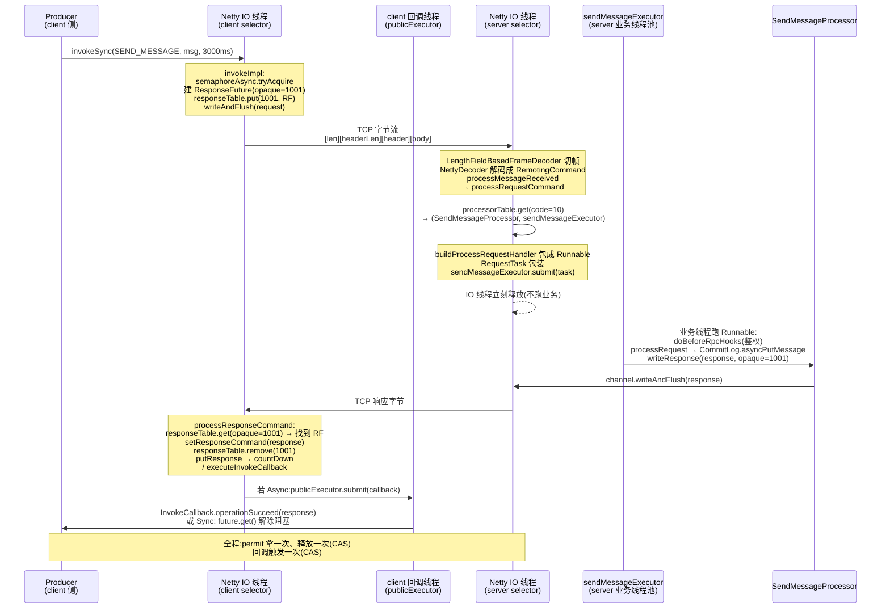

# 第十四章 · Processor 路由、线程池隔离与三种调用语义

> 篇:第 4 篇 · Remoting:协议、Netty、Processor
> 主线呼应:前两章我们一层层往下沉——P4-12 讲了一个 `RemotingCommand` 怎么编成 `[totalLength][headerLength(高 8 位塞 SerializeType)][header][body]` 这串字节,P4-13 讲了 Netty 主从 Reactor 三组线程怎么把这串字节送上 TCP、又怎么把对端的字节流经 `LengthFieldBasedFrameDecoder` 切帧、`NettyDecoder` 还原成 `RemotingCommand`。可字节到了这一步还只是"一个被解出来的命令对象",真正要回答的问题是:**这个命令来了,broker 该让谁处理它?处理它时跑在哪条线程上?发起方又怎么等它的响应?** 这一章就站在 `processMessageReceived` 把命令交出去的那个点上,讲完 `remoting` 模块最后一块拼图——按 `RequestCode` 路由到 `Processor`、每个 `Processor` 配独立线程池做请求隔离、调用方用 `invokeSync`/`invokeAsync`/`invokeOneway` 三种语义等响应或不等响应。这一块是"分布式骨架"上消息可靠流转的执行面:它决定了"一个慢的拉消息请求会不会把心跳饿死、导致消费端被误判下线",也决定了"在途请求会不会因为信号量泄漏而慢慢把内存撑爆"。RocketMQ 用三个朴素的 Java 手艺——一张 `processorTable`、一个 `SemaphoreReleaseOnlyOnce` 的 CAS 一次性释放、一个 `HashedWheelTimer` 的时间轮扫描——把这些收敛得干净利落。

## 核心问题

**`NettyRemotingAbstract` 收到一个解出来的 `RemotingCommand` 后,凭什么能按 `RequestCode` 精确找到对应的 `NettyRequestProcessor`?为什么每个 Processor 都要配一个独立 `ExecutorService`,而不是共享一个全局线程池?发起请求的一方又要怎么表达"我要同步等响应""我异步等回调""我发完就不管"这三种语义,而超时的请求又靠什么扫出来、靠什么保证信号量不被释放两次?**

读完本章你会明白:

1. **路由就是一张 `HashMap`**:`processorTable` 是个普通的 `HashMap<Integer, Pair<NettyRequestProcessor, ExecutorService>>`,key 是 `RequestCode`(10=SEND_MESSAGE、11=PULL_MESSAGE、34=HEART_BEAT...),value 是"Processor + 它专属的线程池"这对儿。`processRequestCommand` 一行 `this.processorTable.get(cmd.getCode())` 就完成了路由——朴素的查表,没有任何反射或框架魔法。查不到就走 `defaultRequestProcessorPair`(默认是 `AdminBrokerProcessor`)。
2. **线程池隔离不是为了性能,是为了"一个慢不拖垮全局"**:`SendMessageProcessor`、`PullMessageProcessor`、心跳、客户端管理、查询、管理后台各配独立的 `ThreadPoolExecutor`,各有各的队列。这样即使拉消息的队列被 10 万条慢请求堆满,Send/Heartbeat 的线程池照样有空间——heartbeat 不被拖死,消费端就不会因为"心跳超时"被误判下线。这是把"故障域"用线程池边界隔开的经典工程实践。
3. **三种调用语义是三种"等不等、怎么等"的取舍**:`invokeOneway`(发完即走,不等响应,用 `semaphoreOneway` 限流) / `invokeAsync`(发出后挂起,响应回来走回调,用 `semaphoreAsync` 限流 + `ResponseFuture` 配对) / `invokeSync`(发出后阻塞当前线程等响应,5.x 内部其实就是 `invokeImpl(...).get(timeout)`)。三种语义共用一套 `invokeImpl` + `ResponseFuture` + `responseTable` 基础设施,差异只在"发起后怎么拿到结果"。
4. **`SemaphoreReleaseOnlyOnce` + `ResponseFuture` 的 CAS 一次性释放,是为了应对"超时回调与正常回调并发"**:一个在途请求可能同时被两条路径回收——正常路径(`processResponseCommand` 收到响应)和超时路径(`scanResponseTable` 发现它超时)。两条路径都可能想"释放信号量 + 触发回调"。如果信号量被释放两次,permit 就泄漏了(permit 多了 = 限流失效);如果回调被触发两次,业务回调就可能重入。RocketMQ 用 `SemaphoreReleaseOnlyOnce.released`(`AtomicBoolean.compareAndSet(false, true)`)保证信号量只释放一次,用 `ResponseFuture.executeCallbackOnlyOnce`(`AtomicBoolean`)保证回调只执行一次——两个 CAS 把"并发回收"收敛成"先到者负责,后到者空跑",sound 得不能再 sound。
5. **`HashedWheelTimer` 凭什么高效扫海量超时**:在途请求(高 QPS 下成千上万)每秒都要被扫一遍看有没有超时,朴素做法(每请求一个 `ScheduledFuture`、或全表 `O(n)` 扫描)在百万级在途请求下爆炸。Netty 的 `HashedWheelTimer` 是个固定 slot 数的时间轮——任务按"到期时刻 mod slot 数"入槽,指针每 tick(默认 100ms)转一格,只检查当前槽里的任务,O(1) 入槽、摊销 O(1) 扫描。RocketMQ 用它每秒触发一次 `scanResponseTable`,即使响应表里有几万条在途请求,这一秒的扫描成本也是常数级。

> **如果一读觉得太难**:先只记住三件事——① 收到一个 `RemotingCommand`,按它的 `RequestCode` 查 `processorTable` 拿到"Processor + 线程池",把请求丢进那个线程池跑;② 每个 Processor 配独立线程池,故障隔离(一个慢不拖垮别的,最关键是不让 heartbeat 被拖死导致误判下线);③ 三种调用语义(Oneway/Async/Sync)共用 `ResponseFuture` + `responseTable`,信号量靠 `SemaphoreReleaseOnlyOnce` 的 CAS 只释放一次、回调靠 `executeCallbackOnlyOnce` 的 CAS 只触发一次,超时靠 `HashedWheelTimer` 每秒扫。这三件先抓住,源码细节可以回头再细看。

---

## 14.1 一句话点破

> **RocketMQ 的 Processor 路由朴素到不能再朴素——一张 `HashMap<Integer, Pair<NettyRequestProcessor, ExecutorService>>`,`processRequestCommand` 一行 `processorTable.get(cmd.getCode())` 就完事。但朴素背后是精心划定的隔离边界:每个 Processor 配一个独立 `ThreadPoolExecutor`,各自有队列、各自有线程,Send / Pull / Heartbeat / ClientManage / Admin 五条互不拖累——一个慢的拉消息请求堆满了 Pull 的队列,Send 照发、Heartbeat 照跳、消费端不会被误判下线。调用方有三种"等响应"的姿势:`invokeOneway`(发完即走)、`invokeAsync`(挂起等回调)、`invokeSync`(阻塞等),共用一套 `ResponseFuture` + `responseTable` + `SemaphoreReleaseOnlyOnce` 的 CAS 一次性释放——应对"正常回收与超时回收并发回收同一个请求"时,信号量不被释放两次、回调不被触发两次。超时扫描交给 Netty 的 `HashedWheelTimer`,一个固定 slot 数的时间轮,每 tick 转一格,海量在途请求的扫描摊销到 O(1)。**

这是结论,不是理由。本章倒过来拆:先看路由为什么就是一张 HashMap,再看为什么要每 Processor 独立线程池,然后看三种调用语义怎么共用一套基础设施,最后看 CAS 一次性释放和时间轮扫描各自怎么做到 sound。

---

## 14.2 路由就是一张 HashMap:processorTable

进入这一章,先把上一章(P4-13)留下的接口接上。Netty 的 pipeline 里,`NettyServerHandler.channelRead0` 收到一个已经切好帧、解好码的 `RemotingCommand`,会调到 `processMessageReceived`([NettyRemotingAbstract.java:202](../rocketmq/remoting/src/main/java/org/apache/rocketmq/remoting/netty/NettyRemotingAbstract.java#L202)):

```java
public void processMessageReceived(ChannelHandlerContext ctx, RemotingCommand msg) {
    if (msg != null) {
        switch (msg.getType()) {
            case REQUEST_COMMAND:
                processRequestCommand(ctx, msg);     // :206  这是请求,走请求路由
                break;
            case RESPONSE_COMMAND:
                processResponseCommand(ctx, msg);    // :209  这是响应,走响应配对
                break;
            default:
                break;
        }
    }
}
```

同一个 channel 上,既会收到对端发来的请求(我要你做事),也会收到对端返回的响应(你之前要我做的那件事的结果)。两者都是 `RemotingCommand`,靠 `msg.getType()` 区分——`REQUEST_COMMAND` 走 `processRequestCommand`(本章前半的戏),`RESPONSE_COMMAND` 走 `processResponseCommand`(本章后半的戏,和 `ResponseFuture` 配对)。

先看请求路由。`processRequestCommand` 的全貌([:342](../rocketmq/remoting/src/main/java/org/apache/rocketmq/remoting/netty/NettyRemotingAbstract.java#L342)):

```java
public void processRequestCommand(final ChannelHandlerContext ctx, final RemotingCommand cmd) {
    final Pair<NettyRequestProcessor, ExecutorService> matched =
        this.processorTable.get(cmd.getCode());                                              // :343  查表
    final Pair<NettyRequestProcessor, ExecutorService> pair =
        null == matched ? this.defaultRequestProcessorPair : matched;                        // :344  没匹配走默认
    final int opaque = cmd.getOpaque();

    if (pair == null) {                                                                       // :347  连默认都没有
        String error = " request type " + cmd.getCode() + " not supported";
        final RemotingCommand response =
            RemotingCommand.createResponseCommand(RemotingSysResponseCode.REQUEST_CODE_NOT_SUPPORTED, error);
        response.setOpaque(opaque);
        this.writeResponse(ctx.channel(), cmd, response, null);
        log.error(RemotingHelper.parseChannelRemoteAddr(ctx.channel()) + error);
        return;
    }

    Runnable run = buildProcessRequestHandler(ctx, cmd, pair, opaque);                        // :357  构造"真正干活的 Runnable"

    if (isShuttingDown.get()) { /* 优雅关停:返回 GO_AWAY */ }

    if (pair.getObject1().rejectRequest()) {                                                  // :370  Processor 自检过载
        final RemotingCommand response = RemotingCommand.createResponseCommand(
            RemotingSysResponseCode.SYSTEM_BUSY, "[REJECTREQUEST]system busy, start flow control for a while");
        response.setOpaque(opaque);
        this.writeResponse(ctx.channel(), cmd, response, null);
        return;
    }

    try {
        final RequestTask requestTask = new RequestTask(run, ctx.channel(), cmd);
        pair.getObject2().submit(requestTask);                                                // :381  丢进 Processor 专属线程池
    } catch (RejectedExecutionException e) {                                                   // :382  队列满,返回 SYSTEM_BUSY
        // ... 每 10 秒打一次 warn,返回 SYSTEM_BUSY 做背压
    } catch (Throwable e) { /* ... metrics */ }
}
```

这段的核心是**前三行**。`processorTable` 是什么?定义在类顶部([:104](../rocketmq/remoting/src/main/java/org/apache/rocketmq/remoting/netty/NettyRemotingAbstract.java#L104)):

```java
protected final HashMap<Integer/* request code */, Pair<NettyRequestProcessor, ExecutorService>> processorTable =
    new HashMap<>(64);
```

就一个 `HashMap`,key 是 `RequestCode`(`int`,P4-12 讲过的 `SEND_MESSAGE=10`、`PULL_MESSAGE=11`、`HEART_BEAT=34` 等),value 是 `Pair<Processor, ExecutorService>`——一对儿"谁处理 + 在哪个线程池上跑"。`processRequestCommand` 一行 `processorTable.get(cmd.getCode())` 完成路由,朴素到不能再朴素。

> **不这样会怎样(关于用 HashMap 而不是某种框架)**:如果用反射(`@RequestCode(10)` 注解 + 扫包)或某种 IOC 容器做路由,每条请求都要做一次注解查找,百万 QPS 下是显著热点;而且路由逻辑被藏进框架,排查问题要翻一堆配置。RocketMQ 把路由做成了字面意义的查表——启动时 `registerProcessor` 把"RequestCode → (Processor, Executor)"塞进 map,运行时一个 `get` 就完事。HashMap 的 `get` 是 O(1)(甚至没有锁,因为注册只在启动时发生一次,运行时只读),没有比这更快的路由方式。代价是加一个 RequestCode 要手写一行 `registerProcessor` 注册——RocketMQ 觉得这个代价值得。

注意两个分支:**没匹配到就走 `defaultRequestProcessorPair`**([:116](../rocketmq/remoting/src/main/java/org/apache/rocketmq/remoting/netty/NettyRemotingAbstract.java#L116)),broker 端默认注册成 `AdminBrokerProcessor`——所有管理类请求(`CREATE_TOPIC`、`GET_BROKER_RUNTIME_INFO`、`UPDATE_BROKER_CONFIG`...)都走它。**连默认都没有就返回 `REQUEST_CODE_NOT_SUPPORTED`**([:347](../rocketmq/remoting/src/main/java/org/apache/rocketmq/remoting/netty/NettyRemotingAbstract.java#L347))——这种情况几乎只在 client 误连了端口、或协议版本不匹配时出现。

`buildProcessRequestHandler` 把"真正干活"包成一个 `Runnable`([:404](../rocketmq/remoting/src/main/java/org/apache/rocketmq/remoting/netty/NettyRemotingAbstract.java#L404)):

```java
private Runnable buildProcessRequestHandler(ChannelHandlerContext ctx, RemotingCommand cmd,
    Pair<NettyRequestProcessor, ExecutorService> pair, int opaque) {
    return () -> {
        Exception exception = null;
        RemotingCommand response;
        String remoteAddr = null;
        try {
            remoteAddr = RemotingHelper.parseChannelRemoteAddr(ctx.channel());
            try {
                doBeforeRpcHooks(remoteAddr, cmd);          // :414  RPC 钩子(鉴权等)
            } catch (AbortProcessException e) { throw e; }
              catch (Exception e) { exception = e; }

            if (this.requestPipeline != null) {
                this.requestPipeline.execute(ctx, cmd);     // :422  请求管线(熔断/限流/审计)
            }

            if (exception == null) {
                response = pair.getObject1().processRequest(ctx, cmd);   // :426  ★真正调 Processor.processRequest★
            } else {
                response = RemotingCommand.createResponseCommand(RemotingSysResponseCode.SYSTEM_ERROR, null);
            }
            // ... doAfterRpcHooks ...
            this.writeResponse(ctx.channel(), cmd, response, null);      // :443  把响应写回去
        } catch (AbortProcessException e) {
            // ... 业务主动 abort(比如鉴权失败),带 ResponseCode 回去
        } catch (Throwable e) {
            // ... 兜底 SYSTEM_ERROR
        }
    };
}
```

这个 `Runnable` 不在 Netty IO 线程上跑——它会被 `pair.getObject2().submit(requestTask)`([:381](../rocketmq/remoting/src/main/java/org/apache/rocketmq/remoting/netty/NettyRemotingAbstract.java#L381))丢进**Processor 专属的那个线程池**(下一节讲)。这就是 P4-13 立下的"业务不在 IO 线程跑"在源码里的兑现:Netty 的 selector 线程只负责 read/decode,解码完拿到 `RemotingCommand` 就调 `processRequestCommand`,而 `processRequestCommand` 里真正干活的 `Runnable`(`doBeforeRpcHooks` → `processRequest` → `writeResponse`)被 submit 到另一个线程池——Netty IO 线程立刻释放去处理下一个连接的 IO。

> **钉死这件事**:RocketMQ 的请求路由,就是一个 `HashMap<Integer, Pair<Processor, ExecutorService>>` 的 `get`。`processRequestCommand` 拿到命令 → 查表 → 把"真正干活"包成 Runnable → submit 到对应线程池。没有反射、没有框架、没有注解扫描,启动时 `registerProcessor` 填表、运行时一个 `get` 完事。Netty IO 线程在 submit 之后立刻返回,绝不在 IO 线程上跑业务。

---

## 14.3 为什么每个 Processor 配独立线程池

理解了路由是查表,下一个、也是本章最关键的"为什么"来了:**为什么 processorTable 的 value 是 `Pair<Processor, ExecutorService>`,而不是 `Pair<Processor, 共享线程池>`?** 给所有 Processor 配同一个全局线程池不更省事吗?

答案就一句话:**把故障域用线程池边界隔开,让一个慢请求拖不死别的请求,尤其拖不死心跳。**

设想朴素的反面:broke 只有一个全局线程池,所有请求(Send / Pull / Heartbeat / Admin)全往这一个池子里 submit。现在某个时刻,大量消费者同时拉消息,`PullMessageProcessor.processRequest` 处理速度跟不上(可能是磁盘 IO 抖动、可能是消费端慢导致位点回退、可能是 ConsumeQueue 被反复扫),Pull 的请求堆在全局队列里。这时:

- **Send 也排不进去**——producer 发消息延迟飙升,业务超时。
- **更致命的:Heartbeat 排不进去**——消费端每 30s 向 broker 发一次心跳,broker 端 `ClientManageProcessor` 处理心跳更新 `brokerLiveTable` 的最后心跳时间。如果心跳处理被 Pull 的请求堵在队列后面排队 60s+,broker 这边看"这个 consumer 已经 90s 没心跳了"——**误判 consumer 下线**,触发 Rebalance,把这个 consumer 分到的 queue 重新分给别人,导致重复消费、位点混乱。一个慢的拉消息请求,连锁反应到消费端被踢出消费组,这是灾难。

把线程池隔离,问题立刻收敛:

```
 请求隔离示意图:每个 Processor 一个独立线程池,各有各的队列

  RequestCode = 11 (PULL_MESSAGE)          RequestCode = 34 (HEART_BEAT)
       │                                          │
       ▼                                          ▼
  ┌─────────────────────┐                   ┌─────────────────────┐
  │ pullMessageExecutor │                   │ heartbeatExecutor   │
  │  16 + 2*CPU 线程     │                   │  min(32, CPU) 线程   │
  │  queue = 100000     │                   │  queue = 50000      │
  │  Pull 队列堆满       │                   │  ★独立★ 照常处理     │
  │  → 只影响 Pull      │                   │  → 心跳不被拖死      │
  └─────────────────────┘                   │  → consumer 不误判   │
                                            └─────────────────────┘
  RequestCode = 10 (SEND_MESSAGE)           RequestCode = ???? (默认)
       │                                          │
       ▼                                          ▼
  ┌─────────────────────┐                   ┌─────────────────────┐
  │ sendMessageExecutor │                   │ adminBrokerExecutor │
  │  min(4, CPU) 线程    │                   │  16 线程             │
  │  queue = 10000      │                   │  queue = 10000      │
  │  Send 照发           │                   │  Admin (建 topic/   │
  │                     │                   │  查 runtime info)   │
  └─────────────────────┘                   └─────────────────────┘
```

每条线互不干扰。Pull 队列堆满,只影响 Pull 自己——Send 还能写、Heartbeat 还能跳、Admin 还能管。这就是线程池隔离的全部价值。

落到源码,broker 端 `BrokerController.initializeResources()` 给每个 Processor 各建一个独立线程池([BrokerController.java:562](../rocketmq/broker/src/main/java/org/apache/rocketmq/broker/BrokerController.java#L562)):

```java
protected void initializeResources() {
    // ...
    this.sendMessageExecutor = ThreadUtils.newThreadPoolExecutor(
        this.brokerConfig.getSendMessageThreadPoolNums(),                              // corePoolSize
        this.brokerConfig.getSendMessageThreadPoolNums(),                              // maxPoolSize (= core)
        1000 * 60, TimeUnit.MILLISECONDS,                                              // keepAlive
        this.sendThreadPoolQueue,                                                       // :571  各自的队列
        new ThreadFactoryImpl("SendMessageThread_", getBrokerIdentity()));

    this.pullMessageExecutor = ThreadUtils.newThreadPoolExecutor(
        this.brokerConfig.getPullMessageThreadPoolNums(),
        this.brokerConfig.getPullMessageThreadPoolNums(),
        1000 * 60, TimeUnit.MILLISECONDS,
        this.pullThreadPoolQueue,                                                       // :579  Pull 自己的队列
        new ThreadFactoryImpl("PullMessageThread_", getBrokerIdentity()));

    // ... 同样为 queryMessageExecutor / adminBrokerExecutor / clientManageExecutor /
    //     heartbeatExecutor / consumerManageExecutor / replyMessageExecutor / ackMessageExecutor
    //     各建一个独立 ThreadPoolExecutor,各有各的队列
}
```

默认线程数和队列容量在 `BrokerConfig`([BrokerConfig.java:61](../rocketmq/common/src/main/java/org/apache/rocketmq/common/BrokerConfig.java#L61) 等),这些数字是 RocketMQ 多年线上调优的产物,值得单独看一下:

```
 各 Processor 线程池的默认配置(BrokerConfig.java)

 Processor 类                     线程数                              队列容量              位置
 ─────────────────────────────────────────────────────────────────────────────────────────────
 SendMessageProcessor             min(4, CPU)                         10000                :69 / :103
 PullMessageProcessor             16 + 2*CPU                          100000               :71 / :105
 HeartbeatProcessor               min(32, CPU)                        50000                :81 / :112
 ClientManageProcessor            32                                  1000000              :78 / :110
 ConsumerManageProcessor          32                                  (同 client 队列)     :79
 QueryMessageProcessor            8 + CPU                             (同 client 队列)     :75
 AdminBrokerProcessor(默认)        16                                  10000                :77 / :114
```

几个值得品的设计:

- **SendMessage 线程数 `min(4, CPU)` 故意很小**。发消息的瓶颈不在 CPU 而在磁盘(CommitLog 顺序写 + 锁),线程开多了反而争抢 `putMessageLock`、增加上下文切换,所以默认 4 个,够用。这是和 CommitLog 全局串行追加(P1-03 讲的 `putMessageLock`)配套的设计——既然写注定串行,处理线程多也没用。
- **PullMessage 线程数 `16 + 2*CPU` 给得最阔**。因为拉消息是读路径,消费端可能成千上万,且每次 pull 可能要回 CommitLog 取消息体(随机读),需要足够并发把磁盘 IO 打满。
- **Heartbeat 线程数 `min(32, CPU)`**。心跳处理极轻(就是更新一个时间戳),线程数不用太多,但队列容量 50000 要够大——扛住突发心跳风暴。
- **ClientManage 队列 `1000000`(一百万)**。客户端注册/注销/订阅关系更新走这里,这些操作不频繁但绝不能被拒,所以队列给到夸张的一百万,基本相当于"不丢"。

`registerProcessor()` 把这些 Processor 和它们的线程池一一配对,塞进 `processorTable`([BrokerController.java:1161](../rocketmq/broker/src/main/java/org/apache/rocketmq/broker/BrokerController.java#L1161)):

```java
public void registerProcessor() {
    RemotingServer remotingServer = remotingServerMap.get(TCP_REMOTING_SERVER);
    RemotingServer fastRemotingServer = remotingServerMap.get(FAST_REMOTING_SERVER);

    // SendMessageProcessor:SEND_MESSAGE / SEND_MESSAGE_V2 / SEND_BATCH_MESSAGE / CONSUMER_SEND_MSG_BACK / RECALL_MESSAGE
    sendMessageProcessor.registerSendMessageHook(sendMessageHookList);
    sendMessageProcessor.registerConsumeMessageHook(consumeMessageHookList);
    remotingServer.registerProcessor(RequestCode.SEND_MESSAGE, sendMessageProcessor, this.sendMessageExecutor);          // :1171
    remotingServer.registerProcessor(RequestCode.SEND_MESSAGE_V2, sendMessageProcessor, this.sendMessageExecutor);      // :1172
    remotingServer.registerProcessor(RequestCode.SEND_BATCH_MESSAGE, sendMessageProcessor, this.sendMessageExecutor);   // :1173
    remotingServer.registerProcessor(RequestCode.CONSUMER_SEND_MSG_BACK, sendMessageProcessor, this.sendMessageExecutor);
    fastRemotingServer.registerProcessor(RequestCode.SEND_MESSAGE, sendMessageProcessor, this.sendMessageExecutor);     // 同时注册到 fastRemotingServer
    // ...

    // PullMessageProcessor:PULL_MESSAGE / LITE_PULL_MESSAGE
    remotingServer.registerProcessor(RequestCode.PULL_MESSAGE, this.pullMessageProcessor, this.pullMessageExecutor);    // :1184
    // ... PEEK / POP / NOTIFICATION 也复用 pullMessageExecutor

    // HeartbeatProcessor(ClientManageProcessor 处理 HEART_BEAT)
    remotingServer.registerProcessor(RequestCode.HEART_BEAT, clientManageProcessor, this.heartbeatExecutor);             // :1244

    // ClientManageProcessor:UNREGISTER_CLIENT / CHECK_CLIENT_CONFIG
    remotingServer.registerProcessor(RequestCode.UNREGISTER_CLIENT, clientManageProcessor, this.clientManageExecutor);   // :1245

    // ConsumerManageProcessor:GET_CONSUMER_LIST_BY_GROUP / UPDATE_CONSUMER_OFFSET / QUERY_CONSUMER_OFFSET
    // QueryMessageProcessor / QueryAssignmentProcessor / EndTransactionProcessor ...

    // 默认 Processor(没匹配到的都走它)
    AdminBrokerProcessor adminProcessor = new AdminBrokerProcessor(this);
    remotingServer.registerDefaultProcessor(adminProcessor, this.adminBrokerExecutor);                                   // :1301
    fastRemotingServer.registerDefaultProcessor(adminProcessor, this.adminBrokerExecutor);
}
```

注意几个工程细节:

1. **多个 RequestCode 共享同一个 Processor + 同一个线程池**。比如 `SEND_MESSAGE` / `SEND_MESSAGE_V2` / `SEND_BATCH_MESSAGE` / `CONSUMER_SEND_MSG_BACK` / `RECALL_MESSAGE` 五个 code 都路由到 `sendMessageProcessor` + `sendMessageExecutor`。它们语义相近(都是写消息相关),共享一个线程池合理。
2. **同一个 Processor 可以为不同的 code 配不同的线程池**。比如 `PullMessageProcessor` 处理 `PULL_MESSAGE` 用 `pullMessageExecutor`,处理 `LITE_PULL_MESSAGE` 用 `litePullMessageExecutor`([:1184-1185](../rocketmq/broker/src/main/java/org/apache/rocketmq/broker/BrokerController.java#L1184))——把 LitePull(主动 pull 模式)和经典 Pull(长轮询)的流量再隔一层。
3. **remotingServer 和 fastRemotingServer 各注册一遍**。RocketMQ broker 同时开两个 remoting server(主 server 和 fastRemotingServer,fastRemotingServer 用于 VIP 通道,端口 = 主端口 - 2),两者各自有独立的 `processorTable`,所以注册要写两遍。这也是为什么 `registerProcessor` 里每个 code 出现两次。
4. **`registerProcessor` 的实现**([NettyRemotingServer.java:361](../rocketmq/remoting/src/main/java/org/apache/rocketmq/remoting/netty/NettyRemotingServer.java#L361))就是一行 `this.processorTable.put(requestCode, new Pair<>(processor, executorThis))`——配对塞进 HashMap。

> **钉死这件事**:每个 Processor 配独立线程池,核心动机是**故障隔离**——一个慢的请求(最典型是慢的 Pull)堆满自己的队列,Send / Heartbeat / Admin 的线程池照常工作。最关键的护城河是**心跳不被拖死**:Heartbeat 走 `heartbeatExecutor`,和 Pull 的 `pullMessageExecutor` 物理隔离,即使 Pull 队列爆了,消费端心跳照常被 broker 收到、`brokerLiveTable` 的最后心跳时间照常更新,消费端不会被误判下线、不会触发不必要的 Rebalance。这是"用线程池边界切分故障域"的经典实践。

---

## 14.4 三种调用语义:Oneway / Async / Sync

讲完服务端路由,转头看调用方(producer / consumer / broker 作为 client 调别的节点时)。RocketMQ 的 RPC 有三种"发起后怎么等结果"的姿势,对应三个方法:`invokeOnewayImpl`、`invokeAsyncImpl`、`invokeSyncImpl`。三者的核心差异在于**"发出去之后,调用方线程要不要等、怎么等"**。

```
 三种调用语义对比

 invokeOneway(发完即走):
   调用方 ──writeAndFlush──> 对端
   调用方不等响应,立刻干别的。对端处理完也不返回(请求里标了 onewayRPC)。
   用 semaphoreOneway 限流(防在途请求爆炸)。
   场景:心跳、位点上报、日志——丢了不致命,只求快。

 invokeAsync(异步回调):
   调用方 ──writeAndFlush──> 对端
   调用方不等,继续干别的。
   对端 ──响应──> 调用方
   响应回来,触发 InvokeCallback(operationSucceed/operationFail)。
   用 semaphoreAsync 限流 + ResponseFuture 配对 + responseTable 缓存在途请求。
   场景:大多数业务调用(producer 发消息的回调、consumer 拉消息的回调)。

 invokeSync(同步阻塞):
   调用方 ──writeAndFlush──> 对端
   调用方阻塞,等响应。
   对端 ──响应──> 调用方
   响应回来,阻塞解除,拿到 response。
   5.x 内部实现:invokeImpl(...).thenApply(...).get(timeoutMillis)
              —— 用 CompletableFuture.get 阻塞当前线程。
   场景:必须同步拿结果的(注册 broker 拿路由、查询位点)。
```

### 14.4.1 invokeOneway:发完即走

最简单的是 Oneway。调用方完全不在乎对端处理结果,发完就完事([:727](../rocketmq/remoting/src/main/java/org/apache/rocketmq/remoting/netty/NettyRemotingAbstract.java#L727)):

```java
public void invokeOnewayImpl(final Channel channel, final RemotingCommand request, final long timeoutMillis)
    throws InterruptedException, RemotingTooMuchRequestException, RemotingTimeoutException, RemotingSendRequestException {
    request.markOnewayRPC();                                                                   // :729  标记 oneway(对端看到这个标志就不回响应)
    boolean acquired = this.semaphoreOneway.tryAcquire(timeoutMillis, TimeUnit.MILLISECONDS);  // :730  信号量限流
    if (acquired) {
        final SemaphoreReleaseOnlyOnce once = new SemaphoreReleaseOnlyOnce(this.semaphoreOneway);  // :732
        try {
            channel.writeAndFlush(request).addListener((ChannelFutureListener) f -> {
                once.release();                                                                // :735  发完(无论成败)立刻释放信号量
                if (!f.isSuccess()) {
                    log.warn("send a request command to channel <" + channel.remoteAddress() + "> failed.");
                }
            });
        } catch (Exception e) {
            once.release();                                                                    // :741  异常也要释放
            throw new RemotingSendRequestException(...);
        }
    } else {
        // ... 信号量拿不到:抛 TooMuchRequest 或 Timeout
    }
}
```

Oneway 的关键:**不需要 `ResponseFuture`,不需要 `responseTable`,不需要等响应**。`request.markOnewayRPC()` 在请求标志位上打个标,对端 `writeResponse` 时看到这个标就直接 return(`request.isOnewayRPC()` 为 true 时 [:247](../rocketmq/remoting/src/main/java/org/apache/rocketmq/remoting/netty/NettyRemotingAbstract.java#L247) 的 `if (request.isOnewayRPC()) { ... return; }`)。

那为什么还要信号量 `semaphoreOneway`?因为**虽然不等响应,但 writeAndFlush 是异步的——请求字节进 Netty 的发送缓冲区,真正送上网卡要一点时间**。如果调用方无限快地调 `invokeOneway`,Netty 发送队列里堆的字节会撑爆内存。信号量把"在途的 oneway 请求"限制在 `semaphoreOneway` 个(默认 server 端 256、client 端 65535,见 [:30-31 NettyServerConfig](../rocketmq/remoting/src/main/java/org/apache/rocketmq/remoting/netty/NettyServerConfig.java#L30))。每个请求 write 完(成功或失败,`addListener` 回调里)就 `once.release()` 还回去一个 permit。这就是信号量在 Oneway 里的全部角色:**保护内存,不让在途请求无限堆积**。

### 14.4.2 invokeAsync:挂起等回调

Async 比 Oneway 复杂——要等对端响应,但调用方线程不等,响应回来后由 IO 线程触发回调。这是 5.x 重构后基于 `CompletableFuture` 的实现([:677](../rocketmq/remoting/src/main/java/org/apache/rocketmq/remoting/netty/NettyRemotingAbstract.java#L677)):

```java
public void invokeAsyncImpl(final Channel channel, final RemotingCommand request, final long timeoutMillis,
    final InvokeCallback invokeCallback) {
    invokeImpl(channel, request, timeoutMillis)                         // :679  共用底层 invokeImpl
        .whenComplete((v, t) -> {
            if (t == null) {
                invokeCallback.operationComplete(v);                    // :682  正常完成
            } else {
                ResponseFuture responseFuture = new ResponseFuture(channel, request.getOpaque(), request, timeoutMillis, null, null);
                responseFuture.setCause(t);
                invokeCallback.operationComplete(responseFuture);       // :686  异常也回调
            }
        })
        .thenAccept(responseFuture -> invokeCallback.operationSucceed(responseFuture.getResponseCommand()))  // :689  成功回调
        .exceptionally(t -> {
            invokeCallback.operationFail(ExceptionUtils.getRealException(t));   // :691  失败回调
            return null;
        });
}
```

真正的核心在 `invokeImpl` → `invoke0`([:596](../rocketmq/remoting/src/main/java/org/apache/rocketmq/remoting/netty/NettyRemotingAbstract.java#L596)):

```java
protected CompletableFuture<ResponseFuture> invoke0(final Channel channel, final RemotingCommand request,
    final long timeoutMillis) {
    CompletableFuture<ResponseFuture> future = new CompletableFuture<>();
    long beginStartTime = System.currentTimeMillis();
    final int opaque = request.getOpaque();                            // :605  请求唯一 id

    boolean acquired;
    try {
        acquired = this.semaphoreAsync.tryAcquire(timeoutMillis, TimeUnit.MILLISECONDS);   // :609  异步信号量限流
    } catch (Throwable t) {
        future.completeExceptionally(t);
        return future;
    }
    if (acquired) {
        final SemaphoreReleaseOnlyOnce once = new SemaphoreReleaseOnlyOnce(this.semaphoreAsync);  // :615
        long costTime = System.currentTimeMillis() - beginStartTime;
        if (timeoutMillis < costTime) {                                // :617  光拿信号量就超时了,提前 fail
            once.release();
            future.completeExceptionally(new RemotingTimeoutException("invokeAsyncImpl call timeout"));
            return future;
        }

        AtomicReference<ResponseFuture> responseFutureReference = new AtomicReference<>();
        final ResponseFuture responseFuture = new ResponseFuture(channel, opaque, request, timeoutMillis - costTime,
            new InvokeCallback() {                                     // :624  内嵌的 callback,接到响应时 complete future
                @Override public void operationComplete(ResponseFuture responseFuture) { }
                @Override public void operationSucceed(RemotingCommand response) {
                    future.complete(responseFutureReference.get());    // :633  收到响应 → 解 future
                }
                @Override public void operationFail(Throwable throwable) {
                    future.completeExceptionally(throwable);           // :637  失败 → 异常 complete
                }
            }, once);
        responseFutureReference.set(responseFuture);
        this.responseTable.put(opaque, responseFuture);                // :642  ★把在途请求塞进 responseTable★

        try {
            channel.writeAndFlush(request).addListener((ChannelFutureListener) f -> {  // :644  发出去
                if (f.isSuccess()) {
                    responseFuture.setSendRequestOK(true);
                    return;
                }
                requestFail(opaque);                                   // :649  发送失败 → 主动失败
            });
            return future;
        } catch (Exception e) {
            responseTable.remove(opaque);
            responseFuture.release();                                  // :655  异常要释放信号量
            future.completeExceptionally(new RemotingSendRequestException(...));
            return future;
        }
    } else {
        // ... 信号量拿不到,completeExceptionally
    }
}
```

几个关键点串起来:

1. **`opaque` 是请求的唯一 id**。每个请求在创建时分配一个全局自增的 `opaque`(`requestId.getAndIncrement()`,P4-12 提到过),响应里原样回填。这就是配对的钥匙——`responseTable` 用 `opaque` 作 key 缓存在途请求,响应回来靠 `opaque` 找回对应的 `ResponseFuture`。
2. **`semaphoreAsync` 限流**。Async 也用信号量限制在途请求数(默认 server 端 64、client 端 65535),原理同 Oneway——保护内存,不让在途请求无限堆积。注意 Async 的 permit 是**收到响应或超时**时才释放,生命周期比 Oneway 长。
3. **`responseTable.put(opaque, responseFuture)`**。这是在途请求表的入口。每个发出但还没收到响应的 Async 请求,都在 `responseTable` 里占一个坑。响应回来时,`processResponseCommand` 靠 `opaque` 把它捞出来。
4. **`SemaphoreReleaseOnlyOnce once` 包在 `ResponseFuture` 里**。permit 不直接放 `semaphoreAsync`,而是包成一个"只释放一次"的对象塞进 `ResponseFuture`。下一节讲为什么这样设计。

响应回来的处理在 `processResponseCommand`([:468](../rocketmq/remoting/src/main/java/org/apache/rocketmq/remoting/netty/NettyRemotingAbstract.java#L468)):

```java
public void processResponseCommand(ChannelHandlerContext ctx, RemotingCommand cmd) {
    final int opaque = cmd.getOpaque();
    final ResponseFuture responseFuture = responseTable.get(opaque);                  // :470  ★靠 opaque 配对★
    if (responseFuture != null) {
        responseFuture.setResponseCommand(cmd);                                       // :472  把响应塞进 future
        responseTable.remove(opaque);                                                 // :474  摘出在途表

        if (responseFuture.getInvokeCallback() != null) {
            executeInvokeCallback(responseFuture);                                    // :477  Async 路径:走回调
        } else {
            responseFuture.putResponse(cmd);                                          // :479  Sync 路径:countDown 解除阻塞
            responseFuture.release();                                                 // :480  释放信号量
        }
    } else {
        log.warn("receive response, cmd={}, but not matched any request, ...");        // :483  超时已扫走 / 已处理
    }
}
```

响应回来,`responseTable.get(opaque)` 配对——找到当初发出的那个 `ResponseFuture`,把响应塞进去,然后**有 callback 走 callback(Async)、没 callback 走 `putResponse` 解除 Sync 阻塞**。两条路径殊途同归,最后都要 `responseFuture.release()` 把信号量还回去。

### 14.4.3 invokeSync:阻塞等响应

Sync 最直观——调用方线程发完请求就阻塞,直到响应回来或超时。5.x 里它的实现极其简洁,直接复用 `invokeImpl`([:583](../rocketmq/remoting/src/main/java/org/apache/rocketmq/remoting/netty/NettyRemotingAbstract.java#L583)):

```java
public RemotingCommand invokeSyncImpl(final Channel channel, final RemotingCommand request,
    final long timeoutMillis)
    throws InterruptedException, RemotingSendRequestException, RemotingTimeoutException {
    try {
        return invokeImpl(channel, request, timeoutMillis)                            // :587  复用 Async 的底层
            .thenApply(ResponseFuture::getResponseCommand)                            // :588  future → responseCommand
            .get(timeoutMillis, TimeUnit.MILLISECONDS);                               // :589  ★阻塞当前线程★
    } catch (ExecutionException e) {
        throw new RemotingSendRequestException(channel.remoteAddress().toString(), e.getCause());
    } catch (TimeoutException e) {
        throw new RemotingTimeoutException(channel.remoteAddress().toString(), timeoutMillis, e.getCause());
    }
}
```

注意这里有个**老资料常翻车的点**:很多 RocketMQ 4.x 的资料(包括本书总纲早期草稿)讲 Sync 时说"用 `ResponseFuture.waitResponse()` 上的 `CountDownLatch.await()` 阻塞"。这个说法在 4.x 是对的,但 **5.x master(`b5bc1ff5`)已经把 Sync 重构成了基于 `CompletableFuture.get(timeout)` 的实现**——`invokeSyncImpl` 调 `invokeImpl(...).thenApply(...).get(timeoutMillis)`,阻塞的是 `CompletableFuture.get`,不是 `CountDownLatch.await`。

但 `ResponseFuture` 里**还留着 `CountDownLatch`**([ResponseFuture.java:37](../rocketmq/remoting/src/main/java/org/apache/rocketmq/remoting/netty/ResponseFuture.java#L37)),为什么?因为 `processResponseCommand` 里 Sync 路径走的是 `else` 分支 `responseFuture.putResponse(cmd)`([:479](../rocketmq/remoting/src/main/java/org/apache/rocketmq/remoting/netty/NettyRemotingAbstract.java#L479)),而 `putResponse` 内部 `this.countDownLatch.countDown()`([ResponseFuture.java:103-106](../rocketmq/remoting/src/main/java/org/apache/rocketmq/remoting/netty/ResponseFuture.java#L103))——也就是说,`ResponseFuture` 的 `CountDownLatch` 在 5.x 里**仍被 `processResponseCommand` 触发**,只是上层 `invokeSyncImpl` 不再直接 `await` 它,而是 `await` 一个由 callback `operationSucceed` complete 的 `CompletableFuture`。这是 5.x 渐进重构留下的痕迹,理解时要把"4.x 的 CountDownLatch 路径"和"5.x 的 CompletableFuture 路径"分清楚——读者抓源码时别被这个不一致绊倒。

> **钉死这件事**:三种调用语义共用一套 `invokeImpl` + `ResponseFuture` + `responseTable` 基础设施,差异只在"发起后怎么拿结果":Oneway 完全不等(write 完即 release 信号量);Async 挂起、响应回来走 `InvokeCallback`;Sync 阻塞当前线程(`CompletableFuture.get(timeout)`,5.x 重构后不再是直接 `CountDownLatch.await`,但 `ResponseFuture` 内部仍保留 `CountDownLatch` 供 `processResponseCommand` 的 Sync 分支 countDown)。三者都用信号量限流(`semaphoreOneway` / `semaphoreAsync`),保护内存不被在途请求撑爆。

---

## 14.5 responseTable:在途请求表

讲完三种调用,把"在途请求"那张表单独拎出来——它是这整套异步机制的枢纽。

`responseTable` 定义在 `NettyRemotingAbstract` 顶部([:97](../rocketmq/remoting/src/main/java/org/apache/rocketmq/remoting/netty/NettyRemotingAbstract.java#L97)):

```java
protected final ConcurrentMap<Integer /* opaque */, ResponseFuture> responseTable =
    new ConcurrentHashMap<>(256);
```

一个 `ConcurrentHashMap`,key 是 `opaque`(请求 id),value 是 `ResponseFuture`。每个发出但还没收到响应的 Async/Sync 请求,都在这张表里占一个坑。

```
 responseTable:client 端在途请求的生命周期

   invokeImpl 发出请求
        │
        ├─ responseTable.put(opaque=1001, ResponseFuture{once, callback, ...})  ← 入表
        ├─ channel.writeAndFlush(request)
        │
        ▼
   ┌─────────────────────────────────────────────────────────┐
   │  responseTable (ConcurrentHashMap)                       │
   │  ┌──────────┬───────────────────────────────────────┐  │
   │  │ opaque   │ ResponseFuture                         │  │
   │  ├──────────┼───────────────────────────────────────┤  │
   │  │ 1001     │ {once_1, callback_1, timeout=3000}    │  │ ← 在途
   │  │ 1002     │ {once_2, callback_2, timeout=3000}    │  │ ← 在途
   │  │ 1003     │ {once_3, null(Sync), timeout=5000}    │  │ ← 在途(Sync)
   │  │ ...      │ ...                                    │  │
   │  └──────────┴───────────────────────────────────────┘  │
   └─────────────────────────────────────────────────────────┘
        │                                              │
        │ 响应回来                                       │ 超时(scanResponseTable)
        ▼                                              ▼
   processResponseCommand:                          scanResponseTable:
   get(opaque=1001) → 找到                          遍历,发现 (beginTimestamp
   setResponseCommand(cmd)                           + timeoutMillis + 1000) <= now
   responseTable.remove(opaque)                     rep.release() + it.remove()
   executeInvokeCallback / putResponse              executeInvokeCallback(rf)
        │                                              │
        ▼                                              ▼
   两条路径都会 rep.release() 释放信号量              ★两条路径可能并发★ → CAS 保证只释放一次
```

为什么是 `ConcurrentHashMap` 而不是普通 `HashMap`?因为这张表被**多个线程并发读写**:发起请求的线程(producer 业务线程、broker 心跳线程)put,Netty IO 线程(收到响应时)get + remove,`scanResponseTable` 的 TimerTask 线程遍历 + remove。三条线程并发出入同一张表,必须线程安全。CHM 的分段/ CAS 写让并发 put/get 不阻塞,是高 QPS 下在途表的关键。

> **不这样会怎样**:如果用普通 `HashMap`,多线程并发 put 在 JDK8 里可能死循环(链表成环,JDK7 的经典翻车)、在 JDK9+ 里虽然不死循环但会丢更新(并发 put 覆盖)。如果用 `Collections.synchronizedMap` 或 `Hashtable`,每次 put/get 都锁整张表,百万 QPS 下在途表的锁竞争会成为显著热点。CHM 在并发度上调到 256(`new ConcurrentHashMap<>(256)`),让不同 opaque slot 的请求几乎不撞锁。

为什么 key 用 `opaque` 而不是 channel?因为**同一个 channel 上有大量并发请求**——producer 一条长连接可能同时有几百个发消息请求在途,每条请求的 `opaque` 不同,响应靠 `opaque` 精确配对。如果用 channel 当 key,只能存"这条 channel 上最近一个请求",完全无法并发。

`responseTable` 还有两个专门的清理路径:**`requestFail`**——发送失败时主动摘表并失败回调([:696](../rocketmq/remoting/src/main/java/org/apache/rocketmq/remoting/netty/NettyRemotingAbstract.java#L696));**`failFast`**——channel 关闭时,把这条 channel 上所有在途请求一次性全部失败([:716](../rocketmq/remoting/src/main/java/org/apache/rocketmq/remoting/netty/NettyRemotingAbstract.java#L716)):

```java
protected void failFast(final Channel channel) {
    for (Entry<Integer, ResponseFuture> entry : responseTable.entrySet()) {
        if (entry.getValue().getChannel() == channel) {
            Integer opaque = entry.getKey();
            if (opaque != null) {
                requestFail(opaque);                          // :721  遍历把这条 channel 上的请求全失败
            }
        }
    }
}
```

channel 一关,挂在上面的所有在途请求永远等不到响应了,必须主动失败释放信号量、释放回调。否则信号量 permit 永远拿不回来,限流越来越紧、最终所有新请求都拿不到 permit。

> **钉死这件事**:`responseTable` 是个 `ConcurrentHashMap<opaque, ResponseFuture>`,把每个发出但没收到响应的请求缓存起来。请求靠 `opaque` 配对——同一 channel 上可以有大量并发请求,各用各的 opaque。CHM 让多线程(发起线程、IO 线程、TimerTask)并发读写不阻塞。channel 关闭时 `failFast` 把这条 channel 上所有在途请求一次性失败,防止 permit 泄漏。

---

## 14.6 技巧精解:CAS 一次性释放 + HashedWheelTimer 超时扫描

这一节把本章最硬核的两个技巧单独拆透:**`SemaphoreReleaseOnlyOnce` 的 CAS 一次性释放** 和 **`HashedWheelTimer` 的时间轮超时扫描**。

### 技巧一:SemaphoreReleaseOnlyOnce——凭什么信号量只释放一次

回想 14.4 的 `invokeImpl`:每发一个 Async/Sync 请求,从 `semaphoreAsync` 拿一个 permit,把 permit 包成 `SemaphoreReleaseOnlyOnce` 塞进 `ResponseFuture`。这个 permit 最终要还回去——但**有几条路径都可能触发"还 permit"**:

1. **正常路径**:响应回来,`processResponseCommand` → `executeInvokeCallback` → `responseFuture.release()`(间接调 `once.release()`)。
2. **超时路径**:`scanResponseTable` 发现请求超时,`rep.release()`([:567](../rocketmq/remoting/src/main/java/org/apache/rocketmq/remoting/netty/NettyRemotingAbstract.java#L567))+ `it.remove()` + 后续 `executeInvokeCallback(rf)`(里面又 `release()`)。
3. **发送失败路径**:`requestFail` → `executeInvokeCallback` → `release()`。
4. **channel 关闭路径**:`failFast` → `requestFail` → `executeInvokeCallback` → `release()`。
5. **invoke0 内部异常路径**:`responseFuture.release()`([:655](../rocketmq/remoting/src/main/java/org/apache/rocketmq/remoting/netty/NettyRemotingAbstract.java#L655))。

更糟的是,**正常路径和超时路径可能并发**——一个请求已经超时,`scanResponseTable` 正在处理它,这时对端的响应恰好到了,IO 线程跑 `processResponseCommand`。两个线程同时想 release 同一个 permit、同时想触发同一个 callback。

如果 `release()` 是朴素的 `semaphore.release()`,permit 就会被释放**两次**——信号量里的 permit 数会超过初始值,限流彻底失效。更糟的是,业务 callback 可能被触发两次,产生重入 bug(比如 producer 的发送回调里如果做了"消息发成功 → 推进业务状态机",被触发两次状态就乱了)。

RocketMQ 的解法是 `SemaphoreReleaseOnlyOnce`([SemaphoreReleaseOnlyOnce.java:22](../rocketmq/remoting/src/main/java/org/apache/rocketmq/remoting/common/SemaphoreReleaseOnlyOnce.java#L22))——**整个类只有这一个核心方法**:

```java
public class SemaphoreReleaseOnlyOnce {
    private final AtomicBoolean released = new AtomicBoolean(false);    // :23  状态位
    private final Semaphore semaphore;

    public SemaphoreReleaseOnlyOnce(Semaphore semaphore) {
        this.semaphore = semaphore;
    }

    public void release() {
        if (this.semaphore != null) {
            if (this.released.compareAndSet(false, true)) {             // :32  ★CAS:只有第一个调用者能成功★
                this.semaphore.release();                                // :33  真正 release 只发生一次
            }
        }
    }
    // ...
}
```

`released` 是个 `AtomicBoolean`,初值 `false`。`release()` 用 `compareAndSet(false, true)`——**只有第一个调用者**能把 `released` 从 false 改成 true(返回 true),才执行真正的 `semaphore.release()`。后续任何调用者再来,`compareAndSet` 返回 false(CAS 失败),什么都不做。

这下并发回收的语义就清晰了:

- 正常路径和超时路径并发调 `once.release()`,只有一个 `compareAndSet` 成功——permit 只被还回去一次。
- 调用顺序无关:先到者负责释放,后到者空跑。sound。

光防住 permit 还不够,回调还得防重入。`ResponseFuture` 里有第二个 CAS:

```java
// ResponseFuture.java
private final AtomicBoolean executeCallbackOnlyOnce = new AtomicBoolean(false);     // :41

public void executeInvokeCallback() {
    if (invokeCallback != null) {
        if (this.executeCallbackOnlyOnce.compareAndSet(false, true)) {              // :64  ★回调只触发一次★
            RemotingCommand response = getResponseCommand();
            if (response != null) {
                invokeCallback.operationSucceed(response);
            } else {
                // ... 根据 sendRequestOK / isTimeout 分别 fail
            }
            invokeCallback.operationComplete(this);
        }
    }
}
```

完全对称的设计:用 `executeCallbackOnlyOnce` 的 CAS 保证业务回调 `operationSucceed` / `operationFail` / `operationComplete` 只被触发一次。无论多少条路径并发调 `executeInvokeCallback`,只有一个能成功。

> **为什么 sound(关于这两个 CAS 的配合)**:
>
> - **permit 不泄漏**:`SemaphoreReleaseOnlyOnce.released` CAS 保证 `semaphore.release()` 恰好一次。permit 数永远守恒——拿一个、还一个,不会因为并发回收而多还、导致限流失效。
> - **回调不重入**:`ResponseFuture.executeCallbackOnlyOnce` CAS 保证业务回调恰好一次。不会因为并发回收而把"发成功"的回调触发两次。
> - **两者解耦**:permit 释放和回调触发是两件事,各自独立 CAS。即使某条路径只触发了 permit 释放(scanResponseTable 的 `rep.release()`)、另一条路径触发了回调(processResponseCommand 的 `executeInvokeCallback`),两者都不会重复。

> **反面对比(朴素地写会撞什么墙)**:如果不用 CAS、直接 `semaphore.release()`,并发回收会让 permit 数无限增长——初始 `semaphoreAsync=64`,跑一会儿就变成几百,限流彻底形同虚设。更可怕的是,permit 增长本身不报错(不抛异常),问题只在"为什么内存里堆了这么多在途请求"暴露出来时才被发现,排查极困难。回调不防重入更直接——producer 的发送回调被触发两次,业务状态机错乱。两个 CAS 是这套异步机制在并发回收下保持 sound 的全部秘密。

### 技巧二:HashedWheelTimer——凭什么高效扫海量超时

每个 Async/Sync 请求都有超时(`timeoutMillis`)。在途请求表 `responseTable` 里,高 QPS 下可能同时躺着几万条在途请求。怎么知道哪些超时了?

朴素方案一:**每发一个请求,起一个 `ScheduledFuture`,到点检查**。百万 QPS 下,这意味着百万个 ScheduledFuture,每个都是 `DelayQueue` 里一个节点——`DelayQueue` 是基于优先队列的,入队出队都是 O(log n),百万级节点下调度开销巨大,而且每个请求都分配一个 ScheduledFuture 对象,GC 压力爆炸。

朴素方案二:**每秒全表扫描 `responseTable`,逐条检查 `isTimeout()`**。CHM 的 entrySet 遍历是 O(n),n = 几万时,每秒扫一遍要几万次比较,虽然不至于爆炸但也是显著 CPU。

RocketMQ 用的是 Netty 自带的 `HashedWheelTimer`——一个**固定 slot 数的时间轮**。落到底层,在 `NettyRemotingServer` 顶部就实例化好了([NettyRemotingServer.java:107](../rocketmq/remoting/src/main/java/org/apache/rocketmq/remoting/netty/NettyRemotingServer.java#L107)):

```java
private final HashedWheelTimer timer = new HashedWheelTimer(r -> new Thread(r, "ServerHouseKeepingService"));
```

`NettyRemotingClient` 也有一个对称的实例([NettyRemotingClient.java:115](../rocketmq/remoting/src/main/java/org/apache/rocketmq/remoting/netty/NettyRemotingClient.java#L115))。注意:这个 `timer` **不是**用来给每个在途请求单独定时的——RocketMQ 没有给每个请求 `timer.newTimeout(...)`。它只是一个**周期性触发器**,每秒触发一次 `scanResponseTable`:

```java
// NettyRemotingServer.start() 内
TimerTask timerScanResponseTable = new TimerTask() {                              // :264
    @Override
    public void run(Timeout timeout) {
        try {
            NettyRemotingServer.this.scanResponseTable();                          // :268  扫一遍超时
        } catch (Throwable e) {
            log.error("scanResponseTable exception", e);
        } finally {
            timer.newTimeout(this, 1000, TimeUnit.MILLISECONDS);                   // :272  ★自重调度:1s 后再跑一次★
        }
    }
};
this.timer.newTimeout(timerScanResponseTable, 1000 * 3, TimeUnit.MILLISECONDS);    // :276  启动后 3s 开始第一次扫
```

这里有个**关键的细节容易误读**:`HashedWheelTimer` 在 RocketMQ 里不是用来"给每个请求定一个精确的到期时刻"的(那是 5.x 延时消息的 `TimerWheel` 干的事,见 P7-21),它就是一个**轻量的周期触发器**——一个 `TimerTask` 每 1 秒跑一次,扫一遍 `responseTable`。那为什么不直接用 `ScheduledExecutorService.scheduleWithFixedDelay`?

因为 `HashedWheelTimer` 的"自重调度"模式有一个微妙的优势:**它不依赖外部 scheduler 的可用性**。`ScheduledExecutorService` 是个共享线程池,如果池里其他任务卡住,扫描任务会被延后;而 `HashedWheelTimer` 自己起一个独立线程(`ServerHouseKeepingService` / `ClientHouseKeepingService`),专跑这一个扫描任务,不会被别的任务阻塞。这是个偏运维健壮性的考量——超时扫描是"回收在途请求、释放 permit"的兜底机制,绝不能被其他任务拖死。

`scanResponseTable` 本身([:559](../rocketmq/remoting/src/main/java/org/apache/rocketmq/remoting/netty/NettyRemotingAbstract.java#L559))是 O(n) 扫描,但配合每秒一次的频率,在 n = 几万时,这是可接受的成本:

```java
public void scanResponseTable() {
    final List<ResponseFuture> rfList = new LinkedList<>();
    Iterator<Entry<Integer, ResponseFuture>> it = this.responseTable.entrySet().iterator();
    while (it.hasNext()) {
        Entry<Integer, ResponseFuture> next = it.next();
        ResponseFuture rep = next.getValue();

        if ((rep.getBeginTimestamp() + rep.getTimeoutMillis() + 1000) <= System.currentTimeMillis()) {  // :566  超时判定
            rep.release();                          // :567  ★CAS 释放信号量★
            it.remove();                            // :568  摘出在途表
            rfList.add(rep);                        // :569  收集起来后续回调
            log.warn("remove timeout request, " + rep);
        }
    }

    for (ResponseFuture rf : rfList) {              // :574  超时的逐个回调
        try {
            executeInvokeCallback(rf);              // ★回调 CAS 保证只触发一次★
        } catch (Throwable e) {
            log.warn("scanResponseTable, operationComplete Exception", e);
        }
    }
}
```

注意超时判定的细节:`rep.getBeginTimestamp() + rep.getTimeoutMillis() + 1000 <= now`——多加了 1000ms 的宽限。为什么?给正常路径(processResponseCommand)留一个窗口——超时扫描的 tick 周期是 1s,可能恰好和响应回来的时机擦肩而过,多留 1s 宽限让正常路径有机会先处理,避免"响应已经在路上、却被超时扫描当超时干掉"的边界情况。这是工程上对"网络抖动和时钟漂移"的容忍。

> **为什么 sound(关于 scanResponseTable 和正常路径的并发)**:scanResponseTable 走 `it.remove()`(CHM 的 iterator 支持remove),processResponseCommand 走 `responseTable.remove(opaque)`——两者都用 CHM 的线程安全 remove,即使并发也不会破坏 CHM 内部结构。但更关键的是:**两条路径都可能拿到同一个 ResponseFuture 引用**——scanResponseTable 在 remove 前已经把它 add 进 rfList,processResponseCommand 此时也可能 get 到它(如果 scanResponseTable 还没 remove)。两条路径都会调 `executeInvokeCallback`,都会调 `once.release`——而前面讲的两个 CAS(`executeCallbackOnlyOnce`、`SemaphoreReleaseOnlyOnce.released`)保证了不管谁先谁后,permit 只释放一次、回调只触发一次。**scanResponseTable 和 CAS 释放是配对出现的——前者负责"发现超时",后者负责"并发下仍 sound"**。

> **反面对比(朴素扫描会撞什么墙)**:如果用"每请求一个 ScheduledFuture"做超时,百万 QPS 下百万个 Future 节点压在 `DelayQueue` 里,每次调度 O(log n) 入队出队,光是调度开销就吃掉显著 CPU,加上每请求一个对象的 GC 压力,系统在尖刺流量下会被这套定时机制本身拖垮。RocketMQ 的选择是**粗粒度扫描 + CAS 配对**——一秒扫一次,扫描成本 O(n)(n = 在途请求数,几万量级,可接受),换取"不用为每请求分配定时器"的极简。这是"用精度换规模"的典型工程权衡——MQ 的请求超时本来就是秒级粗粒度的(默认 3000ms),1 秒的扫描精度完全够用。

> **关于 HashedWheelTimer 本身**:Netty 的 `HashedWheelTimer` 是个经典时间轮——固定 slot 数(默认 512)、固定 tick(默认 100ms),任务按"到期时刻 mod slot 数"入槽,指针每 tick 转一格、处理当前槽里到期的任务。对标《Tokio》层级时间轮,RocketMQ 这里只用了一层(单层时间轮),因为扫描任务就一个、不需要海量独立定时任务。真正用上时间轮"海量定时任务"威力的是 5.x 延时消息的 `TimerWheel`(P7-21),那里才有 slot + 指针 + 双文件设计。读者别把这两者混淆——本章的 `HashedWheelTimer` 是 Netty 工具,只跑一个扫描任务;P7-21 的 `TimerWheel` 是 RocketMQ 自研,管海量延时消息。

---

## 14.7 把它串起来:一条 SEND_MESSAGE 请求的完整旅程

讲完所有零件,用一条真实的 send 请求把客户端发送、服务端路由、响应回流串起来,看 `processorTable` + 线程池隔离 + `ResponseFuture` + CAS 释放怎么协作:



这张图把这一章的所有零件都串起来了:客户端 `invokeImpl` 拿 permit、建 `ResponseFuture`、入 `responseTable`、发出请求;服务端 IO 线程解出命令、查 `processorTable` 路由到 `SendMessageProcessor`、submit 到 `sendMessageExecutor`;业务线程跑 `processRequest` 写 CommitLog、`writeResponse` 回响应;客户端 IO 线程收到响应、`processResponseCommand` 配对、`putResponse` 或回调;最后 permit 由 CAS 保证只释放一次、回调由 CAS 保证只触发一次。**整条链路上没有一个线程被"业务"独占阻塞——Netty IO 线程在 submit 后立刻释放、业务在专属线程池跑、调用方用 future/callback 拿结果。** 这是 RocketMQ 撑住百万 QPS 的执行面骨架。

---

## 章末小结

这一章是第 4 篇 Remoting 的收尾章。我们没有再碰协议字节(P4-12)或 Netty 线程模型(P4-13),只讲透了一件事:**一个解出来的 `RemotingCommand`,怎么按 RequestCode 路由到 Processor、每个 Processor 配独立线程池做故障隔离、调用方用三种调用语义等响应、靠 CAS 一次性释放和时间轮扫描保证并发下 sound。**

回到全书的二分法,这一章服务的是**分布式骨架**那一面——`remoting` 的执行面是消息在集群里可靠流转的最后一公里。这一章的三个核心设计,每一个都直接关系到"不丢不乱":

- **`processorTable` + 独立线程池**:让故障隔离——一个慢的 Pull 不拖死 Heartbeat,消费端不被误判下线,Rebalance 不被错误触发(否则就是"乱"——本不该重分配的 queue 被重分配,导致重复消费)。
- **三种调用语义 + `responseTable`**:让"等响应"这件事在异步下也能 sound——Async 挂起等回调不阻塞业务线程、Sync 阻塞但被 timeout 兜底、Oneway 发完即走换极致吞吐。每种语义都用在它最合适的场景。
- **`SemaphoreReleaseOnlyOnce` + `executeCallbackOnlyOnce` 双 CAS + `HashedWheelTimer` 扫描**:让并发回收下不丢 permit、不重入回调、不爆内存。这套机制看似细节,实则是"百万 QPS 下系统不慢慢崩掉"的护栏——没有它,permit 一点点泄漏、回调偶发重入,系统跑几小时就出诡异问题。

### 五个"为什么"清单

1. **为什么 Processor 路由用 `HashMap` 而不是某种框架(注解扫描、IOC)?** 路由是热路径上的高频操作,HashMap 的 `get` 是 O(1)、无锁(注册只在启动时,运行时只读)。反射或注解扫描每条请求都要查找,百万 QPS 下是显著热点,且把路由逻辑藏进框架不利于排查。朴素查表是最快的路由方式,代价是加 RequestCode 要手写一行 register,值得。

2. **为什么每个 Processor 配独立线程池,不共享一个全局池?** 故障隔离。共享池下一个慢请求(典型是慢的 Pull)堆满队列,Send / Heartbeat / Admin 全部排队——Send 延迟飙升、Heartbeat 被拖死导致 consumer 被误判下线触发不必要的 Rebalance。独立线程池让故障被隔离在边界内,最关键的护城河是 Heartbeat 不被拖死。这是用线程池边界切分故障域的经典实践。

3. **三种调用语义(Oneway/Async/Sync)的取舍是什么?** Oneway 发完即走、不等响应,最快但不可靠(用于心跳、位点上报);Async 挂起等回调、不阻塞调用线程,大多数业务调用用它(producer 发消息、consumer 拉消息);Sync 阻塞调用线程等响应,只在必须同步拿结果时用(注册、查位点)。三者共用 `invokeImpl` + `ResponseFuture` + `responseTable` 基础设施,差异只在"发起后怎么拿结果"。

4. **`SemaphoreReleaseOnlyOnce` 凭什么保证信号量只释放一次?** 一个 `AtomicBoolean released`,初值 false。`release()` 用 `compareAndSet(false, true)`——只有第一个调用者能 CAS 成功,执行真正的 `semaphore.release()`;后续任何调用者 CAS 失败、空跑。这让"正常路径(processResponseCommand)和超时路径(scanResponseTable)并发回收同一个请求"时,permit 只被还一次,不泄漏。`ResponseFuture.executeCallbackOnlyOnce` 是对称的设计,保证业务回调只触发一次。

5. **为什么用 `HashedWheelTimer` 做 scanResponseTable 的触发器,而不是 ScheduledExecutorService?** 健壮性考量。`HashedWheelTimer` 自己起独立线程(ServerHouseKeepingService / ClientHouseKeepingService),专跑这一个扫描任务,不会被别的任务阻塞;`ScheduledExecutorService` 是共享线程池,其他任务卡住会延后扫描。超时扫描是"回收在途请求、释放 permit"的兜底机制,绝不能被拖死。注意这里的 HashedWheelTimer 只跑一个扫描任务,不是给每个请求单独定时——RocketMQ 用粗粒度 1 秒扫描 + CAS 配对,换取"不用为每请求分配定时器"的极简。

### 想继续深入往哪钻

- 想亲眼看路由查表的全貌:读 `../rocketmq/remoting/src/main/java/org/apache/rocketmq/remoting/netty/NettyRemotingAbstract.java` 的 `processRequestCommand`(`:342`)——30 行代码,完整呈现"查表 → 查不到走默认 → 隔离线程池 submit → RejectedExecutionException 兜底返回 SYSTEM_BUSY"。
- 想看 broker 端怎么把每类 Processor 和它的线程池配对:读 `../rocketmq/broker/src/main/java/org/apache/rocketmq/broker/BrokerController.java` 的 `registerProcessor`(`:1161`)和 `initializeResources`(`:562`)——前者是注册表(每个 RequestCode 配什么 Processor + Executor),后者是线程池创建(每个 Executor 的线程数、队列容量)。
- 想理解 CAS 一次性释放的 sound 性:读 `../rocketmq/remoting/src/main/java/org/apache/rocketmq/remoting/common/SemaphoreReleaseOnlyOnce.java`——整个类 41 行,核心就一个 `release()` 方法 + 一个 `AtomicBoolean`。配合 `ResponseFuture.executeInvokeCallback`(`:62`)的 `executeCallbackOnlyOnce` CAS,两者一起把"并发回收"收敛成"先到者负责"。
- 想看超时扫描的自重调度:读 `../rocketmq/remoting/src/main/java/org/apache/rocketmq/remoting/netty/NettyRemotingServer.java` 的 `:264-276`——一个匿名 `TimerTask`,run 完最后 `timer.newTimeout(this, 1000, ms)` 自重调度下一轮。配合 `NettyRemotingAbstract.scanResponseTable`(`:559`)看扫描主体。
- 延伸到 Kafka 对照:Kafka 的请求处理也用"RequestHandler 线程池 + 队列"(KafkaRequestHandlerPool),但 Kafka 不做"每类请求独立线程池"的隔离——所有请求共享一个 handler 池。这是 RocketMQ 在"多业务混合负载"场景下比 Kafka 更细粒度的隔离设计,代价是线程数更多、调度更复杂。
- 延伸到 5.x 延时消息的时间轮:本章的 `HashedWheelTimer` 是 Netty 工具、只跑一个扫描任务;P7-21 讲的 `TimerWheel` 是 RocketMQ 自研、管海量延时消息(slot + 指针 + 双文件)。两者都是"时间轮"思想,但用途和实现完全不同,可以对照体会"同一个数据结构在不同场景下的不同用法"。

### 引出下一章

讲完 `remoting` 模块(protocol / Netty / Processor 路由三件套),第 4 篇就收尾了。但前面几章反复出现过一个角色——producer 发消息前要先知道"topic 的 queue 在哪些 broker 上",consumer 拉消息前也要先知道"这个 topic 的 queue 我该从哪个 broker 拉",broker 启动时要把自己注册给"一个中心"让它广播给所有 client。这个"中心",就是第 5 篇的主角——**NameServer**。RocketMQ 选了一条和 Kafka(用 ZooKeeper)、etcd(用 Raft 共识)都不同的路:NameServer 各节点**完全独立、互不同步**,broker 每 1s 向所有 NameServer 心跳注册,client 每 30s 拉路由,靠心跳 TTL(~120s)判活。这种"AP 心跳注册中心"凭什么安全、`RouteInfoManager` 的五张路由表怎么用 `ConcurrentHashMap` + `ReadWriteLock` 分层并发管好,就是下一章 P5-15 的戏。
