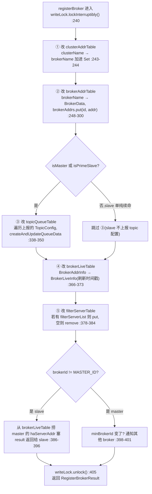

# 第 15 章 · RouteInfoManager:五张路由表与分层并发

> 篇:P5 · NameServer:路由与服务发现
> 主线呼应:前 14 章我们走完了"一条消息怎么进 CommitLog、怎么异步分发成 ConsumeQueue、怎么被消费端长轮询拉走、底层 Remoting 怎么通信"。但有一条贯穿全程的暗线我们一直**悬着没讲**——**Producer 发消息之前,怎么知道这个 Topic 的消息该往哪个 broker 发?Consumer 拉消息之前,怎么知道从哪个 broker 的哪个 queue 拉?** 答案就藏在 NameServer 里,藏在 `RouteInfoManager` 这五张表上。这一章,把这条暗线接上。

## 核心问题

**`RouteInfoManager` 用五张 `ConcurrentHashMap` 把整个集群的"谁在哪、提供什么"全记在内存里——但为什么在每张表都是线程安全 `ConcurrentHashMap` 的前提下,还要再套一把粗粒度的 `ReadWriteLock`?这一层"分层并发",到底在守什么?**

读完本章你会明白:

1. 五张表(`topicQueueTable` / `brokerAddrTable` / `clusterAddrTable` / `brokerLiveTable` / `filterServerTable`)各自存什么、key/value 是什么、为什么 5.x 要把 `brokerLiveTable` 的 key 从单个 broker 地址改成 `BrokerAddrInfo`(复合 key `clusterName + brokerAddr`)。
2. `registerBroker`(broker 注册心跳)、`pickupTopicRouteData`(client 拉路由)、`scanNotActiveBroker`(扫死 broker)、`unRegisterBroker`(级联清理)四条主路径各自在改哪几张表、为什么要"一起改"。
3. 为什么"每张表都是 CHM"还不够——`ConcurrentHashMap` 只保证**单表内**一次 `put`/`remove` 的原子性,守不住**跨多张表**的"要么全改完、要么全不改"的事务性;`ReadWriteLock` 就是来补这一刀的。
4. 为什么是"读写锁"而不是"一把大互斥锁"——读路径(`pickupTopicRouteData`)是 client 拉路由的高频热点,必须并发;写路径(`registerBroker`/`unRegisterBroker`)是 broker 心跳、相对低频,可以互斥。读多写少,读写锁正合身。
5. 为什么 5.x 把"扫死 broker 后的级联注销"从同步改成了**异步批处理**(`BatchUnregistrationService`)——一台 broker 掉线往往带出成百上千个 topic 要级联清理,同步干会卡死 `scanNotActiveBroker` 那个扫描线程。

> **如果一读觉得太难**:先只记住三件事——① NameServer 把整个集群的路由信息摊在五张内存表里, broker 注册时一起改、client 拉时一起读;② **CHM 守单表原子、ReadWriteLock 守跨表事务**,这是分层并发的全部;③ broker 死了不靠共识,靠心跳 TTL(~120s)判活,靠后台扫描 5s 一次清掉。后两件是本章的"技巧精解"重点。

---

## 15.1 一句话点破

> **`RouteInfoManager` 把集群里"哪个 cluster 有哪些 broker、哪个 broker 提供哪些 topic-queue、哪个 broker 地址还活着"全摊在五张内存表里。每张表都是 `ConcurrentHashMap`(单表原子),但跨表的"注册 / 注销 / 拉路由"必须读多张表才能拼出一个完整答案——所以再套一把粗粒度 `ReadWriteLock`:读用 `readLock` 并发跑(拉路由是高频热点),写用 `writeLock` 互斥跑(注册/注销是低频操作),让"跨表操作要么全做完、要么全不做"这件事 sound。**

这是结论,不是理由。本章倒过来拆:先看五张表各装什么、再走一遍注册和拉路由两条路径看清"跨表"是什么意思、再钻 scan 和级联注销,最后落到那把 `ReadWriteLock` 凭什么这么搭。

---

## 15.2 先看清五张表:NameServer 的全副身家

打开 `RouteInfoManager`([RouteInfoManager.java:68](../rocketmq/namesrv/src/main/java/org/apache/rocketmq/namesrv/routeinfo/RouteInfoManager.java#L68)),构造函数里六张 `ConcurrentHashMap` 一字排开([:84-94](../rocketmq/namesrv/src/main/java/org/apache/rocketmq/namesrv/routeinfo/RouteInfoManager.java#L84-L94))。本章主角是前五张(第六张 `topicQueueMappingInfoTable` 是 5.x 静态主题——static topic——的扩展,先按下不表):

```java
private final ReadWriteLock lock = new ReentrantReadWriteLock();                            // :71
private final Map<String/* topic */, Map<String, QueueData>> topicQueueTable;              // :72
private final Map<String/* brokerName */, BrokerData> brokerAddrTable;                     // :73
private final Map<String/* clusterName */, Set<String/* brokerName */>> clusterAddrTable;  // :74
private final Map<BrokerAddrInfo/* brokerAddr */, BrokerLiveInfo> brokerLiveTable;         // :75
private final Map<BrokerAddrInfo/* brokerAddr */, List<String>/* Filter Server */> filterServerTable;  // :76
```

五张表用一张图说清(NameServer 进程内存里,集群拓扑的全貌):

```
                     RouteInfoManager 内存五张表
┌──────────────────────────────────────────────────────────────────────────────┐
│                                                                              │
│  ① topicQueueTable   Map<topic, Map<brokerName, QueueData>>                  │
│     ┌──────────────┬───────────────────────────────────────────────────┐     │
│     │ "order"      │ → {broker-a → QD(rq=8,wq=8,perm=6),               │     │
│     │              │     broker-b → QD(rq=8,wq=8,perm=6)}              │     │
│     │ "pay"        │ → {broker-a → QD(rq=4,wq=4,perm=6)}               │     │
│     │ "log"        │ → {broker-c → QD(rq=16,wq=16,perm=2)}             │     │
│     └──────────────┴───────────────────────────────────────────────────┘     │
│     回答:"topic T 的消息分布在哪些 brokerName,各几读几写队列?"               │
│                                                                              │
│  ② brokerAddrTable   Map<brokerName, BrokerData{cluster, brokerAddrs}>       │
│     ┌──────────────┬───────────────────────────────────────────────────┐     │
│     │ "broker-a"   │ BrokerData{cluster="c1",                          │     │
│     │              │   brokerAddrs={0→"10.0.0.1:10911",               │     │
│     │              │               1→"10.0.0.2:10911"}}  ← master/slave│     │
│     │ "broker-b"   │ BrokerData{cluster="c1",brokerAddrs={0→...}}     │     │
│     └──────────────┴───────────────────────────────────────────────────┘     │
│     回答:"brokerName N 这个逻辑 broker 组,有几个物理副本,各在哪个 IP?"       │
│     注意:brokerName 是逻辑名,一组 master+slave 共享一个 brokerName,         │
│           用 brokerId 区分(master=0,slave>0)。                            │
│                                                                              │
│  ③ clusterAddrTable  Map<clusterName, Set<brokerName>>                       │
│     ┌──────────────┬───────────────────────────────────────────────────┐     │
│     │ "c1"         │ {"broker-a","broker-b"}                          │     │
│     │ "c2"         │ {"broker-c"}                                     │     │
│     └──────────────┴───────────────────────────────────────────────────┘     │
│     回答:"cluster C 里有哪些逻辑 broker?"                                    │
│                                                                              │
│  ④ brokerLiveTable   Map<BrokerAddrInfo, BrokerLiveInfo>                     │
│     ┌─────────────────────────────┬──────────────────────────────────┐      │
│     │ BrokerAddrInfo("c1",        │ BrokerLiveInfo{                  │      │
│     │   "10.0.0.1:10911")         │   lastUpdateTimestamp=...,       │      │
│     │                             │   heartbeatTimeoutMillis=120000, │      │
│     │                             │   dataVersion=DataVersion@...,   │      │
│     │                             │   channel=Netty Channel,         │      │
│     │                             │   haServerAddr="10.0.0.1:10912"} │      │
│     └─────────────────────────────┴──────────────────────────────────┘      │
│     回答:"这个 broker 地址最后一次心跳是什么时候?超时多久判死?"               │
│     ★ key 是复合的 BrokerAddrInfo(clusterName+brokerAddr),不是纯地址。       │
│                                                                              │
│  ⑤ filterServerTable Map<BrokerAddrInfo, List<filterServerAddr>>             │
│     ┌─────────────────────────────┬──────────────────────────────────┐      │
│     │ BrokerAddrInfo("c1",...)    │ ["10.0.0.10:10911",...]          │      │
│     └─────────────────────────────┴──────────────────────────────────┘      │
│     回答:"这个 broker 旁边挂着哪些 filterServer?"(消息过滤用,可空)          │
│                                                                              │
└──────────────────────────────────────────────────────────────────────────────┘
```

这里有几个**不读源码注意不到**的细节,逐个钉死:

### ① 为什么是这五张、不是三张或一张

朴素地想,"路由信息"似乎一张 `Map<topic, List<brokerAddr>>` 就够了。但 RocketMQ 拆成五张,是因为**这五类信息的生命周期完全不同**:

- `topicQueueTable`、`brokerAddrTable`、`clusterAddrTable` 是**配置拓扑**(谁提供什么),变化频率低——topic 增删、broker 扩缩才动。
- `brokerLiveTable` 是**活/死状态**(谁还活着),变化频率高——每个 broker 每隔 ~30s 心跳就刷一次 `lastUpdateTimestamp`,死掉了立刻要清。
- `filterServerTable` 是**可选附件**(过滤服务器),大多数集群根本不用。

拆开存,让"刷心跳时间戳"这种高频小改动不必触碰"配置拓扑"那张大表,降低 CHM 桶竞争。**这是第一层"分层":按变更频率分表。**

### ② `BrokerAddrInfo`:5.x 为什么把 brokerLiveTable 的 key 改成复合类

看 `BrokerAddrInfo` 这个类([RouteInfoManager.java:1119](../rocketmq/namesrv/src/main/java/org/apache/rocketmq/namesrv/routeinfo/RouteInfoManager.java#L1119)),它就两个字段:

```java
class BrokerAddrInfo {
    private String clusterName;   // :1120
    private String brokerAddr;    // :1121
    private int hash;             // :1123 —— 缓存 hashCode
    // equals: clusterName 相等 && brokerAddr 相等(:1143-1156)
    // hashCode: 手写,31*h 滚动,clusterName 和 brokerAddr 之间插一个 '_'(:1159-1172)
}
```

为什么不直接拿 `String brokerAddr` 当 key?**因为不同 cluster 里可能出现相同的 broker 地址**——多机房、多环境混部一个 NameServer 集群时,`10.0.0.1:10911` 可能在 cluster `c1` 和 cluster `c2` 里是两台不同的 broker。5.x 之前用裸地址当 key,这种情况下两张表会**互相覆盖**(后注册的把先注册的冲掉),路由错乱。改成 `(clusterName, brokerAddr)` 复合 key 后,两台 broker 各占一行,泾渭分明。

> **钉死这件事**:`BrokerAddrInfo` 不是装饰性的封装,是 5.x 修的一个**真实正确性 bug**——跨 cluster 地址重复时,旧实现会路由错乱。复合 key + 手写 `hashCode`(滚动 31 倍 + 下划线分隔,避免 `"ab"+"cd"` 与 `"a"+"bcd"` 这类碰撞)是这个修复的核心。`hash` 字段还做了**懒缓存**(`if (h == 0) ... hash = h`),因为 key 在 CHM 里要反复算 hash,缓存一次省 CPU。

### ③ `BrokerData` 的 brokerAddrs:`Map<brokerId, brokerAddr>`

看 `brokerAddrTable` 的 value 类型 `BrokerData`,它核心字段是 `Map<Long, String> brokerAddrs`——**key 是 brokerId,master 恒为 `MixAll.MASTER_ID`(=0),slave 是正整数**。一个 brokerName(逻辑 broker)下挂多个物理副本(master + N 个 slave),用 brokerId 区分。这个设计后面注册/注销时要反复用到(`MixAll.MASTER_ID == brokerId` 判断是不是 master)。

### ④ `QueueData`:Topic-Queue 的元数据

`topicQueueTable` 的 value 是 `Map<brokerName, QueueData>`,`QueueData`([QueueData.java:23](../rocketmq/remoting/src/main/java/org/apache/rocketmq/remoting/protocol/route/QueueData.java#L23))五个字段:

```java
public class QueueData implements Comparable<QueueData> {
    private String brokerName;     // :24 —— 属于哪个逻辑 broker
    private int readQueueNums;     // :25 —— 读队列数(消费端看到的)
    private int writeQueueNums;    // :26 —— 写队列数(生产端看到的)
    private int perm;              // :27 —— 权限位(读=4, 写=2) —— PermName.PERM_READ|PERM_WRITE
    private int topicSysFlag;      // :28 —— 系统标志(单元化、顺序等)
}
```

**注意:这里没有真正的物理队列列表,只有"数量"。** RocketMQ 在一个 broker 上,某个 topic 的 readQueueNums=8 意味着 `queueId ∈ [0,8)` 这 8 个队列,真正的队列索引(ConsumeQueue)在 broker 本地。NameServer 只记"数量",不记"内容"——这是它**轻量**的根源:五张表加起来通常也就几 MB 内存。

> **不这样会怎样**:假设 NameServer 像 ZK 那样把每个 topic 的每个 queue 的当前 offset、消息数都记着会怎样?NameServer 会变成有状态的重中心节点,要持久化、要同步、要恢复——RocketMQ 偏偏要 NameServer **无状态**(下一章 P5-16 详讲),只记"拓扑"不记"数据",重启 30s 内全靠 broker 重新心跳把拓扑重建出来。所以五张表只存元数据,这是 AP 设计的前提。

---

## 15.3 registerBroker:一次心跳,五张表一起改

理解了五张表存什么,我们来看最复杂的一条路径:`registerBroker`。broker 启动后每隔 ~30s 向**所有** NameServer 发一次 `REGISTER_BROKER` 请求,把自己"我是谁、我在哪个 cluster、我提供哪些 topic、我的心跳超时设多久"全报上去。

入口在 `DefaultRequestProcessor.registerBroker`([DefaultRequestProcessor.java:223](../rocketmq/namesrv/src/main/java/org/apache/rocketmq/namesrv/processor/DefaultRequestProcessor.java#L223)),它解出 `RegisterBrokerRequestHeader` + `RegisterBrokerBody`(含 `TopicConfigSerializeWrapper`——这个 broker 上所有 topic 配置 + 一个 `DataVersion`),然后调 `RouteInfoManager.registerBroker`([:249](../rocketmq/namesrv/src/main/java/org/apache/rocketmq/namesrv/processor/DefaultRequestProcessor.java#L249))。

`RouteInfoManager.registerBroker` 有两个重载([:212](../rocketmq/namesrv/src/main/java/org/apache/rocketmq/namesrv/routeinfo/RouteInfoManager.java#L212) 是简化版、[:226](../rocketmq/namesrv/src/main/java/org/apache/rocketmq/namesrv/routeinfo/RouteInfoManager.java#L226) 是带 `enableActingMaster` 的完整版),真正干活的是后者。我们顺着它走一遍,看它怎么**一口气改五张表**:



关键源码逐段拆(为了清楚,我把五张表的改动用注释标出来):

```java
public RegisterBrokerResult registerBroker(...) {
    RegisterBrokerResult result = new RegisterBrokerResult();
    try {
        this.lock.writeLock().lockInterruptibly();   // :240 —— 拿写锁,整个方法体在锁内

        // ① clusterAddrTable:clusterName 这个 cluster 里加进 brokerName
        Set<String> brokerNames = ConcurrentHashMapUtils.computeIfAbsent(
            (ConcurrentHashMap<String, Set<String>>) this.clusterAddrTable, clusterName,
            k -> new HashSet<>());
        brokerNames.add(brokerName);                 // :243-244

        // ② brokerAddrTable:brokerName 这个逻辑 broker,挂上 brokerId→brokerAddr
        BrokerData brokerData = this.brokerAddrTable.get(brokerName);
        if (null == brokerData) {
            registerFirst = true;
            brokerData = new BrokerData(clusterName, brokerName, new HashMap<>());
            this.brokerAddrTable.put(brokerName, brokerData);   // :248-253
        }
        // ... 同 IP 不同 id 的旧记录清理(:273)、DataVersion 冲突仲裁(:276-292) ...
        String oldAddr = brokerAddrsMap.put(brokerId, brokerAddr);   // :300

        // ③ topicQueueTable:只有 master(或 acting master 场景下的 prime slave)才上报 topic 配置
        if (null != topicConfigWrapper && (isMaster || isPrimeSlave)) {   // :308
            for (Map.Entry<String, TopicConfig> entry : tcTable.entrySet()) {
                if (registerFirst || this.isTopicConfigChanged(...)) {
                    this.createAndUpdateQueueData(brokerName, topicConfig);   // :348 —— 写 topicQueueTable
                }
            }
        }

        // ④ brokerLiveTable:刷新(或新建)BrokerLiveInfo,带新的 lastUpdateTimestamp
        BrokerAddrInfo brokerAddrInfo = new BrokerAddrInfo(clusterName, brokerAddr);
        BrokerLiveInfo prev = this.brokerLiveTable.put(brokerAddrInfo,
            new BrokerLiveInfo(
                System.currentTimeMillis(),   // ← 心跳时间戳,scanNotActiveBroker 靠它判活
                timeoutMillis == null ? DEFAULT_BROKER_CHANNEL_EXPIRED_TIME : timeoutMillis,
                topicConfigWrapper == null ? new DataVersion() : topicConfigWrapper.getDataVersion(),
                channel, haServerAddr));      // :366-373

        // ⑤ filterServerTable:有 filterServer 就更新,空就删
        if (filterServerList != null) {
            if (filterServerList.isEmpty()) {
                this.filterServerTable.remove(brokerAddrInfo);
            } else {
                this.filterServerTable.put(brokerAddrInfo, filterServerList);   // :378-384
            }
        }

        // slave 注册时,顺便把 master 的 haServerAddr/masterAddr 塞回 result,供 slave 找 master 复制
        if (MixAll.MASTER_ID != brokerId) { ... }   // :386-396
    } catch (Exception e) { ... } finally {
        this.lock.writeLock().unlock();   // :405
    }
    return result;
}
```

> **钉死这件事**:`registerBroker` **一次调用、五张表全改**。这就是为什么单靠 `ConcurrentHashMap` 守不住——下面专门拆。

这里还有两个**源码里藏着的精巧设计**,值得点出来:

**精巧 1:DataVersion 冲突仲裁(:276-292)**。broker 重启换 IP 是常事(尤其容器化),新 IP 上线时旧 IP 可能还没被扫死。`registerBroker` 发现"这个 brokerId 上次记的地址和这次不一样"时,不直接覆盖,而是比较 `DataVersion.stateVersion`([:281-283](../rocketmq/namesrv/src/main/java/org/apache/rocketmq/namesrv/routeinfo/RouteInfoManager.java#L281-L283))——**版本新的赢,版本旧的被拒绝并从 `brokerLiveTable` 删掉**。这避免了"一个掉线的旧 broker 重新连上,把自己的旧路由覆盖掉新 broker 已经建好的路由"这种脑裂。`DataVersion` 是 RocketMQ 全家通用的"配置版本号",`stateVersion` 单调递增,谁大谁对。

**精巧 2:master 和 slave 的注册分工(:308)**。只有 `isMaster || isPrimeSlave` 才会走"遍历 TopicConfig 写 topicQueueTable"这段——**slave 不上报 topic 配置**。为什么?因为一个 brokerName 下 master 和 slave 共享同一套 topic-queue 拓扑(它们是同一个逻辑 broker 的副本),master 上报一次就够了,slave 重复上报是浪费。`isPrimeSlave`(`brokerId == min(brokerAddrs.keySet)` 且 `enableActingMaster`)是 5.x 的"slave 代理 master"模式——master 挂了,最小的 slave 临时顶上(但写权限被抹掉,见 [:344-347](../rocketmq/namesrv/src/main/java/org/apache/rocketmq/namesrv/routeinfo/RouteInfoManager.java#L344-L347) 的 `perm & (~PERM_WRITE)`)。

---

## 15.4 pickupTopicRouteData:拉路由,读三张表拼一个答案

注册是写、拉路由是读。client(Producer/Consumer)启动后,每隔 `pollNameServerInterval`(默认 30s)向任一 NameServer 发 `GET_ROUTEINFO_BY_TOPIC`,拿回这个 topic 的完整路由——"哪些 broker 提供这个 topic,各在哪个 IP,master 是谁 slave 是谁"。

入口在 `ClientRequestProcessor.getRouteInfoByTopic`([ClientRequestProcessor.java:57](../rocketmq/namesrv/src/main/java/org/apache/rocketmq/namesrv/processor/ClientRequestProcessor.java#L57)),核心一行是 `pickupTopicRouteData(topic)`([:72](../rocketmq/namesrv/src/main/java/org/apache/rocketmq/namesrv/processor/ClientRequestProcessor.java#L72))。这个方法([RouteInfoManager.java:700](../rocketmq/namesrv/src/main/java/org/apache/rocketmq/namesrv/routeinfo/RouteInfoManager.java#L700))是**读路径**的典型——**拿 `readLock`,并发跑,不阻塞其他读**:

```java
public TopicRouteData pickupTopicRouteData(final String topic) {
    TopicRouteData topicRouteData = new TopicRouteData();
    // ...
    try {
        this.lock.readLock().lockInterruptibly();   // :711 —— 读锁,多 client 并发拉不互斥
        Map<String, QueueData> queueDataMap = this.topicQueueTable.get(topic);   // :712 —— 查表①
        if (queueDataMap != null) {
            topicRouteData.setQueueDatas(new ArrayList<>(queueDataMap.values()));
            foundQueueData = true;

            Set<String> brokerNameSet = new HashSet<>(queueDataMap.keySet());    // :717 —— 取这个 topic 涉及的 brokerName
            for (String brokerName : brokerNameSet) {
                BrokerData brokerData = this.brokerAddrTable.get(brokerName);    // :720 —— 查表②
                if (null == brokerData) { continue; }
                BrokerData brokerDataClone = new BrokerData(brokerData);         // :724 —— 深拷贝!避免 client 拿到后被改
                brokerDataList.add(brokerDataClone);
                foundBrokerData = true;
                if (filterServerTable.isEmpty()) { continue; }
                for (final String brokerAddr : brokerDataClone.getBrokerAddrs().values()) {
                    BrokerAddrInfo brokerAddrInfo = new BrokerAddrInfo(brokerDataClone.getCluster(), brokerAddr);
                    List<String> filterServerList = this.filterServerTable.get(brokerAddrInfo);   // :733 —— 查表⑤
                    filterServerMap.put(brokerAddr, filterServerList);
                }
            }
        }
    } catch (Exception e) { ... } finally {
        this.lock.readLock().unlock();   // :742
    }

    if (foundBrokerData && foundQueueData) {
        // ... acting master 调整(:763-795,锁外做,因为不碰五张表) ...
        return topicRouteData;
    }
    return null;
}
```

注意三件事:

1. **读三张表拼一个答案**:`topicQueueTable`(拿 QueueData 列表)→ `brokerAddrTable`(拿每个 brokerName 的 BrokerData,含 master/slave 地址)→ `filterServerTable`(拿过滤服务器)。**必须三张表一起读,才能拼出 client 需要的完整路由**。如果读这三张表的过程中,broker 注册插进来改了一半,client 就可能拿到"半套路由"(topic 有 broker-a,但 broker-a 的地址还没更新进去)。

2. **`BrokerData brokerDataClone = new BrokerData(brokerData)` 深拷贝([:724](../rocketmq/namesrv/src/main/java/org/apache/rocketmq/namesrv/routeinfo/RouteInfoManager.java#L724))**。这是个**容易忽略但关键的细节**:虽然 `readLock` 保证读的时候没人改,但 `readLock.unlock()` 之后,`topicRouteData` 还要被序列化发给 client(序列化是锁外的)。如果不深拷贝,序列化过程中另一个 `registerBroker` 拿到 `writeLock` 改了 `brokerData.getBrokerAddrs()`——**序列化就会读到正在被改的 Map,可能抛 `ConcurrentModificationException` 或读到撕裂值**。深拷贝把"读到的快照"和"活的表"彻底解耦。**这是"读锁 + 深拷贝"的组合拳,光有读锁不够。**

3. **acting master 的调整在锁外做([:763-795](../rocketmq/namesrv/src/main/java/org/apache/rocketmq/namesrv/routeinfo/RouteInfoManager.java#L763-L795))**。如果这个 topic 的某个 broker 组没有 master(`!brokerAddrs.containsKey(MASTER_ID)`),并且开启了 `supportActingMaster`,就把最小 brokerId 的 slave 临时"挂"到 `MASTER_ID` 这个位置返回给 client——让 client 以为还有 master 可写。**这一段不碰五张表(只改 `topicRouteData` 这个局部对象的副本),所以放锁外,缩短临界区。** 这是"能放锁外就放锁外"的典型——读写锁的临界区越短,并发越好。

> **不这样会怎样**:假设 `pickupTopicRouteData` 不加 `readLock`、纯靠 CHM,会怎样?Client A 正在拉 `topic=order` 的路由,刚从 `topicQueueTable` 拿到 QueueData 列表(含 broker-a、broker-b),正要去 `brokerAddrTable` 查 broker-b 的地址——此时 broker-b 刚好被 `unRegisterBroker` 从 `brokerAddrTable` 删掉了(它掉线被扫死)。Client A 拿到 `brokerData == null`(`continue` 跳过),返回的路由里**缺了 broker-b**——而 QueueData 里明明写着 broker-b 提供这个 topic。Client 拿着这套不一致的路由去发消息,可能发不出去或发错地方。加 `readLock` 后,整个"三表联查 + 深拷贝"在锁内原子完成,写路径(`writeLock`)进不来,读到的就是一套自洽的快照。

---

## 15.5 scanNotActiveBroker + 级联注销:死 broker 怎么被清掉

注册是续命、拉路由是消费、**扫死**是 GC。NameServer 不能等 broker 主动注销(broker 可能直接断电,根本来不及发 `UNREGISTER_BROKER`),所以靠**心跳 TTL** 被动判活:broker 每 ~30s 心跳刷新 `brokerLiveTable` 里的 `lastUpdateTimestamp`,NameServer 后台每 5s 扫一遍,谁超时了就清。

定时扫描的注册在 `NamesrvController.startScheduleService`([NamesrvController.java:117](../rocketmq/namesrv/src/main/java/org/apache/rocketmq/namesrv/NamesrvController.java#L117)):

```java
this.scanExecutorService.scheduleAtFixedRate(
    NamesrvController.this.routeInfoManager::scanNotActiveBroker,
    5000, this.namesrvConfig.getScanNotActiveBrokerInterval(), TimeUnit.MILLISECONDS);   // 默认 5s
```

`scanNotActiveBroker` 本身很短([RouteInfoManager.java:803](../rocketmq/namesrv/src/main/java/org/apache/rocketmq/namesrv/routeinfo/RouteInfoManager.java#L803)):

```java
public void scanNotActiveBroker() {
    try {
        log.info("start scanNotActiveBroker");
        for (Entry<BrokerAddrInfo, BrokerLiveInfo> next : this.brokerLiveTable.entrySet()) {   // :806
            long last = next.getValue().getLastUpdateTimestamp();
            long timeoutMillis = next.getValue().getHeartbeatTimeoutMillis();
            if ((last + timeoutMillis) < System.currentTimeMillis()) {                          // :809 —— 超时判断
                RemotingHelper.closeChannel(next.getValue().getChannel());                       // :810 —— 关 Netty channel
                log.warn("The broker channel expired, {} {}ms", next.getKey(), timeoutMillis);
                this.onChannelDestroy(next.getKey());                                            // :812 —— 触发级联注销
            }
        }
    } catch (Exception e) { ... }
}
```

**关键在 `heartbeatTimeoutMillis`**:默认值 `DEFAULT_BROKER_CHANNEL_EXPIRED_TIME = 1000 * 60 * 2` = **120 秒**([:70](../rocketmq/namesrv/src/main/java/org/apache/rocketmq/namesrv/routeinfo/RouteInfoManager.java#L70))。broker 心跳间隔 ~30s,允许 ~4 次心跳丢失才判死——**容忍网络抖动**。判活逻辑就一行算术:`lastUpdateTimestamp + heartbeatTimeoutMillis < now`,朴素得不能再朴素,但这就是 RocketMQ 的"分布式判活"——**没有共识、没有 quorum、没有 lease,就一个时间戳**。下一章 P5-16 会专门讲为什么这种"朴素"对 MQ 场景是 sound 的。

判死之后是**级联注销**:`onChannelDestroy`([:820](../rocketmq/namesrv/src/main/java/org/apache/rocketmq/namesrv/routeinfo/RouteInfoManager.java#L820))先拿 `readLock` 反查出"这个地址对应哪个 brokerName / brokerId / cluster"([:876-899](../rocketmq/namesrv/src/main/java/org/apache/rocketmq/namesrv/routeinfo/RouteInfoManager.java#L876-L899) 的 `setupUnRegisterRequest`),然后**不直接调 `unRegisterBroker`,而是 submit 到一个异步队列**:

```java
if (needUnRegister) {
    boolean result = this.submitUnRegisterBrokerRequest(unRegisterRequest);   // :837
    log.info("the broker's channel destroyed, submit the unregister request at once, ...");
}
```

### 5.x 的关键改进:BatchUnregistrationService

**这是 5.x 相对 4.x 的一个重要演进**,总纲和老资料都容易漏掉。看 `submitUnRegisterBrokerRequest`([:104](../rocketmq/namesrv/src/main/java/org/apache/rocketmq/namesrv/routeinfo/RouteInfoManager.java#L104)):

```java
public boolean submitUnRegisterBrokerRequest(UnRegisterBrokerRequestHeader unRegisterRequest) {
    return this.unRegisterService.submit(unRegisterRequest);   // 丢进 BlockingQueue
}
```

`unRegisterService` 是 `BatchUnregistrationService`([BatchUnregistrationService.java:35](../rocketmq/namesrv/src/main/java/org/apache/rocketmq/namesrv/routeinfo/BatchUnregistrationService.java#L35)),一个后台 `ServiceThread`:

```java
@Override
public void run() {
    while (!this.isStopped()) {
        try {
            final UnRegisterBrokerRequestHeader request = unregistrationQueue.take();   // :64 阻塞取一个
            Set<UnRegisterBrokerRequestHeader> unregistrationRequests = new HashSet<>();
            unregistrationQueue.drainTo(unregistrationRequests);                         // :66 顺手把队列里剩下的全捞出来
            unregistrationRequests.add(request);                                          // :69
            this.routeInfoManager.unRegisterBroker(unregistrationRequests);               // :71 批量处理
        } catch (Throwable e) { ... }
    }
}
```

**精巧在哪**:`take()` 阻塞取一个请求(没请求时休眠省 CPU),一旦被唤醒,立刻 `drainTo` 把队列里**当前所有**积压的注销请求一次性捞干,组成一个 `Set`,**一次** `writeLock` 批量处理。这是经典的 **"批处理 + drainTo" 模式**:

> **不这样会怎样**:假设一台 broker 掉线,NameServer 同时从 `scanNotActiveBroker`(扫死)和 Netty 的 `channelInactive` 回调(`BrokerHousekeepingService`)两处都发现它死了,各自 submit 一个注销请求。如果是 4.x 那种**同步逐个处理**,每个请求都要拿一次 `writeLock`、遍历五张表清理一次——同一台 broker 被清两遍,第二遍还会在空集合上 `removeIf`。更糟的是,一台大 broker 掉线往往带出**几百上千个 topic** 要级联清理(看 `cleanTopicByUnRegisterRequests` [:652](../rocketmq/namesrv/src/main/java/org/apache/rocketmq/namesrv/routeinfo/RouteInfoManager.java#L652) 那个 `while (itMap.hasNext())` 要遍历**整个 topicQueueTable**),逐个处理会让 `writeLock` 被占很久,拉路由的读路径全排队。

`BatchUnregistrationService` 把这些请求**攒一批、拿一次锁、清一遍**,大幅缩短临界区。这是"高频小请求 → 攒批 → 低频大处理"的通用并发优化,和 LevelDB 的 `WriteBatch`、数据库的 group commit 异曲同工。

### 真正的级联清理:unRegisterBroker(Set)

批量注销的实现在 `unRegisterBroker(Set<...>)`([:571](../rocketmq/namesrv/src/main/java/org/apache/rocketmq/namesrv/routeinfo/RouteInfoManager.java#L571)),拿 `writeLock`,对 Set 里每个请求:

1. **④ brokerLiveTable.remove**([:585](../rocketmq/namesrv/src/main/java/org/apache/rocketmq/namesrv/routeinfo/RouteInfoManager.java#L585))——删活/死状态。
2. **⑤ filterServerTable.remove**([:591](../rocketmq/namesrv/src/main/java/org/apache/rocketmq/namesrv/routeinfo/RouteInfoManager.java#L591))——删过滤服务器。
3. **② brokerAddrTable**:从 `BrokerData.brokerAddrs` 删这个 brokerId([:601](../rocketmq/namesrv/src/main/java/org/apache/rocketmq/namesrv/routeinfo/RouteInfoManager.java#L601))。如果整个 brokerAddrs 空了(这个 brokerName 下所有副本都没了),`brokerAddrTable.remove(brokerName)`([:607](../rocketmq/namesrv/src/main/java/org/apache/rocketmq/namesrv/routeinfo/RouteInfoManager.java#L607)),记进 `removedBroker`。
4. **③ clusterAddrTable**:如果上一步删了整个 brokerName,从 cluster 的 Set 里删 brokerName([:622](../rocketmq/namesrv/src/main/java/org/apache/rocketmq/namesrv/routeinfo/RouteInfoManager.java#L622));Set 空了就连 cluster 一起删([:627-631](../rocketmq/namesrv/src/main/java/org/apache/rocketmq/namesrv/routeinfo/RouteInfoManager.java#L627-L631))。
5. **① topicQueueTable**:调 `cleanTopicByUnRegisterRequests`([:640](../rocketmq/namesrv/src/main/java/org/apache/rocketmq/namesrv/routeinfo/RouteInfoManager.java#L640) → [:652](../rocketmq/namesrv/src/main/java/org/apache/rocketmq/namesrv/routeinfo/RouteInfoManager.java#L652)),**遍历整个 topicQueueTable**,把 `removedBroker`/`reducedBroker` 涉及的 QueueData 删掉——topic 下所有 broker 都没了,就连 topic 一起删([:667-670](../rocketmq/namesrv/src/main/java/org/apache/rocketmq/namesrv/routeinfo/RouteInfoManager.java#L667-L670))。

注意第 5 步是**整个清理里最重的活**:它要扫整张 `topicQueueTable`(可能几万到几十万个 topic)。这就是为什么前面要 `BatchUnregistrationService`——**把多次扫描合并成一次**,这一步省下来的时间是数量级的。

> **钉死这件事**:broker 死亡到路由清理,完整链条是——`brokerLiveTable` 心跳超时(`scanNotActiveBroker` 发现,或 Netty channel 断)→ `onChannelDestroy` 反查身份 → submit 到 `BatchUnregistrationService` 队列 → 后台线程 `drainTo` 攒批 → `writeLock` 内一次清理五张表(其中 topicQueueTable 要全扫)。从 broker 真正断连到 client 拉到新路由,**最坏 ~120s(判活)+ ~30s(client 下次拉)**,这就是 RocketMQ 路由最终一致性的延迟上限。

---

## 15.6 技巧精解:CHM + ReadWriteLock 分层并发

讲了四条主路径,我们回到本章的命脉——**为什么五张表都已经是 `ConcurrentHashMap` 了,还要再套一把 `ReadWriteLock`?** 这一层"分层并发"是 `RouteInfoManager` 设计上最容易被读者忽略、却又最 sound 的地方。

### 先看清两个层次在守什么

| 层次 | 守什么 | 机制 | 守得住什么、守不住什么 |
|------|--------|------|----------------------|
| **底层:CHM** | 单张表内**一次** `put`/`remove`/`computeIfAbsent` 的原子性 | CAS + 分段(老) / CAS + synchronized 桶(新,JDK 8+) | 守得住:单次操作不撕裂、size 准。守不住:多次操作之间的原子性、跨表操作的一致性 |
| **上层:ReadWriteLock** | **跨多张表 / 单表多次**操作的"事务性" | 读读共享、读写/写写互斥 | 守得住:registerBroker 改五张表"要么全改完要么全不改"、pickupTopicRouteData 读三张表拿到自洽快照 |

**这两层是分工,不是冗余。** CHM 守的是"微观原子",ReadWriteLock 守的是"宏观事务"。光有 CHM,跨表操作会被其他线程的插队打乱;光有 ReadWriteLock(没有 CHM),单表操作本身在 JDK 层面也不安全(虽然这里所有访问都在锁内,CHM 主要是为了"锁外的那几个只读方法 + 防御性")。

### 反面 A:如果只用 CHM,不要 ReadWriteLock

回到 15.4 那个例子。Client A 在 `pickupTopicRouteData` 里:

```
时刻 t1: 读 topicQueueTable.get("order") → {broker-a: QD, broker-b: QD}   ← 拿到 QueueData 列表
时刻 t2: [其他线程] unRegisterBroker(broker-b) —— broker-b 从 brokerAddrTable 被删
时刻 t3: 读 brokerAddrTable.get("broker-b") → null                          ← 拿不到地址!
```

结果是 client 拿到一套**残缺路由**:QueueData 说有 broker-b,但 BrokerData 里找不到 broker-b 的地址。client 拿这套路由去发消息,要么报错(找不到 broker-b 地址),要么默默把本该发 broker-b 的消息全堆到 broker-a(负载倾斜)。**CHM 再线程安全,也救不了这种跨表的非原子读。**

更隐蔽的问题:**`HashMap`/`Set` 的 `ConcurrentModificationException`**。`registerBroker` 里 `clusterAddrTable` 的 value 是 `HashSet`([:244](../rocketmq/namesrv/src/main/java/org/apache/rocketmq/namesrv/routeinfo/RouteInfoManager.java#L244) `brokerNames.add(brokerName)`),这个 inner `HashSet` **不是线程安全**的(只有外层 CHM 是)。如果一边 `pickupTopicRouteData` 在迭代某个 cluster 的 brokerName Set(通过 `brokerAddrTable` 间接),一边 `registerBroker` 在 `add`——裸 `HashSet` 并发写会**丢更新或抛 CME**。`writeLock` 把所有对 inner Set/Map 的修改互斥掉,这一层隐患就堵住了。

### 反面 B:如果只用一把大互斥锁(普通 ReentrantLock 或 synchronized)

那 `pickupTopicRouteData` 这种高频读路径(每个 client 每 30s 一次,大集群几千个 client,**每秒上百次拉路由**)就要和 `registerBroker`(每 broker 每 30s 一次,大集群几千 broker,**每秒上百次注册**)抢同一把锁。读读之间也互斥——**拉路由的吞吐被注册拖垮,NameServer 的 QPS 天花板就是这把锁的吞吐**。

读写锁解了这一点:**读读共享**(`readLock` 可被多个线程同时持有),`pickupTopicRouteData` 们并发跑,只在有 `registerBroker`/`unRegisterBroker`(写)进来时才让读等待。RocketMQ 的路由访问模式是**典型的读多写少**(读:每个 client 30s 一次;写:每个 broker 30s 一次,加上扫描触发的批量注销),读写锁的收益在这种场景最大。

### 这套设计 sound 在哪

1. **读路径的吞吐不被写拖死**:多个 client 并发拉路由,互不阻塞,只在一个 broker 正好注册/注销的瞬间短暂等待——这是"读多写少"场景下读写锁的核心红利。
2. **跨表操作的原子性**:registerBroker 改五张表、unRegisterBroker 清五张表、pickupTopicRouteData 读三张表——都在锁内"一口气做完",要么全做完要么全不做,读到的永远是自洽快照。
3. **临界区尽量短**:`pickupTopicRouteData` 把 acting master 调整这种"不碰表只改局部副本"的活放锁外([:763](../rocketmq/namesrv/src/main/java/org/apache/rocketmq/namesrv/routeinfo/RouteInfoManager.java#L763));`scanNotActiveBroker` 整个方法**根本不拿锁**([:803](../rocketmq/namesrv/src/main/java/org/apache/rocketmq/namesrv/routeinfo/RouteInfoManager.java#L803)),只读 `brokerLiveTable.entrySet()`(CHM 的弱一致遍历够用,扫到一个死的就 submit 注销,注销才拿锁)。**能不进锁就不进锁,进了就快点出来。**
4. **CHM 兜底**:`scanNotActiveBroker` 不拿锁、`BrokerHousekeepingService`(Netty channel 断的回调)里的 `onChannelDestroy` 只拿 `readLock`——这些"边角读"靠 CHM 的弱一致遍历 + 后续 `writeLock` 内的权威清理配合,既不阻塞写,又不会漏判。

> **钉死这件事**:`RouteInfoManager` 的并发设计是**"CHM 守微观原子、ReadWriteLock 守宏观事务、临界区尽量短、批处理削峰"**四位一体。这不是教科书上某一条规则,而是四条规则针对"读多写少、跨表事务、清理昂贵"这个具体场景的协同解。光抓任何一条都不够——比如只看 CHM 会以为"既然线程安全为什么还要锁",只看 ReadWriteLock 会以为"既然有锁为什么表还要 CHM",必须把它们看成**两个层次的分工**。

---

## 章末小结

这一章属于分布式骨架那一面——NameServer 是 RocketMQ 集群里唯一"全局可见"的元数据来源,**所有 Producer 发消息前要问它、所有 Consumer 拉消息前要问它、所有 broker 上线要跟它报到、所有 broker 死了要被它 GC**。`RouteInfoManager` 就是这套"问与答"的内存引擎,五张表是它的全副身家,四条主路径(注册/拉路由/扫死/级联注销)是它的日常作息。

我们立起了三件事:

1. **五张表 + 复合 key**:`topicQueueTable`(topic→brokerName→QueueData)、`brokerAddrTable`(brokerName→BrokerData,brokerId 区分 master/slave)、`clusterAddrTable`(cluster→brokerName Set)、`brokerLiveTable`(BrokerAddrInfo→BrokerLiveInfo,5.x 复合 key 修了跨 cluster 地址重复 bug)、`filterServerTable`(可选)。第六张 `topicQueueMappingInfoTable` 是 5.x 静态主题扩展。
2. **四条主路径**:registerBroker(一次改五表)、pickupTopicRouteData(读三表拼快照、深拷贝、acting master 调整放锁外)、scanNotActiveBroker(120s TTL 判活、不拿锁弱一致遍历)、unRegisterBroker(级联清五表,5.x 用 BatchUnregistrationService 攒批削峰)。
3. **分层并发**:CHM 守单表微观原子、ReadWriteLock 守跨表宏观事务;读多写少,读写锁让读并发、写互斥;临界区尽量短(scanNotActiveBroker 不进锁、acting master 调整出锁);批处理把昂贵的级联清理削峰。**这四条协同,是 RouteInfoManager 的 sound 性所在。**

### 五个"为什么"清单

1. **为什么要有五张表,不能合并成一张?** 这五类信息(配置拓扑/活死状态/过滤附件)**生命周期不同**——心跳时间戳每 30s 刷一次,topic 配置很少动,filterServer 大多不用。分开存,让高频小改动(刷心跳)不碰低频大表(topicQueueTable),降低 CHM 桶竞争。这是第一层"按变更频率分层"。

2. **为什么 brokerLiveTable 的 key 是 BrokerAddrInfo 复合类,不是裸 String?** 跨 cluster 地址重复时(多机房混部),裸地址会互相覆盖导致路由错乱。5.x 改成 `(clusterName, brokerAddr)` 复合 key + 手写 hashCode(31 倍滚动 + 下划线分隔防碰撞)+ hash 懒缓存,修了这个正确性 bug。

3. **为什么五张表都是 CHM 还要 ReadWriteLock?** CHM 只守**单次** `put`/`remove` 的原子性,守不住**跨多张表**操作的"要么全改完要么全不改"。registerBroker 要一口气改五张表、pickupTopicRouteData 要读三张表拼一个答案——中间被其他线程插队就会读到半成品路由。ReadWriteLock 守这一层宏观事务性。

4. **为什么是读写锁不是普通互斥锁?** 读路径(拉路由,每秒上百次)远多于写路径(注册/注销)。读写锁让**读读共享**,读之间不互斥,只在与写冲突时等待;普通锁会让所有读排队,NameServer 的 QPS 天花板就被这把锁卡死。读多写少正是读写锁的最佳战场。

5. **为什么 5.x 把级联注销改成异步批处理(BatchUnregistrationService)?** 一台大 broker 掉线,级联清理要扫**整张** topicQueueTable(可能几十万 topic),逐个同步处理会让 `writeLock` 被占很久,拉路由的读全排队。`take + drainTo` 攒批、一次锁清一遍,把 N 次扫描合并成 1 次,数量级地缩短临界区。这是"高频小请求攒批低频大处理"的通用并发优化。

### 想继续深入往哪钻

- **源码主线**:`../rocketmq/namesrv/src/main/java/org/apache/rocketmq/namesrv/routeinfo/RouteInfoManager.java` 全文 1280 行,五张表 + 四路径都在这一个文件,外加同目录 `BatchUnregistrationService.java`(~80 行,批处理核心)和 `BrokerHousekeepingService.java`(Netty channel 生命周期的回调入口,channel 断了也触发 `onChannelDestroy`)。
- **配套类**:`remoting/.../protocol/route/QueueData.java`、`BrokerData.java`、`TopicRouteData.java`(拉路由返回给 client 的 DTO)、`protocol/DataVersion.java`(冲突仲裁用的版本号,下一章详讲)。
- **调用方**:`DefaultRequestProcessor.java`(REGISTER_BROKER/UNREGISTER_BROKER/BROKER_HEARTBEAT 路由)、`ClientRequestProcessor.java`(GET_ROUTEINFO_BY_TOPIC,client 拉路由的入口,值得注意的是它跑在**独立的 clientRequestExecutor 线程池**,和 broker 注册的 defaultExecutor 线程池隔离,互不饿死——呼应第 14 章 P4-14 的线程池隔离)。
- **测试**:`namesrv/src/test/.../routeinfo/RouteInfoManagerTest.java`、`RouteInfoManagerStaticRegisterTest.java`、`RegisterBrokerBenchmark.java` / `GetRouteInfoBenchmark.java`(压测,看 register/pickup 在高并发下的表现)。
- **对比**:`RouteInfoManager` 的"五张内存表 + 读写锁"对照 Kafka 的 ZooKeeper(强一致元数据存储,Controller 把路由写 ZK,broker/client 读 ZK)。下一章 P5-16 详讲为什么 RocketMQ 偏偏不用 ZK。

### 引出下一章

我们讲清了五张表怎么存、四条路径怎么走、读写锁怎么守跨表事务。但有一个问题一直悬着——**NameServer 集群里各个节点之间,根本不同步这五张表!** 每个 NameServer 都是独立的一份内存,broker 向**所有** NameServer 都注册一遍,各自维护各自的五张表。这听起来很不"分布式"——没有共识、没有 quorum、没有 leader,凭什么不出错?client 拉到的路由会不会和真实集群不一致?broker 换 IP 时多个 NameServer 会不会脑裂?下一章 P5-16《为什么不用 ZooKeeper:AP 心跳注册中心》,就来回答这个"为什么不用 CP 共识、偏偏选 AP 心跳"的根本抉择,把 `DataVersion` 仲裁、120s TTL、broker 全量注册这套 AP 设计的 sound 性讲透。
