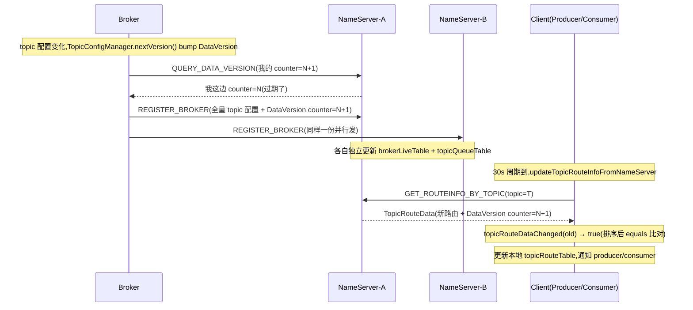

# 第十六章 · 为什么不用 ZooKeeper:AP 心跳注册中心

> 篇:第 5 篇 · NameServer:路由与服务发现
> 主线呼应:上一章 P5-15 把"五张路由表 + CHM 与 ReadWriteLock 的分层并发"在**单个 NameServer 进程内部**讲透了——`RouteInfoManager` 怎么用五张 `ConcurrentHashMap` 装下全集群的 `topicQueueTable` / `brokerAddrTable` / `clusterAddrTable` / `brokerLiveTable` / `filterServerTable`,怎么用粗粒度 `ReadWriteLock` 保证跨表事务性。但那一章留了一个更根本、也是社区里被问过无数次的问题:**RocketMQ 的 NameServer 集群,各节点之间为什么不互相通信、不跑共识协议?为什么不直接用 ZooKeeper?** 这一章就回答这个——它要从 CAP 的视角,讲清 RocketMQ 为什么为 MQ 这个场景选 A(可用性)而不是 ZK 那种 C(强一致),代价是什么、凭什么这个代价在 MQ 场景里能接受。

## 核心问题

**Broker 怎么把"我还活着、我身上有这些 topic"告诉 NameServer,NameServer 各节点之间凭什么完全独立、不跑共识也不会乱?client 怎么拿到一份虽然可能短暂过期、但最终一致的路由?为什么 RocketMQ 当年放弃 ZooKeeper,自己造一个 AP 心跳注册中心,这到底是工程权衡还是历史包袱?**

读完本章你会明白:

1. Broker 的注册是个**定时全量心跳**:启动时立刻注册一次,之后每 **30 秒**(`registerNameServerPeriod` 默认值,clamp 到 [10s, 60s])向**所有** NameServer **并行**注册一遍,每次都把完整的 topic 配置 + 一个单调递增的 `DataVersion` 一起带上。Broker 不是"有变化才通知",而是"无脑重复报",靠重复换容错。
2. NameServer 集群**各节点完全独立**:它们之间没有任何通信(无 gossip、无复制、无 leader),每个 NameServer 都用自己收到的注册请求独立维护一份五张表。Broker 必须向**每一个** NameServer 注册,是因为它们不共享状态——这是教科书式的 AP,放弃了 NameServer 之间的 C。
3. 判活靠**心跳 TTL 软状态**:每个 NameServer 自己跑一个 `scanNotActiveBroker`,每 **5 秒**扫一次 `brokerLiveTable`,凡 `lastUpdateTimestamp + heartbeatTimeoutMillis < now` 的(默认 **120 秒**),直接关连接 + 级联清理——broker 挂了不用主动通知,过期自动判死。
4. client 每 **30 秒**主动 `updateTopicRouteInfoFromNameServer` 拉路由,拉到的路由**只用于本地决策**,任一 NameServer 给的全量路由都够用。路由延迟最多 30 秒,MQ 场景容忍。
5. 为什么不用 ZooKeeper:ZK 是 CP——每次注册走 quorum、leader 切换有脑裂窗口、ZK 集群本身要重运维;而 MQ 场景下"路由短暂不一致"是可容忍的(下一节就拆"凭什么可容忍"),用 AP 换来了**注册低延迟、运维极简、无状态单进程**。这不是历史包袱,是为 MQ 量身定制的取舍。

> **如果一读觉得太难**:先只记住三件事——① NameServer 各节点完全独立、互不同步,broker 每 30s 向**全部** NameServer 并行注册(任一 NameServer 都有全量路由);② broker 死不死靠心跳 TTL,默认 120s 没心跳就判死,5s 一扫;③ RocketMQ 选 AP 是因为 MQ 能容忍"30s 路由延迟",换来了无共识开销和无状态运维——和 ZK 的 CP 是两条路。

---

## 16.1 一句话点破

> **RocketMQ 的 NameServer 是一个"刻意不做共识"的 AP 注册中心:broker 每 30 秒向所有 NameServer 并行重复注册(全量 topic 配置 + 一个单调 DataVersion),任一 NameServer 独立收、独立存、独立判活(120s 心跳 TTL),彼此之间连一句招呼都不打;client 每 30 秒从任一 NameServer 拉一份路由,够用就用。放弃了 NameServer 之间的强一致,换来的是注册路径零共识开销(打到任一 NameServer 都能写进去)、运维极简(NameServer 是无状态单进程,挂一个不影响全局)、以及 MQ 场景下足够用的"最终一致 + 30 秒收敛"。这跟 ZooKeeper 那条 CP 路是反的——ZK 要 quorum 要 leader 要 ZAB,稳但重,RocketMQ 判断 MQ 用不起那么重的。**

这是结论,不是理由。本章倒过来拆:先把"如果用 ZK 会怎样"这块反面教材立起来,再拆 broker→NameServer 的心跳注册全链(为什么是 30s、为什么向全部注册),然后拆 NameServer 内部的 TTL 判活(为什么是 120s、5s 一扫),最后钻进 `DataVersion` 看版本号怎么在"无共识"的前提下做仲裁。技巧精解单独拆透"AP 心跳软状态 + DataVersion 增量仲裁"这对组合拳,以及它和 Rebalance(P3-10)、长轮询(P3-09)那种"用周期性重算把偏差抹平"的设计取向是一脉相承的。

---

## 16.2 反面教材:如果用 ZooKeeper 会怎样

在讲 RocketMQ 这条 AP 心跳路之前,先把"为什么不用 ZK"想清楚。ZooKeeper 是分布式系统里 CP 一族的招牌——它用一个 ZAB 共识协议(Zookeeper Atomic Broadcast,类 Paxos)在集群里复制一个树状的 znode 数据结构,任何写操作都要走 quorum(多数派)确认、由 leader 单点序列化。这玩意儿强一致、可靠,大量分布式系统(Kafka 早期、HBase、Dubbo、Curator 服务发现)都拿它做注册中心。

那如果 RocketMQ 也拿 ZK 做注册中心,broker 把路由信息写进 `/rocketmq/brokers/broker-a/queueData` 这样的 znode,会怎样?

> **不这样会怎样**(ZK 撞的墙,站在 MQ 视角):

- **每次注册都要走 quorum**:broker 每 30s 心跳一次 = 每 30s 触发一次"写 znode",这个写在 ZK 集群里要走 leader 序列化 + 多数派 ACK。一个 3 节点 ZK 集群,每次写都要至少 2 个节点确认。心跳是高频操作(一个集群几千个 broker,每个 30s 一跳),ZK 的写吞吐(QPS 几千到一万多)很快就是瓶颈,而且每次写的**尾延迟**都被共识 RTT 拖长。RocketMQ 在淘宝要扛海量 broker + 海量 topic,**心跳注册的吞吐和延迟都是命门**,ZK 在这里慢一拍,全集群的"路由更新"就慢一拍。
- **leader 切换 = 脑裂窗口**:ZK 自己也要选主,leader 挂了要走 leader election(ZAB phase),期间整个 ZK 集群**不可写**——这个窗口通常几百毫秒到几秒。RocketMQ 的 broker 如果在这期间注册不上,client 那边拉到的路由就过期。ZK 把这个不可用窗口从"任一 NameServer 挂"放大成"ZK 集群选主窗口"——而 NameServer 集群任一节点挂了,其他节点照常收注册,完全不影响。
- **ZK 集群本身是重运维**:ZooKeeper 自己是一个独立的、需要小心调优的分布式系统——要配 JVM 堆、要管 snapshot/transaction log 的磁盘、要监控 leader/follower 状态、要做 snapshot 回放恢复。RocketMQ 的运维同学本来就要管 broker(大头)和 NameServer(轻量),再加一套 ZK,等于多养一个分布式系统。**为路由发现这个相对轻量的需求,养一个 CP 系统,运维成本不划算**。
- **强一致对 MQ 是过度的**:MQ 场景下,client 拿到的路由**短暂过期**(比如 broker-a 刚挂、client 还以为它在)是可容忍的——大不了 client 发到 broker-a 失败,重试时去 NameServer 拉新路由就行;或者 broker-a 的消息已经被 Rebalance 转给其他 broker,client 重连即可。RocketMQ 的"至少一次 + 业务幂等"(P3-11)和 Producer 端的**故障重试机制**(发送失败自动拉新路由重试)本来就能兜住短暂路由过期。**ZK 提供的强一致,对 MQ 是过度供给,而代价(共识开销 + 运维 + 脑裂)是真金白银。**

> **钉死这件事**:RocketMQ 不用 ZK 不是历史包袱,是**为 MQ 场景的取舍**。MQ 能容忍路由延迟(MQ 的"至少一次 + 重试 + 幂等"能兜),换不来的是注册吞吐和运维简单。所以 RocketMQ 选了 AP 心跳:broker 向所有 NameServer 注册、NameServer 各自独立、用心跳 TTL 判活——这正是 P3-10 Rebalance "无中心协调 + 周期重算收敛"同一种设计取向在路由层的体现。

> **打个比方**(只点一次,不贯穿):ZK 像一个**所有分行都要实时同步的总行金库**,任何一笔账都要总行盖戳、多数分行确认,稳但慢,而且总行一旦换人,全网结账要等。RocketMQ 的 NameServer 像每个街区一个**独立的小黑板**,谁家营业(broker 注册)就把自己的菜单抄一份贴到每一块小黑板上,黑板上写的可能滞后几分钟,但客户走到任一块小黑板都能看到这家店。MQ 用得起这种"可能滞后但永远能查"的注册中心。

---

## 16.3 Broker 端的心跳:每 30s 向所有 NameServer 并行注册

立完反面教材,看 RocketMQ 这条路是怎么走的。第一段是 broker 怎么把"我还活着 + 我身上有这些 topic"告诉 NameServer。

### 触发:BrokerController 里的定时全量注册

Broker 启动时(`BrokerController.start()`),会立刻注册一次,然后挂一个 `scheduleAtFixedRate` 定时任务,周期性再注册。看源码([BrokerController.java:1979](../rocketmq/broker/src/main/java/org/apache/rocketmq/broker/BrokerController.java#L1979)):

```java
// BrokerController.java:1979 —— 周期性注册到所有 NameServer 的定时任务
scheduledFutures.add(this.scheduledExecutorService.scheduleAtFixedRate(new Runnable() {
    @Override
    public void run() {
        try {
            // ... 取 topicConfigWrapper / filterServerList ...
            BrokerController.this.registerBrokerAll(true, false, brokerConfig.isForceRegister());
        } catch (Throwable t) {
            log.error("registerBrokerAll Exception", t);
        }
    }
}, 1000 * 10, Math.max(10000, Math.min(brokerConfig.getRegisterNameServerPeriod(), 60000)), TimeUnit.MILLISECONDS));
```

这两行钉死两件事:

1. **初始延迟 10 秒**(`1000 * 10`)——broker 启动后等 10 秒才开始周期注册(给 broker 自己一个完整的初始化窗口,先 `start()` 出底层 store/ha/remoting,再对外报"我活了")。注意这个 10 秒之前(`BrokerController.java:1976`),已经有一个**立即注册**一次的 `this.registerBrokerAll(true, false, true)`,所以 broker 一启动就先报一次到,再进入周期注册。
2. **周期是 `Math.max(10000, Math.min(registerNameServerPeriod, 60000))`**——这是个 clamp,把注册周期**钳在 [10s, 60s] 之间**。默认 `registerNameServerPeriod = 1000 * 30`(`BrokerConfig.java:188`),所以**默认注册周期就是 30 秒**。这个 clamp 防的是用户瞎配:配成 1 秒会把 NameServer 打爆,配成 10 分钟路由延迟太大,clamp 强行钉死在合理区间。

> **钉死这件事**:broker 的心跳周期默认 **30 秒**(不是社区里常传的"10 秒",更不是总纲初稿里的"1 秒")。1 秒那个数是 5.x controller / acting-master 模式下另一条独立的 `sendHeartbeat` 路径(`brokerHeartbeatInterval = 1000`,走 `RequestCode.BROKER_HEARTBEAT`),和经典 NameServer 路径(`RequestCode.REGISTER_BROKER`)是两套机制——本章讲经典路径,30s。

> **不这样会怎样**:如果周期太短(比如 1s),几千个 broker 一起向 NameServer 每秒注册一遍,NameServer 那台机器的 CPU 和网卡直接被 `registerBroker` 处理量打爆(每次注册要更新五张表 + 序列化整个 topic 配置)。如果周期太长(比如 5 分钟),broker 挂了之后 NameServer 要等 5 分钟才(在 TTL 过期后)判死,client 在这 5 分钟里一直发到死 broker。30s 是吞吐和检测延迟之间的折中——配合 120s TTL,既不让 NameServer 负载过高,又把检测延迟控制在两分钟以内。

### 单次注册:registerBrokerAll 全量打包

周期到了,调到 `BrokerController.registerBrokerAll`([:2106](../rocketmq/broker/src/main/java/org/apache/rocketmq/broker/BrokerController.java#L2106))。这个方法本身不直接发网络,它干两件事:

1. 把 broker 自己的 topic 配置、filter server 列表、DataVersion 打包成 `TopicConfigSerializeWrapper` 和 `RegisterBrokerBody`。
2. 决定**这次要不要真的发**:`forceRegister || needRegister(...)`。`needRegister` 会先向每个 NameServer 问一句"我现在的 DataVersion 和你那边存的一样吗"(走 `RequestCode.QUERY_DATA_VERSION`),一样就跳过这次注册(节省带宽),不一样或者 `forceRegister=true` 才真发。

注意:**这个优化不影响心跳语义**——broker 仍然在周期性"尝试注册",只是内容没变时省掉全量数据传输。`DataVersion` 没变也会跳过,但 NameServer 那边的 `lastUpdateTimestamp` 怎么刷新?别急,`QUERY_DATA_VERSION` 这一轮交互本身,NameServer 端的 `queryBrokerTopicConfig` 方法也会更新 `brokerLiveTable` 里的 `lastUpdateTimestamp`(防止"数据没变就判死"),下一节拆 NameServer 端会看到。

真正发网络的是 `BrokerOuterAPI.registerBrokerAll`([:491](../rocketmq/broker/src/main/java/org/apache/rocketmq/broker/out/BrokerOuterAPI.java#L491)),看它怎么并行注册到所有 NameServer:

```java
// BrokerOuterAPI.java:506-547(节选)
final List<RegisterBrokerResult> registerBrokerResultList = new CopyOnWriteArrayList<>();
List<String> nameServerAddressList = this.remotingClient.getAvailableNameSrvList();
if (nameServerAddressList != null && nameServerAddressList.size() > 0) {
    // ... 构造 requestHeader + requestBody(含 topic 配置 + filter server)...
    final CountDownLatch countDownLatch = new CountDownLatch(nameServerAddressList.size());
    for (final String namesrvAddr : nameServerAddressList) {                    // :529 遍历所有 NameServer
        brokerOuterExecutor.execute(new Runnable() {                            // :530 提交到线程池并行
            @Override
            public void run() {
                try {
                    RegisterBrokerResult result = registerBroker(namesrvAddr, oneway, timeoutMills, requestHeader, body);  // :534 单点注册
                    if (result != null) {
                        registerBrokerResultList.add(result);
                    }
                } catch (Exception e) {
                    LOGGER.error("Failed to register current broker to name server. TargetHost={}", namesrvAddr, e);
                } finally {
                    countDownLatch.countDown();                                  // :543 不论成败都 countDown
                }
            }
        });
    }
    try {
        if (!countDownLatch.await(timeoutMills, TimeUnit.MILLISECONDS)) {       // :550 等所有注册完成或超时
            LOGGER.warn("Registration to one or more name servers does NOT complete within deadline...");
        }
    } catch (InterruptedException ignore) { }
}
```

这段是 AP 设计在代码里的字面体现,几个细节钉死:

- **向所有 NameServer 并行注册**(`for namesrvAddr : nameServerAddressList` :529)——不是只发给某个 leader、不是发给一个 master 再转发。每一个 NameServer 都是平等的接收方。
- **`brokerOuterExecutor` 线程池并发**——所有 NameServer 的注册请求是并行的,不是串行。一个 NameServer 慢了不阻塞向其他 NameServer 的注册。
- **`CountDownLatch` 等齐或超时**——主流程会等所有注册完成(或 `timeoutMills` 超时),但**单个 NameServer 注册失败不会影响别的**(`catch (Exception e)` 后继续 `countDown`,不抛出)。

> **钉死这件事**:这就是"broker 向全部注册,任一 NameServer 都有全量路由"在源码里的样子。一个 NameServer 挂了,broker 这次的注册对它失败,但其他 NameServer 照样收到——下一次心跳那个挂掉的 NameServer 重启了又会被注册到。**没有任何"主备""leader/follower"概念,每个 NameServer 都是独立的全量镜像,镜像靠 broker 重复写维持**。

> **不这样会怎样**:假设只向一个"主"NameServer 注册,再由它复制给其他——那这个"主"就是单点,它挂了路由就不更新了;为了不单点,这个"主"自己又要做成共识集群,就又回到 ZK 那套了。RocketMQ 把"复制"这件事**甩给了 broker 自己**——broker 重复写,NameServer 只管收,这是把"复制成本"从基础设施转嫁给生产者(broker),换来 NameServer 的无状态简单。

### Broker 关停:unregisterBrokerAll 主动通知 + 兜底过期

broker 正常关停时(`BrokerController.shutdown()`, [:1523](../rocketmq/broker/src/main/java/org/apache/rocketmq/broker/BrokerController.java#L1523)),会调 `unregisterBrokerAll()`([:1814](../rocketmq/broker/src/main/java/org/apache/rocketmq/broker/BrokerController.java#L1814))主动向所有 NameServer 发 `RequestCode.UNREGISTER_BROKER`(`BrokerOuterAPI.unregisterBrokerAll` [:600](../rocketmq/broker/src/main/java/org/apache/rocketmq/broker/out/BrokerOuterAPI.java#L600)),让 NameServer 立刻级联清理这个 broker 的所有路由(不像被动过期要等 120s)。但这是优化,不是必需——即使 broker 是 `kill -9` 没来得及通知,NameServer 也会在 120s 后靠 TTL 判死并自动清理。**主动注销让优雅停机更快,被动过期让异常停机最终一致**——两条路并存,典型的"快路径 + 兜底"。

---

## 16.4 NameServer 端:独立存、独立判活

broker 这边把心跳发出来了,NameServer 那边怎么收。这一节拆两个机制:**怎么存进五张表**(P5-15 讲过表的并发结构,这里只点注册路径怎么写到表里)和**怎么靠 TTL 判活**。

### 注册路径:每次心跳刷新 lastUpdateTimestamp + DataVersion

broker 的 `REGISTER_BROKER` 请求打到 NameServer,经过 `BrokerHousekeepingService` 路由到 `RouteInfoManager.registerBroker`。这个方法是 P5-15 五张表的主战场之一,这里只看它**和心跳 TTL 相关的那一段**([RouteInfoManager.java:366](../rocketmq/namesrv/src/main/java/org/apache/rocketmq/namesrv/routeinfo/RouteInfoManager.java#L366)):

```java
// RouteInfoManager.java:366-373(注册路径里写 brokerLiveTable 的那一段)
BrokerAddrInfo brokerAddrInfo = new BrokerAddrInfo(clusterName, brokerAddr);
BrokerLiveInfo prevBrokerLiveInfo = this.brokerLiveTable.put(brokerAddrInfo,
    new BrokerLiveInfo(
        System.currentTimeMillis(),                                                                       // lastUpdateTimestamp = 当前时刻
        timeoutMillis == null ? DEFAULT_BROKER_CHANNEL_EXPIRED_TIME : timeoutMillis,                     // heartbeatTimeoutMillis, 默认 120s
        topicConfigWrapper == null ? new DataVersion() : topicConfigWrapper.getDataVersion(),             // broker 带过来的 DataVersion
        channel,
        haServerAddr));
```

每次 broker 心跳,这一段就刷新一次 `brokerLiveTable` 里这个 broker 的 `BrokerLiveInfo`。**关键字段**:

- `lastUpdateTimestamp = System.currentTimeMillis()`:**就是这次心跳到达 NameServer 的时刻**。下一次 TTL 判活拿这个时刻算"多久没心跳了"。
- `heartbeatTimeoutMillis`:默认 `DEFAULT_BROKER_CHANNEL_EXPIRED_TIME = 1000 * 60 * 2`(120s, [RouteInfoManager.java:70](../rocketmq/namesrv/src/main/java/org/apache/rocketmq/namesrv/routeinfo/RouteInfoManager.java#L70))。broker 也可以在注册请求里自己带一个 `heartbeatTimeoutMillis` 覆盖默认值(5.x acting-master 模式会用更短的,比如几秒)。
- `dataVersion`:broker 这次心跳带过来的 `DataVersion`(下一节单独拆)。

`brokerLiveTable.put(...)` 用 CHM 的 `put` 原子覆盖整条记录——**心跳的本质就是"用最新的 `BrokerLiveInfo` 覆盖旧的,把 `lastUpdateTimestamp` 推到现在"**。

> **钉死这件事**:心跳不是单独的协议字段,就是"用最新的 `BrokerLiveInfo` 整条覆盖"。这种"用全量覆盖表示心跳"的写法,把"心跳"和"数据同步"合二为一——每次心跳既报活又报全量 topic 配置,NameServer 不需要区分"这次只是 ping"还是"这次带新数据",来一次刷一次就行。代价是每次心跳的 payload 较大(完整 topic 配置),但前面 `QUERY_DATA_VERSION` 的预查询优化已经在"数据没变"时省掉了大头的全量传输。

### 判活路径:scanNotActiveBroker 每 5s 扫一遍 TTL

判活靠一个**独立的后台扫描线程**,不是注册路径里做的事。NameServer 启动时(`NamesrvController.startScheduleService()`, [NamesrvController.java:116](../rocketmq/namesrv/src/main/java/org/apache/rocketmq/namesrv/NamesrvController.java#L116))挂一个定时任务:

```java
// NamesrvController.java:116-118 —— 周期扫描死 broker
this.scanExecutorService.scheduleAtFixedRate(NamesrvController.this.routeInfoManager::scanNotActiveBroker,
    5000, this.namesrvConfig.getScanNotActiveBrokerInterval(), TimeUnit.MILLISECONDS);
```

默认 `scanNotActiveBrokerInterval = 5 * 1000`(5s, `NamesrvConfig.java:55`),初始延迟也是 5s。每 5s 触发一次 `RouteInfoManager.scanNotActiveBroker`([:803](../rocketmq/namesrv/src/main/java/org/apache/rocketmq/namesrv/routeinfo/RouteInfoManager.java#L803)):

```java
// RouteInfoManager.java:803-818
public void scanNotActiveBroker() {
    try {
        log.info("start scanNotActiveBroker");
        for (Entry<BrokerAddrInfo, BrokerLiveInfo> next : this.brokerLiveTable.entrySet()) {
            long last = next.getValue().getLastUpdateTimestamp();
            long timeoutMillis = next.getValue().getHeartbeatTimeoutMillis();
            if ((last + timeoutMillis) < System.currentTimeMillis()) {           // :809 超过 TTL 就判死
                RemotingHelper.closeChannel(next.getValue().getChannel());        // 关掉到这个 broker 的 channel
                log.warn("The broker channel expired, {} {}ms", next.getKey(), timeoutMillis);
                this.onChannelDestroy(next.getKey());                             // :812 触发级联清理(走 unRegisterBroker)
            }
        }
    } catch (Exception e) {
        log.error("scanNotActiveBroker exception", e);
    }
}
```

干净得不能再干净:**遍历 `brokerLiveTable`,每个 broker 算 `last + timeoutMillis`,小于当前时刻就关 channel + 触发 `onChannelDestroy`**。`onChannelDestroy` 会构造一个 unregister 请求,走和主动注销一样的级联清理(`unRegisterBroker` 批量版,清理 `brokerLiveTable` / `filterServerTable` / `brokerAddrTable` / `clusterAddrTable` / `topicQueueTable`,P5-15 拆过)。

判死的"延迟"是两个数加起来:**最多 5s 扫描周期 + 120s 心跳 TTL ≈ 125s**——也就是 broker 异常挂掉后,最多 125 秒 NameServer 才发现并清理。这看起来很长,但对 MQ 场景是可接受的(client 在这 125s 内发到死 broker 会失败,Producer 的重试机制会去拉新路由重发,Consumer 那边 Rebalance 也会周期重算——见 P3-10、P3-11)。

> **钉死这件事**:判活是**纯软状态**(soft state)——NameServer 不主动 ping broker,只看"最后一次心跳是不是太久之前"。这种"被动 TTL 判活"是 AP 系统的招牌(对比 ZK 的 session 是双向的、broker 挂了 ZK 主动感知)。代价是检测延迟大(分钟级),收益是 NameServer 完全无状态、不需要维护每个 broker 的连接健康度。

### 默认 120s TTL 是怎么定的

120s 这个数字看起来"很大",但它是对**心跳周期 30s** 的安全冗余:

- 心跳周期 30s,网络抖动 ±几秒,所以正常情况下 `lastUpdateTimestamp` 每 30s 就刷新一次。
- 120s = **4 个心跳周期**。换句话说,只有连续 4 个心跳都没收到,才判死。这给网络抖动、NameServer GC 暂停、broker 一次慢心跳留足了余地。
- 如果 TTL 太短(比如 35s),网络抖动一次就误判 broker 死了,client 被误导去拉新路由,但 broker 其实活着——造成无谓的路由震荡。
- 如果 TTL 太长(比如 10 分钟),broker 真挂了之后 client 要等 10 分钟才能感知,影响可用性。
- 120s 是工程上"4 倍心跳"的经验值,既抗抖动,又把检测延迟控制在用户可接受的两分钟内。

> **不这样会怎样**:如果像 ZK 那样用**双向 session**(ZK 给每个 client 一个 session,session timeout 一般 30s 左右,broker 和 ZK 之间有 long-polling 心跳),检测延迟可以缩短到几十秒——但代价是 ZK 要为每个 client 维护 session 状态,session 续期、session 过期、session 迁移(follower 切 leader 时 session 怎么处理)都是状态机的复杂度。RocketMQ 的 TTL 是**单边、无状态**的,NameServer 不维护任何 session,broker 死了就是"很久没心跳"这一件事——简单但检测慢一些。这是 AP 的代价。

### NameServer 之间的"零通信"

回头看 P5-15 拆过的五张表,你会确认一件事:**`RouteInfoManager` 里没有任何代码去联系另一个 NameServer**——没有 gossip、没有复制、没有 leader/follower 选举。每个 NameServer 进程都用自己**亲自收到**的注册请求维护一份五张表,完全独立。

这意味着:

- **任一 NameServer 挂了,其他 NameServer 完全不知道也不在乎**——它们的五张表照常工作。
- **broker 必须向每一个 NameServer 注册**——因为它们不共享状态,漏一个那个 NameServer 上就没这个 broker 的路由。
- **不同 NameServer 上的路由可能短暂不一致**——比如某次注册网络抖动,只成功打到 2/3 个 NameServer,那第三个 NameServer 的路由就比另两个旧一个心跳周期(30s)。但下一次注册会补上,最终一致。

这就是 AP 的本质:**放弃 NameServer 之间的 C(强一致),换 A(任一 NameServer 都能独立服务)和 P(网络分区时各 NameServer 仍能工作)**。

---

## 16.5 DataVersion:无共识前提下怎么做仲裁

到这一步,一个新问题冒出来:**NameServer 之间不通信,那如果它们各自的五张表短暂不一致,client 怎么知道自己拿到的路由是不是最新的?** 比如 client 这次从 NameServer-A 拉的路由是 broker-a 上 topic=T 有 8 个 queue,下次从 NameServer-B 拉的是 16 个 queue(因为扩容了),client 凭什么决定"换"还是"不换"?

RocketMQ 的答案是一个叫 **`DataVersion`** 的单调版本号。它不在 NameServer 之间做共识,而是让**broker 在每次心跳里带上自己当前的版本号**,client 拿到路由后**在本地比较版本号**,决定要不要更新本地缓存。

### DataVersion 的结构:三个字段

`DataVersion` 在 `remoting` 模块(`DataVersion.java:21`, **注意它在 `remoting/protocol/` 而不是 `common/`**)——这是因为 broker、NameServer、client 三方都要用,放在最底层的 `remoting` 协议包里:

```java
// DataVersion.java:21-24
public class DataVersion extends RemotingSerializable {
    private long stateVersion = 0L;                              // :22 业务侧版本号(默认 0,极少用)
    private long timestamp = System.currentTimeMillis();        // :23 创建/更新时刻
    private AtomicLong counter = new AtomicLong(0);             // :24 单调递增计数器(每次 nextVersion 自增)
```

三个字段:

- `stateVersion`:业务层显式赋值的版本号,默认 0,极少用(主要是 5.x controller 模式才用)。
- `timestamp`:这次 `nextVersion` 调用时的 `System.currentTimeMillis()`。
- `counter`:`AtomicLong`,**这是真正起仲裁作用的字段**。每次 `nextVersion()` 自增一次。

### nextVersion:topic 配置一变就 bump

`DataVersion.nextVersion()`([:32](../rocketmq/remoting/src/main/java/org/apache/rocketmq/remoting/protocol/DataVersion.java#L32)):

```java
// DataVersion.java:32-40
public void nextVersion() {
    this.nextVersion(0L);
}

public void nextVersion(long stateVersion) {
    this.timestamp = System.currentTimeMillis();
    this.stateVersion = stateVersion;
    this.counter.incrementAndGet();                              // :39 counter 自增
}
```

谁会调 `nextVersion`?主要是 broker 端的 `TopicConfigManager`——每次 broker 上的 topic 配置发生变化(创建 topic、删 topic、改 queue 数、改权限),在 persist 之前都会 `this.getDataVersion().nextVersion()`(`TopicConfigManager.java:651`)。然后下一次心跳把这个新的 `DataVersion` 带给所有 NameServer。

> **钉死这件事**:`DataVersion` 的 bump 不是"每次心跳都 bump",而是"**topic 配置变了才 bump**"。心跳本身只是把当前最新的 `DataVersion` 报上去——如果配置没变,`DataVersion` 也不变,broker 心跳里带的还是上次的 `counter`。这就是为什么 `BrokerController.registerBrokerAll` 里可以先用 `QUERY_DATA_VERSION` 问 NameServer"我现在的版本和你那边一样吗",一样就跳过全量注册——因为 `DataVersion` 没变,topic 配置也没变,NameServer 那边的全量数据一定还是对的。

### compare:client 端的本地仲裁

client 怎么用 `DataVersion` 决定要不要更新本地路由?其实有点反直觉:client 拉 `TopicRouteData` 时,**不是直接比 `DataVersion`,而是比 `QueueData` + `BrokerData` 列表的 `equals`**。看 `updateTopicRouteInfoFromNameServer`([MQClientInstance.java:905](../rocketmq/client/src/main/java/org/apache/rocketmq/client/impl/factory/MQClientInstance.java#L905)):

```java
// MQClientInstance.java:903-913(节选)
if (topicRouteData != null) {
    TopicRouteData old = this.topicRouteTable.get(topic);
    boolean changed = topicRouteData.topicRouteDataChanged(old);          // :905
    if (!changed) {
        changed = this.isNeedUpdateTopicRouteInfo(topic);                 // :907 没变也看是不是"该更新"(如本地缓存被废)
    } else {
        log.info("the topic[{}] route info changed, old[{}] ,new[{}]", topic, old, topicRouteData);
    }
    if (changed) {
        // ... 更新本地 topicRouteTable、brokerAddrTable,通知 producer/consumer ...
    }
}
```

`topicRouteDataChanged` 在 `TopicRouteData.java:120`:

```java
// TopicRouteData.java:120-130
public boolean topicRouteDataChanged(TopicRouteData oldData) {
    if (oldData == null)
        return true;
    TopicRouteData old = new TopicRouteData(oldData);
    TopicRouteData now = new TopicRouteData(this);
    Collections.sort(old.getQueueDatas());
    Collections.sort(old.getBrokerDatas());
    Collections.sort(now.getQueueDatas());
    Collections.sort(now.getBrokerDatas());
    return !old.equals(now);                                               // :129 排序后整体 equals
}
```

这里有个微妙之处:**client 的"仲裁"实际是路由数据的整体 equals 比对,而不是 `DataVersion.compare`**。`DataVersion.compare` 这个方法(`DataVersion.java:108`,按 stateVersion → counter → timestamp 三段比较)主要在**broker ↔ NameServer** 那一侧用(`QUERY_DATA_VERSION` 时 NameServer 用它判断 broker 的 DataVersion 是否比自己新,决定要不要让 broker 全量重发)。

> **钉死这件事**:`DataVersion` 的核心作用是**让 broker 和 NameServer 在"要不要发全量数据"这件事上达成默契**——broker 心跳前先问"我版本和你一样吗",NameServer 拿 `DataVersion.compare` 一比,一样就让 broker 省掉全量发送。这是带宽优化。而 client 端的"要不要换路由",client 不信任 DataVersion,直接比路由数据本身的 equals——因为 client 不知道它连的 NameServer 是不是最新的(那个 NameServer 可能短暂落后),所以宁可自己比路由内容,也不依赖 NameServer 报上来的版本号。**两个仲裁粒度:NameServer 用 DataVersion(省带宽),client 用 equals(防被骗)**。

### 全链时序:一次心跳注册到 client 路由更新

把这一节和上面几节拼起来,一次完整的心跳 → 路由更新时序长这样:



注意这张图的几个 AP 特征:

1. broker 向 NS1 和 NS2 **并行**发同样的注册,没有主从、没有共识。
2. NS1 和 NS2 之间**没有任何通信**,各自独立更新自己的表。
3. client 拉**任一**NameServer 都能拿到全量路由(NS1 和 NS2 的表短暂可能不一致,但最终都收敛到 broker 报上来的最新值)。
4. 整条链路**没有一次跨节点的共识投票**,全是 point-to-point 的请求/响应。

---

## 16.6 客户端:每 30s 拉一次路由

最后一段是 client 那一侧的拉取。Producer 和 Consumer 启动时都会创建一个 `MQClientInstance`,这个实例挂了几个定时任务,其中一个就是周期性从 NameServer 拉路由(`MQClientInstance.start()`, [:352](../rocketmq/client/src/main/java/org/apache/rocketmq/client/impl/factory/MQClientInstance.java#L352)):

```java
// MQClientInstance.java:352-358
this.scheduledExecutorService.scheduleAtFixedRate(() -> {
    try {
        MQClientInstance.this.updateTopicRouteInfoFromNameServer();
    } catch (Throwable t) {
        log.error("ScheduledTask updateTopicRouteInfoFromNameServer exception", t);
    }
}, 10, this.clientConfig.getPollNameServerInterval(), TimeUnit.MILLISECONDS);
```

默认 `pollNameServerInterval = 1000 * 30`(`ClientConfig.java:58`),所以**每 30 秒拉一次**,初始延迟 10 毫秒(几乎立刻就先拉一次)。

`updateTopicRouteInfoFromNameServer` 遍历这个 client 订阅的所有 topic,对每个 topic:

1. 从任一可用的 NameServer 拉 `TopicRouteData`(`GET_ROUTEINFO_BY_TOPIC`,RequestCode 105)。
2. 用 `topicRouteDataChanged(old)` 判断路由变没变。
3. 变了就更新本地 `topicRouteTable`,并通知所有 Producer / Consumer 实例(它们的内部数据结构,比如 Producer 的 `publishTopicRouteTable`、Consumer 的 `subscribeTopicRouteTable`,要同步刷新)。

> **钉死这件事**:client 也是**周期重算 + 最终一致**模式——不订阅、不推送、不依赖任何通知机制,纯靠每 30s 主动拉一次。这和 P3-10 的 Rebalance(每 20s 重算一次分配)、P3-09 的长轮询(本质 Pull)、P3-11 的位点上报(每 5s 持久化一次)是一脉相承的设计取向:**不追求实时一致,靠周期性重算把短暂偏差抹平**。这是 RocketMQ 整个分布式骨架的基调——和存储内核"用纯顺序写换吞吐、把读的复杂性甩给后台 Reput"是同一种工程哲学:能用周期性后台动作收敛的偏差,绝不引入实时协调。

`MQClientInstance` 还有几个兄弟定时任务,顺便点一下(都在 [:343-383](../rocketmq/client/src/main/java/org/apache/rocketmq/client/impl/factory/MQClientInstance.java#L343)):

| 定时任务 | 默认周期 | 干什么 |
|------|------|------|
| `fetchNameServerAddr` | 120s | 拉 NameServer 地址列表(支持动态更新) |
| `updateTopicRouteInfoFromNameServer` | **30s** | **本章主角**:拉路由 |
| `cleanOfflineBroker` + `sendHeartbeatToAllBrokerWithLock` | 30s | 清本地缓存的死 broker + 向所有 broker 发心跳(注册 clientId) |
| `persistAllConsumerOffset` | 5s | 持久化消费位点(P3-11) |
| `adjustThreadPool` | 60s | 调整消费线程池 |

这张表是 client 的"心跳 + 重算"全貌——所有分布式状态都靠周期性后台任务维持,没有一个是被动的、订阅式的。

---

## 16.7 技巧精解:AP 心跳软状态 + DataVersion 增量仲裁 —— 无共识凭什么不乱

这一章的硬核技巧,是把"AP 心跳软状态"和"DataVersion 增量仲裁"这一对组合拳单独拆透。它要回答的问题是:**NameServer 之间不跑共识、各自独立维护路由表,凭什么整个集群还能在大部分时间看起来是"一致的"、不会出现路由错乱?**

### 第一招:broker 向全部并行注册 —— "广播代替复制"

朴素地想,要做"多个 NameServer 之间路由一致",最直觉的做法是:broker 注册到一个"主"NameServer,"主"再把数据**复制**给其他 NameServer(这就是 ZK 的路)。这条路要解决"主是谁"(选主)、"主挂了怎么办"(重新选主 + 数据恢复)、"复制期间数据不一致怎么办"(共识协议)——每一项都是分布式系统的硬骨头。

RocketMQ 的反套路是:**不复制,广播**。broker 自己**向每一个** NameServer **并行**注册(`BrokerOuterAPI.java:529` 的 for 循环),让每个 NameServer 都独立收到同一份全量数据。"复制"这件事从基础设施(NameServer 之间)挪到了数据生产者(broker)那里。

```java
// BrokerOuterAPI.java:529-547(再贴一次,这就是"广播代替复制")
for (final String namesrvAddr : nameServerAddressList) {
    brokerOuterExecutor.execute(new Runnable() {              // 并行,不是串行
        public void run() {
            try {
                RegisterBrokerResult result = registerBroker(namesrvAddr, ...);  // 每个独立注册
            } catch (Exception e) {
                // 单个失败不影响别的
            } finally {
                countDownLatch.countDown();
            }
        }
    });
}
```

> **反面对比**:假设用"主从复制"会怎样?
> - 要选主(leader election):Raft 或 ZAB,每个 NameServer 都要持久化任期号、日志、投票状态。复杂度爆炸。
> - 主挂了要重新选主:选主期间不可写,整个集群的路由更新冻结几百毫秒到几秒。
> - 复制期间数据不一致:主刚收到 broker 注册、还没复制到从就挂了,从升主后数据丢失,client 拿到的是旧路由。
> - **关键**:这些都是为了"强一致"付出的代价,而 MQ 根本不需要强一致的路由(下一招拆"凭什么不需要")。

"广播代替复制"换来了:**NameServer 是无状态单进程**(挂了重启不丢全局,因为 broker 还在重复注册,几秒后路由就重新填满)、**没有选主窗口**(任一 NameServer 挂,其他照常收)、**没有共识开销**(每次注册就是一次普通 RPC)。

> **钉死这件事**:NameServer 各节点之间"零通信"不是简化设计,是**把复制的责任转嫁给 broker**——broker 重复广播,NameServer 只做被动的接收方。这让 NameServer 进程异常轻量(几十 MB 内存、单线程也能跑),部署可以非常随意(随便找台机器起一个就行,不用规划 ZK 那样的集群拓扑)。

### 第二招:DataVersion 增量仲裁 —— 无共识前提下做"谁更新"判断

广播代替复制解决了"数据怎么到每个 NameServer",但留下一个问题:**broker 这次心跳和上次心跳之间,topic 配置到底变没变?如果变了,要不要发全量?** 每次都发全量太浪费(一个 broker 上万个 topic,序列化 + 网络传输 + 反序列化每次都做),不发全量又怕 NameServer 那边的旧数据一直留着。

`DataVersion` 就是这个权衡的产物:**broker 在本地维护一个单调递增的版本号,每次 topic 配置一变就 `nextVersion()` 自增;心跳前先用 `QUERY_DATA_VERSION` 问 NameServer"我现在的版本和你那边一样吗",一样就跳过全量发送**。

这套机制的精妙在于:**它不需要 NameServer 之间做共识,只需要 broker 和单个 NameServer 之间做一对一的版本比对**。

```
broker 端                  NameServer 端(某一个)
---------                  -------------------
topic 配置变化
  ↓
nextVersion()              (broker 本地 counter++)
  ↓
[30s 周期到]
  ↓
QUERY_DATA_VERSION(counter=N+1) ──→  compare(brokerDataVersion, myDataVersion)
                                       ↓
                              "你那边 counter=N,我这边 counter=N,过期了"
                                       ↓
REGISTER_BROKER(全量 topic + counter=N+1) ←── 你那边过期,请发全量
  ↓
                            更新 brokerLiveTable.dataVersion=counter=N+1
                            更新 topicQueueTable 全量
```

下一周期如果 topic 配置没变,broker 的 `counter` 还是 N+1,NameServer 那边也是 N+1,`QUERY_DATA_VERSION` 一比一样,**跳过全量发送**(只刷新 `lastUpdateTimestamp` 保活)。

> **反面对比**:假设不用 `DataVersion`,每次心跳都发全量 topic 配置会怎样?
> - **带宽爆炸**:broker 上 1 万个 topic,每个 topic 配置序列化几百字节,一次心跳就是几 MB payload。30s 一次,几千个 broker,**NameServer 的网卡和 CPU 反序列化都被打爆**。
> - **CPU 浪费**:NameServer 每次都要全量比对 + 覆盖五张表里的 topicQueueTable,大量重复操作。
>
> 假设用一个"全局单调时间戳"代替 DataVersion 会怎样?
> - **时钟漂移问题**:不同 broker 的时钟不同步,谁的 timestamp 更新不能代表"数据更新"——这是分布式系统的经典坑。
> - DataVersion 用 `counter.incrementAndGet()`(原子自增)而不是 timestamp 做主仲裁字段,就是**避开时钟依赖**。每个 broker 自己的 counter 单调,不依赖全局时钟。

> **钉死这件事**:`DataVersion` 是个**纯本地仲裁工具**——broker 自己维护版本号,每个 NameServer 独立收到、独立存,没有跨 NameServer 的版本同步。它解决的是"broker 和单个 NameServer 之间的增量同步"问题,不是"NameServer 之间一致性问题"。后者靠"broker 向全部广播"这一招在心跳周期尺度内抹平——这就是 RocketMQ 把强一致问题**降级**为最终一致问题的核心手法。

### AP 心跳 vs ZK 共识:总账对照

把这两种注册中心的取舍立成一张总表,这就是本章的核心对照:

| 维度 | RocketMQ NameServer (AP) | ZooKeeper (CP) |
|------|--------------------------|----------------|
| **CAP 取向** | A + P(放弃 NameServer 间 C) | C + P(放弃 A,网络分区时少数派不可用) |
| **集群拓扑** | 各节点完全独立、零通信 | leader + follower,要 quorum |
| **写入路径** | broker 向所有节点并行广播 | client 写 leader,leader 复制到 follower 走 quorum |
| **写入延迟** | 一次 RPC(打到任一节点就成功) | 共识 RTT(leader + 多数派 ACK) |
| **写入吞吐** | 高(每节点独立处理) | 受 leader 串行化限制(ZK 写 QPS 通常几千到一万) |
| **判活机制** | 单边 TTL(120s 没心跳判死) | 双向 session(session timeout,30s 级) |
| **检测延迟** | 分钟级(5s 扫描周期 + 120s TTL) | 秒级(session timeout) |
| **故障切换** | 任一节点挂,其他照常收注册(零切换) | leader 挂,重新选举(几百 ms 到几秒不可写) |
| **运维复杂度** | 无状态单进程,挂了重启就行 | 独立分布式系统,要调 JVM/snapshot/log/选主 |
| **路由一致性** | 最终一致(30s 收敛) | 强一致(quorum 后立即可见) |
| **适合场景** | 路由发现、服务发现(容忍延迟) | 配置中心、leader election、分布式锁(要强一致) |

最右一列每一行都是 RocketMQ **故意不要**的——它不要 leader、不要 quorum、不要 session、不要强一致,因为它判断 MQ 的路由发现用不起这个代价。**MQ 的路由短暂过期,有 Producer 重试 + 业务幂等兜底;MQ 的 broker 检测延迟到分钟级,有 Rebalance + 长轮询兜底;MQ 的注册吞吐是命门,ZK 的 quorum 写扛不住海量 broker。**

### 与本书其他章节的同源呼应

AP 心跳这套设计,不是 NameServer 一个组件的特殊选择,而是 RocketMQ 整个分布式骨架的**统一取向**。本书其他章节你会反复看到"用周期性重算 + 最终一致,代替强一致协调"这一招:

- **P3-10 Rebalance**:不靠中心协调者分配 queue,而是每个 consumer **每 20s 各自重算**,双排序 + 同一确定性算法保证全网互斥。同一种"无中心 + 周期重算"哲学。
- **P3-09 长轮询**:不用 broker 主动推送,而是 consumer **不停 Pull**,没消息就挂起,消息到达唤醒。用"周期性主动拉"代替"被通知"。
- **P3-11 消费位点**:不实时上报,而是 **5s 批量持久化一次**,崩了最多丢 5s 进度,业务幂等兜底。

这些章节合起来,讲的是 RocketMQ 一以贯之的工程哲学:**在分布式骨架里,能用周期性重算把偏差抹平的,绝不引入实时协调和强一致**。这和存储内核"用混写换纯顺序写、把读的复杂性甩给后台 Reput"(P0-01)是同一种思维——**用某种代价(延迟、复杂度、读放大)换核心路径(写吞吐、注册吞吐)的极致**。

---

## 章末小结

这一章把第 5 篇 NameServer 收尾了。和 P5-15(单个 NameServer 内部的五张表 + 分层并发)合起来,完整回答了"RocketMQ 路由发现为什么这么做":

1. **P5-15**:NameServer 进程内部怎么用五张 `ConcurrentHashMap` + 粗粒度 `ReadWriteLock` 在高并发下安全地存路由。
2. **P5-16(本章)**:NameServer 集群整体为什么是 AP 心跳——broker 每 30s 向所有节点并行广播全量注册、各节点完全独立不通信、120s TTL 软状态判活、`DataVersion` 在 broker ↔ NameServer 之间做增量仲裁,放弃了 ZK 那种 CP 强一致,换来无共识开销和无状态运维。

本章服务的是全书二分法的**分布式骨架**那一面——它和 P3-09/P3-10/P3-11 一起,讲清了 RocketMQ 在分布式层"用周期重算 + 最终一致代替强一致协调"的统一取向。路由发现这条路上,没有任何一处用到了共识协议,但整个集群仍然能可靠运转——靠的就是 producer 重试、consumer Rebalance、业务幂等这些**应用层兜底**一起来收敛短暂偏差。

### 五个"为什么"清单

1. **为什么 RocketMQ 不用 ZooKeeper?** ZK 是 CP,每次注册走 quorum、leader 切换有脑裂窗口、ZK 本身要重运维;而 MQ 场景能容忍 30s 路由延迟(Producer 重试 + 业务幂等兜底),用 AP 心跳换来注册零共识开销、运维极简。这是为 MQ 量身定制的取舍,不是历史包袱。
2. **为什么 broker 默认每 30s 注册一次,而不是 1s?** 1s 会把 NameServer 打爆(每次注册要更新五张表 + 全量 topic 序列化);30s 是吞吐和检测延迟的折中,配合 120s TTL(4 倍心跳冗余)既抗网络抖动又把检测延迟控制在两分钟内。1s 那个数是 5.x controller 模式另一条 `BROKER_HEARTBEAT` 路径,本章讲的经典 `REGISTER_BROKER` 路径默认 30s。
3. **NameServer 各节点为什么不互相通信?** 因为它们不共享状态——broker 向**每一个** NameServer 并行注册,每个节点独立用收到的注册维护一份五张表。这是"广播代替复制":把复制成本从基础设施(NameServer 间)转嫁给数据生产者(broker),换来 NameServer 的无状态简单。任一节点挂了,其他照常工作,零故障切换。
4. **broker 死了 NameServer 怎么知道?** 靠 TTL 软状态。`scanNotActiveBroker` 每 5s 扫一次 `brokerLiveTable`,凡 `lastUpdateTimestamp + heartbeatTimeoutMillis`(默认 120s)< now 的,关 channel + 级联清理。最多 5s 扫描 + 120s TTL ≈ 125s 检测延迟。broker 正常关停时也会主动 `UNREGISTER_BROKER`,让优雅停机立刻生效。
5. **`DataVersion` 到底仲裁什么?** 它**不仲裁 NameServer 之间的一致性**(那靠 broker 广播),只仲裁**单个 broker 和单个 NameServer 之间"topic 配置变没变"**——broker 心跳前先用 `QUERY_DATA_VERSION` 问一句,DataVersion 一样就跳过全量发送(省带宽),不一样才发全量。client 端不信任 DataVersion,而是直接比 `TopicRouteData` 排序后的 equals(因为 client 不知道连的 NameServer 是不是最新的)。

### 想继续深入往哪钻

- 本章反复提到的"`DataVersion` 在 broker 5.x controller 模式才显式用 `stateVersion` 字段",详见第 19 章 P6-19 Controller,Controller 用 epoch + stateVersion 做主备切换的边界对齐——那是 RocketMQ 唯一接近"强一致"语义的地方,和本章的 AP 路形成有意思的对照。
- "broker 心跳前先 `QUERY_DATA_VERSION` 省全量"这个优化,在 `BrokerController.registerBrokerAll`([:2106](../rocketmq/broker/src/main/java/org/apache/rocketmq/broker/BrokerController.java#L2106))里,可以读 `needRegister` 这一段,看它怎么并发问所有 NameServer、任一说"过期"就触发全量注册。
- "用周期重算代替强一致"这条哲学,如果想看它在另一本书里的对照,翻《etcd》的 Raft 章节——etcd 选了 CP,RocketMQ NameServer 选了 AP,同一种分布式问题(注册中心)的两种相反答案,正好互为镜像。
- 本章点的"`scanNotActiveBroker` 触发 `onChannelDestroy` 走 `unRegisterBroker` 批量版,级联清理五张表",具体清理顺序在 P5-15 拆过,这里不重复。

### 引出下一章

第 5 篇 NameServer 到此结束,我们讲清了路由发现。但路由发现只是"消息怎么可靠流转"的一环——broker 自己挂了,光知道它挂了(`scanNotActiveBroker` 判死)还不够,**它上面的消息怎么办**?这就引出第 6 篇高可用:消息怎么跨节点复制不丢、master 挂了怎么自动切换。下一章 P6-17 我们从最传统的 **HA 主从复制**讲起——master 把 CommitLog 推给 slave、同步双写靠 `GroupTransferService` 等 ACK 到位——那是 RocketMQ 最早的高可用方案,也是理解后面 DLedger(P6-18)和 Controller(P6-19)的起点。
