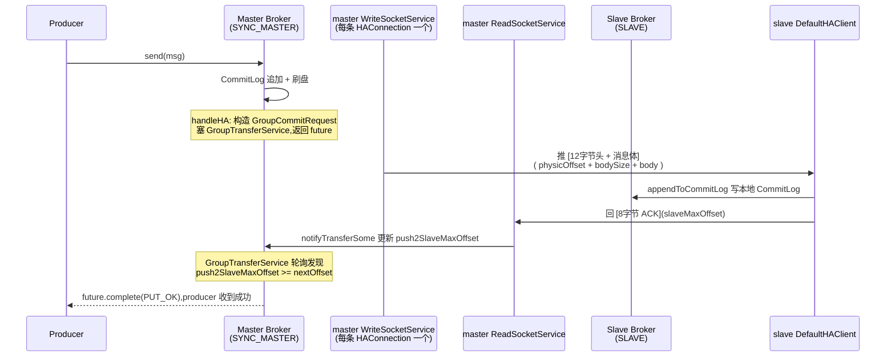

# 第 17 章 · HA 主从复制:同步双写与异步复制

> 篇:P6 高可用
> 主线呼应:这是第 6 篇的开篇,从第 5 篇"路由/NameServer"接过来。NameServer 解决的是"Producer 怎么找到 Broker、Consumer 怎么知道从哪拉",但那只解决了**寻址**——它管不了**消息本身在节点之间不丢**。一台 Broker 上的 CommitLog 写成功了、刷盘了,可这台机器的硬盘坏了呢?整台机器宕了呢?这一篇就要回答"消息怎么跨节点复制不丢",而本章(传统主从复制)是其中最基础、也最贴近生产实战的一条路。读懂它,你才看得懂第 18 章 DLedger 为什么要引入 Raft、第 19 章 Controller 为什么要做 epoch 协议——它们都是在修补本章这套机制的两个缺口:**master 挂了要人工切**、**同步双写的等待要更精细**。

## 核心问题

**master 把 CommitLog 的数据推给 slave、slave 写本地 CommitLog 后回 ACK offset;同步复制(SYNC_MASTER)靠 GroupTransferService 等足够多的 slave ACK 到位才告诉 producer "发送成功",异步复制(ASYNC_MASTER)master 落盘即返回、复制在后台慢慢追。这一套 HA 协议(master→slave 推数据 + slave→master 回 ACK)和 GroupTransferService 的等待机制,凭什么既不阻塞 IO 线程、又能在同步模式下真的等到 slave?**

读完本章你会明白:

1. 传统主从复制的双向数据流长什么样:master 的 `WriteSocketService` 主动把 CommitLog 一段段推给 slave(不是 slave 拉!),slave 的 `DefaultHAClient` 写本地 CommitLog 后,通过同一个 TCP 连接反向回一个 8 字节的 ACK offset。
2. HA 协议帧的两种布局:master→slave 的传输头是 **12 字节(8 字节 physicOffset + 4 字节 bodySize)后跟消息体**;slave→master 的上报头只有 **8 字节(slaveMaxOffset)**——精打细磨到字节。
3. 同步双写和异步复制在源码里的真正分叉点不是某个 if 分支,而是 `inSyncReplicas` 这个配置:`needAckNums <= 1` 直接放行(异步语义),`> 1` 才构造 `GroupCommitRequest` 塞进 `GroupTransferService` 等待队列。
4. `GroupTransferService` 凭什么让"等 slave ACK 到 offset N"这件事不阻塞发送线程:它把请求扔进一个双缓冲队列、自己单线程轮询检查 `push2SlaveMaxOffset`、到位用 `CompletableFuture.complete()` 异步唤醒发送链路——这是和第 4 章 `GroupCommitService`(同步刷盘等待)同构的招数。

> **如果一读觉得太难**:先只记住三件事——① master 主动推 CommitLog 给 slave(不是 slave 拉),slave 写完回 ACK offset;② 异步复制 master 落盘就返回,同步复制要等 slave ACK;③ 同步复制的"等"不是发送线程自己等,而是甩给 `GroupTransferService` 一个 `CompletableFuture`,后台轮询检查到位再唤醒。这三件事撑起整章,其余细节都是怎么把它们做对、做快。

---

## 17.1 一句话点破

> **RocketMQ 的传统主从复制是"master 推、slave 回 ACK"的单 TCP 双向流:master 的 WriteSocketService 顺着 CommitLog 一段段往 slave 推数据(12 字节头 + 消息体),slave 写本地 CommitLog 后用同一条连接反向回 8 字节的 slaveMaxOffset。异步复制下 master 落盘即告诉 producer 成功,复制在后台追;同步复制下发送线程把"等 ACK 到 N"封装成一个 CompletableFuture 甩给 GroupTransferService,自己不阻塞,后台线程轮询检查 push2SlaveMaxOffset 到位再唤醒。这套机制的命脉是"等待解耦":等的人不干活,干活的人不等。**

这是结论,不是理由。本章倒过来拆:先看为什么需要跨节点复制(单机刷盘还不够),再看这条 master↔slave 的双向数据流是怎么走的,接着看同步/异步两种模式在源码里怎么分叉,最后钻进 GroupTransferService 的等待机制——这是本章最硬的技巧,也是和第 4 章同步刷盘的 `GroupCommitService` 同构的一招。

---

## 17.2 为什么单机刷盘还不够:跨节点复制的动机

第 4 章(P1-04)我们讲透了刷盘:写到 `MappedByteBuffer` 只是页缓存,`GroupCommitService` 同步刷盘会等 `force()` 把页缓存真正写到磁盘,这才算"掉电不丢"。可这只防住了**掉电**——它防不住**整块盘坏了**、**机器主板烧了**、**机房断网了**。一个 Broker 进程跑在一台物理机/虚拟机上,这台机器的任何硬件故障,都让单机刷盘的努力归零。

> **不这样会怎样**:假设 RocketMQ 只有单机刷盘、没有跨节点复制。一台 Broker 收了 100 万条订单消息,全部 `force()` 到磁盘,看起来万无一失。半夜这块 SSD 坏了——100 万条消息全没。下游消费者重连,从 NameServer 拿到这台 Broker 还"活着"(心跳还没超时),拉不到消息,业务方直到天亮才发现。这就是为什么 MQ 在生产环境**几乎从不止一份**:消息必须有副本。

跨节点复制(High Availability,HA)就是给 CommitLog 再造一份(或多份)拷贝,放在不同机器上。一台机器坏了,另一台上的副本还在,消息不丢。RocketMQ 的传统主从复制是其中最朴素的一种:**一主多从**,master 负责写、负责把数据推给所有 slave;slave 只负责收数据、写本地 CommitLog。这听起来简单,但"怎么推、怎么确认推到了、怎么在发送路径上等"——每一步都有讲究。

RocketMQ 在这一层引入了两种语义,对应 `BrokerRole` 这个枚举([BrokerRole.java](../rocketmq/store/src/main/java/org/apache/rocketmq/store/config/BrokerRole.java)):

```java
public enum BrokerRole {
    ASYNC_MASTER,   // 异步复制:master 落盘即返回 producer,复制在后台追
    SYNC_MASTER,    // 同步双写:master 要等足够 slave ACK 才告诉 producer 成功
    SLAVE;          // 从节点:不接 producer 写,只收 master 推来的数据
}
```

三种角色的分工:

- **ASYNC_MASTER**:写入吞吐优先。producer 发消息,master 把消息写进 CommitLog(刷盘与否另说,P1-04 已讲)、立刻返回成功;复制完全是后台的事,slave 落后 master 几秒也无所谓。代价是 master 在 slave 还没追上时挂掉,那一段没复制的数据丢。
- **SYNC_MASTER**:一致性优先。producer 发消息,master 写 CommitLog 后**不急着返回**,要等到足够数量的 slave 也确认收到了(ACK 到了这条消息的 offset),才告诉 producer 成功。代价是延迟变高(要等一个 RTT 往返 + slave 落盘),吞吐降低。
- **SLAVE**:不接 producer 写,只被动接收 master 推来的数据,写本地 CommitLog,定期把"我已经收到哪了"上报给 master。

> **钉死这件事**:异步复制和同步双写的取舍,本质是 **CAP 里 C 和 P/A 的权衡** 在 MQ 场景的具体化:异步复制牺牲一致性(可能丢一小段)换高吞吐低延迟;同步双写牺牲吞吐延迟换不丢。RocketMQ 把这个选择权交给运维——同一个 Broker,配 `brokerRole=ASYNC_MASTER` 还是 `SYNC_MASTER`,就是选哪条路。没有银弹。

这个取舍看起来是"配置"层面的事,但它真正落到代码里,是 `CommitLog.handleHA` 里一个关键的判断:`needAckNums`。我们等会就钻进去。

---

## 17.3 双向数据流:master 推、slave 回 ACK

先卸一个最容易误解的包袱:**主从复制是 master 推数据给 slave,不是 slave 主动拉**。

很多人第一次看 HA 都以为是 slave 拉的——因为消费端是 consumer pull(P3-09)、因为 HTTP 世界里大多是客户端拉服务端。但 RocketMQ 的 HA 不是:master 主动把 CommitLog 的新数据推给 slave,slave 被动接收、写本地、再反向回 ACK。这是为什么?

> **不这样会怎样**:假设让 slave 主动拉。slave 怎么知道 master 哪里有新数据?它得不停问"master,你 CommitLog 写到哪了?比我多的给我"。这一问一答,每次都要 slave 发请求、master 回响应,网络往返翻倍。更糟的是,master 写 CommitLog 是高频率事件(每条消息都写),slave 不可能实时知道,只能轮询——轮询间隔太长则复制延迟大,太短则空请求刷爆网络。把"推送权"交给 master 反而干净:master 知道自己写到哪了,有新数据就推,没新数据就发心跳维持连接。

这条 master↔slave 的双向流,长这样(同步双写模式,producer 也在等):



注意这条 TCP 连接是**全双工**的:master 的 `WriteSocketService` 往 slave 写数据,同一个连接上 master 的 `ReadSocketService` 读 slave 回的 ACK。slave 端的 `DefaultHAClient` 也是同样——一个 socket 既读 master 推来的数据,又往 master 回 ACK。这和 Kafka 的 follower pull 模型完全相反,但 RocketMQ 选这条路有自己的道理(后文技巧精解讲)。

### master 端:DefaultHAService + 两条服务线程

master 侧的入口是 `DefaultHAService`([DefaultHAService.java](../rocketmq/store/src/main/java/org/apache/rocketmq/store/ha/DefaultHAService.java)),它的 `init` 方法([:68](../rocketmq/store/src/main/java/org/apache/rocketmq/store/ha/DefaultHAService.java#L68))根据 brokerRole 决定建什么:

```java
@Override
public void init(final DefaultMessageStore defaultMessageStore) throws IOException {
    this.defaultMessageStore = defaultMessageStore;
    this.acceptSocketService = new DefaultAcceptSocketService(defaultMessageStore.getMessageStoreConfig());
    this.groupTransferService = new GroupTransferService(this, defaultMessageStore);
    if (this.defaultMessageStore.getMessageStoreConfig().getBrokerRole() == BrokerRole.SLAVE) {   // :72
        this.haClient = new DefaultHAClient(this.defaultMessageStore);
    }
    this.haConnectionStateNotificationService = new HAConnectionStateNotificationService(this, defaultMessageStore);
}
```

注意一个细节:**`DefaultHAClient` 只在 SLAVE 角色才建**([:72](../rocketmq/store/src/main/java/org/apache/rocketmq/store/ha/DefaultHAService.java#L72))。因为只有 slave 才需要连 master 拉数据;master 自己不连别人。master 侧的核心是 `AcceptSocketService`——它监听 HA 端口(`haListenPort`,默认 10912),等 slave 来连。

`AcceptSocketService` 是个标准的 NIO acceptor,它的 `run` 方法([:342](../rocketmq/store/src/main/java/org/apache/rocketmq/store/ha/DefaultHAService.java#L342))就是经典的 selector + OP_ACCEPT 循环:

```java
while (!this.isStopped()) {
    this.selector.select(1000);
    Set<SelectionKey> selected = this.selector.selectedKeys();
    if (selected != null) {
        for (SelectionKey k : selected) {
            if (k.isAcceptable()) {
                SocketChannel sc = ((ServerSocketChannel) k.channel()).accept();
                if (sc != null) {
                    HAConnection conn = createConnection(sc);   // :359 建 DefaultHAConnection
                    DefaultHAService.this.addConnection(conn);
                    conn.start();                                // 启动这条连接的读写双服务
                }
            }
        }
        selected.clear();
    }
}
```

每来一个 slave 连接,就 `createConnection` 建一个 `DefaultHAConnection`([:273](../rocketmq/store/src/main/java/org/apache/rocketmq/store/ha/DefaultHAService.java#L273) 调 `new DefaultHAConnection`)、加进 `connectionList`、`conn.start()` 启动它。**一条 HAConnection 对应一个 slave**,这条连接内部又开了**两个** `ServiceThread`:`ReadSocketService` 读 slave 的 ACK、`WriteSocketService` 往 slave 推数据。看 `DefaultHAConnection.start`([:80](../rocketmq/store/src/main/java/org/apache/rocketmq/store/ha/DefaultHAConnection.java#L80)):

```java
public void start() {
    changeCurrentState(HAConnectionState.TRANSFER);
    this.flowMonitor.start();
    this.readSocketService.start();    // 读 slave ACK 的线程
    this.writeSocketService.start();   // 推数据给 slave 的线程
}
```

> **钉死这件事**:master 侧的并发模型是"**每条 HAConnection 两个线程**"。一个 master 带 N 个 slave,就有 N 条 HAConnection、2N 个 HA 线程在跑(加上一个 `GroupTransferService`、一个 `AcceptSocketService`)。这种"每连接独立线程"的模型对 HA 场景合适:HA 连接数少(通常 1~2 个 slave)、每条连接的数据流是大块连续的(CommitLog 顺序数据),独立线程能把这条连接的吞吐跑满,不互相干扰。这和第 13 章的 Remoting Netty 主从 Reactor(大量短连接复用线程池)是两套模型——HA 是少量长连接、独占线程,更简单直接。

### WriteSocketService:master 怎么推数据

`WriteSocketService.run`([:275](../rocketmq/store/src/main/java/org/apache/rocketmq/store/ha/DefaultHAConnection.java#L275))是 master 推数据的核心。简化后的主循环:

```java
while (!this.isStopped()) {
    this.selector.select(1000);

    if (-1 == DefaultHAConnection.this.slaveRequestOffset) {   // :282 等 slave 先报一个起始 offset
        Thread.sleep(10);
        continue;
    }

    if (-1 == this.nextTransferFromWhere) {                    // :287 第一次推,确定从哪开始
        if (0 == DefaultHAConnection.this.slaveRequestOffset) {
            // slave 是全新机器,从 master 当前 CommitLog 末尾开始(对齐到文件边界)
            long masterOffset = ...getCommitLog().getMaxOffset();
            masterOffset = masterOffset - (masterOffset % mappedFileSizeCommitLog);   // :290-293
            this.nextTransferFromWhere = masterOffset;
        } else {
            this.nextTransferFromWhere = DefaultHAConnection.this.slaveRequestOffset;  // :301 从 slave 报的 offset 开始
        }
    }

    // 取一段 CommitLog 数据
    SelectMappedBufferResult selectResult =
        defaultMessageStore.getCommitLogData(this.nextTransferFromWhere);   // :333
    if (selectResult != null) {
        int size = selectResult.getSize();
        if (size > haTransferBatchSize) size = haTransferBatchSize;          // 单次最多推 batchSize
        int canTransferMaxBytes = flowMonitor.canTransferMaxByteNum();        // :341 限流
        if (size > canTransferMaxBytes) size = canTransferMaxBytes;

        long thisOffset = this.nextTransferFromWhere;
        this.nextTransferFromWhere += size;

        // 构造 12 字节头 + bodySize 字节体
        this.byteBufferHeader.putLong(thisOffset);   // physicOffset (8字节)
        this.byteBufferHeader.putInt(size);          // bodySize   (4字节)
        this.lastWriteOver = this.transferData();    // :365 推出去
    } else {
        // 没新数据,等 100ms(长轮询思路)
        haService.getWaitNotifyObject().allWaitForRunning(100);   // :368
    }
}
```

几个关键点拆开讲:

1. **slave 先报一个起始 offset**([:282](../rocketmq/store/src/main/java/org/apache/rocketmq/store/ha/DefaultHAConnection.java#L282)):`slaveRequestOffset` 一开始是 -1,master 啥也不推,等 slave 先来个 ACK 告诉它"我从 offset X 开始要"。这是因为 master 不知道 slave 当前有多少数据——可能 slave 是新机器从 0 开始,也可能是断线重连从某个中间位置续传。**让 slave 主动报起点,避免 master 推重了或推漏了**。

2. **首次推的 offset 对齐**([:288-299](../rocketmq/store/src/main/java/org/apache/rocketmq/store/ha/DefaultHAConnection.java#L288-L299)):如果 slave 报 0(全新机器),master 不从 0 开始推,而是从自己当前 CommitLog 的**最大 offset 对齐到文件边界**开始。为什么?因为全新 slave 历史数据不要(也存不下全量),只要从"现在开始"的新数据。对齐到 `mappedFileSizeCommitLog`(默认 1GB)边界,是为了让 slave 一开始就从一个完整的 MappedFile 起步,文件管理干净。

3. **批量推送 + 限流**([:337-350](../rocketmq/store/src/main/java/org/apache/rocketmq/store/ha/DefaultHAConnection.java#L337-L350)):不是有一条消息就推一次,而是攒到 `haTransferBatchSize`(默认 32KB)或时间到了才推一批。同时 `flowMonitor.canTransferMaxByteNum()` 做限流——复制速度不能超过 `maxHaTransferByteInSecond`(默认 0 即不限),防止复制流量把网卡/磁盘打爆影响业务。

4. **没新数据时长等待**([:368](../rocketmq/store/src/main/java/org/apache/rocketmq/store/ha/DefaultHAConnection.java#L368)):`getCommitLogData` 返回 null 表示 master 这边没新消息可推,这时不忙等,而是 `allWaitForRunning(100)`——这是 `WaitNotifyObject` 的等待 100ms。新消息来时 `CommitLog` 会调 `haService.getWaitNotifyObject().wakeupAll()` 唤醒它(类似第 9 章长轮询的思路)。

`transferData`([:408](../rocketmq/store/src/main/java/org/apache/rocketmq/store/ha/DefaultHAConnection.java#L408))把 12 字节头 + body 一起写 socket。这里有个**复用 `SelectMappedBufferResult` 的零拷贝小技巧**:`getCommitLogData` 返回的是 CommitLog 的 `MappedByteBuffer` 的一个 slice(直接指向 mmap 的页缓存),`socketChannel.write(byteBuffer)` 直接把页缓存的数据送到网卡,**全程不进 JVM 堆**——这和第 8 章 P2-08 讲的 sendfile 思路一脉相承,只是 HA 这里用的是 `SocketChannel.write`(底层走 sendfile 或等价的 kernel transfer),不是 `FileChannel.transferTo`。

### ReadSocketService:master 怎么读 slave 的 ACK

`ReadSocketService.processReadEvent`([:211](../rocketmq/store/src/main/java/org/apache/rocketmq/store/ha/DefaultHAConnection.java#L211))是 master 读 ACK 的核心:

```java
private boolean processReadEvent() {
    // ...
    while (this.byteBufferRead.hasRemaining()) {
        int readSize = this.socketChannel.read(this.byteBufferRead);   // :221
        if (readSize > 0) {
            // 每凑够 8 字节(REPORT_HEADER_SIZE),解析出一个 ACK offset
            if ((this.byteBufferRead.position() - this.processPosition) >= DefaultHAClient.REPORT_HEADER_SIZE) {  // :225
                int pos = this.byteBufferRead.position() - (this.byteBufferRead.position() % DefaultHAClient.REPORT_HEADER_SIZE);
                long readOffset = this.byteBufferRead.getLong(pos - 8);   // :227 读出 slaveMaxOffset
                this.processPosition = pos;

                DefaultHAConnection.this.slaveAckOffset = readOffset;     // :230 更新这条连接的 slaveAckOffset
                if (DefaultHAConnection.this.slaveRequestOffset < 0) {     // :231 首次 ACK 顺便确定推送起点
                    DefaultHAConnection.this.slaveRequestOffset = readOffset;
                }

                DefaultHAConnection.this.haService.notifyTransferSome(readOffset);  // :236 通知"复制有进展"
            }
        }
        // ...
    }
}
```

每个 ACK 是 8 字节,就是一个 `long`——slave 当前 CommitLog 的最大 offset(`slaveMaxOffset`)。master 收到后做两件事:更新 `slaveAckOffset`(这条连接对应 slave 的最新进度,后面 GroupTransferService 用它判断"够不够 slave ACK 了")、调 `haService.notifyTransferSome`([DefaultHAService.java:107](../rocketmq/store/src/main/java/org/apache/rocketmq/store/ha/DefaultHAService.java#L107)):

```java
public void notifyTransferSome(final long offset) {
    for (long value = this.push2SlaveMaxOffset.get(); offset > value; ) {
        boolean ok = this.push2SlaveMaxOffset.compareAndSet(value, offset);   // :109 CAS 更新全局最大已复制 offset
        if (ok) {
            this.groupTransferService.notifyTransferSome();   // :111 唤醒等待的同步双写请求
            break;
        } else {
            value = this.push2SlaveMaxOffset.get();
        }
    }
}
```

这里有个**全局的 `push2SlaveMaxOffset`**(`AtomicLong`)——它记录"所有 slave 里复制进度最靠前的那个 offset"。`notifyTransferSome` 用 CAS 把它单调递增地推到 slave 报上来的 offset。为什么要 CAS?因为多个 slave 的 ACK 并发到达,要保证 `push2SlaveMaxOffset` 只增不减、且线程安全。CAS 失败就重读重试(`value = this.push2SlaveMaxOffset.get()`),典型的乐观锁。

> **钉死这件事**:`push2SlaveMaxOffset` 是 master 全局视角的"复制进度水位线"。GroupTransferService 后面判断"同步双写请求到位没有",就是看这个值有没有盖过请求的 `nextOffset`。它由 `notifyTransferSome` 在每次收到 ACK 时单调推进。

### slave 端:DefaultHAClient

slave 侧的主角是 `DefaultHAClient`([DefaultHAClient.java](../rocketmq/store/src/main/java/org/apache/rocketmq/store/ha/DefaultHAClient.java)),它是个 `ServiceThread`,主循环在 `run`([:303](../rocketmq/store/src/main/java/org/apache/rocketmq/store/ha/DefaultHAClient.java#L303)):

```java
while (!this.isStopped()) {
    switch (this.currentState) {
        case SHUTDOWN: return;
        case READY:
            if (!this.connectMaster()) {   // :315 还没连上,5s 重试
                this.waitForRunning(1000 * 5);
            }
            continue;
        case TRANSFER:
            if (!transferFromMaster()) {   // :321 主循环:报 ACK + 读数据
                closeMasterAndWait();
                continue;
            }
            break;
    }
    // housekeeping:长时间没收到 master 数据,认为连接死了,重连
    long interval = this.defaultMessageStore.now() - this.lastReadTimestamp;
    if (interval > haHousekeepingInterval) {   // :331 默认 10s
        this.closeMaster();
    }
}
```

`transferFromMaster`([:347](../rocketmq/store/src/main/java/org/apache/rocketmq/store/ha/DefaultHAClient.java#L347))是核心,它干三件事:

```java
private boolean transferFromMaster() throws IOException {
    if (this.isTimeToReportOffset()) {                          // 到了上报时间(haSendHeartbeatInterval=5s)
        result = this.reportSlaveMaxOffset(this.currentReportedOffset);  // 主动报一次 ACK
        if (!result) return false;
    }
    this.selector.select(1000);
    result = this.processReadEvent();                           // 读 master 推来的数据
    if (!result) return false;
    return reportSlaveMaxOffsetPlus();                          // 写完本地后立即再报一次 ACK
}
```

注意最后一行 `reportSlaveMaxOffsetPlus`([:231](../rocketmq/store/src/main/java/org/apache/rocketmq/store/ha/DefaultHAClient.java#L231))——slave 每写完一批数据到本地 CommitLog,**立刻**再报一次 ACK。这是关键:**ACK 不是定时报,而是"有进展就报"**。这样同步双写的延迟才能压到最低——master 这边的 `push2SlaveMaxOffset` 能几乎实时地跟着 slave 的写入进度走。

`dispatchReadRequest`([:184](../rocketmq/store/src/main/java/org/apache/rocketmq/store/ha/DefaultHAClient.java#L184))解析 master 推来的数据(12 字节头 + body),调 `defaultMessageStore.appendToCommitLog`([:207](../rocketmq/store/src/main/java/org/apache/rocketmq/store/ha/DefaultHAClient.java#L207))直接把字节追加进 slave 本地的 CommitLog。这里有个**一致性检查**([:195-201](../rocketmq/store/src/main/java/org/apache/rocketmq/store/ha/DefaultHAClient.java#L195-L201)):

```java
long slavePhyOffset = this.defaultMessageStore.getMaxPhyOffset();   // slave 本地当前末尾
if (slavePhyOffset != 0) {
    if (slavePhyOffset != masterPhyOffset) {   // master 推的起点必须等于 slave 本地末尾
        log.error("master pushed offset not equal the max phy offset in slave, ...");
        return false;   // 不一致就断连,防止数据错位
    }
}
```

master 推过来的 `masterPhyOffset`(传输头里的 physicOffset)必须**严格等于** slave 本地 CommitLog 的当前末尾 offset。如果 master 推的比 slave 本地多一块(中间有空洞)或少一块(重复),立刻报错断连——**复制是严格的顺序追加,不容错位**。这是个朴素但关键的不变式(invariant):它保证了 slave 本地的 CommitLog 和 master 的 CommitLog 在已复制区间内字节级一致。

### HA 协议帧布局(ASCII 框图)

把两种方向的帧布局画清楚:

```
 master ──推数据──▶ slave    每一帧:
 ┌────────────────────────────────┬───────────────────────────────────┐
 │       Transfer Header (12B)    │            Body (bodySize B)      │
 ├────────────────┬───────────────┼───────────────────────────────────┤
 │ physicOffset   │  bodySize     │  CommitLog 的原始字节(消息)        │
 │   (8 bytes)    │  (4 bytes)    │                                   │
 └────────────────┴───────────────┴───────────────────────────────────┘
 physicOffset: 这一帧 body 在 CommitLog 的起始物理偏移
 bodySize:     这一帧 body 的字节数(可能含多条消息,batch)
 body:         直接取自 master CommitLog 的 MappedByteBuffer(零拷贝送网卡)

 slave ──回 ACK──▶ master    每一帧:
 ┌────────────────────────────────┐
 │     Report Header (8B)         │
 ├────────────────────────────────┤
 │       slaveMaxOffset           │
 │         (8 bytes)              │
 └────────────────────────────────┘
 slaveMaxOffset: slave 本地 CommitLog 当前最大 offset
                 (= 已成功写入的字节数,告诉 master "我收到这了")
```

注意 ACK 帧**只有 8 字节**,没有 size 字段——因为 ACK 是定长的(永远是一个 long),master 这边 `processReadEvent` 每凑够 8 字节就解析一个,流式处理。这是把协议压到最省的体现:slave 上报一个数字,master 就知道一切。

---

## 17.4 同步双写与异步复制:一个配置,两条路

讲完双向数据流,回到核心问题:同步和异步在源码里到底怎么分叉?

很多人以为分叉点是 `if (brokerRole == SYNC_MASTER)`。**不是**。真正的分叉点是 `needAckNums`——一个由 `inSyncReplicas` 配置算出来的"需要多少份 ACK(含 master)才算成功"的数字。看 `CommitLog` 在 `asyncPutMessage` 里怎么算它([CommitLog.java:1017](../rocketmq/store/src/main/java/org/apache/rocketmq/store/CommitLog.java#L1017)):

```java
int needAckNums = this.defaultMessageStore.getMessageStoreConfig().getInSyncReplicas();  // :1017 默认 1
boolean needHandleHA = needHandleHA(msg);                                                 // :1018

if (needHandleHA && this.defaultMessageStore.getBrokerConfig().isEnableControllerMode()) {
    // ... 5.x Controller 模式(P6-19 讲),本章跳过 ...
} else if (needHandleHA && this.defaultMessageStore.getBrokerConfig().isEnableSlaveActingMaster()) {
    // ... slave acting master 模式,本章跳过 ...
}
// 普通模式:needAckNums 就是 inSyncReplicas 配置值
```

`inSyncReplicas` 默认是 1([MessageStoreConfig.java:376](../rocketmq/store/src/main/java/org/apache/rocketmq/store/config/MessageStoreConfig.java#L376)),含义是"含 master 在内,至少几份拷贝算同步成功"。注意:**它含 master 自己**——所以 `inSyncReplicas=1` 意味着只要 master 自己写成功就行(纯异步,不等任何 slave);`inSyncReplicas=2` 意味着 master + 至少 1 个 slave,这才是真正的同步双写。

写完 CommitLog、刷完盘,走到 `handleDiskFlushAndHA`([:1330](../rocketmq/store/src/main/java/org/apache/rocketmq/store/CommitLog.java#L1330)),这里把"刷盘"和"复制"两件事用 `CompletableFuture.thenCombine` **并联**起来:

```java
private CompletableFuture<PutMessageResult> handleDiskFlushAndHA(PutMessageResult putMessageResult,
    MessageExt messageExt, int needAckNums, boolean needHandleHA) {
    CompletableFuture<PutMessageStatus> flushResultFuture = handleDiskFlush(...);   // :1332 刷盘
    CompletableFuture<PutMessageStatus> replicaResultFuture;
    if (!needHandleHA) {
        replicaResultFuture = CompletableFuture.completedFuture(PutMessageStatus.PUT_OK);
    } else {
        replicaResultFuture = handleHA(..., needAckNums);                            // :1337 复制
    }
    return flushResultFuture.thenCombine(replicaResultFuture, (flushStatus, replicaStatus) -> {
        // 两个都成功才算成功                                              // :1340
        ...
    });
}
```

注意 `thenCombine`——刷盘和复制**并发进行**,不是串行等。这是个细节但重要:同步刷盘 + 同步双写不必串行累加延迟,可以并行,谁慢等谁。这是 `CompletableFuture` 全链路异步的好处(第 14 章详讲)。

`handleHA`([:1355](../rocketmq/store/src/main/java/org/apache/rocketmq/store/CommitLog.java#L1355))才是同步/异步的真正分叉:

```java
private CompletableFuture<PutMessageStatus> handleHA(AppendMessageResult result, PutMessageResult putMessageResult,
    int needAckNums) {
    if (needAckNums >= 0 && needAckNums <= 1) {                                   // :1357 异步语义
        return CompletableFuture.completedFuture(PutMessageStatus.PUT_OK);
    }

    HAService haService = this.defaultMessageStore.getHaService();
    long nextOffset = result.getWroteOffset() + result.getWroteBytes();           // :1363 这条消息的尾 offset

    GroupCommitRequest request = new GroupCommitRequest(nextOffset, slaveTimeout, needAckNums);  // :1366
    haService.putRequest(request);                                                 // :1367 塞 GroupTransferService
    haService.getWaitNotifyObject().wakeupAll();                                   // :1368 唤醒推送线程
    return request.future();                                                        // :1369 返回 future,发送线程不等
}
```

两段对照看就清楚了:

- **`needAckNums <= 1`(异步复制)**:直接返回一个已完成的 future(`completedFuture(PUT_OK)`)。发送链路立刻拿到成功,继续往后走。复制在 HA 后台线程自己追,producer 完全不感知。这就是 `ASYNC_MASTER` 或 `inSyncReplicas=1` 的行为。
- **`needAckNums > 1`(同步双写)**:构造一个 `GroupCommitRequest`,里面装着"等 ACK 到 `nextOffset`(这条消息的尾 offset)、至少 `needAckNums` 份(含 master)"。把它塞进 `GroupTransferService` 的等待队列,然后**返回 `request.future()`**——一个尚未完成的 `CompletableFuture`。发送链路拿到这个 future,会被 `thenCombine` 挂起,等 `GroupTransferService` 把它 `complete()` 才继续。

> **钉死这件事**:同步和异步在源码里的分叉,不是"代码走两条不同的路",而是"返回的 future 是已完成的还是待完成的"。异步立刻 `completedFuture`(已完成),同步返回一个待完成的 future、由 `GroupTransferService` 在后台轮询到位后 `complete`。发送链路对这两种情况的处理**完全一样**——都是 `thenCombine` 等待。这就是 `CompletableFuture` 抽象的威力:它把"立刻有结果"和"稍后有结果"统一成同一种编程模型。

`GroupCommitRequest` 本身很简单([CommitLog.java:1634](../rocketmq/store/src/main/java/org/apache/rocketmq/store/CommitLog.java#L1634)):

```java
public static class GroupCommitRequest {
    private final long nextOffset;                                          // 等到 push2SlaveMaxOffset 盖过这个值
    private final CompletableFuture<PutMessageStatus> flushOKFuture = new CompletableFuture<>();  // 唤醒句柄
    private volatile int ackNums = 1;                                       // 需要几份 ACK(含 master)
    private final long deadLine;                                            // 超时时间(System.nanoTime + slaveTimeout)

    public GroupCommitRequest(long nextOffset, long timeoutMillis, int ackNums) {
        this.nextOffset = nextOffset;
        this.deadLine = System.nanoTime() + (timeoutMillis * 1_000_000);
        this.ackNums = ackNums;
    }

    public void wakeupCustomer(final PutMessageStatus status) {
        this.flushOKFuture.complete(status);   // GroupTransferService 调这个唤醒发送链路
    }

    public CompletableFuture<PutMessageStatus> future() {
        return flushOKFuture;
    }
}
```

它就是一个"等待票据":装着要等的目标 offset、要几份 ACK、什么时候超时、一个用来唤醒的 future。发送线程构造它、塞队列、拿 future 走人;`GroupTransferService` 检查条件、调 `wakeupCustomer` 唤醒。两边通过这个对象解耦。

> **关于 `brokerRole` 的修正**:虽然枚举叫 `SYNC_MASTER` / `ASYNC_MASTER`,但**真正决定同步还是异步的是 `inSyncReplicas`**。生产实践里,`SYNC_MASTER` 通常配 `inSyncReplicas=2`(master + 1 slave),`ASYNC_MASTER` 配 `inSyncReplicas=1`。但理论上你可以配一个 `SYNC_MASTER` 但 `inSyncReplicas=1`——这时 `handleHA` 走的还是异步分支(`needAckNums<=1`)。所以看代码逻辑要以 `needAckNums` 为准,`brokerRole` 更多是给运维和监控用的语义标签。这个细节很多人(包括一些资料)讲混了。

---

## 17.5 技巧精解:GroupTransferService 的等待机制

这一节是本章最硬的技巧,也是和第 4 章 `GroupCommitService`(同步刷盘等待)同构的一招。把它拆透,你就懂了 RocketMQ 怎么在"高并发发送"和"严格同步等待"之间两全。

### 问题:同步双写为什么不能发送线程自己等

朴素地想,同步双写最直接的写法是:发送线程写完 CommitLog,自己开个循环 `while (push2SlaveMaxOffset < nextOffset) sleep(1)`,等到了再返回 producer。听起来简单,但这条路撞三堵墙:

1. **发送线程被阻塞**:RocketMQ 的发送路径是 Netty 的 worker 线程池(第 13 章),线程数有限(默认几十个)。如果每条同步消息都让发送线程原地等 slave ACK(一个 RTT,通常 1~5ms),几十个线程很快全卡死在等 ACK 上,新进来的发送请求没线程处理,吞吐直接崩塌。
2. **轮询 sleep 浪费 CPU**:就算不卡 Netty 线程、另开线程等,`while + sleep(1)` 这种忙轮询既烧 CPU 又响应慢(平均多等半个 sleep 周期)。
3. **无法批量处理**:每条消息一个等待循环,slaves 每收到一个 ACK 要唤醒 N 个等待者,无法用一个后台线程统一扫描所有等待请求。

> **不这样会怎样**:对比"纯异步"会怎样?如果彻底不等 slave、master 落盘就返回(异步复制),吞吐延迟都好,但 master 在 slave 还没追上时挂掉,那一段没复制的数据就**永久丢失**。对金融、订单这类不能丢消息的业务,这个代价付不起。所以才需要"同步双写"——既要等,又不能让发送线程傻等。

RocketMQ 的解法是 **GroupTransferService**:一个独立的后台线程,专门干"检查所有等待请求到没到位"这一件事。发送线程只负责"把请求扔进队列",不等。

### 源码:双缓冲队列 + 单线程轮询

`GroupTransferService`([GroupTransferService.java](../rocketmq/store/src/main/java/org/apache/rocketmq/store/ha/GroupTransferService.java))的结构和第 4 章的 `GroupCommitService` 几乎一模一样——**双缓冲队列(swapRequests)+ 单线程 doWaitTransfer**。看核心字段([:42-47](../rocketmq/store/src/main/java/org/apache/rocketmq/store/ha/GroupTransferService.java#L42-L47)):

```java
private final WaitNotifyObject notifyTransferObject = new WaitNotifyObject();
private final PutMessageSpinLock lock = new PutMessageSpinLock();              // 保护队列的自旋锁
private volatile List<CommitLog.GroupCommitRequest> requestsWrite = new LinkedList<>();  // 写队列(发送线程塞这)
private volatile List<CommitLog.GroupCommitRequest> requestsRead = new LinkedList<>();   // 读队列(后台扫这)
```

两个队列,一个给发送线程塞请求(`requestsWrite`),一个给后台线程扫描(`requestsRead`)。发送线程调 `putRequest`([:54](../rocketmq/store/src/main/java/org/apache/rocketmq/store/ha/GroupTransferService.java#L54)):

```java
public void putRequest(final CommitLog.GroupCommitRequest request) {
    lock.lock();
    try {
        this.requestsWrite.add(request);   // 塞写队列
    } finally {
        lock.unlock();
    }
    this.wakeup();                          // 唤醒后台线程
}
```

发送线程的代价极小:一次自旋锁(只在 add 那一瞬间)、一次 wakeup。**不阻塞、不轮询、不等 slave**。然后立刻返回 `request.future()` 给上层。

后台线程的主循环在 `run`([:149](../rocketmq/store/src/main/java/org/apache/rocketmq/store/ha/GroupTransferService.java#L149)):

```java
while (!this.isStopped()) {
    this.waitForRunning(10);     // 每 10ms 醒一次(或被 wakeup 提前唤醒)
    this.doWaitTransfer();        // 扫读队列,检查每个请求到没到位
}
```

`waitForRunning(10)` 是 `ServiceThread` 的方法:最多等 10ms,期间可以被 `wakeup()` 提前唤醒。醒来后 `onWaitEnd` 会调 `swapRequests`([:68](../rocketmq/store/src/main/java/org/apache/rocketmq/store/ha/GroupTransferService.java#L68))——**把写队列和读队列交换**:

```java
private void swapRequests() {
    lock.lock();
    try {
        List<CommitLog.GroupCommitRequest> tmp = this.requestsWrite;
        this.requestsWrite = this.requestsRead;
        this.requestsRead = tmp;     // 交换:发送线程接下来塞的是新(空)队列,后台扫的是旧(满)队列
    } finally {
        lock.unlock();
    }
}
```

这就是双缓冲的精髓:**交换是 O(1) 的指针赋值,不是 O(n) 的元素搬移**。交换后,发送线程往新的空 `requestsWrite` 塞新请求,后台线程专心扫旧的 `requestsRead`——两者几乎不竞争同一把锁(只在 swap 的瞬间短暂持有)。

> **钉死这件事**:双缓冲队列(swap then process)是 RocketMQ 处理"高并发入队 + 单线程消费"的标准招数。它把入队和出队的锁竞争降到最小:入队只需短暂锁住 add,出队(扫描)完全不需要锁(扫的是自己私有的读队列)。代价是延迟最多一个 swap 周期(这里 10ms)——对 HA 等待这种"本来就要等 RTT 级延迟"的场景,10ms 的额外抖动完全可接受。这个模式在第 4 章 `GroupCommitService`、这里 `GroupTransferService` 反复出现,是 RocketMQ 后台服务的招牌。

### doWaitTransfer:轮询检查 + 唤醒

真正的检查逻辑在 `doWaitTransfer`([:79](../rocketmq/store/src/main/java/org/apache/rocketmq/store/ha/GroupTransferService.java#L79)):

```java
private void doWaitTransfer() {
    if (!this.requestsRead.isEmpty()) {
        for (CommitLog.GroupCommitRequest req : this.requestsRead) {
            boolean transferOK = false;
            long deadLine = req.getDeadLine();
            final boolean allAckInSyncStateSet = req.getAckNums() == MixAll.ALL_ACK_IN_SYNC_STATE_SET;

            for (int i = 0; !transferOK && deadLine - System.nanoTime() > 0; i++) {  // :87 没成功且没超时就继续
                if (i > 0) {
                    this.notifyTransferObject.waitForRunning(1);   // :89 每轮等 1ms,避免空转
                }

                if (!allAckInSyncStateSet && req.getAckNums() <= 1) {  // :92 异步语义(inSyncReplicas=1)
                    transferOK = haService.getPush2SlaveMaxOffset().get() >= req.getNextOffset();
                    continue;
                }
                // ... allAckInSyncStateSet 分支(5.x Controller 模式,P6-19 讲)...

                // 同步双写主分支(:119):数有几个 slave 的 slaveAckOffset 盖过 nextOffset
                int ackNums = 1;   // 含 master
                for (HAConnection conn : haService.getConnectionList()) {
                    if (conn.getSlaveAckOffset() >= req.getNextOffset()) {   // :125 这个 slave 够了吗
                        ackNums++;
                    }
                    if (ackNums >= req.getAckNums()) {   // :128 凑够了
                        transferOK = true;
                        break;
                    }
                }
            }

            if (!transferOK) {
                log.warn("transfer message to slave timeout, offset : {}, request acks: {}", ...);  // :137
            }

            req.wakeupCustomer(transferOK ? PutMessageStatus.PUT_OK : PutMessageStatus.FLUSH_SLAVE_TIMEOUT);  // :141 唤醒发送链路
        }
        this.requestsRead = new LinkedList<>();   // 清空,下轮 swap 进新请求
    }
}
```

逐段拆:

1. **外层 for 扫每个请求**:对读队列里的每个 `GroupCommitRequest`,单独判断它到没到位。

2. **内层 for 轮询检查**([:87](../rocketmq/store/src/main/java/org/apache/rocketmq/store/ha/GroupTransferService.java#L87)):`while (!transferOK && 还没超时)`。每轮先 `waitForRunning(1)`(第一轮除外)睡 1ms——既不空转烧 CPU,又能在 slave ACK 到来时被 `notifyTransferSome` 提前唤醒(那个方法调 `notifyTransferObject.wakeup()`)。这是个**带唤醒的轮询**:平时 1ms 一查,有进展立刻醒。

3. **判断条件**([:119-133](../rocketmq/store/src/main/java/org/apache/rocketmq/store/ha/GroupTransferService.java#L119-L133)):遍历所有 `HAConnection`(每个 slave 一条),数有几个 slave 的 `slaveAckOffset >= req.getNextOffset()`。`ackNums` 从 1 开始(含 master 自己),每凑够一个 slave 就 +1,到 `req.getAckNums()` 就算成功。这是"含 master 算一份"的逻辑体现。

4. **超时处理**([:136-141](../rocketmq/store/src/main/java/org/apache/rocketmq/store/ha/GroupTransferService.java#L136-L141)):如果到 `deadLine`(`slaveTimeout`,默认 3000ms)还没凑够 ACK,标记 `transferOK=false`,照样调 `wakeupCustomer`——只是 status 是 `FLUSH_SLAVE_TIMEOUT`(告诉 producer "同步超时,slave 可能没收到")。producer 收到这个状态可以选择重发或告警。**超时不是无限等**:这是防止 slave 全挂时 master 把发送链路卡死。

5. **唤醒发送链路**([:141](../rocketmq/store/src/main/java/org/apache/rocketmq/store/ha/GroupTransferService.java#L141)):`req.wakeupCustomer(status)` 内部就是 `flushOKFuture.complete(status)`。这个 `complete` 会让当初 `handleHA` 返回的那个 `CompletableFuture` 进入完成状态,挂在它上面的 `thenCombine`(在 `handleDiskFlushAndHA`)继续往下走,最终触发给 producer 的响应。**发送线程从头到尾没在这个流程里阻塞过**——它只是注册了一个回调链,后台线程到位后触发回调。

> **钉死这件事**:`GroupTransferService` 的等待机制三件套——① 双缓冲队列让发送线程入队不阻塞;② 单线程轮询 + waitForRunning(1) + notifyTransferSome 唤醒,既不空转又实时;③ 到位/超时都用 `CompletableFuture.complete` 异步唤醒发送链路。这套机制让"同步双写"在源码层面看起来和"异步"几乎一样(都是 future 链),只是异步的 future 立刻完成、同步的 future 等后台 complete。这是 RocketMQ 全链路异步(第 14 章)在 HA 这层的落地。

### 反面对比:三种错误写法各撞什么墙

把这套机制和三种朴素写法对照,妙处就显形了:

| 写法 | 撞什么墙 | GroupTransferService 怎么避开 |
|------|---------|------------------------------|
| 发送线程自己 `while + sleep` 等 | 阻塞 Netty worker 线程,几十条同步消息卡死整个发送池 | 发送线程只入队不等待,立即返回 future |
| 每条消息开一个独立等待线程 | 线程数爆炸(每秒上万条消息 = 上万线程),JVM 扛不住 | 一个后台线程扫所有请求,复用 |
| 不等、纯异步 | master 挂了未复制数据丢失,金融场景不可接受 | needAckNums>1 时走等待分支,真等到 ACK 才返回 |

还有一个更微妙的点:**为什么不用 `CountDownLatch`?** `GroupCommitRequest` 里有个 `CompletableFuture`,看起来像 `CountDownLatch` 的等价物。区别在于 `CompletableFuture` 能嵌进 `thenCombine` 链——刷盘 future 和复制 future 可以**并联等待**(谁慢等谁),而 `CountDownLatch` 是阻塞式的,做不到这种组合。这是 RocketMQ 5.x 之后从 `CountDownLatch` 迁移到 `CompletableFuture` 的核心动机(全链路异步,第 14 章详讲)。

### 与第 4 章 GroupCommitService 的同构

如果你读过第 4 章(P1-04 同步刷盘),会发现 `GroupTransferService` 和 `GroupCommitService`([CommitLog.java:1675](../rocketmq/store/src/main/java/org/apache/rocketmq/store/CommitLog.java#L1675))是**同构**的:

| | GroupCommitService(刷盘) | GroupTransferService(复制) |
|---|---|---|
| 等什么 | `flushedWhere >= nextOffset`(磁盘 force 到位) | `push2SlaveMaxOffset >= nextOffset`(slave ACK 到位) |
| 谁推进 | `FlushRealTimeService` / `GroupCommitService` 自己调 `mappedFileQueue.flush` | slave ACK 到来,`notifyTransferSome` CAS 推进 `push2SlaveMaxOffset` |
| 怎么唤醒 | flush 完调 `wakeupCustomer` | ACK 到位调 `wakeupCustomer` |
| 数据结构 | 双缓冲 LinkedList + PutMessageSpinLock | 双缓冲 LinkedList + PutMessageSpinLock |
| 触发 | `CommitLog.handleDiskFlush` 塞请求 | `CommitLog.handleHA` 塞请求 |

两套机制解决的是同构的问题:"前台不阻塞、后台等条件、到位异步唤醒"。一个等磁盘、一个等网络。读懂一个,另一个就通了。这是 RocketMQ 设计的一致性——同类问题用同类解法。

---

## 17.6 复制限流:FlowMonitor 与 inSync 判定

讲完等待机制,补两个实用细节。

### FlowMonitor:复制流量限流

`FlowMonitor`([FlowMonitor.java](../rocketmq/store/src/main/java/org/apache/rocketmq/store/ha/FlowMonitor.java))是个简单的每秒测速器。每条 HAConnection 和每个 DefaultHAClient 各持有一个。核心方法 `canTransferMaxByteNum`([:47](../rocketmq/store/src/main/java/org/apache/rocketmq/store/ha/FlowMonitor.java#L47)):

```java
public int canTransferMaxByteNum() {
    if (this.isFlowControlEnable()) {   // haFlowControlEnable,默认 false
        long res = Math.max(this.maxTransferByteInSecond() - this.transferredByte.get(), 0);
        return res > Integer.MAX_VALUE ? Integer.MAX_VALUE : (int) res;
    }
    return Integer.MAX_VALUE;   // 不限流时返回最大值,等于不限
}
```

测速靠 `calculateSpeed`([:42](../rocketmq/store/src/main/java/org/apache/rocketmq/store/ha/FlowMonitor.java#L42))——一个后台线程每秒把这一秒累计的字节数存进 `transferredByteInSecond`、清零计数器。`WriteSocketService` 推数据前查 `canTransferMaxByteNum`,超了就少推(`size = canTransferMaxBytes`,[:349](../rocketmq/store/src/main/java/org/apache/rocketmq/store/ha/DefaultHAConnection.java#L349))。

> **不这样会怎样**:复制流量和业务流量共享同一块网卡、同一组磁盘。一个 master 带 2 个 slave,复制流量轻松吃掉一半带宽。如果不限流,大批量补数据时(比如 slave 重启后追赶),复制流量可能把 master 的 producer 写入、consumer 拉取全挤死。`FlowMonitor` 给运维一个旋钮(`maxHaTransferByteInSecond`),必要时压住复制速度,保业务优先。默认关闭(返回 `Integer.MAX_VALUE`),需要时打开。

### inSync 判定与 haMaxGapNotInSync

`DefaultHAService.isInSyncSlave`([:201](../rocketmq/store/src/main/java/org/apache/rocketmq/store/ha/DefaultHAService.java#L201))判断一个 slave 算不算"在同步集合里":

```java
protected boolean isInSyncSlave(final long masterPutWhere, HAConnection conn) {
    if (masterPutWhere - conn.getSlaveAckOffset() < this.defaultMessageStore.getMessageStoreConfig()
        .getHaMaxGapNotInSync()) {   // haMaxGapNotInSync 默认 256MB
        return true;
    }
    return false;
}
```

如果一个 slave 落后 master 超过 `haMaxGapNotInSync`(默认 256MB),就算它连着、ACK 也来,也不算"in sync"——它落后太远,可能是性能问题或网络问题。`inSyncReplicasNums`([:191](../rocketmq/store/src/main/java/org/apache/rocketmq/store/ha/DefaultHAService.java#L191))用这个统计当前有几个 in-sync 副本,供 5.x Controller 模式和 `minInSyncReplicas` 检查用(第 19 章详讲)。本章里它主要用于监控和 `isSlaveOK` 判断([:98](../rocketmq/store/src/main/java/org/apache/rocketmq/store/ha/DefaultHAService.java#L98))——slave 落后太多时,producer 拿到的可用副本数会减少。

---

## 17.7 把传统主从放回主线

回到全书的二分法:**存储内核 vs 分布式骨架**。HA 主从复制显然落在**分布式骨架**这一面——它不关心消息怎么编码、CommitLog 怎么追加(那是第 1~2 篇的事),它关心的是"已经在 master CommitLog 里写好的消息,怎么可靠地再多造几份拷贝、跨节点不丢"。

但 HA 和存储内核有一个**关键衔接点**:slave 收到 master 推来的字节后,调的是 `defaultMessageStore.appendToCommitLog`([DefaultHAClient.java:207](../rocketmq/store/src/main/java/org/apache/rocketmq/store/ha/DefaultHAClient.java#L207))——直接往 slave 本地的 CommitLog 追加。这意味着 slave 的 CommitLog 和 master 的 CommitLog 在已复制区间内是**字节级一致**的。这是个精妙的设计:**slave 不需要重新解析消息、重新分配 offset**,它只是把 master 的字节原样写进自己的 CommitLog。于是 slave 上的 ConsumeQueue、IndexFile 都能由 slave 自己的 `ReputMessageService`(第 5 章)从本地 CommitLog 异步分发出来,逻辑和 master 完全一样——一套存储内核代码,master 和 slave 复用。

> **钉死这件事**:传统主从复制的精髓是"**字节级复制 CommitLog**"。master 推的是 CommitLog 的原始字节,slave 原样追加。这保证了 slave 的 CommitLog 和 master 在已复制段内完全一致,slave 的 ConsumeQueue/Index/Reput 都能本地自洽地工作。consumer 切到 slave 拉消息,拿到的数据和从 master 拉一模一样——这是 slave 能无缝接管消费的根基。DLedger(Raft)和 Controller(epoch)虽然换了复制协议,但"复制 CommitLog 字节"这个核心不变(第 18、19 章)。

### 传统主从的两个缺口

但本章这套机制有两个**缺口**,正是第 18、19 章要补的:

1. **master 挂了要人工切**:传统主从里,master 是固定的。master 宕机后,要么人工把某个 slave 提升为新 master(改配置、重启),要么用第三方脚本切换。这个不可用窗口可能几分钟到几十分钟。第 18 章 DLedger 用 Raft 做**自动选主**,master 挂了集群自己秒级选出新 master。

2. **同步双写的"够不够 slave"判定粗糙**:`GroupTransferService` 数 `ackNums` 是数有几个 slave ACK 到位,但这些 slave 是不是真的一致?如果有个 slave 之前是别的 master 的、数据不一样呢?传统主从没管这个——它假设所有 slave 都是从这个 master 同步过去的。第 19 章 Controller 用 **epoch 协议**标记每任 master 的进度边界,切换时新 master 从 epoch 边界对齐,保证不丢已确认数据。

这两个缺口不是传统主从的 bug,而是它在"够用、简单"和"强一致、自动化"之间选了前者。第 18、19 章是逐步加强:DLedger 全量 Raft(最强但最重)、Controller 只用 Raft 选主 + HA 复制 + epoch(折中)。三套方案各管一段场景,我们在第 19 章末尾会做一张总账表对比。

---

## 章末小结

这一章讲透了 RocketMQ 传统主从复制这一条路。我们没有碰 Raft、没碰 Controller——那是后两章的事。本章的核心是三件事:

1. **双向数据流**:master 主动推(`WriteSocketService` 12字节头+消息体)、slave 反向回 ACK(`DefaultHAClient` 8字节 slaveMaxOffset)。这条 TCP 全双工连接上,数据下行、ACK 上行同时跑。
2. **同步/异步的分叉点是 `needAckNums`**:`<=1` 立刻返回(异步),`>1` 构造 `GroupCommitRequest` 塞 `GroupTransferService` 等待(同步)。`brokerRole` 是语义标签,真正起作用的是 `inSyncReplicas` 配置。
3. **`GroupTransferService` 的等待机制**:双缓冲队列(发送线程入队不阻塞)+ 单线程轮询(`waitForRunning(1)` + `notifyTransferSome` 唤醒)+ `CompletableFuture.complete` 异步唤醒发送链路。这套机制和第 4 章 `GroupCommitService` 同构——同类问题同类解法。

### 五个"为什么"清单

1. **为什么主从复制是 master 推而不是 slave 拉?** master 知道自己写到哪了,有新数据就推,没新数据发心跳;slave 拉需要不停问"有新的吗",网络往返翻倍且无法实时。把推送权交给消息源头(master)更高效。这是和 Kafka follower-pull 相反的选择,RocketMQ 选这条路是因为它的 HA 连接少而稳定(1~2 个 slave),推送模型更直接。

2. **为什么 master 推送的头是 12 字节(8 offset + 4 size),slave 回 ACK 只有 8 字节?** master 推的数据是变长的(一批消息 bodySize 字节),必须带 size 告诉 slave 这批多长;slave 回的 ACK 是定长的(永远一个 long offset),master 每凑够 8 字节解析一个,不需要 size。把协议压到最省:slave 上报一个数字,master 就知道一切。

3. **同步双写和异步复制在源码里到底怎么分?** 分叉点是 `CommitLog.handleHA` 里 `needAckNums <= 1` 的判断。`needAckNums` 由 `inSyncReplicas` 配置算出(含 master),`<=1`(即 inSyncReplicas=1)走异步分支立刻返回 `completedFuture(PUT_OK)`,`>1` 才构造 `GroupCommitRequest` 塞等待队列、返回待完成的 future。`brokerRole` 是语义标签,真正起作用的是 `inSyncReplicas`。

4. **`GroupTransferService` 凭什么让发送线程不等 slave?** 三件套:① 双缓冲队列让发送线程入队只花一次自旋锁 add + wakeup,不阻塞;② 后台单线程 `waitForRunning(10)` 主循环 + 每轮 `waitForRunning(1)` 细粒度等,被 `notifyTransferSome` 提前唤醒;③ 到位/超时调 `wakeupCustomer` 即 `CompletableFuture.complete`,异步触发 `thenCombine` 链继续。发送线程从头到尾没在等待逻辑里阻塞——它只是注册了回调链。

5. **slave 的 CommitLog 和 master 的关系是什么?** 字节级一致。slave 收到 master 推来的 CommitLog 原始字节,原样 `appendToCommitLog` 追加进本地 CommitLog。所以 slave 的 ConsumeQueue/Index/Reput 都能由 slave 本地自洽地工作,consumer 切到 slave 拉消息和从 master 拉一模一样。这是 slave 无缝接管消费的根基,也是"复制 CommitLog 字节"这一设计选择的回报。

### 想继续深入往哪钻

- **`GroupTransferService` 和第 4 章 `GroupCommitService` 的同构**:读 [GroupTransferService.java](../rocketmq/store/src/main/java/org/apache/rocketmq/store/ha/GroupTransferService.java) 全文(176 行),对照 [CommitLog.java 的 GroupCommitService(1675 起)](../rocketmq/store/src/main/java/org/apache/rocketmq/store/CommitLog.java#L1675)。两者结构几乎一样,理解一个就通另一个。
- **HA 协议帧的细节**:读 [DefaultHAConnection.java 的 WriteSocketService(256 起)和 ReadSocketService(137 起)](../rocketmq/store/src/main/java/org/apache/rocketmq/store/ha/DefaultHAConnection.java#L256),注意 12 字节头怎么构造、8 字节 ACK 怎么流式解析。
- **slave 端的字节级一致性检查**:读 [DefaultHAClient.java 的 dispatchReadRequest(184 起)](../rocketmq/store/src/main/java/org/apache/rocketmq/store/ha/DefaultHAClient.java#L184),看 `slavePhyOffset != masterPhyOffset` 那个报错——它就是"不容错位"的不变式。
- **5.x 怎么改造这套机制**:`GroupTransferService.doWaitTransfer` 里有个 `allAckInSyncStateSet` 分支([:97](../rocketmq/store/src/main/java/org/apache/rocketmq/store/ha/GroupTransferService.java#L97)),那是为 5.x Controller 的 SyncStateSet 留的口子,第 19 章会接着讲。
- **延伸对照 Kafka**:Kafka 用 follower pull(ISR 模型),RocketMQ 用 master push。两套模型在"少量稳定副本"(RocketMQ)和"多分区多副本"(Kafka)场景下各有道理。可以读 Kafka 的 `ReplicaFetcherThread` 对照。

### 引出下一章

传统主从复制守住了"跨节点不丢",但它有个致命伤:**master 挂了要人工切**。生产环境里 master 宕机是常态(硬件故障、滚动升级、网络分区),每次都要人工介入改配置重启 slave,不可用窗口太大。第 18 章我们看 DLedger 怎么用 Raft 协议做**自动选主**——把 CommitLog 嵌进 Raft 日志,master 挂了集群自己秒级选出新 master、已确认数据不丢。这一章也呼应《etcd》那本书的 Raft——你会看到 RocketMQ 为什么不用 etcd-raft 而自研 DLedger,二者的取舍在哪里。
