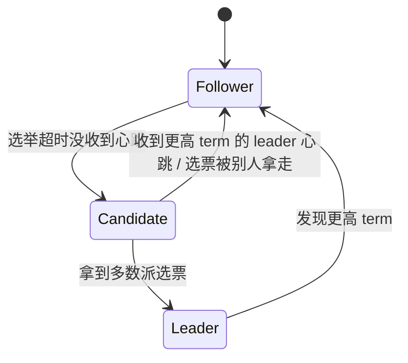
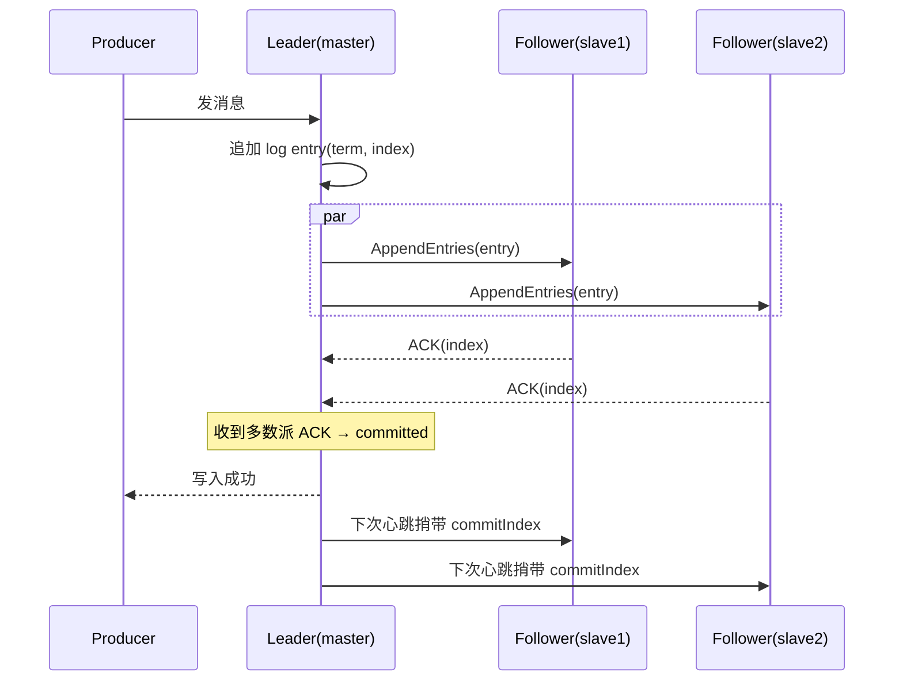
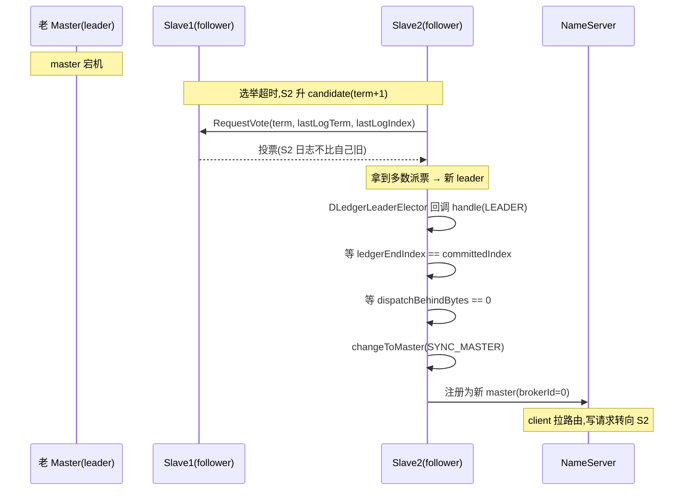

# 第十八章 · DLedger:基于 Raft 的自动选主

> 篇:P6 高可用
> 主线呼应:第 17 章我们看到了传统主从复制怎么把 CommitLog 推到 slave、怎么用 `GroupTransferService` 等同步双写。但有一条暗线没拆——**master 挂了怎么办**。在传统主从里,这件事要**人工切**:运维发现 master 死了,手动把某个 slave 提成 master,中间是不可用窗口、而且数据可能丢。这一章讲 RocketMQ 给出的第一条自动化答案:**DLedger**——它把 Raft 共识算法搬进 CommitLog,让一组 broker **自动选主、自动复制到多数派、master 挂了自动选出新 master 且已确认的消息不丢**。这一章是全书的"分布式一致性"高峰,我们正面拆 Raft 三要素在 DLedger 里的体现,并对照《etcd》那本书讲过的 Raft,说清 RocketMQ 为什么自研 DLedger 而不直接用 etcd-raft。

## 核心问题

**第 17 章传统主从的致命伤是"master 挂了要人工切"。DLedger 怎么用 Raft 做到"master 挂了集群自己选新 master、已确认的消息一条不丢"?它又是怎么把 RocketMQ 的 CommitLog 和 Raft 的复制日志"嫁接"在一起的——既要保住 CommitLog 顺序追加的吞吐,又要满足 Raft 的多数派语义?**

读完本章你会明白:

1. 传统主从为什么"master 挂了"是个大麻烦(人工切、不可用窗口、数据可能丢),以及它和 Raft 想解决的问题差在哪。
2. Raft 三要素(选主 leader election、日志复制 replicated log、安全性 safety)在 DLedger 里分别长什么样、怎么落到代码。
3. `DLedgerCommitLog` 怎么**把 CommitLog 的消息字节直接当 Raft log entry 的 body**——一条消息的写入,同时是 CommitLog 的追加、也是 Raft 的多数派复制,凭什么两全。
4. 新 leader 上任时,DLedger 为什么能保证"已确认的消息不丢"(等 committedIndex 追上 ledgerEndIndex、等 dispatch 落后为 0,才转 master)。
5. 为什么 RocketMQ 自研 DLedger 而不用 etcd-raft:两者面对的应用形态不同(DLedger 是日志流复制,etcd-raft 是 KV 状态机),取舍也不同。

> **如果一读觉得太难**:先只记住三件事——① Raft 保证"多数派写成功才算写成功",所以任何已确认的消息至少在半数以上节点上,master 挂了新 leader 一定能从多数派里选出完整数据;② `DLedgerCommitLog` 把 CommitLog 的消息字节直接塞进 Raft entry 的 body,存储和复制是同一份字节;③ 开关 `enableDLegerCommitLog=true` 启用,DLedger 自己选主、自己复制,broker 上下层几乎无感。剩下的细节,读源码时再回来对照。

---

## 18.1 一句话点破

> **DLedger 把 Raft 搬进 CommitLog:每条消息不再只是"追加进一个 CommitLog 文件",而是"先编成和 CommitLog 一模一样的字节、再交给 Raft 做多数派复制"——leader 把这条字节追加进自己的 DLedger 日志、同步推给 follower、收到多数派 ACK 后才算"写入成功";master 挂了,剩下的节点用 Raft 的任期(term)和日志索引(index)自动选出新 leader,新 leader 只接受"已提交日志"里有的数据,于是任何已经返回 producer 成功的消息一条都不会丢。RocketMQ 用"消息字节 == Raft entry body"这个嫁接,让 CommitLog 的顺序追加吞吐和 Raft 的多数派语义共用同一份数据。**

这是结论,不是理由。本章倒过来拆:先看传统主从到底"伤"在哪,再看 Raft 怎么把这个伤治好,然后落到 `DLedgerCommitLog` 的源码看这个嫁接是怎么打的,最后对比 etcd-raft 讲清取舍。

---

## 18.2 传统主从的致命伤:master 挂了怎么办

第 17 章我们把传统主从(`DefaultHAService`)讲透了:master 往 slave 推 CommitLog 字节,同步双写靠 `GroupTransferService` 等 slave ACK 到位。这条路的**复制**部分是完整的。但它有一个绕不开的伤:**故障转移(failover)全靠人**。

设想一个三节点的传统主从集群:一个 master M、两个 slave S1、S2。M 挂了。接下来发生什么?

1. **NameServer 靠心跳 TTL 在 ~120s 后判活失败**,client 的路由表里 master 的地址变成"不可用"。但**没有一个现成的机制把 S1 或 S2 自动提成 master**——传统主从里,master/slave 是配置死的(`brokerRole=ASYNC_MASTER` / `SLAVE`),slave 不会自己升 master。
2. **运维必须介入**:人工挑一个数据最新的 slave(通常是同步复制里 ACK 最远的那个),改它的配置成 `brokerRole=MASTER`,重启它,再让 producer/consumer 的路由表更新过来。这个窗口,几十秒到几分钟都有可能——**这段时间集群没法写**。
3. **数据可能丢**:如果原 master 是异步复制(`ASYNC_MASTER`),它落盘成功但还没复制到 slave 的消息,在 master 挂的那一刻就永久丢了;就算同步复制(`SYNC_MASTER`),如果运维挑错了 slave(挑了一个 ACK 落后的),也会人为丢数据。

> **不这样会怎样**:假设有一个机制,能在 master 挂了之后,**自动**从剩下的节点里选出一个数据最新的当新 master、且保证"任何已经返回 producer 成功的消息"在新 master 上都有——那故障转移的窗口从"分钟级人工"压到"秒级自动",数据也不丢。这正是 Raft 解决的问题。

Raft 是 Diego Ongaro 2014 年提出的共识算法(《In Search of an Understandable Consensus Algorithm》),它的设计目标就一句话:**让一组节点对一个"日志序列"达成一致,且这个序列一旦被多数派确认就不可丢、不可篡改**。把这套机制套到 broker 集群上,master 就是 Raft 的 leader、slave 就是 follower、"消息"就是 Raft log 的 entry,master 挂了集群自己选新 leader——这就是 DLedger 干的事。

---

## 18.3 Raft 三要素:先理清共识在干什么

DLedger 是 Raft 的一个 Java 实现(openmessaging/dledger 仓),再被 RocketMQ 集成进来。要看懂 DLedger,得先理清 Raft 的三要素。这里我们**直球讲清**(Raft 本身是设计得"易理解"的算法,不需要比喻),然后在 18.4 再看它怎么落到 RocketMQ。

### 三要素之一:选主(leader election)

Raft 集群里每个节点有一个**角色**:follower、candidate、leader。正常情况下只有一个 leader,所有写都经过它。选主靠**任期(term)**——一个单调递增的整数,每次选主都开一个新 term。

- 平时 follower 收到 leader 的心跳就安心当 follower。
- leader 挂了,follower 在**选举超时(election timeout)**内没收到心跳,就把自己升成 candidate,term+1,给自己投一票,然后向其他节点发"请给我投票"(`RequestVote`)。
- 一个 candidate 拿到**多数派**(N/2+1)的票,就成了新 term 的 leader,立刻发心跳宣告。



> **钉死这件事**:Raft 用"多数派投票"保证**任意一个 term 最多只有一个 leader**——因为一个节点一票、要拿到 N/2+1 票才能当选,两个 candidate 不可能同时各自拿到多数派。这是 Raft 安全性的第一根支柱。

### 三要素之二:日志复制(replicated log)

leader 接到客户端的写请求,把它编成一条 **log entry**(带 term 和 index),先追加进自己的日志,然后**并行**推给所有 follower。follower 把 entry 追加进自己的日志、回 ACK。leader 收到**多数派**ACK 后,把这条 entry 标记为**已提交(committed)**,然后返回客户端成功。



> **钉死这件事**:Raft 的"已提交"= **多数派节点都把这条 entry 写进了自己的日志**。这就是为什么"master 挂了已确认的消息不丢"——任何已提交的 entry 至少存在于多数派节点上,新 leader 一定从多数派里选出,它的日志一定包含所有已提交的 entry。这是 Raft 安全性的第二根支柱。

### 三要素之三:安全性(safety)

Raft 给日志复制加了几条约束,保证状态机(应用到上层)的一致性:

- **日志连续性**:follower 的日志必须和 leader 在某个 index 之前完全一致,不一致的部分会被 leader 强制覆盖(`AppendEntries` 带着前一条 entry 的 term/index,follower 对不上就拒绝,leader 回退重试)。
- **leader 完整性**:只有"日志至少和多数派一样新"的节点才能当选(投票时 `RequestVote` 带着候选人最后一条 entry 的 term/index,投票方比较自己的,比自己旧的候选人不投)——这保证新 leader 一定拥有所有已提交的 entry。
- **commit 规则**:leader 只 commit 当前 term 的 entry(不直接 commit 历史 term 的 entry,避免图 8 那个著名的安全性漏洞——详见《etcd》那本书的 Raft 篇,这里不展开)。

这三条加起来,Raft 保证了:**所有已提交的 entry,在任何 leader 的日志里都存在、且顺序一致**。应用到 RocketMQ 上就是:**任何已经返回 producer 成功的消息,在任何时刻的 master 上都能读到**。

> **不这样会怎样**:如果不要安全性约束,新 leader 可能比老 leader 的日志短(老 leader 已提交了 index 10、新 leader 的日志只到 index 8),那 index 9、10 两条已返回 producer 成功的消息就"消失"了——producer 明明收到成功,consumer 却读不到。这就是 Raft 安全性要堵的洞。

这三要素,DLedger 都实现了,只是它把这些藏在了 `DLedgerServer` / `DLedgerLeaderElector` / `DLedgerMmapFileStore` 这几个类里。**这些类属于 openmessaging/dledger 独立库**(`io.openmessaging.storage.dledger.*`),不在本书钉死的 rocketmq 仓(`b5bc1ff5`)本地 clone 里——本章对 DLedger 库内部的细节(选主状态机、AppendEntries 实现、日志存储格式)基于 DLedger 公开设计与 Raft 论文讲述,**仓内引用只覆盖 RocketMQ 集成层**(`DLedgerCommitLog`、`DLedgerRoleChangeHandler`),这点诚实标注,和系列里 Linux eBPF 书对 sparse 树的标注同理。

---

## 18.4 DLedgerCommitLog:把 CommitLog 嫁接进 Raft

现在落到 RocketMQ 的源码,看这个嫁接是怎么打的。开 `enableDLegerCommitLog=true` 后,`DefaultMessageStore` 不再创建普通的 `CommitLog`,而是创建 `DLedgerCommitLog`([DefaultMessageStore.java:242-243](../rocketmq/store/src/main/java/org/apache/rocketmq/store/DefaultMessageStore.java#L242-L243)):

```java
this.commitLog = messageStoreConfig.isEnableDLegerCommitLog() ?
    new DLedgerCommitLog(this) : new CommitLog(this);
```

`DLedgerCommitLog` 是 `CommitLog` 的**子类**([DLedgerCommitLog.java:62](../rocketmq/store/src/main/java/org/apache/rocketmq/store/dledger/DLedgerCommitLog.java#L62)),它继承了父类的所有读路径(`getData`、`getMessage`、`checkMessageAndReturnSize` 等),只**重写**了写路径(`asyncPutMessage`)和启动/恢复(`start`、`recoverNormally`)。这个继承关系是理解嫁接的关键:**对上层(broker、SendMessageProcessor、Reput)来说,CommitLog 还是那个 CommitLog,接口不变**;底层存储从"一个 MappedFileQueue"换成了"DLedger 的 MmapFileList + Raft 复制"。

构造函数里做的几件事([:86-116](../rocketmq/store/src/main/java/org/apache/rocketmq/store/dledger/DLedgerCommitLog.java#L86-L116))印证了这个嫁接:

```java
public DLedgerCommitLog(final DefaultMessageStore defaultMessageStore) {
    super(defaultMessageStore);
    dLedgerConfig = new DLedgerConfig();
    // ... 把 rocketmq 的配置映射到 DLedgerConfig:dLegerGroup / dLegerPeers / dLegerSelfId / 存储路径 / 文件大小 ...
    dLedgerConfig.setMappedFileSizeForEntryData(defaultMessageStore.getMessageStoreConfig().getMappedFileSizeCommitLog());  // :97 —— DLedger 文件大小 = CommitLog 文件大小(默认 1GB)
    // ...
    dLedgerServer = new DLedgerServer(dLedgerConfig);                                         // :105 —— 创建 DLedger 引擎(含选主+复制+存储)
    dLedgerFileStore = (DLedgerMmapFileStore) dLedgerServer.getdLedgerStore();
    // appendHook:DLedger 追加 entry 后,回调改写消息里的 PHYSICALOFFSET 字段
    DLedgerMmapFileStore.AppendHook appendHook = (entry, buffer, bodyOffset) -> {
        assert bodyOffset == DLedgerEntry.BODY_OFFSET;
        buffer.position(buffer.position() + bodyOffset + MessageDecoder.PHY_POS_POSITION);
        buffer.putLong(entry.getPos() + bodyOffset);                                          // :110 —— 把 DLedger entry 的物理位置写回消息的 PHYSICALOFFSET 字段
    };
    dLedgerFileStore.addAppendHook(appendHook);
    dLedgerFileList = dLedgerFileStore.getDataFileList();
    this.messageSerializer = new MessageSerializer(defaultMessageStore.getMessageStoreConfig().getMaxMessageSize());
}
```

这里最关键的两行是:

1. **`:97` `dLedgerConfig.setMappedFileSizeForEntryData(...getMappedFileSizeCommitLog())`**——DLedger 存 entry 的文件,大小**和 CommitLog 完全一样**(默认 1GB)。这不是巧合:DLedger 的数据文件就是新的 CommitLog,只是多了个 Raft 的头。
2. **`:105` `new DLedgerServer(dLedgerConfig)`**——这个 `DLedgerServer` 是 DLedger 库的核心引擎,里面装着选主(`DLedgerLeaderElector`)、复制(`DLedgerRpcNettyService`)、存储(`DLedgerMmapFileStore`)三大件。RocketMQ 把它当黑盒用。

### 关键嫁接:消息字节 == Raft entry 的 body

那么"消息"和"Raft entry"是怎么对齐的?看 `DLedgerCommitLog` 自己的 `MessageSerializer`([:893](../rocketmq/store/src/main/java/org/apache/rocketmq/store/dledger/DLedgerCommitLog.java#L893))——它**几乎和父类 `CommitLog` 的编码器一模一样**:同样是 `TOTALSIZE / MAGICCODE / BODYCRC / QUEUEID / FLAG / QUEUEOFFSET / PHYSICALOFFSET / SYSFLAG / ...` 这一套字段(对比第 2 章 P1-02 的字节布局)。也就是说,**DLedger 模式下,一条消息在磁盘上的字节布局和普通 CommitLog 一模一样**。

差别在于,这套字节不是直接追加进 `mappedFileQueue`,而是被塞进一个 `DLedgerEntry` 的 **body**。DLedger 的 entry 有个固定头部(长度记为 `DLedgerEntry.BODY_OFFSET`,在 DLedger 库内),头部之后就是 body——而 body 就是这条 CommitLog 消息的字节。所以在 DLedger 模式下,磁盘上一个 entry 长这样(ASCII 布局):

```text
 一个 DLedger entry 在磁盘上的布局:
 ┌────────────────────────────┬───────────────────────────────────────┐
 │ DLedger Entry Header       │ Body = 一条 CommitLog 消息的字节       │
 │ (BODY_OFFSET 字节,         │ (TOTALSIZE/MAGICCODE/.../BODY/...)    │
 │  含 entry index/term/pos)  │                                       │
 └────────────────────────────┴───────────────────────────────────────┘
 ↑ entry.getPos()             ↑ entry.getPos() + BODY_OFFSET = 消息的物理偏移
```

这个布局是整个嫁接的核心:**上层读消息时,只需要把 DLedger entry 的 header 跳过去(`+ BODY_OFFSET`),剩下的就是一条标准 CommitLog 消息**。所以 `DLedgerCommitLog.getData`([:248](../rocketmq/store/src/main/java/org/apache/rocketmq/store/dledger/DLedgerCommitLog.java#L248))、`getMessage`([:786](../rocketmq/store/src/main/java/org/apache/rocketmq/store/dledger/DLedgerCommitLog.java#L786))、`checkMessageAndReturnSize`([:475](../rocketmq/store/src/main/java/org/apache/rocketmq/store/dledger/DLedgerCommitLog.java#L475))都是先用 DLedger 的 `dLedgerFileList` 定位文件,再把读到的字节**减去 BODY_OFFSET 还原成 CommitLog 视图**——消费端、Reput、零拷贝,通通无感。

> **钉死这件事**:DLedger 没有给消息另起一套存储格式。它复用了 CommitLog 的字节布局,只是在外面套了一层 Raft entry 的壳(header + 这条消息的字节)。这让"存储内核(CommitLog)"和"分布式骨架(Raft 复制)"共用同一份数据——读消息不用跨两套格式,写消息不用编两次。这是 DLedger 嫁接之所以轻量的根。

### 写入路径:锁内调 handleAppend,多数派 ACK 后才算成功

现在看 `asyncPutMessage` 怎么把这条字节送进 Raft([:539](../rocketmq/store/src/main/java/org/apache/rocketmq/store/dledger/DLedgerCommitLog.java#L539))。它和普通 `CommitLog.asyncPutMessage`(第 3 章 P1-03)的结构几乎一样——同样 `topicQueueLock` 分 queueOffset、同样 `putMessageLock` 串行化、同样锁内记 `beginTimeInDledgerLock`(对应普通模式的 `beginTimeInLock`)。**关键差别只在锁内那一行**:

```java
// DLedgerCommitLog.asyncPutMessage,锁内核心(:571-593)
putMessageLock.lock(); //spin or ReentrantLock ,depending on store config
long elapsedTimeInLock;
long queueOffset;
try {
    beginTimeInDledgerLock = this.defaultMessageStore.getSystemClock().now();       // :575
    queueOffset = getQueueOffsetByKey(msg, tranType);
    encodeResult.setQueueOffsetKey(queueOffset, false);
    AppendEntryRequest request = new AppendEntryRequest();                          // :578
    request.setGroup(dLedgerConfig.getGroup());
    request.setRemoteId(dLedgerServer.getMemberState().getSelfId());
    request.setBody(encodeResult.getData());                                        // :581 —— 消息字节作为 Raft entry 的 body
    dledgerFuture = (AppendFuture<AppendEntryResponse>) dLedgerServer.handleAppend(request);  // :582 —— 交给 DLedger 引擎
    if (dledgerFuture.getPos() == -1) {
        return CompletableFuture.completedFuture(new PutMessageResult(PutMessageStatus.OS_PAGE_CACHE_BUSY, ...));  // :584 —— 不是 leader / 队列满,直接失败
    }
    long wroteOffset = dledgerFuture.getPos() + DLedgerEntry.BODY_OFFSET;           // :586 —— 物理偏移 = entry pos + 头部长度
    // ... 构造 msgId、appendResult ...
} finally {
    beginTimeInDledgerLock = 0;
    putMessageLock.unlock();
}
```

`dLedgerServer.handleAppend(request)`(:582)这一行,把控制权交给了 DLedger 库。在 DLedger 内部(库代码),这个调用会:

1. 检查当前节点是不是 leader——不是就立刻返回失败码(`NOT_LEADER` / `INCONSISTENT_LEADER`),对应 `getPos() == -1`(:583)。
2. 是 leader,把 entry 追加进自己的日志(`dLedgerFileList`),分配 index。
3. **并行**向所有 follower 发 `AppendEntries`(走 DLedger 自己的 Netty RPC)。
4. 立刻返回一个 `AppendFuture`——**注意,此时还没等多数派 ACK**,这个 future 是"待完成"的。

锁内拿到的只是 future 和 `pos`(entry 在 leader 本地的 index),并没有等复制完成。**等多数派 ACK 是在锁外用 `thenApply` 串起来的**([:611](../rocketmq/store/src/main/java/org/apache/rocketmq/store/dledger/DLedgerCommitLog.java#L611)):

```java
return dledgerFuture.thenApply(appendEntryResponse -> {                              // :611
    PutMessageStatus putMessageStatus = PutMessageStatus.UNKNOWN_ERROR;
    switch (DLedgerResponseCode.valueOf(appendEntryResponse.getCode())) {
        case SUCCESS:
            putMessageStatus = PutMessageStatus.PUT_OK;                             // 多数派 ACK 到位 → 成功
            break;
        case INCONSISTENT_LEADER:
        case NOT_LEADER:
        case LEADER_NOT_READY:
        case DISK_FULL:
            putMessageStatus = PutMessageStatus.SERVICE_NOT_AVAILABLE;              // 不是合法 leader → 服务不可用
            break;
        case WAIT_QUORUM_ACK_TIMEOUT:                                               // :623 —— 等多数派 ACK 超时
            //Do not return flush_slave_timeout to the client, for the client will ignore it.
            putMessageStatus = PutMessageStatus.IN_SYNC_REPLICAS_NOT_ENOUGH;        // :625 —— 多数派不够
            break;
        case LEADER_PENDING_FULL:
            putMessageStatus = PutMessageStatus.OS_PAGE_CACHE_BUSY;                 // leader 待提交队列满
            break;
    }
    // ... 统计 ...
    return putMessageResult;
});
```

这个 `thenApply` 是整个 DLedger 写入语义的核心——**producer 拿到 `PUT_OK`,意味着这条消息已经被多数派节点写进了它们的 Raft 日志**;拿到 `IN_SYNC_REPLICAS_NOT_ENOUGH`,意味着 DLedger 在 `quorum ACK` 超时时间内没凑齐多数派(对应 `WAIT_QUORUM_ACK_TIMEOUT`,:623)。

> **对照第 17 章的同步双写**:第 17 章的 `SYNC_MASTER` + `GroupTransferService` 也在等 slave ACK,但那是**等指定的 slave**(通常就一个),而且 ack 链路是 RocketMQ 自己的 `DefaultHAService`。DLedger 把这一层换成了 Raft——等的是**多数派**(N/2+1),链路是 DLedger 自己的 Netty RPC。两者都在"等副本 ACK 才返回 producer",但 Raft 的多数派比"等一个 slave"更强:任何已确认的消息,在任意时刻至少在半数以上节点上。
>
> **钉死这件事**:DLedger 模式下,producer 拿到 `PUT_OK` ⟺ 这条消息已被 Raft 多数派写入日志。这是 DLedger"不丢"的根——master 挂了,新 leader 一定从多数派里选出,它的日志一定包含所有已提交 entry。代价是每条消息都要等多数派 ACK,延迟和开销都比单机追加或异步复制高(详见 18.6 技巧精解)。

---

## 18.5 自动选主:DLedgerRoleChangeHandler 把 Raft 角色"翻译"成 broker 角色

Raft 在 DLedger 库内部自己选主,选出来的结果是"这个节点现在是 leader / follower / candidate"。但 RocketMQ 的 broker 上下文里,角色叫 **master / slave**(`BrokerRole.SYNC_MASTER` / `SLAVE`),而且 master/slave 切换时还有一堆事情要做(改 brokerId、改 BrokerRole、注册到 NameServer、启停 slave 同步任务)。**这两套角色怎么对接?** 靠 `DLedgerRoleChangeHandler`。

`BrokerController` 初始化时,如果开了 DLedger,就向 DLedger 的选主器注册一个回调([BrokerController.java:880-883](../rocketmq/broker/src/main/java/org/apache/rocketmq/broker/BrokerController.java#L880-L883)):

```java
DLedgerRoleChangeHandler roleChangeHandler =
    new DLedgerRoleChangeHandler(this, defaultMessageStore);
defaultMessageStore.getCommitLog()  // 即 DLedgerCommitLog
    .getdLedgerServer().getDLedgerLeaderElector().addRoleChangeHandler(roleChangeHandler);
```

这个 `addRoleChangeHandler` 是 DLedger 库提供的钩子——每当 Raft 选出一个新角色(leader / follower / candidate),就回调 `RoleChangeHandler.handle(term, role)`。看 `DLedgerRoleChangeHandler.handle`([DLedgerRoleChangeHandler.java:57](../rocketmq/broker/src/main/java/org/apache/rocketmq/broker/dledger/DLedgerRoleChangeHandler.java#L57)),它把 Raft 角色翻译成 broker 角色:

```java
@Override
public void handle(long term, MemberState.Role role) {
    // ... 单线程 executor 异步执行 ...
    switch (role) {
        case CANDIDATE:                                                              // :66
            if (messageStore.getMessageStoreConfig().getBrokerRole() != BrokerRole.SLAVE) {
                changeToSlave(dLedgerCommitLog.getId());                             // :68 —— 原 master 选主中,先降级成 slave,避免双 master
            }
            break;
        case FOLLOWER:                                                               // :71
            changeToSlave(dLedgerCommitLog.getId());                                 // :72 —— follower = slave
            break;
        case LEADER:                                                                 // :74
            while (true) {
                if (!dLegerServer.getMemberState().isLeader()) { succ = false; break; }
                if (dLegerServer.getDLedgerStore().getLedgerEndIndex() == -1) { break; }
                // ★ 等所有未提交的 entry 都提交 + dispatch 落后为 0 ★
                if (dLegerServer.getDLedgerStore().getLedgerEndIndex() == dLegerServer.getDLedgerStore().getCommittedIndex()
                    && messageStore.dispatchBehindBytes() == 0) {                     // :83-84
                    break;
                }
                Thread.sleep(100);
            }
            if (succ) {
                messageStore.recoverTopicQueueTable();                               // :90 —— 恢复 queueOffset 表
                changeToMaster(BrokerRole.SYNC_MASTER);                              // :91 —— leader = master(同步 master,因为 DLedger 自己保证多数派)
            }
            break;
    }
}
```

这里最精妙的是 **LEADER 分支里的那个 `while` 循环(:75-88)**。新选出的 leader **不会立刻**对外提供服务,它要先等两件事:

1. **`getLedgerEndIndex() == getCommittedIndex()`**(:83)——leader 本地的最后一条 entry(可能还没提交)要等于最后一条已提交的 entry。Raft 协议下,新 leader 上任后会用一轮 `AppendEntries` 把自己的日志推给 follower、把自己"未提交的 entry"提交掉(或者发现冲突后回退)。这个等,就是等这轮"补提交"完成。
2. **`messageStore.dispatchBehindBytes() == 0`**(:84)——Reput 后台线程要跟上。为什么?因为 `recoverTopicQueueTable`(:90)要重建 ConsumeQueue/IndexFile 的位点表,得等 Reput 把 CommitLog 里所有消息都分发完,位点表才准。

这两件事都到位了,才调 `changeToMaster`(:91)把 broker 切成 `SYNC_MASTER` 角色、注册到 NameServer。**这个等待,是 DLedger "切换不丢"的最后一道闸**——它保证新 master 对外暴露的位点(confirmOffset、queueOffset 表),反映的是"所有已提交 entry 的真实状态",不会出现"位点说消息 X 已写入、但 consumer 来读时发现 Reput 还没建索引"的撕裂。



> **反面对比**:假设 `changeToMaster` 不等那两件事,新 master 一上任就接写会怎样?可能上一任 master 刚把 entry index=100 追加进自己日志但还没收到多数派 ACK 就挂了,新 leader(S2)的日志只到 index=99。如果 S2 立刻对外提供读/写,producer 会以为 index=100 那条消息不存在(因为它在 S2 的日志里没有),而老 master 已经给原 producer 返回过"追加中"的状态——这就是撕裂。Raft 的 commit 规则 + DLedger 的这个等待循环,联手堵住了这个洞。
>
> **对照传统主从**:第 17 章里,master/slave 是配置死的,slave 永远不会自己升 master。DLedger 把这个权力交给了 Raft——只要 Raft 选出新 leader,`DLedgerRoleChangeHandler` 就自动把对应 broker 切成 master。**整个过程不需要运维介入**,选举通常在几秒内完成(取决于选举超时配置,典型 1~3 秒),加上 `changeToMaster` 那个等待循环(取决于 dispatch 落后量,通常很快),总不可用窗口在十几秒量级,比传统主从的"分钟级人工"好一个数量级。

---

## 18.6 技巧精解:CommitLog 与 Raft 日志的嫁接,凭什么两全

这一章最硬的技巧,是"**把 CommitLog 的消息字节直接当 Raft entry 的 body**"这个嫁接。我们单独拆透。

### 这个嫁接要同时满足两件事

DLedgerCommitLog 的设计目标,是同时满足:

1. **保住 CommitLog 的存储内核语义**:一条消息在磁盘上,还是第 2~3 章讲的那个字节布局(TOTALSIZE/MAGICCODE/.../BODY/TOPIC/PROPERTIES);Reput 后台线程还是能顺着这个布局读、分发成 ConsumeQueue/IndexFile;消费端还是能按物理偏移取消息。**上层完全无感**。
2. **满足 Raft 的复制语义**:每条消息要走 Raft 的多数派复制、要带 term/index、要受 Raft 的 commit 规则约束。

这两件事看起来冲突:CommitLog 是"一个大文件纯顺序追加"(第 1 篇的主线),Raft 是"一组带 term/index 的 entry"。DLedger 的解法是——**复用 CommitLog 的字节布局当 entry body,外面套一层 Raft 的 header**。

### 嫁接的三根"针"

这个嫁接靠三处代码细节缝起来:

**第一根针:文件大小相同(:97)**。`dLedgerConfig.setMappedFileSizeForEntryData(...getMappedFileSizeCommitLog())`——DLedger 存 entry 的文件大小,等于 CommitLog 的文件大小(1GB)。这意味着 DLedger 的数据文件,在物理上和 CommitLog 的 MappedFile 是同一规格,滚动建新文件的逻辑也一样。

**第二根针:消息字节当 body + appendHook 改写 PHYSICALOFFSET(:581, :107-111)**。`request.setBody(encodeResult.getData())`(:581)把消息字节当 entry body;但有个问题——CommitLog 消息里有个 `PHYSICALOFFSET` 字段(第 2 章 P1-02),记录这条消息在 CommitLog 里的物理偏移。普通 CommitLog 写时,这个偏移是写完 `appendMessage` 后回填的(因为偏移 = `mappedFile` 的起始偏移 + 写入位置)。DLedger 模式下,偏移要等 DLedger 给 entry 分配了 `pos` 才知道——所以有个 `appendHook`(:107-111),DLedger 追加 entry 后回调这个 hook,把 entry 的 `pos + BODY_OFFSET` 写回消息字节的 `PHYSICALOFFSET` 位置。这样,消息字节里的物理偏移字段,无论是普通 CommitLog 还是 DLedger 模式,都是正确的——消费端读出来无感。

**第三根针:读时减去 BODY_OFFSET 还原(:481, :586, :248)**。读消息时(`getData`/`getMessage`/`checkMessageAndReturnSize`),DLedger 模式下读到的字节是 `entry header + body`,跳过 `BODY_OFFSET` 字节的 header,剩下的就是一条标准 CommitLog 消息。`wroteOffset = dledgerFuture.getPos() + DLedgerEntry.BODY_OFFSET`(:586)这一行,把 DLedger 的 entry pos 翻译成 CommitLog 的物理偏移——上层拿到的偏移,和普通 CommitLog 的偏移语义一致。`DLedgerSelectMappedBufferResult`([:1105](../rocketmq/store/src/main/java/org/apache/rocketmq/store/dledger/DLedgerCommitLog.java#L1105))把 DLedger 的 `SelectMmapBufferResult` 包装成 RocketMQ 的 `SelectMappedBufferResult`,也是这个还原的一部分。

### 凭什么两全:代价是什么

这个嫁接让"存储内核"和"分布式骨架"共用同一份数据,代价是写入路径多了一层 DLedger:

| 维度 | 普通 CommitLog(第 17 章 ASYNC_MASTER) | DLedgerCommitLog |
|------|----------------------------------------|------------------|
| 写入确认时机 | leader 本地追加成功 | 多数派 ACK 成功 |
| 写入延迟 | 单机追加延迟(几十 μs) | 单机追加 + 多数派 RTT(几 ms 起) |
| 故障转移 | 人工切,分钟级,可能丢 | Raft 自动选主,秒级,已确认不丢 |
| 数据安全性 | 异步复制可能丢 | 多数派保证不丢 |
| 资源开销 | 一份 CommitLog + HA 推送 | 一份 DLedger 日志 + Raft RPC + entry header 开销 |

> **不这样会怎样**:假设不做这个嫁接,朴素地"CommitLog 写一份、Raft 日志另写一份"会怎样?同样的消息要存两遍(一份 CommitLog 给消费端读、一份 Raft 日志给共识用),磁盘和页缓存翻倍;而且两份数据要保持一致,引入新的同步问题。DLedger 的嫁接避免了这一切——**只有一份数据,它既是 CommitLog、又是 Raft 日志**。

### 为什么 RocketMQ 不直接用 etcd-raft

这一章呼应《etcd》那本书讲过的 Raft。熟悉 etcd 的读者会问:**RocketMQ 为什么自研 DLedger,不直接把 etcd-raft(Go 写的)拿过来?** 这是个好问题,答案在应用形态不同:

1. **语言**:etcd-raft 是 Go 写的,RocketMQ 是 Java。生态不通,没法直接用。(这其实是最直接的原因。)
2. **应用形态**:etcd-raft 面向 **KV 状态机**——Raft 日志是一串"对 KV 的操作",apply 后状态机演进;etcd 把 Raft 日志和 KV 存储分开(WAL + bbolt)。DLedger 面向**日志流复制**——Raft 日志本身就是业务数据(CommitLog 消息),不需要"apply 到状态机"这一步。所以 DLedger 的 Raft 日志就是 CommitLog 本身,没有额外状态机,嫁接更直接。
3. **吞吐取向**:etcd 是元数据存储,小而精(单 key/value 通常 KB 级),Raft 优化方向是低延迟;RocketMQ 是消息中间件,大吞吐(消息可能 MB 级、批量写),DLedger 的优化方向是吞吐——它支持 `BatchAppendEntryRequest`([DLedgerCommitLog.java:699-708](../rocketmq/store/src/main/java/org/apache/rocketmq/store/dledger/DLedgerCommitLog.java#L699-L708),批量把多条消息塞一个 entry),etcd-raft 没有这种面向消息批量的优化。
4. **集成深度**:DLedger 被设计成可嵌入 Java 应用——`DLedgerServer` 是个普通 Java 对象,RocketMQ 直接 `new` 出来嵌进 `DLedgerCommitLog`;etcd-raft 是 etcd 的一部分,要嵌入得自己写一堆 glue。

> **钉死这件事**:RocketMQ 自研 DLedger 不是"重复造轮子",而是**面向消息中间件场景的定制 Raft**——日志即数据(无状态机层)、支持批量、Java 原生嵌入。代价是 DLedger 的成熟度、生态、文档不如 etcd-raft(后者经过 etcd/Kubernetes 海量验证),所以 5.x 之后 RocketMQ 又引入了 Controller 方案(下一章),取 DLedger 的"自动选主"之长、避其"全量 Raft 复制"之重。这是后话。

---

## 18.7 嫁接的边角:旧 CommitLog 的兼容(dividedCommitlogOffset)

还有一个细节值得一提。`DLedgerCommitLog` 里有个字段 `dividedCommitlogOffset`([:80](../rocketmq/store/src/main/java/org/apache/rocketmq/store/dledger/DLedgerCommitLog.java#L80)),注释原话"This offset separate the old commitlog from dledger commitlog"。这是给**从普通 CommitLog 升级到 DLedger** 的场景用的。

设想一个已经在跑的 RocketMQ 集群,存了一堆普通 CommitLog 数据,现在想切到 DLedger。老数据已经按普通 CommitLog 格式写了,不可能重写。`DLedgerCommitLog` 的处理是:`dividedCommitlogOffset` 记一条分界线,这个偏移**之前**的数据走父类 `CommitLog` 的读路径(`super.getData(offset)`),**之后**的数据走 DLedger 的读路径([:248-253](../rocketmq/store/src/main/java/org/apache/rocketmq/store/dledger/DLedgerCommitLog.java#L248-L253))。`setRecoverPosition`([:397](../rocketmq/store/src/main/java/org/apache/rocketmq/store/dledger/DLedgerCommitLog.java#L397))在恢复时算这个分界线:把旧 CommitLog 的最后一个文件填满 `BLANK_MAGIC_CODE`(:419,第 3 章讲过的"文件末尾填空白魔法码"),然后从下一个偏移开始交给 DLedger。`checkMessageAndReturnSize`([:475](../rocketmq/store/src/main/java/org/apache/rocketmq/store/dledger/DLedgerCommitLog.java#L475))读时会判断:碰到 `BLANK_MAGIC_CODE` / `MESSAGE_MAGIC_CODE` 就走父类逻辑(旧格式),否则按 DLedger entry 解析(:486-491)。

> **钉死这件事**:DLedgerCommitLog 不是"另起炉灶重写存储",而是**继承** CommitLog、复用读路径、只在写入和启动恢复上重写。这让它和普通 CommitLog 的代码复用最大化——升级路径平滑、维护成本低。这个继承关系是 DLedger 嫁接之所以"轻量"在工程上的根。

---

## 章末小结

这一章我们把第 17 章留下的"master 挂了怎么办"这个伤,用 Raft 治好了。回到主线二分法:这一章属于**分布式骨架**那一面——它不碰"消息怎么高效存/读"(那是存储内核,CommitLog/ConsumeQueue/IndexFile),只解决"消息怎么在集群里可靠流转、master 挂了怎么自动切不丢"。具体说,DLedger 在分布式骨架这一面干了三件事:

1. **自动选主**:Raft 的 leader election,`DLedgerRoleChangeHandler` 把 Raft 角色翻译成 broker master/slave。
2. **多数派复制**:Raft 的 replicated log,`DLedgerCommitLog.asyncPutMessage` 把消息字节当 entry body,多数派 ACK 才算 `PUT_OK`。
3. **切换不丢**:新 leader 上任前等 `committedIndex` 追上 + dispatch 落后为 0,保证已确认消息一条不丢。

DLedger 是 RocketMQ 高可用三条演进路的**中间一步**——它解决了传统主从(第 17 章)"人工切、可能丢"的伤,但代价是每条消息都走全量 Raft 多数派复制,写入开销大;于是 5.x 又有了 Controller(下一章),取 DLedger 自动选主之长、避其全量复制之重。

### 五个"为什么"清单

1. **为什么传统主从 master 挂了是麻烦?** 传统主从 master/slave 是配置死的,slave 不会自己升 master;master 挂了要人工挑一个 slave 改配置重启,分钟级不可用窗口,且异步复制模式下 master 已落盘未复制的数据会丢、人工挑错 slave 也会丢。
2. **为什么 Raft 能保证"已确认的消息不丢"?** Raft 的"已提交"=多数派节点都写了这条 entry。任何已提交 entry 至少在多数派上,新 leader 一定从多数派里选出,它的日志一定包含所有已提交 entry——所以已返回 producer 成功(即已提交)的消息,在任何 master 上都能读到。
3. **DLedgerCommitLog 怎么把 CommitLog 和 Raft 日志嫁接?** 复用 CommitLog 的字节布局当 Raft entry 的 body,外面套一层 entry header;文件大小相同(1GB);`appendHook` 改写消息里的 PHYSICALOFFSET 字段;读时减去 BODY_OFFSET 还原。一份字节,既是 CommitLog、又是 Raft 日志。
4. **为什么 DLedgerCommitLog 继承 CommitLog 而不是新写一个类?** 读路径(getData/getMessage/checkMessageAndReturnSize)、Reput 分发、消费端读,全部复用父类;只有写入(asyncPutMessage)和启动恢复(start/recover)重写。这让上层(SendMessageProcessor、Reput、PullMessageProcessor)完全无感,升级路径平滑。
5. **为什么 RocketMQ 自研 DLedger 不用 etcd-raft?** 语言不通(Go vs Java);应用形态不同(etcd-raft 面向 KV 状态机、DLedger 面向日志流复制,日志即数据无需状态机层);DLedger 支持消息批量(BatchAppendEntryRequest)、吞吐取向;DLedger 是 Java 原生可嵌入的普通对象。

### 想继续深入往哪钻

- **DLedger 库内部**(选主状态机、AppendEntries 实现、日志存储格式):不在本书钉死的 rocketmq 仓本地 clone。去 openmessaging/dledger 仓读 `DLedgerLeaderElector`、`DLedgerServer`、`DLedgerMmapFileStore` 的源码——选主看 `maintainAsCandidate` / `maintainAsLeader` / `maintainAsFollower` 状态机,复制看 `DLedgerRpcNettyService` 的 `append` 实现。
- **RocketMQ 集成层**:本书仓内 [DLedgerCommitLog.java](../rocketmq/store/src/main/java/org/apache/rocketmq/store/dledger/DLedgerCommitLog.java)、[DLedgerRoleChangeHandler.java](../rocketmq/broker/src/main/java/org/apache/rocketmq/broker/dledger/DLedgerRoleChangeHandler.java)。重点读 `asyncPutMessage`([#L539](../rocketmq/store/src/main/java/org/apache/rocketmq/store/dledger/DLedgerCommitLog.java#L539))的锁内 `handleAppend` + 锁外 `thenApply`,以及 `handle` 的 LEADER 分支等待循环。
- **Raft 论文**:Diego Ongaro, *In Search of an Understandable Consensus Algorithm* (2014)。DLedger 是 Raft 的忠实实现,论文里的图 2(状态机)、图 6(follower/candidate/leader 转换)、图 8(commit 规则的那个坑)对应 DLedger 的实现。
- **对照《etcd》的 Raft**:etcd 那本书的 Raft 篇讲了 etcd-raft 怎么实现"leader 完整性""commit 当前 term""PreVote""readOnly 模式"等。读完再回来看 DLedger,会发现 DLedger 是 Raft 的简化版(没有 PreVote、没有 readOnly 优化),因为消息场景下这些优化的收益没那么大。
- **测试**:rocketmq 仓里有 [DLedgerCommitlogTest.java](../rocketmq/store/src/test/java/org/apache/rocketmq/store/dledger/DLedgerCommitlogTest.java)、[MessageStoreTestBase.java](../rocketmq/store/src/test/java/org/apache/rocketmq/store/dledger/MessageStoreTestBase.java),能跑通"三节点 DLedger 集群写消息、kill leader、验证新 leader 不丢消息"的端到端场景,值得对照本章源码读。

### 引出下一章

DLedger 治好了传统主从"master 挂了人工切"的伤,但它的代价是**每条消息都走全量 Raft 多数派复制**——写入延迟和开销都比传统 HA 高。对吞吐敏感的场景,这个代价不小。5.x 的 Controller 取其精华、避其开销:**只用 Raft 选主(轻量),数据复制仍走第 17 章的 HA 通道(不把 CommitLog 塞进 Raft),配 autoswitch 的 epoch 协议,实现 master 挂了自动切、且切换时不丢已确认数据**。下一章,我们看 Controller 怎么在这三种高可用方案之间做取舍,以及 epoch 协议凭什么保证切换不丢。
