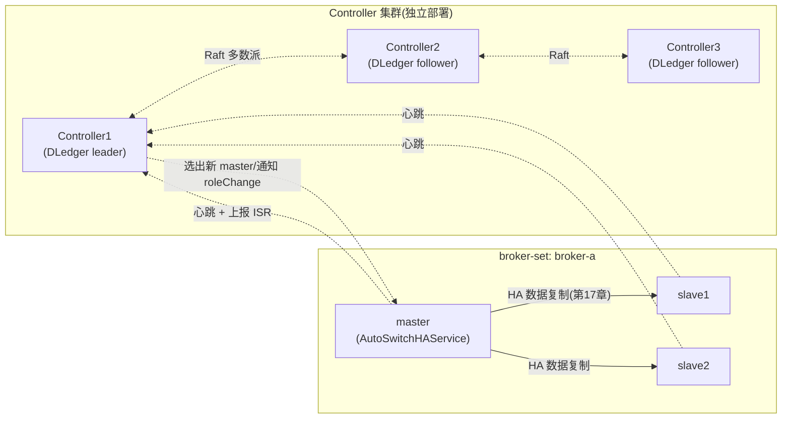
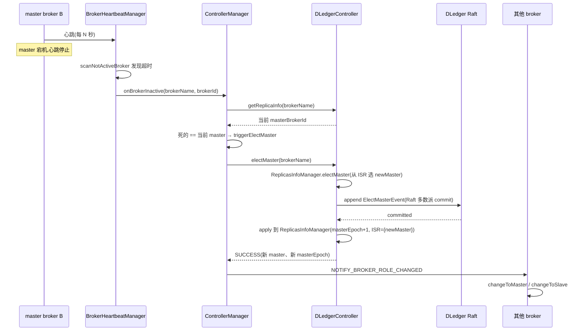

# 第十九章 · Controller:5.x 自动主备切换

> 篇:P6 高可用
> 主线呼应:这是第 6 篇三条高可用演进路里的最后一条。第 17 章讲清了"传统主从怎么把 CommitLog 推到 slave",代价是 master 挂了要人工切;第 18 章讲清了"DLedger 用 Raft 让数据复制和选主一体",代价是每条消息都要走全量多数派复制、写入开销大。这一章讲 5.x 的 Controller——它**只借 Raft 的选主和元数据共识,数据复制仍走第 17 章的 HA 通道**;再用一套基于 epoch 的协议(epoch + leaderEpoch + SyncStateSet + EpochFileCache)管住"master 挂了自动切、且切的时候不丢已确认数据"。三种高可用方案的总账,在这里收束。

## 核心问题

**5.x 的 Controller 怎么把"自动选主"和"数据复制"拆开——选主用 DLedger/Raft(轻量),数据仍走 HA(吞吐),再用 epoch 协议保证切换时不丢已确认消息?这一拆,把第 17、18 章两种方案各自的代价都让出去了一半。**

读完本章你会明白:

1. 为什么 Controller 不让数据走 Raft(开销大)、只用 Raft 选主和存元数据——这一刀切在哪儿,凭什么 sound。
2. epoch 协议是怎么工作的:`EpochFileCache` 用一个 `epoch → startOffset` 的有序表,标记每任 master 的写入边界;切换时新 master 凭 epoch 边界对齐,不丢不乱。
3. `SyncStateSet`(类似 Raft 的 ISR/committed index)是怎么动态伸缩的——slave 追上 confirmOffset 才进 ISR、掉队超过阈值就踢出;只有 ISR 里的消息才算 committed。
4. 三种高可用方案(传统主从 / DLedger / Controller)的取舍总账,各自适合什么场景。

> **如果一读觉得太难**:先只记住三件事——① Controller 用 DLedger 只为选主和存元数据(谁是谁的 master、第几任、ISR 里都有谁),**数据本身不进 Raft**;② 每任 master 在自己的 epoch 里只能往 CommitLog 一段连续区间写,新 master 上任必须先 append 一个新 epoch 的 entry 标记"我从这个 offset 开始当家",这个边界让旧 master 复活也写不进已确认区;③ 只有 ISR(SyncStateSet)里多数副本都收到过的消息,才算 committed(用 `confirmOffset` 标记),producer 才看得到。

---

## 19.1 一句话点破

> **Controller 把"选主"和"数据复制"解耦:选主交给 DLedger/Raft(轻量,只在 master 挂时跑一轮投票、平时只存少量元数据事件),数据复制仍交给第 17 章的 HA 通道(吞吐高)。两者之间用一套基于 epoch 的协议粘合——每任 master 在 EpochFileCache 里占一段连续的 CommitLog,新 master 上任先 append 新 epoch 边界、再 truncate 到与 ISR 的公共一致点,从此**只有 ISR 多数派收到的消息才算 committed**。这一刀切下来,Controller 拿到了 DLedger 的"自动 failover"和传统主从的"写吞吐",代价是引入了一整套 epoch 状态机和 Controller 这个外部组件。**

这是结论,不是理由。本章倒过来拆:先看 DLedger 的代价到底大在哪、再看 Controller 怎么把它拆开、最后看 epoch 协议凭什么保证切换不丢。

---

## 19.2 接力第 18 章:DLedger 的代价到底大在哪

第 18 章讲清了 DLedger:把 CommitLog 嵌进 Raft 日志,每条消息既存 CommitLog 又走 Raft 多数派复制,master 挂了自动选新 master、已 committed 的数据不丢。这是把"数据复制"和"选主"**一体化**——Raft 同时管两件事。

但一体化的代价不小:

1. **每条消息都走全量 Raft 复制**。Raft 的写入路径是:leader 收到 → 本地 append → 并行发给所有 follower → 等多数派 ACK → commit → apply。每条消息都要跨网络往返一次多数派、都要走 Raft 的 log append/commit 流程。这比第 17 章"master 顺序推 slave"重得多——传统 HA 是一条单向数据流,Raft 是 request/quorum/commit 三段握手。
2. **CommitLog 的顺序追加吞吐被 Raft 框架拖慢**。第 1 篇讲过,RocketMQ 写吞吐的灵魂是"所有 Topic 混写一个 CommitLog,纯顺序追加"。DLedger 把这个追加嵌进 Raft 的 `DLedgerCommitLog`,每条消息在写之前先要经过 Raft 的 leader/quorum 协调,写路径多了一层协议开销。
3. **Raft 日志和 CommitLog 的耦合,让存储层变复杂**。`DLedgerCommitLog` 要在 CommitLog 的字节布局里塞 dledger 头,做了不少适配;后面 RocksDB 存储(第 23 章 P8-23)想替掉 CommitLog 时,这一耦合也是包袱。

> **钉死这件事**:DLedger 的代价不是"它不工作",而是"它把一件本来可以很轻的事(选主)和一件本来应该很快的事(数据复制)绑在一起了"。Raft 全量复制保证不丢不乱,但每条消息都付多数派开销——对吞吐敏感、又只想要"自动 failover"的场景,这个交易不划算。

于是 5.x 自然冒出一个问题:

> **能不能只要 Raft 的"自动选主 + 元数据共识",而让数据复制还走第 17 章那条单向 HA 通道?**

这就是 Controller 的设计起点。

---

## 19.3 Controller 在哪儿、管什么、不管什么

先看清 Controller 在集群里的位置。它是一个**独立部署的组件**(可以独立成一个进程,也可以和 NameServer 共进程),自己内部跑一个 DLedger/Raft 集群(通常 3 节点),提供两类服务:

1. **选主决策**:broker-set(同名的一组 master+slave)的 master 挂了,Controller 决定谁来当新 master。
2. **元数据共识**:谁是 master、第几任、ISR(SyncStateSet)里都有谁、brokerId 怎么分配——这些少量但关键的元数据,经 Raft 多数派持久化。

**它不管的事**:CommitLog 数据复制。数据仍然走 broker 之间的 HA 通道(第 17 章那套 master 推 slave),Controller 完全不参与。



这张图要分清两条线:**实线是数据(HA 通道,吞吐)**,**虚线是控制(心跳 + 元数据 + Raft 共识,轻量)**。Controller 只碰虚线那一面。

> **不这样会怎样**:如果让 Controller 也参与数据复制(像 DLedger 那样把 CommitLog 塞进 Raft),那 Controller 集群就变成了 broker 的数据副本,Controller 的网络/磁盘/负载全被业务数据量绑架——一个轻量的控制平面瞬间变成重数据平面,部署、扩容、隔离全都难做。Controller 把这两件事拆开,正是为了让"控制平面"和"数据平面"各自独立演进。

### Controller 的源码骨架

Controller 的接口在 [controller/.../Controller.java](../rocketmq/controller/src/main/java/org/apache/rocketmq/controller/Controller.java),定义了 `alterSyncStateSet`、`electMaster`、`registerBroker`、`getReplicaInfo` 这一组方法。默认实现 `DLedgerController`([controller/.../impl/DLedgerController.java](../rocketmq/controller/src/main/java/org/apache/rocketmq/controller/impl/DLedgerController.java)) 内部持有一个 `DLedgerServer`,真正干两件事:

- **选主**:靠 DLedger 自己的 `DLedgerLeaderElector` 选出 Controller 集群的 leader(注意,这是 **Controller 集群的 leader**,不是 broker-set 的 master)。只有 leader 角色的 Controller 才对外服务。
- **元数据共识**:每次 broker-set 的状态变化(选了新 master、改了 ISR),生成一个 `EventMessage`(`ElectMasterEvent` / `AlterSyncStateSetEvent`),序列化后 append 到 DLedger,Raft 多数派 commit 之后,再 apply 到内存状态机 `ReplicasInfoManager`。

看 `DLedgerController` 怎么处理一个写请求([DLedgerController.java:180](../rocketmq/controller/src/main/java/org/apache/rocketmq/controller/impl/DLedgerController.java#L180) 的 `alterSyncStateSet`):

```java
@Override
public CompletableFuture<RemotingCommand> alterSyncStateSet(AlterSyncStateSetRequestHeader request,
    final SyncStateSet syncStateSet) {
    return this.scheduler.appendEvent("alterSyncStateSet",
        () -> this.replicasInfoManager.alterSyncStateSet(request, syncStateSet, this.brokerAlivePredicate), true);
}
```

它把请求交给 `EventScheduler` 排队。`EventScheduler` 是单线程 `ServiceThread`([DLedgerController.java:370](../rocketmq/controller/src/main/java/org/apache/rocketmq/controller/impl/DLedgerController.java#L370)),顺序处理事件——这是 Controller 状态机的串行化保证。真正干活的是 `ControllerEventHandler.run()`([:448](../rocketmq/controller/src/main/java/org/apache/rocketmq/controller/impl/DLedgerController.java#L448)):

```java
@Override
public void run() throws Throwable {
    final ControllerResult<T> result = this.supplier.get();   // 调用 ReplicasInfoManager 算出"该产生什么事件"
    // ...
    if (!this.isWriteEvent || result.getEvents() == null || result.getEvents().isEmpty()) {
        // 读事件(可选)发个空请求让 DLedger commit,保证读到最新已 apply 状态
    } else {
        // 写事件:把事件序列化后 batch append 进 DLedger
        final List<EventMessage> events = result.getEvents();
        final List<byte[]> eventBytes = new ArrayList<>(events.size());
        for (final EventMessage event : events) {
            final byte[] data = DLedgerController.this.eventSerializer.serialize(event);
            if (data != null && data.length > 0) eventBytes.add(data);
        }
        if (!eventBytes.isEmpty()) {
            final BatchAppendEntryRequest request = new BatchAppendEntryRequest();
            request.setBatchMsgs(eventBytes);
            appendSuccess = appendToDLedgerAndWait(request);  // Raft 多数派 commit
        }
    }
    if (appendSuccess) { /* 返回成功响应 */ } else { /* cancel future */ }
}
```

**关键看清这里**:`appendToDLedgerAndWait` 走的是 Raft 的 append + 多数派 commit([:292](../rocketmq/controller/src/main/java/org/apache/rocketmq/controller/impl/DLedgerController.java#L292)),但它 append 的内容是**序列化的 EventMessage**——`ElectMasterEvent`、`AlterSyncStateSetEvent` 这种几百字节的元数据,**不是 CommitLog 的消息体**。所以 Raft 通道虽然每条都走多数派,但流量极小,跟 broker 的业务数据量完全不在一个量级。

> **钉死这件事**:Controller 借 DLedger,只借它的"选主 + 状态机复制"两件能力,**借的是控制平面,不是数据平面**。Raft 的 append/commit 每秒顶多几十几百次(每个 broker-set 的状态变更),完全不是瓶颈。这正是 5.x 把 Raft 从"数据复制负担"里解放出来的关键一刀。

### leader 上任先补一刀:initial proposal

有个细节值得单独说,因为它体现了 Raft 用法的严谨。看 `RoleChangeHandler.handle()`([DLedgerController.java:541](../rocketmq/controller/src/main/java/org/apache/rocketmq/controller/impl/DLedgerController.java#L541))——当 Controller 自己的角色变成 LEADER 时:

```java
case LEADER: {
    // ... 先 append 一个空请求到 DLedger,等它 commit 之后才 startScheduling()
    while (true) {
        final AppendEntryRequest request = new AppendEntryRequest();
        request.setBody(new byte[0]);
        try {
            if (appendToDLedgerAndWait(request)) {
                this.currentRole = MemberState.Role.LEADER;
                DLedgerController.this.startScheduling();
                // 启动 scanInactiveMaster 定时任务
                break;
            }
        } catch (...) { }
    }
}
```

注释原话([:543](../rocketmq/controller/src/main/java/org/apache/rocketmq/controller/impl/DLedgerController.java#L543)):"the memory statemachine of the controller is still in the old point, some committed logs have not been applied"。意思是:刚当选 leader 时,内存里的 `ReplicasInfoManager` 可能还落后——前一个 leader 已经 commit 但还没 apply 到自己内存的事件,自己还没追上。Raft 的 log 是持久化的、commit 是多数派确认的,但 apply 到状态机是各副本自己的事。所以新 leader **先发一个空 proposal,等它 commit**——这一回合的 commit 会把之前所有已 commit 但未 apply 的事件**强制 apply 到自己的 `ReplicasInfoManager`**,然后才开始对外服务。

> **不这样会怎样**:如果新 leader 不补这一刀、直接服务,它内存里可能还是旧的"master 是 A、ISR={A,B}",而前一个 leader 已经 commit 了"master 是 C、ISR={C}"——新 leader 就会基于过时状态做决策,可能把已经降级的旧 master 又选回去。这是 Raft 实现状态机的经典陷阱(leader read your write 之前必须先 commit 一条 noop),etcd-raft 也走同样的路。补这条空 proposal,是 soundness 的硬要求。

---

## 19.4 broker-set 怎么发现 master 挂了、Controller 怎么选

光有 Controller 还不够,broker 之间要能感知"master 挂了"并触发选举。这一节看清触发链路。

### 心跳与判活:Controller 怎么知道 broker 死了

每个 broker 周期性地向 Controller 发心跳(走 `BrokerHeartbeatRequest`),上报自己的 `clusterName` / `brokerName` / `brokerId` / `epoch` / `maxOffset` / `confirmOffset`。Controller 的 `DefaultBrokerHeartbeatManager` 把这些信息记进 `brokerLiveTable`([:48](../rocketmq/controller/src/main/java/org/apache/rocketmq/controller/impl/heartbeat/DefaultBrokerHeartbeatManager.java#L48))。

判活靠定时扫描 `scanNotActiveBroker()`([:74](../rocketmq/controller/src/main/java/org/apache/rocketmq/controller/impl/heartbeat/DefaultBrokerHeartbeatManager.java#L74)):

```java
public void scanNotActiveBroker() {
    final Iterator<Map.Entry<BrokerIdentityInfo, BrokerLiveInfo>> iterator = this.brokerLiveTable.entrySet().iterator();
    while (iterator.hasNext()) {
        final Map.Entry<BrokerIdentityInfo, BrokerLiveInfo> next = iterator.next();
        long last = next.getValue().getLastUpdateTimestamp();
        long timeoutMillis = next.getValue().getHeartbeatTimeoutMillis();
        if (System.currentTimeMillis() - last > timeoutMillis) {
            // ... 关 channel、从 table 移除 ...
            this.executor.submit(() ->
                notifyBrokerInActive(next.getKey().getClusterName(), next.getValue().getBrokerName(), next.getValue().getBrokerId()));
        }
    }
}
```

`notifyBrokerInActive` 会回调所有 `BrokerLifecycleListener`([:98](../rocketmq/controller/src/main/java/org/apache/rocketmq/controller/impl/heartbeat/DefaultBrokerHeartbeatManager.java#L98)),其中之一是 `ControllerManager.onBrokerInactive()`([ControllerManager.java:146](../rocketmq/controller/src/main/java/org/apache/rocketmq/controller/ControllerManager.java#L146))。

### onBrokerInactive:只对 master 死亡触发选举

注意 `onBrokerInactive` 的判断([:163](../rocketmq/controller/src/main/java/org/apache/rocketmq/controller/ControllerManager.java#L163)):

```java
// Not master broker offline
if (!brokerId.equals(replicaInfoResponseHeader.getMasterBrokerId())) {
    log.warn("The broker with brokerId: {} in broker-set: {} has been inactive", brokerId, brokerName);
    return;
}
// Trigger election
triggerElectMaster(brokerName);
```

**只有死掉的 broker 是当前 master,才触发选举**。死的只是 slave?那就只把它从 ISR 里清掉(下面 19.5 讲的 `maybeShrinkSyncStateSet` 也会处理),不兴师动众选新 master。这避免了"slave 抖动触发全 broker-set 重选"的震荡。

### electMaster:Controller 决策谁来当

选举入口是 `Controller.triggerElectMaster()` → `controller.electMaster()`,最后落到 `ReplicasInfoManager.electMaster()`([ReplicasInfoManager.java:193](../rocketmq/controller/src/main/java/org/apache/rocketmq/controller/impl/manager/ReplicasInfoManager.java#L193))。核心逻辑:

```java
final Set<Long> syncStateSet = syncStateInfo.getSyncStateSet();   // 当前 ISR
final Long oldMaster = syncStateInfo.getMasterBrokerId();
Set<Long> allReplicaBrokers = controllerConfig.isEnableElectUncleanMaster() ? brokerReplicaInfo.getAllBroker() : null;
Long newMaster = null;

// ... 首次选举 / 按 policy 选 ...
newMaster = electPolicy.elect(clusterName, brokerName, syncStateSet, allReplicaBrokers, oldMaster, assignedBroker);
// ...
if (newMaster != null) {
    final int masterEpoch = syncStateInfo.getMasterEpoch();
    final int syncStateSetEpoch = syncStateInfo.getSyncStateSetEpoch();
    final HashSet<Long> newSyncStateSet = new HashSet<>();
    newSyncStateSet.add(newMaster);   // 新 master 上任,ISR 先收敛到只剩自己
    response.setMasterBrokerId(newMaster);
    response.setMasterEpoch(masterEpoch + 1);            // masterEpoch + 1
    response.setSyncStateSetEpoch(syncStateSetEpoch + 1);
    // ...
    final ElectMasterEvent event = new ElectMasterEvent(brokerName, newMaster);
    result.addEvent(event);   // 这个事件会被序列化进 DLedger 共识
}
```

两个关键决定:

1. **新 master 只能从 ISR 里选**(`electPolicy.elect(... syncStateSet ...)`)。因为 ISR 里的副本是"已追上 confirmOffset 的",它们的 CommitLog 至少到了 committed 点——选 ISR 里的副本当 master,**不会丢已 committed 的数据**。这是 epoch 协议保证不丢的核心约束之一。除非显式开 `enableElectUncleanMaster`(允许从 ISR 外选,代价是丢数据),否则只能在 ISR 里选。
2. **新 master 一上任,masterEpoch + 1、ISR 收敛到 {新 master 自己}**。新 master 的 ISR 从只有自己开始,等其他副本追上来再 `alterSyncStateSet` 扩进去——这避免了"新 master 上任瞬间,ISR 还带着没追上的旧副本,被误当 committed"。

选举完成后,`ControllerManager` 通过 `NotifyService` 给 broker-set 里所有 broker 发 `NOTIFY_BROKER_ROLE_CHANGED`,告诉它们"新 master 是 X,新 masterEpoch 是 Y"。被选中的 broker 调 `changeToMaster`,其他 broker 调 `changeToSlave`——这就是 19.5 要讲的 autoswitch 切换。



---

## 19.5 epoch 协议:切换不丢的根

到这里,选举的"决策"链路清楚了:Controller 集群里跑 Raft 选主 + 存元数据,master 挂了选新 master。但有个**生死攸关**的问题还没回答:

> **新 master 上任时,它的 CommitLog 可能比旧 master 短(因为异步复制),也可能比某些 slave 长。怎么保证切换之后,所有"已经告诉 producer 成功"的消息都不丢、且不会被新 master 截断覆盖?**

这就是 epoch 协议要解决的事。它的思想借自 Kafka 的 KIP-101(leader epoch)和 Raft 的 term——**给每一任 master 编一个单调递增的 epoch 号,在 EpochFileCache 里记录每任 master 写入的 CommitLog 起始 offset**,切换时凭 epoch 边界对齐。

### EpochFileCache:一张 epoch → startOffset 的有序表

每个 broker 都持有一个 `EpochFileCache`([store/.../ha/autoswitch/EpochFileCache.java](../rocketmq/store/src/main/java/org/apache/rocketmq/store/ha/autoswitch/EpochFileCache.java)),内部是一个按 epoch 排序的 `TreeMap<Integer, EpochEntry>`([:44](../rocketmq/store/src/main/java/org/apache/rocketmq/store/ha/autoswitch/EpochFileCache.java#L44))。每条 `EpochEntry` 有三个字段([remoting/.../protocol/EpochEntry.java](../rocketmq/remoting/src/main/java/org/apache/rocketmq/remoting/protocol/EpochEntry.java)):

| 字段 | 类型 | 含义 |
|------|------|------|
| `epoch` | int | 第几任 master(单调递增) |
| `startOffset` | long | 这一任 master **第一次写**的 CommitLog 物理偏移 |
| `endOffset` | long | 这一任 master 写到哪(= 下一任的 startOffset;最后一任的 endOffset = 当前 maxPhyOffset) |

落盘格式很紧凑([EpochFileCache.java:308](../rocketmq/store/src/main/java/org/apache/rocketmq/store/ha/autoswitch/EpochFileCache.java#L308)),每行只存 `epoch-startOffset`(endOffset 不存,运行时由"下一个 entry 的 startOffset"算出),靠 `CheckpointFile` 原子写。一个运行了一阵的 broker,它的 epoch 文件可能长这样:

```
# epoch - startOffset
1 - 0
2 - 5368709120     # 第 2 任 master 从约 5GB 处开始写
3 - 10737418240    # 第 3 任 master 从约 10GB 处开始写
4 - 12884901888    # 第 4 任 master(当前)从约 12GB 处开始写
```

对应的 `EpochFileCache` 内存视图:

```
   ┌─────────┬─────────────┬─────────────┬─────────────┬─────────────┐
   │ epoch 1 │   epoch 2   │   epoch 3   │   epoch 4   │  (当前 max) │
   │ offset  │ offset      │ offset      │ offset      │             │
   │   0     │ 5368709120  │ 10737418240 │ 12884901888 │ 16106127360 │
   └─────────┴─────────────┴─────────────┴─────────────┴─────────────┘
   ←─ e1 ───→←─── e2 ─────→←─── e3 ─────→←──── e4 ─────────────────→
   endOffset 由下一任的 startOffset 决定;e4 的 endOffset = 当前 maxPhyOffset
```

> **钉死这件事**:EpochFileCache 把"CommitLog 的一段连续区间"和"哪一任 master 写的"绑死。每任 master 只能在自己的 epoch 段里往后追加,想跨段写必须先 append 一个新 epoch 边界。这是切换不丢的物理基础——它给了我们一个"按任编号的 CommitLog 切片"。

### 新 master 上任:append 新 epoch

看 `AutoSwitchHAService.changeToMaster()`([AutoSwitchHAService.java:122](../rocketmq/store/src/main/java/org/apache/rocketmq/store/ha/autoswitch/AutoSwitchHAService.java#L122))——被选中的 slave 收到 roleChange 通知后调它:

```java
@Override
public boolean changeToMaster(int masterEpoch) throws RocksDBException {
    final int lastEpoch = this.epochCache.lastEpoch();
    if (masterEpoch < lastEpoch) {                                    // fencing
        LOGGER.warn("newMasterEpoch {} < lastEpoch {}, fail to change to master", masterEpoch, lastEpoch);
        return false;
    }
    destroyConnections();
    if (this.haClient != null) this.haClient.shutdown();
    // Truncate dirty file
    final long truncateOffset = truncateInvalidMsg();
    this.defaultMessageStore.setConfirmOffset(computeConfirmOffset());
    if (truncateOffset >= 0) this.epochCache.truncateSuffixByOffset(truncateOffset);
    // Append new epoch to epochFile
    final EpochEntry newEpochEntry = new EpochEntry(masterEpoch, this.defaultMessageStore.getMaxPhyOffset());
    if (this.epochCache.lastEpoch() >= masterEpoch) this.epochCache.truncateSuffixByEpoch(masterEpoch);
    this.epochCache.appendEntry(newEpochEntry);                       // 关键:append 新 epoch 边界
    // ... 等 dispatch 追平、设 stateMachineVersion ...
}
```

三件事按顺序:

1. **fencing 检查**:`masterEpoch < lastEpoch` 直接拒绝。一个 broker-set 不会接受"任期号比我自己记录的还小"的当选指令——这把"旧 master 复活后还想当 master"的脑裂路堵死了。
2. **truncate 脏数据**:`truncateInvalidMsg()` 把那些**还没被 Reput 分发完**(dispatchBehindBytes > 0)的尾部消息截掉。这些可能是"网络收到了半个消息、写进了 CommitLog 但还没解析完"的脏数据。截完之后,CommitLog 的 maxPhyOffset 才是"真正干净、可对外服务"的边界。
3. **append 新 epoch 边界**:`epochCache.appendEntry(new EpochEntry(masterEpoch, maxPhyOffset))`。从这一刻起,新 master 后续写的每一条消息,**都属于这个新 epoch**。`appendEntry` 还会校验([EpochFileCache.java:101](../rocketmq/store/src/main/java/org/apache/rocketmq/store/ha/autoswitch/EpochFileCache.java#L101)):新 epoch 必须比 lastEpoch 大、新 startOffset 必须 ≥ 上一任 endOffset——保证表的单调性。

> **不这样会怎样**:如果新 master 不 append 新 epoch,会发生什么?旧 master 在 epoch=3 写到 offset 12GB,新 master 也是 epoch=3 接着写到 13GB,然后旧 master 复活又接着写 12.x GB——**两个 epoch=3 的 master 写同一段 CommitLog,数据撕裂**。append 一个新的 epoch=4 标记"我从 12GB 接着写、之前的 epoch=3 区间封顶",后续任何 epoch<4 的写入都被 fencing 拒绝,脑裂不可能发生。

### slave 追 master:用 epoch 找一致点、再 truncate

新 master 上任后,其他 slave 调 `changeToSlave()`([AutoSwitchHAService.java:172](../rocketmq/store/src/main/java/org/apache/rocketmq/store/ha/autoswitch/AutoSwitchHAService.java#L172))——核心是建 `AutoSwitchHAClient`,连上新 master。slave 连上后的第一个动作不是直接要数据,而是**握手**:master 把自己的 EpochFileCache 整张表发给 slave,slave 拿这张表和自己的 epoch 表比对,找到"双方都认可的最后一致点",把自己多出来的尾部 truncate 掉,然后再开始拉数据。

握手和找一致点的核心在 `AutoSwitchHAClient.doTruncate()`([AutoSwitchHAClient.java:435](../rocketmq/store/src/main/java/org/apache/rocketmq/store/ha/autoswitch/AutoSwitchHAClient.java#L435)):

```java
private boolean doTruncate(List<EpochEntry> masterEpochEntries, long masterEndOffset) throws Exception {
    if (this.epochCache.getEntrySize() == 0) {
        // 全新副本,直接进 TRANSFER
    } else {
        final EpochFileCache masterEpochCache = new EpochFileCache();
        masterEpochCache.initCacheFromEntries(masterEpochEntries);
        masterEpochCache.setLastEpochEntryEndOffset(masterEndOffset);
        final EpochFileCache localEpochCache = new EpochFileCache();
        localEpochCache.initCacheFromEntries(this.epochCache.getAllEntries());
        localEpochCache.setLastEpochEntryEndOffset(this.messageStore.getMaxPhyOffset());
        final long truncateOffset = localEpochCache.findConsistentPoint(masterEpochCache);  // 找一致点
        if (truncateOffset < 0) return false;   // 找不到一致点,失败
        if (!this.messageStore.truncateFiles(truncateOffset)) return false;
        if (truncateOffset < maxPhyOffset) this.epochCache.truncateSuffixByOffset(truncateOffset);
        changeCurrentState(HAConnectionState.TRANSFER);
        this.currentReportedOffset = truncateOffset;
    }
    // ...
}
```

`findConsistentPoint()`([EpochFileCache.java:227](../rocketmq/store/src/main/java/org/apache/rocketmq/store/ha/autoswitch/EpochFileCache.java#L227))是 epoch 协议的灵魂:

```java
public long findConsistentPoint(final EpochFileCache compareCache) {
    // 从高 epoch 往低找,第一个"两边都有、且 startOffset 相同"的 epoch
    final Map<Integer, EpochEntry> descendingMap = new TreeMap<>(this.epochMap).descendingMap();
    for (Map.Entry<Integer, EpochEntry> curLocalEntry : descendingMap.entrySet()) {
        final EpochEntry compareEntry = compareCache.getEntry(curLocalEntry.getKey());
        if (compareEntry != null && compareEntry.getStartOffset() == curLocalEntry.getValue().getStartOffset()) {
            // 这一段两边都认可,一致点 = min(两边的 endOffset)
            return Math.min(curLocalEntry.getValue().getEndOffset(), compareEntry.getEndOffset());
        }
    }
    return -1;
}
```

逻辑很精妙:**从最新 epoch 往回扫,找到第一个"两边 epoch 表都有、且 startOffset 一样"的 epoch 段**——这一段两边都从同一个 offset 开始当家、写的是同一任 master 的同一份指令,内容必然一致(因为同一任 master 只有一个写入者)。一致点就是这一段两边 endOffset 的较小值(再往后就可能出现分歧)。

举个具体场景。假设 slave 在 epoch=3 时是 master,写到 13GB,但还没来得及把 epoch=4 的指令传给别的副本就挂了;Controller 选了新 master(另一台,epoch=3 时只追到 12GB,epoch=4 接着写)。现在老 master 复活当 slave:

```
新 master 的 epoch 表:
  epoch 1: 0 .. 5GB
  epoch 2: 5GB .. 10GB
  epoch 3: 10GB .. 12GB       ← 新 master 只到 12GB
  epoch 4: 12GB .. 16GB       ← 新 master 自己接着写

老 master(现 slave)的 epoch 表:
  epoch 1: 0 .. 5GB           ← 一致(同 startOffset)
  epoch 2: 5GB .. 10GB        ← 一致
  epoch 3: 10GB .. 13GB       ← 老 master 多写了 1GB(epoch=3 末尾)
  (没有 epoch 4)

findConsistentPoint 从高往低扫:
  - 老 slave 自己没有 epoch 4,跳过
  - epoch 3 两边都有,startOffset 都是 10GB ✓ → 一致点 = min(12GB, 13GB) = 12GB

→ 老 slave 把自己 12GB 之后的 1GB truncate 掉,然后从 12GB 开始追新 master 的 epoch 4。
```

> **钉死这件事**:epoch 表让"两边在哪些 offset 范围内一定一致"变得**可计算**。Raft 的 term 只能告诉你"哪个 leader 是合法的",但具体两个副本的 log 在哪个 index 之前是一致的,要靠 matchIndex 等运行时状态推;epoch + startOffset 把这个一致点**持久化在每个副本的本地文件里**,即使两个副本都重启过,只要 epoch 表还在,就能算出一致点。这是为什么 autoswitch 可以容忍"老 master 重启复活",而传统 HA 不行——传统 HA 没有 epoch,slave 重启后不知道自己和 master 在哪分叉。

### 改 ISR:alterSyncStateSet + epoch 校验

ISR(SyncStateSet)不是写死的,slave 追上了能进、掉队了会被踢。改 ISR 走 `alterSyncStateSet`,落到 `ReplicasInfoManager.alterSyncStateSet()`([ReplicasInfoManager.java:110](../rocketmq/controller/src/main/java/org/apache/rocketmq/controller/impl/manager/ReplicasInfoManager.java#L110))。注意它做了一串**fencing 校验**:

```java
// Check master
if (!syncStateInfo.getMasterBrokerId().equals(request.getMasterBrokerId())) {
    // 当前 leader 不是你说的那个 → 拒绝
    return result.setCodeAndRemark(ResponseCode.CONTROLLER_INVALID_MASTER, ...);
}
// Check master epoch
if (request.getMasterEpoch() != syncStateInfo.getMasterEpoch()) {
    // 你带的 masterEpoch 是旧的 → 拒绝(典型 fencing)
    return result.setCodeAndRemark(ResponseCode.CONTROLLER_FENCED_MASTER_EPOCH, ...);
}
// Check syncStateSet epoch
if (syncStateSet.getSyncStateSetEpoch() != syncStateInfo.getSyncStateSetEpoch()) {
    // 你基于的 ISR 版本过期了 → 拒绝
    return result.setCodeAndRemark(ResponseCode.CONTROLLER_FENCED_SYNC_STATE_SET_EPOCH, ...);
}
// ...
// 校验通过,生成 AlterSyncStateSetEvent,epoch + 1
int epoch = syncStateInfo.getSyncStateSetEpoch() + 1;
response.setNewSyncStateSetEpoch(epoch);
result.addEvent(new AlterSyncStateSetEvent(brokerName, newSyncStateSet));
```

每改一次 ISR,`syncStateSetEpoch` + 1,事件进 DLedger 共识。这是为了让"master 和 Controller 对 ISR 的认识"始终对齐——任何一方带着过期的 epoch 来,都会被 fencing 拒掉。

---

## 19.6 SyncStateSet 动态伸缩:谁才算 committed

ISR 的伸缩由 master 端的 `AutoSwitchHAService` 自己判断,然后报告给 Controller。看两个方向:

### 进 ISR:slave 追上 confirmOffset

`maybeExpandInSyncStateSet()`([AutoSwitchHAService.java:316](../rocketmq/store/src/main/java/org/apache/rocketmq/store/ha/autoswitch/AutoSwitchHAService.java#L316)):

```java
public void maybeExpandInSyncStateSet(final Long slaveBrokerId, final long slaveMaxOffset) {
    final Set<Long> currentSyncStateSet = getLocalSyncStateSet();
    if (currentSyncStateSet.contains(slaveBrokerId)) return;
    final long confirmOffset = this.defaultMessageStore.getConfirmOffset();
    if (slaveMaxOffset >= confirmOffset) {                          // 条件 1:追上 confirmOffset
        final EpochEntry currentLeaderEpoch = this.epochCache.lastEntry();
        if (slaveMaxOffset >= currentLeaderEpoch.getStartOffset()) {// 条件 2:追上当前 epoch 起点
            currentSyncStateSet.add(slaveBrokerId);
            markSynchronizingSyncStateSet(currentSyncStateSet);
            notifySyncStateSetChanged(currentSyncStateSet);          // 通知上层去 alterSyncStateSet
        }
    }
}
```

两个条件都要满足:

1. **追上 confirmOffset**:slave 的 maxOffset ≥ 当前 confirmOffset。confirmOffset 是 ISR 里所有副本 ACK 的最小值(`computeConfirmOffset()` 算,[AutoSwitchHAService.java:423](../rocketmq/store/src/main/java/org/apache/rocketmq/store/ha/autoswitch/AutoSwitchHAService.java#L423))——也就是说"所有 ISR 副本都收到的最后一条"。
2. **追上当前 leader epoch 的 startOffset**:这一条更细——光追上 confirmOffset 还不够,还要确认 slave 追上的是**当前这任 master 写的内容**,而不是历史残留。

> **不这样会怎样**:只看条件 1 不看条件 2,可能有一个 slave 在旧 epoch 里追得很远(因为旧 master 写得快),但新 master 上任后写的 epoch 它一条都没有——这种 slave 看似追上了 confirmOffset(因为 confirmOffset 暂时还卡在旧 epoch 末尾),实际对新 master 一无所知,放进去就会拉低 confirmOffset 的真实性。条件 2 强制"slave 必须收到过当前 leader 的写入"才能进 ISR,堵住了这个洞。

### 出 ISR:slave 掉队太久

`maybeShrinkSyncStateSet()`([AutoSwitchHAService.java:280](../rocketmq/store/src/main/java/org/apache/rocketmq/store/ha/autoswitch/AutoSwitchHAService.java#L280)):

```java
public Set<Long> maybeShrinkSyncStateSet() {
    final Set<Long> newSyncStateSet = getLocalSyncStateSet();
    final long haMaxTimeSlaveNotCatchup = ...getHaMaxTimeSlaveNotCatchup();
    for (Map.Entry<Long, Long> next : this.connectionCaughtUpTimeTable.entrySet()) {
        final Long slaveBrokerId = next.getKey();
        if (newSyncStateSet.contains(slaveBrokerId)) {
            final Long lastCaughtUpTimeMs = next.getValue();
            if ((System.currentTimeMillis() - lastCaughtUpTimeMs) > haMaxTimeSlaveNotCatchup) {
                newSyncStateSet.remove(slaveBrokerId);  // 超过阈值没追上 → 踢出 ISR
            }
        }
    }
    // ...
}
```

slave 一段时间(`haMaxTimeSlaveNotCatchup`)没追上,就从 ISR 踢出——踢出后它就不再参与 confirmOffset 计算,producer 的写入不再等它。这是"宁可 ISR 收紧也不要等慢副本拖死写入吞吐"。

### confirmOffset:committed 的边界

`confirmOffset` 是 Controller 模式下的"committed 边界",等价于 Raft 的 commit index——**producer 看到 `SEND_OK` 的消息,其物理 offset 必须 < confirmOffset**。它由 `computeConfirmOffset()` 算([:423](../rocketmq/store/src/main/java/org/apache/rocketmq/store/ha/autoswitch/AutoSwitchHAService.java#L423)):

```java
public long computeConfirmOffset() {
    final Set<Long> currentSyncStateSet = getSyncStateSet();
    long newConfirmOffset = this.defaultMessageStore.getMaxPhyOffset();
    for (HAConnection connection : this.connectionList) {
        final Long slaveId = ((AutoSwitchHAConnection) connection).getSlaveId();
        if (currentSyncStateSet.contains(slaveId) && connection.getSlaveAckOffset() > 0) {
            newConfirmOffset = Math.min(newConfirmOffset, connection.getSlaveAckOffset());  // ISR 里取最小 ACK
        }
    }
    return newConfirmOffset;
}
```

**confirmOffset = ISR 里所有副本 ACK offset 的最小值**(master 自己的 maxPhyOffset 是上界)。这跟 Raft 的 commit index 一模一样——只有 ISR 多数派都收到的消息才算 committed。

> **钉死这件事**:Controller 模式下,"committed" = "ISR 多数派收到"。Producer 在 SYNC_MASTER 模式下等的就是 confirmOffset 推过自己那条消息的 offset。切换时,新 master 只能从 ISR 里选——ISR 里的副本都至少有 confirmOffset 之前的数据,所以**切换不可能丢已 committed 的消息**。这是 epoch 协议 + ISR + "只能选 ISR 当 master"三者联手保证的不丢。

### 切换不丢的完整证明

把前面几节串起来,证明"master 挂了切换不丢已 committed 消息":

1. 一条消息 offset < confirmOffset ⇒ 它已经被 ISR 里**所有**副本收到(`computeConfirmOffset` 定义)。
2. 新 master 只能从 ISR 里选(`electMaster` 用 `syncStateSet` 约束)。
3. 新 master 的 CommitLog 至少有 confirmOffset 之前的全部数据(它是 ISR 的一员,收到了全部 ISR 数据)。
4. 切换时新 master truncate 脏数据、append 新 epoch,confirmOffset 之前的内容原封不动(`changeToMaster` 只截 dispatch 没追上的尾部,不截已确认区)。
5. 其他 slave 上来用 `findConsistentPoint` 找一致点,一致点 ≥ 新 master epoch 段的 startOffset(因为新 master 的 epoch 段对 ISR 里所有副本都一致),不会把已 committed 的数据截掉。

> **钉死这件事**:Controller 不丢的根,**不在 epoch 表本身,而在 ISR + epoch + 选主约束三者的合取**。epoch 表只解决"切换后两个副本怎么对齐",真正的"哪些数据算数"是 ISR 多数派说了算。这跟纯 Raft 是同一套思想(commit index + 多数派),只是 Controller 把它从"每条消息都跑 Raft"换成"只跑 ISR 伸缩时跑 Raft,平时数据走 HA"。

---

## 19.7 三种高可用方案的总账

把第 17、18、19 章三种方案放一起对照,这是第 6 篇的收束。每种方案回答的都是同一个问题:**master 挂了怎么办、数据会不会丢、代价是什么**。

| 维度 | 传统主从(第 17 章) | DLedger(第 18 章) | Controller(第 19 章) |
|------|---------------------|---------------------|----------------------|
| **数据复制** | master 单向推 slave(HAService) | CommitLog 嵌 Raft,每条消息多数派复制 | 数据仍走 HAService,**不进 Raft** |
| **选主** | 人工切(或靠 NameServer 心跳被动发现) | Raft 自动选主 | DLedger/Raft 只选主 + 存元数据 |
| **故障切换** | 人工切,有分钟级不可用窗口 | 自动 failover,秒级 | 自动 failover,秒级 |
| **不丢保证** | 同步双写(SYNC_MASTER)等 slave ACK,但 master 挂了未 ACK 的丢 | 已 committed 的不丢(Raft 多数派) | 已 committed 的不丢(ISR 多数派 + epoch) |
| **写入开销** | 低(单向推) | 高(每条 Raft 多数派) | 低(同传统主从,Raft 只跑元数据) |
| **架构复杂度** | 低 | 中(CommitLog 与 Raft 耦合) | 高(Controller 独立组件 + autoswitch 状态机 + epoch 协议) |
| **额外组件** | 无 | DLedger 集群(可与 broker 共进程) | Controller 集群(独立部署) |
| **适合场景** | 简单部署、可接受人工切 | 写入不极致、要强一致自动 failover | 海量 Topic、写入吞吐敏感、要自动 failover |

三个方案的取舍一目了然:

- **传统主从**是"省事路线":部署最简单、写入最快,代价是故障时人工切(运维负担)、切换期间不可用。
- **DLedger**是"一体化路线":把数据和选主都交给 Raft,自动 failover,代价是每条消息都付多数派开销,写入吞吐被拉低。适合"我愿意用吞吐换运维省心,数据量不大"的场景。
- **Controller**是"拆分路线":取前两者的长处——DLedger 的自动 failover + 传统主从的写入吞吐。代价是架构最复杂,要部署独立的 Controller 集群、维护 epoch 协议和 ISR 状态机。适合"既要吞吐又要自动 failover"的大规模场景,正是 5.x 主推的方式。

> **钉死这件事**:Controller 不是"在 DLedger 基础上优化",而是"换了一个维度"——把"数据复制要不要进 Raft"这个问题从"全进"拆成"只元数据进"。这个拆分是 5.x 高可用的核心创新,也是本章的主旨。

### 与 Raft 的关系:leaderEpoch 和 term

最后澄清一个概念。Controller 里有两个"任期号":

- **DLedger 的 term**(Controller 集群内部):Controller 集群自己选主用的,跟 broker-set 完全无关。
- **broker-set 的 masterEpoch / syncStateSetEpoch**:每个 broker-set 自己的"第几任 master",由 `ReplicasInfoManager` 维护,经 DLedger 共识后存进状态机。

这两个 epoch **不是一回事**。DLedger term 只在 Controller 集群里流转;broker-set 的 masterEpoch 才是 epoch 协议的主角——它写到每个 broker 的 EpochFileCache 里、用来 fencing 旧 master、用来算一致点。本章讲的所有"epoch",如无特别说明,都指 broker-set 的 masterEpoch。

> 它们的关系可以这样记:**DLedger term 管 Controller 集群"谁当 leader",broker-set epoch 管 broker-set"谁当 master"**。两层完全独立,Controller 集群换 leader 不影响任何 broker-set 的 master;broker-set 换 master 也不影响 Controller 集群的 leader。这种"两层任期号解耦"的设计,正是 Controller 能把"选主"和"数据复制"拆开的前提。

---

## 19.8 技巧精解:epoch 协议凭什么保证切换不丢

这一章最硬核的技巧是 epoch 协议本身。我们把它单独拆透,看它**为什么 sound**,以及如果不这么写会撞什么墙。

### 技巧 1:EpochFileCache 的单调性 + findConsistentPoint

`EpochFileCache` 用 `TreeMap<Integer, EpochEntry>` 按 epoch 排序,`appendEntry` 强校验新 epoch > lastEpoch 且新 startOffset ≥ 上一任 endOffset([EpochFileCache.java:101](../rocketmq/store/src/main/java/org/apache/rocketmq/store/ha/autoswitch/EpochFileCache.java#L101)):

```java
public boolean appendEntry(final EpochEntry entry) {
    this.writeLock.lock();
    try {
        if (!this.epochMap.isEmpty()) {
            final EpochEntry lastEntry = this.epochMap.lastEntry().getValue();
            if (lastEntry.getEpoch() >= entry.getEpoch() || lastEntry.getStartOffset() >= entry.getStartOffset()) {
                log.error("... not bigger than lastEntry ..., append failed");
                return false;   // 拒绝非单调 append
            }
            lastEntry.setEndOffset(entry.getStartOffset());   // 上一任的 endOffset = 这一任的 startOffset
        }
        this.epochMap.put(entry.getEpoch(), new EpochEntry(entry));
        flush();
        return true;
    } finally { this.writeLock.unlock(); }
}
```

这段的 sound 性在两点:

1. **单调性是 invariant**:epoch 和 startOffset 都严格单调。有了这个 invariant,`findConsistentPoint` 才能从高 epoch 往低扫——一旦找到第一个"两边 startOffset 一致"的 epoch,这一段以及它之前的所有段,**双方内容必然一致**(因为后续每一任 master 都是合法选举出来的、写入受 ISR 约束,不存在两个 master 同时写同一段)。
2. **endOffset 派生而非存储**:只存 `epoch-startOffset`,endOffset 在运行时由"下一任的 startOffset"算出([:110](../rocketmq/store/src/main/java/org/apache/rocketmq/store/ha/autoswitch/EpochFileCache.java#L110))。落盘文件就小、且不可能出现"epoch 单调但 endOffset 非单调"的脏数据(单源真理)。

> **反面对比——朴素方案会撞什么墙**:假设不用 epoch 表,只靠 maxPhyOffset 做"一致点"。slave A maxOffset=13GB,slave B maxOffset=12GB,你 trunc 到 12GB 就以为一致了——**但 A 和 B 在 12GB 之前的内容未必一致**:A 可能是 epoch=3 时自己写的(因为它当过 master),B 是从老 master 拉来的,12GB 之前俩人可能在某些 offset 写过不同的字节。maxPhyOffset 只告诉你"长度",不告诉你"内容在哪一分叉"。epoch + startOffset 才告诉你"双方在哪些 offset 范围内是同一任 master 写的、必然一致"。这就是 KIP-101 解决"zombie leader 数据撕裂"的根,Controller 把它从 Kafka 借了过来。

### 技巧 2:masterEpoch fencing + "只能选 ISR 当 master"的合取

切换不丢的真正保证,是两个约束的合取:

- **fencing 约束**:`changeToMaster(masterEpoch)` 要求 `masterEpoch ≥ lastEpoch`([:124](../rocketmq/store/src/main/java/org/apache/rocketmq/store/ha/autoswitch/AutoSwitchHAService.java#L124))。旧 master 复活时,它的 lastEpoch 还是老的(比如 3),Controller 给新 master 分的 epoch 已经是 4。旧 master 即使网络分区里自以为还是 master,它再 appendEntry 也只会 append epoch=3,被 fencing 直接拒。
- **ISR 约束**:`electMaster` 只在 `syncStateSet` 里选新 master([:222](../rocketmq/controller/src/main/java/org/apache/rocketmq/controller/impl/manager/ReplicasInfoManager.java#L222))。

这两个约束**单独都不够**。只 fencing 不 ISR:旧 master 在脑裂期间可能写了新数据,这些数据虽然 epoch 旧,但已经在某些副本上"形成了事实",新 master 没有这些数据,贸然接手会丢。只 ISR 不 fencing:旧 master 复活时,如果 Controller 给的新 epoch < 旧 master 的 lastEpoch,旧 master 还能继续写,两个 master 同时写,数据撕裂。

**合在一起**:fencing 保证"旧 master 写不动了",ISR 保证"新 master 一定有所有已 committed 数据"。两个约束合起来,才能说"切换不丢已 committed"。

> **钉死这件事**:很多人讲 Controller 都只讲"epoch 协议",但 epoch 协议本身只是"如何对齐两个副本的进度边界"。真正的不丢保证,是 **epoch fencing + ISR 选主约束** 两条规则**合取**——前者堵脑裂,后者堵选了数据不全的副本。这跟纯 Raft 的"term fencing + committedIndex 多数派"是同构的,只是 Controller 把"多数派"从"每条消息"换到了"ISR 集合"这一层。

### 技巧 3:autoswitch 握手把"选主后对齐"做成一次协议交互

值得点一下的是 `AutoSwitchHAClient` 的状态机——READY → HANDSHAKE → TRANSFER([AutoSwitchHAClient.java:386](../rocketmq/store/src/main/java/org/apache/rocketmq/store/ha/autoswitch/AutoSwitchHAClient.java#L386)):

```java
switch (this.currentState) {
    case READY:
        // 先 truncate 脏数据,再连 master
        connectMaster();
        break;
    case HANDSHAKE:
        handshakeWithMaster();   // 收 master 的 epoch 表,doTruncate 找一致点、截自己的尾巴
        break;
    case TRANSFER:
        transferFromMaster();    // 对齐完才开始正常拉数据
        break;
}
```

握手阶段([:481 的 HAClientReader](../rocketmq/store/src/main/java/org/apache/rocketmq/store/ha/autoswitch/AutoSwitchHAClient.java#L481))解析 master 发来的整张 epoch 表,转成 `List<EpochEntry>`,调 `doTruncate`。握手之后才进 TRANSFER 状态正常拉数据。这是把"切换后两个副本怎么对齐"**做成了一次明确的协议交互**——不是默默靠 maxPhyOffset 猜,而是 master 主动把 epoch 边界摆给 slave 看,slave 算完一致点截完尾巴才进数据传输。

> **反面对比**:传统 HA(第 17 章)slave 重启后,直接拿自己的 maxPhyOffset 跟 master 报,master 从这个 offset 接着推——如果 slave 的 maxPhyOffset 里有"未确认"的数据(比如老 master 在脑裂时写的),master 就会"覆盖式"从 slave 的 maxPhyOffset 开始写,造成数据撕裂但没人发现。autoswitch 多了一次握手 + doTruncate,把"对齐"变成显式的、可校验的协议步骤,堵住了这个洞。

---

## 章末小结

这一章是第 6 篇三条高可用路的收束。我们讲清了 5.x Controller 怎么把"选主"和"数据复制"拆开:选主和元数据共识交给 DLedger/Raft(轻量控制平面),数据复制仍走第 17 章的 HA 通道(高吞吐数据平面),中间用 epoch 协议(epoch + leaderEpoch + SyncStateSet + EpochFileCache)粘合。这套设计拿到了 DLedger 的"自动 failover"和传统主从的"写吞吐",代价是引入了 Controller 这个独立组件和一整套 epoch 状态机。

回到全书二分法,Controller 服务的是**分布式骨架**那一面——它不碰存储内核(CommitLog 还是那个 CommitLog),只管"集群里谁是 master、消息复制到哪些副本算 committed"。它和第 17 章的 HA、第 18 章的 DLedger 一起,构成了 RocketMQ 高可用的完整谱系。

### 五个"为什么"清单

1. **为什么 Controller 不让数据走 Raft?** 每条消息走 Raft 多数派开销大(DLedger 的代价),而 RocketMQ 的存储灵魂是"纯顺序追加吞吐"。Controller 只借 Raft 的"选主 + 元数据共识"——元数据流量小、每秒顶多几十几百次,Raft 不是瓶颈;数据走单向 HA 通道,吞吐保住。
2. **为什么切换不丢已 committed 数据?** 三个约束合取:① 已 committed = ISR 多数派都收到(`computeConfirmOffset`);② 新 master 只能从 ISR 选(`electMaster` 约束);③ epoch fencing 让旧 master 写不进新 epoch。三者合起来,ISR 里的副本必然有 confirmOffset 之前的全部数据,新 master 一定是 ISR 的一员,所以 confirmOffset 之前的数据不丢。
3. **EpochFileCache 凭什么能算出两个副本的一致点?** 表的单调性(epoch、startOffset 严格递增)是 invariant,每任 master 的写入有唯一 epoch 编号。`findConsistentPoint` 从高 epoch 往低扫,找到第一个"两边都有、startOffset 相同"的 epoch,这一段以及之前必然一致——一致点 = 两边 endOffset 的较小值。
4. **新 master 上任为什么要 append 新 epoch?** 标记"我从这个 offset 开始当家",把 CommitLog 切成"按任编号的切片"。没有这一刀,旧 master 复活时 epoch 号相同,可能两个 master 写同一段 CommitLog,数据撕裂。新 epoch 让 fencing 有据可依。
5. **ISR 为什么是动态的?** slave 追上 confirmOffset + 当前 leader epoch startOffset 才进 ISR(`maybeExpandInSyncStateSet`),掉队超时被踢(`maybeShrinkSyncStateSet`)。这平衡了"committed 严格性"(ISR 收紧,不丢)和"写入吞吐"(ISR 太大 producer 等慢副本)。Raft 也用同样的 ISR/动态伸缩思想。

### 想继续深入往哪钻

- 想看 election policy 细节:读 `controller/.../elect/impl/DefaultElectPolicy.java`——它怎么在 ISR 里挑下一个 master(优先 electionPriority、优先 brokerId 小的)。
- 想看 Controller 怎么和 NameServer 共存:读 `controller/.../ControllerStartup.java` 和 `namesrv/.../NamesrvController`,5.x 支持 Controller 内嵌 NameServer。
- 想看 JRaft 实现:Controller 接口的另一个实现是 `controller/.../impl/JRaftController.java`(用 SOFA-JRaft 替 DLedger),接口一致,选主引擎可换。
- 想对照 Kafka:Kafka 的 KIP-101(leader epoch)和 Controller 设计是 RocketMQ 5.x Controller 的直接灵感来源,可对比 Kafka KRaft 模式(KIP-866)。
- 想看兄弟章:第 17 章(P6-17)讲 HA 数据通道本身,第 18 章(P6-18)讲 DLedger 全量 Raft 复制——本章正是对两者的取舍改进。

### 引出下一章

讲完了存储内核(第 1~2 篇)、消费(第 3 篇)、通信(第 4 篇)、路由(第 5 篇)、高可用(第 6 篇),RocketMQ 的基本旅程已经走通。但前面所有消息都是"普通消息"——发出去 broker 就存、consumer 就拉。RocketMQ 还有三张特性王牌,它们都是在 CommitLog/ConsumeQueue 基本机制上做的精巧增强。下一章我们进入第 7 篇,先讲**顺序消息**——发送端怎么靠 `MessageQueueSelector` 把同 key 消息塞进同一 queue、消费端怎么靠 `ProcessQueue` 锁保证 queue 内串行消费,以及全局顺序为什么吞吐极低、分区顺序怎么在"有序"和"并发"之间平衡。
