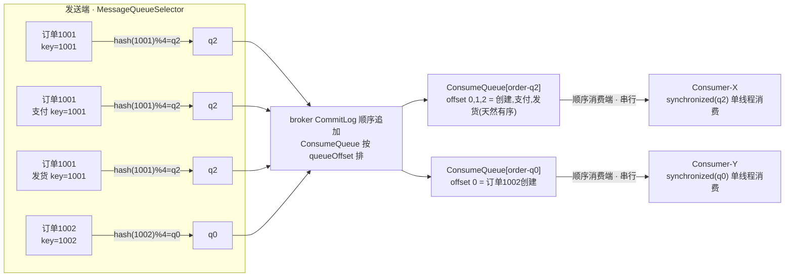
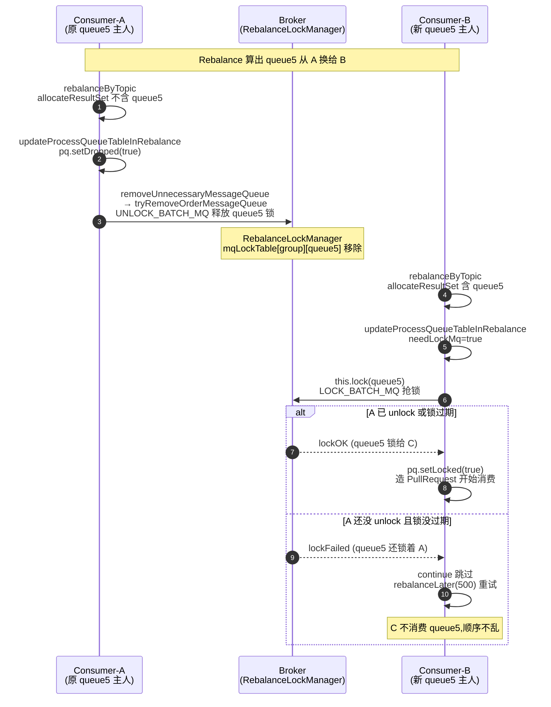

# 第二十章 · 顺序消息:分区有序与消费端锁

> 篇:第 7 篇 · 特性消息
> 主线呼应:前 6 篇走完了"一条消息的旅程"——Producer 发进 CommitLog(P1)、ConsumeQueue 重建逻辑队列(P2)、Consumer Pull 长轮询拉取(P3-09)、Rebalance 把 queue 分给消费组内的 consumer(P3-10)、消费位点保证不重不漏(P3-11)、Remoting 通信(P4)、NameServer 路由(P5)、HA 高可用(P6)。这一套机制里,消息的消费是**并行**的:消费组内 4 个 consumer 各拉各的 queue,每个 consumer 的消费线程池还能多线程并发处理同一 queue 的不同批次——吞吐拉满。但这套机制有一个前提:**业务不要求消息按发送顺序处理**。可现实里有这样一类场景——同一个订单的"创建→支付→发货"三条消息,如果"发货"先被消费了、"创建"还没处理,业务就乱了。这一章就回答:**RocketMQ 怎么在"全局并行换吞吐"的架构里,给"需要顺序"的那一小撮消息专门开一条有序通道?** 它的答案是一套三段式的组合拳:**发送端按业务 key 哈希选 queue(同 key 进同 queue),broker 端 CommitLog 顺序追加天然保证 queue 内有序(回扣 P1-03 / P2-06),消费端对 queue 加分布式锁 + 串行消费(防 Rebalance 时两个 consumer 同时消费同一 queue 破坏顺序)**。

## 核心问题

**RocketMQ 怎么在"海量并发消费"的架构里,保证"同一业务 key 的消息按发送顺序被处理"?全局顺序为什么不可行(吞吐极低)?分区顺序凭什么在"有序"和"并发"之间平衡?Rebalance 的瞬间,凭什么不会出现两个 consumer 同时消费同一 queue 把顺序打乱?**

读完本章你会明白:

1. **全局顺序 vs 分区顺序**的根本分野:全局顺序(整个 topic 一把锁,所有消息进一个 queue 串行,吞吐被单线程压死)只在极少数场景用;分区顺序(同一业务 key 进同一 queue,queue 内有序,不同 key 并行)才是 RocketMQ 顺序消息的真身——它把"有序"的粒度从 topic 降到"业务 key 分区",在有序和并发之间找平衡。
2. **发送端的 `MessageQueueSelector`**:顺序消息发送时调 `send(msg, selector, arg)`,selector 用 `arg.hashCode() % queueCount` 选 queue(`SelectMessageQueueByHash`)——同一个业务 key 的 hashCode 不变,模不变,永远进同一 queue。**这是"分区有序"在发送端的全部魔法,四行代码**。
3. **broker 端天然有序**:同 queue 的消息,`queueOffset` 由 `QueueOffsetOperator` 单调递增分配(P2-06),CommitLog 顺序追加(P1-03),ConsumeQueue 按 queueOffset 定长排列(P2-06)——**发送端保证同 key 进同 queue,存储层天然保证 queue 内按 offset 有序,这一段不需要顺序消息做任何特殊处理**。
4. **消费端 `MessageListenerOrderly` vs `MessageListenerConcurrently`** 的根本差别:Orderly 在 `ConsumeRequest.run` 里 `synchronized(messageQueueLock.fetchLockObject(mq))` 保证同一 queue 单线程消费,且每次消费前检查 `processQueue.isLocked() && !isLockExpired()`(broker 端 queue 锁还在);Concurrently 没有这个 synchronized、没有这个检查,多线程并发拉、并发消费。
5. **broker 端分布式 queue 锁**(`RebalanceLockManager` + `RequestCode.LOCK_BATCH_MQ`):消费端顺序消费前,先给 broker 发 LOCK_BATCH_MQ 抢这个 queue 的锁,锁有过期时间(60s),Rebalance 时先抢锁——**这一层锁保证了即使 Rebalance 瞬间两个 consumer 都认为自己该消费 queue5,只有抢到锁的那个才能真正消费,顺序不会被打乱**。

> **如果一读觉得太难**:先只记住三件事——① 顺序消息默认是"分区顺序"不是"全局顺序":同一业务 key 进同一 queue 就够了,不同 key 并行换吞吐;② 发送端用 `MessageQueueSelector` 按 `hash(key) % queue数` 选 queue(`SelectMessageQueueByHash`,4 行),存储层天然 queue 内有序,这两段不需要特殊机制;③ 真正的复杂度全在消费端——`MessageListenerOrderly` 串行消费(`synchronized` 单 queue 锁)+ broker 端分布式 queue 锁(`RebalanceLockManager`,锁 60s 过期),防 Rebalance 瞬间两个 consumer 同时消费同一 queue。

---

## 20.1 一句话点破

> **RocketMQ 的顺序消息不是"全局一把锁把整个 topic 串成一条",那是吞吐灾难;它是"分区有序"——发送端按业务 key 哈希选 queue,保证同一 key 的消息全进同一 queue;存储层(CommitLog 顺序追加 + ConsumeQueue 按 offset 定长排列)天然保证 queue 内按发送顺序排好,这一段零额外机制;消费端对每个 queue 串行消费(同一 queue 同一时刻只有一个消费线程),并通过 broker 端分布式 queue 锁(`RebalanceLockManager`,60s 过期)保证 Rebalance 时不会两个 consumer 同时消费同一 queue。三段加在一起:发送端 hash 分区 + 存储层天然有序 + 消费端串行 + queue 锁防并发抢消费,把"有序"的粒度从 topic 降到"业务 key 分区",在不同 key 之间仍保住并发。**

这是结论,不是理由。本章倒过来拆:先看"全局顺序"为什么不可行,再看"分区顺序"怎么在有序和并发之间平衡,然后钻进发送端 selector(四行代码的魔法)、消费端 Orderly 的 `synchronized` + `consumeLock`(为什么需要两层锁),最后把 broker 端 `RebalanceLockManager` 这个最硬核的分布式锁单独拆透——它凭什么在 Rebalance 瞬间守住"同一 queue 同时只被一个 consumer 顺序消费"。

---

## 20.2 反面教材:全局顺序为什么不可行

在讲分区顺序之前,先把"全局顺序"这条路想清楚。最朴素的"顺序消息"直觉是:**整个 topic 的所有消息,严格按发送顺序被消费**。要实现这个,只有一条路——**整个 topic 只有一个 queue,所有消息进这一个 queue,消费端只有一个 consumer、单线程串行消费**。

> **不这样会怎样**(全局顺序撞的墙):

- **写入吞吐被单 queue 压死**:topic 只有一个 queue,意味着这个 queue 的写入共享一把 `topicQueueLock`(P1-03 讲过 queueOffset 分配的分段锁,但单 queue 时锁退化成全局)。更要命的是,消费端只能单线程串行——4 个 consumer 里只有 1 个能消费,其余 3 个闲置。
- **消费吞吐被单线程压死**:消费端的瓶颈更严重。单线程消费,意味着每秒能处理的消息数 = 单线程的处理速度(典型几百到几千 TPS)。而正常 RocketMQ 集群的设计吞吐是几十万 TPS——全局顺序把它打回单线程水平,**三个数量级的吞吐损失**。
- **单点风险**:整个 topic 的消费绑在一个 consumer 上,这个 consumer 宕机,整个 topic 的消费停滞直到 Rebalance 重新分配(而且只能分给另一个 consumer 接着单线程消费)。

一句话:**全局顺序是把整个 topic 退化成"单生产者单消费者单线程"的串行系统,MQ 的并发优势全部丧失**。这在绝大多数业务场景里是不可接受的——你不会为了"订单消息要按顺序"就把整个订单 topic 的吞吐限制在几百 TPS。

> **钉死这件事**:全局顺序只在极少数场景(比如 binlog 同步、强一致的状态机同步)才用,且代价是吞吐被压到单线程水平。RocketMQ 支持它(只要 topic 设成 1 个 queue,且消费端用 `MessageListenerOrderly`),但**默认推荐、也是绝大多数业务真正需要的是"分区顺序"**——把"有序"的粒度从 topic 降到"业务 key 分区",在"同 key 必须有序"和"不同 key 可以并发"之间找平衡。

---

## 20.3 分区顺序:在有序和并发之间找平衡

绝大多数业务的"顺序消息"需求,其实不是"整个 topic 严格有序",而是**"同一笔业务的消息按顺序处理"**。具体到订单场景:

- 订单 1001 的"创建→支付→发货"三条消息,必须按这个顺序处理。如果"发货"先被消费、"创建"还没处理,库存扣了但订单不存在,业务崩。
- 但订单 1002 的消息,和订单 1001 的消息之间,**没有顺序要求**——1002 的"创建"可以先于 1001 的"发货"被处理,完全没问题。

这就是"分区顺序"的语义:**以业务 key(这里是 orderId)为分区单位,同一 key 的消息严格有序,不同 key 之间并行**。这个语义怎么落地?三段式:



这张图是本章的骨架,务必看清三个要点:

1. **发送端**:订单 1001 的三条消息(创建/支付/发货)都带 `key=1001`,selector 用 `hash(1001) % 4 = 2`,全进 q2。订单 1002 的消息带 `key=1002`,`hash(1002) % 4 = 0`,进 q0。**同一个 key 永远进同一 queue**。
2. **存储层**:q2 收到三条消息,`QueueOffsetOperator` 给它们分配 queueOffset 0、1、2(P2-06),CommitLog 顺序追加(P1-03),ConsumeQueue 按 queueOffset 定长排——**这三条消息在 q2 里天然按发送顺序排好,这一段不需要顺序消息做任何特殊处理**。
3. **消费端**:Consumer-X 抢到 q2 的 broker 端锁,串行消费(offset 0 创建 → 1 支付 → 2 发货)。Consumer-Y 抢到 q0,并行处理订单 1002。**q2 内部串行(保 1001 有序),q2 和 q0 之间并行(保吞吐)**。

> **钉死这件事**:分区顺序的精髓是"把有序的粒度从 topic 降到业务 key 分区"。同 key 必须有序 → 同 key 进同 queue(发送端保证)+ queue 内串行消费(消费端保证);不同 key 可并行 → 不同 key 进不同 queue → 不同 queue 由不同 consumer 并行消费。queue 数越多,分区越细,并发度越高,但单分区吞吐越低——这是个可调旋钮,业务按"key 的基数"和"单分区吞吐需求"配 queue 数。

这三段里,第二段(存储层天然有序)是前 6 篇已经讲透的——P1-03 的 CommitLog 顺序追加、P2-06 的 ConsumeQueue 按 offset 排列,本来就是这个效果。顺序消息真正要新增机制的,是**第一段(发送端选 queue)**和**第三段(消费端串行 + queue 锁)**。下面分别拆。

---

## 20.4 发送端:MessageQueueSelector 四行代码的魔法

先看发送端。普通消息发送用 `send(msg)`,Producer 默认走轮询选 queue(`TopicPublishInfo.selectOneMessageQueue` 轮询 + 故障规避,详见 P5-15 / P0-01)。顺序消息发送改用一个重载:

```java
producer.send(msg, new MessageQueueSelector() {
    @Override
    public MessageQueue select(List<MessageQueue> mqs, Message msg, Object arg) {
        // arg 是业务 key,比如 orderId
        ...
    }
}, orderId);
```

这个 `MessageQueueSelector` 接口极简([MessageQueueSelector.java#L23](../rocketmq/client/src/main/java/org/apache/rocketmq/client/producer/MessageQueueSelector.java#L23)):

```java
public interface MessageQueueSelector {
    MessageQueue select(final List<MessageQueue> mqs, final Message msg, final Object arg);
}
```

三个参数:`mqs`(这个 topic 的全部 queue 列表)、`msg`(消息本身)、`arg`(业务 key)。返回选中的那个 queue。RocketMQ 自带三个实现,最常用的是 `SelectMessageQueueByHash`([SelectMessageQueueByHash.java#L24](../rocketmq/client/src/main/java/org/apache/rocketmq/client/producer/selector/SelectMessageQueueByHash.java#L24)),核心代码只有四行:

```java
public class SelectMessageQueueByHash implements MessageQueueSelector {
    @Override
    public MessageQueue select(List<MessageQueue> mqs, Message msg, Object arg) {
        int value = arg.hashCode() % mqs.size();   // :28 业务 key 的 hashCode 对 queue 数取模
        if (value < 0) {                            // :29 处理负数(Integer.MIN_VALUE 的绝对值还是负数,这里简化处理)
            value = Math.abs(value);
        }
        return mqs.get(value);                      // :32 返回这个 queue
    }
}
```

这就是"同 key 进同 queue"的全部魔法。为什么 sound(为什么这么写不会出错)?两个保证:

1. **`arg.hashCode()` 对同一个 key 永远返回同一个值**。Java 的 `String.hashCode()` 是确定性的(同一个字符串,同一 JVM 内必然同值;不同 JVM 只要字符串相同也同值,因为 String.hashCode 的算法在 JDK 规范里写死)。所以 orderId="1001" 的 hashCode 永远是同一个数。
2. **`mqs.size()` 在 topic 配置不变时是常数**。topic 配 4 个 queue,`mqs.size()` 就是 4。除非扩容 queue 数,否则这个模不变。

两个常数相除取模,结果不变。所以 orderId="1001" 的三条消息,`hash(1001) % 4` 三次都是同一个值(比如 2),三次都进 q2。**同 key 进同 queue,这一步就完成了**。

发送入口在 `DefaultMQProducerImpl.sendSelectImpl`([DefaultMQProducerImpl.java#L1329](../rocketmq/client/src/main/java/org/apache/rocketmq/client/impl/producer/DefaultMQProducerImpl.java#L1329)),关键一行是:

```java
mq = mQClientFactory.getClientConfig().queueWithNamespace(
    selector.select(messageQueueList, userMessage, arg));   // :1350 调 selector 选 queue
```

`:1350` 这行 `selector.select(messageQueueList, userMessage, arg)` 就是调上面那个 `SelectMessageQueueByHash.select`,拿到选中的 queue,再 `sendKernelImpl(msg, mq, ...)` 往这个 queue 发(`:1360`)。**发送端到此结束**。

> **不这样会怎样**(朴素地随机选 queue 会撞的墙):假设顺序消息用默认的轮询选 queue(`selectOneMessageQueue` 轮询),订单 1001 的三条消息会进 q0、q1、q2 三个不同 queue。三个 queue 由三个不同 consumer 并行消费,"发货"可能先于"创建"被处理,顺序彻底乱。**顺序消息的发送端必须用 selector 把同 key 钉死在同一 queue,这一步是后续一切的前提**。

> **钉死这件事**:`MessageQueueSelector` 是发送端决定"这条消息进哪个 queue"的钩子。顺序消息用 `SelectMessageQueueByHash`(`hash(key) % queue数`),把同一业务 key 钉死在同一 queue。这是"分区有序"在发送端的全部实现,核心就四行。它和 P3-10 的 `AllocateMessageQueueStrategy`(消费端 Rebalance 分 queue)是两回事——一个管"消息进哪个 queue",一个管"哪些 queue 归哪个 consumer 消费",别混(详见 20.8 节)。

---

## 20.5 broker 端:天然有序,零额外机制

发送端保证同 key 进同 queue 之后,消息到了 broker。这一段**不需要顺序消息做任何特殊处理**——因为 CommitLog + ConsumeQueue 的基本机制(P1-03 / P2-06)本来就保证 queue 内按 offset 有序。

回忆三件事(都来自前 6 篇):

1. **`queueOffset` 单调递增分配**:消息进 CommitLog 时,`QueueOffsetOperator.increaseQueueOffset` 给它分配在所属 topic-queue 内的序号(queueOffset),用 `computeIfAbsent` + `put` 推进,保证同一 topic-queue 的消息 queueOffset 严格递增(P2-06 6.4 节)。订单 1001 的三条消息都进 q2,它们的 queueOffset 就是 q2 内连续的 0、1、2。
2. **ConsumeQueue 按 queueOffset 定长排列**:ConsumeQueue 每条 20 字节单元(8 物理偏移 + 4 长度 + 8 tag hash),按 queueOffset 顺序追加(P2-06 6.3 节)。q2 的三条消息在 ConsumeQueue[order-q2] 里就是第 0、1、2 个单元,顺序和发送顺序一致。
3. **消费拉取按 offset 顺序读**:`getMessage` 从 `consumeOffset` 开始,顺着 ConsumeQueue 顺序读 CqUnit、回 CommitLog 取体(P2-06 6.5 节)。消费端拿到的消息,就是按 queueOffset 顺序排好的。

> **钉死这件事**:顺序消息在存储层零额外机制——发送端保证同 key 进同 queue,queueOffset 单调递增 + ConsumeQueue 按 offset 排 + 消费按 offset 读,天然保证 queue 内按发送顺序。**这是 RocketMQ 把"顺序"这个特性做得很轻的关键:存储层本来就是顺序追加的,顺序消息只是在发送端加个 selector、在消费端加个串行锁,中间这一大段免费**。

但这有一个隐含前提:**同一 queue 的消息,它们的发送顺序就是它们进 broker 的顺序**。这在单 producer 时天然成立。但**多 producer 并发发同一业务 key 的消息**呢?比如订单 1001 的"创建"和"支付"由两个 producer 实例几乎同时发出,谁先到 broker 谁先追加——可能"支付"的网络包先到,先进 CommitLog,queueOffset=0;"创建"后到,queueOffset=1。这时 ConsumeQueue 里 offset 0 是"支付"、offset 1 是"创建",顺序反了。

这是顺序消息的一个固有局限:**跨 producer 实例的同 key 消息,broker 只能按到达顺序排,不保证按业务发起顺序排**。要解决,业务侧必须保证"同一业务 key 的消息由同一个 producer 实例顺序发送"(比如把订单 1001 的所有消息路由到同一个 producer)。这个限制在大多数场景可接受(同一笔订单的状态流转通常由同一个服务实例驱动),但要知道它存在。本章后面不再展开这个边界,聚焦单 producer 内的顺序保证。

---

## 20.6 消费端:MessageListenerOrderly 的两层锁

现在到顺序消息最复杂的部分——消费端。普通消息用 `MessageListenerConcurrently`(并行消费,多线程并发处理同一 queue 的不同批次),顺序消息改用 `MessageListenerOrderly`(串行消费,同一 queue 同一时刻只有一个消费线程)。

先把两个 Listener 的根本差别立清楚,这是最容易混的点:

| | `MessageListenerConcurrently`(并行,默认) | `MessageListenerOrderly`(顺序) |
|---|---|---|
| 消费服务 | `ConsumeMessageConcurrentlyService` | `ConsumeMessageOrderlyService` |
| `ConsumeRequest.run` | 直接调 `listener.consumeMessage`,无 synchronized | `synchronized(messageQueueLock.fetchLockObject(mq))` 包住整个消费循环 |
| 同 queue 多批次 | 多线程并发处理 | 单线程串行(同一 mq 的锁对象串行化) |
| broker 端 queue 锁 | 不需要 | 必需(`processQueue.isLocked()` 检查) |
| 失败重试 | `RECONSUME_LATER`,消息送回 broker 重试 topic,稍后再拉 | `SUSPEND_CURRENT_QUEUE_A_MOMENT`,消息放回 `consumingMsgOrderlyTreeMap`,稍后在本 queue 内重试(不送回 broker,保序) |
| 位点语义 | 每批次消费完独立上报,失败批次不上报(可能重复) | 整个 queue 串行,`commit()` 返回最后消费成功的 offset+1,严格按序推进 |

这张表钉死两个 Listener 的差别。下面钻进 `ConsumeMessageOrderlyService.ConsumeRequest.run` 的源码,看它怎么用两层锁保证串行。

### 第一层锁:messageQueueLock.fetchLockObject(mq) —— 客户端进程内的串行

`ConsumeRequest.run` 的入口([ConsumeMessageOrderlyService.java#L428](../rocketmq/client/src/main/java/org/apache/rocketmq/client/impl/consumer/ConsumeMessageOrderlyService.java#L428)):

```java
@Override
public void run() {
    if (this.processQueue.isDropped()) {
        return;
    }

    final Object objLock = messageQueueLock.fetchLockObject(this.messageQueue);   // :434 拿 mq 维度的锁对象
    synchronized (objLock) {                                                       // :435 客户端进程内串行化
        if (MessageModel.BROADCASTING.equals(...)
                || this.processQueue.isLocked() && !this.processQueue.isLockExpired()) {   // :437 检查 broker 端锁
            // ... 消费循环 ...
        } else {
            ConsumeMessageOrderlyService.this.tryLockLaterAndReconsume(this.messageQueue, this.processQueue, 100);  // :566 锁没了,100ms 后重试抢锁
        }
    }
}
```

`:434` 的 `messageQueueLock.fetchLockObject(this.messageQueue)` 是关键。`MessageQueueLock`([MessageQueueLock.java#L26](../rocketmq/client/src/main/java/org/apache/rocketmq/client/impl/consumer/MessageQueueLock.java#L26))内部是一个 `ConcurrentMap<MessageQueue, ...>`:

```java
public class MessageQueueLock {
    /** Message lock,strictly ensure the single queue only one thread at a time consuming */
    private ConcurrentMap<MessageQueue, ConcurrentMap<Integer, Object>> mqLockTable =
        new ConcurrentHashMap<>(32);

    public Object fetchLockObject(final MessageQueue mq) {     // :30 按 mq 拿一个固定的 Object
        return fetchLockObject(mq, -1);
    }

    public Object fetchLockObject(final MessageQueue mq, final int shardingKeyIndex) {
        // ... computeIfAbsent 保证同一个 mq 永远返回同一个 Object ...
        return lock;
    }
}
```

注意那个源码注释:`// Message lock,strictly ensure the single queue only one thread at a time consuming`(:24)——**消息锁,严格保证单个 queue 同一时刻只有一个线程在消费**。这就是第一层锁的全部语义。

`:435` 的 `synchronized (objLock)` 用这个 Object 做监视器。因为 `fetchLockObject` 对同一个 mq 永远返回同一个 Object(`computeIfAbsent` 保证),所以**同一个 queue 的所有 ConsumeRequest 线程,都争同一把 synchronized 锁,串行执行**。不同 queue 的 ConsumeRequest 拿到不同 Object,不互斥,并行执行。

> **钉死这件事**:第一层锁 `messageQueueLock` 是客户端进程内的——它保证"在这个 consumer 进程里,同一个 queue 的消费单线程串行"。但它管不了"两个 consumer 进程同时消费同一 queue"——那是 Rebalance 的事,需要第二层 broker 端锁。两层锁职责分明:第一层管进程内并发,第二层管进程间并发。

### 第二层锁:processQueue.isLocked() —— broker 端分布式 queue 锁

`synchronized` 进来之后,`:437` 还要检查:

```java
if (this.processQueue.isLocked() && !this.processQueue.isLockExpired()) {
    // 有 broker 端锁,且锁没过期,才能消费
} else {
    // 锁没了或过期了,100ms 后重试抢锁
    tryLockLaterAndReconsume(this.messageQueue, this.processQueue, 100);
}
```

`processQueue.isLocked()`([ProcessQueue.java#L245](../rocketmq/client/src/main/java/org/apache/rocketmq/client/impl/consumer/ProcessQueue.java#L245))返回 `locked` 字段——这个字段标记"broker 端是否把这个 queue 锁给了我"。`isLockExpired()`(:64)判断锁是否过期:

```java
public final static long REBALANCE_LOCK_MAX_LIVE_TIME =
    Long.parseLong(System.getProperty("rocketmq.client.rebalance.lockMaxLiveTime", "30000"));   // :40-41 客户端判定阈值 30s

public boolean isLockExpired() {
    return (System.currentTimeMillis() - this.lastLockTimestamp) > REBALANCE_LOCK_MAX_LIVE_TIME;  // :64
}
```

注意这里有个细节:**客户端判过期的阈值(`REBALANCE_LOCK_MAX_LIVE_TIME` 默认 30s,ProcessQueue.java:40)比 broker 端锁实际存活时间(60s,RebalanceLockManager)短**。这是刻意的——客户端 30s 没续锁就认为"可能丢了",主动停下来重抢,留了 30s 余量,避免"broker 端锁已经过期被别人抢走、客户端还在傻消费"的窗口。

`locked` 字段和 `lastLockTimestamp` 是谁设的?是 `RebalanceImpl.lock` / `lockAll` 调 `MQClientAPIImpl.lockBatchMQ`(给 broker 发 LOCK_BATCH_MQ 请求)成功后设的(详见 20.7 节)。所以这一层锁的"真身"在 broker 端的 `RebalanceLockManager`。

### 消费循环:takeMessages → consumeMessage → commit

两层锁都通过后,进入消费循环(`:439` 的 `for (boolean continueConsume = true; ...)`):

```java
for (boolean continueConsume = true; continueConsume; ) {
    // ... 各种 dropped / locked / expired / 超时检查 ...

    List<MessageExt> msgs = this.processQueue.takeMessages(consumeBatchSize);   // :468 从 ProcessQueue 取一批
    if (!msgs.isEmpty()) {
        final ConsumeOrderlyContext context = new ConsumeOrderlyContext(this.messageQueue);
        try {
            this.processQueue.getConsumeLock().readLock().lock();    // :493 第三道锁(读锁),防 Rebalance 抢写
            // ... (检查 dropped) ...
            status = messageListener.consumeMessage(...);            // :500 真正调业务消费逻辑
        } finally {
            this.processQueue.getConsumeLock().readLock().unlock();  // :509
        }

        continueConsume = processConsumeResult(msgs, status, context, this);   // :555 处理消费结果
    } else {
        continueConsume = false;   // 没消息了,退出循环
    }
}
```

`:493` 的 `processQueue.getConsumeLock().readLock().lock()` 是第三道锁(读锁)。`consumeLock` 是个 `ReentrantReadWriteLock`([ProcessQueue.java#L49](../rocketmq/client/src/main/java/org/apache/rocketmq/client/impl/consumer/ProcessQueue.java#L49))。**这道读锁防的是什么?** 防 Rebalance 时 `removeUnnecessaryMessageQueue` 要丢弃这个 queue——丢弃时会拿 `consumeLock.writeLock()`。消费时拿读锁,丢弃时拿写锁,这样**Rebalance 丢弃 queue 必须等当前这批消费完,不会把正在消费的消息从 `consumingMsgOrderlyTreeMap` 里抢走**。

> **技巧点·为什么需要三道锁?** 这三道锁守的是三个不同的临界区:
> - **`messageQueueLock`(synchronized,进程内)**:保证同一 consumer 进程内同一 queue 单线程串行。
> - **`processQueue.isLocked()`(broker 端分布式)**:保证不同 consumer 进程不同时消费同一 queue。
> - **`consumeLock.readLock()`(进程内读写锁)**:保证消费进行中 Rebalance 不会把 queue 抢走丢弃。
>
> 三道锁缺一不可。少了第一道,同进程内多线程乱序;少了第二道,Rebalance 瞬间两进程乱序;少了第三道,消费到一半被 Rebalance 丢弃,位点错乱。**顺序消息的消费端复杂度,全在这三道锁的协同**。

消费成功后,`processConsumeResult`([:274](../rocketmq/client/src/main/java/org/apache/rocketmq/client/impl/consumer/ConsumeMessageOrderlyService.java#L274))处理结果。`SUCCESS` 时调 `processQueue.commit()`([ProcessQueue.java#L267](../rocketmq/client/src/main/java/org/apache/rocketmq/client/impl/consumer/ProcessQueue.java#L267)):

```java
public long commit() {
    try {
        this.treeMapLock.writeLock().lockInterruptibly();    // :269 写锁保护 msgTreeMap
        try {
            Long offset = this.consumingMsgOrderlyTreeMap.lastKey();   // :271 最后一条的 offset
            // ... 更新 msgCount / msgSize ...
            this.consumingMsgOrderlyTreeMap.clear();          // :282 清空"消费中"
            if (offset != null) {
                return offset + 1;                            // :284 返回下一条起始 offset
            }
        } finally {
            this.treeMapLock.writeLock().unlock();
        }
    }
    return -1;
}
```

`commit` 把"消费中"的 `consumingMsgOrderlyTreeMap` 清空,返回最后一条 offset+1 作为新的消费位点。这个位点通过 `processConsumeResult` 的 :341 `getOffsetStore().updateOffset(mq, commitOffset, false)` 更新到 offset store(内存),后续定时上报 broker(P3-11)。**注意是"整批 commit"——一批消息全成功才推进位点,有一条失败(SUSPEND_CURRENT_QUEUE_A_MOMENT)就整批放回 `consumingMsgOrderlyTreeMap` 稍后重试,位点不推进**。这是顺序消费"严格按序推进位点"的体现。

> **钉死这件事**:消费端顺序消息用 `MessageListenerOrderly`,在 `ConsumeRequest.run` 里用三道锁(messageQueueLock 串行 + isLocked 检查 broker 锁 + consumeLock.readLock 防 Rebalance 抢)保证同一 queue 单线程串行消费。消费结果 `commit` 返回 offset+1,严格按序推进位点;失败时 `SUSPEND_CURRENT_QUEUE_A_MOMENT` 整批放回本 queue重试(不送回 broker,保序)。对照 `MessageListenerConcurrently`,后者没有这三道锁,多线程并发、失败送回 broker 重试 topic——快但不保序。

---

## 20.7 broker 端:RebalanceLockManager —— 分布式 queue 锁的真身

现在到本章最硬核的部分——`processQueue.isLocked()` 背后那个 broker 端的分布式 queue 锁。它凭什么在 Rebalance 瞬间守住"同一 queue 同时只被一个 consumer 顺序消费"?

### 锁的存储:mqLockTable + LockEntry

broker 端的锁管理器是 `RebalanceLockManager`([RebalanceLockManager.java#L31](../rocketmq/broker/src/main/java/org/apache/rocketmq/broker/client/rebalance/RebalanceLockManager.java#L31)),它持有一张表:

```java
public class RebalanceLockManager {
    private final static long REBALANCE_LOCK_MAX_LIVE_TIME = Long.parseLong(System.getProperty(
        "rocketmq.broker.rebalance.lockMaxLiveTime", "60000"));     // :33-34 锁存活 60s
    private final Lock lock = new ReentrantLock();                  // :35 保护 mqLockTable 操作的本地锁
    private final ConcurrentMap<String/* group */, ConcurrentHashMap<MessageQueue, LockEntry>> mqLockTable =
        new ConcurrentHashMap<>(1024);                              // :36-37 两层 CHM:group → (MessageQueue → LockEntry)

    static class LockEntry {
        private String clientId;                                    // :230 锁给了哪个 consumer
        private volatile long lastUpdateTimestamp = System.currentTimeMillis();   // :231 最后续锁时间

        public boolean isLocked(final String clientId) {
            boolean eq = this.clientId.equals(clientId);
            return eq && !this.isExpired();                         // :250-251 是我 + 没过期
        }

        public boolean isExpired() {
            return (System.currentTimeMillis() - this.lastUpdateTimestamp) > REBALANCE_LOCK_MAX_LIVE_TIME;  // :254-258
        }
    }
}
```

这张表的结构清晰:**两层 `ConcurrentHashMap`,外层 key 是消费组 group,内层 key 是 MessageQueue,value 是 LockEntry(记录 clientId + lastUpdateTimestamp)**。锁的语义是:`MessageQueue` 这个 queue,在 `group` 这个消费组里,当前锁给了 `clientId` 这个 consumer,锁 60s 后过期。

> **钉死这件事**:broker 端 queue 锁的粒度是 **(group, MessageQueue) 二元组**——同一个 queue 在不同消费组里可以被不同 consumer 锁(因为不同消费组独立消费,互不干扰),但**同一个 (group, MessageQueue) 同一时刻只能被一个 consumer 锁**。这个粒度正好匹配"同一消费组内同一 queue 同时只被一个 consumer 顺序消费"的语义。

### 加锁:tryLockBatch

消费端通过 `RebalanceImpl.lock` / `lockAll`([RebalanceImpl.java#L152](../rocketmq/client/src/main/java/org/apache/rocketmq/client/impl/consumer/RebalanceImpl.java#L152))给 broker 发 `LOCK_BATCH_MQ` 请求(`RequestCode.LOCK_BATCH_MQ = 41`,[RequestCode.java#L65](../rocketmq/remoting/src/main/java/org/apache/rocketmq/remoting/protocol/RequestCode.java#L65))。broker 端处理这个请求的不是独立的 Processor(注意:**总纲说有 `LockBatchMQProcessor.java`,这是错的**),而是 `AdminBrokerProcessor.processRequest` 的一个 case 分支([AdminBrokerProcessor.java#L301](../rocketmq/broker/src/main/java/org/apache/rocketmq/broker/processor/AdminBrokerProcessor.java#L301)):

```java
case RequestCode.LOCK_BATCH_MQ:
    return this.lockBatchMQ(ctx, request);    // :301-302
case RequestCode.UNLOCK_BATCH_MQ:
    return this.unlockBatchMQ(ctx, request);  // :303-304
```

`lockBatchMQ`([:1424](../rocketmq/broker/src/main/java/org/apache/rocketmq/broker/processor/AdminBrokerProcessor.java#L1424))的核心是调 `RebalanceLockManager.tryLockBatch`:

```java
private RemotingCommand lockBatchMQ(ChannelHandlerContext ctx, RemotingCommand request) {
    LockBatchRequestBody requestBody = LockBatchRequestBody.decode(request.getBody(), LockBatchRequestBody.class);

    Set<MessageQueue> lockOKMQSet = new HashSet<>();
    Set<MessageQueue> selfLockOKMQSet = this.brokerController.getRebalanceLockManager().tryLockBatch(
        requestBody.getConsumerGroup(),     // :1431 消费组
        requestBody.getMqSet(),              // :1432 要锁的 queue 集合
        requestBody.getClientId());          // :1433 consumer id
    // ... (Controller 严格模式下还要转发副本做 quorum 锁,见 :1434-1500) ...
    lockOKMQSet = selfLockOKMQSet;
    // ... 返回 lockOKMQSet 给 consumer ...
}
```

`RebalanceLockManager.tryLockBatch`([:123](../rocketmq/broker/src/main/java/org/apache/rocketmq/broker/client/rebalance/RebalanceLockManager.java#L123))的核心逻辑:

```java
public Set<MessageQueue> tryLockBatch(final String group, final Set<MessageQueue> mqs, final String clientId) {
    Set<MessageQueue> lockedMqs = new HashSet<>();
    Set<MessageQueue> notLockedMqs = new HashSet<>();

    for (MessageQueue mq : mqs) {
        if (this.isLocked(group, mq, clientId)) {   // :129 我已经锁着的,直接续期
            lockedMqs.add(mq);
        } else {
            notLockedMqs.add(mq);
        }
    }

    if (!notLockedMqs.isEmpty()) {
        this.lock.lockInterruptibly();              // :138 拿本地锁,保护 mqLockTable
        try {
            // ... 拿 group 的内层 map ...
            for (MessageQueue mq : notLockedMqs) {
                LockEntry lockEntry = groupValue.get(mq);
                if (null == lockEntry) {
                    lockEntry = new LockEntry();    // :149 这个 queue 从没被锁过,新建 LockEntry 给我
                    lockEntry.setClientId(clientId);
                    groupValue.put(mq, lockEntry);
                }

                if (lockEntry.isLocked(clientId)) { // :157 是我锁的,续期
                    lockEntry.setLastUpdateTimestamp(System.currentTimeMillis());
                    lockedMqs.add(mq);
                    continue;
                }

                if (lockEntry.isExpired()) {        // :165 锁过期了,抢过来给我
                    lockEntry.setClientId(clientId);
                    lockEntry.setLastUpdateTimestamp(System.currentTimeMillis());
                    lockedMqs.add(mq);
                    continue;
                }

                // 否则被别人锁着且没过期,我抢不到,不放 lockedMqs
            }
        } finally {
            this.lock.unlock();
        }
    }

    return lockedMqs;    // :189 返回成功锁到的 queue 集合
}
```

这段逻辑清晰得不能再清晰。三种情况:

1. **queue 从没被锁过**(:148):新建 LockEntry,clientId 设成我,锁给我。
2. **是我锁的(续期)**(:157):更新 `lastUpdateTimestamp`,锁继续归我。
3. **锁过期了**(:165):不管原来锁给谁,clientId 改成我,锁抢过来给我。
4. **被别人锁着且没过期**(fall through,不进 lockedMqs):我抢不到。

返回的 `lockedMqs` 就是"成功锁到的 queue 集合"。消费端拿到这个集合,只对集合里的 queue 标 `setLocked(true)`(RebalanceImpl.java:166 / :213),其他 queue 标 `setLocked(false)`(:216),后续消费时 `isLocked()` 检查就会拦住。

> **技巧点·60s 过期时间凭什么 sound?** broker 端锁 60s 过期(`REBALANCE_LOCK_MAX_LIVE_TIME = 60000`,RebalanceLockManager.java:33)。消费端定时续锁的间隔是 20s(`ProcessQueue.REBALANCE_LOCK_INTERVAL = 20000`,ProcessQueue.java:42,`ConsumeMessageOrderlyService.start` 每 20s 调一次 `lockAll`)。**续锁间隔(20s)远小于过期时间(60s)**——正常情况下,consumer 每 20s 续一次,锁永远不会过期。只有 consumer 宕机(连续 3 个续锁周期 60s 没续上),broker 端锁才过期,这时别的 consumer 才能抢。这个"续锁间隔 < 过期时间"的设计,保证了"活着就锁得住,挂了别人能接手"。

### Rebalance 瞬间的防乱序:先抢锁才能消费

现在回到本章核心问题——Rebalance 瞬间,凭什么不会两个 consumer 同时消费同一 queue?

场景:queue5 原来由 consumer-A 消费。某次 Rebalance,分配算法算出 queue5 该换给 consumer-B。这一瞬间:

1. **consumer-A 的视角**:它还不知道 queue5 不归自己了,可能还在消费。
2. **consumer-B 的视角**:它算出 queue5 归自己,建了 ProcessQueue,准备消费。
3. **冲突窗口**:如果 consumer-A 和 consumer-B 同时在消费 queue5,顺序就乱了。

RocketMQ 的解法是:**Rebalance 时,新主人 consumer-B 必须先抢到 broker 端 queue 锁才能消费;而 broker 端 queue 锁在 consumer-A 手里(或已过期)**。看 `updateProcessQueueTableInRebalance` 的顺序消费分支([RebalanceImpl.java#L466](../rocketmq/client/src/main/java/org/apache/rocketmq/client/impl/consumer/RebalanceImpl.java#L466)):

```java
// add new message queue
for (MessageQueue mq : mqSet) {
    if (!this.processQueueTable.containsKey(mq)) {
        if (needLockMq && !this.lock(mq)) {        // :468 顺序消费必须先抢 broker 端锁
            log.warn("doRebalance, {}, add a new mq failed, {}, because lock failed", consumerGroup, mq);
            allMQLocked = false;
            continue;                               // 抢锁失败,跳过这个 queue,不建 ProcessQueue
        }
        // ... 抢锁成功,建 ProcessQueue,setLocked(true),造 PullRequest ...
    }
}

if (!allMQLocked) {
    mQClientFactory.rebalanceLater(500);            // :500 有 queue 没锁上,500ms 后重试 Rebalance
}
```

`:468` 的 `if (needLockMq && !this.lock(mq))` 是关键——`needLockMq` 在顺序消费时为 `true`(由 `rebalanceByTopic(topic, isOrder=true)` 传入,:325)。**顺序消费时,新 queue 必须先 `this.lock(mq)` 抢 broker 端锁,抢不到就 `continue` 跳过,500ms 后重试**。

那 consumer-A 这边呢?它丢弃 queue5 时,走 `removeUnnecessaryMessageQueue`([RebalancePushImpl.java#L94](../rocketmq/client/src/main/java/org/apache/rocketmq/client/impl/consumer/RebalancePushImpl.java#L94)):

```java
public boolean removeUnnecessaryMessageQueue(MessageQueue mq, ProcessQueue pq) {
    if (this.defaultMQPushConsumerImpl.isConsumeOrderly() && CLUSTERING) {
        this.defaultMQPushConsumerImpl.getOffsetStore().persist(mq);    // :99 先持久化位点
        return tryRemoveOrderMessageQueue(mq, pq);                      // :102 顺序消费还要 unlock
    }
    // ...
}
```

`:102` 的 `tryRemoveOrderMessageQueue` 会给 broker 发 `UNLOCK_BATCH_MQ` 释放 queue 锁(只有消费组所有 consumer 都放弃这个 queue,或锁自然过期,broker 端锁才释放)。**所以 consumer-A 丢弃 queue5 时会 unlock,consumer-B 抢锁时,如果 A 还没 unlock,A 的锁没过期,B 抢不到,B 就 `continue` 不消费,500ms 后重试——这时 A 可能已经 unlock 了(或锁快过期了),B 抢到才开始消费**。

整个时序画出来:



这张图是顺序消息防 Rebalance 乱序的全貌。核心保证是:**新主人必须先抢到 broker 端 queue 锁才能消费,而 broker 端锁是 (group, MessageQueue) 粒度互斥的**——同一消费组同一 queue,同一时刻只有一个 consumer 能锁住,只有一个 consumer 能消费。A 没释放(或锁没过期),B 就抢不到,B 就 `continue` 不消费。A 释放(或锁过期)后,B 才能抢到才开始消费。**任意时刻,同一 queue 在同一消费组内只有一个 consumer 在消费,顺序不会乱**。

> **反面对比**(不加 broker 端 queue 锁会怎样):假设顺序消息只有消费端的 `synchronized(objLock)`(进程内串行),没有 broker 端分布式 queue锁。Rebalance 瞬间:
> - consumer-A 还在消费 queue5(它还不知道要丢弃,或丢弃前最后一批还没消费完)。
> - consumer-B 算出 queue5 归自己,立刻建 ProcessQueue、造 PullRequest、开始拉 queue5 的消息消费。
> - **两个 consumer 同时消费 queue5**:A 消费 offset 100-110,B 消费 offset 90-95(B 从 A 上报的位点接着拉,但 A 可能还没上报最新位点,B 拉到的是旧位点)。**B 处理 offset 90 时,A 已经处理了 offset 100——offset 90 的消息后于 offset 100 被处理,顺序乱**。
>
> 加了 broker 端 queue 锁后,B 必须先抢锁,A 没释放 B 就抢不到,B 就不消费。**这一层锁是顺序消息跨进程正确性的唯一保证**。`synchronized(objLock)` 只管进程内,broker 锁管进程间,两层一起才完整。

---

## 20.8 一个易混点:MessageQueueSelector ≠ Rebalance

最后澄清本章最容易和 P3-10 混的概念(和 P3-10 的 10.8 节呼应)。RocketMQ 里有两个"选 queue"的机制,都涉及 queue,但**完全不同**:

| | `MessageQueueSelector`(本章,发送端) | `AllocateMessageQueueStrategy`(P3-10,消费端 Rebalance) |
|---|---|---|
| 谁用 | Producer 发消息时 | Consumer Rebalance 时 |
| 解决什么 | **这条消息发到哪个 queue** | **这个 consumer 拉哪些 queue** |
| 典型场景 | 顺序消息:按 `hash(businessKey)` 选 queue,保证同 key 进同 queue | 把 topic 的所有 queue 分给消费组的所有 consumer |
| 输入 | 一条消息 + businessKey | 全量 mqAll + 全量 cidAll |
| 输出 | 一个 queue | 一组 queue |
| 顺序消息里 | 用 `SelectMessageQueueByHash` | 不变,仍按 `AllocateMessageQueueAveragely`(均分) |

> **钉死这件事**:`MessageQueueSelector` 是**发送端**决定"这条消息进哪个 queue"(本章 20.4 节),`AllocateMessageQueueStrategy` 是**消费端**决定"哪些 queue 归我拉"(P3-10)。两者一个在 Producer、一个在 Consumer,解决的问题完全不同。**顺序消息改的只是发送端的 `MessageQueueSelector`(改成 `SelectMessageQueueByHash`),消费端的 `AllocateMessageQueueStrategy` 不变**——Rebalance 该怎么分 queue 还怎么分,顺序消息只是在"分到 queue 后,消费前先抢 broker 端锁 + 串行消费"这一层加机制。

---

## 20.9 技巧精解:分区有序的三段式 —— 为什么全局顺序不可行、broker 锁凭什么防乱序

这一节挑本章最硬核的两个问题单独拆透:**(1) 分区顺序凭什么在"有序"和"并发"之间平衡;(2) broker 端 `RebalanceLockManager` 凭什么在 Rebalance 瞬间防住两个 consumer 同时消费同一 queue**。

### 技巧一:分区顺序 —— 把有序粒度从 topic 降到 key 分区

这个技巧的精髓可以用一句话概括:

> **全局顺序把整个 topic 退化成单线程,吞吐灾难;分区顺序把"有序"的粒度从 topic 降到"业务 key 分区"——同 key 必须有序(同 key 进同 queue + queue 内串行),不同 key 可并行(不同 key 进不同 queue + 不同 queue 并行)。queue 数成了可调旋钮:queue 越多并发越高,但单分区吞吐越低。**

这一点为什么 sound(为什么这么设计能成立)?三个支点:

1. **绝大多数业务的"顺序"需求是 key 级的,不是 topic 级的**。订单 1001 的消息要有序,但订单 1001 和订单 1002 之间无序——这是绝大多数业务的真实需求(订单、用户行为、设备上报、状态机流转)。把有序粒度对齐到 key 分区,既满足了业务,又保住了不同 key 之间的并发。
2. **发送端 selector 是纯客户端计算,零 broker 开销**。`SelectMessageQueueByHash` 四行代码,在 Producer 端算 `hash(key) % queue数`,不增加任何 broker 负担。broker 端 CommitLog + ConsumeQueue 的基本机制天然保证 queue 内有序,顺序消息不碰这段。
3. **queue 数是可调旋钮**。topic 配 4 个 queue,最多 4 路并发顺序消费;配 64 个 queue,最多 64 路并发。业务按"key 基数"(有多少个不同的 key)和"单分区吞吐需求"配——key 基数远大于 queue 数时(订单 ID 几百万个,queue 64 个),每个 queue 会承载多个 key,这些 key 在 queue 内仍有序,但不同 key 在同一 queue 内是"交错有序"的(不影响各自有序)。

> **反面对比**(用全局顺序会撞的墙):回到 20.2 节。全局顺序 = topic 1 个 queue + 单 consumer 单线程消费。吞吐被压到单线程水平(几百 TPS),而正常 RocketMQ 集群设计吞吐是几十万 TPS——**三个数量级的损失**。绝大多数业务承受不起这个代价。分区顺序把它救回来:同 key 仍有序(满足业务),不同 key 并行(保住吞吐),单分区吞吐 = 单线程消费速度(够用,因为同 key 的消息量通常不大),多分区聚合吞吐 = queue 数 × 单分区吞吐(几十到几百倍于全局顺序)。

这个权衡和 P0-01 立的"混写一个 CommitLog 换纯顺序写吞吐"是同一种工程哲学——**不追求绝对的某个维度(全局有序 / 写并发),而是在"业务真正需要的维度"(key 分区有序 / 写吞吐对 Topic 数免疫)上做到极致,在不需要的维度上放手**。

### 技巧二:RebalanceLockManager —— (group, MessageQueue) 粒度的分布式锁 + 60s 过期

第二个技巧更硬核。`RebalanceLockManager` 用一个 `(group, MessageQueue) → LockEntry(clientId, lastUpdateTimestamp)` 的两层 CHM,加 60s 过期时间,在 broker 端实现了"同一消费组同一 queue 同时只被一个 consumer 顺序消费"的分布式锁。

这一点为什么 sound(为什么这么设计不会出错)?逐个拆:

1. **锁粒度是 (group, MessageQueue) 二元组**。`mqLockTable` 外层 key 是 group,内层 key 是 MessageQueue(RebalanceLockManager.java:36-37)。这保证:① 同一消费组内同一 queue 互斥(核心语义);② 不同消费组的同一 queue 不互斥(不同消费组独立消费,合理);③ 同一消费组不同 queue 不互斥(不同 queue 可以被同组不同 consumer 并行锁,合理)。粒度精确匹配需求,不粗(不会把整个 group 锁死)不细(不会锁到消息级别)。
2. **过期时间(60s)> 续锁间隔(20s),留两倍余量**。broker 端锁 60s 过期(RebalanceLockManager.java:33),消费端每 20s 续锁一次(ConsumeMessageOrderlyService.start,ProcessQueue.REBALANCE_LOCK_INTERVAL=20000)。正常情况下,consumer 每 20s 续一次,锁永不过期。只有 consumer 连续 3 个周期(60s)没续上(宕机、网络分区、GC 停顿),锁才过期。这个"过期 > 续锁"的设计,保证"活着就锁得住,挂了 60s 内别人能接手"。
3. **客户端判定过期(30s)比 broker 端锁存活(60s)更严格**。`ProcessQueue.REBALANCE_LOCK_MAX_LIVE_TIME` 默认 30s(ProcessQueue.java:40),比 broker 端的 60s 短。客户端 30s 没续上锁就主动停下来不消费(ConsumeMessageOrderlyService 的 :453 `isLockExpired` 检查),而 broker 端锁其实还有 30s 才过期。**这个"客户端更保守"的设计,避免了"broker 端锁快过期、客户端还在傻消费、锁过期被别人抢走导致两个客户端同时消费"的窗口**——客户端主动提前 30s 停,留足余量。
4. **本地 `ReentrantLock` 保护 mqLockTable 操作**。`tryLockBatch` / `unlockBatch` 操作 `mqLockTable` 时,先 `this.lock.lockInterruptibly()`(RebalanceLockManager.java:138 / :194)拿本地锁。这是因为虽然 `mqLockTable` 是 CHM(单操作原子),但"检查 LockEntry 是否过期 → 改 clientId → 更新 timestamp"这一组操作不是原子的,需要本地锁串行化。**CHM 管单表原子性,ReentrantLock 管跨条目事务性——和 P5-15 的 RouteInfoManager "CHM + ReadWriteLock 分层并发"是同一种思想**。

> **反面对比**(不加 broker 端 queue 锁会怎样,钉死一次):
>
> 回到 20.7 节末尾的反面。假设顺序消息只有消费端 `synchronized(objLock)`,没有 broker 端 `RebalanceLockManager`。Rebalance 瞬间,consumer-A 还在消费 queue5(丢弃前最后一批),consumer-B 算出 queue5 归自己立刻开始消费。**两个 consumer 同时消费 queue5,offset 顺序彻底乱**——B 从 A 上次上报的位点拉(A 可能还没上报最新位点),拉到的 offset 比 A 正在处理的还小,后处理的 offset 先于先处理的 offset,顺序破坏。
>
> 加了 broker 端 queue 锁后,B 必须先抢锁,A 没释放(或锁没过期)B 就抢不到,B `continue` 不消费。**这一层锁是跨进程顺序正确性的唯一保证**。`synchronized` 只管进程内,broker 锁管进程间,两层一起才完整。这就是为什么顺序消息在消费端要搞三道锁(messageQueueLock + isLocked + consumeLock)——单靠任何一道都守不住。

### 严格模式:Controller 集群的 quorum 锁(补)

最后补一个边界。上面的 `RebalanceLockManager.tryLockBatch` 是单 master 的锁。在 5.x Controller 模式(P6-19)下,`brokerController.getBrokerConfig().isLockInStrictMode()` 为 true 时,`lockBatchMQ` 还会**转发到所有副本做 quorum 锁**(AdminBrokerProcessor.java:1444-1498):`quorum = replicaSize / 2 + 1`,只有多数派副本都锁成功,才认为锁成功。这防止了"master 单点锁在 master 切换时丢失"——P6-19 讲的 epoch 协议配合 quorum 锁,保证 master 切换不丢已确认的顺序消费进度。这一层细节本章不展开,知道"严格模式 = 多数派副本都锁"即可。

---

## 章末小结

这一章讲了 RocketMQ 的第一张特性王牌——顺序消息。它落在**特性**这一面(第 7 篇),是在前 6 篇"发-存-消"基本旅程之上做的精巧增强。

我们立起了三件事:

1. **分区顺序的语义与三段式实现**:顺序消息不是全局一把锁串成一条(那是吞吐灾难),而是"同一业务 key 进同一 queue、queue 内有序、不同 key 并行"的分区顺序。三段式:发送端 `MessageQueueSelector`(`SelectMessageQueueByHash`,`hash(key) % queue数`,4 行代码)+ 存储层天然有序(`queueOffset` 单调 + ConsumeQueue 按 offset 排,零额外机制)+ 消费端 `MessageListenerOrderly` 串行(三道锁:进程内 `synchronized` + broker 端 `isLocked` + `consumeLock.readLock`)。
2. **消费端三层锁的协同**:`messageQueueLock.fetchLockObject(mq)` 保证同进程内同 queue 单线程;`processQueue.isLocked() && !isLockExpired()` 检查 broker 端分布式锁,保证跨进程同 queue 互斥;`consumeLock.readLock()` 防消费中被 Rebalance 丢弃。三道锁守三个临界区,缺一不可。
3. **broker 端 `RebalanceLockManager`**:两层 CHM `(group, MessageQueue) → LockEntry(clientId, lastUpdateTimestamp)`,锁 60s 过期,消费端 20s 续锁一次。Rebalance 时新主人必须先抢 broker 锁才能消费,老主人丢弃时 unlock——**这一层锁是跨进程顺序正确性的唯一保证,防住 Rebalance 瞬间两个 consumer 同时消费同一 queue**。

回到全书二分法:这一章讲的机制跨了**特性**(在基本旅程之上)和**分布式骨架**(Rebalance、broker 端锁)两面。它紧贴 P3-10 Rebalance——顺序消息的 queue 锁机制是 Rebalance 在顺序消费场景下的增强(`updateProcessQueueTableInRebalance` 的 `needLockMq` 分支、`removeUnnecessaryMessageQueue` 的 unlock 分支都来自 P3-10)。它也紧贴 P1-03 / P2-06——发送端保证同 key 进同 queue 之后,CommitLog 顺序追加 + ConsumeQueue 按 offset 排天然保证 queue 内有序,这一段零额外机制是顺序消息做得"轻"的关键。

### 五个"为什么"清单

1. **为什么顺序消息默认是分区顺序,不是全局顺序?** 全局顺序(整个 topic 1 个 queue + 单线程消费)把吞吐压到单线程水平,三个数量级的损失,绝大多数业务承受不起。分区顺序把有序粒度从 topic 降到 key 分区,同 key 进同 queue 保有序,不同 key 进不同 queue 保并行,在"有序"和"并发"间平衡(20.2 / 20.3 节)。
2. **发送端 `MessageQueueSelector` 凭什么保证同 key 进同 queue?** `SelectMessageQueueByHash` 用 `arg.hashCode() % mqs.size()`,同一个 key 的 hashCode 是确定的(String.hashCode 算法固定),topic 配置不变时 queue 数不变,两个常数取模结果不变——同 key 永远进同一 queue(20.4 节)。
3. **broker 端为什么不需要为顺序消息做特殊存储?** 因为 `QueueOffsetOperator` 给同 queue 消息单调递增分配 queueOffset(P2-06),CommitLog 顺序追加(P1-03),ConsumeQueue 按 queueOffset 定长排,消费按 offset 顺序读——这套基本机制本来就保证 queue 内按发送顺序排好。顺序消息在存储层零额外机制(20.5 节)。
4. **消费端为什么需要三道锁?** 三道锁守三个临界区:`messageQueueLock`(synchronized)管进程内同 queue 单线程串行;`isLocked() && !isLockExpired()`(broker 端分布式锁)管跨进程同 queue 互斥;`consumeLock.readLock()` 管"消费中 Rebalance 不能把 queue 抢走丢弃"。少了任何一道都有乱序或位点错乱风险(20.6 节)。
5. **Rebalance 瞬间凭什么不会两个 consumer 同时消费同一 queue?** 新主人必须先抢 broker 端 `RebalanceLockManager` 的 (group, MessageQueue) 锁才能消费(`updateProcessQueueTableInRebalance` 的 `needLockMq` 分支);老主人丢弃时 unlock。broker 端锁 60s 过期、消费端 20s 续锁,客户端 30s 判过期比 broker 60s 更保守留余量。A 没释放 B 就抢不到 B 就不消费,任意时刻同一 queue 同一消费组只有一个 consumer 在消费(20.7 节)。

### 想继续深入往哪钻

- **源码主线**:
  - 发送端:`client/producer/MessageQueueSelector.java`(接口,L23)、`client/producer/selector/SelectMessageQueueByHash.java`(`hash % size`,L24,4 行)、`client/impl/producer/DefaultMQProducerImpl.java`(`sendSelectImpl`@L1329、`selector.select`@L1350)。
  - 消费端:`client/impl/consumer/ConsumeMessageOrderlyService.java`(`ConsumeRequest.run`@L428、`synchronized(objLock)`@L435、`isLocked` 检查@L437、`consumeLock.readLock`@L493、`processConsumeResult`@L274)、`client/impl/consumer/ConsumeMessageConcurrentlyService.java`(`ConsumeRequest.run`@L358,对照无 synchronized)、`client/impl/consumer/MessageQueueLock.java`(`fetchLockObject`@L30、注释"strictly ensure single queue only one thread"@L24)、`client/impl/consumer/ProcessQueue.java`(`REBALANCE_LOCK_MAX_LIVE_TIME=30000`@L40、`REBALANCE_LOCK_INTERVAL=20000`@L42、`consumeLock`@L49、`isLocked`@L245、`isLockExpired`@L64、`commit`@L267)、`client/impl/consumer/RebalanceImpl.java`(`lock`@L152、`lockAll`@L182、`updateProcessQueueTableInRebalance` 的 `needLockMq` 分支@L468、`rebalanceLater(500)`@L500)。
  - broker 端:`broker/client/rebalance/RebalanceLockManager.java`(`mqLockTable`@L36、`tryLockBatch`@L123、`unlockBatch`@L192、`LockEntry`@L229、`REBALANCE_LOCK_MAX_LIVE_TIME=60000`@L33)、`broker/processor/AdminBrokerProcessor.java`(`LOCK_BATCH_MQ` case@L301、`lockBatchMQ`@L1424、`unlockBatchMQ`@L1511、严格模式 quorum 锁@L1444-L1500)、`remoting/protocol/RequestCode.java`(`LOCK_BATCH_MQ=41`@L65、`UNLOCK_BATCH_MQ=42`@L67)。
- **P3-10 的 queue 锁呼应**:本章的 broker 端 queue 锁机制,本质是 P3-10 `updateProcessQueueTableInRebalance` 在顺序消费场景下的增强(`needLockMq` 分支)。重读 P3-10 的 10.7 节(位点迁移)+ 本章 20.7 节(queue 锁),看顺序消费的 Rebalance 全貌。
- **Controller 严格模式**:本章 20.9 末尾点到 `isLockInStrictMode` 下的 quorum 锁(`replicaSize/2+1` 多数派副本都锁)。这和 P6-19 Controller 的 epoch 协议配合,保证 master 切换不丢顺序消费进度。详见 P6-19。
- **Pop 模式的顺序消费**:5.x 的 Pop 模式(`ConsumeMessagePopOrderlyService`)用 Pop + 锁 token 实现顺序,不需要 broker 端 RebalanceLockManager(因为 Pop 模式 queue 不绑定 consumer)。适合海量队列场景,详见 P8-23。
- **和 Kafka 对照**:Kafka 的"顺序消息"概念是"Partition 内有序"(Kafka 本来就是每 Partition 一个文件,Partition 内天然有序),不需要 RocketMQ 这套发送端 selector + 消费端 broker 锁的机制。但 Kafka 要保证"同 key 进同 Partition",也是用 `hash(key) % partition数`(`ProducerRecord` 的 key 决定 partition)——和 RocketMQ 的 `SelectMessageQueueByHash` 同构。**两者的差异在消费端**:Kafka 一个 Partition 同一时刻只被一个 consumer 消费(消费组语义天然保证,不需要额外锁),RocketMQ 因为是 Pull + Rebalance + 锁可过期,需要 `RebalanceLockManager` 这一层显式锁来防 Rebalance 瞬间的并发抢消费。

### 引出下一章

这一章讲了顺序消息——在"发-存-消"基本旅程之上,通过发送端 hash 选 queue + 消费端串行 + broker 端 queue 锁,给"需要顺序"的消息开了一条有序通道。但顺序消息只是 RocketMQ 三张特性王牌之一。下一章 **P7-21 延时消息** 讲第二张——消息发出去后,不立刻被消费,而是"延时 N 秒/小时后才对消费者可见"。这看似简单的语义,在"海量延时任务"场景下会爆炸(每个延时任务一个定时器?扫描全量?),RocketMQ 5.x 用 `TimerWheel`(时间轮 slot)+ `TimerLog`(明细)双文件解决——对标 Tokio 的时间轮,把海量延时任务的扫描从 O(n) 压到 O(slot 数)。下一章我们拆透时间轮凭什么不爆炸。
