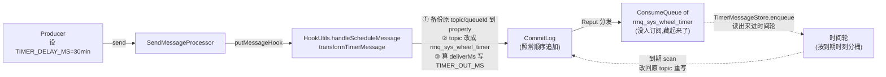

# 第 21 章 · 延时消息:5.x 时间轮

> 篇:P7 特性消息(第 7 篇 · 第 21 章)
> 主线呼应:第 7 篇的三张特性王牌,顺序消息(P7-20)讲完了"分区有序",这一章讲第二张——延时。延时消息的语义看着朴素:发出去之后不立刻被消费,过 N 秒/分钟/小时之后才对消费者可见。但在"海量延时任务"这个场景下,它会撞上一堵墙——你要不要为每条延时消息挂一个定时器?要不要每秒扫一遍所有没到期的任务?RocketMQ 4.x 给了一个朴素但够用的答案(固定 18 档 delayLevel),5.x 用**时间轮**(`TimerWheel` 的 slot + 指针)+ **双文件**(`TimerWheel` 粗粒度索引 + `TimerLog` 明细)给出了支持**任意延时**的答案。这一章我们拆透时间轮凭什么不爆炸——对标《Tokio》那套时间轮思想,但 RocketMQ 把它落到磁盘文件上,这是它最反直觉的一章。

## 核心问题

**延时消息到了 broker 先改 topic 进 `rmq_sys_wheel_timer`(暂时不进业务 ConsumeQueue、消费者看不到),再写进时间轮;时间轮按"到期时刻"分桶,指针一格一格轮转,到期的桶被 scan 出来写回原 topic。这一套凭什么支持任意延时、凭什么海量任务不爆炸?5.x 的 `TimerWheel`(slot 表)+ `TimerLog`(明细链)为什么要拆成两个文件?它和 4.x 固定 18 档 `delayLevel` 的根本改进是什么?**

读完本章你会明白:

1. 延时消息的本质:发出去先"藏起来"(改 topic 进 `rmq_sys_wheel_timer`,消费者不订阅它),到期了再"还回去"(写回原 topic,消费者这才看得见)。
2. 4.x 的 `ScheduleMessageService` 为什么只能给固定 18 档延时(`1s 5s 10s ... 1h 2h`),它靠每档一个定时器 + 一个 ConsumeQueue 队列实现,18 档以外用户只能凑。
3. 5.x 用**时间轮**(一个固定大小、按"到期时刻(精度 1s)"分桶的 slot 表)支持任意延时:`getSlotIndex(t) = t/precisionMs % (slotsTotal*2)`,每条延时消息按它的到期时刻落到一个 slot。
4. `TimerWheel`(slot 表,32 字节一 slot,存"这格有 N 条、首尾在 TimerLog 的哪里")与 `TimerLog`(明细,44 字节一记录,存每条消息在 CommitLog 的物理偏移)为什么要拆两个文件——一个粗粒度索引、一个明细链表,出队先查 slot 再顺着 TimerLog 链表取明细,和 CommitLog/ConsumeQueue 的"物理真相 + 逻辑索引"分层是同一种思想。
5. 时间轮凭什么不爆炸:slot 数固定(默认 7 天 × 86400 = 60 万格 × 2),指针轮转,入队是 `append` 一次 `TimerLog` + 改一个 slot 的 `putSlot` 两步 O(1);到期扫描是"读当前指针指向的那一格 → 顺着 TimerLog 链表取明细",只看一个 slot、不看全量。

> **如果一读觉得太难**:先只记住三件事——① 延时消息进 broker 先改 topic 藏起来,到期再写回原 topic;② 时间轮就是"按到期时刻分桶的固定大小数组 + 一个会转的指针",桶数固定所以不爆炸;③ `TimerWheel` 是"每桶有多少条"的粗表,`TimerLog` 是"每条在哪"的明细,出队先查桶再取明细。

---

## 21.1 一句话点破

> **延时消息的本质是"发出去先藏、到期再还"。5.x 把它落到一个固定大小的环形时间轮上:消息按"到期时刻"落到对应的 slot(slot 数固定、按时刻对 2×7天取模),到期时刻到了,指针扫到那一格,顺着那一格在 TimerLog 里的链表把消息一条条取出来、改回原 topic 重写一遍。slot 数固定意味着任务再多也只在一个固定大小的桶里堆;TimerWheel 存桶的概要(多少条、首尾在哪)、TimerLog 存每条的明细(CommitLog 偏移),这种"粗索引 + 明细链"的双文件设计,和 CommitLog/ConsumeQueue 的分层是同构的——出队先查桶再跳明细,不是扫全量。**

这是结论。本章倒过来拆:先看 4.x 那条"固定 18 档"的老路好在哪、卡在哪,再看 5.x 时间轮怎么把它升级成"任意延时",最后拆透双文件凭什么不爆炸。

---

## 21.2 延时消息的本质:藏起来,到期再还

在讲实现之前,先卸一个包袱:**延时消息到底要干嘛?**

最朴素的场景:下单后 30 分钟未支付就关单、订单完成后 7 天自动好评、定时抽奖。这些场景的共同点是——**业务发了一条消息,但不希望它立刻被消费,而是希望它"过 N 时间之后才对消费者可见"**。

最直白的实现是:producer 发消息时附带一个"延时时间",broker 收到之后**存起来但不放进业务 ConsumeQueue**,等延时到了,再把它**放进业务 ConsumeQueue**。消费者订阅的是业务 topic,延时没到时它在业务 ConsumeQueue 里根本看不到这条消息,自然消费不到;延时到了被放进 ConsumeQueue,它才被消费者拉走。

这里有一个关键设计:**延时消息不是另开一个文件存,而是"复用 CommitLog 存消息体 + 改 topic 藏起来 + 到期改回原 topic 还回去"**。

具体说,延时消息进 broker,经过 `SendMessageProcessor` 之后,会跑一个 `putMessageHook`——`HookUtils.handleScheduleMessage`([broker/.../util/HookUtils.java](../rocketmq/broker/src/main/java/org/apache/rocketmq/broker/util/HookUtils.java))。它干两件事:

1. **藏起来**:把消息的原始 topic/queueId 备份到 property(`PROPERTY_REAL_TOPIC` / `PROPERTY_REAL_QUEUE_ID`),再把 topic 改成系统 topic `rmq_sys_wheel_timer`、queueId 改成 0([HookUtils.java](../rocketmq/broker/src/main/java/org/apache/rocketmq/broker/util/HookUtils.java) 的 `transformTimerMessage`)。改完之后,这条消息照常走 CommitLog 顺序追加(P1-03)、照常被 Reput(P1-05)分发——但分发出来的 ConsumeQueue 属于 `rmq_sys_wheel_timer` 这个系统 topic,**没有任何业务消费者订阅它**,所以"藏"起来了。
2. **算到期时刻**:从 property 里读出 producer 设的延时(`TIMER_DELIVER_MS` 绝对时刻,或 `TIMER_DELAY_MS`/`TIMER_DELAY_SEC` 相对延时),算出一个绝对到期时刻 `deliverMs`,写进 property `TIMER_OUT_MS`(Time Out,到期时刻)。到期时刻对齐到精度(`timerPrecisionMs`,默认 1000ms,即 1 秒)。



注意这张图的两个虚线箭头——它们是延时消息的"一生"中两次穿越 CommitLog 的关键:**进**时间轮靠从 `rmq_sys_wheel_timer` 的 ConsumeQueue 读出来,**出**时间轮靠改回原 topic 再写一次 CommitLog。这两次穿越,是延时消息"藏"和"还"的物理实现。

> **钉死这件事**:延时消息的本质是"发出去先藏、到期再还"。藏起来的手段是**改 topic**(`rmq_sys_wheel_timer`)+ 算到期时刻(`TIMER_OUT_MS`),消息体照常进 CommitLog、照常被 Reput 分发,只是分发出的 ConsumeQueue 没人订阅,所以消费者看不到。到期还回去的手段是**改回原 topic 再写一次 CommitLog**(走 Reput 进业务 ConsumeQueue)。**延时消息的"延时"不在存储层,而在"什么时候把它从藏 topic 写回业务 topic"这一刻的判断上**。

---

## 21.3 4.x 的老路:固定 18 档 `delayLevel`

在讲 5.x 时间轮之前,先看 4.x 是怎么做的,看清它好在哪、卡在哪,5.x 时间轮的妙处才显形。

RocketMQ 4.x 的延时消息,叫 **`delayLevel`(延时档位)**。producer 发消息时设一个整数 `msg.setDelayTimeLevel(3)`,3 代表第三档。这"档"是什么?是 broker 配置里写死的一个**固定列表**——默认 18 档,字符串长这样([MessageStoreConfig.java:253](../rocketmq/store/src/main/java/org/apache/rocketmq/store/config/MessageStoreConfig.java#L253)):

```
messageDelayLevel = "1s 5s 10s 30s 1m 2m 3m 4m 5m 6m 7m 8m 9m 10m 20m 30m 1h 2h"
```

第 1 档 1 秒、第 3 档 10 秒、第 18 档 2 小时。`ScheduleMessageService.parseDelayLevel`([broker/.../schedule/ScheduleMessageService.java:300](../rocketmq/broker/src/main/java/org/apache/rocketmq/broker/schedule/ScheduleMessageService.java#L300))把这个字符串解析成 `ConcurrentSkipListMap<Integer, Long>`,key 是档号 1~18,value 是这档的延时毫秒数(1000、5000、...、7200000)。

实现上,4.x 用**每档一个 ConsumeQueue + 每档一个定时器**这套朴素机制:

1. producer 发 `delayTimeLevel=3` 的消息,broker 在 `HookUtils.transformDelayLevelMessage`([HookUtils.java:247](../rocketmq/broker/src/main/java/org/apache/rocketmq/broker/util/HookUtils.java#L247))里把 topic 改成 `SCHEDULE_TOPIC_XXXX`(老的系统 topic)、queueId 改成 `delayLevel-1=2`(档号当 queueId 用),原 topic 备份进 property。
2. `ScheduleMessageService` 给每一档开一个 `ScheduledExecutorService` 定时任务(`maxDelayLevel=18` 个线程),每档每隔一段时间扫自己的 queue。
3. 扫到一条消息,算它的"理论投递时刻"(`storeTimestamp + 该档延时`),如果当前时间 ≥ 投递时刻,就改回原 topic 写回 CommitLog;否则跳过。

这条路**简单、清晰、好懂**。但它有三个明显的卡点:

**卡点 1:延时档位写死在配置里,只能用 18 个固定值**。业务想要"延时 7 分钟",对不起,没有这一档,只能凑到 5m(第 11 档)或 10m(第 13 档)。想延时 3 小时?超出了,2h 是最大档。这是 4.x 延时消息被吐槽最多的点。

**卡点 2:延时档越多,要开的定时器和 queue 越多**。每档一个 ScheduledExecutorService 线程、一个独立的 ConsumeQueue。18 档勉强能扛,但要是想支持细粒度延时(比如每分钟一档,1440 档),那就是 1440 个线程、1440 个 queue——资源爆炸。

**卡点 3:扫到一条没到期的消息,只能"跳过等下一轮再扫"**。延时任务密度高时,反复扫同一批没到期的消息,空转严重。

> **不这样会怎样**:假设 4.x 想支持任意延时,朴素地给"每条延时消息挂一个 `ScheduledFuture`"(就像业务代码里 `scheduledExecutor.schedule(task, delay, unit)` 那样)。100 万条延时消息就是 100 万个 `ScheduledFuture` 堆在 `DelayedWorkQueue` 里,每条带一个 `MessageExt` 引用——**内存爆炸**(JVM 堆扛不住),**进程重启全丢**(ScheduledFuture 是内存对象,不是持久化的),**过期扫描 O(n)**(`DelayedWorkQueue` 是堆,堆顶到期出队 O(log n),但 broker 重启恢复时要全量重建堆 O(n log n))。这三条任何一条都是致命的。MQ 的延时消息**必须持久化**(broker 重启不能丢),所以"挂内存 ScheduledFuture"这条路从一开始就走不通。

这就是 4.x 选"固定 18 档"的根因——它用一个**有限档位 + 每档一个定时器**的妥协,避开了"任意延时 = 海量定时器"的爆炸。但代价是失去了任意延时的灵活性。5.x 要解决的就是:**既要支持任意延时、又不能爆炸、还要持久化**。答案就是时间轮。

---

## 21.4 5.x 时间轮:固定大小的环形 slot 表

5.x 把延时消息的实现整个换了一套,源码在 `store/.../timer/`。核心是一个叫 **`TimerWheel`** 的固定大小环形 slot 表 + 一个叫 **`TimerLog`** 的明细追加日志。我们先看时间轮这个 slot 表长什么样。

### slot 表的结构:一个固定大小的环形数组

`TimerWheel`([store/.../timer/TimerWheel.java](../rocketmq/store/src/main/java/org/apache/rocketmq/store/timer/TimerWheel.java))本质是一个**按"到期时刻"分桶的环形数组**,每个桶叫一个 **slot**,slot 数固定。它的构造参数有三个:`slotsTotal`(slot 总数)、`precisionMs`(每 slot 代表的时间跨度,叫"精度",默认 1000ms)、`fileName`。在 `TimerMessageStore` 构造里([TimerMessageStore.java:178](../rocketmq/store/src/main/java/org/apache/rocketmq/store/timer/TimerMessageStore.java#L178)):

```java
// TimerWheel contains the fixed number of slots regardless of precision.
this.slotsTotal = TIMER_WHEEL_TTL_DAY * DAY_SECS;   // 7 * 86400 = 604800
```

`TIMER_WHEEL_TTL_DAY = 7`(`:100`)、`DAY_SECS = 86400`(`:95`),所以默认 `slotsTotal = 604800`(60 万格)。`precisionMs = 1000`(1 秒,`MessageStoreConfig.java:71`)——也就是说,每一格代表 1 秒,60 万格代表 7 天。整个时间轮文件大小是 `wheelLength = slotsTotal * 2 * Slot.SIZE`(`TimerWheel.java:67`)。这里 `* 2` 是为了让环形指针有"半圈缓冲"(下面 21.5 讲为什么),`Slot.SIZE = 32` 字节。所以默认时间轮文件约 604800 × 2 × 32 ≈ 38.7 MB,**固定大小,不随延时消息数量增长**。

每个 slot 32 字节,布局在 `Slot` 类的注释里写得清清楚楚([Slot.java:19](../rocketmq/store/src/main/java/org/apache/rocketmq/store/timer/Slot.java#L19)):

```
 Slot(一个到期时刻的桶)= 32 字节定长:
 ┌──────────────┬───────────┬───────────┬───────────┬───────────┐
 │  delayed time│ first pos │ last pos  │    num    │   magic   │
 ├──────────────┼───────────┼───────────┼───────────┼───────────┤
 │   8 bytes    │  8 bytes  │  8 bytes  │  4 bytes  │  4 bytes  │
 └──────────────┴───────────┴───────────┴───────────┴───────────┘
   时间刻度       这格首条在     这格末条在     这格有几条   预留
   (timeMs/      TimerLog 的    TimerLog 的
   precisionMs)  位置            位置
```

注意五个字段的含义:

- **delayed time**(8B):这一格代表的"时间刻度"。注意它存的是 `timeMs / precisionMs`(秒数,不是毫秒),见 `TimerWheel.putSlot`(`:292` `localBuffer.get().putLong(timeMs / precisionMs)`)。读出来要乘回 precisionMs 才是真实时刻(`:280` `new Slot(localBuffer.get().getLong() * precisionMs, ...)`)。
- **first pos / last pos**(各 8B):这一格(这一秒)所有延时消息在 **TimerLog** 文件里的位置。first 是第一条的位置,last 是最新一条的位置。注意这是 TimerLog 的偏移,不是 CommitLog 的偏移。
- **num**(4B):这一格有几条延时消息。
- **magic**(4B):预留,目前没用(`Slot.java:33` 注释 `no use now, just keep it`)。

**这张 slot 表是时间轮的"目录"**——它不存任何一条延时消息的具体内容,只存"某一秒(某一格)有几条、首尾在 TimerLog 的哪里"。真正每条延时消息在哪,要顺着 first/last pos 跳到 TimerLog 去看。

### slot 的定位:对 2×slotsTotal 取模

slot 的下标计算是这个时间轮的核心算式([TimerWheel.java:284](../rocketmq/store/src/main/java/org/apache/rocketmq/store/timer/TimerWheel.java#L284)):

```java
public int getSlotIndex(long timeMs) {
    return (int) (timeMs / precisionMs % (slotsTotal * 2));
}
```

一个到期时刻 `timeMs`(毫秒),先除以精度(1000)变成秒,再对 `slotsTotal * 2`(默认 1209600,约 14 天)取模。这就是"环形"——`slotsTotal * 2` 是这个环的周长,任何一个秒数落进来,都被映射到 `[0, 2*slotsTotal)` 这个固定区间里的某个下标。

为什么是 `slotsTotal * 2`(14 天)而不是 `slotsTotal`(7 天)?因为时间轮要同时支持**写入**(把新来的延时消息放进"它该到期的那个未来的 slot)和**读取**(指针扫过已经到期的 slot 取出来),写入和读取的指针不能离得太近(否则刚写进去还没稳定就被读出来),也不能离得太远(否则延迟太久)。`* 2` 给了半圈的缓冲——写入指针在环的前半圈走,读取指针在环的后半圈走,两者保持半个环(7 天)的距离。这个设计在 21.5 的 needRoll 机制里会再次出现。

下面是时间轮的整体结构(ASCII 框图,本章核心图):

```
  TimerWheel(固定大小的环形 slot 表,默认 604800*2 = 1209600 格,每格 32B)

  时间轴方向 →(指针 currWriteTimeMs 顺时针走,每 1s 走一格)
       ┌──────────────────────────────────────────────────────────┐
       │ slot[0]   slot[1]   slot[2]   ...   slot[N-1]  (环)       │
       ├──────────┬──────────┬──────────┬─────┬──────────┬─────────┤
  写→  │ time=    │ time=    │ (空)     │ ... │ (空)     │ ←读     │  ← currWriteTimeMs 在写,
  入   │ t0       │ t1       │          │     │          │  出     │     currReadTimeMs 在读,
  这   │ first=   │ first=   │ first=   │     │ first=   │  这     │     两者相隔半圈(7天)
  边   │ 0        │ 4400     │ -1       │     │ -1       │  边     │
       │ last=    │ last=    │ last=    │     │ last=    │         │
       │ 4356     │ 4484     │ -1       │     │ -1       │         │
       │ num=12   │ num=3    │ num=0    │     │ num=0    │         │
       └──────────┴──────────┴──────────┴─────┴──────────┴─────────┘
            │
            │ first/last pos 指向 TimerLog 里的明细链表
            ▼
  TimerLog(按写入顺序追加的明细日志,每条 44B)
  ┌─────────┬─────────┬─────────┬─────────┬─────────┐
  │ UNIT_0  │ UNIT_1  │ UNIT_2  │  ...    │ UNIT_k  │  ← 每条 44B,
  │ prevPos │ prevPos │ prevPos │         │ prevPos │     prevPos 指向同 slot
  │ = -1    │ = 0     │ = -1    │         │         │     的上一条,串成链表
  │ offsetPy│ offsetPy│ offsetPy│         │         │
  │ =...    │ =...    │ =...    │         │         │  ← offsetPy/sizePy 指回
  │ sizePy  │ sizePy  │ sizePy  │         │         │     CommitLog 取消息体
  └─────────┴─────────┴─────────┴─────────┴─────────┘
```

**这张图把时间轮的全部精髓画出来了**:slot 表是固定大小的环形数组(120 万格 × 32B = 38.7MB),每格存"这一秒有几条、首尾在 TimerLog 哪里";TimerLog 是按写入顺序追加的明细日志(每条 44B),同 slot 的明细靠 `prevPos` 串成链表。出队时,读指针指到某一格,顺着这一格的 `lastPos` 进 TimerLog,沿 `prevPos` 链一条条取,直到 `firstPos`。

> **打个比方**(点到为止):时间轮像一个**巨大的圆周刻度盘**,刻度是秒,周长 14 天(120 万格)。每条延时消息按"它该到期的那个秒"贴在对应的刻度上。指针像表的秒针一样顺时针走,每走过一格,就检查这一格有没有贴着的消息,有就摘下来(出队)。消息再多,刻度盘大小不变(固定 38.7MB),只是某些刻度上贴得多一些。这个比方和《Tokio》时间轮那章是同构的,只是 Tokio 的时间轮在内存、RocketMQ 的在磁盘文件上。

### slot 的读写:O(1) 定位

因为 slot 表是定长数组(每格 32B),下标又能用 `getSlotIndex` O(1) 算出来,所以读写一个 slot 都是 O(1):

```java
// TimerWheel.java
public Slot getRawSlot(long timeMs) {
    localBuffer.get().position(getSlotIndex(timeMs) * Slot.SIZE);   // :279 算下标 × 32B 定位
    return new Slot(localBuffer.get().getLong() * precisionMs,      // :280 读 timeMs
        localBuffer.get().getLong(), localBuffer.get().getLong(),    // firstPos / lastPos
        localBuffer.get().getInt(), localBuffer.get().getInt());     // num / magic
}

public void putSlot(long timeMs, long firstPos, long lastPos, int num, int magic) {
    localBuffer.get().position(getSlotIndex(timeMs) * Slot.SIZE);   // :298 算下标 × 32B 定位
    localBuffer.get().putLong(timeMs / precisionMs);                 // :299 写 timeMs
    localBuffer.get().putLong(firstPos);                             // firstPos
    localBuffer.get().putLong(lastPos);                              // lastPos
    localBuffer.get().putInt(num);                                   // num
    localBuffer.get().putInt(magic);                                 // magic
}
```

`position(getSlotIndex(timeMs) * Slot.SIZE)` 这一行就是"算下标 × 单元大小"——和 ConsumeQueue 的 `consumeOffset * 20B`(P2-06)是同一种 O(1) 定位技巧。`localBuffer` 是 `ThreadLocal<ByteBuffer>`(`TimerWheel.java:50`),每个线程一个 ByteBuffer 副本避开并发竞争,这又是一个 Java 技巧(和 P1-02 的 `ThreadLocal<PutMessageThreadLocal>` 编码器同构)。

> **钉死这件事**:时间轮的 slot 表是一个**固定大小的环形定长数组**(默认 120 万格 × 32B),下标由"到期时刻 / 精度 % (slot 总数 × 2)"O(1) 算出。读写一个 slot 都是"算下标 × 32B 偏移"O(1)。**slot 表大小不随延时消息数量增长,这是时间轮不爆炸的物理根因**——100 万条延时消息和 1 亿条延时消息,slot 表都是 38.7MB。

---

## 21.5 双文件:TimerWheel(粗索引)与 TimerLog(明细链)

slot 表只存"某一格有几条、首尾在哪",不存任何一条消息的具体位置。每条延时消息的"在哪",在另一个文件 **`TimerLog`** 里。这两个文件为什么要拆开?我们先看 TimerLog 的结构,再回答这个问题。

### TimerLog:按写入顺序追加的明细链

`TimerLog`([store/.../timer/TimerLog.java](../rocketmq/store/src/main/java/org/apache/rocketmq/store/timer/TimerLog.java))是一组固定大小(`timerLogFileSize`,默认 100MB)的 `MappedFile` 组成的 `MappedFileQueue`(和 CommitLog 一样的滚动文件结构,P1-03 讲过),每条延时消息记录占 **44 字节**(`UNIT_SIZE`,`TimerLog.java:33`):

```java
public final static int UNIT_SIZE = 4  //size          —— 本条记录长度(=44)
        + 8 //prev pos                  —— 同 slot 上一条的 TimerLog 位置(链表前驱)
        + 4 //magic value                —— MAGIC_DEFAULT / MAGIC_ROLL / MAGIC_DELETE
        + 8 //curr write time, for trace —— 写入这一刻的时刻(enqueueTime)
        + 4 //delayed time, for check    —— 相对延时的秒数(不是绝对时刻,注意!)
        + 8 //offsetPy                   —— 消息体在 CommitLog 的物理偏移
        + 4 //sizePy                     —— 消息体在 CommitLog 的物理长度
        + 4 //hash code of real topic    —— 真实 topic 的 hash(给 metrics 用)
        + 8; //reserved value            —— 预留
```

注意两个关键字段:

- **prev pos**(8B):**这是同 slot 内消息串成链表的关键**。每条记录的 prevPos 指向"同一个到期时刻、在我之前写入 TimerLog 的那一条"的位置。slot 的 lastPos 指向最新一条,顺着 prevPos 一路往回走,直到 firstPos,就把这一格的所有消息都取出来了。这就是个**反向链表**(从新到旧)。
- **offsetPy / sizePy**(各 8B/4B):指回 **CommitLog** 取消息体。TimerLog 不存消息体,只存消息在 CommitLog 的物理偏移——**延时消息的消息体只在 CommitLog 存一份,TimerLog 只是个索引**(和 ConsumeQueue 不存消息体、只存 CommitLog 偏移,是同构的)。

注意 `delayed time` 字段存的是 **4 字节 int**(`+ 4 //delayed time, for check`),而且存的是**相对延时**(enqueueTime 到 delayedTime 的差,秒数),不是绝对时刻。出队时还原成绝对时刻:`delayedTime = bf.getInt() + enqueueTime`(`TimerMessageStore.java:1061`)。用 int 存秒级相对延时(最多约 68 年),比存 8 字节绝对时刻省 4 字节——这种"相对值省空间"的技巧,在 P2-06 的 ConsumeQueue tag hashcode(用 8B 存 hashcode 而非存 tag 字符串)也见过。

### 入队:写 TimerLog 一条 + 改 TimerWheel 一格

延时消息进时间轮的核心方法是 `doEnqueue`([TimerMessageStore.java:838](../rocketmq/store/src/main/java/org/apache/rocketmq/store/timer/TimerMessageStore.java#L838))。它干两件事——**先往 TimerLog 追加一条 44B 记录,再回过头更新 TimerWheel 那一格的 firstPos/lastPos/num**。看它的核心几行(省略 roll/delete 分支):

```java
public boolean doEnqueue(long offsetPy, int sizePy, long delayedTime, MessageExt messageExt, boolean isFromTimeline) {
    long tmpWriteTimeMs = currWriteTimeMs;
    // ... needRoll 判断(超过 2 天延时的消息先 roll,见下) ...
    String realTopic = messageExt.getProperty(MessageConst.PROPERTY_REAL_TOPIC);
    Slot slot = timerWheel.getSlot(delayedTime);              // :861 读出这一格的现状
    ByteBuffer tmpBuffer = timerLogBuffer;
    tmpBuffer.clear();
    tmpBuffer.putInt(TimerLog.UNIT_SIZE); //size               // :864
    tmpBuffer.putLong(slot.lastPos); //prev pos                // :865 prevPos = 这格当前的 lastPos
    tmpBuffer.putInt(magic); //magic                          // :866
    tmpBuffer.putLong(tmpWriteTimeMs); //currWriteTime         // :867
    tmpBuffer.putInt((int) (delayedTime - tmpWriteTimeMs)); //delayTime :868 相对延时秒数
    tmpBuffer.putLong(offsetPy); //offset                      // :869 CommitLog 物理偏移
    tmpBuffer.putInt(sizePy); //size                           // :870
    tmpBuffer.putInt(hashTopicForMetrics(realTopic)); //hashcode :871
    tmpBuffer.putLong(0); //reserved value                     // :872
    long ret = timerLog.append(tmpBuffer.array(), 0, TimerLog.UNIT_SIZE);  // :873 追加进 TimerLog
    if (-1 != ret) {
        timerWheel.putSlot(delayedTime, slot.firstPos == -1 ? ret : slot.firstPos, ret,
            isDelete ? slot.num - 1 : slot.num + 1, slot.magic);  // :877 更新这一格
        addMetric(messageExt, isDelete ? -1 : 1);
    }
    return -1 != ret;
}
```

这几行把"入队"的两个动作讲清楚了:

1. **TimerLog 追加一条**(`:873`):新记录的 `prevPos` 字段填的是 `slot.lastPos`——也就是这一格"上一条最新记录的位置"(`:865`)。append 完返回这一条的位置 `ret`。
2. **TimerWheel 改一格**(`:877`):这一格的 `firstPos` 如果原来是 -1(空格),就设成 `ret`(我成了第一条);否则保持原 first 不变。`lastPos` 永远设成 `ret`(我成了最新一条)。`num` 加 1。

**这两步把一条新消息"链"进了对应 slot 的链表头部**(lastPos 指向它,它的 prevPos 指向原来的 last)。这就是"同 slot 消息串成链表"的实现。两步合起来 O(1):append 是顺序追加 O(1),putSlot 是定长数组下标定位 O(1)。

> **不这样会怎样**:假设不拆两个文件,把"slot 概要"和"明细"塞进同一个文件。每来一条新延时消息,要么追加在文件末尾(那 slot 概要去哪找?要扫全文件?),要么就地改 slot 概要(那这一格满了要扩容、要搬移,变成随机写)。**拆成 TimerWheel(定长 slot 表,下标可算)+ TimerLog(只追加的明细链)之后,TimerWheel 是定长随机访问、TimerLog 是纯顺序追加,各走各的最优路径**。这正是 CommitLog(纯顺序写)+ ConsumeQueue(定长数组下标)那套思想的复刻——RocketMQ 把"物理真相(CommitLog) + 逻辑索引(ConsumeQueue)"的两层结构,原样搬到了延时消息上:**CommitLog 存消息体(物理真相),TimerLog 存延时记录(逻辑明细),TimerWheel 存 slot 概要(粗索引)**。三层各司其职。

### 出队:读 slot → 顺着 TimerLog 链表取明细

出队的核心是 `dequeue`([TimerMessageStore.java:1015](../rocketmq/store/src/main/java/org/apache/rocketmq/store/timer/TimerMessageStore.java#L1015))。读指针 `currReadTimeMs` 指向"当前要处理的这一秒"。`dequeue` 干的事:

```java
public int dequeue() throws Exception {
    // ... 各种前置检查 ...
    Slot slot = timerWheel.getSlot(currReadTimeMs);              // :1026 读出当前这一格
    if (-1 == slot.timeMs) {                                      // 空格
        moveReadTime();                                           // 指针往前走一格
        return 0;
    }
    // ... 
    long currOffsetPy = slot.lastPos;                             // :1035 从 lastPos 开始
    LinkedList<TimerRequest> normalMsgStack = new LinkedList<>();
    while (currOffsetPy != -1) {                                  // :1042 顺着 prevPos 链表走
        // ... 定位 TimerLog 文件,读出 44B 记录 ...
        prevPos = timeSbr.getByteBuffer().getLong();              // :1058 prevPos
        int magic = timeSbr.getByteBuffer().getInt();             // :1059
        long enqueueTime = timeSbr.getByteBuffer().getLong();     // :1060
        long delayedTime = timeSbr.getByteBuffer().getInt() + enqueueTime;  // :1061 还原绝对时刻
        long offsetPy = timeSbr.getByteBuffer().getLong();        // :1062 CommitLog 偏移
        int sizePy = timeSbr.getByteBuffer().getInt();            // :1063
        TimerRequest timerRequest = new TimerRequest(offsetPy, sizePy, delayedTime, enqueueTime, magic);
        normalMsgStack.addFirst(timerRequest);                    // :1069 addFirst,逆序变正序
        currOffsetPy = prevPos;                                   // :1074 走到前一条
    }
    // ... 把 normalMsgStack 分批丢给 dequeueGetQueue,后续异步取 CommitLog 消息体、改回原 topic 重写 ...
    moveReadTime();                                               // :1116 处理完,指针走一格
    return 1;
}
```

`dequeue` 只看**当前指针指向的那一格**,顺着这一格在 TimerLog 的链表(`lastPos → prevPos → prevPos → ... → firstPos`)一条条取出来,塞进 `normalMsgStack`。**它不扫别的 slot,不扫全量**——只看这一格。这就是时间轮"扫描 O(slot 大小)"的根:扫描成本和"这一格有多少条"成正比,和"整个时间轮有多少条延时消息"无关。

取出来的 `TimerRequest` 后续走一条异步流水线(`dequeueGetQueue` → `dequeueGetMessageService` 从 CommitLog 取消息体 → `dequeuePutQueue` → `dequeuePutMessageService` 改回原 topic 重写 CommitLog)。改回原 topic 的核心是 `convertMessage`([TimerMessageStore.java:1242](../rocketmq/store/src/main/java/org/apache/rocketmq/store/timer/TimerMessageStore.java#L1242)):

```java
if (needRoll) {
    msgInner.setTopic(msgExt.getTopic());                          // :1262 roll 消息保持原 topic(还是 wheel_timer)
} else {
    msgInner.setTopic(msgInner.getProperty(MessageConst.PROPERTY_REAL_TOPIC));      // :1265 改回原 topic!
    msgInner.setQueueId(Integer.parseInt(msgInner.getProperty(MessageConst.PROPERTY_REAL_QUEUE_ID))); // :1266
    MessageAccessor.clearProperty(msgInner, MessageConst.PROPERTY_REAL_TOPIC);
    MessageAccessor.clearProperty(msgInner, MessageConst.PROPERTY_REAL_QUEUE_ID);
}
```

`msgInner.setTopic(msgInner.getProperty(MessageConst.PROPERTY_REAL_TOPIC))` 这一行就是"还回去"——把当初备份在 property 里的真实 topic 取出来设回去,然后 `doPut`(`:1199` `messageStore.putMessage(message)`)重写进 CommitLog。这一写,Reput 就会把它分发进**业务 topic 的 ConsumeQueue**,消费者这才看得见、拉得到。

### 出队的扫描成本:O(这一格的条数)

把入队和出队合起来看,时间轮的复杂度:

| 操作 | 复杂度 | 为什么 |
|------|--------|--------|
| 入队一条 | O(1) | TimerLog append(顺序追加)+ TimerWheel putSlot(下标 × 32B 定位),各 O(1) |
| 出队扫一格 | O(这一格的条数) | 只读当前指针指的那一格,顺着 TimerLog 链表取,条数 = 这一格的 num |
| 内存/磁盘占用 | O(slot 数,固定) | TimerWheel 固定 38.7MB;TimerLog 随延时消息总数线性增长(每条 44B) |

注意 TimerLog 是会随延时消息总数线性增长的(每条 44B),但这是**可接受的**——它只是个索引(44B 比消息体本身小一两个数量级),且是顺序追加(纯顺序写,P1-03 那套 mmap + mappedFileQueue)。真正"不爆炸"的是 **TimerWheel 这个 slot 表,它固定大小**。这正是时间轮的核心价值:**把"扫描全量"压成"扫描一格"**。

> **反面对比**(钉死一次):假设 5.x 不用时间轮,朴素地给"每个延时任务一个 `ScheduledFuture`"或"维护一个全局按到期时刻排序的优先队列",会撞什么墙?
>
> - **`ScheduledFuture` 方案**(内存对象):100 万条延时消息 = 100 万个 `ScheduledFuture` 堆在 `DelayedWorkQueue`,**内存爆炸**(每个 Future 带 MessageExt 引用)、**重启全丢**(内存对象不持久化)、**过期扫描 O(log n)**(堆)。三条都是致命的。
> - **全局优先队列方案**(假设持久化):每次入队 O(log n)(堆插入),过期扫描堆顶 O(log n),看似还行。但**重启恢复时要全量重建堆 O(n log n)**,而且堆不支持"按 slot 分桶并发处理"(只能一个线程扫堆顶)。100 万延时消息重启重建堆,几十秒级延迟。
>
> 时间轮把入队压到 O(1)(slot 数组下标定位 + 链表头插)、把出队扫一格压到 O(这一格的条数)(不看别的格)、把重启恢复压到"读 checkpoint + 从 currReadTimeMs 接着扫"(不重建任何结构)。**slot 数固定是这一切的物理根因**。这就是时间轮的"妙"。

---

## 21.6 两条演化路径:5.x 时间轮 vs 4.x 18 档的对照

讲完了双文件,我们把 4.x 和 5.x 摆在一起对照,看清"根本改进"在哪。

| | 4.x `ScheduleMessageService` | 5.x `TimerMessageStore` + 时间轮 |
|------|------|------|
| 延时表达 | 整数 `delayLevel`(1~18),映射到固定列表 `1s 5s 10s ... 2h` | 任意绝对时刻 `TIMER_DELIVER_MS`,或相对 `TIMER_DELAY_MS`/`TIMER_DELAY_SEC` |
| 延时上限 | 18 档最长 2 小时 | 默认 2 天(`timerRollWindowSlot = 172800` 秒),超长靠 roll 机制接力 |
| 分桶机制 | 每档一个 ConsumeQueue(queueId = level-1),共 18 个 queue | 一个固定 slot 表(默认 120 万格),按"到期时刻 / 1s"分桶 |
| 到期判断 | 每档一个 `ScheduledExecutorService` 定时器,扫自己 queue,逐条比对 `storeTimestamp + 该档延时 ≤ now` | 一个读指针 `currReadTimeMs` 顺时针走,走到哪格就处理哪格,不用逐条比对 |
| 扫描成本 | 每档扫整个 queue(O(n)),没到期的跳过空转 | 只扫当前指针那格(O(这一格条数)),不扫别的格 |
| 持久化 | 靠 CommitLog + ConsumeQueue(本来就持久化) | 靠 TimerWheel 文件 + TimerLog 文件 + TimerCheckpoint(`lastReadTimeMs` / `lastTimerLogFlushPos`) |
| 重启恢复 | 重启后每档定时器重新启动,从 offsetTable 接着扫 | 读 TimerCheckpoint 恢复 `currReadTimeMs` 和 TimerLog 进度,接着扫 |

5.x 相对 4.x 的**根本改进**有三条:

1. **任意延时**:`TIMER_DELIVER_MS`(绝对时刻)让用户可以指定任意精确到秒的投递时刻(对齐到 1s 精度),不再被 18 档绑死。配合 `TIMER_DELAY_MS`/`TIMER_DELAY_SEC`(相对延时),业务可以自由表达"30 分钟后""7 天后""明年 1 月 1 日 0 点"。
2. **扫描成本和总条数解耦**:4.x 每档扫整个 queue,延时消息密度高时空转严重;5.x 只扫当前指针那一格,**条数再多,不在这一格的就不扫**。
3. **统一的时间维度**:4.x 18 个 queue 各自独立,跨档没法统一调度;5.x 所有延时消息进同一个时间轮,按统一的"到期时刻"排,读写指针各一个,调度逻辑简单。

> **钉死这件事**:5.x 时间轮相对 4.x 18 档的根本改进,不是"性能提升了 N 倍"(在延时消息不多时两者差不多),而是**支持任意延时 + 扫描成本和总条数解耦 + 调度逻辑统一**。它把"延时"从一个"分档查表"问题,升级成了一个"按时刻分桶、指针轮转"的时间轮问题——和 Tokio、Netty `HashedWheelTimer`、Kafka 的 `Purgatory` 是同一种数据结构思想,只是 RocketMQ 把它落到了磁盘文件上(为了持久化)。

---

## 21.7 超长延时的 roll 机制:指针追不上怎么办

时间轮有一个固有的限制:**slot 表只覆盖 `slotsTotal * 2` 的时长(默认 14 天)**。那如果业务要发一条"30 天后才到期"的延时消息呢?30 天 > 14 天,它的到期时刻落到的 slot 下标,会和"今天到期"的消息**撞到同一个 slot**(因为对 1209600 取模)。

这就是 `needRoll`(需要滚动)机制要解决的问题。在 `doEnqueue` 里([TimerMessageStore.java:842](../rocketmq/store/src/main/java/org/apache/rocketmq/store/timer/TimerMessageStore.java#L842)):

```java
boolean needRoll = delayedTime - tmpWriteTimeMs >= (long) timerRollWindowSlots * precisionMs;  // :842
int magic = MAGIC_DEFAULT;
if (needRoll) {
    magic = magic | MAGIC_ROLL;                                   // :845 打上 ROLL 标记
    if (delayedTime - tmpWriteTimeMs - (long) timerRollWindowSlots * precisionMs < (long) timerRollWindowSlots / 3 * precisionMs) {
        delayedTime = tmpWriteTimeMs + (long) (timerRollWindowSlots / 2) * precisionMs;  // :848 先 roll 到半圈处
    } else {
        delayedTime = tmpWriteTimeMs + (long) timerRollWindowSlots * precisionMs;        // :850 先 roll 到一圈处
    }
}
```

`timerRollWindowSlots = slotsTotal - TIMER_BLANK_SLOTS = 604800 - 60 = 604740`(`:218`,约 7 天减 1 分钟)。如果一条消息的延时 ≥ 7 天(`timerRollWindowSlots * precisionMs`),它就 needRoll。roll 的做法是:**把它的到期时刻临时改成一个"安全的近期时刻"(半圈或一圈处),打上 `MAGIC_ROLL` 标记**。这样它先在一个"近期"的 slot 里"暂存"——等指针扫到它时(`dequeue` 里 `needRoll(magic)` 为真),**不写回原 topic,而是再 roll 一次**(在 `convertMessage` 里 `needRoll` 分支 `msgInner.setTopic(msgExt.getTopic())` `:1262`,topic 保持 `rmq_sys_wheel_timer`,继续藏),直到累计 roll 的次数让真实到期时刻落在指针能扫到的范围内,才真正写回原 topic。

`TIMER_ROLL_TIMES` property 记录它 roll 了几次(`convert` 方法 `:1176-1180`)。这是一个"接力"机制——**用近期 slot 反复暂存,直到真实到期时刻进入指针射程**。它解决了"slot 表固定大小 vs 任意长延时"的矛盾,代价是超长延时消息会被处理多次(每 roll 一次出队一次、再入队一次)。

> **钉死这件事**:时间轮 slot 表固定覆盖 14 天,超长延时(> 7 天)靠 `MAGIC_ROLL` 标记 + 近期 slot 暂存 + 出队时接力再 roll 解决。这是"固定大小环形数组"对"任意长延时"的妥协——不扩大 slot 表(那会撑爆磁盘),而是让超长消息多滚几圈。

---

## 21.8 持久化与重启恢复:TimerCheckpoint

延时消息的指针状态(`currReadTimeMs` 读到哪、`currWriteTimeMs` 写到哪、TimerLog flush 到哪个偏移)必须持久化,否则 broker 重启就丢了"我扫到哪一秒了"。这个状态存在 **`TimerCheckpoint`**([store/.../timer/TimerCheckpoint.java](../rocketmq/store/src/main/java/org/apache/rocketmq/store/timer/TimerCheckpoint.java))里,一个 mmap 的小文件(OS_PAGE_SIZE = 4KB),存四个关键字段(`TimerCheckpoint.java:39-42`):

- `lastReadTimeMs`:读指针扫到的最后一秒。
- `lastTimerLogFlushPos`:TimerLog flush 到磁盘的偏移。
- `lastTimerQueueOffset`:`rmq_sys_wheel_timer` 这个 topic 的 ConsumeQueue 消费到哪个 offset(用于入队时的 `currQueueOffset` 恢复)。
- `masterTimerQueueOffset`:slave 用,从 master 同步的进度。

每个字段 8 字节,加 DataVersion(状态版本 + 时间戳 + 计数器,各 8 字节),一共 56 字节(`encode` 方法 `:128` `ByteBuffer.allocate(56)`)。`flush`(`:108`)把它们写回 mmap 并 `force`。

broker 重启时,`TimerMessageStore` 构造里读 checkpoint,恢复 `currReadTimeMs` 和 `currQueueOffset`,然后从那一秒接着扫。**不重建任何数据结构**——TimerWheel 文件还在(mmap 映射回来)、TimerLog 文件还在(mappedFileQueue load 回来)、checkpoint 告诉你"扫到哪了",接着扫就行。这就是时间轮"重启恢复 O(1)"的根:状态都在磁盘文件里,内存里只有几个指针。

> **钉死这件事**:延时消息的状态(读指针、TimerLog 进度、wheel_timer queue offset)存在 `TimerCheckpoint`(56 字节 mmap 小文件)。重启后读 checkpoint 恢复几个指针,接着扫,**不重建任何结构**。这是时间轮"重启恢复快"的根——和 4.x 的 offsetTable(内存 map,要重建)相比是质变。

---

## 21.9 技巧精解:时间轮 slot + 双文件,凭什么海量延时任务不爆炸

这一节我们把本章最硬核的技巧单独拆透:**5.x 时间轮凭什么支持任意延时、海量任务不爆炸、还能持久化**。

### 技巧 1:固定大小环形 slot 表 + 链地址法

时间轮的核心数据结构是一个**固定大小的环形定长 slot 表**(`TimerWheel`,默认 120 万格 × 32B),每条延时消息按"到期时刻 / 精度 % (slot 总数 × 2)"O(1) 落到一个 slot。同一个 slot 的多条消息,在 `TimerLog` 里靠 `prevPos` 字段串成**反向链表**。

这个设计的妙处在三个层面:

**层面 1:slot 表固定大小,不随延时消息数量增长**。100 万条和 1 亿条延时消息,slot 表都是 38.7MB。这是时间轮"不爆炸"的物理根因。对比"每条一个 ScheduledFuture"或"全局优先队列",那些都随条数线性甚至超线性增长。

**层面 2:链地址法解决"同一时刻多条消息"的冲突**。和 `IndexFile` 的 hash + 链地址法(P2-07)是同一种思想——slot 表相当于 hash 桶,TimerLog 的链表相当于溢出链。区别是:IndexFile 的 key 是 hash 后的 msgId(分布随机),时间轮的 key 是"到期时刻"(天然按时间排序,且近期密集)。后者让"指针顺时针走、每走一格处理一格"成为可能——这是时间轮特有的优势,hash 索引做不到。

**层面 3:`prevPos` 反向链表让出队天然有序**。`doEnqueue` 里 `tmpBuffer.putLong(slot.lastPos)`(`:865`)把新消息的 prevPos 指向"上一条最新",slot.lastPos 更新成"我"——新消息在链表头部。`dequeue` 里 `normalMsgStack.addFirst(timerRequest)`(`:1069`)把链表逆序变正序,保证先入队的先处理。

```java
// 入队(简化示意,非源码原文):
slot.lastPos = timerLog.append(新记录{ prevPos = slot.lastPos, offsetPy, ... });
// 出队(简化示意,非源码原文):
for (curr = slot.lastPos; curr != -1; curr = 记录[curr].prevPos) {
    normalMsgStack.addFirst(记录[curr]);  // 逆序,变正序
}
```

> **反面对比**:如果不用链地址法,而用"每个 slot 一个动态数组"(类似 ArrayList),会怎样?每来一条要扩容数组(可能要拷贝)、slot 表条目变长(不再定长 32B,下标 × size 算偏移失效)、mmap 映射大小不定。**链地址法把"同一格多条"这件事甩给 TimerLog(纯顺序追加),让 slot 表保持定长 + 固定大小**——这正是 ConsumeQueue 选"20B 定长"而非"动态数组"的同款理由(P2-06)。

### 技巧 2:TimerWheel(粗索引)与 TimerLog(明细)的双文件分层

这个技巧在 21.5 已经展开,这里收束成一句话:**TimerWheel 是定长随机访问(下标可算),TimerLog 是纯顺序追加,两个文件各走各的最优路径**。这种"粗索引 + 明细链"的分层,和 RocketMQ 经典的"CommitLog(物理真相)+ ConsumeQueue(逻辑索引)"是同构的:

```
  经典存储:           延时消息:
  CommitLog    ←→     CommitLog        (消息体,物理真相,只存一份)
  ConsumeQueue ←→     TimerLog         (明细索引,每条 44B,顺序追加)
  (20B 定长)          TimerWheel       (slot 概要,32B 定长,下标可算)
```

延时消息比普通消息多了一层 TimerWheel(因为延时消息多了"到期时刻"这个维度,要按时刻分桶)。但思想完全一致:**物理真相存一份,索引分层、各走最优路径**。这是 RocketMQ 存储哲学在延时消息上的复刻。

### 技巧 3:指针轮转 + 出队只看当前格

时间轮出队(`dequeue`)的扫描成本是 O(当前格的条数),**和整个时间轮有多少条延时消息无关**。这是因为读指针 `currReadTimeMs` 顺时针走,每走一格只处理那一格——别的格的消息,无论有多少,都不在这一轮的处理范围内。

这个"指针轮转"的设计,把"扫描全量找到期消息"这个 O(n) 问题,降成了"扫一格"的 O(格内条数)问题。妙处在于:**"到期"这件事被时间轮的结构本身编码了**——指针走到哪格,哪格就是到期的,不用逐条比对时刻。4.x 的 `ScheduleMessageService` 是"扫整个 queue 逐条比对 storeTimestamp + delay ≤ now",那是 O(queue 长度);5.x 是"指针走到哪格处理哪格",那是 O(格内条数)。当延时消息密度高(同一秒有很多条到期)时,两者差不多;但当延时消息**跨度大、稀疏**(比如延时 1 秒到 7 天都有,但每秒只有几条到期),5.x 的优势就显出来了——4.x 要扫每个档的整个 queue,5.x 只扫当前那一秒。

> **钉死这件事**:时间轮不爆炸的三件套——① 固定大小环形 slot 表(slot 数固定,不随条数增长);② TimerWheel 粗索引 + TimerLog 明细链的分层(定长随机访问 + 纯顺序追加各走最优);③ 指针轮转 + 出队只看当前格(扫描 O(格内条数),和总条数解耦)。这三件套联手,让 5.x 延时消息支持任意延时、海量任务、还能持久化重启恢复——这是 4.x 18 档给不了的。

---

## 章末小结

这一章讲了 RocketMQ 的第二张特性王牌——延时消息。它落在**特性**这一面(第 7 篇),是在前 6 篇"发-存-消"基本旅程之上做的精巧增强。我们立起了四件事:

1. **延时消息的本质是"藏起来、到期再还"**:进 broker 先在 `HookUtils.transformTimerMessage` 里改 topic 进 `rmq_sys_wheel_timer`、备份原 topic 到 property、算出到期时刻写 `TIMER_OUT_MS`;消息体照常进 CommitLog、照常被 Reput 分发,只是分发出的 ConsumeQueue 属于系统 topic 没人订阅,所以"藏"起来了。到期后 `dequeue` 把它改回原 topic 重写 CommitLog,Reput 再分发进业务 ConsumeQueue,消费者这才看得见。

2. **5.x 时间轮 = 固定大小环形 slot 表 + TimerLog 明细链**:slot 表(`TimerWheel`,默认 120 万格 × 32B)按"到期时刻 / 1s"分桶,下标 O(1) 算出;每条延时消息按写入顺序追加进 `TimerLog`(44B 一条),同 slot 的消息靠 `prevPos` 串成反向链表。入队 O(1)(TimerLog append + TimerWheel putSlot),出队 O(格内条数)(顺着链表取)。

3. **双文件的分层 = CommitLog/ConsumeQueue 思想的复刻**:CommitLog 存消息体(物理真相)、TimerLog 存延时记录(明细索引)、TimerWheel 存 slot 概要(粗索引)。TimerWheel 定长随机访问、TimerLog 纯顺序追加,各走最优路径。

4. **5.x 相对 4.x 的根本改进**:任意延时(不再 18 档)、扫描成本和总条数解耦(只扫当前格)、调度逻辑统一(一个读指针)。超长延时(> 7 天)靠 `MAGIC_ROLL` 标记 + 近期 slot 暂存 + 接力 roll 解决;持久化靠 `TimerCheckpoint`(56 字节 mmap)存几个指针,重启不重建任何结构。

回到全书二分法:这一章是**特性**,但它紧贴**存储内核**——延时消息的双文件设计(TimerWheel + TimerLog)直接复刻了 CommitLog + ConsumeQueue 的分层思想(P0-01 / P2-06),`MappedFileQueue` 滚动文件、mmap 内存映射、`ThreadLocal<ByteBuffer>` 避免竞争,这些都是前几篇讲过的存储内核技巧在延时场景的应用。它也复用了 P1-05 的 Reput——延时消息进 `rmq_sys_wheel_timer` 的 ConsumeQueue、出队改回原 topic 重写 CommitLog,这两次"穿越"都靠 Reput 分发。

### 五个"为什么"清单

1. **为什么延时消息要改 topic 藏起来,而不是另开一个文件存?** 复用 CommitLog 存消息体(不另开文件、不重复存),改 topic 只是改了"它属于哪个 ConsumeQueue"。消费者订阅的是业务 topic,改 topic 进 `rmq_sys_wheel_timer` 后,它分发出的 ConsumeQueue 没人订阅,自然藏起来。到期改回原 topic 重写 CommitLog,Reput 分发进业务 ConsumeQueue,消费者才看得见。这是"用现有存储机制实现藏/还"的最轻量做法(21.2 节)。

2. **为什么 4.x 只能支持固定 18 档延时?** 4.x 的 `messageDelayLevel` 配置写死 18 档(`1s 5s 10s ... 2h`),每档一个 ConsumeQueue(queueId=level-1)+ 一个 `ScheduledExecutorService` 定时器。想加档就要加 queue 和线程,资源爆炸;想用配置外的延时(比如 7 分钟)只能凑到最近的档。这是"有限档位 + 每档一个定时器"对"任意延时 = 海量定时器"爆炸的妥协(21.3 节)。

3. **时间轮凭什么海量任务不爆炸?** 三件套:① slot 表固定大小(默认 120 万格 × 32B = 38.7MB,不随条数增长);② TimerWheel 粗索引(定长下标可算)+ TimerLog 明细链(纯顺序追加)分层,各走最优路径;③ 指针轮转,出队只扫当前格 O(格内条数),和总条数解耦。入队 O(1)(append + putSlot),出队 O(格内条数)(21.4 / 21.5 / 21.9 节)。

4. **TimerWheel 和 TimerLog 为什么要拆成两个文件?** TimerWheel 是定长 slot 表(下标 × 32B 可算偏移,随机访问 O(1)),TimerLog 是只追加的明细链(顺序写 O(1),prevPos 串同 slot 消息)。拆开后 TimerWheel 走"定长随机访问"最优路径、TimerLog 走"纯顺序追加"最优路径。这和 CommitLog(纯顺序写)+ ConsumeQueue(定长数组)的分层是同构的——物理真相(CommitLog)+ 明细索引(TimerLog)+ 粗索引(TimerWheel)(21.5 节)。

5. **slot 表只覆盖 14 天,超长延时(> 7 天)怎么办?** `doEnqueue` 检测到延时 ≥ `timerRollWindowSlots * precisionMs`(约 7 天)就 `needRoll`,打上 `MAGIC_ROLL` 标记,把到期时刻临时改成近期(半圈或一圈处)暂存。指针扫到它时,`convertMessage` 的 `needRoll` 分支不写回原 topic(topic 保持 `rmq_sys_wheel_timer` 继续藏),而是再 roll 一次,直到真实到期时刻进入指针射程。`TIMER_ROLL_TIMES` 记录 roll 次数。这是"固定大小环形数组"对"任意长延时"的妥协(21.7 节)。

### 想继续深入往哪钻

- **源码主线**:
  - 改 topic 入口:`broker/.../util/HookUtils.java`(`handleScheduleMessage`、`transformTimerMessage` :204-L244 改 topic 进 `rmq_sys_wheel_timer`、`transformDelayLevelMessage` :247-L260 是 4.x 老 path 改 `SCHEDULE_TOPIC_XXXX`)。
  - 时间轮核心:`store/.../timer/TimerWheel.java`(`getSlotIndex` :284 取模算下标、`getRawSlot` :278 / `putSlot` :297 定长读写、`flush` :127、`backup` :154 快照);`store/.../timer/Slot.java`(32B 布局注释 :19)。
  - 明细日志:`store/.../timer/TimerLog.java`(`UNIT_SIZE = 44` :33 字段布局、`append` :65 顺序追加 + 满文件填 BLANK_MAGIC_CODE 滚动、`BLANK_MAGIC_CODE` :31)。
  - 入队/出队编排:`store/.../timer/TimerMessageStore.java`(`TIMER_TOPIC = "rmq_sys_wheel_timer"` :86、`TIMER_OUT_MS` :87、`slotsTotal = 7*86400` :178、`timerRollWindowSlots` :218、`enqueue` :751 从 wheel_timer CQ 读出来、`doEnqueue` :838 写 TimerLog + 改 slot、`dequeue` :1015 读 slot + 顺链表取明细、`convertMessage` :1242 改回原 topic、`doPut` :1188 重写 CommitLog、`MAGIC_ROLL` roll 机制 :842-L852、`warmDequeue` :885 预热)。
  - 持久化:`store/.../timer/TimerCheckpoint.java`(`lastReadTimeMs` 等 4 字段 :39-42、`flush` :108、`encode/decode` :127-L154 56 字节)。
  - 服务线程:`TimerEnqueueGetService` :1407、`TimerEnqueuePutService` :1444(`putMessageToTimerWheel` :1474)、`TimerDequeueGetService` :1547、`TimerDequeueGetMessageService` :1694(从 CommitLog 取消息体)、`TimerDequeuePutMessageService` :1588(`convert` + `doPut` 改回原 topic 重写)、`TimerDequeueWarmService` :1777(预热)。
  - 4.x 对照:`broker/.../schedule/ScheduleMessageService.java`(`delayLevelTable` :75、`parseDelayLevel` :300、`DeliverDelayedMessageTimerTask` :367)。
  - 配置:`store/.../config/MessageStoreConfig.java`(`messageDelayLevel` 默认 18 档 :253、`timerPrecisionMs = 1000` :71、`timerRollWindowSlot = 172800` :73)。
- **和 Tokio 时间轮对照**:Tokio 用层级时间轮(hierarchical timing wheel,多层 slot 不同精度)做异步任务超时,RocketMQ 用单层时间轮(固定精度 1s)做延时消息。两者核心思想一致(slot 分桶 + 指针轮转),区别是 Tokio 在内存(任务不持久化)、RocketMQ 在磁盘(必须持久化,所以多了 TimerLog/TimerWheel/Checkpoint 三文件)。详见《Tokio》时间轮那一章。
- **和 Kafka 对照**:Kafka 没有原生延时消息(要靠业务层或 Stream API 自己实现)。RocketMQ 的延时消息是它的特性优势之一,5.x 时间轮让这个优势从"18 档"升级到"任意延时",补上了和 RabbitMQ、Pulsar 等支持任意延时的 MQ 的差距。
- **TimerMetrics 与监控**:`store/.../timer/TimerMetrics.java` 按 realTopic 统计每 topic 的延时消息条数(`addMetric` :879 / :1643),给监控用。`hashTopicForMetrics` :871 把 realTopic hash 进 TimerLog 记录,出队时反查。
- **RocksDB 模式**:5.x 还有 `timer/rocksdb/` 子目录,用 RocksDB 替代 TimerWheel + TimerLog 做延时消息存储(海量延时消息场景下,固定 slot 表可能不够,LSM 收敛之)。这呼应 P8-23 的"RocksDB 替 CommitLog + ConsumeQueue"思路。本章不展开。

### 引出下一章

这一章讲了延时消息——在"发-存-消"基本旅程之上,通过改 topic 藏起来 + 时间轮按时刻分桶 + 到期改回原 topic 还回去,给"需要延时"的消息开了一条延时通道。但延时消息只是 RocketMQ 三张特性王牌之二。下一章 **P7-22 事务消息** 讲第三张、也是最复杂的一张——业务执行本地事务和发消息这两件事,怎么做成"原子":先发 half message 占位(对消费者不可见)、执行本地事务、根据本地事务结果 commit(写回业务 topic)或 rollback(标记删除)、未决靠 broker 定期回查 producer 的本地事务状态。half message 的"占位 + 回查"机制,和本章延时消息的"藏起来 + 到期还"在"改 topic 藏"这一招上是同源的——只是延时消息靠"时间到期"触发还回去,事务消息靠"本地事务结果"触发 commit/rollback。下一章我们拆透事务消息凭什么做到最终一致。

