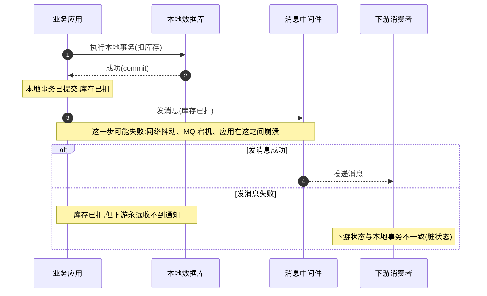
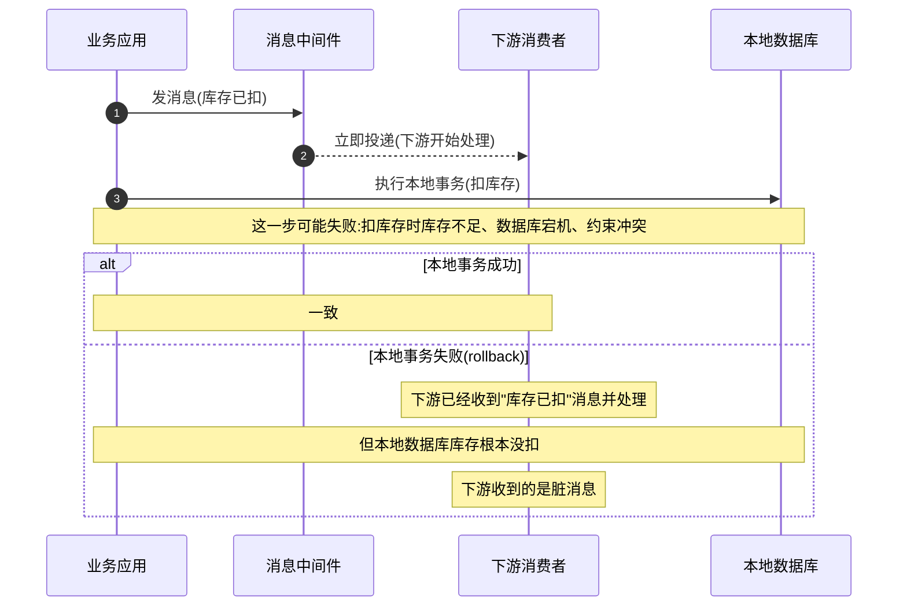
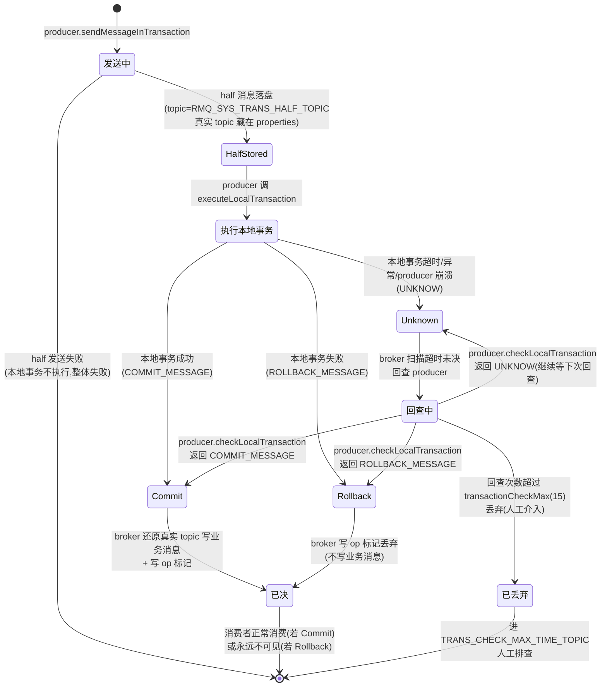

# 第二十二章 · 事务消息:half message 与回查

> 篇:第 7 篇 · 特性消息
> 主线呼应:前两章讲了 RocketMQ 三张特性王牌里的两张——顺序消息(P7-20)在"发-存-消"基本旅程之上,用发送端 hash 选 queue + 消费端串行 + broker 端 queue 锁,给"需要顺序"的消息开了一条有序通道;延时消息(P7-21)用时间轮,让消息"延时 N 秒后才对消费者可见"。这一章讲第三张王牌——**事务消息**。它解决的是一个比"顺序""延时"都更硬核的问题:**"执行本地事务"和"发一条消息"这两件事,怎么做成本质原子?** 比如"扣库存"成功才发"库存已扣"消息给下游,扣失败就不发——可如果"先扣库存再发消息",扣成功但发消息失败,下游永远收不到;如果"先发消息再扣库存",消息发了但扣失败,下游收到脏消息。RocketMQ 的答案是**两阶段 half message + 回查兜底**:先发一条"对消费者不可见"的 half message 占位,再执行本地事务,本地事务决定 commit(让消息可见)还是 rollback(丢弃消息),producer 没返回结果(挂了、超时、网络丢包)就靠 broker 定期回查 producer 的本地事务状态。它对标分布式事务里的 saga/TCC,但用"消息中间件的存储能力"把这件事做得极轻——half message 不是新存储,就是**改个 topic 暂存**(回扣 P1-02 的 properties 存真实 topic、P1-05 的 Reput 分发)。

## 核心问题

**"执行本地事务"和"发消息"这两件跨进程的事,怎么做成本质原子?为什么不能"先执行本地事务再发消息",也不能"先发消息再执行本地事务"?RocketMQ 用 half message 两阶段 + 回查兜底怎么把这件事做成?half message 凭什么"对消费者不可见"?(答案:改 topic 暂存到 `RMQ_SYS_TRANS_HALF_TOPIC`,真实 topic 藏在 properties 里)commit 时怎么把消息"还原"成业务 topic 写回?未决消息(producer 没返回 commit/rollback)靠什么兜底?(答案:broker 定期回查 producer 的 `checkLocalTransaction`)op 队列 `RMQ_SYS_TRANS_OP_HALF_TOPIC` 凭什么避免重复回查?**

读完本章你会明白:

1. **"本地事务 + 发消息"为什么不能朴素地串起来**:两种朴素顺序(先事务后消息 / 先消息后事务)在"中间那一步失败"时都会不一致——一边是本地事务成功但消息丢了,另一边是消息发了但本地事务回滚了。根本原因是**这两件事跨进程、跨存储,没有现成的原子手段能把它们绑成一件事**。
2. **half message 两阶段怎么把"本地事务 + 发消息"做成本质原子**:第一阶段先发一条"对消费者不可见"的 half message 占位(broker 已把这条消息**可靠存下**,这是后续一切的锚点);第二阶段执行本地事务,根据结果决定 commit(让 half 消息对消费者可见)/rollback(丢弃 half 消息)。**关键洞察:第一阶段成功后,无论后续发生什么(producer 挂、网络丢包、本地事务超时),消息都已经"占位"在 broker,不会丢——剩下的只是"决定它的最终命运"**。
3. **half message 凭什么"对消费者不可见"**:broker 收到事务消息时,`TransactionalMessageBridge.parseHalfMessageInner` 把消息的真实 topic/queueId 存进 properties(`PROPERTY_REAL_TOPIC`/`PROPERTY_REAL_QUEUE_ID`),再把消息的 topic 改成 `RMQ_SYS_TRANS_HALF_TOPIC`、queueId 改成 0 存下来。消费者订阅的是业务 topic,不会订阅 `RMQ_SYS_TRANS_HALF_TOPIC`,所以这条消息"对消费者不可见"——它只躺在 half topic 里等命运裁决。
4. **回查兜底凭什么保证最终一致**:producer 发完 half 消息、执行本地事务、再发 commit/rollback——这三步任何一步失败(producer 进程挂了、本地事务超时、commit 请求网络丢包),这条 half 消息就会一直躺在 half topic 里"未决"。broker 的 `TransactionalMessageCheckService` 每 30s(`transactionCheckInterval` 默认值)扫一遍 half topic,对超过 6s(`transactionTimeOut`)还没决定的 half 消息,反向给 producer 发 `CHECK_TRANSACTION_STATE` 请求,producer 调 `TransactionListener.checkLocalTransaction` 返回本地事务的真实状态,broker 再据此 commit/rollback。**回查 + 超时退避 + 次数上限(`transactionCheckMax` 默认 15)组成最终一致的兜底闭环**。
5. **op 队列凭什么避免重复回查**:每条 half 消息被 commit 或 rollback 时,broker 往 `RMQ_SYS_TRANS_OP_HALF_TOPIC` 写一条 op 标记(内容是这条 half 消息在 half topic 里的 queueOffset)。回查线程扫 half topic 时,先把 op 队列拉进内存的 `removeMap`——扫到某条 half 消息时,如果它的 offset 在 `removeMap` 里,说明已被处理过(commit/rollback),直接跳过,不再回查。**op 队列是"half 消息已处理"的账本,让回查线程能用 O(已处理数) 的代价跳过已决消息,不必每条都去问 producer**。

> **如果一读觉得太难**:先只记住三件事——① 事务消息是"两阶段 + 回查":先发 half(对消费者不可见,因为 topic 被改成了 `RMQ_SYS_TRANS_HALF_TOPIC`)→ 执行本地事务 → 根据结果 commit(还原真实 topic 写回,消费者能看到)/rollback(写 op 标记丢弃);② producer 挂了或 commit/rollback 请求丢了,broker 每 30s 扫一次 half topic,对超时未决的反向回查 producer(`checkLocalTransaction`),保证最终一致;③ commit/rollback 的真相不是"改 half 消息本身",而是**commit 时另写一条业务 topic 的真消息 + 往 op 队列写一条"这条 half 已处理"的标记**,half 消息本身从不动(CommitLog 只追加)。

---

## 22.1 一句话点破

> **RocketMQ 的事务消息用"half message 两阶段 + 回查兜底"把"执行本地事务"和"发消息"这两件跨进程的事做成本质原子:第一阶段先发一条改了 topic、对消费者不可见的 half message 到 broker 占位(broker 把它可靠存下,这是后续一切的锚点),第二阶段执行本地事务,事务结果决定 commit(broker 还原消息的真实 topic 写一条新消息到业务 topic,消费者这才看到)/rollback(broker 写一条 op 标记丢弃这条 half)。两阶段之间任何环节失败(producer 挂、commit 请求丢、本地事务超时),这条 half 消息就一直躺在 half topic 里未决,broker 的回查线程每 30s 扫一遍,对超时未决的反向问 producer"你当时本地事务到底成没成",拿到答案再 commit/rollback。它对标分布式事务的 saga/TCC,但用消息中间件自己的存储(half topic + op topic)把这件事做得极轻——half message 不是新存储机制,就是改个 topic 暂存,真实 topic 藏在 properties 里(commit 时还原)。**

这是结论,不是理由。本章倒过来拆:先看"本地事务 + 发消息"为什么不能朴素地串起来,再看 half message 两阶段怎么把这件事做成原子,然后钻进 broker 端的 `TransactionalMessageBridge`(改 topic 暂存)、`EndTransactionProcessor`(commit/rollback 的处理)、客户端的 `sendMessageInTransaction`(两阶段编排)看源码怎么实现,最后把回查闭环和 op 队列这两个最硬核的机制单独拆透——回查凭什么保证最终一致,op 队列凭什么避免重复回查。

---

## 22.2 反面教材:本地事务 + 发消息为什么不能朴素地串起来

事务消息要解决的问题是:**"执行本地事务"和"发消息"这两件事,怎么做成本质原子**。在讲 RocketMQ 怎么做之前,先把两条朴素的路想清楚——它们各自撞的墙,正是事务消息要解决的痛点。

### 22.2.1 撞墙一:先执行本地事务,再发消息

最直觉的做法是:**先执行本地事务(比如扣库存),事务成功后再发消息(通知下游)**。听起来很合理——只有扣成功了才通知下游。但这有一个致命窗口:



> **不这样会怎样**(朴素方案一撞的墙):本地事务已经提交(库存已扣),但发消息这一步失败——可能是网络抖动、MQ 宕机、应用进程在 commit 数据库和发消息这两步之间崩溃。结果:**本地数据库的状态已经改了(库存扣了),但下游永远收不到"库存已扣"的消息**。下游的业务状态(订单状态、对账记录)和本地数据库永久不一致。这是分布式系统里最糟糕的故障——**静默的数据不一致**,业务不会报错,但账对不上。

### 22.2.2 撞墙二:先发消息,再执行本地事务

既然"先事务后消息"会丢消息,反过来呢?**先发消息,再执行本地事务**。发消息成功后,下游一定能收到,这时再执行本地事务。但这同样有致命窗口:



> **不这样会怎样**(朴素方案二撞的墙):消息已经发出去了,下游立刻收到并处理(扣了下游的库存、发了短信、记了账)。然后本地事务执行失败(库存不足、约束冲突、数据库宕机),本地 rollback。结果:**下游已经按"库存已扣"处理了,但本地数据库库存根本没扣**——下游收到的是一条"未发生的虚构事件"。这比方案一更危险,因为下游可能已经触发了不可逆的副作用(发货、扣款、发通知)。

### 22.2.3 根因:两件跨进程的事没有现成的原子手段

两条朴素的路都撞墙,根因是同一个:**"执行本地事务"和"发消息"是两件跨进程、跨存储的事,没有现成的原子手段能把它们绑成一件事**。

- 本地事务的原子性靠数据库的事务机制(ACID),它的范围只到本地数据库。
- 发消息的原子性靠消息中间件的存储机制,它的范围只到 MQ 自己的 CommitLog(回扣 P0-01、P1-03)。
- 这两套原子机制**互不知道对方的存在**——数据库 commit 了不代表 MQ 收到消息,MQ 收到消息不代表数据库 commit 了。中间那一步(网络、进程崩溃)一旦失败,两边状态就分裂。

要解决这个,只有两条路:

1. **引入分布式事务协议**(两阶段提交 2PC、TCC、saga):用一个协调者把两边绑成原子。代价是协议复杂、协调者单点、性能开销大。这就是为什么大家谈"分布式事务"色变。
2. **用消息中间件自己的存储,把"本地事务"和"发消息"解耦成两阶段**:先让 MQ 可靠存下一条"占位消息"(这一步和本地事务无关,只是通知 MQ"我要做一件事"),再执行本地事务,事务结果决定占位消息的命运。这一条路就是 RocketMQ 事务消息的思路。

> **所以这样设计**:RocketMQ 的事务消息走第二条路。它不引入协调者、不搞两阶段提交协议,而是**用 broker 的存储能力(CommitLog 可靠追加,回扣 P1-03)做一个"占位"——half message**。half message 一旦成功发到 broker 并落盘,就**可靠地存在那里**(broker 不会丢,回扣 P1-04 刷盘、P6-17 主从复制),这就给了后续一切一个稳固的锚点:无论 producer 接下来发生什么(执行本地事务成功/失败/超时/崩溃),这条占位消息都不会丢,剩下的只是"决定它的最终命运"。这个"占位 + 后续决定命运"的设计,把"本地事务 + 发消息"从"必须原子完成的两件事"降级成"先占位、再异步决定命运"——而决定命运这一步是可以**重试**的(producer 挂了,broker 回查),重试到最终一致。

---

## 22.3 half message 两阶段:占位 + 决定命运

讲清了"为什么",现在直球讲 RocketMQ 怎么用 half message 把这件事做成。两阶段的状态机如下:



这张状态机图钉死事务消息的全部生命周期。三个要点:

1. **第一阶段(half 占位)**:producer 先把消息当成 half message 发给 broker。broker 把它存下(改 topic 为 `RMQ_SYS_TRANS_HALF_TOPIC`,对消费者不可见)。这一步**成功的前提是 half 消息可靠落盘**——一旦落盘,后续一切都有锚点。
2. **第二阶段(决定命运)**:producer 执行本地事务,根据结果发 commit/rollback 给 broker。commit 则 broker 还原真实 topic 写一条业务消息(消费者这才看到);rollback 则 broker 写 op 标记丢弃(消费者永远看不到)。
3. **兜底(回查)**:第二阶段的 commit/rollback 请求可能丢失(producer 崩溃、网络丢包),导致 half 消息一直躺在 half topic 里"未决"。broker 的回查线程定期扫这种未决消息,反向问 producer 本地事务的真实状态,拿到答案再 commit/rollback。回查次数有上限(默认 15 次),超过则丢弃进死信、人工介入。

下面三节分别拆这三个阶段。先看第一阶段的"half 占位"——half 消息凭什么对消费者不可见。

---

## 22.4 第一阶段:half message 凭什么对消费者不可见

half message 的核心 trick 是:**broker 收到事务消息时,把消息的真实 topic/queueId 藏进 properties,再把 topic 改成系统 topic `RMQ_SYS_TRANS_HALF_TOPIC` 存下来**。消费者订阅的是业务 topic,绝不会订阅 `RMQ_SYS_TRANS_HALF_TOPIC`(它是系统 topic,在 `TopicValidator.NOT_ALLOWED_SEND_TOPIC_SET` 里,普通 producer 发不进去),所以这条消息"对消费者不可见"——它只躺在 half topic 里等命运裁决。

这个 trick 的实现全在 `TransactionalMessageBridge.parseHalfMessageInner`([TransactionalMessageBridge.java:219](../rocketmq/broker/src/main/java/org/apache/rocketmq/broker/transaction/queue/TransactionalMessageBridge.java#L219)):

```java
private MessageExtBrokerInner parseHalfMessageInner(MessageExtBrokerInner msgInner) {
    String uniqId = msgInner.getUserProperty(MessageConst.PROPERTY_UNIQ_CLIENT_MESSAGE_ID_KEYIDX);
    if (uniqId != null && !uniqId.isEmpty()) {
        MessageAccessor.putProperty(msgInner, TransactionalMessageUtil.TRANSACTION_ID, uniqId);    // :222 把 uniqId 也记成 transactionId
    }
    MessageAccessor.putProperty(msgInner, MessageConst.PROPERTY_REAL_TOPIC, msgInner.getTopic());   // :224 —— 把真实 topic 藏进 properties
    MessageAccessor.putProperty(msgInner, MessageConst.PROPERTY_REAL_QUEUE_ID,
        String.valueOf(msgInner.getQueueId()));                                                       // :225-226 —— 把真实 queueId 藏进 properties
    msgInner.setSysFlag(
        MessageSysFlag.resetTransactionValue(msgInner.getSysFlag(), MessageSysFlag.TRANSACTION_NOT_TYPE));  // :227-228 —— 清掉事务类型位
    // ... (RocksDB 事务存储分支,5.x 可选,见 :229-233) ...
    msgInner.setTopic(TransactionalMessageUtil.buildHalfTopic());    // :232 —— topic 改成 RMQ_SYS_TRANS_HALF_TOPIC
    msgInner.setQueueId(0);                                          // :234 —— queueId 改成 0
    msgInner.setPropertiesString(MessageDecoder.messageProperties2String(msgInner.getProperties()));  // :235 —— 把 properties 序列化进消息字节
    return msgInner;
}
```

这十几行是 half message 的全部魔法。逐行拆:

1. **`:224` 把真实 topic 藏进 `PROPERTY_REAL_TOPIC`**:消息原来的 topic(比如 `order`)被存进 properties 的 `PROPERTY_REAL_TOPIC` 字段。这个字段会跟着消息字节一起进 CommitLog(回扣 P1-02:properties 是消息字节布局里的变长尾)。
2. **`:225-226` 把真实 queueId 藏进 `PROPERTY_REAL_QUEUE_ID`**:同理,原来的 queueId(比如 3)存进 properties。commit 时要靠这两个字段把消息"还原"成业务 topic(见 22.5 节)。
3. **`:232` topic 改成 `RMQ_SYS_TRANS_HALF_TOPIC`**:`TransactionalMessageUtil.buildHalfTopic()` 返回 `TopicValidator.RMQ_SYS_TRANS_HALF_TOPIC`,它的字面值就是字符串 `"RMQ_SYS_TRANS_HALF_TOPIC"`([TopicValidator.java:29](../rocketmq/common/src/main/java/org/apache/rocketmq/common/topic/TopicValidator.java#L29))。这是个**系统 topic**,在 `SYSTEM_TOPIC_SET` 里(:62),且在 `NOT_ALLOWED_SEND_TOPIC_SET` 里(:73)——普通 producer 发不进去,只有 broker 内部能写。
4. **`:234` queueId 改成 0**:half topic 只用一个 queue(queueId=0),所有 half 消息都进这一个 queue,方便回查线程顺序扫。

改完之后,这条消息的字节布局里(P1-02):topic 字段是 `RMQ_SYS_TRANS_HALF_TOPIC`,queueId 是 0,但 properties 里藏着 `REAL_TOPIC=order`、`REAL_QUEUE_ID=3`。**它对 Reput 分发(P1-05)来说,就是一条普通的 half topic 消息**——Reput 会把它分发进 `RMQ_SYS_TRANS_HALF_TOPIC` 的 ConsumeQueue,而不会进 `order` 的 ConsumeQueue。消费者订阅 `order`,从 `order` 的 ConsumeQueue 拉消息,永远拉不到这条 half 消息——**这就是"对消费者不可见"的字面实现**。

> **钉死这件事**:half message "对消费者不可见" 不是靠什么复杂的可见性控制,就是**改 topic**——把真实 topic 藏进 properties,topic 字段改成系统 topic `RMQ_SYS_TRANS_HALF_TOPIC`。消费者订阅的是业务 topic,不会订阅这个系统 topic,所以看不到。这个 trick 极轻:不需要改 CommitLog 的存储格式(回扣 P1-02,properties 本来就是变长尾的一部分),不需要改 Reput 的分发逻辑(回扣 P1-05,half topic 就是个普通 topic,Reput 照常分发进它的 ConsumeQueue),不需要新增任何"可见性"机制。**事务消息在存储层零新增机制——它只是巧妙地用了 properties 和 topic 这两个已有字段**。

那 producer 怎么告诉 broker"这是一条事务消息,要按 half 处理"?靠 sysFlag 的事务类型位。看客户端入口。

### 客户端入口:sendMessageInTransaction 标记 PREPARED

producer 发事务消息走 `TransactionMQProducer.sendMessageInTransaction`(它调 `DefaultMQProducerImpl.sendMessageInTransaction`)。这个方法([DefaultMQProducerImpl.java:1433](../rocketmq/client/src/main/java/org/apache/rocketmq/client/impl/producer/DefaultMQProducerImpl.java#L1433))的开头是:

```java
public TransactionSendResult sendMessageInTransaction(final Message msg,
    final TransactionListener localTransactionListener, final Object arg)
    throws MQClientException {
    // ... 校验 ...
    SendResult sendResult = null;
    MessageAccessor.putProperty(msg, MessageConst.PROPERTY_TRANSACTION_PREPARED, "true");    // :1445 —— 标记"这是事务 prepare 消息"
    MessageAccessor.putProperty(msg, MessageConst.PROPERTY_PRODUCER_GROUP, this.defaultMQProducer.getProducerGroup());  // :1446 —— 记下 producer group(回查时靠它找 producer)
    try {
        sendResult = this.send(msg);    // :1448 —— 当普通消息发出去
    } catch (Exception e) {
        throw new MQClientException("send message Exception", e);
    }
    // ... 接下来执行本地事务(见 22.5) ...
}
```

`:1445` 在消息的 properties 里加 `PROPERTY_TRANSACTION_PREPARED=true`。这个 property 到了 broker 端,会被 `SendMessageProcessor` 识别——识别后调 `TransactionalMessageService.asyncPrepareMessage` 走 half message 的存储路径(而不是普通消息的 `CommitLog.asyncPutMessage`)。我们看一下这个识别点。

### broker 端:SendMessageProcessor 识别事务消息

`SendMessageProcessor` 在处理 SEND_MESSAGE 请求时,会检查消息的 `PROPERTY_TRANSACTION_PREPARED` 和 sysFlag,识别出事务消息。识别后调 `transactionalMessageService.asyncPrepareMessage`:

```java
// (SendMessageProcessor 内,简化示意)
if (msg.getProperty(MessageConst.PROPERTY_TRANSACTION_PREPARED) != null
    && msg.getProperty(MessageConst.PROPERTY_TRANSACTION_PREPARED).equals("true")
    && MessageSysFlag.TRANSACTION_PREPARED_TYPE
        == MessageSysFlag.getTransactionValue(msg.getSysFlag())) {
    // 这是事务消息,走 half message 路径
    putMessageResult = this.brokerController.getTransactionalMessageService().asyncPrepareMessage(msg);  // 调 TransactionalMessageService
} else {
    // 普通消息,走 CommitLog
    putMessageResult = this.brokerController.getMessageStore().asyncPutMessage(msg);
}
```

`TransactionalMessageServiceImpl.asyncPrepareMessage`([TransactionalMessageServiceImpl.java:99](../rocketmq/broker/src/main/java/org/apache/rocketmq/broker/transaction/queue/TransactionalMessageServiceImpl.java#L99))直接转给 bridge:

```java
@Override
public CompletableFuture<PutMessageResult> asyncPrepareMessage(MessageExtBrokerInner messageInner) {
    return transactionalMessageBridge.asyncPutHalfMessage(messageInner);   // :100
}
```

`TransactionalMessageBridge.asyncPutHalfMessage`([:215](../rocketmq/broker/src/main/java/org/apache/rocketmq/broker/transaction/queue/TransactionalMessageBridge.java#L215))就两行——先 `parseHalfMessageInner` 改 topic,再调 `store.asyncPutMessage`:

```java
public CompletableFuture<PutMessageResult> asyncPutHalfMessage(MessageExtBrokerInner messageInner) {
    return store.asyncPutMessage(parseHalfMessageInner(messageInner));   // :216 —— 改完 topic 后,当普通消息存
}
```

注意这里调的是 `store.asyncPutMessage`——**half message 走的是和普通消息完全一样的存储路径**(回扣 P1-03 `CommitLog.asyncPutMessage`,锁内串行追加)。改完 topic 之后,half message 对存储层来说就是一条 topic=`RMQ_SYS_TRANS_HALF_TOPIC` 的普通消息,该加锁加锁、该刷盘刷盘、该复制复制。**事务消息在"存"这一步零特殊处理**——这正是 half message 设计的轻巧之处。

> **钉死这件事**:事务消息的"half 占位"在 broker 端就是**改 topic + 走普通存储路径**。客户端在 properties 里标 `PROPERTY_TRANSACTION_PREPARED=true`,`SendMessageProcessor` 识别后调 `transactionalMessageService.asyncPrepareMessage`,它转给 `TransactionalMessageBridge.asyncPutHalfMessage`,后者先 `parseHalfMessageInner`(真实 topic 藏 properties、topic 改成 half topic、queueId 改 0),再 `store.asyncPutMessage` 当普通消息存。**没有任何新的存储机制——half message 就是一条 topic 被改了的普通消息**。

第一阶段讲完了。half 消息已经可靠落盘,接下来是第二阶段——执行本地事务,决定 half 消息的命运。

---

## 22.5 第二阶段:执行本地事务 + commit/rollback 决定命运

producer 收到 half 消息发送成功的响应后,接着执行本地事务。这段在 `sendMessageInTransaction` 的后半段([DefaultMQProducerImpl.java:1455](../rocketmq/client/src/main/java/org/apache/rocketmq/client/impl/producer/DefaultMQProducerImpl.java#L1455)):

```java
switch (sendResult.getSendStatus()) {
    case SEND_OK: {
        try {
            // ... 设置 transactionId ...
            if (null != localTransactionListener) {
                localTransactionState = localTransactionListener.executeLocalTransaction(msg, arg);   // :1466 —— 执行本地事务
            } else {
                localTransactionState = transactionListener.executeLocalTransaction(msg, arg);       // :1469 —— 新 API
            }
            if (null == localTransactionState) {
                localTransactionState = LocalTransactionState.UNKNOW;     // :1472 —— 返回 null 当 UNKNOW
            }
        } catch (Throwable e) {
            // ... 本地事务抛异常,localTransactionState 保持 UNKNOW ...
            localException = e;
        }
    }
    break;
    case FLUSH_DISK_TIMEOUT:
    case FLUSH_SLAVE_TIMEOUT:
    case SLAVE_NOT_AVAILABLE:
        localTransactionState = LocalTransactionState.ROLLBACK_MESSAGE;    // :1489 —— half 消息没可靠落盘,直接 rollback
        break;
    default:
        break;
}

try {
    this.endTransaction(msg, sendResult, localTransactionState, localException);   // :1496 —— 把本地事务结果通知 broker
} catch (Exception e) {
    log.warn("local transaction execute {}, but end broker transaction failed", localTransactionState, e);
}
```

这段编排有几个要点:

1. **`:1466` 执行本地事务**:`TransactionListener.executeLocalTransaction` 是业务实现的回调——业务在这里执行真正的本地事务(扣库存、扣款、写库),返回 `LocalTransactionState` 三态之一(`COMMIT_MESSAGE`/`ROLLBACK_MESSAGE`/`UNKNOW`)。
2. **`:1472` 返回 null 当 UNKNOW**:本地事务执行结果不明确时返回 UNKNOW——这是回查兜底的入口(见 22.6 节)。
3. **`:1489` half 落盘失败直接 rollback**:如果 half 消息本身没可靠落盘(刷盘超时、从库超时),根本没必要执行本地事务,直接 rollback——这是"占位失败就整体失败"的体现。

执行完本地事务后,`:1496` 调 `endTransaction` 把结果通知 broker。`endTransaction`([:1528](../rocketmq/client/src/main/java/org/apache/rocketmq/client/impl/producer/DefaultMQProducerImpl.java#L1528))构造 `EndTransactionRequestHeader`,根据 `localTransactionState` 设置 `commitOrRollback` 标志:

```java
switch (localTransactionState) {
    case COMMIT_MESSAGE:
        requestHeader.setCommitOrRollback(MessageSysFlag.TRANSACTION_COMMIT_TYPE);     // :1549
        break;
    case ROLLBACK_MESSAGE:
        requestHeader.setCommitOrRollback(MessageSysFlag.TRANSACTION_ROLLBACK_TYPE);   // :1552
        break;
    case UNKNOW:
        requestHeader.setCommitOrRollback(MessageSysFlag.TRANSACTION_NOT_TYPE);        // :1555 —— UNKNOW 用 NOT_TYPE,broker 收到啥也不做
        break;
}
// ...
this.mQClientFactory.getMQClientAPIImpl().endTransactionOneway(brokerAddr, requestHeader, remark, ...);   // :1566 —— oneway 发 END_TRANSACTION 请求
```

这里有两个细节要钉死:

- **`:1566` 用 oneway 发送**:`endTransactionOneway` 是 oneway 调用——producer 发出去就不管响应了。为什么敢用 oneway?因为**就算这个请求丢了,broker 的回查线程也会兜底**(见 22.6 节)。oneway 省掉了等响应的开销,事务消息的第二阶段通知是"尽力而为",丢了大不了回查。这是事务消息把"可靠性"从"同步等响应"挪到"异步回查兜底"的体现。
- **`:1555` UNKNOW 用 `TRANSACTION_NOT_TYPE`**:`UNKNOW` 在协议层映射成 `TRANSACTION_NOT_TYPE`(0),broker 收到 `NOT_TYPE` 啥也不做(EndTransactionProcessor 里 `NOT_TYPE` 直接 return null)。这条 half 消息就保持未决状态,等回查。

`MessageSysFlag` 的四个事务类型常量([MessageSysFlag.java:35](../rocketmq/common/src/main/java/org/apache/rocketmq/common/sysflag/MessageSysFlag.java#L35)):

```
TRANSACTION_NOT_TYPE     = 0          // :35  未决/未知
TRANSACTION_PREPARED_TYPE = 0x1 << 2  // :36  = 4,half message(prepared)
TRANSACTION_COMMIT_TYPE  = 0x2 << 2   // :37  = 8,commit
TRANSACTION_ROLLBACK_TYPE = 0x3 << 2  // :38  = 12,rollback
```

注意它们占 sysFlag 的第 2-3 位(0x1<<2 到 0x3<<2),用 `getTransactionValue`/`resetTransactionValue` 做位运算读改——这和 P1-02 讲的 SYSFLAG 位域复用是同一个套路。`PROPERTY_TRANSACTION_PREPARED=true` 这个 properties 标志进 broker 后会被翻译成 sysFlag 的 `TRANSACTION_PREPARED_TYPE` 位。

### broker 端:EndTransactionProcessor 处理 commit/rollback

producer 发的 `END_TRANSACTION` 请求(`RequestCode.END_TRANSACTION = 37`,[RequestCode.java:58](../rocketmq/remoting/src/main/java/org/apache/rocketmq/remoting/protocol/RequestCode.java#L58))在 broker 端由 `EndTransactionProcessor` 处理([EndTransactionProcessor.java:50](../rocketmq/broker/src/main/java/org/apache/rocketmq/broker/processor/EndTransactionProcessor.java#L50))。它的核心逻辑分两条分支——commit 和 rollback。

**commit 分支**([:131](../rocketmq/broker/src/main/java/org/apache/rocketmq/broker/processor/EndTransactionProcessor.java#L131)):

```java
if (MessageSysFlag.TRANSACTION_COMMIT_TYPE == requestHeader.getCommitOrRollback()) {
    result = this.brokerController.getTransactionalMessageService().commitMessage(requestHeader);   // :132 —— 按 commitLogOffset 找回 half 消息
    if (result.getResponseCode() == ResponseCode.SUCCESS) {
        // ... rejectCommitOrRollback 校验(防超时后还能 commit) ...
        RemotingCommand res = checkPrepareMessage(result.getPrepareMessage(), requestHeader);      // :140 —— 校验 producerGroup/offset 对得上
        if (res.getCode() == ResponseCode.SUCCESS) {
            MessageExtBrokerInner msgInner = endMessageTransaction(result.getPrepareMessage());    // :142 —— 还原真实 topic/queueId
            msgInner.setSysFlag(MessageSysFlag.resetTransactionValue(msgInner.getSysFlag(), requestHeader.getCommitOrRollback()));  // :143 —— sysFlag 改成 COMMIT
            msgInner.setQueueOffset(requestHeader.getTranStateTableOffset());
            msgInner.setPreparedTransactionOffset(requestHeader.getCommitLogOffset());              // :145 —— 记下原 half 消息的物理偏移
            // ...
            MessageAccessor.clearProperty(msgInner, MessageConst.PROPERTY_TRANSACTION_PREPARED);   // :147 —— 清掉 prepared 标记
            RemotingCommand sendResult = sendFinalMessage(msgInner);                               // :148 —— 当普通消息写进业务 topic
            if (sendResult.getCode() == ResponseCode.SUCCESS) {
                deletePrepareMessage(result);                                                      // :150 —— 写 op 标记,标记这条 half 已处理
                // ... metrics 统计 ...
            }
            return sendResult;
        }
        return res;
    }
}
```

commit 分干的三件事,正是 22.3 节状态机里"Commit → 已决"那一步:

1. **`:132` 按 commitLogOffset 找回 half 消息**:`commitMessage` 调 `getHalfMessageByOffset`([TransactionalMessageServiceImpl.java:634](../rocketmq/broker/src/main/java/org/apache/rocketmq/broker/transaction/queue/TransactionalMessageServiceImpl.java#L634)),它调 `store.lookMessageByOffset(commitLogOffset)`——按 half 消息在 CommitLog 里的物理偏移把它捞出来(回扣 P1-02,physicalOffset 是消息在 CommitLog 的字节坐标)。
2. **`:142` 还原真实 topic/queueId**:`endMessageTransaction`([:271](../rocketmq/broker/src/main/java/org/apache/rocketmq/broker/processor/EndTransactionProcessor.java#L271))从 half 消息的 properties 里把 `PROPERTY_REAL_TOPIC` 和 `PROPERTY_REAL_QUEUE_ID` 取出来,设回消息的 topic 和 queueId——这就是 22.4 节 `parseHalfMessageInner` 把真实 topic 藏进 properties 的逆操作。还原后清掉 `PROPERTY_REAL_TOPIC`/`PROPERTY_REAL_QUEUE_ID`/`PROPERTY_TRANSACTION_PREPARED` 这几个事务专用的 property,免得业务消费者看到这些内部字段。
3. **`:148` 当普通消息写进业务 topic**:`sendFinalMessage`([:303](../rocketmq/broker/src/main/java/org/apache/rocketmq/broker/processor/EndTransactionProcessor.java#L303))调 `brokerController.getMessageStore().putMessage(msgInner)`——**这一步就是把还原后的消息当成一条全新的普通消息,写进业务 topic(比如 `order`)**。写完之后,Reput(P1-05)会把它分发进 `order` 的 ConsumeQueue,消费者这才看得到。**commit 的本质不是"让 half 消息可见",而是"另写一条业务 topic 的真消息"**——half 消息本身始终躺在 half topic 里没动(CommitLog 只追加,不改已写内容)。
4. **`:150` 写 op 标记**:`deletePrepareMessage`([:192](../rocketmq/broker/src/main/java/org/apache/rocketmq/broker/processor/EndTransactionProcessor.java#L192))调 `transactionalMessageService.deletePrepareMessage`——往 op 队列写一条"这条 half 消息已处理"的标记。这是回查线程避免重复回查的关键(见 22.6 节)。

> **钉死这件事**:commit 的真相是**另写一条业务 topic 的真消息 + 往 op 队列写一条标记**,而不是"改 half 消息让它可见"。理由是 CommitLog 只追加(P0-01、P1-03),已写的 half 消息不能改。所以 commit 干脆**重新写一条新消息**(topic 用 properties 里还原的真实 topic),这条新消息进业务 topic 的 ConsumeQueue,消费者正常消费;同时往 op 队列写一条"原 half 消息已处理"的标记,让回查线程跳过它。**half 消息和 commit 后的业务消息是两条独立的消息**,后者通过 `preparedTransactionOffset` 字段(P1-02 字节布局里的第 14 个字段)指回前者,做关联。

**rollback 分支**([:166](../rocketmq/broker/src/main/java/org/apache/rocketmq/broker/processor/EndTransactionProcessor.java#L166))更简单:

```java
} else if (MessageSysFlag.TRANSACTION_ROLLBACK_TYPE == requestHeader.getCommitOrRollback()) {
    result = this.brokerController.getTransactionalMessageService().rollbackMessage(requestHeader);   // :167 —— 同样按 commitLogOffset 找回 half 消息
    if (result.getResponseCode() == ResponseCode.SUCCESS) {
        // ... rejectCommitOrRollback 校验 ...
        RemotingCommand res = checkPrepareMessage(result.getPrepareMessage(), requestHeader);   // :175 —— 校验
        if (res.getCode() == ResponseCode.SUCCESS) {
            deletePrepareMessage(result);                                                        // :177 —— 只写 op 标记,不写业务消息
            // ... metrics ...
        }
        return res;
    }
}
```

rollback 比 commit 简单——**它只写 op 标记(`deletePrepareMessage`),不写业务消息**。half 消息就这么躺在 half topic 里"被标记为已处理",消费者永远看不到它(因为它从来没进过业务 topic 的 ConsumeQueue)。**rollback 的本质是"什么也不做,只标记"——half 消息从出生到死亡,对消费者始终不可见**。

注意 `commitMessage` 和 `rollbackMessage` 在 `TransactionalMessageServiceImpl` 里的实现**完全一样**(都是 `getHalfMessageByOffset`),区别只在 EndTransactionProcessor 后续做什么(commit 写业务消息,rollback 不写):

```java
@Override
public OperationResult commitMessage(EndTransactionRequestHeader requestHeader) {
    return getHalfMessageByOffset(requestHeader.getCommitLogOffset());   // :635
}

@Override
public OperationResult rollbackMessage(EndTransactionRequestHeader requestHeader) {
    return getHalfMessageByOffset(requestHeader.getCommitLogOffset());   // :641 —— 和 commit 一样,都是找回 half 消息
}
```

两个方法都只是"按 commitLogOffset 找回 half 消息"——真正决定 commit 还是 rollback 行为的,是 EndTransactionProcessor 里 `if (TRANSACTION_COMMIT_TYPE)` 还是 `else if (TRANSACTION_ROLLBACK_TYPE)` 那两个分支。

### deletePrepareMessage:op 队列的批量写

无论是 commit 还是 rollback,最后都要调 `deletePrepareMessage` 往 op 队列写标记。看 `TransactionalMessageServiceImpl.deletePrepareMessage`([:597](../rocketmq/broker/src/main/java/org/apache/rocketmq/broker/transaction/queue/TransactionalMessageServiceImpl.java#L597)):

```java
@Override
public boolean deletePrepareMessage(MessageExt messageExt) {
    Integer queueId = messageExt.getQueueId();
    MessageQueueOpContext mqContext = deleteContext.get(queueId);    // :599 —— 按 queueId 拿"待写 op"队列
    if (mqContext == null) {
        mqContext = new MessageQueueOpContext(System.currentTimeMillis(), 20000);   // :601
        // ... putIfAbsent ...
    }

    String data = messageExt.getQueueOffset() + TransactionalMessageUtil.OFFSET_SEPARATOR;   // :608 —— 数据 = half 消息的 queueOffset + ","
    try {
        boolean res = mqContext.getContextQueue().offer(data, 100, TimeUnit.MILLISECONDS);   // :610 —— 先塞进内存队列(不立即写 op)
        if (res) {
            int totalSize = mqContext.getTotalSize().addAndGet(data.length());
            if (totalSize > ... getTransactionOpMsgMaxSize()) {    // :613 —— 累计够大(默认 4096)
                this.transactionalOpBatchService.wakeup();         // :614 —— 唤醒批量写线程
            }
            return true;
        } else {
            this.transactionalOpBatchService.wakeup();             // :618 —— 队列满也唤醒
        }
    } catch (InterruptedException ignore) {}
    // ... (兜底:直接写一条 op 消息) ...
}
```

这里有个总纲没提到的精妙技巧——**op 标记不是每条 commit/rollback 立即写一条 op 消息,而是先塞进内存队列 `MessageQueueOpContext`,由后台 `TransactionalOpBatchService` 批量聚合写**。聚合的条件有两个:累计数据大小超过 `transactionOpMsgMaxSize`(默认 4096 字节),或距离上次写超过 `transactionOpBatchInterval`(默认 3000ms)。

为什么这么设计?**因为 commit/rollback 是高频操作(每条事务消息都要走),如果每次都立即写一条 op 消息进 op topic,会把 op topic 的写入压力撑爆**。批量聚合后,多条 half 消息的 offset 被拼成一条 op 消息的 body(形如 `"100,101,102,"`,用逗号分隔),一次写进 op topic——写入压力被收敛。这和 P1-05 讲的"Reput 把建索引的脏活甩后台"是同一种思想:**把高频小写入聚合成低频大写入,收敛 IO 压力**。

> **钉死这件事**:op 标记的写是**批量聚合**的——commit/rollback 时先把 half 消息的 queueOffset 塞进 `MessageQueueOpContext` 的内存队列,后台 `TransactionalOpBatchService` 累计够大(4096B)或够久(3s)后,把队列里的 offset 拼成一条 op 消息(逗号分隔)一次写进 op topic。这把高频的 commit/rollback 通知收敛成低频的批量 op 写入,极大降低了 op topic 的写入压力。**这个批量技巧是 RocketMQ 事务消息在工程上的一个亮点,总纲只提了 op 队列的作用,没提它的批量写实现**。

op 消息进 op topic(`RMQ_SYS_TRANS_OP_HALF_TOPIC`)后,它的 body 就是"已处理 half 消息的 offset 列表",tag 是 `REMOVE_TAG`(字符串 `"d"`,[TransactionalMessageUtil.java:32](../rocketmq/broker/src/main/java/org/apache/rocketmq/broker/transaction/queue/TransactionalMessageUtil.java#L32))。回查线程靠这些信息识别"哪些 half 消息已被处理"(见 22.6 节)。

第二阶段讲完了。下面是事务消息最硬核的部分——回查兜底。

---

## 22.6 回查兜底:未决消息的最终一致保证

第二阶段的 commit/rollback 请求是 producer 用 **oneway** 发的(`:1566`)。oneway 意味着"发出去就不管响应"——这个请求可能丢失(网络抖动)、producer 可能在发请求前就崩溃、本地事务可能超时一直返回 UNKNOW。任何一种情况发生,这条 half 消息就会一直躺在 half topic 里**未决**——既没 commit(消费者看不到),也没 rollback(没被标记)。

如果不兜底,这条未决消息就永远卡在 half topic 里——本地事务可能已经成功(应该 commit 让下游收到),也可能已经失败(应该 rollback),但下游永远收不到任何信号。这违背了事务消息的"最终一致"承诺。

RocketMQ 的兜底机制是:**broker 的 `TransactionalMessageCheckService` 定期扫 half topic,对超时未决的 half 消息,反向回查 producer 的本地事务状态**。

### TransactionalMessageCheckService:定期扫描的后台线程

`TransactionalMessageCheckService`([TransactionalMessageCheckService.java:25](../rocketmq/broker/src/main/java/org/apache/rocketmq/broker/transaction/TransactionalMessageCheckService.java#L25))是个 `ServiceThread`,run 方法极简:

```java
@Override
public void run() {
    log.info("Start transaction check service thread!");
    while (!this.isStopped()) {
        long checkInterval = brokerController.getBrokerConfig().getTransactionCheckInterval();   // :46 —— 默认 30000ms(30s)
        this.waitForRunning(checkInterval);   // :47 —— 每 30s 醒一次
    }
}

@Override
protected void onWaitEnd() {
    long timeout = brokerController.getBrokerConfig().getTransactionTimeOut();      // :54 —— 默认 6000ms(6s)
    int checkMax = brokerController.getBrokerConfig().getTransactionCheckMax();     // :55 —— 默认 15 次
    // ...
    this.brokerController.getTransactionalMessageService().check(timeout, checkMax, this.brokerController.getTransactionalMessageCheckListener());  // :58
}
```

每 30s(`transactionCheckInterval` 默认值,[BrokerConfig.java:299](../rocketmq/common/src/main/java/org/apache/rocketmq/common/BrokerConfig.java#L299))醒一次,调 `TransactionalMessageService.check`,传入三个参数:`transactionTimeout`(6s,多久未决才回查)、`transactionCheckMax`(15,最多回查几次)、listener(回查回调)。

### check 方法:扫描 + 回查的核心逻辑

`TransactionalMessageServiceImpl.check`([:162](../rocketmq/broker/src/main/java/org/apache/rocketmq/broker/transaction/queue/TransactionalMessageServiceImpl.java#L162))是事务消息回查的核心。它的逻辑分四步,我们逐段拆。

**第一步:遍历 half topic 的所有 queue,拉取 op 队列构建 removeMap**([:164](../rocketmq/broker/src/main/java/org/apache/rocketmq/broker/transaction/queue/TransactionalMessageServiceImpl.java#L164)):

```java
String topic = TopicValidator.RMQ_SYS_TRANS_HALF_TOPIC;
Set<MessageQueue> msgQueues = transactionalMessageBridge.fetchMessageQueues(topic);   // :166 —— half topic 的所有 queue
for (MessageQueue messageQueue : msgQueues) {
    MessageQueue opQueue = getOpQueue(messageQueue);                  // :174 —— 对应的 op queue
    long halfOffset = transactionalMessageBridge.fetchConsumeOffset(messageQueue);   // :175 —— half topic 当前检查到哪了
    long opOffset = transactionalMessageBridge.fetchConsumeOffset(opQueue);          // :176 —— op topic 当前读到哪了
    // ...
    HashMap<Long, Long> removeMap = new HashMap<>();                 // :185 —— key=已处理 half 的 offset,value=对应 op 的 offset
    HashMap<Long, HashSet<Long>> opMsgMap = new HashMap<>();         // :186 —— op offset → 它标记的 half offset 集合
    PullResult pullResult = fillOpRemoveMap(removeMap, opQueue, opOffset, halfOffset, opMsgMap, doneOpOffset);   // :187 —— 把 op 拉进 removeMap
    // ...
```

`fillOpRemoveMap`([:379](../rocketmq/broker/src/main/java/org/apache/rocketmq/broker/transaction/queue/TransactionalMessageServiceImpl.java#L379))拉一批 op 消息,解析它们的 body(offset 列表),把每个 offset 塞进 `removeMap`:

```java
for (MessageExt opMessageExt : opMsg) {
    // ...
    if (TransactionalMessageUtil.REMOVE_TAG.equals(opMessageExt.getTags())) {
        String[] offsetArray = queueOffsetBody.split(TransactionalMessageUtil.OFFSET_SEPARATOR);   // :414 —— 按逗号切
        for (String offset : offsetArray) {
            Long offsetValue = getLong(offset);
            if (offsetValue < miniOffset) {    // :417 —— 比当前 half 最小 offset 还小的,跳过(已过期)
                continue;
            }
            removeMap.put(offsetValue, opMessageExt.getQueueOffset());   // :421 —— half offset → op offset
            set.add(offsetValue);
        }
    }
    // ...
}
```

这一步把"哪些 half 消息已被处理"加载进内存 `removeMap`。`removeMap` 的 key 是 half 消息的 queueOffset,value 是标记它的 op 消息的 queueOffset。

**第二步:遍历 half 消息,跳过已处理的,对超时未决的回查**([:201](../rocketmq/broker/src/main/java/org/apache/rocketmq/broker/transaction/queue/TransactionalMessageServiceImpl.java#L201)):

```java
while (true) {
    if (System.currentTimeMillis() - startTime > MAX_PROCESS_TIME_LIMIT) {   // :202 —— 单 queue 处理超 60s 跳出
        break;
    }
    Long removedOpOffset;
    if ((removedOpOffset = removeMap.remove(i)) != null) {   // :207 —— 这条 half 已被处理(commit/rollback 过),跳过
        // ... 从 opMsgMap 里清理 ...
    } else {
        GetResult getResult = getHalfMsg(messageQueue, i);   // :215 —— 拉这条 half 消息
        MessageExt msgExt = getResult.getMsg();
        // ...
        if (needDiscard(msgExt, transactionCheckMax) || needSkip(msgExt)) {   // :263 —— 回查次数超限或超文件保留时间,丢弃
            listener.resolveDiscardMsg(msgExt);
            newOffset = i + 1;
            i++;
            continue;
        }
        // ... (新鲜 half 还没到回查时间,跳过) ...
        if (isNeedCheck) {   // :299 —— 到了该回查的时间
            if (!putBackHalfMsgQueue(msgExt, i)) {   // :301 —— 重新写回 half topic(见下文)
                continue;
            }
            listener.resolveHalfMsg(msgExt);    // :309 —— 异步回查 producer
        }
        // ...
    }
    newOffset = i + 1;
    i++;
}
```

这段逻辑的精髓在三个判断:

1. **`:207` 已处理跳过**:这条 half 消息的 offset 在 `removeMap` 里,说明已经被 commit/rollback 过(op 队列里有标记),直接跳过——**这是 op 队列避免重复回查的字面实现**。
2. **`:263` 超限丢弃**:`needDiscard` 检查这条 half 消息的 `PROPERTY_TRANSACTION_CHECK_TIMES`(回查次数),超过 `transactionCheckMax`(默认 15)就丢弃(进 `TRANS_CHECK_MAX_TIME_TOPIC`,人工介入);`needSkip` 检查它是否超过文件保留时间(`fileReservedTime`,默认 72 小时),超了也丢弃。**这是回查次数上限的兜底——避免某条永远查不出结果的 half 消息无限占用回查资源**。
3. **`:299-309` 到了回查时间**:`isNeedCheck` 综合判断"距离 born 时间是否超过 `transactionTimeout`(6s)""上次 op 消息是否太旧"等,满足条件才回查。回查前先 `putBackHalfMsgQueue` 重新写回 half topic(见下文解释),再 `listener.resolveHalfMsg` 异步发回查请求。

**第三步:resolveHalfMsg 异步发回查请求**。`AbstractTransactionalMessageCheckListener.resolveHalfMsg`([:72](../rocketmq/broker/src/main/java/org/apache/rocketmq/broker/transaction/AbstractTransactionalMessageCheckListener.java#L72))把回查任务塞进线程池异步执行:

```java
public void resolveHalfMsg(final MessageExt msgExt) {
    if (executorService != null) {
        executorService.execute(new Runnable() {
            @Override
            public void run() {
                try {
                    sendCheckMessage(msgExt);    // :78 —— 真正发回查
                } catch (Exception e) {
                    LOGGER.error("Send check message error!", e);
                }
            }
        });
    }
}
```

`sendCheckMessage`([:51](../rocketmq/broker/src/main/java/org/apache/rocketmq/broker/transaction/AbstractTransactionalMessageCheckListener.java#L51))构造 `CheckTransactionStateRequestHeader`,反向给 producer 发 `CHECK_TRANSACTION_STATE` 请求(`RequestCode.CHECK_TRANSACTION_STATE = 39`):

```java
public void sendCheckMessage(MessageExt msgExt) throws Exception {
    CheckTransactionStateRequestHeader checkTransactionStateRequestHeader = new CheckTransactionStateRequestHeader();
    checkTransactionStateRequestHeader.setTopic(msgExt.getTopic());
    checkTransactionStateRequestHeader.setCommitLogOffset(msgExt.getCommitLogOffset());
    // ...
    msgExt.setTopic(msgExt.getUserProperty(MessageConst.PROPERTY_REAL_TOPIC));    // :60 —— 还原真实 topic 再发给 producer
    msgExt.setQueueId(Integer.parseInt(msgExt.getUserProperty(MessageConst.PROPERTY_REAL_QUEUE_ID)));   // :61
    // ...
    String groupId = msgExt.getProperty(MessageConst.PROPERTY_PRODUCER_GROUP);   // :63 —— 靠 producer group 找 producer channel
    Channel channel = brokerController.getProducerManager().getAvailableChannel(groupId);   // :64
    if (channel != null) {
        brokerController.getBroker2Client().checkProducerTransactionState(groupId, channel, checkTransactionStateRequestHeader, msgExt);   // :66
    }
}
```

**`:60-61` 还原真实 topic 再发**:回查时把 half 消息的真实 topic/queueId 从 properties 取出来还原,让 producer 看到的是"业务 topic"的消息(而不是 `RMQ_SYS_TRANS_HALF_TOPIC`)——这样 producer 的 `checkLocalTransaction` 才能按业务 topic 处理。**`:63-64` 靠 producer group 找 producer channel**:事务消息在第一阶段发 half 时,producer 把自己的 `producerGroup` 存进了 properties(`sendMessageInTransaction` 的 `:1446`),broker 回查时靠这个 group 从 `ProducerManager` 找到 producer 的网络 channel。**这就是事务消息要求 producer 必须用 `TransactionMQProducer`(且 producer group 不能随便换)的原因——回查要靠它定位 producer**。

**第四步:producer 收到回查,调 checkLocalTransaction 返回状态**。producer 端的 `ClientRemotingProcessor.checkTransactionState`([:100](../rocketmq/client/src/main/java/org/apache/rocketmq/client/impl/ClientRemotingProcessor.java#L100))处理这个请求,最终调到 `DefaultMQProducerImpl.checkTransactionState`([:366](../rocketmq/client/src/main/java/org/apache/rocketmq/client/impl/producer/DefaultMQProducerImpl.java#L366)):

```java
public void checkTransactionState(final String addr, final MessageExt msg,
    final CheckTransactionStateRequestHeader header) {
    Runnable request = new Runnable() {
        @Override
        public void run() {
            // ...
            LocalTransactionState localTransactionState = LocalTransactionState.UNKNOW;
            try {
                // ...
                localTransactionState = transactionListener.checkLocalTransaction(message);   // :386 —— 业务实现的回查逻辑
            } catch (Throwable e) {
                // ...
            }
            this.processTransactionState(...);   // :393 —— 把状态发回 broker
        }
        // ...
    };
    // ... 提交到 checkExecutor 线程池异步执行 ...
}
```

**`:386` 调 `TransactionListener.checkLocalTransaction`**——这是业务实现的第二个回调(第一个是 `executeLocalTransaction`)。业务在这里**查本地事务的真实结果**(查数据库看那条记录有没有写进去、查日志看扣款有没有成功),返回 `COMMIT_MESSAGE`/`ROLLBACK_MESSAGE`/`UNKNOW`。返回的状态通过 `processTransactionState` 构造成 `EndTransactionRequestHeader`,**同样以 `END_TRANSACTION` 请求发回 broker**,但这次带 `fromTransactionCheck=true` 标志(告诉 broker"这是回查触发的 end")。broker 端的 `EndTransactionProcessor` 收到后,走和 22.5 节一样的 commit/rollback 分支——commit 则写业务消息 + op 标记,rollback 则只写 op 标记。

> **钉死这件事**:回查闭环是事务消息"最终一致"的兜底。broker 每 30s 扫 half topic,跳过已被 op 标记的(commit/rollback 过的),对超时未决的(超过 6s 没决定),反向给 producer 发 `CHECK_TRANSACTION_STATE` 请求(靠 producer group 定位 producer channel)。producer 的 `TransactionListener.checkLocalTransaction` 查本地事务真实结果,返回状态发回 broker,broker 再据此 commit/rollback。**整个闭环的关键是:回查是"反问 producer",而不是"broker 自己猜"**——因为只有 producer 知道本地事务到底成没成。回查次数有上限(默认 15 次),超了丢弃进死信、人工介入——这是"最终一致"对"永远查不出结果"的兜底。

### putBackHalfMsgQueue:为什么回查前要重新写回 half topic

这里有一个容易翻车的细节——`:301` 的 `putBackHalfMsgQueue`。回查一条 half 消息前,先把它**重新写回 half topic**(生成一条新的 half 消息),再对这条新消息发回查。为什么?

因为**RocketMQ 的消息存储是基于文件追加的(P0-01、P1-03),文件会被回收**(commitLog 文件默认保留 72 小时 `fileReservedTime`,超了会被删除腾空间)。一条 half 消息如果躺在 half topic 里很久(本地事务一直没结论,反复回查),它的物理文件可能已经被回收——这时 `lookMessageByOffset` 找不回它,commit/rollback 都无从谈起。

`putBackHalfMsgQueue`([:135](../rocketmq/broker/src/main/java/org/apache/rocketmq/broker/transaction/queue/TransactionalMessageServiceImpl.java#L135))的做法是:每次回查前,把这条 half 消息**重新当 half 消息写一遍**(生成一条新的 half 消息,新的 commitLogOffset、新的 queueOffset)。这样无论回查拖多久,这条 half 消息的"最新副本"始终在 CommitLog 的活跃区域,不会被回收。回查的结果(commit/rollback)作用在这条新副本上。

```java
private boolean putBackHalfMsgQueue(MessageExt msgExt, long offset) {
    PutMessageResult putMessageResult = putBackToHalfQueueReturnResult(msgExt);   // :136 —— 重新写回 half topic
    if (putMessageResult != null
        && putMessageResult.getPutMessageStatus() == PutMessageStatus.PUT_OK) {
        msgExt.setQueueOffset(putMessageResult.getAppendMessageResult().getLogicsOffset());   // :139 —— 更新 queueOffset 为新副本的
        msgExt.setCommitLogOffset(putMessageResult.getAppendMessageResult().getWroteOffset()); // :141 —— 更新 commitLogOffset 为新副本的
        msgExt.setMsgId(putMessageResult.getAppendMessageResult().getMsgId());                 // :142
        // ...
        return true;
    }
    // ...
}
```

`:139-142` 把 msgExt 的 queueOffset、commitLogOffset、msgId 都更新成新副本的——这样后续回查 producer 时,producer 返回的状态对应的 commitLogOffset 就是新副本的,broker 据此 commit/rollback 新副本。**这是事务消息在"长期未决"场景下保活 half 消息的技巧——通过反复重写,让 half 消息始终在活跃文件里**。

> **技巧点·为什么回查前要重写 half 消息**:因为消息文件会按 `fileReservedTime`(默认 72 小时)回收。一条 half 消息如果未决太久,它的物理文件可能已被删除——这时 commit/rollback 都找不到它。`putBackHalfMsgQueue` 每次回查前重写一遍,让 half 消息的"最新副本"始终在活跃文件里。**代价是 half topic 会有多条同一逻辑消息的副本(每次回查一条),但这是"长期未决"场景的必要开销——正常事务消息(几秒内 commit)不会触发重写**。

---

## 22.7 技巧精解:half 两阶段 + 回查最终一致 —— 凭什么把跨进程两件事做原子

这一节挑本章最硬核的两个问题单独拆透:**(1) half message 两阶段凭什么把"本地事务 + 发消息"做成本质原子;(2) op 队列 + 回查凭什么保证最终一致又不爆炸**。

### 技巧一:half message 两阶段 —— 把"必须原子"降级成"先占位再决定"

这个技巧的精髓可以用一句话概括:

> **half message 两阶段把"本地事务 + 发消息"这对"必须原子完成"的跨进程操作,降级成"先在 broker 占个位(broker 可靠存下,这一步和本地事务无关)、再异步决定它的命运(commit/rollback/回查)"——占位一旦成功,后续无论发生什么(producer 挂、commit 请求丢、本地事务超时),half 消息都不会丢,剩下的只是"决定命运",而决定命运这一步是可以无限重试的。**

这一点为什么 sound(为什么这么设计能成立)?逐个拆:

1. **"占位"这一步是和本地事务解耦的**。producer 发 half 消息时,本地事务还没开始执行——half 消息只是通知 broker"我要做一件事,先给我留个位"。这一步成功与否,完全取决于 broker 是否可靠落盘(回扣 P1-04 刷盘、P6-17 主从复制),和本地数据库的状态无关。**这就避开了"本地事务"和"发消息"必须原子的难题——它们被解耦成两个独立可重试的步骤**。
2. **占位一旦成功,后续都可重试**。half 消息落盘后,producer 执行本地事务、发 commit/rollback——这三步任何一步失败(producer 崩溃、网络丢包、本地事务超时),half 消息都不会丢(它已经可靠存在 broker)。broker 的回查线程会兜底,反问 producer"你本地事务到底成没成"。**重试到 producer 给出明确答案(commit/rollback),或回查次数超限丢弃**。
3. **UNKNOW 是合法状态,不是错误**。`LocalTransactionState.UNKNOW` 是一等公民——本地事务暂时查不出结果(比如等另一个异步回调),可以返回 UNKNOW,broker 会下次再查。这给了业务"延迟决定"的能力,不必在执行本地事务的那一刻就给出确定答案。**对照 saga/TCC,它们的"未决"状态往往需要业务自己维护,RocketMQ 把这个状态外包给了 broker 的 half topic + op topic**。

> **反面对比**(朴素方案会撞的墙,回扣 22.2 节):两种朴素顺序都死在"中间那一步失败"——要么本地事务成功但消息丢了(下游永远收不到),要么消息发了但本地事务失败(下游收到脏消息)。根因是"本地事务"和"发消息"必须原子完成,而跨进程没有现成的原子手段。half message 两阶段把"必须原子"降级成"先占位(broker 用自己的存储保证不丢)再异步决定命运",避开了这个难题。**代价是多了一次 broker 存储(half topic)+ 可能的回查开销,但换来的是跨进程的最终一致——这笔交易在绝大多数业务场景里是划算的**。

这个思想和 P0-01 立的"混写一个 CommitLog 换纯顺序写"、P1-05 的"写完不立刻建索引,甩后台 Reput"是同一种工程哲学——**把"看起来必须耦合的两件事"拆开,中间用一个可靠的中间状态(half message / reputFromOffset)做锚,让两边各自独立推进**。

### 技巧二:op 队列 + 回查闭环 —— 凭什么最终一致又不爆炸

第二个技巧更硬核。事务消息的回查闭环要解决两个问题:**(a) 怎么保证未决消息最终被处理(最终一致);(b) 怎么避免对已处理消息的重复回查(不爆炸)**。RocketMQ 用"half topic + op topic 双 topic + 定期扫描"解决。

这一点为什么 sound(为什么这么设计不会出错)?逐个拆:

1. **half topic 和 op topic 是"消息"和"账本"的分工**。half topic 存所有 half 消息(无论已决未决),op topic 存"哪些 half 消息已被处理"的账本。回查线程扫 half topic 时,先把 op topic 拉进内存 `removeMap`,扫到某条 half 消息时查 `removeMap`——在里面的跳过(已处理),不在里面的回查(未决)。**这是"用空间换时间"——op topic 多存一份账本,换来回查时 O(removeMap 大小) 的跳过判断,不必每条 half 都去问 producer**。
2. **op 标记是批量聚合写的**(22.5 节末尾)。多条 commit/rollback 的 offset 被聚合进一条 op 消息(逗号分隔的 offset 列表),由 `TransactionalOpBatchService` 后台批量写。这把高频的 commit/rollback 通知收敛成低频的批量 op 写入,避免 op topic 被撑爆。**聚合条件:累计够大(4096B)或够久(3s)**。
3. **回查有退避,不是立即查**。一条 half 消息 born 后 6s(`transactionTimeout`)内不查——给 producer 足够时间执行本地事务和发 commit/rollback。超 6s 才查。查完如果 producer 返回 UNKNOW,下次 30s(`transactionCheckInterval`)后再查。**这个"6s + 30s 间隔"的退避,既保证了及时性(6s 后开始查),又避免了高频回查压垮 producer**。
4. **回查次数有上限**(`transactionCheckMax` 默认 15 次)。一条 half 消息如果查了 15 次还没结论(producer 一直返回 UNKNOW,或 producer 长期不可用),就丢弃进 `TRANS_CHECK_MAX_TIME_TOPIC` 死信、人工介入。**这是"最终一致"对"永远查不出结果"的兜底——避免某条死循环的 half 消息无限占用回查资源**。
5. **回查前重写 half 消息**(`putBackHalfMsgQueue`)。长期未决的 half 消息,它的物理文件可能被回收(`fileReservedTime` 默认 72 小时)。每次回查前重写一遍,让最新副本始终在活跃文件里。**代价是 half topic 会有同一逻辑消息的多条副本,但这是"长期未决"场景的必要开销**。

四个 topic 的流转画出来(本章核心配图):

```
 事务消息四个 topic 的流转:

 ┌─────────────────────────────────────────────────────────────────────┐
 │ 1. 业务 topic(如 order)—— 最终消费者订阅的 topic                     │
 │    half 消息 commit 时,broker 在这里写一条真消息(还原真实 topic)      │
 │    消费者从它的 ConsumeQueue 拉消息                                   │
 └─────────────────────────────────────────────────────────────────────┘
                  ▲
                  │ commit 时写一条新消息(sendFinalMessage)
                  │
 ┌─────────────────────────────────────────────────────────────────────┐
 │ 2. RMQ_SYS_TRANS_HALF_TOPIC —— half 消息暂存地                        │
 │    producer 发事务消息时,broker 改 topic 把消息存这里(对消费者不可见)  │
 │    真实 topic 藏在 properties(PROPERTY_REAL_TOPIC/REAL_QUEUE_ID)     │
 │    回查线程扫这里,找未决消息                                          │
 └─────────────────────────────────────────────────────────────────────┘
                  │
                  │ commit/rollback 时,往 op topic 写标记
                  │ (deletePrepareMessage,批量聚合)
                  ▼
 ┌─────────────────────────────────────────────────────────────────────┐
 │ 3. RMQ_SYS_TRANS_OP_HALF_TOPIC —— "half 已处理"的账本                 │
 │    body = 已处理 half 消息的 queueOffset 列表(逗号分隔)              │
 │    tag = "d"(REMOVE_TAG)                                             │
 │    回查线程先把 op 拉进 removeMap,扫 half 时在 removeMap 里的跳过      │
 └─────────────────────────────────────────────────────────────────────┘

 ┌─────────────────────────────────────────────────────────────────────┐
 │ 4. TRANS_CHECK_MAX_TIME_TOPIC —— 回查超限的死信                       │
 │    回查次数超过 transactionCheckMax(15)的 half 消息进这里             │
 │    人工介入排查                                                        │
 └─────────────────────────────────────────────────────────────────────┘
```

这张图钉死四个 topic 的分工。**half topic 是"暂存",op topic 是"账本",业务 topic 是"最终目的地",死信 topic 是"兜底"**。回查线程靠 op topic 这本账本,高效跳过已处理消息,只对真正未决的发回查——这就是 op 队列避免重复回查的字面实现。

> **反面对比**(没有 op 队列会怎样):假设没有 op topic,回查线程只能干一件事——**对 half topic 里每一条 half 消息都发回查请求问 producer**。随着 half topic 积累(已 commit 的 half 消息不会被删,只是被 op 标记),回查的负担线性增长。一个每天 1 亿条事务消息的系统,哪怕 99% 都正常 commit,回查线程每天仍要对 1 亿条 half 消息发回查——producer 被回查请求打爆,broker 的回查线程也跑不过来。
>
> 加了 op topic 后,回查线程先把 op 拉进 `removeMap`,扫 half 时在 `removeMap` 里的直接跳过(已 commit/rollback 过)——**回查的负担只正比于"真正未决的消息数",而不是"所有 half 消息数"**。99% 正常 commit 的系统,回查负担只有 1%——这是 op 队列把"回查不爆炸"做出来的关键。

### 对标 saga / TCC:事务消息的位置

最后把事务消息放在分布式事务的大图里定位一下。分布式事务有几种主流方案:

| 方案 | 原子性怎么保证 | 性能 | 复杂度 | 典型场景 |
|------|---------------|------|--------|---------|
| **两阶段提交 2PC** | 协调者 + 资源管理器 prepare/commit | 差(全程锁资源) | 高(协议复杂、协调者单点) | 数据库跨库事务 |
| **TCC** | 业务实现 try/confirm/cancel 三个接口 | 中(业务侵入大) | 高(每步业务都要写补偿) | 强一致的资金场景 |
| **saga** | 把长事务拆成一系列短事务 + 反向补偿 | 好 | 中(要写补偿逻辑) | 长流程业务编排 |
| **RocketMQ 事务消息** | half 两阶段 + 回查,只保证"本地事务 + 发消息"原子 | 好(异步、可重试) | 低(业务只实现两个回调) | "本地事务后通知下游" |

RocketMQ 事务消息解决的是**最窄但最常见的场景**——"本地事务成功后才发消息通知下游"。它不解决"跨多个资源的分布式事务"(那是 2PC/TCC 的地盘),但把这个最常见的场景做得极轻:**业务只需实现 `executeLocalTransaction`(执行本地事务返回三态)和 `checkLocalTransaction`(回查时查本地事务真实状态)两个回调,剩下全由 broker 的 half topic + op topic + 回查线程兜底**。这个"窄但轻"的定位,是事务消息能在工程上大规模落地的关键。

---

## 22.8 一个易混点:事务消息 ≠ 数据库事务

最后澄清一个易混的概念。事务消息叫"事务",但它保证的**不是数据库 ACID 意义上的事务**,而是**"本地事务 + 发消息"这对跨进程操作的最终一致**。具体说:

- **它不保证本地事务本身的原子性**——本地事务的原子性靠数据库自己(ACID),事务消息管不了。
- **它不保证消息只被消费一次**——消费者侧仍要业务幂等(回扣 P3-11),事务消息的 commit 消息在"消费者消费失败重试"场景下可能被重复消费。
- **它只保证:本地事务成功 → 消息最终一定被发出;本地事务失败 → 消息最终一定不被发出(对消费者不可见)**。

这个"最终"可能有时延——producer 挂了要等 broker 回查(6s + 30s 间隔)、回查时 producer 还没起来要等下一轮、回查 15 次都没结果要进死信人工介入。**所以事务消息是"最终一致",不是"强一致"**。业务如果要求"本地事务 commit 的那一刻,下游立即能看到消息",事务消息做不到——那种场景要上 2PC 或同步调用。

> **钉死这件事**:事务消息的"事务"是"本地事务 + 发消息"的最终一致,不是数据库 ACID。它保证的是"本地事务状态和消息是否对消费者可见,最终一致",但这个"最终"可能有时延(秒级到分钟级,取决于回查节奏)。业务要的是"强一致立即可见",不该用事务消息,该用同步调用或 2PC。

---

## 章末小结

这一章讲了 RocketMQ 的第三张特性王牌——事务消息。它落在**特性**这一面(第 7 篇),是在前 6 篇"发-存-消"基本旅程之上做的精巧增强。

我们立起了四件事:

1. **half message 两阶段**:把"本地事务 + 发消息"这对跨进程操作降级成"先 half 占位(broker 改 topic 存进 `RMQ_SYS_TRANS_HALF_TOPIC`,真实 topic 藏 properties)+ 再异步决定命运(commit 还原真实 topic 写业务消息 / rollback 写 op 标记丢弃)"。占位一旦成功,后续都可重试。
2. **half 消息"对消费者不可见"的真相**:就是改 topic——真实 topic 藏进 properties,topic 字段改成系统 topic `RMQ_SYS_TRANS_HALF_TOPIC`。消费者订阅业务 topic,看不到 half topic。**事务消息在存储层零新增机制,只是巧妙用了 properties 和 topic 两个已有字段**。
3. **commit 的真相是"另写一条业务消息 + 写 op 标记"**:不是"让 half 可见"。half 消息始终躺在 half topic(CommitLog 只追加,不改已写内容)。commit 时 `endMessageTransaction` 还原真实 topic,`sendFinalMessage` 写一条新的业务消息,`deletePrepareMessage` 写 op 标记。
4. **回查兜底 + op 队列**:broker 每 30s(`transactionCheckInterval`)扫 half topic,跳过已被 op 标记的(`removeMap`),对超时未决的(超 6s `transactionTimeout`)反向回查 producer(`checkLocalTransaction`)。回查次数上限 15(`transactionCheckMax`),超限丢弃进死信。op 标记是批量聚合写的(`TransactionalOpBatchService`),收敛 op topic 写入压力。

回到全书二分法:这一章讲的机制跨了**特性**(在基本旅程之上)和**存储内核**(half message 就是改 topic 的普通消息,走标准 CommitLog 存储路径)两面。它紧贴 P1-02(properties 存事务标记 `PROPERTY_REAL_TOPIC`/`REAL_QUEUE_ID`/`TRANSACTION_PREPARED`/`TRANSACTION_CHECK_TIMES`)+ P1-05(Reput 把 half 消息分发进 half topic 的 ConsumeQueue)。它也呼应 P7-21 延时消息——延时消息也是"改 topic 暂存"(`SCHEDULE_TOPIC_XXXX`),事务消息也是"改 topic 暂存"(`RMQ_SYS_TRANS_HALF_TOPIC`),两者都用 properties 记原 topic,只是触发"还原"的机制不同(延时靠时间轮到期,事务靠 producer 的 commit/回查)。

### 五个"为什么"清单

1. **为什么"本地事务 + 发消息"不能朴素地串起来?** 两种朴素顺序(先事务后消息 / 先消息后事务)都在"中间那一步失败"时不一致——前者本地事务成功但消息丢了,后者消息发了但本地事务失败。根因是两件事跨进程跨存储,没有现成的原子手段(22.2 节)。
2. **half message 凭什么"对消费者不可见"?** broker 收到事务消息时 `parseHalfMessageInner` 把真实 topic/queueId 藏进 properties,topic 改成系统 topic `RMQ_SYS_TRANS_HALF_TOPIC`、queueId 改 0。消费者订阅业务 topic,不会订阅这个系统 topic。事务消息在存储层零新增机制,就是改 topic(22.4 节)。
3. **commit 的真相是什么?** 不是"让 half 可见",而是"另写一条业务消息 + 写 op 标记"。`endMessageTransaction` 还原真实 topic/queueId,`sendFinalMessage` 当普通消息写进业务 topic(Reput 分发进它的 ConsumeQueue,消费者这才看到),`deletePrepareMessage` 往 op topic 写标记。half 消息本身从不动(CommitLog 只追加)(22.5 节)。
4. **未决消息(producer 没返回 commit/rollback)靠什么兜底?** broker 的 `TransactionalMessageCheckService` 每 30s 扫 half topic,跳过已被 op 标记的(`removeMap`),对超 6s 未决的反向给 producer 发 `CHECK_TRANSACTION_STATE` 请求(靠 producer group 定位 producer channel)。producer 的 `checkLocalTransaction` 查本地事务真实状态返回,broker 再 commit/rollback。回查 15 次还没结果丢弃进死信(22.6 节)。
5. **op 队列凭什么避免重复回查?** op topic(`RMQ_SYS_TRANS_OP_HALF_TOPIC`)存"已处理 half 消息"的账本,body 是 offset 列表、tag 是 "d"。回查线程先把 op 拉进 `removeMap`,扫 half 时在 `removeMap` 里的直接跳过——回查负担只正比于"真正未决的消息数",而不是"所有 half 消息数"。op 标记是 `TransactionalOpBatchService` 批量聚合写的(4096B 或 3s 聚合一次),收敛 op topic 写入压力(22.5 末 + 22.6 + 22.7 节)。

### 想继续深入往哪钻

- **源码主线**:
  - 客户端入口:`client/producer/TransactionListener.java`(接口,`executeLocalTransaction`@L30 + `checkLocalTransaction`@L39)、`client/producer/TransactionMQProducer.java`(`sendMessageInTransaction`@L82)、`client/producer/LocalTransactionState.java`(三态枚举 COMMIT/ROLLBACK/UNKNOW)、`client/impl/producer/DefaultMQProducerImpl.java`(`sendMessageInTransaction`@L1433、`endTransaction`@L1528 oneway 发 END_TRANSACTION、`checkTransactionState`@L366 处理回查)、`client/impl/ClientRemotingProcessor.java`(`CHECK_TRANSACTION_STATE` case@L72、`checkTransactionState`@L100)。
  - broker 端 half 存:`broker/transaction/queue/TransactionalMessageBridge.java`(`parseHalfMessageInner`@L219 改 topic 藏 properties、`asyncPutHalfMessage`@L215、`renewHalfMessageInner`@L279 还原 half、`writeOp`@L324 写 op)、`broker/transaction/queue/TransactionalMessageUtil.java`(`buildHalfTopic`/`buildOpTopic`/`buildConsumerGroup`@L37-55、`REMOVE_TAG="d"`@L32、`OFFSET_SEPARATOR=","`@L34)。
  - broker 端服务:`broker/transaction/queue/TransactionalMessageServiceImpl.java`(`asyncPrepareMessage`@L99、`commitMessage`@L634/`rollbackMessage`@L639 都是找回 half、`deletePrepareMessage`@L597 批量聚合写 op、`check`@L162 回查主循环、`fillOpRemoveMap`@L379 构建 removeMap、`putBackHalfMsgQueue`@L135 重写 half 保活、`needDiscard`@L108 回查次数上限)、`broker/transaction/queue/TransactionalOpBatchService.java`(后台批量写 op 线程)、`broker/transaction/TransactionalMessageCheckService.java`(每 30s 扫描,@L43 run + @L53 onWaitEnd)、`broker/transaction/AbstractTransactionalMessageCheckListener.java`(`resolveHalfMsg`@L72 异步回查、`sendCheckMessage`@L51 还原真实 topic 发 CHECK_TRANSACTION_STATE、`initExecutorService`@L99 回查线程池 2-5 线程)。
  - broker 端 commit/rollback:`broker/processor/EndTransactionProcessor.java`(`processRequest`@L59 主入口、commit 分支@L131 还原 topic 写业务消息 + deletePrepareMessage、rollback 分支@L166 只 deletePrepareMessage、`endMessageTransaction`@L271 还原真实 topic/queueId、`sendFinalMessage`@L303 写业务 topic、`deletePrepareMessage`@L192 分发到 file/rocksdb)、`common/sysflag/MessageSysFlag.java`(`TRANSACTION_NOT_TYPE=0`/`PREPARED=4`/`COMMIT=8`/`ROLLBACK=12`@L35-38、`resetTransactionValue`@L52)。
  - 协议常量:`remoting/protocol/RequestCode.java`(`END_TRANSACTION=37`@L58、`CHECK_TRANSACTION_STATE=39`@L61)、`common/topic/TopicValidator.java`(`RMQ_SYS_TRANS_HALF_TOPIC`@L29、`RMQ_SYS_TRANS_OP_HALF_TOPIC`@L32)、`common/MixAll.java`(`CID_SYS_RMQ_TRANS="CID_RMQ_SYS_TRANS"`@L109)、`common/BrokerConfig.java`(`transactionTimeOut=6000`@L287、`transactionCheckMax=15`@L293、`transactionCheckInterval=30000`@L299、`transactionOpMsgMaxSize=4096`@L312、`transactionOpBatchInterval=3000`@L314)。
- **P1-02 / P1-05 的呼应**:事务消息大量依赖 properties(P1-02 讲的变长尾字段)——`PROPERTY_REAL_TOPIC`/`REAL_QUEUE_ID`/`TRANSACTION_PREPARED`/`PRODUCER_GROUP`/`TRANSACTION_CHECK_TIMES`/`CHECK_IMMUNITY_TIME_IN_SECONDS` 全藏在 properties 里。half message 走标准 Reput 分发(P1-05)进 half topic 的 ConsumeQueue。重读这两章看事务消息的存储层零特殊机制。
- **P7-21 延时消息的呼应**:延时消息和事务消息都是"改 topic 暂存"的套路。延时消息改 topic 成 `SCHEDULE_TOPIC_XXXX`,靠时间轮到期触发"还原";事务消息改 topic 成 `RMQ_SYS_TRANS_HALF_TOPIC`,靠 producer commit/回查触发"还原"。两者都用 properties 记原 topic。对照读这两章,看 RocketMQ 怎么用同一套"改 topic + properties"的 trick 解决不同特性需求。
- **和 Kafka 对照**:Kafka 没有原生的事务消息机制(它的"事务"是 producer 端的幂等 + 事务性 producer,解决"一批消息原子写入"和"精确一次语义",不是"本地事务 + 发消息")。要实现"本地事务 + 发消息",Kafka 用户要么用 Debezium/CDC 监听数据库 binlog(把数据库的 commit 当消息源),要么自己实现类似 half message 的两阶段逻辑。**RocketMQ 把这个常见场景做进了 broker,是它相对 Kafka 的一个差异化能力**。
- **5.x 的演进**:本章的事务消息是 4.x 经典实现(基于 half topic + op topic 文件存储)。5.x 引入了可选的 `TransactionRocksDBStore`(源码里 `parseHalfMessageInner` 的 :229-233 分支 `buildHalfTopicForRocksDB()`、EndTransactionProcessor 的 :205 分支),把 half 消息存进 RocksDB 而非文件——这和 P8-23 讲的 5.x 用 RocksDB 替 CommitLog+ConsumeQueue 是同源思路(海量事务消息时,RocksDB 的 LSM 收敛文件数)。详见 P8-23。

### 引出下一章

这一章讲了事务消息——RocketMQ 三张特性王牌的最后一张。至此,第 7 篇(特性消息)讲完了:顺序消息(P7-20)、延时消息(P7-21)、事务消息(P7-22)三张王牌,分别解决"按序消费""延时可见""本地事务与发消息原子"三类业务需求,但它们都是在"发-存-消"基本旅程之上做的精巧增强——顺序消息加 selector + 消费端锁,延时和事务消息加"改 topic 暂存 + 触发还原"。下一章 **P8-23 5.x 新架构** 离开特性,讲 RocketMQ 在 5.x 的架构演进——**Proxy(gRPC 新接入层)**、**RocksDB 存储(LSM 替 CommitLog+ConsumeQueue)**、**TieredStore 冷热分级存储**。其中 RocksDB 存储直接呼应《LevelDB》——经典 CommitLog 是"一个大文件纯顺序写",RocksDB 是"LSM 多层归并",凭什么在"海量 Queue"场景 LSM 反而更优?下一章我们拆透 5.x 新架构解决的旧痛点。
