# 第 24 章 · RocketMQ 的权衡哲学与全景

> 篇:P9 收束
> 主线呼应:这是全书的**最后一章**。23 章走下来,我们从"一条消息怎么被 Producer 选 queue 发出",走到"Broker 的 CommitLog 怎么锁内串行化追加混写",走到"后台 Reput 怎么把它异步分发成 ConsumeQueue",走到"消费端怎么 Pull 长轮询取走、Rebalance 怎么分 queue",走到"主从怎么复制、master 挂了怎么自动切",最后走到"顺序/延时/事务三张特性王牌与 5.x 新架构"。一路上有 `putMessageLock` 三选一、`ReputMessageService`、`ConsumeQueue` 20 字节定长、零拷贝、`PullRequestHoldService` 长轮询、`RouteInfoManager` 五张表、`GroupTransferService`、epoch 协议、`TimerWheel` 时间轮——这些机制散落各章,看似各管一摊。这一章不引入新机制,**把它们收束成几条可记的哲学**:每条哲学都是一处"用 A 换 B"的权衡,代价谁收敛、收益归谁,在源码里落在哪个类、哪一行。读完本章,你该能把全书 23 章压缩成一张哲学地图,以及一张"一条消息端到端旅程"的全景时序总图。

## 核心问题

**把全书 23 章收束成几条可记的权衡哲学;讲清 RocketMQ 与 Kafka 在架构上的根本分野;回顾 5.x 相对 4.x 的演进逻辑;给出一条消息从 Producer 到 Consumer 的端到端时序总图。**

读完本章你会明白:

1. RocketMQ 的每一处设计,本质上都是一次"用它换它、代价由谁收敛"的交易——本章把全书拆成七条这样的交易,每条都能追到具体章节、具体源码、具体类名。
2. RocketMQ 与 Kafka 看似都是"分布式消息中间件",但根本分野不在"实现细节",而在三处**架构层的抉择**:混写 vs 分 Partition、NameServer vs ZooKeeper、Push 长轮询 vs Pull——每处抉择背后都有明确的场景判断。
3. 5.x 相对 4.x 的四项演进(Proxy、Controller、RocksDB 存储、时间轮延时与分级存储),各自解决了 4.x 在哪个场景撞的墙,代价又是什么。
4. 全书开篇(P0-01)立下的"三笔账"框架(写串行化 / 读随机化 / 写读放大),到本章收口——三笔账是怎么被 ConsumeQueue、零拷贝、自适应锁、Reput 异步分发联手收敛到可接受范围的。

> **如果一读觉得太长**:先只记住三件事——① RocketMQ 的所有精妙,源头都是"所有 Topic 混写一个 CommitLog 换纯顺序写"这一刀,代价是三笔账(写串行化 / 读随机化 / 写读放大),由 ConsumeQueue/零拷贝/Reput/自适应锁收敛;② 与 Kafka 的根本分野在三处架构抉择(混写 vs 分 Partition、AP 心跳 vs CP 共识、Push 长轮询 vs 纯 Pull),都不是实现优劣,是场景判断;③ 5.x 没有推翻这套哲学,只是用 Proxy/gRPC 让接入层更通用、用 Controller 让自动 failover 更轻、用 RocksDB 让海量 Queue 不再受 ConsumeQueue 文件数拖累——同一套哲学,换了更省的实现。

---

## 24.1 一句话点破

> **RocketMQ 是一台"用一连串精巧代价换极致写吞吐"的机器。它从"所有 Topic 混写一个 CommitLog"这一刀开始,付出写串行化、读随机化、写读放大三笔账;然后用 ConsumeQueue 把混写消息重新按队列组织、用 IndexFile 兜住按 key 查、用零拷贝让磁盘到网卡的拷贝清零、用 Reput 把建索引的脏活甩后台、用自适应锁把串行开销压到最小——这五件事把三笔账收回来。再往外一圈,NameServer 用 AP 心跳换"无共识开销+无状态运维"、长轮询用"挂起+Reput 唤醒"换实时性与无状态、Rebalance 用"双排序+确定性算法"换无中心协调、消费用"至少一次+业务幂等"换实现简单。每一处都不是免费的午餐,但合起来它在"海量 Topic + 写密集 + 弱一致够用"这个场景里,拿到了同时期 Kafka 给不了的吞吐与运维体验。**

这是结论,不是理由。本章把这句话拆成七条贯穿哲学、三条与 Kafka 的根本分野、四项 5.x 演进,最后用一张时序总图把它们串起来。

---

## 24.2 七条贯穿哲学

### 哲学一:混写一个 CommitLog——用"三笔账"换"写吞吐对 Topic 数量免疫"

这是全书的源头抉择,第 1 章(P0-01)立的根。RocketMQ 把所有 Topic 的所有消息一股脑追加进**一个全局的 CommitLog**(一组首尾相接的 `MappedFile`,默认每个 1GB),换来磁盘**纯顺序写**——无论 Topic、Queue 数量多少,写永远只是"往一个大文件末尾追",绝不退化为随机写。

> **钉死这件事**:在 P0-01 的 1.8 节,我们立起过这张"三笔账"总表。这三笔账互相牵制,压低一个往往抬高另一个,但 RocketMQ 在它看重的场景(海量 Topic、写密集)里,这笔交易是划算的:

| 代价 | 是什么 | 来源 | 谁在收敛它 |
|------|--------|------|-----------|
| **写串行化** | 所有写共享一把 `putMessageLock`,全局串行追加 | 混写注定一个 CommitLog,只能串行 | 自适应锁 `AdaptiveBackOffSpinLock`(锁开销最小化)、堆外内存池(避开页缓存竞争) |
| **读随机化** | 消费一条要"查 ConsumeQueue 拿偏移 → 回 CommitLog 取体",CommitLog 是混写的,消费按队列跳着读 | 混写让"队列顺序"和"物理顺序"不一致 | ConsumeQueue(把队列偏移映射成物理偏移)、零拷贝(随机读也尽量快)、页缓存(热数据在内存) |
| **写读放大** | ConsumeQueue/IndexFile 是 CommitLog 之外的额外存储;消费要两次跳转 | 读复杂性被甩给了索引和后台 | Reput 异步建索引(不拖慢写)、索引尽量紧凑(ConsumeQueue 每条才 20 字节) |

这三笔账是全书的总账。后续六条哲学,本质都是在"收敛这三笔账"或"用新的小代价换另一项收益"。回扣具体源码:写串行化的代价落在 `CommitLog.asyncPutMessage`([CommitLog.java:969](../rocketmq/store/src/main/java/org/apache/rocketmq/store/CommitLog.java#L969))里那把 `putMessageLock.lock()`([:1057](../rocketmq/store/src/main/java/org/apache/rocketmq/store/CommitLog.java#L1057))——一行注释原话 `//spin or ReentrantLock, depending on store config`(`CommitLog.java` 第 1057 行),三种实现可选(自旋 `PutMessageSpinLock` / 重入 `PutMessageReentrantLock` / 自适应 `AdaptiveBackOffSpinLock`),让你按负载挑最省的那一种。锁内重设 `storeTimestamp`(`beginTimeInLock` 字段,[:98](../rocketmq/store/src/main/java/org/apache/rocketmq/store/CommitLog.java#L98))凭"锁全局串行"让存储时间戳严格单调,这就是 RocketMQ 能提供"按存储时间有序"的根——详见第 3 章 P1-03。

> **反面对比**:假设不混写、回到 Kafka 的"每 Partition 一个文件",读路径会干净(一个文件就是一个队列),写并发也高——**但 Topic 数量一爆炸,写就退化为"多文件间随机"**。而 Topic 海量正是 RocketMQ 当年(在淘宝)要解决的核心场景。它选了"宁可让读多跳一次、写串行化,也要保住'写永远是纯顺序'这个吞吐底线"。

### 哲学二:写与建索引异步解耦——用"延迟可见"换"写路径零负担"

第一条哲学付出了"读随机化"的代价,逼出了 ConsumeQueue 和 IndexFile 这两套索引。一个**反直觉**的问题立刻出现:**这两套索引是写消息时同步建的,还是后台异步建的?**

朴素地想,写消息时顺手把索引也建了,逻辑上最一致。但 RocketMQ 偏不——它把建索引的脏活**全甩给了后台线程** `ReputMessageService`。这个后台线程顺着 CommitLog 从 `reputFromOffset` 一条条读、解析成 `DispatchRequest`,再分发给一条 `dispatcherList` 责任链([DefaultMessageStore.java:2066](../rocketmq/store/src/main/java/org/apache/rocketmq/store/DefaultMessageStore.java#L2066))。责任链里挂了三个 dispatcher:

```java
this.dispatcherList.addLast(new CommitLogDispatcherBuildConsumeQueue());   // DefaultMessageStore.java:250 —— 建逻辑队列索引
this.dispatcherList.addLast(new CommitLogDispatcherBuildIndex());          // :251 —— 建 key 哈希索引
this.dispatcherList.addLast(new CommitLogDispatcherBuildTransIndex());     // :252 —— 事务消息索引
```

`ReputMessageService` 是 `DefaultMessageStore` 的内部类([:2657](../rocketmq/store/src/main/java/org/apache/rocketmq/store/DefaultMessageStore.java#L2657)),它的 `doReput()`([:2713](../rocketmq/store/src/main/java/org/apache/rocketmq/store/DefaultMessageStore.java#L2713))就是"读一段 CommitLog → 解析每条 → 调 `doDispatch` → 唤醒挂着的长轮询"的循环。

> **不这样会怎样**:如果 ConsumeQueue 和 CommitLog 一起在写消息时同步建,那写一条消息就要**同时顺序写 CommitLog + 随机写 N 个队列的 ConsumeQueue**,写路径从"纯顺序"退化成"顺序 + 随机",吞吐立刻被拖垮。RocketMQ 把建索引的脏活甩给后台,**写路径始终保持纯顺序**,这是它写吞吐的核心。详见第 5 章 P1-05。

这一刀换来一项收益:**写路径零负担**——加一种索引(比如事务索引、压缩 `CommitLogDispatcherCompaction`),只要往 `dispatcherList` 链上加一个 dispatcher,写路径零改动。这是"开闭原则"在系统级代码里的漂亮落地。代价是消息"延迟一小段才可见"——写进 CommitLog 后,要等 Reput 线程跑一轮(毫秒级),才在 ConsumeQueue 里出现。这个延迟在大多数场景可接受,但对"写完立刻查"的边角场景会有影响。

### 哲学三:用 ConsumeQueue 把混写消息重新按队列组织——用"索引紧凑 + 定长"换"O(1) 定位 + 常驻页缓存"

混写让"队列顺序"和"物理顺序"不一致。消费端说"我要 `Topic=order` 的 `Queue=2` 从 `offset=100` 开始的消息",但 `order-queue2` 的消息在 CommitLog 里和 `pay`、`log` 的消息交错混排。怎么找回队列顺序?

RocketMQ 的解法是:**给每个 topic-queue 单独建一个 ConsumeQueue**。它不存消息体,只把 CommitLog 里混写的每条消息,重新按"队列内偏移"排成一张紧凑的 **20 字节定长数组**——8 字节 CommitLog 物理偏移、4 字节消息总长、8 字节 tag hashcode。常量在 `ConsumeQueue.java` 第 64 行:

```java
public static final int CQ_STORE_UNIT_SIZE = 20;   // ConsumeQueue.java:64 —— 每个单元 20 字节
```

消费端拿着 `consumeOffset` 一查,一次乘法 `consumeOffset × 20` 算出它在 ConsumeQueue 里的字节位置,读出物理偏移,再回 CommitLog 取消息体。

> **定长换 O(1) 定位、紧凑换索引也常驻页缓存、tag hash 换服务端过滤不读消息体——三笔账一起把"混写 CommitLog"付出的"读随机化"代价收回来。** 这是 P0-01 立的"三笔账"里"读随机化"那笔账的第一根支柱(详见第 6 章 P2-06)。ConsumeQueue 每条才 20 字节,一个 topic-queue 一天几亿条消息,索引也就几个 GB,远小于消息体本身,大部分能常驻页缓存,查起来极快。

这是"读随机化"代价被收敛的核心机制。ConsumeQueue 的存在让"混写一个 CommitLog"和"按队列顺序消费"两全——前者保写吞吐,后者保消费语义。它和 CommitLog 的关系是"衍生物 vs source of truth":CommitLog 是消息的物理真相,ConsumeQueue 是为了"按队列顺序消费"这个读路径专门建的索引。两者职责分明、生命周期独立、损坏可重建。

### 哲学四:零拷贝——用"绕开 JVM 堆"换"磁盘到网卡拷贝清零"

混写的 CommitLog 让消费端要"两次跳转"(查 ConsumeQueue 拿偏移 → 回 CommitLog 取体),还要把消息体发给消费者。如果走传统 `ByteBuffer` 进 JVM 堆,意味着每个消息体要"页缓存 → JVM 堆 → socket 缓冲 → 网卡"四次拷贝、两次系统调用,还有 GC 压力。RocketMQ 不接受这个代价。

它用了**两套零拷贝机制分工**(详见第 8 章 P2-08):

- **写路径用 `MappedByteBuffer`(mmap)**:写消息时,直接往 mmap 映射的 `MappedByteBuffer` 里写字节,等于直接写页缓存,少一次"用户态 → 内核态"的拷贝。
- **读路径送消费者用 `FileChannel.transferTo`(sendfile)**:把页缓存里的消息字节直接送到 socket,**全程不进 JVM 堆**,零 CPU 拷贝。
- **`TransientStorePool` 堆外内存池**:写"先写堆外 `DirectByteBuffer`、后台再 commit 进 mappedFile",避开高并发下页缓存的锁竞争。

> **打个比方**(只在反直觉处点一句):零拷贝像快递不经过中转仓,从产地车直接换挂到配送车——数据从页缓存直接换挂到网卡,不进 JVM 这个"中转仓"。

> **反面对比**:如果读写都走 `ByteBuffer` 进 JVM 堆,每条消息两次拷贝 + GC 压力,百万 QPS 下吞吐腰斩。零拷贝把这个代价清零——这是"读随机化"那笔账被收敛的第二根支柱(第一根是 ConsumeQueue 的紧凑索引)。

### 哲学五:AP 心跳注册中心——用"最终一致"换"无共识开销 + 无状态运维"

这是 RocketMQ 与 Kafka 最早也最显眼的架构分野之一:**RocketMQ 不用 ZooKeeper**。第 16 章 P5-16 详讲了这件事。

RocketMQ 的 NameServer 是一个"刻意不做共识"的 AP 注册中心。Broker 每 30 秒(可配)向**所有** NameServer 并行重复注册(全量 topic 配置 + 一个单调 `DataVersion`),任一 NameServer **独立**收、独立存、独立判活(默认 120s 心跳 TTL),彼此之间连一句招呼都不打。Client 每 30 秒从任一 NameServer 拉一份路由,够用就用。

> **放弃了 NameServer 之间的强一致,换来的是注册路径零共识开销**(打到任一 NameServer 都能写进去)、**运维极简**(NameServer 是无状态单进程,挂一个不影响全局)、**以及 MQ 场景下足够用的"最终一致 + 30 秒收敛"**。这跟 ZooKeeper 那条 CP 路是反的——ZK 要 quorum 要 leader 要 ZAB,稳但重,RocketMQ 判断 MQ 用不起那么重的。

具体源码落点:`RouteInfoManager` 的 `registerBroker`([RouteInfoManager.java:212](../rocketmq/namesrv/src/main/java/org/apache/rocketmq/namesrv/routeinfo/RouteInfoManager.java#L212))是 broker 注册入口,`pickupTopicRouteData`([:700](../rocketmq/namesrv/src/main/java/org/apache/rocketmq/namesrv/routeinfo/RouteInfoManager.java#L700))是 client 拉路由,`scanNotActiveBroker`([:803](../rocketmq/namesrv/src/main/java/org/apache/rocketmq/namesrv/routeinfo/RouteInfoManager.java#L803))是扫死 broker。五张路由表(`topicQueueTable` / `brokerAddrTable` / `clusterAddrTable` / `brokerLiveTable` / `filterServerTable`)用 `ConcurrentHashMap` + 粗粒度 `ReadWriteLock` 分层并发——CHM 管单表原子性、ReadWriteLock 管跨表事务性。详见第 15 章 P5-15。

> **不这样会怎样**:如果用 ZK,每次 broker 注册都要走 quorum、leader 切换会脑裂、ZK 集群本身要重运维——这些开销对"每 30s 收敛一次路由就够"的 MQ 场景是过度设计。RocketMQ 选了 AP 这条路,把短暂的路由偏差甩给 producer 重试、consumer Rebalance、业务幂等这些应用层兜底去收敛。

### 哲学六:Push 长轮询——用"挂起 + Reput 唤醒"换"实时性与无状态"

RocketMQ 的"Push 消费"是个善意的谎言(第 9 章 P3-09 详讲)。你写的 `DefaultMQPushConsumer`,底层是客户端的 `PullMessageService` 单线程不断从一个阻塞队列里取 `PullRequest`、对 broker 发起 pull 请求。**当队列里没有新消息时**,broker 端的 `PullRequestHoldService`([broker/.../longpolling/PullRequestHoldService.java:33](../rocketmq/broker/src/main/java/org/apache/rocketmq/broker/longpolling/PullRequestHoldService.java#L33))不会立刻返回空响应,而是把这个请求**挂起**(suspend)——最多挂 15 秒。在这 15 秒内,只要 Reput 后台线程把新消息分发进 ConsumeQueue,就会顺手通过 `NotifyMessageArrivingListener` 即时唤醒对应挂起的请求。

源码里的真实挂起点不在 `PullMessageProcessor` 内部,而在结果处理器 `DefaultPullMessageResultHandler` 的 `PULL_NOT_FOUND` 分支:

```java
case ResponseCode.PULL_NOT_FOUND:                       // DefaultPullMessageResultHandler.java:172
    if (brokerAllowSuspend && hasSuspendFlag) {         // :176
        // ...
        this.brokerController.getPullRequestHoldService()
            .suspendPullRequest(topic, queueId, pullRequest);   // :187 —— 挂进 PullRequestHoldService 的分桶 Map
    }
```

> **Push 的"实时感",就是这么用"拉 + 挂起 + 唤醒"骗出来的**——broker 全程没主动发任何东西,但消费者感受到的延迟是毫秒级,逼近纯推送。这是用"挂起 + Reput 唤醒"换来了**实时性**(毫秒级延迟)和**无状态性**(挂起请求纯内存、broker 不维护消费进度)的同时成立。

> **反面对比**:如果是"短轮询"(消费者不停问),会空转刷爆 CPU/网络;如果是"纯推送"(broker 主动发),broker 要维护每消费者的状态、消费慢时背压难做。长轮询兼顾两者——实时性靠 Reput 1ms 分发 + 即时唤醒、无状态性靠"挂起请求纯内存、丢了 consumer 重拉"。

这是 RocketMQ 在分布式层"用周期重算 + 最终一致代替强一致协调"的统一取向的又一例——和 NameServer 的 AP 心跳(哲学五)、Rebalance 的无中心协调(详见第 10 章 P3-10,`RebalanceImpl.doRebalance` [:232](../rocketmq/client/src/main/java/org/apache/rocketmq/client/impl/consumer/RebalanceImpl.java#L232) `rebalanceByTopic` [:268](../rocketmq/client/src/main/java/org/apache/rocketmq/client/impl/consumer/RebalanceImpl.java#L268))、消费位点的"至少一次+业务幂等"(详见第 11 章 P3-11)是同一种取舍哲学。

### 哲学七:至少一次 + 业务幂等——用"消息可能重复"换"实现简单 + 可靠送达"

最后一条哲学跨越存储内核与分布式骨架:**RocketMQ 的消息投递语义是"至少一次"(at-least-once),不是"恰好一次"(exactly-once)**。

这件事的根在消费位点(ConsumeOffset)的管理。CLUSTERING 模式下,offset 存在 broker 端的 `ConsumerOffsetManager`、客户端用 `RemoteBrokerOffsetStore` 内存缓冲 + 5s 批量上报(广播模式用 `LocalFileOffsetStore` 存本地文件)。上报有 `increaseOnly` 标志——位点只增不减,防的是并发上报乱序导致位点回退、重复消费爆炸。

但"至少一次"意味着:**消费者崩了重启,会从 broker 上次记录的位点重拉,中间已处理但未上报的 5s 进度,会被重复消费一次**。RocketMQ 不试图在框架内解决这个问题(exactly-once 在分布式系统里代价极高、且场景依赖),而是把"去重"这件事甩给业务——业务必须自己做幂等(用业务唯一 key、去重表、状态机等)。

> **钉死这件事**:这是 RocketMQ 在"消息不丢不重不漏"这件事上的明确取舍——**框架保证"不丢"(刷盘 + 主从复制)、框架保证"不漏"(消费位点只增不减),框架不保证"不重"**,因为"不重"在分布式下要么代价极高(两阶段提交)、要么场景依赖强(幂等键得业务定)。把"不重"甩给业务幂等,换来了实现简单 + 可靠送达的平衡。

这一条和哲学五(AP 心跳)、哲学六(长轮询)合起来,勾勒出 RocketMQ 在分布式层的统一取向:**不强求强一致,用周期重算 + 最终一致 + 应用层兜底收敛短暂偏差**。路由发现(NameServer)、queue 分配(Rebalance)、消费进度(ConsumeOffset)、消息投递语义(至少一次)——四处都用同一套哲学。这是 RocketMQ 能在工程上比"强一致 + 共识"那条路轻得多的根本原因。

---

## 24.3 七条哲学的总账:一张权衡哲学总表

把上面七条收束成一张表。每条哲学都点出"**用什么换什么、代价谁收敛**",回扣到具体章节:

| # | 哲学 | 用 A 换 B | 代价谁收敛 | 回扣章节 |
|---|------|-----------|-----------|---------|
| 一 | 混写一个 CommitLog | 写吞吐对 Topic 数量免疫 | 写串行化(自适应锁)、读随机化(ConsumeQueue/零拷贝)、写读放大(Reput 异步建索引) | 第 1、3、5、6、8 章 |
| 二 | 写与建索引异步解耦 | 写路径零负担(纯顺序追加) | Reput 后台线程 + dispatcher 责任链;消息延迟毫秒级才可见 | 第 5 章 P1-05 |
| 三 | ConsumeQueue 重建逻辑队列 | 混写消息可按队列消费 | 20 字节定长(O(1) 定位)+ 紧凑(常驻页缓存)+ tag hash(服务端过滤不读消息体) | 第 6 章 P2-06 |
| 四 | 零拷贝(mmap + sendfile) | 磁盘到网卡拷贝清零 | `MappedByteBuffer` 写 + `transferTo` 读 + 堆外内存池 | 第 8 章 P2-08 |
| 五 | AP 心跳注册中心 | 无共识开销 + 无状态运维 | producer 重试 + consumer Rebalance + 业务幂等兜底 30s 收敛 | 第 15、16 章 |
| 六 | Push 长轮询 | 实时性与无状态同时成立 | 挂起请求纯内存、最多挂 15s、丢了 consumer 重拉 | 第 9 章 P3-09 |
| 七 | 至少一次 + 业务幂等 | 实现简单 + 可靠送达 | 业务自己做幂等(唯一 key/去重表/状态机) | 第 11 章 P3-11 |

这张表是全书的"哲学地图"。任何时候你忘了某个机制在干嘛,回到这张表问一句:"它在收敛哪一笔账、或换哪一项收益?"答案会立刻帮你定位。

---

## 24.4 RocketMQ vs Kafka:三处根本分野

很多人会把 RocketMQ 和 Kafka 放在一起讲,觉得都是"分布式消息中间件"。但仔细看,两者的根本分野**不在实现细节**(比如 Java vs Scala、Netty vs NIO),而在三处**架构层的抉择**。每处抉择背后都有明确的场景判断——不是谁对谁错,是各自押注的场景不同。

### 分野一:存储——混写一个 CommitLog vs 每 Partition 一个文件

这是最根本的分野,也是本书主线(详见 P0-01 第 1.4 节对比表)。

| 维度 | Kafka | RocketMQ |
|------|-------|----------|
| 写入 | 每 Partition 一个文件,多 Partition 并发多文件 | 所有 Topic 混写一个 CommitLog,纯顺序写 |
| Topic 很多时 | 写退化为"多文件间随机" | 写仍是纯顺序,不受 Topic 数影响 |
| 读取 | 一个文件就是一个队列,直接读 | 混写的 CommitLog 不能直接按队列读,要靠 ConsumeQueue 重建 |
| 文件数 | Topic×Partition 一组文件,海量时文件句柄爆炸 | 一个 CommitLog(一组 MappedFile)+ 每 queue 一个 ConsumeQueue |
| 倾向 | 读优先、并发优先 | 写吞吐优先 |
| 押注的场景 | 中等 Topic 数、读写并重 | 海量 Topic、写密集 |

Kafka 押注的是"中等 Topic 数 + 读写并重 + 数据流管道"场景——它的分文件让读路径干净、并发写高,但在 Topic 爆炸时写会随机化。RocketMQ 押注的是"海量 Topic + 写密集 + 多租户"场景(它在淘宝的出身决定了这一点)——它宁可让读多跳一次、写串行化,也要保住"写永远是纯顺序"这个吞吐底线。两种设计都对,只是场景不同。

### 分野二:路由发现——NameServer(AP 心跳) vs ZooKeeper(CP 共识)

这是 RocketMQ 与 Kafka 最显眼的架构分歧之一,第 16 章 P5-16 详讲。

| 维度 | Kafka(用 ZK/KRaft) | RocketMQ(NameServer) |
|------|---------------------|----------------------|
| 共识 | ZK quorum + ZAB(或 KRaft Raft) | **无共识**,各节点完全独立 |
| 一致性 | CP(强一致) | AP(最终一致,~30s 收敛) |
| 注册开销 | 每次注册走 quorum | 打到任一 NameServer 都能写进去 |
| 运维 | ZK 集群本身要重运维 | NameServer 是无状态单进程 |
| broker 故障发现 | ZK session 过期触发 | 心跳 TTL(~120s)软状态判活 |
| 倾向 | 强一致,稳但重 | 低延迟、高吞吐、运维极简 |

Kafka 选 CP 共识是为了保证路由的强一致——broker 上下线立刻被全集群感知。RocketMQ 选 AP 心跳是因为它判断 MQ 场景下"30s 收敛路由就够",而共识开销和 ZK 运维对它看重的场景是过度设计。它把短暂的路由偏差甩给应用层(producer 重试、consumer Rebalance、业务幂等)去收敛。两套路都对,押注的场景不同。

### 分野三:消费模型——Push 长轮询 vs Pull

Kafka 的消费者是**主动 Pull**(消费者自己按节奏拉),RocketMQ 的 `DefaultMQPushConsumer` 虽然叫"Push",底层却是 **Pull + 长轮询**(详见第 9 章 P3-09)。

| 维度 | Kafka | RocketMQ |
|------|-------|----------|
| 消费模型 | 纯 Pull | Push(语义)本质是 Pull + 长轮询 |
| 实时性 | 取决于消费者轮询间隔 | 毫秒级(Reput 1ms 分发 + 即时唤醒) |
| broker 状态 | 无状态,消费者自己管位点 | 挂起请求纯内存,broker 不维护消费进度 |
| 背压 | 消费者自己控制拉取速率 | 长轮询天然背压(慢消费者挂的请求自然少) |
| 倾向 | 简单、消费者自治 | 实时感强、对业务暴露 push 语义 |

Kafka 的纯 Pull 简单且消费者自治,但实时性取决于轮询间隔——间隔短则空转多、间隔长则延迟高。RocketMQ 的长轮询用"挂起 + Reput 唤醒"兼顾了实时性(毫秒级)和无状态性(broker 不维护消费进度),代价是 broker 端要维护挂起请求的内存数据结构(15s 超时自动清理)。两种路都对,各自在"实时性"和"实现简单"之间取了不同的点。

> **钉死这件事**:RocketMQ 与 Kafka 的三处分野,**没有一处是"实现优劣",全是"场景判断"**。Kafka 押注"读写并重 + 强一致 + 数据流管道",RocketMQ 押注"海量 Topic + 写密集 + 弱一致够用 + 运维极简"。在它们各自押注的场景里,各自都是更优解。把 RocketMQ 套到 Kafka 的场景,或反过来,都会撞墙。

---

## 24.5 5.x 相对 4.x 的演进回顾

RocketMQ 5.x 在经典架构(前 7 篇讲的那套)之上做了四项重要演进。每一项都是"用新机制解决 4.x 在某个场景撞的墙",但**没有推翻上面七条哲学**——只是换了更省的实现,或补上了 4.x 缺的能力。

### 演进一:Proxy——计算与存储分离,多语言友好

4.x 的接入层只有 `remoting`(自研协议 + Netty)。5.x 引入了 `Proxy`(`org.apache.rocketmq.proxy` 模块),基于 **gRPC** 提供新的接入层,与 `remoting` 并存。

Proxy 解决了 4.x 的三个痛点:
- **多语言友好**:gRPC 跨语言 SDK 比 RocketMQ 自研协议的多语言客户端维护成本低得多。
- **协议更清晰**:gRPC 基于 Protobuf,接口契约明确,比 HashMap 承载的 `extFields` 更工程化。
- **计算与存储分离**:Proxy 可以独立扩缩,前置做鉴权/限流/协议转换,后端 Broker 专注存储——为云原生和 Serverless 铺路。

代价是多了一跳网络(Proxy → Broker),但 Proxy 与 Broker 可以同机部署(Local 模式)或分机部署(Cluster 模式,`ProxyMode` 枚举见 `proxy/.../ProxyMode.java:20`)。详见第 23 章 P8-23。

### 演进二:Controller——自动 failover,但数据复制仍走 HA

这是第 6 篇三条高可用路的收束(第 19 章 P6-19 详讲)。4.x 只有两条路:传统主从(P6-17,master 挂了要人工切)和 DLedger(P6-18,基于 Raft 的自动选主,但每条消息都走全量 Raft 多数派复制,写入开销大)。

5.x 的 `Controller`(放在 `controller/` 模块)取两者精华:**选主**交给 DLedger/Raft(轻量,只在 master 挂时跑一轮投票),**数据复制**仍走第 17 章的 HA 通道(吞吐高)。两者之间用一套基于 **epoch** 的协议粘合——每任 master 在 `EpochFileCache`([store/.../ha/autoswitch/EpochFileCache.java:39](../rocketmq/store/src/main/java/org/apache/rocketmq/store/ha/autoswitch/EpochFileCache.java#L39))里占一段连续的 CommitLog,新 master 上任先 append 新 epoch 边界、再 truncate 到与 ISR 的公共一致点。数据平面是 `AutoSwitchHAService`([:59](../rocketmq/store/src/main/java/org/apache/rocketmq/store/ha/autoswitch/AutoSwitchHAService.java#L59),继承自 `DefaultHAService` [:43](../rocketmq/store/src/main/java/org/apache/rocketmq/store/ha/DefaultHAService.java#L43))。

> **钉死这件事**:Controller 拿到了 DLedger 的"自动 failover"和传统主从的"写吞吐",代价是引入了 Controller 这个外部组件和一整套 epoch 状态机。这是"把选主和数据复制解耦"的漂亮落地——控制平面用共识(够稳),数据平面用 HA(够快)。

### 演进三:RocksDB 存储——海量 Queue 不再受文件数拖累

这是 5.x 最值得对照《LevelDB》的演进(第 23 章 P8-23 详讲)。经典 CommitLog 是"一个大文件纯顺序写",ConsumeQueue 是"每 queue 一组文件"。在百万级 Queue 的极端场景下,ConsumeQueue 的文件数会爆炸——这成了经典架构的天花板。

5.x 引入 `RocksDBMessageStore`([store/.../RocksDBMessageStore.java:28](../rocketmq/store/src/main/java/org/apache/rocketmq/store/RocksDBMessageStore.java#L28),继承自 `DefaultMessageStore`),用 **RocksDB 的 LSM** 作为 CommitLog + ConsumeQueue 的可选替代实现。

> **呼应《LevelDB》《Linux 内存管理》**:RocksDB 是 LevelDB 的工业级后代,核心是 LSM 多层归并。LSM 把"随机写"收敛成"顺序写 + 后台 compaction",在"海量 Queue + 中等写量"场景下,LSM 反而比经典 ConsumeQueue 的"每 queue 一文件"更优——因为 LSM 把所有 queue 的索引收进少数几个 SST 文件,文件数与 Queue 数解耦。详见第 23 章 P8-23。

代价是 LSM 的写放大和 compaction 抖动,但在"海量 Queue"这个 4.x 的痛点场景下,这是划算的。RocksDBMessageStore 与经典 `DefaultMessageStore` 并存,按配置选用——5.x 没有强制迁移。

### 演进四:时间轮延时 + 分级存储

最后一项演进是两个互补的优化:

- **5.x 时间轮延时消息**(第 21 章 P7-21):4.x 的延时消息靠固定 18 个 `delayLevel`(秒/分/小时档位),不支持任意延时;5.x 用 `TimerMessageStore`([store/.../timer/TimerMessageStore.java:79](../rocketmq/store/src/main/java/org/apache/rocketmq/store/timer/TimerMessageStore.java#L79))+ `TimerWheel`([:38](../rocketmq/store/src/main/java/org/apache/rocketmq/store/timer/TimerWheel.java#L38),按时间的 slot 表)+ `TimerLog`([:29](../rocketmq/store/src/main/java/org/apache/rocketmq/store/timer/TimerLog.java#L29),按写入的明细)的双文件设计,支持任意延时。这是对标《Tokio》层级时间轮的设计——slot 数固定、按到期时间分桶、指针轮转,海量延时任务不爆炸。
- **TieredStore 分级存储**(`org.apache.rocketmq.tieredstore` 模块,核心类 `TieredMessageStore`):冷数据下沉到对象存储/低成本介质,热数据留本地,省钱又不降热路径性能。这是云原生场景下"按访问频率分层存储"的标配。

> **5.x 演进的总账**:四项演进,**没有一项推翻 4.x 的核心哲学**。混写 CommitLog、ConsumeQueue、零拷贝、AP 心跳、长轮询、至少一次+幂等——这些 4.x 的设计哲学全保留。5.x 做的是:① Proxy 让接入层更通用(多语言/分离);② Controller 让自动 failover 更轻(选主与复制解耦);③ RocksDB 让海量 Queue 不再受文件数拖累(LSM 替 ConsumeQueue 的取舍);④ 时间轮让延时消息支持任意档位、分级存储让冷数据省钱。**同一套哲学,换了更省的实现,或补上了 4.x 缺的能力。**

---

## 24.6 一张端到端时序总图:一条消息从 Producer 到 Consumer 的完整旅程

讲到这里,我们把全书 23 章压缩成一条消息的端到端旅程。这张图串起旅程上的每一个驿站——每个驿站都对应前面某一章,每个箭头都对应某个具体机制。

```mermaid
sequenceDiagram
    autonumber
    participant P as Producer
    participant NS as NameServer
    participant R as Remoting(Netty 主从 Reactor)
    participant SP as SendMessageProcessor
    participant CL as CommitLog(混写·纯顺序)
    participant FL as FlushManager(刷盘)
    participant RP as Reput(后台)
    participant CQ as ConsumeQueue
    participant IDX as IndexFile
    participant HA as HA(主从复制)
    participant PH as PullRequestHoldService(长轮询)
    participant PP as PullMessageProcessor
    participant C as Consumer
    participant RB as Rebalance

    Note over P,NS: 路由发现(哲学五·AP 心跳)
    P->>NS: 每 30s 拉路由(pickupTopicRouteData)
    NS-->>P: 返回 topicQueueTable(broker 地址)

    Note over P,R: 发送(哲学一·混写换纯顺序写)
    P->>R: send(msg)(选 queue)
    R->>SP: 按 RequestCode 路由(SendMessageProcessor)

    Note over SP,CL: 锁内串行追加(哲学一·写串行化代价)
    SP->>CL: asyncPutMessage(:969)
    CL->>CL: topicQueueLock 分配 queueOffset
    CL->>CL: putMessageLock.lock()(:1057)
    CL->>CL: 锁内重设 storeTimestamp(beginTimeInLock)
    CL->>CL: mappedFile.appendMessage(mmap 写)

    Note over CL,FL: 刷盘不丢(P1-04)
    CL->>FL: 异步刷盘(FlushRealTimeService) / 同步(GroupCommitService)
    CL->>HA: 同步双写(GroupTransferService 等 ACK)/异步复制(P6-17)

    CL-->>SP: PutMessageResult(物理偏移)
    SP-->>R: RemotingCommand 响应
    R-->>P: send 成功

    Note over RP,CQ: 写-建索引异步解耦(哲学二·Reput 后台)
    RP->>CL: getData(reputFromOffset)(:2713)
    RP->>RP: 解析成 DispatchRequest
    RP->>CQ: doDispatch → BuildConsumeQueue(:250)
    RP->>IDX: doDispatch → BuildIndex(:251)

    Note over RP,PH: Reput 唤醒长轮询(哲学六)
    RP->>PH: notifyMessageArriving(topic, queueId, offset)

    Note over C,RB: 消费侧准备(哲学六·长轮询 + Rebalance)
    C->>NS: 每 30s 拉路由
    RB->>RB: doRebalance(:232) → rebalanceByTopic(:268) 双排序+均分
    RB->>C: 分配 queue,建 ProcessQueue + PullRequest

    Note over C,PP: Pull 长轮询(哲学六)
    C->>PP: pull(topic, queue, offset)
    PP->>CQ: 按 consumeOffset×20 查物理偏移(哲学三·20 字节定长)
    alt 有消息
        PP->>CL: 按物理偏移 selectMappedBuffer
        PP-->>C: transferTo(sendfile 零拷贝·哲学四)送消息体
        C->>C: 回调 listener,处理消息
        C->>PP: 上报消费位点(至少一次+业务幂等·哲学七)
    else 无消息
        PP->>PH: suspendPullRequest(挂起 15s)(:187)
        Note over PH: 等 Reput 唤醒或超时
    end
```



这张图覆盖了全书的主要驿站:

- **路由发现**(步骤 1-2):NameServer AP 心跳(哲学五),详见第 15、16 章。
- **发送**(步骤 3-4):Producer 选 queue 发,Remoting(Netty 主从 Reactor)接,SendMessageProcessor 路由,详见第 12-14 章。
- **锁内串行追加**(步骤 5-9):CommitLog 混写、`putMessageLock` 三选一、锁内重设 storeTimestamp,详见第 2、3 章。
- **刷盘 + 复制**(步骤 10-11):FlushManager 刷盘不丢、HA 主从复制,详见第 4、17 章。
- **响应返回**(步骤 12-14):send 成功。
- **Reput 异步建索引**(步骤 15-18):写-建索引解耦、dispatcher 责任链,详见第 5 章。
- **Reput 唤醒长轮询**(步骤 19):哲学六的关键衔接——存储内核(Reput)与分布式骨架(长轮询)的接缝。
- **消费侧准备**(步骤 20-22):Rebalance 双排序+确定性分配,详见第 10 章。
- **Pull 长轮询**(步骤 23-29):ConsumeQueue 20 字节定长 O(1) 定位、sendfile 零拷贝、无消息挂起,详见第 6、8、9 章。
- **消费位点上报**(步骤 27):至少一次+业务幂等,详见第 11 章。

整张图把全书的"存储内核"(CommitLog/ConsumeQueue/IndexFile/零拷贝/Reput/刷盘)和"分布式骨架"(NameServer/Remoting/HA/Rebalance/长轮询/位点)两半完整缝合。迷路时回到这张图,问一句"我现在在哪一站",答案会立刻帮你定位。

---

## 24.7 全书结语:回到第 1 章的那条抉择

第 1 章 P0-01 开篇,我们立下了一条抉择和一张"三笔账":

> **RocketMQ 把所有 Topic 的所有消息一股脑追加进一个 CommitLog。这换来磁盘纯顺序写的极致写入吞吐——Topic、Queue 再多,写也永远只是"往一个大文件末尾追",绝不退化为随机写。代价是消费端拿到的是一个"所有业务混在一起的大文件",于是它另起炉灶,用 ConsumeQueue 重建每个队列的逻辑顺序、用 IndexFile 建 key 索引、用后台 Reput 线程异步把混写的消息分发出去。写,极致简单;读的复杂性,被它甩给了后台和索引。**

23 章走下来,这条抉择的字面含义已经完全展开:

- **"极致简单"** 落在 `CommitLog.asyncPutMessage`([:969](../rocketmq/store/src/main/java/org/apache/rocketmq/store/CommitLog.java#L969))里——往一个 `MappedFileQueue` 末尾追,一把 `putMessageLock`([:1057](../rocketmq/store/src/main/java/org/apache/rocketmq/store/CommitLog.java#L1057))保串行与全局有序,锁内重设 `storeTimestamp`(`beginTimeInLock` [:98](../rocketmq/store/src/main/java/org/apache/rocketmq/store/CommitLog.java#L98))。第 2、3 章把这一段讲透。
- **"读的复杂性"** 落在三套机制上:ConsumeQueue 用 20 字节定长(`CQ_STORE_UNIT_SIZE = 20`,`ConsumeQueue.java:64`)把混写消息重新按队列组织(第 6 章);IndexFile 用 hash + 链地址法兜住按 key 查(第 7 章);零拷贝用 mmap 写 + sendfile 读把磁盘到网卡的拷贝清零(第 8 章)。
- **"甩给后台"** 落在 `ReputMessageService`([:2657](../rocketmq/store/src/main/java/org/apache/rocketmq/store/DefaultMessageStore.java#L2657))上——`doReput()`([:2713](../rocketmq/store/src/main/java/org/apache/rocketmq/store/DefaultMessageStore.java#L2713))顺着 CommitLog 一条条读,分发给 `dispatcherList` 责任链([:250](../rocketmq/store/src/main/java/org/apache/rocketmq/store/DefaultMessageStore.java#L250) `BuildConsumeQueue`、:251 `BuildIndex`、:252 `BuildTransIndex`),第 5 章把这一段讲透。

围绕这条抉择,全书的机制可以归到两面:**存储内核**(快)与**分布式骨架**(稳)。任何一处看不懂某个机制,回到这个二分法问一句:"这是在让存储内核更快地写/读,还是在让分布式骨架更可靠地流转?"答案会立刻帮你定位。

> **钉死这件事**:RocketMQ 不是免费的午餐。它用"写串行化""读随机化""写读放大"这三笔账,换来了"写吞吐对 Topic 数量免疫"这一核心优势;而 ConsumeQueue(重建队列)、Reput(异步建索引)、零拷贝(随机读也快)、自适应锁(串行开销最小化)联手把这三笔账收敛到可接受的范围。再往外一圈,NameServer 用 AP 心跳换无共识开销、长轮询换实时与无状态、Rebalance 用双排序+确定性算法换无中心协调、消费用至少一次+业务幂等换实现简单——每一处都是"用 A 换 B"的明确交易,代价谁收敛、收益归谁,清清楚楚。全书 23 章,本质上都在讲"怎么把这笔交易管好"。

读完这本书,你该能在脑子里放映出 RocketMQ 运转的全过程:一条消息怎么被 Producer 选 queue 发出,Broker 的 CommitLog 怎么锁内串行化追加混写,后台 Reput 怎么把它分发成 ConsumeQueue,消费端怎么 Pull 长轮询取走,Rebalance 怎么分 queue,主从怎么复制,master 挂了怎么自动切换——以及每一步底下用了什么巧妙的手段。这套手段不是孤立的技巧堆砌,而是一套**自洽的权衡哲学**:每一处设计都有它要解决的问题、它付出的代价、它换来的收益。理解了这套哲学,你就理解了 RocketMQ 凭什么这么设计。

这本书到此结束。如果还有未尽之意,附录 A 给出更宏观的全景脉络,附录 B 给出源码阅读路线、与 Kafka 的全面对照、以及与《数据库内核》《etcd》《LevelDB》《Linux 内存管理》同源思想的呼应——这些同源思想(LSM、零拷贝、时间轮、Raft、epoch 协议、无锁数据结构)在分布式系统里反复出现,理解一处,就能点亮一片。

---

## 章末小结

这一章是全书的**收束**。我们没有引入任何新机制,只是把 23 章的设计抉择压缩成一张哲学地图。

1. **七条贯穿哲学**:混写换纯顺序写(三笔账)、写与建索引异步解耦(Reput 后台)、ConsumeQueue 重建逻辑队列(20 字节定长)、零拷贝清零(mmap+sendfile)、AP 心跳注册中心(最终一致)、Push 长轮询(实时+无状态)、至少一次+业务幂等(实现简单)。每条都是"用 A 换 B"的明确交易。
2. **三处与 Kafka 的根本分野**:混写 vs 分 Partition(存储)、NameServer vs ZooKeeper(路由)、Push 长轮询 vs Pull(消费)——每处都不是实现优劣,是场景判断。
3. **5.x 相对 4.x 的四项演进**:Proxy(接入层更通用)、Controller(自动 failover 更轻)、RocksDB 存储(海量 Queue 不受文件数拖累)、时间轮延时 + 分级存储(任意延时 + 冷热分层)。没有一项推翻 4.x 哲学,只是换了更省的实现或补上了 4.x 缺的能力。
4. **端到端时序总图**:一条消息从 Producer 到 Consumer 的完整旅程,串起路由发现、发送、锁内串行追加、刷盘复制、Reput 异步建索引、Reput 唤醒长轮询、Rebalance 分 queue、Pull 长轮询、消费位点上报——全书每一个驿站都在图上。
5. **回到第 1 章的抉择**:全书的源头是"所有 Topic 混写一个 CommitLog"这一刀,代价是三笔账,由 ConsumeQueue/零拷贝/Reput/自适应锁联手收敛——这套自洽的权衡哲学,就是 RocketMQ 凭什么这么设计的答案。

回到全书二分法:这一章跨了**存储内核**(哲学一、二、三、四)和**分布式骨架**(哲学五、六、七)两面,把它们缝合进一张端到端时序总图。全书的旅程到此走完。

### 五个"为什么"清单

1. **为什么 RocketMQ 要把所有 Topic 混写一个 CommitLog?** 换纯顺序写的极致吞吐,Topic/Queue 再多也不退化为随机写。代价是三笔账:写串行化、读随机化、写读放大。详见第 1、3 章。
2. **ConsumeQueue 和 IndexFile 为什么是后台异步建的,而不是写时同步建?** 写时同步建会让写路径从纯顺序退化成"顺序+随机",吞吐崩塌。甩给后台 Reput 线程,写路径始终保持纯顺序。代价是消息延迟毫秒级才可见。详见第 5 章。
3. **为什么 RocketMQ 不用 ZooKeeper?** ZK 的 CP 共识对"30s 收敛路由就够"的 MQ 场景是过度设计。AP 心跳换来了零共识开销 + 无状态运维,短暂偏差甩给应用层(producer 重试、consumer Rebalance、业务幂等)收敛。详见第 16 章。
4. **Push 消费为什么底层是 Pull 长轮询?** 长轮询用"挂起 + Reput 唤醒"兼顾了实时性(毫秒级延迟)和无状态性(broker 不维护消费进度)。纯 Pull 实时性差、纯推送 broker 状态重背压难做。详见第 9 章。
5. **为什么 RocketMQ 的消息投递是"至少一次"而不是"恰好一次"?** "恰好一次"在分布式下代价极高(两阶段提交)且场景依赖强。RocketMQ 保证"不丢"(刷盘+复制)和"不漏"(位点 increaseOnly),把"不重"甩给业务幂等——实现简单 + 可靠送达的平衡。详见第 11 章。

### 想继续深入往哪钻

- 想看七条哲学的源码落点,分别去翻:`CommitLog.asyncPutMessage`(哲学一,[:969](../rocketmq/store/src/main/java/org/apache/rocketmq/store/CommitLog.java#L969))、`DefaultMessageStore.ReputMessageService`(哲学二,[:2657](../rocketmq/store/src/main/java/org/apache/rocketmq/store/DefaultMessageStore.java#L2657))、`ConsumeQueue.CQ_STORE_UNIT_SIZE`(哲学三,`ConsumeQueue.java:64`)、`DefaultMappedFile.appendMessage`/`selectMappedBuffer`(哲学四)、`RouteInfoManager.registerBroker`(哲学五,[:212](../rocketmq/namesrv/src/main/java/org/apache/rocketmq/namesrv/routeinfo/RouteInfoManager.java#L212))、`PullRequestHoldService.suspendPullRequest`(哲学六,[broker/.../longpolling/PullRequestHoldService.java:45](../rocketmq/broker/src/main/java/org/apache/rocketmq/broker/longpolling/PullRequestHoldService.java#L45))、`ConsumerOffsetManager`(哲学七)。
- 想对照 RocketMQ 与 Kafka 的根本分野,去翻附录 B(规划中的"RocketMQ vs Kafka 全面对照")。
- 想深入 5.x 演进,去翻 `proxy/`、`controller/`、`RocksDBMessageStore.java`、`TimerMessageStore`/`TimerWheel`/`TimerLog`、`TieredMessageStore`。
- 想看与同系列其他书的呼应:LSM 对应《LevelDB》《Linux 内存管理》、Raft 与 epoch 对应《etcd》、时间轮对应《Tokio》、mmap/sendfile 对应《Linux 文件系统》《Linux 块设备 IO》——这些同源思想在分布式系统里反复出现,附录 B 给出完整索引。

### 全书结语

> 这是全书的最后一章。如果你从头读到这,你应该已经能在脑子里放映出一条消息的一生:它怎么从 Producer 选 queue 发出,怎么被 Remoting 接住、SendMessageProcessor 路由、CommitLog 锁内串行化追加混写,怎么被后台 Reput 异步分发成 ConsumeQueue 让消费端能定位,怎么被 Pull 长轮询取走,Rebalance 怎么在消费组内分 queue,主从怎么复制保不丢,master 挂了 Controller 怎么自动切——以及每一步底下用了什么巧妙的手段。这套手段的本质,是一套自洽的权衡哲学:每一处设计都有它要解决的问题、它付出的代价、它换来的收益。理解了这套哲学,你就理解了 RocketMQ 凭什么这么设计。剩下的,就是回到源码,用 Grep 和 Read 把每一个细节再核对一遍——这本书讲的所有机制,源码里都有字面对应。祝你阅读源码愉快。
