# 《RocketMQ 设计与实现深入浅出:为什么把所有消息堆进一个 CommitLog》—— 目录与导读

> 一本写给"用过 RocketMQ(或 Kafka)、甚至翻过源码,却总觉得一知半解"的人的小书。
>
> **一句话主旨**:RocketMQ 把所有 Topic 的所有消息一股脑顺序追加进一个 CommitLog,用纯顺序写换极致写入吞吐;代价是消费端面对"混写的大文件",于是用 ConsumeQueue 重建逻辑队列、IndexFile 建 key 索引、mmap+sendfile 零拷贝把随机读代价收回;再靠 NameServer 路由、主从复制、刷盘策略守住"不丢",靠 Rebalance 与消费位点守住"不重不漏"。
>
> **二分法**(迷路时回到它):**存储内核**(CommitLog/ConsumeQueue/IndexFile:消息怎么只追加一次、又怎么被高效读出)vs **分布式骨架**(NameServer/Remoting/HA/刷盘/Rebalance:消息怎么可靠流转、不丢不重不漏)。
>
> **基调**:直球讲透为主,比喻只在反直觉处点睛——延续《LevelDB》《etcd》。

每章一行:**一句话钩子** —— 技巧标签 —— 二分法归属(`存储内核` / `分布式骨架` / `衔接` / `一致性` / `特性` / `收束`)。

---

## 全书结构总览

```mermaid
flowchart LR
    P0["第 0 篇 · 开篇<br/>为什么把所有消息堆进一个 CommitLog"]
    P1["第 1 篇 · 存储写入<br/>CommitLog + 刷盘 + Reput"]
    P2["第 2 篇 · 存储读取<br/>ConsumeQueue/Index/零拷贝"]
    P3["第 3 篇 · 消费<br/>拉取/Rebalance/位点"]
    P4["第 4 篇 · Remoting<br/>协议/Netty/Processor"]
    P5["第 5 篇 · NameServer<br/>路由/服务发现"]
    P6["第 6 篇 · 高可用<br/>主从复制/DLedger/Controller"]
    P7["第 7 篇 · 特性消息<br/>顺序/延时/事务"]
    P8["第 8 篇 · 5.x 新架构<br/>Proxy/RocksDB/分级存储"]
    P9["第 9 篇 · 收尾<br/>权衡哲学"]
    P0 --> P1 --> P2 --> P3 --> P4 --> P5 --> P6 --> P7 --> P8 --> P9
    P9 -.收束.-> A["附录 A · 全景脉络"]
    P9 -.延伸.-> B["附录 B · 源码路线 + RocketMQ vs Kafka"]
    classDef kernel fill:#dbeafe,stroke:#2563eb
    classDef skeleton fill:#fee2e2,stroke:#dc2626
    class P1,P2 kernel
    class P4,P5,P6 skeleton
    class P3,P7 kernel
    class P8 skeleton
```

旅程:从"一条消息怎么被 Producer 选 queue 发出",到"Broker 的 CommitLog 怎么顺序追加混写",到"后台 Reput 怎么把它分发成 ConsumeQueue/Index 让消费端能快速定位",到"消费端怎么 Pull 长轮询、怎么 Rebalance 分 queue、怎么记位点",再到横向的"Remoting 怎么通信、NameServer 怎么路由、HA 怎么复制不丢",最后是"顺序/延时/事务三张特性王牌"与"5.x 新架构演进"。每篇都是这条路上的一个驿站——读完你能在脑子里放映出 RocketMQ 运转的全过程。

---

## 第 0 篇 · 开篇:为什么把所有消息堆进一个 CommitLog

- [P0-01 · 第一性原理:为什么把所有消息堆进一个 CommitLog](P0-01-第一性原理-为什么把所有消息堆进一个CommitLog.md) —— 消息中间件要解决什么;Kafka 每个 Partition 一个文件 vs RocketMQ 所有 Topic 混写一个 CommitLog 的根本分野;三个文件(CommitLog/ConsumeQueue/IndexFile)各司其职。 —— 混写换纯顺序写、代价是消费端随机读 —— `总览`

## 第 1 篇 · 存储写入:CommitLog + 刷盘 + Reput

> 这一篇立起"一条消息怎么进 CommitLog"。先讲编码、再讲顺序追加、再讲刷盘、最后讲后台异步分发。**建议顺序读**。

- [P1-02 · 消息的编码:一条消息在 CommitLog 里长什么样](P1-02-消息的编码-一条消息在CommitLog里长什么样.md) —— 为什么不直接存裸 body;一条消息的字节布局(TOTALSIZE/QUEUEOFFSET/PHYSICALOFFSET/.../BODY/TOPIC/PROPERTIES);`MessageExtEncoder` 怎么编码。 —— ThreadLocal 编码器 + 字段顺序设计 —— `存储内核`
- [P1-03 · CommitLog:全局顺序追加](P1-03-CommitLog-全局顺序追加.md) —— 为什么所有 Topic 混写一个 `MappedFileQueue`;`asyncPutMessage` 的锁内串行化;为什么锁内要重设 storeTimestamp 保全局有序;`putMessageLock` 三选一。 —— 自适应退避锁 + topicQueueLock 分段锁 —— `存储内核`
- [P1-04 · 刷盘策略:同步刷盘 vs 异步刷盘](P1-04-刷盘策略-同步刷盘与异步刷盘.md) —— 写到 mmap 只是页缓存、掉电会丢;同步刷盘 `GroupCommitService` 怎么等 force 完成、不阻塞前台;异步刷盘定时 force。 —— 同步刷盘等待队列 —— `一致性`
- [P1-05 · ReputMessageService:从 CommitLog 异步分发到 ConsumeQueue/Index](P1-05-ReputMessageService-从CommitLog异步分发.md) —— **全书最反直觉的转折**:写只写 CommitLog,后台线程顺着读、解析成 DispatchRequest、分发给两个 dispatcher 建 ConsumeQueue 和 Index。 —— 写-建索引解耦 + dispatcher 责任链 —— `衔接`

## 第 2 篇 · 存储读取:ConsumeQueue、IndexFile、零拷贝

> 消费端怎么从"混写的大文件"快速定位到某条消息、按 key 查、零拷贝送网卡。

- [P2-06 · ConsumeQueue:逻辑队列的重建](P2-06-ConsumeQueue-逻辑队列的重建.md) —— 每个 topic-queue 一个 ConsumeQueue,每条消息占定长 20 字节(物理偏移+消息长+tag hash);consumeOffset O(1) 定位回 CommitLog。 —— 20 字节定长单元 + offset 即下标 —— `存储内核`
- [P2-07 · IndexFile:按 key 的哈希索引](P2-07-IndexFile-按key的哈希索引.md) —— 按 msgId/业务 key 查消息;hash 索引(slot + 链表)解决冲突、单文件定长可 mmap。 —— hash + 链地址法 + 单文件定长 —— `存储内核`
- [P2-08 · 零拷贝:mmap 写 + sendfile 读 + 堆外内存池](P2-08-零拷贝-mmap写与sendfile读与堆外内存池.md) —— 写用 `MappedByteBuffer`(mmap)直写页缓存;读发给消费者用 `transferTo`(sendfile)直接送 socket;`TransientStorePool` 堆外内存池避开页缓存锁竞争。 —— mmap vs sendfile 分工 + 堆外池 —— `衔接`

## 第 3 篇 · 消费:拉取、Rebalance、位点

> 消息存好了、能高效读了。这一篇讲消费端。

- [P3-09 · 消费模型:Push 本质是 Pull 长轮询](P3-09-消费模型-Push本质是Pull长轮询.md) —— 用户调 push,底层 `PullMessageService` 不停拉;无消息时 broker 端 `PullRequestHoldService` 挂起请求,消息到达唤醒。 —— 长轮询(suspend timeout) —— `分布式骨架`
- [P3-10 · Rebalance:Queue 怎么分配给 Consumer](P3-10-Rebalance-Queue怎么分配给Consumer.md) —— 消费组多 consumer 怎么分 queue;双排序 + 确定性分配算法,无需中心协调;均分/轮分/一致性哈希。 —— 无中心协调分配 + 一致性哈希 —— `分布式骨架`
- [P3-11 · 消费位点:ConsumeOffset 与幂等](P3-11-消费位点-ConsumeOffset与幂等.md) —— offset 存哪、怎么上报、重启怎么恢复;`increaseOnly` 防回退;至少一次语义→业务幂等。 —— 内存缓冲 + 批量上报 + increaseOnly —— `衔接`

## 第 4 篇 · Remoting:协议、Netty、Processor

> 沉到底层:所有跨进程通信都走 `remoting`。

- [P4-12 · RemotingCommand:协议的字节布局与零拷贝编码](P4-12-RemotingCommand-协议的字节布局与零拷贝编码.md) —— 所有请求/响应一个 `RemotingCommand`;wire 格式 `[长度][headerLength(高位塞序列化类型)][header][body]`;`fastEncodeHeader` 零拷贝。 —— headerLength 位域复用 + 反射缓存 —— `分布式骨架`
- [P4-13 · Netty 主从 Reactor 线程模型与背压](P4-13-Netty主从Reactor线程模型与背压.md) —— 三组线程(Boss accept / Selector IO / Worker 业务);pipeline 顺序;粘包解码;不可写时 `setAutoRead(false)` 背压。 —— 主从 Reactor 三线程 + autoRead 背压 —— `分布式骨架`
- [P4-14 · Processor 路由、线程池隔离与三种调用语义](P4-14-Processor路由与线程池隔离与三种调用.md) —— 按 RequestCode 查 processorTable 路由;每 Processor 独立线程池隔离;invokeSync/Async/Oneway;`SemaphoreReleaseOnlyOnce` CAS 释放。 —— 线程池隔离 + CAS 一次性释放 + 时间轮超时 —— `分布式骨架`

## 第 5 篇 · NameServer:路由与服务发现

> Producer 怎么知道往哪发、Consumer 怎么知道从哪拉。

- [P5-15 · RouteInfoManager:五张路由表与分层并发](P5-15-RouteInfoManager-五张路由表与分层并发.md) —— 五张表(topicQueue/brokerAddr/clusterAddr/brokerLive/filterServer);注册/拉路由/扫死/注销四路径。 —— CHM + ReadWriteLock 分层并发 —— `分布式骨架`
- [P5-16 · 为什么不用 ZooKeeper:AP 心跳注册中心](P5-16-为什么不用ZooKeeper-AP心跳注册中心.md) —— 各 NameServer 独立互不同步、broker 向全部注册、心跳 TTL 判活、client 30s 拉;为什么选 AP 而非 CP。 —— AP 心跳软状态 + DataVersion 仲裁 —— `分布式骨架`

## 第 6 篇 · 高可用:主从复制与自动切换

> 消息怎么跨节点复制不丢、master 挂了怎么自动切换。三条演进路,一章一条:第 17 章传统主从 → 第 18 章 DLedger(Raft)→ 第 19 章 5.x Controller。

- [P6-17 · HA 主从复制:同步双写与异步复制](P6-17-HA主从复制-同步双写与异步复制.md) —— master 推 CommitLog 给 slave;同步复制 `GroupTransferService` 等 ACK 到位、异步复制落盘即返回。 —— 同步双写等待机制 —— `一致性`
- [P6-18 · DLedger:基于 Raft 的自动选主](P6-18-DLedger-基于Raft的自动选主.md) —— 传统主从 master 挂了要人工切;DLedger 把 CommitLog 嵌进 Raft 日志,自动选主 + 多数派复制,failover 不丢。 —— DLedgerCommitLog 嵌 Raft + 呼应《etcd》Raft —— `一致性`
- [P6-19 · Controller:5.x 自动主备切换](P6-19-Controller-5x自动主备切换.md) —— DLedger 全量 Raft 复制开销大;5.x Controller 只用 Raft 选主、数据仍走 HA + autoswitch epoch 协议,切换不丢。 —— epoch 协议 + 三方案取舍总账 —— `一致性`

## 第 7 篇 · 特性消息:顺序、延时、事务

> 在基本旅程上的三张特性王牌。

- [P7-20 · 顺序消息:分区有序与消费端锁](P7-20-顺序消息-分区有序与消费端锁.md) —— 发送端 `MessageQueueSelector` 按 hash(key) 选 queue;消费端 `MessageListenerOrderly` 串行 + queue 锁;全局顺序 vs 分区顺序。 —— hash 选 queue + 消费端串行 + 分布式 queue 锁 —— `特性`
- [P7-21 · 延时消息:5.x 时间轮](P7-21-延时消息-5x时间轮.md) —— 延时消息先改 topic 暂存;5.x `TimerWheel`(slot)+ `TimerLog`(明细),到期 scan 写回;对比 4.x 固定 18 级。 —— 时间轮 slot/指针 + 双文件 —— `特性`
- [P7-22 · 事务消息:half message 与回查](P7-22-事务消息-half-message与回查.md) —— 两阶段:half message 占位 → 本地事务 → commit/rollback → 超时回查;把"本地事务+发消息"做原子。 —— half 两阶段 + 回查最终一致 —— `特性`

## 第 8 篇 · 5.x 新架构:Proxy、RocksDB 存储、分级存储

> 5.x 在经典架构(前 7 篇)之上的演进,单独成章。

- [P8-23 · 5.x 新架构:Proxy 与 gRPC、RocksDB 存储、分级存储](P8-23-5x新架构-Proxy与gRPC-RocksDB存储-分级存储.md) —— Proxy(gRPC 新接入层,与 Remoting 并存);RocksDB 存储(LSM 替 CommitLog+ConsumeQueue,海量 Queue 不再受文件数拖累);TieredStore 冷热分级。 —— LSM 替 CommitLog 的取舍(呼应《LevelDB》) —— `分布式骨架`

## 第 9 篇 · 收尾:权衡哲学

- [P9-24 · RocketMQ 的权衡哲学与全景](P9-24-RocketMQ的权衡哲学与全景.md) —— 收束几条哲学(混写换纯顺序写、写与建索引异步解耦、零拷贝、AP 注册中心、长轮询、至少一次+幂等);RocketMQ vs Kafka;5.x 演进回顾;端到端时序总图。 —— 全书哲学总账 —— `收束`

## 附录

- **附录 A · 全景脉络** —— 全书收束成几条贯穿哲学 + 存储内核/分布式骨架全景图 + 一条消息端到端时序总图。
- **附录 B · 源码阅读路线与延伸** —— rocketmq 模块阅读地图、RocketMQ vs Kafka 全面对照、5.x 新架构(Proxy/RocksDB/TieredStore)延伸深入点、与《数据库内核》《etcd》《LevelDB》《Linux 内存管理》同源思想呼应。

---

## 推荐阅读路线

**主线(推荐)**:P0-01 → 第 1 篇全(P1-02~05)→ 第 2 篇(P2-06~08)→ 第 3 篇(P3-09~11)→ 第 4 篇(P4-12~14)→ 第 5 篇(P5-15~16)→ 第 6 篇(P6-17~19)→ 第 7 篇(P7-20~22)→ P8-23 → P9-24 → 附录 A。这是"一条消息从发出到被消费、外加流转基础设施、特性与 5.x 新架构"的完整旅程,章节按依赖精心排序,顺着读最省力。

按目标速查:

| 你的目标 | 读这几章 |
|------|------|
| 只想懂"一条消息怎么进 Broker、怎么存" | P0-01 → P1-02 → P1-03 → P1-05 |
| 只想懂"消费端怎么从 CommitLog 快速读消息" | P2-06 → P2-08 → P3-09 |
| 只想懂 CommitLog 与 ConsumeQueue 的存储格式 | P1-02 → P1-03 → P2-06 → P2-07 |
| 只想懂刷盘与不丢 | P1-04 → P6-17 |
| 只想懂网络通信 | P4-12 → P4-13 → P4-14 |
| 只想懂 NameServer 与路由 | P5-15 → P5-16 |
| 只想懂高可用与自动切换 | P6-17 → P6-18 → P6-19 |
| 只想懂顺序/延时/事务特性 | P7-20 → P7-21 → P7-22 |
| 只想懂 5.x 新架构(Proxy/RocksDB/分级存储) | P8-23 |
| 想读 RocketMQ 源码 | 附录 B(模块阅读地图)+ 跟着本书章节逐个啃源码 |

> 一个提醒:第 1 篇(02~05)有顺序依赖——消息编码是 CommitLog 的基础、CommitLog 是刷盘与 Reput 的舞台;第 2 篇三章依赖第 1 篇(ConsumeQueue/Index 由 Reput 分发而来);第 4 篇 Remoting 是第 5/6 篇的通信底座;第 7 篇特性依赖第 1~3 篇的基本机制。

---

## 配套文件

- [全书规划-总纲](全书规划-总纲.md) —— 主线、二分法、分篇分章、源码策略、写作约定、Java 技巧侧重。
- [_章节写作提示词](_章节写作提示词.md) —— 写作执行手册(铁律、四段式、技巧精解、自检清单、附 24 章清单与并行分组)。
- 源码(本地 clone):`../rocketmq/`(master @ `b5bc1ff5`)。本书所有源码引用均经 Grep/Read 核实行号,钉死在这个 commit。

---

> 这本书讲的不是"RocketMQ 的 API 怎么用",而是"它凭什么这么设计、源码里那些 `putMessageLock` 三选一 / `AdaptiveBackOffSpinLock` / `TransientStorePool` / `ReputMessageService` / `RouteInfoManager` 五张表 / `PullMessageProcessor` 长轮询到底在干什么"。读完,你该能在脑子里放映出 RocketMQ 运转的全过程——一条消息怎么被 Producer 选 queue 发出、Broker 的 CommitLog 怎么锁内串行化追加混写、后台 Reput 怎么把它分发成 ConsumeQueue、消费端怎么 Pull 长轮询取走、Rebalance 怎么分 queue、主从怎么复制、master 挂了怎么自动切换——以及每一步底下用了什么巧妙的手段。
