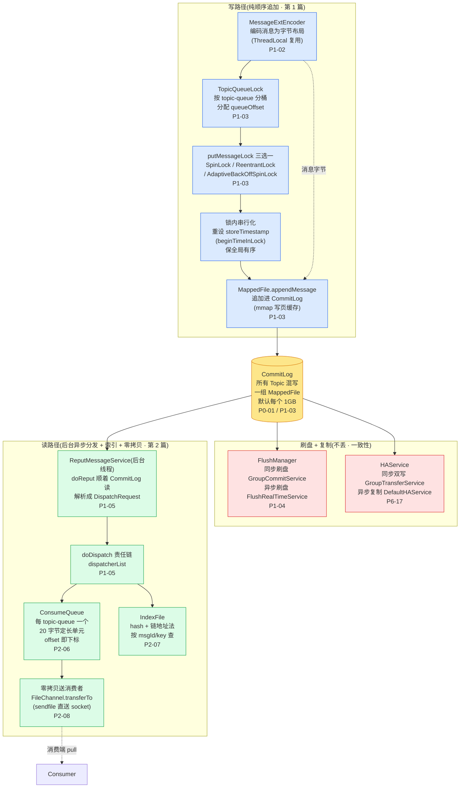
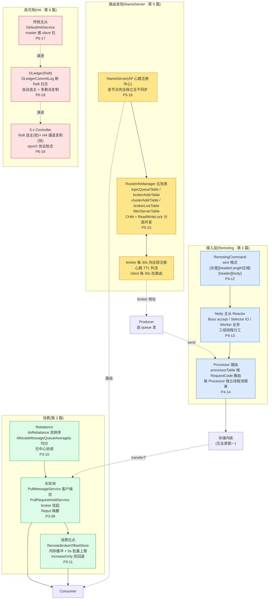
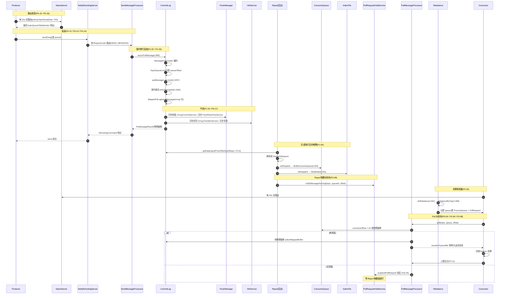

# 附录 A · 全景脉络:一张可"撕下来贴墙上"的全景参考卡

> 篇:附录
> 主线呼应:这是全书的**第二十五张图**(附录)。P0-01 立起了"为什么把所有消息堆进一个 CommitLog"这条抉择,P1 到 P8 二十二章沿着"一条消息的旅程"一个驿站一个驿站地走完,P9-24 把二十三章收束成七条权衡哲学。这份附录不再叙事——它把全书压成**两张全景大图 + 一张端到端时序总图 + 两张速查表**,目的是:你读任何一章,都能回到这里定位"我在哪一站、前面是谁、后面是谁";你写代码调 RocketMQ 卡住,扫一眼就能想起"这个机制在哪一章、源码是哪个类、它在收敛哪一笔账"。如果你只想把一本书的精华钉在墙上,贴这四张图就够了。
>
> 与 P9-24 的分工:P9-24 是**叙事章**(用文字讲清七条权衡哲学、与 Kafka 的分野、5.x 演进),附录 A 是**参考卡**(重图轻文,主打两张大图 + 一张时序总图 + 速查表)。读完 P9-24 把它消化成理解,回到附录 A 把它凝固成可查的地图。两者互补不重复。

## A.1 这张图怎么用

一句话主旨(全书浓缩):

> **RocketMQ 把所有 Topic 的所有消息一股脑追加进一个 CommitLog,用纯顺序写换极致写吞吐;代价是消费端的随机读,靠 ConsumeQueue/IndexFile/零拷贝收敛,再靠 NameServer/HA/刷盘守不丢、靠 Rebalance/位点守不重不漏。**

二分法(迷路时回到它):

> **存储内核**(CommitLog/ConsumeQueue/IndexFile/Reput/零拷贝/刷盘:消息怎么只追加一次、又怎么被各种姿势高效读出)vs **分布式骨架**(NameServer/Remoting/HA/Rebalance/长轮询/位点:消息怎么可靠流转、不丢不重不漏)。

下面三张图,第一张是**存储内核全景**(写怎么进、索引怎么建、读怎么出、怎么不丢);第二张是**分布式骨架全景**(路由怎么发现、消息怎么通信、怎么复制、怎么分 queue、怎么长轮询);第三张是**一条消息端到端的时序总图**(把两张全景缝合进一条时间线)。每张图都标注了对应章节号与关键源码类,锚定全书。

---

## A.2 全景图一:存储内核

存储内核回答两个问题:**一条消息怎么只追加一次地进 CommitLog**(写路径),以及**它怎么被高效地读出来、发给消费者**(读路径)。中间靠后台 Reput 异步分发把两个路径粘起来,再靠刷盘和复制兜住"不丢"。

**读这张图的关键**:

- **写路径永远只有一条路**:编码 → 分 queueOffset → 加锁 → 锁内追加进 CommitLog。中间那把 `putMessageLock`([CommitLog.java:1057](../rocketmq/store/src/main/java/org/apache/rocketmq/store/CommitLog.java#L1057))是"所有消息混写一个 CommitLog"的直接代价——全局顺序追加注定串行化。锁内重设 `storeTimestamp`(`beginTimeInLock` [:98](../rocketmq/store/src/main/java/org/apache/rocketmq/store/CommitLog.java#L98))靠"锁全局串行"让存储时间戳单调,这是 RocketMQ 能提供"按存储时间有序"的根。
- **CommitLog 是消息的物理真相**,只存这一份;ConsumeQueue 和 IndexFile 都是它的衍生物。
- **Reput 是写路径与读路径的接缝**——写只写 CommitLog,后台 `ReputMessageService`([DefaultMessageStore.java:2657](../rocketmq/store/src/main/java/org/apache/rocketmq/store/DefaultMessageStore.java#L2657))顺着读、解析成 `DispatchRequest`、分发给 `dispatcherList` 责任链([:250](../rocketmq/store/src/main/java/org/apache/rocketmq/store/DefaultMessageStore.java#L250) `BuildConsumeQueue`、:251 `BuildIndex`、:252 `BuildTransIndex`)。**写路径零负担,加一种索引只往链上加一个 dispatcher**。
- **刷盘与复制和"混写 CommitLog"无关,但和"不丢"生死攸关**——它们挂在 CommitLog 写入之后,分别由 `FlushManager`([CommitLog.java:90](../rocketmq/store/src/main/java/org/apache/rocketmq/store/CommitLog.java#L90))和 `DefaultHAService`([:43](../rocketmq/store/src/main/java/org/apache/rocketmq/store/ha/DefaultHAService.java#L43))负责。
- **零拷贝是读路径的最后一公里**:ConsumeQueue 给出物理偏移,`FileChannel.transferTo`(sendfile)把页缓存直接送 socket,全程不进 JVM 堆。

---

## A.3 全景图二:分布式骨架

分布式骨架回答两个问题:**一条消息怎么在集群里被可靠地路由、通信、复制、消费**(流转),以及**故障时怎么不丢不乱**(高可用)。它横向支撑着存储内核——没有它,CommitLog 只是一台单机的存储引擎。

**读这张图的关键**:

- **接入层是所有跨进程通信的底座**——`RemotingCommand`([:47](../rocketmq/remoting/src/main/java/org/apache/rocketmq/remoting/protocol/RemotingCommand.java#L47))统一协议、Netty 主从 Reactor 三组线程(`NettyRemotingServer` [:94](../rocketmq/remoting/src/main/java/org/apache/rocketmq/remoting/netty/NettyRemotingServer.java#L94))、Processor 路由(`processorTable` `NettyRemotingAbstract` [:104](../rocketmq/remoting/src/main/java/org/apache/rocketmq/remoting/netty/NettyRemotingAbstract.java#L104))。Send/Pull/Heartbeat 各自独立线程池,互不饿死。
- **NameServer 是刻意的 AP**——五张路由表(`RouteInfoManager` [:72-76](../rocketmq/namesrv/src/main/java/org/apache/rocketmq/namesrv/routeinfo/RouteInfoManager.java#L72)),各节点独立、broker 向全部注册、`scanNotActiveBroker`([:803](../rocketmq/namesrv/src/main/java/org/apache/rocketmq/namesrv/routeinfo/RouteInfoManager.java#L803))靠 TTL 判活。放弃了强一致,换来零共识开销 + 无状态运维。
- **高可用三条演进路**——传统主从(人工切)、DLedger(全量 Raft 复制开销大)、5.x Controller(选主用 Raft、复制用 HA、epoch 协议粘合)。三条路解决同一个问题:master 挂了怎么办。代价递进:从"人工不可用窗口"到"全量复制开销"到"架构复杂度"。
- **消费三件套是分布式骨架的消费侧**——Rebalance(`RebalanceImpl.doRebalance` [:232](../rocketmq/client/src/main/java/org/apache/rocketmq/client/impl/consumer/RebalanceImpl.java#L232))分 queue、长轮询(`PullRequestHoldService.suspendPullRequest` [:45](../rocketmq/broker/src/main/java/org/apache/rocketmq/broker/longpolling/PullRequestHoldService.java#L45))取消息、位点(`ConsumerOffsetManager`)记进度。三者和存储内核的接缝是"Reput 唤醒长轮询"。

---

## A.4 一张消息的端到端时序总图

把全景图一和全景图二缝合成一条时间线。这条时间线串起旅程上的每一个驿站——每个驿站都对应前面某一章,每个箭头都对应某个具体机制。这张图是 P9-24 那张时序总图的"参考卡版本",去掉了叙事注释,突出驿站间的衔接与源码锚点。

**这张图覆盖的全书驿站**(每站对应前文某一章):

- 路由发现(1-2):NameServer AP 心跳,P5-15 / P5-16。
- 发送(3-4):Producer 选 queue、Remoting 接、SendMessageProcessor 路由,P4-12 / P4-13 / P4-14。
- 锁内串行追加(5-9):编码、`putMessageLock` 三选一、锁内重设 storeTimestamp,P1-02 / P1-03。
- 刷盘 + 复制(10-11):FlushManager 刷盘不丢、HA 主从复制,P1-04 / P6-17。
- 响应返回(12-14):send 成功。
- Reput 异步建索引(15-18):写-建索引解耦、dispatcher 责任链,P1-05 / P2-06 / P2-07。
- Reput 唤醒长轮询(19):**存储内核与分布式骨架的接缝**,P3-09。
- 消费侧准备(20-22):Rebalance 双排序 + 确定性分配,P3-10。
- Pull 长轮询(23-29):ConsumeQueue 20 字节定长 O(1) 定位、sendfile 零拷贝、无消息挂起,P2-06 / P2-08 / P3-09 / P3-11。

---

## A.5 存储内核 vs 分布式骨架 速查表

迷路时回到这张表。每行:组件 / 职责 / 关键源码类(带行号锚点)/ 对应章节 / 核心技巧。

### 存储内核这一面(要"快")

| 组件 | 职责 | 关键源码类 | 章节 | 核心技巧 |
|------|------|-----------|------|---------|
| CommitLog | 所有 Topic 混写一个文件,纯顺序追加 | `CommitLog.asyncPutMessage` [:969](../rocketmq/store/src/main/java/org/apache/rocketmq/store/CommitLog.java#L969)、`putMessageLock` [:1057](../rocketmq/store/src/main/java/org/apache/rocketmq/store/CommitLog.java#L1057)、`beginTimeInLock` [:98](../rocketmq/store/src/main/java/org/apache/rocketmq/store/CommitLog.java#L98) | P0-01 / P1-03 | 混写换纯顺序写;锁内重设 storeTimestamp 保全局有序 |
| MappedFileQueue | 一组 1GB MappedFile 首尾相接 | `MappedFileQueue` [:40](../rocketmq/store/src/main/java/org/apache/rocketmq/store/MappedFileQueue.java#L40)、`getLastMappedFile` [:323](../rocketmq/store/src/main/java/org/apache/rocketmq/store/MappedFileQueue.java#L323) | P1-03 | 文件满滚动建新,逻辑上一个无限长文件 |
| 消息编码 | 一条消息编成字节布局 | `MessageExtEncoder` [:34](../rocketmq/store/src/main/java/org/apache/rocketmq/store/MessageExtEncoder.java#L34) | P1-02 | ThreadLocal 编码器 + 复用 ByteBuffer,避免竞争 |
| putMessageLock | 写路径串行化的锁 | `PutMessageSpinLock` / `PutMessageReentrantLock` / `AdaptiveBackOffSpinLockImpl` | P1-03 | 三选一按负载挑最省(自旋省唤醒、重入无空转、自适应切换) |
| TopicQueueLock | queueOffset 分配的分段锁 | `CommitLog` 内 `TopicQueueLock` | P1-03 | 按 topic-queue 分桶降低锁粒度 |
| 刷盘 | 页缓存 → 磁盘,不丢 | `FlushManager` [:90](../rocketmq/store/src/main/java/org/apache/rocketmq/store/CommitLog.java#L90)、`GroupCommitService` / `FlushRealTimeService` | P1-04 | 同步刷盘等待队列(前台不阻塞 IO 线程) |
| Reput | 后台异步分发,建 ConsumeQueue/Index | `ReputMessageService` [:2657](../rocketmq/store/src/main/java/org/apache/rocketmq/store/DefaultMessageStore.java#L2657)、`doReput` [:2713](../rocketmq/store/src/main/java/org/apache/rocketmq/store/DefaultMessageStore.java#L2713)、`doDispatch` [:2066](../rocketmq/store/src/main/java/org/apache/rocketmq/store/DefaultMessageStore.java#L2066) | P1-05 | 写-建索引解耦;dispatcher 责任链,加索引零改动写路径 |
| ConsumeQueue | 每 topic-queue 一个逻辑队列索引 | `ConsumeQueue` `CQ_STORE_UNIT_SIZE = 20` [:64](../rocketmq/store/src/main/java/org/apache/rocketmq/store/ConsumeQueue.java#L64) | P2-06 | 20 字节定长(物理偏移+消息长+tag hash),offset 即下标 O(1) 定位 |
| IndexFile | 按 msgId/key 的哈希索引 | `IndexFile` [:29](../rocketmq/store/src/main/java/org/apache/rocketmq/store/index/IndexFile.java#L29)、`IndexService` [:40](../rocketmq/store/src/main/java/org/apache/rocketmq/store/index/IndexService.java#L40) | P2-07 | hash + 链地址法 + 单文件定长可 mmap |
| 零拷贝 | 磁盘到网卡拷贝清零 | `DefaultMappedFile.appendMessage` / `selectMappedBuffer`、`TransientStorePool` [:31](../rocketmq/store/src/main/java/org/apache/rocketmq/store/TransientStorePool.java#L31) | P2-08 | mmap 写 + transferTo 读 + 堆外内存池避开页缓存锁竞争 |

### 分布式骨架这一面(要"稳"和"不丢不乱")

| 组件 | 职责 | 关键源码类 | 章节 | 核心技巧 |
|------|------|-----------|------|---------|
| RemotingCommand | 统一请求/响应协议 | `RemotingCommand` [:47](../rocketmq/remoting/src/main/java/org/apache/rocketmq/remoting/protocol/RemotingCommand.java#L47) | P4-12 | headerLength 高位塞 SerializeType 位域复用 |
| Netty 主从 Reactor | 通信线程模型 | `NettyRemotingServer` [:94](../rocketmq/remoting/src/main/java/org/apache/rocketmq/remoting/netty/NettyRemotingServer.java#L94) | P4-13 | Boss/Selector/Worker 三组线程分工 + autoRead 背压 |
| Processor 路由 | 按 RequestCode 分发 + 线程池隔离 | `NettyRemotingAbstract.processorTable` [:104](../rocketmq/remoting/src/main/java/org/apache/rocketmq/remoting/netty/NettyRemotingAbstract.java#L104)、`processRequestCommand` [:342](../rocketmq/remoting/src/main/java/org/apache/rocketmq/remoting/netty/NettyRemotingAbstract.java#L342) | P4-14 | 每 Processor 独立线程池 + SemaphoreReleaseOnlyOnce CAS 释放 + 时间轮超时 |
| NameServer | 路由发现,AP 心跳注册中心 | `RouteInfoManager` 五张表 [:72-76](../rocketmq/namesrv/src/main/java/org/apache/rocketmq/namesrv/routeinfo/RouteInfoManager.java#L72)、`registerBroker` [:226](../rocketmq/namesrv/src/main/java/org/apache/rocketmq/namesrv/routeinfo/RouteInfoManager.java#L226)、`pickupTopicRouteData` [:700](../rocketmq/namesrv/src/main/java/org/apache/rocketmq/namesrv/routeinfo/RouteInfoManager.java#L700)、`scanNotActiveBroker` [:803](../rocketmq/namesrv/src/main/java/org/apache/rocketmq/namesrv/routeinfo/RouteInfoManager.java#L803) | P5-15 / P5-16 | CHM + ReadWriteLock 分层并发;各节点独立无共识;心跳 TTL 软状态 |
| HA 主从复制 | master 推 slave 拉,同步双写/异步复制 | `DefaultHAService` [:43](../rocketmq/store/src/main/java/org/apache/rocketmq/store/ha/DefaultHAService.java#L43)、`GroupTransferService` [:38](../rocketmq/store/src/main/java/org/apache/rocketmq/store/ha/GroupTransferService.java#L38) | P6-17 | 同步双写等待队列(前台不阻塞,HA 推送线程检查 ACK 到位唤醒) |
| DLedger | 基于 Raft 的自动选主 | `DLedgerCommitLog` [:62](../rocketmq/store/src/main/java/org/apache/rocketmq/store/dledger/DLedgerCommitLog.java#L62)(CommitLog 嵌 Raft 日志) | P6-18 | 把 CommitLog 嵌进 Raft,自动选主 + 多数派复制,呼应《etcd》 |
| Controller | 5.x 自动主备切换 | `AutoSwitchHAService` [:59](../rocketmq/store/src/main/java/org/apache/rocketmq/store/ha/autoswitch/AutoSwitchHAService.java#L59)、`EpochFileCache` [:39](../rocketmq/store/src/main/java/org/apache/rocketmq/store/ha/autoswitch/EpochFileCache.java#L39) | P6-19 | 选主用 Raft(轻)、复制用 HA(快)、epoch 协议粘合 |
| 长轮询 | Push 本质是 Pull + 挂起唤醒 | `PullRequestHoldService.suspendPullRequest` [:45](../rocketmq/broker/src/main/java/org/apache/rocketmq/broker/longpolling/PullRequestHoldService.java#L45)、`DefaultPullMessageResultHandler` PULL_NOT_FOUND [:187](../rocketmq/broker/src/main/java/org/apache/rocketmq/broker/processor/DefaultPullMessageResultHandler.java#L187) | P3-09 | 挂起 + Reput 唤醒,兼顾实时性与无状态 |
| Rebalance | queue 分配给消费组内 consumer | `RebalanceImpl.doRebalance` [:232](../rocketmq/client/src/main/java/org/apache/rocketmq/client/impl/consumer/RebalanceImpl.java#L232)、`rebalanceByTopic` [:268](../rocketmq/client/src/main/java/org/apache/rocketmq/client/impl/consumer/RebalanceImpl.java#L268)、`AllocateMessageQueueAveragely` | P3-10 | 双排序 + 确定性算法,无中心协调各自算出互斥结果 |
| 消费位点 | offset 记进度,只增不减 | `RemoteBrokerOffsetStore` [:42](../rocketmq/client/src/main/java/org/apache/rocketmq/client/consumer/store/RemoteBrokerOffsetStore.java#L42)、`ConsumerOffsetManager` [:42](../rocketmq/broker/src/main/java/org/apache/rocketmq/broker/offset/ConsumerOffsetManager.java#L42) | P3-11 | 内存缓冲 + 5s 批量上报 + increaseOnly 防回退 |

### 衔接处(存储内核 ↔ 分布式骨架的接缝)

| 衔接点 | 职责 | 关键源码类 | 章节 | 核心技巧 |
|------|------|-----------|------|---------|
| SendMessageProcessor | Producer 发的入口,调存储内核写 | `SendMessageProcessor` [:82](../rocketmq/broker/src/main/java/org/apache/rocketmq/broker/processor/SendMessageProcessor.java#L82) | P4-14 / P1-03 | RequestCode 路由到 `commitLog.asyncPutMessage` |
| PullMessageProcessor | Consumer 拉的入口,查索引取消息 | `PullMessageProcessor` [:83](../rocketmq/broker/src/main/java/org/apache/rocketmq/broker/processor/PullMessageProcessor.java#L83) | P3-09 / P2-06 | 查 ConsumeQueue 拿偏移 → 回 CommitLog 取体 → transferTo 零拷贝送回 |
| Reput 唤醒长轮询 | 新消息到了通知挂着的长轮询 | `ReputMessageService` `notifyMessageArrivingIfNecessary`、`NotifyMessageArrivingListener` | P1-05 / P3-09 | **全书存储内核与分布式骨架最关键的接缝**,一条消息从"被写好"到"被消费"靠它打通 |

---

## A.6 几条贯穿哲学速查

把 P9-24 的七条权衡哲学压成一页速查。每条一行:哲学 / 用什么换什么 / 谁收敛代价 / 对应章节。迷路时扫一眼这张表,问"这个机制在收敛哪一笔账、或换哪一项收益",答案立刻显形。

| # | 哲学 | 用什么换什么 | 代价谁收敛 | 章节 |
|---|------|-------------|-----------|------|
| 一 | 混写一个 CommitLog | 写吞吐对 Topic 数量免疫 | 写串行化(自适应锁)、读随机化(ConsumeQueue/零拷贝)、写读放大(Reput 异步建索引) | P0-01 / P1-03 / P2-06 / P2-08 / P1-05 |
| 二 | 写与建索引异步解耦 | 写路径零负担(纯顺序追加) | Reput 后台线程 + dispatcher 责任链;消息延迟毫秒级才可见 | P1-05 |
| 三 | ConsumeQueue 重建逻辑队列 | 混写消息可按队列消费 | 20 字节定长(O(1) 定位)+ 紧凑(常驻页缓存)+ tag hash(服务端过滤不读消息体) | P2-06 |
| 四 | 零拷贝(mmap + sendfile) | 磁盘到网卡拷贝清零 | MappedByteBuffer 写 + transferTo 读 + 堆外内存池 | P2-08 |
| 五 | AP 心跳注册中心 | 无共识开销 + 无状态运维 | producer 重试 + consumer Rebalance + 业务幂等兜底 30s 收敛 | P5-15 / P5-16 |
| 六 | Push 长轮询 | 实时性与无状态同时成立 | 挂起请求纯内存、最多挂 15s、丢了 consumer 重拉 | P3-09 |
| 七 | 至少一次 + 业务幂等 | 实现简单 + 可靠送达 | 业务自己做幂等(唯一 key / 去重表 / 状态机) | P3-11 |

**这套哲学的内在脉络**:哲学一是源头的抉择(混写换纯顺序写),付出三笔账;哲学二三四在存储内核这一面收敛这三笔账(写路径零负担、读随机化用 ConsumeQueue 收、磁盘到网卡拷贝用零拷贝收);哲学五六七在分布式骨架这一面用"最终一致 + 应用层兜底"代替强一致协调(AP 心跳、长轮询、至少一次 + 幂等是同一种取舍)。**一面要快,一面要稳,合起来就是 RocketMQ。**

---

## A.7 收尾:回到第 1 章的那条抉择

P0-01 开篇立下了一条抉择,RocketMQ 的全部精妙都从这一刀逼出来:

> **把所有 Topic 的所有消息一股脑追加进一个 CommitLog,换来磁盘纯顺序写的极致写入吞吐;代价是消费端的随机读,于是用 ConsumeQueue 重建逻辑队列、IndexFile 建 key 索引、Reput 后台异步分发把这条代价收回来。**

P9-24 结语收束了这条抉择:

> **RocketMQ 用"写串行化、读随机化、写读放大"三笔账,换来了"写吞吐对 Topic 数量免疫";而 ConsumeQueue、Reput、零拷贝、自适应锁联手把三笔账收敛到可接受的范围。再往外一圈,NameServer 用 AP 心跳换无共识开销、长轮询换实时与无状态、Rebalance 用双排序换无中心协调、消费用至少一次 + 业务幂等换实现简单——每一处都是"用 A 换 B"的明确交易。**

这份附录把这两段话凝固成了**两张全景图 + 一张时序总图 + 两张速查表**。它不替代任何一章的叙事,它的作用是:你读完任一章回到这里,一眼就能定位"我在哪一站、前面是谁、后面是谁";你调 RocketMQ 卡住,扫一眼速查表就能想起"这个机制在哪一章、源码是哪个类、它在收敛哪一笔账"。

如果要把一本书的精华钉在墙上,贴这四张图:

1. **存储内核全景**(A.2):写怎么进、索引怎么建、读怎么出、怎么不丢。
2. **分布式骨架全景**(A.3):路由怎么发现、消息怎么通信、怎么复制、怎么分 queue、怎么长轮询。
3. **端到端时序总图**(A.4):一条消息从 Producer 到 Consumer 的完整旅程。
4. **哲学速查 + 速查表**(A.5 / A.6):每个机制归位,每条哲学一句话。

记住一句,就能记住整本书:**RocketMQ 把"队列"和"文件"解耦——写入只认一个 CommitLog(纯顺序写,极快),读的复杂性甩给 ConsumeQueue 和后台 Reput——这是它所有设计的源头。** 剩下的,都是这条抉择逼出来的精巧机制,以及它们联手把代价收敛到可接受范围的故事。

---

## 附录小结

这份附录是全书的**参考卡**,我们没有引入任何新机制,只是把 24 章压缩成可视化的地图。

1. **两张全景图**:存储内核(写/索引/读/不丢)与分布式骨架(路由/通信/复制/消费),每张图标注章节与源码类。
2. **一张端到端时序总图**:一条消息从 Producer 到 Consumer 的完整旅程,串起 24 章每一个驿站。
3. **两张速查表**:存储内核 vs 分布式骨架的组件/职责/源码类/章节/技巧一表打尽;衔接处(存储内核 ↔ 分布式骨架的三个接缝)单列。
4. **一页哲学速查**:七条权衡哲学各一行,看清"用什么换什么、代价谁收敛"。
5. **回到第 1 章的抉择**:全书的源头是"所有 Topic 混写一个 CommitLog"这一刀,代价是三笔账,由 ConsumeQueue/Reput/零拷贝/自适应锁联手收敛——这套自洽的权衡哲学,就是 RocketMQ 凭什么这么设计的答案。

如果你从头读到这,你应该已经能在脑子里放映出 RocketMQ 运转的全过程,并且随时能把任何一个机制归位到这张地图上。剩下的,就是回到源码,用 Grep 和 Read 把每一个细节再核对一遍——这本书讲的所有机制,源码里都有字面对应。祝阅读源码愉快。

附录 B 给出源码阅读路线、与 Kafka 的全面对照、以及与《数据库内核》《etcd》《LevelDB》《Linux 内存管理》《Tokio》同源思想的呼应——LSM、零拷贝、时间轮、Raft、epoch 协议、无锁数据结构,这些同源思想在分布式系统里反复出现,理解一处,就能点亮一片。
