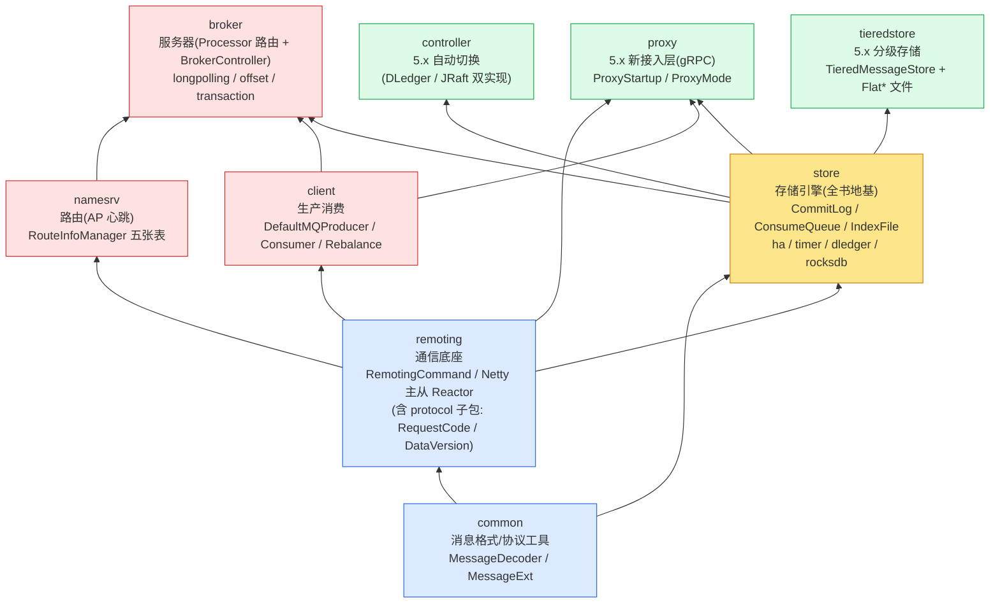

# 附录 B · 源码阅读路线与延伸:模块地图、Kafka 对照、5.x 延伸、同源思想呼应

> 篇:附录
> 主线呼应:这是全书的**第二十六张图**(附录)。附录 A 把全书压成"两张全景大图 + 一张时序总图 + 速查表",P9-24 把二十三章收束成七条权衡哲学。这份附录换一个视角——它不再叙事,而是给**两类读者**一张可操作的地图:第一类是"读完这本书,想自己啃 RocketMQ 源码"的人,第二类是"想横向对照 Kafka、想钻深 5.x 新架构、想打通本系列其他书里同源机制"的人。它由四部分组成:① 一张 rocketmq 模块阅读地图(按"一条消息的旅程"排阅读顺序,每模块标入口类与行号);② RocketMQ vs Kafka 的全面对照表(比 P9-24 的三处分野更深更全);③ 5.x 新架构(Proxy/RocksDB/TieredStore)的延伸深入点;④ 与《LevelDB》《数据库内核》《etcd》《Linux 内存管理》《Tokio》同源思想的呼应。
>
> 与附录 A 的分工:附录 A 是"全景参考卡"(重图轻文),本附录是"操作路线图"(重路线、对照、延伸)。与 P9-24 的分工:P9-24 是叙事章(只讲三处分野、四项演进),本附录的 Kafka 对照表覆盖十二个维度、5.x 延伸给出具体可读的类与概念,且补上 P9-24 没写的"同源思想呼应"。

## B.1 这张地图怎么用

一句话主旨(与附录 A 一致,这里只复述一次便于独立阅读):

> **RocketMQ 把所有 Topic 的所有消息一股脑追加进一个 CommitLog,用纯顺序写换极致写吞吐;代价是消费端的随机读,靠 ConsumeQueue/IndexFile/零拷贝收敛,再靠 NameServer/HA/刷盘守不丢、靠 Rebalance/位点守不重不漏。**

本附录要做的事,是把这句话里每一个名词,映射到 rocketmq 仓里**具体哪个模块、哪个入口类、哪一行**,并告诉你**按什么顺序读**。源码是 master @ `b5bc1ff5`(2026-06-21),全书行号钉死在这个 commit。

> **一个前置提醒**:RocketMQ 类名常有同名/近名易混,引用源码时务必分清:
> - `DefaultMessageStore.asyncPutMessage`([:647](../rocketmq/store/src/main/java/org/apache/rocketmq/store/DefaultMessageStore.java#L647),store 层入口)与 `CommitLog.asyncPutMessage`([:969](../rocketmq/store/src/main/java/org/apache/rocketmq/store/CommitLog.java#L969),真正追加)是两层。
> - `store/.../ha/DefaultHAService`(传统主从)与 `store/.../ha/autoswitch/AutoSwitchHAService`(5.x 切换)是两套。
> - `client` 的 `DefaultMQPushConsumerImpl`(push,本质 pull 长轮询)与 `DefaultLitePullConsumerImpl`(主动 pull)是两个消费实现。
> - `DefaultMessageStore`(经典 CommitLog+ConsumeQueue)与 `RocksDBMessageStore`([:28](../rocketmq/store/src/main/java/org/apache/rocketmq/store/RocksDBMessageStore.java#L28),5.x,**继承** `DefaultMessageStore` 而非平级)是两种存储实现。

---

## B.2 rocketmq 模块阅读地图

### B.2.1 模块依赖全景图

先看一张全模块依赖图,建立"哪个模块依赖哪个模块"的整体感。箭头表示"被依赖"(下游读上游)。

读这张图的关键:

- **common + remoting 是底座**,几乎所有模块都依赖它们。`RequestCode`、`DataVersion` 这类协议类**不在 common,而在 remoting 的 `protocol` 子包**——这是一个反直觉但重要的事实,引用时别找错模块。
- **store 是存储内核的地基**,broker 直接调 store 写/读,controller 与 tieredstore 都建立在 store 之上(controller 复用 store 的 ha 通道、tieredstore 用 `TieredMessageStore` 包装经典 store)。
- **broker 是服务器中枢**,它依赖 store(读写)、client(复用其路由拉取逻辑做 broker 内部的 consumer bridge)、namesrv(注册路由)、remoting(收发)。
- **controller / proxy / tieredstore 是 5.x 新模块**,它们是"在经典架构之上加一层"而非替换:controller 给 store 的 ha 加自动选主、proxy 在 remoting 之外加 gRPC 接入、tieredstore 在 store 之外加冷数据下沉。

### B.2.2 按"一条消息的旅程"排的阅读顺序

源码不是按本书章节顺序排的,但**本书章节顺序就是一条消息的旅程**。下面这张表把旅程每一站,映射到**该读哪个模块的哪个入口类**,并标推荐阅读顺序与对应章节。建议按这张表的"顺序"列从上往下读源码,与读本书章节同步进行。

| 顺序 | 旅程驿站 | 模块 | 入口类(文件:行号锚点) | 对应章节 | 阅读建议 |
|------|---------|------|----------------------|---------|---------|
| 0 | 消息格式 | common | `MessageExt` `common/message/MessageExt.java:27`、`MessageDecoder` `common/message/MessageDecoder.java:38` | P1-02 | 先看一条消息在内存里长什么样,再去 store 看它怎么编进 CommitLog |
| 1 | 协议编码 | remoting | `RemotingCommand` `remoting/protocol/RemotingCommand.java:47`、`RequestCode` `remoting/protocol/RequestCode.java:20` | P4-12 | 看 wire 格式 `[长度][headerLength 位域][header][body]`,理解所有跨进程通信的统一载体 |
| 2 | 服务器入口 | broker | `BrokerController` `broker/BrokerController.java:196`、`registerProcessor()` [:1161](../rocketmq/broker/src/main/java/org/apache/rocketmq/broker/BrokerController.java#L1161) | P4-14 | 从 BrokerController 看整个 broker 是怎么组装起来的——它注册了哪些 Processor、开了哪些线程池 |
| 3 | 发送 Processor | broker | `SendMessageProcessor` `broker/processor/SendMessageProcessor.java:82` | P1-03 / P4-14 | Producer 发消息到这里,它路由到存储内核写;这是分布式骨架与存储内核的**第一个接缝** |
| 4 | store 层写入口 | store | `DefaultMessageStore.asyncPutMessage` [:647](../rocketmq/store/src/main/java/org/apache/rocketmq/store/DefaultMessageStore.java#L647) | P1-03 | 几乎只做校验与 hook,核心一行调 `commitLog.asyncPutMessage` |
| 5 | 消息编码 | store | `MessageExtEncoder` `store/MessageExtEncoder.java:34` | P1-02 | 把消息编成字节布局(TOTALSIZE/QUEUEOFFSET/PHYSICALOFFSET/.../BODY/TOPIC/PROPERTIES);`ThreadLocal` 复用编码器 |
| 6 | **CommitLog 追加(命脉)** | store | **`CommitLog.asyncPutMessage` [:969](../rocketmq/store/src/main/java/org/apache/rocketmq/store/CommitLog.java#L969)**、`putMessageLock` [:1057](../rocketmq/store/src/main/java/org/apache/rocketmq/store/CommitLog.java#L1057)、`beginTimeInLock` [:98](../rocketmq/store/src/main/java/org/apache/rocketmq/store/CommitLog.java#L98) | P1-03 | **全书最核心的一百多行**。看锁内串行化、锁内重设 storeTimestamp 保全局有序;`putMessageLock` 三选一在构造函数 [:142-144](../rocketmq/store/src/main/java/org/apache/rocketmq/store/CommitLog.java#L142) 选定 |
| 7 | 三种写锁 | store | `PutMessageLock` `store/PutMessageLock.java:22`、`PutMessageSpinLock` `store/PutMessageSpinLock.java:24`、`PutMessageReentrantLock` `store/PutMessageReentrantLock.java:24`、**`AdaptiveBackOffSpinLockImpl` `store/lock/AdaptiveBackOffSpinLockImpl.java:32`** | P1-03 技巧精解 | 注意:`AdaptiveBackOffSpinLock`(在 `store/lock/AdaptiveBackOffSpinLock.java:22`)是**接口**,实现是带 Impl 后缀的;所有自适应锁都在 `store/lock/` 子包 |
| 8 | MappedFileQueue | store | `MappedFileQueue` `store/MappedFileQueue.java:40`、`getLastMappedFile` [:323](../rocketmq/store/src/main/java/org/apache/rocketmq/store/MappedFileQueue.java#L323)、`DefaultMappedFile` `store/logfile/DefaultMappedFile.java:64` | P1-03 | 一组 1GB MappedFile 首尾相接;`DefaultMappedFile` 在 `logfile/` 子包(不在 store 顶层) |
| 9 | 堆外内存池 | store | `TransientStorePool` `store/TransientStorePool.java:31` | P2-08 | 写堆外 DirectByteBuffer 再后台 commit,避开页缓存锁竞争 |
| 10 | 刷盘 | store | `FlushManager` `store/FlushManager.java:23`(接口)、`CommitLog.DefaultFlushManager` [:2184](../rocketmq/store/src/main/java/org/apache/rocketmq/store/CommitLog.java#L2184)(实现)、`GroupCommitService` [:1675](../rocketmq/store/src/main/java/org/apache/rocketmq/store/CommitLog.java#L1675)、`FlushRealTimeService` [:1548](../rocketmq/store/src/main/java/org/apache/rocketmq/store/CommitLog.java#L1548) | P1-04 | `GroupCommitService`/`FlushRealTimeService` 是 **CommitLog 的内部类**;`FlushManager` 接口独立,实现统一在 `DefaultFlushManager` |
| 11 | **Reput 后台分发(命脉)** | store | **`ReputMessageService` [:2657](../rocketmq/store/src/main/java/org/apache/rocketmq/store/DefaultMessageStore.java#L2657)**、`doReput` [:2713](../rocketmq/store/src/main/java/org/apache/rocketmq/store/DefaultMessageStore.java#L2713)、`doDispatch` [:2066](../rocketmq/store/src/main/java/org/apache/rocketmq/store/DefaultMessageStore.java#L2066)、dispatcher 注册 [:250-252](../rocketmq/store/src/main/java/org/apache/rocketmq/store/DefaultMessageStore.java#L250) | P1-05 | **全书最反直觉的转折**。看写只写 CommitLog,后台 Reput 顺着读、解析成 DispatchRequest、分发给责任链建 ConsumeQueue/Index |
| 12 | ConsumeQueue | store | `ConsumeQueue` `store/ConsumeQueue.java`、`CQ_STORE_UNIT_SIZE = 20` [:64](../rocketmq/store/src/main/java/org/apache/rocketmq/store/ConsumeQueue.java#L64) | P2-06 | 20 字节定长(物理偏移+消息长+tag hash),consumeOffset 即下标,O(1) 定位 |
| 13 | IndexFile | store | `IndexFile` `store/index/IndexFile.java:29`、`IndexService` `store/index/IndexService.java:40` | P2-07 | hash + 链地址法,按 msgId/key 查;单文件定长可 mmap |
| 14 | HA 主从复制 | store | `DefaultHAService` `store/ha/DefaultHAService.java:43`、`DefaultHAConnection` `store/ha/DefaultHAConnection.java:33`、`DefaultHAClient` `store/ha/DefaultHAClient.java:36`、`GroupTransferService` `store/ha/GroupTransferService.java:38`(**独立类**) | P6-17 | master 推 slave 拉;同步双写靠 `GroupTransferService` 等 ACK |
| 15 | DLedger | store | `DLedgerCommitLog` `store/dledger/DLedgerCommitLog.java:62`(extends CommitLog) | P6-18 | 把 CommitLog 嵌进 Raft 日志,自动选主 + 多数派复制 |
| 16 | 5.x Controller(数据面) | store | `AutoSwitchHAService` `store/ha/autoswitch/AutoSwitchHAService.java:59`、`EpochFileCache` `store/ha/autoswitch/EpochFileCache.java:39` | P6-19 | 选主用 Raft(轻)、复制用 HA(快)、epoch 协议粘合 |
| 17 | 拉消息 Processor | broker | `PullMessageProcessor` `broker/processor/PullMessageProcessor.java:83`、`DefaultPullMessageResultHandler` `broker/processor/DefaultPullMessageResultHandler.java:68`(PULL_NOT_FOUND 分支 [:187](../rocketmq/broker/src/main/java/org/apache/rocketmq/broker/processor/DefaultPullMessageResultHandler.java#L187)) | P2-06 / P2-08 / P3-09 | Consumer 拉消息入口;查 ConsumeQueue 拿偏移 → 回 CommitLog 取体 → transferTo 零拷贝送回;无消息触发挂起 |
| 18 | 长轮询挂起 | broker | `PullRequestHoldService` `broker/longpolling/PullRequestHoldService.java:33`、`suspendPullRequest` [:45](../rocketmq/broker/src/main/java/org/apache/rocketmq/broker/longpolling/PullRequestHoldService.java#L45) | P3-09 | 请求挂起最多 15s,Reput 唤醒;这是存储内核与分布式骨架的**第二个接缝** |
| 19 | 消费位点 | broker | `ConsumerOffsetManager` `broker/offset/ConsumerOffsetManager.java:42` | P3-11 | broker 端持久化消费 offset |
| 20 | 客户端入口 | client | `MQClientInstance` `client/impl/factory/MQClientInstance.java:96`、`updateTopicRouteInfoFromNameServer` [:390](../rocketmq/client/src/main/java/org/apache/rocketmq/client/impl/factory/MQClientInstance.java#L390)、`persistAllConsumerOffset` [:562](../rocketmq/client/src/main/java/org/apache/rocketmq/client/impl/factory/MQClientInstance.java#L562) | P5-16 / P3-11 | 客户端总管:30s 拉路由、5s 上报位点、20s Rebalance 三个定时任务都在这 |
| 21 | 生产者选 queue | client | `DefaultMQProducerImpl` `client/impl/producer/DefaultMQProducerImpl.java:101`、`selectOneMessageQueue` [:720](../rocketmq/client/src/main/java/org/apache/rocketmq/client/impl/producer/DefaultMQProducerImpl.java#L720)(委托 `MQFaultStrategy`) | P1-03 / P7-20 | 注意:公共 API `selectMessageQueue` 在 `DefaultMQProducer`,实现细节是 `selectOneMessageQueue` |
| 22 | Push 消费(本质 Pull) | client | `DefaultMQPushConsumerImpl` `client/impl/consumer/DefaultMQPushConsumerImpl.java:97`、`PullMessageService` `client/impl/consumer/PullMessageService.java:31` | P3-09 | 客户端单线程从阻塞队列取 PullRequest 不断拉;Push 语义是长轮询骗出来的 |
| 23 | Rebalance | client | `RebalanceImpl` `client/impl/consumer/RebalanceImpl.java:48`、`doRebalance` [:232](../rocketmq/client/src/main/java/org/apache/rocketmq/client/impl/consumer/RebalanceImpl.java#L232)、`rebalanceByTopic` [:268](../rocketmq/client/src/main/java/org/apache/rocketmq/client/impl/consumer/RebalanceImpl.java#L268) | P3-10 | 双排序 + 确定性分配算法,无中心协调 |
| 24 | 分配策略 | client | `AllocateMessageQueueAveragely` `client/consumer/rebalance/AllocateMessageQueueAveragely.java:26`、`AllocateMessageQueueAveragelyByCircle` `client/consumer/rebalance/AllocateMessageQueueAveragelyByCircle.java:26`、`AllocateMessageQueueConsistentHash` `client/consumer/rebalance/AllocateMessageQueueConsistentHash.java:30` | P3-10 | 注意:**没有 `consistenthash/` 子包**,一致性哈希策略类直接在 `rebalance/` 包内 |
| 25 | 位点存储 | client | `RemoteBrokerOffsetStore` `client/consumer/store/RemoteBrokerOffsetStore.java:42`(CLUSTERING)、`LocalFileOffsetStore` `client/consumer/store/LocalFileOffsetStore.java:42`(广播) | P3-11 | 内存缓冲 + 5s 批量上报 + increaseOnly |
| 26 | 顺序消费 | client | `ConsumeMessageOrderlyService` `client/impl/consumer/ConsumeMessageOrderlyService.java:53`、`ConsumeMessageConcurrentlyService` `client/impl/consumer/ConsumeMessageConcurrentlyService.java:51` | P7-20 | 顺序靠消费端 queue 锁 + 单 queue 串行 |
| 27 | 事务消息 | broker | `TransactionalMessageService` `broker/transaction/TransactionalMessageService.java:26`(**接口在 transaction/**)、`TransactionalMessageBridge` `broker/transaction/queue/TransactionalMessageBridge.java:60`、`EndTransactionProcessor` `broker/processor/EndTransactionProcessor.java:50` | P7-22 | half message 两阶段 + 回查;注意接口在 `transaction/`,Bridge 在 `transaction/queue/` |
| 28 | 延时消息 | store | `TimerMessageStore` `store/timer/TimerMessageStore.java:79`、`TimerWheel` `store/timer/TimerWheel.java:38`、`TimerLog` `store/timer/TimerLog.java:29`、`Slot` `store/timer/Slot.java:27` | P7-21 | 5.x 时间轮:slot + 指针 + 双文件 |
| 29 | 路由发现 | namesrv | `RouteInfoManager` `namesrv/routeinfo/RouteInfoManager.java:68`、五张表 [:72-76](../rocketmq/namesrv/src/main/java/org/apache/rocketmq/namesrv/routeinfo/RouteInfoManager.java#L72)、`registerBroker` [:226](../rocketmq/namesrv/src/main/java/org/apache/rocketmq/namesrv/routeinfo/RouteInfoManager.java#L226)、`pickupTopicRouteData` [:700](../rocketmq/namesrv/src/main/java/org/apache/rocketmq/namesrv/routeinfo/RouteInfoManager.java#L700)、`scanNotActiveBroker` [:803](../rocketmq/namesrv/src/main/java/org/apache/rocketmq/namesrv/routeinfo/RouteInfoManager.java#L803)、`NamesrvController` `namesrv/NamesrvController.java:54` | P5-15 / P5-16 | 注意 5.x 实际有**六张表**(新增 `topicQueueMappingInfoTable` [:77] 做静态主题映射);`unRegisterBroker` 已改为批量 `Set` + `BatchUnregistrationService` 异步处理 |
| 30 | Netty 主从 Reactor | remoting | `NettyRemotingServer` `remoting/netty/NettyRemotingServer.java:94`、`processorTable` 字段 `NettyRemotingAbstract` [:104](../rocketmq/remoting/src/main/java/org/apache/rocketmq/remoting/netty/NettyRemotingAbstract.java#L104)、`processRequestCommand` [:342](../rocketmq/remoting/src/main/java/org/apache/rocketmq/remoting/netty/NettyRemotingAbstract.java#L342)、`NettyEncoder`/`NettyDecoder` `remoting/netty/`、`ResponseFuture` `remoting/netty/ResponseFuture.java:30`、`SemaphoreReleaseOnlyOnce` `remoting/common/SemaphoreReleaseOnlyOnce.java:22`(**在 common 子包**)、`HashedWheelTimer` 字段 `NettyRemotingServer.java:107` | P4-12 / P4-13 / P4-14 | 三组线程(Boss/Selector/Worker);粘包靠 `NettyDecoder` 继承 `LengthFieldBasedFrameDecoder`;超时扫描靠 Netty 自带 `HashedWheelTimer` |

### B.2.3 三条推荐阅读路径

源码不一定要按表里 0→30 全走一遍。按目标,推荐三条路径:

**路径一(存储内核优先,推荐)**:0 → 4 → 5 → 6 → 7 → 8 → 11 → 12 → 13 → 10 → 14。这条路径先吃透"一条消息怎么进 CommitLog、怎么被后台分发、怎么被高效读出、怎么不丢",是全书的命脉,也是 RocketMQ 与 Kafka 分野最深的存储内核。读完这条,你就拿到了 P0-01 立的"三笔账"在源码里的全部落点。

**路径二(分布式骨架优先)**:1 → 2 → 3 → 30 → 29 → 17 → 18 → 20 → 22 → 23 → 19 → 25。这条路径先吃透"所有跨进程通信怎么走、Producer 怎么发、Consumer 怎么拉、NameServer 怎么路由、长轮询怎么挂起唤醒、Rebalance 怎么分 queue"。读完这条,你就拿到了 P9-24 哲学五、六、七在源码里的全部落点。

**路径三(按本书章节顺序同步读)**:每读完本书一章,就去源码里把那一章对应的入口类读一遍。本书每章末尾的"想继续深入往哪钻"都给了具体类与行号,跟着它走即可。这是最省力的路径,因为本书章节顺序本身就是精心排过的"一条消息的旅程"。

> **一个易踩坑的提醒**:RocketMQ 源码里同名/近名类很多。最容易混淆的三组:① `DefaultMessageStore.asyncPutMessage` 与 `CommitLog.asyncPutMessage`(两层);② `DefaultHAService` 与 `AutoSwitchHAService`(两套 HA);③ `DefaultMQPushConsumerImpl` 与 `DefaultLitePullConsumerImpl`(两种消费)。引用时务必标清是哪个类、在哪个包。

---

## B.3 RocketMQ vs Kafka:全面对照表

P9-24 讲了三处根本分野(存储、路由、消费),每一处都点出了场景判断。这一节把对照做得**更深更全**——覆盖十二个维度,每维度一行,既有架构层的抉择(前六行),也有实现与生态层的差异(后六行)。P9-24 不重复这张表,本附录补齐它。

| 维度 | RocketMQ | Kafka | 分野的本质 |
|------|----------|-------|-----------|
| **存储模型** | 所有 Topic 混写一个 CommitLog(一组首尾相接的 1GB MappedFile),纯顺序写 | 每 Partition 一个 log(滚动 segment),多 Partition 多文件并发写 | RocketMQ 押注"海量 Topic + 写密集",写吞吐对 Topic 数量免疫;Kafka 押注"读写并重 + 数据流管道",读路径干净、写并发高 |
| **Topic/Partition 数量爆炸时** | 写仍是纯顺序(只追加一个文件末尾),不受影响 | 写退化为"多文件间随机",文件句柄爆炸,Partition 数成吞吐天花板 | 这是混写 vs 分文件最直接的分野——RocketMQ 当年(在淘宝)正是为这个场景而生 |
| **索引机制** | CommitLog 是消息物理真相;ConsumeQueue(每 topic-queue 一个,20 字节定长:物理偏移+消息长+tag hash)重建逻辑队列;IndexFile(hash+链地址法)按 msgId/key 查 | Log Segment + Index(`.index` 偏移索引 + `.timeindex` 时间索引),索引与数据同 Partition | RocketMQ 的索引是"混写的衍生物",由后台 Reput 异步从 CommitLog 加工;Kafka 的索引与数据同生同长在一个 Partition |
| **消息查询能力** | 强:按 msgId 查(IndexFile)、按业务 key 查(IndexFile)、按 topic-queue-offset 顺序消费(ConsumeQueue)、按时间范围查 | 弱:主要按 Partition + offset 顺序消费;按 key 查要扫 Partition(或借助外部如 Kafka Streams 的全局 store) | RocketMQ 内建多种查询索引,是因为它要在"混写一个 CommitLog"的前提下还要支持灵活查询;Kafka 的 Partition 文件天然按 offset 有序,查询需求弱 |
| **路由发现** | NameServer(AP 心跳):各节点完全独立互不同步,broker 每 30s 向全部注册,心跳 TTL(~120s)判活,client 30s 拉路由 | ZooKeeper(CP 共识,4.x)/ KRaft(Raft,3.x+):每次注册走 quorum,ZAB/Raft 保证强一致 | RocketMQ 放弃强一致换"零共识开销 + 无状态运维",短暂路由偏差甩给应用层;Kafka 要强一致保证 broker 上下线立刻被全集群感知 |
| **消费模型** | Push(语义)本质是 Pull + 长轮询(broker 挂起 15s,Reput 唤醒) | 纯 Pull(消费者自己按节奏拉) | 长轮询兼顾实时性(毫秒级)与无状态(broker 不维护消费进度);纯 Pull 简单且消费者自治,但实时性取决于轮询间隔 |
| **副本与高可用** | 三条路:传统主从(人工切)/ DLedger(Raft 自动选主 + 全量多数派复制)/ 5.x Controller(Raft 选主 + HA 通道复制 + epoch 协议) | ISR + leader 选举(依赖 ZK/KRaft 做 leader 选举),副本同步靠 follower 追 leader 的 HW(high watermark) | RocketMQ 的高可用演进清晰分离了"选主"与"复制"(Controller 模式),Kafka 把两者绑在 ISR 模型里;RocketMQ 的 DLedger 是自研 Raft(轻量),Kafka 3.x+ 用 KRaft(也是 Raft) |
| **顺序消息** | 原生支持:发送端 `MessageQueueSelector` 按 hash(key) 选 queue,消费端 `MessageListenerOrderly` + queue 锁,分区顺序 | 不内建顺序消息语义(需业务自己保证同 key 进同 Partition + 单线程消费该 Partition) | RocketMQ 把"分区顺序"做成一等公民(发送端 selector + 消费端锁);Kafka 把顺序留给业务自己用 Partition 保证 |
| **延时消息** | 原生支持:4.x 固定 18 个 delayLevel,5.x 时间轮(`TimerWheel` slot + `TimerLog`)支持任意延时 | 不内建(需业务用 Kafka Streams 的 punctuator 或外部方案) | RocketMQ 把延时做成存储引擎内建特性;Kafka 把它留给流处理层 |
| **事务消息** | 原生支持:half message 两阶段 + 本地事务 + 回查,把"本地事务 + 发消息"做成原子 | 仅支持"事务型 Producer"(exactly-once 语义,靠幂等 Producer + 事务 API + 两阶段 commit),不解决"本地事务 + 发消息"的分布式事务 | 两者说的"事务"不是一回事:RocketMQ 的事务是"本地事务与消息投递的最终一致",Kafka 的事务是"流处理里多 Partition 的原子写入" |
| **消息投递语义** | 至少一次(at-least-once),框架保证不丢不漏,不重甩给业务幂等 | 至少一次(默认)/ 恰好一次(事务 Producer + 幂等消费,Kafka Streams 场景) | RocketMQ 选"简单 + 业务幂等兜底";Kafka 在流处理场景追求 exactly-once,代价是两阶段 commit |
| **协议与多语言** | 4.x 自研协议(remoting + Netty);5.x 引入 Proxy(gRPC,多语言友好) | 自研协议(基于 TCP,Kafka 协议);客户端由社区维护多语言版本 | RocketMQ 5.x 用 gRPC 显著降低多语言 SDK 维护成本;Kafka 协议稳定,多语言 SDK 生态成熟但各自维护 |
| **典型生态定位** | 业务消息中间件(电商交易、订单、金融),海量 Topic + 写密集 + 灵活查询 + 特性消息(顺序/延时/事务) | 数据流管道(日志、事件、CDC、流处理),高吞吐读写 + 强一致 + 与 Spark/Flink/Kafka Streams 深度集成 | 两者的"分野"归根到底是**押注的场景不同**——RocketMQ 押业务消息,Kafka 押数据管道;在各自场景里都是更优解,套错场景都会撞墙 |

> **钉死这张表**:RocketMQ 与 Kafka 的差异,**没有一处是"实现优劣",全是"场景判断"**。混写 vs 分 Partition、AP 心跳 vs CP 共识、Push 长轮询 vs Pull、特性消息内建 vs 留给流处理层——每处抉择背后都有明确的场景押注。把 RocketMQ 套到 Kafka 的场景(高吞吐数据流管道、强一致路由),或把 Kafka 套到 RocketMQ 的场景(海量 Topic 业务消息、灵活查询、延时/事务特性),都会撞墙。理解这张表的关键,是理解两者各自押注了什么。

---

## B.4 5.x 新架构的延伸深入点

P8-23 讲了 5.x 的四项演进(Proxy、Controller、RocksDB 存储、时间轮延时 + 分级存储),P9-24 回顾了它们的演进逻辑。这一节给"想钻深 5.x"的读者,指出每一项**进一步可读的具体类、概念、文件**,以及延伸阅读的方向。这些点在 P8-23 已点过,这里做"地图式"索引,不重复叙事。

### B.4.1 Proxy——gRPC 新接入层

Proxy 是 5.x 在 `remoting` 之外加的基于 gRPC 的接入层。入口类是 `ProxyStartup`(`proxy/.../proxy/ProxyStartup.java:56`,main 在 [:67](../rocketmq/proxy/src/main/java/org/apache/rocketmq/proxy/ProxyStartup.java#L67)),部署模式由 `ProxyMode`(`proxy/.../proxy/ProxyMode.java:20`)枚举控制——`LOCAL`(与 Broker 同进程)或 `CLUSTER`(独立部署)。

延伸阅读方向:

- **gRPC service 处理类**(`proxy/.../proxy/grpc/v2/`):每个 gRPC service 对应一个 Activity 类。`producer/SendMessageActivity` 处理发送、`consumer/ReceiveMessageActivity` 处理消费、`consumer/AckMessageActivity` 处理 pop 消费确认、`route/RouteActivity` 处理路由。抽象层在 `AbstractMessagingActivity` / `GrpcMessagingActivity` / `DefaultGrpcMessagingActivity`。想理解"gRPC 请求怎么转换成 RocketMQ 内部调用",从这条链读起。
- **两种协议并存**:`proxy/grpc/` 走 gRPC(新客户端),`proxy/remoting/activity/` 走旧 remoting 协议(兼容 4.x 客户端,如 `SendMessageActivity` / `PullMessageActivity` / `PopMessageActivity`)。Proxy 同时挂两套 pipeline,这是 5.x 平滑迁移的关键。
- **延伸概念**:gRPC 的 Protobuf 接口契约 vs RocketMQ 旧协议的 `extFields` HashMap、计算与存储分离(Proxy 前置鉴权/限流/协议转换,Broker 专注存储)、Serverless 场景下的独立扩缩。

### B.4.2 Controller——自动 failover 的控制平面

Controller 是 5.x 用 Raft 做**选主**、数据复制仍走 HA 通道的方案,解决 DLedger 全量 Raft 复制开销大的问题。控制平面在 `controller/` 模块,数据平面在 `store/ha/autoswitch/`。

延伸阅读方向:

- **Raft 实现有两套(关键事实)**:controller **不绑定单一 Raft**。DLedger 路线是 `impl/DLedgerController.java:87`(implements `Controller`),配合 `impl/manager/ReplicasInfoManager.java:76`;JRaft 路线是 `impl/JRaftController.java:67`,配合 `impl/manager/RaftReplicasInfoManager.java`。运行时按配置二选一。这是 P6-19 没展开的细节,读源码时注意分清你看的是哪一套。
- **选主策略**:`elect/ElectPolicy` 接口、`elect/impl/DefaultElectPolicy`。想理解"Controller 怎么决定谁能当 master",从这里读起。
- **epoch 协议(命脉)**:数据平面在 `store/ha/autoswitch/`。`AutoSwitchHAService.java:59`(extends `DefaultHAService`)、`EpochFileCache.java:39`(每任 master 在文件里占一段连续 CommitLog 边界)。想理解"切换时不丢已确认数据",核心是读 epoch 协议怎么保证新 master 从 epoch 边界对齐、再 truncate 到 ISR 公共一致点。这一段呼应《etcd》的 Raft,但 RocketMQ 没把数据塞进 Raft,只用 Raft 选主——这是它与 etcd 的关键区别。
- **延伸概念**:控制平面(共识选主,够稳)与数据平面(HA 复制,够快)分离、ISR(in-sync replicas)与 epoch 的关系、DLedger vs JRaft 的取舍(自研轻量 vs 工业级成熟)。

### B.4.3 RocksDB 存储——LSM 替 ConsumeQueue

`RocksDBMessageStore`([:28](../rocketmq/store/src/main/java/org/apache/rocketmq/store/RocksDBMessageStore.java#L28))是 5.x 用 RocksDB 的 LSM 作为 CommitLog + ConsumeQueue 的可选替代实现。注意它**继承 `DefaultMessageStore`** 而非平级实现——这意味着它复用了经典 store 的 Reput、HA、刷盘大部分逻辑,只替换了底层存储引擎。

延伸阅读方向:

- **RocksDB 存储子包**(`store/.../store/rocksdb/`):`ConsumeQueueRocksDBStorage`(ConsumeQueue 用 RocksDB)、`MessageRocksDBStorage`(消息体用 RocksDB)、`RocksDBOptionsFactory`(RocksDB 参数工厂)、`NativeCqCompactionFilter` / `CqCompactionFilterJni`(ConsumeQueue 的 compaction filter,JNI 调用)。想理解"LSM 怎么替掉每 queue 一个 ConsumeQueue 文件",从这里读起。
- **ConsumeQueue 多实现**(`store/.../store/queue/`):除了经典 `ConsumeQueue`,还有 `BatchConsumeQueue`、`RocksDBConsumeQueue`、`SparseConsumeQueue`。这是 5.x 把 ConsumeQueue 做成可插拔的体现——按场景选不同的 ConsumeQueue 实现。
- **Index 也支持 RocksDB**:`store/index/rocksdb/IndexRocksDBStore`。
- **延时消息也有 RocksDB 版**:`store/timer/rocksdb/` 下有 `TimerMessageRocksDBStore` / `TimerRocksDBRecord` / `Timeline`。
- **延伸概念(呼应《LevelDB》《Linux 内存管理》)**:RocksDB 是 LevelDB 的工业级后代,核心是 LSM 多层归并。LSM 把"随机写"收敛成"顺序写 + 后台 compaction"。在"海量 Queue + 中等写量"场景下,LSM 把所有 queue 的索引收进少数几个 SST 文件,文件数与 Queue 数解耦——这正是经典 ConsumeQueue(每 queue 一文件)在百万 Queue 时的天花板。代价是 LSM 的写放大和 compaction 抖动。读这一节时,强烈建议对照《LevelDB》的 LSM 与 compaction 章节、《Linux 内存管理》的页缓存与写放大章节。

### B.4.4 TieredStore——冷热分级存储

TieredStore 是 5.x 把冷数据下沉到对象存储/低成本介质、热数据留本地的方案。入口类是 `TieredMessageStore`([:66](../rocketmq/tieredstore/src/main/java/org/apache/rocketmq/tieredstore/TieredMessageStore.java#L66)),它**继承 `AbstractPluginMessageStore`** 而非直接 implements `MessageStore`——它是一个**插件式包装层**,可以在经典 store 或 RocksDB store 之上再套一层分级存储。

> **重要修正(易踩坑)**:很多老资料和早期设计文档提 `TieredCommitLog` / `TieredFileQueue`,**这两个类名在当前 master 不存在**。当前实现已改用 `Flat*` 命名体系。

延伸阅读方向:

- **Flat 文件体系**(`tieredstore/.../tieredstore/file/`):`FlatCommitLogFile.java:26`(对应"CommitLog 角色",extends `FlatAppendFile`)、`FlatConsumeQueueFile.java:22`(对应"ConsumeQueue 角色")、`FlatMessageFile.java:44`(单个 Topic 单个队列的复合文件)、`FlatFileStore.java:39`、`FlatAppendFile.java:37`、`FlatFileFactory`、`FlatFileInterface`。想理解"分级存储怎么把冷热数据分层",从这条链读起。
- **核心服务**(`tieredstore/.../tieredstore/core/`):`MessageStoreDispatcherImpl`(写时分流冷热)、`MessageStoreFetcherImpl`(读时合并冷热)。这是分级存储的"大脑"——它决定一条消息写本地还是下沉、读时从本地还是远程取。
- **底层 provider**(`tieredstore/.../tieredstore/provider/`):`PosixFileSegment`(本地文件段)、`MemoryFileSegment`(内存段)、`FileSegmentFactory`。分级存储的底层是"文件段"抽象——本地段、对象存储段、内存段统一接口。
- **延伸概念**:冷热分离(访问频率分层)、对象存储作为低成本介质、写放大与读放大的权衡、与 RocksDB 存储的配合(TieredStore 可以套在 RocksDBMessageStore 之外)。

---

## B.5 与《深入浅出系列》同源思想的呼应

这一节是本附录最"打通"的部分。RocketMQ 不是一座孤岛——它用的很多机制(LSM、零拷贝、时间轮、Raft、epoch 协议、WAL、无锁数据结构)在分布式系统与存储系统里反复出现。本系列的其他书正好分别深入讲了这些机制。理解一处,就能点亮一片。下表把 RocketMQ 的机制与本系列其他书对应起来,每条点出"同源思想是什么、RocketMQ 怎么用它、对应书里哪里讲透"。

| RocketMQ 的机制 | 同源思想 | RocketMQ 怎么用它 | 对应本系列的书(讲透的地方) |
|----------------|---------|------------------|---------------------------|
| **CommitLog = 只追加的日志** | **WAL(Write-Ahead Log):日志即真相**——先写日志再建索引,日志是物理真相,索引是衍生物 | 所有消息只追加进 CommitLog 一份,ConsumeQueue/IndexFile 都是后台 Reput 从 CommitLog 加工的衍生物;CommitLog 损坏可重建索引,索引损坏可从 CommitLog 重放 | 《数据库内核:从一条 SQL 说起》——PostgreSQL 的 WAL,redo log 是物理真相,数据页是衍生物,崩溃恢复靠重放 WAL。RocketMQ 的 CommitLog 与 PG 的 WAL 是同一个思想:**日志先于一切,索引可重建** |
| **RocksDBMessageStore(5.x)** | **LSM(Log-Structured Merge-Tree):把随机写收敛成顺序写 + 后台 compaction** | 5.x 用 RocksDB 的 LSM 替掉经典 CommitLog+ConsumeQueue,在"海量 Queue"场景下把所有 queue 的索引收进少数 SST 文件,文件数与 Queue 数解耦 | 《LevelDB 设计与实现深入浅出》——LevelDB 是 RocksDB 的祖先,核心就是 LSM 三层归并(Level 0 memtable → Level 1-6 SST)+ compaction 收敛写放大;《Linux 内存管理设计与实现深入浅出》——页缓存、写放大、内存映射的内核侧 |
| **mmap 写 + sendfile 读 + 堆外内存池** | **零拷贝:绕开用户态,数据在内核态直接搬运** | 写消息用 `MappedByteBuffer`(mmap)直写页缓存;读消息送消费者用 `FileChannel.transferTo`(sendfile)直送 socket;`TransientStorePool` 堆外内存池避开页缓存锁竞争 | 《Linux 内存管理》——mmap 的页表映射、page cache、`sendfile`/`splice`/`tee` 的内核实现;RocketMQ 的零拷贝是用户态视角的"换 API",底层全是内核机制 |
| **5.x TimerWheel 延时消息** | **时间轮:海量定时任务不爆炸,slot 固定 + 指针轮转 + 分桶** | 5.x 延时消息用 `TimerWheel`(按时间的 slot 表)+ `TimerLog`(按写入的明细)双文件设计,到期 scan 对应 slot 写回原 topic,支持任意延时 | 《Tokio 设计与实现深入浅出》——Tokio 的层级时间轮(hierarchical wheel),slot + 指针 + 层级降维;RocketMQ 的 TimerWheel 是单层时间轮(对标 Tokio 单层),海量延时任务不爆炸是同一个机制 |
| **DLedger(Raft 自动选主)+ Controller epoch 协议** | **Raft 多数派共识:选主 + 日志复制,以及"任期"概念保证切换不丢** | DLedger 用 Raft 做自动选主 + 多数派复制(`DLedgerCommitLog` 把 CommitLog 嵌进 Raft 日志);5.x Controller 只用 Raft 选主、数据复制走 HA + epoch 协议(每任 master 占一段 CommitLog 边界,切换时从 epoch 边界对齐) | 《etcd 设计与实现深入浅出》——Raft 的 leader election、log replication、term 概念;RocketMQ 的 epoch 对应 etcd 的 term,都是"标记每任 master 的边界,切换时从边界对齐"。区别:etcd 把数据塞进 Raft,RocketMQ 的 Controller 只用 Raft 选主 |
| **ConsumeQueue 20 字节定长 + offset 即下标** | **定长索引:O(1) 定位,offset 是数组下标** | ConsumeQueue 每条 20 字节(物理偏移+消息长+tag hash),consumeOffset 一次乘法算出字节位置,O(1) 定位回 CommitLog | 《LevelDB》——SST 的 data block / index block 用定长或前缀压缩偏移,O(1) 或 O(log n) 定位;《数据库内核》——B+ 树的页内定长槽位。定长索引是存储系统通用技巧 |
| **IndexFile hash + 链地址法** | **哈希索引:链地址法解决冲突,单文件定长可 mmap** | IndexFile 用 500w hash slot + 2000w 条目,冲突用链表(都存在同一个文件里),按 msgId/key 查 | 《LevelDB》——block cache 的 LRU 哈希;《Linux 内存管理》——内核的 hash table(如 inode hash)。hash + 链地址法是基础数据结构,IndexFile 的妙处是把它"塞进一个可 mmap 的定长文件" |
| **RouteInfoManager 五张表(CHM + ReadWriteLock)** | **分层并发:细粒度无锁管单表,粗粒度锁管跨表事务** | 五张路由表用 `ConcurrentHashMap` 管单表原子性,`ReadWriteLock` 管跨表事务性(registerBroker 要同时改 5 张表);读用 readLock 并发、写用 writeLock 互斥 | 《etcd》——etcd 的 MVCC 用读写锁管 revision;《Linux 同步原语深入浅出》——RCU 读完全不锁、seqlock 读者不阻塞写者。RocketMQ 的 CHM+ReadWriteLock 是"分层并发"的中等档,比 RCU 重、比纯大锁轻 |
| **Rebalance 双排序 + 确定性算法** | **无中心协调:所有节点用相同输入 + 相同确定性算法,各自算出互斥结果** | RebalanceImpl 取 `mqAll`(全部 queue)+ `cidAll`(全部 consumer id)都 `Collections.sort`,再调同一 `AllocateMessageQueueStrategy`,全 consumer 各自算出互斥分配,无需协调者 | 《etcd》——Raft 的"所有节点看到相同日志、状态机确定性地 apply";一致性哈希 + 虚拟节点是分布式哈希的标配(Dynamo、Cassandra 都用)。RocketMQ 的 Rebalance 是无中心协调的典型 |
| **putMessageLock 三选一(自旋/重入/自适应)** | **锁的取舍:自旋省唤醒但有 CPU 空转,重入无空转但有 park/unpark 开销,自适应在两者间切换** | CommitLog 写路径的 `putMessageLock` 三选一,按负载选最省的;`AdaptiveBackOffSpinLockImpl` 在自旋与 park 之间自适应退避 | 《Linux 同步原语》——qspinlock(MCS 队列自旋锁)、mutex 的乐观自旋(optimistic spin);《Tokio》——无锁队列、原子操作。RocketMQ 的"三选一"是用户态对内核锁策略的模仿:自旋对应 spinlock、重入对应 mutex、自适应对应 mutex 的 optimistic spin |
| **CompletableFuture 全链路异步** | **异步运行时:线程不阻塞等待,回调串联** | 从 `invokeAsync` 到 `asyncPutMessage` 到客户端回调,全程 `CompletableFuture`,IO 线程不阻塞 | 《Tokio》——async/await 运行时,task 不阻塞线程;《Go runtime》——goroutine 阻塞不阻塞 M。RocketMQ 的 CompletableFuture 是 Java 的"轻量异步",思想同源(把等待从占用线程解放出来),实现上是回调而非协程 |
| **Push 长轮询(挂起 + Reput 唤醒)** | **用"挂起 + 事件唤醒"代替轮询,兼顾实时性与无状态** | broker 把无消息的 pull 请求挂起 15s,Reput 后台线程把新消息分发进 ConsumeQueue 时顺手唤醒 | 《Tokio》——mio 的 epoll 事件循环(挂起 + 内核唤醒);《Linux 同步原语》——futex(wait + wake);《Linux 内核机制》——epoll。长轮询是"事件驱动"在应用层的一个变体——broker 不主动推(无状态),但用挂起 + 唤醒骗出了毫秒级实时性 |
| **至少一次 + 业务幂等** | **最终一致:框架保证不丢不漏,把"不重"甩给应用层** | RocketMQ 保证不丢(刷盘+复制)、不漏(位点 increaseOnly),不重甩给业务幂等 | 《etcd》——线性一致是 etcd 的强项,RocketMQ 选了"够用就行"的最终一致;《数据库内核》——事务的 ACID vs 最终一致。RocketMQ 的取舍是工程派的:exactly-once 代价太高(两阶段提交),至少一次 + 业务幂等是性价比最高的平衡 |

> **这张表怎么用**:你在读 RocketMQ 某一章,如果觉得某个机制"似曾相识",回到这张表,大概率它在本系列另一本书里有更深的讲法。反过来,如果你读过本系列另一本书(比如《etcd》的 Raft),再来读 RocketMQ 的 DLedger / Controller,会发现"原来这里是同一个思想,只是 RocketMQ 做了取舍"。**同源思想在分布式系统里反复出现,理解一处,就能点亮一片**——这是本系列"源码精解大书"想留给读者的最大价值。

---

## B.6 收尾:读完这本书,下一步

这本书到此结束。如果你从头读到这,你应该已经能在脑子里放映出 RocketMQ 运转的全过程——一条消息怎么被 Producer 选 queue 发出,Broker 的 CommitLog 怎么锁内串行化追加混写,后台 Reput 怎么把它异步分发成 ConsumeQueue 让消费端能定位,消费端怎么 Pull 长轮询取走,Rebalance 怎么在消费组内分 queue,主从怎么复制保不丢,master 挂了 Controller 怎么自动切——以及每一步底下用了什么巧妙的手段。

**下一步**,我给你三个建议,任选其一或循序:

1. **回到源码,用 Grep 和 Read 把每一个细节再核对一遍**。本书讲的所有机制,源码里都有字面对应。带着这张模块地图(B.2),从 `CommitLog.asyncPutMessage`([:969](../rocketmq/store/src/main/java/org/apache/rocketmq/store/CommitLog.java#L969))这一百多行开始,把"一条消息的旅程"在源码里完整走一遍。你会发现,源码里藏着很多本书没展开的细节(比如 `MappedFile` 怎么管理引用计数、`HAConnection` 怎么做读写分离的线程模型、`AllocateMessageQueueConsistentHash` 怎么用虚拟节点)——这些细节,正是你把"理解"变成"内化"的阶梯。
2. **横向对照 Kafka**。带着 B.3 这张对照表,去读 Kafka 的源码(或文档)。重点对照三处分野:存储(混写 vs 分 Partition)、路由(NameServer AP vs ZK/KRaft CP)、消费(长轮询 vs 纯 Pull)。你会更深刻地理解"没有银弹,只有场景判断"——RocketMQ 和 Kafka 都是分布式消息中间件,但它们押注的场景不同,每一处设计抉择背后都有明确的场景判断。
3. **打通本系列的其他书**。带着 B.5 这张同源思想表,去读本系列的其他书。你会发现 RocketMQ 用的很多机制(LSM、零拷贝、时间轮、Raft、epoch、WAL、无锁数据结构、分层并发)在分布式系统里反复出现——《LevelDB》讲透了 LSM,《数据库内核》讲透了 WAL,《etcd》讲透了 Raft,《Linux 内存管理》讲透了零拷贝与页缓存,《Tokio》讲透了时间轮与异步运行时。理解一处,就能点亮一片。当你能把这五本书 + RocketMQ 串成一张"分布式系统设计思想"的大网,你就真正从"会用 RocketMQ"升级到了"理解分布式存储与消息系统的设计哲学"。

> **最后一句**:RocketMQ 的全部精妙,源头都是"所有 Topic 混写一个 CommitLog"这一刀——它用"写串行化、读随机化、写读放大"三笔账,换来了"写吞吐对 Topic 数量免疫"这一核心优势;而 ConsumeQueue、Reput、零拷贝、自适应锁联手把三笔账收敛到可接受范围。这套自洽的权衡哲学,就是 RocketMQ 凭什么这么设计的答案。剩下的,都是把这条抉择在源码里逐行核对、在横向对照里反复印证、在同源思想里融会贯通——这,就是读完这本书之后的下一步。祝你阅读源码愉快。

---

## 附录小结

这份附录是全书的**操作路线图**,我们没有引入任何新机制,只是给"想啃源码、想横向对照、想钻深 5.x、想打通同源思想"的读者四张地图。

1. **模块阅读地图**(B.2):一张全模块依赖图 + 一张按"一条消息的旅程"排的 30 站阅读顺序表(每站标入口类与行号)+ 三条推荐阅读路径。这是给"想读 RocketMQ 源码"的人的导航。
2. **RocketMQ vs Kafka 全面对照**(B.3):十二维度对照表,比 P9-24 的三处分野更深更全,覆盖存储模型、索引、查询、路由、消费、副本、顺序/延时/事务特性、投递语义、协议、生态定位。每维度点出"分野的本质是场景判断"。
3. **5.x 新架构延伸**(B.4):Proxy(gRPC Activity 链 + 双协议并存)、Controller(DLedger+JRaft 双实现 + epoch 协议)、RocksDB 存储(`RocksDBMessageStore` 继承非平级 + ConsumeQueue 多实现)、TieredStore(`Flat*` 命名体系,非老资料的 `TieredCommitLog`)——每项给具体可读的类与延伸概念。
4. **同源思想呼应**(B.5):十二对"RocketMQ 机制 ↔ 本系列其他书",每对点出同源思想是什么、RocketMQ 怎么用它、对应书哪里讲透——WAL 对应《数据库内核》、LSM 对应《LevelDB》、零拷贝与页缓存对应《Linux 内存管理》、时间轮对应《Tokio》、Raft 与 epoch 对应《etcd》。

如果要把附录的精华钉在墙上,记两句话:**① 读源码按"一条消息的旅程"走(B.2 表),别按模块平铺;② RocketMQ 的每个机制,在本系列其他书里几乎都有同源讲法(B.5 表),理解一处就能点亮一片。** 祝你在源码与同源思想里,把 RocketMQ 从"会用"读到"内化"。
