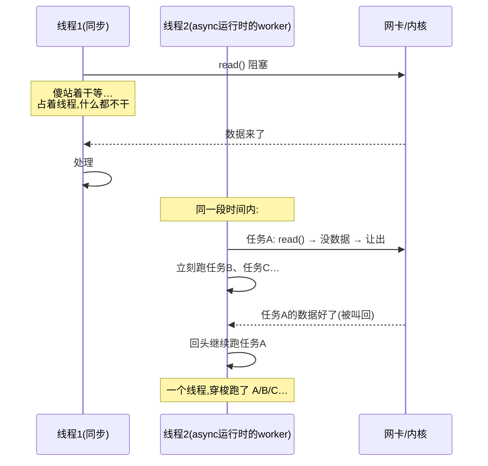

# 第 1 章 · 第一性原理:为什么需要异步运行时

> **核心问题**:为什么需要"异步运行时"这东西?我们写普通的同步 `fn main()` 也能跑啊,凭什么 async Rust 非得配一个 tokio?它到底解决了什么"不解决就撑不住"的问题?
>
> 这一章我们不碰任何调度器细节、不读 task 内部。只问一件事:**"一个请求开一个线程"的同步阻塞模型,到底卡在哪?async 怎么把这道坎迈过去?迈过去之后,为什么还非得有一个叫"运行时"的东西兜着?**
>
> **读完本章你会明白**:
> - 为什么"一个连接一个线程"的模型,在万级并发时就崩——线程本身有多贵。
> - async/await 的核心贡献不是"快",而是**把"等待"从"占用一个线程"里解放出来**。
> - 但解放出来的任务不会自己跑,它需要三件东西兜底:**scheduler(让就绪的跑)、reactor(I/O 好了叫它)、timer(到点了叫它)**。这三件套合起来,就是"运行时"。
> - 为什么 Rust 把 async 做成语言特性、却把运行时留给库(tokio)——这个分工的精妙。
> - 以及一个贯穿全书的伏笔:tokio 用**协作式调度**(任务自己让出线程),这跟 OS 的抢占式调度是两回事,它直接决定了后面 task/budget/await 的一切设计。

---

## 章首·一句话点破

> **运行时存在的全部理由,是让极少的 OS 线程,能驱动海量的并发任务——办法是把"等待"从"占用线程"里解放出来。**

这是**结论**。这一章我们倒过来,从"没有运行时"的同步世界看起,一节一节拆:它卡在哪、async 怎么解、解完为什么还差一个运行时。

全书用一个比喻贯穿:**餐厅服务员**。少数服务员(线程)服务海量订单(任务);某桌在等菜(等 I/O)时服务员不傻站、转头服务别桌(await 让出);厨房喊"3 号菜好了"(reactor 唤醒),服务员再回来。这一章先把餐厅开起来。

---

## 一、先看清"同步阻塞"的世界:一桌配一个服务员

要理解为什么需要异步运行时,得先看清"没有它"是什么处境。

最朴素的网络服务模型,叫 **thread-per-connection(一个连接一个线程)**:每来一个客户端,主线程 `accept` 拿到连接,新开一个 OS 线程去伺候它——在那个线程里读数据、处理、写回去。

> **比喻**:这是"**一桌配一个专属服务员**"的餐厅。服务员全程盯着自己那桌:客人慢慢看菜单,服务员在旁边等;厨房做菜,服务员在传菜口等。客人不喊他,他就傻站着,绝不转头去服务别桌。

代码极其简单直白,并发小的时候也毫无问题。可一旦并发上万,这套模型就崩了。崩在三个地方:

### 崩点一:线程本身贵得离谱(内存)

很多人以为"线程很轻"。**相对于进程,它确实轻;但相对于"海量并发"所需的数量,它重得吓人。**

每个 OS 线程要预留一块**栈空间**,Linux 默认 8MB(哪怕用不到也占着虚拟地址空间,实际驻留几 MB)。一万个线程,光栈就是**几十 GB**——机器还没开始干活,内存先被栈撑爆。

> **不这样会怎样**:你想扛 10 万并发,就得开 10 万线程。10 万 × 8MB = 800GB 栈。物理上不存在这么大内存的服务器。**模型在数量级上就输了。**

### 崩点二:上下文切换贵(CPU)

OS 调度器要在这一万个线程之间来回切换。每次切换:保存/恢复寄存器、切换内核栈、刷 TLB、CPU cache 大量失效。线程越多,切换越频繁,**CPU 大量时间耗在"切来切去"而不是"干活"上**(cache 颠簸,thrashing)。

> **不这样会怎样**:你加再多的核也没用——核都在做上下文切换,真正跑业务的吞吐反而下降。这是"线程太多"特有的性能塌方。

### 崩点三:阻塞 = 纯浪费

最要命的是这一条。在那套模型里,线程**绝大部分时间在阻塞等待**——等数据从网卡到内核、等内核把数据拷到用户态、等对端回包。

> **实测规律**:一个典型 I/O 密集的任务,线程 99% 的时间在 `read`/`write` 上阻塞,只有 1% 的时间在真正算东西。

翻译成餐厅:**一万个服务员,九千九百个在傻站着等菜,只有一百个在真上菜。** 你花了建一万个线程的代价(内存 + 切换),换来的却是一万个"绝大多数时间在等"的执行体。**资源的投入和产出严重不成比例。**

### 小结:三个崩点,指向同一个缺口

| 崩点 | 缺的是什么 |
|------|-----------|
| 线程贵(8MB 栈) | 一个能**廉价到开十万级别**的执行单元 |
| 切换贵 | 一个**切换成本极低**的执行单元 |
| 阻塞=浪费 | 一种让"等待中的执行体"**不占着线程**的机制 |

三个缺口,合起来指向同一个需求:**我们需要一种比 OS 线程轻得多、切换便宜得多、而且"等待时不占线程"的并发单元。** 这,就是 async 任务。而"让海量 async 任务在一小组线程上跑起来"的那套机制,就是**运行时**。

> 这就是为什么 1990 年代末到 2000 年代初,整个工业界被 **C10K 问题**(一台机器扛不住一万个并发连接)折磨了好几年——thread-per-connection 模型触到了天花板。最终解开它的,正是事件驱动 / 异步这套思路。tokio,是这套思路在 Rust 里的集大成者。

---

## 二、async 的第一刀:把"等待"从"占用"里解放

理解了同步模型卡在"等待 = 占用线程",async 的核心贡献就一目了然了:

> **async/await 让一个任务在"等待"时(遇到 await),主动把线程让出来,让线程去跑别的任务;等它等的那个东西就绪了,再回来继续。**

> **比喻回到餐厅**:服务员不再专属一桌。客人说"我看会儿菜单"(等 I/O),服务员**不傻站**,立刻转头去服务 2 号桌;厨房喊"3 号桌菜好了",服务员再回去给 3 号桌上菜。**一个服务员,穿梭服务几十桌。**

这一刀切下去,前面的三个崩点全解了:

- **不占线程 → 线程可以很少**:一万个任务在等,它们都不占线程,真正在"跑"的就那几个。你只需要**和 CPU 核数相当的少量 worker 线程**(比如 8 核机器开 8 个),就能驱动**几十万**个并发任务。
- **任务本身极轻**:一个 async 任务(后面会讲它本质是个状态机 + 一小块堆内存)只有几百字节到几 KB,十万级任务也就 GB 量级内存。**比线程的 8MB 栈轻了两三个数量级。**
- **切换极便宜**:任务在 await 点"让出",本质是函数返回 + 把"下次从哪继续"记下来;再跑时是函数再被调用一次。**没有 OS 线程切换的内核陷入、没有 TLB 刷新,就是普通的函数调用。**

> **钉死这件事**:async 不是"让代码跑得更快",而是"**让等待不再占用一个昂贵的线程**"。它的红利全在"用极少线程扛极大并发"这一件事上。如果你的任务根本不等待(纯 CPU 计算),async 帮不了你,反而有额外开销——这时你该用的是线程池,不是 async。

### 一张图看清"同步阻塞" vs "async 让出"



左边:一个线程死等一个 I/O,全程占着线程却没干活。右边:同一个线程在任务 A 等 I/O 时立刻去跑 B、C,I/O 好了再回来接 A。**这就是"把等待从占用里解放"的全部含义。**

---

## 三、但 async 自己不会跑——运行时登场

如果你以为"用了 async/await,并发就自动起飞了",那正好掉进 async Rust 最大的坑:

> **一个 async 函数,你调用它,得到的只是一个 `Future`(一个"承诺将来会有结果"的对象)——它一行代码都还没执行。** Future 必须有人去**驱动(poll)**它,才会真正跑起来;而且它在 await 点挂起后,**谁负责在"它等的东西就绪时"把它叫回来?**

这背后有三件没人管、却必须有人管的脏活:

1. **谁决定"下一个跑哪个任务"?** ——成千上万个任务,有的就绪、有的在等,总得有个排队和调度的。
2. **任务在等一个 socket 的数据,数据来了,谁去通知"你可以继续了"?** ——总不能靠任务自己瞎猜,得有人盯着所有 I/O。
3. **任务 `sleep(5秒)`,谁负责 5 秒后把它叫醒?** ——得有人管时间。

**async 语言特性(Future trait + async/await)一件都不管这三件事。** 它只负责"把异步代码编译成可让出的状态机"。这三件脏活,需要一个兜底的——它叫**运行时(runtime)**。

### 运行时的三件套

一个完整的异步运行时,由三个部件组成,正好对应上面三件脏活:

| 部件 | 干的活 | 餐厅比喻 |
|------|--------|----------|
| **scheduler(调度器)** | 维护就绪任务队列,决定 worker 线程下一个 poll 谁;任务让出→重新就绪→重新排队 | 餐厅经理:分配服务员接哪个订单 |
| **reactor(I/O 驱动)** | 盯着所有 socket(底层用 epoll/kqueue),哪个有数据了,把等它的任务标记就绪、交回 scheduler | 厨房叫号系统:"3 号菜好了" |
| **timer(定时器)** | 盯着所有 sleep/超时,到点了把对应任务标记就绪 | 催单闹钟:"5 号桌该上了" |

> **钉死这件事**:运行时 = scheduler + reactor + timer(外加把它们串起来的循环、park/unpark 让线程睡眠唤醒)。**tokio,就是这套三件套在 Rust 里最成熟的实现。** 后面整本书,都是在拆这三件套怎么各司其职、又怎么协作。

### 这三件套,在源码里就组装在一个 `Runtime` 里

这不是抽象的画饼,它在 tokio 源码里写得明明白白。看 `Runtime` 这个结构体的定义:

```rust
pub struct Runtime {
    kind: Kind,
   handles: Handles,
}
```

([tokio/src/runtime/runtime.rs:97](../tokio/tokio/src/runtime/runtime.rs#L97))

`Runtime` 内部(`Kind` / `Handles`)就持有调度器句柄、以及一个**驱动(driver)**——reactor 和 timer 共用的那个事件循环。`Runtime` 就是"把三件套打包成一个对象"。两个最常用的入口:

- **`spawn`**:把一个 Future 包成 task,塞进调度器。

  ```rust
  pub fn spawn<F>(&self, future: F) -> JoinHandle<F::Output>
  ```

  ([tokio/src/runtime/runtime.rs:239](../tokio/tokio/src/runtime/runtime.rs#L239))

- **`block_on`**:在**当前线程**上跑一个 Future,驱动整个循环(调度 + reactor + timer),直到它完成。这是运行时的"发令枪"。

  ```rust
  pub fn block_on<F: Future>(&self, future: F) -> F::Output
  ```

  ([tokio/src/runtime/runtime.rs:340](../tokio/tokio/src/runtime/runtime.rs#L340))

> 你平时写的 `#[tokio::main]`,展开后就是 `block_on`,它在主线程上把运行时跑起来。**没有这一步,你的 async 代码一行都不会执行。** 这就是为什么 async Rust 必须配一个运行时——不是 tokio 摆谱,是 async 语言特性本身把"驱动"这件事甩给了库。

---

## 四、为什么 async 是语言特性,运行时却是库?

读到这里你可能奇怪:既然 async 离不开运行时,为什么 Rust 不把运行时也做进语言/标准库,非要让用户自己 `cargo add tokio`?

这是个**极其精妙的设计决策**,值得专门讲清楚:

> **Rust 把"怎么写出可让出的异步代码"做成语言特性(async/await + Future),却把"怎么调度、怎么等 I/O、怎么管时间"留给库。**

为什么这么切?因为**不同场景,需要截然不同的运行时**:

- **服务器**(tokio):多核、海量并发、要 work-stealing,运行时可以"重"。
- **嵌入式 no_std**:没有 OS、没有 epoll、内存抠到 KB,要一个极简运行时。
- **单线程小程序**:不需要多核调度,要一个轻量运行时。

如果语言绑死一个运行时,就没法适配这些天差地别的场景。Rust 选择**只定一个最小契约(Future trait:你必须实现 `poll`)**,把上面那三件套的实现权交给生态。于是有了 tokio(重型,服务器事实标准)、async-std、smol、embassy(嵌入式)等百花齐放。

> **一个推论**:你写的 `async fn` 是**运行时无关**的(只要它返回 Future、用标准的 await)。同一个 async 函数,可以跑在 tokio 上,也可以跑在别的运行时上。**语言层管"可移植的异步语义",库层管"具体怎么跑"。** 这个解耦,是 Rust async 设计最漂亮的一笔。

---

## 技巧精解:协作式调度——任务"自己"让出,而非被"抢"

本章是概念章,但我们已经撞上了全书最重要的一个机制选择,值得提前点透:**tokio 的调度是"协作式"的,不是 OS 那种"抢占式"的。** 这个选择,决定了后面 task、budget、await 的几乎一切设计。

### 抢占式 vs 协作式

- **OS 线程是抢占式(preemptive)调度**:内核靠时钟中断,每隔几毫秒强制把 CPU 从一个线程抢走、给另一个。一个线程哪怕死循环,也跑不久就被切走,**别的线程饿不死**。
- **tokio 的 async 任务是协作式(cooperative)调度**:**任务不在 await 点主动让出,谁也抢不走它。** 调度器没有"时钟中断"去打断一个正在 poll 的任务——因为它跑在普通的用户态函数调用里,没有那个抢占机制。

> **不这样会怎样(反面)**:如果 tokio 想做成抢占式,它就得给每个任务配一个真正的 OS 线程(才能被时钟中断抢)——那 async "用极少线程"的全部意义就没了,等于回到 thread-per-connection。**协作式,是 async 能"轻"的代价,也是它的命门。**

### 这个选择的直接后果:任务必须"自觉"

协作式的命门在于:**一个任务如果不自觉让出(比如在 await 之间夹一个死循环或超长 CPU 计算),它就独占整个 worker 线程,把同线程上所有任务饿死。**

tokio 怎么治这个?它发明了 **budget(预算)机制**(第 9 章细讲):每个任务默认给一定次数的"_poll 配额"(量级是 128),poll 一次扣一点,扣光就强制让出。这是"协作式里塞一点软抢占"——任务还是自己让出,但 tokio 用 budget 逼它"别太贪"。

> **钉死这件事**:tokio 是协作式调度——任务在 await 让出,调度器不能强行打断一个正在跑的任务。这逼出了两个贯穿全书的设计:① 任务必须设计成"经常 await"(否则饿死别人);② budget 机制兜底,防止单个任务霸占线程。**记住这个,你就理解了为什么后面 task 状态、budget、`yield_now` 长那样。**

---

## 章末小结

### 用"餐厅服务员"比喻回顾本章

这一章我们做了一件纯粹的事:**搞清楚"异步运行时"为什么非存在不可。**

答案从同步模型的三个崩点里长出来:

1. **一桌一个服务员(thread-per-connection)**:线程贵(8MB 栈)、切换贵、阻塞时纯浪费。万级并发就崩(C10K)。
2. **async 的第一刀**:让任务在 await 点**把线程让出来**,等待不再占用线程。于是**极少的线程**(和核数相当)就能驱动**海量的任务**(几十万),且任务本身轻、切换便宜。
3. **但 async 自己不跑**,得有人兜底三件脏活:**scheduler(让就绪的跑)、reactor(I/O 好了叫它)、timer(到点叫它)**。这三件套合起来 = 运行时。tokio 就是它最成熟的实现,源码里就组装在一个 `Runtime` 结构里。
4. 而 Rust 把 async 做成语言特性、运行时留给库,是为了让**同一套异步语义**能适配服务器/嵌入式等天差地别的场景。

### 本章在全书主线中的位置

记住全书的二分法:**调度执行(让就绪的任务跑) vs 事件唤醒(让等待的任务不空耗、就绪了再叫)**。

这一章,我们把这条主线**从根上立住了**:

- **scheduler** 是"调度执行"那一面的主角(第 2 篇);
- **reactor / timer** 是"事件唤醒"那一面的主角(第 3、4 篇);
- 而**协作式调度**这个根本选择,是横贯全书的地基——后面 task 怎么设计、budget 为什么存在,都从它来。

后面每一章,你要做的只是不断回到这个二分法,问一句:"这章讲的机制,是在**让就绪的跑**,还是在**让等待的被叫醒**?"

### 五个"为什么"清单

1. **为什么需要异步运行时**:同步的 thread-per-connection 模型,线程贵、切换贵、阻塞时纯浪费,万级并发就崩(C10K)。
2. **async 解决了什么**:把"等待"从"占用线程"解放——任务在 await 让出,极少线程驱动海量任务,任务本身轻、切换便宜。
3. **运行时到底干什么**:兜底三件脏活——scheduler(调度)、reactor(I/O 唤醒)、timer(定时唤醒)。三件套缺一不可。
4. **为什么 async 是语言特性、运行时是库**:让同一套异步语义适配服务器/嵌入式等不同场景;语言定最小契约(Future),库管具体实现。
5. **协作式调度意味着什么**:任务不在 await 让出就没人抢得走——所以任务必须自觉让出,budget 机制兜底防霸占。这是 tokio 能"轻"的代价。

### 想继续深入,该往哪钻

- **看 `Runtime` 怎么组装三件套**:[tokio/src/runtime/runtime.rs](../tokio/tokio/src/runtime/runtime.rs#L97) 的 `Runtime` 结构,以及 `block_on`(L340)怎么把循环跑起来。
- **亲手感受"Future 不 poll 就不跑"**:写个 `async fn hello() { println!("hi"); }`,在 `fn main()` 里直接调 `hello();`——你会发现"hi"根本不打印。只有把它 `spawn` 或 `block_on` 进运行时,才执行。这一下就理解了"运行时是发令枪"。
- **下一站**:既然运行时靠"反复 poll 任务"来驱动,那"poll"到底是什么?一个 async 函数,编译器到底把它变成了什么?翻开 **第 2 章 · Future 与 poll 模型:为什么异步是"状态机 + 轮询"**——我们从被调度的对象(task 的内核 Future)看起。

---

> 运行时为什么存在,讲清楚了:把等待从占用里解放,再用 scheduler + reactor + timer 三件套兜住。可这一切的运转,都建立在"反复 poll 一个 Future"之上——那 `Future::poll` 到底是什么?一个 `async fn` 又是怎么变成可以被反复 poll 的东西的?翻开 **第 2 章 · Future 与 poll 模型:为什么异步是"状态机 + 轮询"**。
